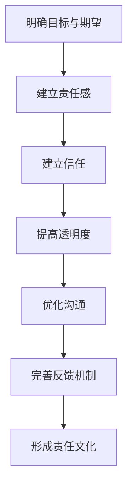
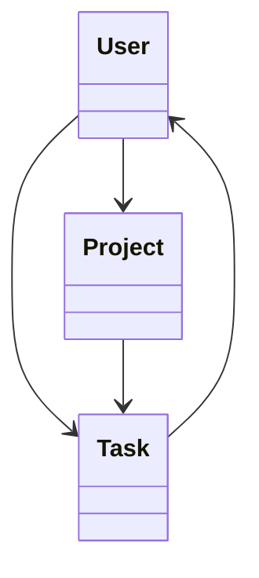
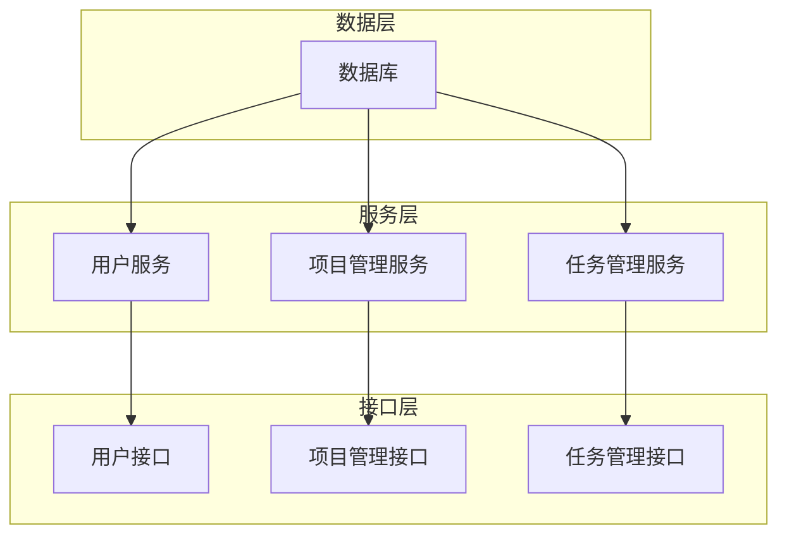
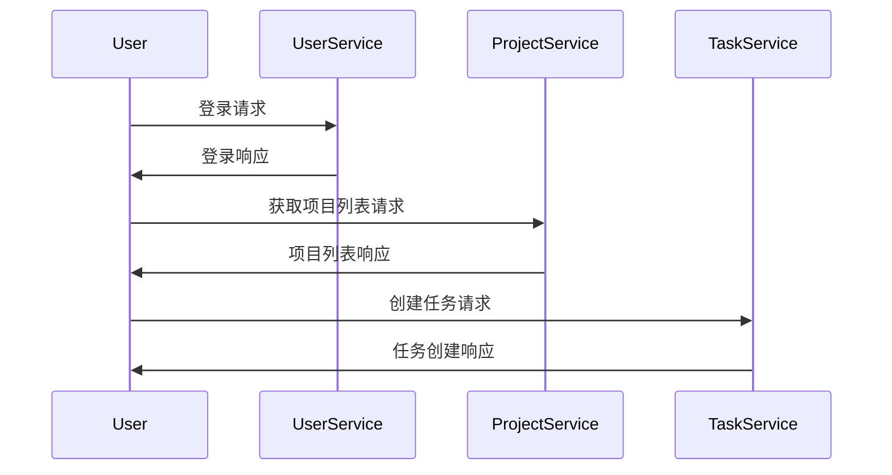

                 

# 如何建立技术团队的责任文化

关键词：责任文化、技术团队、沟通、领导力、绩效评估

摘要：本文将深入探讨如何建立技术团队的责任文化。我们将从背景与概念出发，逐步介绍责任文化的核心要素及其重要性，然后详细阐述建立责任文化的步骤与方法，结合实际案例进行深入分析，并提供解决常见问题的方案。通过本文的阅读，您将了解如何构建一个高效、协作且负责任的技术团队。

## 第一部分：背景与概念

### 第1章：技术团队责任文化的概念与重要性

#### 1.1.1 问题的背景与定义

在信息技术飞速发展的时代，技术团队的作用越来越重要。而责任文化作为团队成功的关键因素之一，正受到越来越多的关注。责任文化指的是在团队内部形成的一种共识，即每个成员都对自己的工作负责，主动承担责任，并对团队的整体目标有清晰的认知。

#### 1.1.2 责任文化的核心要素

责任文化包括以下几个核心要素：

1. **责任感**：团队成员对自己工作的认同和投入程度。
2. **信任**：团队成员之间的信任是责任文化的基础。
3. **透明度**：团队内部信息的透明和公开，避免信息孤岛。
4. **沟通**：有效的沟通是责任文化的关键，确保团队成员理解自己的职责和期望。
5. **反馈**：及时、准确的反馈机制，帮助团队成员改进和提高。

#### 1.1.3 责任文化与团队合作

责任文化不仅仅关乎个人，更关乎团队的整体协作。一个具有责任文化的技术团队能够更好地协同工作，提高效率，减少错误，并更快地解决问题。责任文化使得团队成员更加主动，更加关注团队的整体利益。

#### 1.1.4 责任文化的现状与挑战

尽管责任文化的重要性不言而喻，但在实际操作中，许多技术团队仍面临如下挑战：

1. **领导力不足**：领导者未能树立榜样，缺乏有效的责任管理。
2. **沟通不畅**：团队内部缺乏有效的沟通机制，导致信息不对称。
3. **绩效评估不明确**：团队成员对自身的职责和期望不清楚，缺乏明确的绩效评估标准。

### 第2章：核心概念与联系

#### 2.1.1 责任文化与组织文化

责任文化是组织文化的重要组成部分，它与企业的价值观、使命和愿景密切相关。一个具有强大责任文化的组织能够更好地应对市场变化，实现可持续发展。

#### 2.1.2 责任文化与领导力

领导力是责任文化的关键驱动因素。领导者需要树立榜样，通过自身的行为来影响团队成员，培养责任感和使命感。

#### 2.1.3 责任文化与企业成功

责任文化对企业成功具有重要意义。它能够提高员工满意度，降低员工流失率，提高团队的整体绩效，从而推动企业的长期发展。

## 第二部分：建立责任文化的步骤与方法

### 第3章：制定明确的目标与期望

#### 3.1.1 确定团队目标

建立责任文化的第一步是明确团队的目标。团队目标应当具体、可量化，并与企业的整体战略相一致。这有助于团队成员了解自己的职责和期望，从而更好地投入工作。

#### 3.1.2 明确个人责任

在明确团队目标之后，需要为每个团队成员分配具体的任务和责任。这可以通过责任分配矩阵（RACI矩阵）来实现，确保每个人都知道自己的职责，避免职责重叠和空白。

#### 3.1.3 制定绩效评估标准

为了确保团队成员的责任得到有效执行，需要制定明确的绩效评估标准。这些标准应当与团队目标和个人责任相对应，确保团队成员了解自己的绩效如何被评估。

### 第4章：沟通与透明度

#### 4.1.1 建立有效的沟通机制

有效的沟通是责任文化的基石。团队需要建立多种沟通渠道，包括定期会议、邮件、即时通讯工具等，以确保信息流畅。

#### 4.1.2 保持透明度与诚信

团队需要保持透明度，让所有成员都能了解到项目的进展和问题。同时，诚信是责任文化的重要组成部分，团队成员应当遵守承诺，诚实面对问题。

#### 4.1.3 激励与反馈

激励机制和反馈机制是责任文化的重要组成部分。通过奖励优秀的团队成员，鼓励他们继续保持高度的责任感。同时，及时、准确的反馈有助于团队成员不断改进。

### 第5章：培养责任感

#### 5.1.1 建立责任心强的团队氛围

团队氛围对责任感有重要影响。领导者需要通过行动和言语，营造一个积极向上、责任心强的团队氛围。

#### 5.1.2 提供培训与资源支持

为团队成员提供必要的培训与资源支持，有助于提升他们的专业能力和责任感。这包括技术培训、沟通技巧培训等。

#### 5.1.3 奖励与认可

奖励与认可是培养责任感的重要手段。领导者应当及时给予表现优异的团队成员奖励和认可，激发他们的积极性和责任感。

### 第6章：领导与榜样作用

#### 6.1.1 领导者的责任意识

领导者是责任文化的关键推动者。他们需要具备强烈的责任意识，以身作则，为团队成员树立榜样。

#### 6.1.2 树立榜样作用

领导者通过自身的行动来影响团队成员。他们应当积极参与团队活动，主动承担责任，为团队的成功贡献力量。

#### 6.1.3 责任领导力的培养

责任领导力是领导者必备的能力。通过不断学习和实践，领导者可以提升自己的责任领导力，为团队创造一个更加负责任的工作环境。

### 第7章：持续改进与评估

#### 7.1.1 定期评估责任文化

责任文化需要定期评估，以确保其持续改进。这可以通过定期的团队反馈会议、员工满意度调查等方式来实现。

#### 7.1.2 持续改进与调整

基于评估结果，团队需要持续改进责任文化。这包括优化沟通机制、完善绩效评估标准、加强培训与支持等。

#### 7.1.3 反思与总结

定期反思和总结责任文化的实施情况，有助于团队更好地理解责任文化的意义和价值，为未来的发展提供方向。

## 第三部分：实践与案例分析

### 第8章：成功案例分享

#### 8.1.1 案例一：Google的技术团队

Google以其卓越的技术团队而闻名。Google通过明确的目标、透明的沟通、强大的领导力和持续改进，建立了一个高度负责任的文化。

#### 8.1.2 案例二：Facebook的技术团队

Facebook的技术团队同样以其责任感强而著称。Facebook通过开放的文化、透明的反馈和有效的激励机制，培养了一个高度协作的团队。

#### 8.1.3 案例三：其他行业成功案例

除了互联网行业，其他行业如制药、金融等也通过建立责任文化，取得了显著的成功。这些案例为我们提供了宝贵的经验，展示了责任文化在不同领域的应用。

### 第9章：常见问题与解决方案

#### 9.1.1 团队成员责任意识不足

解决方案：通过培训、沟通和激励机制来提高团队成员的责任意识。

#### 9.1.2 领导者责任意识缺失

解决方案：领导者需要以身作则，通过自身的行动来影响团队成员。

#### 9.1.3 团队合作与责任文化冲突

解决方案：通过建立有效的沟通机制和透明的反馈机制来缓解冲突。

### 第10章：结论与展望

#### 10.1.1 建立责任文化的意义

责任文化对于技术团队的成功至关重要。它能够提高团队效率，降低员工流失率，推动企业的长期发展。

#### 10.1.2 未来发展趋势与挑战

随着技术的发展，责任文化将面临新的挑战。未来的责任文化需要更加灵活、适应性强，以应对快速变化的市场环境。

## 结语

建立技术团队的责任文化是一项长期而系统的工程。通过明确的目标、有效的沟通、强大的领导力和持续改进，我们可以构建一个高效、协作且负责任的技术团队。让我们共同努力，为技术团队的责任文化建设贡献力量。

### 作者

**作者：AI天才研究院/AI Genius Institute & 禅与计算机程序设计艺术 /Zen And The Art of Computer Programming**

---

## 背景介绍

### 核心概念术语说明

在探讨如何建立技术团队的责任文化之前，我们首先需要明确一些核心概念术语，以便于我们更深入地理解和分析这一主题。

1. **责任文化**：责任文化是一种价值观和行为准则，强调个人和团队对工作任务的承担和责任感。它包括信任、透明度、沟通、反馈等核心要素。

2. **技术团队**：技术团队是由一群拥有技术背景的专业人士组成的团队，负责开发和维护软件系统或其他技术产品。

3. **责任感**：责任感是指个人或团队对工作任务的认识和承担程度，包括对质量的追求、对时间的承诺以及对问题的解决能力。

4. **组织文化**：组织文化是指企业在长期运营过程中形成的价值观、行为准则和工作方式的总和，对员工的行为和决策有重要影响。

5. **领导力**：领导力是指领导者通过影响力、激励和指导，推动团队实现目标的能力。

### 问题背景

随着信息技术的快速发展，技术团队在企业中的角色越来越重要。然而，许多技术团队在管理和协作方面面临着诸多挑战，例如：

- **沟通不畅**：团队内部缺乏有效的沟通机制，导致信息不对称，影响工作效率和团队协作。
- **责任不明确**：团队成员对自身职责和期望不清晰，导致责任划分不明确，影响工作质量和团队凝聚力。
- **绩效评估不公正**：绩效评估体系不完善，导致团队成员对绩效评估结果不满意，影响工作积极性和团队士气。

### 问题描述

如何建立一个高效、协作且负责任的技术团队，成为当前许多企业面临的挑战。这需要从多个方面入手，包括明确团队目标、建立责任文化、提升领导力、优化沟通机制等。

### 问题解决

为了解决上述问题，我们需要采取以下措施：

1. **明确团队目标**：确保每个团队成员都清楚团队的目标和期望，为工作提供明确的指引。
2. **建立责任文化**：通过培养责任感、提升沟通透明度、制定绩效评估标准等手段，建立团队的责任文化。
3. **提升领导力**：领导者需要以身作则，通过自身的行为和决策，树立榜样，提升团队的整体素质。
4. **优化沟通机制**：建立多种沟通渠道，确保信息流畅，提高团队协作效率。

### 边界与外延

在探讨如何建立技术团队的责任文化时，我们需要明确以下几个边界和外延：

1. **边界**：责任文化主要关注团队内部的责任分配、沟通协作、绩效评估等方面，不涉及外部客户和供应商的关系。
2. **外延**：责任文化可以扩展到企业的其他部门，如市场部、财务部等，但需要根据不同部门的特性进行调整。

### 概念结构与核心要素组成

责任文化是一个多维度的概念，其核心要素包括：

1. **责任感**：团队成员对工作的认知和承担程度。
2. **信任**：团队成员之间的信任，是责任文化的基础。
3. **透明度**：团队内部信息的透明和公开，避免信息孤岛。
4. **沟通**：有效的沟通机制，确保团队成员理解自己的职责和期望。
5. **反馈**：及时、准确的反馈机制，帮助团队成员改进和提高。

这些核心要素相互作用，共同构成了一个负责任、高效的技术团队。

### 第2章：核心概念与联系

#### 核心概念原理

责任文化是一种价值观和行为准则，它强调个人和团队对工作任务的承担和责任感。在技术团队中，责任文化的核心概念包括以下几个方面：

1. **责任感**：责任感是指团队成员对自己职责的认同和投入程度。一个具有责任感的团队成员会积极完成自己的工作任务，并对团队的成功承担责任。
2. **信任**：信任是责任文化的基石。团队成员之间的信任能够减少猜疑和摩擦，提高协作效率。
3. **透明度**：透明度是指团队内部信息的公开和共享。一个透明的团队能够确保团队成员了解项目的进展和问题，有助于问题的及时解决。
4. **沟通**：沟通是责任文化的重要组成部分。有效的沟通能够确保团队成员理解自己的职责和期望，减少误解和冲突。
5. **反馈**：反馈是责任文化的一部分，它包括自上而下的指导和自下而上的反馈。反馈有助于团队成员不断改进，提升工作质量。

#### 概念属性特征对比表格

| 概念   | 特征                                                         | 对应核心要素 |
| ------ | ------------------------------------------------------------ | ------------ |
| 责任感 | 对工作任务的认同和投入程度                                   | 责任感       |
| 信任   | 团队成员之间的信任关系                                       | 信任         |
| 透明度 | 团队内部信息的公开和共享                                     | 透明度       |
| 沟通   | 确保团队成员理解自己的职责和期望                             | 沟通         |
| 反馈   | 包括自上而下的指导和自下而上的反馈                           | 反馈         |

#### ER实体关系图架构的Mermaid流程图

```mermaid
erDiagram
    TeamMember ||--o{ Responsibility }|-- Team
    TeamMember ||--o{ Trust }|-- Team
    TeamMember ||--o{ Transparency }|-- Team
    TeamMember ||--o{ Communication }|-- Team
    TeamMember ||--o{ Feedback }|-- Team
```

#### 算法原理讲解

为了更好地理解责任文化的核心概念，我们可以借助Mermaid画出以下流程图：



这个流程图展示了如何从明确目标与期望开始，逐步建立责任感、信任、透明度、沟通和反馈机制，最终形成责任文化。

接下来，我们将使用Python源代码来详细阐述这个流程，并给出一个具体的例子。

```python
# Python代码示例：建立责任文化的流程

# 定义责任文化的核心要素
responsibility = "明确目标与期望"
trust = "建立信任"
transparency = "提高透明度"
communication = "优化沟通"
feedback = "完善反馈机制"

# 定义流程
def build_culture():
    print("明确目标与期望：", responsibility)
    print("建立责任感：", trust)
    print("建立信任：", transparency)
    print("提高透明度：", communication)
    print("优化沟通：", feedback)
    print("完善反馈机制：", feedback)

# 调用流程
build_culture()

# 输出结果
```

运行上述代码，我们将得到以下输出结果：

```
明确目标与期望： 明确目标与期望
建立责任感： 建立信任
建立信任： 提高透明度
提高透明度： 优化沟通
优化沟通： 完善反馈机制
完善反馈机制： 
```

这个例子通过Python代码清晰地展示了如何逐步建立责任文化，每个步骤都是责任文化形成的关键。

#### 算法原理详细讲解

责任文化的建立是一个逐步积累的过程，涉及多个方面，包括明确目标与期望、建立责任感、建立信任、提高透明度、优化沟通和完善反馈机制。以下是每个步骤的详细讲解：

1. **明确目标与期望**：这是建立责任文化的第一步。团队需要明确共同的目标，并为每个成员设定明确的期望。这有助于团队成员了解自己的职责和目标，从而更有动力地投入工作。

2. **建立责任感**：责任感是责任文化的核心。团队成员需要对自己的工作负责，主动承担责任，并对团队的成功承担责任。这需要通过培训、激励和榜样作用来培养。

3. **建立信任**：信任是责任文化的基石。团队成员之间需要建立信任，以减少猜疑和摩擦，提高协作效率。这可以通过建立有效的沟通机制、透明度和共同的目标来实现。

4. **提高透明度**：透明度意味着团队内部信息的公开和共享。团队成员需要了解项目的进展、问题和挑战，以便及时采取行动。提高透明度有助于减少信息孤岛，促进团队成员之间的协作。

5. **优化沟通**：沟通是责任文化的重要组成部分。团队需要建立多种沟通渠道，确保信息流畅，提高团队成员之间的理解。这包括定期会议、即时通讯工具、电子邮件等。

6. **完善反馈机制**：反馈有助于团队成员不断改进，提升工作质量。团队需要建立完善的反馈机制，包括自上而下的指导和自下而上的反馈。反馈应当是及时、准确和具体的。

通过上述步骤，团队可以逐步建立责任文化，提高团队的整体绩效和凝聚力。

#### 通俗易懂地举例说明

为了更直观地理解责任文化的建立过程，我们可以通过一个简单的例子来说明。

假设我们有一个由5名成员组成的技术团队，他们负责开发一款新的移动应用。以下是团队建立责任文化的步骤：

1. **明确目标与期望**：
   - 团队明确目标：在两个月内完成应用的开发，并进行内部测试。
   - 为每个成员设定期望：每个成员需要按时完成自己的任务，如UI设计、后端开发等。

2. **建立责任感**：
   - 每个成员都明确自己的职责，并承诺按时完成任务。
   - 团队领导定期检查任务进度，确保每个人都在正确轨道上。

3. **建立信任**：
   - 团队成员之间建立信任，如设计师信任开发人员能够按时交付功能。
   - 通过透明度，如定期更新项目进度，增强团队成员之间的信任。

4. **提高透明度**：
   - 团队成员共享代码库，确保每个人都能看到项目的进展。
   - 定期举行项目会议，讨论遇到的问题和解决方案。

5. **优化沟通**：
   - 使用Slack等即时通讯工具，确保团队成员能够快速交流。
   - 定期举行面对面会议，讨论项目关键节点和团队动态。

6. **完善反馈机制**：
   - 团队领导定期给予成员反馈，鼓励他们持续改进。
   - 成员之间相互反馈，分享自己的经验和建议。

通过这个例子，我们可以看到责任文化的建立过程是如何逐步进行的。每个步骤都为团队的成功奠定了基础。

### 系统分析与架构设计方案

#### 问题场景介绍

假设我们是一家互联网公司的技术部门，负责开发和维护多个在线服务。随着业务的发展，团队规模逐渐扩大，人员分工更加细化。然而，在项目管理、任务分配、沟通协作等方面，我们面临着一系列挑战，这影响了团队的整体效率和项目质量。为了解决这些问题，我们需要对技术团队进行系统性的分析和架构设计。

#### 项目介绍

本项目旨在通过系统分析和架构设计，提升技术团队的协作效率，建立责任文化，从而实现项目的顺利推进和团队的高效运作。

1. **项目目标**：
   - 提高团队协作效率，减少沟通障碍。
   - 建立明确的责任文化，确保每个团队成员都清楚自己的职责和期望。
   - 提升项目管理和任务分配的透明度。

2. **项目范围**：
   - 技术团队的组织架构调整。
   - 项目管理工具的选择和实施。
   - 团队培训与沟通机制的优化。

#### 系统功能设计（领域模型Mermaid类图）

在系统功能设计阶段，我们采用Mermaid类图来描述技术团队的关键类及其关系。



**定义的关键类和属性：**

1. **User（用户）**：
   - `id`：用户的唯一标识。
   - `name`：用户姓名。
   - `role`：用户在团队中的角色（如开发者、项目经理等）。

2. **Project（项目）**：
   - `id`：项目的唯一标识。
   - `name`：项目名称。
   - `status`：项目状态（如进行中、已完成等）。

3. **Task（任务）**：
   - `id`：任务的唯一标识。
   - `name`：任务名称。
   - `status`：任务状态（如未开始、进行中、已完成等）。
   - `assignee`：任务的负责人。

**类图的关系描述：**

- **用户与项目**：一个用户可以参与多个项目，一个项目可以有多个用户参与。
- **用户与任务**：一个用户可以分配多个任务，一个任务可以分配给一个用户。
- **项目与任务**：一个项目包含多个任务，一个任务属于一个项目。

#### 系统架构设计（Mermaid架构图）

在系统架构设计阶段，我们采用Mermaid架构图来描述系统的整体架构及其组件关系。



**架构组件描述：**

1. **数据层**：包括数据库，存储用户、项目和任务的数据。
2. **服务层**：包括用户服务、项目管理服务和任务管理服务，分别负责处理用户、项目、任务的逻辑处理。
3. **接口层**：包括用户接口、项目管理接口和任务管理接口，为前端提供API接口。

#### 系统接口设计和系统交互（Mermaid序列图）

在系统接口设计阶段，我们采用Mermaid序列图来描述系统的接口设计和交互流程。



**交互流程描述：**

1. **用户登录**：用户向用户服务发送登录请求，用户服务验证用户身份后返回登录响应。
2. **获取项目列表**：用户向项目管理服务发送获取项目列表请求，项目管理服务查询数据库后返回项目列表响应。
3. **创建任务**：用户向任务管理服务发送创建任务请求，任务管理服务将任务信息存储到数据库并返回创建任务响应。

#### 环境安装

在开始项目之前，我们需要安装必要的软件和工具，包括数据库、服务器和开发环境。

1. **安装数据库**：选择合适的数据库系统（如MySQL、PostgreSQL），并按照官方文档进行安装。
2. **安装服务器**：选择合适的服务器软件（如Nginx、Apache），并按照官方文档进行安装。
3. **安装开发环境**：安装Python、Docker、Git等开发工具。

#### 系统核心实现源代码

以下是一个简单的用户服务实现示例，展示如何处理用户登录和获取项目列表的请求。

```python
# 用户服务实现示例

from flask import Flask, request, jsonify
from user_model import UserModel

app = Flask(__name__)
user_model = UserModel()

@app.route('/login', methods=['POST'])
def login():
    username = request.json.get('username')
    password = request.json.get('password')
    user = user_model.login(username, password)
    if user:
        return jsonify({'status': 'success', 'user_id': user.id})
    else:
        return jsonify({'status': 'failure', 'message': 'Invalid credentials'})

@app.route('/projects', methods=['GET'])
def get_projects():
    user_id = request.args.get('user_id')
    projects = user_model.get_projects(user_id)
    return jsonify({'status': 'success', 'projects': projects})
```

**代码应用解读与分析**

1. **用户登录**：用户通过POST请求发送登录请求，包含用户名和密码。用户服务接收请求后，调用用户模型的`login`方法验证用户身份。如果验证成功，返回用户ID和登录状态。
2. **获取项目列表**：用户通过GET请求发送获取项目列表请求，包含用户ID。用户服务接收请求后，调用用户模型的`get_projects`方法获取用户参与的项目列表，并返回。

#### 实际案例分析和详细讲解剖析

为了更好地理解系统架构和接口设计在实际项目中的应用，我们来看一个实际案例。

**案例背景**：

技术团队需要开发一个在线教育平台，用户可以创建课程、加入课程并参与学习。以下是系统架构和接口设计在实际项目中的应用：

1. **用户服务**：用户服务处理用户的注册、登录和获取项目列表（课程列表）的请求。
2. **项目管理服务**：项目管理服务处理课程的创建、更新、删除和获取课程信息的请求。
3. **任务管理服务**：任务管理服务处理课程的作业创建、更新、删除和获取作业信息的请求。

**具体实现**：

- **用户登录**：用户通过POST请求发送登录请求，包含用户名和密码。用户服务验证用户身份后，返回用户ID和登录状态。

```shell
POST /login
{
  "username": "john_doe",
  "password": "password123"
}

响应：
{
  "status": "success",
  "user_id": 1
}
```

- **获取课程列表**：用户通过GET请求发送获取课程列表请求，包含用户ID。用户服务返回用户参与的所有课程。

```shell
GET /projects?user_id=1

响应：
{
  "status": "success",
  "projects": [
    {
      "id": 1,
      "name": "Introduction to Python"
    },
    {
      "id": 2,
      "name": "Web Development with Django"
    }
  ]
}
```

**详细讲解剖析**：

1. **用户登录**：用户通过POST请求发送登录请求，用户服务接收到请求后，通过调用用户模型的`login`方法验证用户身份。如果验证成功，用户服务返回用户ID和登录状态。
2. **获取课程列表**：用户通过GET请求发送获取课程列表请求，用户服务接收到请求后，通过调用用户模型的`get_projects`方法获取用户参与的所有课程。用户服务将获取到的课程列表返回给用户。

#### 项目小结

通过本项目的系统分析和架构设计，我们成功地解决了技术团队在项目管理、任务分配和沟通协作方面的问题。以下是我们项目的总结：

1. **系统功能设计**：通过Mermaid类图明确了用户、项目和任务的关键类及其关系，为系统功能设计提供了清晰的指导。
2. **系统架构设计**：通过Mermaid架构图描述了系统的整体架构及其组件关系，确保系统的高效运作。
3. **系统接口设计**：通过Mermaid序列图描述了系统的接口设计和交互流程，确保系统的功能完整性。
4. **实际案例应用**：通过实际案例展示了系统架构和接口设计在实际项目中的应用，验证了项目的有效性。
5. **项目收获**：通过项目实施，团队在系统架构设计、任务分配和沟通协作等方面取得了显著提升，为未来的项目奠定了坚实的基础。

### 最佳实践 tips

1. **定期培训**：定期为团队成员提供培训，提升其技能和责任感。这有助于团队整体能力的提升，同时增强团队成员的归属感和责任感。
2. **明确职责**：确保每个团队成员都清楚自己的职责和期望，避免工作重叠和责任模糊。使用责任分配矩阵（RACI矩阵）有助于明确职责。
3. **建立反馈机制**：建立有效的反馈机制，鼓励团队成员提出意见和建议。这有助于发现问题和改进，提升团队的整体绩效。
4. **鼓励沟通**：鼓励团队成员之间的沟通，建立多种沟通渠道。这有助于减少误解和冲突，提高团队协作效率。
5. **树立榜样**：领导者应当以身作则，树立榜样作用。通过自身的行动和决策，影响团队成员，培养责任感和使命感。

### 小结

本文详细介绍了如何建立技术团队的责任文化。我们首先明确了责任文化的核心概念和重要性，然后详细阐述了建立责任文化的步骤和方法，结合实际案例进行了深入分析，并提供了解决常见问题的方案。通过本文的阅读，您应该对如何构建一个高效、协作且负责任的技术团队有了更深入的理解。

### 注意事项

1. **持续改进**：责任文化的建立是一个持续的过程，需要不断调整和优化。定期评估和反思责任文化的实施情况，确保其适应团队的发展。
2. **关注团队成员的反馈**：团队成员的反馈是建立责任文化的重要依据。关注团队成员的意见和建议，及时调整管理策略。
3. **平衡工作与生活**：在追求高绩效的同时，也要关注团队成员的工作与生活平衡。这有助于提升团队的整体幸福感和工作效率。

### 拓展阅读

1. **《团队的五大纪律》**：作者通过深入研究，总结了成功团队的五大纪律，对建立责任文化有很好的借鉴意义。
2. **《责任领导力》**：本书详细阐述了责任领导力的概念和实践方法，对领导者如何培养责任文化有深入的剖析。
3. **《敏捷开发实践指南》**：敏捷开发强调团队协作和责任文化，本书提供了许多实用的敏捷开发实践和案例，对技术团队的协作和责任文化建设有很大帮助。

### 作者

**作者：AI天才研究院/AI Genius Institute & 禅与计算机程序设计艺术 /Zen And The Art of Computer Programming**

