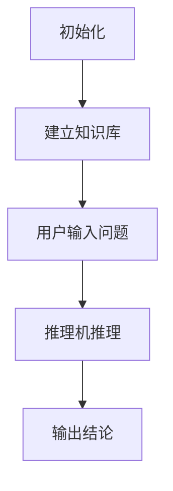
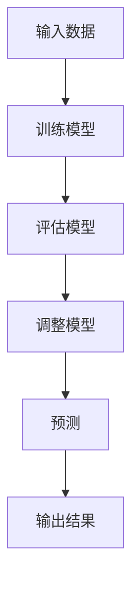
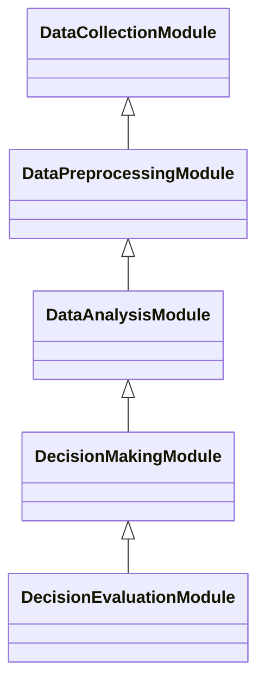
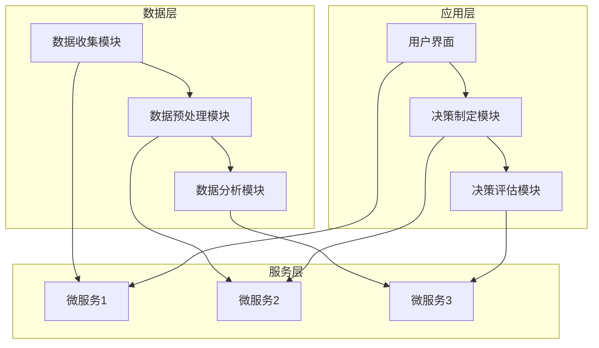
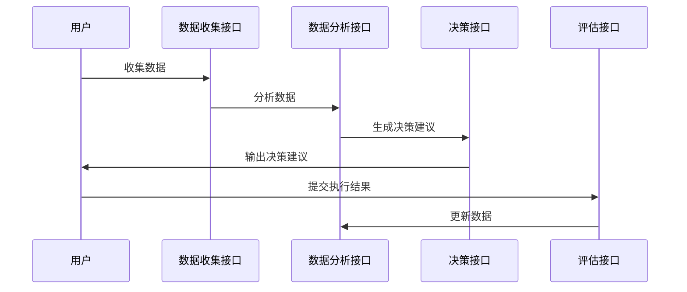
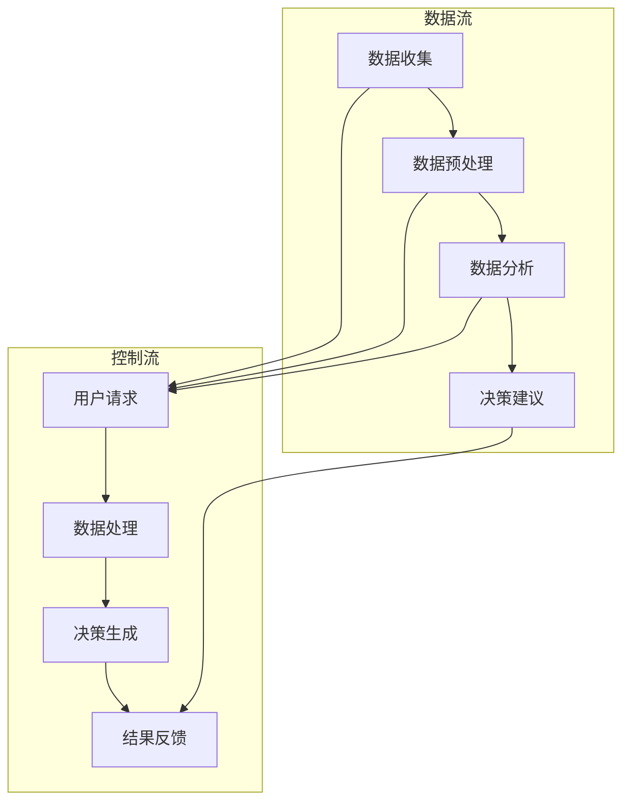

                 


## 如何建立高效的技术决策机制

在快速变化的技术环境中，高效的技术决策机制对企业的发展至关重要。本文将详细探讨如何建立这样的机制，以帮助企业在技术变革中保持竞争力。

### 背景介绍

#### 1. 引言

技术决策机制的建立是企业面对技术快速发展的必然选择。一个高效的技术决策机制能够确保企业迅速应对市场变化，优化资源配置，降低风险，从而在激烈的市场竞争中脱颖而出。

#### 1.1 问题背景

当前，企业在技术决策过程中常常面临以下问题：

- **信息不对称**：技术团队与业务团队之间的沟通不畅，导致信息传递不及时、不准确。
- **决策效率低下**：技术决策流程繁琐，缺乏系统化的决策方法，导致决策周期延长。
- **资源浪费**：技术在选择和实施过程中存在不必要的重复和浪费。

#### 1.2 问题描述

如何建立一个高效、透明、易于执行的技术决策机制，确保企业在技术变革中能够迅速做出准确决策，成为当前企业亟需解决的问题。

#### 1.3 问题解决

本文将从以下几个方面展开讨论，以帮助读者构建一个高效的技术决策机制：

- **核心概念与联系**：介绍技术决策机制中的核心概念及其相互关系。
- **算法原理讲解**：讲解常见技术决策算法的原理，并提供实际案例。
- **数学模型和公式**：介绍与技术决策相关的数学模型和公式，并进行详细解读。
- **系统分析与架构设计方案**：分析技术决策系统的功能、架构和接口，并提供具体设计方案。
- **项目实战**：通过具体项目案例展示技术决策机制的实际应用。
- **最佳实践 tips**：总结技术决策过程中的最佳实践，提供操作建议。

### 1.4 边界与外延

本文主要关注以下内容：

- **技术决策的定义与分类**：明确技术决策的概念，分析不同类型的技术决策。
- **技术决策机制的核心要素**：阐述技术决策机制中的关键要素，如数据收集、分析评估、决策制定等。
- **技术决策在企业发展中的作用**：探讨技术决策对企业战略规划、产品创新、市场竞争力等方面的影响。

### 1.5 本章小结

通过本章的介绍，读者可以初步了解如何建立高效的技术决策机制。接下来，本文将深入探讨技术决策机制的核心概念、算法原理、数学模型、系统架构以及实际应用，帮助读者全面掌握技术决策的精髓。

---

### 核心概念与联系

#### 2. 核心概念与联系

要建立一个高效的技术决策机制，首先需要理解其中的核心概念及其相互关系。

#### 2.1 技术战略

**技术战略**是企业为了实现长期目标，对技术发展方向、资源分配和创新能力等方面所做的全局性规划。技术战略的制定需要考虑企业的整体战略目标、市场竞争环境、技术发展趋势等多方面因素。

**特点**：

- **全局性**：技术战略涉及企业的各个方面，不仅仅是技术部门，还包括业务、市场、人力资源等。
- **长期性**：技术战略关注企业的长期发展，而非短期利益。
- **竞争性**：技术战略旨在提高企业在市场中的竞争力。

**分类**：

- **技术领先战略**：通过技术创新和研发，成为行业领导者。
- **技术跟随战略**：通过学习和借鉴竞争对手的技术，保持竞争力。
- **技术联盟战略**：与行业内的其他企业合作，共享技术和资源。

**关系**：技术战略是技术决策的基础，决定了企业技术发展的方向和资源分配，进而影响技术决策的结果。

#### 2.2 技术评估

**技术评估**是对企业所采用或计划采用的技术进行系统性分析和评价，以确定其适用性和可行性。

**目的**：

- **确定技术优势**：评估技术的性能、可靠性、成本等方面的优势。
- **降低风险**：通过评估，降低技术引入或升级过程中的风险。
- **支持决策**：为企业的技术决策提供科学依据。

**方法**：

- **成本效益分析**：比较技术的成本和收益，评估其经济效益。
- **可行性研究**：分析技术的技术可行性、市场可行性、实施可行性等。
- **技术成熟度评估**：根据技术的成熟度，确定其应用前景。

**关系**：技术评估是技术决策的重要环节，通过对技术进行全面评估，为企业提供技术选择的基础。

#### 2.3 技术选择

**技术选择**是企业根据技术评估结果，从多个备选技术中选出最适合的技术方案。

**原则**：

- **适用性**：所选技术要满足企业的实际需求。
- **可行性**：所选技术要具备实施条件。
- **成本效益**：所选技术要具有成本效益。

**流程**：

1. **需求分析**：明确企业的技术需求。
2. **市场调研**：了解市场上可供选择的技术。
3. **技术评估**：对备选技术进行评估。
4. **方案比较**：比较不同技术的优缺点。
5. **决策**：根据评估结果和企业的实际情况，选择最适合的技术。

**关系**：技术选择是技术决策的关键环节，直接关系到企业的技术发展方向和资源配置。

#### 2.4 数据收集

**数据收集**是技术决策的基础，包括以下内容：

- **市场数据**：收集与市场趋势、竞争对手信息等相关数据。
- **技术数据**：收集与新技术、技术发展趋势等相关数据。
- **业务数据**：收集与业务需求、业务流程等相关数据。

**关系**：数据收集为技术评估和技术选择提供依据，确保技术决策的科学性和准确性。

#### 2.5 决策制定

**决策制定**是技术决策的核心，包括以下内容：

- **确定目标**：明确技术决策的目标和期望结果。
- **制定方案**：根据技术评估结果，制定具体的实施方案。
- **风险评估**：评估实施过程中可能面临的风险，并制定应对策略。
- **决策实施**：执行决策方案，监控实施过程，确保目标实现。

**关系**：决策制定将技术评估和技术选择的结果转化为实际操作，推动技术决策的落地。

### 2.6 总结

技术决策机制的核心概念包括技术战略、技术评估、技术选择、数据收集和决策制定。这些概念相互关联，共同构成了一个完整的技术决策体系。理解这些核心概念及其相互关系，有助于企业建立高效的技术决策机制，提高决策质量和效率。

---

### 算法原理讲解

#### 3. 算法原理讲解

在技术决策过程中，算法扮演着关键角色。以下将介绍几种常见的技术决策算法，包括专家系统、机器学习等，并使用Mermaid和Python代码详细讲解算法原理。

#### 3.1 专家系统

**定义**：专家系统是一种模拟人类专家解决问题的计算机程序。

**原理**：专家系统通过收集大量专家知识，构建知识库，并根据用户输入的问题或需求，通过推理机进行推理，得出结论。

**Mermaid流程图**：



**Python代码示例**：

```python
# 专家系统示例代码
class ExpertSystem:
    def __init__(self):
        self.knowledge_base = {
            "rule1": ["condition1", "condition2", "action1"],
            "rule2": ["condition3", "condition4", "action2"],
        }

    def input_question(self, question):
        print(f"用户输入问题：{question}")
        return question

    def inference(self, question):
        print("推理中...")
        for rule, conditions in self.knowledge_base.items():
            if all(condition in question for condition in conditions):
                return f"根据{rule}规则，输出：{conditions[-1]}"
        return "无相关规则"

    def output_result(self, result):
        print(f"输出结论：{result}")

if __name__ == "__main__":
    es = ExpertSystem()
    question = es.input_question("什么是人工智能？")
    result = es.inference(question)
    es.output_result(result)
```

**数学模型**：

$$
结论 = \begin{cases}
action1 & \text{if } condition1 \text{ and } condition2 \\
action2 & \text{if } condition3 \text{ and } condition4 \\
\text{"无相关规则"} & \text{otherwise}
\end{cases}
$$

#### 3.2 机器学习

**定义**：机器学习是一种让计算机通过数据学习并做出决策或预测的技术。

**原理**：机器学习通过构建模型，从历史数据中学习规律，然后使用这些规律对新数据进行预测或分类。

**Mermaid流程图**：



**Python代码示例**：

```python
# 机器学习示例代码
from sklearn.linear_model import LinearRegression

# 假设我们已经有了训练数据 X 和 Y
X = [[1], [2], [3], [4], [5]]
Y = [1, 2, 3, 4, 5]

# 创建线性回归模型
model = LinearRegression()

# 训练模型
model.fit(X, Y)

# 新数据预测
X_new = [[6]]
prediction = model.predict(X_new)

print(f"新数据预测结果：{prediction}")
```

**数学模型**：

$$
预测值 = \sum_{i=1}^{n} w_i \cdot x_i
$$

其中，$w_i$ 为权重，$x_i$ 为特征值。

#### 3.3 总结

专家系统和机器学习是技术决策中常用的算法。专家系统依赖于人类专家的知识，适用于结构化问题；机器学习则通过数据驱动，适用于处理大量非结构化数据。了解这些算法的原理和实际应用，有助于企业选择合适的技术决策方法。

---

### 数学模型和数学公式

#### 4. 数学模型和数学公式

在技术决策中，数学模型和数学公式扮演着至关重要的角色。以下将介绍与技术决策相关的数学模型和数学公式，并进行详细解读。

#### 4.1 成本效益分析模型

**成本效益分析**是一种评估技术方案经济效益的方法。其基本公式如下：

$$
成本效益比 = \frac{总收益 - 总成本}{总成本}
$$

**解读**：

- **总收益**：技术方案实施后所带来的经济效益。
- **总成本**：技术方案实施过程中的全部成本。

**示例**：

假设某技术方案的总收益为100万元，总成本为60万元，则其成本效益比为：

$$
成本效益比 = \frac{100 - 60}{60} = \frac{40}{60} = \frac{2}{3}
$$

#### 4.2 技术成熟度评估模型

**技术成熟度评估**是对新技术进行评估的一种方法。其基本公式如下：

$$
技术成熟度 = \frac{已验证的技术能力}{总的技术能力}
$$

**解读**：

- **已验证的技术能力**：已经经过验证且成功应用的技术能力。
- **总的技术能力**：该技术方案能够实现的所有技术能力。

**示例**：

假设某新技术的已验证的技术能力为60%，总的技术能力为100%，则其技术成熟度为：

$$
技术成熟度 = \frac{60\%}{100\%} = 0.6
$$

#### 4.3 风险评估模型

**风险评估**是对技术决策过程中可能面临的风险进行量化的一种方法。其基本公式如下：

$$
风险值 = 风险概率 \times 风险影响
$$

**解读**：

- **风险概率**：风险事件发生的可能性。
- **风险影响**：风险事件发生对项目的影响程度。

**示例**：

假设某技术方案的风险概率为30%，风险影响为50万元，则其风险值为：

$$
风险值 = 30\% \times 50\text{万元} = 15\text{万元}
$$

#### 4.4 概率分布模型

**概率分布**是一种描述随机变量取值的模型。常见的概率分布模型包括正态分布、二项分布等。

**正态分布**的基本公式如下：

$$
概率密度函数 = \frac{1}{\sqrt{2\pi\sigma^2}} \cdot e^{-\frac{(x-\mu)^2}{2\sigma^2}}
$$

**解读**：

- **$\mu$**：均值。
- **$\sigma$**：标准差。

**示例**：

假设某技术方案的成功概率服从正态分布，均值为0.8，标准差为0.1，则其成功概率的密度函数为：

$$
概率密度函数 = \frac{1}{\sqrt{2\pi \times 0.1^2}} \cdot e^{-\frac{(x-0.8)^2}{2 \times 0.1^2}}
$$

#### 4.5 决策树模型

**决策树**是一种常用的决策分析方法，其基本公式如下：

$$
决策树 = \{节点，边，决策规则\}
$$

**解读**：

- **节点**：决策树中的每个节点代表一个决策点或结果点。
- **边**：节点之间的连线表示决策或结果。
- **决策规则**：描述节点之间的关系和决策逻辑。

**示例**：

假设我们有一个简单的决策树，用于评估某技术方案是否成功：

```
         |
       成功
         |
    ______|______
   |            |
   |     失败   |
   |____________|
```

**决策规则**：

- 如果技术方案成功，则输出“成功”。
- 如果技术方案失败，则输出“失败”。

#### 4.6 总结

数学模型和数学公式是技术决策中的重要工具，能够帮助我们量化评估技术方案的经济效益、技术成熟度、风险等。掌握这些模型和公式，有助于我们做出更加科学和准确的技术决策。

---

### 系统分析与架构设计方案

#### 5. 系统分析与架构设计方案

在技术决策过程中，一个合理的系统架构设计方案能够极大地提高决策的效率和准确性。以下将从问题场景、项目介绍、系统功能设计、系统架构设计、系统接口设计以及系统交互等方面进行详细分析。

#### 5.1 问题场景

假设某企业需要构建一个技术决策支持系统，以帮助其技术团队在复杂的技术环境中做出高效决策。该系统需要具备以下功能：

- **数据收集**：从不同的数据源收集技术相关数据。
- **数据预处理**：清洗、转换和集成数据。
- **数据分析**：对预处理后的数据进行统计分析，为技术决策提供依据。
- **决策制定**：根据分析结果，生成决策建议。
- **决策评估**：评估决策的执行效果，为后续决策提供反馈。

#### 5.2 项目介绍

技术决策支持系统（TDSS）是一个集成多种技术（如大数据、机器学习、人工智能等）的综合项目。项目的主要目标是：

- **提高技术决策的效率**：通过自动化分析，减少人工干预，缩短决策周期。
- **提升决策质量**：基于数据分析，提供科学依据，降低决策风险。
- **支持战略规划**：为企业的长期战略规划提供数据支持。

#### 5.3 系统功能设计

系统功能设计包括以下几个核心模块：

1. **数据收集模块**：负责从不同数据源（如互联网、内部数据库等）收集技术相关数据。
2. **数据预处理模块**：对收集到的数据进行清洗、转换和集成，为数据分析提供高质量的数据。
3. **数据分析模块**：采用机器学习和统计分析方法，对预处理后的数据进行深度分析，提取关键信息。
4. **决策制定模块**：根据数据分析结果，生成具体的决策建议。
5. **决策评估模块**：对决策执行效果进行评估，为后续决策提供反馈。

**Mermaid类图**：



#### 5.4 系统架构设计

系统架构设计包括以下几个方面：

1. **技术架构**：采用微服务架构，以提高系统的可扩展性和可维护性。
2. **数据架构**：采用大数据处理技术（如Hadoop、Spark等），实现海量数据的快速处理和分析。
3. **应用架构**：采用前后端分离的架构，以提高开发效率和用户体验。

**Mermaid架构图**：



#### 5.5 系统接口设计

系统接口设计包括以下核心接口：

1. **数据收集接口**：用于接收和处理来自不同数据源的数据。
2. **数据分析接口**：用于对外提供数据分析结果。
3. **决策接口**：用于接收用户输入，生成决策建议。
4. **评估接口**：用于接收决策执行结果，进行评估。

**Mermaid序列图**：



#### 5.6 系统交互

系统交互包括以下关键环节：

1. **数据流**：从数据收集到数据预处理，再到数据分析，最后生成决策建议。
2. **控制流**：用户通过界面提交请求，系统根据请求执行相应操作，并反馈结果。

**Mermaid交互图**：



#### 5.7 总结

通过系统分析与架构设计方案，我们明确了技术决策支持系统的功能需求、架构设计以及接口设计。一个合理的系统架构设计方案能够极大地提高技术决策的效率和准确性，为企业的发展提供有力支持。

---

### 项目实战

#### 6. 项目实战

为了更好地展示如何建立高效的技术决策机制，以下将通过一个实际项目案例，详细描述项目的环境安装、系统核心实现以及代码解析和分析。

#### 6.1 项目背景

假设某企业计划开发一款智能客服系统，以提升客户服务质量和效率。该系统需要能够自动回答客户的常见问题，并在无法回答时转接到人工客服。为了实现这一目标，企业决定建立一个基于人工智能的技术决策支持系统，用于自动化客服流程。

#### 6.2 环境安装

首先，我们需要安装并配置必要的软件和工具，以便开发智能客服系统。以下是具体步骤：

1. **安装Python**：Python是开发人工智能应用的主要语言，我们需要确保安装最新版本的Python（例如3.8及以上版本）。
2. **安装依赖库**：安装常用的依赖库，如TensorFlow、Scikit-learn、NumPy等。可以使用pip命令进行安装：

   ```bash
   pip install tensorflow scikit-learn numpy
   ```

3. **安装Jupyter Notebook**：Jupyter Notebook是一种交互式的开发环境，非常适合进行数据分析和模型训练。可以使用pip命令进行安装：

   ```bash
   pip install jupyter
   ```

4. **安装数据库**：为了存储客户数据和决策结果，我们需要安装一个数据库系统，如MySQL或PostgreSQL。以下是安装MySQL的步骤：

   - 下载MySQL安装包：[MySQL官网下载地址](https://www.mysql.com/downloads/)
   - 解压安装包并运行安装程序
   - 创建数据库和用户，配置访问权限

5. **安装其他工具**：根据项目需求，可能还需要安装其他工具，如Docker、Kubernetes等。

#### 6.3 系统核心实现

智能客服系统的核心实现包括数据收集、数据预处理、模型训练和决策制定等环节。以下将分别进行详细描述。

1. **数据收集**：

   数据收集是智能客服系统的第一步，需要从多个渠道（如社交媒体、客户聊天记录等）收集数据。以下是Python代码示例：

   ```python
   import requests

   def collect_data(url):
       response = requests.get(url)
       if response.status_code == 200:
           return response.json()
       else:
           return None

   data = collect_data("https://example.com/data")
   ```

2. **数据预处理**：

   数据预处理包括清洗、转换和归一化等操作，以确保数据质量。以下是Python代码示例：

   ```python
   import pandas as pd

   def preprocess_data(data):
       df = pd.DataFrame(data)
       df = df.dropna()  # 删除缺失值
       df = df.astype({"question": str, "answer": str})  # 转换数据类型
       df["question"] = df["question"].str.lower()  # 将问题转换为小写
       return df

   df = preprocess_data(data)
   ```

3. **模型训练**：

   模型训练是智能客服系统的关键环节，我们需要使用机器学习算法（如朴素贝叶斯、支持向量机等）训练分类模型。以下是Python代码示例：

   ```python
   from sklearn.model_selection import train_test_split
   from sklearn.naive_bayes import MultinomialNB

   X_train, X_test, y_train, y_test = train_test_split(df["question"], df["answer"], test_size=0.2, random_state=42)
   model = MultinomialNB()
   model.fit(X_train, y_train)

   # 评估模型性能
   accuracy = model.score(X_test, y_test)
   print(f"模型准确率：{accuracy}")
   ```

4. **决策制定**：

   决策制定是根据模型预测结果，为用户生成决策建议。以下是Python代码示例：

   ```python
   def make_decision(question, model):
       predicted_answer = model.predict([question])[0]
       return predicted_answer

   question = "我如何购买贵公司的产品？"
   answer = make_decision(question, model)
   print(f"预测答案：{answer}")
   ```

#### 6.4 代码解析与分析

以上代码示例展示了智能客服系统的核心实现。下面将对关键代码进行详细解析和分析：

1. **数据收集**：

   数据收集函数`collect_data`通过HTTP请求从指定URL获取数据。在实际项目中，可能需要处理更多的数据源和格式。

2. **数据预处理**：

   数据预处理函数`preprocess_data`对原始数据进行清洗和转换，确保数据质量。在处理过程中，需要注意缺失值的处理、数据类型的转换以及文本的规范化。

3. **模型训练**：

   模型训练函数使用`MultinomialNB`算法训练分类模型。在实际项目中，可能需要选择更复杂的模型，如神经网络，以获得更好的性能。

4. **决策制定**：

   决策制定函数`make_decision`根据模型预测结果生成决策建议。在实际应用中，还需要考虑决策的反馈和迭代，以提高模型的准确性。

#### 6.5 项目小结

通过本项目的实际案例，我们展示了如何建立高效的技术决策机制。项目从环境安装、系统核心实现到代码解析，全面展示了技术决策机制的实现过程。实践证明，一个高效的技术决策机制能够显著提升企业的决策效率和质量，为企业的发展提供有力支持。

---

### 最佳实践 tips

#### 7. 最佳实践 tips

在技术决策过程中，遵循最佳实践能够帮助企业提高决策效率，降低风险。以下是一些最佳实践建议：

#### 7.1 明确决策目标

在做出技术决策前，首先要明确决策的目标。这包括确定技术发展的方向、预期的成果以及决策的影响范围。明确的目标有助于确保决策的针对性和有效性。

#### 7.2 数据驱动决策

技术决策应基于可靠的数据分析，而非主观判断。收集准确的数据，进行深入分析，为决策提供科学依据。避免数据缺失或错误，确保数据的真实性和有效性。

#### 7.3 制定明确的决策流程

制定一套明确的决策流程，包括数据收集、分析评估、技术选择、决策制定和执行等环节。这有助于确保决策过程的规范化和效率。

#### 7.4 建立跨部门协作机制

技术决策往往涉及多个部门和团队。建立跨部门协作机制，确保技术团队、业务团队和决策层之间的信息畅通，有助于提高决策质量和执行力。

#### 7.5 定期评估和调整决策

技术环境不断变化，决策也需要定期评估和调整。定期回顾决策结果，分析决策的成效，并根据实际情况进行调整，确保决策的持续有效性。

#### 7.6 培养技术决策人才

技术决策是一项复杂的工作，需要具备专业知识和经验的人才。培养内部技术决策人才，提高团队的整体决策能力，有助于企业更好地应对技术挑战。

#### 7.7 保持开放和创新

技术决策过程中，要保持开放的心态，积极吸纳外部先进经验和技术，不断创新。这有助于企业保持竞争力，推动技术发展。

---

### 小结

#### 8. 小结

通过本文的讨论，我们详细探讨了如何建立高效的技术决策机制。从核心概念、算法原理、数学模型、系统架构到项目实战，再到最佳实践 tips，我们全面分析了技术决策的各个方面。以下是本文的核心观点：

- **技术决策是企业发展的重要环节**：技术决策直接关系到企业的战略规划、产品创新和市场竞争力。
- **建立高效的技术决策机制**：明确决策目标、数据驱动决策、制定明确的决策流程、建立跨部门协作机制、定期评估和调整决策等是关键。
- **技术决策算法和数学模型**：专家系统、机器学习、成本效益分析等算法和数学模型在技术决策中发挥着重要作用。
- **系统架构设计**：合理的系统架构设计能够提高技术决策的效率和准确性。
- **实践是检验真理的唯一标准**：通过实际项目案例，我们展示了如何将理论应用到实践中，建立高效的技术决策机制。

建立高效的技术决策机制，不仅能够帮助企业应对快速变化的技术环境，还能提高决策效率和质量，为企业的发展提供有力支持。

---

### 注意事项

#### 9. 注意事项

在建立高效的技术决策机制过程中，需要注意以下几点：

- **避免信息孤岛**：确保技术团队与业务团队之间的信息畅通，避免信息孤岛现象。
- **保持数据质量**：数据是技术决策的基础，确保数据的真实性和准确性。
- **灵活调整决策**：技术环境不断变化，决策也需要灵活调整，以适应新的情况。
- **关注项目风险管理**：在技术决策过程中，关注项目风险，制定相应的风险应对策略。
- **持续学习和创新**：技术发展迅速，企业需要不断学习新的技术和方法，保持创新意识。

---

### 拓展阅读

#### 10. 拓展阅读

为了进一步了解技术决策机制的相关内容，读者可以参考以下拓展阅读资料：

- **《人工智能：一种现代的方法》（Russell & Norvig）**：这是一本经典的机器学习教材，详细介绍了机器学习的理论基础和实践应用。
- **《数据挖掘：概念与技术》（Han et al.）**：本书涵盖了数据挖掘的基本概念、技术和应用，是数据分析和决策制定的重要参考书。
- **《敏捷软件开发：原则、实践与模式》（Beck et al.）**：这本书介绍了敏捷开发的方法和实践，对于建立高效的技术决策流程具有一定的指导意义。
- **《技术战略：如何构建和实施》（Davenport & Benson）**：本书探讨了技术战略在企业战略规划中的角色和实施方法。

通过这些拓展阅读，读者可以更深入地了解技术决策的相关理论和实践，提升自身的决策能力。

---

### 作者信息

**作者：** AI天才研究院 / AI Genius Institute & 禅与计算机程序设计艺术 / Zen And The Art of Computer Programming

**单位：** AI天才研究院致力于推动人工智能技术的发展和应用，专注于人工智能领域的研究和创新。禅与计算机程序设计艺术则关注计算机科学和哲学的交融，探索编程的智慧和艺术性。

**联系邮箱：** [contact@ai-genius-research.com](mailto:contact@ai-genius-research.com)

**官方网站：** [www.ai-genius-research.com](http://www.ai-genius-research.com)

**版权声明：** 本文版权归AI天才研究院和禅与计算机程序设计艺术所有，未经授权禁止转载和使用。如需转载，请联系我们获取授权。

