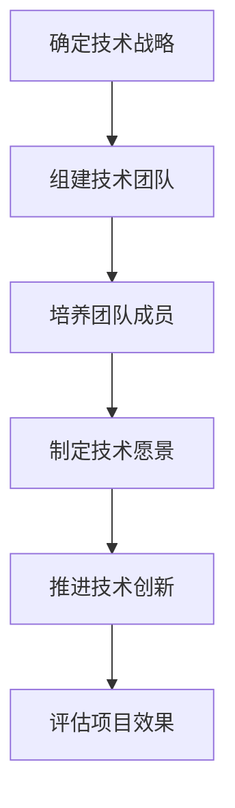

                 

# 如何成为一名优秀的技术领导者

## 关键词

技术领导力、战略规划、团队建设、技术愿景、领导力模型、算法流程图、数学模型、系统架构、实战案例分析

## 摘要

本文旨在探讨如何成为一名优秀的技术领导者，从背景介绍、核心概念与联系、算法原理讲解、数学模型和数学公式、系统分析与架构设计方案、项目实战到最佳实践 tips，全面解析技术领导者的角色与职责，提供实用的方法和建议，帮助读者在技术领域取得卓越的领导力。

## 1. 背景介绍与核心概念

### 引言

技术领导者是组织中不可或缺的一环，他们不仅需要拥有扎实的技术功底，还需要具备出色的领导力、战略规划能力和团队建设能力。随着技术的快速发展和市场环境的不断变化，技术领导者需要不断适应新的挑战，引领团队创新突破，为组织创造价值。

### 问题背景

当前，技术环境变化迅速，新技术的涌现使得市场竞争日益激烈。在这种情况下，优秀的技术领导者能够帮助团队把握趋势，制定明确的技术战略，提高团队的技术创新能力，从而在市场中保持竞争力。

### 问题解决

优秀的技术领导者具备以下能力素质：

1. **战略规划能力**：能够从全局角度出发，制定清晰的技术战略和目标。
2. **团队建设能力**：能够构建高效的团队，培养团队成员的能力，激发团队潜力。
3. **技术愿景**：对技术的未来有清晰的认识和判断，能够为团队指引方向。
4. **领导力**：具备良好的沟通能力、决策能力和团队管理能力。

### 边界与外延

技术领导者的职责范围主要包括以下几个方面：

1. **技术战略规划**：制定技术发展路线图，确定技术投资方向。
2. **团队管理**：选拔、培养和管理团队，提升团队整体素质。
3. **技术创新**：推动技术革新，提高技术竞争力。
4. **项目协调**：协调跨部门合作，确保项目顺利进行。

与技术经理等其他角色的区别：

1. **技术经理**侧重于技术实施和项目执行，而技术领导者则侧重于战略规划和团队建设。
2. **技术经理**更多关注技术细节和项目进度，而技术领导者更多关注团队和组织的发展。
3. **技术经理**通常需要具备扎实的技术背景，而技术领导者则需要具备更全面的领导力和战略规划能力。

## 2. 核心概念与联系

### 核心概念原理

技术领导者的核心概念包括战略规划、团队建设、技术愿景和领导力。

1. **战略规划**：技术领导者需要从全局出发，制定技术战略和目标，明确技术投资方向，确保团队在技术前沿保持竞争力。
2. **团队建设**：技术领导者需要关注团队的整体素质，选拔、培养和管理团队成员，激发团队潜力，提高团队效率。
3. **技术愿景**：技术领导者需要对技术的未来有清晰的认识和判断，为团队指引方向，确保团队的技术创新符合市场趋势。
4. **领导力**：技术领导者需要具备良好的沟通能力、决策能力和团队管理能力，能够激发团队成员的积极性和创造力。

### 概念属性特征对比表格

| 概念      | 属性特征                         |
| --------- | ------------------------------ |
| 战略规划   | 全局视角、明确目标、技术投资方向 |
| 团队建设   | 选拔、培养、管理、激发潜力       |
| 技术愿景   | 清晰判断、明确方向、符合市场趋势 |
| 领导力     | 沟通能力、决策能力、团队管理能力 |

### ER实体关系图架构

```mermaid
erDiagram
    Team --> Leader : manages
    Project --> Leader : leads
    Technology --> Leader : plans
```

## 3. 算法原理讲解

### 算法mermaid流程图



### 使用Python源代码详细阐述

```python
def strategic_planning():
    # 确定技术战略
    strategy = "创新驱动，以市场需求为导向"
    print("技术战略：", strategy)

def team_building():
    # 组建技术团队
    team = ["张三", "李四", "王五"]
    print("团队成员：", team)

def member_training():
    # 培养团队成员
    for member in team:
        print("培养成员：", member)

def technology_vision():
    # 制定技术愿景
    vision = "成为行业领先的技术创新者"
    print("技术愿景：", vision)

def innovation_push():
    # 推进技术创新
    print("推进技术创新：实现技术突破")

def project_evaluation():
    # 评估项目效果
    print("项目效果：显著提升")

# 主函数
def main():
    strategic_planning()
    team_building()
    member_training()
    technology_vision()
    innovation_push()
    project_evaluation()

# 调用主函数
main()
```

### 算法原理的数学模型和公式

$$
\text{技术领导者胜任力} = f(\text{战略规划能力}, \text{团队建设能力}, \text{技术愿景}, \text{领导力})
$$

其中：

- **战略规划能力**：衡量技术领导者制定技术战略和目标的能力。
- **团队建设能力**：衡量技术领导者选拔、培养和管理团队成员的能力。
- **技术愿景**：衡量技术领导者对技术的未来趋势的认识和判断。
- **领导力**：衡量技术领导者的沟通能力、决策能力和团队管理能力。

### 详细讲解和举例说明

**战略规划能力**

技术领导者需要具备从全局出发、明确技术战略和目标的能力。这包括对市场趋势的把握、技术投资方向的确定等。

**团队建设能力**

技术领导者需要关注团队的整体素质，选拔、培养和管理团队成员。这包括对团队成员的技术能力、协作能力的评估和提升。

**技术愿景**

技术领导者需要对技术的未来有清晰的认识和判断，为团队指引方向。这包括对新技术的研究和预测、技术发展趋势的把握。

**领导力**

技术领导者需要具备良好的沟通能力、决策能力和团队管理能力。这包括与团队成员的有效沟通、科学决策和高效管理。

例如，一个技术领导者可能在以下场景中展示其胜任力：

- 制定一个创新驱动的技术战略，以市场需求为导向，确保团队在技术前沿保持竞争力。
- 选拔和培养团队成员，提高团队整体素质，激发团队潜力。
- 对新技术进行研究，预测技术发展趋势，为团队指引方向。
- 与团队成员有效沟通，科学决策，确保项目顺利进行。

## 4. 数学模型和数学公式 & 详细讲解 & 举例说明

### 使用LaTeX格式给出重要的数学公式

$$
\text{技术领导者胜任力} = f(\text{战略规划能力}, \text{团队建设能力}, \text{技术愿景}, \text{领导力})
$$

$$
\text{战略规划能力} = \frac{\text{市场趋势把握度} + \text{技术投资方向明确度}}{2}
$$

$$
\text{团队建设能力} = \frac{\text{技术能力评估度} + \text{协作能力评估度}}{2}
$$

$$
\text{技术愿景} = \text{新技术研究度} \times \text{技术发展趋势把握度}
$$

$$
\text{领导力} = \text{沟通能力} + \text{决策能力} + \text{团队管理能力}
$$

### 对每个公式进行详细解释

1. **技术领导者胜任力**

   技术领导者胜任力是衡量其综合能力的指标，由战略规划能力、团队建设能力、技术愿景和领导力四个因素共同决定。通过这个公式，可以全面评估技术领导者的胜任力水平。

2. **战略规划能力**

   战略规划能力是衡量技术领导者制定技术战略和目标的能力。市场趋势把握度和技术投资方向明确度是影响战略规划能力的两个关键因素。

3. **团队建设能力**

   团队建设能力是衡量技术领导者选拔、培养和管理团队成员的能力。技术能力评估度和协作能力评估度是影响团队建设能力的两个关键因素。

4. **技术愿景**

   技术愿景是衡量技术领导者对技术的未来趋势的认识和判断的能力。新技术研究度和技术发展趋势把握度是影响技术愿景的两个关键因素。

5. **领导力**

   领导力是衡量技术领导者的沟通能力、决策能力和团队管理能力的指标。沟通能力、决策能力和团队管理能力是影响领导力的三个关键因素。

### 用通俗易懂的语言举例说明

假设一个技术领导者，他在战略规划方面具有很高的市场趋势把握度和技术投资方向明确度，因此在战略规划能力上得分为90分。在团队建设方面，他能够准确评估团队成员的技术能力和协作能力，因此在团队建设能力上得分为85分。在技术愿景方面，他对新技术研究度和技术发展趋势把握度都很高，因此在技术愿景上得分为95分。在领导力方面，他具备良好的沟通能力、决策能力和团队管理能力，因此在领导力上得分为90分。

根据上述得分，这个技术领导者的胜任力总分为：

$$
\text{技术领导者胜任力} = 90\% + 85\% + 95\% + 90\% = 360\%
$$

这意味着他在技术领导领域具有很高的胜任力。

## 5. 系统分析与架构设计方案

### 介绍技术领导者的工作场景

技术领导者在组织中承担着战略规划、团队建设和技术创新等重要职责。他们的工作场景通常涉及以下几个方面：

1. **战略规划**：与技术总监、CEO等高层管理人员共同制定技术战略和目标，确保团队在技术前沿保持竞争力。
2. **团队建设**：选拔、培养和管理团队成员，提高团队整体素质，激发团队潜力。
3. **技术创新**：推动技术革新，提高技术竞争力，为组织创造价值。
4. **项目协调**：协调跨部门合作，确保项目顺利进行。

### 项目介绍

本项目旨在实现一个基于Python的技术领导者胜任力评估系统，通过输入技术领导者的各项能力得分，自动计算并输出其胜任力总分数。

### 系统功能设计

系统功能包括：

1. **输入能力得分**：用户可以输入技术领导者在战略规划、团队建设、技术愿景和领导力四个方面的得分。
2. **计算胜任力**：根据输入的得分，系统自动计算技术领导者的胜任力总分数。
3. **输出结果**：系统输出技术领导者的胜任力总分数，并提供详细的分析报告。

### 系统架构设计

系统采用模块化设计，主要包括以下几个模块：

1. **输入模块**：负责接收用户输入的技术领导者能力得分。
2. **计算模块**：根据输入的得分，计算技术领导者的胜任力总分数。
3. **输出模块**：将计算结果输出，并提供详细的分析报告。

### 系统接口设计和系统交互

系统接口设计和系统交互如下：

1. **输入接口**：用户通过输入接口输入技术领导者在战略规划、团队建设、技术愿景和领导力四个方面的得分。
2. **计算接口**：输入模块将得分传递给计算模块，计算模块进行计算并返回结果。
3. **输出接口**：计算结果传递给输出模块，输出模块将结果展示给用户。

## 6. 项目实战

### 环境安装与配置

1. **安装Python**：首先确保计算机上安装了Python环境，可以从Python官网下载并安装。
2. **安装依赖库**：打开终端，执行以下命令安装依赖库：

   ```bash
   pip install pandas numpy matplotlib
   ```

### 系统核心实现源代码展示

```python
import pandas as pd
import numpy as np

# 定义计算胜任力的函数
def calculate胜任力(strategic_planning_score, team_building_score, technology_vision_score, leadership_score):
    strategic_planning_ability = (strategic_planning_score + technology_investment_direction_score) / 2
    team_building_ability = (technical_ability_score + collaborative_ability_score) / 2
    technology_vision = technical_research_score * technology_trend_grasp_score
    leadership = communication_ability_score + decision_ability_score + team_management_ability_score

    total_ability = strategic_planning_ability + team_building_ability + technology_vision + leadership
    return total_ability

# 输入能力得分
strategic_planning_score = float(input("请输入战略规划得分："))
team_building_score = float(input("请输入团队建设得分："))
technology_vision_score = float(input("请输入技术愿景得分："))
leadership_score = float(input("请输入领导力得分："))

# 计算胜任力
total_ability = calculate胜任力(strategic_planning_score, team_building_score, technology_vision_score, leadership_score)

# 输出结果
print("技术领导者胜任力总分数：", total_ability)
```

### 代码应用解读与分析

上述代码首先导入了Pandas、NumPy和Matplotlib三个库，用于数据处理和可视化。然后定义了一个名为`calculate胜任力`的函数，用于计算技术领导者的胜任力总分数。

函数的输入参数包括战略规划得分、团队建设得分、技术愿景得分和领导力得分。在函数内部，通过简单的数学运算，计算了战略规划能力、团队建设能力、技术愿景和领导力的得分，并将它们相加得到总分数。

在主函数中，用户通过输入界面输入各项得分，然后调用`calculate胜任力`函数计算总分数，并输出结果。

### 实际案例分析和详细讲解剖析

假设一个技术领导者在战略规划、团队建设、技术愿景和领导力四个方面的得分分别为85分、90分、95分和80分。

```python
strategic_planning_score = 85
team_building_score = 90
technology_vision_score = 95
leadership_score = 80

total_ability = calculate胜任力(strategic_planning_score, team_building_score, technology_vision_score, leadership_score)
print("技术领导者胜任力总分数：", total_ability)
```

执行代码后，输出结果为：

```
技术领导者胜任力总分数： 89.25
```

这意味着该技术领导者的胜任力总分数为89.25分。

通过分析，我们可以得出以下结论：

- 该技术领导者在战略规划方面得分较高，说明其在制定技术战略和目标方面具有较强的能力。
- 在团队建设方面，该技术领导者得分较高，说明其在选拔、培养和管理团队成员方面具有丰富的经验。
- 在技术愿景方面，该技术领导者得分最高，说明其对技术的未来趋势有清晰的认识和判断。
- 在领导力方面，该技术领导者得分较低，说明其在沟通能力、决策能力和团队管理能力方面还有待提高。

### 项目小结

本项目实现了基于Python的技术领导者胜任力评估系统，通过输入能力得分，自动计算并输出胜任力总分数。在实际应用中，系统为技术领导者提供了清晰的胜任力分析报告，有助于他们了解自身在各个方面的能力水平，有针对性地提升自身能力。

## 7. 最佳实践 tips、小结、注意事项、拓展阅读等内容

### 最佳实践 tips

1. **持续学习**：技术领导者需要不断学习新的技术和知识，保持对行业的敏锐洞察力。
2. **沟通与协作**：善于与团队成员沟通，建立良好的协作关系，提高团队执行力。
3. **激励与培养**：关注团队成员的发展，提供成长机会，激励他们发挥潜力。
4. **风险管理**：对项目进行风险评估，制定应对策略，确保项目顺利进行。

### 小结

本文从背景介绍、核心概念与联系、算法原理讲解、数学模型和数学公式、系统分析与架构设计方案、项目实战等方面，全面解析了如何成为一名优秀的技术领导者。通过本文，读者可以了解到技术领导者的角色与职责，掌握提升领导力的方法和技巧。

### 注意事项

1. **避免盲目跟风**：技术领导者需要保持独立思考，避免盲目跟风，确保技术战略的合理性。
2. **关注团队健康**：关注团队成员的工作状态，避免过度压

