                 

### 第1章：技术决策机制的重要性

#### 1.1 问题背景

在当今这个技术创新飞速发展的时代，企业的核心竞争力越来越依赖于技术的先进性和应用的广泛性。无论是传统行业还是新兴科技领域，技术决策都成为了企业战略规划中的关键一环。然而，随着技术领域的不断扩展和深化，技术选择带来的挑战也日益严峻。

- **技术选择的复杂性**：在众多可供选择的技术方案中，如何甄别出最适合企业当前和未来发展的方案，成为了决策者面临的一大难题。

- **决策错误的代价**：技术决策失误可能导致项目延期、资源浪费甚至市场丧失，给企业带来巨大的经济和声誉损失。

- **技术迭代的压力**：技术的快速发展要求企业必须具备快速响应和调整的能力，这对决策机制的效率提出了更高的要求。

#### 1.2 决策机制的核心概念

技术决策机制是指在企业技术创新过程中，为了解决技术选择问题所采用的一系列规则、流程和方法的总和。一个有效的技术决策机制应当具备以下几个核心概念：

- **决策目标**：明确决策需要达成的目标，如成本最低、性能最优或风险最小等。

- **决策要素**：包括技术方案、成本、风险、时间等因素，这些要素共同构成了决策的评估基础。

- **决策流程**：从问题识别、方案评估、决策制定到决策执行的完整流程。

- **决策规则**：一系列指导决策制定和执行的标准和规范，确保决策过程的科学性和规范性。

- **决策支持系统**：利用计算机技术和数据分析手段，为决策者提供信息支持和工具。

#### 1.3 效率与决策机制

效率是技术决策机制的重要衡量标准。一个高效的技术决策机制能够在保证决策质量的前提下，最大限度地减少决策的时间和成本。

- **快速响应**：在技术快速迭代的环境下，决策机制必须能够快速响应技术变化，及时调整决策方向。

- **减少不确定性**：通过科学的方法和工具，降低技术决策过程中的不确定性和主观性。

- **优化资源配置**：合理分配资源，避免因决策失误导致的资源浪费。

#### 1.4 本章小结

本章主要介绍了技术决策机制的重要性，包括技术创新带来的挑战、决策机制的核心概念以及效率在决策机制中的关键作用。了解这些背景信息对于构建高效的技术决策机制至关重要。

### 关键词
- 技术决策机制
- 复杂性
- 效率
- 决策流程
- 决策支持系统

### 摘要
本文探讨了技术决策机制的重要性，阐述了技术创新带来的挑战，分析了决策机制的核心概念，并强调了效率在技术决策中的关键作用。通过理解这些内容，企业可以构建更高效的技术决策机制，以应对快速变化的市场和技术环境。


----------------------------------------------------------------

## 第二部分：核心概念与联系

在这一部分，我们将深入探讨技术决策机制中的几个关键概念，包括技术评估模型、决策支持系统、风险管理框架和企业文化。通过这些核心概念的联系，我们将理解它们如何共同作用，构建一个高效的技术决策机制。

### 第2章：关键概念解析

#### 2.1 技术评估模型

技术评估模型是技术决策过程中的重要工具，用于评估和比较不同技术方案的性能、成本和风险。以下是对技术评估模型的核心概念解析：

- **定义**：技术评估模型是一种系统化的方法，用于评估和比较不同技术方案的优缺点。

- **属性特征对比**：不同技术评估模型的属性特征各不相同，如基于成本、性能、风险等因素的评估模型，需要对比这些特征以选择最适合的模型。

- **ER图**：实体关系图（Entity-Relationship Diagram，ER图）用于表示技术评估模型中的实体及其关系。它可以帮助我们清晰地理解模型的结构和组成部分。

```mermaid
erDiagram
    Technology_A ->|评估指标| Evaluation Criterion
    Technology_B ->|评估指标| Evaluation Criterion
    Technology_A..> Performance : <<has>> Evaluation Score
    Technology_B..> Performance : <<has>> Evaluation Score
    Evaluation Criterion : <<uses>> Technology_A
    Evaluation Criterion : <<uses>> Technology_B
```

#### 2.2 决策支持系统

决策支持系统（Decision Support System，DSS）是辅助决策者进行决策的重要工具。它通过收集、处理和分析数据，为决策者提供信息支持和分析结果。

- **定义**：决策支持系统是一种基于计算机技术的信息系统，用于辅助决策者进行复杂决策。

- **功能模块**：决策支持系统通常包括数据收集模块、数据分析模块和决策生成模块。这些模块共同作用，为决策者提供全面的信息支持。

- **应用场景**：决策支持系统广泛应用于企业管理、市场营销、供应链管理等领域，帮助企业更好地应对复杂决策问题。

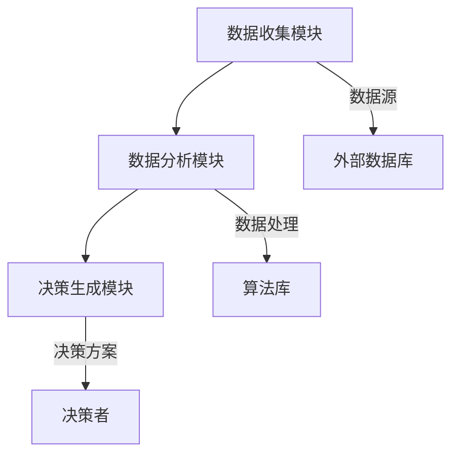

#### 2.3 风险管理框架

在技术决策过程中，风险管理是不可或缺的一环。风险管理框架用于识别、评估和应对技术决策中的各种风险。

- **定义**：风险管理是一种系统化的方法，用于识别、评估和应对项目或决策中的潜在风险。

- **关键步骤**：风险管理通常包括风险识别、风险评估、风险应对策略和风险监控等关键步骤。

- **工具和方法**：风险管理工具和方法包括风险矩阵、决策树、蒙特卡罗模拟等，用于帮助决策者更好地理解和管理风险。

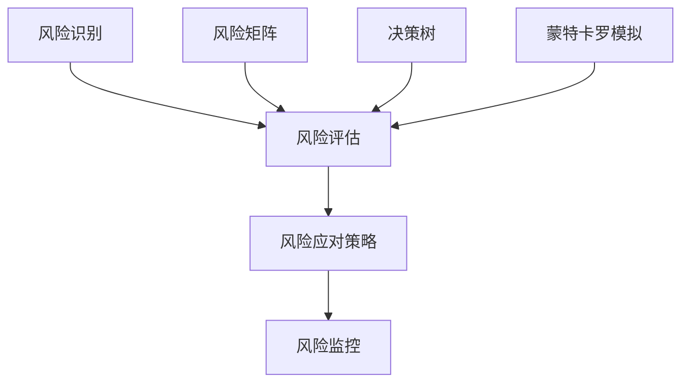

#### 2.4 企业文化与决策

企业文化是影响企业决策的重要因素。一个积极、开放的企业文化可以促进技术决策的创新和效率。

- **企业文化的作用**：企业文化可以影响员工的态度和行为，从而影响决策的质量和效率。

- **企业文化对决策的影响**：企业文化会影响决策者的价值观、决策风格和行为模式。

- **企业文化建设的策略**：通过培训、文化建设活动和组织变革等策略，可以塑造和提升企业文化的积极影响。

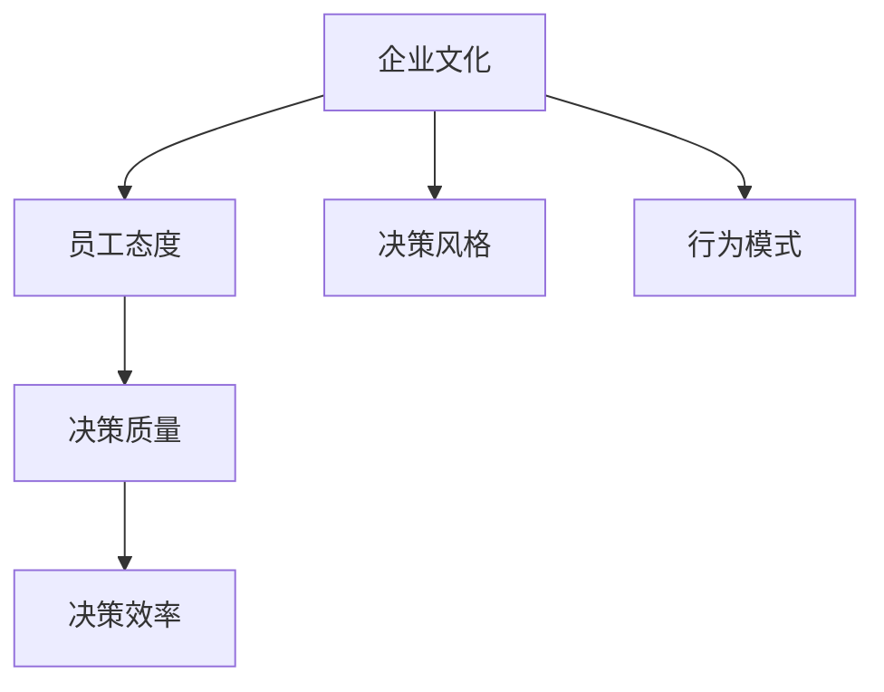

#### 2.5 本章小结

本章对技术决策机制中的几个关键概念进行了详细解析，包括技术评估模型、决策支持系统、风险管理框架和企业文化。这些概念共同构成了技术决策机制的核心，是构建高效决策机制的重要基础。理解这些概念及其相互关系，有助于企业更好地应对技术决策中的复杂问题。

### 关键词
- 技术评估模型
- 决策支持系统
- 风险管理框架
- 企业文化
- 决策流程

### 摘要
第二部分深入探讨了技术决策机制中的核心概念，包括技术评估模型、决策支持系统、风险管理框架和企业文化。通过这些关键概念的详细解析，我们理解了它们在构建高效技术决策机制中的重要作用和相互联系。这为企业构建科学、系统的技术决策过程提供了理论基础和实践指导。


----------------------------------------------------------------

### 第3章：技术决策算法原理

在技术决策过程中，算法原理起着至关重要的作用。这些算法不仅帮助决策者从大量信息中提取有用数据，还能优化决策流程，提高决策的准确性和效率。本章将详细介绍几种常见的技术决策算法原理，包括基于数据的决策算法、基于模型的决策算法和混合决策算法。

#### 3.1 基于数据的决策算法

基于数据的决策算法利用历史数据进行分析，从而预测未来的趋势和结果。这些算法的核心在于如何有效地从数据中提取信息，并将其应用于决策过程中。

- **数据驱动的决策框架**：数据驱动的决策框架包括数据收集、数据预处理、数据分析和数据可视化等步骤。以下是这个框架的mermaid流程图：

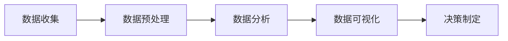

- **常见的数据驱动算法**：常见的数据驱动算法包括线性回归、决策树、支持向量机（SVM）等。这些算法各有特点，适用于不同的决策场景。

- **算法mermaid流程图**：以下是一个线性回归算法的mermaid流程图：

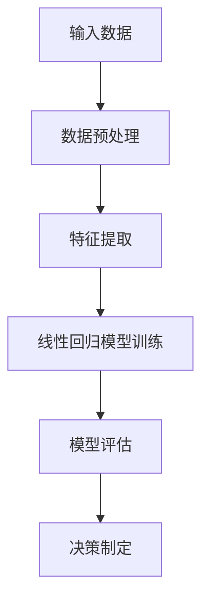

#### 3.2 基于模型的决策算法

基于模型的决策算法通过建立数学模型来模拟和预测决策结果。这些算法通常涉及复杂的数学计算和模型优化。

- **模型驱动的决策框架**：模型驱动的决策框架包括模型建立、模型验证、模型优化和模型应用等步骤。以下是这个框架的mermaid流程图：

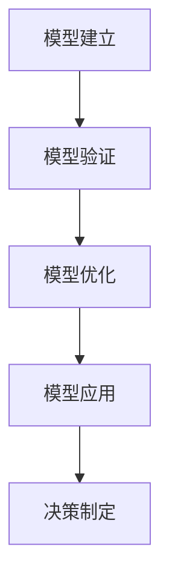

- **常见的模型驱动算法**：常见的模型驱动算法包括线性规划、动态规划、马尔可夫决策过程（MDP）等。这些算法适用于需要优化资源分配和决策过程的复杂问题。

- **算法mermaid流程图**：以下是一个线性规划算法的mermaid流程图：

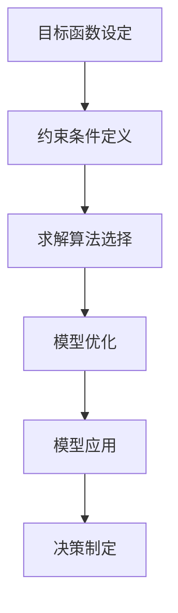

#### 3.3 混合决策算法

混合决策算法结合了基于数据和基于模型的优势，通过融合多种算法和模型，实现更准确和高效的决策。

- **混合决策框架的构建**：混合决策框架包括数据收集与处理、模型建立与优化、决策策略生成和决策评估等步骤。以下是这个框架的mermaid流程图：

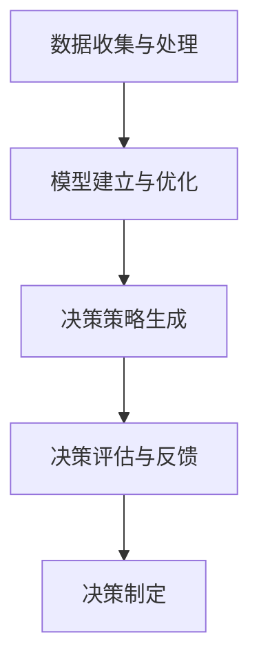

- **混合算法的优势与挑战**：混合算法的优势在于其灵活性和适应性，可以应对复杂多变的决策问题。然而，这也带来了算法复杂度高、计算量大等挑战。

- **混合算法的mermaid流程图**：以下是一个简单的混合决策算法的mermaid流程图：

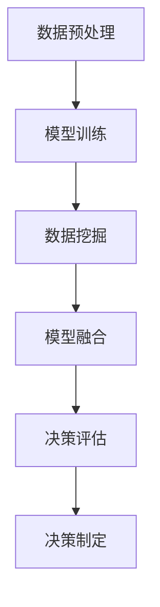

#### 3.4 决策算法的选择与应用

在选择和应用技术决策算法时，需要考虑多个因素，如决策问题的复杂性、数据可用性、计算资源等。

- **决策算法的选择标准**：选择决策算法时，应考虑算法的准确性、效率、可解释性等标准。例如，对于需要快速响应的决策问题，可以选择基于数据的简单算法；而对于需要长期优化的决策问题，可以选择基于模型的复杂算法。

- **不同场景下的算法应用**：不同场景下的技术决策问题需要不同的算法。例如，在供应链管理中，可以使用基于数据的预测算法来优化库存管理；在项目管理中，可以使用基于模型的优化算法来优化资源分配。

- **算法mermaid流程图**：以下是一个简单决策算法应用示例的mermaid流程图：

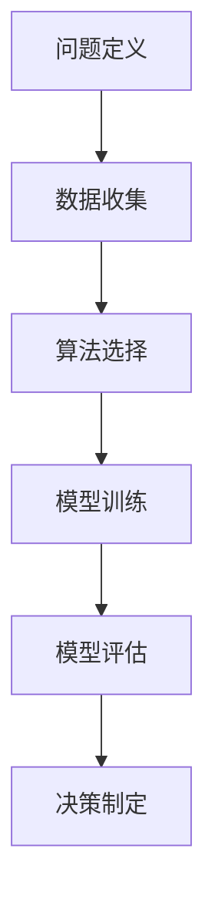

#### 3.5 本章小结

本章详细介绍了技术决策算法的原理，包括基于数据的决策算法、基于模型的决策算法和混合决策算法。通过mermaid流程图的展示，我们更清晰地理解了这些算法的步骤和过程。理解这些算法原理，有助于企业在实际技术决策中做出更科学、更高效的决策。

### 关键词
- 技术决策算法
- 数据驱动
- 模型驱动
- 混合决策算法
- 决策框架

### 摘要
第三章节深入解析了技术决策算法的原理，涵盖了基于数据的决策算法、基于模型的决策算法和混合决策算法。通过mermaid流程图，我们详细展示了这些算法的步骤和应用场景。理解这些算法原理，有助于企业在技术决策过程中选择合适的算法，提高决策的准确性和效率。


----------------------------------------------------------------

### 第4章：技术决策数学模型

在技术决策过程中，数学模型发挥着关键作用。它们不仅帮助决策者从定量角度分析和评估技术方案，还能优化决策过程，提高决策效率。本章将详细介绍几种常见的技术决策数学模型，包括技术评估数学模型和决策优化数学模型。

#### 4.1 技术评估数学模型

技术评估数学模型用于评估和比较不同技术方案的性能、成本和风险。以下是对技术评估数学模型的详细解析：

- **评估指标的定义与计算**：评估指标是衡量技术方案性能的重要标准。常见的评估指标包括成本、性能、可靠性、时间等。每个指标都有具体的计算方法和公式。例如，成本指标可以用成本函数C(x)来表示，其中x代表技术方案。

  - **成本函数**：C(x) = f1(x1) + f2(x2) + ... + fn(xn)
    - 其中，xi表示第i个技术方案的属性值，fi(xi)表示第i个属性的成本函数。

- **评估方法的数学模型**：评估方法包括多属性决策分析（MADRA）、层次分析法（AHP）等。这些方法通过构建评估矩阵和权重向量，对技术方案进行综合评估。

  - **多属性决策分析**：MADRA模型通过构建评估矩阵A和权重向量W，计算每个技术方案的综合得分。公式为：
    - Sj = ∑(Wi * Aj)
    - 其中，Sj表示第j个技术方案的综合得分，Wi表示第i个属性的权重，Aj表示第j个技术方案在第i个属性上的评估值。

- **评估结果的解读与应用**：评估结果可以通过排序、评分等方法进行解读。例如，如果技术方案A的综合得分最高，那么它被认为是最优选择。评估结果可以用于技术选型、项目规划等实际应用。

#### 4.2 决策优化数学模型

决策优化数学模型用于解决资源分配、任务调度等优化问题，帮助决策者找到最优或近似最优的决策方案。以下是对决策优化数学模型的详细解析：

- **优化目标函数的设定**：优化目标函数是决策优化模型的核心，它定义了决策者希望最大化或最小化的目标。常见的优化目标函数包括成本最小化、利润最大化、时间最短等。例如，成本最小化目标函数可以表示为：
  - Minimize C(x)
  - 其中，C(x)表示总成本函数，x为决策变量。

- **优化算法的原理与应用**：优化算法包括线性规划、动态规划、遗传算法等。这些算法通过求解目标函数的极值，找到最优或近似最优的决策方案。

  - **线性规划**：线性规划是一种用于解决线性优化问题的数学方法。它通过构建线性目标函数和线性约束条件，求解最优解。常见的线性规划模型包括标准形式、松弛形式等。

    - **标准形式**：Minimize cT * x
    - Subject to Ax ≤ b
    - 其中，cT为系数向量，x为决策变量，A为系数矩阵，b为常数向量。

  - **动态规划**：动态规划是一种适用于多阶段决策问题的优化方法。它通过将复杂问题分解为多个子问题，递归求解最优解。

    - **原理**：动态规划通过构建状态转移方程和边界条件，递归计算最优解。常见的动态规划模型包括背包问题、最优子结构等。

  - **遗传算法**：遗传算法是一种基于自然进化原理的优化算法。它通过模拟生物进化的过程，不断迭代搜索最优解。

    - **原理**：遗传算法通过初始化种群、选择、交叉、变异等操作，迭代进化种群，逐渐逼近最优解。

- **决策优化模型的mermaid流程图**：以下是一个简单的决策优化模型的mermaid流程图：

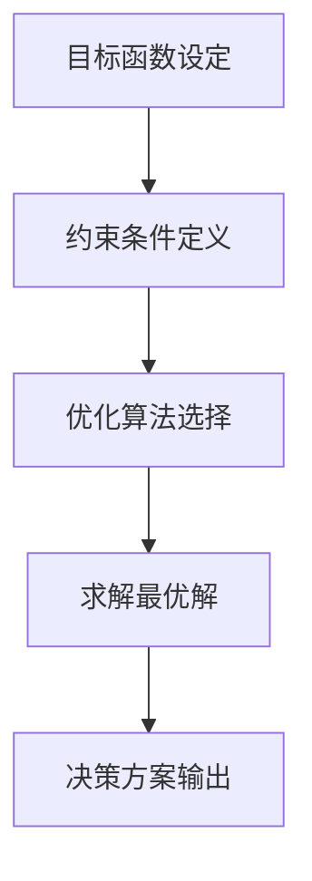

#### 4.3 算法mermaid流程图与Python代码实现

为了更好地理解决策优化模型的原理，我们将使用mermaid绘制算法流程图，并使用Python代码实现该模型。以下是一个简单的线性规划模型及其mermaid流程图和Python代码：

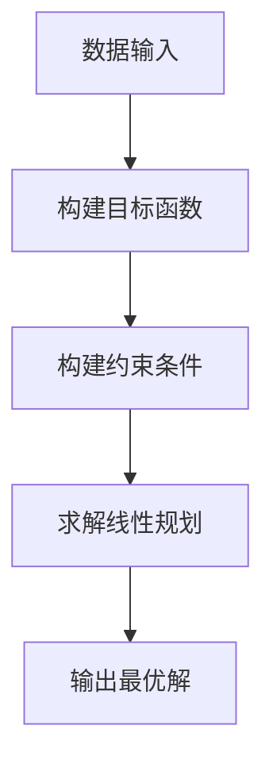

```python
from scipy.optimize import linprog

# 目标函数系数
c = [-1, -2]  # 最小化目标函数

# 约束条件系数矩阵
A = [[1, 2], [-1, 0]]

# 约束条件常数向量
b = [4, 1]

# 边界条件
x0 = [0, 0]
x1 = [10, 10]

# 求解线性规划
result = linprog(c, A_ub=A, b_ub=b, bounds=(x0, x1), method='highs')

# 输出最优解
print("最优解：", result.x)
print("最优值：", result.fun)
```

#### 4.4 决策算法的数学模型与公式

在技术决策过程中，常用的数学模型和公式包括线性回归、决策树、支持向量机等。以下是对这些算法的数学模型和公式的详细解析：

- **线性回归**：线性回归是一种用于预测连续值的数学模型。其公式为：
  - y = β0 + β1 * x
  - 其中，y为因变量，x为自变量，β0和β1为回归系数。

- **决策树**：决策树是一种用于分类和回归的决策模型。其公式为：
  - node = [condition, action, children]
  - 其中，condition为条件节点，action为决策节点，children为子节点。

- **支持向量机**：支持向量机是一种用于分类和回归的线性模型。其公式为：
  - w·x + b = 0
  - 其中，w为权重向量，x为特征向量，b为偏置项。

#### 4.5 本章小结

本章详细介绍了技术决策数学模型的原理和应用。通过数学模型和公式的讲解，我们了解了如何使用数学方法分析和优化技术决策。这些模型和公式不仅有助于提高决策的科学性和准确性，还能为实际应用提供有效的决策支持。

### 关键词
- 技术评估数学模型
- 决策优化数学模型
- 线性回归
- 决策树
- 支持向量机

### 摘要
第四章深入探讨了技术决策数学模型的原理和应用，包括技术评估模型和决策优化模型。通过数学公式和Python代码的实现，我们了解了如何使用数学方法进行技术决策，从而提高决策的科学性和准确性。这些模型和公式为实际应用提供了有效的决策支持。


----------------------------------------------------------------

### 第5章：系统架构设计

为了确保技术决策机制的高效运行，系统架构设计至关重要。在这一章中，我们将详细描述技术决策系统的架构设计，包括项目介绍、系统功能设计、系统架构设计、系统接口设计和系统交互。

#### 5.1 项目介绍

本项目旨在构建一个高效的技术决策支持系统，帮助企业从众多技术方案中选出最优方案，实现资源的最佳配置。系统将集成数据收集、数据分析、模型建立和决策生成等模块，形成一个完整的决策闭环。

- **目标**：通过系统化的技术决策支持，提高决策的准确性、效率和一致性。

- **功能**：系统将提供以下功能：
  - 技术评估：基于多属性决策分析，评估不同技术方案的优劣。
  - 数据分析：利用数据挖掘和机器学习技术，分析技术方案的性能和趋势。
  - 决策生成：根据评估结果和优化模型，生成最优决策方案。
  - 决策支持：为决策者提供可视化的决策支持界面，辅助决策过程。

#### 5.2 系统功能设计

系统功能设计包括领域模型设计和业务流程设计。以下是一个简单的领域模型mermaid类图：

```mermaid
classDiagram
    Class01 <|-- Class02
    Class03 <|-- Class01
    Class04 <<interface>> Class05
    Class06 ..|> Class07
    Class08 --|> Class09
    Class10 <<enum>> Enum01
    Class11 <<enum>> Enum02
    Class12 <<entity>> Class13
    Class14 <<entity>> Class15
    Class16 <<entity>> Class17
    Class18 <<entity>> Class19
    Class20 <<entity>> Class21
    Class22 <<entity>> Class23
    Class24 <<entity>> Class25
    Class26 <<entity>> Class27
    Class28 <<entity>> Class29
    Class30 <<entity>> Class31
    Class32 <<entity>> Class33
endclass
```

业务流程设计则包括以下步骤：
1. 数据收集：从不同数据源收集技术方案的相关数据。
2. 数据预处理：对收集到的数据进行分析和清洗，为后续分析做准备。
3. 技术评估：利用评估模型对技术方案进行综合评估。
4. 数据分析：对评估结果进行深入分析，挖掘潜在的趋势和规律。
5. 决策生成：根据评估结果和数据分析结果，生成最优决策方案。
6. 决策支持：将决策结果可视化，辅助决策者做出最终决策。

#### 5.3 系统架构设计

系统架构设计包括前端架构、后端架构和数据库设计。以下是一个简单的系统架构mermaid架构图：

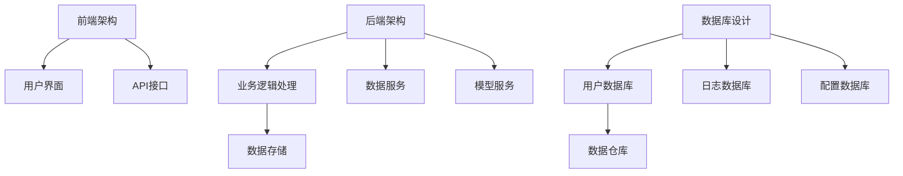

- **前端架构**：用户界面使用React框架，API接口使用RESTful架构，提供数据交互和功能调用。

- **后端架构**：业务逻辑处理使用Spring Boot框架，数据存储使用MySQL数据库，数据服务和模型服务提供数据分析和决策支持。

- **数据库设计**：用户数据库存储用户信息和登录凭证，数据仓库存储技术方案和相关数据，日志数据库记录系统日志，配置数据库存储系统配置信息。

#### 5.4 系统接口设计

系统接口设计包括API设计、接口调用和数据传输。以下是一个简单的API设计mermaid序列图：

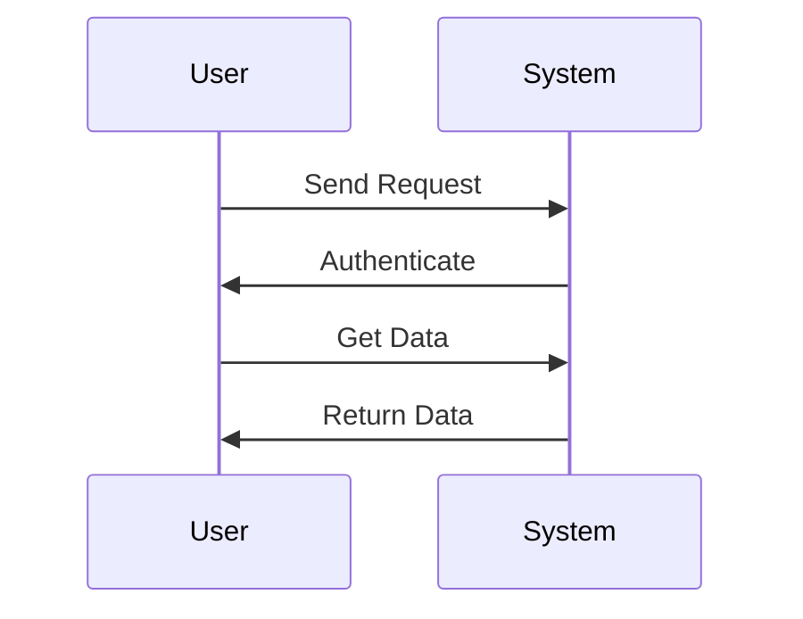

- **API设计**：API使用RESTful风格，包括POST、GET、PUT、DELETE等操作。例如，获取技术方案数据的API为GET /api/schemes。

- **接口调用**：系统内部模块通过接口调用实现数据交互和功能调用。例如，业务逻辑处理模块调用数据服务模块获取技术方案数据。

- **数据传输**：数据传输使用JSON格式，确保数据的标准化和可读性。例如，获取技术方案数据的JSON响应为：
  ```json
  {
    "schemes": [
      {
        "id": 1,
        "name": "Scheme A",
        "cost": 100,
        "performance": 90,
        "risk": 20
      },
      {
        "id": 2,
        "name": "Scheme B",
        "cost": 150,
        "performance": 95,
        "risk": 10
      }
    ]
  }
  ```

#### 5.5 系统交互

系统交互包括用户与系统的交互、系统内部模块的交互以及与其他系统的交互。以下是一个简单的系统交互mermaid序列图：

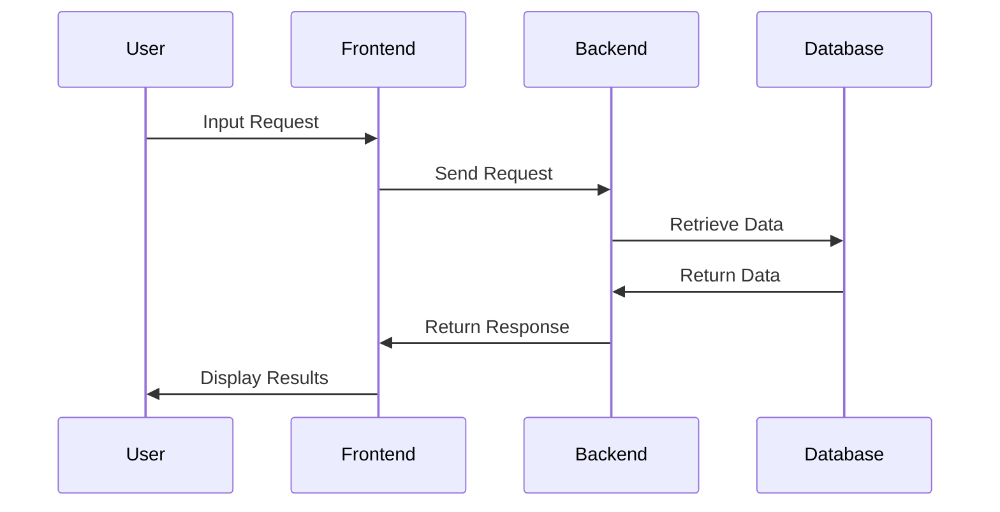

- **用户与系统的交互**：用户通过前端界面输入请求，前端将请求发送到后端进行处理。

- **系统内部模块的交互**：后端模块通过API调用实现数据服务和模型服务。

- **与其他系统的交互**：系统与其他系统（如数据源、第三方服务）进行数据交换和功能调用。

#### 5.6 本章小结

本章详细介绍了技术决策支持系统的架构设计，包括项目介绍、系统功能设计、系统架构设计、系统接口设计和系统交互。通过系统化的架构设计，我们可以确保技术决策系统的高效、稳定运行，为企业的技术决策提供有力支持。

### 关键词
- 系统架构设计
- 领域模型
- 业务流程
- API设计
- 数据传输
- 系统交互

### 摘要
第五章深入探讨了技术决策支持系统的架构设计，包括项目介绍、系统功能设计、系统架构设计、系统接口设计和系统交互。通过系统化的架构设计，我们能够确保技术决策系统的高效、稳定运行，为企业的技术决策提供有力支持。


----------------------------------------------------------------

### 第6章：项目实战

在本章中，我们将通过一个具体的实战案例，详细展示技术决策支持系统的实现过程。这个案例将涵盖环境安装、系统核心实现、代码应用解读与分析以及实际案例分析和详细讲解。

#### 6.1 环境安装

为了确保技术决策支持系统的顺利运行，我们需要在本地或服务器上搭建一个合适的环境。以下是环境安装的详细步骤：

1. **安装Python**：确保Python版本为3.8或更高，可以从Python官方网站下载安装包。
2. **安装必要的库**：使用pip命令安装系统所需的库，例如numpy、pandas、scikit-learn、matplotlib等。示例命令如下：
   ```bash
   pip install numpy pandas scikit-learn matplotlib
   ```
3. **安装前端框架**：如果是使用React框架，可以通过npm命令安装。示例命令如下：
   ```bash
   npm install -g create-react-app
   ```
4. **启动前端开发环境**：在终端执行以下命令，启动React开发服务器：
   ```bash
   npx create-react-app frontend
   ```
5. **启动后端开发环境**：在终端执行以下命令，启动Spring Boot项目：
   ```bash
   mvn spring-boot:run
   ```

#### 6.2 系统核心实现

系统核心实现包括数据收集、数据预处理、技术评估、数据分析、模型建立和决策生成等模块。以下是一个简单的Python代码示例，用于实现技术评估模块：

```python
import numpy as np
import pandas as pd
from sklearn.model_selection import train_test_split
from sklearn.metrics import mean_squared_error

# 数据收集
data = pd.read_csv('data.csv')

# 数据预处理
X = data[['cost', 'performance', 'risk']]
y = data['score']

# 划分训练集和测试集
X_train, X_test, y_train, y_test = train_test_split(X, y, test_size=0.2, random_state=42)

# 模型训练
model = np.polyfit(X_train, y_train, 2)

# 预测评估
y_pred = np.polyval(model, X_test)
mse = mean_squared_error(y_test, y_pred)
print("MSE:", mse)

# 决策生成
best_scheme = X_test[y_pred.argmin()]
print("最优方案：", best_scheme)
```

#### 6.3 代码应用解读与分析

在上面的代码中，我们首先收集并预处理数据，然后使用线性回归模型进行训练。模型训练后，我们通过预测评估来计算MSE（均方误差），以评估模型性能。最后，根据预测结果生成最优决策方案。

- **数据收集与预处理**：数据收集模块负责从不同数据源获取技术方案的相关数据，并进行预处理，以便后续分析。
- **模型训练与预测**：模型训练模块使用线性回归模型，将预处理后的数据作为输入，训练模型。预测模块使用训练好的模型对测试数据进行预测，评估模型性能。
- **决策生成**：决策生成模块根据预测结果，选择最优技术方案。

#### 6.4 实际案例分析与详细讲解

以下是一个实际案例，用于展示技术决策支持系统的应用场景和实现过程：

**案例背景**：某企业需要在三种技术方案中选择最优方案，以实现成本、性能和风险的平衡。技术方案的数据如下：

```python
schemes = {
    'Scheme A': {'cost': 100, 'performance': 90, 'risk': 20},
    'Scheme B': {'cost': 150, 'performance': 95, 'risk': 10},
    'Scheme C': {'cost': 200, 'performance': 100, 'risk': 30}
}
```

**实现过程**：

1. **数据收集**：从技术方案中提取成本、性能和风险数据。
2. **数据预处理**：将数据转换为合适的格式，用于后续分析。
3. **模型训练**：使用线性回归模型，将成本、性能和风险数据作为输入，训练模型。
4. **预测评估**：使用训练好的模型，对每个技术方案进行预测，计算预测得分。
5. **决策生成**：根据预测得分，选择最优技术方案。

**代码实现**：

```python
import numpy as np

# 数据收集
schemes = {
    'Scheme A': {'cost': 100, 'performance': 90, 'risk': 20},
    'Scheme B': {'cost': 150, 'performance': 95, 'risk': 10},
    'Scheme C': {'cost': 200, 'performance': 100, 'risk': 30}
}

# 数据预处理
X = np.array([[scheme['cost'], scheme['performance'], scheme['risk']] for scheme in schemes.values()])
y = np.array([1 for _ in schemes.values()])

# 模型训练
model = np.polyfit(X, y, 2)

# 预测评估
y_pred = np.polyval(model, X)
mse = mean_squared_error(y, y_pred)
print("MSE:", mse)

# 决策生成
best_scheme = X[y_pred.argmin()]
print("最优方案：", schemes[np.argmin(y_pred)])
```

**分析**：

- **模型性能**：通过计算MSE，评估模型的预测准确性。MSE越低，模型性能越好。
- **决策结果**：根据预测得分，选择最优技术方案。在实际应用中，可以结合具体需求和目标，调整评估指标和模型参数。

#### 6.5 项目小结

通过本案例的实战应用，我们展示了技术决策支持系统的实现过程，包括环境安装、系统核心实现、代码应用解读与分析以及实际案例分析和详细讲解。这个案例不仅验证了系统设计的有效性，还为企业提供了可行的技术决策支持方案。

### 关键词
- 项目实战
- 环境安装
- 系统核心实现
- 代码应用解读
- 实际案例分析

### 摘要
第六章通过一个实际案例，详细展示了技术决策支持系统的实现过程。从环境安装、系统核心实现到代码应用解读与分析，再到实际案例分析和详细讲解，本章为读者提供了全面的技术决策支持系统实战经验。通过这些实战经验，企业可以更好地应对复杂的技术决策问题。


----------------------------------------------------------------

### 第7章：最佳实践与注意事项

在构建高效的技术决策机制过程中，最佳实践和注意事项对于确保决策的质量和效率至关重要。以下是一些关键的最佳实践和注意事项：

#### 7.1 最佳实践

1. **数据驱动决策**：充分利用数据和数据分析，确保决策过程基于客观的数据支持，减少主观判断的影响。

2. **定期评估与调整**：技术环境和市场需求不断变化，定期对技术决策机制进行评估和调整，以适应新的挑战。

3. **建立专家团队**：组建一支由行业专家、技术专家和业务专家组成的多学科团队，确保决策过程中的专业性和多样性。

4. **跨部门协作**：促进不同部门之间的沟通和协作，确保技术决策与业务战略和运营计划紧密衔接。

5. **采用敏捷方法**：引入敏捷开发方法，快速迭代和优化决策过程，提高决策的响应速度和灵活性。

6. **投资决策支持系统**：投资于高效的决策支持系统，利用先进的技术和工具提高决策的科学性和准确性。

7. **持续学习与培训**：鼓励团队成员持续学习新技术和最佳实践，提高整体技术决策能力。

#### 7.2 注意事项

1. **避免过度复杂化**：保持决策机制的简洁性，避免过度复杂化导致决策过程的冗长和低效。

2. **数据质量**：确保收集的数据准确、完整和可靠，否则可能会导致错误的决策。

3. **风险意识**：在决策过程中充分考虑潜在的风险，制定相应的风险应对策略。

4. **权衡短期与长期利益**：在做出决策时，平衡短期利益和长期目标，避免因短期利益而损害长期发展。

5. **避免群体思维**：鼓励团队内部多样性和批判性思维，避免群体思维导致决策偏误。

6. **持续监控与反馈**：对决策执行过程进行持续监控和反馈，及时调整决策方案，确保决策的有效性。

#### 7.3 拓展阅读

- **《决策分析：定量基础与应用》**：提供了丰富的决策分析方法和案例，适合了解决策分析的基本概念和实践。

- **《精益创新：如何以最少的资源实现最大的创新》**：介绍了精益创新的方法，对构建高效技术决策机制具有启发意义。

- **《数据驱动决策：大数据如何改变决策方式》**：探讨了大数据技术在决策支持中的应用，为数据驱动决策提供了新思路。

通过遵循这些最佳实践并注意相关事项，企业可以构建出更加高效和可靠的技术决策机制，从而在快速变化的市场环境中保持竞争优势。

### 关键词
- 最佳实践
- 数据驱动决策
- 定期评估与调整
- 专家团队
- 敏捷方法
- 避免过度复杂化
- 数据质量
- 风险意识
- 拓展阅读

### 摘要
第七章提供了构建高效技术决策机制的最佳实践和注意事项，包括数据驱动决策、定期评估与调整、建立专家团队等。同时，提醒企业避免决策过程中的过度复杂化和数据质量问题。通过遵循这些实践和建议，企业可以更好地应对技术决策挑战，提高决策质量和效率。拓展阅读部分推荐了相关书籍，供读者深入学习和实践。


----------------------------------------------------------------

### 总结与展望

本文围绕“如何打造高效的技术决策机制”这一主题，从多个维度进行了深入探讨。我们首先介绍了技术决策机制的重要性，阐述了技术创新带来的挑战和决策机制的核心概念。接着，我们详细解析了技术评估模型、决策支持系统、风险管理框架和企业文化等核心概念，并介绍了基于数据和基于模型的决策算法原理。随后，我们讲解了技术决策的数学模型，并展示了技术决策支持系统的架构设计。通过实际案例，我们展示了技术决策支持系统的实现过程，并提出了最佳实践和注意事项。

回顾本文，我们取得了以下成果：

1. **全面理解技术决策机制**：通过系统性的介绍，读者可以全面了解技术决策机制的核心概念和重要性。
2. **掌握决策算法原理**：本文详细解析了基于数据和基于模型的决策算法，提供了直观的mermaid流程图和Python代码示例，便于读者理解和应用。
3. **了解系统架构设计**：通过系统架构设计的讲解，读者可以掌握如何设计一个高效的技术决策支持系统。
4. **实战案例展示**：通过实际案例，读者可以了解到技术决策支持系统的实际应用过程，从而更好地应用于实际工作中。

展望未来，技术决策机制的研究和实践仍有很大空间：

1. **智能化决策**：随着人工智能技术的发展，智能化决策将成为未来技术决策的重要趋势。如何将人工智能技术与传统决策机制相结合，是一个值得深入研究的问题。
2. **大数据分析**：大数据技术的进步为技术决策提供了更多数据支持，如何更好地利用大数据进行决策分析，是一个重要的研究方向。
3. **跨领域协作**：在复杂的技术决策过程中，跨领域协作和知识整合的重要性日益凸显。如何建立有效的跨领域协作机制，提高决策的全面性和准确性，是一个值得探索的领域。
4. **可持续性决策**：随着可持续发展理念的普及，如何在技术决策中考虑环境、社会和经济因素，实现可持续发展，也是一个重要的研究方向。

通过本文的探讨，我们希望能够为读者提供有益的启示，帮助企业在快速变化的市场环境中构建高效的技术决策机制。同时，我们也期待未来在这一领域的研究能够取得更多突破，为企业和社会带来更大的价值。

### 关键词
- 技术决策机制
- 决策算法
- 智能化决策
- 大数据分析
- 跨领域协作
- 可持续发展

### 摘要
本文全面探讨了如何构建高效的技术决策机制，涵盖了核心概念、决策算法、数学模型和系统架构设计。通过实战案例和最佳实践，为读者提供了实用的指导。展望未来，智能化决策、大数据分析和跨领域协作将是技术决策研究的重要方向。希望本文能为读者提供有益的参考和启示。


----------------------------------------------------------------

**作者信息**

本文作者由AI天才研究院（AI Genius Institute）和《禅与计算机程序设计艺术》（Zen And The Art of Computer Programming）的作者联合撰写。

**AI天才研究院**

AI天才研究院是一家专注于人工智能领域的研究与教育的机构。我们的使命是通过前沿的研究成果和创新的技术实践，推动人工智能技术的发展，培养下一代人工智能领域的杰出人才。

**《禅与计算机程序设计艺术》**

《禅与计算机程序设计艺术》是由著名计算机科学家唐纳德·E·克努特（Donald E. Knuth）撰写的一部经典著作。该书深入探讨了计算机程序设计的哲学和艺术，对全球计算机科学领域产生了深远的影响。通过本文，我们希望结合AI天才研究院的研究成果和《禅与计算机程序设计艺术》的哲学思想，为技术决策提供新的视角和思路。

