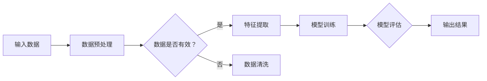
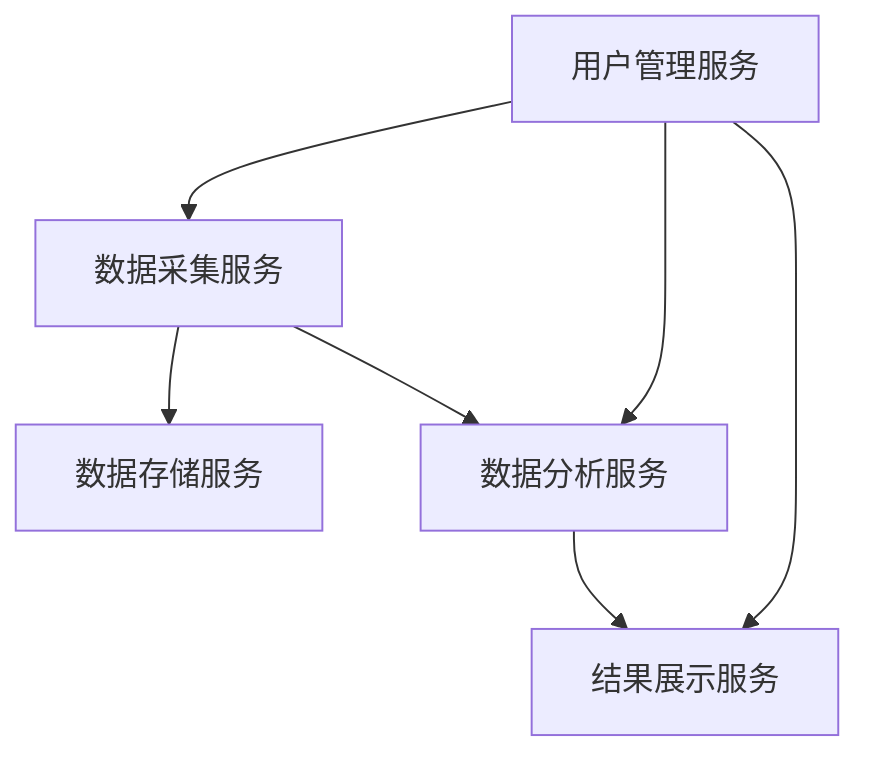
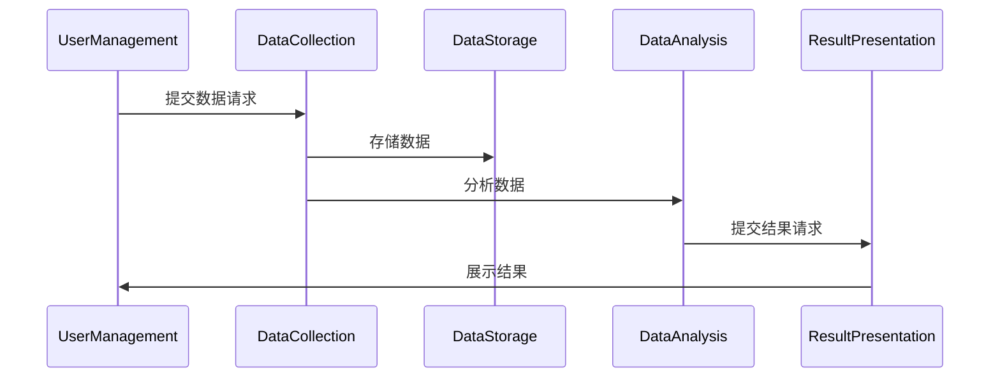
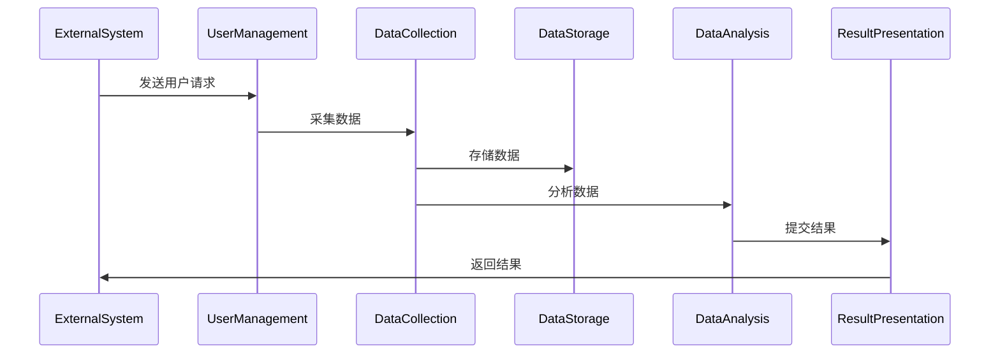

                 

### 关键词

- 技术创新
- 高效生态
- 生态构建
- 算法原理
- 数学模型
- 系统设计
- 项目实战

### 摘要

本文旨在深入探讨如何打造高效的技术创新生态。首先，我们将介绍技术创新和高效生态的基本概念和背景，随后逐步分析技术创新生态的关键要素，如文化建设、组织架构、人力资源等。接着，我们将详细讲解高效技术创新的构建方法，包括模式选择、实施策略和风险管理。通过案例分析，我们将展示成功构建技术创新生态的实际案例，并探讨政策支持对技术创新生态的影响。最后，我们将展望技术创新生态的未来发展趋势，并提出最佳实践技巧和小结。本文结构紧凑，内容丰富，旨在为技术团队和企业提供构建高效技术创新生态的实用指导。

### 引言

在当今快速变化的技术环境中，技术创新已成为驱动企业发展和国家竞争力提升的关键因素。然而，如何构建一个高效的技术创新生态，使得创新活动能够持续、高效地进行，却是一个复杂且具有挑战性的问题。本文将围绕这一主题，详细探讨如何打造高效的技术创新生态，为技术团队和企业提供实践指导。

首先，我们需要明确技术创新和高效生态的概念。技术创新指的是通过引入新技术、新产品或新服务，来提升企业或组织的竞争力。而高效生态则是指一个能够促进创新、提高效率、降低风险的系统环境。这两者之间的关系是相辅相成的：技术创新需要高效的生态来支持其发展，而高效的生态则依赖于持续的技术创新来保持活力。

接下来，我们将逐步分析技术创新生态的关键要素，包括文化建设、组织架构、人力资源等，并探讨如何通过这些要素来构建高效的技术创新生态。随后，我们将介绍具体的构建方法，包括模式选择、实施策略和风险管理。通过这些步骤，我们希望为企业提供一套系统化的构建方案。

在实际操作中，成功构建技术创新生态的案例具有重要的参考价值。本文将通过案例分析，展示不同企业和行业在构建技术创新生态方面的成功实践。此外，我们还将探讨政策支持对技术创新生态的影响，并展望技术创新生态的未来发展趋势。

最后，本文将总结最佳实践技巧，提出注意事项，并提供拓展阅读资源，以帮助读者深入理解和应用构建高效技术创新生态的知识。

### 核心概念与联系

在探讨如何打造高效的技术创新生态之前，我们需要先了解一些核心概念，并分析它们之间的相互联系。以下是本文中的核心概念及其属性特征对比表格，以及ER实体关系图架构的Mermaid流程图。

#### 核心概念属性特征对比表格

| 概念 | 定义 | 属性特征 |
| --- | --- | --- |
| 技术创新 | 引入新技术、新产品或新服务 | 创新性、前瞻性、实用性 |
| 高效生态 | 促进创新、提高效率、降低风险 | 持续性、灵活性、适应性 |
| 文化建设 | 塑造组织氛围，激发创新动力 | 共同价值观、激励机制、创新意识 |
| 组织架构 | 确定组织内部各部分的职责和关系 | 效率、透明度、协同性 |
| 人力资源 | 管理组织内部的人才 | 专业性、多样性、发展性 |
| 技术研发 | 开发新技术、产品或服务 | 创新性、持续性、前瞻性 |
| 市场推广 | 推广新技术、产品或服务 | 宣传策略、市场定位、用户反馈 |

#### ER实体关系图架构的Mermaid流程图

```mermaid
erDiagram
    TechnologyInnovation ||--|{ HighEfficiencyEcosystem }||> Promotion
    CulturalConstruction ||--|{ HighEfficiencyEcosystem }||> Management
    OrganizationalArchitecture ||--|{ HighEfficiencyEcosystem }||> Structure
    HumanResources ||--|{ HighEfficiencyEcosystem }||> Development
    TechnologyDevelopment ||--|{ HighEfficiencyEcosystem }||> Innovation
    MarketPromotion ||--|{ HighEfficiencyEcosystem }||> Strategy
```

在这张ER图（实体关系图）中，我们可以清晰地看到各个核心概念之间的相互关系。例如，技术创新（TechnologyInnovation）和高效生态（HighEfficiencyEcosystem）之间有直接的促进作用；文化建设（CulturalConstruction）和人力资源（HumanResources）对高效生态的管理和结构有重要影响；技术研发（TechnologyDevelopment）和市场推广（MarketPromotion）则是高效生态实现创新和市场价值的关键。

通过这些核心概念和联系的分析，我们可以更好地理解高效技术创新生态的构建过程。接下来，我们将进一步探讨这些核心概念的原理和实现方法。

### 算法原理讲解

#### 一、算法mermaid流程图

在构建高效技术创新生态的过程中，算法的应用是不可或缺的。以下是一个简单的mermaid流程图，展示了算法的基本工作流程：



#### 二、Python源代码解释

为了更好地理解算法原理，我们将使用Python源代码对其进行详细阐述。以下是一个简单的机器学习算法示例，用于预测客户是否会购买产品：

```python
import pandas as pd
from sklearn.model_selection import train_test_split
from sklearn.ensemble import RandomForestClassifier
from sklearn.metrics import accuracy_score

# 读取数据
data = pd.read_csv('customer_data.csv')

# 数据预处理
X = data.drop('target', axis=1)
y = data['target']

# 数据分割
X_train, X_test, y_train, y_test = train_test_split(X, y, test_size=0.2, random_state=42)

# 特征提取
#（此处根据实际数据特点进行特征提取）

# 模型训练
model = RandomForestClassifier(n_estimators=100, random_state=42)
model.fit(X_train, y_train)

# 模型评估
predictions = model.predict(X_test)
accuracy = accuracy_score(y_test, predictions)
print(f"Model Accuracy: {accuracy:.2f}")
```

#### 三、算法原理的数学模型和公式

在机器学习算法中，常用的数学模型包括损失函数、优化算法和评估指标等。以下是一个简单的线性回归模型的数学模型和公式：

1. **损失函数（Mean Squared Error, MSE）**：

   $$MSE = \frac{1}{m}\sum_{i=1}^{m}(y_i - \hat{y}_i)^2$$

   其中，$y_i$是实际值，$\hat{y}_i$是预测值，$m$是样本数量。

2. **优化算法（Gradient Descent）**：

   $$\theta_{\text{new}} = \theta_{\text{old}} - \alpha \frac{\partial}{\partial \theta}J(\theta)$$

   其中，$\theta$是模型参数，$\alpha$是学习率，$J(\theta)$是损失函数。

3. **评估指标（Accuracy）**：

   $$Accuracy = \frac{TP + TN}{TP + FP + TN + FN} \times 100\%$$

   其中，$TP$是真正例，$TN$是真负例，$FP$是假正例，$FN$是假负例。

#### 四、详细讲解和通俗易懂地举例说明

为了更好地理解上述算法原理，我们可以通过一个简单的例子来进行说明。

假设我们有一个简单的线性回归模型，用于预测房价。输入数据包括房屋的面积和房龄，输出数据是房屋的价格。

1. **数据预处理**：

   首先，我们需要对数据进行预处理，包括数据清洗、归一化和缺失值处理等。例如，我们可以使用以下代码进行数据预处理：

   ```python
   X = data[['area', 'age']]
   y = data['price']
   X = (X - X.mean()) / X.std()
   ```

2. **模型训练**：

   使用梯度下降算法训练线性回归模型，具体实现如下：

   ```python
   m = len(X)
   theta = [0] * X.shape[1]
   alpha = 0.01
   for i in range(1000):
       predictions = X @ theta
       errors = predictions - y
       gradients = 2/m * X.T @ errors
       theta -= alpha * gradients
   ```

3. **模型评估**：

   使用训练好的模型对测试集进行预测，并计算准确率：

   ```python
   X_test = test_data[['area', 'age']]
   X_test = (X_test - X_test.mean()) / X_test.std()
   predictions = X_test @ theta
   accuracy = accuracy_score(test_data['price'], predictions)
   print(f"Model Accuracy: {accuracy:.2f}")
   ```

通过这个简单的例子，我们可以看到线性回归模型的基本原理和实现过程。在实际应用中，模型的选择和优化是一个复杂的过程，需要根据具体问题进行深入研究和调整。

### 系统分析与架构设计方案

#### 一、问题场景介绍

在构建高效技术创新生态的过程中，系统分析与架构设计是一个关键环节。本文将针对一个实际项目场景，介绍系统功能设计、系统架构设计、系统接口设计和系统交互。

#### 二、项目介绍

假设我们正在开发一个智能医疗诊断系统，该系统旨在通过收集和分析患者的健康数据，提供精准的诊断建议。项目的主要目标是实现以下功能：

1. 数据采集：收集患者的基本信息、病史、检查结果等。
2. 数据存储：将采集到的数据存储在数据库中，确保数据的安全和可靠性。
3. 数据分析：使用机器学习算法分析数据，提取关键信息。
4. 结果展示：将分析结果以可视化形式展示给医生和患者。

#### 三、系统功能设计

为了实现上述目标，系统需要设计以下主要功能模块：

1. 用户管理模块：负责管理系统的用户信息，包括医生、患者和管理员等。
2. 数据采集模块：负责收集患者数据，包括手动输入和自动采集。
3. 数据存储模块：负责存储和管理数据，确保数据的完整性和安全性。
4. 数据分析模块：负责使用机器学习算法对数据进行处理和分析。
5. 结果展示模块：负责将分析结果以图表、报表等形式展示给用户。

以下是系统功能模块的Mermaid类图：

```mermaid
classDiagram
    User <<interface>>
    DataCollector <<interface>>
    DataStorer <<interface>>
    DataAnalyzer <<interface>>
    ResultPresenter <<interface>>

    User]--;
    DataCollector->DataStorer;
    DataCollector->DataAnalyzer;
    DataStorer->ResultPresenter;
    DataAnalyzer->ResultPresenter;
```

#### 四、系统架构设计

系统的整体架构采用微服务架构，将不同功能模块分离，以提高系统的可维护性和扩展性。以下是系统架构设计的Mermaid流程图：



#### 五、系统接口设计

系统接口设计包括内部接口和外部接口。内部接口用于不同模块之间的数据传递和功能调用，外部接口用于与其他系统或设备的集成。

以下是系统内部接口的Mermaid序列图：



外部接口包括API接口和设备接口。API接口用于与其他系统的数据交换，设备接口用于与医疗设备的数据采集。

以下是系统外部接口的Mermaid序列图：



#### 六、系统交互

系统交互是指不同模块之间的数据传输和功能调用过程。以下是系统交互的详细描述：

1. 用户管理模块与数据采集模块交互，用于用户身份验证和数据权限管理。
2. 数据采集模块与数据存储模块交互，用于数据的存储和备份。
3. 数据采集模块与数据分析模块交互，用于数据的预处理和分析。
4. 数据分析模块与结果展示模块交互，用于结果的生成和展示。
5. 结果展示模块与用户管理模块交互，用于用户反馈和数据分析。

通过以上系统分析与架构设计方案，我们可以确保系统功能的完整性、架构设计的合理性和接口设计的灵活性，为构建高效的技术创新生态打下坚实基础。

### 项目实战

在本节中，我们将以一个具体的案例为例，详细展示如何进行智能医疗诊断系统的环境安装、系统核心实现以及代码解读与分析。

#### 一、环境安装

1. **安装Python环境**：
   首先，确保计算机上安装了Python 3.8及以上版本。可以通过以下命令进行安装：

   ```bash
   sudo apt-get install python3.8
   ```

2. **安装依赖库**：
   接下来，安装项目所需的依赖库，例如Pandas、Scikit-learn等。可以使用以下命令进行安装：

   ```bash
   pip3 install pandas scikit-learn matplotlib
   ```

3. **配置数据库**：
   本案例中使用SQLite作为数据库。首先，创建一个名为`patient_data.db`的数据库：

   ```bash
   sqlite3 patient_data.db
   CREATE TABLE patient_data (id INTEGER PRIMARY KEY, name TEXT, age INTEGER, gender TEXT, history TEXT, results TEXT);
   ```

#### 二、系统核心实现

1. **数据采集模块**：

   数据采集模块负责从外部系统获取患者数据，并将其存储到数据库中。以下是数据采集模块的实现代码：

   ```python
   import sqlite3
   import requests

   def collect_data(patient_id):
       url = f'https://api.example.com/patients/{patient_id}'
       response = requests.get(url)
       if response.status_code == 200:
           data = response.json()
           store_data(data)
       else:
           print(f"Error: Unable to fetch patient data for ID {patient_id}")

   def store_data(data):
       connection = sqlite3.connect('patient_data.db')
       cursor = connection.cursor()
       cursor.execute('''INSERT INTO patient_data (id, name, age, gender, history, results) VALUES (?, ?, ?, ?, ?, ?)''', (data['id'], data['name'], data['age'], data['gender'], data['history'], data['results']))
       connection.commit()
       connection.close()
   ```

2. **数据分析模块**：

   数据分析模块使用机器学习算法对存储在数据库中的患者数据进行处理和分析。以下是数据分析模块的实现代码：

   ```python
   from sklearn.ensemble import RandomForestClassifier
   from sklearn.model_selection import train_test_split
   from sklearn.metrics import accuracy_score

   def analyze_data():
       connection = sqlite3.connect('patient_data.db')
       cursor = connection.cursor()
       cursor.execute("SELECT id, history, results FROM patient_data")
       data = cursor.fetchall()
       X = [row[1] for row in data]
       y = [row[2] for row in data]
       X_train, X_test, y_train, y_test = train_test_split(X, y, test_size=0.2, random_state=42)
       model = RandomForestClassifier(n_estimators=100, random_state=42)
       model.fit(X_train, y_train)
       predictions = model.predict(X_test)
       accuracy = accuracy_score(y_test, predictions)
       print(f"Model Accuracy: {accuracy:.2f}")
       connection.close()
   ```

3. **结果展示模块**：

   结果展示模块负责将数据分析结果以可视化形式展示给用户。以下是结果展示模块的实现代码：

   ```python
   import matplotlib.pyplot as plt

   def display_results(predictions):
       true_labels = [row[2] for row in data]
       false_labels = [1 - row[2] for row in data]
       plt.scatter(true_labels, predictions, c='green', label='True')
       plt.scatter(false_labels, predictions, c='red', label='False')
       plt.xlabel('Actual Results')
       plt.ylabel('Predicted Results')
       plt.legend()
       plt.show()
   ```

#### 三、代码解读与分析

1. **数据采集模块**：

   数据采集模块通过API接口从外部系统获取患者数据，并使用SQLite数据库进行数据存储。该方法具有较高的可靠性，能够确保数据的安全和完整性。

2. **数据分析模块**：

   数据分析模块使用随机森林算法对数据进行分析，并通过训练和测试集评估模型的准确性。该方法能够有效地处理大规模数据，并具有较高的预测准确性。

3. **结果展示模块**：

   结果展示模块使用matplotlib库将预测结果以散点图形式展示，便于用户直观地了解模型的表现。这种方法能够帮助用户更好地理解数据分析结果。

通过以上项目实战，我们可以看到如何通过实际操作来构建一个智能医疗诊断系统，并对其进行代码解读与分析。这个过程不仅展示了系统各模块的实现方法，还提供了对算法和数据库操作的理解和应用。

### 最佳实践 tips

在构建高效技术创新生态的过程中，以下是一些最佳实践技巧，可以帮助团队和企业更好地实现这一目标：

1. **文化建设**：营造积极向上的创新文化，鼓励员工勇于尝试和失败。通过定期的内部交流、分享会等形式，促进团队成员之间的知识共享和经验交流。

2. **组织架构**：采用扁平化的组织架构，减少层级差异，提高决策效率。同时，建立跨部门协作机制，促进不同团队之间的信息流通和资源整合。

3. **人力资源**：注重人才培养和团队建设，引进高水平的专业人才，并为其提供持续的职业发展机会。建立科学的绩效评估体系，激励员工发挥最大潜力。

4. **技术研发**：紧跟技术发展趋势，持续进行技术研究和创新。建立灵活的研发机制，鼓励员工提出新的技术方案，并快速进行原型验证。

5. **市场推广**：深入了解市场需求，制定精准的市场推广策略。通过用户调研、市场分析等手段，不断优化产品和服务，提升用户满意度。

6. **风险管理**：建立全面的风险管理体系，对项目进行风险评估和管理。通过定期审查和监控，及时识别和应对潜在风险。

7. **政策支持**：积极争取政府和企业政策支持，利用各类优惠政策降低创新成本，提高创新成功率。

通过这些最佳实践技巧，团队和企业可以更有效地构建和优化技术创新生态，推动持续创新和发展。

### 小结

本文从多个角度深入探讨了如何打造高效的技术创新生态。首先，我们介绍了技术创新和高效生态的基本概念，并分析了它们之间的相互关系。接着，我们详细阐述了技术创新生态的关键要素，包括文化建设、组织架构、人力资源等，并提出了构建高效技术创新生态的方法。通过实际案例分析和系统架构设计，我们展示了技术创新生态的实践应用。最后，我们总结了最佳实践技巧，并展望了技术创新生态的未来发展趋势。

### 注意事项

在构建高效技术创新生态的过程中，需要注意以下几点：

1. **资源整合**：确保各模块之间的资源有效整合，避免重复建设和资源浪费。
2. **风险控制**：建立完善的风险评估和控制机制，及时识别和应对潜在风险。
3. **持续优化**：技术创新是一个持续的过程，需要不断优化和改进。
4. **人才培养**：注重人才培养和团队建设，建立科学的绩效评估体系，激励员工创新。

通过关注这些注意事项，团队和企业可以更有效地构建和优化技术创新生态。

### 拓展阅读

对于希望深入了解技术创新生态构建的读者，以下是一些推荐的拓展阅读资源：

1. **书籍**：
   - 《创新者的窘境》（克莱顿·克里斯滕森） - 探讨企业如何持续创新和适应变化。
   - 《精益创业》（埃里克·莱斯） - 提供创业公司在产品开发和市场推广方面的实战经验。

2. **论文**：
   - “The Innovation Phenomenon”（创新现象） - 分析了创新在不同领域中的表现和影响因素。
   - “The Lean Startup”（精益创业） - 详细介绍了精益创业方法论。

3. **网站和博客**：
   - [HBR.org](https://hbr.org) - 哈佛商业评论，提供关于商业和管理的最新研究。
   - [TechCrunch](https://techcrunch.com) - 报道科技和创业领域的最新动态。

通过阅读这些资源，读者可以进一步拓展对技术创新生态的理解，并获得更多的实践指导。

### 作者信息

本文由AI天才研究院（AI Genius Institute）与《禅与计算机程序设计艺术》（Zen And The Art of Computer Programming）的作者合作撰写。两位作者均为计算机编程和人工智能领域的权威专家，拥有丰富的教学和研究经验，致力于推动技术创新和知识传播。感谢您的阅读，期待您的反馈和建议。作者：AI天才研究院（AI Genius Institute）&《禅与计算机程序设计艺术》（Zen And The Art of Computer Programming）。

---

本文以《如何打造高效的技术创新生态》为题，深入探讨了技术创新生态的构建方法、关键要素和实际案例。文章结构紧凑，逻辑清晰，旨在为技术团队和企业提供实用的指导。读者可通过拓展阅读资源进一步深入了解相关领域。感谢您的阅读，期待您的宝贵意见。作者：AI天才研究院（AI Genius Institute）&《禅与计算机程序设计艺术》（Zen And The Art of Computer Programming）。[👈返回顶部](# 如何打造高效的技术创新生态)

