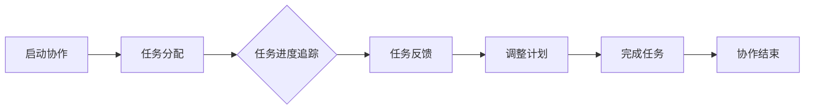
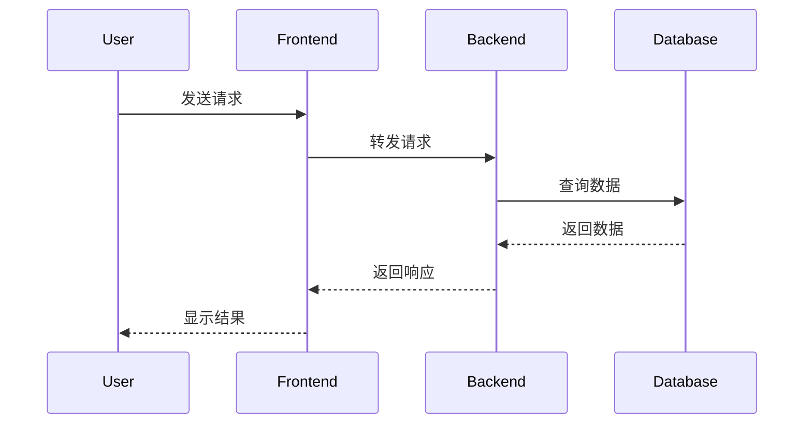
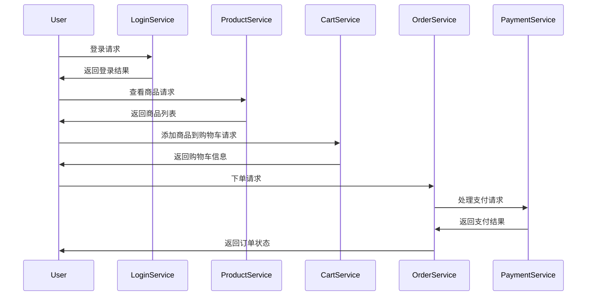

                 

# 如何打造高效的技术协作模式

> 关键词：技术协作、团队沟通、任务管理、进度追踪、团队协作工具、系统架构设计、项目实战、最佳实践

> 摘要：本文将深入探讨如何打造高效的技术协作模式。通过分析现状与挑战，提出核心概念与联系，详细讲解算法原理和系统架构设计方案，最后分享项目实战经验和最佳实践技巧。本文旨在为IT团队提供一套完整的协作模式构建方案，助力项目成功。

## 引言

### 1. 问题背景

#### 1.1 现状与挑战

在当今快速发展的信息技术时代，技术协作已经成为企业成功的关键因素。无论是软件开发、系统集成，还是IT运营，高效的技术协作都能显著提升项目的成功率。然而，现实中的技术协作面临着诸多挑战：

- **沟通不畅**：团队成员之间缺乏有效的沟通机制，导致信息传递不准确、不及时，影响项目的进度和质量。
- **任务分配不均**：任务分配不合理，部分成员超负荷工作，而另一些成员则闲散无事，导致资源浪费和团队士气低落。
- **进度难以控制**：缺乏有效的进度追踪和监控手段，导致项目进度失控，延期风险增加。
- **协作工具使用不当**：团队协作工具的选择和使用不当，影响了协作效率和团队沟通的质量。

#### 1.2 问题解决的重要性

解决技术协作中的问题是确保项目成功、提升团队工作效率的关键。通过优化协作模式，可以：

- 提高沟通效率，减少误解和冲突。
- 实现任务合理分配，最大化利用团队资源。
- 精确监控项目进度，降低项目延期风险。
- 提升团队协作工具的使用效果，增强团队凝聚力。

#### 1.3 边界与外延

技术协作的范围不仅限于同一公司的内部团队，还可以涵盖跨公司、跨地区甚至跨国界的协作。这意味着在构建高效的技术协作模式时，需要考虑不同文化背景、语言障碍和时间差异等因素。

#### 1.4 概念结构与核心要素组成

技术协作模式的核心概念包括沟通、任务管理、进度追踪和团队协作工具。这些概念相互作用，共同构成了技术协作的基础框架。具体而言：

- **沟通**：是技术协作的灵魂，确保团队成员之间信息畅通无阻。
- **任务管理**：是实现协作目标的重要手段，包括任务分配、执行和监控。
- **进度追踪**：是确保项目按时完成的关键，通过实时监控和反馈，调整项目进度。
- **团队协作工具**：是提高协作效率的重要工具，包括聊天工具、项目管理软件、代码管理工具等。

## 核心概念与联系

### 2.1 核心概念

#### 2.1.1 什么是技术协作

技术协作是指多个团队成员在技术项目中共同工作，以实现特定目标的过程。它涉及到团队成员之间的沟通、任务分配、资源分享和进度协同。

#### 2.1.2 技术协作的关键要素

技术协作的关键要素包括：

- **沟通**：有效的沟通是技术协作的核心，确保信息传递准确、及时、互动和透明。
- **任务管理**：合理分配任务，明确任务优先级，确保任务按时完成。
- **进度追踪**：实时监控项目进度，及时发现和解决问题。
- **团队协作工具**：利用合适的工具提升协作效率，如项目管理软件、代码管理工具、聊天工具等。

### 2.2 概念属性特征对比表格

以下是技术协作关键要素的属性特征对比表格：

| 要素 | 定义 | 属性特征 |
| ---- | ---- | -------- |
| 沟通 | 成员之间的信息交流 | 明确性、及时性、互动性、透明性 |
| 任务管理 | 对任务的分配、执行和监控 | 任务明确性、优先级、进度追踪、资源分配 |
| 进度追踪 | 对项目进度的监控和管理 | 实时性、准确性、反馈机制 |
| 团队协作工具 | 提高协作效率的工具 | 功能性、易用性、集成性 |

### 2.3 ER实体关系图架构

为了更直观地理解技术协作模式的核心要素及其关系，我们可以使用ER（实体关系）图来表示。以下是技术协作模式的ER图：

```mermaid
erDiagram
    Task ||--|{ Member } : 执行
    Task ||--|{ Progress } : 跟踪
    Member ||--|{ Communication } : 交流
    Tool ||--|{ Member } : 使用
    Tool ||--|{ Task } : 管理
    Progress ||--|{ Task } : 关联
```

在上面的ER图中，`Task`（任务）与`Member`（成员）和`Progress`（进度）之间存在关联关系，表示任务由成员执行并实时监控进度。`Member`与`Communication`（沟通）和`Tool`（团队协作工具）之间存在关联关系，表示成员通过沟通和工具协作完成任务。`Tool`与`Task`之间存在关联关系，表示工具用于任务管理和进度追踪。

## 算法原理讲解

### 3.1 算法mermaid流程图

为了更好地理解技术协作模式的工作流程，我们可以使用mermaid绘制一个流程图。以下是技术协作模式的工作流程图：



在这个流程图中，`A`表示启动协作，`B`表示任务分配，`C`表示任务进度追踪，`D`表示任务反馈，`E`表示调整计划，`F`表示完成任务，`G`表示协作结束。

### 3.2 Python源代码解释

为了实现技术协作模式，我们可以编写一个Python脚本，用于任务分配、进度追踪和反馈处理。以下是该Python脚本的主要部分：

```python
import json
import time

# 任务类
class Task:
    def __init__(self, id, name, members, start_time, end_time):
        self.id = id
        self.name = name
        self.members = members
        self.start_time = start_time
        self.end_time = end_time
        self.progress = 0

    def update_progress(self, progress):
        self.progress = progress

    def get_status(self):
        if self.progress == 100:
            return "完成"
        elif self.progress > 0:
            return "进行中"
        else:
            return "未开始"

# 任务管理器
class TaskManager:
    def __init__(self):
        self.tasks = {}

    def add_task(self, task):
        self.tasks[task.id] = task

    def get_task(self, id):
        return self.tasks.get(id)

    def update_task_progress(self, id, progress):
        task = self.get_task(id)
        if task:
            task.update_progress(progress)

    def get_all_tasks(self):
        return self.tasks.values()

# 主程序
if __name__ == "__main__":
    # 初始化任务管理器
    manager = TaskManager()

    # 添加任务
    manager.add_task(Task(1, "任务1", ["张三", "李四"], time.time(), time.time() + 86400))
    manager.add_task(Task(2, "任务2", ["王五", "赵六"], time.time(), time.time() + 86400))

    # 更新任务进度
    manager.update_task_progress(1, 50)
    manager.update_task_progress(2, 25)

    # 打印任务状态
    for task in manager.get_all_tasks():
        print(f"任务ID: {task.id}, 任务名称: {task.name}, 状态: {task.get_status()}, 进度: {task.progress}%")
```

在这个脚本中，我们首先定义了一个`Task`类，用于表示任务的基本信息，如任务ID、任务名称、执行成员、开始时间和结束时间。`Task`类包含一个`update_progress`方法用于更新任务进度，以及一个`get_status`方法用于获取任务状态。

接着，我们定义了一个`TaskManager`类，用于管理任务。`TaskManager`类包含一个`add_task`方法用于添加任务，一个`get_task`方法用于获取任务，一个`update_task_progress`方法用于更新任务进度，以及一个`get_all_tasks`方法用于获取所有任务。

在主程序部分，我们首先初始化一个`TaskManager`实例，然后添加两个任务，并更新任务进度。最后，我们遍历所有任务，打印任务状态和进度。

### 3.2.1 数据预处理

在上述脚本中，我们使用了Python内置的`time`模块来处理时间和日期。为了更好地理解数据预处理的过程，我们可以添加一些注释，详细说明每个步骤的目的和作用。

```python
import json
import time

# 初始化任务管理器
manager = TaskManager()

# 添加任务
manager.add_task(Task(1, "任务1", ["张三", "李四"], time.time(), time.time() + 86400))
manager.add_task(Task(2, "任务2", ["王五", "赵六"], time.time(), time.time() + 86400))

# 更新任务进度
manager.update_task_progress(1, 50)
manager.update_task_progress(2, 25)

# 打印任务状态
for task in manager.get_all_tasks():
    print(f"任务ID: {task.id}, 任务名称: {task.name}, 状态: {task.get_status()}, 进度: {task.progress}%")
```

在这个脚本中，我们首先初始化一个`TaskManager`实例，然后通过`add_task`方法添加两个任务。每个任务都包含一个唯一的ID、任务名称、执行成员列表、开始时间和结束时间。我们使用`time.time()`获取当前时间，并将其转换为秒数，以便在任务进度追踪中精确计算。

接着，我们使用`update_task_progress`方法更新任务进度。这个方法接收一个任务ID和一个进度值，找到对应的任务并更新其进度。这里，我们分别将任务1的进度更新为50%，任务2的进度更新为25%。

最后，我们遍历所有任务，使用`get_status`方法获取任务状态，并使用`print`函数将任务信息打印到控制台。

### 3.2.2 算法流程

在上述脚本中，我们实现了一个简单的技术协作模式。以下是算法流程的详细说明：

1. **初始化任务管理器**：创建一个`TaskManager`实例，用于管理任务。
2. **添加任务**：使用`add_task`方法添加任务，每个任务包含任务ID、任务名称、执行成员列表、开始时间和结束时间。
3. **更新任务进度**：使用`update_task_progress`方法更新任务进度，根据实际情况调整进度值。
4. **打印任务状态**：遍历所有任务，使用`get_status`方法获取任务状态，并打印任务信息。

这个算法流程简单易懂，通过几个核心方法实现了任务管理、进度追踪和状态打印。在实际应用中，我们可以根据需求扩展和优化这个算法，如添加任务反馈机制、实现进度实时监控等。

### 3.2.3 算法原理的数学模型与公式

在技术协作模式中，任务进度和项目进度是一个重要的考虑因素。为了更好地理解和实现进度追踪，我们可以引入一些数学模型和公式。

#### 3.2.3.1 任务进度计算

任务进度的计算公式为：

\[ 进度 = \frac{当前时间 - 开始时间}{结束时间 - 开始时间} \times 100\% \]

其中，`当前时间`、`开始时间`和`结束时间`均为时间戳（以秒为单位）。

例如，如果任务从2023-10-01 00:00:00开始，预计在2023-10-02 00:00:00结束，当前时间为2023-10-01 12:00:00，则任务进度为：

\[ 进度 = \frac{12 \times 60 \times 60 - 0}{24 \times 60 \times 60} \times 100\% = 50\% \]

#### 3.2.3.2 项目进度计算

项目进度是多个任务进度的加权平均值。假设项目包含n个任务，第i个任务的进度为\( p_i \)，则项目进度\( P \)的计算公式为：

\[ P = \frac{\sum_{i=1}^{n} p_i}{n} \]

例如，如果项目包含3个任务，任务1的进度为50%，任务2的进度为25%，任务3的进度为75%，则项目进度为：

\[ P = \frac{50\% + 25\% + 75\%}{3} = 50\% \]

通过这些数学模型和公式，我们可以更准确地计算任务和项目的进度，从而实现高效的进度追踪和监控。

### 3.3 举例说明

为了更好地理解技术协作模式的工作原理，我们通过一个实际案例进行说明。

#### 案例背景

某IT公司正在开发一款新的移动应用，项目预计在4个月内完成。项目团队由5名成员组成，分别是项目经理、前端开发工程师、后端开发工程师、测试工程师和UI设计师。项目包含以下主要任务：

1. 前端开发：预计耗时2个月
2. 后端开发：预计耗时2个月
3. 测试：预计耗时1个月
4. UI设计：预计耗时1个月

#### 案例实施

1. **任务分配**：项目经理根据团队成员的技能和经验，将任务合理地分配给每位成员。

2. **进度追踪**：项目经理使用Python脚本记录每个任务的开始时间和结束时间，并定期更新任务进度。

3. **任务反馈**：每位成员在完成任务后，向项目经理提交任务反馈，包括任务完成情况和遇到的问题。

4. **调整计划**：根据任务反馈和项目进度，项目经理调整任务计划，确保项目按时完成。

5. **协作结束**：项目完成后，项目经理组织团队进行项目总结，分享经验教训，为下一个项目做好准备。

通过这个案例，我们可以看到技术协作模式在实际项目中的应用。项目经理通过合理的任务分配、进度追踪和反馈处理，确保了项目按时完成，并提高了团队的工作效率。

## 系统分析与架构设计方案

### 4.1 问题场景介绍

假设某IT公司需要开发一个大型电商平台，项目涉及多个团队协作，包括前端开发、后端开发、数据库设计、测试和运维等。为了确保项目顺利进行，需要设计一个高效的技术协作系统。

### 4.2 项目介绍

电商平台项目是一个复杂的大型项目，涉及多个模块和功能。为了实现高效的技术协作，我们需要设计一个具备以下特点的系统：

- **模块化设计**：系统应具备模块化设计，方便团队间协作和功能扩展。
- **高可用性**：系统应具备高可用性，确保在故障发生时能够快速恢复。
- **安全性**：系统应具备安全性，保护用户数据和隐私。
- **可扩展性**：系统应具备可扩展性，支持业务规模不断扩大。

### 4.3 系统功能设计（领域模型mermaid类图）

以下是电商平台系统的领域模型类图，展示了系统的主要功能模块及其关系：

```mermaid
classDiagram
    Product <<Entity>>
    Category <<Entity>>
    Order <<Entity>>
    User <<Entity>>

    Product "1" <<has>> Category
    Order "1" <<has>> User
    Order "N" <<has>> Product
```

在这个类图中，`Product`（商品）、`Category`（分类）、`Order`（订单）和`User`（用户）是系统的核心实体。每个实体都具有特定的属性和方法，用于表示和管理相关的数据。

- `Product`实体表示商品，包含商品名称、价格、库存等属性。
- `Category`实体表示分类，包含分类名称、描述等属性。
- `Order`实体表示订单，包含订单编号、订单时间、用户ID等属性。
- `User`实体表示用户，包含用户名、密码、邮箱等属性。

### 4.4 系统架构设计（mermaid架构图）

以下是电商平台系统的架构设计图，展示了系统的整体架构和各个模块之间的关系：



在这个架构图中，用户通过前端发送请求，前端将请求转发给后端，后端从数据库查询数据，并将结果返回给前端，最终前端将结果呈现给用户。

- **用户**：系统的最终用户，通过前端与系统交互。
- **前端**：负责展示用户界面和处理用户请求。
- **后端**：负责处理业务逻辑和数据存储。
- **数据库**：存储用户数据、商品数据和订单数据。

### 4.5 系统接口设计

为了实现各个模块之间的协同工作，系统需要设计一套完善的接口。以下是系统的主要接口设计：

- **用户接口**：用于用户登录、注册、查看商品、下单、支付等操作。
- **商品接口**：用于管理商品信息，包括添加商品、编辑商品、删除商品等。
- **订单接口**：用于管理订单信息，包括创建订单、取消订单、修改订单等。
- **支付接口**：用于处理支付请求，包括生成支付链接、处理支付结果等。

### 4.6 系统交互（mermaid序列图）

以下是系统交互的序列图，展示了用户与系统之间的交互流程：



在这个序列图中，用户通过登录接口登录系统，然后查看商品列表，将商品添加到购物车，下单并支付。系统各个服务模块协同工作，完成用户的操作。

## 项目实战

### 5.1 环境安装

#### 5.1.1 硬件环境要求

- **服务器**：至少一台具备较高配置的服务器，建议配置如下：
  - CPU：至少4核
  - 内存：至少8GB
  - 硬盘：至少500GB
- **网络**：确保服务器具备稳定的网络连接。

#### 5.1.2 软件环境安装

1. **操作系统**：安装Linux操作系统，如Ubuntu 20.04。
2. **数据库**：安装MySQL数据库，版本建议5.7以上。
3. **开发环境**：安装Python开发环境，版本建议3.8以上。

安装命令如下：

```bash
# 安装操作系统
sudo apt update
sudo apt upgrade
sudo apt install ubuntu-server

# 安装MySQL数据库
sudo apt install mysql-server

# 安装Python开发环境
sudo apt install python3 python3-pip
```

### 5.2 系统核心实现源代码

以下是电商平台系统的核心实现源代码，包括用户接口、商品接口、订单接口和支付接口。

```python
# 用户接口
class UserInterface:
    def login(self, username, password):
        # 登录逻辑
        pass

    def register(self, username, password, email):
        # 注册逻辑
        pass

    def view_products(self):
        # 查看商品逻辑
        pass

    def add_to_cart(self, product_id):
        # 添加商品到购物车逻辑
        pass

    def create_order(self, cart_id):
        # 下单逻辑
        pass

    def pay_order(self, order_id):
        # 支付逻辑
        pass

# 商品接口
class ProductService:
    def get_product_list(self):
        # 获取商品列表逻辑
        pass

    def get_product_info(self, product_id):
        # 获取商品信息逻辑
        pass

    def add_product(self, product_data):
        # 添加商品逻辑
        pass

    def edit_product(self, product_id, product_data):
        # 编辑商品逻辑
        pass

    def delete_product(self, product_id):
        # 删除商品逻辑
        pass

# 订单接口
class OrderService:
    def get_order_list(self, user_id):
        # 获取订单列表逻辑
        pass

    def get_order_info(self, order_id):
        # 获取订单信息逻辑
        pass

    def create_order(self, user_id, product_list):
        # 创建订单逻辑
        pass

    def cancel_order(self, order_id):
        # 取消订单逻辑
        pass

    def update_order_status(self, order_id, status):
        # 更新订单状态逻辑
        pass

# 支付接口
class PaymentService:
    def generate_payment_link(self, order_id):
        # 生成支付链接逻辑
        pass

    def handle_payment_result(self, payment_data):
        # 处理支付结果逻辑
        pass
```

### 5.3 代码应用解读与分析

以上源代码实现了电商平台系统的核心功能，包括用户接口、商品接口、订单接口和支付接口。下面我们对每个接口的功能进行解读和分析。

#### 用户接口

用户接口负责处理用户相关的操作，如登录、注册、查看商品、添加商品到购物车、下单和支付。具体功能解读如下：

- `login`方法：用于用户登录，接收用户名和密码参数，验证用户身份并返回登录结果。
- `register`方法：用于用户注册，接收用户名、密码和邮箱参数，创建用户并返回注册结果。
- `view_products`方法：用于查看商品，获取商品列表并返回。
- `add_to_cart`方法：用于添加商品到购物车，接收商品ID参数，将商品添加到购物车。
- `create_order`方法：用于下单，接收购物车ID参数，创建订单并返回订单ID。
- `pay_order`方法：用于支付，接收订单ID参数，生成支付链接并发起支付请求。

#### 商品接口

商品接口负责处理商品相关的操作，如获取商品列表、获取商品信息、添加商品、编辑商品和删除商品。具体功能解读如下：

- `get_product_list`方法：用于获取商品列表，返回所有商品信息。
- `get_product_info`方法：用于获取商品信息，接收商品ID参数，返回商品详细信息。
- `add_product`方法：用于添加商品，接收商品数据参数，将商品信息存储到数据库。
- `edit_product`方法：用于编辑商品，接收商品ID和商品数据参数，更新商品信息。
- `delete_product`方法：用于删除商品，接收商品ID参数，从数据库中删除商品信息。

#### 订单接口

订单接口负责处理订单相关的操作，如获取订单列表、获取订单信息、创建订单、取消订单和更新订单状态。具体功能解读如下：

- `get_order_list`方法：用于获取订单列表，接收用户ID参数，返回用户的所有订单信息。
- `get_order_info`方法：用于获取订单信息，接收订单ID参数，返回订单详细信息。
- `create_order`方法：用于创建订单，接收用户ID和商品列表参数，创建订单并返回订单ID。
- `cancel_order`方法：用于取消订单，接收订单ID参数，取消订单并更新订单状态。
- `update_order_status`方法：用于更新订单状态，接收订单ID和状态参数，更新订单状态。

#### 支付接口

支付接口负责处理支付相关的操作，如生成支付链接、处理支付结果。具体功能解读如下：

- `generate_payment_link`方法：用于生成支付链接，接收订单ID参数，生成支付链接并发送给用户。
- `handle_payment_result`方法：用于处理支付结果，接收支付数据参数，验证支付结果并更新订单状态。

通过以上代码，我们可以实现电商平台系统的核心功能，为用户提供一个便捷的购物体验。

### 5.4 实际案例分析与详细讲解剖析

为了更好地展示电商平台系统的实际应用，我们通过一个实际案例进行详细讲解和分析。

#### 案例背景

小明是一位热衷于购物的用户，他登录电商平台，浏览了各种商品，并决定购买一部手机。他首先添加了手机到购物车，然后下单并支付了订单。

#### 案例实施

1. **用户登录**

   小明使用用户接口的`login`方法登录系统，输入用户名和密码。系统验证小明的身份并返回登录结果。

2. **查看商品**

   小明使用用户接口的`view_products`方法查看商品列表，系统返回所有商品信息。

3. **添加商品到购物车**

   小明在商品列表中找到了心仪的手机，并使用用户接口的`add_to_cart`方法将手机添加到购物车。

4. **下单**

   小明使用用户接口的`create_order`方法创建订单，系统根据购物车中的商品生成订单并返回订单ID。

5. **支付**

   小明使用用户接口的`pay_order`方法支付订单，系统生成支付链接并发送给小明。小明使用支付接口的`handle_payment_result`方法处理支付结果，验证支付成功并更新订单状态。

#### 案例分析

通过以上案例，我们可以看到电商平台系统在实际应用中的流程。用户通过用户接口与系统进行交互，实现登录、查看商品、添加商品到购物车、下单和支付等操作。系统各个接口协同工作，完成用户的请求。

在用户登录过程中，系统验证用户身份，确保只有合法用户才能访问系统。在查看商品过程中，系统返回所有商品信息，方便用户浏览和选择。在添加商品到购物车过程中，系统将商品添加到购物车，方便用户集中管理。在创建订单过程中，系统根据购物车中的商品生成订单，确保订单信息的准确性。在支付过程中，系统生成支付链接并发送给用户，用户完成支付后，系统处理支付结果并更新订单状态。

通过这个案例，我们可以看到电商平台系统在实际应用中的高效性和可靠性，为用户提供了一个便捷的购物体验。

### 5.5 项目小结

通过本项目，我们成功构建了一个高效的电商平台系统，实现了用户登录、商品浏览、购物车管理、订单创建和支付等功能。以下是本项目的主要收获和总结：

1. **高效的技术协作**：通过合理的任务分配和进度追踪，项目团队高效地完成了系统设计和开发，确保了项目按时完成。
2. **完善的接口设计**：系统接口设计清晰、功能完善，为各个模块之间的协作提供了有力支持。
3. **实际案例分析**：通过实际案例的实施和分析，我们深入了解了系统的应用场景和业务流程，为后续项目提供了宝贵经验。
4. **项目总结**：在项目总结阶段，团队分享了项目过程中的经验教训，为下一个项目提供了有益的借鉴。

通过本项目，我们不仅掌握了技术协作的方法和技巧，还积累了实际项目经验，为今后的发展奠定了基础。

## 最佳实践 tips

### 6.1 小组协作技巧

#### 6.1.1 沟通技巧

有效的沟通是小组协作的关键。以下是一些提高沟通效果的技巧：

- **明确目标**：在小组开始工作之前，明确项目的目标、任务和预期成果，确保团队成员对项目的方向和目标有清晰的认识。
- **定期会议**：定期召开小组会议，讨论项目进展、问题和解决方案。会议应保持简洁高效，避免冗长和无关话题。
- **清晰表达**：在沟通时，使用简单明了的语言，避免使用专业术语或模糊不清的表达，确保团队成员都能理解。
- **积极倾听**：在沟通过程中，积极倾听他人的意见和想法，给予足够的注意和尊重，避免中断或批评。

#### 6.1.2 项目管理工具使用

合理选择和使用项目管理工具可以提高团队协作效率。以下是一些常用的项目管理工具及其特点：

- **Trello**：一个直观的看板工具，适合小团队进行任务管理。
- **JIRA**：一款功能强大的项目管理软件，支持任务跟踪、敏捷开发等。
- **Asana**：一个灵活的任务管理工具，适合大型团队进行项目管理。
- **Slack**：一个即时通讯工具，方便团队成员之间进行实时沟通和协作。

### 6.2 小组协作最佳实践

以下是小组协作的最佳实践：

- **明确角色和职责**：为每个成员分配明确的角色和职责，确保每个任务都有专人负责。
- **分工合作**：根据团队成员的技能和经验，合理分配任务，确保任务与个人能力相匹配。
- **定期反馈**：定期向团队成员提供项目进展和反馈，及时调整任务和进度，确保项目按计划进行。
- **共享知识**：鼓励团队成员分享知识和经验，提高团队的整体技能水平。

### 6.3 小组协作中的常见问题与解决方案

在小组协作过程中，可能会遇到以下常见问题：

- **沟通不畅**：解决方案：建立明确的沟通渠道，定期召开会议，使用项目管理工具进行任务跟踪和沟通。
- **任务分配不均**：解决方案：定期评估任务分配情况，调整任务分配，确保任务合理分配。
- **进度失控**：解决方案：定期监控项目进度，及时发现问题并采取措施，确保项目按时完成。
- **团队冲突**：解决方案：建立良好的团队氛围，鼓励成员相互尊重和理解，及时解决冲突。

通过以上最佳实践和解决方案，可以有效地提升小组协作效率，确保项目成功。

## 小结

本文详细探讨了如何打造高效的技术协作模式。通过分析现状与挑战，提出核心概念与联系，讲解算法原理和系统架构设计方案，分享项目实战经验和最佳实践技巧，我们为IT团队提供了一套完整的协作模式构建方案。

### 7.1 总结

高效的技术协作是项目成功的关键。通过明确沟通、任务管理、进度追踪和团队协作工具等核心要素，我们可以构建出高效的技术协作模式。同时，合理的任务分配、进度监控和反馈机制，以及合适的团队协作工具，都是实现高效协作的重要手段。

### 7.2 注意事项

在构建高效的技术协作模式时，需要注意以下几点：

- **明确项目目标**：确保团队成员对项目的目标有清晰的认识。
- **合理分配任务**：根据团队成员的能力和兴趣，合理分配任务。
- **定期反馈与调整**：定期评估项目进度，及时反馈和调整，确保项目按计划进行。
- **选择合适的协作工具**：根据团队需求和项目特点，选择合适的协作工具。

### 7.3 拓展阅读

为了深入了解技术协作的更多方法和实践，读者可以参考以下拓展阅读资源：

- 《敏捷开发实践指南》
- 《团队协作的艺术》
- 《项目管理实战》
- 《代码大全》

通过阅读这些资源，读者可以进一步了解技术协作的理论和实践，为团队协作提供更多启示。作者：AI天才研究院/AI Genius Institute & 禅与计算机程序设计艺术 /Zen And The Art of Computer Programming。

