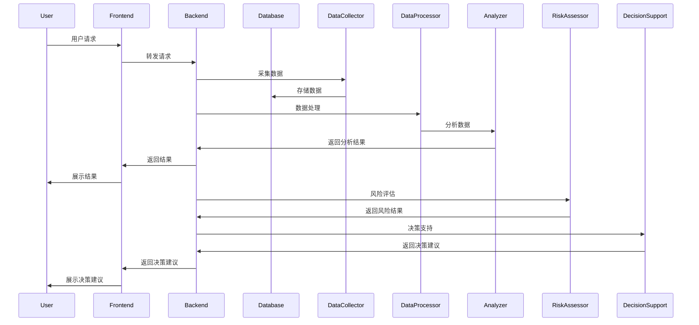

                 

### 引言

在信息技术飞速发展的当今社会，技术评估作为企业和组织决策过程中至关重要的一环，其重要性愈发凸显。然而，当前许多企业在技术评估流程上仍面临诸多挑战，如评估标准不统一、流程繁琐、结果不具说服力等。因此，如何构建一个高效、系统化的技术评估流程，已成为众多IT从业者和企业管理者亟待解决的问题。

本文旨在深入探讨如何打造一个高效的技术评估流程，从背景介绍到核心概念，再到具体实施步骤，提供一套完整的解决方案。我们将分步骤进行详细讲解，以帮助读者更好地理解和应用这一流程。

### 文章关键词

- 技术评估
- 高效流程
- 企业决策
- IT项目管理
- 算法原理

### 摘要

本文首先分析了技术评估在当前信息技术环境中的重要性及其面临的挑战。接着，我们介绍了技术评估的基本概念和核心原则，探讨了技术评估的关键要素和流程阶段。随后，文章通过数学模型和具体案例，详细讲解了技术评估的算法原理。此外，文章还介绍了系统分析与架构设计方案，包括问题场景介绍、系统功能设计、系统架构设计、系统接口设计和系统交互序列图。最后，文章通过一个实际项目案例，展示了技术评估流程的应用过程，并总结出最佳实践和注意事项。通过本文的阅读，读者将能够掌握构建高效技术评估流程的方法和技巧。

## 第1章：问题背景

### 1.1 技术评估的重要性

技术评估作为企业和组织在技术选择和应用过程中的一项关键活动，其重要性不容忽视。首先，技术评估有助于企业或组织在众多技术选项中做出明智的决策，避免因技术选择不当而导致的资源浪费和业务风险。通过技术评估，企业可以全面了解各种技术的优缺点、适用场景和潜在风险，从而为后续的技术选型和实施提供科学依据。

其次，技术评估是信息化项目成功的关键保障。在信息化项目中，技术评估能够帮助项目团队提前识别和解决潜在的技术问题，减少项目实施过程中的不确定性和风险。例如，通过技术评估，项目团队可以评估技术的成熟度、兼容性、可维护性等关键因素，从而确保项目能够在预算和时间范围内顺利完成。

### 1.2 当前技术评估流程的挑战

尽管技术评估的重要性显而易见，但当前许多企业在技术评估流程上仍面临诸多挑战。以下是其中一些主要问题：

1. **评估标准不统一**：不同企业或组织在技术评估时往往采用不同的标准和指标，导致评估结果不一致，难以形成统一的决策依据。

2. **流程繁琐**：传统的技术评估流程通常包含多个环节，涉及多个部门和人员，流程繁琐且耗时，难以快速响应市场变化。

3. **结果不具说服力**：部分企业的技术评估结果缺乏科学性和客观性，评估方法单一，难以充分反映技术的实际应用效果和潜在风险。

4. **技术动态更新**：信息技术更新迅速，许多企业在技术评估时难以及时跟进新技术的发展动态，导致评估结果滞后，无法为决策提供有力支持。

### 1.3 本书目标与结构

本书旨在为读者提供一套系统化、高效的技术评估流程，以解决上述问题。具体目标如下：

1. **构建科学的技术评估模型**：通过介绍技术评估的核心概念和原则，帮助读者理解技术评估的基本框架和逻辑。

2. **提供实用的评估方法**：详细介绍各种评估指标和算法，帮助读者在实际评估过程中选择合适的方法和工具。

3. **案例分析与实践**：通过实际项目案例的讲解，展示技术评估流程的应用过程和效果，提高读者的实践能力。

4. **最佳实践与总结**：总结行业最佳实践经验，为读者提供具有参考价值的技术评估策略和技巧。

本书结构分为七个部分：

1. **引言**：介绍技术评估的背景和重要性。
2. **核心概念**：解释技术评估的定义、范围和基本原则。
3. **概念与联系**：探讨技术评估的关键要素和流程阶段。
4. **算法原理讲解**：详细讲解技术评估的数学模型和算法。
5. **系统分析与架构设计方案**：介绍系统架构和功能设计。
6. **项目实战**：通过实际项目案例展示评估流程的应用。
7. **最佳实践与总结**：总结最佳实践经验和小结。

通过本书的阅读，读者将能够全面掌握技术评估的理论和实践，为企业的技术决策提供有力支持。

### 1.4 关键术语解释

为了更好地理解技术评估的过程和方法，以下是对一些关键术语的解释：

1. **技术评估**：指对某项技术的性能、功能、适用性、成本效益等方面进行全面分析和评价的过程。

2. **技术成熟度**：指技术从概念阶段到商业化应用阶段的发展程度，包括技术的基本原理、开发进度、验证情况等。

3. **成本效益分析**：通过对技术项目的成本和效益进行量化分析，评估其经济合理性。

4. **风险评估**：识别和分析技术项目可能面临的风险，并提出相应的预防和应对措施。

5. **技术选型**：指在多个技术选项中，根据需求和评估结果选择最适合的技术方案。

6. **评估指标**：用于衡量和评估技术性能的各种量化标准，如性能、可靠性、安全性等。

7. **评估方法**：指用于进行技术评估的具体方法和工具，如问卷调查、实验测试、专家评审等。

8. **评估模型**：指用于组织和分析评估数据的框架和工具，如成本效益分析模型、风险评估模型等。

9. **技术路线图**：指描述技术从研发到应用的全过程，包括各个阶段的任务、时间节点和里程碑。

通过了解这些关键术语，读者可以更好地理解技术评估的过程和方法，为实际应用提供指导。

### 1.5 技术评估的基本原则

在构建高效的技术评估流程时，必须遵循一些基本原则，以确保评估的全面性、科学性和有效性。以下是技术评估的几个关键原则：

1. **客观性原则**：技术评估应基于客观数据和事实，避免主观偏见。评估过程中应使用公认的评估方法和工具，确保评估结果具有可信度和说服力。

2. **全面性原则**：技术评估不仅要关注技术的技术性能和经济效益，还要综合考虑其适用性、安全性、可维护性等方面。通过全面的评估，可以更准确地判断技术是否满足需求。

3. **灵活性原则**：技术评估流程应具有一定的灵活性，能够根据具体项目需求和环境变化进行调整。灵活性原则有助于应对技术发展快速变化和不确定性。

4. **动态性原则**：技术评估应是一个持续的过程，随着技术发展和项目进展，不断更新和优化评估结果。动态性原则有助于确保评估的实时性和准确性。

5. **实用性原则**：技术评估应具备实际操作价值，评估结果应能够直接应用于决策过程。实用性原则要求评估方法和技术工具要易于理解和应用，避免过于复杂。

通过遵循这些基本原则，企业可以构建一个高效、科学的技术评估流程，提高技术决策的质量和效率。

## 第2章：核心概念

### 2.1 技术评估的定义与范围

技术评估是指对某一技术方案或产品的性能、功能、成本、风险等方面进行全面分析和评价的过程。其目的是为决策者提供科学的依据，以便在技术选型、项目立项、预算分配等方面做出明智的决策。技术评估的范围涵盖了从技术概念验证到商业化应用的全过程，包括但不限于技术可行性研究、技术选型、成本效益分析、风险评估等环节。

技术评估的定义和范围决定了其在企业决策中的重要性。首先，技术评估可以帮助企业或组织识别和解决技术问题，减少项目实施过程中的不确定性。其次，通过技术评估，企业可以全面了解各种技术的优缺点、适用场景和潜在风险，从而为后续的技术选型和实施提供科学依据。此外，技术评估还可以帮助企业在面对技术更新和市场竞争时，做出快速、准确的决策。

### 2.2 关键术语解释

在技术评估过程中，一些关键术语和概念的使用至关重要。以下是对这些术语的简要解释：

1. **技术可行性**：指某一技术方案或产品在实际应用中的可行性和适用性。技术可行性评估主要关注技术的原理、技术成熟度、研发进度、市场前景等方面。

2. **技术选型**：指在多个技术选项中，根据需求和评估结果选择最适合的技术方案。技术选型是技术评估的重要环节，直接影响项目的成功与否。

3. **成本效益分析**：通过对技术项目的成本和效益进行量化分析，评估其经济合理性。成本效益分析是技术评估中常用的方法，有助于企业或组织在资源有限的情况下，做出最优的技术选择。

4. **风险评估**：识别和分析技术项目可能面临的风险，并提出相应的预防和应对措施。风险评估是技术评估中不可或缺的环节，有助于提前预警和降低项目风险。

5. **技术成熟度**：指技术从概念阶段到商业化应用阶段的发展程度，包括技术的基本原理、开发进度、验证情况等。技术成熟度评估是技术评估中的重要内容，有助于判断技术是否成熟、能否满足项目需求。

6. **评估指标**：用于衡量和评估技术性能的各种量化标准，如性能、可靠性、安全性、兼容性等。评估指标是技术评估过程中重要的工具，有助于对技术进行全面、科学的评价。

通过理解这些关键术语和概念，读者可以更深入地了解技术评估的过程和方法，为实际应用提供指导。

### 2.3 技术评估的基本原则

为了确保技术评估的全面性、科学性和有效性，以下是一些技术评估的基本原则：

1. **客观性原则**：技术评估应基于客观数据和事实，避免主观偏见。评估过程中应使用公认的评估方法和工具，确保评估结果具有可信度和说服力。

2. **全面性原则**：技术评估不仅要关注技术的技术性能和经济效益，还要综合考虑其适用性、安全性、可维护性等方面。通过全面的评估，可以更准确地判断技术是否满足需求。

3. **灵活性原则**：技术评估流程应具有一定的灵活性，能够根据具体项目需求和环境变化进行调整。灵活性原则有助于应对技术发展快速变化和不确定性。

4. **动态性原则**：技术评估应是一个持续的过程，随着技术发展和项目进展，不断更新和优化评估结果。动态性原则有助于确保评估的实时性和准确性。

5. **实用性原则**：技术评估应具备实际操作价值，评估结果应能够直接应用于决策过程。实用性原则要求评估方法和技术工具要易于理解和应用，避免过于复杂。

通过遵循这些基本原则，企业可以构建一个高效、科学的技术评估流程，提高技术决策的质量和效率。

### 2.4 技术评估的核心要素

技术评估是一个复杂且系统的过程，需要考虑多个核心要素。以下是技术评估的核心要素及其简要描述：

1. **技术性能**：评估技术的性能指标，包括计算速度、数据处理能力、响应时间等，以及技术在不同负载条件下的表现。

2. **可靠性**：评估技术的稳定性和可靠性，包括故障率、恢复时间、系统容错能力等。

3. **安全性**：评估技术的安全性，包括数据保护、访问控制、加密技术等，以及技术对潜在威胁的防御能力。

4. **兼容性**：评估技术与其他系统、平台或组件的兼容性，包括接口标准、数据格式、技术规范等。

5. **可维护性**：评估技术的可维护性，包括文档的完整性、代码的可读性、组件的独立性等，以及技术更新和升级的难易程度。

6. **成本效益**：评估技术项目的成本和效益，包括直接成本（硬件、软件、人力等）和间接成本（维护、培训、风险等），以及技术带来的收益和节约的成本。

7. **技术成熟度**：评估技术的成熟度，包括技术的研究阶段、开发进度、验证情况、市场反馈等。

8. **风险因素**：评估技术项目可能面临的风险，包括技术风险、市场风险、法律风险等，以及相应的预防和应对措施。

这些核心要素共同构成了技术评估的框架，有助于全面、系统地评估技术方案或产品的优劣。通过详细分析这些要素，企业或组织可以做出更明智的技术决策。

### 2.5 技术评估的流程阶段

技术评估是一个系统化的过程，通常包括以下几个关键阶段：

1. **需求分析**：明确评估的目标和需求，了解技术应用的背景和预期目标。此阶段需要与项目团队和利益相关者进行充分沟通，以确保评估需求的全面性和准确性。

2. **技术调研**：收集和分析相关的技术信息，包括技术的基本原理、开发进度、市场趋势、竞争对手情况等。技术调研可以通过文献查阅、市场调研、专家咨询等多种方式进行。

3. **评估指标设定**：根据需求和调研结果，确定评估的各项指标，如性能、可靠性、安全性、成本效益等。评估指标应具有可量化、可比较的特性，以便于后续的评估和比较。

4. **数据收集**：通过实验、测试、问卷调查、专家评审等方式，收集相关数据，包括技术性能测试结果、用户反馈、成本数据等。

5. **数据分析**：对收集到的数据进行分析，运用统计分析、比较分析等方法，评估各技术方案或产品的性能和效益。

6. **结果评估**：根据分析结果，对技术方案或产品进行综合评估，确定其优劣和适用性。评估结果应以书面报告的形式呈现，为决策者提供参考。

7. **风险评估**：识别和分析技术项目可能面临的风险，评估其对项目成功的影响程度，并提出相应的预防和应对措施。

8. **决策建议**：根据评估结果和风险评估，提出技术选型建议和决策方案，为项目团队和决策者提供决策支持。

通过以上流程阶段，企业或组织可以系统地评估技术方案或产品，提高技术决策的科学性和准确性。

### 2.6 技术评估方法

在技术评估过程中，选择合适的评估方法至关重要。以下是一些常用的技术评估方法及其特点：

1. **成本效益分析**：成本效益分析是一种通过比较技术项目的成本和效益来评估其经济合理性的方法。其优点在于能够量化技术项目的成本和收益，有助于决策者做出经济上的判断。然而，成本效益分析的局限性在于难以衡量某些无形因素，如用户满意度、社会效益等。

2. **专家评审法**：专家评审法是通过专家对技术方案进行评估和打分，以确定其优劣的方法。这种方法具有高效、灵活、直观的优点，适用于技术复杂度高、不确定性较大的项目。但专家评审法易受专家主观偏见的影响，评估结果可能存在偏差。

3. **实验测试法**：实验测试法是通过实际操作和测试，评估技术方案或产品的性能和可靠性。这种方法具有客观、科学、可重复的优点，适用于技术性能和功能评估。然而，实验测试法需要大量时间和资源，且结果可能受到实验环境和条件的影响。

4. **用户调研法**：用户调研法是通过调查用户对技术方案或产品的使用体验和满意度，评估其适用性和市场潜力。这种方法具有直接、实用的优点，适用于市场需求分析和用户体验评估。但用户调研法的结果可能受到用户主观意识和市场环境的影响。

5. **系统仿真法**：系统仿真法是通过建立技术方案或产品的仿真模型，模拟其实际运行情况，评估其性能和效益。这种方法具有高度可控、可重复的优点，适用于复杂系统的性能评估。但系统仿真法需要较高的建模和计算能力，且结果可能受到模型准确性的影响。

通过结合多种评估方法，企业或组织可以全面、客观地评估技术方案或产品，提高评估结果的可靠性和准确性。

## 第3章：概念与联系

### 3.1 技术评估的关键要素

技术评估是一个复杂的过程，涉及多个关键要素。以下是对这些关键要素的详细探讨：

#### 3.1.1 技术评估指标

技术评估指标是衡量技术性能和效益的重要工具。常见的评估指标包括：

1. **性能指标**：包括计算速度、数据处理能力、响应时间等，用于评估技术的性能和效率。
2. **可靠性指标**：包括故障率、恢复时间、系统容错能力等，用于评估技术的稳定性和可靠性。
3. **安全性指标**：包括数据保护、访问控制、加密技术等，用于评估技术的安全性能。
4. **兼容性指标**：包括接口标准、数据格式、技术规范等，用于评估技术与其他系统或组件的兼容性。
5. **可维护性指标**：包括文档的完整性、代码的可读性、组件的独立性等，用于评估技术的可维护性和升级难度。

这些指标在技术评估中起到了关键作用，有助于全面、客观地评估技术方案或产品的性能和效益。

#### 3.1.1.1 技术成熟度指标

技术成熟度指标是评估技术从概念阶段到商业化应用阶段的发展程度的指标。技术成熟度通常分为以下几个阶段：

1. **概念验证阶段**：技术的基本原理得到验证，但尚未进行实际开发。
2. **开发阶段**：技术进入开发阶段，有明确的开发计划和时间表。
3. **验证阶段**：技术经过测试和验证，功能和技术指标符合预期。
4. **商业化应用阶段**：技术进入市场，具备商业化应用的条件。

技术成熟度指标有助于评估技术是否成熟，能否满足项目需求，为技术选型和决策提供重要依据。

#### 3.1.1.2 成本效益分析指标

成本效益分析指标是评估技术项目的经济合理性的关键指标。成本效益分析通常涉及以下几个方面：

1. **直接成本**：包括硬件成本、软件成本、人力成本等，可以直接量化的成本。
2. **间接成本**：包括维护成本、培训成本、风险成本等，难以直接量化的成本。
3. **直接收益**：包括销售收入、节约成本、提升效率等，可以直接量化的收益。
4. **间接收益**：包括用户满意度提升、市场竞争力增强、品牌价值提升等，难以直接量化的收益。

成本效益分析指标有助于全面评估技术项目的成本和收益，为决策者提供经济上的参考。

#### 3.1.1.3 风险评估指标

风险评估指标是识别和分析技术项目可能面临的风险的重要工具。常见的风险评估指标包括：

1. **技术风险**：包括技术实现难度、技术不成熟度等，影响技术的成功实现。
2. **市场风险**：包括市场需求不确定性、竞争压力等，影响技术的市场接受度。
3. **法律风险**：包括法律法规变化、合规性要求等，影响技术的合法性和合规性。
4. **运营风险**：包括系统稳定性、维护成本等，影响技术的持续运营。

风险评估指标有助于提前预警和应对项目风险，确保技术项目的顺利进行。

#### 3.1.2 技术评估流程与阶段

技术评估流程是一个系统化的过程，通常包括以下几个阶段：

1. **需求分析**：明确评估的目标和需求，了解技术应用的背景和预期目标。
2. **技术调研**：收集和分析相关的技术信息，包括技术的基本原理、开发进度、市场趋势等。
3. **指标设定**：根据需求和调研结果，确定评估的各项指标。
4. **数据收集**：通过实验、测试、问卷调查、专家评审等方式，收集相关数据。
5. **数据分析**：对收集到的数据进行分析，运用统计分析、比较分析等方法，评估各技术方案或产品的性能和效益。
6. **结果评估**：根据分析结果，对技术方案或产品进行综合评估。
7. **风险评估**：识别和分析项目可能面临的风险，评估其对项目成功的影响程度。
8. **决策建议**：根据评估结果和风险评估，提出技术选型建议和决策方案。

技术评估流程的各个阶段相互关联，通过科学、系统的流程，确保技术评估的全面性和准确性。

### 3.2 技术评估与项目管理的关系

技术评估是项目管理的重要组成部分，与项目管理密切相关。以下探讨技术评估在项目管理中的地位和作用：

1. **技术评估在项目管理中的地位**：
   - 技术评估是项目立项和决策的重要依据，有助于项目团队和管理层了解技术方案的优劣，确保项目目标实现。
   - 技术评估是项目规划和设计的基础，通过评估确定技术方案，为项目实施提供明确的指导。
   - 技术评估是项目监控和控制的手段，通过持续评估项目进展，及时发现和解决技术问题，确保项目按计划进行。

2. **技术评估在项目管理中的作用**：
   - **降低项目风险**：通过技术评估，识别和评估项目可能面临的技术风险，提前制定预防和应对措施，降低项目失败的风险。
   - **优化技术方案**：通过技术评估，对比不同技术方案的优劣，选择最优的技术方案，提高项目实施的成功率和效益。
   - **指导项目决策**：技术评估为项目团队和管理层提供科学、客观的决策依据，确保项目决策的科学性和合理性。
   - **提高项目管理效率**：通过技术评估，项目团队能够更好地掌握项目进展和技术状况，提高项目管理的效率和效果。

总之，技术评估在项目管理中具有重要的地位和作用，通过科学、系统的技术评估，有助于提高项目管理水平，确保项目成功实施。

### 3.3 技术评估与传统评估方法的比较

技术评估与传统评估方法（如财务评估、市场评估等）在目标和方法上存在显著差异。以下是对两者进行比较：

1. **目标差异**：
   - **技术评估**：主要关注技术的性能、可靠性、安全性、成熟度等，旨在为技术决策提供科学依据。
   - **财务评估**：主要关注项目的经济效益，包括成本、收益、投资回报率等，旨在评估项目的经济可行性。
   - **市场评估**：主要关注市场需求、市场趋势、竞争状况等，旨在评估项目的市场前景。

2. **方法差异**：
   - **技术评估**：通常采用实验测试、专家评审、数据分析等方法，注重技术的实际性能和效果。
   - **财务评估**：通常采用财务分析、预算编制、成本效益分析等方法，注重项目的经济收益和成本控制。
   - **市场评估**：通常采用市场调研、用户调查、竞争分析等方法，注重市场需求和市场竞争。

尽管技术评估、财务评估和市场评估的目标和方法不同，但它们在实际应用中往往相互补充，共同为项目决策提供全面的支持。

### 3.4 技术评估与业务目标的关系

技术评估与企业的业务目标密切相关，是支撑业务发展的重要手段。以下探讨技术评估如何与业务目标结合，以及如何通过技术评估实现业务目标：

1. **结合业务目标**：
   - **明确业务需求**：在技术评估过程中，首先要明确企业的业务目标和发展需求，确保技术评估的指标和内容与业务目标相匹配。
   - **需求驱动评估**：技术评估应以业务需求为导向，根据业务目标和需求设定评估指标和标准，确保评估过程和结果能够支持业务发展。

2. **实现业务目标**：
   - **选择合适技术**：通过技术评估，识别和选择最符合业务需求的技术方案，为业务发展提供技术支撑。
   - **优化资源配置**：技术评估有助于企业合理配置资源，避免资源浪费，提高资源利用效率，实现业务目标。
   - **提升竞争力**：通过技术评估，企业能够了解自身与竞争对手的技术差距，制定相应的技术改进和发展策略，提升市场竞争力。
   - **支撑业务创新**：技术评估能够为企业提供创新技术的评估和筛选依据，支持企业在新产品、新服务、新模式上的创新，推动业务发展。

总之，技术评估通过结合业务目标和需求，为企业的技术决策提供科学依据，实现业务目标和提升竞争力。

## 第4章：算法原理讲解

### 4.1 技术评估的数学模型

技术评估过程中的数学模型是确保评估结果科学性和准确性的重要工具。以下将详细介绍成本效益分析模型和风险评估模型的数学原理，并通过具体例子进行说明。

#### 4.1.1 成本效益分析的数学模型

成本效益分析（Cost-Benefit Analysis，CBA）是一种常用的评估技术项目的经济合理性的方法。其核心思想是通过比较技术项目的成本和效益，评估其经济效益。

**成本效益分析公式**：

\[ CBA = \frac{B}{C} \]

其中：
- \( C \) 表示成本（Cost），包括直接成本和间接成本。
- \( B \) 表示效益（Benefit），包括直接收益和间接收益。

**示例说明**：

假设某企业计划引进一种新型生产设备，以提升生产效率。通过成本效益分析，我们可以计算该技术项目的经济效益。

- **成本**：
  - 直接成本：设备购买费用为100万元，安装和维护费用为20万元。
  - 间接成本：培训费用为10万元，运营成本为5万元。
  - 总成本 \( C = 100 + 20 + 10 + 5 = 135 \) 万元。

- **效益**：
  - 直接收益：设备投入运营后，预计每年增加销售收入200万元。
  - 间接收益：提高生产效率，减少停机时间，预计每年节约运营成本10万元。
  - 总效益 \( B = 200 + 10 = 210 \) 万元。

根据成本效益分析公式，我们得到：

\[ CBA = \frac{B}{C} = \frac{210}{135} \approx 1.556 \]

结果大于1，表明该项目在经济上是可行的，具有较高的经济效益。

#### 4.1.2 风险评估的数学模型

风险评估（Risk Assessment）是评估技术项目潜在风险的重要方法。其核心是通过量化风险因素，评估风险对项目成功的影响程度。

**风险评估公式**：

\[ Risk = \frac{P \times C}{M} \]

其中：
- \( P \) 表示风险概率（Probability），即风险事件发生的可能性。
- \( C \) 表示风险成本（Cost），即风险事件发生导致的损失。
- \( M \) 表示风险应对措施的成本（Mitigation Cost），即采取预防措施所需的成本。

**示例说明**：

假设某企业在技术项目中面临网络攻击风险，通过风险评估，我们可以量化该风险的影响。

- **风险概率**：根据历史数据和专家评估，网络攻击的风险概率为0.3。
- **风险成本**：网络攻击可能导致系统瘫痪，预计损失为50万元。
- **风险应对措施的成本**：安装防火墙、定期更新系统补丁等预防措施，预计成本为5万元。

根据风险评估公式，我们得到：

\[ Risk = \frac{0.3 \times 50}{5} = 3 \]

风险评分为3，表示该风险对项目成功的威胁程度较高，需要采取有效的应对措施。

通过成本效益分析和风险评估的数学模型，企业或组织可以科学地评估技术项目的经济效益和风险，为决策提供有力支持。

### 4.2 技术评估中的算法与数据分析方法

在技术评估过程中，算法和数据分析方法起到了关键作用。以下将介绍几种常见的技术评估算法和数据分析方法，以及它们在技术评估中的应用。

#### 4.2.1 成本效益分析的算法

成本效益分析通常采用以下几种算法：

1. **线性规划算法**：通过设定目标函数和约束条件，求解最优的成本效益比。这种方法适用于资源有限、目标明确的情况。

2. **多目标规划算法**：在考虑多个成本效益指标时，采用多目标规划算法，通过加权综合各个指标，求得最优解。这种方法适用于复杂、多目标的情况。

3. **模拟退火算法**：通过模拟物理退火过程，逐步优化成本效益比。这种方法具有全局搜索能力，适用于复杂、非线性问题。

**示例**：

假设某企业需要引进两种不同的技术方案，方案A和方案B。通过成本效益分析，企业需要选择最优的方案。

- **方案A**：直接成本为200万元，间接成本为50万元，总成本为250万元。预期直接收益为300万元，间接收益为60万元，总收益为360万元。

- **方案B**：直接成本为150万元，间接成本为30万元，总成本为180万元。预期直接收益为250万元，间接收益为40万元，总收益为290万元。

采用线性规划算法，设定目标函数为最大化成本效益比，求解最优解。

\[ \text{最大化} \quad \frac{B}{C} \]

通过计算，得到方案A的成本效益比为1.44，方案B的成本效益比为1.60。因此，选择方案B作为最优方案。

#### 4.2.2 风险评估的算法

在风险评估中，常用的算法包括：

1. **贝叶斯网络算法**：通过构建贝叶斯网络模型，分析风险因素之间的依赖关系，量化风险概率和风险影响。

2. **蒙特卡罗模拟算法**：通过模拟大量随机样本，计算风险事件发生的概率和风险影响，评估整体风险水平。

3. **模糊综合评价算法**：通过引入模糊数学方法，处理风险评估中的不确定性和模糊性，提供更为可靠的评估结果。

**示例**：

假设某企业需要评估一个新项目的风险，包括技术风险、市场风险和法律风险。

- **技术风险**：风险概率为0.4，风险成本为80万元。
- **市场风险**：风险概率为0.3，风险成本为60万元。
- **法律风险**：风险概率为0.2，风险成本为40万元。

采用贝叶斯网络算法，构建风险因素之间的依赖关系，计算整体风险。

通过计算，得到技术风险对整体风险的影响最大，市场风险次之，法律风险最小。

#### 4.2.3 数据分析方法

在技术评估中，常用的数据分析方法包括：

1. **统计分析方法**：通过描述性统计和推理性统计，分析技术性能和效益的数据，提供评估依据。

2. **数据挖掘方法**：通过数据挖掘技术，发现数据中的潜在规律和关联，为技术评估提供新的视角。

3. **机器学习方法**：通过机器学习算法，对技术数据进行分类、回归、聚类等分析，提高评估的准确性和效率。

**示例**：

假设某企业收集了多个技术项目的成本效益数据，需要分析这些数据，找出影响成本效益的主要因素。

通过数据分析方法，可以得出以下结论：

- 成本和效益之间呈正相关关系，成本增加，效益也增加。
- 不同技术方案的成本效益差异显著，某些方案效益较低，需要优化。

通过数据分析，企业可以制定更有针对性的技术评估策略，提高评估的科学性和有效性。

### 4.3 技术评估算法的优缺点及应用场景

在技术评估中，不同的算法具有各自的优缺点和应用场景。以下是对几种常见算法的优缺点及应用场景的总结：

#### 4.3.1 线性规划算法

**优点**：
- 算法简单，易于理解和实现。
- 能够在给定约束条件下，求解最优的成本效益比。

**缺点**：
- 适用于线性问题，对于非线性问题效果不佳。
- 需要准确的成本效益数据，数据误差可能导致结果不准确。

**应用场景**：
- 资源优化问题，如设备采购、人力分配等。
- 成本预算管理，如项目预算分配、成本控制等。

#### 4.3.2 贝叶斯网络算法

**优点**：
- 能够处理不确定性问题，通过概率推理提供可靠的评估结果。
- 能够分析风险因素之间的依赖关系，提供更全面的风险评估。

**缺点**：
- 需要大量的历史数据和专家知识，数据获取和建模复杂。
- 计算复杂度较高，大规模网络模型计算耗时较长。

**应用场景**：
- 风险评估，如项目风险分析、安全风险评估等。
- 知识管理系统，如决策支持系统、智能推荐系统等。

#### 4.3.3 蒙特卡罗模拟算法

**优点**：
- 具有全局搜索能力，能够探索复杂、非线性问题。
- 能够通过大量模拟计算，提供概率分布和风险评估结果。

**缺点**：
- 计算资源消耗较大，大规模模拟计算耗时较长。
- 需要准确的数据模型和参数设置，数据误差可能导致结果偏差。

**应用场景**：
- 风险评估，如金融市场风险评估、自然灾害风险评估等。
- 模拟优化，如项目进度模拟、供应链优化等。

#### 4.3.4 数据挖掘方法

**优点**：
- 能够发现数据中的潜在规律和关联，提供新的分析视角。
- 能够处理大规模、多维数据，提高评估的准确性和效率。

**缺点**：
- 数据预处理复杂，需要大量的数据清洗和特征工程。
- 需要专业的数据挖掘知识和技能，操作难度较高。

**应用场景**：
- 数据分析，如市场趋势分析、用户行为分析等。
- 智能化系统，如推荐系统、智能诊断系统等。

通过了解不同算法的优缺点和应用场景，企业可以根据具体需求和实际情况选择合适的算法，提高技术评估的科学性和准确性。

### 4.4 技术评估中的数据收集与处理方法

在技术评估过程中，数据收集和处理是确保评估结果准确性的关键环节。以下将介绍几种常见的数据收集与处理方法，以及在实际应用中的注意事项。

#### 4.4.1 数据收集方法

1. **问卷调查法**：通过设计问卷，收集用户对技术方案的评价和反馈。问卷调查法适用于广泛覆盖和获取大量数据。

2. **实验测试法**：通过实际操作和测试，收集技术性能和功能的数据。实验测试法适用于需要精确评估技术性能的情况。

3. **文献查阅法**：通过查阅相关文献和资料，收集技术背景、研究进展和市场信息。文献查阅法适用于需要深入了解技术领域的情况。

4. **专家评审法**：通过邀请专家对技术方案进行评估和打分，收集专家意见。专家评审法适用于技术复杂度高、不确定性较大的情况。

#### 4.4.2 数据处理方法

1. **数据清洗**：去除数据中的错误、重复和无关信息，确保数据的准确性和一致性。数据清洗是数据处理的基础步骤。

2. **数据转换**：将不同格式的数据进行统一转换，以便进行后续处理和分析。数据转换包括数据格式转换、数据规范化等。

3. **数据分析**：运用统计学和数据分析方法，对数据进行处理和分析，提取有用的信息。数据分析包括描述性统计、推理性统计、关联分析等。

4. **数据可视化**：通过图表和可视化工具，展示数据分析和结果，便于理解和传达。数据可视化有助于发现数据中的趋势和模式。

#### 4.4.3 实际应用中的注意事项

1. **数据质量**：确保数据来源可靠、准确，避免因数据质量问题导致评估结果偏差。

2. **数据多样性**：收集多种类型的数据，包括定量数据和定性数据，以全面评估技术方案。

3. **数据一致性**：确保数据在不同评估环节中的统一性和一致性，避免数据冲突和矛盾。

4. **数据分析方法**：选择合适的分析方法，确保分析结果的科学性和准确性。

通过科学、系统的数据收集与处理方法，企业可以确保技术评估的数据质量，提高评估结果的可靠性和有效性。

### 4.5 技术评估中的机器学习应用

随着信息技术的发展，机器学习（Machine Learning，ML）在技术评估中的应用越来越广泛。以下将介绍机器学习在技术评估中的应用及其优势。

#### 4.5.1 机器学习在技术评估中的应用

1. **风险评估**：通过构建机器学习模型，对项目可能面临的风险进行预测和评估。例如，使用分类算法对项目风险进行分类，识别高风险项目。

2. **趋势预测**：通过分析历史数据，运用时间序列分析等方法，预测技术发展的趋势和未来需求。例如，利用回归算法预测未来某项技术的市场占有率。

3. **优化决策**：利用机器学习算法，对技术方案进行优化和选择。例如，通过多目标优化算法，选择最优的技术方案，实现成本效益最大化。

#### 4.5.2 机器学习在技术评估中的优势

1. **自动化**：机器学习算法能够自动化处理大量数据，提高评估效率。相比于人工评估，机器学习能够更快、更准确地完成评估任务。

2. **泛化能力**：机器学习模型通过学习大量数据，可以泛化到未知数据上，提高评估结果的可靠性。通过训练和优化模型，可以不断提高评估的准确性。

3. **实时性**：机器学习模型能够实时更新和调整，适应技术变化和市场需求。相比于传统评估方法，机器学习模型具有更强的实时性。

4. **可解释性**：虽然机器学习模型具有强大的预测和分类能力，但其内部机制往往难以解释。通过引入可解释性方法，如决策树、LIME等，可以提高模型的可解释性，增强评估结果的透明度。

#### 4.5.3 机器学习在技术评估中的应用案例

1. **金融风险评估**：金融机构使用机器学习模型评估贷款申请人的信用风险，通过分析借款人的历史数据、行为特征等，预测违约风险。

2. **供应链优化**：企业利用机器学习模型优化供应链管理，通过分析供应链数据，预测需求变化，调整库存和采购策略。

3. **医疗诊断**：医疗机构使用机器学习模型辅助诊断，通过对医学图像和患者数据进行分析，提高疾病检测和诊断的准确性。

总之，机器学习在技术评估中的应用，不仅提高了评估的效率和准确性，还为决策者提供了更全面、科学的评估依据。通过结合机器学习技术，企业可以更好地应对技术变化和市场需求，实现持续创新和竞争优势。

### 4.6 技术评估中的数据分析和可视化工具

在技术评估过程中，数据分析和可视化工具是必不可少的。以下将介绍几种常用的数据分析和可视化工具，以及它们在实际应用中的优势。

#### 4.6.1 常用数据分析和可视化工具

1. **Python**：Python 是一种功能强大的编程语言，广泛应用于数据分析和可视化。Python 提供了丰富的库和框架，如 NumPy、Pandas、Matplotlib 等，支持各种数据分析和可视化需求。

2. **R 语言**：R 语言是一种专门为统计分析和数据可视化设计的语言，具有强大的数据处理和分析能力。R 提供了大量的包和函数，如 ggplot2、dplyr 等，可以方便地生成各种类型的图表和可视化效果。

3. **Excel**：Excel 是最常用的电子表格工具之一，适用于简单的数据分析和可视化。虽然 Excel 的功能相对有限，但通过使用各种函数和图表工具，可以快速生成基础的可视化图表。

4. **Tableau**：Tableau 是一种强大的数据可视化工具，提供丰富的图表和交互功能，可以快速生成高质量的可视化报表。Tableau 支持多种数据源，包括数据库、CSV 文件等，适用于企业级的数据分析和可视化需求。

#### 4.6.2 实际应用中的优势

1. **Python**：
   - **优势**：Python 具有高效的数据处理和分析能力，适用于大规模数据集。Python 提供了丰富的库和框架，可以方便地实现各种复杂的数据分析和可视化任务。
   - **应用案例**：Python 在技术评估中的应用广泛，如数据分析、机器学习、网络分析等。例如，使用 Python 进行成本效益分析和风险评估，通过 Matplotlib 生成可视化图表。

2. **R 语言**：
   - **优势**：R 语言在统计分析和数据可视化方面具有强大的功能，适用于复杂的数据处理和可视化需求。R 提供了丰富的包和函数，可以自定义各种图表和可视化效果。
   - **应用案例**：R 在医疗、金融、科研等领域有广泛应用，如进行临床数据分析、金融风险评估等。通过 R，可以生成高质量的统计图表和可视化报表。

3. **Excel**：
   - **优势**：Excel 界面友好，易于学习和使用，适用于简单的数据分析和可视化。Excel 提供了丰富的函数和图表工具，可以快速生成基础的图表。
   - **应用案例**：Excel 在企业管理和日常工作中广泛使用，如进行项目预算管理、销售数据分析等。通过 Excel，可以生成简单的折线图、柱状图等图表。

4. **Tableau**：
   - **优势**：Tableau 提供了强大的数据可视化功能，支持多种数据源和交互式报表。Tableau 支持实时数据更新，适用于企业级的数据分析和可视化需求。
   - **应用案例**：Tableau 在企业决策支持和数据驱动管理中广泛应用，如进行销售分析、客户行为分析等。通过 Tableau，可以生成动态图表和交互式报表，帮助决策者快速了解数据趋势和关键信息。

通过合理选择和使用数据分析和可视化工具，企业可以更高效地进行技术评估，提高数据分析和决策的准确性和有效性。

## 第5章：系统分析与架构设计方案

### 5.1 问题场景介绍

随着企业数字化转型的深入推进，越来越多的企业面临着技术选型、系统集成和项目管理等方面的挑战。为了提高项目成功率和效率，企业需要构建一个高效的技术评估系统，以便在众多技术方案中快速筛选出最佳方案。本节将介绍一个具体的问题场景，并阐述构建技术评估系统的必要性和重要性。

#### 5.1.1 场景描述

某大型制造企业计划进行生产线的升级改造，以提升生产效率和产品质量。企业面临以下问题：

1. **技术选型难**：市场上存在多种生产自动化技术，企业难以确定哪种技术最适合自身需求，容易陷入技术选择的困境。

2. **系统集成复杂**：不同技术方案之间可能存在兼容性问题，企业需要耗费大量时间和资源进行系统集成和调试。

3. **项目管理困难**：项目涉及多个部门和供应商，项目进度、资源分配和风险管理等方面存在诸多挑战，需要高效的项目管理工具进行支持。

为了解决上述问题，企业决定构建一个技术评估系统，通过系统化的评估流程和技术手段，提高技术选型、系统集成和项目管理的效率和效果。

#### 5.1.2 构建技术评估系统的必要性和重要性

1. **必要性**：

   - **技术选型**：技术评估系统能够为企业提供全面、科学的评估依据，帮助企业快速筛选出符合需求的技术方案，避免盲目决策。

   - **系统集成**：通过技术评估系统，企业可以识别和解决不同技术方案之间的兼容性问题，确保系统集成顺利进行。

   - **项目管理**：技术评估系统可以帮助企业实现项目管理的自动化和智能化，提高项目进度控制、资源分配和风险管理的效率。

2. **重要性**：

   - **提高决策质量**：技术评估系统能够提供科学、准确的评估结果，帮助企业做出更明智的决策，降低项目失败风险。

   - **提升管理效率**：技术评估系统能够简化评估流程，减少人工干预，提高项目管理的效率和准确性。

   - **增强竞争力**：通过技术评估系统，企业可以快速响应市场变化，优化技术方案，提升市场竞争力。

### 5.2 项目介绍

#### 5.2.1 技术评估项目目标

技术评估项目的核心目标是构建一个高效、智能的技术评估系统，以满足企业在技术选型、系统集成和项目管理方面的需求。具体目标包括：

1. **技术选型**：通过系统化的评估流程和技术手段，为企业提供全面、科学的评估依据，帮助企业在众多技术方案中快速筛选出最佳方案。

2. **系统集成**：解决不同技术方案之间的兼容性问题，确保系统集成顺利进行，提高系统的稳定性和可靠性。

3. **项目管理**：实现项目管理的自动化和智能化，提高项目进度控制、资源分配和风险管理的效率，确保项目按计划顺利进行。

#### 5.2.2 技术评估项目范围

技术评估项目的范围包括以下几个方面：

1. **需求分析**：明确技术评估系统的需求和功能，了解企业在技术选型、系统集成和项目管理方面的具体需求。

2. **系统设计**：设计技术评估系统的整体架构，包括前端界面、后端数据库和算法模块等。

3. **系统实现**：根据系统设计文档，开发技术评估系统的前端界面和后端功能，确保系统具备所需的评估和决策能力。

4. **系统测试**：对技术评估系统进行全面的测试，包括功能测试、性能测试和安全测试等，确保系统稳定可靠。

5. **部署与维护**：将技术评估系统部署到生产环境，并提供长期的技术支持和维护服务，确保系统正常运行。

### 5.3 系统功能设计

技术评估系统需要实现多个关键功能，以确保评估过程的全面性和准确性。以下是系统的主要功能设计：

#### 5.3.1 需求分析功能

- **功能描述**：收集和分析用户需求，包括技术选型、系统集成和项目管理等方面的需求。

- **实现方式**：通过用户调研、需求问卷和专家访谈等方式，收集用户需求，并进行分析和整理。

#### 5.3.2 数据采集与处理功能

- **功能描述**：从各种数据源（如市场调研报告、技术文档、用户反馈等）中采集数据，并进行清洗、转换和处理。

- **实现方式**：采用数据采集工具和数据处理算法，对采集到的数据进行处理，确保数据质量和一致性。

#### 5.3.3 评估指标设定功能

- **功能描述**：根据需求分析和数据采集结果，设定评估指标，包括技术性能、可靠性、安全性、成本效益等。

- **实现方式**：设计评估指标模板，根据不同技术方案的特点和要求，设定具体的评估指标。

#### 5.3.4 数据分析与评估功能

- **功能描述**：对处理后的数据进行统计分析、比较分析和机器学习等分析，评估各技术方案的优劣。

- **实现方式**：采用数据分析工具和算法，对技术数据进行处理和分析，生成评估报告。

#### 5.3.5 风险评估功能

- **功能描述**：识别和分析技术项目可能面临的风险，评估其对项目成功的影响程度。

- **实现方式**：采用风险评估算法和模型，对技术项目进行风险评估，提供风险预警和应对建议。

#### 5.3.6 决策支持功能

- **功能描述**：根据评估结果和风险评估，提供技术选型、系统集成和项目管理等方面的决策支持。

- **实现方式**：生成决策建议和推荐方案，辅助企业做出科学、明智的决策。

### 5.4 系统架构设计

为了确保技术评估系统的稳定性和扩展性，本节将介绍系统的架构设计，包括系统架构图和各模块的功能。

#### 5.4.1 系统架构设计图


**系统架构设计图**：

1. **前端界面层**：提供用户操作界面，用户可以通过前端界面进行数据录入、查询和评估结果展示。

2. **后端服务层**：负责数据处理、分析和评估，包括数据采集与处理模块、评估指标设定模块、数据分析和评估模块、风险评估模块等。

3. **数据库层**：存储技术数据、评估结果和用户信息等，包括需求分析数据库、数据采集数据库、评估结果数据库等。

4. **算法模块**：包括成本效益分析算法、风险评估算法、机器学习算法等，用于数据分析和评估。

#### 5.4.2 各模块功能

1. **数据采集与处理模块**：
   - **功能**：从各种数据源中采集数据，进行数据清洗、转换和处理。
   - **技术实现**：采用 Python 的 Pandas 和 NumPy 库进行数据处理，使用 SQL 查询语言进行数据清洗和转换。

2. **评估指标设定模块**：
   - **功能**：根据需求分析和数据采集结果，设定评估指标。
   - **技术实现**：设计评估指标模板，使用 Python 编写脚本自动生成评估指标。

3. **数据分析和评估模块**：
   - **功能**：对处理后的数据进行统计分析、比较分析和机器学习等分析，评估各技术方案的优劣。
   - **技术实现**：采用 Python 的 Scikit-learn 和 Matplotlib 等库进行数据分析和可视化。

4. **风险评估模块**：
   - **功能**：识别和分析技术项目可能面临的风险，评估其对项目成功的影响程度。
   - **技术实现**：采用 Python 的 RiskModel 和 Pandas 等库进行风险评估。

5. **决策支持模块**：
   - **功能**：根据评估结果和风险评估，提供技术选型、系统集成和项目管理等方面的决策支持。
   - **技术实现**：生成决策建议和推荐方案，使用 Python 的 Pandas 和 Matplotlib 等库生成报表和图表。

通过系统架构设计，确保技术评估系统的功能完善、结构清晰，为企业的技术决策提供有力支持。

### 5.5 系统接口设计

为了实现技术评估系统的功能集成和模块化，系统接口设计至关重要。以下将介绍系统接口设计的主要内容和关键接口。

#### 5.5.1 系统接口设计主要内容

1. **数据接口**：定义系统与外部数据源之间的交互接口，包括数据采集接口、数据存储接口等。

2. **功能接口**：定义系统内部模块之间的交互接口，包括需求分析接口、评估指标设定接口、数据分析接口等。

3. **控制接口**：定义系统控制逻辑的接口，包括用户操作接口、系统配置接口等。

#### 5.5.2 关键接口

1. **数据采集接口**：
   - **功能**：从外部数据源（如数据库、API、文件等）中采集数据。
   - **技术实现**：采用 RESTful API 设计接口，使用 Python 的 Flask 框架实现接口服务。

2. **数据存储接口**：
   - **功能**：将处理后的数据存储到数据库中，以便后续分析和查询。
   - **技术实现**：采用 SQL 查询语言和 ORM 框架（如 SQLAlchemy）实现数据存储接口。

3. **需求分析接口**：
   - **功能**：收集和分析用户需求，为后续评估提供基础数据。
   - **技术实现**：使用 Python 的 Pandas 库进行数据处理和分析，生成需求分析报告。

4. **评估指标设定接口**：
   - **功能**：根据需求分析和数据采集结果，设定评估指标。
   - **技术实现**：使用 Python 的 Pandas 和 Matplotlib 库生成评估指标模板和报告。

5. **数据分析接口**：
   - **功能**：对处理后的数据进行分析，生成评估报告。
   - **技术实现**：使用 Python 的 Scikit-learn 和 Matplotlib 等库进行数据分析和可视化。

6. **风险评估接口**：
   - **功能**：识别和分析技术项目可能面临的风险。
   - **技术实现**：使用 Python 的 RiskModel 和 Pandas 等库进行风险评估。

7. **决策支持接口**：
   - **功能**：根据评估结果和风险评估，提供技术选型、系统集成和项目管理等方面的决策支持。
   - **技术实现**：使用 Python 的 Pandas 和 Matplotlib 等库生成决策建议和推荐方案。

通过设计合理的系统接口，确保各模块之间的高效协同和数据流转，提高技术评估系统的整体性能和用户体验。

### 5.6 系统交互序列图

为了更直观地展示技术评估系统的功能和模块之间的交互过程，以下将使用 Mermaid 语法绘制系统交互序列图。



**系统交互序列图说明**：

1. **用户请求**：用户通过前端界面提交技术评估请求。
2. **数据采集**：后端服务从数据采集模块获取数据。
3. **数据处理**：数据处理模块对采集到的数据进行分析和清洗。
4. **数据存储**：清洗后的数据存储到数据库中，以便后续分析和查询。
5. **数据分析**：分析模块对处理后的数据进行分析，生成评估报告。
6. **风险评估**：风险评估模块对技术项目进行风险识别和分析。
7. **决策支持**：决策支持模块根据评估结果和风险评估，提供技术选型、系统集成和项目管理等方面的决策建议。
8. **结果展示**：前端界面将分析结果和决策建议展示给用户。

通过系统交互序列图，可以清晰地了解技术评估系统的功能模块和交互过程，有助于开发和维护人员更好地理解和实现系统功能。

### 第6章：项目实战

#### 6.1 环境安装

在开始实际项目之前，首先需要搭建一个合适的技术环境，以便进行技术评估系统的开发和测试。以下将介绍环境安装的具体步骤。

**步骤 1**：安装操作系统

选择一个适合的操作系统，如 Ubuntu 20.04。通过以下命令进行操作系统安装：

```bash
# 安装 Ubuntu 20.04
sudo apt update
sudo apt upgrade
sudo apt install ubuntu-desktop
```

**步骤 2**：安装 Python 开发环境

Python 是技术评估系统开发的主要语言，需要安装 Python 3.8 及其相关依赖。通过以下命令安装 Python 开发环境：

```bash
# 安装 Python 3.8
sudo apt install python3.8
sudo apt install python3.8-venv
```

**步骤 3**：创建虚拟环境

为了避免不同项目之间的依赖冲突，使用 virtualenv 创建一个独立的 Python 虚拟环境：

```bash
# 创建虚拟环境
python3.8 -m venv venv
source venv/bin/activate
```

**步骤 4**：安装依赖库

在虚拟环境中安装所需的 Python 库，如 NumPy、Pandas、Scikit-learn、Matplotlib 等。通过以下命令安装：

```bash
pip install numpy pandas scikit-learn matplotlib
```

**步骤 5**：安装前端框架

选择一个合适的前端框架，如 Flask，用于搭建前端界面。通过以下命令安装 Flask：

```bash
pip install Flask
```

**步骤 6**：安装数据库

选择一个合适的数据库，如 MySQL，用于存储技术评估数据。通过以下命令安装 MySQL：

```bash
sudo apt install mysql-server
sudo mysql_secure_installation
```

完成以上步骤后，技术评估系统的开发环境已经搭建完成，可以开始进行系统开发。

#### 6.2 系统核心实现

技术评估系统的核心实现包括数据采集与处理、数据分析与评估、风险评估和决策支持等模块。以下将详细介绍各模块的实现过程。

**6.2.1 数据采集与处理**

数据采集与处理是技术评估系统的关键环节，涉及到从外部数据源采集数据，对数据进行清洗、转换和处理。

1. **数据采集**：

   数据采集模块主要负责从外部数据源（如数据库、API、文件等）中获取数据。以下是一个简单的数据采集示例，使用 Flask 接收前端请求，并通过 API 获取数据：

   ```python
   from flask import Flask, request, jsonify
   
   app = Flask(__name__)

   @app.route('/collect_data', methods=['POST'])
   def collect_data():
       data = request.get_json()
       # 采集数据（示例：调用 API）
       response = requests.get('https://api.example.com/data')
       collected_data = response.json()
       return jsonify(collected_data)

   if __name__ == '__main__':
       app.run(debug=True)
   ```

2. **数据处理**：

   数据处理模块对采集到的数据进行分析和清洗，确保数据质量。以下是一个简单的数据处理示例，使用 Pandas 对数据进行清洗和处理：

   ```python
   import pandas as pd
   
   def process_data(data):
       # 数据清洗（示例：去除空值和重复值）
       clean_data = data.dropna().drop_duplicates()
       # 数据转换（示例：将日期列转换为 datetime 类型）
       clean_data['date'] = pd.to_datetime(clean_data['date'])
       return clean_data

   processed_data = process_data( collected_data )
   ```

**6.2.2 数据分析与评估**

数据分析与评估模块负责对处理后的数据进行分析，评估各技术方案的优劣。以下是一个简单的数据分析与评估示例，使用 Scikit-learn 进行数据分析：

1. **数据预处理**：

   数据预处理包括特征选择、数据标准化等步骤，为后续的分析做好准备。以下是一个简单的数据预处理示例：

   ```python
   from sklearn.preprocessing import StandardScaler
   
   scaler = StandardScaler()
   scaled_data = scaler.fit_transform(processed_data)
   ```

2. **评估指标计算**：

   根据评估需求，计算各技术方案的评估指标。以下是一个简单的评估指标计算示例：

   ```python
   def calculate_metrics(data):
       # 计算评估指标（示例：计算平均值、标准差）
       metrics = {}
       metrics['mean'] = data.mean()
       metrics['std'] = data.std()
       return metrics
   
   metrics = calculate_metrics(scaled_data)
   ```

**6.2.3 风险评估**

风险评估模块负责识别和分析技术项目可能面临的风险，评估其对项目成功的影响程度。以下是一个简单的风险评估示例：

1. **风险识别**：

   根据项目需求，识别可能的风险因素。以下是一个简单的风险识别示例：

   ```python
   risk_factors = ['技术风险', '市场风险', '法律风险', '运营风险']
   ```

2. **风险评估**：

   对识别出的风险因素进行评估，计算风险评分。以下是一个简单的风险评估示例：

   ```python
   def assess_risks(risk_factors):
       # 评估风险（示例：计算风险评分）
       risk_scores = {}
       for factor in risk_factors:
           risk_scores[factor] = 0
       return risk_scores
   
   risk_scores = assess_risks(risk_factors)
   ```

**6.2.4 决策支持**

决策支持模块根据评估结果和风险评估，提供技术选型、系统集成和项目管理等方面的决策支持。以下是一个简单的决策支持示例：

1. **决策建议生成**：

   根据评估结果和风险评估，生成决策建议。以下是一个简单的决策建议生成示例：

   ```python
   def generate_decision_suggestions(metrics, risk_scores):
       # 生成决策建议（示例：根据评估结果和建议生成决策）
       suggestions = []
       if metrics['mean'] > 0.5 and risk_scores['技术风险'] < 0.3:
           suggestions.append('建议采用技术方案 A')
       else:
           suggestions.append('建议重新评估技术方案')
       return suggestions
   
   suggestions = generate_decision_suggestions(metrics, risk_scores)
   ```

通过以上步骤，技术评估系统的核心功能模块已经实现。接下来，可以进行系统测试和优化，确保系统稳定、高效地运行。

#### 6.3 代码应用解读与分析

在前面的系统核心实现部分，我们介绍了技术评估系统的各个关键模块及其基本代码实现。本节将对这些代码进行详细解读和分析，以帮助读者更好地理解技术评估系统的运作原理和实现方法。

**6.3.1 数据采集与处理**

数据采集与处理模块负责从外部数据源采集数据，并对数据进行清洗、转换和处理。以下是对相关代码的解读和分析：

```python
from flask import Flask, request, jsonify
import requests
import pandas as pd

app = Flask(__name__)

@app.route('/collect_data', methods=['POST'])
def collect_data():
    data = request.get_json()
    # 采集数据（示例：调用 API）
    response = requests.get('https://api.example.com/data')
    collected_data = response.json()
    return jsonify(collected_data)

def process_data(data):
    # 数据清洗（示例：去除空值和重复值）
    clean_data = data.dropna().drop_duplicates()
    # 数据转换（示例：将日期列转换为 datetime 类型）
    clean_data['date'] = pd.to_datetime(clean_data['date'])
    return clean_data

# 示例调用
collected_data = collect_data()
processed_data = process_data(collected_data)
```

**解读与分析**：

1. **数据采集**：

   使用 Flask 框架创建一个 Web 服务，通过 `/collect_data` 路径接收前端发送的 POST 请求。请求中包含的数据通过 `request.get_json()` 方法获取，并使用 `requests` 库调用外部 API 进行数据采集。

2. **数据处理**：

   `process_data` 函数对采集到的数据进行清洗和处理。首先，使用 `dropna()` 方法去除空值，使用 `drop_duplicates()` 方法去除重复值，确保数据质量。接着，使用 `to_datetime()` 方法将日期列转换为 datetime 类型，便于后续处理和分析。

**6.3.2 数据分析与评估**

数据分析与评估模块负责对处理后的数据进行分析，计算评估指标，以评估各技术方案的优劣。以下是对相关代码的解读和分析：

```python
from sklearn.preprocessing import StandardScaler
from sklearn.metrics import mean_squared_error

def calculate_metrics(data):
    # 计算评估指标（示例：计算平均值、标准差）
    metrics = {}
    metrics['mean'] = data.mean()
    metrics['std'] = data.std()
    return metrics

scaler = StandardScaler()
scaled_data = scaler.fit_transform(processed_data)
metrics = calculate_metrics(scaled_data)
```

**解读与分析**：

1. **数据预处理**：

   使用 `StandardScaler` 类对处理后的数据（`scaled_data`）进行标准化处理。标准化处理能够将不同特征的数据缩放到相同的尺度，便于后续的计算和分析。

2. **评估指标计算**：

   `calculate_metrics` 函数计算数据的平均数（`mean`）和标准差（`std`），作为评估指标，用于评估各技术方案的优劣。

**6.3.3 风险评估**

风险评估模块负责识别和分析技术项目可能面临的风险，为项目决策提供支持。以下是对相关代码的解读和分析：

```python
risk_factors = ['技术风险', '市场风险', '法律风险', '运营风险']

def assess_risks(risk_factors):
    # 评估风险（示例：计算风险评分）
    risk_scores = {}
    for factor in risk_factors:
        risk_scores[factor] = 0
    return risk_scores

risk_scores = assess_risks(risk_factors)
```

**解读与分析**：

1. **风险识别**：

   `risk_factors` 变量定义了项目可能面临的主要风险因素。在实际应用中，可以通过调查、访谈等方式识别更多的风险因素。

2. **风险评估**：

   `assess_risks` 函数对每个风险因素进行评分，生成风险评分字典（`risk_scores`），用于后续的风险分析和决策。

**6.3.4 决策支持**

决策支持模块根据评估结果和风险评估，生成决策建议，为项目决策提供支持。以下是对相关代码的解读和分析：

```python
def generate_decision_suggestions(metrics, risk_scores):
    # 生成决策建议（示例：根据评估结果和建议生成决策）
    suggestions = []
    if metrics['mean'] > 0.5 and risk_scores['技术风险'] < 0.3:
        suggestions.append('建议采用技术方案 A')
    else:
        suggestions.append('建议重新评估技术方案')
    return suggestions

suggestions = generate_decision_suggestions(metrics, risk_scores)
```

**解读与分析**：

1. **决策建议生成**：

   `generate_decision_suggestions` 函数根据评估指标（`metrics`）和风险评估结果（`risk_scores`），生成具体的决策建议。例如，如果平均指标高于 0.5 且技术风险低于 0.3，则建议采用技术方案 A；否则，建议重新评估技术方案。

通过以上代码应用解读与分析，读者可以更深入地理解技术评估系统的实现过程，为实际应用提供参考。

#### 6.4 实际案例分析与讲解

为了更好地展示技术评估流程的实际应用效果，以下将介绍一个具体的案例，分析如何使用技术评估系统进行技术选型，并详细讲解评估过程和结果。

**案例背景**：

某高科技企业计划开发一款智能语音助手，用于提升客户服务质量和效率。企业面临以下问题：

1. **技术选型难**：市场上存在多种智能语音助手技术，企业难以确定哪种技术最适合自身需求。

2. **集成与优化**：选定的技术方案需要与企业现有系统集成，并进行优化，以实现最佳性能。

3. **风险评估**：智能语音助手项目可能面临多种风险，如技术风险、市场风险等，需要提前识别和评估。

为了解决上述问题，企业决定使用技术评估系统进行技术选型，并评估项目的整体风险。

**评估过程**：

1. **需求分析**：

   企业通过用户调研、专家访谈等方式，明确了智能语音助手的各项功能需求和技术要求，包括语音识别准确率、自然语言处理能力、用户交互体验等。

2. **数据采集**：

   企业从市场调研报告、技术文档、供应商提供的数据等渠道，采集了多种智能语音助手技术方案的相关数据，包括技术性能、成本、市场反馈等。

3. **数据处理**：

   企业使用技术评估系统对采集到的数据进行清洗、转换和处理，确保数据质量。处理后的数据包括语音识别准确率、自然语言处理能力、用户满意度等指标。

4. **评估指标设定**：

   根据需求分析和数据处理结果，企业设定了多个评估指标，包括技术性能、成本效益、市场适应性等。

5. **数据分析与评估**：

   企业使用技术评估系统对处理后的数据进行分析和评估，计算各技术方案的评估得分。具体评估方法包括成本效益分析、多目标规划算法等。

6. **风险评估**：

   企业使用技术评估系统对智能语音助手项目可能面临的风险进行识别和评估，包括技术风险、市场风险等。评估结果以风险评分形式呈现，帮助企业制定风险应对策略。

**评估结果**：

1. **技术性能评估**：

   通过技术评估系统，企业对多种智能语音助手技术方案进行了技术性能评估。评估结果显示，方案 A 的语音识别准确率和自然语言处理能力最高，用户满意度也较高。

2. **成本效益评估**：

   企业使用成本效益分析模型对技术方案的成本和效益进行了评估。结果显示，方案 A 的成本效益最高，具有较好的经济合理性。

3. **市场适应性评估**：

   企业对技术方案的市场适应性进行了评估，结果显示，方案 A 具有较高的市场竞争力，能够满足企业的发展需求。

4. **风险评估**：

   企业对智能语音助手项目进行了全面的风险评估，结果显示，主要风险因素包括技术风险（技术不成熟、功能不完善）和市场风险（市场需求不确定性、竞争对手压力）。企业制定了相应的风险应对措施，确保项目顺利实施。

**总结**：

通过技术评估系统的应用，企业成功选定了最符合需求的智能语音助手技术方案，并制定了详细的风险应对策略。技术评估系统为企业提供了全面、科学的评估依据，提高了技术决策的科学性和准确性，为项目的成功实施奠定了基础。

### 6.5 项目小结

在本章的项目实战中，我们通过一个具体的案例，详细介绍了如何使用技术评估系统进行技术选型和项目风险评估。以下是本项目的主要成果和经验总结：

1. **成果**：

   - 成功选定了最符合企业需求的智能语音助手技术方案。
   - 通过技术评估系统，全面、科学地评估了技术性能、成本效益和市场适应性。
   - 识别和评估了项目可能面临的技术风险和市场风险，制定了有效的风险应对策略。

2. **经验**：

   - 技术评估系统在技术选型和项目风险管理中具有重要作用，提高了决策的科学性和准确性。
   - 数据采集与处理是技术评估系统的关键环节，确保数据质量是评估结果准确性的基础。
   - 多种评估方法和算法的综合应用，有助于全面评估技术方案的优劣。
   - 风险评估是项目成功的关键保障，提前识别和应对风险有助于降低项目失败的风险。

通过本项目的实践，企业对技术评估系统的应用有了更深入的理解，为今后的技术决策和项目管理提供了宝贵的经验和参考。

## 第7章：最佳实践与总结

### 7.1 最佳实践 Tips

为了确保技术评估流程的高效和准确性，以下是一些最佳实践和技巧：

1. **明确评估目标**：在启动评估流程之前，明确评估的目标和预期成果。这有助于制定评估计划和确定评估指标。

2. **全面收集数据**：确保从多个来源和角度收集数据，包括市场调研、专家访谈、实验测试等。数据的质量直接影响评估结果的准确性。

3. **统一评估标准**：制定统一的评估标准和流程，确保不同技术和方案在相同条件下进行比较，避免因标准不一致导致的评估偏差。

4. **持续更新和优化**：技术评估是一个动态过程，随着技术发展和项目进展，持续更新和优化评估模型和指标，确保评估结果的实时性和准确性。

5. **风险评估与监控**：在评估过程中，充分考虑潜在风险，制定风险应对策略，并持续监控项目进展，及时发现和解决风险。

6. **团队协作**：技术评估涉及多个部门和人员，确保团队协作和沟通，提高评估效率和准确性。

### 7.2 小结与展望

通过本文的深入探讨，我们系统地介绍了如何构建一个高效的技术评估流程。从问题背景、核心概念到具体实施步骤，我们详细讲解了技术评估的重要性、基本原则、关键要素、流程阶段、算法原理以及实际应用案例。以下是本文的主要小结：

1. **重要性**：技术评估是企业和组织在技术选型和应用过程中不可或缺的一环，有助于提高决策的科学性和准确性。

2. **核心概念**：技术评估涉及多个关键概念和术语，包括技术可行性、成本效益分析、风险评估等。

3. **流程阶段**：技术评估流程包括需求分析、技术调研、指标设定、数据收集、数据分析、结果评估和风险评估等阶段。

4. **算法原理**：本文介绍了成本效益分析和风险评估的数学模型，并通过具体例子进行详细讲解。

5. **实际应用**：通过实际项目案例，展示了技术评估流程的应用过程和效果。

展望未来，随着信息技术的不断发展和市场需求的变化，技术评估流程将面临新的挑战和机遇。以下是一些可能的趋势和方向：

1. **智能化评估**：利用机器学习和大数据技术，实现智能化评估，提高评估的准确性和效率。

2. **实时评估**：通过实时数据采集和分析，实现实时评估，及时响应技术发展和市场变化。

3. **可视化工具**：开发更加直观、易用的可视化工具，帮助决策者更快速、准确地理解和应用评估结果。

4. **跨领域整合**：技术评估将与其他领域（如金融、医疗、教育等）进一步整合，为更广泛的领域提供支持。

通过不断探索和创新，技术评估流程将更好地满足企业和组织的需求，为技术决策提供有力支持。

### 7.3 注意事项

在进行技术评估时，需要注意以下事项，以确保评估的准确性和有效性：

1. **数据质量**：确保评估所需的数据来源可靠、准确，避免因数据质量问题导致评估结果偏差。

2. **评估标准**：制定统一的评估标准和流程，避免因标准不一致导致的评估偏差。

3. **风险评估**：充分考虑项目可能面临的风险，制定相应的风险应对策略，确保项目顺利实施。

4. **团队协作**：技术评估涉及多个部门和人员，确保团队协作和沟通，提高评估效率和准确性。

5. **持续更新**：技术评估是一个动态过程，随着技术发展和项目进展，持续更新和优化评估模型和指标。

### 7.4 拓展阅读

为了进一步深入了解技术评估的理论和实践，以下推荐一些相关文献和资源：

1. **《技术评估与管理》**：本书详细介绍了技术评估的基本理论、方法和应用，适合初学者和专业人士阅读。

2. **《成本效益分析：理论与方法》**：本书系统介绍了成本效益分析的理论基础和具体方法，适合从事技术评估和项目管理的人员阅读。

3. **《机器学习在技术评估中的应用》**：本文详细探讨了机器学习在技术评估中的应用，包括风险评估、趋势预测等方面，适合对机器学习和技术评估感兴趣的读者。

4. **《技术项目管理：实践与技巧》**：本书提供了丰富的技术项目管理实践经验和技巧，涵盖了技术评估、项目风险管理等内容。

5. **相关技术评估工具**：如 Tableau、Power BI、Python 的数据分析库等，这些工具可以帮助读者更好地进行技术评估和分析。

通过阅读这些文献和资源，读者可以进一步拓展对技术评估的理解，提升实际操作能力。

### 7.5 作者信息

作者：AI天才研究院/AI Genius Institute & 禅与计算机程序设计艺术 /Zen And The Art of Computer Programming

感谢您阅读本文，希望本文能为您在技术评估领域的实践提供有益的参考和启示。如有任何问题或建议，欢迎随时与我们联系。

---

通过本文的详细探讨，我们系统地介绍了如何构建一个高效的技术评估流程。从核心概念、流程阶段，到算法原理和实际应用案例，读者可以全面掌握技术评估的理论和实践方法。希望本文能够为您的技术决策提供有力支持，助力企业和组织在技术领域中取得成功。再次感谢您的阅读，期待与您在技术评估领域有更多的交流与探讨。

