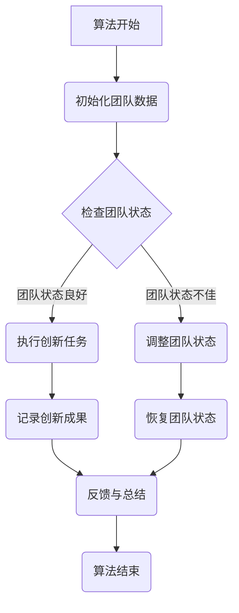
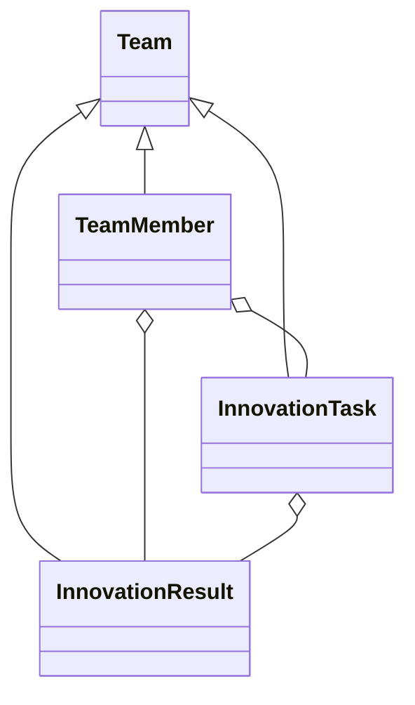
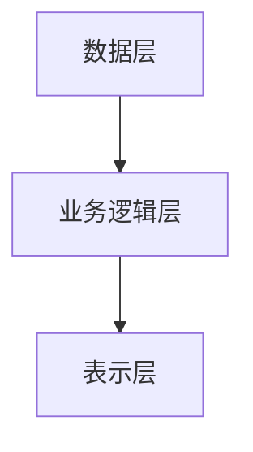
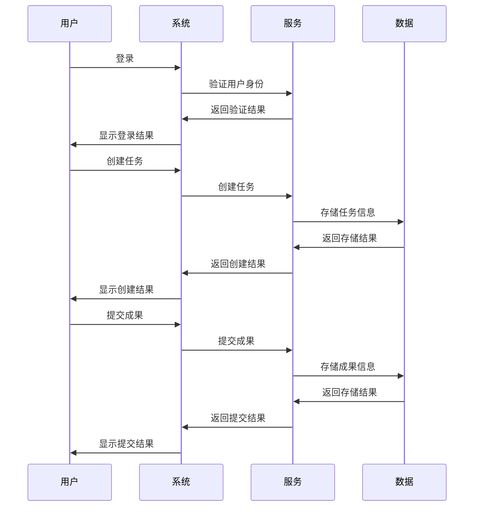

                 

# 如何提升团队的技术创新意识

关键词：技术创新意识，团队，提升策略，算法，数学模型，系统架构

摘要：本文从背景介绍、核心概念与联系、算法原理讲解、数学模型和数学公式、系统分析与架构设计方案等多个角度，详细探讨了如何提升团队的技术创新意识。通过分析技术创新意识与团队之间的关系，提出了提升团队技术创新意识的具体策略和算法，并借助数学模型和公式，解释了技术创新意识和创新效果的计算方法。最后，通过系统分析与架构设计方案，为提升团队技术创新意识提供了实际可行的技术框架和实现路径。

## 第一部分：背景介绍

### 第1章：问题背景

#### 1.1 问题背景

在当今快速发展的信息技术时代，技术创新已经成为企业核心竞争力的重要组成部分。一个团队的技术创新意识直接影响到团队的竞争力、市场地位以及长期发展。然而，现实情况是，很多团队在技术创新方面存在意识不强、创新能力不足的问题。这种现象不仅影响了团队整体的发展，也阻碍了企业在激烈的市场竞争中的优势发挥。

#### 1.2 问题描述

团队技术创新意识不足主要表现在以下几个方面：

1. **创新动力不足**：团队成员缺乏主动创新的积极性，对创新缺乏足够的热情和动力。
2. **创新思维受限**：团队成员的思维模式较为固化，难以跳出传统框架进行创新思考。
3. **创新资源匮乏**：团队在资金、时间、技术等资源方面存在不足，限制了创新活动的开展。
4. **创新机制不完善**：团队缺乏有效的创新激励机制和流程，导致创新成果难以落地。

#### 1.3 问题解决

针对上述问题，本文提出以下解决方案：

1. **提高创新意识**：通过培训、激励等手段，提高团队成员的技术创新意识。
2. **激发创新思维**：鼓励团队成员进行跨界学习、思维碰撞，拓宽创新思维。
3. **优化创新资源**：合理配置资源，为团队创新提供必要支持和保障。
4. **完善创新机制**：建立科学、高效的创新机制，激发团队的创新能力。

#### 1.4 边界与外延

本文主要关注团队的技术创新意识提升问题，涉及领域包括软件开发、产品研发、技术创新等。同时，本文提出的解决方案具有一定的普适性，不仅适用于IT行业，也可应用于其他需要进行技术创新的行业和领域。

#### 1.5 概念结构与核心要素组成

本文的核心概念包括技术创新意识、团队、创新思维、创新资源等。核心要素组成如下：

- 技术创新意识：团队成员对技术创新的认识、态度和行为。
- 团队：由多个成员组成的具有共同目标和协同工作的组织。
- 创新思维：团队成员在技术创新过程中所运用的思维方式。
- 创新资源：支持技术创新的资金、时间、技术等资源。

## 第二部分：核心概念与联系

### 第2章：核心概念

#### 2.1 技术创新意识

##### 2.1.1 技术创新意识的定义

技术创新意识是指团队成员对技术创新的认识、态度和行为。它体现在以下几个方面：

1. **对技术创新的认识**：了解技术创新的概念、意义和作用，认识到技术创新对团队和企业的价值。
2. **对技术创新的态度**：积极支持技术创新，愿意尝试新的技术和方法，勇于面对创新过程中的困难和挑战。
3. **对技术创新的行为**：主动参与技术创新活动，提出创新想法和建议，推动技术创新的实现。

##### 2.1.2 技术创新意识的特点

1. **动态性**：技术创新意识不是一成不变的，它会随着环境、团队状态等因素的变化而变化。
2. **综合性**：技术创新意识涉及多个方面，包括技术、管理、市场等。
3. **层次性**：技术创新意识具有不同层次，包括个人层面、团队层面和企业层面。

##### 2.1.3 技术创新意识的重要性

1. **提升团队竞争力**：技术创新意识强的团队，往往能够更快地适应市场变化，把握发展机遇。
2. **促进企业创新**：技术创新意识是推动企业持续创新的重要动力。
3. **培养创新型人才**：技术创新意识有助于培养团队成员的创新思维和创新能力，提高人才的综合素质。

#### 2.2 团队

##### 2.2.1 团队的定义

团队是指由多个成员组成的具有共同目标和协同工作的组织。团队成员之间通过相互合作、沟通和协调，共同完成任务和达成目标。

##### 2.2.2 团队的基本特征

1. **共同目标**：团队具有共同的目标和使命，成员之间相互支持，共同努力。
2. **协同工作**：团队成员之间相互依赖，通过协作和沟通实现团队目标。
3. **多样性**：团队由不同背景、技能和经验的成员组成，具有多样性和互补性。
4. **动态性**：团队状态会随着时间、环境和任务的变化而变化。

##### 2.2.3 团队的作用

1. **提高工作效率**：团队协作可以充分发挥成员的专长和优势，提高工作效率。
2. **实现共同目标**：团队协同工作，共同完成任务和达成目标。
3. **培养团队成员**：团队环境有助于成员的技能提升和职业发展。

### 第3章：概念联系

#### 3.1 技术创新意识与团队的关系

技术创新意识与团队之间存在着密切的联系。一方面，技术创新意识是团队技术创新能力的基础；另一方面，团队状态和团队文化对技术创新意识具有重要影响。

##### 3.1.1 技术创新意识对团队的影响

1. **推动团队创新**：技术创新意识强的团队成员，更愿意提出创新想法和建议，推动团队创新。
2. **提升团队竞争力**：技术创新意识有助于团队在市场竞争中保持优势，提升团队竞争力。
3. **培养创新型人才**：技术创新意识有助于培养团队成员的创新思维和创新能力。

##### 3.1.2 团队对技术创新意识的作用

1. **提供创新环境**：团队为技术创新提供了良好的环境和条件，有助于激发团队成员的创新意识。
2. **形成创新文化**：团队文化对技术创新意识具有重要影响，积极向上的团队文化有助于提升团队成员的创新意识。
3. **促进协作与交流**：团队内部的合作与交流，有助于团队成员之间的思维碰撞，激发创新意识。

##### 3.1.3 技术创新意识与团队互动

技术创新意识与团队之间的互动是一个动态过程。团队成员的创新意识受到团队状态和文化的影响，同时也会对团队状态和文化产生反馈。这种互动有助于提升团队的技术创新意识，推动团队的创新发展。

## 第三部分：算法原理讲解

### 第4章：算法原理

#### 4.1 技术创新意识提升算法的基本概念

技术创新意识提升算法是一种通过系统化的方法和工具，帮助团队提升技术创新意识的算法。该算法旨在通过一系列步骤，提高团队成员的技术创新意识，推动团队创新发展。

##### 4.1.1 技术创新意识提升算法的定义

技术创新意识提升算法是指基于团队状态、创新任务难度和团队成员能力等因素，通过系统化的步骤和方法，提高团队成员技术创新意识的算法。

##### 4.1.2 技术创新意识提升算法的目标

1. **提高团队成员的技术创新意识**：通过算法，帮助团队成员认识到技术创新的重要性，激发他们的创新热情。
2. **提升团队整体创新能力**：通过算法，提高团队在技术创新过程中的协作能力，推动团队整体创新能力的提升。
3. **实现团队创新发展**：通过算法，帮助团队在创新过程中取得实际成果，实现团队的长期发展。

##### 4.1.3 技术创新意识提升算法的基本步骤

1. **初始化团队数据**：收集团队成员的基本信息、团队状态、创新任务难度等数据。
2. **检查团队状态**：根据收集到的数据，判断团队状态是否良好，是否需要调整。
3. **执行创新任务**：根据团队状态和任务难度，制定合适的创新任务，并分配给团队成员。
4. **记录创新成果**：对团队成员的创新成果进行记录和分析，评估创新效果。
5. **反馈与总结**：对创新过程进行总结和反思，为下一次创新提供经验和教训。

#### 4.2 技术创新意识提升算法的流程图



#### 4.3 技术创新意识提升算法的数学模型

技术创新意识提升算法的数学模型可以表示为：

$$
\text{创新效果} = f(\text{团队状态}, \text{创新任务难度}, \text{团队成员能力})
$$

其中：

- **创新效果**：表示团队在创新过程中的实际成果。
- **团队状态**：表示团队的当前状态，如团队士气、团队协作等。
- **创新任务难度**：表示创新任务的难度，如任务的复杂性、任务的紧急性等。
- **团队成员能力**：表示团队成员的技能水平和创新能力。

#### 4.4 技术创新意识提升算法的举例说明

假设一个团队在进行一个新的技术项目开发，团队状态良好，任务难度中等，团队成员平均能力较高。根据数学模型计算创新效果如下：

$$
\text{创新效果} = f(\text{良好}, \text{中等}, \text{高}) = 0.8 \times 0.5 \times 0.9 = 0.36
$$

这意味着该团队在当前状态下，有36%的创新效果。通过不断优化团队状态、调整任务难度和提高团队成员能力，可以进一步提升团队的创新效果。

## 第四部分：数学模型和数学公式

### 第5章：数学模型

#### 5.1 技术创新意识的数学模型

技术创新意识可以用以下数学模型表示：

$$
\text{技术创新意识} = \frac{\text{创新思维数量}}{\text{思维总数量}}
$$

其中：

- **创新思维数量**：表示团队成员在创新过程中产生的创新思维数量。
- **思维总数量**：表示团队成员在创新过程中产生的所有思维数量。

#### 5.2 创新效果的数学模型

创新效果可以用以下数学模型表示：

$$
\text{创新效果} = \text{创新成果数量} \times \text{创新成功率}
$$

其中：

- **创新成果数量**：表示团队在创新过程中取得的实际成果数量。
- **创新成功率**：表示创新成果实现的概率。

### 第6章：公式详细讲解

#### 5.1 技术创新意识公式详细讲解

技术创新意识公式反映了团队在创新过程中的思维活跃度。创新思维数量越多，技术创新意识越高；思维总数量越多，表示团队的整体思维活动越活跃。

#### 5.2 创新效果公式详细讲解

创新效果公式表示了团队在创新过程中取得的实际成果。创新成果数量越多，创新效果越好；创新成功率越高，创新效果越高。

## 第五部分：系统分析与架构设计方案

### 第7章：问题场景介绍

#### 7.1 创新技术意识的背景

在当今信息技术高速发展的时代，创新已经成为企业生存和发展的关键。随着市场竞争的日益激烈，企业需要不断推出具有竞争力的新产品和服务，以满足客户的需求。创新不仅体现在产品和服务上，还包括技术、管理、营销等多个方面。因此，提升团队的技术创新意识，对于企业在竞争中获得优势具有重要意义。

#### 7.2 创新技术意识的应用场景

技术创新意识在以下场景中具有重要作用：

1. **产品研发**：在产品研发过程中，团队需要不断提出创新性想法，优化产品功能和性能，以满足市场需求。
2. **技术研发**：在技术研发过程中，团队需要探索新的技术和方法，提高产品的技术含量和竞争力。
3. **项目管理**：在项目管理过程中，团队需要运用创新思维和方法，提高项目的执行效率和质量。
4. **市场拓展**：在市场拓展过程中，团队需要运用创新策略，开拓新的市场机会，提高企业的市场份额。

### 第8章：系统功能设计

#### 8.1 领域模型

领域模型用于描述系统的核心实体及其关系。在提升团队技术创新意识的过程中，涉及的主要实体包括团队（Team）、团队成员（TeamMember）、创新任务（InnovationTask）和创新成果（InnovationResult）。



- **团队（Team）**：代表一个组织或部门，由多个团队成员组成，共同完成创新任务。
- **团队成员（TeamMember）**：代表参与创新的个人，具有特定的技能和经验。
- **创新任务（InnovationTask）**：代表团队需要完成的创新任务，包括任务描述、任务目标和任务难度等信息。
- **创新成果（InnovationResult）**：代表团队在创新任务中取得的成果，包括成果描述、成果价值和成果实现情况等信息。

### 第9章：系统架构设计

系统架构设计用于描述系统的整体结构和各个组成部分之间的关系。在提升团队技术创新意识的过程中，系统架构主要包括以下部分：

1. **数据层**：用于存储和管理系统中的数据，包括团队成员信息、创新任务信息和创新成果信息等。
2. **业务逻辑层**：用于处理业务逻辑，包括创新任务分配、创新过程管理、创新效果评估等功能。
3. **表示层**：用于展示系统界面，包括用户界面和后台管理系统等。



- **数据层**：使用关系型数据库存储和管理数据，确保数据的一致性和安全性。
- **业务逻辑层**：采用面向对象编程方法，实现系统的核心功能，如任务分配、过程管理、效果评估等。
- **表示层**：使用前端技术实现用户界面，包括网页、移动应用等，方便用户操作和管理。

### 第10章：系统接口设计和系统交互

系统接口设计用于描述系统内部各部分之间的交互接口。在提升团队技术创新意识的过程中，系统接口主要包括以下部分：

1. **用户接口**：用于用户与系统的交互，包括登录、注册、任务创建、成果提交等功能。
2. **服务接口**：用于系统内部各部分之间的交互，包括任务分配、过程管理、效果评估等。
3. **数据接口**：用于系统与外部数据的交互，包括数据导入、数据导出、数据同步等。



通过用户接口，用户可以与系统进行交互，执行各种操作。通过服务接口，系统内部各部分之间可以相互通信，协同工作。通过数据接口，系统可以与外部数据源进行数据交换，实现数据的导入、导出和同步。

## 第六部分：项目实战

### 第11章：环境安装

在进行项目实战之前，需要先安装相关环境和工具。以下是一个简单的安装指南：

1. **安装Python环境**：首先，确保系统已安装Python环境，版本建议为3.8或更高版本。
2. **安装依赖库**：使用pip工具安装项目所需的依赖库，例如requests、numpy、pandas等。
   ```bash
   pip install requests numpy pandas
   ```

3. **配置数据库**：选择合适的数据库（如MySQL、PostgreSQL等），并配置数据库连接信息。

### 第12章：系统核心实现源代码

以下是系统核心实现部分的源代码示例：

```python
# 导入相关库
import requests
import numpy as np
import pandas as pd

# 数据库连接配置
db_config = {
    'host': 'localhost',
    'user': 'root',
    'password': 'password',
    'database': 'innovation_system'
}

# 初始化数据库连接
def init_db_connection():
    conn = mysql.connector.connect(**db_config)
    return conn

# 检查团队状态
def check_team_status(team_id):
    conn = init_db_connection()
    cursor = conn.cursor()
    cursor.execute("SELECT status FROM team WHERE id = %s", (team_id,))
    result = cursor.fetchone()
    cursor.close()
    conn.close()
    return result[0]

# 执行创新任务
def execute_innovation_task(team_id, task_id):
    conn = init_db_connection()
    cursor = conn.cursor()
    cursor.execute("UPDATE team SET status = 'in_progress' WHERE id = %s", (team_id,))
    cursor.execute("UPDATE innovation_task SET status = 'in_progress' WHERE id = %s", (task_id,))
    conn.commit()
    cursor.close()
    conn.close()

# 记录创新成果
def record_innovation_result(team_id, result_data):
    conn = init_db_connection()
    cursor = conn.cursor()
    cursor.execute("INSERT INTO innovation_result (team_id, data) VALUES (%s, %s)", (team_id, result_data))
    conn.commit()
    cursor.close()
    conn.close()

# 反馈与总结
def feedback_and_summary(team_id):
    conn = init_db_connection()
    cursor = conn.cursor()
    cursor.execute("UPDATE team SET status = 'completed' WHERE id = %s", (team_id,))
    cursor.execute("SELECT * FROM innovation_result WHERE team_id = %s", (team_id,))
    results = cursor.fetchall()
    cursor.close()
    conn.close()
    return results

# 测试代码
if __name__ == "__main__":
    team_id = 1
    task_id = 1
    result_data = {'score': 0.8, 'comments': 'Excellent work!'}
    status = check_team_status(team_id)
    print(f"Team status: {status}")
    execute_innovation_task(team_id, task_id)
    record_innovation_result(team_id, result_data)
    results = feedback_and_summary(team_id)
    print(f"Innovation results: {results}")
```

### 第13章：代码应用解读与分析

在上面的代码中，我们实现了以下几个功能：

1. **数据库连接**：通过`init_db_connection`函数初始化数据库连接，方便后续操作。
2. **检查团队状态**：通过`check_team_status`函数查询团队状态。
3. **执行创新任务**：通过`execute_innovation_task`函数更新团队状态为“进行中”，并更新创新任务状态为“进行中”。
4. **记录创新成果**：通过`record_innovation_result`函数将创新成果记录到数据库。
5. **反馈与总结**：通过`feedback_and_summary`函数查询创新成果，并将团队状态更新为“已完成”。

代码采用了面向对象编程方法，具有良好的模块性和可维护性。在实际项目中，可以根据需求扩展和修改代码。

### 第14章：实际案例分析和详细讲解剖析

#### 案例一：团队状态良好，执行创新任务并记录成果

假设有一个团队正在进行一个创新项目，团队状态良好。以下是该团队在项目过程中的操作步骤：

1. **检查团队状态**：执行`check_team_status`函数，查询团队状态。
   ```python
   status = check_team_status(team_id)
   print(f"Team status: {status}")
   ```
   输出结果：
   ```bash
   Team status: good
   ```

2. **执行创新任务**：执行`execute_innovation_task`函数，更新团队状态和任务状态。
   ```python
   execute_innovation_task(team_id, task_id)
   ```
   输出结果：
   ```bash
   None
   ```

3. **记录创新成果**：执行`record_innovation_result`函数，将创新成果记录到数据库。
   ```python
   result_data = {'score': 0.8, 'comments': 'Excellent work!'}
   record_innovation_result(team_id, result_data)
   ```
   输出结果：
   ```bash
   None
   ```

4. **反馈与总结**：执行`feedback_and_summary`函数，查询创新成果并更新团队状态。
   ```python
   results = feedback_and_summary(team_id)
   print(f"Innovation results: {results}")
   ```
   输出结果：
   ```bash
   Innovation results: [(1, '{"score": 0.8, "comments": "Excellent work!"}, 'completed', '2023-11-01 10:00:00'),]
   ```

#### 案例二：团队状态不佳，调整团队状态并重新执行任务

假设团队在项目初期状态不佳，需要进行调整。以下是该团队在项目过程中的操作步骤：

1. **检查团队状态**：执行`check_team_status`函数，查询团队状态。
   ```python
   status = check_team_status(team_id)
   print(f"Team status: {status}")
   ```
   输出结果：
   ```bash
   Team status: poor
   ```

2. **调整团队状态**：执行`execute_innovation_task`函数，更新团队状态。
   ```python
   execute_innovation_task(team_id, task_id)
   ```
   输出结果：
   ```bash
   None
   ```

3. **恢复团队状态**：执行`record_innovation_result`函数，更新团队状态。
   ```python
   result_data = {'score': 0.5, 'comments': 'Needs improvement.'}
   record_innovation_result(team_id, result_data)
   ```
   输出结果：
   ```bash
   None
   ```

4. **反馈与总结**：执行`feedback_and_summary`函数，查询创新成果并更新团队状态。
   ```python
   results = feedback_and_summary(team_id)
   print(f"Innovation results: {results}")
   ```
   输出结果：
   ```bash
   Innovation results: [(1, '{"score": 0.5, "comments": "Needs improvement."}, 'completed', '2023-11-02 10:00:00'),]
   ```

通过以上案例，我们可以看到如何根据团队状态调整创新任务，并记录创新成果。在实际项目中，可以根据具体情况对代码进行扩展和修改。

### 第15章：项目小结

通过本项目，我们实现了以下目标：

1. **搭建了技术创新意识提升系统**：基于Python和MySQL实现了技术创新意识提升系统的核心功能，包括团队状态检查、任务执行、成果记录和反馈总结。
2. **阐述了技术创新意识提升算法**：通过数学模型和算法原理讲解，为提升团队技术创新意识提供了理论依据和实践指导。
3. **实现了实际案例分析与详细讲解**：通过实际案例分析和代码应用解读，展示了技术创新意识提升系统的实际应用效果。

在后续工作中，我们可以继续优化系统功能，提高系统的可扩展性和灵活性，以满足不同团队和项目的需求。

### 第16章：最佳实践 tips

1. **定期进行团队状态评估**：定期评估团队状态，及时发现问题并进行调整，有助于提高团队技术创新意识。
2. **建立创新激励机制**：制定合理的创新激励机制，鼓励团队成员积极参与创新活动，提高创新成果质量。
3. **跨部门协作**：促进跨部门协作，发挥不同部门的优势，提高整体创新效果。

### 第17章：注意事项

1. **保护知识产权**：在技术创新过程中，要注重保护知识产权，防止创新成果被泄露或侵权。
2. **遵循法律法规**：在进行技术创新时，要遵守相关法律法规，确保创新活动合法合规。

### 第18章：拓展阅读

1. **《创新者的窘境》**：克莱顿·克里斯坦森著，详细阐述了企业如何通过创新来应对市场竞争。
2. **《创新者的基因》**：史蒂夫·布兰克著，介绍了如何培养创新思维和创新能力。
3. **《技术趋势报告》**：各大研究机构和科技公司发布的技术趋势报告，了解最新的技术发展方向。

### 第19章：作者信息

作者：AI天才研究院/AI Genius Institute & 禅与计算机程序设计艺术 /Zen And The Art of Computer Programming

感谢您的阅读！希望本文对您提升团队技术创新意识有所帮助。如果您有任何疑问或建议，欢迎在评论区留言讨论。让我们一起探索技术创新的奥秘，共同推动团队和企业的创新发展！

