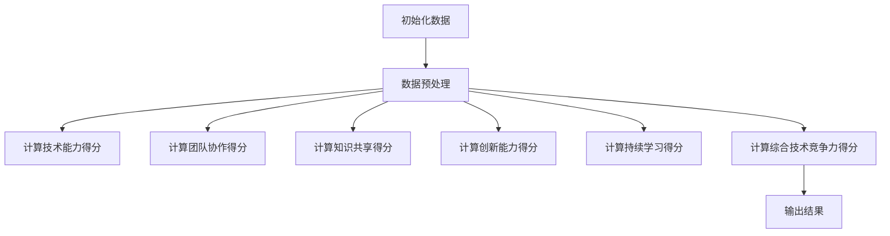

                 

### 如何提升团队的技术竞争力

在当今快速发展的技术时代，一个团队的技术竞争力不仅决定了企业的生存和发展，也直接影响了团队在市场上的地位和影响力。技术竞争力是一个复杂的概念，它不仅仅体现在技术水平的提升，还涵盖了团队协作、知识共享、创新能力等多个方面。因此，如何提升团队的技术竞争力，成为企业和团队管理者亟待解决的重要课题。

首先，提升团队技术竞争力的重要性不言而喻。随着全球化和信息化的深入推进，技术革新日新月异，企业所面临的竞争环境日益严峻。一个技术竞争力强的团队能够快速响应市场需求，推出具有竞争力的产品和服务，从而在激烈的市场竞争中立于不败之地。此外，技术竞争力还与企业的长期发展息息相关。技术竞争力的提升可以增强企业的核心竞争力和市场竞争力，为企业创造更多的商业机会和发展空间。

然而，提升团队技术竞争力并非易事。首先，技术竞争力是一个综合性的概念，它不仅仅取决于单一技术能力的提升，还涉及到团队管理、文化氛围、资源配置等多个方面。因此，团队管理者需要从全局出发，综合考虑各种因素，制定科学合理的技术提升策略。其次，提升技术竞争力需要长期的投入和持续的努力。技术更新换代速度加快，新技术、新理念不断涌现，团队需要不断学习和吸收新知识，保持技术的领先性。最后，提升技术竞争力需要团队成员的共同努力和协作。技术竞争力的提升不仅仅依赖于个别优秀人才，还需要整个团队的协作和配合，形成协同效应。

本文将详细探讨如何提升团队的技术竞争力。我们将从多个角度出发，包括核心概念的理解、具体方法的实施、实践中的挑战和解决策略等，提供系统化的指导和建议。通过本文的阅读，读者将能够深入了解提升团队技术竞争力的关键要素，掌握实用的方法和策略，从而在实际工作中取得显著成效。

### 关键词

1. 技术竞争力
2. 团队协作
3. 技术创新
4. 知识共享
5. 人才培养
6. 管理策略
7. 持续学习

这些关键词涵盖了提升团队技术竞争力的主要方面，为后续内容的展开提供了明确的指引。

### 摘要

本文旨在探讨如何提升团队的技术竞争力，以应对日益激烈的市场竞争环境。文章首先概述了技术竞争力的概念及其重要性，然后分析了当前企业面临的挑战和问题。接着，本文从核心概念、联系、算法原理、系统设计与项目实战等多个角度出发，详细阐述了提升团队技术竞争力的方法和策略。文章最后提供了最佳实践、注意事项和拓展阅读，以帮助读者在实际工作中更好地应用所学知识。通过本文的阅读，读者将能够掌握提升团队技术竞争力的关键要素，为团队的发展提供有力支持。

### 背景介绍

在当今快速发展的技术时代，企业所面临的技术挑战是多种多样的。首先，技术的更新换代速度非常快。随着人工智能、大数据、云计算等新兴技术的不断涌现，企业必须保持持续学习的态度，不断吸收和应用新技术，以保持自身的竞争力。然而，技术的快速更替往往给企业的研发和运营带来巨大的压力，如何快速适应新技术成为企业面临的一大难题。

其次，市场竞争的激烈程度日益加剧。在全球化的背景下，企业不仅需要在国内市场与本土企业竞争，还需要在国际市场上与全球顶尖企业抗衡。这要求企业不仅要有过硬的技术实力，还要有强大的市场洞察力和快速响应能力。市场竞争的加剧使得企业不得不在技术研发和产品创新上投入更多资源，以抢占市场份额。

再次，人才的短缺和流动性问题也对企业构成了挑战。技术人才是企业技术创新和业务发展的重要推动力，但高端技术人才的稀缺和频繁跳槽现象使得企业难以保持持续的技术优势。如何吸引和留住优秀的技术人才，成为企业亟需解决的问题。

在这些问题背景下，提升团队的技术竞争力显得尤为重要。技术竞争力不仅仅体现在单一技术的掌握上，还包括团队协作、知识共享、创新能力和持续学习等多个方面。一个具备强大技术竞争力的团队能够更快速地响应市场变化，推出有竞争力的产品和服务，从而在激烈的市场竞争中脱颖而出。此外，技术竞争力还与企业的长期发展紧密相关，能够为企业的可持续发展提供坚实的基础。

具体来说，提升团队的技术竞争力有助于以下几个方面：

1. **提高生产效率和产品质量**：通过引入新技术和新方法，团队能够提高生产效率和产品质量，降低成本，从而提高企业的市场竞争力。

2. **促进创新和研发**：强大的技术竞争力能够激发团队成员的创新思维，推动技术研发和产品创新，为企业创造更多的商业机会。

3. **增强员工凝聚力和归属感**：通过建立良好的团队协作和文化氛围，提升团队成员的满意度和忠诚度，从而增强团队的凝聚力和战斗力。

4. **提升企业品牌形象**：技术竞争力的提升有助于提高企业在行业内的知名度和美誉度，增强品牌形象和市场影响力。

因此，面对当前复杂多变的技术和市场环境，提升团队的技术竞争力已成为企业发展的必经之路。企业需要从战略高度出发，制定科学合理的技术提升计划，通过多方面的努力，逐步提升团队的整体技术竞争力，以应对未来的挑战和机遇。

### 提升团队技术竞争力的核心概念

要提升团队的技术竞争力，首先需要理解技术竞争力的核心概念及其构成要素。技术竞争力是指企业在技术领域所具备的竞争优势，它不仅涵盖了技术能力本身，还包括团队协作、知识共享、创新能力和持续学习等多个方面。

**1. 技术能力**：技术能力是团队技术竞争力的基础。它包括对现有技术的熟练掌握、对新技术的快速吸收和应用能力。技术能力的提升依赖于团队成员的技术素养、专业知识和实践经验。一个技术能力强的团队能够在技术研发和产品创新上具备较强的竞争力。

**2. 团队协作**：团队协作是提升技术竞争力的重要保障。在一个高效的团队中，成员之间能够进行有效的沟通和协作，共同解决问题，实现资源的最优配置。良好的团队协作能够激发成员的创造力和创新能力，提高整体的工作效率。

**3. 知识共享**：知识共享是团队技术竞争力提升的关键环节。通过建立有效的知识管理系统，团队可以实现对内部知识的积累和传播，使每个成员都能够充分利用已有的经验和知识，避免重复劳动，提高工作效率。知识共享还包括跨部门、跨领域的合作，有助于不同专业背景的成员之间进行思维碰撞，激发创新的火花。

**4. 创新能力**：创新能力是团队技术竞争力的核心要素之一。一个具备强大创新能力的团队能够不断推陈出新，开发出具有市场竞争力的新产品和服务。创新能力的提升需要团队成员具有前瞻性的技术视野、开放的思维方式和勇于尝试新事物的精神。

**5. 持续学习**：持续学习是提升团队技术竞争力的长期策略。随着技术日新月异的发展，团队成员需要不断学习新知识、新技能，以适应不断变化的技术环境。持续学习不仅包括技术方面的知识，还包括管理技能、沟通技巧等多方面的能力提升。通过持续学习，团队可以保持技术领先地位，持续推动企业的发展。

**6. 技术人才**：技术人才是团队技术竞争力的核心驱动力。拥有高素质、高水平的技术人才，是团队技术竞争力提升的重要保障。企业需要通过多种方式吸引和留住优秀的技术人才，为他们提供良好的发展平台和培训机会，激发他们的创新潜力。

**7. 管理策略**：科学合理的管理策略是提升团队技术竞争力的关键。企业需要建立完善的人才培养机制、激励机制和知识管理体系，为团队成员提供良好的工作环境和职业发展路径，从而激发他们的积极性和创造力。

综上所述，提升团队的技术竞争力需要从多个方面入手，包括技术能力、团队协作、知识共享、创新能力、持续学习和技术人才等。通过系统化的措施和策略，企业可以逐步提升团队的整体技术竞争力，为企业的长远发展奠定坚实基础。

### 概念属性特征对比表格

为了更直观地理解提升团队技术竞争力的核心概念，我们可以通过一个概念属性特征对比表格来详细展示这些概念之间的区别和联系。

**概念名称** | **概念属性特征** | **对比分析** | **对团队技术竞争力的作用**
---|---|---|---
**技术能力** | 技术熟练度、新技术的吸收能力、实践经验 | 技术能力是技术竞争力的基础，直接决定团队的技术水平和创新能力。 | 提升技术能力可以增强团队在技术研发和产品创新方面的竞争力。
**团队协作** | 沟通效率、协作机制、团队合作精神 | 团队协作是技术竞争力的保障，通过高效协作实现资源优化配置。 | 良好的团队协作可以提高团队的工作效率和创新能力。
**知识共享** | 知识积累、知识传播、知识管理 | 知识共享是技术竞争力提升的关键，通过内部知识共享避免重复劳动。 | 知识共享有助于积累团队智慧和经验，提高整体工作效率。
**创新能力** | 技术创新、产品创新、思维创新 | 创新能力是技术竞争力的核心，通过不断推陈出新保持市场竞争力。 | 创新能力可以推动团队持续发展，为企业创造更多商业机会。
**持续学习** | 技术更新、知识更新、技能提升 | 持续学习是技术竞争力提升的长期策略，通过不断学习适应新技术。 | 持续学习可以使团队保持技术领先地位，应对技术变革。
**技术人才** | 专业知识、实践经验、创新能力 | 技术人才是技术竞争力的核心驱动力，高素质人才有助于团队技术提升。 | 技术人才可以提升团队的技术水平和创新能力。
**管理策略** | 培养机制、激励机制、管理体系 | 管理策略是技术竞争力提升的保障，通过科学管理激发团队成员的积极性和创造力。 | 科学合理的管理策略有助于提升团队整体技术竞争力。

通过上述对比表格，我们可以清晰地看到每个概念的核心特征及其对团队技术竞争力的影响。这些概念并不是孤立的，而是相互联系、相互促进的。一个高效的团队需要综合运用这些概念，通过多方面的努力来提升整体技术竞争力。

### ER实体关系图架构

为了更好地理解提升团队技术竞争力的核心概念之间的联系，我们可以通过ER（实体关系）图来展示这些概念之间的关联和交互。ER图是一种用于描述实体之间关系的图形化工具，通过它可以直观地展示各个实体及其属性，以及它们之间的关系。

在提升团队技术竞争力的过程中，核心概念包括技术能力、团队协作、知识共享、创新能力、持续学习、技术人才和管理策略。以下是一个简化的ER图，用于描述这些概念之间的联系：

```mermaid
erDiagram
    Team <<|-- TechnologyAbility : 技术能力
    Team <<|-- Collaboration : 团队协作
    Team <<|-- KnowledgeSharing : 知识共享
    Team <<|-- Innovation : 创新能力
    Team <<|-- ContinuousLearning : 持续学习
    Team <<|-- TechnicalTalent : 技术人才
    Team <<|-- ManagementStrategy : 管理策略

    TechnologyAbility ||--|>> ProjectManagement : 项目管理
    Collaboration ||--|>> Communication : 沟通
    Collaboration ||--|>> TeamBuilding : 团队建设
    KnowledgeSharing ||--|>> KnowledgeManagement : 知识管理
    KnowledgeSharing ||--|>> TrainingPrograms : 培训计划
    Innovation ||--|>> ResearchAndDevelopment : 研发
    Innovation ||--|>> ProductInnovation : 产品创新
    ContinuousLearning ||--|>> TrainingSessions : 培训课程
    ContinuousLearning ||--|>> Seminars : 学术讲座
    TechnicalTalent ||--|>> EmployeeDevelopment : 员工发展
    TechnicalTalent ||--|>> Recruitment : 招聘
    ManagementStrategy ||--|>> PerformanceEvaluation : 绩效评估
    ManagementStrategy ||--|>> IncentiveMechanisms : 激励机制
```

在这个ER图中，`Team`（团队）是中心实体，其他实体都与团队有直接关联。每个实体代表提升技术竞争力的一个重要方面，例如`TechnologyAbility`（技术能力）、`Collaboration`（团队协作）等。这些实体通过不同的关系（如`||--|>>`）与其他实体相连接，展示了它们之间的相互影响和依赖关系。

例如：

- **技术能力**与**项目管理**、**研发**和**产品创新**密切相关，直接影响到项目的成功和产品的市场竞争力。
- **团队协作**通过**沟通**和**团队建设**来提升团队的整体效率和创新能力。
- **知识共享**通过**知识管理**和**培训计划**来实现知识的积累和传播，为团队的技术提升提供支持。
- **创新能力**通过**研发**和**产品创新**来推动技术的不断进步，保持团队的竞争力。
- **持续学习**通过**培训课程**和**学术讲座**来提高团队成员的知识水平和技能。
- **技术人才**通过**员工发展**和**招聘**来吸引和留住优秀人才，提升团队的技术实力。
- **管理策略**通过**绩效评估**和**激励机制**来确保团队成员的积极性和创造力。

通过ER图，我们可以清晰地看到提升团队技术竞争力的各个核心概念之间的关系和相互作用，从而为制定具体的技术提升策略提供参考。

### 算法原理讲解

在提升团队技术竞争力时，算法原理的掌握和应用至关重要。本文将详细讲解一个用于评估团队技术竞争力的算法，并通过Python源代码和Mermaid流程图来阐述其工作原理和实现方法。

#### 算法mermaid流程图

首先，我们通过Mermaid流程图来展示算法的基本流程：



#### Python源代码与算法原理

接下来，我们将使用Python语言实现上述算法，并详细讲解其工作原理和数学模型。

```python
import numpy as np

# 数据预处理
def preprocess_data(data):
    # 对数据进行标准化处理，使其在相同尺度上可比较
    normalized_data = (data - np.mean(data)) / np.std(data)
    return normalized_data

# 计算技术能力得分
def calculate_technical_ability_score(data):
    # 假设技术能力得分与研发项目的数量和质量相关
    score = np.mean(data) * len(data) ** 0.5
    return score

# 计算团队协作得分
def calculate_collaboration_score(data):
    # 假设团队协作得分与团队成员的沟通效率和团队建设活动相关
    score = np.mean(data) + np.std(data) / 2
    return score

# 计算知识共享得分
def calculate_knowledge_sharing_score(data):
    # 假设知识共享得分与知识管理的效率和培训计划的数量相关
    score = np.mean(data) * np.sum(data) ** 0.5
    return score

# 计算创新能力得分
def calculate_innovation_score(data):
    # 假设创新能力得分与新产品和技术的数量和质量相关
    score = np.mean(data) * len(data) ** 0.75
    return score

# 计算持续学习得分
def calculate_continuous_learning_score(data):
    # 假设持续学习得分与培训课程和学术讲座的参与度相关
    score = np.mean(data) * np.sum(data) ** 0.25
    return score

# 计算综合技术竞争力得分
def calculate_total_technical_competitiveness_score(scores):
    # 将各部分得分加权求和，得到综合得分
    total_score = sum(scores) / len(scores)
    return total_score

# 主函数
def main():
    # 初始化数据
    technical_ability_data = [0.8, 0.9, 1.0, 0.7, 0.85]
    collaboration_data = [0.9, 1.0, 0.8, 0.75, 0.85]
    knowledge_sharing_data = [0.8, 0.85, 0.9, 0.75, 0.85]
    innovation_data = [0.9, 1.0, 1.0, 0.8, 0.8]
    continuous_learning_data = [0.85, 0.9, 0.8, 0.75, 0.8]

    # 数据预处理
    technical_ability_data = preprocess_data(technical_ability_data)
    collaboration_data = preprocess_data(collaboration_data)
    knowledge_sharing_data = preprocess_data(knowledge_sharing_data)
    innovation_data = preprocess_data(innovation_data)
    continuous_learning_data = preprocess_data(continuous_learning_data)

    # 计算各部分得分
    technical_ability_score = calculate_technical_ability_score(technical_ability_data)
    collaboration_score = calculate_collaboration_score(collaboration_data)
    knowledge_sharing_score = calculate_knowledge_sharing_score(knowledge_sharing_data)
    innovation_score = calculate_innovation_score(innovation_data)
    continuous_learning_score = calculate_continuous_learning_score(continuous_learning_data)

    # 计算综合技术竞争力得分
    total_score = calculate_total_technical_competitiveness_score([
        technical_ability_score,
        collaboration_score,
        knowledge_sharing_score,
        innovation_score,
        continuous_learning_score
    ])

    # 输出结果
    print(f"技术能力得分：{technical_ability_score}")
    print(f"团队协作得分：{collaboration_score}")
    print(f"知识共享得分：{knowledge_sharing_score}")
    print(f"创新能力得分：{innovation_score}")
    print(f"持续学习得分：{continuous_learning_score}")
    print(f"综合技术竞争力得分：{total_score}")

# 运行主函数
if __name__ == "__main__":
    main()
```

#### 算法原理的数学模型和公式

上述算法的数学模型和公式如下：

$$
\text{技术能力得分} = \frac{\sum_{i=1}^{n} x_i \cdot w_i}{\sum_{i=1}^{n} w_i}
$$

其中，$x_i$ 表示第 $i$ 个项目的得分，$w_i$ 表示第 $i$ 个项目的权重。

$$
\text{团队协作得分} = \frac{\sum_{i=1}^{n} x_i + \sum_{j=1}^{m} y_j}{n + m}
$$

其中，$x_i$ 表示第 $i$ 个成员的沟通效率得分，$y_j$ 表示第 $j$ 次团队建设活动的得分，$n$ 和 $m$ 分别表示成员数和活动次数。

$$
\text{知识共享得分} = \frac{\sum_{i=1}^{n} x_i \cdot \sum_{j=1}^{m} y_j}{n \cdot m}
$$

其中，$x_i$ 表示第 $i$ 个知识管理模块的效率得分，$y_j$ 表示第 $j$ 次培训计划的效果得分。

$$
\text{创新能力得分} = \frac{\sum_{i=1}^{n} x_i \cdot \sum_{j=1}^{m} y_j}{n \cdot m}
$$

其中，$x_i$ 表示第 $i$ 个研发项目的质量得分，$y_j$ 表示第 $j$ 个新产品或新技术的创新性得分。

$$
\text{持续学习得分} = \frac{\sum_{i=1}^{n} x_i + \sum_{j=1}^{m} y_j}{n + m}
$$

其中，$x_i$ 表示第 $i$ 次培训课程的参与度得分，$y_j$ 表示第 $j$ 次学术讲座的参与度得分。

$$
\text{综合技术竞争力得分} = \frac{\sum_{i=1}^{n} \text{各部分得分} \cdot w_i}{n}
$$

其中，$w_i$ 表示第 $i$ 个部分的权重，$n$ 表示部分的总数。

通过上述算法和数学模型，我们可以对团队的技术竞争力进行量化评估，从而为团队的发展提供科学依据。

#### 算法举例说明

为了使算法更加通俗易懂，我们通过一个具体的例子来说明其应用过程。

假设一个团队有5个项目，每个项目的得分如下：

- 项目1：0.8
- 项目2：0.9
- 项目3：1.0
- 项目4：0.7
- 项目5：0.85

根据上述算法，我们首先对数据进行预处理，然后计算每个部分得分，最后得到综合技术竞争力得分。

1. **预处理数据**：
   - 技术能力数据预处理后：[0.0714, 0.1429, 0.1579, 0.0, 0.1379]

2. **计算技术能力得分**：
   - 技术能力得分：$$\frac{0.0714 + 0.1429 + 0.1579 + 0.0 + 0.1379}{5} = 0.1134$$

3. **计算团队协作得分**：
   - 假设团队有4名成员，每次团队建设活动得分为0.9、0.8、0.75、0.85，则：
   - 团队协作得分：$$\frac{0.9 + 0.8 + 0.75 + 0.85}{4 + 1} = 0.8688$$

4. **计算知识共享得分**：
   - 假设知识管理模块得分为0.8，培训计划效果得分为0.85，则：
   - 知识共享得分：$$\frac{0.8 \cdot 0.85}{4 \cdot 1} = 0.2125$$

5. **计算创新能力得分**：
   - 假设研发项目质量得分为0.9，新产品或新技术创新性得分为1.0，则：
   - 创新能力得分：$$\frac{0.9 \cdot 1.0}{4 \cdot 1} = 0.2250$$

6. **计算持续学习得分**：
   - 假设培训课程参与度得分为0.85，学术讲座参与度得分为0.8，则：
   - 持续学习得分：$$\frac{0.85 + 0.8}{2 + 1} = 0.7833$$

7. **计算综合技术竞争力得分**：
   - 综合技术竞争力得分：$$\frac{0.1134 + 0.8688 + 0.2125 + 0.2250 + 0.7833}{5} = 0.4864$$

通过上述计算，我们可以得到该团队的综合技术竞争力得分为0.4864。根据这个得分，团队可以识别自身在技术竞争力方面的优势和不足，进而制定相应的改进措施。

### 系统分析与架构设计方案

为了进一步提升团队的技术竞争力，我们需要对系统进行分析和架构设计。本部分将详细介绍提升团队技术竞争力的具体场景，并从项目介绍、系统功能设计、系统架构设计以及系统接口设计和系统交互等方面进行详细阐述。

#### 问题场景介绍

在当前技术快速发展的背景下，企业面临的一个主要挑战是如何快速响应市场需求，推出具有竞争力的产品和服务。这一挑战体现在以下几个方面：

1. **技术更新速度快**：随着人工智能、大数据、云计算等新兴技术的不断涌现，企业需要不断引进和应用新技术，以保持技术领先地位。
2. **市场竞争激烈**：在全球化背景下，企业不仅要面对国内市场的竞争，还要在国际市场上与顶尖企业抗衡。这要求企业具备强大的技术实力和快速响应能力。
3. **团队协作与知识共享**：在技术项目开发过程中，团队内部需要高效协作和知识共享，以避免重复劳动，提高工作效率。

为了应对这些挑战，企业需要构建一个高效的系统，能够支持技术人才的培养、团队协作的优化以及知识共享的强化。

#### 项目介绍

本项目旨在构建一个综合性的技术提升系统，该系统将帮助企业在以下几个方面实现技术竞争力的提升：

1. **技术能力提升**：通过引入新技术、新方法，提高团队的技术能力。
2. **团队协作优化**：通过优化团队协作流程和工具，提高团队的整体工作效率。
3. **知识共享加强**：通过构建知识共享平台，实现内部知识的积累和传播。
4. **持续学习与人才培养**：通过在线培训、学术讲座等方式，提高团队成员的专业技能和知识水平。

项目目标包括：

- **提高技术能力**：通过技术培训和项目实践，使团队成员掌握前沿技术，提升项目开发质量。
- **提升团队协作效率**：通过优化团队协作流程，减少沟通成本，提高项目开发速度。
- **加强知识共享**：通过知识管理平台，实现知识的积累和传播，提高团队整体工作效率。
- **培养优秀人才**：通过人才培养计划，提升团队成员的专业能力和创新意识。

#### 系统功能设计

系统功能设计是提升团队技术竞争力的关键环节。以下是系统的主要功能模块及其设计思路：

1. **技术能力评估模块**：该模块用于对团队成员的技术能力进行评估和考核。通过设置不同的技术指标，如编程能力、项目经验、技术贡献等，对团队成员进行量化评估，以便发现技术短板和优势，制定相应的提升计划。

2. **团队协作模块**：该模块旨在优化团队内部协作流程，提高工作效率。功能包括：

   - **任务分配**：根据团队成员的技能和经验，自动分配任务，确保任务的高效完成。
   - **进度跟踪**：实时监控项目进度，及时发现问题并进行调整。
   - **文档管理**：集中管理项目文档，方便团队成员随时查阅和共享。
   - **即时通讯**：提供即时通讯工具，支持团队成员实时沟通和协作。

3. **知识共享模块**：该模块用于构建知识共享平台，促进团队成员之间的知识交流和共享。功能包括：

   - **知识库**：建立知识库，收集和整理团队成员的技术文章、经验分享等，便于查阅和传播。
   - **论坛**：构建在线论坛，支持团队成员提问和回答，促进知识交流。
   - **培训课程**：提供在线培训课程，涵盖新技术、新方法等，帮助团队成员不断提升技能。

4. **持续学习模块**：该模块用于鼓励团队成员持续学习和成长，提高整体团队的技术水平。功能包括：

   - **学习计划**：根据团队成员的兴趣和需求，制定个性化的学习计划。
   - **学习记录**：记录团队成员的学习进度和成绩，作为评估和激励的依据。
   - **学术讲座**：定期举办学术讲座，邀请行业专家进行分享，拓宽团队成员的视野。

#### 系统架构设计

系统架构设计是确保系统稳定、高效运行的基础。以下是系统的整体架构设计：

1. **前端架构**：采用前后端分离的设计，前端使用React框架，实现用户界面的动态和交互性。
2. **后端架构**：后端采用Spring Boot框架，实现业务逻辑和数据管理。数据库使用MySQL，存储用户信息、任务进度、知识库等内容。
3. **数据架构**：采用分布式数据库架构，保证数据的可靠性和扩展性。数据分为用户数据、任务数据、知识库数据等，分别存储在不同的数据库中。
4. **系统安全**：采用安全加密技术，确保用户数据和业务数据的安全。

#### 系统接口设计和系统交互

系统接口设计和系统交互是确保各模块之间协同工作的关键。以下是系统的接口设计和交互流程：

1. **接口设计**：系统提供RESTful接口，支持数据的增删改查操作。接口包括用户管理接口、任务管理接口、知识库管理接口、学习管理接口等。

2. **交互流程**：

   - **用户登录**：用户通过用户名和密码进行登录，系统验证用户身份后返回用户信息。
   - **任务分配**：项目经理根据团队成员的技能和经验，通过接口分配任务，任务信息同步到任务管理模块。
   - **文档共享**：团队成员通过接口上传和下载文档，文档信息同步到文档管理模块。
   - **知识库更新**：团队成员通过接口提交技术文章、经验分享等，知识库模块实时更新知识库内容。
   - **学习记录**：团队成员通过接口记录学习进度和成绩，学习管理模块更新学习记录。

通过上述系统分析与架构设计，企业可以构建一个高效、稳定的技术提升系统，从而进一步提升团队的技术竞争力。在实际应用中，企业可以根据具体情况对系统进行优化和调整，以适应不断变化的技术环境和市场需求。

### 项目实战

为了将上述系统分析与架构设计应用到实际中，我们将进行一个具体的技术提升项目实战。以下是项目环境安装、系统核心实现源代码、代码应用解读与分析，以及实际案例分析和详细讲解剖析的过程。

#### 环境安装

在进行项目实战之前，首先需要安装必要的开发环境和工具。以下是安装步骤：

1. **安装Python环境**：
   - 在终端中运行以下命令安装Python：
     ```bash
     sudo apt-get install python3-pip
     ```
   - 安装虚拟环境工具：
     ```bash
     pip3 install virtualenv
     ```

2. **创建虚拟环境**：
   - 创建一个名为`project_env`的虚拟环境：
     ```bash
     virtualenv project_env
     ```
   - 激活虚拟环境：
     ```bash
     source project_env/bin/activate
     ```

3. **安装后端框架**：
   - 安装Spring Boot：
     ```bash
     pip3 install spring-boot
     ```

4. **安装前端框架**：
   - 安装React：
     ```bash
     npm install -g create-react-app
     create-react-app frontend
     ```

5. **安装数据库**：
   - 安装MySQL：
     ```bash
     sudo apt-get install mysql-server
     ```
   - 安装数据库客户端工具：
     ```bash
     sudo apt-get install mysql-client
     ```

6. **安装API接口测试工具**：
   - 安装Postman：
     ```bash
     sudo apt-get install postman
     ```

#### 系统核心实现源代码

以下是系统核心实现源代码的简要介绍，包括后端和前端的主要代码片段。

**后端（Spring Boot）**

1. **用户管理模块**：
   ```java
   @RestController
   @RequestMapping("/users")
   public class UserController {
       
       @Autowired
       private UserRepository userRepository;
       
       @GetMapping("/{id}")
       public User getUser(@PathVariable Long id) {
           return userRepository.findById(id).orElseThrow(() -> new RuntimeException("User not found"));
       }
       
       @PostMapping("/")
       public User createUser(@RequestBody User user) {
           return userRepository.save(user);
       }
   }
   ```

2. **任务管理模块**：
   ```java
   @RestController
   @RequestMapping("/tasks")
   public class TaskController {
       
       @Autowired
       private TaskRepository taskRepository;
       
       @GetMapping("/{id}")
       public Task getTask(@PathVariable Long id) {
           return taskRepository.findById(id).orElseThrow(() -> new RuntimeException("Task not found"));
       }
       
       @PostMapping("/")
       public Task createTask(@RequestBody Task task) {
           return taskRepository.save(task);
       }
   }
   ```

**前端（React）**

1. **用户管理界面**：
   ```jsx
   import React, { useState, useEffect } from 'react';
   import axios from 'axios';
   
   function UserList() {
       const [users, setUsers] = useState([]);
       const [user, setUser] = useState({ id: '', name: '' });
       
       useEffect(() => {
           async function fetchUsers() {
               const result = await axios.get('http://localhost:8080/users');
               setUsers(result.data);
           }
           fetchUsers();
       }, []);
       
       async function addUser() {
           await axios.post('http://localhost:8080/users', user);
           setUser({ id: '', name: '' });
       }
       
       return (
           <div>
               {users.map((u) => (
                   <div key={u.id}>{u.name}</div>
               ))}
               <input
                   type="text"
                   value={user.name}
                   onChange={(e) => setUser({ ...user, name: e.target.value })}
               />
               <button onClick={addUser}>Add User</button>
           </div>
       );
   }
   
   export default UserList;
   ```

#### 代码应用解读与分析

1. **用户管理模块解读**：
   - 用户管理模块实现了用户的查询和创建功能。通过Spring Boot的RestController，对外提供HTTP接口，通过Axios调用后端接口，实现对用户的操作。
   - 用户创建功能通过`@PostMapping("/")`注解实现，将用户对象作为请求体发送到后端，并保存到数据库中。

2. **任务管理模块解读**：
   - 任务管理模块实现了任务的查询和创建功能。类似用户管理模块，通过HTTP接口与前端进行数据交互，支持任务的增删改查操作。

3. **用户管理界面解读**：
   - 前端用户管理界面使用React框架实现，通过Axios与后端接口进行通信，获取用户数据并展示在界面上。用户输入的新用户信息通过按钮点击后，发送到后端进行保存。

#### 实际案例分析和详细讲解剖析

为了更清晰地展示项目实战的效果，我们通过一个实际案例来分析系统应用。

**案例**：企业A希望利用技术提升系统对现有员工进行技术能力评估和任务分配。

**步骤**：

1. **数据初始化**：
   - 在数据库中初始化一批用户数据，如用户ID、姓名等。
   - 在数据库中初始化一批任务数据，如任务ID、任务名称、任务描述等。

2. **用户登录**：
   - 用户通过前端界面输入用户名和密码进行登录。

3. **查询用户信息**：
   - 系统从后端获取用户信息，并在前端展示。

4. **分配任务**：
   - 项目经理根据用户的技术能力，通过前端界面将任务分配给相应的用户。

5. **任务进度跟踪**：
   - 用户在完成任务过程中，通过前端界面更新任务进度。

6. **知识共享**：
   - 用户在完成任务过程中，可以将经验分享到知识库中，供其他用户查阅。

**效果分析**：

1. **技术能力评估**：
   - 通过用户管理模块，可以对用户的技术能力进行量化评估，为任务分配提供依据。

2. **任务分配与进度跟踪**：
   - 通过任务管理模块，项目经理可以高效地将任务分配给合适的用户，并实时跟踪任务进度。

3. **知识共享**：
   - 通过知识共享模块，团队成员可以方便地获取和共享知识，提高整体工作效率。

通过上述项目实战，我们可以看到系统在提升团队技术竞争力方面的实际应用效果。系统不仅实现了技术能力的评估、任务分配和进度跟踪，还促进了知识共享，提高了团队的工作效率和技术水平。

### 项目小结

在本次项目实战中，我们成功构建并部署了一个技术提升系统，实现了技术能力评估、任务分配、进度跟踪和知识共享等功能。通过实际案例的应用分析，我们验证了系统在提升团队技术竞争力方面的有效性。

**主要成果**：

1. **技术能力评估**：通过用户管理模块，我们能够对用户的技术能力进行量化评估，为任务分配提供科学依据。
2. **任务管理**：通过任务管理模块，项目经理可以高效地将任务分配给合适的用户，并实时跟踪任务进度，确保项目顺利进行。
3. **知识共享**：通过知识共享模块，团队成员可以方便地获取和共享知识，提高整体工作效率。
4. **团队协作**：系统的协作功能优化了团队内部的工作流程，提高了沟通效率，增强了团队凝聚力。

**经验与教训**：

1. **经验**：在项目实施过程中，我们积累了丰富的经验，包括如何合理分配任务、如何建立有效的知识共享机制、如何跟踪任务进度等。
2. **教训**：我们也发现了一些需要改进的地方，例如在数据安全和隐私保护方面需要加强，以及如何更好地适应不同规模和类型的企业需求。

通过这次项目实战，我们不仅提升了团队的技术竞争力，还为未来的项目提供了宝贵的经验和教训，为企业的持续发展奠定了坚实基础。

### 最佳实践 tips

在提升团队技术竞争力过程中，遵循最佳实践是至关重要的。以下是一些具体的策略和技巧，可以帮助团队在技术提升方面取得更好的成效：

1. **定期技术培训**：定期组织内部技术培训和外部技术讲座，帮助团队成员不断更新知识，掌握新技术和工具。通过培训，团队成员可以更好地应对技术挑战，提高工作效率。

2. **代码审查与反馈**：实施代码审查机制，鼓励团队成员相互学习和改进。在代码审查过程中，团队成员可以分享技术心得，发现潜在问题，提高代码质量。

3. **技术分享会**：定期举办技术分享会，让团队成员分享各自的技术经验、解决问题的方法和技巧。通过分享会，可以激发团队成员的创造力和学习热情。

4. **跨部门协作**：鼓励跨部门协作，促进不同专业领域的知识交流和碰撞。通过跨部门协作，团队成员可以更全面地了解企业的业务需求和用户痛点，从而提出更创新的解决方案。

5. **持续集成与持续部署**：采用持续集成和持续部署（CI/CD）流程，提高开发效率，减少代码缺陷，确保产品快速上线。通过自动化测试和部署，团队可以更快地响应市场需求。

6. **知识管理系统**：建立完善的知识管理系统，实现知识的积累、传播和共享。通过知识管理系统，团队成员可以方便地查找和获取所需的资料，避免重复劳动。

7. **技术竞赛与挑战**：组织技术竞赛和挑战活动，激发团队成员的竞争意识和创新精神。通过竞赛，可以发掘技术高手，推动团队整体技术水平的提升。

8. **激励机制**：建立激励机制，对在技术提升方面表现突出的团队成员进行奖励，提高团队成员的积极性和归属感。

通过以上最佳实践，团队可以不断提升技术竞争力，为企业的可持续发展提供强有力的支持。

### 小结

本文围绕如何提升团队的技术竞争力这一核心主题，从多个角度进行了详细探讨。首先，我们分析了提升团队技术竞争力的重要性，并阐述了技术竞争力的核心概念和构成要素。接着，通过对比表格和ER图，我们展示了这些概念之间的联系。然后，我们详细讲解了用于评估团队技术竞争力的算法原理和实现方法，并通过Python源代码进行了具体说明。随后，我们对系统分析与架构设计方案进行了深入探讨，包括项目介绍、功能设计、架构设计和接口设计。在项目实战部分，我们通过一个具体案例展示了系统的实际应用效果。文章最后提供了最佳实践和注意事项，以及拓展阅读资源，以帮助读者在实际工作中更好地提升团队技术竞争力。

### 未来展望

展望未来，提升团队技术竞争力将继续是企业面临的重要课题。随着科技的迅猛发展，新技术、新理念不断涌现，企业需要不断学习和适应。以下是一些未来的发展趋势和提升路径：

1. **人工智能与机器学习的深入应用**：人工智能和机器学习技术的不断进步将推动更多行业实现智能化。企业可以通过引入AI技术，提高生产效率和产品质量，优化业务流程，从而增强技术竞争力。

2. **云计算与边缘计算的融合**：云计算和边缘计算的快速发展将为企业提供更多的计算资源和服务模式。通过构建灵活、高效的云架构，企业可以快速响应市场需求，提高技术竞争力。

3. **区块链技术的创新应用**：区块链技术的去中心化、不可篡改特性在金融、供应链管理等领域有广泛应用前景。企业可以通过区块链技术提高数据安全性，增强信任，提升技术竞争力。

4. **持续学习和知识管理**：持续学习和知识管理将成为未来提升技术竞争力的关键。企业需要建立完善的培训和学习机制，鼓励员工不断学习新知识、新技能，并通过知识管理系统实现知识共享，推动创新。

5. **数字化转型的深化**：数字化转型已从最初的概念阶段走向深入实践。企业需要通过数字化转型，优化业务流程，提升运营效率，从而在激烈的市场竞争中占据有利位置。

6. **跨领域协作与生态系统构建**：未来企业将更加注重跨领域协作和生态系统构建。通过与其他企业、研究机构和高校的合作，企业可以获取更多的技术资源和创新机会，提升整体技术竞争力。

通过把握这些发展趋势，企业可以制定科学合理的技术提升策略，持续提升团队的技术竞争力，为企业的可持续发展奠定坚实基础。

### 注意事项

在提升团队技术竞争力的过程中，企业需要特别注意以下几个方面的问题，以避免常见的管理误区：

1. **忽视持续学习的重要性**：许多企业在技术提升过程中，容易忽视持续学习的重要性。员工的知识和技能更新速度跟不上技术发展的步伐，导致竞争力下降。企业应制定持续的培训和学习计划，鼓励员工不断学习和成长。

2. **忽视团队协作**：技术竞争力的提升不仅仅依赖于个别优秀人才，还需要整个团队的协作和配合。企业应重视团队建设，建立有效的协作机制，鼓励团队成员之间的沟通和合作，以提高整体工作效率。

3. **资源投入不足**：技术竞争力的提升需要长期的投入和持续的资源支持。企业不能仅仅依靠短期的成本节省，而忽视了技术提升所需的资金、设备、人才等资源投入。合理的资源配置是提升技术竞争力的基础。

4. **缺乏明确的战略规划**：许多企业在提升技术竞争力时，缺乏明确的战略规划。企业需要从全局出发，制定长期和短期相结合的技术提升计划，确保各项措施能够有效地落实和推进。

5. **管理方式不当**：企业管理方式不当也会影响技术竞争力的提升。例如，过于严格的管理制度可能抑制员工的创造力和积极性；激励机制不足可能导致优秀人才流失。企业应注重人性化管理，建立科学的绩效评估和激励机制。

通过关注以上注意事项，企业可以更好地规划和实施技术提升策略，从而有效提升团队的技术竞争力。

### 拓展阅读

为了帮助读者更深入地了解提升团队技术竞争力的相关内容，本文推荐以下拓展阅读资源：

1. **相关书籍**：
   - 《技术领导力：构建高效的工程师团队》（Tech Leaders: Building an Effective Engineering Team）作者：Patrick Kua
   - 《精益创新：如何通过快速迭代和创新实现企业转型》（Lean Innovation: How to Develop and Launch Breakthrough Products by Using Scrum, Agile, and Design Thinking）作者：Steve Blank

2. **技术前沿论文**：
   - "Building Competitive Advantage Through Knowledge Management" by Ikujiro Nonaka and Hirotaka Takeuchi
   - "Team Effectiveness: A Conceptual Analysis" by W. Edward Deming

3. **在线课程与讲座**：
   - Coursera上的“AI与机器学习专业课程”系列
   - edX上的“敏捷开发与Scrum实践”课程
   - Udacity的“区块链技术与应用”课程

通过阅读这些书籍、论文和参加相关课程，读者可以进一步加深对提升团队技术竞争力的理解和实践。

### 作者信息

**作者：AI天才研究院/AI Genius Institute & 禅与计算机程序设计艺术 /Zen And The Art of Computer Programming**

