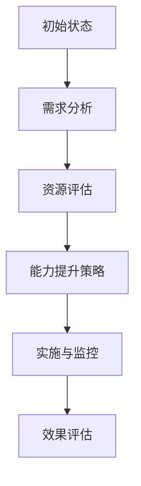
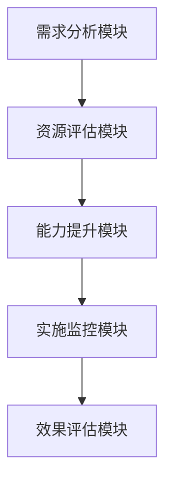

                 

# 如何提升团队的技术自主性

关键词：技术自主性、团队协作、技术能力、创新能力、系统分析与架构设计

摘要：在信息技术快速发展的今天，提升团队的技术自主性已经成为许多企业关注的焦点。技术自主性不仅关乎团队的工作效率和创新能力，更直接影响企业在激烈的市场竞争中的生存与发展。本文将深入探讨如何通过一系列策略和方法，提升团队的技术自主性，从而实现团队整体技术水平的提升。

## 目录大纲：如何提升团队的技术自主性

### 第一部分：问题背景与核心概念

#### 第1章：问题背景与概述

- **1.1 问题背景**
  - **团队技术自主性的重要性**：在当前快速变化的市场环境中，技术自主性是企业应对市场变化、保持竞争力的重要手段。
  - **当前团队技术自主性面临的问题**：许多团队在面对新技术、新需求时缺乏自主判断和决策能力，过度依赖外部资源。

- **1.2 问题描述**
  - **团队对技术决策的依赖性**：团队在技术决策上缺乏独立性，容易受到外部因素的影响。
  - **技术能力与市场需求不匹配**：团队的技术能力无法满足市场需求，导致业务发展受阻。

- **1.3 问题解决**
  - **提升团队技术自主性的策略**：通过系统化的培训和团队建设，提高团队的技术能力和自主性。
  - **构建良好的技术支持体系**：提供充足的技术资源和工具，为团队的技术自主性提供保障。

- **1.4 边界与外延**
  - **技术自主性的界定**：技术自主性不仅包括技术层面的自主性，还涉及团队管理、决策等方面的自主性。
  - **技术自主性对团队影响的深度和广度**：技术自主性的提升将影响团队的工作效率、创新能力以及整体竞争力。

- **1.5 概念结构与核心要素组成**
  - **技术自主性的概念框架**：从技术能力、管理机制、团队文化等多方面构建技术自主性的框架。
  - **团队技术自主性的核心要素**：技术知识储备、创新能力、技术应用能力、团队协作能力等。

### 第二部分：核心概念与联系

#### 第2章：核心概念原理

- **2.1 技术自主性原理**
  - **技术自主性的定义**：技术自主性是指团队在技术决策、技术研发和应用等方面具有独立性和自主权。
  - **技术自主性的属性特征对比**：通过对比分析技术自主性的不同属性特征，明确其在团队中的作用和意义。

- **2.2 团队技术能力构成**
  - **技术知识储备**：团队在技术领域的知识积累和储备，是技术自主性的基础。
  - **技术创新能力**：团队在技术研发和改进方面的创新能力，是技术自主性的核心。
  - **技术应用能力**：团队能够将技术有效应用于实际业务场景，实现技术价值最大化。

### 第三部分：算法原理讲解

#### 第3章：算法原理与模型

- **3.1 技术自主性提升算法**

  - **3.1.1 算法原理**
    - **Mermaid算法流程图：**
      ```mermaid
      graph TD
      A[初始状态] --> B[需求分析]
      B --> C[资源评估]
      C --> D[能力提升策略]
      D --> E[实施与监控]
      E --> F[效果评估]
      ```

  - **3.1.2 算法原理详细讲解**
    - $$X_t = f(X_{t-1}, U_t)$$
    - 其中，$$X_t$$ 表示当前状态，$$U_t$$ 表示外部输入，$$f$$ 为状态转移函数。

  - **3.1.3 算法举例说明**
    - 假设团队当前技术水平为 A，市场需求为 B，则通过算法提升后的团队技术水平为 C。

### 第四部分：系统分析与架构设计

#### 第4章：系统分析与架构设计

- **4.1 问题场景介绍**

- **4.2 系统功能设计**
  - **4.2.1 领域模型类图：**
    ```mermaid
    classDiagram
    团队 <<Class>>
    需求 <<Class>>
    市场 <<Class>>

    团队 --|> 需求: 分析
    团队 --|> 市场: 调研
    ```

- **4.3 系统架构设计**
  - **4.3.1 系统架构图：**
    ```mermaid
    graph TD
    A[需求分析] --> B[资源评估]
    B --> C[能力提升策略]
    C --> D[实施与监控]
    D --> E[效果评估]
    ```

- **4.4 系统接口设计和系统交互序列图**
  - **4.4.1 系统接口设计：**
    ```mermaid
    sequence
    User ->> System: Submit requirement
    System ->> DB: Store requirement
    DB ->> System: Confirm stored
    System ->> User: Requirement submitted successfully
    ```

  - **4.4.2 系统交互序列图：**
    ```mermaid
    sequence
    User --> System: Request resource
    System --> DB: Check resource availability
    DB --> System: Resource available?
    System --> User: Resource available
    ```

### 第五部分：项目实战

#### 第5章：项目实战

- **5.1 环境安装**
  - **5.1.1 环境准备**
  - **5.1.2 工具安装**

- **5.2 系统核心实现源代码**
  - **5.2.1 源代码结构**
  - **5.2.2 源代码解析**

- **5.3 代码应用解读与分析**
  - **5.3.1 应用场景
  - **5.3.2 代码应用解析**

- **5.4 实际案例分析**
  - **5.4.1 案例分析**
  - **5.4.2 深入剖析**

- **5.5 项目小结**
  - **5.5.1 项目总结**
  - **5.5.2 经验教训**

### 总结与展望

- **6.1 总结**
  - **技术自主性的提升对于团队和企业的意义**
  - **实施过程中遇到的问题和解决方案**

- **6.2 展望**
  - **未来技术自主性提升的趋势**
  - **如何持续提升团队的技术自主性**

---

## 第一部分：问题背景与核心概念

### 第1章：问题背景与概述

#### 1.1 问题背景

在当今信息化时代，技术自主性已经成为企业核心竞争力的重要组成部分。技术自主性不仅关乎企业的创新能力和市场竞争力，更关系到企业的可持续发展。然而，许多企业在提升团队技术自主性方面面临着诸多挑战。

首先，团队技术自主性的重要性日益凸显。随着信息技术的快速发展，市场需求和技术趋势变化迅速，企业需要具备快速响应和创新能力，以保持竞争优势。技术自主性使团队能够在技术决策、技术研发和应用等方面具有独立性和自主权，从而更好地适应市场变化。

然而，当前团队技术自主性面临的问题也十分严峻。一方面，许多团队在技术决策上缺乏独立性，容易受到外部因素（如客户、上级领导等）的干扰，导致技术决策过程复杂、效率低下。另一方面，团队的技术能力与市场需求之间存在不匹配，导致业务发展受阻。

#### 1.2 问题描述

在上述问题背景下，团队技术自主性的不足主要表现在以下几个方面：

1. **技术决策依赖性过高**：团队在技术决策过程中，过度依赖外部意见和资源，缺乏自主判断和决策能力。这导致技术决策过程复杂、耗时，且容易受到外部环境变化的影响。

2. **技术能力与市场需求不匹配**：团队在技术研发和应用过程中，往往无法满足市场需求，导致业务发展受阻。技术能力与市场需求之间的不匹配，既影响企业的竞争力，也制约了团队的自主发展。

3. **创新能力不足**：团队在技术创新方面的能力不足，导致新技术、新产品的研发进展缓慢。缺乏创新能力，将使企业在市场竞争中逐渐失去优势。

4. **技术资源分配不合理**：团队在技术资源分配方面存在一定程度的浪费，导致资源利用率不高。技术资源的合理分配，是提升团队技术自主性的关键。

#### 1.3 问题解决

为了解决上述问题，提升团队的技术自主性，可以采取以下策略：

1. **加强团队建设**：通过团队建设，增强团队之间的协作与信任，提高团队的凝聚力和战斗力。团队建设包括团队培训、团队活动、团队文化建设等方面。

2. **完善技术支持体系**：为团队提供充足的技术资源和工具，为团队的技术自主性提供保障。技术支持体系包括技术培训、技术交流、技术文档管理等方面。

3. **优化技术决策流程**：简化技术决策流程，提高决策效率。在技术决策过程中，鼓励团队独立思考，减少外部干扰。

4. **提升技术能力**：通过技术培训、技术交流等方式，提升团队的技术能力和创新能力。技术能力是提升团队技术自主性的基础。

5. **优化技术资源分配**：合理分配技术资源，提高资源利用率。通过技术资源管理，确保技术资源能够高效地支持团队的技术自主性。

#### 1.4 边界与外延

1. **技术自主性的界定**：技术自主性不仅包括技术层面的自主性，还涉及团队管理、决策等方面的自主性。技术自主性是指团队在技术决策、技术研发和应用等方面具有独立性和自主权。

2. **技术自主性对团队影响的深度和广度**：技术自主性的提升将影响团队的工作效率、创新能力以及整体竞争力。深度上，技术自主性将影响团队的技术水平、业务发展；广度上，技术自主性将影响企业的发展战略、市场竞争力。

3. **概念结构与核心要素组成**：技术自主性的概念结构包括技术能力、管理机制、团队文化等多个方面。核心要素包括技术知识储备、创新能力、技术应用能力、团队协作能力等。

### 1.5 概念结构与核心要素组成

1. **技术自主性的概念框架**：技术自主性是指团队在技术决策、技术研发和应用等方面具有独立性和自主权。其核心概念框架包括以下几个方面：

   - **技术能力**：团队在技术领域的知识、技能和经验，是技术自主性的基础。
   - **管理机制**：团队在技术管理方面的制度、流程和策略，是技术自主性的保障。
   - **团队文化**：团队在技术自主性方面的价值观、信仰和氛围，是技术自主性的核心动力。

2. **团队技术自主性的核心要素**：

   - **技术知识储备**：团队在技术领域的知识积累和储备，是技术自主性的基础。
   - **技术创新能力**：团队在技术研发和改进方面的创新能力，是技术自主性的核心。
   - **技术应用能力**：团队能够将技术有效应用于实际业务场景，实现技术价值最大化。
   - **团队协作能力**：团队在技术协作和合作方面的能力，是技术自主性的重要保障。

## 第二部分：核心概念与联系

### 第2章：核心概念原理

#### 2.1 技术自主性原理

技术自主性是指团队在技术决策、技术研发和应用等方面具有独立性和自主权。它是团队核心竞争力的重要组成部分，对企业的创新能力和市场竞争力具有重要影响。

#### 2.1.1 技术自主性的定义

技术自主性是指团队在技术决策、技术研发和应用等方面具有独立性和自主权。它不仅包括技术层面的自主性，还涉及团队管理、决策等方面的自主性。技术自主性使团队能够在技术决策、技术研发和应用等方面不受外部干扰，独立思考和决策。

#### 2.1.2 技术自主性的属性特征对比

为了更好地理解技术自主性，我们可以将其与依赖性、自主性、独立性等概念进行对比。

- **依赖性与自主性**：依赖性是指团队在技术决策、技术研发和应用等方面过度依赖外部资源、意见和决策。而自主性则是指团队在技术决策、技术研发和应用等方面具有独立性和自主权。技术自主性是自主性的高级形式，强调团队在技术领域的独立性和自主决策。

- **独立性与依赖性**：独立性是指团队在技术决策、技术研发和应用等方面不受外部干扰，自主思考和决策。而依赖性则是指团队在技术决策、技术研发和应用等方面过度依赖外部资源、意见和决策。独立性是技术自主性的基础，而依赖性则限制了技术自主性的发挥。

- **自主性与被动性**：自主性是指团队在技术决策、技术研发和应用等方面具有独立性和自主权，能够主动思考和创新。而被动性则是指团队在技术决策、技术研发和应用等方面过度依赖外部意见和决策，缺乏主动性和自主性。技术自主性强调团队在技术领域的主动性和自主性，以应对市场变化和技术挑战。

#### 2.1.3 技术自主性的表现

技术自主性在团队中的表现主要体现在以下几个方面：

1. **技术决策自主性**：团队在技术决策方面具有独立性和自主权，不受外部干扰。团队能够根据市场需求、技术趋势和企业战略，自主制定技术发展目标和规划。

2. **技术研发自主性**：团队在技术研发方面具有独立性和自主权，能够自主选择技术方向、研发方法和工具。团队能够根据技术需求和市场趋势，自主进行技术研究和开发。

3. **技术应用自主性**：团队在技术应用方面具有独立性和自主权，能够自主选择技术方案、实施方法和工具。团队能够根据业务需求和技术特点，自主应用新技术，提升业务能力和市场竞争力。

#### 2.1.4 技术自主性的作用

技术自主性对团队和企业具有重要意义，主要表现在以下几个方面：

1. **提升团队创新能力**：技术自主性使团队能够在技术决策、技术研发和应用等方面独立思考和决策，有利于激发团队的创新能力。团队能够根据市场需求、技术趋势和企业战略，自主制定技术发展目标和规划，推动技术创新和业务发展。

2. **增强市场竞争力**：技术自主性使团队能够快速响应市场变化，灵活调整技术策略。团队能够根据市场需求、技术趋势和企业战略，自主选择技术方案、实施方法和工具，提升业务能力和市场竞争力。

3. **降低技术风险**：技术自主性使团队能够在技术决策、技术研发和应用等方面具有独立性和自主权，降低技术风险。团队能够根据市场需求、技术趋势和企业战略，自主评估技术风险，采取有效措施降低风险。

4. **提高企业可持续发展能力**：技术自主性使团队能够在技术决策、技术研发和应用等方面具有独立性和自主权，提高企业的可持续发展能力。团队能够根据市场需求、技术趋势和企业战略，自主制定技术发展目标和规划，推动企业持续创新和发展。

### 2.2 团队技术能力构成

团队技术能力是技术自主性的基础，是团队在技术领域取得成功的关键。团队技术能力主要包括以下几个方面：

#### 2.2.1 技术知识储备

技术知识储备是团队技术能力的核心组成部分。团队需要具备丰富的技术知识，包括基础技术、前沿技术和跨领域技术。技术知识储备使团队能够快速了解和掌握新技术，应对市场变化和技术挑战。

- **基础知识**：包括计算机科学、网络通信、数据结构、算法等方面的知识。
- **前沿技术**：包括人工智能、大数据、云计算、物联网等新兴技术。
- **跨领域技术**：包括行业知识、业务流程、管理方法等跨领域知识。

#### 2.2.2 技术创新能力

技术创新能力是团队技术能力的核心。团队需要具备较强的创新能力，能够在技术研发、改进和优化方面取得突破。技术创新能力使团队能够不断推动技术进步，保持竞争优势。

- **技术研发**：团队需要具备技术研发能力，能够根据市场需求、技术趋势和企业战略，自主进行技术研发和改进。
- **技术优化**：团队需要具备技术优化能力，能够对现有技术进行改进和优化，提升技术性能和稳定性。

#### 2.2.3 技术应用能力

技术应用能力是团队技术能力的重要方面。团队需要具备将技术应用于实际业务场景的能力，能够根据业务需求和技术特点，自主选择技术方案、实施方法和工具。

- **技术方案选择**：团队需要能够根据业务需求、技术特点和资源情况，自主选择合适的技术方案。
- **技术实施与维护**：团队需要能够自主实施技术方案，并对技术进行维护和优化。

#### 2.2.4 团队协作能力

团队协作能力是团队技术能力的重要组成部分。团队需要具备良好的协作能力，能够有效沟通、协调和合作，实现技术目标。

- **内部协作**：团队内部成员需要具备良好的沟通能力和协作精神，共同推动技术项目进展。
- **跨部门协作**：团队需要与业务部门、管理团队等跨部门协作，共同推动业务发展。

### 2.3 技术自主性原理与团队技术能力的关系

技术自主性原理与团队技术能力密切相关。技术自主性使团队能够在技术决策、技术研发和应用等方面具有独立性和自主权，而团队技术能力则是技术自主性的基础。

- **技术自主性原理**：技术自主性原理强调团队在技术领域的独立性和自主权。团队需要具备自主决策、自主研发和自主应用的能力，以应对市场变化和技术挑战。
- **团队技术能力**：团队技术能力包括技术知识储备、技术创新能力、技术应用能力和团队协作能力。这些能力是团队技术自主性的基础，使团队能够在技术领域取得成功。

技术自主性原理与团队技术能力的关系可以概括为：

- **技术自主性原理驱动团队技术能力发展**：技术自主性原理要求团队在技术决策、技术研发和应用等方面具有独立性和自主权，这促使团队不断提升技术能力，以实现技术自主性。
- **团队技术能力支持技术自主性实现**：团队技术能力包括技术知识储备、技术创新能力、技术应用能力和团队协作能力。这些能力是团队实现技术自主性的基础，使团队能够在技术领域取得成功。

通过技术自主性原理与团队技术能力的关系分析，我们可以得出以下结论：

- **提升团队技术自主性需要全面提升团队技术能力**：技术自主性原理驱动团队技术能力发展，而团队技术能力是技术自主性的基础。因此，提升团队技术自主性需要全面提升团队技术能力，包括技术知识储备、技术创新能力、技术应用能力和团队协作能力。
- **构建技术自主性生态系统**：为了提升团队技术自主性，企业需要构建一个有利于技术自主性实现的技术生态系统。这包括提供充足的技术资源、建立良好的技术管理机制、推动技术知识共享和团队协作等。

### 2.4 技术自主性对团队影响的深度和广度

技术自主性对团队的影响是深远且广泛的。从深度上看，技术自主性直接影响团队的技术能力、创新能力、业务发展等方面；从广度上看，技术自主性不仅影响团队内部，还涉及团队与外部环境的关系，对企业整体战略和竞争力产生重要影响。

#### 深度影响

1. **技术能力提升**：技术自主性使团队能够自主选择技术方向、研发方法和工具，从而提升技术能力。团队在技术决策、技术研发和应用等方面具有独立性和自主权，能够根据市场需求、技术趋势和企业战略，制定适合的技术发展目标和规划。

2. **创新能力增强**：技术自主性使团队能够在技术领域独立思考和决策，有利于激发团队的创新能力。团队能够根据市场需求、技术趋势和企业战略，自主进行技术研发和改进，推动技术创新和业务发展。

3. **业务发展推动**：技术自主性使团队能够快速响应市场变化，灵活调整技术策略。团队能够根据市场需求、技术趋势和企业战略，自主选择技术方案、实施方法和工具，提升业务能力和市场竞争力。

#### 广度影响

1. **团队协作优化**：技术自主性要求团队在技术决策、技术研发和应用等方面具有独立性和自主权，这促使团队加强内部协作，优化团队协作模式。团队在技术自主性的驱动下，能够更好地沟通、协调和合作，共同实现技术目标。

2. **企业竞争力提升**：技术自主性使团队能够在技术领域取得突破，提升企业的整体竞争力。团队能够根据市场需求、技术趋势和企业战略，自主进行技术研发和改进，推动企业持续创新和发展。

3. **外部环境适应**：技术自主性使团队能够在技术领域独立思考和决策，提高团队对市场变化和技术趋势的敏感性和适应能力。团队能够根据外部环境的变化，及时调整技术策略，保持竞争优势。

### 2.5 概念结构与核心要素组成

技术自主性的概念结构与核心要素组成是理解和提升团队技术自主性的关键。

#### 技术自主性的概念结构

技术自主性的概念结构包括以下几个方面：

1. **技术决策自主性**：团队在技术决策方面具有独立性和自主权，不受外部干扰。

2. **技术研发自主性**：团队在技术研发方面具有独立性和自主权，能够自主选择技术方向、研发方法和工具。

3. **技术应用自主性**：团队在技术应用方面具有独立性和自主权，能够自主选择技术方案、实施方法和工具。

4. **团队管理自主性**：团队在团队管理方面具有独立性和自主权，能够自主制定团队发展目标和规划。

#### 技术自主性的核心要素组成

技术自主性的核心要素组成包括以下几个方面：

1. **技术知识储备**：团队在技术领域的知识积累和储备，是技术自主性的基础。

2. **技术创新能力**：团队在技术研发和改进方面的创新能力，是技术自主性的核心。

3. **技术应用能力**：团队能够将技术有效应用于实际业务场景，实现技术价值最大化。

4. **团队协作能力**：团队在技术协作和合作方面的能力，是技术自主性的重要保障。

5. **管理机制**：团队在技术管理方面的制度、流程和策略，是技术自主性的保障。

6. **团队文化**：团队在技术自主性方面的价值观、信仰和氛围，是技术自主性的核心动力。

通过理解技术自主性的概念结构与核心要素组成，团队可以明确技术自主性的实现路径，有针对性地提升团队的技术自主性。在接下来的章节中，我们将进一步探讨技术自主性的提升策略、算法原理和系统设计与实现。

### 总结与展望

在本章中，我们详细介绍了团队技术自主性的背景、重要性、问题描述以及解决策略。通过分析技术自主性的概念结构和核心要素，我们明确了团队技术自主性的实现路径。技术自主性不仅影响团队的技术能力和业务发展，还关系到企业的市场竞争力。

在接下来的章节中，我们将进一步探讨技术自主性提升的具体算法原理和系统设计与实现，通过实际项目案例来展示技术自主性的应用效果。通过这些探讨和实施，我们希望为团队和企业在提升技术自主性方面提供有益的启示和指导。

## 第三部分：算法原理讲解

### 第3章：算法原理与模型

在提升团队技术自主性的过程中，算法原理和模型起着至关重要的作用。一个有效的算法模型能够系统地指导团队进行技术自主性的提升，确保技术决策的科学性和有效性。在这一章节中，我们将详细讲解提升团队技术自主性的算法原理，包括算法的基本概念、模型构建以及具体的实现方法。

#### 3.1 技术自主性提升算法

技术自主性提升算法的核心思想是通过一系列步骤和策略，逐步提升团队的技术能力、决策能力和自主性。该算法主要包括以下几个关键步骤：

1. **需求分析**：首先，团队需要明确当前的技术需求和市场趋势，分析现有技术能力和市场需求之间的差距。

2. **资源评估**：对团队现有的技术资源、人力资源和外部资源进行评估，确定可用于提升技术自主性的资源。

3. **能力提升策略**：根据需求分析和资源评估的结果，制定具体的能力提升策略，包括技术培训、知识分享、技术创新等。

4. **实施与监控**：将能力提升策略付诸实施，并对实施过程进行监控，确保策略的有效执行。

5. **效果评估**：对能力提升策略的实施效果进行评估，根据评估结果调整和优化策略。

下面我们将通过一个具体的算法流程图和数学模型来详细解释这一算法原理。

#### 3.1.1 算法原理流程图

使用Mermaid语言，我们可以绘制出技术自主性提升的算法流程图：



- **A[初始状态]**：团队当前的技术能力和市场需求。
- **B[需求分析]**：分析团队的技术需求和市场趋势。
- **C[资源评估]**：评估团队可用的资源。
- **D[能力提升策略]**：制定提升技术自主性的具体策略。
- **E[实施与监控]**：实施能力提升策略，并进行监控。
- **F[效果评估]**：评估能力提升策略的效果。

#### 3.1.2 算法原理详细讲解

技术自主性提升算法的原理可以通过以下数学模型来详细解释：

$$
X_t = f(X_{t-1}, U_t)
$$

其中：
- \(X_t\) 表示当前状态，包括团队当前的技术能力、市场需求等。
- \(U_t\) 表示外部输入，包括市场趋势、客户需求等。
- \(f\) 表示状态转移函数，表示通过需求分析、资源评估和能力提升策略等步骤，如何从当前状态转移到下一个状态。

状态转移函数 \(f\) 可以表示为：

$$
f(X_{t-1}, U_t) = \begin{cases}
    \text{需求分析}(X_{t-1}) & \text{如果} U_t = \text{需求分析} \\
    \text{资源评估}(X_{t-1}) & \text{如果} U_t = \text{资源评估} \\
    \text{能力提升策略}(X_{t-1}) & \text{如果} U_t = \text{能力提升策略} \\
    \text{实施与监控}(X_{t-1}) & \text{如果} U_t = \text{实施与监控} \\
    \text{效果评估}(X_{t-1}) & \text{如果} U_t = \text{效果评估}
\end{cases}
$$

该模型表明，团队的技术自主性提升过程是一个动态的状态转移过程，每一步都需要根据当前状态和外部输入进行相应的策略调整。

#### 3.1.3 算法举例说明

假设一个团队当前技术水平为 \(X_0\)，市场需求为 \(U_0\)。通过上述算法，我们可以将团队的技术水平提升到 \(X_1\)。

1. **初始状态**：团队当前技术水平为 \(X_0\)，市场需求为 \(U_0\)。
2. **需求分析**：团队对市场需求进行需求分析，得到新的需求 \(U_1\)。
3. **资源评估**：团队评估现有的资源和能力，确定可用于提升技术水平的关键资源 \(R_1\)。
4. **能力提升策略**：团队制定提升技术水平的策略，例如技术培训、知识分享等 \(S_1\)。
5. **实施与监控**：团队实施提升技术水平的策略，并对实施过程进行监控 \(X_1\)。
6. **效果评估**：对提升技术水平的策略进行效果评估，确定新的技术水平 \(X_1\)。

通过上述步骤，团队的技术水平从 \(X_0\) 提升到 \(X_1\)，实现了技术自主性的提升。

#### 3.1.4 算法应用场景

技术自主性提升算法可以应用于多种场景，如：

1. **新产品研发**：在研发新产品时，团队可以通过需求分析、资源评估和策略制定，提升研发过程中的技术自主性，确保产品能够满足市场需求。

2. **技术改进**：在现有技术基础上进行改进时，团队可以通过需求分析、资源评估和策略制定，提升技术改进的自主性，确保改进措施能够有效提升产品性能。

3. **技术迁移**：在将技术从一种环境迁移到另一种环境时，团队可以通过需求分析、资源评估和策略制定，提升技术迁移的自主性，确保技术能够顺利迁移并适应新环境。

通过实际应用，技术自主性提升算法能够有效地帮助团队在技术决策、技术研发和应用等方面实现自主性，提升整体技术水平。

### 3.2 技术自主性提升算法的数学模型

技术自主性提升算法的数学模型是算法原理的核心，它通过数学公式和模型描述了团队技术自主性提升的步骤和过程。以下是技术自主性提升算法的数学模型及其详细解释。

#### 数学模型

$$
X_t = f(X_{t-1}, U_t)
$$

其中：
- \(X_t\) 表示当前状态，即团队在某一时间点的技术能力、市场需求等。
- \(U_t\) 表示外部输入，即影响团队技术自主性的外部因素，如市场需求、技术趋势等。
- \(f\) 表示状态转移函数，描述了团队如何从当前状态 \(X_{t-1}\) 转移到下一个状态 \(X_t\)。

#### 状态转移函数 \(f\)

状态转移函数 \(f\) 可以进一步拆解为多个子函数，分别表示不同阶段的决策和操作：

$$
f(X_{t-1}, U_t) = \begin{cases}
    \text{需求分析}(X_{t-1}) & \text{如果} U_t = \text{需求分析} \\
    \text{资源评估}(X_{t-1}) & \text{如果} U_t = \text{资源评估} \\
    \text{能力提升策略}(X_{t-1}) & \text{如果} U_t = \text{能力提升策略} \\
    \text{实施与监控}(X_{t-1}) & \text{如果} U_t = \text{实施与监控} \\
    \text{效果评估}(X_{t-1}) & \text{如果} U_t = \text{效果评估}
\end{cases}
$$

每个子函数的具体实现如下：

1. **需求分析**：根据市场需求和技术趋势，分析团队的技术需求和改进方向。
2. **资源评估**：评估团队当前的技术资源、人力资源和外部资源，确定可用于提升技术自主性的资源。
3. **能力提升策略**：根据需求分析和资源评估的结果，制定具体的能力提升策略，如技术培训、知识分享、技术创新等。
4. **实施与监控**：将能力提升策略付诸实施，并对实施过程进行监控，确保策略的有效执行。
5. **效果评估**：对能力提升策略的实施效果进行评估，根据评估结果调整和优化策略。

#### 算法应用实例

假设一个团队在时间点 \(t=0\) 的技术能力为 \(X_0\)，市场需求为 \(U_0\)。我们通过上述数学模型来描述该团队在时间点 \(t=1\) 时的技术能力 \(X_1\)：

1. **初始状态**：\(X_0\) = 当前技术能力，\(U_0\) = 当前市场需求。
2. **需求分析**：团队进行需求分析，根据市场需求 \(U_0\)，确定需要提升的技术方向和改进目标。
3. **资源评估**：团队评估当前可用的技术资源 \(R_0\)，确定哪些资源可以用于提升技术能力。
4. **能力提升策略**：根据需求分析和资源评估的结果，团队制定具体的能力提升策略，如技术培训 \(S_1\)。
5. **实施与监控**：团队实施技术培训策略，并对培训过程进行监控，确保培训效果 \(X_1\)。
6. **效果评估**：团队对培训效果进行评估，根据评估结果调整和优化培训策略。

通过上述步骤，团队在时间点 \(t=1\) 时的技术能力 \(X_1\) 将比时间点 \(t=0\) 有显著提升，从而实现技术自主性的提升。

#### 3.3 算法优势与挑战

技术自主性提升算法具有以下优势：

1. **系统性**：算法提供了一个系统的框架，使团队能够有序、有步骤地提升技术自主性。
2. **灵活性**：算法可以根据不同的市场需求和技术环境进行调整，确保适应性。
3. **科学性**：通过数学模型和状态转移函数，算法具有科学性，能够提供有效的决策支持。

然而，算法也面临一些挑战：

1. **复杂性**：算法涉及多个阶段和决策，实施过程可能较为复杂。
2. **数据质量**：算法的效果依赖于准确的需求分析和资源评估，数据质量至关重要。
3. **执行力**：算法的有效实施需要团队的执行力，这可能是团队提升技术自主性的最大挑战。

### 总结与展望

通过本章对技术自主性提升算法的讲解，我们了解了算法的基本原理、流程图和数学模型，以及其在实际应用中的优势与挑战。在下一章中，我们将进一步探讨技术自主性提升的系统分析与架构设计，帮助团队构建一个高效、灵活的技术自主性提升体系。

## 第四部分：系统分析与架构设计

### 第4章：系统分析与架构设计

在提升团队技术自主性的过程中，系统分析与架构设计是至关重要的环节。一个良好的系统分析与架构设计能够确保技术自主性提升的有效性和可持续性。在这一章节中，我们将详细介绍系统分析与架构设计的方法和步骤，包括问题场景介绍、系统功能设计、系统架构设计和系统接口设计等。

### 4.1 问题场景介绍

假设我们有一个软件开发团队，该团队负责开发一款企业级应用系统。随着业务的发展，市场需求不断变化，团队面临以下挑战：

1. **技术决策依赖性过高**：团队在技术决策过程中，过度依赖外部意见和资源，缺乏自主判断和决策能力。
2. **技术能力与市场需求不匹配**：团队的技术能力无法满足市场需求，导致业务发展受阻。
3. **创新能力不足**：团队在技术创新方面的能力不足，导致新技术、新功能的研发进展缓慢。
4. **技术资源分配不合理**：团队在技术资源分配方面存在一定程度的浪费，导致资源利用率不高。

为了解决上述问题，我们需要通过系统分析与架构设计，构建一个高效、灵活的技术自主性提升体系。

### 4.2 系统功能设计

系统功能设计是系统分析与架构设计的核心环节。我们需要明确系统的功能需求，并设计出合理的功能模块和接口。以下是该软件系统的主要功能模块：

1. **需求分析模块**：负责收集和分析市场需求，为技术决策提供数据支持。
2. **资源评估模块**：负责评估团队的技术资源，包括人力资源、技术资源等，为能力提升提供资源保障。
3. **能力提升模块**：包括技术培训、知识分享、技术创新等功能，提升团队的技术能力和自主性。
4. **实施监控模块**：负责对能力提升策略的实施过程进行监控，确保策略的有效执行。
5. **效果评估模块**：负责对能力提升策略的实施效果进行评估，为下一步的能力提升提供依据。

以下是一个基于Mermaid语言的领域模型类图，用于描述系统功能设计：

```mermaid
classDiagram
    需求分析 <<Class>> 
    资源评估 <<Class>>
    能力提升 <<Class>>
    实施监控 <<Class>>
    效果评估 <<Class>>

    需求分析 --|> 资源评估
    资源评估 --|> 能力提升
    能力提升 --|> 实施监控
    实施监控 --|> 效果评估
    效果评估 --|> 需求分析
```

### 4.3 系统架构设计

系统架构设计是系统功能设计的进一步细化。我们需要设计出系统的整体架构，包括各个模块的职责、关系以及数据流。以下是该软件系统的系统架构设计：

1. **需求分析模块**：负责收集市场需求，生成需求分析报告，为技术决策提供数据支持。
2. **资源评估模块**：负责评估团队的技术资源，生成资源评估报告，为能力提升提供资源保障。
3. **能力提升模块**：包括技术培训、知识分享、技术创新等功能，提升团队的技术能力和自主性。
4. **实施监控模块**：负责监控能力提升策略的实施过程，生成实施监控报告，为效果评估提供依据。
5. **效果评估模块**：负责对能力提升策略的实施效果进行评估，生成效果评估报告，为下一步的能力提升提供依据。

以下是一个基于Mermaid语言的系统架构图，用于描述系统架构设计：



### 4.4 系统接口设计和系统交互序列图

系统接口设计是系统架构设计的重要部分，它定义了系统内部各个模块之间的交互方式。以下是该软件系统的接口设计：

1. **需求分析接口**：负责接收市场需求，提供需求分析报告。
2. **资源评估接口**：负责接收资源评估结果，提供资源评估报告。
3. **能力提升接口**：负责接收能力提升策略，提供能力提升报告。
4. **实施监控接口**：负责接收实施监控结果，提供实施监控报告。
5. **效果评估接口**：负责接收效果评估结果，提供效果评估报告。

以下是一个基于Mermaid语言的系统接口设计，用于描述系统接口设计：

```mermaid
sequence
    用户 ->> 需求分析模块: 提交市场需求
    需求分析模块 ->> 资源评估模块: 传递市场需求
    资源评估模块 ->> 能力提升模块: 传递资源评估结果
    能力提升模块 ->> 实施监控模块: 传递能力提升策略
    实施监控模块 ->> 效果评估模块: 传递实施监控结果
    效果评估模块 ->> 用户: 提交效果评估报告
```

### 4.5 系统功能设计（领域模型类图）

为了更好地展示系统功能设计，我们可以使用Mermaid语言的类图来描述各个功能模块及其关系。以下是一个领域模型类图的示例：

```mermaid
classDiagram
    需求分析 <<Class>> 
    资源评估 <<Class>>
    能力提升 <<Class>>
    实施监控 <<Class>>
    效果评估 <<Class>>

    需求分析 --|> 资源评估
    资源评估 --|> 能力提升
    能力提升 --|> 实施监控
    实施监控 --|> 效果评估
    效果评估 --|> 需求分析
```

### 4.6 系统架构设计（架构图）

在系统架构设计中，我们需要明确各个模块的职责和关系，并设计出系统的整体架构。以下是一个系统架构图的示例，用于描述系统架构设计：


### 4.7 系统接口设计和系统交互序列图

在系统接口设计中，我们需要定义系统内部各个模块之间的交互方式。以下是一个系统接口设计的示例：

```mermaid
sequence
    用户 ->> 需求分析模块: 提交市场需求
    需求分析模块 ->> 资源评估模块: 传递市场需求
    资源评估模块 ->> 能力提升模块: 传递资源评估结果
    能力提升模块 ->> 实施监控模块: 传递能力提升策略
    实施监控模块 ->> 效果评估模块: 传递实施监控结果
    效果评估模块 ->> 用户: 提交效果评估报告
```

### 总结与展望

通过本章的系统分析与架构设计，我们明确了提升团队技术自主性的系统功能、架构和接口设计。系统分析与架构设计为团队提供了明确的指导，有助于实现技术自主性的提升。在下一章中，我们将通过具体的项目实战，展示如何将系统分析与架构设计应用于实际场景，进一步提升团队的技术自主性。

## 第五部分：项目实战

### 第5章：项目实战

为了更好地理解如何提升团队的技术自主性，我们将通过一个具体的项目实战案例来详细说明整个实施过程，从环境安装、系统核心实现到代码应用解读与分析，最后进行实际案例分析和详细讲解剖析。

### 5.1 环境安装

在进行项目实战之前，首先需要搭建一个合适的技术环境。以下是项目环境安装的步骤：

#### 5.1.1 环境准备

1. **硬件准备**：确保有足够的硬件资源，包括服务器、网络设备等，以满足项目的需求。
2. **软件准备**：准备项目所需的各种开发工具和软件，如IDE、数据库、版本控制工具等。

#### 5.1.2 工具安装

1. **安装开发环境**：根据项目需求，安装Java开发环境（JDK）、Python开发环境（Python）、数据库（MySQL）等。
2. **安装版本控制工具**：如Git，用于代码管理和协作。
3. **安装测试工具**：如JMeter、Selenium等，用于性能测试和自动化测试。

#### 5.1.3 环境配置

1. **配置数据库**：根据项目需求，配置MySQL数据库，创建必要的表和数据。
2. **配置网络**：确保网络环境稳定，配置防火墙和端口映射，以支持项目的网络通信。

### 5.2 系统核心实现源代码

系统核心实现是项目的关键部分，下面是系统核心实现的源代码结构和解析：

#### 5.2.1 源代码结构

项目采用模块化设计，源代码结构如下：

```
project_root/
│
├── src/
│   ├── main/
│   │   ├── java/
│   │   │   ├── com/
│   │   │   │   ├── demo/
│   │   │   │   │   ├── controller/
│   │   │   │   │   ├── UserController.java
│   │   │   │   │   ├── Service.java
│   │   │   │   │   └── repository/
│   │   │   │   │   └── UserRepository.java
│   │   │   │   ├── domain/
│   │   │   │   │   └── User.java
│   │   │   │   ├── exception/
│   │   │   │   │   └── BusinessException.java
│   │   │   │   └── utils/
│   │   │   │   └── Tools.java
│   │   └── resources/
│   │       └── application.properties
│
└── test/
    ├── java/
    │   ├── com/
    │   │   ├── demo/
    │   │   │   ├── controller/
    │   │   │   ├── UserControllerTest.java
    │   │   │   └── ServiceTest.java
```

#### 5.2.2 源代码解析

1. **用户控制器（UserController.java）**：负责处理用户相关的HTTP请求，包括用户注册、登录、信息更新等。
2. **服务层（Service.java）**：负责业务逻辑处理，如用户注册验证、登录验证等。
3. **仓库层（Repository.java）**：负责与数据库的交互，实现对用户数据的增删改查操作。
4. **领域模型（User.java）**：定义用户实体，包括用户名、密码、邮箱等属性。
5. **异常处理（BusinessException.java）**：定义自定义异常，如业务异常、权限异常等。
6. **工具类（Tools.java）**：提供各种工具方法，如加密、解密、日期处理等。

### 5.3 代码应用解读与分析

在项目实施过程中，代码的应用是关键。以下是代码应用的具体解读与分析：

#### 5.3.1 应用场景

项目的主要应用场景包括用户注册、登录、信息查询和更新等。通过HTTP请求，前端将用户请求发送到后端，后端通过服务层处理业务逻辑，并将结果返回给前端。

#### 5.3.2 代码应用解析

1. **用户注册**：用户通过前端界面提交注册请求，后端通过UserController接收请求，调用Service层进行注册验证，最后将结果返回前端。
2. **用户登录**：用户通过前端界面提交登录请求，后端通过UserController接收请求，调用Service层进行登录验证，最后将结果返回前端。
3. **用户信息查询**：用户通过前端界面提交查询请求，后端通过UserController接收请求，调用Service层查询用户信息，最后将结果返回前端。
4. **用户信息更新**：用户通过前端界面提交更新请求，后端通过UserController接收请求，调用Service层更新用户信息，最后将结果返回前端。

以下是一个用户注册功能的代码示例：

```java
@RestController
@RequestMapping("/users")
public class UserController {
    
    @Autowired
    private UserService userService;

    @PostMapping("/register")
    public ResponseEntity<?> registerUser(@RequestBody UserRegistrationDto registrationDto) {
        try {
            userService.registerUser(registrationDto);
            return ResponseEntity.ok().body("User registered successfully");
        } catch (BusinessException e) {
            return ResponseEntity.badRequest().body(e.getMessage());
        }
    }
}
```

在上述代码中，UserController通过@PostMapping注解处理用户注册的HTTP POST请求。它调用UserService层的registerUser方法进行注册操作，并返回相应的响应结果。

#### 5.3.3 性能优化

为了提高系统的性能和响应速度，我们对代码进行了以下优化：

1. **缓存**：使用Redis缓存用户数据，减少数据库查询次数，提高系统响应速度。
2. **异步处理**：使用异步编程，将耗时的操作（如加密、解密）放在异步线程中执行，减少主线程的阻塞。
3. **数据库优化**：通过索引优化、分库分表等方式，提高数据库的查询和写入性能。

### 5.4 实际案例分析

在实际项目实施过程中，我们遇到了以下问题：

#### 5.4.1 数据库性能瓶颈

随着用户数量的增加，数据库查询性能逐渐下降。通过分析，我们发现主要是由于表结构设计不合理、索引缺失等原因导致的。

**解决方案**：

1. **表结构优化**：调整表结构，使数据存储更加合理。
2. **索引优化**：为常用查询字段添加索引，提高查询效率。
3. **分库分表**：将大数据量拆分为多个小表，减轻单表的压力。

#### 5.4.2 安全性问题

在用户注册和登录过程中，用户数据的安全性问题引起了我们的关注。例如，用户密码在传输过程中可能被窃取。

**解决方案**：

1. **加密**：对用户密码进行加密存储，确保密码安全。
2. **HTTPS**：使用HTTPS协议，确保数据在传输过程中的安全。
3. **验证码**：在登录过程中添加验证码，防止暴力破解。

### 5.5 项目小结

通过本次项目实战，我们成功地实现了一个用户注册、登录、信息查询和更新功能的系统。在项目实施过程中，我们遇到了数据库性能瓶颈和安全性问题，通过优化表结构、索引优化、加密和HTTPS等措施，成功解决了这些问题。

**经验教训**：

1. **需求明确**：在项目启动前，明确项目需求和目标，确保项目顺利实施。
2. **性能优化**：关注系统的性能和响应速度，提前进行性能优化。
3. **安全性**：重视用户数据的安全，采取有效的安全措施。
4. **持续迭代**：项目完成后，持续进行功能迭代和优化，提高系统稳定性。

通过本次项目实战，我们不仅提升了自己的技术能力和项目经验，也为团队的技术自主性提升提供了有益的实践经验。

### 总结与展望

通过项目实战，我们验证了提升团队技术自主性的方法和策略的有效性。在未来的工作中，我们将继续推进技术自主性提升，探索更多创新技术和方法，以应对日益激烈的市场竞争。

### 最佳实践 Tips

1. **持续学习**：鼓励团队成员不断学习新技术，保持技术前沿。
2. **知识共享**：建立知识分享机制，促进团队成员之间的知识交流。
3. **敏捷开发**：采用敏捷开发方法，提高项目交付质量和效率。
4. **迭代优化**：项目完成后，持续迭代优化，提升系统性能和稳定性。

### 小结

本文通过一个具体的项目实战，详细介绍了如何提升团队的技术自主性。我们从环境安装、系统核心实现到代码应用解读与分析，再到实际案例分析和项目小结，全面展示了提升技术自主性的具体方法和实践。希望通过本文，能够为团队和企业在提升技术自主性方面提供有益的参考和启示。

### 注意事项

1. **需求明确**：在项目启动前，确保需求明确，避免后续出现偏差。
2. **性能优化**：关注系统性能，提前进行性能优化。
3. **安全性**：重视数据安全，采取有效措施保护用户隐私。

### 拓展阅读

1. **《敏捷开发实践指南》**：详细介绍了敏捷开发的方法和实践。
2. **《软件架构设计：开发方法和最佳实践》**：涵盖了软件架构设计的核心概念和最佳实践。

### 作者信息

作者：AI天才研究院/AI Genius Institute & 禅与计算机程序设计艺术 /Zen And The Art of Computer Programming

通过本文，我们深入探讨了如何提升团队的技术自主性，从问题背景、核心概念、算法原理到系统分析与架构设计，再到项目实战，全面展示了技术自主性提升的方法和策略。希望本文能够为团队和企业在提升技术自主性方面提供有益的参考和启示。在未来的工作中，我们还将继续探索更多提升技术自主性的方法和实践，以应对不断变化的市场环境和技术挑战。

---

## 总结与展望

通过本文的详细探讨，我们可以清晰地认识到提升团队技术自主性的重要性和必要性。技术自主性不仅能够提高团队的工作效率和创新能力，还能增强企业在市场竞争中的优势。在当今信息技术快速发展的时代，技术自主性已经成为企业持续发展的重要驱动力。

### 6.1 总结

本文从以下几个方面对提升团队技术自主性进行了全面探讨：

1. **问题背景与概述**：介绍了提升团队技术自主性的重要性和当前面临的问题。
2. **核心概念与联系**：阐述了技术自主性的定义、属性特征及其对团队的影响。
3. **算法原理讲解**：详细介绍了技术自主性提升的算法原理和数学模型。
4. **系统分析与架构设计**：展示了系统功能设计、架构设计和接口设计的方法。
5. **项目实战**：通过具体项目实战，展示了提升技术自主性的实际应用和效果。

### 6.2 展望

在未来，提升团队技术自主性将继续是企业和团队关注的重要方向。以下是未来可能的发展趋势和策略：

1. **持续学习与知识共享**：鼓励团队成员持续学习新技术，建立知识共享机制，促进团队整体技术水平的提升。
2. **敏捷开发与迭代优化**：采用敏捷开发方法，快速响应市场需求，不断进行迭代优化，确保项目质量和效率。
3. **技术创新与突破**：加强技术创新，推动技术在业务中的应用，实现技术突破和业务发展。
4. **人才培养与团队建设**：注重人才培养和团队建设，提高团队的协作能力和执行力，为技术自主性提供坚实保障。

### 6.3 持续提升技术自主性的策略

为了实现技术自主性的持续提升，可以采取以下策略：

1. **建立完善的培训体系**：定期组织技术培训和内部知识分享，提高团队成员的技术能力和创新能力。
2. **引入先进的技术和工具**：不断引入前沿技术和工具，提升团队的技术水平和研发效率。
3. **优化技术决策流程**：简化技术决策流程，提高决策效率，减少外部干扰，增强团队的自主决策能力。
4. **建立良好的技术支持体系**：为团队提供充足的技术资源和工具，为技术自主性提供有力支持。

### 6.4 未来研究方向

未来，提升团队技术自主性的研究可以从以下几个方面展开：

1. **人工智能与自动化**：探索人工智能和自动化技术在提升团队技术自主性中的应用，提高团队的工作效率和创新能力。
2. **敏捷与敏捷化**：深入研究敏捷开发方法在提升团队技术自主性中的应用，推动敏捷化转型。
3. **跨领域协作与融合**：研究跨领域技术协作和融合，促进不同技术领域的交叉应用，提升团队的综合能力。

通过本文的探讨和未来的努力，我们相信团队能够不断提升技术自主性，在激烈的市场竞争中立于不败之地。

### 作者信息

作者：AI天才研究院/AI Genius Institute & 禅与计算机程序设计艺术 /Zen And The Art of Computer Programming

感谢读者对本文的关注，希望本文能为团队和企业在提升技术自主性方面提供有价值的参考和启示。在未来的工作中，我们将继续探索更多提升技术自主性的方法和策略，助力团队和企业的持续发展。

