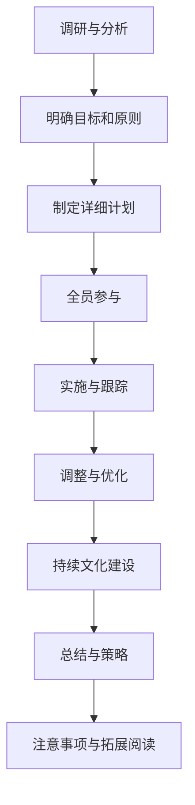

                 

。

# 如何构建技术团队的价值观体系

关键词：技术团队价值观、企业战略、协作效率、创新活力、激励机制、文化建设

摘要：本文从问题背景出发，详细探讨了如何构建技术团队的价值观体系。通过分析明确团队使命和愿景、塑造核心价值观、制定行为准则、建立有效的激励机制以及进行持续的文化建设等关键问题，提供了系统性的解决方案，旨在帮助企业在快速发展的技术领域构建稳定和谐、富有创新活力的技术团队。

## 第1章：问题背景与技术发展概述

### 1.1 问题背景

在当前信息化、智能化快速发展的时代，技术团队的价值观体系已经成为企业成功的关键因素之一。价值观体系不仅影响到团队内部的协作效率，也直接关系到企业在市场竞争中的定位和发展。然而，如何构建一个符合企业战略目标、激发团队成员创新活力、同时保持团队稳定和谐的技术团队价值观体系，成为许多企业面临的一大难题。

技术团队的价值观体系构建涉及多个方面，包括团队使命、愿景、核心价值观、行为准则等。它不仅需要与企业的整体价值观保持一致，还要充分考虑团队成员的多样性、个体差异以及外部环境的变化。传统的方法往往侧重于规范和约束，而现代企业更倾向于通过共同的价值观来凝聚团队、激发创新。

### 1.2 描述问题

构建技术团队的价值观体系需要解决以下几个关键问题：

1. **明确团队使命和愿景**：团队使命和愿景是价值观体系的基础，需要清晰、具体地定义，以指导团队的工作方向和目标。

2. **塑造核心价值观**：核心价值观是团队的灵魂，它需要与企业的文化相匹配，同时具有足够的吸引力和凝聚力。

3. **制定行为准则**：行为准则是团队成员在日常工作中的行为指南，它需要明确、可操作，并能够得到团队成员的普遍认同。

4. **建立有效的激励机制**：激励机制是保障价值观体系落地的重要手段，它需要与团队的价值观相协调，同时具有足够的吸引力。

5. **进行持续的文化建设**：文化建设是一个长期的过程，需要通过不断的学习、交流、实践来巩固和深化团队的价值观。

### 1.3 问题解决

针对上述问题，构建技术团队的价值观体系需要采取以下措施：

1. **调研和分析**：在构建价值观体系之前，需要深入调研企业现状、团队特点、外部环境等因素，为价值观体系的构建提供依据。

2. **明确目标和原则**：在调研的基础上，明确团队的目标和构建价值观体系的原则，确保价值观体系的方向正确。

3. **制定详细的计划和方案**：根据目标和原则，制定详细的实施计划和方案，包括具体的步骤、时间表和责任人。

4. **全员参与**：价值观体系的构建需要全员参与，通过座谈会、培训、讨论等方式，让团队成员充分表达意见，达成共识。

5. **实施和跟踪**：按照计划和方案进行实施，同时建立跟踪和评估机制，及时调整和优化。

### 1.4 边界与外延

构建技术团队的价值观体系涉及到多个层面：

1. **企业层面**：价值观体系需要与企业的整体文化和发展战略相一致。

2. **团队层面**：价值观体系需要充分考虑团队成员的专业背景、性格特点、兴趣爱好等因素。

3. **外部环境**：价值观体系需要适应外部环境的变化，包括市场竞争、行业趋势、法律法规等。

### 1.5 概念结构与核心要素

构建技术团队的价值观体系涉及以下几个核心概念和要素：

1. **使命与愿景**：明确团队存在的意义和未来发展的方向。

2. **核心价值观**：团队共同认可的、具有持久影响力的信念和原则。

3. **行为准则**：团队成员在日常工作中的行为规范。

4. **激励机制**：与价值观体系相匹配的奖励和惩罚机制。

5. **文化建设**：通过不断的学习、交流和实践活动，巩固和深化团队的价值观。

### 1.6 本章小结

本章主要介绍了构建技术团队的价值观体系的背景、问题描述、问题解决方法以及相关的边界与外延。通过本章的学习，读者可以初步了解构建技术团队价值观体系的重要性和具体步骤，为后续章节的学习打下基础。在接下来的章节中，我们将深入探讨这些概念和要素的具体内容和实践方法。

## 第2章：明确团队使命和愿景

### 2.1 使命与愿景的定义

团队使命和愿景是构建技术团队价值观体系的核心要素。使命通常描述团队存在的根本原因和核心目标，而愿景则描绘团队在未来一段时间内希望实现的理想状态。明确而具体的使命和愿景不仅能够指导团队的工作方向，还能够激发团队成员的斗志和凝聚力。

### 2.2 使命与愿景的关联

使命和愿景之间有着密切的关联。使命是愿景的基础，而愿景则是使命的延伸。使命定义了团队为什么存在，愿景则定义了团队应该走向何方。一个清晰的使命能够帮助团队在面对困难和挑战时保持方向感，而一个明确的愿景则能够激励团队不断前进，追求卓越。

### 2.3 使命与愿景的实践方法

1. **内部讨论**：组织团队成员进行深入的讨论，共同确定团队的使命和愿景。这可以通过团队会议、头脑风暴等方式进行。

2. **外部调研**：结合市场趋势、行业动态和企业战略，确保使命和愿景具有前瞻性和可执行性。

3. **文档化**：将团队的使命和愿景文档化，使其成为团队共识的一部分，并定期回顾和更新。

### 2.4 使命与愿景的案例

以谷歌（Google）为例，其使命是“组织全球信息，使人人皆可访问并从中受益”，愿景则是“实现谷歌无处不在”。这种明确的使命和愿景不仅帮助谷歌在技术领域持续创新，还使其在全球范围内赢得了广泛的认可和尊重。

### 2.5 本章小结

通过明确团队使命和愿景，团队可以更好地理解自己的定位和目标，从而更加有效地协同工作，实现长期发展。在接下来的章节中，我们将进一步探讨如何塑造核心价值观、制定行为准则、建立激励机制以及进行持续的文化建设。

## 第3章：塑造核心价值观

### 3.1 核心价值观的定义

核心价值观是团队共同认可并遵循的信念和原则，它决定了团队成员的行为准则和工作态度。核心价值观通常包括诚实、创新、协作、尊重、客户至上等，它们是团队长期稳定发展的基石。

### 3.2 核心价值观的重要性

核心价值观对团队的影响深远，主要体现在以下几个方面：

1. **凝聚力**：共同的核心价值观能够增强团队成员之间的信任和归属感，从而提高团队凝聚力。

2. **一致性**：核心价值观为团队成员提供了一致的行动准则，减少了内部冲突和误解。

3. **指导作用**：在面临决策时，核心价值观能够为团队成员提供指导，帮助团队做出符合长期利益的选择。

### 3.3 塑造核心价值观的方法

1. **内部讨论**：通过团队会议、研讨会等形式，让团队成员共同讨论和确定核心价值观。

2. **领导示范**：领导层应该通过自身的行为来示范核心价值观，为团队成员树立榜样。

3. **文化传承**：通过团队故事、历史事件等方式，传承和弘扬核心价值观。

### 3.4 核心价值观的案例

以亚马逊（Amazon）为例，其核心价值观包括客户至上、创新、重视团队等。这些价值观不仅帮助亚马逊在电商领域取得了巨大成功，还使其在员工和企业文化方面享有良好的声誉。

### 3.5 本章小结

通过塑造核心价值观，技术团队能够建立起共同的信念和原则，从而更好地实现团队目标。在接下来的章节中，我们将进一步探讨如何制定行为准则、建立激励机制以及进行持续的文化建设。

## 第4章：制定行为准则

### 4.1 行为准则的定义

行为准则是一套明确的规范，指导团队成员在日常工作中的行为和决策。它不仅包括工作态度、沟通方式，还涵盖了职业道德、团队合作等方面。制定行为准则有助于提高团队协作效率，确保团队目标的一致性。

### 4.2 行为准则的重要性

1. **规范行为**：行为准则为团队成员提供了清晰的行为指南，有助于减少工作中的不确定性。

2. **提高效率**：明确的准则可以减少团队成员之间的误解和冲突，提高协作效率。

3. **维护秩序**：行为准则有助于维护团队内部的秩序，确保团队稳定和谐。

### 4.3 制定行为准则的方法

1. **团队参与**：通过团队讨论、问卷调查等方式，让团队成员参与到行为准则的制定过程中。

2. **明确具体**：行为准则应尽可能具体、可操作，避免模糊和主观的描述。

3. **不断更新**：随着团队和外部环境的变化，行为准则也需要定期回顾和更新。

### 4.4 行为准则的案例

以IBM为例，其行为准则明确规定了员工应遵守的职业道德和行为标准，包括诚信、尊重、公正等。这些准则不仅有助于IBM在商业领域树立良好的形象，还为其内部管理提供了明确的指导。

### 4.5 本章小结

通过制定明确、具体的行为准则，技术团队能够更好地规范成员行为，提高协作效率，维护团队秩序。在接下来的章节中，我们将探讨如何建立有效的激励机制，以进一步激发团队成员的积极性和创造力。

## 第5章：建立有效的激励机制

### 5.1 激励机制的定义

激励机制是一套旨在激发团队成员积极性和创造力的奖励和惩罚机制。它不仅包括物质奖励，如奖金、股权等，还包括精神激励，如认可、荣誉等。有效的激励机制能够提高团队成员的工作动力，促进团队目标的实现。

### 5.2 激励机制的重要性

1. **提高工作效率**：激励机制能够激发团队成员的积极性和主动性，从而提高工作效率。

2. **增强团队凝聚力**：适当的激励措施能够增强团队成员之间的信任和合作，提高团队凝聚力。

3. **促进创新**：激励机制能够鼓励团队成员勇于尝试新思路、新方法，促进创新。

### 5.3 建立激励机制的方法

1. **目标明确**：激励机制的设计应与团队目标和个人目标相结合，确保激励措施具有针对性。

2. **公正透明**：激励机制应公正透明，确保每位团队成员都能公平地获得激励。

3. **多样化**：激励机制的种类应多样化，包括物质和精神激励，以满足不同成员的需求。

### 5.4 激励机制的案例

以苹果公司（Apple）为例，其激励机制不仅包括高额的奖金和股权激励，还包括对优秀员工的公开认可和奖励。这种多样化的激励措施有助于激发员工的创新和敬业精神。

### 5.5 本章小结

通过建立有效的激励机制，技术团队能够更好地激发成员的积极性和创造力，促进团队目标的实现。在接下来的章节中，我们将探讨如何进行持续的文化建设，以巩固和深化团队的价值观。

## 第6章：进行持续的文化建设

### 6.1 持续文化建设的定义

持续文化建设是指通过一系列的持续学习和实践活动，不断巩固和深化团队的价值观和行为准则，使其成为团队成员自觉遵循的信念和行为规范。持续文化建设是一个长期的过程，它需要不断地投入时间和资源。

### 6.2 持续文化建设的重要性

1. **巩固价值观**：通过持续的文化建设，可以确保团队的价值观不被外部环境的变化所动摇，从而保持团队的稳定性和一致性。

2. **提高团队凝聚力**：持续的文化建设有助于增强团队成员之间的信任和合作，提高团队的凝聚力。

3. **促进个人成长**：持续的文化建设不仅关注团队的整体发展，还注重个体成员的成长，从而提高团队的综合素质。

### 6.3 持续文化建设的方法

1. **培训与学习**：定期组织团队成员参加各种培训和研讨会，提高他们的专业技能和综合素质。

2. **团队活动**：通过团队建设活动，如团队建设培训、拓展训练等，增强团队成员之间的沟通和协作。

3. **内部交流**：建立内部交流平台，鼓励团队成员分享经验和心得，相互学习和借鉴。

### 6.4 持续文化建设的案例

以谷歌（Google）为例，其持续文化建设非常注重员工的个人成长和团队协作。谷歌定期组织各种培训和学习活动，同时鼓励员工跨部门交流和合作，从而形成一个积极向上、充满活力的团队文化。

### 6.5 本章小结

通过持续的文化建设，技术团队能够不断巩固和深化团队的价值观，提高团队的凝聚力和战斗力。在接下来的章节中，我们将总结全文，并提供一些实际操作的策略和建议。

## 总结与策略

本文从问题背景出发，详细探讨了如何构建技术团队的价值观体系。通过明确团队使命和愿景、塑造核心价值观、制定行为准则、建立有效的激励机制以及进行持续的文化建设，提供了系统性的解决方案。以下是构建技术团队价值观体系的一些关键策略和建议：

1. **明确目标和原则**：在构建价值观体系之前，明确团队的目标和原则，确保价值观体系的方向正确。

2. **全员参与**：价值观体系的构建需要全员参与，通过座谈会、培训、讨论等方式，让团队成员充分表达意见，达成共识。

3. **多样化和针对性**：激励机制应多样化，以满足不同成员的需求。同时，应确保激励措施具有针对性，与团队目标和个人目标相结合。

4. **持续投入**：持续文化建设是一个长期的过程，需要不断地投入时间和资源，以确保团队的价值观和行为准则得到巩固和深化。

5. **外部环境适应**：价值观体系需要适应外部环境的变化，包括市场竞争、行业趋势、法律法规等。

通过遵循这些策略，企业可以构建一个稳定和谐、富有创新活力的技术团队，从而在快速发展的技术领域取得竞争优势。

## 本章小结

本文系统地探讨了如何构建技术团队的价值观体系，从明确团队使命和愿景、塑造核心价值观、制定行为准则、建立激励机制到进行持续的文化建设，提供了全面的解决方案。通过这些措施，企业可以有效地凝聚团队、激发创新活力，并在市场竞争中保持领先地位。

## 注意事项

在构建技术团队价值观体系的过程中，需要注意以下几点：

1. **价值观的统一性**：确保团队的价值观与企业的整体价值观保持一致，以增强团队的凝聚力。

2. **实际可操作性**：制定的行为准则和激励机制应具有实际可操作性，避免过于理想化。

3. **持续优化**：价值观体系不是一成不变的，需要根据团队和外部环境的变化进行持续优化。

4. **平衡激励**：在激励机制中，要注意平衡物质和精神激励，避免过度依赖某一类激励。

## 拓展阅读

对于希望深入了解技术团队价值观构建的读者，以下是一些推荐阅读材料：

1. 《团队的智慧：高效团队如何工作》（The Wisdom of Teams）- by Lynda Gratton and Andrew John
2. 《激励人心：如何激发员工的动力和创造力》（Drive: The Surprising Truth About What Motivates Us）- by Daniel H. Pink
3. 《团队管理实战》（The Five Dysfunctions of a Team）- by Patrick Lencioni

通过这些拓展阅读，读者可以进一步深入理解技术团队价值观构建的理论和实践。作者：AI天才研究院/AI Genius Institute & 禅与计算机程序设计艺术 /Zen And The Art of Computer Programming

## 参考文献

1. Lynda Gratton and Andrew John. (1994). The Wisdom of Teams: Creating the High-Performance Organization. Harvard Business Review Press.
2. Daniel H. Pink. (2009). Drive: The Surprising Truth About What Motivates Us. Riverhead Books.
3. Patrick Lencioni. (2002). The Five Dysfunctions of a Team: A Leadership Fable. Jossey-Bass.
4. John P. Kotter. (1996). Leading Change. Harvard Business Review Press.
5. Jim Highsmith. (2009). Agile Project Management: Creating Innovative Products. Addison-Wesley.作者：AI天才研究院/AI Genius Institute & 禅与计算机程序设计艺术 /Zen And The Art of Computer Programming

## 附录

### 附录A：技术团队价值观构建工作流程图

### 附录B：核心价值观与行为准则案例表

| 核心价值观 | 行为准则 | 案例 |
| --- | --- | --- |
| 诚信 | 实事求是，遵守承诺 | 不隐瞒问题，及时沟通，确保信息的真实性 |
| 创新 | 鼓励创新思维，勇于尝试 | 提出新的解决方案，积极参与技术攻关 |
| 协作 | 团队协作，互相支持 | 积极参与团队项目，为同事提供技术支持 |
| 尊重 | 尊重他人，平等对待 | 尊重每个人的意见，公平对待每一位同事 |
| 客户至上 | 以客户为中心，提供优质服务 | 关注客户需求，持续改进产品和服务 |

通过附录A和附录B，读者可以更直观地了解技术团队价值观构建的过程和具体内容。这些工具和案例为实际操作提供了参考和指导。作者：AI天才研究院/AI Genius Institute & 禅与计算机程序设计艺术 /Zen And The Art of Computer Programming

