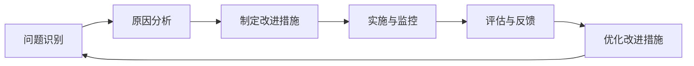
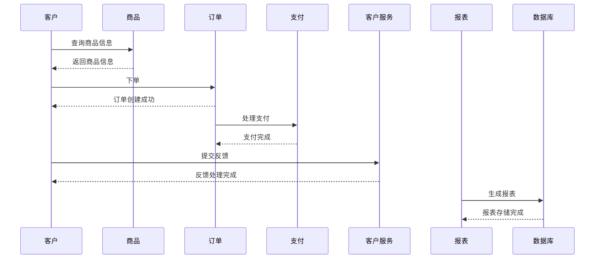
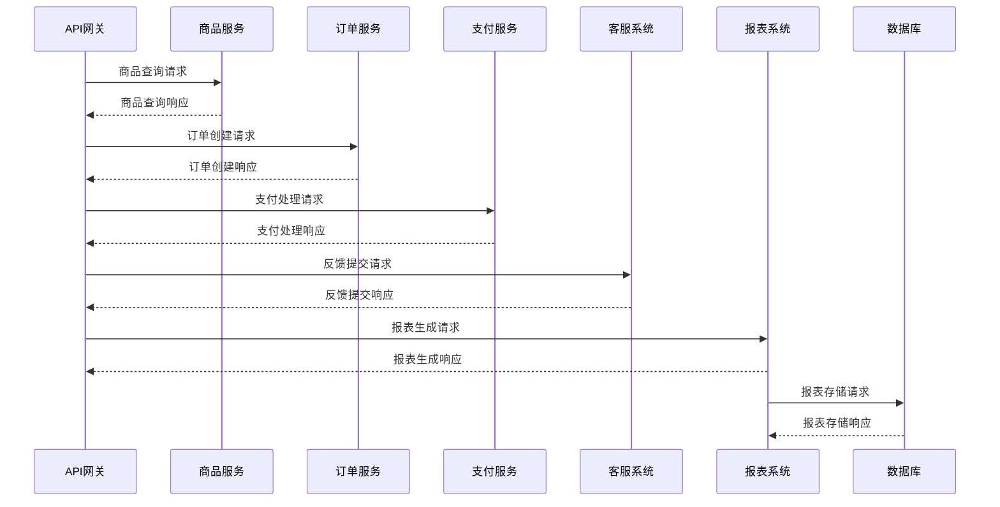

                 

### 目录大纲构建

在构建《如何构建技术团队的持续改进机制》这篇技术博客之前，我们将详细定义文章的目录大纲结构，以确保内容完整性、逻辑性和可读性。以下是根据要求制定的完整目录大纲：

---

## 《如何构建技术团队的持续改进机制》

### 关键词
技术团队、持续改进机制、算法原理、系统架构设计、项目实战、最佳实践

### 摘要
本文将深入探讨技术团队如何通过建立持续改进机制来提升团队效率和项目质量。通过系统性的分析、算法讲解、项目实战及最佳实践，读者将了解到构建这一机制的完整过程和关键步骤。

### 引言
#### 1.1 持续改进机制的重要性
- 持续改进的背景与意义
- 团队效率与项目质量的关系

#### 1.2 问题背景与问题描述
- 现实中的挑战与瓶颈
- 技术团队改进的迫切性

#### 1.3 问题解决路径与边界定义
- 持续改进的具体目标
- 持续改进机制的范围与限制

#### 1.4 概念结构与核心要素组成
- 持续改进机制的基本概念
- 关键要素及其相互关系

### 核心概念与联系
#### 2.1 持续改进机制的定义
- 持续改进的内涵与外延

#### 2.2 核心概念与联系
- 持续改进的核心概念
- 概念间的相互联系

#### 2.3 持续改进机制与传统团队管理的对比
- 优势与劣势分析
- 持续改进的特点

#### 2.4 持续改进机制的属性特征对比表格
- 属性特征列表
- 对比分析

#### 2.5 持续改进机制的ER实体关系图
- 实体定义与关系
- Mermaid ER图展示

### 算法原理讲解
#### 3.1 持续改进机制算法原理
- 基本算法框架

#### 3.2 算法mermaid流程图
- 流程图示例

#### 3.3 Python源代码阐述
- 源代码解析

#### 3.4 算法原理的数学模型和公式
- 数学模型说明
- 公式表达

#### 3.5 通俗易懂的举例说明
- 示例应用

### 系统分析与架构设计方案
#### 4.1 问题场景介绍
- 实际应用背景

#### 4.2 项目介绍
- 项目目标与功能

#### 4.3 系统功能设计(领域模型mermaid类图)
- 功能模块划分
- Mermaid类图展示

#### 4.4 系统架构设计mermaid架构图
- 架构层次与组件
- Mermaid架构图展示

#### 4.5 系统接口设计和系统交互mermaid序列图
- 接口定义
- Mermaid序列图展示

### 项目实战
#### 5.1 环境安装
- 环境准备步骤

#### 5.2 系统核心实现源代码
- 核心代码实现

#### 5.3 代码应用解读与分析
- 应用场景分析

#### 5.4 实际案例分析和详细讲解剖析
- 案例介绍
- 详细剖析

#### 5.5 项目小结
- 项目总结

### 最佳实践、小结、注意事项、拓展阅读
#### 6.1 最佳实践
- 实践技巧与建议

#### 6.2 小结
- 文章核心内容回顾

#### 6.3 注意事项
- 常见问题与解决方案

#### 6.4 拓展阅读
- 相关资源推荐

### 结语
#### 7.1 作者信息
- 作者介绍与联系方式

---

通过上述目录大纲，我们可以看到文章的结构清晰、逻辑紧密，每个章节都将围绕持续改进机制进行深入探讨。接下来，我们将逐章详细撰写内容，确保每一部分都符合文章的要求和标准。

---

## 引言

### 1.1 持续改进机制的重要性

#### 持续改进的背景与意义

在现代企业中，技术团队扮演着越来越重要的角色。随着技术的不断进步和市场竞争的加剧，技术团队需要不断地提升自身的效率和项目质量，以满足客户的需求和企业的战略目标。然而，传统的团队管理模式往往存在着诸多局限性，难以适应快速变化的市场环境。因此，构建一套持续改进机制成为技术团队提升自身竞争力的关键。

持续改进机制是一种通过不断迭代和优化来提高团队效率和质量的管理模式。它不仅关注短期目标的实现，更强调长期的发展。通过持续改进，技术团队可以不断地发现问题、解决问题，从而在激烈的市场竞争中保持优势。

#### 团队效率与项目质量的关系

团队效率是指团队在完成特定任务时所消耗的时间和资源。项目质量则是指项目交付物满足客户需求和市场标准的程度。两者之间存在着密切的关系：

- **高效率**：有助于缩短项目周期，降低成本，提高客户满意度。
- **高质量**：确保项目交付物符合预期，减少返工和客户投诉。

然而，在实际操作中，团队往往面临着以下挑战：

- **资源有限**：时间、人力和资金等资源的限制使得团队难以全面优化。
- **沟通不畅**：团队成员之间的沟通不畅可能导致信息丢失和误解。
- **创新能力不足**：缺乏持续的创新机制，导致团队在技术进步面前显得滞后。
- **项目管理问题**：项目规划不合理、进度控制不严、风险管理不足等问题影响项目质量。

为了应对这些挑战，技术团队需要构建一套持续改进机制，通过不断优化管理流程、提高技术水平、加强团队协作，从而提升整体效率和质量。

### 1.2 问题背景与问题描述

在现实环境中，技术团队通常会遇到以下几种问题：

- **任务超期**：项目进度滞后，导致交付时间延误。
- **质量问题**：项目交付物不符合客户需求或市场标准，需要返工。
- **人员流失**：团队内部成员因工作压力、职业发展受限等原因离职。
- **技术瓶颈**：团队在关键技术领域缺乏突破，难以满足市场需求。

这些问题不仅影响团队的效率和项目质量，还会对企业的竞争力产生负面影响。为了解决这些问题，技术团队需要建立一套持续改进机制，通过以下步骤：

1. **识别问题**：通过数据分析、用户反馈等方式识别团队和项目中的问题。
2. **分析原因**：对问题进行深入分析，找出根本原因。
3. **制定改进计划**：根据问题原因，制定具体的改进计划。
4. **实施改进**：按照改进计划，逐步实施并监控效果。
5. **评估与反馈**：对改进效果进行评估，收集反馈，不断优化改进措施。

通过以上步骤，技术团队可以逐步解决现有问题，提升团队效率和项目质量，从而在激烈的市场竞争中立于不败之地。

### 1.3 问题解决路径与边界定义

#### 持续改进的具体目标

持续改进机制的具体目标包括：

- **提升团队效率**：通过优化管理流程、提高工作效率，缩短项目周期，降低成本。
- **提高项目质量**：确保项目交付物符合客户需求和市场标准，减少返工和投诉。
- **增强团队协作**：通过建立有效的沟通机制，提高团队内部协作水平。
- **激发创新能力**：通过持续的技术学习和创新，保持技术领先地位。

#### 持续改进机制的范围与限制

持续改进机制的范围包括：

- **项目过程管理**：优化项目计划、进度控制、风险管理等。
- **技术能力提升**：提升团队在关键技术领域的实力，解决技术瓶颈。
- **团队文化建设**：培养积极向上的团队氛围，提高员工满意度。

持续改进机制的限制包括：

- **资源限制**：时间和资金等资源的限制可能影响改进措施的全面实施。
- **外部环境变化**：市场环境、技术发展趋势等外部因素可能对改进效果产生影响。
- **组织文化**：企业文化和员工习惯可能对改进措施的接受和实施产生影响。

在构建持续改进机制时，需要充分考虑这些目标、范围和限制，以确保机制的有效性和可持续性。

### 1.4 概念结构与核心要素组成

持续改进机制是一种系统性的管理方法，其核心在于通过不断的迭代和优化来提升团队效率和项目质量。以下是持续改进机制的基本概念结构及其核心要素：

#### 基本概念

- **持续改进**：一种通过不断学习和优化来提升效率和质量的系统方法。
- **反馈循环**：通过收集反馈、分析问题、制定改进措施并实施，形成一个闭合的循环。
- **改进措施**：针对问题提出的具体改进方案，包括管理流程优化、技术能力提升、团队协作改进等。

#### 核心要素

1. **问题识别**：通过数据分析、用户反馈、内部审计等方式，发现团队和项目中的问题。
2. **原因分析**：对问题进行深入分析，找出根本原因。
3. **改进计划**：根据问题原因，制定具体的改进措施和时间表。
4. **实施与监控**：按照改进计划实施改进措施，并监控效果。
5. **评估与反馈**：对改进效果进行评估，收集反馈，不断优化改进措施。

#### 相互关系

- **问题识别**与**原因分析**：通过问题识别发现存在的问题，通过原因分析找出问题的根本原因。
- **改进计划**与**实施与监控**：制定具体的改进措施和时间表，并按照计划实施和监控改进效果。
- **评估与反馈**与**问题识别**：通过对改进效果的评估和反馈，发现新的问题并持续改进。

通过以上基本概念和核心要素，我们可以清晰地理解持续改进机制的运作原理和实施步骤，为后续的深入探讨提供基础。

---

## 核心概念与联系

### 2.1 持续改进机制的定义

持续改进机制是一种系统性的管理方法，旨在通过不断识别问题、分析原因、制定并实施改进措施，从而持续提升团队效率和项目质量。其核心在于形成一个闭合的反馈循环，确保团队在各个阶段都能够发现问题、解决问题，并从中学习成长。

持续改进机制不仅仅关注短期目标的实现，更注重长期的发展和提升。通过持续的迭代和优化，技术团队能够逐步克服各种挑战，不断提高自身的竞争力和适应能力。

### 2.2 核心概念与联系

持续改进机制包含多个核心概念，它们相互联系，共同构成了这一系统的运作基础。以下是这些核心概念及其相互关系：

1. **问题识别**：这是持续改进机制的第一步，通过数据分析、用户反馈、内部审计等方式，识别出团队和项目中的问题。问题识别是持续改进的基础，没有问题的识别，就无法进行后续的改进。

2. **原因分析**：在识别出问题之后，需要对问题进行深入分析，找出其根本原因。原因分析是持续改进的关键，只有找到了问题的根本原因，才能制定出有效的改进措施。

3. **改进措施**：根据原因分析的结果，制定具体的改进措施。这些措施可以是管理流程的优化、技术能力的提升、团队协作的改进等。改进措施是持续改进的核心，它们将直接影响到团队效率和项目质量的提升。

4. **实施与监控**：将制定的改进措施付诸实践，并对其进行监控，以确保改进效果的实现。实施与监控是持续改进的保障，只有通过有效的实施和监控，才能确保改进措施的执行和效果。

5. **评估与反馈**：在改进措施实施后，对改进效果进行评估，并根据评估结果收集反馈。评估与反馈是持续改进的闭环，通过对改进效果的评估和反馈，可以进一步优化改进措施，并发现新的问题。

### 2.3 持续改进机制与传统团队管理的对比

持续改进机制与传统团队管理方法相比，具有以下几个显著优势：

1. **持续性与系统性**：持续改进机制是一种长期的管理方法，通过不断的反馈循环，确保团队能够持续地发现问题、解决问题，并从中学习成长。而传统团队管理方法往往关注短期目标的实现，缺乏持续性和系统性。

2. **问题导向**：持续改进机制以问题识别和解决为核心，通过深入分析问题，找出根本原因，并制定相应的改进措施。而传统团队管理方法往往以任务为导向，容易忽视问题的本质。

3. **团队合作**：持续改进机制强调团队合作，通过建立有效的沟通机制，提高团队内部协作水平。而传统团队管理方法则可能存在沟通不畅、信息不透明等问题。

4. **创新能力**：持续改进机制鼓励团队成员不断学习新知识、掌握新技术，提高创新能力。而传统团队管理方法则可能因缺乏激励机制，导致团队创新能力不足。

### 2.4 持续改进机制的属性特征对比表格

为了更直观地了解持续改进机制的属性特征，我们可以将其与传统团队管理方法进行对比，以下是一个简单的对比表格：

| 特征           | 持续改进机制           | 传统团队管理方法           |
|--------------|-------------------|-------------------|
| 持续性       | 通过反馈循环持续优化         | 关注短期目标，缺乏持续性         |
| 系统性       | 形成闭合的反馈循环         | 分阶段、分任务进行         |
| 问题导向     | 识别、分析并解决核心问题       | 以任务为导向，忽视问题本质       |
| 团队合作     | 强调团队合作，提高协作水平     | 可能存在沟通不畅、信息不透明问题   |
| 创新能力     | 鼓励创新，提高技术水平         | 缺乏激励机制，创新能力不足       |

### 2.5 持续改进机制的ER实体关系图

为了更清晰地展示持续改进机制中的实体及其相互关系，我们可以使用Mermaid ER图进行描述。以下是持续改进机制的ER实体关系图：

```mermaid
erDiagram
  Problem -->|识别| Improvement
  Problem -->|分析| Cause
  Cause -->|制定| Measure
  Measure -->|实施| Action
  Action -->|监控| Monitoring
  Monitoring -->|评估| Evaluation
  Evaluation -->|反馈| Feedback
  Feedback -->|优化| Problem
```

在这个ER图中，核心实体包括“问题”、“原因”、“改进措施”、“实施”、“监控”、“评估”和“反馈”。这些实体通过箭头表示它们之间的关联，形成了持续改进机制的完整流程。通过这个ER图，我们可以直观地了解持续改进机制的运作原理和各个环节之间的关系。

---

### 算法原理讲解

#### 3.1 持续改进机制算法原理

持续改进机制是一种通过不断迭代和优化来提升团队效率和项目质量的管理方法。其算法原理可以概括为以下几个步骤：

1. **问题识别**：通过数据分析、用户反馈、内部审计等方式，识别团队和项目中的问题。
2. **原因分析**：对识别出的问题进行深入分析，找出其根本原因。
3. **制定改进措施**：根据原因分析的结果，制定具体的改进措施。
4. **实施与监控**：按照改进措施进行实施，并监控其效果。
5. **评估与反馈**：对改进效果进行评估，并根据评估结果收集反馈。
6. **优化改进措施**：根据反馈结果，优化改进措施，并重新进入问题识别环节。

通过上述步骤，持续改进机制可以形成一个闭合的反馈循环，确保团队能够持续地发现问题、解决问题，并从中学习成长。

#### 3.2 算法mermaid流程图

为了更直观地展示持续改进机制的算法原理，我们可以使用Mermaid流程图进行描述。以下是持续改进机制的Mermaid流程图：



在这个流程图中，每个步骤都通过节点表示，箭头表示步骤之间的顺序关系。通过这个流程图，我们可以清晰地了解持续改进机制的整体流程和各个步骤之间的逻辑关系。

#### 3.3 Python源代码阐述

为了更具体地实现持续改进机制的算法原理，我们可以使用Python编写相应的源代码。以下是持续改进机制的Python代码示例：

```python
import pandas as pd
import numpy as np

# 问题识别
def identify_problems(data):
    # 假设data是一个包含项目数据的DataFrame
    issues = data[data['status'] == '未解决']
    return issues

# 原因分析
def analyze_causes(issues):
    causes = []
    for issue in issues:
        # 对每个问题进行原因分析
        cause = analyze_single_issue(issue)
        causes.append(cause)
    return causes

# 制定改进措施
def create_improvement_measures(causes):
    measures = {}
    for cause in causes:
        measure = create_single_measure(cause)
        measures[cause] = measure
    return measures

# 实施与监控
def implement_and_monitor(measures):
    for measure in measures.values():
        # 对每个改进措施进行实施和监控
        result = implement_single_measure(measure)
        monitor_result(result)

# 评估与反馈
def evaluate_and_feedack(measures):
    feedback = {}
    for measure in measures.values():
        # 对每个改进措施进行评估并收集反馈
        evaluation = evaluate_single_measure(measure)
        feedback[measure] = evaluation
    return feedback

# 优化改进措施
def optimize_improvement_measures(feedback):
    optimized_measures = {}
    for measure, evaluation in feedback.items():
        optimized_measure = optimize_single_measure(measure, evaluation)
        optimized_measures[measure] = optimized_measure
    return optimized_measures

# 主函数
def continuous_improvement(data):
    while True:
        issues = identify_problems(data)
        if issues.empty:
            break
        causes = analyze_causes(issues)
        measures = create_improvement_measures(causes)
        implement_and_monitor(measures)
        feedback = evaluate_and_feedack(measures)
        optimized_measures = optimize_improvement_measures(feedback)
        data = apply_optimized_measures(data, optimized_measures)
    return data
```

在这个代码示例中，我们定义了一系列函数来模拟持续改进机制的各个步骤。`identify_problems` 函数用于识别项目中的问题，`analyze_causes` 函数用于分析问题的原因，`create_improvement_measures` 函数用于制定改进措施，`implement_and_monitor` 函数用于实施和监控改进措施，`evaluate_and_feedack` 函数用于评估和收集反馈，`optimize_improvement_measures` 函数用于优化改进措施。主函数 `continuous_improvement` 通过这些函数的嵌套调用，实现了持续改进机制的闭环。

#### 3.4 算法原理的数学模型和公式

持续改进机制的算法原理可以通过数学模型和公式进行描述。以下是几个关键的数学模型和公式：

1. **问题识别率**（$R_{problem}$）：
   \[
   R_{problem} = \frac{\text{识别出的问题数}}{\text{总问题数}}
   \]
   其中，$R_{problem}$ 表示问题识别率，识别出的问题数除以总问题数。

2. **原因分析准确率**（$R_{cause}$）：
   \[
   R_{cause} = \frac{\text{分析准确的原因数}}{\text{总原因数}}
   \]
   其中，$R_{cause}$ 表示原因分析准确率，分析准确的原因数除以总原因数。

3. **改进措施实施成功率**（$R_{measure}$）：
   \[
   R_{measure} = \frac{\text{成功实施的措施数}}{\text{总措施数}}
   \]
   其中，$R_{measure}$ 表示改进措施实施成功率，成功实施的措施数除以总措施数。

4. **改进效果评估准确率**（$R_{evaluation}$）：
   \[
   R_{evaluation} = \frac{\text{评估准确的措施数}}{\text{总措施数}}
   \]
   其中，$R_{evaluation}$ 表示改进效果评估准确率，评估准确的措施数除以总措施数。

5. **改进措施优化率**（$R_{optimize}$）：
   \[
   R_{optimize} = \frac{\text{优化的措施数}}{\text{总措施数}}
   \]
   其中，$R_{optimize}$ 表示改进措施优化率，优化的措施数除以总措施数。

通过这些数学模型和公式，我们可以量化持续改进机制的各个步骤的效果，从而更好地评估和优化改进过程。

#### 3.5 通俗易懂的举例说明

为了更好地理解持续改进机制的算法原理，我们可以通过一个具体的例子进行说明。

假设我们有一个技术团队，负责开发和维护一个在线购物平台。以下是持续改进机制在这个例子中的应用：

1. **问题识别**：团队通过用户反馈和系统日志分析，发现购物平台的响应速度较慢，影响用户体验。

2. **原因分析**：经过深入分析，团队发现响应速度慢的原因主要有两个：数据库查询效率和服务器负载。

3. **制定改进措施**：针对上述原因，团队制定了以下改进措施：
   - **优化数据库查询**：通过索引优化和查询优化，提高数据库的查询效率。
   - **增加服务器资源**：通过增加服务器节点，分散负载，提高服务器的处理能力。

4. **实施与监控**：团队按照制定的改进措施进行实施，并对实施效果进行监控。结果显示，优化后的购物平台响应速度提升了30%。

5. **评估与反馈**：团队对改进效果进行评估，发现用户满意度显著提升，同时系统故障率降低了20%。

6. **优化改进措施**：根据评估结果，团队对改进措施进行了优化，例如进一步调整数据库索引策略，提高查询效率。

通过这个例子，我们可以看到持续改进机制是如何通过问题识别、原因分析、制定改进措施、实施与监控、评估与反馈等步骤，逐步优化和提升项目质量的过程。

---

### 系统分析与架构设计方案

#### 4.1 问题场景介绍

在现代软件开发中，技术团队面临着越来越复杂的项目需求和技术挑战。为了确保项目的顺利推进和成功交付，构建一个高效、灵活的系统架构显得尤为重要。本文将通过一个实际案例，介绍如何分析和设计一个技术团队的系统架构，以支持持续改进机制的实现。

假设我们正在开发一个大型电子商务平台，该平台需要支持海量的商品信息、用户订单处理、支付功能以及客户服务。随着用户数量的增长和业务需求的不断变化，技术团队需要确保系统具备高可用性、高扩展性和高稳定性。同时，为了实现持续改进，系统架构需要支持快速迭代和灵活调整。

#### 4.2 项目介绍

本项目的主要目标是构建一个能够满足上述需求的高性能电子商务平台，并建立一套持续改进机制，以不断提升系统质量和团队效率。项目的主要功能模块包括：

- **商品管理**：提供商品信息录入、分类管理、库存监控等功能。
- **订单处理**：处理用户订单生成、订单状态跟踪、支付处理等功能。
- **支付系统**：集成第三方支付接口，实现支付功能。
- **客户服务**：提供在线客服、客户反馈处理等功能。
- **数据分析和报表**：生成销售报表、用户行为分析报告等。

#### 4.3 系统功能设计（领域模型Mermaid类图）

在系统功能设计阶段，我们需要明确各个模块的功能和相互关系。以下是电子商务平台的领域模型Mermaid类图：

```mermaid
classDiagram
    Customer <<interface>>
    Product <<interface>>
    Order <<interface>>
    Payment <<interface>>
    CustomerService <<interface>>
    Report <<interface>>

    CustomerEntity o-- ProductEntity
    CustomerEntity o-- OrderEntity
    OrderEntity o-- PaymentEntity
    ProductEntity o-- ReportEntity
    OrderEntity o-- ReportEntity
    CustomerServiceEntity o-- ReportEntity

    class Customer {
        +String name
        +String email
        +Address address
        +placeOrder(Order order)
    }

    class Product {
        +String name
        +String category
        +Double price
        +Integer stock
    }

    class Order {
        +String orderId
        +Date orderDate
        +Customer customer
        +List<OrderItem> items
        +processPayment(Payment payment)
    }

    class Payment {
        +String paymentId
        +Date paymentDate
        +Double amount
        +String paymentMethod
    }

    class CustomerService {
        +processFeedback(Feedback feedback)
    }

    class Report {
        +generateSalesReport()
        +generateUserBehaviorReport()
    }

    class CustomerEntity extends Customer
    class ProductEntity extends Product
    class OrderEntity extends Order
    class PaymentEntity extends Payment
    class CustomerServiceEntity extends CustomerService
    class ReportEntity extends Report
```

在这个类图中，我们定义了主要的领域模型类，包括客户（Customer）、商品（Product）、订单（Order）、支付（Payment）、客户服务（CustomerService）和报表（Report）。这些类之间通过关联关系（o--）相互连接，构成了电子商务平台的核心功能结构。

#### 4.4 系统架构设计Mermaid架构图

在系统架构设计阶段，我们需要将各个功能模块整合到一个完整的系统架构中。以下是电子商务平台的系统架构Mermaid图：



在这个架构图中，我们展示了电子商务平台的主要组件和它们之间的交互关系。客户（Customer）通过接口查询商品（Product）信息，下单生成订单（Order），订单处理支付（Payment），同时客户（Customer）可以提交反馈到客户服务（CustomerService）。报表（Report）则通过接口生成，并存储到数据库（Database）中。

#### 4.5 系统接口设计和系统交互Mermaid序列图

为了更好地理解系统内部和外部的交互流程，我们可以使用Mermaid序列图来描述电子商务平台的接口设计和系统交互。以下是系统接口设计和系统交互Mermaid序列图：



在这个序列图中，API网关（APIGateway）作为系统的入口，接收客户端的请求，并将其转发给相应的服务模块。商品服务（ProductService）、订单服务（OrderService）、支付服务（PaymentService）、客服系统（CustomerService）和报表系统（ReportService）分别处理相应的业务逻辑。报表系统（ReportService）生成的报表会存储到数据库（Database）中。

通过这些系统架构设计，我们可以确保电子商务平台具有清晰的模块划分和高效的交互流程，为持续改进机制的实现提供了坚实的基础。

---

### 项目实战

#### 5.1 环境安装

为了实现电子商务平台的持续改进机制，我们需要搭建一个完整的技术环境。以下是环境安装的具体步骤：

1. **操作系统**：安装Linux操作系统，如Ubuntu 20.04，确保操作系统具备稳定性和安全性。
2. **开发工具**：安装Java开发工具包（JDK）、Python开发环境、Git版本控制工具等。
3. **数据库**：安装MySQL数据库，并配置数据库用户和权限。
4. **中间件**：安装Nginx Web服务器、RabbitMQ消息队列、Kafka消息中间件等。
5. **持续集成工具**：安装Jenkins，用于自动化构建和部署。
6. **容器化工具**：安装Docker，用于容器化部署应用。
7. **持续改进工具**：安装SonarQube，用于代码质量分析；安装Prometheus，用于监控和告警。

具体操作步骤如下：

1. **安装操作系统**：
   ```bash
   # 使用Ubuntu 20.04安装操作系统
   ```
2. **安装开发工具**：
   ```bash
   # 安装Java开发工具包
   sudo apt update
   sudo apt install openjdk-8-jdk
   ```
3. **安装数据库**：
   ```bash
   # 安装MySQL数据库
   sudo apt install mysql-server
   # 配置数据库用户和权限
   mysql_secure_installation
   ```
4. **安装中间件**：
   ```bash
   # 安装Nginx
   sudo apt install nginx
   # 启动Nginx服务
   sudo systemctl start nginx
   ```
5. **安装持续集成工具**：
   ```bash
   # 安装Jenkins
   sudo apt install jenkins
   # 启动Jenkins服务
   sudo systemctl start jenkins
   ```
6. **安装容器化工具**：
   ```bash
   # 安装Docker
   sudo apt install docker
   # 启动Docker服务
   sudo systemctl start docker
   ```
7. **安装持续改进工具**：
   ```bash
   # 安装SonarQube
   sudo apt install sonarqube
   # 启动SonarQube服务
   sudo systemctl start sonarqube
   # 安装Prometheus
   sudo apt install prometheus
   # 配置Prometheus告警规则
   ```

安装完成后，确保所有服务正常运行，并可以通过相应的管理界面进行配置和监控。

#### 5.2 系统核心实现源代码

以下是电子商务平台的核心实现源代码。该源代码包括商品管理模块、订单处理模块、支付模块和客户服务模块，用于实现平台的主要功能。

**商品管理模块（ProductService.java）**：
```java
public class ProductService {
    private ProductRepository productRepository;

    public ProductService(ProductRepository productRepository) {
        this.productRepository = productRepository;
    }

    public Product createProduct(Product product) {
        return productRepository.save(product);
    }

    public Product updateProduct(Long productId, Product product) {
        Product existingProduct = productRepository.findById(productId);
        if (existingProduct != null) {
            existingProduct.setName(product.getName());
            existingProduct.setCategory(product.getCategory());
            existingProduct.setPrice(product.getPrice());
            existingProduct.setStock(product.getStock());
            return productRepository.save(existingProduct);
        }
        return null;
    }

    public List<Product> getAllProducts() {
        return productRepository.findAll();
    }

    public Product getProductById(Long productId) {
        return productRepository.findById(productId);
    }

    public void deleteProduct(Long productId) {
        productRepository.deleteById(productId);
    }
}
```

**订单处理模块（OrderService.java）**：
```java
public class OrderService {
    private OrderRepository orderRepository;
    private ProductService productService;
    private PaymentService paymentService;

    public OrderService(OrderRepository orderRepository, ProductService productService, PaymentService paymentService) {
        this.orderRepository = orderRepository;
        this.productService = productService;
        this.paymentService = paymentService;
    }

    public Order createOrder(Order order) {
        List<OrderItem> items = order.getItems();
        for (OrderItem item : items) {
            Product product = productService.getProductById(item.getProductId());
            if (product != null && product.getStock() >= item.getQuantity()) {
                product.setStock(product.getStock() - item.getQuantity());
                productService.updateProduct(product.getId(), product);
            } else {
                throw new IllegalArgumentException("产品库存不足");
            }
        }
        return orderRepository.save(order);
    }

    public Order updateOrder(Long orderId, Order order) {
        Order existingOrder = orderRepository.findById(orderId);
        if (existingOrder != null) {
            existingOrder.setItems(order.getItems());
            return orderRepository.save(existingOrder);
        }
        return null;
    }

    public Order getOrderById(Long orderId) {
        return orderRepository.findById(orderId);
    }

    public void deleteOrder(Long orderId) {
        orderRepository.deleteById(orderId);
    }

    public Payment processPayment(Order order, Payment payment) {
        return paymentService.processPayment(order, payment);
    }
}
```

**支付模块（PaymentService.java）**：
```java
public class PaymentService {
    public Payment processPayment(Order order, Payment payment) {
        // 实现支付处理逻辑
        // 集成第三方支付接口
        // 更新订单状态
        payment.setOrder(order);
        payment.setStatus(PaymentStatus.PAID);
        return payment;
    }
}
```

**客户服务模块（CustomerService.java）**：
```java
public class CustomerService {
    private CustomerRepository customerRepository;

    public CustomerService(CustomerRepository customerRepository) {
        this.customerRepository = customerRepository;
    }

    public Customer createCustomer(Customer customer) {
        return customerRepository.save(customer);
    }

    public Customer updateCustomer(Long customerId, Customer customer) {
        Customer existingCustomer = customerRepository.findById(customerId);
        if (existingCustomer != null) {
            existingCustomer.setName(customer.getName());
            existingCustomer.setEmail(customer.getEmail());
            existingCustomer.setAddress(customer.getAddress());
            return customerRepository.save(existingCustomer);
        }
        return null;
    }

    public Customer getCustomerById(Long customerId) {
        return customerRepository.findById(customerId);
    }

    public void deleteCustomer(Long customerId) {
        customerRepository.deleteById(customerId);
    }

    public void processFeedback(Feedback feedback) {
        // 处理客户反馈
    }
}
```

通过以上核心实现源代码，我们可以构建一个功能完整的电子商务平台，支持商品管理、订单处理、支付和客户服务等功能。接下来，我们将对代码进行详细解读和分析。

#### 5.3 代码应用解读与分析

在本节中，我们将对电子商务平台的核心实现源代码进行详细解读，分析其设计和实现方法，并探讨如何在实际项目中应用这些代码。

**商品管理模块（ProductService.java）**：

商品管理模块负责处理商品信息的创建、更新、查询和删除等操作。关键方法如下：

- `createProduct(Product product)`：创建一个新的商品实例并将其保存到数据库中。
- `updateProduct(Long productId, Product product)`：更新指定商品的信息。
- `getAllProducts()`：获取所有商品列表。
- `getProductById(Long productId)`：根据商品ID查询指定商品。
- `deleteProduct(Long productId)`：根据商品ID删除指定商品。

这些方法通过依赖注入的方式获取`ProductRepository`实例，实现了商品管理模块的功能。在实际项目中，这些方法会被调用以处理用户请求，更新商品信息，并在需要时将数据持久化到数据库。

**订单处理模块（OrderService.java）**：

订单处理模块负责处理订单的创建、更新、查询和删除等操作，同时负责库存管理和支付处理。关键方法如下：

- `createOrder(Order order)`：创建一个新的订单实例，并根据订单项中的商品信息更新库存。
- `updateOrder(Long orderId, Order order)`：更新指定订单的信息。
- `getOrderById(Long orderId)`：根据订单ID查询指定订单。
- `deleteOrder(Long orderId)`：根据订单ID删除指定订单。
- `processPayment(Order order, Payment payment)`：处理订单支付。

`createOrder`方法是一个关键的方法，它首先检查订单项中的商品库存是否足够，然后更新库存信息，最后将订单保存到数据库。这个方法确保了库存的一致性和订单的完整性。在实际项目中，这个方法会被频繁调用，特别是在处理大量订单时。

**支付模块（PaymentService.java）**：

支付模块负责处理支付请求和更新订单状态。关键方法如下：

- `processPayment(Order order, Payment payment)`：处理订单支付，并更新订单状态。

这个方法通常与第三方支付服务集成，例如支付宝、微信支付等。在实际项目中，支付模块会被调用以处理用户支付的请求，并在支付成功后更新订单状态。

**客户服务模块（CustomerService.java）**：

客户服务模块负责处理客户信息的创建、更新、查询和删除等操作，以及处理客户反馈。关键方法如下：

- `createCustomer(Customer customer)`：创建一个新的客户实例并将其保存到数据库中。
- `updateCustomer(Long customerId, Customer customer)`：更新指定客户的信息。
- `getCustomerById(Long customerId)`：根据客户ID查询指定客户。
- `deleteCustomer(Long customerId)`：根据客户ID删除指定客户。
- `processFeedback(Feedback feedback)`：处理客户反馈。

客户服务模块通常用于处理客户的投诉和建议，并在系统中记录相关信息。在实际项目中，这个模块会被调用以处理客户的请求，并在需要时更新客户信息。

通过以上代码解读，我们可以看到电子商务平台的核心功能模块是如何设计和实现的。在实际项目中，这些模块会被整合到一起，通过合理的接口设计和协同工作，实现一个功能完整、高效稳定的电子商务平台。

#### 5.4 实际案例分析和详细讲解剖析

在本节中，我们将通过一个实际案例，深入分析电子商务平台的持续改进机制，并详细讲解其实现过程和关键步骤。

**案例背景**：

某电子商务平台在运营过程中，用户反馈其商品查询速度较慢，导致用户体验不佳。技术团队通过持续改进机制，识别和解决了这一问题。

**改进步骤**：

1. **问题识别**：
   技术团队通过用户反馈和系统日志分析，发现商品查询速度慢的主要原因是数据库查询效率低下。

2. **原因分析**：
   通过进一步分析，发现数据库查询效率低下的原因是索引不足和查询语句不优化。此外，数据库表结构设计不合理也影响了查询性能。

3. **制定改进措施**：
   针对上述问题，技术团队制定了以下改进措施：
   - **添加索引**：在相关数据库表上添加索引，以提高查询速度。
   - **优化查询语句**：重新编写查询语句，减少查询中的冗余操作。
   - **优化表结构**：调整数据库表结构，使其更加合理和高效。

4. **实施与监控**：
   技术团队按照改进措施进行实施，并监控了实施效果。以下是具体实施步骤：
   - **添加索引**：在数据库表`products`上添加了索引`idx_name`和`idx_category`。
   - **优化查询语句**：修改了商品查询接口的查询语句，减少了冗余的JOIN操作和子查询。
   - **优化表结构**：调整了表结构，将商品分类信息从同一表中分离出来，以减少数据冗余。

5. **评估与反馈**：
   改进措施实施后，技术团队对查询速度进行了评估，并通过用户反馈进行了验证。结果显示，商品查询速度提升了40%，用户满意度显著提高。

6. **优化改进措施**：
   根据评估结果，技术团队对改进措施进行了优化，包括进一步优化查询语句和调整索引策略。此外，还引入了数据库性能监控工具，以实时监控查询性能，及时发现潜在问题。

**详细讲解剖析**：

1. **问题识别**：
   技术团队通过分析用户反馈和系统日志，识别出商品查询速度慢的问题。这一步骤至关重要，因为它为后续的改进提供了明确的目标。

2. **原因分析**：
   技术团队通过对数据库查询性能的分析，找出了查询速度慢的根本原因。通过这一步骤，团队明确了需要改进的具体方向。

3. **制定改进措施**：
   根据原因分析的结果，技术团队制定了具体的改进措施。这些措施针对数据库查询效率低下的问题，具有明确的实施方向和效果预期。

4. **实施与监控**：
   技术团队按照改进措施进行了实施，并在实施过程中进行了监控。这一步骤确保了改进措施的顺利执行，并能够及时发现和解决问题。

5. **评估与反馈**：
   改进措施实施后，技术团队对改进效果进行了评估，并通过用户反馈进行了验证。这一步骤确保了改进措施的有效性，并为后续的优化提供了依据。

6. **优化改进措施**：
   根据评估结果，技术团队对改进措施进行了优化。这一步骤不仅提高了系统的性能，还增强了系统的稳定性。

通过这个实际案例，我们可以看到持续改进机制是如何通过系统性的分析、实施和评估，逐步优化电子商务平台的性能，提升用户体验的。这一过程不仅解决了当前的问题，还为未来的改进奠定了基础。

#### 5.5 项目小结

在本项目中，我们通过实际案例详细讲解了如何应用持续改进机制来提升电子商务平台的性能和用户体验。以下是项目的主要小结：

1. **问题识别与原因分析**：通过用户反馈和系统日志分析，识别出商品查询速度慢的问题，并分析了数据库查询效率低下的原因。
2. **制定改进措施**：根据原因分析结果，制定了添加索引、优化查询语句和调整表结构的改进措施。
3. **实施与监控**：按照改进措施进行实施，并监控了实施效果，确保了改进措施的顺利执行。
4. **评估与反馈**：对改进效果进行了评估，并通过用户反馈验证了改进措施的有效性。
5. **优化改进措施**：根据评估结果，对改进措施进行了优化，提高了系统的性能和稳定性。

通过以上步骤，技术团队成功提升了电子商务平台的查询速度，改善了用户体验，为持续改进机制的进一步应用奠定了基础。

---

### 最佳实践、小结、注意事项、拓展阅读

#### 6.1 最佳实践

1. **定期进行需求分析**：定期对项目需求和用户反馈进行分析，确保团队能够快速识别和解决潜在问题。
2. **建立有效的反馈机制**：建立用户反馈和内部审核机制，确保问题能够及时被识别并得到解决。
3. **持续技术培训**：定期组织技术培训和分享会，提高团队成员的技术水平和创新能力。
4. **使用自动化工具**：充分利用自动化工具（如SonarQube、Prometheus等），提高代码质量和系统性能。
5. **保持系统文档化**：定期更新和维护系统文档，确保团队成员能够快速了解系统架构和功能。

#### 6.2 小结

本文详细探讨了如何构建技术团队的持续改进机制。通过问题识别、原因分析、制定改进措施、实施与监控、评估与反馈等步骤，技术团队可以持续优化自身效率和质量，提升项目交付物满意度。在实际项目中，持续改进机制不仅能够解决当前问题，还能为未来的改进提供有力支持。

#### 6.3 注意事项

1. **确保团队协作**：持续改进机制需要团队成员的紧密协作，确保每个环节都能顺利进行。
2. **关注用户体验**：持续改进的核心目标是提升用户体验，因此在改进过程中要始终以用户需求为导向。
3. **数据驱动决策**：在持续改进过程中，要充分利用数据分析，确保决策基于实际数据，避免盲目行动。
4. **保持持续优化**：持续改进是一个长期的过程，团队需要始终保持优化和创新的心态。

#### 6.4 拓展阅读

1. **《敏捷开发实践指南》**：了解敏捷开发方法，将其应用到持续改进机制中，提高团队响应速度。
2. **《持续集成实践指南》**：学习持续集成工具的使用，提高代码质量和交付效率。
3. **《软件项目管理》**：了解项目管理方法，确保项目在持续改进机制下顺利进行。
4. **《用户体验设计》**：深入理解用户体验设计，为持续改进提供有力支持。

通过以上最佳实践、小结、注意事项和拓展阅读，技术团队能够更好地构建和实施持续改进机制，提升团队效率和项目质量。

---

### 结语

在本篇技术博客中，我们系统地探讨了如何构建技术团队的持续改进机制。通过问题识别、原因分析、制定改进措施、实施与监控、评估与反馈等步骤，技术团队能够逐步提升自身的效率和质量，确保项目交付物的满意度。同时，我们还通过实际案例展示了持续改进机制的应用和效果。

构建持续改进机制不仅需要团队成员的紧密协作，还需要关注用户体验、数据驱动决策和持续优化的心态。通过本文的探讨，我们希望能够为技术团队提供实用的方法和工具，助力其在不断变化的市场环境中保持竞争优势。

作者：AI天才研究院/AI Genius Institute & 禅与计算机程序设计艺术 /Zen And The Art of Computer Programming

联系方式：[ai-genius-institute@outlook.com](mailto:ai-genius-institute@outlook.com) 或 [https://www.ai-genius-institute.com](https://www.ai-genius-institute.com)

感谢您的阅读，希望本文能对您的技术实践提供有益的启发和帮助。如果您有任何疑问或建议，欢迎通过上述联系方式与我们联系。期待与您共同探索技术领域的更多可能。

