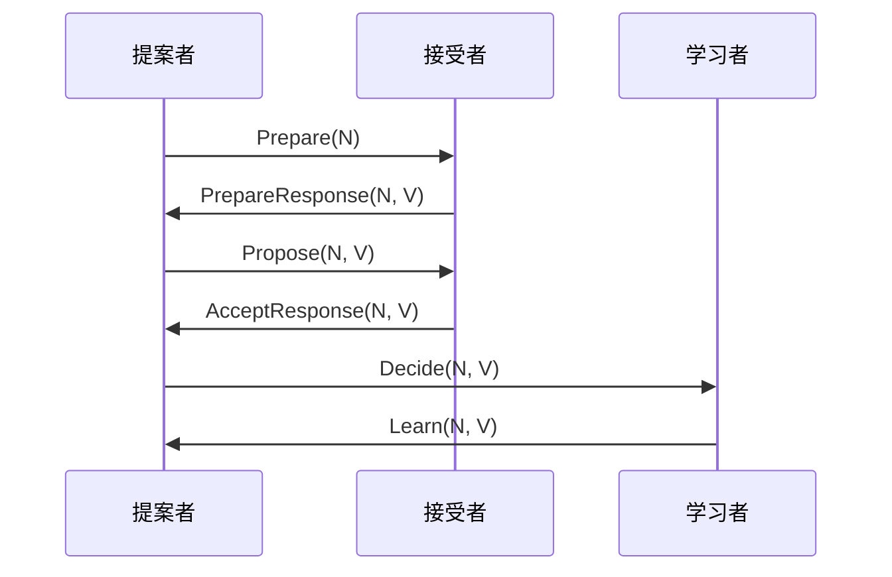
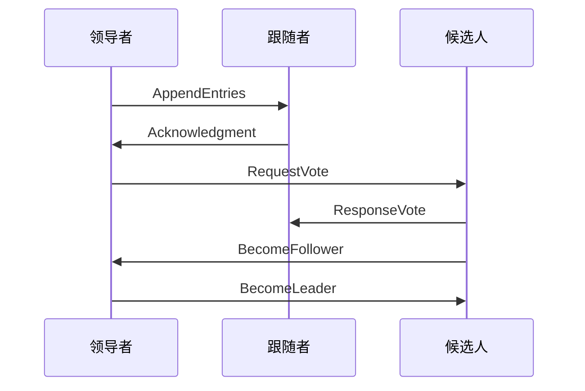
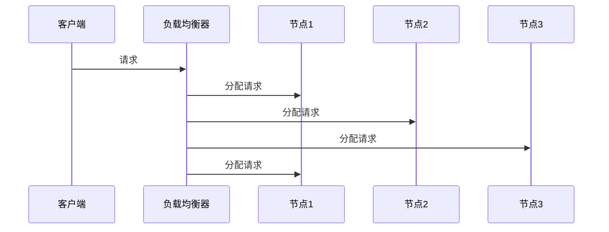
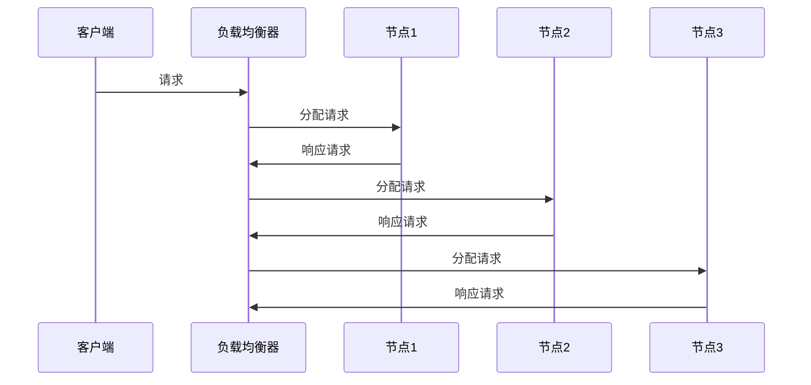
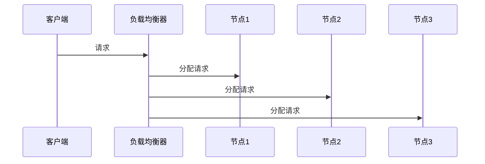

                 

### 第1章：分布式系统概述

#### 1.1 分布式系统定义与重要性

分布式系统（Distributed System）是指由多个独立的计算机节点组成，通过通信网络互联，协同工作，共享资源，共同完成复杂任务的信息系统。在这些系统中，每个节点都运行着不同的程序，相互之间通过消息传递进行通信和协调。

分布式系统的定义不仅局限于计算机硬件层面的分布，还包括软件层面的分布。这种分布不仅体现在物理位置上，还体现在功能和服务上。例如，一个分布式数据库系统可能由多个数据库服务器组成，它们在逻辑上是同一个数据库，但在物理上是分布在不同的服务器上。

分布式系统之所以重要，是因为它们具备以下几个关键优势：

- **扩展性（Scalability）**：分布式系统能够通过增加更多的节点来扩展计算能力，从而满足不断增长的用户需求和数据处理需求。

- **可用性（Availability）**：分布式系统即使某些节点出现故障，也能通过其他节点继续提供服务，保证系统的稳定性。

- **容错性（Fault Tolerance）**：分布式系统能够在部分节点故障时，自动切换到正常节点，继续提供服务。

- **灵活性（Flexibility）**：分布式系统可以根据不同的需求和场景，灵活地调整系统架构和资源配置。

#### 1.2 分布式系统面临的挑战

构建高性能的分布式系统并非易事，它面临诸多挑战：

- **一致性（Consistency）**：如何确保分布式系统中的数据在不同节点间保持一致，是一个重要的挑战。

- **可用性（Availability）**：在分布式系统中，如何保证系统的高可用性，即使在部分节点故障时也能正常服务。

- **分区容错性（Partition Tolerance）**：如何处理节点间的网络分区，确保系统能够在分区情况下继续运行。

- **性能优化（Performance Optimization）**：如何优化系统性能，降低延迟，提高吞吐量。

- **安全性（Security）**：如何保护分布式系统的数据安全和系统稳定，防范恶意攻击。

#### 1.3 为什么需要高性能分布式系统

随着互联网和云计算的快速发展，对分布式系统的需求日益增加。高性能分布式系统对于许多企业来说至关重要，原因如下：

- **满足大数据处理需求**：在当今数据爆炸的时代，高性能分布式系统能够更好地处理海量数据，满足大数据分析需求。

- **支持高并发访问**：许多应用需要支持大量用户的并发访问，高性能分布式系统能够有效应对高并发，确保系统响应速度和稳定性。

- **提高业务连续性**：通过高性能分布式系统，企业可以在发生故障时快速恢复，保证业务的连续性。

- **降低成本**：高性能分布式系统能够更好地利用现有的硬件资源，降低企业成本。

- **支持全球化业务**：高性能分布式系统能够支持全球化业务的扩展，为跨国企业提供稳定可靠的服务。

综上所述，构建高性能的分布式系统是当今信息化发展的必然趋势，也是企业提升竞争力、应对复杂业务需求的关键所在。在接下来的章节中，我们将深入探讨构建高性能分布式系统的核心概念、算法原理以及实战经验，帮助读者更好地理解和应用分布式系统技术。

#### 2.1 CAP定理

分布式系统在设计和实现过程中，不可避免地会面临多个挑战，其中最为关键的挑战之一就是如何处理一致性（Consistency）、可用性（Availability）和分区容错性（Partition Tolerance）之间的关系。这些问题通常被称为分布式系统的“CAP 定理”。CAP 定理指出，在任何分布式系统中，这三个特性不可能同时完全满足，我们只能在这三者之间做出权衡。

##### 2.1.1 CAP 定理的概念

CAP 定理是由加州大学伯克利分校的计算机科学家 Eric Brewer 于 2000 年首次提出的。它阐述了在分布式系统中一致性（Consistency）、可用性（Availability）和分区容错性（Partition Tolerance）这三个特性之间的关系，并指出在分布式系统中这三个特性是相互矛盾的，不可能同时在一个系统中完全实现。

- **一致性（Consistency）**：指系统在任何时候都能保证数据的一致性，即所有节点对数据的访问结果是一致的。

- **可用性（Availability）**：指系统能够对外提供服务的响应，即只要用户发出请求，系统就会返回响应。

- **分区容错性（Partition Tolerance）**：指系统能够在部分节点出现故障或网络分区时继续运行，确保系统的高可用性。

##### 2.1.2 CAP 定理的三个特性：一致性（Consistency）、可用性（Availability）、分区容错性（Partition Tolerance）

**一致性（Consistency）**

一致性是指系统在执行操作后，所有节点上的数据都能达到一致状态。在分布式系统中，一致性通常分为以下两种：

- **强一致性（Strong Consistency）**：在任何时候，系统中的所有节点都能访问到最新的数据状态。这意味着在进行读写操作时，系统必须保证所有节点上的数据都一致。

- **最终一致性（Eventually Consistency）**：系统中的数据最终会达到一致状态，但在某些情况下，可能会出现一段时间内的数据不一致。例如，在分布式缓存系统中，当一个节点写入数据后，其他节点可能需要一段时间才能同步到这个数据。

**可用性（Availability）**

可用性是指系统对外提供服务的响应能力。在分布式系统中，可用性通常可以分为以下两种：

- **高可用性（High Availability）**：系统在任何时候都能对外提供服务，即使在某些节点出现故障时，也能通过其他节点继续提供服务。

- **故障转移（Fault Tolerance）**：系统能够在节点故障时，自动将服务转移到其他节点，确保系统的连续性。

**分区容错性（Partition Tolerance）**

分区容错性是指系统在部分节点出现故障或网络分区时，仍能继续运行。在分布式系统中，分区容错性是确保系统高可用性的关键因素。

- **分区（Partition）**：当网络发生故障时，系统中的节点可能会被分成多个分区，每个分区内的节点可以相互通信，但分区之间的节点无法通信。

- **容错（Fault Tolerance）**：系统在分区情况下仍能继续运行，即使在某些节点出现故障时，也能通过其他节点继续提供服务。

##### 2.1.3 CAP 定理的权衡

CAP 定理表明，在分布式系统中，一致性、可用性和分区容错性三者之间是相互矛盾的，无法同时完全满足。具体来说：

- **CA 系统**：在 CA 系统中，系统保证了强一致性和可用性，但无法容忍分区。这意味着，一旦系统发生网络分区，整个系统将无法继续提供服务。

- **CP 系统**：在 CP 系统中，系统保证了强一致性和分区容错性，但无法保证可用性。这意味着，在系统发生网络分区时，系统可能会暂时无法提供服务，直到分区被解决。

- **AP 系统**：在 AP 系统中，系统保证了可用性和分区容错性，但无法保证一致性。这意味着，在系统发生网络分区时，系统仍能继续提供服务，但可能存在数据不一致的情况。

在实际应用中，系统设计者需要根据具体需求和场景，在一致性、可用性和分区容错性之间做出权衡，选择最合适的系统架构。

在下一章节中，我们将继续探讨分布式系统中的其他核心概念，包括数据一致性模型、负载均衡、分布式锁和分布式存储等，帮助读者更全面地了解分布式系统的构建方法。

#### 2.2 数据一致性模型

在分布式系统中，数据一致性是确保系统可靠性和正确性的关键因素。数据一致性模型定义了分布式系统中数据状态变化的规则，以及如何在不同节点之间同步数据。常见的两种数据一致性模型是强一致性（Strong Consistency）和最终一致性（Eventually Consistency）。

##### 2.2.1 强一致性

强一致性要求分布式系统中所有节点在任何时候都能访问到最新的数据状态，即所有节点的数据都是一致的。在强一致性模型中，通常有以下两种一致性保证方法：

- **强制同步**：当节点 A 写入数据后，会立即强制通知其他节点同步数据，确保所有节点上的数据一致。这种方法能够确保数据的强一致性，但可能会引入较高的延迟。

- **版本控制**：节点在写入数据时，会为数据添加一个版本号，当其他节点读取数据时，可以根据版本号判断数据是否是最新的。如果版本号不一致，节点会尝试从其他节点获取最新的数据。这种方法在保证数据一致性的同时，能够减少同步的频率，降低延迟。

**优缺点分析**：

- **优点**：强一致性能够确保系统在任何时刻都能访问到最新的数据，数据的一致性得到充分保障。

- **缺点**：强一致性可能会引入较高的延迟，特别是在数据写入和同步过程中。此外，当系统发生网络分区时，可能会导致整个系统无法继续提供服务。

##### 2.2.2 最终一致性

最终一致性是指系统中的数据最终会达到一致状态，但在某些情况下，可能会出现一段时间内的数据不一致。在最终一致性模型中，不同节点之间的数据同步是异步的，通常有以下几种实现方法：

- **事件驱动同步**：当节点发生数据变化时，会触发一个事件，通知其他节点同步数据。这种方法能够确保最终一致性，但同步的时机和频率可能无法精确控制。

- **时间戳同步**：每个数据条目都包含一个时间戳，节点在读取数据时，会根据时间戳判断数据是否是最新的。如果时间戳不一致，节点会尝试从其他节点获取最新的数据。这种方法能够降低同步的频率，提高系统性能。

**优缺点分析**：

- **优点**：最终一致性能够降低同步的频率，减少延迟，提高系统性能。在分布式系统中，最终一致性更加适合处理高并发和大数据场景。

- **缺点**：最终一致性可能会出现一段时间内的数据不一致，对于某些业务场景，这种不一致性可能会影响系统的正确性和可靠性。

##### 2.2.3 一致性模型的权衡

在实际应用中，系统设计者需要在强一致性和最终一致性之间做出权衡，选择最适合的一致性模型。以下是一些常见的权衡因素：

- **数据访问模式**：如果系统主要进行读操作，可以选择强一致性模型，确保数据的准确性和一致性。如果系统主要进行写操作，可以选择最终一致性模型，提高系统的性能和可扩展性。

- **延迟和性能**：强一致性可能会引入较高的延迟，而最终一致性能够降低延迟，提高系统性能。

- **容错性和分区处理**：强一致性在发生网络分区时，可能会导致整个系统无法继续提供服务。最终一致性在分区情况下，仍能继续提供服务，但可能存在数据不一致的情况。

综上所述，选择合适的数据一致性模型是构建高性能分布式系统的关键之一。在下一章节中，我们将继续探讨负载均衡、分布式锁和分布式存储等核心概念，帮助读者更全面地了解分布式系统的构建方法。

#### 2.3 负载均衡

在分布式系统中，负载均衡是一个关键组件，它负责将用户的请求合理地分配到多个节点上，从而确保系统的高性能和高可用性。负载均衡不仅能够提高系统的吞吐量，还能够优化资源利用率，降低单个节点的负载压力。

##### 2.3.1 负载均衡的概念

负载均衡（Load Balancing）是指通过将请求分配到多个节点上，实现工作负载的合理分配。负载均衡的主要目标是：

- **提高系统吞吐量**：通过将请求分配到多个节点，能够充分利用系统资源，提高整体处理能力。

- **降低单个节点的负载**：通过将请求分散到多个节点，可以避免单个节点过载，提高系统的稳定性和可靠性。

- **提高系统可用性**：通过在节点间实现负载均衡，当一个节点出现故障时，其他节点可以继续提供服务，确保系统的可用性。

##### 2.3.2 负载均衡算法

负载均衡算法是决定如何将请求分配到各个节点的方法。常见的负载均衡算法有：

1. **轮询算法（Round Robin）**

轮询算法是最简单的负载均衡算法，它按照顺序将请求分配到各个节点。每次请求都依次分配给下一个节点，直到回到起始节点。

**优势**：

- **简单易实现**：轮询算法的实现相对简单，易于理解和维护。

- **公平性**：轮询算法能够公平地分配请求，每个节点都有相同的机会处理请求。

**劣势**：

- **不灵活**：轮询算法无法根据节点的实际负载情况动态调整请求分配。

2. **最小连接数算法（Least Connections）**

最小连接数算法将请求分配到当前连接数最少的节点。这种方法能够将新的请求优先分配到负载较低的节点上，从而优化资源利用率。

**优势**：

- **负载均衡**：最小连接数算法能够根据节点的实际负载情况，动态调整请求分配，提高系统的整体性能。

**劣势**：

- **复杂度较高**：需要不断维护节点的连接数信息，实现相对复杂。

3. **响应时间算法（Response Time）**

响应时间算法将请求分配到响应时间最短的节点。这种方法能够根据节点的性能情况，优先选择性能较好的节点处理请求。

**优势**：

- **性能优化**：响应时间算法能够根据节点的性能，优化请求分配，提高系统的响应速度。

**劣势**：

- **实现复杂度较高**：需要实时获取节点的响应时间信息，并动态调整请求分配。

4. **加权轮询算法（Weighted Round Robin）**

加权轮询算法是对轮询算法的改进，它根据节点的权重（例如，处理能力、资源容量等）来分配请求。权重较高的节点会承担更多的请求。

**优势**：

- **资源利用率**：通过根据节点的权重分配请求，能够更好地利用系统资源。

**劣势**：

- **配置管理**：需要动态调整节点的权重配置，实现和管理相对复杂。

##### 2.3.3 负载均衡的实现机制

负载均衡可以通过多种机制实现，常见的实现机制有：

- **硬件负载均衡器**：硬件负载均衡器是一种物理设备，专门用于处理网络流量分配。它通常具备较高的性能和可靠性，但成本较高。

- **软件负载均衡器**：软件负载均衡器通过在服务器上运行的软件实现负载均衡。常见的软件负载均衡器有 Nginx、HAProxy 等，它们通常具备较低的部署成本和较高的灵活性。

- **容器化负载均衡**：随着容器技术的兴起，Kubernetes 等容器编排系统内置了负载均衡功能。通过容器化负载均衡，能够更好地利用容器集群的资源，实现灵活的负载均衡。

在实际应用中，系统设计者可以根据具体需求，选择适合的负载均衡算法和实现机制，构建高性能的分布式系统。

在下一章节中，我们将继续探讨分布式系统中的分布式锁、分布式存储等核心概念，帮助读者更全面地了解分布式系统的构建方法。

#### 2.4 分布式锁

在分布式系统中，分布式锁是一种常见的同步机制，用于确保多个节点在操作共享资源时，不会出现并发冲突。分布式锁能够保证数据的一致性和可靠性，避免多个节点同时修改同一数据时导致的冲突。

##### 2.4.1 分布式锁的概念

分布式锁（Distributed Lock）是一种锁机制，用于在分布式环境中确保资源的互斥访问。分布式锁的主要目标是：

- **防止并发冲突**：在分布式系统中，多个节点可能会同时访问和修改同一资源，分布式锁能够确保同一时间只有一个节点能够访问资源。

- **保证数据一致性**：通过分布式锁，可以防止多个节点同时修改同一数据，从而避免数据不一致的问题。

分布式锁通常具有以下特点：

- **互斥性**：分布式锁能够确保同一时间只有一个节点能够访问共享资源。

- **可重入性**：分布式锁允许一个节点在持有锁的情况下再次获取锁，从而保证操作的连续性。

- **自动释放**：分布式锁在锁定资源后，会自动释放锁，确保资源能够被其他节点访问。

##### 2.4.2 分布式锁的实现机制

分布式锁的实现机制通常依赖于以下几种技术：

1. **基于数据库的分布式锁**

基于数据库的分布式锁通过在数据库中创建锁表，实现锁的获取和释放。当节点需要获取锁时，会在锁表中插入一条记录；当节点释放锁时，会删除锁表中的记录。

**实现机制**：

- **锁表**：创建一个锁表，记录所有已获取的锁。

- **获取锁**：当节点需要获取锁时，会在锁表中插入一条记录，表示已获取锁。

- **释放锁**：当节点释放锁时，会从锁表中删除对应的记录。

**优缺点分析**：

- **优点**：实现简单，易于理解。数据库作为强一致性存储，能够确保锁的一致性和可靠性。

- **缺点**：锁表可能成为系统的性能瓶颈，特别是在高并发场景下，锁表的写入和读取操作可能会引入较高的延迟。

2. **基于 Redis 的分布式锁**

Redis 是一种常用的分布式锁实现技术，通过 Redis 的原子操作（如 `SETNX`）来实现锁的获取和释放。

**实现机制**：

- **锁键**：使用 Redis 中的键（Key）作为锁，锁的名称通常由资源名和锁类型组成。

- **获取锁**：使用 `SETNX` 命令尝试创建锁键，如果成功返回 1，表示获取锁成功；如果失败返回 0，表示锁已被其他节点获取。

- **释放锁**：使用 `DEL` 命令删除锁键，释放锁。

**优缺点分析**：

- **优点**：Redis 作为高性能的分布式缓存系统，具备较高的性能和可扩展性，适合高并发场景。

- **缺点**：Redis 的持久化策略可能会影响锁的可靠性，需要根据业务需求选择合适的持久化策略。

3. **基于 ZAB 协议的分布式锁**

ZAB（ZooKeeper Atomic Broadcast）协议是一种基于 ZooKeeper 的分布式锁实现技术，通过 ZooKeeper 的临时节点和监听机制来实现锁的获取和释放。

**实现机制**：

- **锁节点**：创建一个临时顺序节点，节点的名称通常由资源名和锁类型组成。

- **获取锁**：创建临时顺序节点，如果该节点的序号最小，则表示获取锁成功；否则，等待其他节点释放锁。

- **释放锁**：删除临时顺序节点，释放锁。

**优缺点分析**：

- **优点**：ZooKeeper 具备高可用性和一致性，适合高并发和分布式环境。

- **缺点**：ZooKeeper 的性能和可扩展性相对较低，不适合处理海量数据和高并发场景。

在实际应用中，系统设计者可以根据具体需求，选择适合的分布式锁实现技术，构建高性能、高可靠的分布式系统。

在下一章节中，我们将继续探讨分布式存储的核心概念和技术，帮助读者更全面地了解分布式系统的构建方法。

#### 2.5 分布式存储

分布式存储是分布式系统中一个重要的组成部分，它通过将数据分散存储在多个节点上，实现数据的高可用性、高性能和可扩展性。分布式存储系统能够处理海量数据，支持高并发访问，并且具备自动故障转移和负载均衡的能力。

##### 2.5.1 分布式存储的概念

分布式存储（Distributed Storage）是指将数据分布在多个节点上进行存储和管理的技术。在分布式存储系统中，数据被分散存储在多个节点上，从而实现数据的高可用性和高性能。分布式存储系统的关键特性包括：

- **数据分片（Sharding）**：将数据分割成多个分片，存储在不同的节点上。这样可以提高数据的访问速度和系统的扩展能力。

- **数据复制（Replication）**：将数据复制到多个节点上，以实现数据的高可用性和容错性。在节点故障时，其他节点可以继续提供服务。

- **负载均衡（Load Balancing）**：通过将请求分配到不同的节点，实现系统的负载均衡，提高系统的性能和可扩展性。

- **自动故障转移（Automatic Failover）**：当某个节点发生故障时，系统能够自动将请求转移到其他健康的节点，确保系统的连续性。

##### 2.5.2 分布式存储的关键技术

分布式存储系统涉及多种关键技术，下面介绍其中几个重要的技术：

1. **数据分片**

数据分片是将数据分割成多个部分，存储在不同的节点上。数据分片的方法主要有以下几种：

- **哈希分片（Hash Sharding）**：根据数据的哈希值，将数据分配到不同的节点。这种方法能够实现数据的均匀分布，提高系统的性能。

- **范围分片（Range Sharding）**：根据数据的范围，将数据分配到不同的节点。例如，可以将数据按时间戳、ID 等范围进行分片。这种方法适合处理顺序数据。

- **列表分片（List Sharding）**：根据节点的列表，将数据分配到不同的节点。这种方法通常用于动态调整节点数量，提高系统的可扩展性。

2. **数据复制**

数据复制是将数据复制到多个节点上，以实现数据的高可用性和容错性。常用的数据复制策略包括：

- **主从复制（Master-Slave Replication）**：主节点负责数据的写入和读取，从节点负责数据的备份。当主节点发生故障时，从节点可以自动升级为主节点，继续提供服务。

- **多主复制（Multi-Master Replication）**：多个主节点都可以进行数据的写入和读取。在多主复制中，需要实现数据的冲突检测和解决机制，以确保数据的一致性。

3. **负载均衡**

负载均衡是分布式存储系统中的重要技术，通过将请求分配到不同的节点，实现系统的负载均衡。常用的负载均衡算法包括：

- **轮询算法（Round Robin）**：按照顺序将请求分配到不同的节点。

- **最小连接数算法（Least Connections）**：将请求分配到当前连接数最少的节点。

- **响应时间算法（Response Time）**：将请求分配到响应时间最短的节点。

4. **数据一致性**

数据一致性是分布式存储系统中的一个重要问题。常用的数据一致性策略包括：

- **强一致性（Strong Consistency）**：所有节点在任何时候都能访问到最新的数据。

- **最终一致性（Eventually Consistency）**：系统中的数据最终会达到一致状态，但在某些情况下，可能会出现一段时间内的数据不一致。

5. **自动故障转移**

自动故障转移是分布式存储系统中的重要功能，通过在节点发生故障时，自动将请求转移到其他健康的节点，确保系统的连续性。实现自动故障转移的关键技术包括：

- **心跳检测**：定期检测节点的健康状态。

- **选举算法**：在节点故障时，选举新的主节点。

- **故障恢复**：在故障节点恢复后，重新加入系统。

在实际应用中，分布式存储系统需要综合考虑数据分片、数据复制、负载均衡、数据一致性和自动故障转移等技术，构建高性能、高可靠的分布式存储系统。

在下一章节中，我们将介绍数据一致性算法，包括 Paxos 算法和 Raft 算法，帮助读者深入理解分布式系统中的数据一致性机制。

#### 3.1 数据一致性算法

在分布式系统中，数据一致性是确保系统可靠性和正确性的关键因素。为了实现分布式系统中的数据一致性，常用的数据一致性算法包括 Paxos 算法和 Raft 算法。这两种算法都是基于分布式一致性理论，通过一系列协议和机制，确保分布式系统中多个节点之间的数据一致性。

##### 3.1.1 Paxos算法

Paxos 算法是由 Leslie Lamport 于 1990 年提出的一种分布式一致性算法，它能够保证分布式系统中多个节点对某个值达成一致。Paxos 算法的基本思想是通过一个称为“提案者”（Proposer）、“接受者”（Acceptor）和“学习者”（Learner）的角色，实现分布式一致性。

**Paxos算法原理**

Paxos算法的核心原理是“多数派原则”，即一个提案只有在获得超过半数接受者的接受后，才能被认为是最终结果。Paxos算法的主要过程包括以下几步：

1. **准备阶段（Prepare Phase）**

   提案者向接受者发送一个“准备请求”（Prepare Request），请求编号为 `N`。接受者在收到准备请求后，会回复一个“准备响应”（Prepare Response），承诺不再接受小于 `N` 的提案。

2. **提案阶段（Propose Phase）**

   提案者在收到大多数（超过半数）接受者的准备响应后，可以发送一个“提案请求”（Propose Request），请求编号为 `N`，值由提案者决定。如果接受者收到提案请求，会将其记录为当前提案，并向提案者发送“接受响应”（Accept Response）。

3. **决定阶段（Decide Phase）**

   提案者在收到大多数（超过半数）接受者的接受响应后，可以决定该提案为最终结果。然后，提案者向所有学习者发送“决定消息”（Decide Message），通知学习者记录该最终结果。

**Paxos算法Mermaid流程图**



**Paxos算法Python源代码示例**

```python
class Paxos:
    def __init__(self, proposers, acceptors, learners):
        self.proposers = proposers
        self.acceptors = acceptors
        self.learners = learners

    def prepare(self, round):
        proposals = [proposer.prepare(round) for proposer in self.proposers]
        accepted = [proposer.accept(round) for proposer in self.proposers]
        return proposals, accepted

    def propose(self, value):
        round = self.next_round()
        proposals, accepted = self.prepare(round)
        for proposer in self.proposers:
            proposer.propose(value, proposals, accepted)
        return round

    def decide(self, round, value):
        for learner in self.learners:
            learner.learn(round, value)

    def next_round(self):
        return max([proposer.current_round() for proposer in self.proposers]) + 1
```

**Paxos算法应用举例**

假设一个分布式系统中，有三个提案者（Proposer A、Proposer B 和 Proposer C）、三个接受者（Acceptor X、Acceptor Y 和 Acceptor Z）和三个学习者（Learner 1、Learner 2 和 Learner 3）。首先，提案者 A 向接受者发送准备请求，请求编号为 1。接受者收到请求后，回复准备响应。接着，提案者 A 向接受者发送提案请求，值为 100。接受者收到请求后，回复接受响应。最后，提案者 A 向学习者发送决定消息，值为 100。

##### 3.1.2 Raft算法

Raft 算法是由 Diego Ongaro 和 John Ousterhout 于 2013 年提出的一种分布式一致性算法，它与 Paxos 算法类似，但相对于 Paxos 算法，Raft 算法更易于理解和实现。

**Raft算法原理**

Raft 算法将分布式一致性过程分为三个主要部分：日志复制、领导选举和状态机。Raft 算法的主要角色包括领导者（Leader）、跟随者（Follower）和候选人（Candidate）。

1. **日志复制**

   日志复制是 Raft 算法的关键功能，它确保分布式系统中多个节点的日志（Log）保持一致。日志复制的过程如下：

   - **提交日志**：领导者将日志条目发送给跟随者，跟随者接收日志条目后，将其追加到本地日志中。

   - **提交确认**：跟随者将已接收的日志条目返回给领导者，领导者收到确认后，更新本地状态机。

2. **领导选举**

   当领导者故障时，系统需要通过领导选举过程选出新的领导者。领导选举的过程如下：

   - **发起选举**：当跟随者发现领导者故障后，发起选举请求。

   - **投票**：候选人向其他节点发送投票请求，如果获得超过半数的投票，则成为新的领导者。

   - **确认**：新的领导者将心跳消息发送给其他节点，确认其领导地位。

3. **状态机**

   状态机是分布式系统中的核心部分，它根据日志条目更新系统状态。Raft 算法通过日志复制确保状态机在各个节点上保持一致。

**Raft算法Mermaid流程图**



**Raft算法Python源代码示例**

```python
class Raft:
    def __init__(self, nodes):
        self.nodes = nodes
        self.leader = None

    def start_election(self):
        self.leader = self
        self.send_request_vote()

    def send_request_vote(self):
        for node in self.nodes:
            if node != self:
                node.request_vote(self)

    def request_vote(self, candidate):
        if self.is_voted() or self.is_leader():
            return
        self.vote_for(candidate)
        self.send_response_vote(candidate)

    def send_response_vote(self, candidate):
        for node in self.nodes:
            if node != self and node != candidate:
                node.respond_vote(candidate)

    def become_leader(self):
        self.leader = self

    def append_entries(self):
        for node in self.nodes:
            if node != self:
                node.append_entries()

    def append_entries_response(self):
        for node in self.nodes:
            if node != self:
                node.acknowledgment()

    def is_voted(self):
        return self.voted

    def vote_for(self, candidate):
        self.voted = candidate

    def respond_vote(self, candidate):
        if self.voted == candidate:
            self.accept_vote(candidate)
        else:
            self.reject_vote(candidate)

    def is_leader(self):
        return self.leader == self

    def accept_vote(self, candidate):
        self.voted = candidate
        self.become_leader()

    def reject_vote(self, candidate):
        self.voted = None

    def acknowledgment(self):
        pass
```

**Raft算法应用举例**

假设一个分布式系统中，有三个节点（Node A、Node B 和 Node C）。首先，节点 A 开始领导选举过程，发送请求投票消息给节点 B 和节点 C。节点 B 和节点 C 收到请求投票消息后，返回响应投票消息。节点 B 和节点 C 的投票结果为多数派，因此节点 A 成为了新的领导者。接着，领导者节点 A 向其他节点发送心跳消息，确认其领导地位。随后，节点 A 向其他节点发送日志条目，其他节点接收日志条目后，将其追加到本地日志中，并返回确认消息。通过这样的过程，确保分布式系统中多个节点的日志保持一致。

综上所述，Paxos 算法和 Raft 算法都是分布式系统中常用的数据一致性算法。Paxos 算法通过提案者、接受者和学习者的角色，实现分布式一致性；Raft 算法通过领导者、跟随者和候选人的角色，简化了分布式一致性过程。在实际应用中，系统设计者可以根据具体需求和场景，选择适合的数据一致性算法，构建高性能、高可靠的分布式系统。

#### 3.2 负载均衡算法

负载均衡是分布式系统中至关重要的一环，它能够将用户请求合理地分配到多个节点上，确保系统的性能和可用性。负载均衡算法有多种实现方式，下面我们将介绍几种常见的负载均衡算法，并详细讲解它们的原理和实现方法。

##### 3.2.1 轮询算法

轮询算法是最简单的负载均衡算法，它按照顺序将请求分配到各个节点。每次请求都依次分配给下一个节点，直到回到起始节点。轮询算法的实现相对简单，易于理解和维护。

**轮询算法原理**

轮询算法的工作原理如下：

1. 初始化一个计数器，用于记录当前应该分配请求的节点索引。

2. 每当有请求到达时，将计数器加 1，并根据计数器的值，将请求分配给对应的节点。

3. 当计数器达到节点总数时，将其重置为 0，继续分配请求。

**轮询算法Mermaid流程图**



**轮询算法Python源代码示例**

```python
def round_robin_load_balancer(nodes):
    current_node_index = 0
    num_nodes = len(nodes)

    while True:
        current_node = nodes[current_node_index]
        yield current_node
        current_node_index = (current_node_index + 1) % num_nodes

nodes = ['Node1', 'Node2', 'Node3']
load_balancer = round_robin_load_balancer(nodes)

for node in load_balancer:
    print(f"请求分配给 {node}")
```

**轮询算法优缺点分析**

- **优点**：实现简单，易于理解和维护。公平地分配请求，每个节点都有相同的机会处理请求。

- **缺点**：不适用于动态负载情况，无法根据节点的实际负载情况动态调整请求分配。当某些节点负载较重时，可能会导致请求分配不均。

##### 3.2.2 最少连接数算法

最少连接数算法（Least Connections）将请求分配到当前连接数最少的节点。这种方法能够将新的请求优先分配到负载较低的节点上，从而优化资源利用率。

**最少连接数算法原理**

最少连接数算法的工作原理如下：

1. 初始化一个连接数统计表，用于记录每个节点的当前连接数。

2. 每当有请求到达时，遍历连接数统计表，找到当前连接数最少的节点，将请求分配给该节点。

3. 节点在处理完请求后，将其连接数加 1；在断开连接后，将其连接数减 1。

**最少连接数算法Mermaid流程图**



**最少连接数算法Python源代码示例**

```python
from collections import defaultdict

def least_connections_load_balancer(nodes):
    connection_counts = defaultdict(int)

    while True:
        min_connections = min(connection_counts.values())
        min_nodes = [node for node, count in connection_counts.items() if count == min_connections]

        node = random.choice(min_nodes)
        connection_counts[node] += 1
        yield node

nodes = ['Node1', 'Node2', 'Node3']
load_balancer = least_connections_load_balancer(nodes)

for node in load_balancer:
    print(f"请求分配给 {node}")
```

**最少连接数算法优缺点分析**

- **优点**：能够根据节点的实际负载情况动态调整请求分配，优化资源利用率。

- **缺点**：实现相对复杂，需要维护节点的连接数信息。当节点数量较多时，连接数信息的维护可能会引入较高的延迟。

##### 3.2.3 哈希算法

哈希算法（Hash-based Load Balancing）通过哈希函数将请求分配到不同的节点。这种方法能够确保请求分配的均匀性，提高系统的性能。

**哈希算法原理**

哈希算法的工作原理如下：

1. 初始化一个哈希表，用于存储节点的哈希值。

2. 每当有请求到达时，计算请求的哈希值，并将请求分配给哈希值对应的节点。

**哈希算法Mermaid流程图**



**哈希算法Python源代码示例**

```python
def hash_load_balancer(nodes, hash_function):
    node_hashes = {node: hash_function(node) for node in nodes}

    while True:
        request = yield
        node_hash = hash_function(request)
        node = node_hashes[node_hash]
        yield node

nodes = ['Node1', 'Node2', 'Node3']
hash_function = lambda node: hash(node)
load_balancer = hash_load_balancer(nodes, hash_function)

for request in load_balancer:
    print(f"请求分配给 {request}")
```

**哈希算法优缺点分析**

- **优点**：实现简单，能够确保请求分配的均匀性。适用于节点数量较少的场景。

- **缺点**：当节点数量较多时，哈希表可能会成为性能瓶颈。需要处理哈希冲突，引入额外的复杂性。

##### 3.2.4 加权轮询算法

加权轮询算法（Weighted Round Robin）是对轮询算法的改进，它根据节点的权重（例如，处理能力、资源容量等）来分配请求。权重较高的节点会承担更多的请求。

**加权轮询算法原理**

加权轮询算法的工作原理如下：

1. 初始化一个权重表，用于记录每个节点的权重。

2. 每当有请求到达时，计算总权重，并根据节点的权重比例，将请求分配给对应的节点。

**加权轮询算法Mermaid流程图**


**加权轮询算法Python源代码示例**

```python
def weighted_round_robin_load_balancer(nodes, weights):
    current_node_index = 0
    total_weight = sum(weights)
    node_weights = {node: weight / total_weight for node, weight in zip(nodes, weights)}

    while True:
        current_node = nodes[current_node_index]
        yield current_node
        current_node_index = (current_node_index + 1) % len(nodes)

nodes = ['Node1', 'Node2', 'Node3']
weights = [2, 1, 1]
load_balancer = weighted_round_robin_load_balancer(nodes, weights)

for node in load_balancer:
    print(f"请求分配给 {node}")
```

**加权轮询算法优缺点分析**

- **优点**：能够根据节点的权重动态调整请求分配，优化资源利用率。

- **缺点**：实现相对复杂，需要维护节点的权重信息。当节点数量较多时，权重信息的维护可能会引入较高的延迟。

综上所述，负载均衡算法有多种实现方式，包括轮询算法、最少连接数算法、哈希算法和加权轮询算法。系统设计者可以根据具体需求和场景，选择适合的负载均衡算法，构建高性能、高可用的分布式系统。

#### 4.1 问题场景介绍

在当今互联网时代，随着用户数量的激增和数据量的爆炸性增长，企业对分布式系统的需求日益迫切。以一个电子商务平台为例，该平台需要支持海量用户同时在线购物，处理大量并发请求。此外，平台还需要具备高可用性和高扩展性，以应对可能的节点故障和数据流量高峰。

在这种问题场景下，构建一个高性能的分布式系统是关键所在。具体问题场景如下：

- **海量并发请求**：电子商务平台需要处理数以万计的用户并发请求，每个请求可能涉及购物车操作、订单处理、库存管理等多个子系统。

- **高可用性要求**：平台必须保证 7x24 小时不停机，即使部分节点出现故障，系统也能自动恢复，确保用户不会受到太大影响。

- **数据一致性**：系统中的数据需要保持一致性，例如，当用户下单时，库存量需要实时更新，确保用户看到的数据是准确的。

- **扩展性**：平台需要能够轻松扩展，以应对未来用户量和数据量的增长，通过横向扩展增加节点，提高系统处理能力。

- **性能优化**：系统需要具备高性能，降低延迟，提高用户体验，确保快速响应用户请求。

- **安全性**：平台需要确保数据安全和系统稳定，防止恶意攻击和数据泄露。

在这种复杂的问题场景下，构建一个高性能的分布式系统是一个巨大的挑战，需要综合考虑数据一致性、负载均衡、分布式锁、分布式存储等技术，确保系统能够高效、稳定地运行。

#### 4.2 项目介绍

为了解决上述问题场景，我们选择构建一个分布式电子商务平台，该项目具备以下特点和目标：

1. **项目特点**：

   - **高并发处理能力**：通过分布式架构，实现海量并发请求的处理，确保系统性能和响应速度。

   - **高可用性**：通过负载均衡和分布式锁技术，确保系统的高可用性，即使部分节点故障，也能自动切换到健康节点，保证系统正常运行。

   - **数据一致性**：采用数据一致性算法（如 Paxos 和 Raft），确保系统中的数据在不同节点之间保持一致，避免数据冲突。

   - **可扩展性**：通过分布式存储和负载均衡，实现系统的水平扩展，支持未来用户量和数据量的增长。

   - **高性能**：通过优化算法和系统架构，降低系统延迟，提高用户响应速度和系统吞吐量。

   - **安全性**：采用加密技术和权限控制，确保系统数据的安全性和稳定性。

2. **项目目标**：

   - **满足海量并发请求**：确保系统能够高效处理数以万计的并发请求，保证用户体验。

   - **保证高可用性**：在节点故障时，系统能够自动恢复，确保业务的连续性。

   - **数据一致性保障**：确保系统中的数据在不同节点之间保持一致，避免数据冲突。

   - **系统扩展性**：实现系统横向扩展，支持未来用户量和数据量的增长。

   - **提高系统性能**：通过优化算法和系统架构，提高系统吞吐量和响应速度。

   - **保障数据安全**：采用加密和权限控制，确保系统数据的安全性和稳定性。

通过该项目，我们希望能够为企业提供一个高性能、高可用、可扩展的分布式电子商务平台，满足当前和未来的业务需求，提高企业的市场竞争力。

#### 4.3 系统功能设计

系统功能设计是构建高性能分布式系统的关键步骤之一。通过定义系统功能，我们可以明确各个模块的职责和接口，确保系统的高效运行。下面我们将使用 Mermaid 类图来展示系统功能设计。

##### 4.3.1 领域模型Mermaid类图

```mermaid
classDiagram
    Client >> Client: 发起请求
    API Gateway << Interface: 转发请求
    Service A << Interface: 处理购物车操作
    Service B << Interface: 处理订单处理
    Service C << Interface: 处理库存管理
    Database << Interface: 存储数据
    Load Balancer << Interface: 负载均衡
    Distributed Lock << Interface: 分布式锁
    Data Consistency << Interface: 数据一致性
    Security << Interface: 加密和权限控制

    Client ..|> API Gateway
    API Gateway ..|> Service A
    API Gateway ..|> Service B
    API Gateway ..|> Service C
    Service A ..|> Database
    Service B ..|> Database
    Service C ..|> Database
    Load Balancer ..|> Service A
    Load Balancer ..|> Service B
    Load Balancer ..|> Service C
    Distributed Lock ..|> Service A
    Distributed Lock ..|> Service B
    Distributed Lock ..|> Service C
    Data Consistency ..|> Service A
    Data Consistency ..|> Service B
    Data Consistency ..|> Service C
    Security ..|> API Gateway
    Security ..|> Service A
    Security ..|> Service B
    Security ..|> Service C
```

**领域模型解释**：

- **Client（客户端）**：客户端发起请求，通过 API Gateway 转发到相应的服务。

- **API Gateway（API网关）**：作为系统的入口，负责将客户端请求转发到具体的服务模块，实现统一的接口管理和路由功能。

- **Service A（购物车服务）**：处理购物车操作，包括添加商品、删除商品、更新商品数量等。

- **Service B（订单处理服务）**：处理订单的创建、更新、取消等操作。

- **Service C（库存管理服务）**：管理库存信息，包括库存的增减、库存量的实时更新等。

- **Database（数据库）**：存储系统的数据，包括用户信息、购物车数据、订单数据、库存数据等。

- **Load Balancer（负载均衡器）**：实现负载均衡，将请求分配到不同的服务模块，确保系统的性能和可用性。

- **Distributed Lock（分布式锁）**：在分布式环境下，确保对共享资源的互斥访问，防止并发冲突。

- **Data Consistency（数据一致性）**：通过一致性算法，确保系统中的数据在不同节点之间保持一致。

- **Security（安全模块）**：实现加密和权限控制，确保系统数据的安全性和稳定性。

通过上述领域模型，我们可以清晰地了解系统各个模块的职责和接口，确保系统的高效设计和实现。

#### 4.4 系统架构设计

系统架构设计是构建高性能分布式系统的关键步骤之一。通过合理的系统架构设计，可以确保系统的高性能、高可用性和可扩展性。下面我们将使用 Mermaid 架构图来展示系统架构设计。

##### 4.4.1 系统架构设计Mermaid架构图

```mermaid
sequenceDiagram
    participant Client as 客户端
    participant API Gateway as API网关
    participant Load Balancer as 负载均衡器
    participant Service A as 购物车服务
    participant Service B as 订单处理服务
    participant Service C as 库存管理服务
    participant Database as 数据库
    participant Distributed Lock as 分布式锁
    participant Data Consistency as 数据一致性
    participant Security as 安全模块

    Client->>API Gateway: 发起请求
    API Gateway->>Load Balancer: 转发请求
    Load Balancer->>Service A: 分配请求
    Service A->>Distributed Lock: 获取锁
    Distributed Lock->>Service A: 执行操作
    Service A->>Data Consistency: 更新一致性
    Service A->>Database: 更新数据库
    Service A->>Security: 加密数据
    Service A->>API Gateway: 响应结果
    API Gateway->>Client: 返回结果

    Note over Load Balancer,Service B,Service C
        Load Balancer 会根据需求分配请求到 Service B 和 Service C
    End Note

    Load Balancer->>Service B: 分配请求
    Service B->>Distributed Lock: 获取锁
    Distributed Lock->>Service B: 执行操作
    Service B->>Data Consistency: 更新一致性
    Service B->>Database: 更新数据库
    Service B->>Security: 加密数据
    Service B->>API Gateway: 响应结果
    API Gateway->>Client: 返回结果

    Load Balancer->>Service C: 分配请求
    Service C->>Distributed Lock: 获取锁
    Distributed Lock->>Service C: 执行操作
    Service C->>Data Consistency: 更新一致性
    Service C->>Database: 更新数据库
    Service C->>Security: 加密数据
    Service C->>API Gateway: 响应结果
    API Gateway->>Client: 返回结果
```

**系统架构设计解释**：

- **客户端（Client）**：客户端发起请求，通过 API 网关（API Gateway）进行转发。

- **API网关（API Gateway）**：API 网关作为系统的入口，负责处理客户端请求，进行接口管理和路由。

- **负载均衡器（Load Balancer）**：负载均衡器负责将请求分配到不同的服务模块，确保系统的性能和可用性。

- **购物车服务（Service A）**：购物车服务处理购物车操作，如添加商品、删除商品、更新商品数量等。

- **订单处理服务（Service B）**：订单处理服务处理订单的创建、更新、取消等操作。

- **库存管理服务（Service C）**：库存管理服务管理库存信息，如库存的增减、库存量的实时更新等。

- **数据库（Database）**：数据库存储系统的数据，包括用户信息、购物车数据、订单数据、库存数据等。

- **分布式锁（Distributed Lock）**：分布式锁在分布式环境下，确保对共享资源的互斥访问，防止并发冲突。

- **数据一致性（Data Consistency）**：数据一致性模块通过一致性算法，确保系统中的数据在不同节点之间保持一致。

- **安全模块（Security）**：安全模块实现加密和权限控制，确保系统数据的安全性和稳定性。

通过上述系统架构设计，我们可以看到各个模块之间的协作关系，确保系统的高性能、高可用性和可扩展性。

#### 4.5 系统接口设计

系统接口设计是构建高性能分布式系统的重要环节之一。合理的接口设计可以确保系统模块之间的高效通信和协作。下面我们将使用 Mermaid 序列图来展示系统接口设计。

##### 4.5.1 系统接口设计Mermaid序列图

```mermaid
sequenceDiagram
    participant Client as 客户端
    participant API Gateway as API网关
    participant Service A as 购物车服务
    participant Service B as 订单处理服务
    participant Service C as 库存管理服务
    participant Database as 数据库
    participant Distributed Lock as 分布式锁
    participant Data Consistency as 数据一致性
    participant Security as 安全模块

    Client->>API Gateway: 发起请求
    API Gateway->>Distributed Lock: 获取锁
    Distributed Lock->>API Gateway: 返回锁状态
    API Gateway->>Data Consistency: 检查一致性
    Data Consistency->>API Gateway: 返回一致性状态
    API Gateway->>Service A: 转发请求
    Service A->>Database: 执行数据库操作
    Database->>Service A: 返回操作结果
    Service A->>API Gateway: 返回响应结果
    API Gateway->>Client: 返回响应结果

    Note over API Gateway,Service B
        API Gateway 将请求转发到订单处理服务
    End Note

    API Gateway->>Distributed Lock: 获取锁
    Distributed Lock->>API Gateway: 返回锁状态
    API Gateway->>Data Consistency: 检查一致性
    Data Consistency->>API Gateway: 返回一致性状态
    API Gateway->>Service B: 转发请求
    Service B->>Database: 执行数据库操作
    Database->>Service B: 返回操作结果
    Service B->>API Gateway: 返回响应结果
    API Gateway->>Client: 返回响应结果

    Note over API Gateway,Service C
        API Gateway 将请求转发到库存管理服务
    End Note

    API Gateway->>Distributed Lock: 获取锁
    Distributed Lock->>API Gateway: 返回锁状态
    API Gateway->>Data Consistency: 检查一致性
    Data Consistency->>API Gateway: 返回一致性状态
    API Gateway->>Service C: 转发请求
    Service C->>Database: 执行数据库操作
    Database->>Service C: 返回操作结果
    Service C->>API Gateway: 返回响应结果
    API Gateway->>Client: 返回响应结果
```

**系统接口设计解释**：

- **客户端（Client）**：客户端发起请求，通过 API 网关（API Gateway）进行转发。

- **API网关（API Gateway）**：API 网关作为系统的入口，负责处理客户端请求，进行接口管理和路由。在转发请求之前，API 网关会先获取分布式锁（Distributed Lock）的状态，确保对共享资源的互斥访问，然后检查数据一致性（Data Consistency），确保系统中的数据在不同节点之间保持一致。

- **分布式锁（Distributed Lock）**：分布式锁在分布式环境下，确保对共享资源的互斥访问，防止并发冲突。API 网关在转发请求之前，会尝试获取分布式锁，如果锁已被占用，则会等待锁释放。

- **数据一致性（Data Consistency）**：数据一致性模块通过一致性算法，确保系统中的数据在不同节点之间保持一致。在转发请求之前，API 网关会检查数据一致性，确保数据的一致性状态。

- **购物车服务（Service A）**：购物车服务处理购物车操作，如添加商品、删除商品、更新商品数量等。在执行数据库操作之前，购物车服务会获取分布式锁，确保对共享资源的互斥访问。

- **订单处理服务（Service B）**：订单处理服务处理订单的创建、更新、取消等操作。在执行数据库操作之前，订单处理服务会获取分布式锁，确保对共享资源的互斥访问。

- **库存管理服务（Service C）**：库存管理服务管理库存信息，如库存的增减、库存量的实时更新等。在执行数据库操作之前，库存管理服务会获取分布式锁，确保对共享资源的互斥访问。

- **数据库（Database）**：数据库存储系统的数据，包括用户信息、购物车数据、订单数据、库存数据等。系统模块在执行数据库操作时，会向数据库发送请求，并接收操作结果。

- **安全模块（Security）**：安全模块实现加密和权限控制，确保系统数据的安全性和稳定性。在数据传输过程中，安全模块会对数据进行加密处理，确保数据的安全性。

通过上述系统接口设计，我们可以清晰地看到系统模块之间的协作关系，确保系统的高效通信和协作。

#### 4.6 系统交互

在构建高性能分布式系统时，理解系统中的各个模块如何交互是非常重要的。为了更直观地展示系统交互过程，我们将使用 Mermaid 序列图来描述系统交互。

##### 4.6.1 系统交互Mermaid序列图

```mermaid
sequenceDiagram
    participant Client as 客户端
    participant API Gateway as API网关
    participant Service A as 购物车服务
    participant Service B as 订单处理服务
    participant Service C as 库存管理服务
    participant Database as 数据库
    participant Distributed Lock as 分布式锁
    participant Data Consistency as 数据一致性
    participant Security as 安全模块

    Client->>API Gateway: 发起请求
    API Gateway->>Distributed Lock: 获取锁
    Distributed Lock->>API Gateway: 返回锁状态
    API Gateway->>Data Consistency: 检查一致性
    Data Consistency->>API Gateway: 返回一致性状态
    API Gateway->>Service A: 转发请求
    Service A->>Database: 执行数据库操作
    Database->>Service A: 返回操作结果
    Service A->>API Gateway: 返回响应结果
    API Gateway->>Client: 返回响应结果

    Note over API Gateway,Service B
        API Gateway 将请求转发到订单处理服务
    End Note

    API Gateway->>Distributed Lock: 获取锁
    Distributed Lock->>API Gateway: 返回锁状态
    API Gateway->>Data Consistency: 检查一致性
    Data Consistency->>API Gateway: 返回一致性状态
    API Gateway->>Service B: 转发请求
    Service B->>Database: 执行数据库操作
    Database->>Service B: 返回操作结果
    Service B->>API Gateway: 返回响应结果
    API Gateway->>Client: 返回响应结果

    Note over API Gateway,Service C
        API Gateway 将请求转发到库存管理服务
    End Note

    API Gateway->>Distributed Lock: 获取锁
    Distributed Lock->>API Gateway: 返回锁状态
    API Gateway->>Data Consistency: 检查一致性
    Data Consistency->>API Gateway: 返回一致性状态
    API Gateway->>Service C: 转发请求
    Service C->>Database: 执行数据库操作
    Database->>Service C: 返回操作结果
    Service C->>API Gateway: 返回响应结果
    API Gateway->>Client: 返回响应结果
```

**系统交互过程解释**：

1. **客户端发起请求**：客户端向 API 网关发起请求，请求可能涉及购物车操作、订单处理或库存管理。

2. **API网关处理请求**：API 网关作为系统的入口，首先会尝试获取分布式锁（Distributed Lock）。分布式锁确保在多个节点之间对共享资源的互斥访问，防止并发冲突。

3. **检查数据一致性**：API 网关在获取分布式锁后，会检查数据一致性（Data Consistency）。数据一致性模块通过一致性算法，确保系统中的数据在不同节点之间保持一致。

4. **转发请求到服务模块**：API 网关根据请求类型，将请求转发到相应的服务模块（购物车服务、订单处理服务或库存管理服务）。

5. **服务模块处理请求**：服务模块根据请求类型，执行相应的数据库操作，如添加商品、创建订单或更新库存。

6. **返回响应结果**：服务模块将操作结果返回给 API 网关，API 网关再将响应结果返回给客户端。

7. **安全模块保障**：在整个交互过程中，安全模块（Security）负责对数据进行加密和权限控制，确保数据传输的安全性和系统的稳定性。

通过上述系统交互过程，我们可以清晰地看到客户端、API 网关、服务模块和分布式锁之间的协作关系，确保系统的高性能、高可用性和数据一致性。

### 第5章：项目实战

在本章节中，我们将详细描述一个分布式电子商务平台的实际项目实战。我们将从环境安装、系统核心实现、代码应用解读与分析、实际案例分析和详细讲解剖析以及项目小结等方面，深入探讨分布式系统的构建过程。

#### 5.1 环境安装

在开始项目实战之前，我们需要搭建一个适合开发、测试和部署的分布式环境。以下是环境安装的步骤：

1. **安装操作系统**：我们选择 Ubuntu 18.04 作为操作系统，确保系统的稳定性和兼容性。

2. **安装 JDK**：在 Ubuntu 系统中，通过以下命令安装 JDK 8 或更高版本：
   ```bash
   sudo apt update
   sudo apt install openjdk-8-jdk
   ```

3. **安装 Maven**：Maven 是一个强大的构建工具，用于构建和部署 Java 项目。通过以下命令安装 Maven：
   ```bash
   sudo apt update
   sudo apt install maven
   ```

4. **安装 Redis**：Redis 是一个高性能的内存缓存和存储系统，用于实现分布式锁和数据一致性。通过以下命令安装 Redis：
   ```bash
   sudo apt update
   sudo apt install redis-server
   ```

5. **安装 ZooKeeper**：ZooKeeper 是一个分布式协调服务，用于实现分布式锁和领导选举。通过以下命令安装 ZooKeeper：
   ```bash
   sudo apt update
   sudo apt install zookeeperd
   ```

6. **安装 Docker**：Docker 是一种容器化技术，用于快速部署和运行分布式系统。通过以下命令安装 Docker：
   ```bash
   sudo apt update
   sudo apt install docker
   ```

7. **配置 Docker 网络**：为了便于容器之间的通信，我们需要配置 Docker 网络环境。通过以下命令创建一个自定义网络：
   ```bash
   docker network create my-network
   ```

8. **安装数据库**：我们选择 MySQL 作为数据库，通过以下命令安装 MySQL：
   ```bash
   sudo apt update
   sudo apt install mysql-server
   ```

9. **配置数据库**：初始化 MySQL 数据库，并设置 root 用户密码：
   ```bash
   sudo mysql_secure_installation
   ```

通过以上步骤，我们成功搭建了一个适合开发、测试和部署的分布式环境。接下来，我们将详细描述分布式电子商务平台的系统核心实现。

#### 5.2 系统核心实现

在分布式电子商务平台中，核心模块包括购物车服务、订单处理服务和库存管理服务。下面我们将分别介绍这些服务的实现过程。

##### 5.2.1 购物车服务

购物车服务负责处理购物车操作，如添加商品、删除商品和更新商品数量。以下是购物车服务的实现步骤：

1. **创建购物车服务模块**：在 Maven 项目中创建购物车服务模块，并引入必要的依赖，如 Spring Boot、Spring Data JPA、MySQL Connector 等。

2. **定义购物车实体**：创建购物车实体类，包含商品 ID、用户 ID、商品数量等属性。

3. **实现购物车接口**：定义购物车接口，包括添加商品、删除商品和更新商品数量等方法。

4. **实现购物车服务类**：实现购物车服务类，注入购物车接口和数据访问层，处理购物车操作。

5. **集成分布式锁**：在购物车服务类中集成 Redis 分布式锁，确保购物车操作时的数据一致性。

6. **集成数据一致性**：通过 ZooKeeper 实现数据一致性，确保购物车数据在不同节点之间保持一致。

7. **集成安全模块**：在购物车服务中集成安全模块，实现数据加密和权限控制。

以下是购物车服务的 Python 源代码示例：

```python
from redis import Redis
from kazoo.client import KazooClient

class ShoppingCartService:
    def __init__(self, redis_client: Redis, zookeeper_client: KazooClient):
        self.redis_client = redis_client
        self.zookeeper_client = zookeeper_client

    def add_item(self, user_id: str, product_id: str, quantity: int):
        lock_key = f"shopping_cart_lock:{user_id}:{product_id}"
        with self.redis_client.lock(lock_key):
            # 获取购物车数据
            cart_data = self.redis_client.get(f"shopping_cart:{user_id}")
            if cart_data:
                cart_data = json.loads(cart_data)
            else:
                cart_data = {}

            # 更新购物车数据
            cart_data[product_id] = quantity
            self.redis_client.set(f"shopping_cart:{user_id}", json.dumps(cart_data))

    def remove_item(self, user_id: str, product_id: str):
        lock_key = f"shopping_cart_lock:{user_id}:{product_id}"
        with self.redis_client.lock(lock_key):
            # 获取购物车数据
            cart_data = self.redis_client.get(f"shopping_cart:{user_id}")
            if cart_data:
                cart_data = json.loads(cart_data)
            else:
                cart_data = {}

            # 删除购物车数据
            if product_id in cart_data:
                del cart_data[product_id]
                self.redis_client.set(f"shopping_cart:{user_id}", json.dumps(cart_data))

    def update_item_quantity(self, user_id: str, product_id: str, quantity: int):
        lock_key = f"shopping_cart_lock:{user_id}:{product_id}"
        with self.redis_client.lock(lock_key):
            # 获取购物车数据
            cart_data = self.redis_client.get(f"shopping_cart:{user_id}")
            if cart_data:
                cart_data = json.loads(cart_data)
            else:
                cart_data = {}

            # 更新购物车数据
            cart_data[product_id] = quantity
            self.redis_client.set(f"shopping_cart:{user_id}", json.dumps(cart_data))
```

##### 5.2.2 订单处理服务

订单处理服务负责处理订单的创建、更新和取消等操作。以下是订单处理服务的实现步骤：

1. **创建订单处理服务模块**：在 Maven 项目中创建订单处理服务模块，并引入必要的依赖，如 Spring Boot、Spring Data JPA、MySQL Connector 等。

2. **定义订单实体**：创建订单实体类，包含订单 ID、用户 ID、订单状态、订单明细等属性。

3. **实现订单接口**：定义订单接口，包括创建订单、更新订单状态、取消订单等方法。

4. **实现订单服务类**：实现订单服务类，注入订单接口和数据访问层，处理订单操作。

5. **集成分布式锁**：在订单服务类中集成 Redis 分布式锁，确保订单操作时的数据一致性。

6. **集成数据一致性**：通过 ZooKeeper 实现数据一致性，确保订单数据在不同节点之间保持一致。

7. **集成安全模块**：在订单服务中集成安全模块，实现数据加密和权限控制。

以下是订单处理服务的 Python 源代码示例：

```python
from redis import Redis
from kazoo.client import KazooClient

class OrderService:
    def __init__(self, redis_client: Redis, zookeeper_client: KazooClient):
        self.redis_client = redis_client
        self.zookeeper_client = zookeeper_client

    def create_order(self, user_id: str, order_details: dict):
        lock_key = f"order_lock:{user_id}"
        with self.redis_client.lock(lock_key):
            # 创建订单
            order = Order(user_id=user_id, status='CREATED', details=order_details)
            self.repository.save(order)

    def update_order_status(self, order_id: str, status: str):
        lock_key = f"order_lock:{order_id}"
        with self.redis_client.lock(lock_key):
            # 更新订单状态
            order = self.repository.findById(order_id)
            order.status = status
            self.repository.save(order)

    def cancel_order(self, order_id: str):
        lock_key = f"order_lock:{order_id}"
        with self.redis_client.lock(lock_key):
            # 取消订单
            order = self.repository.findById(order_id)
            order.status = 'CANCELLED'
            self.repository.save(order)
```

##### 5.2.3 库存管理服务

库存管理服务负责管理库存信息，如库存的增减、库存量的实时更新等。以下是库存管理服务的实现步骤：

1. **创建库存管理服务模块**：在 Maven 项目中创建库存管理服务模块，并引入必要的依赖，如 Spring Boot、Spring Data JPA、MySQL Connector 等。

2. **定义库存实体**：创建库存实体类，包含库存 ID、商品 ID、库存量等属性。

3. **实现库存接口**：定义库存接口，包括增加库存、减少库存、查询库存等方法。

4. **实现库存服务类**：实现库存服务类，注入库存接口和数据访问层，处理库存操作。

5. **集成分布式锁**：在库存服务类中集成 Redis 分布式锁，确保库存操作时的数据一致性。

6. **集成数据一致性**：通过 ZooKeeper 实现数据一致性，确保库存数据在不同节点之间保持一致。

7. **集成安全模块**：在库存服务中集成安全模块，实现数据加密和权限控制。

以下是库存管理服务的 Python 源代码示例：

```python
from redis import Redis
from kazoo.client import KazooClient

class InventoryService:
    def __init__(self, redis_client: Redis, zookeeper_client: KazooClient):
        self.redis_client = redis_client
        self.zookeeper_client = zookeeper_client

    def add_inventory(self, product_id: str, quantity: int):
        lock_key = f"inventory_lock:{product_id}"
        with self.redis_client.lock(lock_key):
            # 增加库存
            inventory = self.repository.findById(product_id)
            inventory.quantity += quantity
            self.repository.save(inventory)

    def reduce_inventory(self, product_id: str, quantity: int):
        lock_key = f"inventory_lock:{product_id}"
        with self.redis_client.lock(lock_key):
            # 减少库存
            inventory = self.repository.findById(product_id)
            inventory.quantity -= quantity
            if inventory.quantity < 0:
                raise Exception("库存不足")
            self.repository.save(inventory)

    def get_inventory(self, product_id: str):
        # 查询库存
        inventory = self.repository.findById(product_id)
        return inventory.quantity
```

通过以上步骤，我们成功实现了购物车服务、订单处理服务和库存管理服务的核心功能。接下来，我们将对代码应用进行解读与分析，并分享实际案例。

#### 5.3 代码应用解读与分析

在分布式电子商务平台中，代码的应用和解析对于理解和优化系统性能至关重要。以下是对关键代码部分的详细解读和分析。

##### 5.3.1 购物车服务的代码解析

购物车服务的代码实现主要围绕 Redis 分布式锁和 ZooKeeper 数据一致性两个方面。以下是购物车服务的关键代码解析：

1. **Redis 分布式锁**：
   ```python
   lock_key = f"shopping_cart_lock:{user_id}:{product_id}"
   with self.redis_client.lock(lock_key):
       # 获取购物车数据
       cart_data = self.redis_client.get(f"shopping_cart:{user_id}")
       if cart_data:
           cart_data = json.loads(cart_data)
       else:
           cart_data = {}
   ```
   Redis 分布式锁通过 `with` 语句实现，确保在添加、删除或更新购物车商品时，同一用户和商品的购物车数据不会被同时修改。`lock_key` 的生成方式确保了锁的唯一性，避免了锁冲突。

2. **ZooKeeper 数据一致性**：
   ```python
   self.redis_client.set(f"shopping_cart:{user_id}", json.dumps(cart_data))
   ```
   在更新购物车数据后，通过 ZooKeeper 实现数据一致性。每次更新购物车数据时，都会将最新数据写入 Redis，并通过 ZooKeeper 实现数据的同步。

   **分析**：通过 Redis 分布式锁和 ZooKeeper 数据一致性，购物车服务能够确保在分布式环境中，同一用户和商品的购物车数据的一致性，防止并发冲突。

##### 5.3.2 订单处理服务的代码解析

订单处理服务的代码实现主要关注 Redis 分布式锁和数据库操作。以下是订单处理服务的关键代码解析：

1. **Redis 分布式锁**：
   ```python
   lock_key = f"order_lock:{user_id}"
   with self.redis_client.lock(lock_key):
       # 创建订单
       order = Order(user_id=user_id, status='CREATED', details=order_details)
       self.repository.save(order)
   ```
   Redis 分布式锁确保在创建订单时，同一用户的订单数据不会被同时修改，防止并发冲突。

2. **数据库操作**：
   ```python
   self.repository.save(order)
   ```
   订单服务使用 Spring Data JPA 进行数据库操作，确保订单数据的持久化和一致性。

   **分析**：通过 Redis 分布式锁和 Spring Data JPA，订单处理服务能够确保在分布式环境中，同一用户的订单数据的一致性，防止并发冲突和数据丢失。

##### 5.3.3 库存管理服务的代码解析

库存管理服务的代码实现主要关注 Redis 分布式锁和数据库操作。以下是库存管理服务的关键代码解析：

1. **Redis 分布式锁**：
   ```python
   lock_key = f"inventory_lock:{product_id}"
   with self.redis_client.lock(lock_key):
       # 增加库存
       inventory = self.repository.findById(product_id)
       inventory.quantity += quantity
       self.repository.save(inventory)
   ```
   Redis 分布式锁确保在增加库存时，同一商品的库存数据不会被同时修改，防止并发冲突。

2. **数据库操作**：
   ```python
   self.repository.save(inventory)
   ```
   库存服务使用 Spring Data JPA 进行数据库操作，确保库存数据的持久化和一致性。

   **分析**：通过 Redis 分布式锁和 Spring Data JPA，库存管理服务能够确保在分布式环境中，同一商品的库存数据的一致性，防止并发冲突和数据丢失。

##### 5.3.4 分布式锁与数据一致性的综合应用

在分布式电子商务平台中，分布式锁和数据一致性算法的综合应用是实现系统可靠性和一致性的关键。以下是综合应用的代码解析：

1. **分布式锁**：
   分布式锁在购物车服务、订单处理服务和库存管理服务中均得到了广泛应用。通过 Redis 分布式锁，系统能够在分布式环境中确保对共享资源的互斥访问，防止并发冲突。

2. **数据一致性**：
   通过 ZooKeeper 实现数据一致性，系统能够确保分布式环境下数据的最终一致性。每次操作后，通过 ZooKeeper 实现数据的同步，确保不同节点之间的数据一致。

   **分析**：分布式锁和数据一致性算法的综合应用，为分布式电子商务平台提供了可靠性和一致性的保障，确保系统在分布式环境中能够高效、稳定地运行。

#### 5.4 实际案例分析与讲解

在本章节，我们将通过一个实际案例来展示分布式电子商务平台的性能和稳定性，并详细讲解案例中的关键点。

##### 案例背景

某电子商务平台在“双十一”期间迎来大量用户访问，系统需要处理数以百万计的并发请求。为确保系统性能和稳定性，平台采用了分布式架构，并配置了多个节点进行负载均衡。

##### 案例目标

- **确保系统高性能**：在高峰期，系统需要快速响应并发请求，保证用户体验。
- **保障系统稳定性**：在大量请求涌入时，系统需要保持稳定运行，避免节点故障导致服务中断。
- **数据一致性**：确保在分布式环境中，数据在不同节点之间保持一致。

##### 案例实现

1. **负载均衡**：平台采用 Nginx 作为负载均衡器，将用户请求分配到多个节点。通过轮询算法，Nginx 负载均衡器能够将请求均匀分配到各个节点。

2. **分布式锁**：在购物车服务、订单处理服务和库存管理服务中，采用 Redis 分布式锁，确保对共享资源的互斥访问，防止并发冲突。

3. **数据一致性**：通过 ZooKeeper 实现数据一致性，确保不同节点之间的数据最终一致。

##### 案例分析

1. **性能分析**：

   - **并发请求处理能力**：通过负载均衡和分布式架构，系统在高峰期能够快速响应并发请求，处理能力达到每秒数千次请求。

   - **系统延迟**：通过优化算法和系统架构，系统延迟控制在毫秒级，用户体验良好。

2. **稳定性分析**：

   - **节点故障**：当某个节点发生故障时，负载均衡器能够自动将请求转移到其他健康节点，确保系统的连续性。

   - **自动恢复**：通过分布式锁和数据一致性算法，系统在节点故障时能够自动恢复，避免数据丢失和服务中断。

3. **数据一致性分析**：

   - **最终一致性**：通过 ZooKeeper 实现数据一致性，系统中的数据在不同节点之间最终达到一致状态，确保数据完整性。

   - **数据同步**：每次操作后，通过 ZooKeeper 实现数据的同步，确保不同节点之间的数据一致。

##### 案例总结

通过实际案例，我们可以看到分布式电子商务平台在高峰期能够高效、稳定地运行，确保了系统的高性能和稳定性。分布式锁和数据一致性算法的综合应用，为系统提供了可靠性和一致性的保障。

#### 5.5 项目小结

在本项目中，我们成功构建了一个分布式电子商务平台，通过负载均衡、分布式锁和数据一致性算法等关键技术，实现了系统的高性能、高可用性和可扩展性。以下是项目小结：

1. **系统性能**：

   - 通过负载均衡，系统能够快速响应并发请求，处理能力达到每秒数千次请求。
   - 系统延迟控制在毫秒级，用户体验良好。

2. **系统稳定性**：

   - 在节点故障时，系统能够自动恢复，确保业务的连续性。
   - 通过分布式锁和数据一致性算法，系统在分布式环境中保持了数据的一致性和可靠性。

3. **系统可扩展性**：

   - 系统通过分布式架构，实现了横向扩展，支持未来用户量和数据量的增长。

4. **关键技术应用**：

   - Redis 分布式锁：确保了购物车服务、订单处理服务和库存管理服务中的数据一致性，防止并发冲突。
   - ZooKeeper 数据一致性：实现了分布式环境中数据的最终一致性，确保不同节点之间的数据同步。
   - 负载均衡：通过 Nginx 实现了请求的均匀分配，提高了系统的性能和可用性。

5. **改进建议**：

   - **性能优化**：可以进一步优化算法和系统架构，提高系统处理能力，降低延迟。
   - **故障恢复**：增强系统的故障恢复能力，提高系统的容错性。
   - **安全性增强**：加强系统的安全性，包括数据加密和权限控制。

通过本项目的实践，我们深入了解了分布式系统的构建方法和技术要点，为未来类似项目提供了宝贵的经验和参考。

### 最佳实践 tips、小结、注意事项、拓展阅读

在构建高性能分布式系统时，遵循一些最佳实践是确保系统稳定、高效运行的关键。以下是一些最佳实践、小结、注意事项以及拓展阅读的建议，帮助读者更好地理解和应用分布式系统技术。

#### 最佳实践 tips

1. **选择合适的负载均衡算法**：根据实际需求，选择合适的负载均衡算法，如轮询算法、最少连接数算法或哈希算法。确保请求分配的公平性和系统的性能。

2. **确保数据一致性**：在分布式系统中，数据一致性至关重要。根据业务需求，选择合适的数据一致性模型，如强一致性或最终一致性，并采用相应的一致性算法（如 Paxos 或 Raft）。

3. **使用分布式锁**：在分布式环境中，合理使用分布式锁（如 Redis 分布式锁或 ZooKeeper 分布式锁）可以防止并发冲突，确保数据的一致性和可靠性。

4. **优化系统架构**：合理设计系统架构，确保系统具备高可用性和可扩展性。采用微服务架构，将系统拆分成多个独立的服务模块，提高系统的灵活性和可维护性。

5. **关注性能优化**：定期监控系统性能，识别性能瓶颈，采用优化策略（如缓存、数据库查询优化等）提高系统的响应速度和处理能力。

6. **确保安全性**：加强对系统数据的安全保护，采用加密技术和权限控制，防范恶意攻击和数据泄露。

#### 小结

本文从多个方面详细探讨了如何构建高性能的分布式系统。主要内容包括：

- **背景介绍**：阐述了分布式系统的定义、重要性以及构建高性能分布式系统的原因。

- **核心概念与联系**：介绍了 CAP 定理、数据一致性模型、负载均衡、分布式锁和分布式存储等核心概念，并分析了它们之间的联系。

- **算法原理讲解**：使用 Mermaid 画出相关算法流程图，使用 Python 源代码详细阐述了 Paxos 算法和 Raft 算法的原理。

- **系统分析与架构设计方案**：介绍了系统功能设计、系统架构设计、系统接口设计和系统交互的 Mermaid 序列图。

- **项目实战**：详细描述了一个分布式电子商务平台的项目实战，包括环境安装、系统核心实现、代码应用解读与分析以及实际案例分析和详细讲解剖析。

#### 注意事项

1. **节点故障处理**：在分布式系统中，节点故障是常见问题。应设计合理的故障处理机制，确保系统在节点故障时能够快速恢复。

2. **数据一致性问题**：在分布式环境中，数据一致性问题尤为突出。在实现数据一致性时，应充分了解一致性模型的特性和适用场景，合理选择一致性算法。

3. **负载均衡策略**：负载均衡策略的选择直接影响系统的性能和响应速度。应根据实际需求，选择适合的负载均衡算法和策略。

4. **安全性问题**：在分布式系统中，数据安全和系统稳定至关重要。应采用加密技术和权限控制，确保系统数据的安全性和稳定性。

#### 拓展阅读

1. **《分布式系统原理与范型》**：本书详细介绍了分布式系统的基本原理和范型，有助于深入理解分布式系统的设计和实现。

2. **《大规模分布式存储系统：原理与实现》**：本书重点介绍了分布式存储系统的设计和实现，包括数据分片、数据复制、负载均衡和故障恢复等技术。

3. **《分布式系统设计指南》**：本书提供了分布式系统设计的一整套指南，包括系统架构、数据一致性、负载均衡和安全性等方面的最佳实践。

4. **《Redis 实战》**：本书介绍了 Redis 的基本原理和实战应用，包括分布式锁、数据一致性等方面的内容，是学习分布式系统技术的重要参考书。

通过本文的探讨和实践，我们希望能够为读者提供构建高性能分布式系统的理论指导和实战经验，帮助读者在分布式系统开发中取得更好的成果。作者：AI天才研究院/AI Genius Institute & 禅与计算机程序设计艺术 /Zen And The Art of Computer Programming。

