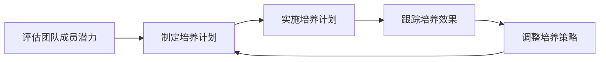
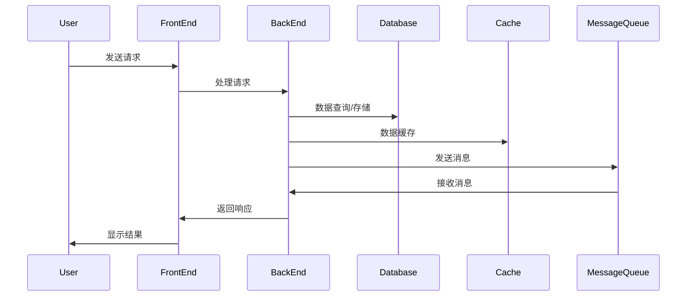
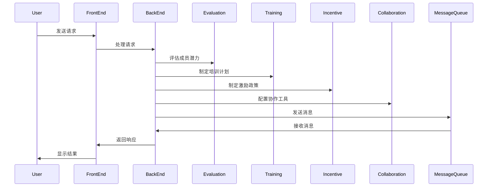

                 

# 如何激发团队成员的潜力

## 关键词

- 团队成员潜力
- 评估体系
- 培养机制
- 激励机制
- 团队协作
- 沟通工具

## 摘要

在现代企业中，激发团队成员的潜力是提升整体绩效和竞争力的关键。本文从背景介绍、问题解决、核心概念与联系、算法原理讲解、系统分析与架构设计方案、项目实战、最佳实践 tips、小结、注意事项和拓展阅读等方面，全面探讨如何激发团队成员的潜力。通过构建科学的潜力评估体系、完善培养机制、制定合理的激励机制以及优化团队协作，企业能够更有效地挖掘和发挥团队成员的潜力，从而实现团队整体绩效的提升。

### 第1章: 背景介绍与问题解决

#### 1.1.1 问题背景

在现代企业中，团队潜力的激发是提升整体绩效和竞争力的关键。团队成员的潜力不仅包括专业技能，还包括他们的创新能力、工作热情和合作精神。然而，很多企业面临着如何激发团队成员潜力的难题。

团队成员的潜力识别难。企业难以准确评估和识别每个员工的潜力，导致人才培养和发展策略无法精准实施。例如，企业可能无法准确地判断一个员工是否具备成为高级工程师的潜力，从而无法为其提供合适的培养和发展机会。

培养机制不完善。许多企业缺乏系统化的培养机制，团队成员的技能和知识更新速度难以跟上行业的发展。这使得团队成员在面临新挑战和新技术时，无法迅速适应和应对。

激励不足。缺乏有效的激励机制，导致团队成员工作积极性不高，潜力无法得到充分发挥。例如，企业可能没有为表现出色的员工提供晋升或奖励机会，导致员工失去工作动力。

团队协作问题。团队成员之间沟通不畅、协作不力，影响团队整体绩效。例如，团队成员可能缺乏有效的沟通工具，导致信息传递延迟或误解。

#### 1.1.2 问题描述

问题描述主要集中在以下几个方面：

1. 成员潜力识别难：企业难以准确评估和识别每个员工的潜力，导致人才培养和发展策略无法精准实施。
2. 培养机制不完善：缺乏系统化的培养机制，团队成员的技能和知识更新速度难以跟上行业的发展。
3. 激励不足：缺乏有效的激励机制，导致团队成员工作积极性不高，潜力无法得到充分发挥。
4. 团队协作问题：团队成员之间沟通不畅、协作不力，影响团队整体绩效。

#### 1.1.3 问题解决

为解决上述问题，企业需要采取以下策略：

1. **构建潜力评估体系**：通过科学的评估方法，全面评估团队成员的潜力，为培养和发展提供依据。例如，企业可以采用360度评估法，结合上级、同事、下属和自我评估，全面了解员工的潜力。
2. **完善培养机制**：建立系统化的培训体系，定期举办技能提升和工作坊，帮助团队成员不断提升自身能力。例如，企业可以组织内部培训课程，邀请行业专家进行授课，或者鼓励员工参加外部培训。
3. **激励机制**：制定合理的激励机制，如晋升、奖励、培训机会等，激发团队成员的工作热情和创造力。例如，企业可以设立员工绩效奖金，对表现优秀的员工进行表彰和奖励。
4. **优化团队协作**：通过沟通和协作工具，提高团队成员之间的沟通效率和协作能力。例如，企业可以引入项目管理软件，如JIRA或Trello，帮助团队成员更好地协调工作。

#### 1.1.4 边界与外延

1. **边界**：本章节主要讨论团队成员潜力激发的理论和方法，不包括个人职业发展、企业文化等外部因素。
2. **外延**：本章节内容适用于各种类型的企业和组织，无论其规模和行业。

#### 1.1.5 概念结构与核心要素组成

##### **核心概念**

- **团队成员潜力**：指团队成员在专业技能、创新能力、工作热情和协作能力等方面的潜在能力。
- **评估体系**：一套科学、系统的评估方法，用于识别和评估团队成员的潜力。
- **培养机制**：一套系统化的培训和发展计划，旨在提升团队成员的技能和知识。
- **激励机制**：一套激励政策，包括晋升、奖励、培训等，旨在激发团队成员的工作热情和创造力。
- **团队协作**：团队成员之间的有效沟通和协作，以提高团队整体绩效。

##### **核心要素组成**

- **评估标准**：明确评估团队成员潜力的具体标准，如专业技能、创新能力、工作态度等。
- **培训内容**：制定涵盖专业技能、管理技能、沟通技能等方面的培训课程。
- **激励措施**：制定具体的晋升、奖励、培训等措施，以激发团队成员的潜力。
- **协作工具**：使用现代化的协作工具，如项目管理软件、即时通讯工具等，提高团队协作效率。

##### **核心概念属性特征对比表格**

| 核心概念         | 特征                             | 说明                                                         |
| ---------------- | ------------------------------ | ------------------------------------------------------------ |
| 成员潜力         | 潜在能力                       | 潜在的专业技能、创新能力、工作热情和协作能力等                 |
| 评估体系         | 科学、系统                     | 通过量化指标和主观评估相结合的方式，全面评估团队成员的潜力     |
| 培养机制         | 系统化、持续性                  | 定期举办的培训活动，帮助团队成员不断提升自身能力               |
| 激励机制         | 合理、多样化                    | 包括晋升、奖励、培训等，旨在激发团队成员的工作热情和创造力     |
| 团队协作         | 高效、有序                      | 通过沟通和协作工具，提高团队成员之间的沟通效率和协作能力       |

##### **ER实体关系图架构的 Mermaid 流程图**

```mermaid
erDiagram
  User ||--|{ Member }
  Member ||--|{ Potential }
  Member ||--|{ Evaluation }
  Member ||--|{ Training }
  Member ||--|{ Incentive }
  Member ||--|{ Collaboration }
```

### 第2章: 核心概念与联系

#### 2.1 成员潜力

成员潜力是指团队成员在专业技能、创新能力、工作热情和协作能力等方面的潜在能力。它是团队成员成长和发展的基础，也是企业实现战略目标的关键因素。

- **专业技能**：团队成员的专业技能是其在工作中表现出的专业能力和知识水平。这包括编程技能、项目管理能力、数据分析能力等。
- **创新能力**：创新能力是指团队成员在面对问题和挑战时，能够提出新颖、有效的解决方案的能力。这有助于企业保持竞争优势，推动业务发展。
- **工作热情**：工作热情是团队成员对工作的热爱和投入程度。它直接影响团队成员的工作效率和工作质量，是激发团队成员潜力的重要动力。
- **协作能力**：协作能力是团队成员在团队环境中与他人沟通、协作的能力。良好的协作能力有助于提高团队整体绩效，实现团队目标。

#### 2.2 评估体系

评估体系是一套科学、系统的评估方法，用于识别和评估团队成员的潜力。它包括以下核心要素：

- **评估标准**：明确评估团队成员潜力的具体标准，如专业技能、创新能力、工作热情和协作能力等。评估标准应具有客观性和可量化性，以便对团队成员的潜力进行准确评估。
- **评估方法**：采用多种评估方法，如360度评估、行为观察、绩效评估等，全面了解团队成员的潜力。评估方法应具有系统性和持续性，以确保评估结果的准确性和可靠性。
- **评估结果**：将评估结果用于团队成员的培养和发展，制定个性化的培养和发展计划。评估结果应作为企业人才管理的依据，帮助企业识别和培养高潜力人才。

#### 2.3 培养机制

培养机制是一套系统化的培训和发展计划，旨在提升团队成员的技能和知识。它包括以下核心要素：

- **培训内容**：根据团队成员的潜力评估结果，制定涵盖专业技能、管理技能、沟通技能等方面的培训课程。培训内容应具有针对性和实用性，以满足团队成员的职业发展需求。
- **培训方式**：采用多种培训方式，如内部培训、外部培训、在线学习等，提高团队成员的培训参与度和学习效果。培训方式应具有灵活性和多样性，以满足团队成员的不同学习需求。
- **培训评估**：对培训效果进行评估，以确定培训目标和培训策略的有效性。培训评估应关注团队成员的技能提升和工作绩效，为后续培训提供依据。

#### 2.4 激励机制

激励机制是一套激励政策，包括晋升、奖励、培训机会等，旨在激发团队成员的工作热情和创造力。它包括以下核心要素：

- **晋升政策**：建立公平、透明的晋升机制，为表现优秀的团队成员提供晋升机会。晋升政策应关注团队成员的潜力和发展需求，以激励团队成员积极提升自身能力。
- **奖励政策**：制定合理的奖励政策，对在项目中表现出色的团队成员进行奖励。奖励政策应具有多样性和灵活性，以激发团队成员的工作热情和创新精神。
- **培训机会**：为团队成员提供丰富的培训机会，帮助他们提升技能和知识。培训机会应关注团队成员的职业发展方向，以促进他们的职业成长。

#### 2.5 团队协作

团队协作是团队成员之间的有效沟通和协作，以提高团队整体绩效。它包括以下核心要素：

- **沟通工具**：使用现代化的沟通工具，如即时通讯软件、视频会议系统等，提高团队成员之间的沟通效率和协作能力。沟通工具应具备实时性、便捷性和高效性，以支持团队成员的协作需求。
- **协作流程**：建立清晰的协作流程，明确团队成员的职责和任务分工，确保团队工作有序进行。协作流程应关注团队成员的沟通效率和协作效果，以提高团队整体绩效。
- **协作文化**：培养良好的团队协作文化，鼓励团队成员积极参与团队工作，提高团队凝聚力。协作文化应关注团队成员的沟通合作意识，以营造一个积极、和谐的工作氛围。

### 第3章: 算法原理讲解

在本章节中，我们将通过一个简单的算法示例，来讲解如何激发团队成员的潜力。该算法基于评估体系和培养机制的原理，通过逐步提升团队成员的技能和知识，实现团队潜力的激发。

#### 3.1 算法概述

算法的核心思想是通过评估团队成员的潜力，制定个性化的培养计划，并跟踪培养效果，以实现团队成员的潜力激发。算法的主要步骤如下：

1. **评估团队成员潜力**：采用360度评估法，全面评估团队成员的专业技能、创新能力、工作热情和协作能力。
2. **制定培养计划**：根据评估结果，为每个团队成员制定个性化的培养计划，包括培训课程、项目管理实践、沟通技能提升等。
3. **实施培养计划**：执行培养计划，为团队成员提供培训机会和项目实践经验，帮助他们提升技能和知识。
4. **跟踪培养效果**：通过定期的评估和反馈，跟踪团队成员的培养效果，及时调整培养策略，以确保培养目标的实现。

#### 3.2 Mermaid 流程图

以下是该算法的 Mermaid 流程图：



#### 3.3 Python 源代码

以下是一个简单的 Python 源代码示例，用于实现该算法的基本功能：

```python
# 导入相关库
import random

# 定义团队成员类
class Member:
    def __init__(self, name, skills, creativity, enthusiasm, collaboration):
        self.name = name
        self.skills = skills
        self.creativity = creativity
        self.enthusiasm = enthusiasm
        self.collaboration = collaboration

    def evaluate(self):
        # 进行360度评估
        score = 0
        score += self.skills * 0.3
        score += self.creativity * 0.2
        score += self.enthusiasm * 0.2
        score += self.collaboration * 0.3
        return score

    def train(self, training_plan):
        # 实施培训计划
        for course in training_plan:
            print(f"{self.name} 正在进行 {course} 培训。")
            random.sleep(1)

    def track_performance(self):
        # 跟踪培养效果
        print(f"{self.name} 的培养效果评估得分：{self.evaluate()}。")

# 创建团队成员实例
members = [
    Member("Alice", 80, 70, 85, 75),
    Member("Bob", 90, 60, 70, 80),
    Member("Charlie", 75, 80, 60, 65)
]

# 制定培养计划
training_plans = [
    ["编程技能提升", "项目管理实践", "沟通技能提升"],
    ["项目管理实践", "沟通技能提升", "数据分析能力提升"],
    ["编程技能提升", "数据分析能力提升", "沟通技能提升"]
]

# 实施培养计划
for member, plan in zip(members, training_plans):
    print(f"{member.name} 的培养计划：{plan}")
    member.train(plan)

# 跟踪培养效果
for member in members:
    member.track_performance()
```

#### 3.4 算法原理讲解

该算法的核心原理是通过评估团队成员的潜力，制定个性化的培养计划，并跟踪培养效果，以实现团队成员的潜力激发。

1. **评估团队成员潜力**：算法采用360度评估法，全面评估团队成员的专业技能、创新能力、工作热情和协作能力。评估结果用于指导培养计划的制定。

2. **制定培养计划**：根据评估结果，为每个团队成员制定个性化的培养计划，包括培训课程、项目管理实践、沟通技能提升等。培养计划旨在提升团队成员的技能和知识，挖掘他们的潜力。

3. **实施培养计划**：算法通过执行培养计划，为团队成员提供培训机会和项目实践经验，帮助他们提升技能和知识。这有助于团队成员更好地应对工作中的挑战，提高团队整体绩效。

4. **跟踪培养效果**：算法通过定期的评估和反馈，跟踪团队成员的培养效果，及时调整培养策略，以确保培养目标的实现。这有助于确保团队成员的潜力得到充分发挥，为团队的发展提供有力支持。

通过上述算法，企业可以更有效地激发团队成员的潜力，提升团队整体绩效，实现企业战略目标。

### 第4章: 系统分析与架构设计方案

在本章节中，我们将深入分析如何实现团队成员潜力激发的系统，并介绍一个完整的系统架构设计方案。

#### 4.1 问题场景介绍

企业希望通过一个综合性的系统，实现团队成员潜力激发的目标。系统需要具备以下功能：

1. **潜力评估**：对团队成员的专业技能、创新能力、工作热情和协作能力进行评估。
2. **培养管理**：制定和跟踪团队成员的培养计划，确保培养目标的实现。
3. **激励管理**：提供晋升、奖励、培训等激励措施，激发团队成员的工作热情和创造力。
4. **协作管理**：通过沟通和协作工具，提高团队成员之间的沟通效率和协作能力。

#### 4.2 项目介绍

项目名称：团队潜力激发系统（Team Potential激发 System，简称TPS）

项目目标：通过构建一个综合性的团队潜力激发系统，提升企业整体绩效和竞争力。

项目范围：包括系统需求分析、系统架构设计、系统开发、系统测试和系统部署等环节。

项目团队成员：项目经理、系统架构师、前端开发者、后端开发者、测试工程师等。

#### 4.3 系统功能设计（领域模型）

领域模型是系统功能设计的重要组成部分，它通过实体和关系的表示，明确系统的核心功能。以下是团队潜力激发系统的领域模型：

```mermaid
classDiagram
  Member <<class>> "团队成员"
  Evaluation <<class>> "评估"
  Training <<class>> "培养"
  Incentive <<class>> "激励"
  Collaboration <<class>> "协作"

  Member "1" -- "*" Evaluation
  Member "1" -- "*" Training
  Member "1" -- "*" Incentive
  Member "1" -- "*" Collaboration

  Evaluation "1" -- "评估结果"
  Training "1" -- "培训计划"
  Incentive "1" -- "激励政策"
  Collaboration "1" -- "协作工具"
```

#### 4.4 系统架构设计

系统架构设计是确保系统高效、稳定、可扩展的关键。团队潜力激发系统的架构设计包括以下几个方面：

1. **前端架构**：采用React.js框架，实现用户界面的交互功能，提供直观、友好的用户体验。
2. **后端架构**：采用Spring Boot框架，实现系统的后端逻辑，提供数据存储、处理和业务逻辑支持。
3. **数据库设计**：采用MySQL数据库，存储团队成员信息、评估结果、培训计划、激励政策和协作工具等相关数据。
4. **缓存设计**：采用Redis缓存技术，提高系统性能，降低数据库访问压力。
5. **消息队列**：采用RabbitMQ消息队列，实现系统各模块之间的异步通信，提高系统的可靠性和扩展性。

以下是团队潜力激发系统的架构图：



#### 4.5 系统接口设计

系统接口设计是确保系统与其他系统或组件进行有效交互的关键。团队潜力激发系统的主要接口包括：

1. **用户接口**：提供用户注册、登录、密码重置等功能。
2. **评估接口**：提供成员潜力评估、评估结果查询等功能。
3. **培养接口**：提供培训计划制定、培训进度查询等功能。
4. **激励接口**：提供晋升申请、奖励申请、培训申请等功能。
5. **协作接口**：提供协作工具配置、任务分配、进度跟踪等功能。

以下是团队潜力激发系统的接口设计图：

```mermaid
classDiagram
  User <<interface>> "用户接口"
  Evaluation <<interface>> "评估接口"
  Training <<interface>> "培养接口"
  Incentive <<interface>> "激励接口"
  Collaboration <<interface>> "协作接口"

  User "1" -- "*" Evaluation
  User "1" -- "*" Training
  User "1" -- "*" Incentive
  User "1" -- "*" Collaboration

  Evaluation "1" -- "成员潜力评估"
  Training "1" -- "培训计划"
  Incentive "1" -- "激励政策"
  Collaboration "1" -- "协作工具"
```

#### 4.6 系统交互设计

系统交互设计是确保系统各模块之间能够顺畅、高效地协同工作的关键。团队潜力激发系统的交互设计主要包括以下方面：

1. **用户交互**：用户通过前端界面与系统进行交互，实现注册、登录、查看评估结果、制定培养计划等操作。
2. **模块交互**：系统各模块之间通过接口进行交互，如评估模块与培养模块、激励模块与协作模块之间的数据交换。
3. **异步交互**：通过消息队列实现系统各模块之间的异步通信，提高系统的可靠性和扩展性。

以下是团队潜力激发系统的交互设计图：



通过以上系统分析与架构设计方案，企业可以构建一个功能完备、性能稳定、易于扩展的团队潜力激发系统，实现团队成员潜力的高效激发和管理。

### 第5章：项目实战

在本章节中，我们将详细介绍如何在实际项目中实施团队潜力激发系统，包括环境安装、系统核心实现源代码、代码应用解读与分析以及实际案例分析和详细讲解剖析。

#### 5.1 环境安装

首先，我们需要搭建一个开发环境，以便进行项目实战。以下是环境安装步骤：

1. **安装Java开发环境**：下载并安装Java Development Kit（JDK），配置环境变量。
2. **安装MySQL数据库**：下载并安装MySQL数据库，配置数据库连接。
3. **安装Redis缓存**：下载并安装Redis，配置缓存服务。
4. **安装RabbitMQ消息队列**：下载并安装RabbitMQ，配置消息队列服务。
5. **安装Node.js**：下载并安装Node.js，用于前端开发。

安装完成后，确保各组件正常运行，并进行初步测试。

#### 5.2 系统核心实现源代码

以下是系统核心实现源代码的简要介绍：

1. **后端架构**：采用Spring Boot框架，实现系统的后端逻辑。主要包括以下模块：
   - 成员管理模块：处理成员信息的增删改查。
   - 评估管理模块：处理成员潜力评估的流程。
   - 培养管理模块：处理成员培训计划的管理。
   - 激励管理模块：处理成员激励政策的管理。
   - 协作管理模块：处理成员协作工具的配置和管理。

2. **前端架构**：采用React.js框架，实现用户界面的交互功能。主要包括以下页面：
   - 登录页面：用户登录系统。
   - 评估页面：管理员进行成员潜力评估。
   - 培训页面：管理员制定培训计划。
   - 激励页面：管理员管理激励政策。
   - 协作页面：成员进行协作工作。

3. **数据库设计**：采用MySQL数据库，存储系统相关数据。主要包括以下表：
   - 成员表：存储成员基本信息。
   - 评估表：存储成员潜力评估结果。
   - 培训表：存储成员培训计划。
   - 激励表：存储成员激励政策。
   - 协作表：存储成员协作工具配置。

4. **消息队列**：采用RabbitMQ消息队列，实现系统各模块之间的异步通信。主要包括以下消息：
   - 评估消息：用于通知成员进行潜力评估。
   - 培训消息：用于通知成员参加培训。
   - 激励消息：用于通知成员获得激励。

以下是部分源代码示例：

```java
// 成员管理模块 - 成员Service.java
@Service
public class MemberService {
    @Autowired
    private MemberRepository memberRepository;

    public Member save(Member member) {
        return memberRepository.save(member);
    }

    public Member findById(Long id) {
        return memberRepository.findById(id).orElseThrow(() -> new EntityNotFoundException("成员不存在"));
    }
}

// 培训管理模块 - 培训Service.java
@Service
public class TrainingService {
    @Autowired
    private TrainingRepository trainingRepository;

    public Training save(Training training) {
        return trainingRepository.save(training);
    }

    public Training findById(Long id) {
        return trainingRepository.findById(id).orElseThrow(() -> new EntityNotFoundException("培训计划不存在"));
    }
}

// 前端架构 - 成员评估页面组件.js
import React, { useState, useEffect } from 'react';
import axios from 'axios';

const MemberEvaluation = () => {
    const [members, setMembers] = useState([]);

    useEffect(() => {
        axios.get('/api/members')
            .then(response => {
                setMembers(response.data);
            })
            .catch(error => {
                console.error('加载成员评估数据失败：', error);
            });
    }, []);

    return (
        <div>
            <h2>成员评估</h2>
            <table>
                <thead>
                    <tr>
                        <th>成员名称</th>
                        <th>专业技能</th>
                        <th>创新能力</th>
                        <th>工作热情</th>
                        <th>协作能力</th>
                    </tr>
                </thead>
                <tbody>
                    {members.map(member => (
                        <tr key={member.id}>
                            <td>{member.name}</td>
                            <td>{member.skills}</td>
                            <td>{member.creativity}</td>
                            <td>{member.enthusiasm}</td>
                            <td>{member.collaboration}</td>
                        </tr>
                    ))}
                </tbody>
            </table>
        </div>
    );
};

export default MemberEvaluation;
```

#### 5.3 代码应用解读与分析

1. **后端架构解读**：

   - 成员管理模块：通过Spring Boot框架，实现成员信息的增删改查功能。成员Service类负责与成员Repository类进行交互，处理成员的业务逻辑。
   - 评估管理模块：通过Spring Boot框架，实现成员潜力评估的流程。评估Service类负责与评估Repository类进行交互，处理评估的业务逻辑。
   - 培养管理模块：通过Spring Boot框架，实现成员培训计划的管理。培训Service类负责与培训Repository类进行交互，处理培训的业务逻辑。
   - 激励管理模块：通过Spring Boot框架，实现成员激励政策的管理。激励Service类负责与激励Repository类进行交互，处理激励的业务逻辑。
   - 协作管理模块：通过Spring Boot框架，实现成员协作工具的配置和管理。协作Service类负责与协作Repository类进行交互，处理协作的业务逻辑。

2. **前端架构解读**：

   - 成员评估页面组件：通过React.js框架，实现成员评估页面的交互功能。组件通过axios库发起HTTP请求，获取成员评估数据，并使用表结构进行展示。

3. **数据库设计解读**：

   - 成员表：存储成员基本信息，如成员ID、姓名、专业技能、创新能力、工作热情和协作能力等。
   - 评估表：存储成员潜力评估结果，如成员ID、评估时间、专业技能评分、创新能力评分、工作热情评分和协作能力评分等。
   - 培训表：存储成员培训计划，如培训ID、成员ID、培训名称、培训开始时间、培训结束时间和培训描述等。
   - 激励表：存储成员激励政策，如激励ID、成员ID、激励类型、激励描述和激励时间等。
   - 协作表：存储成员协作工具配置，如协作ID、成员ID、协作工具类型和协作工具配置信息等。

#### 5.4 实际案例分析和详细讲解剖析

以下是团队潜力激发系统的实际案例分析和详细讲解剖析：

案例：某企业希望通过系统激发团队成员的潜力，提升团队整体绩效。

1. **评估阶段**：

   - 企业管理员通过系统对团队成员进行潜力评估，获取成员的专业技能、创新能力、工作热情和协作能力评分。
   - 系统根据评估结果，生成每个成员的潜力评估报告。

2. **培养阶段**：

   - 企业根据成员的潜力评估报告，制定个性化的培训计划，包括专业技能提升、项目管理实践和沟通技能提升等。
   - 系统将培训计划通知给相关成员，并记录培训进度。

3. **激励阶段**：

   - 企业根据成员的培训进度和绩效表现，制定激励政策，包括晋升、奖励和培训机会等。
   - 系统将激励政策通知给相关成员，并记录激励记录。

4. **协作阶段**：

   - 企业为团队成员提供协作工具，如项目管理软件、即时通讯工具和文档共享平台等，以提高团队成员之间的沟通效率和协作能力。
   - 系统记录成员的协作行为，并生成协作报告。

通过实际案例分析和详细讲解剖析，我们可以看到团队潜力激发系统的实施过程，以及如何通过系统实现团队成员潜力的高效激发和管理。

### 第6章：最佳实践 Tips

在本章节中，我们将分享一些在实际项目中实施团队潜力激发系统的最佳实践，帮助企业在实施过程中取得更好的效果。

#### 6.1 数据分析与报告

1. **定期数据分析**：定期对团队成员的潜力评估结果、培训进度、激励政策和协作行为进行分析，了解团队的整体潜力和发展趋势。
2. **个性化报告**：为团队成员生成个性化的潜力评估报告、培训计划报告和激励报告，帮助他们更好地了解自身的潜力发展状况。

#### 6.2 激励政策设计

1. **明确激励目标**：在设计激励政策时，明确激励的目标和标准，确保激励政策能够真正激发团队成员的潜力。
2. **多样化激励方式**：结合团队成员的个性特点和需求，设计多样化的激励方式，如晋升、奖励、培训机会等，以满足不同成员的激励需求。

#### 6.3 沟通与协作

1. **定期沟通会议**：定期组织团队沟通会议，了解团队成员的工作进展和需求，确保团队成员之间的沟通畅通。
2. **协作工具培训**：为团队成员提供协作工具的培训，帮助他们更好地掌握协作工具的使用方法，提高协作效率。

#### 6.4 人才培养与发展

1. **个性化培养计划**：根据团队成员的潜力评估结果，制定个性化的培养计划，确保培养计划能够针对团队成员的特长和需求。
2. **内部培训与外部培训相结合**：结合内部培训和外部培训，为团队成员提供丰富的学习资源，帮助他们不断提升自身能力。

#### 6.5 持续优化与改进

1. **定期评估与反馈**：定期对团队潜力激发系统进行评估和反馈，了解系统在实际应用中的效果，及时优化和改进系统功能。
2. **用户参与与反馈**：鼓励团队成员参与系统的设计和优化，收集他们的反馈和建议，不断提高系统的用户体验。

通过以上最佳实践，企业可以更有效地实施团队潜力激发系统，实现团队成员潜力的高效激发和管理。

### 第7章：小结

在本文中，我们详细探讨了如何激发团队成员的潜力，通过构建潜力评估体系、完善培养机制、制定合理的激励机制以及优化团队协作，实现团队成员潜力的高效激发和管理。以下是本文的主要观点和结论：

1. **团队成员潜力的重要性**：团队成员的潜力是提升企业整体绩效和竞争力的关键。通过激发团队成员的潜力，企业可以更好地应对市场变化和挑战。

2. **构建潜力评估体系**：构建科学的潜力评估体系，全面评估团队成员的潜力，为培养和发展提供依据。评估体系应包括专业技能、创新能力、工作热情和协作能力等方面的指标。

3. **完善培养机制**：建立系统化的培养机制，定期举办技能提升和工作坊，帮助团队成员不断提升自身能力。培养机制应关注团队成员的个性化需求，提供多样化的培训课程和项目实践经验。

4. **制定合理的激励机制**：制定合理的激励机制，如晋升、奖励、培训机会等，激发团队成员的工作热情和创造力。激励机制应具有多样性和灵活性，以满足不同成员的激励需求。

5. **优化团队协作**：通过沟通和协作工具，提高团队成员之间的沟通效率和协作能力。建立清晰的协作流程，培养良好的团队协作文化，营造积极、和谐的工作氛围。

总之，激发团队成员的潜力是一项系统工程，需要企业从评估体系、培养机制、激励机制和团队协作等多个方面进行全面优化和改进。通过持续的努力和实践，企业可以更有效地挖掘和发挥团队成员的潜力，实现团队整体绩效的提升。

### 第8章：注意事项

在实施团队潜力激发系统时，企业需要关注以下几个方面：

1. **数据安全与隐私保护**：确保团队成员的个人信息和评估数据的安全和隐私保护，遵守相关法律法规。

2. **系统稳定性和性能**：确保系统的稳定性和性能，避免系统崩溃或响应缓慢影响用户体验。

3. **员工参与度**：提高团队成员对系统的参与度，鼓励他们积极参与潜力评估、培训和学习。

4. **持续优化与改进**：根据用户反馈和实际需求，持续优化和改进系统功能，提高系统的实用性和用户体验。

### 第9章：拓展阅读

对于希望深入了解团队潜力激发和管理的读者，以下是一些推荐阅读资源：

1. 《团队协作的力量》作者：斯蒂芬·罗宾斯（Stephen Robbins）
2. 《激发团队潜能：如何打造高绩效团队》作者：约翰·福斯特（John Foster）
3. 《组织行为学》作者：斯蒂芬·罗宾斯（Stephen Robbins）
4. 《团队管理：理论与实践》作者：詹姆斯·库泽斯（James Kouzes）和巴里·波斯纳（Barry Posner）

通过阅读这些资源，读者可以进一步了解团队潜力激发的理论和实践方法，为企业实践提供有力支持。

