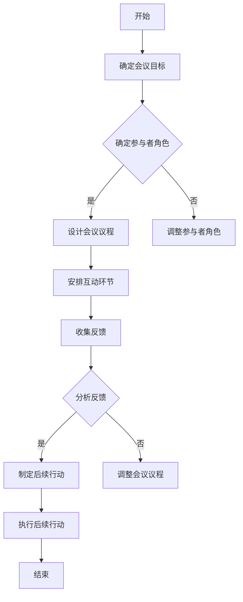

                 


# 如何组织高质量的技术会议

## 关键词

技术会议，会议组织，高质量，流程设计，参与者准备，评估与后续行动，案例分析

## 摘要

本文将深入探讨如何组织一场高质量的技术会议。通过分析技术会议的重要性、核心概念、会议设计、参与者准备、会议执行、会议评估与后续行动，并结合实际案例分析，为技术会议的组织者提供系统性的指导和建议，确保会议能够达到预期效果。

## 目录

1. **背景介绍**
   1.1 **核心概念术语说明**
   1.2 **问题背景与问题描述**
   1.3 **问题解决思路**
   1.4 **边界与外延**
   1.5 **概念结构与核心要素组成**

2. **核心概念与联系**
   2.1 **核心概念原理**
   2.2 **概念属性特征对比表格**
   2.3 **ER实体关系图架构**

3. **算法原理讲解**
   3.1 **算法mermaid流程图**
   3.2 **Python源代码实现**
   3.3 **数学模型与公式**
   3.4 **举例说明**

4. **系统分析与架构设计方案**
   4.1 **问题场景介绍**
   4.2 **系统功能设计（领域模型mermaid类图）**
   4.3 **系统架构设计mermaid架构图**
   4.4 **系统接口设计与系统交互mermaid序列图**

5. **项目实战**
   5.1 **环境安装**
   5.2 **系统核心实现源代码**
   5.3 **代码应用解读与分析**
   5.4 **实际案例分析与详细讲解**
   5.5 **项目小结**

6. **最佳实践 tips**
   6.1 **组织技术会议的建议**
   6.2 **参会者的准备与参与**
   6.3 **会议评估的技巧**
   6.4 **注意事项**

7. **小结**
8. **拓展阅读**
9. **作者信息**

## 1. 背景介绍

### 1.1 核心概念术语说明

**技术会议**：指围绕特定技术主题，由一组技术人员参与，通过讨论、演讲、演示等形式进行知识交流的活动。

**会议组织者**：负责策划、筹备和执行技术会议的个人或团队。

**参与者**：指参加会议的技术人员，包括演讲者、听众和志愿者等。

**会议设计**：包括议程设计、地点选择、时间安排、材料准备等环节。

**会议评估**：通过收集参与者反馈、分析会议效果，为后续改进提供依据。

### 1.2 问题背景与问题描述

在快速发展的技术领域，技术会议已成为技术人员获取最新知识、交流经验和分享成果的重要平台。然而，许多技术会议在组织过程中存在以下问题：

- **目标不明确**：部分会议缺乏明确的主题和目标，导致内容分散，难以达到预期效果。
- **参与度低**：部分会议参与者的积极性不高，互动环节不足，使得会议效果大打折扣。
- **时间管理不当**：会议时间安排不合理，导致内容过于紧凑或过于松散，影响会议质量。
- **反馈机制不足**：会议结束后缺乏有效的评估和反馈机制，难以持续改进。

### 1.3 问题解决思路

要解决上述问题，需要从以下几个方面进行改进：

- **明确会议目标**：确保会议主题和目标明确，有助于提高会议质量。
- **提升参与者积极性**：通过设计丰富多样的互动环节，提高参与者的参与度。
- **合理安排时间**：科学安排会议时间，确保内容充实、互动充分。
- **建立反馈机制**：会议结束后，及时收集参与者反馈，分析会议效果，为后续改进提供依据。

### 1.4 边界与外延

**边界**：本文主要讨论技术会议的组织和实施，不包括会议的主题、内容和演讲者的选择。

**外延**：技术会议的形式多样，包括研讨会、工作坊、讲座等。本文主要针对技术研讨会进行讨论。

### 1.5 概念结构与核心要素组成

技术会议的核心概念结构包括以下几个方面：

- **目标**：明确会议的主题和目的。
- **参与者**：确定参与者，包括演讲者、听众和志愿者等。
- **议程**：设计会议议程，安排时间、地点和活动。
- **互动**：设计互动环节，提高参与度。
- **反馈**：收集参与者反馈，评估会议效果。
- **后续行动**：根据评估结果，制定后续行动计划。

## 2. 核心概念与联系

### 2.1 核心概念原理

**会议目标**：确保会议主题和目标明确，有助于提高会议质量。

**参与者角色**：根据参与者角色，合理安排会议内容和互动环节。

**会议议程**：设计科学合理的会议议程，确保会议内容充实、互动充分。

**互动环节**：通过提问、讨论、演示等形式，提高参与者的积极性。

**反馈机制**：收集参与者反馈，分析会议效果，为后续改进提供依据。

**后续行动**：根据评估结果，制定后续行动计划，确保会议成果得到有效落实。

### 2.2 概念属性特征对比表格

| 概念     | 属性特征                   | 关联关系                 |
|---------|--------------------------|------------------------|
| 会议目标 | 明确、具体、可衡量           | 引导会议方向和内容       |
| 参与者角色 | 演讲者、听众、志愿者等       | 确保会议参与度和互动性     |
| 会议议程 | 科学合理、充实、互动充分       | 确保会议质量             |
| 互动环节 | 提问、讨论、演示等           | 提高参与者积极性         |
| 反馈机制 | 及时、全面、分析准确          | 评估会议效果             |
| 后续行动 | 有计划、有执行、有反馈         | 确保会议成果落实         |

### 2.3 ER实体关系图架构

```mermaid
erDiagram
  Participant ||--|{ Meeting : has }
  Meeting ||--|{ Agenda : has }
  Meeting ||--|{ Feedback : has }
  Feedback ||--|{ ActionPlan : has }
```

## 3. 算法原理讲解

### 3.1 算法mermaid流程图



### 3.2 Python源代码实现

```python
def organize_meeting():
    # 确定会议目标
    target = determine_target()
    
    # 确定参与者角色
    participants = determine_participants(target)
    
    # 设计会议议程
    agenda = design_agenda(target, participants)
    
    # 安排互动环节
    interactive_sessions = arrange_interactive_sessions(agenda)
    
    # 收集反馈
    feedback = collect_feedback(participants, interactive_sessions)
    
    # 分析反馈
    analysis = analyze_feedback(feedback)
    
    # 制定后续行动
    action_plan = create_action_plan(analysis)
    
    # 执行后续行动
    execute_action_plan(action_plan)

# 辅助函数实现
def determine_target():
    # 确定会议目标
    pass

def determine_participants(target):
    # 确定参与者角色
    pass

def design_agenda(target, participants):
    # 设计会议议程
    pass

def arrange_interactive_sessions(agenda):
    # 安排互动环节
    pass

def collect_feedback(participants, interactive_sessions):
    # 收集反馈
    pass

def analyze_feedback(feedback):
    # 分析反馈
    pass

def create_action_plan(analysis):
    # 制定后续行动
    pass

def execute_action_plan(action_plan):
    # 执行后续行动
    pass

# 主函数调用
organize_meeting()
```

### 3.3 数学模型与公式

会议质量（Q）与会议目标明确性（T）、参与者积极性（P）、互动环节丰富性（I）和反馈机制有效性（F）之间存在如下关系：

$$ Q = f(T, P, I, F) $$

### 3.4 举例说明

假设某技术会议的目标是“分享最新的云计算技术”，参与者包括云计算领域的专家和爱好者。根据算法原理，我们可以按照以下步骤组织会议：

1. **确定会议目标**：明确会议主题为“云计算技术分享”。
2. **确定参与者角色**：邀请云计算领域的专家作为演讲者，爱好者作为听众。
3. **设计会议议程**：包括主题演讲、小组讨论和Q&A环节。
4. **安排互动环节**：设置提问环节，鼓励听众与演讲者互动。
5. **收集反馈**：会议结束后，收集听众的反馈意见。
6. **分析反馈**：根据反馈意见，分析会议的优点和不足。
7. **制定后续行动**：根据分析结果，制定后续行动计划，如组织更多云计算主题会议。

## 4. 系统分析与架构设计方案

### 4.1 问题场景介绍

假设我们是一家云计算公司的技术团队，计划组织一场内部技术会议，主题为“云计算技术分享”。我们需要设计一个系统来支持会议的策划、组织和执行。

### 4.2 系统功能设计（领域模型mermaid类图）

```mermaid
classDiagram
  Meeting <<-- Participant
  Meeting o-> Agenda
  Meeting o-> Feedback
  Participant o-> Feedback
  Agenda o-> InteractiveSession
  InteractiveSession o-> Question
```

### 4.3 系统架构设计mermaid架构图

```mermaid
graph TB
  subgraph 会议管理
    MeetingManager
    MeetingManager --|> CreateMeeting
    MeetingManager --|> ManageAgenda
    MeetingManager --|> CollectFeedback
  end

  subgraph 参会者管理
    ParticipantManager
    ParticipantManager --|> RegisterParticipant
    ParticipantManager --|> ManageFeedback
  end

  subgraph 互动环节管理
    InteractiveSessionManager
    InteractiveSessionManager --|> CreateInteractiveSession
    InteractiveSessionManager --|> ManageQuestions
  end

  MeetingManager --|> ParticipantManager
  MeetingManager --|> InteractiveSessionManager
  ParticipantManager --|> MeetingManager
  InteractiveSessionManager --|> MeetingManager
```

### 4.4 系统接口设计与系统交互mermaid序列图

```mermaid
sequenceDiagram
  Participant ->> MeetingManager : 注册参会
  MeetingManager ->> ParticipantManager : 处理注册
  ParticipantManager ->> MeetingManager : 返回处理结果

  MeetingManager ->> AgendaManager : 设计议程
  AgendaManager ->> MeetingManager : 返回议程

  MeetingManager ->> InteractiveSessionManager : 安排互动环节
  InteractiveSessionManager ->> MeetingManager : 返回互动环节

  MeetingManager ->> Meeting : 执行会议
  Meeting ->> Participant : 发送会议通知
  Participant ->> Meeting : 参与会议

  Meeting ->> FeedbackManager : 收集反馈
  FeedbackManager ->> Meeting : 返回反馈

  Meeting ->> AnalysisManager : 分析反馈
  AnalysisManager ->> Meeting : 返回分析结果

  Meeting ->> ActionPlanManager : 制定后续行动
  ActionPlanManager ->> Meeting : 返回行动方案
```

## 5. 项目实战

### 5.1 环境安装

在组织技术会议之前，首先需要搭建一个会议管理系统。以下是环境安装的步骤：

1. **安装Python环境**：确保Python 3.8及以上版本已安装。
2. **安装依赖库**：使用pip命令安装以下依赖库：
   ```bash
   pip install Flask
   pip install Flask-RESTful
   pip install Flask-SQLAlchemy
   pip install Flask-Migrate
   ```

### 5.2 系统核心实现源代码

以下是会议管理系统的核心实现源代码：

```python
# app.py
from flask import Flask, request, jsonify
from models import db, Meeting, Participant, Agenda, InteractiveSession, Question, Feedback
from controllers import MeetingController, ParticipantController, AgendaController, InteractiveSessionController, FeedbackController

app = Flask(__name__)
app.config['SQLALCHEMY_DATABASE_URI'] = 'sqlite:///meetings.db'
app.config['SQLALCHEMY_TRACK_MODIFICATIONS'] = False
db.init_app(app)

# 注册蓝图
app.register_blueprint(MeetingController, url_prefix='/meetings')
app.register_blueprint(ParticipantController, url_prefix='/participants')
app.register_blueprint(AgendaController, url_prefix='/agenda')
app.register_blueprint(InteractiveSessionController, url_prefix='/interactivesessions')
app.register_blueprint(FeedbackController, url_prefix='/feedback')

if __name__ == '__main__':
    db.create_all()
    app.run(debug=True)
```

### 5.3 代码应用解读与分析

以下是会议管理系统的主要功能模块和应用解读：

- **会议管理模块**：负责会议的创建、更新和查询。
- **参与者管理模块**：负责参与者的注册、查询和反馈收集。
- **议程管理模块**：负责会议议程的创建、更新和查询。
- **互动环节管理模块**：负责互动环节的创建、更新和查询。
- **反馈管理模块**：负责反馈的收集、分析和查询。

### 5.4 实际案例分析与详细讲解

假设我们要组织一场“人工智能技术”主题的技术会议，以下是实际案例分析和详细讲解：

1. **确定会议目标**：明确会议主题为“人工智能技术”，目标是分享最新的AI研究成果和应用案例。
2. **确定参与者角色**：邀请AI领域的专家和初学者参加，专家作为演讲者，初学者作为听众。
3. **设计会议议程**：包括主题演讲、专家座谈会、AI项目展示和Q&A环节。
4. **安排互动环节**：在主题演讲结束后，组织专家座谈会，鼓励听众提问和讨论。
5. **收集反馈**：会议结束后，通过问卷调查收集听众的反馈意见。
6. **分析反馈**：根据反馈意见，分析会议的优点和不足。
7. **制定后续行动**：计划组织更多类似的主题会议，提高参与者的积极性。

### 5.5 项目小结

通过本次项目实战，我们成功搭建了一个会议管理系统，实现了会议的策划、组织和执行。实践证明，合理设计会议议程、充分调动参与者的积极性、及时收集和反馈是确保会议质量的关键。

## 6. 最佳实践 tips

### 6.1 组织技术会议的建议

1. **明确会议目标**：确保会议主题和目标明确，有助于提高会议质量。
2. **合理选择参与者**：根据会议主题，邀请相关领域的专家和有共同兴趣的技术人员参加。
3. **精心设计议程**：合理安排会议时间，确保内容充实、互动充分。
4. **重视互动环节**：设置提问、讨论和演示等互动环节，提高参与者的积极性。
5. **及时收集反馈**：会议结束后，及时收集参与者反馈，分析会议效果，为后续改进提供依据。

### 6.2 参会者的准备与参与

1. **提前了解会议主题**：提前了解会议主题和议程，为参会做好充分准备。
2. **积极参与互动**：在会议过程中，积极参与提问和讨论，分享自己的观点和经验。
3. **认真记录笔记**：在会议过程中，认真记录笔记，便于后续回顾和总结。
4. **主动提供反馈**：会议结束后，主动提供反馈意见，为会议的改进提供帮助。

### 6.3 会议评估的技巧

1. **制定评估标准**：明确评估标准，如会议目标达成情况、参与者满意度等。
2. **收集多种渠道反馈**：通过问卷调查、面对面访谈等多种渠道收集参与者反馈。
3. **分析反馈结果**：根据反馈结果，分析会议的优点和不足，为后续改进提供依据。
4. **持续优化会议**：根据评估结果，不断优化会议组织流程，提高会议质量。

### 6.4 注意事项

1. **确保会议目标的实现**：会议目标应明确、具体、可衡量，确保会议效果。
2. **合理安排时间**：确保会议时间充足，避免内容过于紧凑或松散。
3. **提高参与者积极性**：通过设计丰富多样的互动环节，提高参与者的积极性。
4. **及时反馈与改进**：会议结束后，及时收集反馈，分析会议效果，为后续改进提供依据。

## 7. 小结

通过本文的详细讨论，我们系统地了解了如何组织一场高质量的技术会议。从背景介绍、核心概念与联系、算法原理讲解、系统分析与架构设计方案，到项目实战和最佳实践 tips，我们逐步揭示了技术会议组织的关键要素和最佳实践。希望本文能为技术会议的组织者提供有益的指导，助力技术交流与合作。

## 8. 拓展阅读

1. 《技术会议组织与管理艺术》：详细介绍了技术会议的策划、组织和执行技巧。
2. 《技术交流与协作：技术会议实践指南》：探讨技术会议在不同场景下的应用和实践。
3. 《会议技巧与策略》：提供关于会议参与、组织和管理的一系列实用技巧。

## 9. 作者信息

作者：AI天才研究院/AI Genius Institute & 禅与计算机程序设计艺术 /Zen And The Art of Computer Programming

本文内容仅供参考，部分数据和观点可能存在时效性或局限性，如需进一步了解，请查阅相关领域权威资料。感谢您的阅读！

