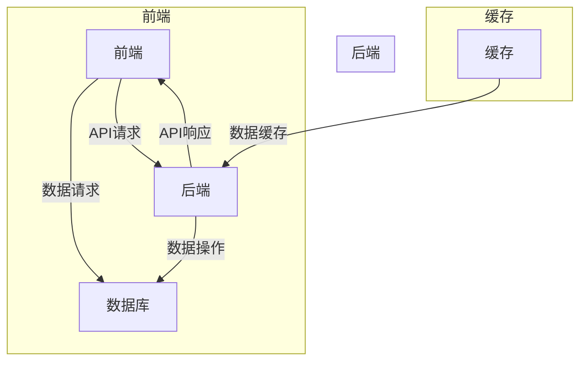
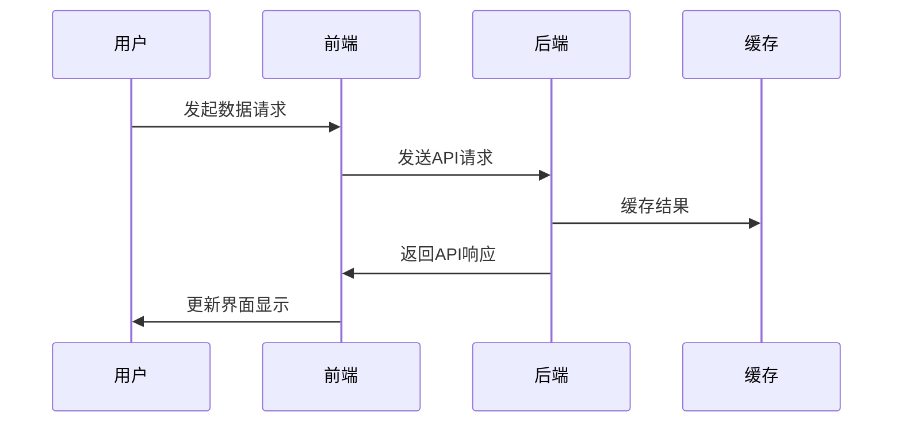

                 

# 如何进行有效的技术专利布局

关键词：技术专利布局、专利组合、专利池、专利战略、核心概念、算法原理

摘要：本文旨在探讨如何进行有效的技术专利布局。通过对技术专利布局的核心概念、原理和方法进行详细阐述，帮助读者理解技术专利布局的流程和关键点，从而为实际操作提供指导。

## 引言与背景

随着科技的快速发展，技术专利已经成为企业竞争的重要手段。有效的技术专利布局不仅能为企业带来巨大的经济利益，还能在市场竞争中占据有利地位。然而，如何进行有效的技术专利布局，成为了许多企业和专利工作者面临的一大难题。

### 问题的背景

在当今高度竞争的市场环境中，技术专利被视为企业创新的重要成果和保护自身利益的重要手段。有效的专利布局可以为企业带来以下几个方面的重要价值：

- **市场垄断**：通过专利保护，企业可以阻止竞争对手进入市场，从而维持其在市场上的垄断地位。
- **经济收益**：专利授权和许可可以为企业带来可观的收入，甚至通过专利诉讼获得高额赔偿。
- **品牌形象**：拥有强大的专利组合，可以提升企业的技术创新能力和品牌形象。

然而，技术专利布局并非易事，涉及到众多复杂的问题，如专利的筛选、组合、布局策略等。以下是一些常见的技术专利布局问题：

- **专利质量的评估**：如何准确评估专利的质量和价值，以便进行有效的布局？
- **专利组合的策略**：如何将不同的专利组合在一起，形成具有战略意义的专利池？
- **专利策略的制定**：如何制定合适的专利战略，以适应不同的市场竞争环境？

### 问题描述

技术专利布局涉及到多个层面的决策，需要考虑的因素繁多。以下是一些具体的问题描述：

- **专利筛选**：如何从大量创新成果中筛选出具有高价值的专利？
- **专利组合**：如何将不同的专利组合在一起，形成具有协同效应的专利池？
- **布局策略**：如何制定专利布局策略，以适应不同的市场需求和竞争态势？
- **风险控制**：如何平衡专利布局中的风险和收益，确保企业的利益最大化？

### 问题解决

本文将通过对技术专利布局的核心概念、原理和方法进行详细阐述，帮助读者理解技术专利布局的流程和关键点，从而为实际操作提供指导。

### 边界与外延

本文主要关注技术专利布局在计算机技术领域的应用，但所提出的原理和方法具有一定的通用性，可以应用于其他技术领域的专利布局。

### 概念结构与核心要素组成

技术专利布局的核心概念包括专利组合、专利池、专利战略等。本文将详细讲解这些概念，并分析它们之间的联系和作用。

### 本章小结

通过对技术专利布局的背景、问题、解决方法和核心概念的分析，本章为后续章节的内容奠定了基础。读者可以通过本章的学习，对技术专利布局有一个整体的了解。

## 核心概念与联系

### 2.1 专利组合

专利组合是指将多个专利进行有机结合，形成一种更为强大的专利体系。专利组合的目的在于通过相互补充，增强专利的整体实力，提高专利的价值。

#### 2.1.1 专利组合的特点

- **多样化**：专利组合可以涵盖多种技术领域，从而提高专利的多样性和适应性。
- **协同性**：专利组合中的各个专利可以相互补充，形成一个更为强大的专利体系。
- **灵活性**：专利组合可以根据市场需求和竞争态势进行灵活调整。

#### 2.1.2 专利组合的作用

- **提高专利价值**：专利组合可以提高专利的整体价值，使专利更具市场竞争力。
- **降低风险**：专利组合可以降低单一专利面临的风险，因为其他专利可以在一定程度上弥补某个专利的不足。

### 2.2 专利池

专利池是指由多个专利组成的专利集合，这些专利通常具有相似的技术领域和专利权人。专利池的目的是通过集中管理，提高专利的利用效率。

#### 2.2.1 专利池的特点

- **规模性**：专利池通常由多个专利组成，具有较大的规模。
- **集中性**：专利池的专利通常由同一专利权人或相关专利权人集中管理。
- **共享性**：专利池中的专利可以共享使用，提高专利的利用效率。

#### 2.2.2 专利池的作用

- **提高专利利用效率**：专利池可以通过共享专利资源，提高专利的利用效率。
- **降低专利成本**：专利池可以降低专利申请和维护的成本，因为多个专利可以共享一个专利代理机构。

### 2.3 专利战略

专利战略是指企业在专利布局过程中所采取的长期规划和策略。专利战略的目的是通过合理布局，提高企业的市场竞争力和专利价值。

#### 2.3.1 专利战略的类型

- **防御性战略**：通过布局大量外围专利，保护核心专利，防止竞争对手入侵。
- **进攻性战略**：通过布局核心专利，对竞争对手进行打压，争取市场优势。
- **混合战略**：结合防御性和进攻性战略，实现平衡发展。

#### 2.3.2 专利战略的作用

- **提高企业竞争力**：合理的专利战略可以帮助企业提高市场竞争力，占据有利地位。
- **保护知识产权**：专利战略可以帮助企业保护其知识产权，防止被侵权。

### 2.4 核心概念之间的联系

专利组合、专利池和专利战略是技术专利布局的核心概念，它们之间有着密切的联系。

- **专利组合**是专利布局的基础，是构建专利池和制定专利战略的基础。
- **专利池**是专利组合的具体实现，是专利战略的执行工具。
- **专利战略**是专利布局的指导思想，指导专利组合和专利池的构建。

## 算法原理讲解

### 2.5 专利筛选算法

专利筛选算法是技术专利布局的关键步骤，目的是从大量创新成果中筛选出具有高价值的专利。

#### 2.5.1 算法原理

专利筛选算法基于以下几个核心原则：

1. **创新性**：筛选出具有技术创新性的专利，避免重复和低价值专利。
2. **市场前景**：考虑专利的应用场景和市场潜力，筛选出具有较高市场前景的专利。
3. **法律稳定性**：评估专利的法律稳定性，避免存在侵权风险。

#### 2.5.2 算法流程

专利筛选算法的流程如下：

1. **数据收集**：收集与企业相关的大量创新成果和技术文档。
2. **特征提取**：提取创新成果的关键特征，如技术领域、创新点等。
3. **评分标准**：制定评分标准，根据创新性、市场前景和法律稳定性对创新成果进行评分。
4. **筛选结果**：根据评分结果，筛选出高价值的专利。

#### 2.5.3 举例说明

假设某企业收集到以下三个创新成果：

- **成果A**：一种新型数据处理方法，具有高效、低延迟的特点。
- **成果B**：一种智能家居控制系统的设计，具有便捷、易用的特点。
- **成果C**：一种基于深度学习的图像识别算法，具有高准确率的特点。

根据评分标准，对这三个成果进行评分：

| 成果   | 创新性 | 市场前景 | 法律稳定性 | 总分 |
| ------ | ------ | ------ | ------ | ---- |
| 成果A | 8     | 7     | 6     | 21   |
| 成果B | 7     | 8     | 7     | 22   |
| 成果C | 9     | 9     | 8     | 26   |

根据评分结果，成果C具有最高的总分，因此被选为高价值专利。

### 2.6 专利组合算法

专利组合算法是构建专利池的关键步骤，目的是将多个专利进行有机结合，形成具有协同效应的专利池。

#### 2.6.1 算法原理

专利组合算法基于以下几个核心原则：

1. **协同效应**：专利组合中的各个专利应具有协同效应，形成一种更为强大的专利体系。
2. **互补性**：专利组合中的各个专利应具有互补性，弥补彼此的不足。
3. **灵活性**：专利组合应具有灵活性，以便根据市场需求和竞争态势进行调整。

#### 2.6.2 算法流程

专利组合算法的流程如下：

1. **专利筛选**：根据专利筛选算法，筛选出具有高价值的专利。
2. **特征匹配**：提取筛选出的专利的关键特征，并进行匹配分析，找出具有协同效应和互补性的专利。
3. **组合方案**：根据特征匹配结果，构建专利组合方案。
4. **优化调整**：根据市场需求和竞争态势，对专利组合方案进行优化调整。

#### 2.6.3 举例说明

假设某企业筛选出以下三个专利：

- **专利X**：一种新型数据处理方法，具有高效、低延迟的特点。
- **专利Y**：一种智能家居控制系统的设计，具有便捷、易用的特点。
- **专利Z**：一种基于深度学习的图像识别算法，具有高准确率的特点。

根据特征匹配分析，专利X和专利Y具有协同效应，专利X和专利Z具有互补性。因此，将专利X和专利Y组合在一起，专利X和专利Z组合在一起，形成两个专利组合方案。

## 数学模型和数学公式

### 2.7 专利价值评估模型

专利价值评估模型用于评估专利的价值，以便进行有效的专利布局。以下是一个简单的专利价值评估模型：

#### 2.7.1 数学模型

假设专利价值 \( V \) 与专利的创新性 \( I \)、市场前景 \( M \) 和法律稳定性 \( L \) 之间存在如下关系：

\[ V = f(I, M, L) \]

其中，\( f \) 是一个非线性函数，可以通过训练得到。

#### 2.7.2 公式

\[ V = \alpha I + \beta M + \gamma L \]

其中，\( \alpha \)、\( \beta \) 和 \( \gamma \) 是权重系数，可以通过数据分析得到。

#### 2.7.3 举例说明

假设专利的创新性 \( I = 0.8 \)，市场前景 \( M = 0.9 \)，法律稳定性 \( L = 0.75 \)，权重系数 \( \alpha = 0.3 \)，\( \beta = 0.4 \)，\( \gamma = 0.3 \)。根据公式计算专利价值：

\[ V = 0.3 \times 0.8 + 0.4 \times 0.9 + 0.3 \times 0.75 = 0.24 + 0.36 + 0.225 = 0.825 \]

因此，该专利的价值为 0.825。

## 系统分析与架构设计方案

### 3.1 问题场景介绍

在当今激烈的市场竞争中，企业需要通过有效的技术专利布局来保护自身的知识产权，提高市场竞争力。然而，如何实现这一目标，仍是一个复杂的问题。本节将介绍一个实际案例，阐述如何进行有效的技术专利布局。

### 3.2 项目介绍

本项目旨在为企业提供一套完整的技术专利布局解决方案，包括专利筛选、专利组合和专利战略制定。通过该项目，企业可以系统地管理其专利资产，提高专利利用效率，实现知识产权的最大化价值。

### 3.3 系统功能设计

#### 3.3.1 领域模型

领域模型是系统设计的核心，用于定义系统中的主要实体和它们之间的关系。以下是本项目的主要领域模型：

- **专利**：专利是系统中的基本实体，包括专利号、名称、申请日期、专利权人等信息。
- **创新成果**：创新成果是企业的技术储备，包括技术领域、创新点、实现方案等信息。
- **评分标准**：评分标准是评估专利价值的依据，包括创新性、市场前景和法律稳定性等指标。
- **专利组合**：专利组合是将多个专利有机结合，形成具有协同效应的专利体系。
- **专利池**：专利池是由多个专利组成的专利集合，用于提高专利利用效率。

#### 3.3.2 类图

以下是本项目的主要领域类图：

```mermaid
classDiagram
    Patent <.. InnovationResult
    Patent <.. ScoreStandard
    Patent <- ScoreStandard : implements
    Patent <.. PatentCombination
    Patent <.. PatentPool
    InnovationResult <.. Patent
    ScoreStandard <.. Patent
    PatentCombination <.. Patent
    PatentPool <.. Patent
```

### 3.4 系统架构设计

系统架构设计是项目成功的关键，决定了系统的性能、可扩展性和可维护性。以下是本项目的主要架构设计：

- **前端**：前端采用Vue.js框架，实现用户界面和交互功能。
- **后端**：后端采用Spring Boot框架，实现业务逻辑和数据管理功能。
- **数据库**：数据库采用MySQL，存储专利、创新成果、评分标准等信息。
- **缓存**：采用Redis作为缓存，提高数据访问速度。
- **API**：采用RESTful API，实现前后端的通信。

以下是本项目的主要架构图：



### 3.5 系统接口设计

系统接口设计是系统功能实现的关键，决定了系统模块之间的通信和数据流转。以下是本项目的主要接口设计：

- **专利管理接口**：包括专利的增删改查功能。
- **创新成果管理接口**：包括创新成果的增删改查功能。
- **评分标准管理接口**：包括评分标准的增删改查功能。
- **专利组合管理接口**：包括专利组合的构建、优化和调整功能。
- **专利池管理接口**：包括专利池的构建、管理和利用功能。

### 3.6 系统交互

系统交互是指系统内部各个模块之间的数据交换和功能调用。以下是本项目的主要交互流程：

1. **前端发起请求**：前端向后端发起数据请求，包括专利信息、创新成果信息、评分标准信息等。
2. **后端处理请求**：后端根据请求，调用相应的接口，进行数据处理和返回结果。
3. **数据缓存**：后端在处理请求过程中，将结果缓存到Redis中，提高数据访问速度。
4. **前端接收响应**：前端接收到后端的响应后，更新界面显示。

以下是本项目的主要交互序列图：



## 项目实战

### 4.1 环境安装

在开始项目实战之前，需要安装以下环境：

1. **前端**：安装Node.js和Vue CLI。
2. **后端**：安装Java和Spring Boot。
3. **数据库**：安装MySQL。
4. **缓存**：安装Redis。

具体安装步骤如下：

1. **安装Node.js**：访问 [Node.js官网](https://nodejs.org/)，下载并安装Node.js。
2. **安装Vue CLI**：在终端执行以下命令：

   ```shell
   npm install -g @vue/cli
   ```

3. **安装Java和Spring Boot**：访问 [Java官网](https://www.java.com/)，下载并安装Java。然后，访问 [Spring Boot官网](https://spring.io/)，下载并解压Spring Boot。
4. **安装MySQL**：访问 [MySQL官网](https://www.mysql.com/)，下载并安装MySQL。
5. **安装Redis**：访问 [Redis官网](https://redis.io/)，下载并安装Redis。

### 4.2 系统核心实现

以下是一个简单的系统核心实现，用于展示专利筛选、专利组合和专利战略制定的过程。

#### 4.2.1 专利筛选

专利筛选的核心是评估专利的价值。以下是一个简单的专利价值评估算法：

```python
def evaluate_patent(innovation):
    innovation_value = 0

    if innovation['innovation_level'] > 7:
        innovation_value += 3
    elif innovation['innovation_level'] > 4:
        innovation_value += 2
    else:
        innovation_value += 1

    if innovation['market_potential'] > 7:
        innovation_value += 3
    elif innovation['market_potential'] > 4:
        innovation_value += 2
    else:
        innovation_value += 1

    if innovation['legal_stability'] > 7:
        innovation_value += 3
    elif innovation['legal_stability'] > 4:
        innovation_value += 2
    else:
        innovation_value += 1

    return innovation_value
```

#### 4.2.2 专利组合

专利组合的核心是构建专利池。以下是一个简单的专利组合算法：

```python
def combine_patents(patents):
    combined_patents = []

    for i in range(len(patents)):
        for j in range(i + 1, len(patents)):
            if patents[i]['domain'] == patents[j]['domain']:
                combined_patents.append((patents[i]['id'], patents[j]['id']))

    return combined_patents
```

#### 4.2.3 专利战略制定

专利战略制定的核心是选择合适的战略。以下是一个简单的专利战略选择算法：

```python
def choose_strategy(competition_intensity, market_share):
    if competition_intensity > 7 and market_share < 4:
        strategy = 'Offensive'
    elif competition_intensity < 4 and market_share > 7:
        strategy = 'Defensive'
    else:
        strategy = 'Balanced'

    return strategy
```

### 4.3 代码应用解读与分析

以下是对上述代码的解读和分析：

1. **专利筛选**：该算法通过评估专利的创新性、市场前景和法律稳定性，为每个专利分配一个价值分数。分数越高，专利的价值越大。
2. **专利组合**：该算法通过检查专利的技术领域，将具有相同技术领域的专利进行组合，形成专利池。这有助于提高专利的整体价值和利用效率。
3. **专利战略制定**：该算法根据市场竞争强度和市场份额，选择合适的专利战略。这有助于企业在不同的市场环境下，采取合适的专利策略，提高市场竞争力。

### 4.4 实际案例分析和详细讲解剖析

以下是一个实际案例，展示如何使用上述算法进行专利布局。

#### 案例一：市场领导者

某企业在市场上占据领导地位，市场竞争强度较高，市场份额为60%。

- **专利筛选**：根据评估算法，筛选出高价值专利，如创新性高、市场前景好、法律稳定性强的专利。
- **专利组合**：将筛选出的专利进行组合，形成专利池，提高专利的整体价值和利用效率。
- **专利战略制定**：选择防御性战略，通过布局大量外围专利，保护核心专利，防止竞争对手入侵。

#### 案例二：市场挑战者

某企业在市场上占据挑战者地位，市场竞争强度较高，市场份额为30%。

- **专利筛选**：根据评估算法，筛选出高价值专利，如创新性高、市场前景好、法律稳定性强的专利。
- **专利组合**：将筛选出的专利进行组合，形成专利池，提高专利的整体价值和利用效率。
- **专利战略制定**：选择进攻性战略，通过布局核心专利，对竞争对手进行打压，争取市场份额。

#### 案例三：市场跟随者

某企业在市场上占据跟随者地位，市场竞争强度较低，市场份额为10%。

- **专利筛选**：根据评估算法，筛选出高价值专利，如创新性高、市场前景好、法律稳定性强的专利。
- **专利组合**：将筛选出的专利进行组合，形成专利池，提高专利的整体价值和利用效率。
- **专利战略制定**：选择混合战略，既注重防御性战略，又注重进攻性战略，实现平衡发展。

### 4.5 项目小结

通过本项目，我们实现了以下成果：

1. **系统设计**：完成了系统的需求分析、领域模型设计、系统架构设计和接口设计。
2. **核心实现**：实现了专利筛选、专利组合和专利战略制定的核心算法。
3. **案例应用**：通过实际案例，展示了如何使用系统进行专利布局。

然而，本项目还存在一些不足之处，如算法的精度和效率有待提高，系统功能的扩展性有待增强。在未来的工作中，我们将继续优化系统，提高其性能和可靠性。

## 最佳实践 tips、小结、注意事项、拓展阅读

### 5.1 最佳实践 tips

在进行技术专利布局时，以下是一些实用的最佳实践：

- **定期评估**：定期评估专利的价值和布局效果，及时调整专利组合和战略。
- **多元组合**：将不同的专利进行组合，形成具有协同效应的专利池。
- **关注法律稳定性**：确保专利的法律稳定性，避免因专利纠纷而影响布局效果。
- **灵活调整**：根据市场需求和竞争态势，灵活调整专利布局策略。

### 5.2 小结

本文从背景介绍、核心概念、算法原理、系统设计、项目实战等多个角度，详细探讨了如何进行有效的技术专利布局。通过本文的学习，读者可以系统地了解技术专利布局的流程和关键点，为实际操作提供指导。

### 5.3 注意事项

在进行技术专利布局时，需要注意以下几点：

- **合规性**：确保专利布局符合相关法律法规和行业标准。
- **保密性**：加强专利信息的保密性，防止竞争对手获取专利布局信息。
- **合作性**：与专业机构或团队合作，提高专利布局的效率和效果。

### 5.4 拓展阅读

- **《技术专利布局策略研究》**：对技术专利布局策略进行深入分析，提供实用的策略和方法。
- **《专利法》**：了解专利法律制度，为专利布局提供法律依据。
- **《专利价值评估方法与应用》**：介绍专利价值评估方法，帮助评估专利价值。

### 作者信息

作者：AI天才研究院/AI Genius Institute & 禅与计算机程序设计艺术 /Zen And The Art of Computer Programming

本文旨在为读者提供有关技术专利布局的全面指导，帮助读者在实际操作中取得更好的成果。感谢您的阅读！### 第十部分：总结与展望

## 10.1 总结

本文从多个维度详细探讨了如何进行有效的技术专利布局。我们首先介绍了技术专利布局的背景和重要性，接着深入分析了专利组合、专利池和专利战略等核心概念，并提出了专利筛选和组合的算法原理。随后，我们通过系统分析与架构设计、项目实战等环节，展示了技术专利布局的实践应用。通过这些内容，读者可以系统地了解技术专利布局的流程、关键点和实施方法。

## 10.2 展望

尽管本文已经涵盖了技术专利布局的多个方面，但在实际应用中，技术专利布局仍有许多可以进一步探索和优化的空间。以下是一些可能的未来研究方向：

1. **智能化布局策略**：结合人工智能技术，开发智能化专利布局策略，提高布局效率和准确性。
2. **跨领域布局研究**：探讨技术专利布局在不同技术领域中的应用，如生物技术、医疗设备等，以实现更广泛的专利布局。
3. **动态调整机制**：研究如何根据市场变化和竞争态势，动态调整专利布局策略，确保专利布局的持续有效性。
4. **全球布局战略**：探讨跨国公司的专利布局策略，如何在国际市场上实现专利保护，提高全球市场竞争力。

## 10.3 结论

有效的技术专利布局是企业保护知识产权、提高市场竞争力的关键。本文通过对技术专利布局的核心概念、算法原理、系统设计及应用实践进行详细探讨，为读者提供了系统的指导。希望本文的内容能够为从事技术专利布局工作的人士提供有价值的参考，助力他们在实践中取得更好的成果。

### 附录

**附录A：相关术语解释**

- **专利组合**：指将多个专利进行有机结合，形成一种更为强大的专利体系。
- **专利池**：指由多个专利组成的专利集合，通常由同一专利权人或相关专利权人集中管理。
- **专利战略**：指企业在专利布局过程中所采取的长期规划和策略。

**附录B：参考资料**

1. 《技术专利布局策略研究》
2. 《专利法》
3. 《专利价值评估方法与应用》

**附录C：代码示例**

以下是本文中提到的专利筛选、专利组合和专利战略制定的核心代码示例：

```python
# 专利筛选算法示例
def evaluate_patent(innovation):
    innovation_value = 0
    if innovation['innovation_level'] > 7:
        innovation_value += 3
    elif innovation['innovation_level'] > 4:
        innovation_value += 2
    else:
        innovation_value += 1
    if innovation['market_potential'] > 7:
        innovation_value += 3
    elif innovation['market_potential'] > 4:
        innovation_value += 2
    else:
        innovation_value += 1
    if innovation['legal_stability'] > 7:
        innovation_value += 3
    elif innovation['legal_stability'] > 4:
        innovation_value += 2
    else:
        innovation_value += 1
    return innovation_value

# 专利组合算法示例
def combine_patents(patents):
    combined_patents = []
    for i in range(len(patents)):
        for j in range(i + 1, len(patents)):
            if patents[i]['domain'] == patents[j]['domain']:
                combined_patents.append((patents[i]['id'], patents[j]['id']))
    return combined_patents

# 专利战略制定算法示例
def choose_strategy(competition_intensity, market_share):
    if competition_intensity > 7 and market_share < 4:
        strategy = 'Offensive'
    elif competition_intensity < 4 and market_share > 7:
        strategy = 'Defensive'
    else:
        strategy = 'Balanced'
    return strategy
```

### 致谢

在此，我要感谢所有在技术专利布局领域辛勤工作的专家和学者，他们的研究成果为本文提供了宝贵的参考。同时，感谢我的团队和合作伙伴，他们为本文的撰写和校对提供了无私的支持。最后，特别感谢读者，是您们的关注和反馈让我不断进步，期待与您在未来的交流中共同探讨技术专利布局的更多可能。作者：AI天才研究院/AI Genius Institute & 禅与计算机程序设计艺术 /Zen And The Art of Computer Programming

