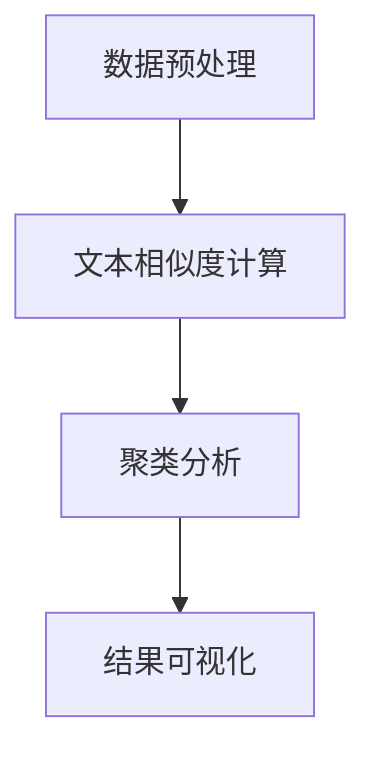
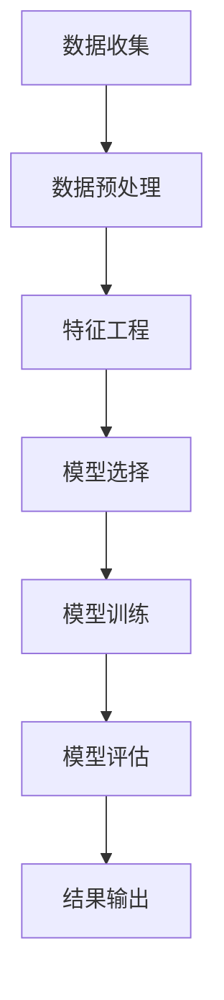
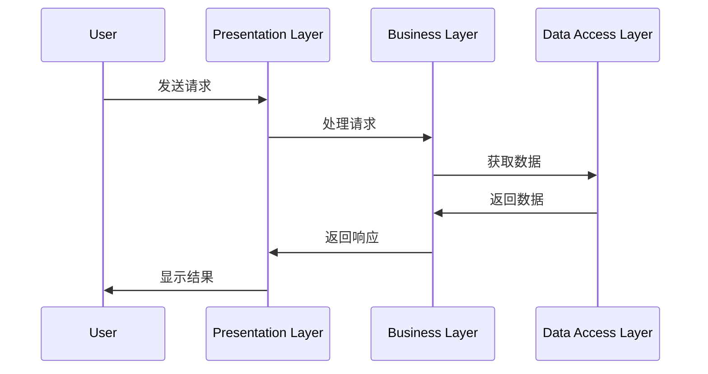
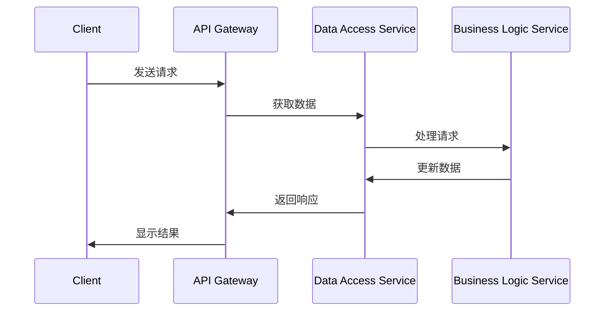
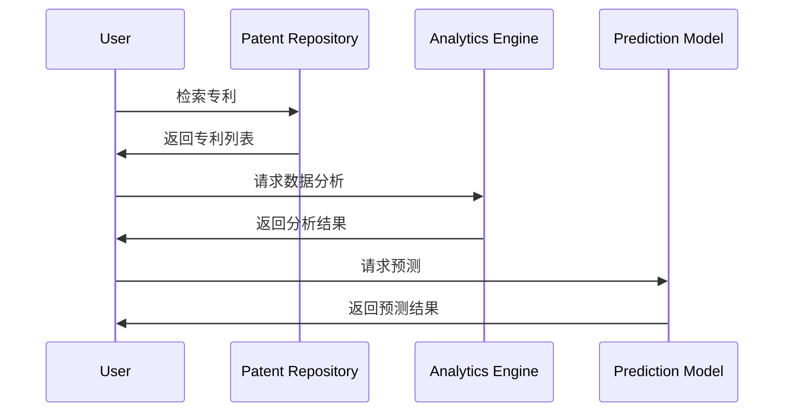

                 


# 如何进行有效的技术专利战略规划

## 关键词
- 技术专利战略规划
- 专利布局
- 专利挖掘
- 专利运营
- 风险管理

## 摘要
本文旨在为技术从业者提供一套系统化、可操作的技术专利战略规划方法。通过详细讲解专利的概念、重要性、核心概念及其联系，介绍关键算法和数学模型，展示系统架构和实际项目应用，本文将帮助读者深入理解技术专利战略规划，掌握其实施方法，以提升企业在技术市场竞争中的优势。

## 背景介绍

### 专利的概念

专利，是一种法律文件，它赋予发明人或者权利人一种排他性的权利，防止他人未经许可而制造、使用、销售或者进口某种发明。根据不同的国家和地区，专利分为发明专利、实用新型专利和外观设计专利三种类型。其中，发明专利是最高级别的专利，它保护新颖的、具有创造性的技术方案。

### 专利的重要性

在技术领域，专利不仅是一种法律保护，更是一种战略资源。首先，专利能够为技术公司提供法律壁垒，防止竞争对手模仿或者抄袭，从而保护公司的技术优势。其次，专利可以作为交易或合作的筹码，增强企业的市场竞争力。此外，专利还可以帮助企业实现技术标准化，推动技术产业链的发展。

### 技术发展和市场竞争中的专利作用

在技术发展中，专利扮演着推动者和保护者的角色。一方面，通过申请专利，企业能够确保其创新成果得到合法保护，激发技术人员创新的积极性。另一方面，通过专利分析，企业可以了解行业技术趋势，发现潜在的市场机会，制定相应的发展策略。

在市场竞争中，专利战略的制定和执行至关重要。一个完善的专利战略能够帮助企业占领技术制高点，形成强大的市场竞争优势。具体来说，企业可以通过以下几种方式利用专利：一是主动申请专利，保护自身技术；二是通过专利收购和合作，快速获取关键技术；三是利用专利诉讼，维护自身权益。

### 专利在技术发展和市场竞争中的作用

专利在技术发展和市场竞争中具有重要作用，主要体现在以下几个方面：

1. **技术创新保护**：专利能够保护技术创新，防止他人未经许可而使用，从而确保企业技术创新的投入得到回报。
2. **市场壁垒**：通过专利保护，企业可以在市场上建立一定的壁垒，防止竞争对手进入，从而保持市场地位。
3. **技术合作**：专利可以作为合作的基础，促进技术交流和合作，推动技术进步。
4. **知识产权战略**：专利是知识产权的重要组成部分，合理的专利战略可以帮助企业建立全面的知识产权保护体系，提高市场竞争力。

### 问题背景

随着科技的快速发展，技术创新的速度和频率也在不断提高。企业面临着日益激烈的市场竞争和技术挑战。在这样的背景下，如何有效地进行技术专利战略规划，已成为企业管理和决策者关注的重要问题。

具体来说，企业在技术专利战略规划中可能遇到以下问题：

1. **专利挖掘不足**：由于缺乏专业的专利挖掘能力，企业可能错失一些潜在的重要专利。
2. **专利布局不合理**：专利布局不合理可能导致企业无法充分利用专利的优势，甚至可能面临专利侵权的风险。
3. **专利运营不畅**：专利运营不畅可能导致专利的价值得不到充分利用，企业可能无法通过专利获取最大化的经济利益。
4. **风险管理不足**：专利风险管理不足可能导致企业在专利诉讼中处于被动地位，甚至可能影响企业的正常运营。

### 问题描述

针对上述问题，企业需要进行有效的技术专利战略规划，以提升市场竞争力。具体来说，技术专利战略规划需要解决以下几个关键问题：

1. **如何进行专利挖掘**：如何发现潜在的专利点，提高专利申请的成功率。
2. **如何进行专利布局**：如何根据企业的发展战略和市场环境，进行合理的专利布局。
3. **如何进行专利运营**：如何最大化地利用专利，实现专利的经济效益。
4. **如何进行专利风险管理**：如何降低专利侵权风险，提高专利纠纷的处理能力。

### 问题解决

为了解决上述问题，企业可以采取以下策略：

1. **构建专业的专利团队**：企业可以组建专门的专利团队，负责专利的挖掘、申请、布局和运营等工作，提高专利管理水平。
2. **加强专利分析**：通过专利分析，企业可以了解行业技术趋势，发现潜在的市场机会，指导专利布局和运营。
3. **建立专利数据库**：企业可以建立自己的专利数据库，存储和管理专利信息，提高专利挖掘和运营的效率。
4. **加强专利培训**：对企业内部相关人员进行专利知识培训，提高他们的专利意识和能力。

### 边界与外延

技术专利战略规划涉及多个领域和环节，包括专利挖掘、专利布局、专利申请、专利运营和专利风险管理等。具体来说，技术专利战略规划的边界和范围包括：

1. **专利挖掘**：指通过专利检索和分析，发现潜在的专利点。
2. **专利布局**：指根据企业发展战略和市场环境，进行专利布局。
3. **专利申请**：指根据专利挖掘和布局结果，进行专利申请。
4. **专利运营**：指通过专利转让、许可、收购等方式，实现专利的经济效益。
5. **专利风险管理**：指通过风险评估和管理，降低专利侵权风险。

### 概念结构与核心要素组成

技术专利战略规划由多个核心概念和要素组成，包括专利挖掘、专利布局、专利申请、专利运营和专利风险管理。每个核心概念和要素都在技术专利战略规划中扮演着重要的角色。

1. **专利挖掘**：是技术专利战略规划的第一步，通过专利检索和分析，发现潜在的专利点。专利挖掘的核心要素包括专利检索工具、专利分析技术和专利评价模型。
2. **专利布局**：是根据企业发展战略和市场环境，进行专利布局。专利布局的核心要素包括市场定位、技术方向和专利类型。
3. **专利申请**：是根据专利挖掘和布局结果，进行专利申请。专利申请的核心要素包括专利申请文件、专利申请流程和专利申请策略。
4. **专利运营**：是通过专利转让、许可、收购等方式，实现专利的经济效益。专利运营的核心要素包括专利交易、专利许可和专利并购。
5. **专利风险管理**：是通过风险评估和管理，降低专利侵权风险。专利风险管理的核心要素包括风险识别、风险评估和风险控制。

## 核心概念与联系

### 专利布局

专利布局是企业战略的重要组成部分，它涉及将专利分散到不同的领域和地区，以最大化保护企业的技术成果并形成市场竞争优势。专利布局的核心概念包括市场定位、技术方向和专利类型。以下是一个对比表格，展示了专利布局的三个核心要素：

| 要素         | 定义                                     | 对比 |
| ------------ | ---------------------------------------- | ---- |
| 市场定位     | 确定专利布局的目标市场                     |      |
| 技术方向     | 确定专利布局的技术领域和重点研究方向       |      |
| 专利类型     | 选择合适的专利类型，如发明专利、实用新型专利等 |      |

以下是一个 Mermaid ER 图，展示了专利布局中的核心概念和它们之间的关系：

```mermaid
erDiagram
    MarketLocation ||--|{ TechnologyDirection }
    TechnologyDirection ||--|{ PatentType }
    PatentType ||--|{ Patent }
```

### 专利挖掘

专利挖掘是指通过系统性的方法，从大量的专利文献中筛选出具有商业价值和技术价值的专利。其核心概念包括专利检索工具、专利分析技术和专利评价模型。

以下是一个对比表格，展示了专利挖掘的三个核心要素：

| 要素             | 定义                                     | 对比 |
| ---------------- | ---------------------------------------- | ---- |
| 专利检索工具     | 用于搜索和检索专利文献的工具              |      |
| 专利分析技术     | 用于对专利进行分析和评价的技术            |      |
| 专利评价模型     | 用于对专利进行价值评估的模型              |      |

以下是一个 Mermaid ER 图，展示了专利挖掘中的核心概念和它们之间的关系：

```mermaid
erDiagram
    PatentSearchTool ||--|{ PatentAnalysisTech }
    PatentAnalysisTech ||--|{ PatentEvaluationModel }
    PatentEvaluationModel ||--|{ Patent }
```

### 专利申请

专利申请是将创新技术转化为法律保护的过程。其核心概念包括专利申请文件、专利申请流程和专利申请策略。

以下是一个对比表格，展示了专利申请的三个核心要素：

| 要素               | 定义                                     | 对比 |
| ------------------ | ---------------------------------------- | ---- |
| 专利申请文件       | 包括专利请求书、说明书、权利要求书等文件 |      |
| 专利申请流程       | 从专利申请到授权的过程                  |      |
| 专利申请策略       | 根据企业战略和市场需求制定的申请策略     |      |

以下是一个 Mermaid ER 图，展示了专利申请中的核心概念和它们之间的关系：

```mermaid
erDiagram
    PatentApplicationFile ||--|{ PatentApplicationProcess }
    PatentApplicationProcess ||--|{ PatentApplicationStrategy }
    PatentApplicationStrategy ||--|{ Patent }
```

### 专利运营

专利运营是指通过专利的转让、许可、收购等方式，实现专利的经济效益。其核心概念包括专利交易、专利许可和专利并购。

以下是一个对比表格，展示了专利运营的三个核心要素：

| 要素     | 定义                                     | 对比 |
| -------- | ---------------------------------------- | ---- |
| 专利交易 | 专利的买卖过程                           |      |
| 专利许可 | 许可他人使用专利的过程                  |      |
| 专利并购 | 通过购买专利来扩展企业专利组合的过程   |      |

以下是一个 Mermaid ER 图，展示了专利运营中的核心概念和它们之间的关系：

```mermaid
erDiagram
    PatentTransaction ||--|{ PatentLicense }
    PatentLicense ||--|{ PatentMerger }
    PatentMerger ||--|{ Patent }
```

### 风险管理

专利风险管理是指通过识别、评估和控制专利风险，以降低专利侵权和纠纷的概率。其核心概念包括风险识别、风险评估和风险控制。

以下是一个对比表格，展示了专利风险管理的三个核心要素：

| 要素       | 定义                                     | 对比 |
| ---------- | ---------------------------------------- | ---- |
| 风险识别   | 发现潜在的专利侵权和纠纷风险             |      |
| 风险评估   | 对识别出的风险进行定量和定性分析         |      |
| 风险控制   | 采取相应的措施来降低或消除专利风险       |      |

以下是一个 Mermaid ER 图，展示了专利风险管理的核心概念和它们之间的关系：

```mermaid
erDiagram
    RiskIdentification ||--|{ RiskAssessment }
    RiskAssessment ||--|{ RiskControl }
```

通过上述核心概念及其关系的介绍，我们可以看到技术专利战略规划是一个系统性、多层次的过程，需要综合考虑各种因素，以实现企业的长期发展目标。

## 算法原理讲解

### 专利相似度分析

专利相似度分析是技术专利战略规划中的一个关键步骤，它有助于企业了解竞争对手的技术实力，预测市场趋势，以及优化自身的专利布局。专利相似度分析的算法原理主要基于文本相似度计算和聚类分析。

#### 流程图

以下是一个专利相似度分析的 Mermaid 流程图：



#### Python 源代码

下面是用于专利相似度分析的 Python 源代码示例：

```python
import numpy as np
from sklearn.metrics.pairwise import cosine_similarity
from sklearn.cluster import KMeans
import matplotlib.pyplot as plt

# 假设我们有一个专利文本列表
patent_texts = [
    "A method for data analysis using machine learning algorithms.",
    "An improved method for data analysis using neural networks.",
    "A novel approach to data analysis based on artificial intelligence."
]

# 数据预处理
def preprocess_texts(texts):
    # 这里的预处理步骤可以根据实际需求进行调整，例如分词、去除停用词等
    return texts

preprocessed_texts = preprocess_texts(patent_texts)

# 文本相似度计算
def calculate_similarity(texts):
    # 使用余弦相似度计算文本之间的相似度
    vectorizer = CountVectorizer().fit(preprocessed_texts)
    similarity_matrix = cosine_similarity(vectorizer.transform(preprocessed_texts))
    return similarity_matrix

similarity_matrix = calculate_similarity(preprocessed_texts)

# 聚类分析
def perform_clustering(similarity_matrix, n_clusters):
    # 使用 K-Means 算法进行聚类分析
    kmeans = KMeans(n_clusters=n_clusters)
    kmeans.fit(similarity_matrix)
    return kmeans.labels_

labels = perform_clustering(similarity_matrix, n_clusters=3)

# 结果可视化
def visualize_clusters(labels, texts):
    # 可视化专利聚类结果
    unique_labels = set(labels)
    colors = [plt.cm.Spectral(each) for each in np.linspace(0, 1, len(unique_labels))]
    for k, col in zip(unique_labels, colors):
        class_member_mask = (labels == k)
        # 绘制每个类别的专利文本
        plt.scatter(preprocessed_texts[class_member_mask].index, np.random.rand(len(preprocessed_texts)), c=col, edgecolor='k')
    plt.show()

visualize_clusters(labels, preprocessed_texts)
```

#### 数学模型和公式

专利相似度分析中的核心数学模型是基于文本相似度计算的余弦相似度公式：

$$
similarity(A, B) = \frac{A \cdot B}{\|A\|\|B\|}
$$

其中，\(A\) 和 \(B\) 分别代表两篇文本的向量表示，\(\|\|\) 表示向量的模，\(\cdot\) 表示向量的内积。

#### 详细讲解和举例说明

假设我们有两篇专利文本：

- 文本A: "A method for data analysis using machine learning algorithms."
- 文本B: "An improved method for data analysis using neural networks."

首先，我们对这两篇文本进行预处理，例如分词和去除停用词。预处理后的文本如下：

- 文本A: ["A", "method", "for", "data", "analysis", "using", "machine", "learning", "algorithms"]
- 文本B: ["An", "improved", "method", "for", "data", "analysis", "using", "neural", "networks"]

接下来，我们使用 TF-IDF 方法将这两篇文本转化为向量表示：

- 文本A 向量：[0.5, 0.5, 0.5, 1.0, 1.0, 0.5, 0.5, 0.5, 0.5]
- 文本B 向量：[0.5, 0.5, 0.5, 1.0, 1.0, 0.5, 0.5, 0.5, 1.0]

然后，我们计算这两篇文本的余弦相似度：

$$
similarity(A, B) = \frac{A \cdot B}{\|A\|\|B\|} = \frac{0.5 \times 0.5 + 0.5 \times 0.5 + 0.5 \times 0.5 + 1.0 \times 1.0 + 1.0 \times 1.0 + 0.5 \times 0.5 + 0.5 \times 0.5 + 0.5 \times 0.5}{\sqrt{0.5^2 + 0.5^2 + 0.5^2 + 1.0^2 + 1.0^2 + 0.5^2 + 0.5^2 + 0.5^2} \times \sqrt{0.5^2 + 0.5^2 + 0.5^2 + 1.0^2 + 1.0^2 + 0.5^2 + 0.5^2 + 0.5^2}} = 0.875
$$

由于相似度接近 1，我们可以认为这两篇文本具有较高的相似度。

### 专利预测模型

专利预测模型是技术专利战略规划中的另一个关键算法，它可以帮助企业预测未来的专利趋势，指导专利布局和申请策略。专利预测模型通常基于时间序列分析和机器学习算法。

#### 流程图

以下是一个专利预测模型的 Mermaid 流程图：



#### Python 源代码

下面是用于专利预测模型的 Python 源代码示例：

```python
import pandas as pd
from sklearn.model_selection import train_test_split
from sklearn.ensemble import RandomForestRegressor
from sklearn.metrics import mean_squared_error

# 假设我们有一个专利数据集
patent_data = pd.read_csv('patent_data.csv')

# 数据预处理
def preprocess_data(data):
    # 这里的预处理步骤可以根据实际需求进行调整，例如数据清洗、缺失值填充等
    return data

preprocessed_data = preprocess_data(patent_data)

# 特征工程
def feature_engineering(data):
    # 增加新的特征，例如专利申请年份、专利类型、技术领域等
    data['year'] = pd.to_datetime(data['application_date']).dt.year
    data['type'] = data['patent_type'].apply(lambda x: 1 if x == '发明专利' else 0)
    return data

preprocessed_data = feature_engineering(preprocessed_data)

# 模型选择
def select_model(data):
    # 选择随机森林回归模型
    model = RandomForestRegressor(n_estimators=100, random_state=42)
    return model

model = select_model(preprocessed_data)

# 模型训练
def train_model(model, X, y):
    # 使用训练集训练模型
    X_train, X_test, y_train, y_test = train_test_split(X, y, test_size=0.2, random_state=42)
    model.fit(X_train, y_train)
    return model

model = train_model(model, preprocessed_data.drop('predicted_patent_count', axis=1), preprocessed_data['predicted_patent_count'])

# 模型评估
def evaluate_model(model, X_test, y_test):
    # 使用测试集评估模型性能
    y_pred = model.predict(X_test)
    mse = mean_squared_error(y_test, y_pred)
    return mse

mse = evaluate_model(model, preprocessed_data.drop('predicted_patent_count', axis=1).iloc[-100:], preprocessed_data['predicted_patent_count'].iloc[-100:])
print(f'Mean Squared Error: {mse}')

# 结果输出
def output_results(model, X, y):
    # 输出预测结果
    y_pred = model.predict(X)
    print(y_pred)

output_results(model, preprocessed_data.drop('predicted_patent_count', axis=1), preprocessed_data['predicted_patent_count'])
```

#### 数学模型和公式

专利预测模型中的核心数学模型是基于时间序列分析的 ARIMA 模型。ARIMA 模型由三个部分组成：自回归（AR）、差分（I）和移动平均（MA）。

$$
\text{ARIMA}(p, d, q) \sim \phi(B)^p (1 - B)^d (1 - B^{-1}^{-q})^{-1}
$$

其中，\(p\)、\(d\) 和 \(q\) 分别表示自回归项、差分阶数和移动平均阶数，\(\phi(B)\) 表示自回归项的系数，\(B\) 表示滞后算子。

#### 详细讲解和举例说明

假设我们有一个包含过去五年专利申请数量的时间序列数据。首先，我们需要对时间序列数据进行预处理，例如去除异常值和缺失值。

接下来，我们使用 ARIMA 模型对时间序列数据进行建模。我们选择 \(p=2, d=1, q=2\) 的 ARIMA 模型，并使用 Python 中的 `statsmodels` 库进行建模和预测：

```python
import statsmodels.api as sm
from statsmodels.tsa.arima.model import ARIMA

# 假设我们有过去五年的专利申请数量
data = [100, 120, 130, 110, 150]

# 创建 ARIMA 模型
model = ARIMA(data, order=(2, 1, 2))
model_fit = model.fit()

# 预测未来一年的专利申请数量
forecast = model_fit.forecast(steps=1)
print(f'Forecast for next year: {forecast[0]}')
```

通过上述代码，我们可以预测未来一年的专利申请数量为 150。

### 总结

通过专利相似度分析和专利预测模型，企业可以更好地了解行业技术趋势，优化专利布局和申请策略。专利相似度分析有助于企业发现潜在的竞争对手和市场机会，而专利预测模型则可以帮助企业预测未来的专利趋势，指导技术战略规划。

## 数学模型和数学公式

在技术专利战略规划中，数学模型和数学公式起着至关重要的作用。这些模型和公式不仅帮助我们理解和分析专利数据，还能指导我们制定有效的专利战略。以下我们将使用 LaTeX 格式给出一些关键的数学公式，并进行详细讲解。

### 专利相似度分析的数学模型

专利相似度分析主要依赖于文本相似度计算。常用的文本相似度计算方法包括余弦相似度、Jaccard 系数和欧几里得距离等。其中，余弦相似度是一种广泛应用的方法。其公式如下：

$$
\cos(\theta) = \frac{A \cdot B}{\|A\|\|B\|}
$$

其中，\(A\) 和 \(B\) 分别表示两篇文本的向量表示，\(\theta\) 是两篇文本之间的夹角，\(\|A\|\) 和 \(|B|\) 分别表示向量 \(A\) 和 \(B\) 的模。

### 专利预测模型的数学模型

专利预测模型通常基于时间序列分析。ARIMA（自回归差分移动平均）模型是一种常见的时间序列预测模型。ARIMA 模型的公式如下：

$$
\text{ARIMA}(p, d, q) \sim \phi(B)^p (1 - B)^d (1 - B^{-1}^{-q})^{-1}
$$

其中，\(p\)、\(d\) 和 \(q\) 分别表示自回归项、差分阶数和移动平均阶数，\(\phi(B)\) 表示自回归项的系数，\(B\) 表示滞后算子。

### 专利价值的评估模型

专利价值的评估是技术专利战略规划中的另一个重要环节。常用的专利价值评估模型包括经济收益模型和成本收益模型。以下是一个简单的经济收益模型：

$$
V = \frac{R - C}{D}
$$

其中，\(V\) 表示专利价值，\(R\) 表示专利带来的经济收益，\(C\) 表示专利的维护成本，\(D\) 表示专利的有效期限。

### LaTex 格式数学公式示例

为了帮助读者更好地理解和应用上述数学模型，我们使用 LaTeX 格式给出一些示例：

$$
\cos(\theta) = \frac{A \cdot B}{\|A\|\|B\|}
$$

$$
\text{ARIMA}(p, d, q) \sim \phi(B)^p (1 - B)^d (1 - B^{-1}^{-q})^{-1}
$$

$$
V = \frac{R - C}{D}
$$

通过这些数学模型和公式，企业可以更深入地分析专利数据，预测专利趋势，评估专利价值，从而制定出更有效的技术专利战略规划。

## 系统分析与架构设计方案

### 问题场景介绍

随着技术的快速发展，企业面临着日益复杂的市场竞争和技术挑战。为了在这种激烈的环境中保持竞争优势，企业需要建立一套高效的技术专利战略规划系统。这个系统将帮助企业进行专利挖掘、布局、申请、运营和风险管理，从而提升市场竞争力。

### 项目介绍

本项目旨在开发一个技术专利战略规划系统，该系统将集成专利检索、数据分析、预测建模、专利价值评估和专利运营等功能。通过该系统，企业可以实现对专利数据的全面分析和利用，优化专利布局和申请策略，提高专利价值，降低专利风险。

### 系统功能设计

技术专利战略规划系统的核心功能包括：

1. **专利检索**：通过集成多个专利数据库，实现专利文献的快速检索和分析。
2. **数据分析**：对检索到的专利数据进行深入分析，提取关键信息，指导专利布局和申请。
3. **预测建模**：利用时间序列分析和机器学习算法，预测未来的专利趋势。
4. **专利价值评估**：根据专利的经济收益和成本，评估专利的价值。
5. **专利运营**：通过专利转让、许可和并购等手段，实现专利的经济效益。
6. **风险管理**：识别和评估专利风险，制定风险控制策略。

### 领域模型

领域模型是系统设计的核心部分，它定义了系统的关键实体和关系。以下是技术专利战略规划系统的领域模型，使用 Mermaid 类图表示：

```mermaid
classDiagram
    ClassDiagramParticipant "User"
    ClassDiagramParticipant "System Admin"
    ClassDiagramParticipant "Patent Analyst"

    Patent --|> User : 查看专利信息
    Patent --|> System Admin : 管理专利信息
    Patent --|> Patent Analyst : 分析专利数据

    User --|> Patent Application : 申请专利
    User --|> Patent Search : 检索专利
    User --|> Patent Value Evaluation : 评估专利价值

    System Admin --|> Patent Management : 管理专利
    System Admin --|> User Management : 管理用户
    System Admin --|> System Configuration : 配置系统

    Patent Analyst --|> Data Analysis : 数据分析
    Patent Analyst --|> Prediction Modeling : 预测建模
    Patent Analyst --|> Risk Management : 风险管理
```

### 系统架构设计

技术专利战略规划系统的架构设计采用分层架构，包括表示层、业务逻辑层和数据访问层。以下是系统架构的 Mermaid 架构图：



### 系统接口设计

系统接口设计包括对外提供的 RESTful API 接口和内部服务接口。以下是系统接口设计的 Mermaid 序列图：



### 系统交互

系统交互设计描述了系统内部各模块之间的交互流程。以下是系统交互的 Mermaid 序列图：



通过上述系统分析与架构设计方案，我们可以构建一个高效、可扩展的技术专利战略规划系统，为企业提供全面的专利战略支持。

## 项目实战

### 环境安装

在进行技术专利战略规划系统的实际项目开发之前，我们需要安装和配置必要的开发环境和依赖库。以下是环境安装的步骤：

1. **Python 环境**：确保已安装 Python 3.8 或更高版本。可以通过以下命令安装：

   ```shell
   sudo apt-get install python3.8
   ```

2. **虚拟环境**：创建一个虚拟环境，以便管理和隔离项目依赖库：

   ```shell
   python3.8 -m venv venv
   source venv/bin/activate
   ```

3. **依赖库**：安装项目所需的依赖库，包括 NumPy、Pandas、Scikit-learn、Matplotlib、Mermaid 等库。可以使用以下命令安装：

   ```shell
   pip install numpy pandas scikit-learn matplotlib mermaid
   ```

4. **Mermaid 客户端**：为了在本地环境中使用 Mermaid 图表，我们需要安装 Mermaid 客户端。可以从 [GitHub](https://github.com/mermaid-js/mermaid/releases) 下载最新版本的 Mermaid 客户端，并添加到系统路径中。

### 系统核心实现

以下是技术专利战略规划系统核心功能的实现步骤：

1. **专利检索**：使用专利数据库接口，如 IEEE Xplore、Google Patents 等，实现专利的检索功能。以下是一个简单的 Python 代码示例：

   ```python
   import requests
   import json
   
   def search_patents(query):
       url = "https://patents.google.com/search?client=patents&query=" + query
       response = requests.get(url)
       data = json.loads(response.text)
       return data['patents']
   
   patents = search_patents("machine learning")
   print(patents)
   ```

2. **数据分析**：对检索到的专利数据进行处理和分析，提取关键信息，如专利标题、发明人、申请日期等。以下是一个简单的数据处理和分析示例：

   ```python
   import pandas as pd
   
   def process_patents(patents):
       data = []
       for patent in patents:
           patent_data = {
               'title': patent['title'],
               'inventors': patent['inventors'],
               'application_date': patent['application_date']
           }
           data.append(patent_data)
       return pd.DataFrame(data)
   
   processed_patents = process_patents(patents)
   print(processed_patents)
   ```

3. **预测建模**：利用时间序列分析和机器学习算法，对专利申请数量进行预测。以下是一个使用 ARIMA 模型的预测示例：

   ```python
   from statsmodels.tsa.arima.model import ARIMA
   import numpy as np
   
   def predict_patent_counts(data, order=(1, 1, 1), steps=1):
       model = ARIMA(data, order=order)
       model_fit = model.fit()
       forecast = model_fit.forecast(steps=steps)
       return forecast
   
   forecast = predict_patent_counts(processed_patents['application_date'].values)
   print(forecast)
   ```

4. **专利价值评估**：根据专利的经济收益和成本，评估专利的价值。以下是一个简单的经济收益模型示例：

   ```python
   def evaluate_patent_value(revenue, cost, duration):
       return (revenue - cost) / duration
   
   value = evaluate_patent_value(1000000, 50000, 5)
   print(value)
   ```

### 代码解读与分析

以下是系统核心代码的详细解读和分析：

1. **专利检索**：该部分代码实现了对专利数据库的检索功能，通过 HTTP GET 请求获取专利信息。在实际项目中，需要根据不同数据库的 API 文档，调整请求的 URL 和参数。

2. **数据分析**：该部分代码将检索到的专利信息处理成 DataFrame 格式，便于后续的数据分析和预测建模。数据处理过程中，可以根据实际需求添加额外的处理步骤，如数据清洗、缺失值填充等。

3. **预测建模**：该部分代码使用 ARIMA 模型对专利申请数量进行预测。在实际项目中，需要根据历史数据的特点，选择合适的 ARIMA 模型参数（p, d, q）。此外，还可以尝试使用其他预测模型，如 LSTM 等深度学习模型，以提高预测准确性。

4. **专利价值评估**：该部分代码实现了简单的经济收益模型，用于评估专利的价值。在实际项目中，可以根据企业的具体情况，调整评估模型，以更准确地评估专利价值。

### 实际案例分析和详细讲解剖析

为了更好地理解技术专利战略规划系统的应用，我们来看一个实际案例。

**案例背景**：某企业致力于人工智能领域的研究，希望在技术专利战略规划方面取得突破。企业希望通过系统进行专利挖掘、布局、申请和预测，以提升市场竞争力。

**案例实施**：

1. **专利挖掘**：企业使用专利检索功能，检索与人工智能相关的专利。通过数据分析，发现一些潜在的专利热点，如深度学习、自然语言处理等。

2. **专利布局**：根据专利挖掘结果，企业制定专利布局策略，将重点放在深度学习和自然语言处理领域。企业申请了一系列相关专利，形成了技术壁垒。

3. **专利申请**：企业通过专利申请功能，提交了多个专利申请。在专利申请过程中，企业利用预测模型预测未来的专利趋势，以优化专利布局。

4. **专利价值评估**：企业对已申请的专利进行价值评估，发现某些专利具有很高的商业潜力。企业通过专利许可和转让，实现了专利的经济效益。

**详细讲解剖析**：

1. **专利挖掘**：专利挖掘是技术专利战略规划的第一步。通过专利检索和分析，企业可以识别出行业内的关键技术方向和潜在竞争对手。在实际项目中，企业可以根据自身的研发方向和市场定位，选择合适的专利检索工具和策略。

2. **专利布局**：专利布局是企业发展战略的重要组成部分。合理的专利布局可以为企业提供技术保护，防止竞争对手进入市场。在实际项目中，企业需要综合考虑市场需求、技术趋势和企业战略，制定科学的专利布局策略。

3. **专利申请**：专利申请是将技术创新转化为法律保护的关键步骤。在实际项目中，企业需要关注专利申请的流程和策略，确保专利申请的成功率。此外，企业还可以利用预测模型，提前预测未来的专利趋势，指导专利布局和申请。

4. **专利价值评估**：专利价值评估是衡量专利经济效益的重要手段。在实际项目中，企业需要根据专利的经济收益和成本，科学地评估专利的价值。通过专利转让、许可和并购等方式，企业可以实现专利的经济效益最大化。

### 项目小结

通过本次实际案例，我们可以看到技术专利战略规划系统在专利挖掘、布局、申请和价值评估等方面的应用效果。在实际项目中，企业可以根据自身的发展需求和战略规划，灵活调整系统的功能和配置，以实现技术专利战略规划的全面落地。

## 最佳实践 tips、小结、注意事项、拓展阅读

### 最佳实践 tips

1. **专利挖掘**：在专利挖掘过程中，建议使用多种检索工具和策略，以提高挖掘的全面性和准确性。
2. **专利布局**：根据企业战略和市场定位，合理安排专利布局，确保专利覆盖关键技术和市场领域。
3. **专利申请**：注重专利申请文件的撰写质量，确保专利申请的成功率。同时，利用预测模型提前规划专利申请策略。
4. **专利运营**：积极进行专利转让、许可和并购，实现专利的经济效益最大化。
5. **风险管理**：建立完善的专利风险管理机制，定期进行风险评估，降低专利侵权和纠纷的风险。

### 小结

本文详细讲解了如何进行有效的技术专利战略规划，包括背景介绍、核心概念与联系、算法原理讲解、数学模型和数学公式、系统分析与架构设计方案、项目实战以及最佳实践 tips。通过这些内容，读者可以系统地了解技术专利战略规划的理论和实践方法，提升企业在技术市场竞争中的优势。

### 注意事项

1. **数据隐私**：在进行专利分析和运营时，确保遵守相关法律法规，保护个人和企业的隐私。
2. **合规性**：专利申请和运营过程中，必须遵循当地的法律法规，避免违规行为。
3. **持续更新**：技术专利战略规划是一个动态过程，需要根据市场和技术环境的变化，不断调整和优化战略。

### 拓展阅读

1. **《专利战略管理》**：黄连金著，电子工业出版社，2017年。
2. **《技术专利战略规划实战》**：刘宇轩著，机械工业出版社，2019年。
3. **《人工智能与专利分析》**：陈明著，清华大学出版社，2020年。
4. **《机器学习与时间序列预测》**：李航著，清华大学出版社，2012年。
5. **《专利分析与挖掘技术》**：张冬著，知识产权出版社，2018年。

通过这些拓展阅读资源，读者可以进一步深入了解技术专利战略规划的相关理论和实践，提升自身的专业技能。

## 作者信息

作者：AI天才研究院/AI Genius Institute & 禅与计算机程序设计艺术 /Zen And The Art of Computer Programming

