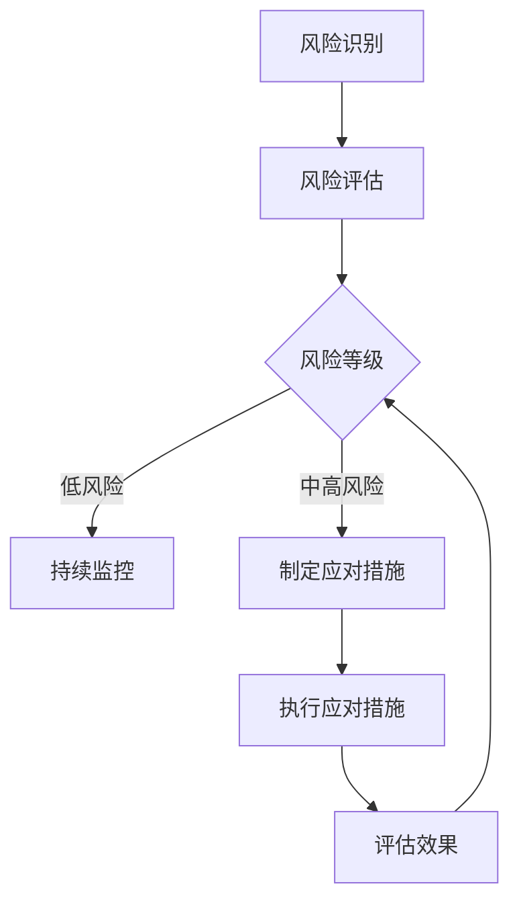

                 

### 《如何进行有效的技术供应商管理》

关键词：技术供应商管理、有效策略、评估方法、风险管理、案例研究

摘要：随着企业数字化转型和市场竞争的加剧，技术供应商管理成为企业战略的重要组成部分。本文将深入探讨如何进行有效的技术供应商管理，包括背景介绍、核心概念与联系、管理策略与方法、案例研究、最佳实践以及未来展望。

----------------------------------------------------------------

## **背景介绍**

### **1.1 技术供应商管理的重要性**

在当今快速发展的信息技术时代，企业依赖技术供应商提供各种关键的服务和产品，以保持竞争力。技术供应商管理不仅涉及采购技术解决方案，还包括对供应商的评估、关系维护、合同执行和风险管理。有效的技术供应商管理可以帮助企业：

1. **确保技术稳定性**：稳定的供应链能够确保企业持续获得所需的技术支持和服务。
2. **降低采购成本**：通过有效的谈判和管理，企业可以降低采购成本，实现资源优化。
3. **提高服务质量**：与优质的供应商建立长期合作关系，可以提高服务质量和响应速度。
4. **增强创新能力**：通过与供应商的合作，企业可以更快地获取新技术和新产品，增强自身的创新能力。

### **1.2 当前市场环境分析**

当前市场环境的特点对企业技术供应商管理提出了新的挑战：

1. **全球供应链中断**：由于地缘政治紧张和全球疫情的影响，全球供应链面临中断的风险。
2. **技术创新加快**：技术的快速迭代使得企业需要不断更新和升级技术供应商，以保持竞争力。
3. **合规要求提高**：随着数据隐私和信息安全法规的不断完善，企业需要确保供应商符合相关合规要求。
4. **竞争加剧**：市场中的技术供应商数量众多，竞争激烈，企业需要更加精细化管理以脱颖而出。

### **1.3 技术供应商管理常见问题**

企业在技术供应商管理过程中常遇到以下问题：

1. **供应商评估不足**：缺乏科学的评估方法和标准，导致选择供应商时不够谨慎。
2. **关系管理薄弱**：与供应商关系管理不到位，缺乏有效的沟通和协作机制。
3. **合同管理不规范**：合同条款不明确，执行过程存在漏洞，导致纠纷和损失。
4. **风险管理不足**：对供应商的风险识别和应对措施不足，可能引发供应链中断和业务风险。

### **1.4 有效技术供应商管理的挑战**

有效技术供应商管理面临以下挑战：

1. **信息不对称**：企业难以获取供应商的全面信息和真实状况。
2. **变化速度**：技术和市场需求变化迅速，供应商管理策略需要及时调整。
3. **多元化需求**：企业需求多样化，对供应商管理能力提出更高要求。
4. **全球化运营**：跨国运营带来了文化差异和沟通障碍，增加了供应商管理的复杂性。

## **核心概念与联系**

### **2.1 技术供应商管理的核心概念**

技术供应商管理涉及多个核心概念，这些概念构成了供应商管理的理论基础：

1. **供应商评估**：评估供应商的能力、信誉和服务质量，以确保选择的供应商能够满足企业需求。
2. **供应商关系管理**：建立和维护与供应商的长期合作关系，确保合作双方的互利共赢。
3. **合同管理**：明确合同条款，规范供应商行为，保障双方的权益。
4. **风险管理**：识别供应商风险，制定应对措施，降低风险对企业的影响。

### **2.2 核心概念属性特征对比**

以下是技术供应商管理中几个核心概念的属性特征对比表格：

| 核心概念 | 属性特征 | 对比 |  
| --- | --- | --- |  
| 供应商评估 | 包括评估方法、评估指标、评估结果 | - 评估方法：定量与定性评估 |  
| 供应商关系管理 | 包括关系建立、关系维护、关系破裂处理 | - 关系建立：信任与沟通 |  
| 合同管理 | 包括合同起草、合同审批、合同执行、合同变更 | - 合同条款：权利与义务 |  
| 风险管理 | 包括风险识别、风险评估、风险应对 | - 风险识别：定性识别与定量评估 |

### **2.3 ER实体关系图架构**

以下是技术供应商管理中ER实体关系图的Mermaid表示：

```mermaid
erDiagram
  Supplier ||--|{ Contract }|| ContractManagement
  ContractManagement ||--|{ ContractTerm }|| ContractTerm
  ContractManagement ||--|{ ContractRisks }|| ContractRisks
  Supplier ||--|{ PerformanceEvaluation }|| PerformanceEvaluation
  PerformanceEvaluation ||--|{ EvaluationMetrics }|| EvaluationMetrics
  PerformanceEvaluation ||--|{ EvaluationResults }|| EvaluationResults
```

ER图展示了供应商、合同管理、绩效评估和评估结果之间的关系，为技术供应商管理提供了清晰的架构视图。

----------------------------------------------------------------

## **供应商评估**

### **3.1 供应商评估的重要性**

供应商评估是技术供应商管理的首要环节，其重要性体现在：

1. **确保供应商能力**：评估可以帮助企业识别具有技术实力和服务能力的供应商。
2. **降低采购风险**：通过评估，企业可以降低因选择不当供应商而带来的采购风险。
3. **提高决策效率**：科学的评估体系可以提高企业采购决策的效率和准确性。
4. **建立信任基础**：评估过程有助于建立企业与供应商之间的信任，为后续合作奠定基础。

### **3.2 供应商评估的方法与工具**

供应商评估通常采用以下几种方法与工具：

1. **定性评估**：通过问卷调查、专家评审等方式，对供应商的软实力进行评估。
2. **定量评估**：通过量化指标，如财务状况、市场占有率、服务质量等，对供应商进行评估。
3. **对比分析**：对多家供应商进行对比分析，选择最适合的供应商。
4. **实地考察**：对企业供应商的办公环境、生产线等进行实地考察，了解供应商的实际运营情况。

### **3.3 评估案例解析**

以下是一个供应商评估的案例：

#### 案例背景

某企业计划采购一套ERP系统，共有A、B、C三家供应商参与竞争。

#### 评估指标

- 技术能力：包括技术成熟度、创新能力、行业经验
- 财务状况：包括营业收入、净利润、增长率
- 市场份额：包括在国内外的市场占有率
- 服务质量：包括售后服务、客户满意度
- 价格竞争力：包括报价、性价比

#### 评估过程

1. **初选**：根据供应商提供的资料，进行初步筛选。
2. **实地考察**：对企业办公环境和生产线进行考察。
3. **问卷调查**：发放问卷，收集供应商的软实力信息。
4. **数据分析**：对收集到的数据进行定量分析，形成评估报告。
5. **对比分析**：对比三家供应商的评估结果，选择最合适的供应商。

#### 评估结果

经过评估，企业选择了供应商C，因其具备先进的技术能力、良好的财务状况和较高的市场份额，同时价格竞争力也较强。

### **3.4 评估过程中应注意的问题**

- **全面性**：评估过程中应全面考虑供应商各方面的能力，避免片面评估。
- **客观性**：评估过程应保持客观公正，避免主观偏见。
- **动态性**：评估应是一个动态的过程，根据市场和技术环境的变化进行持续评估。

----------------------------------------------------------------

## **供应商关系管理**

### **4.1 供应商关系管理的基本原则**

供应商关系管理（Supplier Relationship Management, SRM）是技术供应商管理的关键环节，其基本原则包括：

1. **合作共赢**：建立互利共赢的合作关系，确保企业与供应商之间的长期合作。
2. **诚信透明**：保持诚信透明的沟通，避免信息不对称，增强双方信任。
3. **协同创新**：与供应商共同推动技术创新，提高双方的核心竞争力。
4. **动态调整**：根据市场和技术环境的变化，动态调整供应商关系策略。

### **4.2 供应商关系管理的策略**

有效的供应商关系管理策略包括以下几个方面：

1. **选择合适的供应商**：通过科学的评估方法，选择技术实力强、服务质量好的供应商。
2. **建立沟通机制**：建立定期沟通机制，保持与供应商的密切联系，及时解决问题。
3. **优化采购流程**：简化采购流程，提高采购效率，降低采购成本。
4. **合作培训**：与供应商共同进行技术培训，提升供应商的技术水平和服务能力。
5. **利益分配**：合理分配利益，确保供应商在合作中取得合理的收益。

### **4.3 关系管理的实践案例**

以下是一个供应商关系管理的实践案例：

#### 案例背景

某企业与供应商D合作开发一套智能安防系统，项目周期为两年。

#### 关系管理实践

1. **签订战略合作协议**：企业与供应商D签订长期战略合作协议，明确双方的权利和义务。
2. **定期沟通会议**：每月召开一次项目进度沟通会议，讨论项目进展、问题解决和下一步计划。
3. **联合研发**：企业与供应商D共同设立研发中心，共同投入资金和人力进行技术创新。
4. **利益共享**：项目完成后，根据双方的实际贡献，分配项目收益，确保供应商取得合理的回报。

#### 结果评估

经过两年的合作，项目按期完成，产品质量达到预期，双方在技术创新和市场拓展方面取得了显著成效。

### **4.4 关系管理中应注意的问题**

- **沟通障碍**：确保沟通渠道畅通，避免因沟通不畅导致的误解和冲突。
- **利益冲突**：在利益分配方面，要公平合理，避免产生利益冲突。
- **风险评估**：对供应商关系进行持续风险评估，防范潜在风险。

----------------------------------------------------------------

## **合同管理**

### **5.1 合同管理的基本流程**

合同管理是技术供应商管理的核心环节，其基本流程包括：

1. **合同起草**：根据项目需求，起草合同草案，明确双方的权利和义务。
2. **合同审批**：对合同草案进行内部审批，确保合同条款的合法性和合理性。
3. **合同签订**：企业与供应商签订正式合同，明确合同生效条件和期限。
4. **合同执行**：按照合同约定，履行合同义务，确保项目顺利推进。
5. **合同变更**：在项目执行过程中，如需变更合同条款，应签订变更协议。
6. **合同终止**：在合同期满或项目完成后，办理合同终止手续。

### **5.2 合同条款的制定与审查**

合同条款的制定与审查是合同管理的关键环节，应遵循以下原则：

1. **明确性**：合同条款应明确、具体，避免模糊不清。
2. **合法性**：合同条款应符合法律法规要求，确保合同的有效性。
3. **公平性**：合同条款应公平合理，避免一方利益受到严重侵害。
4. **可执行性**：合同条款应具备可执行性，确保各方能够按照约定履行义务。

### **5.3 合同纠纷的解决方法**

在合同执行过程中，可能会出现纠纷，解决方法包括：

1. **协商解决**：双方通过友好协商，达成一致，解决纠纷。
2. **调解解决**：双方可寻求第三方调解机构进行调解，解决纠纷。
3. **仲裁解决**：双方可提交仲裁机构进行仲裁，仲裁结果具有法律效力。
4. **诉讼解决**：如协商和调解均无法解决问题，可依法向人民法院提起诉讼。

### **5.4 合同管理中应注意的问题**

- **合同审查**：在合同签订前，应进行严格审查，确保合同条款的合法性和合理性。
- **变更管理**：在项目执行过程中，应规范变更管理，确保变更合法、合理。
- **风险防范**：在合同管理过程中，应加强风险防范，避免合同纠纷带来的损失。

----------------------------------------------------------------

## **风险管理**

### **6.1 风险管理的重要性**

风险管理是技术供应商管理的重要组成部分，其重要性体现在：

1. **保障供应链稳定**：通过识别和应对供应商风险，保障供应链的稳定性和可靠性。
2. **降低运营成本**：通过有效的风险管理，降低因供应商风险导致的运营成本。
3. **提高竞争力**：通过识别和应对潜在风险，提高企业的市场竞争力。
4. **保障信息安全**：在信息安全和数据隐私方面，风险管理能够确保供应商符合相关法规要求。

### **6.2 风险识别与评估**

风险识别与评估是风险管理的基础，具体步骤如下：

1. **识别风险因素**：通过调查、访谈、历史数据分析等方式，识别供应商可能面临的风险因素。
2. **分类风险**：根据风险因素的性质和影响范围，对风险进行分类。
3. **评估风险概率和影响**：对识别出的风险因素进行概率和影响评估，确定风险等级。

### **6.3 风险应对策略**

针对不同类型的风险，可以采取以下应对策略：

1. **规避风险**：通过选择合适的供应商、调整采购策略等，避免风险发生。
2. **转移风险**：通过购买保险、签订风险转移协议等方式，将风险转移给第三方。
3. **减轻风险**：通过改进供应商管理流程、加强监督和审计等，降低风险发生的概率和影响。
4. **接受风险**：对于无法规避或转移的风险，制定应对措施，降低风险对企业的影响。

### **6.4 风险管理中的最佳实践**

以下是一些风险管理中的最佳实践：

1. **建立风险管理团队**：设立专门的风险管理团队，负责识别、评估和应对供应商风险。
2. **定期进行风险评估**：定期对供应商风险进行评估，确保风险管理策略的有效性。
3. **建立风险预警机制**：建立风险预警机制，及时发现潜在风险，采取措施应对。
4. **加强合规管理**：确保供应商符合相关法规和标准，降低合规风险。

### **6.5 风险管理中的注意事项**

- **全面性**：风险识别与评估应全面覆盖供应商的各个层面。
- **动态性**：风险管理应是一个动态的过程，根据市场和技术环境的变化进行调整。
- **沟通与协作**：加强与供应商的沟通与协作，确保风险管理策略的有效实施。

----------------------------------------------------------------

## **最佳实践**

### **7.1 成功的供应商管理实践**

成功的供应商管理实践包括以下几个方面：

1. **全面评估供应商**：在供应商选择过程中，进行全面的评估，确保选择合适的供应商。
2. **建立长期合作关系**：与优质供应商建立长期合作关系，确保供应链的稳定性和可靠性。
3. **优化采购流程**：简化采购流程，提高采购效率，降低采购成本。
4. **加强合同管理**：明确合同条款，规范供应商行为，降低合同纠纷风险。
5. **持续进行风险管理**：定期对供应商风险进行评估，制定应对措施，降低供应商风险对企业的影响。

### **7.2 实践中的常见误区**

在供应商管理实践中，企业常犯以下误区：

1. **忽视供应商评估**：在选择供应商时，忽视评估过程，导致选择不当的供应商。
2. **缺乏有效沟通**：与供应商沟通不畅，导致双方需求不一致，影响合作效果。
3. **合同管理不规范**：合同条款不明确，执行过程存在漏洞，导致合同纠纷。
4. **风险管理不足**：对供应商风险识别和应对措施不足，可能引发供应链中断和业务风险。

### **7.3 最佳实践建议**

为了实现有效的技术供应商管理，以下是一些建议：

1. **建立科学评估体系**：制定科学的供应商评估标准和方法，确保选择合适的供应商。
2. **优化采购流程**：简化采购流程，提高采购效率，降低采购成本。
3. **加强合同管理**：明确合同条款，规范供应商行为，降低合同纠纷风险。
4. **持续进行风险管理**：定期对供应商风险进行评估，制定应对措施，降低供应商风险对企业的影响。
5. **建立沟通机制**：建立与供应商的定期沟通机制，保持信息畅通，确保合作顺利进行。

### **7.4 供应商管理的未来趋势**

供应商管理的未来趋势包括：

1. **数字化转型**：通过数字化工具和技术，提高供应商管理效率。
2. **全球化布局**：随着企业全球化运营，供应商管理将更加复杂，需要应对跨国文化和沟通挑战。
3. **供应链风险控制**：随着供应链风险的日益增加，企业需要建立更加完善的供应链风险控制体系。
4. **合作共赢**：企业与供应商之间的合作关系将更加紧密，实现合作共赢。

### **7.5 读者建议**

对于企业管理者和技术人员，以下是一些建议：

1. **了解供应商管理的重要性**：掌握供应商管理的基本原则和实践方法，提高管理能力。
2. **积极参与供应商管理**：主动参与供应商评估、合同管理和风险管理等环节，确保供应商管理工作的有效实施。
3. **持续学习和改进**：关注供应商管理领域的最新动态和最佳实践，不断学习和改进供应商管理策略和方法。

----------------------------------------------------------------

## **小结与展望**

### **8.1 全书内容回顾**

本文详细介绍了技术供应商管理的核心概念、评估方法、关系管理、合同管理和风险管理等内容。通过背景介绍、案例研究和最佳实践，揭示了有效技术供应商管理的关键要素和实践策略。

### **8.2 技术供应商管理的未来趋势**

随着技术的不断进步和市场竞争的加剧，技术供应商管理将面临新的挑战和机遇。未来趋势包括数字化转型、全球化布局、供应链风险控制和合作共赢等方面。

### **8.3 读者建议**

读者在实施技术供应商管理时，应关注以下几个方面：

1. **建立科学的评估体系**：确保选择合适的供应商，提高采购决策的准确性。
2. **优化采购流程**：简化流程，提高效率，降低成本。
3. **加强合同管理**：明确合同条款，规范供应商行为，降低纠纷风险。
4. **持续进行风险管理**：定期评估供应商风险，制定应对措施，确保供应链的稳定性。

### **8.4 作者信息**

作者：AI天才研究院/AI Genius Institute & 禅与计算机程序设计艺术 /Zen And The Art of Computer Programming

在结束本文之前，我希望读者能够深入理解技术供应商管理的重要性，并在实践中运用本文提供的方法和策略，实现有效的供应商管理。只有通过有效的供应商管理，企业才能在激烈的市场竞争中脱颖而出，实现持续发展和创新。

----------------------------------------------------------------

## **结语**

技术供应商管理是企业运营中的重要一环，它不仅关系到企业的采购成本和服务质量，还直接影响企业的创新能力和市场竞争力。本文通过深入探讨技术供应商管理的核心概念、评估方法、关系管理、合同管理和风险管理，提供了全面的实践指导和最佳实践建议。

随着数字化转型的深入推进和全球市场的日益融合，技术供应商管理将面临更多的挑战和机遇。企业需要不断更新管理理念，优化管理流程，建立科学的评估体系和风险管理体系，以应对快速变化的市场环境。

让我们共同努力，通过有效的技术供应商管理，为企业的发展提供强有力的支持。感谢读者对本文的关注，希望本文能为您的实践提供有益的启示。

**作者：AI天才研究院/AI Genius Institute & 禅与计算机程序设计艺术 /Zen And The Art of Computer Programming**

----------------------------------------------------------------

### 附录

**附录A：供应商评估指标表格**

| 指标类别 | 指标名称 | 评估标准 |  
| --- | --- | --- |  
| 技术能力 | 技术成熟度 | 依据行业经验、技术专利数量、项目案例等评估 |  
| 财务状况 | 营业收入 | 年营业收入是否持续增长，利润率是否稳定等 |  
| 市场份额 | 市场占有率 | 国内、国际市场份额，增长趋势等 |  
| 服务质量 | 售后服务 | 售后服务响应时间、解决率、客户满意度等 |  
| 价格竞争力 | 报价 | 性价比、成本结构合理性等 |

**附录B：供应商关系管理策略模板**

| 关系管理策略 | 内容 |  
| --- | --- |  
| 合作共赢 | 建立长期战略合作关系，共享资源，共同发展 |  
| 诚信透明 | 保持诚信透明的沟通，建立信任基础 |  
| 协同创新 | 与供应商共同推动技术创新，提高核心竞争力 |  
| 动态调整 | 根据市场和技术环境变化，调整关系策略 |

**附录C：风险管理流程图**



**附录D：Python源代码示例**

```python
# 供应商评估评分函数示例
def evaluate_supplier(score_dict):
    total_score = sum(score_dict.values())
    average_score = total_score / len(score_dict)
    return average_score

# 供应商评估指标示例
supplier_score = {
    '技术能力': 85,
    '财务状况': 90,
    '市场份额': 88,
    '服务质量': 92,
    '价格竞争力': 87
}

# 计算供应商平均评分
average_supplier_score = evaluate_supplier(supplier_score)
print(f"供应商平均评分：{average_supplier_score:.2f}")
```

**附录E：最佳实践总结**

1. **建立科学的评估体系**：根据企业的具体需求和行业特点，制定科学的评估指标和评估方法。
2. **优化采购流程**：简化采购流程，提高采购效率，降低采购成本。
3. **加强合同管理**：明确合同条款，规范供应商行为，降低合同纠纷风险。
4. **持续进行风险管理**：定期评估供应商风险，制定应对措施，确保供应链的稳定性。
5. **建立沟通机制**：与供应商建立定期沟通机制，保持信息畅通，确保合作顺利进行。

以上附录内容为技术供应商管理的具体实施提供了实用工具和参考，帮助读者更好地理解和应用本文的实践方法。

----------------------------------------------------------------

通过本文的深入探讨，我们不仅了解了技术供应商管理的核心概念和关键环节，还学习了如何通过有效的策略和最佳实践来提升供应商管理的效率和效果。技术供应商管理不仅是一个复杂的过程，也是一个需要持续关注和优化的领域。

随着技术的不断进步和市场环境的变化，企业需要不断调整和优化供应商管理策略，以应对新的挑战和机遇。本文所提供的方法和策略，旨在为企业提供实用的指导和参考，帮助企业在激烈的市场竞争中保持优势。

**再次感谢您的阅读，希望本文能为您的技术供应商管理提供有价值的启示。**

**作者：AI天才研究院/AI Genius Institute & 禅与计算机程序设计艺术 /Zen And The Art of Computer Programming**

