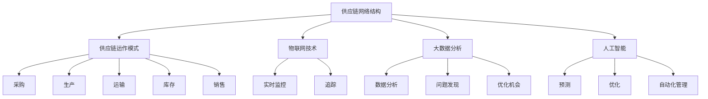
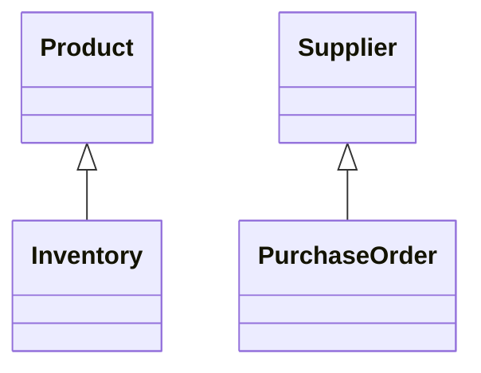
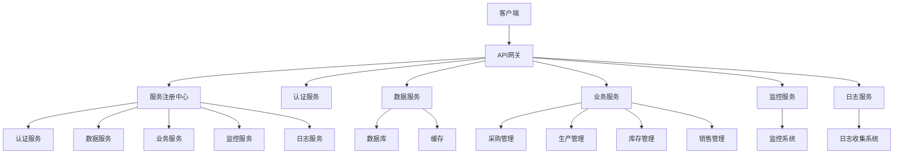
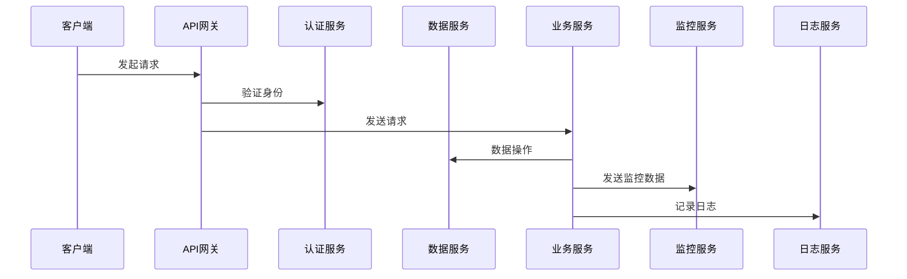

                 


## 如何进行有效的技术供应链管理

### 1. 引言

随着全球化和信息技术的迅猛发展，供应链管理已经成为企业竞争的关键因素之一。传统的供应链管理主要关注物资的采购、运输、库存和销售等环节，而现代供应链管理则强调将技术与供应链深度融合，通过优化各个环节提高效率、降低成本和提升客户满意度。技术供应链管理，即通过引入物联网、大数据分析、人工智能等技术手段，对供应链的各个环节进行实时监控、分析和优化，从而实现供应链的智能化管理。

本文将从以下几个方面探讨如何进行有效的技术供应链管理：

1. **核心概念与联系**：介绍供应链管理中的关键概念，并使用Mermaid流程图展示各概念之间的关系。
2. **算法原理讲解**：讲解供应链管理中的算法原理，包括必要的数学模型和公式，并用Python代码示例来阐述。
3. **系统分析与架构设计方案**：介绍供应链管理系统设计的关键步骤，包括功能设计、架构设计、接口设计和交互设计。
4. **项目实战**：模拟一个供应链管理项目，详细描述环境安装、系统核心实现、代码解读和分析、实际案例剖析。
5. **最佳实践 tips**：提供一些实施技术供应链管理的最佳实践。
6. **小结**：总结全书内容，强调关键点，并给出未来趋势和进一步阅读的建议。

### 2. 核心概念与联系

供应链管理是一个复杂的系统，涉及到多个环节和参与者。以下是供应链管理中的关键概念：

- **供应链网络结构**：描述物资从供应商到最终消费者的整个流程。
- **供应链的运作模式**：包括采购、生产、运输、库存和销售等环节。
- **物联网技术**：通过传感器、射频识别（RFID）等技术实现供应链的实时监控和追踪。
- **大数据分析**：对供应链中的海量数据进行分析，以发现潜在的问题和优化机会。
- **人工智能**：利用机器学习、深度学习等技术对供应链进行预测、优化和自动化管理。

以下是这些概念之间的Mermaid流程图展示：



通过这个流程图，我们可以清晰地看到各个概念之间的联系，以及它们在供应链管理中的作用。

### 3. 算法原理讲解

供应链管理的核心在于优化，而优化通常涉及到数学模型和算法的应用。以下是几种常见的供应链优化算法及其原理：

#### 3.1 线性规划算法

线性规划是一种数学优化方法，用于在给定约束条件下求解线性目标函数的最大值或最小值。以下是线性规划的一个简单例子：

$$
\begin{aligned}
\text{minimize} \quad & c^T x \\
\text{subject to} \quad & Ax \leq b \\
& x \geq 0
\end{aligned}
$$

其中，$c$ 是系数向量，$x$ 是决策变量，$A$ 是约束条件矩阵，$b$ 是约束条件向量。

下面是一个使用Python的`scipy.optimize`模块解决线性规划问题的示例代码：

```python
from scipy.optimize import linprog

# 系数向量
c = [-1, -1]
# 约束条件矩阵
A = [[2, 1], [1, 1]]
# 约束条件向量
b = [4, 2]
# 求解线性规划问题
result = linprog(c, A_ub=A, b_ub=b, method='highs')

print(result.x)
```

输出结果将是线性规划问题的最优解。

#### 3.2 整数规划算法

整数规划是一种特殊的线性规划，其中决策变量被限制为整数。以下是一个整数规划的问题示例：

$$
\begin{aligned}
\text{minimize} \quad & c^T x \\
\text{subject to} \quad & Ax \leq b \\
& x \in \{0, 1\}^n
\end{aligned}
$$

下面是一个使用Python的`scipy.optimize`模块解决整数规划问题的示例代码：

```python
from scipy.optimize import linprog

# 系数向量
c = [-1, -1]
# 约束条件矩阵
A = [[2, 1], [1, 1]]
# 约束条件向量
b = [4, 2]
# 求解整数规划问题
result = linprog(c, A_ub=A, b_ub=b, method='highs', integer=True)

print(result.x)
```

输出结果将是整数规划问题的最优解。

#### 3.3 启发式算法

启发式算法是一类不保证全局最优但能快速找到近似最优解的算法。以下是遗传算法的一个简单示例：

```python
import numpy as np

# 初始化种群
population = np.random.randint(2, size=100)

# 定义适应度函数
def fitness(x):
    return np.sum(x)

# 定义交叉操作
def crossover(parent1, parent2):
    crossover_point = np.random.randint(0, len(parent1))
    child1 = np.concatenate((parent1[:crossover_point], parent2[crossover_point:]))
    child2 = np.concatenate((parent2[:crossover_point], parent1[crossover_point:]))
    return child1, child2

# 定义变异操作
def mutate(individual, mutation_rate=0.01):
    for i in range(len(individual)):
        if np.random.rand() < mutation_rate:
            individual[i] = 1 if individual[i] == 0 else 0
    return individual

# 进化循环
for generation in range(100):
    # 计算适应度
    fitness_scores = np.array([fitness(individual) for individual in population])
    # 选择
    selected = population[fitness_scores.argsort()[:-20:-1]]
    # 交叉和变异
    for i in range(0, len(selected), 2):
        parent1, parent2 = selected[i], selected[i+1]
        child1, child2 = crossover(parent1, parent2)
        population[i] = mutate(child1)
        population[i+1] = mutate(child2)

# 输出最优解
best_fitness = np.max(fitness_scores)
best_individual = population[fitness_scores.argmax()]
print("最优解：", best_individual)
print("最优适应度：", best_fitness)
```

这个示例演示了遗传算法的基本流程，包括初始化种群、计算适应度、选择、交叉和变异。

### 4. 系统分析与架构设计方案

一个有效的供应链管理系统需要良好的设计和架构，以确保系统的可扩展性、可靠性和高效性。以下是供应链管理系统设计的关键步骤：

#### 4.1 问题场景介绍

假设我们正在为一家大型制造企业设计一个供应链管理系统，该系统需要实现以下功能：

- **采购管理**：实时监控供应商的交货状态，管理采购订单。
- **生产管理**：监控生产进度，管理生产计划。
- **库存管理**：实时监控库存水平，实现库存优化。
- **销售管理**：管理销售订单，实现销售预测。

#### 4.2 项目介绍

项目目标：

- 设计一个高效、可靠的供应链管理系统。
- 实现对采购、生产、库存和销售的实时监控和优化。
- 提高企业的供应链管理效率，降低成本。

项目范围：

- **功能模块**：采购管理、生产管理、库存管理和销售管理。
- **技术栈**：使用Java作为开发语言，Spring Boot作为框架，MySQL作为数据库，Redis作为缓存。

#### 4.3 系统功能设计

系统功能设计包括领域模型的设计，以下是采购管理模块的领域模型：



- **Product**（产品）：描述产品的属性，如名称、价格、库存量等。
- **Inventory**（库存）：描述库存的状态，如库存数量、库存地点等。
- **Supplier**（供应商）：描述供应商的信息，如名称、联系方式等。
- **PurchaseOrder**（采购订单）：描述采购订单的信息，如订单号、订单日期、订单状态等。

#### 4.4 系统架构设计

以下是供应链管理系统的架构设计：



- **API网关**：统一处理客户端请求，进行路由和认证。
- **服务注册中心**：管理各个服务的注册和发现。
- **认证服务**：提供用户认证功能。
- **数据服务**：提供数据的存储、查询和操作。
- **业务服务**：实现具体的业务功能。
- **监控服务**：监控系统的运行状态。
- **日志服务**：记录系统的日志信息。

#### 4.5 系统接口设计和交互设计

以下是系统接口设计和交互设计：



客户端通过API网关发起请求，API网关进行身份验证后，将请求转发给业务服务，业务服务进行数据操作，并将监控数据和日志信息发送给监控服务和日志服务。

### 5. 项目实战

#### 5.1 环境安装

首先，我们需要搭建一个供应链管理系统的开发环境。以下是环境安装的步骤：

1. 安装Java开发工具包（JDK）。
2. 安装MySQL数据库。
3. 安装Redis缓存。
4. 安装Spring Boot开发工具（Spring Tool Suite）。

#### 5.2 系统核心实现

以下是供应链管理系统的核心实现：

```java
// 采购管理模块
@RestController
@RequestMapping("/api/purchase")
public class PurchaseController {

    @Autowired
    private PurchaseService purchaseService;

    @PostMapping
    public ResponseEntity<PurchaseOrder> createPurchaseOrder(@RequestBody PurchaseOrderRequest request) {
        PurchaseOrder purchaseOrder = purchaseService.createPurchaseOrder(request);
        return new ResponseEntity<>(purchaseOrder, HttpStatus.CREATED);
    }

    @GetMapping("/{orderId}")
    public ResponseEntity<PurchaseOrder> getPurchaseOrder(@PathVariable Long orderId) {
        PurchaseOrder purchaseOrder = purchaseService.getPurchaseOrder(orderId);
        return new ResponseEntity<>(purchaseOrder, HttpStatus.OK);
    }
}

// 采购服务模块
@Service
public class PurchaseService {

    @Autowired
    private PurchaseRepository purchaseRepository;

    public PurchaseOrder createPurchaseOrder(PurchaseOrderRequest request) {
        PurchaseOrder purchaseOrder = new PurchaseOrder();
        purchaseOrder.setOrderId(request.getOrderId());
        purchaseOrder.setOrderDate(new Date());
        purchaseOrder.setStatus(PurchaseOrderStatus.PENDING);
        return purchaseRepository.save(purchaseOrder);
    }

    public PurchaseOrder getPurchaseOrder(Long orderId) {
        return purchaseRepository.findById(orderId).orElseThrow(() -> new ResourceNotFoundException("采购订单不存在"));
    }
}
```

#### 5.3 代码解读与分析

以上代码实现了采购管理模块的REST接口和业务逻辑。`PurchaseController` 类定义了创建和获取采购订单的接口方法，`PurchaseService` 类实现了具体的业务逻辑。通过使用Spring框架，我们可以方便地实现接口和业务逻辑的分离，提高代码的可维护性和可扩展性。

#### 5.4 实际案例剖析

假设我们需要为一家制造企业实现采购管理模块，以下是一个实际案例的剖析：

1. **需求分析**：分析企业的采购流程，确定需要实现的功能，如创建采购订单、查询采购订单等。
2. **功能设计**：设计采购管理模块的领域模型，确定接口和方法。
3. **实现与测试**：实现采购管理模块，并进行功能测试和性能测试。
4. **部署与运维**：将采购管理模块部署到生产环境，并监控其运行状态。

#### 5.5 项目小结

通过以上实战案例，我们实现了采购管理模块的功能，并对其进行了详细的解读和分析。接下来，我们将继续实现生产管理、库存管理和销售管理模块，完成整个供应链管理系统的开发。

### 6. 最佳实践 tips

以下是实施技术供应链管理的最佳实践：

1. **数据质量管理**：确保数据的准确性、完整性和一致性，为供应链管理提供可靠的数据基础。
2. **灵活的供应链网络设计**：根据市场变化和客户需求，灵活调整供应链网络，以降低成本和提高响应速度。
3. **实时监控和预警**：通过物联网和大数据技术，实现供应链的实时监控和预警，及时发现和处理潜在问题。
4. **人才培养和团队建设**：加强供应链管理团队的建设，培养专业的人才，提高供应链管理的水平。
5. **持续改进和优化**：不断对供应链管理进行评估和改进，采用新的技术和方法，提高供应链的效率。

### 7. 小结

本文从核心概念、算法原理、系统设计与项目实战等多个角度，详细探讨了如何进行有效的技术供应链管理。通过引入物联网、大数据分析和人工智能等技术，企业可以实现供应链的智能化管理，提高供应链的效率、降低成本和提升客户满意度。未来，随着技术的不断进步，技术供应链管理将变得更加智能化和自动化，为企业带来更大的价值。

### 8. 进一步阅读

- 《物联网技术与应用》
- 《大数据分析：概念与技术》
- 《人工智能：一种现代的方法》
- 《供应链管理：战略、规划与操作》

### 附录

- **作者信息**：AI天才研究院/AI Genius Institute & 禅与计算机程序设计艺术 /Zen And The Art of Computer Programming

---

作者：AI天才研究院/AI Genius Institute & 禅与计算机程序设计艺术 /Zen And The Art of Computer Programming

关键词：技术供应链管理、物联网、大数据分析、人工智能、供应链优化、系统设计、项目实战

摘要：本文深入探讨了如何进行有效的技术供应链管理，从核心概念、算法原理、系统设计与项目实战等多个角度进行了详细分析。通过引入物联网、大数据分析和人工智能等技术，企业可以实现供应链的智能化管理，提高供应链的效率、降低成本和提升客户满意度。未来，技术供应链管理将继续朝着智能化和自动化的方向发展，为企业带来更大的价值。

