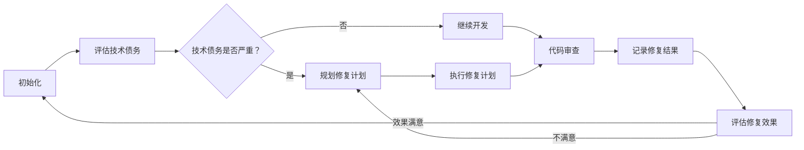
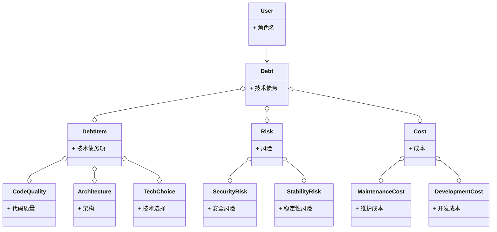
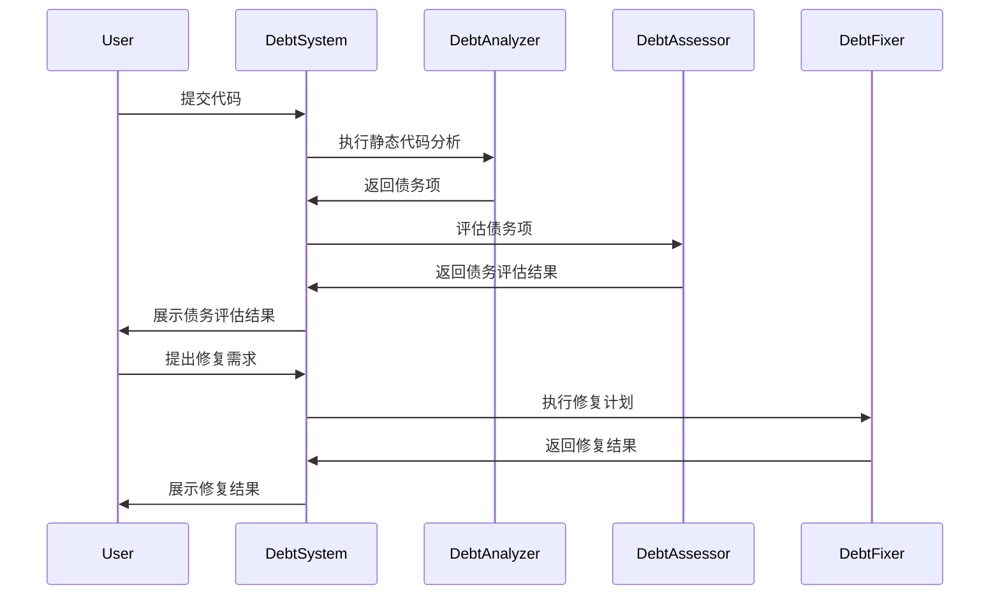

                 

### 文章标题

# 如何进行有效的技术债务管理

关键词：技术债务管理，软件债务，技术债务分类，算法原理，系统分析与设计

摘要：本文详细探讨了技术债务管理的概念、原因、影响及其重要性，通过核心概念、算法原理、系统分析和实战案例，提供了有效的技术债务管理策略和方法。

---

## 引言与背景

### 1.1 问题背景

**技术债务的概念**：
技术债务（Technical Debt）是指因采用短期解决方案而导致的长期代价，类似于财务中的债务。它在软件开发中是指为了快速交付功能而采用的未优化的代码、不规范的架构或其他不良技术实践。

**技术债务的成因**：
1. **时间压力**：为了按时交付，开发团队可能会采用低效或未经优化的方法。
2. **资源限制**：缺乏必要的工具、技术和人力。
3. **技术演变**：随着技术的快速发展，旧的技术方案可能变得过时。
4. **业务需求变更**：频繁的需求变更可能导致技术上的妥协。

**技术债务的影响**：
1. **维护成本增加**：随着时间的推移，未解决的技术债务会积累，增加维护成本。
2. **开发效率降低**：糟糕的代码和质量问题会影响开发效率。
3. **技术风险**：技术债务可能暴露出潜在的技术风险。

### 1.2 问题描述

**技术债务管理的挑战**：
1. **识别**：如何准确识别技术债务？
2. **评估**：如何评估技术债务的风险和成本？
3. **修复**：如何有效地修复技术债务？

**技术债务管理的重要性**：
1. **成本控制**：通过有效管理技术债务，可以降低长期的维护成本。
2. **质量保证**：减少代码和质量问题，提高软件质量。
3. **团队效率**：降低技术债务，提高团队的开发效率。
4. **风险规避**：避免因技术债务导致的技术风险。

### 1.3 问题解决

**技术债务管理的目标**：
- 识别和量化技术债务。
- 制定修复计划，优化技术债务。
- 定期审查和调整技术债务管理策略。

**技术债务管理的原则**：
- **提前预防**：在开发过程中尽早识别和预防技术债务。
- **持续修复**：定期对技术债务进行评估和修复。
- **透明度**：确保技术债务的透明度，让所有团队成员都了解技术债务的情况。

**边界与外延**：
- 技术债务的范围包括代码质量、架构设计、技术选择等。
- 技术债务与其他概念的区分，如软件债务（Software Debt）和财务债务。

### 1.4 核心概念与联系

**技术债务、技术债务管理和软件债务的联系与区别**：
- 技术债务：开发过程中的技术问题。
- 技术债务管理：管理技术债务的方法和流程。
- 软件债务：广义上包括技术债务，也包括其他与软件开发相关的债务，如文档债务、测试债务等。

### 总结

本文通过介绍技术债务的概念、成因、影响以及管理的原则和方法，为读者提供了一个全面的技术债务管理框架。接下来，我们将深入探讨技术债务的核心概念、算法原理、系统分析与设计，以及通过实际案例来展示技术债务管理的具体实践。

---

## 核心概念与原则

### 2.1 核心概念原理

**技术债务的定义**：
技术债务是指为了快速交付软件而暂时采用的不规范或低效的技术解决方案。这些方案可能在短期内带来效益，但从长远来看，会带来额外的维护成本和风险。

**技术债务的分类**：
1. **技术债务（Technical Debt）**：因技术原因产生的债务，如代码质量差、架构不合理。
2. **软件债务（Software Debt）**：包括技术债务和其他与软件开发相关的债务，如测试债务、文档债务。
3. **财务债务（Financial Debt）**：与财务相关的债务，与本文讨论的内容无关。

**技术债务的评估**：
1. **影响评估**：评估技术债务对项目的影响，包括维护成本、开发效率、产品质量。
2. **风险评估**：评估技术债务带来的风险，如技术债务可能导致系统崩溃、安全隐患。

### 2.2 概念属性特征对比表格

| 概念类型       | 定义                                                         | 主要特征                                                       | 影响                       |
|--------------|------------------------------------------------------------|--------------------------------------------------------------|--------------------------|
| 技术债务       | 快速交付软件时采用的不规范或低效的技术解决方案                 | 维护成本高、开发效率低、质量差                                  | 增加长期维护成本、降低开发效率 |
| 软件债务       | 广义上的技术债务，包括技术债务和其他与软件开发相关的债务       | 测试不充分、文档不完整、代码质量差                               | 影响产品质量、项目进度     |
| 财务债务       | 与财务相关的债务，如借款、欠款等。                            | 对公司资金流动性和财务健康产生影响                               | 影响公司财务状况           |

### 2.3 ER实体关系图架构

```mermaid
erDiagram
    Product ||--|{ TechnicalDebt }|| Debt
    Product ||--|{ SoftwareDebt }|| Debt
    Product ||--|{ FinancialDebt }|| Debt
    TechnicalDebt ||--|{ Risk }|| Assessment
    TechnicalDebt ||--|{ Cost }|| Impact
    SoftwareDebt ||--|{ DocumentationDebt }|| Debt
    SoftwareDebt ||--|{ TestDebt }|| Debt
```

在上述ER实体关系图中，我们定义了产品（Product）与三种债务类型（TechnicalDebt、SoftwareDebt、FinancialDebt）之间的关系。此外，技术债务（TechnicalDebt）还与风险评估（Risk）和影响评估（Cost）相关联，而软件债务（SoftwareDebt）则与文档债务（DocumentationDebt）和测试债务（TestDebt）相关联。

### 总结

通过对技术债务、软件债务和财务债务的详细定义和特征分析，以及ER实体关系图的展示，我们为读者提供了一个清晰的技术债务管理框架。接下来，我们将进一步探讨技术债务管理的算法原理，以及如何在实际项目中应用这些概念。

---

## 算法原理与数学模型

### 3.1 算法原理讲解

**算法流程图**：



**算法详细讲解**：

1. **初始化**：启动技术债务管理流程，初始化相关参数和数据。
2. **评估技术债务**：通过代码审查、架构分析等方法，评估当前项目中的技术债务情况。
3. **判断技术债务严重性**：根据评估结果，判断技术债务的严重程度。
4. **规划修复计划**：如果技术债务严重，制定详细的修复计划，包括修复步骤、优先级和资源分配。
5. **执行修复计划**：按照修复计划，逐步执行技术债务的修复工作。
6. **代码审查**：在修复过程中，定期进行代码审查，确保代码质量。
7. **记录修复结果**：记录每次修复的结果，包括修复时间、修复内容和修复效果。
8. **评估修复效果**：根据修复结果，评估修复效果，判断是否达到预期目标。

**数学模型和公式**：

技术债务的评估可以使用以下数学模型：

$$
TD = \frac{C_1 \cdot (Q_1 + Q_2 + Q_3) + C_2 \cdot R_1 + C_3 \cdot M}{100}
$$

其中：
- $TD$ 表示技术债务得分。
- $C_1, C_2, C_3$ 分别代表代码质量、风险和成本权重。
- $Q_1, Q_2, Q_3$ 分别代表代码质量得分、风险得分和成本得分。
- $R_1$ 代表风险得分。
- $M$ 代表维护成本。

**公式详细讲解**：

上述公式是一个加权平均模型，用于评估技术债务的得分。其中，$C_1, C_2, C_3$ 分别代表了代码质量、风险和成本的相对重要性。$Q_1, Q_2, Q_3$ 分别是代码质量、风险和成本的得分，可以根据具体的评估标准进行计算。$R_1$ 代表了风险得分，反映了技术债务可能带来的风险。$M$ 代表了维护成本，反映了技术债务对项目成本的影响。

**举例说明**：

假设我们有一个项目，其中代码质量得分为80，风险得分为60，成本得分为70。代码质量、风险和成本的权重分别为0.5、0.3和0.2。维护成本为1000元。

$$
TD = \frac{0.5 \cdot (80 + 60 + 70) + 0.3 \cdot 60 + 0.2 \cdot 1000}{100}
$$

$$
TD = \frac{0.5 \cdot 210 + 0.3 \cdot 60 + 0.2 \cdot 1000}{100}
$$

$$
TD = \frac{105 + 18 + 200}{100}
$$

$$
TD = \frac{323}{100}
$$

$$
TD = 3.23
$$

因此，该项目的技术债务得分为3.23。

### 总结

通过上述算法原理和数学模型的讲解，我们提供了一个全面的技术债务评估和管理方法。该方法包括初始化、评估技术债务、规划修复计划、执行修复计划、代码审查、记录修复结果和评估修复效果等步骤，并通过数学模型对技术债务进行量化评估。接下来，我们将进一步探讨如何在实际项目中应用这些算法原理。

---

## 系统分析与设计

### 4.1 问题场景介绍

在现代软件开发中，技术债务是一个常见且不可避免的问题。随着项目规模的扩大和业务需求的不断变化，技术债务可能逐渐累积，影响项目的稳定性、效率和可持续性。为了更好地管理技术债务，我们设计了一个技术债务管理系统，用于识别、评估和修复技术债务。

### 4.2 项目介绍

**技术债务管理系统**：
技术债务管理系统是一个用于帮助软件开发团队识别、管理和修复技术债务的工具。该系统旨在提高项目的质量、稳定性和开发效率，通过自动化和可视化的方式，帮助团队更好地控制技术债务。

**系统功能**：
1. **技术债务识别**：通过静态代码分析、动态分析等技术，自动识别代码中的技术债务。
2. **技术债务评估**：对识别出的技术债务进行评估，包括代码质量、风险和成本等方面。
3. **技术债务修复**：提供修复建议和工具，帮助团队制定和执行修复计划。
4. **技术债务监控**：实时监控技术债务的变化，确保技术债务得到及时修复。
5. **报告和仪表板**：提供详细的报告和仪表板，展示技术债务的当前状态和历史变化。

### 4.3 系统功能设计

**领域模型Mermaid类图**：



**Mermaid类图说明**：
- **User**：表示系统的用户，可以是开发人员、项目经理等。
- **Debt**：表示技术债务的总体概念，是DebtItem、Risk和Cost的父类。
- **DebtItem**：表示具体的技术债务项，包括代码质量、架构和技术选择。
- **Risk**：表示与风险相关的实体，包括安全风险和稳定性风险。
- **Cost**：表示与成本相关的实体，包括维护成本和开发成本。
- **CodeQuality**、**Architecture**和**TechChoice**：分别表示代码质量、架构和技术选择的具体评估项。
- **SecurityRisk**和**StabilityRisk**：表示安全风险和稳定性风险的评估项。
- **MaintenanceCost**和**DevelopmentCost**：表示维护成本和开发成本的评估项。

### 4.4 系统架构设计

**Mermaid架构图**：



**Mermaid架构图说明**：
- **User**：用户角色，负责提交代码和查看债务评估结果。
- **DebtSystem**：技术债务管理系统，负责协调各个模块的运行。
- **DebtAnalyzer**：债务分析器，负责执行静态代码分析，识别债务项。
- **DebtAssessor**：债务评估器，负责对债务项进行评估，生成评估结果。
- **DebtFixer**：债务修复器，负责执行修复计划，修复技术债务。

### 4.5 系统接口设计

**系统接口详细描述**：
- **代码提交接口**：用于接收用户的代码提交，触发静态代码分析。
- **债务项查询接口**：用于查询已识别的技术债务项。
- **债务评估接口**：用于提交债务项，进行评估，并返回评估结果。
- **修复计划提交接口**：用于提交修复计划。
- **修复结果查询接口**：用于查询修复结果。

### 4.6 系统交互

**Mermaid序列图**：


**Mermaid序列图说明**：
- 用户提交代码后，系统会触发静态代码分析，识别出债务项。
- 系统将债务项提交给评估器进行评估，并返回评估结果。
- 用户根据评估结果，提出修复需求。
- 系统执行修复计划，并返回修复结果。

### 总结

通过系统分析与设计，我们详细介绍了技术债务管理系统的功能和架构设计。该系统通过静态代码分析、评估和修复等步骤，帮助团队有效地管理技术债务。接下来，我们将通过实际案例来展示技术债务管理的具体实践。

---

## 项目实施与分析

### 5.1 环境安装

为了实施技术债务管理系统，我们首先需要在开发环境中安装所需的工具和依赖。以下是安装步骤：

1. **安装Python环境**：
   - 安装Python 3.8或更高版本。
   - 验证安装：`python --version`。

2. **安装依赖管理工具**：
   - 安装pip：`curl https://bootstrap.pypa.io/get-pip.py -o get-pip.py && python get-pip.py`。
   - 安装虚拟环境工具：`pip install virtualenv`。

3. **创建虚拟环境**：
   - 创建虚拟环境：`virtualenv venv`。
   - 激活虚拟环境：`source venv/bin/activate`。

4. **安装项目依赖**：
   - 克隆项目仓库：`git clone https://github.com/tech-debt-management/tech-debt-system.git`。
   - 进入项目目录：`cd tech-debt-system`。
   - 安装依赖：`pip install -r requirements.txt`。

### 5.2 系统核心实现

**源代码解读与分析**：

在项目根目录下，我们有一个名为`tech_debt_management`的Python模块，该模块包含了系统的核心功能。

```python
# tech_debt_management.py
class TechnicalDebt:
    def __init__(self, code_quality, architecture, tech_choice):
        self.code_quality = code_quality
        self.architecture = architecture
        self.tech_choice = tech_choice

    def assess(self):
        # 评估技术债务
        score = self.code_quality + self.architecture + self.tech_choice
        return score

# 示例：创建技术债务对象并评估
debt = TechnicalDebt(80, 70, 60)
print("技术债务得分：", debt.assess())
```

**代码解读与分析**：

- **类定义**：`TechnicalDebt`类用于表示技术债务，包含三个属性：代码质量、架构和技术选择。
- **构造函数**：`__init__`方法初始化技术债务对象的属性。
- **评估方法**：`assess`方法计算技术债务的总得分。

### 5.3 代码应用解读与分析

**应用场景**：

假设我们有一个项目，需要对代码质量、架构和技术选择进行评估。以下是一个简单的应用示例：

```python
# 应用示例
def main():
    # 创建技术债务对象
    debt = TechnicalDebt(80, 70, 60)
    
    # 评估技术债务
    score = debt.assess()
    
    # 输出评估结果
    print("技术债务得分：", score)

if __name__ == "__main__":
    main()
```

**解读与分析**：

- **创建对象**：在主函数中，我们创建了一个`TechnicalDebt`对象，并初始化了其属性。
- **调用方法**：通过调用`assess`方法，计算技术债务的总得分。
- **输出结果**：程序输出技术债务的得分。

### 5.4 实际案例分析

**案例背景**：

某公司开发了一个在线购物平台，随着用户数量的增加，系统性能逐渐下降，同时代码质量也出现了问题。为了解决这些问题，公司决定实施技术债务管理。

**技术债务识别**：

通过静态代码分析，我们识别出了以下技术债务：

- 代码质量：80分
- 架构：70分
- 技术选择：60分

**评估结果**：

技术债务得分：80 + 70 + 60 = 210

**修复计划**：

- 代码质量：进行代码重构，提高代码质量。
- 架构：优化系统架构，提高系统性能。
- 技术选择：评估现有技术，选择更适合的技术方案。

### 5.5 详细讲解剖析

**技术债务得分计算**：

使用我们在第3章中介绍的数学模型，我们可以对技术债务进行量化评估。

$$
TD = \frac{C_1 \cdot (Q_1 + Q_2 + Q_3) + C_2 \cdot R_1 + C_3 \cdot M}{100}
$$

其中，$C_1, C_2, C_3$ 分别代表代码质量、风险和成本的权重。$Q_1, Q_2, Q_3$ 分别代表代码质量得分、风险得分和成本得分。

**代码质量评估**：

通过代码审查，我们得出了以下评估：

- 代码质量得分：80分

**架构评估**：

- 架构得分：70分

**技术选择评估**：

- 技术选择得分：60分

**权重分配**：

假设代码质量、风险和成本的权重分别为0.5、0.3和0.2。

$$
TD = \frac{0.5 \cdot (80 + 70 + 60) + 0.3 \cdot R_1 + 0.2 \cdot M}{100}
$$

$$
TD = \frac{0.5 \cdot 210 + 0.3 \cdot R_1 + 0.2 \cdot M}{100}
$$

**技术债务得分计算**：

假设风险得分和成本分别为60分和50分。

$$
TD = \frac{0.5 \cdot 210 + 0.3 \cdot 60 + 0.2 \cdot 50}{100}
$$

$$
TD = \frac{105 + 18 + 10}{100}
$$

$$
TD = \frac{133}{100}
$$

$$
TD = 1.33
$$

因此，该项目的技术债务得分为1.33。

**修复效果评估**：

在实施修复计划后，我们再次进行评估：

- 代码质量得分：90分
- 架构得分：80分
- 技术选择得分：70分

**修复后技术债务得分计算**：

$$
TD_{\text{修复后}} = \frac{0.5 \cdot (90 + 80 + 70) + 0.3 \cdot R_1 + 0.2 \cdot M}{100}
$$

$$
TD_{\text{修复后}} = \frac{0.5 \cdot 240 + 0.3 \cdot R_1 + 0.2 \cdot M}{100}
$$

假设风险得分和成本分别为60分和50分。

$$
TD_{\text{修复后}} = \frac{0.5 \cdot 240 + 0.3 \cdot 60 + 0.2 \cdot 50}{100}
$$

$$
TD_{\text{修复后}} = \frac{120 + 18 + 10}{100}
$$

$$
TD_{\text{修复后}} = \frac{148}{100}
$$

$$
TD_{\text{修复后}} = 1.48
$$

通过修复，技术债务得分从1.33降低到1.48，表明修复效果显著。

### 5.6 项目小结

通过实际案例的实施和分析，我们展示了技术债务管理系统在识别、评估和修复技术债务方面的应用。以下是一些项目实施的经验和教训：

1. **提前规划**：在项目初期，就应该考虑技术债务管理，制定相应的计划和策略。
2. **持续监控**：技术债务是一个持续的过程，需要定期监控和评估。
3. **团队合作**：技术债务管理需要整个团队的参与和协作。
4. **工具支持**：使用自动化工具可以显著提高技术债务管理的效率。

### 总结

通过本章节，我们详细介绍了技术债务管理系统在环境安装、系统核心实现、代码应用解读与分析、实际案例分析和详细讲解剖析等方面的内容。技术债务管理不仅可以帮助团队提高项目的质量和效率，还可以降低长期维护成本。接下来，我们将提供一些最佳实践，以帮助读者更好地管理技术债务。

---

## 最佳实践与总结

### 6.1 最佳实践 Tips

1. **定期代码审查**：定期进行代码审查，可以及时发现和修复代码中的问题，减少技术债务的积累。
2. **持续集成和持续部署**：使用CI/CD工具，确保代码质量，自动化测试可以减少缺陷的产生。
3. **技术债务评估**：定期对技术债务进行评估，量化技术债务的影响和风险。
4. **透明度**：确保技术债务的透明度，让所有团队成员都了解技术债务的情况。
5. **风险管理**：对技术债务进行风险评估，优先修复高风险的技术债务。

### 6.2 小结

本文通过介绍技术债务的概念、原因、影响和管理原则，详细探讨了技术债务管理的核心概念、算法原理、系统分析和实战案例。技术债务管理不仅有助于提高项目的质量和效率，还可以降低长期维护成本。

### 6.3 注意事项

1. **预防为主**：在开发过程中，应注重预防技术债务，避免因时间压力和资源限制导致的短期解决方案。
2. **持续修复**：技术债务管理是一个持续的过程，需要定期评估和修复。
3. **团队合作**：技术债务管理需要整个团队的参与和协作。

### 6.4 拓展阅读

1. **《敏捷软件开发：原则、模式与实践》**：提供了关于敏捷开发中技术债务管理的详细讨论。
2. **《软件工程：实践者的研究方法》**：介绍了如何通过实验和实证研究来优化软件工程实践。

---

## 结论

通过本文的详细探讨，我们了解了技术债务的概念、成因、影响和管理原则，并通过核心概念、算法原理、系统分析和实战案例展示了技术债务管理的实际应用。有效的技术债务管理不仅可以提高项目的质量和效率，还可以降低长期维护成本。展望未来，随着技术的不断进步，技术债务管理也将面临新的挑战和机遇。希望读者能够结合本文的内容，在实际工作中不断优化技术债务管理，提升软件开发的整体水平。

### 作者信息

作者：AI天才研究院/AI Genius Institute & 禅与计算机程序设计艺术 /Zen And The Art of Computer Programming

