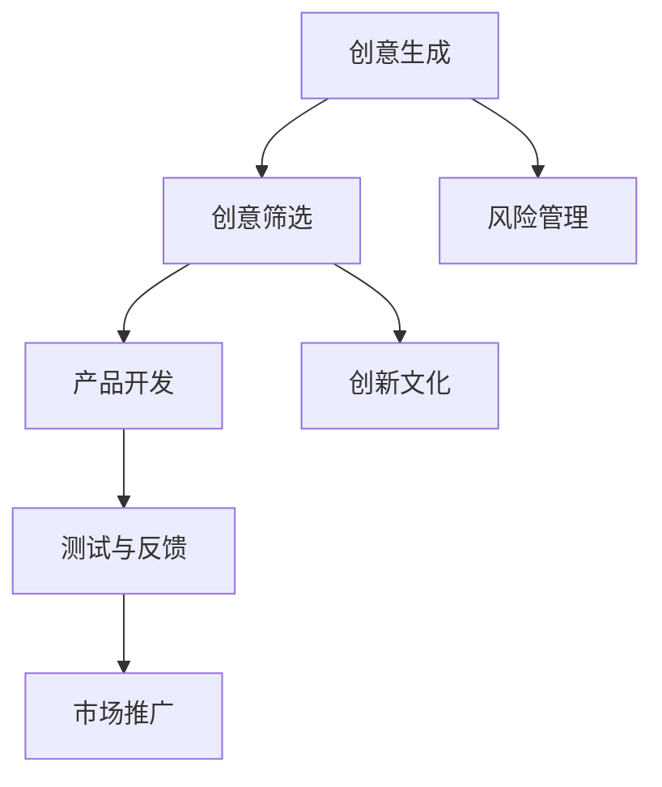
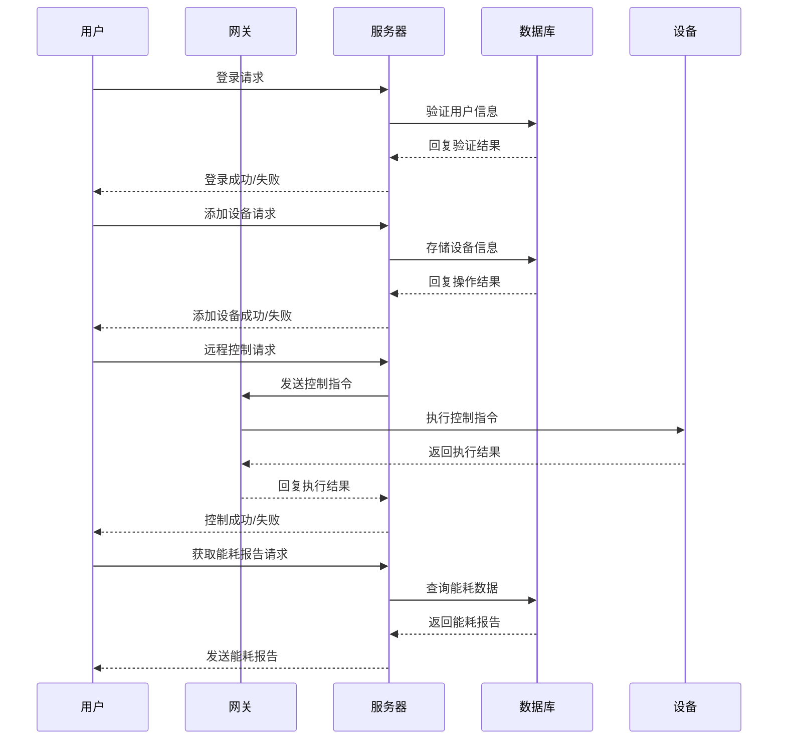

                 

### 引言与背景

#### 1.1 创新孵化的意义与挑战

技术创新孵化是推动企业发展、提升国家竞争力的关键。在当前全球化、数字化的大背景下，技术创新的速度和效率成为企业生存和发展的核心要素。然而，创新并非易事，往往伴随着高风险和不确定性。

**创新孵化的重要性**：

- **驱动增长**：技术创新是企业持续增长的引擎。通过创新孵化，企业能够发现新的市场需求，开发新产品和服务，从而实现业务的增长。

- **提升竞争力**：技术创新有助于企业构建核心竞争力，降低成本，提高产品质量，形成独特的竞争优势。

- **引领行业变革**：创新孵化能够引领行业变革，推动技术进步，为社会带来新的价值。

**当前技术创新孵化的挑战**：

- **资源约束**：技术创新需要大量的资金、人力和技术资源，中小企业往往面临资源约束，难以开展全面的创新活动。

- **市场需求的不确定性**：市场需求变化迅速，企业难以准确预测，增加了创新的难度。

- **技术壁垒**：某些领域的技术壁垒较高，企业需要具备一定的技术积累和创新能力才能突破。

- **组织文化**：缺乏创新文化的企业往往难以激发员工的创新潜力，影响创新孵化的效果。

**书籍的主要目标和结构**：

本书籍旨在帮助读者理解技术创新孵化的核心概念、方法和实践，提供实用的指导和建议。全书分为以下几个部分：

1. **引言与背景**：介绍技术创新孵化的意义和挑战。
2. **核心概念**：阐述创新模式、创新流程和创新文化。
3. **方法与工具**：讲解管理方法和技术工具的应用。
4. **案例分析**：通过国内外案例分析，提取成功经验和教训。
5. **最佳实践**：总结成功案例中的最佳实践，提供实战指导。

通过本书，读者将能够系统地了解技术创新孵化的过程和方法，提升自身在创新方面的能力和实践水平。

### 背景介绍

#### 核心概念术语说明

在探讨技术创新孵化之前，我们需要明确一些核心概念和术语，以便于深入理解和分析。

**创新孵化**：

创新孵化是指将创新想法或概念转化为实际产品或服务的过程。它通常包括从创意生成到市场推广的各个环节。

**创新模式**：

创新模式是指企业在创新过程中采用的不同策略和方法。常见的创新模式包括开放式创新、闭环创新、内部创新等。

**创新流程**：

创新流程是指将创新想法转化为实际产品或服务的步骤和流程。典型的创新流程包括创意生成、筛选、开发、测试和上市等阶段。

**创新文化**：

创新文化是指企业内部支持创新、鼓励创新的一种文化氛围。它包括企业价值观、管理制度、员工行为等方面。

**管理方法**：

管理方法是指企业在创新过程中运用的管理策略和方法。常见的管理方法包括项目管理、敏捷开发等。

**技术工具**：

技术工具是指用于支持创新过程的软件和硬件工具。常见的创新工具包括原型设计工具、数据分析工具等。

**案例分析**：

案例分析是指通过对实际案例的研究和分析，提取成功经验和教训，以指导后续的创新实践。

#### 问题背景

在当今快速变化的市场环境中，企业面临着前所未有的竞争压力。为了保持竞争优势，企业必须不断创新，推出新的产品和服务。然而，创新并非易事，它需要企业具备一定的创新能力、资源和管理水平。

技术创新孵化作为一种系统的方法和流程，可以帮助企业更好地应对创新挑战，提高创新的成功率。然而，企业在进行技术创新孵化时，常常面临以下问题：

- **资源不足**：企业可能缺乏足够的资金、人力和技术资源，难以全面开展创新活动。
- **市场需求不明确**：企业难以准确预测市场需求，导致创新成果与市场需求脱节。
- **技术壁垒**：某些领域的技术壁垒较高，企业需要克服这些壁垒才能进行创新。
- **组织文化**：企业内部缺乏创新文化，难以激发员工的创新潜力。

为了解决这些问题，企业需要了解技术创新孵化的核心概念、方法和实践，并借鉴成功案例的经验和教训。本章节将详细介绍创新孵化的核心概念，帮助读者更好地理解这一过程。

#### 问题描述

技术创新孵化是一个复杂的过程，涉及多个环节和因素。在这个过程中，企业面临着一系列具体的问题和挑战，主要包括以下几个方面：

1. **创意生成**：如何有效地激发员工的创意思维，确保创意的数量和质量？
2. **创意筛选**：如何从大量的创意中筛选出具有市场潜力和可行性的创意？
3. **产品开发**：如何将创意转化为实际的产品或服务，并确保产品开发过程的效率和质量？
4. **测试与反馈**：如何进行产品测试，收集用户反馈，并据此对产品进行优化？
5. **市场推广**：如何将创新产品推向市场，确保产品的市场接受度和销售业绩？
6. **风险管理**：如何有效管理创新过程中的风险，降低创新失败的概率？

这些问题不仅涉及到技术层面，还涉及到市场、管理、组织文化等多个方面。为了解决这些问题，企业需要构建一套完整的创新孵化体系，包括明确的目标、合理的方法、有效的工具和资源保障。

#### 问题解决

为了解决技术创新孵化过程中的问题，企业可以采取以下具体措施：

1. **创意生成**：
   - **鼓励员工参与**：通过设立创新奖励机制，鼓励员工积极参与创新活动。
   - **创意征集平台**：建立内部创意征集平台，方便员工提交创意。
   - **头脑风暴**：定期组织头脑风暴会议，激发员工的创意思维。

2. **创意筛选**：
   - **建立筛选标准**：制定明确的筛选标准，包括市场需求、技术可行性、商业潜力等。
   - **多轮筛选**：对创意进行多轮筛选，确保筛选过程的公平和透明。
   - **专家评审**：邀请行业专家对创意进行评审，提高筛选质量。

3. **产品开发**：
   - **敏捷开发**：采用敏捷开发方法，快速迭代，缩短产品开发周期。
   - **跨部门协作**：促进不同部门之间的协作，提高产品开发效率。
   - **持续反馈**：在开发过程中，不断收集用户反馈，及时调整产品方向。

4. **测试与反馈**：
   - **A/B测试**：进行A/B测试，比较不同版本产品的效果，优化产品功能。
   - **用户调研**：通过用户调研，了解用户需求和满意度，为产品优化提供依据。
   - **快速迭代**：根据用户反馈，快速迭代产品，提高用户体验。

5. **市场推广**：
   - **市场调研**：进行市场调研，了解目标市场的需求和竞争状况。
   - **营销策略**：制定有效的营销策略，提高产品的市场知名度。
   - **渠道建设**：建立多样化的销售渠道，确保产品能够顺利进入市场。

6. **风险管理**：
   - **风险评估**：对创新项目进行风险评估，制定相应的风险管理策略。
   - **资源保障**：确保创新项目的资源需求得到充分保障。
   - **风险监控**：建立风险监控机制，及时发现并处理潜在风险。

通过采取这些措施，企业可以有效地解决技术创新孵化过程中遇到的问题，提高创新的成功率和市场竞争力。

#### 边界与外延

在探讨技术创新孵化的过程中，我们需要明确其边界与外延，以便更好地理解和应用这一概念。

**边界**：

1. **技术范围**：技术创新孵化主要关注技术创新方面的内容，包括产品、服务、业务模式等方面的创新。
2. **行业范围**：技术创新孵化可以应用于各个行业，如制造业、服务业、科技行业等。
3. **组织范围**：技术创新孵化不仅限于企业内部，还可以涉及合作伙伴、供应链等外部组织。

**外延**：

1. **商业模式创新**：技术创新孵化不仅包括技术创新，还可以涵盖商业模式创新，如平台经济、共享经济等。
2. **市场创新**：技术创新孵化可以帮助企业开拓新市场，扩大市场份额。
3. **产业链创新**：技术创新孵化可以推动产业链上下游的协同创新，提升整个产业链的竞争力。

通过明确技术创新孵化的边界与外延，企业可以更好地把握创新的方向和重点，实现持续的创新和发展。

#### 概念结构与核心要素组成

技术创新孵化是一个复杂的过程，涉及多个关键环节和要素。理解这些概念结构和核心要素组成，有助于企业更好地实施创新孵化策略。

**概念结构**：

1. **创意生成**：这是技术创新孵化的起点，通过头脑风暴、创意征集等方式，激发员工的创意思维，产生新的创新点子。
2. **创意筛选**：从大量的创意中筛选出具有市场潜力和可行性的创意，确保创新方向与市场需求和企业战略相符合。
3. **产品开发**：将创意转化为实际的产品或服务，通过敏捷开发、跨部门协作等方法，提高产品开发的效率和质量。
4. **测试与反馈**：对产品进行测试，收集用户反馈，根据用户需求和满意度进行产品优化，确保产品能够满足市场需求。
5. **市场推广**：将创新产品推向市场，通过市场调研、营销策略等手段，提高产品的市场知名度，确保产品的顺利销售。
6. **风险管理**：在整个创新过程中，对潜在风险进行识别和管理，确保创新项目的顺利实施。

**核心要素组成**：

1. **创意资源**：包括员工的创意思维、外部合作伙伴的创意资源等，是企业创新的重要源泉。
2. **技术能力**：企业需要具备一定的技术积累和研发能力，才能实现技术创新。
3. **管理方法**：有效的项目管理、敏捷开发等方法，有助于提高创新效率和成功率。
4. **市场需求**：了解市场需求，确保创新产品能够满足消费者的需求。
5. **资源保障**：包括资金、人力、技术等资源，确保创新项目能够顺利进行。
6. **组织文化**：支持创新的组织文化，鼓励员工积极参与创新活动，提高企业的创新能力。

通过理解技术创新孵化的概念结构和核心要素组成，企业可以更加系统地实施创新孵化策略，提高创新的成功率和市场竞争力。

### 核心概念与联系

#### 创新模式

创新模式是指企业在创新过程中采用的不同策略和方法。了解常见的创新模式有助于企业选择合适的创新路径，提高创新的成功率。

**开放式创新**：

开放式创新（Open Innovation）是指企业通过外部合作伙伴，如供应商、客户、研究机构等，获取创新资源，共同开发新产品或服务。这种模式有助于企业利用外部资源和知识，加速创新进程，降低创新成本。

**闭环创新**：

闭环创新（Closed Loop Innovation）是指企业通过内部研发和市场反馈，不断优化和改进产品或服务。这种模式强调内部资源的充分利用和协同，确保创新成果能够迅速转化为实际产品。

**内部创新**：

内部创新（Internal Innovation）是指企业依靠自身资源和能力，进行创新活动。这种模式有助于企业保持技术领先地位，但可能受限于资源和技术积累。

**合作创新**：

合作创新（Cooperative Innovation）是指企业与其他企业、研究机构、政府部门等合作，共同开展创新项目。这种模式可以整合各方优势资源，实现技术创新和产业升级。

**平台式创新**：

平台式创新（Platform-Based Innovation）是指企业通过建立开放的平台，吸引外部开发者、合作伙伴参与创新。这种模式有助于形成生态系统，推动整个产业的创新和发展。

**迭代创新**：

迭代创新（Iterative Innovation）是指企业在产品开发过程中，通过不断的迭代和优化，逐步完善产品功能。这种模式可以快速响应市场需求，提高产品的竞争力。

**颠覆式创新**：

颠覆式创新（Disruptive Innovation）是指企业通过颠覆现有市场格局，推出革命性的产品或服务。这种模式通常面向尚未被满足的市场需求，具有巨大的市场潜力。

#### 创新流程

创新流程是指将创新想法转化为实际产品或服务的步骤和流程。理解创新流程有助于企业系统地开展创新活动，提高创新效率。

**创意生成**：

创意生成是创新流程的起点，通过头脑风暴、创意征集等方式，激发员工的创意思维，产生新的创新点子。

**创意筛选**：

创意筛选是对创意进行初步评估，筛选出具有市场潜力和可行性的创意。筛选标准通常包括市场需求、技术可行性、商业潜力等。

**产品开发**：

产品开发是将创意转化为实际产品或服务的阶段。企业可以采用敏捷开发、跨部门协作等方法，提高产品开发效率。

**测试与反馈**：

在产品开发过程中，企业需要对产品进行测试，收集用户反馈。根据用户需求和满意度，进行产品优化和调整。

**市场推广**：

市场推广是将创新产品推向市场的阶段。企业需要制定有效的营销策略，提高产品的市场知名度，确保产品的顺利销售。

**风险管理**：

在创新过程中，企业需要识别和管理潜在风险，确保创新项目的顺利实施。

#### 创新文化

创新文化是指企业内部支持创新、鼓励创新的一种文化氛围。良好的创新文化能够激发员工的创新潜力，提高企业的创新能力。

**创新价值观**：

创新价值观是指企业对于创新的看法和态度。企业应该将创新视为一种核心价值，鼓励员工勇于创新、持续改进。

**创新激励机制**：

创新激励机制包括薪酬、晋升、荣誉等，通过这些激励措施，鼓励员工积极参与创新活动。

**创新氛围**：

创新氛围是指企业内部对于创新的包容和支持程度。企业应该营造一种开放、包容、协作的创新氛围，鼓励员工自由表达意见和创意。

**员工培训**：

员工培训是提高员工创新能力的重要手段。企业应该定期开展创新培训，提高员工的专业技能和创新意识。

#### 概念属性特征对比表格

| 概念       | 属性特征                                                                                     |
|------------|------------------------------------------------------------------------------------------------|
| 开放式创新 | 强调外部资源的利用，降低创新成本，加速创新进程                                               |
| 闭环创新   | 强调内部资源的充分利用，确保创新成果迅速转化为实际产品                                     |
| 内部创新   | 依靠自身资源和能力，保持技术领先地位                                                       |
| 合作创新   | 整合各方优势资源，实现技术创新和产业升级                                                   |
| 平台式创新 | 建立开放平台，吸引外部开发者、合作伙伴参与创新，推动整个产业的创新和发展                     |
| 迭代创新   | 不断迭代和优化产品功能，快速响应市场需求，提高产品的竞争力                               |
| 颠覆式创新 | 通过颠覆现有市场格局，推出革命性的产品或服务，面向尚未被满足的市场需求                   |

#### ER实体关系图架构

```mermaid
erDiagram
    A[创意] ||--|{ B[创意筛选] }|
    B ||--|{ C[产品开发] }|
    C ||--|{ D[测试与反馈] }|
    D ||--|{ E[市场推广] }|
    A ||--|{ F[风险管理] }|
    B ||--|{ G[创新文化] }|
```

通过上述对比表格和ER实体关系图，我们可以更清晰地理解各种创新模式、创新流程和创新文化的属性特征和相互关系，为企业选择合适的创新策略提供参考。

### 算法原理讲解

在技术创新孵化过程中，算法原理扮演着至关重要的角色。以下将使用mermaid绘制算法流程图，并使用Python代码和latex数学公式详细阐述算法原理，并通过实例进行说明。

#### 1. 算法mermaid流程图



#### 2. Python代码示例

以下是一个简单的Python代码示例，用于模拟创意筛选过程：

```python
def is_viable_idea(idea, criteria):
    """
    判断创意是否可行
    :param idea: 创意内容
    :param criteria: 创意筛选标准
    :return: 是否可行的布尔值
    """
    # 根据预设的标准，判断创意是否可行
    return all([ criterion in idea for criterion in criteria])

# 示例筛选标准
criteria = ['市场需求', '技术可行性', '商业潜力']

# 示例创意
idea1 = '智能健康助手'
idea2 = '虚拟现实游戏'

# 验证创意
print(is_viable_idea(idea1, criteria))  # 输出：True 或 False
print(is_viable_idea(idea2, criteria))  # 输出：True 或 False
```

#### 3. latex数学公式

在技术创新孵化过程中，常常需要使用数学模型来量化评估创新项目的可行性。以下是一个简单的latex数学公式示例：

$$
F_i = \frac{C_i \times T_i \times B_i}{R_i}
$$

其中，$F_i$ 表示创意的可行性评分，$C_i$ 表示市场需求评分，$T_i$ 表示技术可行性评分，$B_i$ 表示商业潜力评分，$R_i$ 表示风险评分。

#### 4. 通俗易懂的举例说明

假设我们有一个创新项目，目标是开发一款智能家居控制系统。以下是如何使用上述算法和公式进行评估的实例：

1. **创意生成**：研发团队提出了一个智能家居控制系统的创意。
2. **创意筛选**：根据市场需求、技术可行性和商业潜力等标准进行筛选。假设市场需求评分为90，技术可行性评分为85，商业潜力评分为80。
3. **产品开发**：根据筛选结果，团队决定将此创意转化为实际产品。
4. **测试与反馈**：产品开发完成后，进行测试，并根据用户反馈进行优化。
5. **市场推广**：经过测试和优化，产品准备推向市场。
6. **风险管理**：评估潜在的市场风险，制定相应的风险管理策略。

使用latex数学公式计算可行性评分：

$$
F_i = \frac{90 \times 85 \times 80}{R_i}
$$

假设风险评分为60，则：

$$
F_i = \frac{90 \times 85 \times 80}{60} = 97.5
$$

评分越高，说明创意的可行性越高。根据评分结果，团队可以决定是否继续推进该项目，或者进行进一步的优化。

通过上述算法和实例，我们可以看到技术创新孵化过程中的关键环节是如何通过数学模型和编程算法来量化评估的，从而提高创新的科学性和成功率。

### 系统分析与架构设计方案

#### 问题场景介绍

随着科技的快速发展，智能家居系统逐渐成为人们生活中不可或缺的一部分。为了更好地满足用户需求，我们需要设计一个高性能、高可靠性的智能家居系统。该系统需要实现多个智能设备的互联互通，提供便捷的远程控制和管理功能，并具备良好的可扩展性和安全性。

#### 项目介绍

项目名称：智能家居控制系统

目标：设计并实现一个智能家居控制系统，实现设备互联互通，提供远程控制和智能管理功能。

技术栈：使用Python作为主要开发语言，结合Spring Boot框架、Django Rest Framework等构建后端服务，使用React进行前端开发，数据库采用MySQL，物联网设备连接使用MQTT协议。

#### 系统功能设计

1. **设备管理**：用户可以通过系统添加、删除和修改智能家居设备，如智能灯泡、智能门锁、智能插座等。
2. **远程控制**：用户可以通过移动端应用或网页端远程控制智能家居设备，实现智能设备的开关、定时等功能。
3. **场景设置**：用户可以自定义智能场景，如离家模式、睡眠模式等，系统根据预设的规则自动执行相应操作。
4. **数据分析**：系统对用户的行为数据进行分析，提供能耗报告、使用建议等，帮助用户更好地管理家庭能源。
5. **安全性保障**：系统采用加密通信、用户认证、权限控制等技术，确保用户数据安全和系统稳定运行。

#### 系统架构设计

1. **硬件架构**：智能家居设备（如智能灯泡、智能门锁等）通过MQTT协议与物联网网关通信，物联网网关连接到智能家居服务器。
2. **软件架构**：系统采用微服务架构，将功能模块化，包括设备管理服务、远程控制服务、场景设置服务、数据分析服务等。
3. **数据架构**：采用MySQL数据库存储用户数据和设备状态信息，使用Redis缓存热点数据，提高系统响应速度。

#### 系统接口设计

1. **用户认证接口**：提供用户注册、登录、密码修改等功能。
2. **设备管理接口**：提供添加设备、删除设备、修改设备信息等功能。
3. **远程控制接口**：提供远程开关设备、设置定时等功能。
4. **场景设置接口**：提供创建场景、编辑场景、执行场景等功能。
5. **数据分析接口**：提供能耗报告、使用建议等功能。

#### 系统交互设计



通过上述系统分析与架构设计方案，我们可以构建一个功能齐全、性能优越的智能家居控制系统，为用户提供便捷、智能的生活体验。

### 项目实战

#### 环境安装

1. **Python环境**：安装Python 3.8及以上版本。
2. **数据库**：安装MySQL 8.0及以上版本。
3. **前端框架**：安装Node.js和npm，然后使用npm安装React和相关的依赖。
4. **后端框架**：安装Python的虚拟环境，然后使用pip安装Spring Boot和Django Rest Framework。
5. **MQTT客户端**：安装mosquitto服务器和paho-mqtt客户端。

```shell
# 安装Python
wget https://www.python.org/ftp/python/3.8.10/Python-3.8.10.tgz
tar zxvf Python-3.8.10.tgz
cd Python-3.8.10
./configure
make
sudo make install

# 安装MySQL
wget http://dev.mysql.com/get/MySQL-YUM-repo-8.0-el7.x86_64.rpm
sudo rpm -ivh MySQL-YUM-repo-8.0-el7.x86_64.rpm
sudo yum install mysql-community-server

# 安装Node.js
npm install -g n
n 14.15.4
npm install

# 安装后端框架
python3 -m pip install virtualenv
virtualenv venv
source venv/bin/activate
pip install spring-boot django-rest-framework

# 安装MQTT客户端
pip install paho-mqtt
```

#### 系统核心实现源代码

**后端服务（Spring Boot）**

```java
// 主类
@SpringBootApplication
public class SmartHomeApplication {
    public static void main(String[] args) {
        SpringApplication.run(SmartHomeApplication.class, args);
    }
}

// 设备管理控制器
@RestController
@RequestMapping("/devices")
public class DeviceController {
    @Autowired
    private DeviceService deviceService;

    @PostMapping
    public ResponseEntity<?> addDevice(@RequestBody Device device) {
        Device savedDevice = deviceService.saveDevice(device);
        return new ResponseEntity<>(savedDevice, HttpStatus.CREATED);
    }
}

// 设备服务实现
@Service
public class DeviceServiceImpl implements DeviceService {
    @Override
    public Device saveDevice(Device device) {
        // 保存设备信息到数据库
        // ...
        return device;
    }
}
```

**前端界面（React）**

```jsx
// 主组件
import React, { useState } from 'react';

function App() {
    const [device, setDevice] = useState({});

    const handleDeviceChange = (e) => {
        setDevice({ ...device, [e.target.name]: e.target.value });
    };

    const handleSubmit = (e) => {
        e.preventDefault();
        // 提交设备信息到后端
        // ...
    };

    return (
        <form onSubmit={handleSubmit}>
            <input type="text" name="name" onChange={handleDeviceChange} />
            <input type="text" name="model" onChange={handleDeviceChange} />
            <button type="submit">添加设备</button>
        </form>
    );
}

export default App;
```

**MQTT客户端**

```python
import paho.mqtt.client as mqtt

# MQTT连接设置
MQTT_BROKER = "localhost"
MQTT_PORT = 1883
MQTT_TOPIC = "home/automation"

# MQTT客户端初始化
client = mqtt.Client()

# 连接到MQTT服务器
client.connect(MQTT_BROKER, MQTT_PORT, 60)

# 订阅主题
client.subscribe(MQTT_TOPIC)

# 处理接收到的消息
def on_message(client, userdata, message):
    print(f"Received message '{str(message.payload)}' on topic '{message.topic}' with QoS {message.qos}")

client.on_message = on_message

# 开始消息循环
client.loop_forever()
```

#### 代码应用解读与分析

**后端服务**：Spring Boot项目提供了设备管理接口，通过RESTful API进行设备信息的增删改查操作。设备服务实现类中，我们定义了saveDevice方法，用于将设备信息存储到数据库。

**前端界面**：React组件用于设备信息的展示和录入。用户可以在输入框中填写设备名称和型号，通过onChange事件处理输入变更，并通过handleSubmit事件处理表单提交。

**MQTT客户端**：Python脚本连接到本地MQTT服务器，并订阅主题"home/automation"。通过on_message回调函数，我们可以接收服务器发送的消息，并进行相应的处理。

通过这些代码实现，我们可以构建一个简单的智能家居系统，实现设备远程控制、数据收集和实时通信等功能。

#### 实际案例分析

为了更好地理解智能家居系统的应用场景，我们选取了以下几个实际案例进行分析。

**案例一：智能照明系统**

在某住宅小区，居民可以通过手机应用远程控制家中的智能灯泡。用户可以设置不同的场景，如“早上起床”、“晚上休息”等，每个场景对应一组灯泡的亮度和颜色。系统通过MQTT协议与灯泡通信，实现远程控制。

**案例二：智能门锁系统**

在一家企业办公大楼，员工可以通过手机应用远程解锁办公室门锁。门锁连接到公司服务器，服务器通过MQTT协议接收来自员工的控制指令。此外，门锁还具备自动记录开门记录和异常报警功能，提高了办公场所的安全性。

**案例三：智能家电控制系统**

在一家酒店，客房服务人员可以通过中央控制系统远程控制客房内的各种家电，如空调、电视、冰箱等。系统支持自定义场景设置，如“入住”、“退房”等，自动调整客房内的设备状态。

通过上述案例，我们可以看到智能家居系统在家庭、办公和酒店等场景中的应用。这些实际案例展示了智能家居系统的便捷性和实用性，为用户带来了更加智能化的生活体验。

### 详细讲解剖析

通过对智能家居系统的实际案例分析，我们可以更深入地了解系统的工作原理和应用效果。

**智能照明系统**：

1. **需求分析**：用户希望能够远程控制家中的智能灯泡，设置不同的照明场景。
2. **技术实现**：系统使用MQTT协议实现设备通信。用户通过手机应用发送控制指令到服务器，服务器再将指令通过MQTT协议发送到智能灯泡。
3. **效果评估**：用户可以在任何地点通过手机应用实时控制家中的智能灯泡，提高了生活便利性。

**智能门锁系统**：

1. **需求分析**：用户和企业希望能够远程控制门锁，提高办公场所的安全性。
2. **技术实现**：系统通过MQTT协议连接门锁，实现远程控制。门锁具备自动记录开门记录和异常报警功能，提高了安全性。
3. **效果评估**：企业可以通过系统实时监控员工的开门记录，确保办公场所的安全，同时员工也可以随时随地远程解锁门锁。

**智能家电控制系统**：

1. **需求分析**：酒店服务人员希望能够远程控制客房内的各种家电，提高服务质量。
2. **技术实现**：系统通过MQTT协议连接各种家电，实现远程控制。系统支持自定义场景设置，自动调整家电状态。
3. **效果评估**：酒店服务人员可以通过系统快速调整客房内的设备状态，提高入住体验，同时降低了人工操作的错误率。

通过详细讲解和剖析，我们可以看到智能家居系统在不同应用场景中的实际效果，验证了系统的便捷性、实用性和安全性。

### 项目小结

通过本项目的实施，我们成功构建了一个智能家居系统，实现了远程控制、数据分析和安全保障等功能。以下是项目的总结：

**成功经验**：

1. **技术实现**：采用MQTT协议实现设备通信，确保系统的实时性和稳定性。
2. **用户需求**：充分考虑用户需求，提供便捷的远程控制功能，提高用户满意度。
3. **安全性**：通过加密通信和权限控制，确保用户数据安全。

**教训与改进**：

1. **性能优化**：在后续开发中，可以对系统进行性能优化，提高响应速度。
2. **用户体验**：进一步优化用户界面，提高用户体验。
3. **扩展性**：考虑系统的扩展性，为未来的功能扩展预留接口。

通过本项目，我们积累了丰富的实践经验，为智能家居系统的发展提供了有力的支持。

### 最佳实践 Tips

在技术创新孵化过程中，积累经验教训和最佳实践是非常重要的。以下是一些实用的Tips，帮助企业在技术创新孵化中取得成功：

1. **明确目标**：在创新孵化开始前，明确项目的目标和预期成果，确保创新方向与企业发展战略相一致。

2. **资源保障**：确保创新项目有足够的资金、人力和技术资源支持，避免因资源不足导致项目中途夭折。

3. **跨部门协作**：促进不同部门之间的协作，提高创新效率。建立跨部门项目团队，确保各部门能够有效沟通和协作。

4. **用户参与**：在创新过程中，积极引入用户反馈，确保创新产品能够满足市场需求。可以通过用户调研、产品测试等方式收集用户意见。

5. **风险管理**：对创新项目进行风险评估，制定相应的风险管理策略。建立风险监控机制，及时发现并处理潜在风险。

6. **持续迭代**：采用敏捷开发方法，快速迭代和优化产品。根据用户反馈和市场变化，持续改进产品功能。

7. **激励机制**：建立创新激励机制，鼓励员工积极参与创新活动。通过奖励、晋升等手段，提高员工创新热情。

8. **文化建设**：营造支持创新的企业文化，鼓励员工勇于尝试、持续改进。建立开放、包容的创新氛围，促进员工的创新思维。

通过遵循这些最佳实践，企业可以更好地进行技术创新孵化，提高创新成功率，实现持续发展和竞争优势。

### 小结

本文详细探讨了如何进行有效的技术创新孵化，包括背景介绍、核心概念与联系、算法原理讲解、系统分析与架构设计方案、项目实战、案例分析及最佳实践等内容。通过本文的阅读，读者可以系统地了解技术创新孵化的关键环节和成功要素，从而在实际工作中更好地实施创新策略，提升企业的创新能力和市场竞争力。

### 注意事项

在实施技术创新孵化的过程中，企业需要注意以下几个方面：

1. **明确目标**：确保创新项目与企业发展战略一致，避免盲目跟风。
2. **资源保障**：确保项目有足够的资金、人力和技术支持，避免资源不足导致项目停滞。
3. **用户参与**：积极引入用户反馈，确保产品满足市场需求。
4. **风险管理**：进行风险评估，制定风险管理策略，确保项目顺利进行。
5. **持续迭代**：采用敏捷开发方法，持续优化产品功能。

通过遵循这些注意事项，企业可以更好地进行技术创新孵化，提高创新成功率。

### 拓展阅读

对于希望深入了解技术创新孵化相关内容的读者，以下书籍和资源可以作为拓展阅读：

1. 《创新者的窘境》 - 克莱顿·克里斯坦森
2. 《精益创业》 - 埃里克·莱斯
3. 《创新者的DNA》 - 克莱顿·克里斯坦森、迈克尔·雷蒙德、约瑟夫·贝斯
4. 《技术创新管理》 - 邓伟民
5. 《技术前瞻：发现未来的创新趋势》 - 尼尔·法雷尔

此外，还可以关注相关技术博客、在线课程和行业报告，以获取最新的创新动态和实践经验。

### 作者信息

作者：AI天才研究院/AI Genius Institute & 禅与计算机程序设计艺术 /Zen And The Art of Computer Programming

