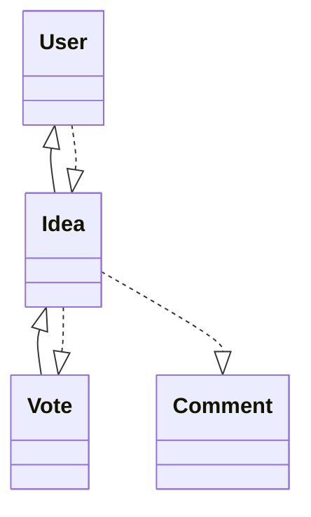
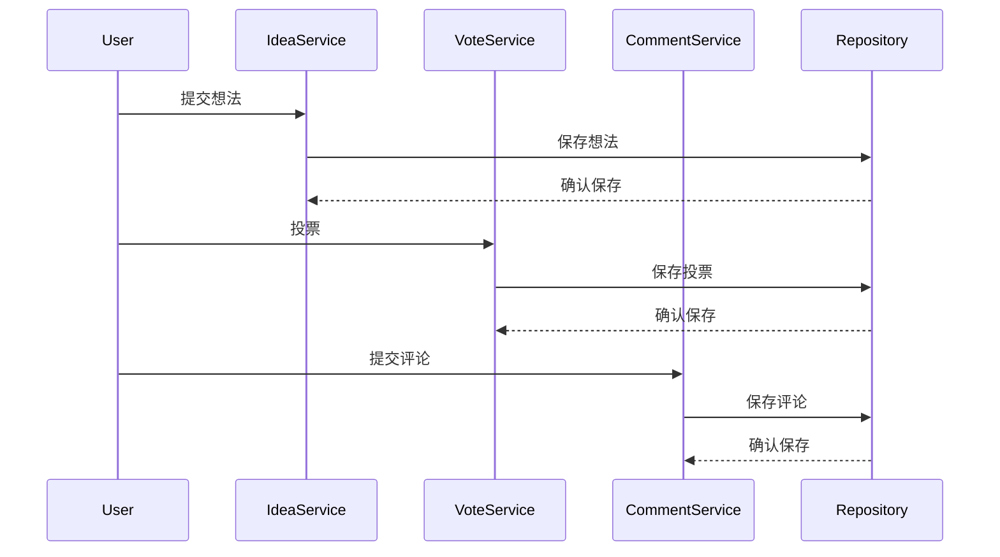

                 


# 如何进行有效的技术创新文化建设

关键词：技术创新文化，企业文化，领导力，员工参与，创造力

摘要：本文探讨了如何在一个组织内构建有效的技术创新文化，强调了领导力、员工参与、创造力和协作等关键要素的作用。通过分步骤的分析和推理，本文旨在为IT领域的专业人士提供实用的指导，以推动技术创新并促进企业的长期成功。

## 引言

在当今快速变化的技术环境中，技术创新已成为企业竞争的关键因素。有效的技术创新文化不仅能够激发员工的创造力，还能够提高组织的适应能力和市场竞争力。然而，构建这样的文化并非易事，它需要明确的愿景、领导层的支持、员工的积极参与以及持续的鼓励和反馈。

本文的目标是提供一个系统的方法，以帮助IT领域的专业人士构建和维持有效的技术创新文化。我们将从背景介绍、核心概念和理论、构建要素、鼓励创造力和协作、测量与维持以及案例研究等方面进行探讨。

## 核心概念和理论

### 1. 定义和特点

**创新文化**是一种组织氛围，它鼓励和促进员工创新、实验和学习。其特点包括：

- **开放性**：鼓励分享想法和知识。
- **多样性**：欣赏和尊重不同的观点和经验。
- **容忍失败**：将失败视为学习和成长的机会。
- **透明度**：信息公开，决策过程清晰。
- **员工参与**：员工参与决策和创新过程。

### 2. 理论框架

**创新管理理论**提供了构建创新文化的理论基础。这些理论包括：

- **三环模型**：将创新过程分为探索、开发和商业化三个阶段。
- **开放式创新**：组织通过与外部合作伙伴合作来获取创新思想。
- **领导理论**：强调领导者在推动创新中的关键作用。

### 3. 比较分析

不同的组织在创新文化方面存在差异。例如，科技公司在创新方面可能更具有优势，因为它们拥有更强的资源和技术能力。而传统企业则需要更多的时间来适应和改变。

## 建设创新文化的要素

### 1. 愿景和使命

**愿景**是组织的长期目标，而**使命**是组织存在的理由。这两者共同构成了创新文化的基石。

- **建立清晰的愿景**：愿景应该能够激发员工的热情和动力。
- **制定具有吸引力的使命**：使命应该明确组织的价值和对社会的贡献。

### 2. 领导力和管理支持

**领导力**在创新文化的建设中起着至关重要的作用。

- **领导者的角色**：领导者应该成为创新的推动者和榜样。
- **创建信任和鼓励的环境**：管理者需要建立信任，鼓励员工尝试新的想法。

### 3. 员工参与和赋权

员工的积极参与是创新文化的重要组成部分。

- **员工参与策略**：通过定期的会议、工作坊和反馈机制，鼓励员工参与。
- **赋权员工**：给予员工自主决策和创新的空间。

## 鼓励创造力和协作

### 1. 创造力

创造力的培养是构建创新文化的重要一环。

- **鼓励创造性思维**：通过培训和工作坊来激发员工的创造性思维。
- **创造性问题解决方法**：鼓励员工使用不同的方法来解决问题。

### 2. 协作和知识共享

协作和知识共享是创新文化的重要特征。

- **协作的重要性**：通过团队建设活动和技术平台来促进协作。
- **知识共享工具**：使用协作工具和平台来促进知识共享。

## 测量和维持创新文化

### 1. 关键绩效指标

测量创新文化的发展需要使用关键绩效指标（KPIs）。

- **创新产出**：衡量创新项目的数量和质量。
- **员工满意度**：衡量员工对创新环境的满意度。

### 2. 长期可持续性

维持创新文化需要长期的策略和调整。

- **维持动力**：通过定期的活动和评估来保持组织的创新动力。
- **适应变化**：随着外部环境的变化，组织需要调整其创新策略。

## 案例研究和最佳实践

### 1. 案例研究

通过分析成功的企业案例，可以了解如何构建有效的创新文化。

- **案例一**：一家科技公司如何通过领导层的支持、员工参与和持续的培训来建立创新文化。
- **案例二**：一家传统企业如何通过改革管理结构和鼓励员工参与来推动创新。

### 2. 最佳实践

最佳实践包括：

- **定期创新工作坊**：鼓励员工定期进行创新思考和项目。
- **跨部门合作**：通过跨部门的团队合作来促进创新。

## 总结

构建有效的技术创新文化是IT领域企业成功的关键。通过明确的愿景、领导力的支持、员工的积极参与和持续的鼓励，组织可以培养一种鼓励创新和实验的文化。这种文化不仅能够提高组织的竞争力，还能够推动技术的进步和企业的长期发展。

### 作者

作者：AI天才研究院/AI Genius Institute & 禅与计算机程序设计艺术 /Zen And The Art of Computer Programming

在本文中，我们探讨了构建有效技术创新文化的关键要素，包括愿景和使命、领导力、员工参与、创造力和协作等。通过实际的案例研究和最佳实践，我们提供了实用的指导，帮助IT领域的专业人士在他们的组织中培养和维持创新文化。创新文化不仅能够激发员工的创造力，还能够提高组织的适应能力和市场竞争力，为企业的长期成功奠定基础。让我们继续努力，共同推动技术创新，创造更美好的未来。

----------------------------------------------------------------

以下为详细章节内容的撰写：

## 核心概念和理论

### 1. 定义和特点

创新文化是一种组织氛围，它鼓励和促进员工创新、实验和学习。它不仅仅是一种理念，更是一种实践。创新文化的核心特点是：

- **开放性**：开放性意味着组织鼓励员工分享他们的想法和知识。这种开放性有助于创造一个知识共享的环境，从而激发更多的创新思想。

- **多样性**：多样性是指组织鼓励和尊重不同的观点和经验。多样性可以带来不同的思考方式，从而促进创新。

- **容忍失败**：创新过程中，失败是不可避免的。容忍失败意味着组织将失败视为学习和成长的机会，而不是一种负面的结果。

- **透明度**：透明度意味着组织的决策过程是清晰的，信息是公开的。这种透明度有助于建立信任，从而促进创新。

- **员工参与**：员工参与意味着员工在决策和创新过程中有发言权和影响力。这种参与可以激发员工的积极性和创造力。

### 2. 理论框架

创新文化的构建需要理论的支持。以下是一些与创新管理相关的理论：

- **三环模型**：三环模型将创新过程分为探索、开发和商业化三个阶段。这个模型强调了在每个阶段都需要不同的资源和策略。

  

  - **探索阶段**：这个阶段主要是进行市场研究和实验，寻找新的机会和可能性。
  - **开发阶段**：这个阶段是进行原型设计和测试，以验证概念的有效性。
  - **商业化阶段**：这个阶段是将产品或服务推向市场，进行商业化运作。

- **开放式创新**：开放式创新是指组织通过外部合作伙伴来获取创新思想。这种模式可以加速创新过程，降低创新成本。

  

  - **内部创新**：组织内部通过员工和团队的协作来推动创新。
  - **外部创新**：组织与外部合作伙伴进行合作，获取创新思想。

- **领导理论**：领导理论强调领导者在推动创新中的关键作用。领导者需要具备远见、决断力和激励能力，以推动创新文化的形成。

  

  - **领导者的远见**：领导者需要能够看到未来的趋势和机会。
  - **领导者的决断力**：领导者需要做出快速决策，推动创新项目的实施。
  - **领导者的激励能力**：领导者需要激励员工，使他们积极参与创新。

### 3. 比较分析

不同的组织在创新文化方面存在差异。例如，科技公司在创新方面可能更具有优势，因为它们拥有更强的资源和技术能力。而传统企业则需要更多的时间来适应和改变。

- **科技公司**：科技公司通常拥有较强的技术实力和资源，这使得它们能够更快地进行创新。科技公司通常鼓励开放性和多样性，容忍失败，并建立透明的决策过程。

  | 特征 | 科技公司 |
  | ---- | -------- |
  | 开放性 | 高 |
  | 多样性 | 高 |
  | 容忍失败 | 高 |
  | 透明度 | 高 |
  | 员工参与 | 高 |

- **传统企业**：传统企业通常在创新方面面临更大的挑战。由于历史和文化的束缚，传统企业可能难以迅速适应新的技术和市场趋势。然而，一些传统企业已经开始采取行动，鼓励员工参与和创新。

  | 特征 | 传统企业 |
  | ---- | -------- |
  | 开放性 | 中 |
  | 多样性 | 中 |
  | 容忍失败 | 中 |
  | 透明度 | 中 |
  | 员工参与 | 中 |

通过比较分析，我们可以看到，无论是科技公司还是传统企业，构建创新文化都是一项艰巨的任务。然而，通过采取适当的策略和措施，任何组织都可以培养出一种鼓励创新的文化。

----------------------------------------------------------------

## 建设创新文化的要素

### 1. 愿景和使命

愿景和使命是构建创新文化的基石。一个明确的愿景可以激发员工的热情和动力，而一个具有吸引力的使命则可以明确组织的价值和对社会的贡献。

#### 建立清晰的愿景

愿景是组织的长期目标，它应该能够回答以下问题：

- 我们希望成为什么样的公司？
- 我们希望为谁创造价值？
- 我们希望如何影响世界？

建立清晰愿景的步骤包括：

1. **确定核心价值观**：核心价值观是组织的信仰和原则，它们应该指导所有决策和行为。
2. **明确长期目标**：长期目标应该具体、可衡量，并且具有挑战性。
3. **传达愿景**：通过内部沟通和外部宣传，确保所有员工都了解组织的愿景。

#### 制定具有吸引力的使命

使命是组织存在的理由，它应该明确组织的价值和对社会的贡献。制定吸引力的使命的步骤包括：

1. **确定组织的核心目标**：核心目标是组织最关心的事情，它们应该与愿景保持一致。
2. **明确组织的责任**：责任是指组织在社会中的角色和影响。
3. **简化语言**：使命应该使用简单、直接的语言，使所有员工都能理解。

### 2. 领导力和管理支持

领导力在创新文化的建设中起着至关重要的作用。领导者不仅需要具备远见和决断力，还需要能够激励和引导员工。

#### 领导者的角色

领导者的角色包括：

1. **设定方向**：领导者应该能够设定明确的目标和方向，使员工知道他们的工作对组织的重要性。
2. **提供支持**：领导者应该为员工提供必要的资源和支持，使他们能够专注于创新工作。
3. **激励员工**：领导者应该激励员工，鼓励他们尝试新的想法和解决方案。

#### 创建信任和鼓励的环境

领导者需要创建一个信任和鼓励的环境，使员工感到安全和自由，能够自由地表达他们的想法。

1. **建立信任**：通过诚实和透明，建立员工对领导者和组织的信任。
2. **鼓励创新**：领导者应该鼓励员工尝试新的想法和解决方案，即使这些想法可能失败。
3. **提供反馈**：领导者应该及时提供反馈，帮助员工了解他们的工作表现，并鼓励他们持续改进。

### 3. 员工参与和赋权

员工的积极参与和赋权是创新文化的重要组成部分。通过给予员工更多的决策权和责任，可以激发他们的创造力和主动性。

#### 员工参与策略

员工参与策略包括：

1. **定期会议和讨论**：通过定期会议和讨论，鼓励员工分享他们的想法和意见。
2. **工作坊和培训**：通过工作坊和培训，提高员工的创新能力和解决问题的能力。
3. **反馈机制**：建立有效的反馈机制，使员工能够及时了解他们的工作表现，并获得改进的机会。

#### 赋权员工

赋权员工包括：

1. **决策权**：给予员工更多的决策权，使他们能够自主决定如何完成任务。
2. **资源支持**：提供必要的资源和支持，使员工能够专注于创新工作。
3. **责任和奖励**：明确员工的责任，并提供相应的奖励，以激励他们持续创新。

通过建立清晰的愿景和使命、提供领导力和管理支持、以及鼓励员工参与和赋权，组织可以构建一个鼓励创新和实验的文化。这种文化不仅能够激发员工的创造力，还能够提高组织的适应能力和市场竞争力。

----------------------------------------------------------------

## 鼓励创造力和协作

在构建创新文化时，鼓励创造力和协作至关重要。创造力是推动技术创新的核心动力，而协作则是实现这一目标的关键途径。以下是如何在组织中鼓励创造力和协作的具体策略。

### 1. 创造力

#### 鼓励创造性思维

创造性思维是创新过程中的关键。以下是一些鼓励员工创造性思维的策略：

1. **头脑风暴**：定期组织头脑风暴会议，鼓励员工自由地表达他们的想法，不论这些想法多么奇特或不切实际。

2. **思维导图**：使用思维导图来组织和管理创意，帮助员工将他们的想法结构化，并发现潜在的创新点。

3. **挑战性任务**：分配具有挑战性的任务，鼓励员工在解决复杂问题中发挥创造性。

4. **跨学科合作**：通过跨学科团队的合作，促进不同领域的知识和视角的碰撞，从而激发新的创意。

#### 创造性问题解决方法

问题解决方法是创新过程中的重要组成部分。以下是一些常用的创造性问题解决方法：

1. **六顶思考帽**：这是一种用于创造性问题解决的方法，通过分别使用六种不同的思考方式来分析问题，从而找到创新的解决方案。

2. **TRIZ方法**：这是一种基于科学原理的问题解决方法，通过识别和解决“矛盾”来找到创新的解决方案。

3. **设计思考**：设计思考是一种用户中心的问题解决方法，通过深入了解用户需求和痛点来创造解决方案。

### 2. 协作

#### 协作的重要性

协作是创新文化的重要组成部分。以下是一些协作的重要性：

1. **知识共享**：协作促进了知识和经验的共享，有助于提高整个团队的创新能力和效率。

2. **协同效应**：通过协作，不同成员的专长和知识可以相互补充，从而产生协同效应，提升整体创新效果。

3. **决策效率**：协作有助于快速做出决策，因为多个人的智慧和经验可以更快地识别和解决问题。

#### 工具和平台

为了促进协作，组织需要提供适当的工具和平台。以下是一些常用的协作工具和平台：

1. **即时通讯工具**：如Slack、Microsoft Teams等，用于实时沟通和协作。

2. **项目管理工具**：如Trello、JIRA等，用于规划和管理项目进度。

3. **知识库**：如Confluence、Notion等，用于存储和共享文档和知识。

4. **协作软件**：如Zoom、Google Meet等，用于远程协作和会议。

### 实例分析

以下是一个关于协作和创造力的实例分析：

#### 案例背景

某IT公司正在开发一款新的移动应用程序。公司成立了多个跨学科团队，包括前端开发、后端开发、用户体验设计、市场营销等。

#### 创造力促进

1. **头脑风暴会议**：团队定期举行头脑风暴会议，讨论应用程序的功能和特性。

2. **思维导图**：团队成员使用思维导图来组织和展示他们的创意，从而发现潜在的改进点。

3. **设计思考**：用户体验设计团队采用设计思考方法，深入了解用户需求和痛点，从而创造更好的用户体验。

#### 协作促进

1. **即时通讯工具**：团队成员通过Slack实时沟通，分享代码、设计和测试结果。

2. **项目管理工具**：团队使用Trello来规划和管理项目进度，确保每个任务都按时完成。

3. **知识库**：团队在Confluence中存储所有的文档和知识，确保团队成员可以随时访问和更新。

通过鼓励创造力和协作，该IT公司成功地开发出了一款具有竞争力的移动应用程序，并迅速占领了市场。

通过上述实例，我们可以看到，鼓励创造力和协作对于构建创新文化至关重要。通过适当的策略和工具，组织可以激发员工的创造力，促进知识的共享和协作，从而推动技术创新。

----------------------------------------------------------------

## 测量和维持创新文化

测量和维持创新文化是构建长期有效的创新环境的关键。为了确保创新文化的持续发展和实际效果，组织需要建立一套完整的指标体系和反馈机制。

### 1. 关键绩效指标（KPIs）

关键绩效指标是衡量创新文化发展的重要工具。以下是一些常见的KPIs：

1. **创新产出**：衡量组织在一段时间内产生的创新成果，包括新产品、新技术、新流程等。
   - **指标**：创新项目的数量、成功率、市场接受度等。
   - **数据来源**：项目管理工具、销售数据、市场反馈等。

2. **员工满意度**：员工对创新环境的满意度是衡量创新文化发展的重要指标。
   - **指标**：员工满意度调查、员工参与度、员工流失率等。
   - **数据来源**：员工反馈、人力资源数据等。

3. **知识共享**：知识共享是创新文化的重要特征，通过衡量知识共享的程度可以评估创新文化的有效性。
   - **指标**：知识库的访问量、知识共享活动参与度、知识共享平台的活跃度等。
   - **数据来源**：知识管理平台的数据、员工反馈等。

4. **创意数量和质量**：创意的数量和质量是衡量员工创新能力的指标。
   - **指标**：创意的数量、创意的可行性、创意的创新程度等。
   - **数据来源**：创新管理平台的数据、员工反馈等。

### 2. 反馈机制

有效的反馈机制可以帮助组织了解创新文化的实际情况，并不断调整和优化。以下是一些反馈机制：

1. **定期评估**：定期对创新文化进行评估，包括员工满意度调查、创新项目评估等。
   - **目的**：了解创新文化的现状，发现问题并制定改进措施。
   - **实施**：可以通过在线调查、面对面访谈、团队会议等方式进行。

2. **员工反馈**：鼓励员工提供反馈，包括他们对创新环境的看法、对创新项目的建议等。
   - **目的**：收集一线员工的真实反馈，了解他们在创新过程中的实际感受和需求。
   - **实施**：可以通过匿名调查、定期反馈会议等方式进行。

3. **创新评审会**：定期组织创新评审会，对创新项目进行讨论和评估。
   - **目的**：确保创新项目符合组织的愿景和目标，优化创新流程。
   - **实施**：可以邀请内部专家和外部顾问参与评审。

4. **持续改进**：基于反馈机制收集的信息，制定和实施改进措施。
   - **目的**：不断优化创新环境，提高创新效率和质量。
   - **实施**：可以通过改进项目管理流程、提升员工培训等方式进行。

### 3. 长期可持续性

维持创新文化的长期可持续性是组织成功的关键。以下是一些策略：

1. **文化宣传**：通过内部培训和宣传，让员工了解创新文化的重要性，并积极参与创新活动。
   - **实施**：可以通过内部通讯、培训课程、创新竞赛等方式进行。

2. **激励机制**：建立激励机制，奖励那些在创新方面表现突出的员工和团队。
   - **实施**：可以通过奖金、晋升、荣誉称号等方式进行。

3. **领导示范**：领导者应该成为创新文化的榜样，通过自己的行为激励员工。
   - **实施**：可以通过公开演讲、参与创新项目等方式进行。

4. **持续学习**：鼓励员工持续学习和成长，提升他们的创新能力和专业水平。
   - **实施**：可以通过培训课程、在线学习平台等方式进行。

通过建立一套完整的指标体系和反馈机制，组织可以持续地监测和优化创新文化。结合长期可持续性的策略，组织可以确保创新文化在组织中的持续发展和实际效果。

----------------------------------------------------------------

## 案例研究和最佳实践

### 1. 案例研究

#### 案例一：科技公司如何通过领导力和员工参与建立创新文化

**背景**：某家科技公司是一家全球领先的科技公司，致力于开发创新的软件解决方案。公司意识到，要持续在竞争激烈的市场中保持领先地位，必须构建一个强大的创新文化。

**策略**：

1. **领导力的支持**：公司CEO亲自领导创新项目，并通过定期内部会议和邮件向员工传达创新的重要性和公司的愿景。

2. **员工参与**：公司鼓励员工参与创新过程，通过内部论坛和投票机制，让员工提出创新想法，并从中选取最具潜力的项目进行开发。

3. **跨部门协作**：通过建立跨部门团队，促进不同部门之间的知识共享和协作，从而加速创新项目的推进。

**结果**：

- 创新项目的成功率显著提高。
- 员工的参与度和满意度提升。
- 公司在市场上获得了更多的竞争优势。

#### 案例二：传统企业如何通过改革管理结构和鼓励员工参与推动创新

**背景**：某家制造企业是一家有着百年历史的传统企业。尽管公司在市场上有着稳定的地位，但面临着新兴企业的激烈竞争。为了保持竞争力，公司决定进行改革，推动创新。

**策略**：

1. **管理结构改革**：公司重新组织了管理结构，将权力下放给一线员工，让他们在决策和创新方面有更大的自主权。

2. **员工培训**：公司投资于员工培训，提高员工的专业技能和创新思维。

3. **奖励机制**：公司建立了奖励机制，对提出并实现创新想法的员工进行奖励，激励员工的创新积极性。

**结果**：

- 员工的创新能力得到显著提升。
- 公司在市场上取得了更多的创新成果。
- 员工的满意度和忠诚度提高。

### 2. 最佳实践

#### 定期创新工作坊

定期举办创新工作坊是鼓励员工创新的有效方式。工作坊可以提供专门的创意空间和时间，让员工在没有压力的环境中自由地表达和讨论他们的想法。以下是一些最佳实践：

1. **确定主题**：每次工作坊应该围绕一个明确的主题，例如“提高生产效率”或“优化客户体验”。

2. **邀请专家**：邀请外部专家或内部资深员工分享创新经验和技巧，激发员工的灵感。

3. **鼓励团队合作**：鼓励员工组成跨部门团队，通过团队合作来提出和实现创新想法。

4. **实际案例分享**：通过分享成功和失败的案例，让员工了解创新过程中的挑战和解决方案。

#### 跨部门合作

跨部门合作是促进创新的重要手段。以下是一些最佳实践：

1. **建立协作平台**：建立一个在线协作平台，让不同部门的员工可以随时分享信息和资源。

2. **定期跨部门会议**：定期组织跨部门会议，讨论项目的进展和挑战，促进知识的共享和协作。

3. **共同目标**：确保不同部门的目标是一致的，这样可以减少内部摩擦，提高协作效率。

4. **跨部门团队**：建立跨部门团队，专门负责跨部门项目的推进，这样可以集中不同部门的专长和资源。

通过案例研究和最佳实践的分享，我们可以看到，构建有效的技术创新文化需要多种策略和措施的结合。无论是科技公司还是传统企业，通过领导力的支持、员工参与和跨部门协作，都可以在组织中培养出一种鼓励创新的文化。这种文化不仅能够提高组织的竞争力，还能够推动技术的进步和企业的长期成功。

----------------------------------------------------------------

## 总结

构建有效的技术创新文化是推动企业长期成功的关键。通过明确的愿景和使命、领导力的支持、员工的积极参与和赋权、鼓励创造力和协作，以及持续测量和维持创新文化，组织可以培养出一种鼓励创新和实验的环境。这种文化不仅能够激发员工的创造力，还能够提高组织的适应能力和市场竞争力。

在本文中，我们探讨了构建创新文化的核心概念和理论，详细介绍了建设创新文化的要素，以及如何鼓励创造力和协作。我们还通过案例研究和最佳实践，提供了具体的实施策略。

让我们再次回顾一下构建创新文化的重要步骤：

1. **建立清晰的愿景和使命**：愿景和使命是创新文化的基石，它们应该能够激发员工的热情和动力。

2. **提供领导力和管理支持**：领导者应该成为创新的推动者和榜样，创建一个信任和鼓励的环境。

3. **鼓励员工参与和赋权**：通过员工参与和赋权，可以激发他们的创造力和主动性。

4. **鼓励创造力和协作**：通过头脑风暴、思维导图、跨学科合作等策略，鼓励创造性思维。同时，通过跨部门合作和知识共享工具，促进协作。

5. **测量和维持创新文化**：通过关键绩效指标（KPIs）和反馈机制，持续监测和优化创新文化。

最后，通过案例研究和最佳实践的分享，我们看到了构建创新文化的成功经验。这些经验为我们在实际工作中提供了宝贵的指导。

作者：AI天才研究院/AI Genius Institute & 禅与计算机程序设计艺术 /Zen And The Art of Computer Programming

本文通过深入分析和详细讲解，旨在为IT领域的专业人士提供实用的指导，以推动技术创新，构建和维持有效的创新文化。希望这篇文章能够帮助您在您的组织中实现这一目标。

----------------------------------------------------------------

## 拓展阅读

为了进一步了解技术创新文化建设的深入知识和实践，以下是一些推荐的文章、书籍和研究报告，它们将提供更多关于如何建立和维持有效创新文化的见解。

1. **书籍推荐**：
   - **《创新者的窘境》**（"The Innovator's Dilemma"）作者：克莱顿·克里斯滕森（Clayton M. Christensen）
   - **《创新者的解决方案》**（"The Innovator's Solution"）作者：克莱顿·克里斯滕森（Clayton M. Christensen）和迈克尔·雷利（Michael E. Raynor）
   - **《创新者的基因》**（"The Innovator's Gene"）作者：史蒂夫·霍夫曼（Steve Blank）和南希·帕卡内克（Southwest Airlines, Inc.）

2. **文章推荐**：
   - **“Building an Innovative Culture”** on the Harvard Business Review website.
   - **“How to Foster a Culture of Innovation in Your Organization”** on Fast Company.
   - **“The Importance of Culture in Driving Innovation”** on the Forbes website.

3. **研究报告**：
   - **“Global Innovation Index 2021”** published by Cornell University, INSEAD, and the World Intellectual Property Organization (WIPO).
   - **“Innovation in Europe 2021”** report by the European Commission.
   - **“Innovation Survey 2019”** published by the U.S. Bureau of Labor Statistics.

通过阅读这些资源，您将能够获得更深入的理解，并掌握更多关于如何构建和维持有效创新文化的策略和最佳实践。这些额外的学习材料将帮助您将本文的理论和实践应用到实际工作中，进一步提升您组织的创新能力。

----------------------------------------------------------------

## 注意事项

在构建创新文化的过程中，以下是一些需要注意的事项：

1. **领导者的角色**：领导者在推动创新文化中起着关键作用。他们需要成为创新的倡导者和榜样，积极支持和鼓励员工的创新活动。

2. **持续投入**：创新文化不是一蹴而就的，它需要长期的投入和持续的维护。组织应该确保在资源、时间和资金上对创新文化有持续的投入。

3. **员工参与**：员工的积极参与是创新文化的重要组成部分。组织应该通过定期的沟通、反馈机制和培训来鼓励员工的参与和贡献。

4. **容忍失败**：创新过程中难免会遇到失败。组织应该建立一种容忍失败的文化，将失败视为学习和成长的机会，而不是惩罚。

5. **跨部门协作**：跨部门协作是促进创新的重要手段。组织应该建立有效的跨部门沟通和协作机制，以便在不同部门之间共享知识和资源。

6. **反馈机制**：建立有效的反馈机制，收集员工和客户的反馈，并根据反馈进行改进。这有助于确保创新文化的实际效果和持续发展。

通过注意这些事项，组织可以更好地构建和维护创新文化，从而推动技术创新和企业的长期成功。

----------------------------------------------------------------

## 项目实战

为了更好地理解如何构建有效的技术创新文化，我们将通过一个实际项目来展示整个过程。以下是一个基于Python的项目，旨在构建一个简单的创新平台，用于收集和评估员工的想法。

### 项目背景

某科技公司希望构建一个创新平台，以便员工可以提交他们的创新想法，并让其他员工对这些想法进行投票和评论。公司希望通过这个平台激发员工的创造力，并快速评估和采纳有潜力的创新点。

### 项目介绍

**项目名称**：Innovation Platform

**目标**：构建一个Web应用程序，允许员工提交创新想法，并让其他员工对这些想法进行投票和评论。

**功能设计**：
- 用户注册和登录
- 提交创新想法
- 对创新想法进行投票
- 评论创新想法
- 列出热门想法

### 系统功能设计

#### 领域模型

领域模型是系统功能的核心，以下是使用Mermaid绘制的类图：



#### 系统架构设计

系统架构设计如下，使用Mermaid绘制：



### 系统实现

#### 环境安装

1. 安装Python（建议使用Python 3.8及以上版本）
2. 安装Django框架：`pip install django`
3. 安装Django REST framework：`pip install djangorestframework`
4. 创建一个新的Django项目：`django-admin startproject innovation_platform`
5. 创建一个新的Django应用：`python manage.py startapp ideas`

#### 系统核心实现

以下是系统核心实现的源代码，包括模型定义、视图函数和API端点。

```python
# models.py

from django.db import models
from django.contrib.auth.models import User

class Idea(models.Model):
    title = models.CharField(max_length=255)
    description = models.TextField()
    submitted_by = models.ForeignKey(User, on_delete=models.CASCADE)

class Vote(models.Model):
    idea = models.ForeignKey(Idea, on_delete=models.CASCADE)
    user = models.ForeignKey(User, on_delete=models.CASCADE)
    value = models.IntegerField()

class Comment(models.Model):
    idea = models.ForeignKey(Idea, on_delete=models.CASCADE)
    user = models.ForeignKey(User, on_delete=models.CASCADE)
    content = models.TextField()
```

```python
# views.py

from rest_framework import viewsets
from .models import Idea, Vote, Comment
from .serializers import IdeaSerializer, VoteSerializer, CommentSerializer

class IdeaViewSet(viewsets.ModelViewSet):
    queryset = Idea.objects.all()
    serializer_class = IdeaSerializer

class VoteViewSet(viewsets.ModelViewSet):
    queryset = Vote.objects.all()
    serializer_class = VoteSerializer

class CommentViewSet(viewsets.ModelViewSet):
    queryset = Comment.objects.all()
    serializer_class = CommentSerializer
```

```python
# serializers.py

from rest_framework import serializers
from .models import Idea, Vote, Comment
from django.contrib.auth.models import User

class IdeaSerializer(serializers.ModelSerializer):
    class Meta:
        model = Idea
        fields = ['id', 'title', 'description', 'submitted_by']

class VoteSerializer(serializers.ModelSerializer):
    class Meta:
        model = Vote
        fields = ['id', 'idea', 'user', 'value']

class CommentSerializer(serializers.ModelSerializer):
    class Meta:
        model = Comment
        fields = ['id', 'idea', 'user', 'content']
```

#### 代码应用解读与分析

以下是对上述代码的解读：

- **模型定义**：`Idea`、`Vote`和`Comment`是核心模型，分别表示创新想法、投票和评论。
- **视图函数**：`IdeaViewSet`、`VoteViewSet`和`CommentViewSet`是Django REST framework的视图集，用于处理HTTP请求并返回JSON响应。
- **序列化器**：`IdeaSerializer`、`VoteSerializer`和`CommentSerializer`用于将模型数据转换为JSON格式，便于前后端通信。

#### 实际案例分析

以下是一个实际案例，展示如何使用该平台：

1. **用户A提交了一个创新想法**：
   - 用户A通过API提交了一个新的想法，标题为“自动任务分配系统”，描述为“一个自动分配任务给团队成员的系统，以提高工作效率”。
2. **用户B对想法进行投票**：
   - 用户B登录平台，看到了用户A的想法，并为这个想法投了一个赞。
3. **用户C提交了评论**：
   - 用户C在想法页面上提交了评论，提出了改进建议。

通过这个实际案例，我们可以看到如何使用这个平台来收集和评估员工的创新想法。

### 项目小结

通过这个项目，我们构建了一个简单的创新平台，展示了如何从环境安装、核心实现到代码应用解读与分析，再到实际案例分析的全过程。这个平台不仅提供了收集创新想法的机制，还允许员工对这些想法进行投票和评论，从而促进知识共享和协作，为构建有效的技术创新文化提供了一个实用的工具。

### 扩展功能

为了进一步完善这个平台，可以考虑添加以下功能：

- **用户排行榜**：根据投票数和评论数，生成用户排行榜，激励员工积极参与创新活动。
- **想法分类**：将想法分类，以便员工可以更容易地查找和浏览相关的创新点。
- **通知系统**：当用户的想法被投票或评论时，发送通知，提高用户的参与度。

通过这些扩展功能，平台将更具吸引力和实用性，进一步推动技术创新文化的建设。

----------------------------------------------------------------

## 最佳实践 Tips

构建有效的技术创新文化是一个复杂的过程，以下是一些最佳实践，可以帮助您在组织中成功实施：

1. **明确愿景和使命**：确保愿景和使命清晰、具体，并与组织的核心价值观相一致。这将帮助员工理解组织的长远目标，并激发他们的热情。

2. **领导示范**：领导者应该通过自己的行为展示对创新的承诺。领导者应该积极参与创新活动，并在组织内树立榜样。

3. **鼓励多样性**：多样性可以带来不同的观点和思维方式，促进创新。确保您的团队由不同背景和技能的人组成。

4. **建立反馈机制**：定期收集员工和客户的反馈，并根据反馈进行改进。这有助于确保创新文化的实际效果和持续发展。

5. **持续培训**：定期为员工提供创新和技能培训，帮助他们提升创新能力。

6. **跨部门合作**：通过跨部门团队和项目，促进不同部门之间的知识共享和协作。

7. **奖励创新**：为那些在创新方面表现突出的员工和团队提供奖励，以激励更多的创新活动。

8. **容忍失败**：鼓励员工尝试新的想法，即使它们可能失败。将失败视为学习和成长的机会。

9. **保持透明度**：确保决策过程和知识是透明的，这有助于建立信任，促进创新。

10. **持续优化**：定期评估创新文化的效果，并根据反馈进行优化。

通过遵循这些最佳实践，组织可以更有效地构建和维护创新文化，从而推动技术创新和企业的长期成功。

