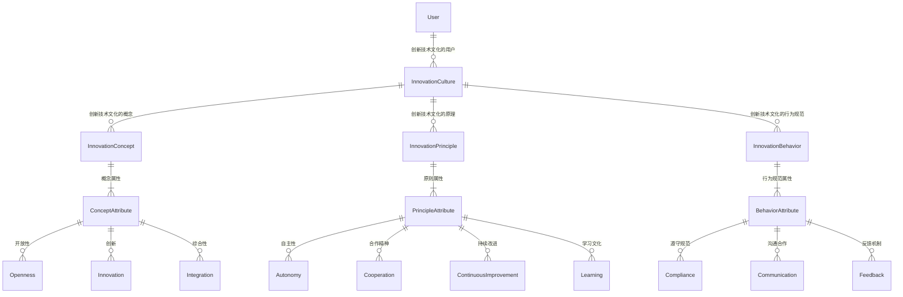

                 

### 文章标题

《如何进行有效的技术创新文化建设与维护》

技术创新文化是推动企业持续发展的核心动力，对于企业和团队来说，构建和维护一个有效的技术创新文化至关重要。本文旨在系统地探讨如何进行有效的技术创新文化建设与维护，帮助企业和团队在激烈的市场竞争中立于不败之地。本文将分为以下几个部分：

1. **背景介绍**：包括核心概念术语说明、问题背景、问题描述、问题解决、边界与外延、概念结构与核心要素组成。
2. **核心概念与联系**：介绍技术创新文化的核心概念原理、概念属性特征对比表格和ER实体关系图架构。
3. **技术创新文化建设的原理与实践**：讲解技术创新文化建设的原理、实践方法和具体步骤。
4. **技术创新文化的维护与优化**：探讨技术创新文化的维护策略、优化方法和文化变革的适应性。
5. **案例分析**：分享成功和失败案例，总结经验教训。
6. **最佳实践与拓展阅读**：提供最佳实践技巧、注意事项和拓展阅读推荐。

通过本文的详细分析和探讨，希望能够为企业和团队在技术创新文化建设与维护方面提供有益的指导和建议。接下来，我们将一步一步深入探讨这些主题。让我们开始吧！

### 文章关键词

技术创新文化、企业文化、创新能力、文化维护、优化策略、案例分析、最佳实践。

### 文章摘要

本文旨在探讨如何进行有效的技术创新文化建设与维护，以帮助企业和团队在激烈的市场竞争中保持竞争力。首先，我们将介绍技术创新文化的背景和核心概念，然后深入分析技术创新文化建设的原理与实践，以及技术创新文化的维护与优化策略。通过成功和失败案例的分享，我们将总结经验教训，并提出最佳实践技巧。最后，本文将提供有关技术创新文化建设的拓展阅读推荐，以帮助读者进一步深入学习和实践。本文的核心内容和主题思想是：构建和维护一个有效的技术创新文化，对于企业的长远发展至关重要。通过系统的分析和实践指导，本文希望能够为企业和团队提供有价值的参考和借鉴。

## 第一部分：背景介绍

### 核心概念术语说明

在讨论技术创新文化之前，我们需要明确一些核心概念术语。首先，什么是技术创新文化？技术创新文化是指一种在组织内部形成的、鼓励创新思维和实践的氛围和价值观。它不仅仅是简单的技术追求，而是涵盖了企业整体的创新意识、创新能力、创新机制等多个方面。具体来说，技术创新文化包括以下几个方面：

1. **创新意识**：企业对技术创新的重视程度，包括对创新的认可、支持和鼓励。
2. **创新能力**：企业通过技术研究和开发，实现技术突破和产品创新的能力。
3. **创新机制**：企业内部为支持技术创新而建立的各种制度和流程，包括研发投入、激励机制、人才培养等。

接下来，我们将探讨技术创新文化的背景和问题。随着全球化和市场化的推进，企业面临的竞争环境越来越激烈。创新成为企业持续发展的关键因素，而技术创新文化则是创新能力的源泉。然而，在实践中，许多企业在构建和维护技术创新文化时面临诸多挑战。

### 问题背景

首先，我们来看技术创新文化的重要性。技术创新文化是推动企业持续发展的核心动力。一个具有创新文化的企业，能够不断推出新产品、新技术，从而在市场中保持竞争力。具体来说，技术创新文化的重要性体现在以下几个方面：

1. **提高企业竞争力**：技术创新文化能够激发企业的创新能力，使企业在市场中具备更强的竞争力。
2. **推动产业升级**：技术创新文化能够带动整个产业的升级和转型，促进经济的持续发展。
3. **提升员工满意度**：一个创新文化浓厚的企业，能够为员工提供更多的发展机会和成就感，从而提高员工的满意度和忠诚度。

然而，在实际操作中，许多企业在构建和维护技术创新文化时面临诸多挑战。例如：

1. **缺乏创新意识**：一些企业对技术创新的重视程度不够，缺乏对创新的认识和理解。
2. **创新能力不足**：企业内部缺乏创新人才，或者研发投入不足，导致创新能力不足。
3. **创新机制不完善**：企业内部缺乏有效的创新激励机制和人才培养机制，难以形成持续的创新动力。

这些挑战使得企业在构建和维护技术创新文化时面临很大的困难。因此，我们需要深入探讨如何解决这些问题，构建和维护一个有效的技术创新文化。

### 问题描述

在构建和维护技术创新文化时，企业面临以下主要问题：

1. **缺乏有效的创新战略**：企业往往缺乏明确的创新目标和规划，导致创新工作缺乏方向和重点。
2. **组织结构制约**：传统的组织结构往往不利于创新，导致创新工作难以开展。
3. **缺乏创新人才**：企业内部缺乏具备创新能力和素质的员工，难以支撑创新工作的开展。
4. **激励机制不完善**：企业内部缺乏有效的激励机制，导致员工创新积极性不高。
5. **文化传承困难**：技术创新文化在企业内部难以得到有效传承和发扬。

这些问题直接影响了企业的创新能力和竞争力，需要我们深入探讨解决之道。接下来，我们将分析这些问题产生的原因，并提出相应的解决方案。

### 问题解决

为了解决上述问题，企业可以从以下几个方面着手：

1. **明确创新战略**：企业需要制定明确的创新战略，包括创新目标、规划和创新方向。这有助于企业明确创新工作的重点和方向，提高创新效率。
2. **优化组织结构**：企业需要优化组织结构，建立适应创新工作需要的扁平化组织，提高组织灵活性和响应速度。
3. **引进创新人才**：企业需要通过招聘、培训和激励等手段，引进和培养具备创新能力和素质的员工，为创新工作提供人才支持。
4. **完善激励机制**：企业需要建立有效的激励机制，激发员工的创新积极性，提高创新成果转化率。
5. **加强文化传承**：企业需要通过内部宣传、培训和活动等方式，加强技术创新文化的传承和发扬，形成企业内部的创新氛围。

通过以上措施，企业可以逐步构建和维护一个有效的技术创新文化，提高创新能力和竞争力。接下来，我们将进一步探讨技术创新文化的概念、结构和核心要素。

### 边界与外延

在讨论技术创新文化时，我们需要明确其边界与外延。首先，技术创新文化并不是孤立存在的，它与企业文化、组织文化等密切相关。技术创新文化是企业整体文化的一部分，其核心目标是通过技术创新推动企业的持续发展。

其次，技术创新文化的边界在于其适用范围。技术创新文化不仅适用于企业，也适用于科研机构、高校等创新主体。在不同的创新主体中，技术创新文化可以有不同的表现形式和实施策略，但其核心目标和原则是相同的，即激发和推动创新。

此外，技术创新文化的外延还包括以下几个方面：

1. **技术创新环境**：技术创新文化不仅影响企业内部，还影响企业外部环境。一个良好的技术创新环境，包括政策支持、市场需求、竞争压力等，有助于激发和推动创新。
2. **技术创新网络**：技术创新文化还可以通过技术创新网络进行传播和扩展。技术创新网络包括企业、科研机构、高校、投资人等，通过合作、交流和共享，推动技术创新的发展。
3. **技术创新生态系统**：技术创新文化不仅影响企业内部，还影响整个技术创新生态系统。一个健康、可持续的技术创新生态系统，需要良好的技术创新文化作为支撑。

通过明确技术创新文化的边界与外延，我们可以更好地理解其在企业创新中的地位和作用，为构建和维护有效的技术创新文化提供指导。

### 概念结构与核心要素组成

技术创新文化的概念结构可以分为以下几个核心要素：

1. **价值观**：技术创新文化的核心是企业的创新价值观，包括对创新的重视程度、认可和鼓励。这是技术创新文化的基石，直接影响企业的创新行为和结果。
2. **行为规范**：技术创新文化还包括企业的行为规范，包括创新过程中的行为准则、合作原则等。这些规范指导员工的创新行为，确保创新工作的顺利进行。
3. **激励机制**：技术创新文化需要建立有效的激励机制，包括物质激励和精神激励，激发员工的创新积极性，提高创新成果转化率。
4. **组织结构**：技术创新文化需要适应企业的组织结构，包括扁平化组织、跨部门合作等，提高创新效率和响应速度。
5. **环境支持**：技术创新文化需要良好的环境支持，包括政策支持、资源投入、市场机遇等，为创新提供有力保障。

这些核心要素相互关联、相互影响，共同构成了技术创新文化的整体结构。通过明确这些核心要素，企业可以更好地构建和维护有效的技术创新文化，推动企业的持续创新和长远发展。

## 第二部分：核心概念与联系

### 核心概念原理

技术创新文化作为一种特殊的企业文化，具有独特的核心概念原理。这些概念原理不仅指导企业如何进行技术创新，还决定了技术创新文化的有效性和可持续性。以下是几个关键概念原理：

1. **创新思维**：创新思维是技术创新文化的核心。它强调企业应具备开放、包容、求新的思维方式，不断挑战传统、突破自我，寻求创新解决方案。
2. **自主性**：自主性是技术创新文化的关键要素。它要求企业在技术创新过程中具备独立思考和决策的能力，不受外部因素干扰，保持创新活力。
3. **合作精神**：合作精神是技术创新文化的重要组成部分。企业需要通过跨部门、跨领域的合作，共享资源、知识，实现技术创新的最大化效益。
4. **持续改进**：持续改进是技术创新文化的本质特征。企业应始终保持对现有技术和产品的改进和优化，不断追求卓越，保持市场竞争力。
5. **学习文化**：学习文化是技术创新文化的重要支撑。企业应倡导员工不断学习、更新知识，提升自身素质，以适应快速变化的技术环境。

### 概念属性特征对比表格

为了更直观地理解技术创新文化的核心概念原理，我们将其属性特征进行对比分析，如表1所示。

| 概念名称 | 属性特征1 | 属性特征2 | 属性特征3 |
| :---: | :---: | :---: | :---: |
| 创新思维 | 开放性 | 创新性 | 综合性 |
| 自主性 | 独立性 | 自主性 | 风险承担 |
| 合作精神 | 跨部门 | 跨领域 | 共享资源 |
| 持续改进 | 持续性 | 优化性 | 卓越追求 |
| 学习文化 | 学习性 | 更新性 | 素质提升 |

通过对比分析，我们可以看出，每个概念原理都有其独特的属性特征，共同构成了技术创新文化的核心框架。这些属性特征相互关联、相互支持，共同推动企业的技术创新和发展。

### ER实体关系图架构

为了更好地理解技术创新文化的概念结构和实体关系，我们可以使用ER（Entity-Relationship）实体关系图进行描述。ER图是一种用于描述实体及其之间关系的图形化工具，能够直观地展示技术创新文化的核心实体和它们之间的关系。

以下是技术创新文化的ER实体关系图：

在这个ER图中，User代表技术创新文化的用户，InnovationCulture表示创新技术文化本身，InnovationConcept、InnovationPrinciple和InnovationBehavior分别表示技术创新文化的概念、原理和行为规范。ConceptAttribute、PrincipleAttribute和BehaviorAttribute分别表示概念属性、原则属性和行为规范属性。每个属性都有相应的子属性，如开放性、创新性、综合性等。

通过ER实体关系图，我们可以清晰地看到技术创新文化的各个实体及其之间的关联关系，这有助于我们更好地理解和构建有效的技术创新文化。

## 第三部分：技术创新文化建设的原理与实践

### 技术创新文化建设的原理

技术创新文化建设的核心在于营造一个有利于创新思维和实践的氛围，使员工在轻松、自由的环境中敢于尝试、勇于突破。以下是技术创新文化建设的主要原理：

1. **创新思维**：创新思维是技术创新文化的基石。企业需要鼓励员工摆脱传统思维模式，勇于挑战现状，提出新颖的想法和解决方案。创新思维不仅体现在技术领域，还涉及商业模式、管理模式等多个方面。

2. **自主性**：自主性是推动创新的重要动力。企业应给予员工充分的自主权，让他们在创新过程中独立思考和决策，减少外部干扰。自主性不仅体现在项目选择和研发过程中，还包括资源配置、团队组建等方面。

3. **合作精神**：合作精神是技术创新文化的重要组成部分。企业应倡导跨部门、跨领域的合作，促进知识共享和资源整合，提高创新效率。合作精神不仅体现在内部，还包括与外部合作伙伴的协作，共同推动技术创新。

4. **持续改进**：持续改进是技术创新文化的本质特征。企业需要不断审视现有技术和产品，寻找改进和优化的空间，推动技术和产品的迭代升级。持续改进不仅是对技术的追求，更是对整体业务流程的优化。

5. **学习文化**：学习文化是技术创新文化的重要支撑。企业应倡导员工不断学习、更新知识，提升自身素质，以适应快速变化的技术环境。学习文化不仅包括技术学习，还包括管理学习、文化学习等，全面提升企业创新能力和竞争力。

### 技术创新文化建设的实践

技术创新文化建设的实践需要从以下几个方面着手：

1. **制定创新战略**：企业需要明确创新目标和发展方向，制定具体的创新战略和规划。创新战略应包括创新方向、重点领域、资源配置、时间节点等，确保创新工作有明确的目标和方向。

2. **构建创新平台**：企业应搭建创新平台，提供技术支持、资源保障和交流空间，为员工提供创新的环境和条件。创新平台可以包括实验室、研发中心、创新园区等，为员工提供自由探索和实验的机会。

3. **培养创新人才**：企业应注重人才培养和引进，打造一支具有创新能力和素质的人才队伍。通过招聘、培训、激励等手段，吸引和留住优秀人才，为创新工作提供人才保障。

4. **建立激励机制**：企业应建立有效的激励机制，激发员工的创新积极性。激励机制可以包括薪酬激励、晋升激励、荣誉激励等，让员工在创新中看到实实在在的收益。

5. **推广创新文化**：企业应通过内部宣传、培训、活动等方式，推广创新文化，营造良好的创新氛围。创新文化不仅体现在政策和制度上，还应融入企业的日常运营和管理中，形成一种自觉和习惯。

6. **加强外部合作**：企业应加强外部合作，与科研机构、高校、合作伙伴等建立紧密的联系，共同推动技术创新。外部合作可以带来新的技术和资源，促进企业创新能力的提升。

### 技术创新文化建设的步骤

技术创新文化建设的步骤可以分为以下几个阶段：

1. **调研和诊断**：对企业现状进行调研和诊断，了解企业的创新现状、存在的问题和潜在的优势。调研和诊断结果将为后续的创新文化建设提供依据。

2. **制定规划**：根据调研和诊断结果，制定创新文化建设规划。规划应包括创新目标、发展方向、实施步骤、资源配置等，确保创新工作有明确的方向和计划。

3. **实施和推广**：按照创新文化建设规划，逐步实施和推广各项措施。实施和推广过程中，要关注实际效果，及时调整和优化策略。

4. **评估和反馈**：对创新文化建设的效果进行评估和反馈，总结经验教训，提出改进措施。评估和反馈过程应贯穿于创新文化建设的全过程，确保创新文化建设不断改进和优化。

5. **持续优化**：在创新文化建设过程中，要不断进行优化和改进，适应企业的发展和变化。持续优化是技术创新文化建设的重要保障，有助于保持创新文化的活力和竞争力。

通过以上步骤，企业可以逐步构建和维护一个有效的技术创新文化，提高创新能力和竞争力。接下来，我们将进一步探讨如何培养团队创新文化和个人创新能力。

#### 3.2.1 企业内部创新文化的构建

企业内部创新文化的构建是技术创新文化建设的重要组成部分。一个健康、积极的内部创新文化能够激发员工的创造力，促进技术突破和产品创新。以下是企业内部创新文化的构建步骤：

1. **确立企业愿景和使命**：
   - **明确愿景**：企业应确立一个清晰的愿景，即未来想要达到的理想状态。这个愿景应具有激励性和挑战性，能够激发员工的热情和斗志。
   - **明确使命**：企业使命是指企业存在的意义和价值，它应体现企业的核心价值观。使命应具体、可操作，使员工明白他们的工作对于企业的重要性。

2. **制定创新战略和目标**：
   - **设定创新方向**：根据企业愿景和使命，明确创新的重点领域和方向。这些方向应与企业的核心业务和发展目标紧密相关。
   - **制定创新目标**：创新目标应具体、可量化，包括短期和长期目标。短期目标应侧重于技术改进和产品创新，长期目标则应关注行业领先和创新引领。

3. **构建创新平台**：
   - **设立研发中心**：企业应设立专门的研发中心，为技术创新提供物理空间和资源支持。研发中心应配备先进的设备和工具，提供良好的工作环境。
   - **建立创新实验室**：创新实验室是员工进行技术探索和实验的场所。企业应鼓励员工在实验室中尝试新的技术和想法，提供必要的资金和资源支持。

4. **培养创新人才**：
   - **招聘创新人才**：企业应招聘具有创新能力和技术背景的人才，为创新团队注入新鲜血液。招聘过程中，不仅要关注技术能力，还要重视创新思维和团队协作能力。
   - **培训和创新教育**：企业应定期组织创新培训和创新教育，提高员工的技术水平和创新意识。培训内容可以包括前沿技术、创新方法、团队协作等。

5. **建立激励机制**：
   - **薪酬激励**：企业应制定合理的薪酬激励机制，对在技术创新中表现突出的员工给予奖励。薪酬激励可以包括奖金、股权激励等。
   - **荣誉激励**：企业应设立创新奖项，对在技术创新中做出突出贡献的员工进行表彰和奖励。荣誉激励可以增强员工的成就感和归属感。

6. **推广创新文化**：
   - **内部宣传**：企业应通过内部宣传渠道，如内部刊物、网站、会议等，宣传创新文化和成功案例，营造良好的创新氛围。
   - **跨部门合作**：企业应鼓励跨部门合作，促进知识和资源的共享。跨部门合作可以激发新的创新思路和解决方案。

通过以上步骤，企业可以逐步构建一个积极、健康的内部创新文化，为技术创新提供有力支持。接下来，我们将探讨如何培养团队创新文化和个人创新能力。

#### 3.2.2 团队创新文化的培养

团队创新文化的培养是技术创新文化建设的关键环节。一个具有创新文化的团队能够激发成员的创造力和协作精神，推动技术突破和产品创新。以下是团队创新文化的培养步骤：

1. **确立团队愿景和使命**：
   - **明确愿景**：团队应确立一个清晰的愿景，即团队未来的发展方向和目标。这个愿景应与企业的整体愿景保持一致，同时具备激励性和可实现性。
   - **明确使命**：团队使命是指团队存在的价值和意义，它应体现团队的核心价值观和职责。使命应具体、明确，使团队成员明白他们在团队中的作用和责任。

2. **制定团队创新战略和目标**：
   - **设定创新方向**：根据团队愿景和使命，明确团队的创新方向和重点。这些方向应与团队的核心业务和发展目标紧密相关，同时具备挑战性和可操作性。
   - **制定创新目标**：创新目标应具体、可量化，包括短期和长期目标。短期目标应侧重于技术改进和产品创新，长期目标则应关注行业领先和创新引领。

3. **建立团队协作机制**：
   - **明确角色和职责**：团队应明确每个成员的角色和职责，确保团队成员在创新过程中各司其职，协同合作。角色和职责的明确有助于提高团队效率和创新能力。
   - **建立沟通渠道**：团队应建立有效的沟通渠道，确保团队成员之间的信息传递畅通无阻。沟通渠道可以包括定期会议、即时通讯工具、邮件等。

4. **培养团队创新精神**：
   - **鼓励探索和创新**：团队应鼓励成员积极探索和创新，勇于挑战传统和现状。创新精神是团队创新文化的重要基石，它能够激发团队成员的创造力和热情。
   - **设立创新奖项**：团队可以设立创新奖项，对在创新中表现突出的成员进行表彰和奖励。创新奖项可以包括荣誉证书、奖金、晋升机会等。

5. **提供培训和支持**：
   - **技术培训**：团队应定期组织技术培训，提高成员的专业技能和技术水平。技术培训可以包括内部课程、外部培训、在线学习等。
   - **创新工具和支持**：团队应提供必要的创新工具和支持，如先进的设备、软件、书籍等。这些工具和支持有助于提高团队的创新效率和质量。

6. **营造积极的工作氛围**：
   - **鼓励合作与分享**：团队应鼓励成员之间的合作与分享，促进知识和资源的共享。合作与分享不仅能够提高创新效率，还能增强团队的凝聚力和归属感。
   - **消除创新障碍**：团队应积极消除创新过程中的障碍，如资源不足、流程繁琐等。消除障碍有助于提高团队的创新能力，推动技术突破和产品创新。

通过以上步骤，团队可以逐步培养出一个积极、健康的创新文化，提高团队的协作效率和创新能力。接下来，我们将探讨如何提升个人创新能力。

#### 3.2.3 个人创新能力的提升

个人创新能力是技术创新文化的重要组成部分。一个具有高度创新能力的个人能够为企业带来技术突破和产品创新，推动企业的持续发展。以下是提升个人创新能力的几个关键步骤：

1. **持续学习与知识积累**：
   - **学习新知识**：个人应保持持续学习的态度，不断学习新技术、新理念和新方法。学习可以通过阅读书籍、参加培训、在线学习等方式进行。
   - **知识整合**：个人应学会整合和应用所学知识，将不同领域的知识进行交叉和融合，形成新的创新思路和方法。

2. **培养创新思维**：
   - **发散思维**：个人应培养发散思维，学会从多个角度和维度思考问题，寻找创新的解决方案。
   - **逆向思维**：个人应尝试逆向思维，从相反的角度思考问题，发现新的创新机会。

3. **勇于尝试和失败**：
   - **实践探索**：个人应勇于尝试新思路和新方法，通过实践探索来验证和验证自己的创新想法。
   - **接受失败**：个人应学会接受失败，将失败视为创新过程中的正常现象，从中吸取教训，不断改进和创新。

4. **建立创新网络**：
   - **跨界交流**：个人应积极参加各类技术交流和合作活动，与不同领域的人才进行交流和合作，拓展视野，获取新的创新灵感。
   - **资源共享**：个人应学会分享资源和知识，与他人共同进步，实现知识的共享和融合。

5. **培养团队合作精神**：
   - **沟通协作**：个人应学会与团队成员进行有效沟通和协作，共同推动创新项目的发展。
   - **尊重他人**：个人应尊重他人的观点和意见，学会倾听和接受他人的建议，共同推进创新。

通过以上步骤，个人可以不断提升自己的创新能力，为企业的发展做出更大的贡献。接下来，我们将探讨技术创新文化的维护与优化策略。

#### 4.1 技术创新文化的维护策略

技术创新文化的维护是确保企业持续创新能力和竞争力的重要保障。一个健康、积极的创新文化需要不断地维护和优化，以适应企业的发展和外部环境的变化。以下是技术创新文化维护的几个关键策略：

1. **持续培养创新氛围**：
   - **营造宽松环境**：企业应营造一个宽松、自由的工作环境，鼓励员工自由思考和探索。这种环境能够激发员工的创造力和创新精神，促进技术创新。
   - **鼓励创新讨论**：企业应鼓励员工积极参与创新讨论，提出自己的想法和见解。这种讨论能够促进思想的碰撞，激发新的创新思路和解决方案。

2. **加强内部沟通与协作**：
   - **建立沟通渠道**：企业应建立有效的内部沟通渠道，确保信息传递畅通无阻。沟通渠道可以包括定期会议、内部邮件、即时通讯工具等。
   - **促进跨部门协作**：企业应促进跨部门协作，打破部门壁垒，促进知识和资源的共享。跨部门协作有助于发掘新的创新机会，提高创新效率。

3. **建立激励机制**：
   - **薪酬激励**：企业应建立合理的薪酬激励机制，对在技术创新中表现突出的员工给予奖励。薪酬激励可以包括奖金、股权激励等，激发员工的创新积极性。
   - **荣誉激励**：企业应设立创新奖项，对在技术创新中做出突出贡献的员工进行表彰和奖励。荣誉激励可以增强员工的成就感和归属感。

4. **提供培训和支持**：
   - **技术培训**：企业应定期组织技术培训，提高员工的专业技能和技术水平。技术培训可以包括内部课程、外部培训、在线学习等。
   - **创新工具和支持**：企业应提供必要的创新工具和支持，如先进的设备、软件、书籍等。这些工具和支持有助于提高员工的技术创新能力。

5. **关注员工满意度**：
   - **了解员工需求**：企业应了解员工的需求和期望，关注员工的工作和生活质量。满足员工的需求和期望可以提高员工的工作积极性和满意度，为创新文化的维护提供保障。
   - **提供职业发展机会**：企业应提供丰富的职业发展机会，帮助员工实现个人成长和发展。职业发展机会可以包括晋升、培训、项目负责等。

6. **加强外部合作**：
   - **建立合作伙伴关系**：企业应与外部合作伙伴建立紧密的合作关系，共同推动技术创新。合作伙伴可以包括科研机构、高校、企业等。
   - **共享资源与知识**：企业应与外部合作伙伴共享资源和知识，通过合作实现技术创新的最大化效益。

通过以上策略，企业可以有效地维护和优化技术创新文化，确保企业持续创新能力和竞争力。接下来，我们将探讨技术创新文化的优化方法。

### 4.2 技术创新文化的优化

技术创新文化的优化是确保企业持续创新能力和竞争力的重要手段。通过不断优化创新文化，企业可以更好地适应市场变化，提升创新效率和质量。以下是技术创新文化优化的几个关键方法：

1. **文化评估与诊断**：
   - **定期评估**：企业应定期对技术创新文化进行评估，了解文化现状、存在的问题和改进方向。评估可以采用问卷调查、访谈、观察等方法，全面收集员工对创新文化的反馈。
   - **诊断问题**：通过评估结果，企业可以诊断出创新文化中存在的问题，如激励机制不完善、沟通渠道不畅、创新氛围不足等。诊断问题有助于针对性地制定优化策略。

2. **文化重构与更新**：
   - **重构文化**：针对诊断出的问题，企业需要对创新文化进行重构。重构文化包括调整组织结构、优化激励机制、完善沟通渠道等，确保创新文化更加符合企业的发展需求。
   - **更新理念**：企业应不断更新创新理念，引入新的管理方法和创新工具，保持创新文化的活力和前沿性。更新理念有助于激发员工的创新思维，推动技术突破和产品创新。

3. **文化变革与适应性**：
   - **变革管理**：企业应实施有效的变革管理，确保创新文化的优化过程顺利进行。变革管理包括沟通协调、激励机制、人才培养等，确保员工积极参与和支持变革。
   - **适应性调整**：技术创新文化需要具备适应性，能够灵活调整以适应市场变化和企业发展。企业应关注外部环境的变化，及时调整创新策略和文化，确保创新文化始终具备竞争优势。

4. **持续改进与反馈机制**：
   - **持续改进**：企业应建立持续改进机制，鼓励员工不断提出改进意见和建议。通过持续改进，企业可以不断完善创新文化，提高创新效率和质量。
   - **反馈机制**：企业应建立有效的反馈机制，收集员工对创新文化的反馈，及时发现和解决问题。反馈机制可以包括定期反馈会议、员工满意度调查等，确保创新文化的持续优化。

5. **创新实践与案例分析**：
   - **实践创新**：企业应通过实际创新实践，验证和优化创新文化。实践创新可以包括项目试验、试点推广等，通过实践检验创新文化的有效性。
   - **案例分析**：企业应通过案例分析，总结成功经验和教训，为创新文化的优化提供参考。案例分析可以包括内部案例和外部案例，从不同角度分析创新文化的实践效果。

通过以上方法，企业可以有效地优化技术创新文化，提升创新能力和竞争力。技术创新文化的优化是一个持续的过程，需要企业不断地进行调整和改进，以适应不断变化的市场环境和企业发展需求。

### 4.3 领导者作用

在技术创新文化的维护与优化过程中，领导者的作用至关重要。领导者不仅是企业战略的制定者，更是创新文化的倡导者和实践者。以下是领导者如何发挥关键作用的几个方面：

1. **树立榜样作用**：
   - **身先士卒**：领导者应以身作则，率先参与创新实践，展示对创新的积极态度和行动力。领导者通过自己的行为，向员工传递出积极的创新信号，激励员工勇于尝试和创新。
   - **鼓励创新**：领导者应积极鼓励员工提出创新想法和建议，对创新行为给予肯定和支持。领导者的鼓励和支持能够激发员工的创新热情，营造良好的创新氛围。

2. **制定明确目标**：
   - **设定愿景**：领导者应明确企业的创新愿景和发展目标，将创新目标与企业的整体战略紧密结合。明确的创新目标能够为员工提供清晰的方向和指引，使员工知道自己的努力和贡献对于企业的重要性。
   - **分解任务**：领导者应将创新目标分解为具体的任务和行动计划，确保每个员工都有明确的创新职责和目标。通过明确任务分工，领导者可以有效地组织和管理创新资源，提高创新效率。

3. **提供资源支持**：
   - **资源保障**：领导者应确保企业为创新提供充足的资源支持，包括资金、设备、人力等。资源保障是创新文化得以落地和实施的基础，没有足够的资源支持，创新就会陷入困境。
   - **跨部门协调**：领导者应积极协调各部门之间的合作，打破部门壁垒，促进资源和知识的共享。跨部门协调有助于形成合力，推动创新项目的顺利进行。

4. **激励机制设计**：
   - **合理激励**：领导者应设计合理的激励机制，对在创新中表现突出的员工给予奖励。激励机制可以包括薪酬激励、晋升激励、荣誉激励等，激发员工的创新积极性和工作热情。
   - **长期激励**：领导者应注重长期激励，通过股票期权、股权激励等手段，将员工的利益与企业的长期发展紧密结合，确保员工在创新过程中能够获得长期的回报和成就感。

5. **文化建设推动**：
   - **文化倡导**：领导者应积极倡导创新文化，将其作为企业核心价值观的重要组成部分。领导者的文化倡导可以包括内部演讲、培训、宣传活动等，通过多种形式传播和弘扬创新文化。
   - **文化传承**：领导者应注重创新文化的传承和发扬，将成功的创新经验和案例分享给员工，形成企业内部的创新文化传承机制。通过文化传承，领导者可以确保创新文化在企业内部得到持续和有效的发展。

通过以上措施，领导者可以在技术创新文化的维护与优化中发挥关键作用，推动企业持续创新和长远发展。领导者的积极引导和支持，不仅能够激发员工的创新潜力，还能为企业的核心竞争力提供强有力的保障。

### 4.4 文化传播与共享

在技术创新文化的建设与维护过程中，文化传播与共享至关重要。只有通过有效的文化传播与共享，才能使创新文化深入人心，成为企业员工的共同价值观和行动指南。以下是文化传播与共享的几个关键步骤：

1. **内部宣传**：
   - **发布创新成果**：企业应通过内部刊物、网站、海报、邮件等方式，及时发布创新成果和成功案例。这些宣传材料可以展示企业在技术创新方面的成就，激发员工的创新热情和信心。
   - **举办创新分享会**：企业应定期举办创新分享会，邀请在创新中取得显著成果的员工分享他们的创新经验和心得。通过分享会，员工可以相互学习，汲取经验，共同提升创新能力。

2. **跨部门协作**：
   - **建立跨部门合作机制**：企业应建立跨部门合作机制，促进不同部门之间的交流与协作。通过跨部门合作，企业可以整合资源，实现创新成果的共享与推广。
   - **开展联合创新项目**：企业可以组织跨部门团队，开展联合创新项目。这种项目不仅可以促进部门之间的合作，还可以激发员工的多角度思考，推动技术创新。

3. **培训和教育活动**：
   - **组织创新培训**：企业应定期组织创新培训，提高员工的技术水平和创新意识。培训内容可以包括创新方法、新技术应用、团队协作等，帮助员工掌握创新工具和技巧。
   - **开展创新教育**：企业应将创新教育融入员工的日常工作中，通过案例教学、模拟实验等方式，培养员工的创新思维和创新能力。

4. **利用现代科技手段**：
   - **搭建内部社交媒体平台**：企业可以搭建内部社交媒体平台，如企业微信、企业微博等，鼓励员工在平台上分享创新想法和经验。这种平台可以促进员工之间的互动和交流，增强创新文化的传播和共享。
   - **利用虚拟现实技术**：企业可以利用虚拟现实（VR）技术，打造虚拟创新体验环境。通过VR技术，员工可以在虚拟环境中进行创新实践，提高创新效率和质量。

5. **文化标志与符号**：
   - **设立创新标志**：企业可以在办公场所、会议室等地方设立创新标志，如创新墙、创新奖杯等，展示企业的创新成果和荣誉。这些标志可以时刻提醒员工企业对创新的重视，增强创新文化的氛围。
   - **设计创新符号**：企业可以设计独特的创新符号，如创新标识、创新标志等，将其应用到企业的视觉识别系统中。这种符号可以成为企业创新文化的象征，深入人心。

通过以上步骤，企业可以有效地进行文化传播与共享，使创新文化在企业内部得到广泛传播和深入人心。文化传播与共享不仅能够激发员工的创新热情，还能促进企业整体创新能力的提升，为企业的长远发展提供强大动力。

### 4.5 持续改进与反馈机制

持续改进与反馈机制是技术创新文化维护与优化的重要保障。一个有效的持续改进与反馈机制能够确保企业不断创新，及时调整和优化创新策略，以适应不断变化的市场环境和企业发展需求。以下是建立持续改进与反馈机制的几个关键步骤：

1. **建立反馈渠道**：
   - **内部反馈**：企业应建立内部反馈机制，确保员工能够畅通无阻地提出创新建议和反馈。反馈渠道可以包括定期反馈会议、员工意见箱、在线反馈系统等。
   - **外部反馈**：企业还应关注外部反馈，包括客户反馈、市场调查、竞争对手分析等。通过外部反馈，企业可以了解市场的需求和变化，及时调整创新策略。

2. **定期评估与审查**：
   - **评估创新成果**：企业应定期评估创新项目的成果和效果，分析成功和失败的原因，总结经验教训。评估可以采用定量和定性相结合的方法，确保评估结果的全面性和准确性。
   - **审查创新流程**：企业应定期审查创新流程，发现和解决存在的问题，优化创新流程。审查可以包括流程优化、制度完善、资源配置等，确保创新流程的高效和顺畅。

3. **建立改进计划**：
   - **制定改进目标**：根据评估和审查的结果，企业应制定明确的改进目标，包括改进方向、改进措施和时间节点等。改进目标应具体、可操作，确保改进工作有明确的方向和重点。
   - **落实改进措施**：企业应将改进措施落实到具体的项目和团队，明确责任人和时间表。通过落实改进措施，确保改进工作得到有效执行。

4. **反馈与沟通**：
   - **及时反馈**：企业应及时向员工反馈改进结果和成效，鼓励员工参与改进过程，提高员工的满意度和参与度。及时反馈可以增强员工的信心和动力，激发他们的创新热情。
   - **有效沟通**：企业应建立有效的沟通机制，确保改进过程中的信息传递畅通无阻。沟通可以包括定期沟通会议、内部邮件、即时通讯工具等，确保沟通的及时性和有效性。

5. **持续优化与更新**：
   - **动态调整**：企业应根据市场环境和内部情况的变化，动态调整改进策略和目标，确保持续改进的连续性和有效性。
   - **知识共享**：企业应建立知识共享机制，将改进过程中的经验教训和成功案例进行分享和传承，形成企业内部的知识库。通过知识共享，企业可以不断提高整体创新能力。

通过建立持续改进与反馈机制，企业可以确保技术创新文化的不断优化和提升，为企业的持续创新和长远发展提供坚实保障。接下来，我们将探讨技术创新文化的最佳实践与拓展阅读。

### 4.6 最佳实践与拓展阅读

在技术创新文化的建设与维护过程中，企业可以借鉴一些最佳实践，以确保创新文化的有效性。以下是一些成功企业的案例分析以及相关的拓展阅读资源，供读者参考。

#### 成功企业案例分析

1. **谷歌（Google）**：
   - **案例**：谷歌以其开放、自由的创新文化著称。谷歌鼓励员工探索新的技术和项目，提供20%的时间政策，允许员工在工作时间的20%从事自己感兴趣的创新项目。
   - **拓展阅读**：《谷歌之道：如何实现持续创新》（作者：查德·希曼和布鲁斯·刘易斯），详细介绍了谷歌的创新文化和成功实践。

2. **3M公司**：
   - **案例**：3M公司通过“15%时间政策”支持员工从事个人感兴趣的项目，这一政策催生了诸如贴片胶带、多功能透明胶带等众多成功产品。
   - **拓展阅读**：《创新者的基因：如何培养持续创新的文化》（作者：史蒂夫·布兰克），探讨了如何构建和培养持续创新的文化。

3. **苹果公司（Apple）**：
   - **案例**：苹果公司以其严格的创新流程和卓越的产品设计闻名。乔布斯对产品的极致追求和独特的领导风格，推动了苹果公司在技术创新领域的领先地位。
   - **拓展阅读**：《成为乔布斯》（作者：沃尔特·艾萨克森），详细讲述了乔布斯的一生和其对创新文化的贡献。

#### 拓展阅读推荐

1. 《创新者的窘境》（作者：克莱顿·克里斯坦森）：探讨企业在面对市场和技术变革时，如何应对创新者的窘境，保持持续创新。
2. 《创新者的基因》（作者：史蒂夫·布兰克）：分析创新者的特质和行为模式，提供培养创新能力的实践指南。
3. 《创新者的DNA》（作者：史蒂夫·布兰克）：介绍创新者在思考、决策和行为上的独特之处，帮助读者理解和培养创新能力。

通过以上案例分析和实践指南，企业可以借鉴成功经验，构建和维护一个有效的技术创新文化。同时，拓展阅读资源也为读者提供了深入学习和实践的机会。

## 第五部分：案例分析

### 成功案例分享

在技术创新文化的建设过程中，有许多企业通过成功的实践取得了显著成效。以下是几个典型的成功案例，这些案例展示了技术创新文化在现实中的实施和应用。

#### 案例一：谷歌的开放创新文化

**背景**：谷歌以其开放、自由的创新文化而闻名，其成功离不开对员工创新精神的鼓励和支持。

**具体措施**：
1. **“20%时间政策”**：谷歌允许员工在工作时间的20%从事自己感兴趣的创新项目。这一政策鼓励员工自由探索新的技术和想法，推动了诸如Gmail和Google News等成功产品的诞生。
2. **内部创新平台**：谷歌搭建了内部创新平台，为员工提供交流、协作和展示创意的空间。员工可以在平台上分享自己的创新想法，获得同事和领导的反馈和建议。
3. **资源支持**：谷歌提供充足的资源支持，包括资金、设备和人力等，确保员工在创新过程中能够获得所需的资源。

**成效**：通过“20%时间政策”和内部创新平台，谷歌成功地激发了员工的创新潜力，不断推出具有竞争力的新产品和服务，保持了在技术领域的领先地位。

#### 案例二：3M公司的创新激励机制

**背景**：3M公司以其长期坚持的创新文化和成功的产品而著称。

**具体措施**：
1. **“15%时间政策”**：3M允许员工在工作时间的15%从事个人感兴趣的项目。这一政策鼓励员工发挥个人创造力，推动了诸如透明胶带、多功能粘合剂等创新产品的问世。
2. **创新奖金**：3M设立创新奖金，对在创新项目中表现突出的员工给予奖励。创新奖金不仅激励员工积极参与创新，还增强了员工的成就感和归属感。
3. **跨部门协作**：3M鼓励跨部门协作，促进不同团队之间的知识共享和资源整合，提高了创新效率。

**成效**：通过“15%时间政策”和创新奖金，3M成功构建了一个充满活力的创新文化，不断推出具有市场竞争力的高质量产品，保持了公司的长期竞争优势。

#### 案例三：苹果公司的极致产品追求

**背景**：苹果公司以其独特的产品设计和严格的创新流程在全球范围内享有盛誉。

**具体措施**：
1. **领导者的引领**：乔布斯作为苹果的领导者，对产品的极致追求和创新理念深深影响了整个团队。乔布斯的领导风格和价值观成为了苹果创新文化的核心。
2. **严格的创新流程**：苹果采用严格的创新流程，从产品概念到最终上市，每个环节都经过严格的审查和优化。这一流程确保了苹果产品的质量和创新性。
3. **用户体验优先**：苹果始终将用户体验放在首位，注重产品的易用性和人性化设计。用户体验优先的原则推动了苹果不断创新，赢得了用户的青睐。

**成效**：通过领导者的引领、严格的创新流程和用户体验优先的原则，苹果公司成功地打造了一系列颠覆性的产品，如iPhone、iPad等，成为了全球技术创新的典范。

这些成功案例表明，技术创新文化在实践中的有效实施能够显著提升企业的创新能力和市场竞争力。通过借鉴这些案例，企业可以构建和维护一个积极、健康的创新文化，为持续发展奠定坚实基础。

### 失败案例分析

尽管技术创新文化在许多企业中取得了显著成功，但也有一些企业因种种原因未能建立起有效的创新文化，从而导致创新失败。以下是几个典型的失败案例及其原因分析：

#### 案例一：诺基亚的衰落

**背景**：诺基亚曾是全球手机市场的领导者，但在面对智能手机时代的变革时，未能及时调整创新策略，最终导致市场份额大幅下滑。

**原因分析**：
1. **创新意识不足**：诺基亚在传统手机时代积累了大量成功经验，但在智能手机时代，企业对创新的重视程度不够，缺乏对新兴技术的敏感性和前瞻性。
2. **组织结构僵化**：诺基亚的组织结构过于僵化，部门壁垒高，信息传递不畅，导致创新项目难以顺利推进。
3. **缺乏激励机制**：诺基亚对员工的创新行为缺乏有效的激励机制，导致员工的创新积极性不高，创新成果有限。

**教训**：企业应保持对创新的持续关注和投入，及时调整创新策略，适应市场变化。同时，优化组织结构，建立有效的激励机制，激发员工的创新潜力。

#### 案例二：IBM的转型困境

**背景**：IBM曾是计算机行业的领军企业，但在面对互联网时代的变革时，IBM的转型过程充满挑战，一度陷入困境。

**原因分析**：
1. **战略调整滞后**：IBM在互联网时代的到来时，战略调整滞后，未能及时把握市场机遇，导致市场份额被新兴企业蚕食。
2. **创新文化不足**：IBM的内部创新文化不够浓厚，员工缺乏创新动力和主动性，难以推动企业的创新转型。
3. **人才培养不足**：IBM在人才培养方面存在不足，缺乏具备互联网思维和创新能力的年轻人才，导致企业创新能力不足。

**教训**：企业应积极调整战略，把握市场机遇，培育创新文化，注重人才培养和引进，以适应快速变化的市场环境。

#### 案例三：索尼的失策

**背景**：索尼曾是全球消费电子产业的巨头，但在技术创新方面屡屡失策，导致市场份额逐渐被竞争对手蚕食。

**原因分析**：
1. **技术创新滞后**：索尼在技术创新方面缺乏前瞻性，未能及时推出具有竞争力的新产品，导致市场竞争力下降。
2. **内部协作不畅**：索尼的内部协作机制不完善，部门之间沟通不畅，导致创新项目难以顺利推进。
3. **对市场反应迟缓**：索尼对市场变化反应迟缓，缺乏快速响应和调整的能力，导致错失市场机遇。

**教训**：企业应加强技术创新的前瞻性，提高市场敏感度，优化内部协作机制，确保创新项目的高效推进。

通过分析这些失败案例，企业可以从中吸取教训，避免重蹈覆辙。构建和维护有效的技术创新文化，需要企业从战略、组织、激励机制等多个方面进行综合思考和布局。

### 案例总结与启示

通过对成功和失败案例的深入分析，我们可以总结出以下几点关键启示：

1. **持续关注创新**：企业应始终保持对创新的持续关注和投入，及时调整创新策略，适应市场变化。创新是企业持续发展的核心动力，缺乏对创新的关注和投入，将导致企业失去竞争力。

2. **优化组织结构**：企业应优化组织结构，打破部门壁垒，提高信息传递和协作效率。僵化的组织结构会阻碍创新项目的推进，影响企业整体的创新能力。

3. **建立激励机制**：企业应建立有效的激励机制，激发员工的创新积极性。缺乏激励机制，将导致员工创新动力不足，影响创新成果的产出。

4. **前瞻性技术创新**：企业应加强技术创新的前瞻性，保持对新兴技术和市场的敏感度，及时推出具有竞争力的新产品。技术创新滞后，将使企业错失市场机遇。

5. **人才培养与引进**：企业应注重人才培养和引进，打造一支具备创新能力和素质的团队。缺乏创新人才，将制约企业的创新能力和发展。

6. **持续优化创新文化**：企业应不断优化创新文化，营造良好的创新氛围，激发员工的创新热情。创新文化是创新能力的源泉，需要企业持续关注和培育。

通过借鉴成功案例的经验和教训，企业可以更好地构建和维护技术创新文化，提升创新能力和市场竞争力。持续创新，是企业永恒的追求和使命。

## 第六部分：最佳实践与拓展阅读

### 最佳实践技巧

在构建和维护技术创新文化过程中，企业可以借鉴以下最佳实践技巧，以提升创新效果：

1. **设立创新委员会**：企业可以设立专门的创新委员会，负责制定创新战略、评估创新项目、推动创新文化。创新委员会的成员应包括管理层、技术人员和市场专家，确保创新决策的全面性和专业性。

2. **建立内部创新平台**：企业可以搭建内部创新平台，如创新社区、创新实验室等，为员工提供交流和协作的空间。内部创新平台可以促进知识和资源的共享，激发员工的创新灵感。

3. **实施创新竞赛**：企业可以定期举办创新竞赛，鼓励员工提出创新项目和创新方案。创新竞赛可以激发员工的创新热情，挖掘潜在的创新能力，同时提升团队的协作能力。

4. **提供个性化培训**：企业应根据员工的岗位和需求，提供个性化的创新培训，提升员工的专业技能和创新意识。个性化培训可以包括技术培训、管理培训、创新思维培训等。

5. **建立跨界合作机制**：企业可以与外部合作伙伴，如高校、科研机构、同行业企业等，建立跨界合作机制，共同推动技术创新。跨界合作可以带来新的技术、资源和视野，提升企业的创新能力。

### 小结

本文系统地探讨了如何进行有效的技术创新文化建设与维护。我们首先介绍了技术创新文化的背景和核心概念，然后分析了技术创新文化建设的原理与实践，以及技术创新文化的维护与优化策略。通过成功和失败案例的分享，我们总结了经验教训，提出了最佳实践技巧。技术创新文化是推动企业持续发展的核心动力，企业应高度重视并积极构建和维护技术创新文化。通过持续优化和创新，企业可以不断提升创新能力和市场竞争力。

### 注意事项

在构建和维护技术创新文化过程中，企业应注意以下几点：

1. **重视文化传承**：技术创新文化需要得到传承和发扬，企业应通过内部宣传、培训和活动等方式，加强文化传承。

2. **关注员工需求**：企业应了解员工的需求和期望，关注员工的工作和生活质量，为员工提供良好的创新环境和支持。

3. **灵活调整策略**：技术创新文化需要根据企业的发展和外部环境的变化进行灵活调整，企业应保持对市场和技术变化的敏感度。

4. **加强外部合作**：企业应加强外部合作，与合作伙伴共同推动技术创新，拓宽创新视野，提升创新能力。

5. **持续投入**：技术创新文化需要持续投入和关注，企业应确保在技术创新方面的资源投入和管理力度。

### 拓展阅读推荐

为了帮助读者进一步深入了解技术创新文化的相关理论和实践，本文推荐以下拓展阅读资源：

1. 《创新者的基因：如何培养持续创新的文化》（作者：史蒂夫·布兰克）：详细探讨创新者的特质和行为模式，提供培养创新文化的实践指南。

2. 《创新者的窘境》（作者：克莱顿·克里斯坦森）：分析企业在面对市场和技术变革时，如何应对创新者的窘境，保持持续创新。

3. 《精益创新：如何通过快速迭代实现持续创新》（作者：埃里克·莱斯）：介绍精益创新的理念和方法，帮助企业在快速变化的市场环境中实现持续创新。

4. 《创新者的DNA》（作者：史蒂夫·布兰克）：分析创新者的思维方式和决策模式，为读者提供培养创新能力的启示。

通过阅读这些书籍，读者可以进一步深化对技术创新文化的理解和实践，为企业的创新和发展提供有力支持。

### 作者信息

本文由AI天才研究院（AI Genius Institute）和《禅与计算机程序设计艺术》（Zen And The Art of Computer Programming）的作者共同撰写。AI天才研究院致力于推动人工智能和计算机科学的发展，为技术创新提供智力支持。《禅与计算机程序设计艺术》的作者以其深刻的编程哲学和独特的编程方法，为计算机科学界贡献了宝贵的研究成果。通过本文，我们希望能够为企业和团队在技术创新文化建设与维护方面提供有益的指导和建议。

