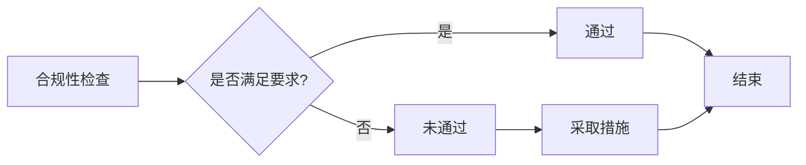

                 

### 如何进行有效的技术合规管理

#### 关键词

- 技术合规管理
- 法规与标准
- 合规流程
- 合规监控
- 风险管理
- 最佳实践

> 技术合规管理是确保信息技术产品和服务的合法性、合规性和安全性的关键过程。随着技术的迅猛发展和法规的日益复杂，如何进行有效的技术合规管理变得至关重要。本文将分步骤深入探讨技术合规管理的核心概念、法规与标准、合规流程、合规监控与审计、合规风险管理以及合规管理的最佳实践，帮助读者系统地理解和实施技术合规管理。

### 摘要

本文旨在为信息技术专业人士提供一份全面的技术合规管理指南。首先，我们将概述技术合规管理的定义、重要性及其发展背景。接着，探讨技术合规管理涉及的法规与标准，包括国际和国内的相关法规，并对比其特点与差异。随后，详细介绍合规流程的设计与实施，包括合规监控、审计和风险管理的具体方法。最后，分享国内外的技术合规管理案例分析，总结最佳实践，并展望技术合规管理的未来发展趋势。通过本文的阅读，读者将能够全面了解并掌握技术合规管理的核心知识和实践方法。

#### 第一步：技术合规管理基础

##### 1.1 技术合规管理概述

技术合规管理，是指组织在开发、部署和使用信息技术产品和服务的过程中，遵循相关的法律法规、行业标准及内部规章，以确保其合规性的一系列管理活动。它涵盖了从产品开发、测试、部署到运行和维护的整个生命周期。

**定义与重要性**

技术合规管理的定义可以概括为“确保信息技术产品和服务的合法性、合规性和安全性”。其重要性体现在以下几个方面：

1. **法律合规性**：遵守相关法律法规是企业的基本义务，违反法律可能会导致严重的法律后果。
2. **商业风险降低**：有效的技术合规管理能够帮助企业降低因不合规行为而带来的商业风险。
3. **客户信任**：合规性是企业赢得客户信任的重要基石，有助于提升市场竞争力。
4. **品牌形象**：良好的合规记录有助于塑造企业的良好品牌形象。

**问题背景**

随着信息技术的快速发展，技术合规管理的复杂性也在增加。一方面，新技术不断涌现，如人工智能、大数据、云计算等，为合规管理带来了新的挑战；另一方面，各国和地区针对信息技术产品的法规和标准也在不断更新和变化。例如，欧盟的《通用数据保护条例》（GDPR）对数据保护提出了严格的要求，美国的《萨班斯-奥克斯利法案》（SOX）对财务报告的合规性有明确规定。

**问题描述**

在信息技术产品和服务的生命周期中，合规管理面临以下问题：

1. **法规遵循困难**：企业难以全面了解和遵循所有相关的法规和标准。
2. **合规成本高昂**：合规管理需要投入大量的人力和物力资源。
3. **技术变革快速**：合规要求随着技术变革而不断变化，企业需要快速适应。
4. **内部协调困难**：合规管理涉及多个部门和角色，内部协调难度大。

**问题解决**

为了解决上述问题，企业可以采取以下措施：

1. **建立合规管理体系**：制定明确的合规策略和流程，确保各部门和角色协同工作。
2. **培训与意识提升**：加强员工对合规知识的培训，提高全员合规意识。
3. **技术工具支持**：利用合规管理工具，自动化部分合规流程，降低成本。
4. **持续监控与改进**：建立合规监控体系，定期审计和评估合规情况，及时调整策略。

**边界与外延**

技术合规管理的边界主要包括：

1. **产品生命周期管理**：涉及产品从开发到退市的整个生命周期。
2. **法律遵从性**：确保遵守国家法律法规、国际条约、行业标准和内部规章。
3. **风险管理**：识别、评估和应对合规风险，降低合规风险带来的损失。

技术合规管理的核心要素包括：

1. **法规遵循**：确保产品和服务的合规性。
2. **风险评估**：定期评估合规风险，制定应对措施。
3. **监控与审计**：建立合规监控和审计机制，确保合规要求得到执行。
4. **培训与意识**：提高员工合规意识和技能。

##### 1.2 核心概念与联系

**核心概念原理**

技术合规管理涉及多个核心概念，包括法律法规、合规性、合规流程、风险管理、监控和审计等。以下是这些核心概念的详细解释：

1. **法律法规**：指国家和国际层面关于信息技术产品和服务的相关法律和法规。
2. **合规性**：指信息技术产品和服务的符合法律法规和行业标准的要求。
3. **合规流程**：指确保合规性的具体管理活动，包括制定合规策略、设计合规流程、执行和监控合规要求等。
4. **风险管理**：指识别、评估和应对合规风险，以降低合规风险带来的损失。
5. **监控与审计**：指对合规执行情况进行监控和评估，确保合规要求得到有效执行。

**概念属性特征对比表格**

以下是一个简单的概念属性特征对比表格：

| 概念         | 特征描述                                             |
|--------------|----------------------------------------------------|
| 法律法规     | 法律地位的正式文件，具有强制力                           |
| 合规性       | 是否符合法律法规和行业标准的要求                         |
| 合规流程     | 确保合规性的具体管理活动，包括制定策略、设计流程、执行和监控 |
| 风险管理     | 识别、评估和应对合规风险，降低风险损失                   |
| 监控与审计   | 监控合规执行情况，定期审计合规性，确保合规要求得到执行   |

**ER实体关系图架构**

ER实体关系图是一种用于描述实体及其相互关系的图形化工具。以下是技术合规管理中的ER实体关系图：

```mermaid
erDiagram
    Product ||--|{ ComplianceRequirement }|-- Product
    Product ||--|{ ComplianceActivity }|-- Product
    Product ||--|{ ComplianceRisk }|-- Product
    ComplianceRequirement ||--|{ Law }|-- ComplianceRequirement
    ComplianceRequirement ||--|{ Standard }|-- ComplianceRequirement
    ComplianceActivity ||--|{ ComplianceMonitoring }|-- ComplianceActivity
    ComplianceActivity ||--|{ ComplianceAudit }|-- ComplianceActivity
    ComplianceRisk ||--|{ RiskAssessment }|-- ComplianceRisk
    ComplianceRisk ||--|{ RiskMitigation }|-- ComplianceRisk
```

**算法原理讲解**

为了确保合规流程的有效实施，我们可以采用以下算法原理：

1. **合规性检查算法**：用于检查产品和服务是否满足法律法规和行业标准的要求。
2. **风险管理算法**：用于识别、评估和应对合规风险。
3. **监控算法**：用于实时监控合规执行情况。
4. **审计算法**：用于评估合规性，并生成审计报告。

以下是一个简单的合规性检查算法的mermaid流程图：



接下来，我们使用Python源代码详细阐述合规性检查算法的原理：

```python
def check_compliance(product, requirements):
    """
    检查产品是否满足合规要求。
    
    :param product: 产品对象
    :param requirements: 合规要求列表
    :return: 合规性检查结果
    """
    for requirement in requirements:
        if not meets_requirement(product, requirement):
            return "未通过"
    return "通过"

def meets_requirement(product, requirement):
    """
    判断产品是否满足单个合规要求。
    
    :param product: 产品对象
    :param requirement: 合规要求
    :return: 是否满足要求
    """
    # 根据具体要求实现逻辑，例如：
    return product.feature == requirement.expected_value
```

**数学模型和公式**

合规性检查算法的核心是判断产品是否满足特定的合规要求。我们可以使用以下数学模型来表示：

$$
合规性 = \sum_{i=1}^{n} w_i \cdot (产品_i - 要求_i)
$$

其中，$w_i$ 表示第 $i$ 个合规要求的重要权重，$(产品_i - 要求_i)$ 表示第 $i$ 个产品特征与合规要求的差异。

**举例说明**

假设我们有一个产品对象和一组合规要求，如下所示：

```python
product = {
    "feature1": "value1",
    "feature2": "value2",
    "feature3": "value3"
}

requirements = [
    {"name": "requirement1", "expected_value": "value1"},
    {"name": "requirement2", "expected_value": "value2"},
    {"name": "requirement3", "expected_value": "value3"}
]
```

使用合规性检查算法，我们可以得到以下结果：

```python
result = check_compliance(product, requirements)
print(result)  # 输出：通过
```

##### 1.3 技术合规管理的发展趋势

随着信息技术的不断进步，技术合规管理也在不断演变。以下是一些技术合规管理的发展趋势：

1. **法规和标准的持续更新**：随着技术的进步和政策的调整，各国和地区的法规和标准也在不断更新和变化。例如，GDPR的实施对全球数据合规管理产生了深远影响。
2. **自动化和智能化**：利用人工智能和机器学习技术，可以自动化部分合规流程，提高合规管理的效率和准确性。
3. **区块链技术的应用**：区块链技术的不可篡改性和透明性使其在合规管理中具有广泛的应用前景，例如在审计和供应链管理领域。
4. **全球合规一体化**：随着全球化的深入，企业需要应对越来越复杂的国际合规要求，合规管理的国际化趋势日益明显。
5. **合规文化的培养**：合规不再仅仅是合规部门的责任，而是需要全员的共同参与和意识培养，合规文化将成为企业可持续发展的重要保障。

#### 第二步：技术合规管理体系建设

##### 2.1 合规管理体系规划

合规管理体系规划是技术合规管理的第一步，也是关键的一步。一个有效的合规管理体系规划能够为企业提供明确的方向和可操作的步骤，确保合规管理目标的实现。

**重要性**

合规管理体系规划的重要性体现在以下几个方面：

1. **明确目标和责任**：通过规划，企业可以明确合规管理的目标和责任，确保各部门和员工都了解合规要求。
2. **降低合规风险**：合规管理体系规划可以帮助企业识别和评估合规风险，并制定相应的风险管理策略，降低合规风险。
3. **提高合规效率**：规划可以明确合规流程和步骤，提高合规管理的效率和准确性。
4. **增强合规意识**：通过规划，可以加强员工的合规意识，使合规管理成为企业文化的一部分。

**规划流程**

合规管理体系规划通常包括以下步骤：

1. **需求分析**：分析企业的业务需求、法规要求和技术特点，确定合规管理的需求和目标。
2. **法规梳理**：梳理与企业相关的法律法规和行业标准，确保合规管理体系规划符合相关要求。
3. **风险评估**：识别和评估合规风险，制定风险管理策略和措施。
4. **体系设计**：根据需求分析和风险评估结果，设计合规管理体系，包括合规策略、流程和职责分配。
5. **实施计划**：制定合规管理体系实施的详细计划，包括时间表、资源需求和责任分配。
6. **培训和推广**：对员工进行合规管理培训，提高全员合规意识和能力。
7. **持续改进**：建立合规监控和审计机制，定期评估和改进合规管理体系。

**合规管理策略与目标设定**

合规管理策略和目标的设定是合规管理体系规划的核心。以下是一个简单的合规管理策略和目标设定示例：

1. **合规管理策略**：
   - 遵循相关法律法规和行业标准。
   - 强化合规意识和培训。
   - 优化合规流程和监控机制。
   - 建立合规风险管理体系。
   - 提高合规管理的效率和准确性。

2. **合规管理目标**：
   - 实现合规管理的全覆盖，确保所有业务活动都符合合规要求。
   - 将合规管理融入企业文化和日常运营，提高全员合规意识。
   - 提高合规流程的自动化程度，降低合规管理成本。
   - 定期进行合规审计和风险评估，确保合规管理体系的持续改进。

##### 2.2 合规流程设计

合规流程设计是技术合规管理的关键环节，它决定了合规管理的具体实施方式和效率。一个科学、合理、高效的合规流程设计能够确保合规要求得到有效执行，降低合规风险。

**基本要素**

合规流程设计的基本要素包括：

1. **合规要求**：明确合规要求，包括法律法规、行业标准和企业内部规章。
2. **合规主体**：明确合规责任主体，包括合规管理部门、相关部门和员工。
3. **合规流程**：设计具体的合规流程，包括合规申请、审批、执行、监控和反馈等环节。
4. **合规工具**：选择合适的合规管理工具，提高合规流程的自动化和准确性。
5. **合规监控**：建立合规监控机制，实时监控合规执行情况，及时发现和解决问题。

**制定与优化**

制定和优化合规流程的步骤如下：

1. **需求分析**：分析企业的业务需求和合规要求，确定合规流程的设计方向。
2. **流程设计**：根据需求分析结果，设计合规流程的框架和具体步骤。
3. **流程评审**：组织相关部门和人员对合规流程进行评审，确保流程的合理性和可操作性。
4. **流程测试**：在实际环境中测试合规流程，发现和解决潜在问题。
5. **流程优化**：根据测试结果和实际操作反馈，对合规流程进行优化和调整。

**合规流程实施与监控**

合规流程实施与监控是确保合规要求得到有效执行的关键环节。以下是一个简单的合规流程实施与监控示例：

1. **合规流程实施**：
   - 按照合规流程的设计，组织相关部门和员工执行合规要求。
   - 使用合规管理工具记录和跟踪合规执行情况。
   - 定期召开合规会议，讨论合规执行中的问题和改进措施。

2. **合规流程监控**：
   - 建立合规监控机制，实时监控合规执行情况，包括合规要求、合规流程和合规工具的使用情况。
   - 定期进行合规审计和风险评估，确保合规管理体系的持续改进。
   - 对合规执行中的问题和不足进行记录和分析，制定改进计划。

##### 2.3 合规组织与职责分配

合规组织与职责分配是技术合规管理的重要保障，它决定了合规管理的执行效率和效果。一个合理的合规组织结构和明确的职责分配能够确保合规管理得到有效实施。

**合规组织架构设计**

合规组织架构设计应考虑以下几个方面：

1. **组织结构**：根据企业的规模和业务特点，设计合适的合规组织结构，包括合规管理部门、相关部门和岗位。
2. **组织职责**：明确合规组织的职责，包括合规管理、合规培训、合规监控和合规审计等。
3. **组织协调**：确保合规组织与其他部门之间的协调和沟通，形成合力。

**职责分配与角色界定**

职责分配与角色界定应考虑以下几个方面：

1. **合规管理员**：负责合规管理的日常工作，包括合规要求的制定、执行和监控。
2. **合规专员**：负责特定领域的合规管理工作，如数据合规、信息安全等。
3. **合规审计员**：负责合规审计和风险评估，确保合规管理体系的有效运行。
4. **合规培训师**：负责合规培训，提高员工的合规意识和能力。

**人员培训与能力提升**

人员培训与能力提升是确保合规管理有效实施的关键。以下是一些人员培训与能力提升的措施：

1. **合规培训**：组织定期的合规培训，包括法律法规、合规流程和合规工具等方面的培训。
2. **知识分享**：鼓励员工分享合规知识和经验，提高整体合规水平。
3. **外部培训**：邀请外部专家进行培训，学习先进的合规管理理念和实践。
4. **能力评估**：定期对员工进行能力评估，识别和解决能力提升的需求。

#### 第三部分：技术合规实施与监控

##### 3.1 合规监控与审计

合规监控与审计是技术合规管理的重要环节，它们确保合规要求得到有效执行，及时发现和纠正违规行为，保障企业的合规性。

**合规监控体系建立**

建立合规监控体系的步骤包括：

1. **明确监控目标**：确定合规监控的目标和范围，确保监控活动与合规管理目标相一致。
2. **制定监控计划**：根据监控目标，制定具体的监控计划和流程，包括监控内容、监控频率和监控方法。
3. **建立监控工具**：选择合适的监控工具，如合规管理软件、审计软件等，提高监控效率和准确性。
4. **培训监控人员**：对监控人员进行培训，确保他们熟悉监控目标和计划，掌握监控工具的使用方法。

**合规审计流程**

合规审计流程包括以下步骤：

1. **审计计划**：制定审计计划，明确审计范围、审计目标、审计方法和审计时间表。
2. **审计准备**：收集审计所需的数据和信息，如合规记录、报告和文档等。
3. **审计执行**：按照审计计划和步骤，开展审计工作，收集和分析审计证据。
4. **审计报告**：撰写审计报告，报告审计发现、审计结论和审计建议。
5. **审计跟踪**：跟踪审计建议的落实情况，确保审计建议得到有效执行。

**合规监控与审计报告**

合规监控与审计报告是合规监控与审计工作的总结和成果。以下是一个简单的合规监控与审计报告示例：

**合规监控报告**

- **报告时间**：2023年1月1日至2023年3月31日
- **监控范围**：所有业务部门和项目
- **监控内容**：合规要求、合规流程和合规工具的使用情况
- **监控发现**：
  - 多个业务部门未按照合规要求执行操作，存在合规风险。
  - 部分合规工具使用不当，导致合规监控效果不佳。
- **结论**：整体合规情况不容乐观，需加强合规监控和培训。
- **建议**：
  - 加强合规培训和意识提升，提高全员合规意识。
  - 优化合规工具，提高合规监控的准确性和效率。

**合规审计报告**

- **报告时间**：2023年4月1日至2023年6月30日
- **审计范围**：公司财务报表和合规管理
- **审计内容**：财务报表的真实性、合规性，合规管理体系的运行情况
- **审计发现**：
  - 财务报表存在虚假记录，涉嫌违法违规。
  - 合规管理体系存在漏洞，未能有效防范合规风险。
- **结论**：公司存在严重的合规问题，需立即整改。
- **建议**：
  - 审计建议得到落实，确保财务报表的真实性和合规性。
  - 加强合规审计，建立长效的合规管理机制。

##### 3.2 合规风险管理

合规风险管理是技术合规管理的重要组成部分，它旨在识别、评估和应对合规风险，以降低合规风险对企业的负面影响。

**合规风险识别**

合规风险识别是合规风险管理的基础。以下是一些常见的合规风险识别方法：

1. **法规梳理**：通过梳理相关法律法规和行业标准，识别潜在合规风险。
2. **业务分析**：分析企业的业务流程和操作，识别可能存在的合规风险。
3. **访谈调查**：与相关部门和员工进行访谈，了解合规管理的实际情况和潜在风险。
4. **风险评估**：根据风险识别的结果，对风险进行初步评估，确定风险等级。

**合规风险评估与应对**

合规风险评估与应对包括以下步骤：

1. **风险评估**：对识别出的合规风险进行详细评估，包括风险的性质、可能的影响和发生的可能性。
2. **风险分类**：根据风险评估结果，将风险分为高、中、低三个等级，确定风险应对策略。
3. **风险应对**：针对不同等级的风险，制定相应的风险应对措施，包括风险规避、风险转移、风险减轻等。

**风险管理与合规体系的集成**

为了确保合规风险管理与合规体系的有效集成，企业可以采取以下措施：

1. **建立风险管理组织**：设立风险管理委员会，负责合规风险管理工作的组织、协调和监督。
2. **制定风险管理政策**：制定合规风险管理政策，明确风险管理的目标、原则和流程。
3. **整合风险管理资源**：将合规风险管理纳入合规管理体系，确保风险管理资源的有效整合。
4. **持续改进**：建立合规风险管理机制，定期评估和改进合规风险管理效果，确保合规风险得到有效控制。

##### 3.3 合规文化建设

合规文化建设是技术合规管理的重要组成部分，它旨在提高员工的合规意识和合规行为，形成良好的合规文化。

**合规文化的重要性**

合规文化的重要性体现在以下几个方面：

1. **提升合规意识**：合规文化有助于提高员工的合规意识，使合规成为企业文化的一部分。
2. **降低合规风险**：合规文化有助于降低合规风险，减少违规行为的发生。
3. **提升企业竞争力**：良好的合规文化有助于提升企业的市场竞争力，赢得客户和社会的信任。
4. **塑造企业形象**：合规文化有助于塑造企业的良好形象，提升品牌价值。

**合规文化的培养与传播**

合规文化的培养与传播包括以下步骤：

1. **制定合规文化政策**：制定合规文化政策，明确合规文化的目标和原则。
2. **开展合规培训**：组织定期的合规培训，提高员工的合规意识和能力。
3. **建立合规宣传机制**：利用内部媒体和宣传渠道，宣传合规文化，提高员工的关注度和参与度。
4. **开展合规活动**：组织合规主题活动，如合规知识竞赛、合规案例分析等，增强员工的合规意识。

**合规文化建设案例**

以下是一个合规文化建设案例：

**公司名称**：某知名互联网企业

**背景**：该公司在快速发展的过程中，面临越来越复杂的合规挑战，合规意识不足导致了一些合规风险。

**措施**：
1. **制定合规文化政策**：公司制定了《合规文化政策》，明确了合规文化的目标和原则。
2. **开展合规培训**：公司定期组织合规培训，邀请外部专家进行授课，提高员工的合规意识和能力。
3. **建立合规宣传机制**：公司通过内部邮件、公告栏、官网等渠道，宣传合规文化，提高员工的关注度和参与度。
4. **开展合规活动**：公司组织了合规知识竞赛、合规案例分析等活动，增强员工的合规意识。

**效果**：通过合规文化建设，公司的合规意识得到了显著提升，合规风险得到了有效控制，企业形象得到了改善。

**小结**：合规文化建设是一项长期而系统的工程，需要企业制定明确的合规文化政策，开展多样化的合规培训和宣传活动，形成全员参与的合规文化氛围。

#### 第四部分：技术合规管理最佳实践

##### 4.1 国内技术合规管理案例分析

**案例背景与分析**

在技术合规管理方面，中国有许多成功的案例，以下将分析几个具有代表性的案例。

**案例一：某大型互联网公司**

背景：某大型互联网公司在业务扩张过程中，面临日益复杂的合规要求，包括数据保护、网络安全和消费者隐私等。

分析：该公司采取了以下措施：
1. **建立合规部门**：设立专门的合规部门，负责合规管理和风险控制。
2. **合规培训**：定期组织合规培训，提高员工合规意识。
3. **合规工具**：采用合规管理工具，自动化合规流程。
4. **内部审计**：定期进行内部审计，评估合规情况。

**案例经验与启示**

1. **建立专门的合规部门**：专门负责合规管理，有助于提高合规效率和降低风险。
2. **合规培训与意识提升**：通过合规培训，提高员工合规意识，减少违规行为。
3. **合规工具的应用**：采用合规管理工具，提高合规流程的自动化和准确性。
4. **内部审计**：定期内部审计，及时发现和纠正合规问题。

**案例总结与展望**

该案例表明，通过建立专门的合规部门、加强合规培训和意识提升、采用合规工具和内部审计，企业可以有效提升技术合规管理水平。未来，随着法规的不断更新，企业需要不断调整合规策略，以应对新的合规挑战。

##### 4.2 国际技术合规管理经验借鉴

**国际合规管理法规与标准**

在国际技术合规管理方面，一些国家和地区的法规和标准具有借鉴意义。以下是一些重要的法规和标准：

1. **欧盟的《通用数据保护条例》（GDPR）**：GDPR对数据保护提出了严格的要求，包括数据处理的合法性、数据安全保护、个人数据的访问权和删除权等。
2. **美国的《萨班斯-奥克斯利法案》（SOX）**：SOX对财务报告的合规性有明确规定，要求企业建立内部控制机制，确保财务报告的真实性和准确性。
3. **美国的《医疗保险和医疗辅助可承受性法案》（ACA）**：ACA对医疗信息的管理和保护提出了具体要求。
4. **国际标准化组织（ISO）的标准**：如ISO/IEC 27001信息安全管理体系标准，ISO/IEC 27701隐私信息管理体系标准等。

**国际合规管理实践与趋势**

国际合规管理实践呈现出以下趋势：

1. **法规的全球化**：随着全球化的发展，各国和地区的法规标准趋于一致，企业需要遵循更多的国际法规。
2. **合规管理的数字化转型**：利用数字化工具，如人工智能、大数据和区块链，提高合规管理的效率和准确性。
3. **合规文化的培养**：合规不再仅仅是合规部门的责任，而是需要全员的共同参与，合规文化成为企业核心竞争力的一部分。
4. **合规风险管理的深化**：合规风险管理从传统的合规性检查，逐渐向全面的风险管理转变，包括合规风险评估、风险预防和应对等。

**国际经验对中国企业的启示**

1. **加强合规培训与意识提升**：通过合规培训，提高员工的合规意识和技能，减少违规行为。
2. **采用数字化合规工具**：利用数字化工具，提高合规流程的自动化和准确性。
3. **建立合规文化**：培养合规文化，使合规成为企业日常运营的一部分。
4. **重视国际法规**：随着全球化的发展，中国企业需要关注国际法规的变化，确保合规性。

##### 4.3 最佳实践技巧与策略

**技术合规管理的最佳实践**

以下是技术合规管理的最佳实践技巧与策略：

1. **建立合规管理体系**：制定明确的合规策略和流程，确保各部门和角色协同工作。
2. **强化合规意识**：通过培训和宣传，提高员工对合规的认识和重视。
3. **采用合规管理工具**：利用合规管理工具，自动化部分合规流程，提高效率和准确性。
4. **定期进行合规审计**：定期审计合规情况，发现和纠正问题。
5. **建立合规风险管理体系**：识别、评估和应对合规风险，确保合规性。

**合规管理工具与应用**

以下是几种常见的合规管理工具：

1. **合规管理软件**：用于制定、执行和监控合规流程，提高合规管理的自动化程度。
2. **审计软件**：用于审计和风险评估，发现合规问题，并提供改进建议。
3. **风险管理软件**：用于识别、评估和应对合规风险，降低合规风险。
4. **合规培训平台**：用于组织合规培训，提高员工的合规意识和能力。

**合规管理的持续改进**

合规管理的持续改进是确保合规性长期保持的重要保障。以下是一些持续改进的策略：

1. **建立合规反馈机制**：鼓励员工和相关部门提供合规管理的反馈和建议，不断优化合规流程。
2. **定期评估合规效果**：通过审计和评估，评估合规管理的效果，识别改进机会。
3. **实施持续改进计划**：根据评估结果，制定和实施持续改进计划，确保合规管理的有效性。
4. **培养合规文化**：通过持续的宣传和培训，培养全员参与的合规文化。

#### 小结与展望

**技术合规管理的重要性**

技术合规管理是确保信息技术产品和服务的合法性、合规性和安全性的关键过程。随着技术的迅猛发展和法规的日益复杂，技术合规管理的重要性愈加凸显。

**技术合规管理的未来发展趋势**

技术合规管理的未来发展趋势包括：

1. **法规的全球化**：随着全球化的发展，各国和地区的法规标准将趋于一致，企业需要遵循更多的国际法规。
2. **合规管理的数字化转型**：利用数字化工具，如人工智能、大数据和区块链，提高合规管理的效率和准确性。
3. **合规文化的培养**：合规文化将成为企业核心竞争力的一部分，企业需要培养全员参与的合规文化。

**读者注意事项与拓展阅读**

1. **关注法规更新**：定期关注相关法律法规的更新，确保合规要求得到及时调整。
2. **学习合规管理工具**：掌握常用的合规管理工具，提高合规管理的效率和准确性。
3. **拓展阅读**：
   - 《IT合规与风险管理》
   - 《数字化转型中的合规挑战》
   - 《GDPR与数据保护》

通过本文的阅读，读者可以全面了解技术合规管理的核心概念、法规与标准、合规流程、合规监控与审计、合规风险管理以及合规管理的最佳实践，为实施有效的技术合规管理提供指导和参考。

**作者信息**

作者：AI天才研究院/AI Genius Institute & 禅与计算机程序设计艺术 /Zen And The Art of Computer Programming**

