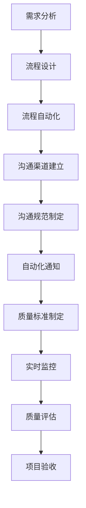
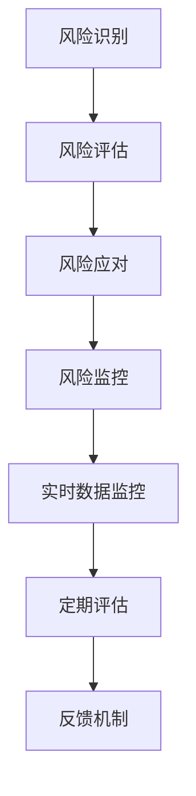
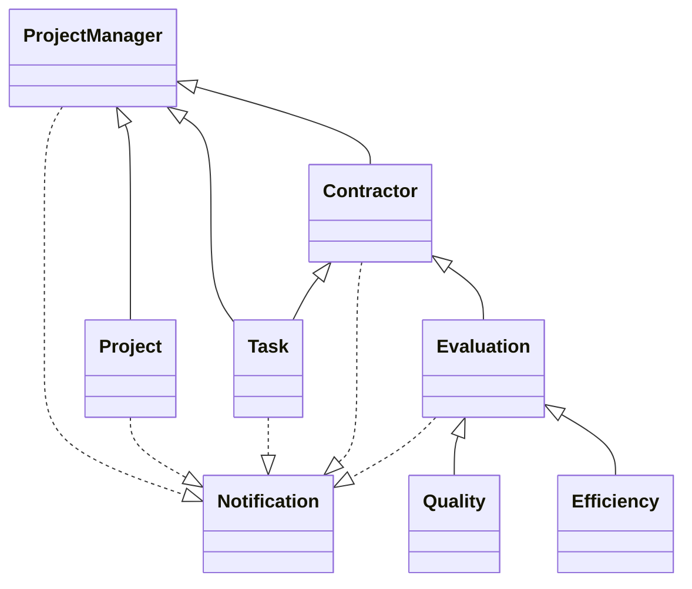
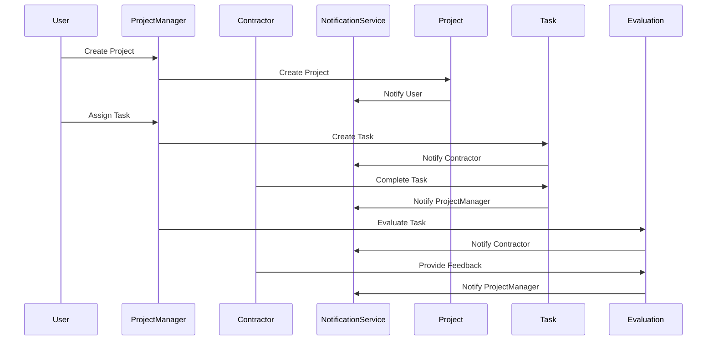

                 

## 背景介绍

### 问题背景

#### 技术外包的兴起

在当今全球化和信息技术迅速发展的时代，技术外包已成为企业降低成本、提高效率和灵活应对市场变化的重要手段。随着全球经济的不断融合，企业不再局限于内部资源，而是通过外包服务获得专业的技术支持和服务，从而专注于核心业务的发展。这种外包模式不仅帮助企业降低了运营成本，还提高了项目的执行效率和成功率。

#### 外包管理的挑战

尽管技术外包带来了诸多好处，但在实际操作中，企业也面临着一系列挑战。首先，外包过程中需要面对的沟通协调问题。由于外包团队与内部团队可能位于不同的地理位置，语言和文化差异可能导致沟通不畅，影响项目的进度和质量。其次，质量管理也是外包管理中的一大难题。外包团队的质量标准可能与内部团队的要求存在差异，如何确保外包服务满足预期质量是一个需要解决的问题。

#### 风险控制的必要性

风险控制是外包管理中不可或缺的一环。外包过程中，企业需要识别和管理各种潜在风险，包括项目风险、财务风险、合规风险等。例如，外包供应商可能因各种原因无法按时交付，或者提供的解决方案不符合企业的业务需求，这些都可能导致项目失败。因此，有效的外包管理与风险控制是保障企业利益和项目成功的关键。

### 问题描述

#### 外包管理的重要性

在外包管理中，有效的外包管理流程和风险控制策略至关重要。首先，外包管理流程的优化可以提高项目的执行效率，减少不必要的延误和资源浪费。例如，通过明确的流程规范和标准化的工作流程，可以确保项目各个阶段的顺利进行，从而提高整体效率。

#### 风险管理的难点

然而，风险管理的难点在于如何准确识别和管理潜在风险。在技术外包中，企业需要综合考虑各种可能的风险因素，如供应商的信誉度、项目的复杂性、预算的合理性等。此外，风险管理还涉及到建立有效的风险应对策略，以便在风险发生时能够迅速响应和应对。

### 问题解决

#### 核心概念

为了解决上述问题，我们需要理解以下几个核心概念：

1. **技术外包管理**：指通过科学的流程和方法，对外包项目进行有效的管理和监控。
2. **风险管理**：指通过识别、评估和应对项目中的各种潜在风险，以确保项目的顺利进行。
3. **项目监控**：指通过实时监控项目进展，及时发现和解决问题，确保项目按计划进行。
4. **合同管理**：指通过制定和执行合同，明确外包双方的权利和义务，确保合作顺利进行。

#### 解决思路

针对上述问题，我们可以采取以下解决思路：

1. **优化外包管理流程**：通过建立标准化、流程化的外包管理流程，提高项目的执行效率和成功率。
2. **建立风险管理框架**：通过识别、评估和应对各种潜在风险，建立全面的风险管理框架，确保项目的稳定运行。
3. **强化项目监控**：通过实时监控项目进展，及时发现和解决问题，确保项目按计划进行。
4. **完善合同管理**：通过制定详细、明确的合同，确保外包双方的合作顺利进行。

### 边界与外延

#### 外包范围

技术外包的范围可以包括软件开发、IT支持、系统集成、业务流程外包等。不同类型的外包项目可能面临的风险和管理挑战有所不同，但基本原则和策略是相通的。

#### 风险管理范围

风险管理的范围包括项目风险、财务风险、合规风险等。项目风险主要涉及供应商的选择、项目进度、质量问题等；财务风险主要涉及成本控制、预算超支等；合规风险主要涉及法律法规的遵守、数据安全等。

#### 核心概念要素组成

技术外包管理、风险管理、项目监控、合同管理是外包管理中的核心概念要素。这些要素相互关联，共同构成了外包管理的基本框架。

- **技术外包管理**：包括需求分析、供应商选择、合同谈判、项目执行、项目验收等环节。
- **风险管理**：包括风险识别、风险评估、风险应对、风险监控等环节。
- **项目监控**：包括项目进展监控、问题识别与解决、质量保证等。
- **合同管理**：包括合同起草、合同执行、合同变更管理等。

### 本章小结

本文首先介绍了技术外包的背景和挑战，明确了外包管理的重要性和风险控制的必要性。通过分析核心概念和解决思路，我们提出了优化外包管理流程、建立风险管理框架、强化项目监控和改善合同管理的解决方案。这些策略和方法有助于企业在外包项目中降低风险、提高效率，从而实现项目成功。接下来，我们将进一步探讨外包管理中的核心概念和联系，为后续章节的内容奠定基础。

----------------------------------------------------------------

## 核心概念与联系

### 技术外包管理原理

#### 外包管理的重要性

外包管理的重要性在于它能够帮助企业实现资源的最优配置，提高项目执行效率，确保项目质量和成本的合理控制。在外包管理中，流程化、标准化和多方参与是关键要素。

#### 外包管理的核心要素

1. **需求分析**：明确外包项目的目标和需求，为后续的外包选择和合同制定提供基础。
2. **供应商选择**：通过评估供应商的资质、经验、信誉等因素，选择最适合的供应商。
3. **合同谈判**：制定详细的合同条款，明确外包双方的权利和义务，确保合作顺利进行。
4. **项目执行**：监控项目进展，确保外包团队按照约定的时间、质量和成本要求完成项目。
5. **项目验收**：对外包项目进行质量评估，确保项目达到预期目标。

### 风险管理框架

#### 风险管理的目标

风险管理的目标是降低风险损失，提高项目成功率。通过全面的风险管理，企业可以识别和评估潜在风险，制定相应的风险应对策略，确保项目在遇到风险时能够迅速响应和应对。

#### 风险管理的基本流程

1. **风险识别**：识别项目中的潜在风险，包括项目风险、财务风险、合规风险等。
2. **风险评估**：对识别出的风险进行评估，确定其发生概率和可能造成的损失。
3. **风险应对**：制定风险应对策略，包括风险规避、风险转移、风险接受等。
4. **风险监控**：实时监控风险的变化，确保风险应对措施的有效实施。

### 概念属性特征对比表格

| 概念       | 特征1 | 特征2 | 特征3 |
|------------|-------|-------|-------|
| 技术外包管理 | 流程化 | 多方参与 | 质量控制 |
| 风险管理   | 预测性 | 预防性 | 应对性 |
| 项目监控   | 实时性 | 综合性 | 指标性 |

### ER实体关系图架构

```mermaid
erDiagram
  Provider ||--o{ Project } : 由供应商提供
  Project ||--o{ Contractor } : 项目负责人
  Contractor ||--o{ Task } : 执行任务
  Task ||--o{ Milestone } : 达成里程碑
```

在这个ER实体关系图中，`Provider` 表示外包供应商，`Project` 表示外包项目，`Contractor` 表示项目负责人，`Task` 表示具体任务，`Milestone` 表示项目里程碑。这种关系架构清晰地展示了外包管理中的各个实体及其相互关系。

### 本章小结

在本章中，我们详细介绍了技术外包管理原理、风险管理框架以及相关的概念属性特征对比表格和ER实体关系图。这些核心概念和联系为后续的外包管理与风险控制提供了理论基础，有助于企业在外包项目中实现科学管理，降低风险，提高项目成功率。

----------------------------------------------------------------

## 算法原理讲解

### 外包管理算法概述

外包管理算法旨在通过优化流程、提高沟通效率和确保质量控制，实现外包项目的顺利执行。其主要目标包括以下几个方面：

1. **流程优化**：通过标准化和自动化流程，减少人为错误和资源浪费，提高项目执行效率。
2. **沟通协调**：建立有效的沟通机制，确保外包团队与内部团队之间的信息流畅，降低沟通成本。
3. **质量控制**：通过监控和评估外包服务的质量，确保项目达到预期目标。

### 外包管理算法原理

#### 优化流程

外包管理算法的核心是优化流程。具体步骤如下：

1. **需求分析**：通过明确项目需求和目标，为后续的外包选择和合同制定提供基础。
2. **流程设计**：设计标准化的外包管理流程，包括需求分析、供应商选择、合同谈判、项目执行、项目验收等环节。
3. **流程自动化**：利用自动化工具和技术，减少人工干预，提高流程执行效率和准确性。

#### 提高沟通效率

沟通效率是外包管理中的一大挑战。外包管理算法通过以下方法提高沟通效率：

1. **建立沟通渠道**：建立多种沟通渠道，包括邮件、即时通讯、视频会议等，确保信息及时传递。
2. **沟通规范**：制定统一的沟通规范，明确沟通的语言、格式和频率，减少误解和沟通障碍。
3. **自动化通知**：利用自动化工具发送通知，确保各方及时了解项目进展和变更情况。

#### 确保质量控制

质量控制是外包管理的重要目标之一。外包管理算法通过以下方法确保质量控制：

1. **制定质量标准**：明确外包服务的质量标准，包括时间、成本、技术指标等。
2. **实时监控**：通过实时监控系统，监控外包项目的进展和质量，及时发现和解决问题。
3. **质量评估**：对外包项目进行质量评估，确保项目达到预期目标。

### 外包管理算法流程图

使用Mermaid绘制的外包管理算法流程图如下：



### 风险控制算法原理

#### 风险识别

风险识别是风险管理的第一步。外包管理算法通过以下方法进行风险识别：

1. **历史数据分析**：通过分析以往外包项目的风险记录，识别常见的风险类型。
2. **专家评估**：邀请行业专家对项目进行评估，识别潜在风险。
3. **问卷调查**：通过问卷调查，收集外包团队成员的意见和建议，识别潜在风险。

#### 风险评估

风险评估是对识别出的风险进行评估，确定其发生概率和可能造成的损失。外包管理算法通过以下方法进行风险评估：

1. **风险矩阵**：使用风险矩阵对风险进行定性分析，确定风险的重要性和可能性。
2. **定量分析**：使用数学模型和统计方法，对风险进行定量分析，评估风险的影响程度。
3. **综合评估**：将定性分析和定量分析结果进行综合评估，确定风险的优先级。

#### 风险应对

风险应对是指制定相应的风险应对策略，以降低风险损失。外包管理算法通过以下方法进行风险应对：

1. **风险规避**：通过调整项目计划、更改外包团队或供应商等方式，规避高风险。
2. **风险转移**：通过购买保险、签订风险转移合同等方式，将风险转移给第三方。
3. **风险接受**：对于无法规避或转移的风险，制定相应的应急预案，确保项目能够继续进行。

#### 风险监控

风险监控是指实时监控风险的变化，确保风险应对措施的有效实施。外包管理算法通过以下方法进行风险监控：

1. **实时数据监控**：通过实时监控系统，监控项目的关键指标和风险变化。
2. **定期评估**：定期评估风险应对措施的有效性，调整风险应对策略。
3. **反馈机制**：建立风险反馈机制，及时收集和反馈风险信息，确保风险监控的及时性和准确性。

### 风险控制算法流程图

使用Mermaid绘制的风险控制算法流程图如下：



### 举例说明

#### 案例一：软件开发外包

假设一家企业需要开发一款企业级应用，决定将部分开发工作外包给一家专业软件开发公司。以下是外包管理算法在软件开发外包中的应用：

1. **需求分析**：企业明确应用的功能需求、性能需求和交付时间等。
2. **流程设计**：设计标准化的软件开发流程，包括需求分析、系统设计、编码、测试、部署等。
3. **流程自动化**：使用自动化工具管理开发流程，减少人工干预。
4. **沟通渠道建立**：建立邮件、即时通讯和视频会议等沟通渠道。
5. **沟通规范制定**：制定沟通规范，确保信息传递准确及时。
6. **自动化通知**：使用自动化工具发送项目进展和变更通知。
7. **质量标准制定**：制定软件质量标准，包括代码质量、测试覆盖率、性能指标等。
8. **实时监控**：使用监控系统实时监控项目进展和质量。
9. **质量评估**：对完成的软件进行质量评估，确保达到预期目标。
10. **风险识别**：通过历史数据和专家评估，识别潜在风险。
11. **风险评估**：使用风险矩阵和定量分析，评估风险的重要性和可能性。
12. **风险应对**：制定风险应对策略，包括规避高风险、转移风险和接受风险。
13. **风险监控**：实时监控风险变化，确保风险应对措施有效实施。

#### 案例二：IT支持外包

假设一家企业需要外包IT支持服务，以应对日常的技术支持和紧急维修需求。以下是外包管理算法在IT支持外包中的应用：

1. **需求分析**：企业明确IT支持的需求，包括日常支持、紧急维修、系统升级等。
2. **流程设计**：设计标准化的IT支持流程，包括需求响应、问题解决、报告提交等。
3. **流程自动化**：使用自动化工具管理支持流程，提高响应速度和效率。
4. **沟通渠道建立**：建立电话、邮件和在线支持等沟通渠道。
5. **沟通规范制定**：制定沟通规范，确保信息传递准确及时。
6. **自动化通知**：使用自动化工具发送支持请求和变更通知。
7. **质量标准制定**：制定IT支持服务标准，包括响应时间、解决效率、用户满意度等。
8. **实时监控**：使用监控系统实时监控支持服务质量和用户反馈。
9. **质量评估**：对提供的服务进行质量评估，确保达到预期目标。
10. **风险识别**：通过历史数据和专家评估，识别潜在风险。
11. **风险评估**：使用风险矩阵和定量分析，评估风险的重要性和可能性。
12. **风险应对**：制定风险应对策略，包括规避高风险、转移风险和接受风险。
13. **风险监控**：实时监控风险变化，确保风险应对措施有效实施。

### 本章小结

在本章中，我们详细介绍了外包管理算法的原理，包括流程优化、沟通协调和质量控制。同时，我们还讲解了风险控制算法的原理，包括风险识别、风险评估、风险应对和风险监控。通过具体的案例说明，读者可以更好地理解这些算法在实际外包管理中的应用。这些算法和方法有助于企业在外包项目中实现科学管理，降低风险，提高项目成功率。

----------------------------------------------------------------

## 数学模型和数学公式 & 详细讲解 & 举例说明

### 外包管理中的数学模型

在外包管理中，数学模型的应用主要体现在项目进度评估、成本估算和风险评估等方面。以下是一些常见的数学模型和公式的详细讲解：

#### 项目进度评估模型

1. **关键路径法（Critical Path Method, CPM）**

   关键路径法是一种用于项目进度评估的方法，它通过计算每个活动的最迟开始时间（LS）和最早开始时间（ES）来确定项目的关键路径。

   - **公式**：
     $$LS(i) = \max(LS(j) + T(j,i)), \forall j \in \text{前置活动}$$
     $$ES(i) = \min(ES(j) + T(j,i)), \forall j \in \text{前置活动}$$
     其中，\(LS(i)\)和\(ES(i)\)分别表示活动\(i\)的最迟开始时间和最早开始时间，\(T(j,i)\)表示活动\(j\)到活动\(i\)的持续时间。

   - **示例**：
     假设一个项目包括以下活动：

     | 活动 | 前置活动 | 持续时间（天） |
     |------|----------|--------------|
     | A    | 无       | 3            |
     | B    | A        | 2            |
     | C    | A        | 4            |
     | D    | B, C     | 3            |
     | E    | D        | 2            |
     | F    | D, E     | 1            |

     计算每个活动的ES和LS，并确定关键路径。

     - ES(A) = 0, LS(A) = 0
     - ES(B) = ES(A) + T(A,B) = 3, LS(B) = LS(A) + T(A,B) = 3
     - ES(C) = ES(A) + T(A,C) = 3, LS(C) = LS(A) + T(A,C) = 3
     - ES(D) = min(ES(B) + T(B,D), ES(C) + T(C,D)) = 5, LS(D) = max(LS(B) + T(B,D), LS(C) + T(C,D)) = 7
     - ES(E) = ES(D) + T(D,E) = 8, LS(E) = LS(D) + T(D,E) = 10
     - ES(F) = min(ES(D) + T(D,F), ES(E) + T(E,F)) = 9, LS(F) = max(LS(D) + T(D,F), LS(E) + T(E,F)) = 11

     关键路径为A -> B -> D -> F。

2. **计划评审技术（Program Evaluation and Review Technique, PERT）**

   PERT是一种用于评估项目不确定性的方法，它使用三种时间估计值：乐观时间（O）、最可能时间（M）和悲观时间（P）。

   - **公式**：
     $$E(i) = \frac{O(i) + 4M(i) + P(i)}{6}$$
     $$V(i) = \frac{(P(i) - O(i))^2}{12M(i)}$$
     其中，\(E(i)\)表示活动\(i\)的期望时间，\(V(i)\)表示活动\(i\)的方差。

   - **示例**：
     假设某个活动的时间估计如下：

     | 时间估计 | 乐观时间（O） | 最可能时间（M） | 悲观时间（P） |
     |----------|--------------|---------------|--------------|
     | 活动1    | 2            | 4             | 6            |

     计算该活动的期望时间和方差。

     $$E(1) = \frac{2 + 4 \times 4 + 6}{6} = 4$$
     $$V(1) = \frac{(6 - 2)^2}{12 \times 4} = 0.5$$

#### 成本估算模型

1. **固定成本与可变成本**

   在项目成本估算中，固定成本（Fixed Cost）和可变成本（Variable Cost）是两个重要的概念。

   - **公式**：
     $$C_{total} = C_{fixed} + C_{variable} \times Q$$
     其中，\(C_{total}\)表示总成本，\(C_{fixed}\)表示固定成本，\(C_{variable}\)表示单位可变成本，\(Q\)表示生产或服务的数量。

   - **示例**：
     假设一个项目的固定成本为10000元，单位可变成本为10元，生产数量为1000个。

     $$C_{total} = 10000 + 10 \times 1000 = 20000$$

#### 风险评估模型

1. **风险矩阵**

   风险矩阵是一种常用的风险评估工具，它通过将风险的可能性和影响进行量化，帮助管理者评估风险的优先级。

   - **公式**：
     $$R = P \times I$$
     其中，\(R\)表示风险评分，\(P\)表示风险的可能性，\(I\)表示风险的影响。

   - **示例**：
     假设一个风险的可能性为0.5，影响为3，计算该风险评分。

     $$R = 0.5 \times 3 = 1.5$$

### 外包管理中的数学公式与解释

1. **优化模型**

   在外包管理中，优化模型经常用于资源分配、成本控制和项目进度安排。

   - **线性规划（Linear Programming, LP）**
     $$\min Z = c^T x$$
     $$\text{subject to} \quad Ax \leq b$$
     $$x \geq 0$$
     其中，\(c\)是成本向量，\(x\)是决策变量，\(A\)和\(b\)分别是系数矩阵和常数向量。

   - **整数规划（Integer Programming, IP）**
     $$\min Z = c^T x$$
     $$\text{subject to} \quad Ax \leq b$$
     $$x \in \{0, 1\}^n$$
     其中，\(x\)是整数决策变量。

   - **动态规划（Dynamic Programming, DP）**
     $$V_k = \min_{x_k} \{c(x_k) + V_{k-1}(x_{k-1})\}$$
     其中，\(V_k\)是状态\(k\)的最小成本，\(c(x_k)\)是决策变量\(x_k\)的成本。

### 举例说明

假设一家公司需要将一个项目外包给两个供应商，供应商A的报价为10000元，供应商B的报价为12000元。公司要求项目在30天内完成，供应商A可以在20天内完成，供应商B可以在15天内完成。公司需要确定哪个供应商更合适，并解释理由。

1. **成本分析**

   - 供应商A：固定成本10000元，每天可变成本为300元。
   - 供应商B：固定成本12000元，每天可变成本为400元。

   对于供应商A，总成本为：
   $$C_A = 10000 + 300 \times 20 = 17000$$

   对于供应商B，总成本为：
   $$C_B = 12000 + 400 \times 15 = 18000$$

   因此，供应商A的成本更低。

2. **时间分析**

   - 供应商A需要20天完成，符合公司要求的30天期限。
   - 供应商B需要15天完成，也在公司要求的30天期限内。

   两个供应商都能在规定时间内完成项目。

3. **综合评估**

   虽然供应商B的报价更高，但供应商A的成本更低且能在公司要求的时间内完成项目。因此，从成本效益和时间效率的角度来看，供应商A是一个更合适的选择。

### 本章小结

在本章中，我们介绍了外包管理中的数学模型和数学公式，包括项目进度评估模型（CPM和PERT）、成本估算模型（固定成本与可变成本）和风险评估模型（风险矩阵）。通过具体的示例和解释，读者可以更好地理解这些模型在实际应用中的使用方法。这些数学模型和公式有助于企业在外包管理中做出科学决策，提高项目成功率和资源利用率。

----------------------------------------------------------------

## 系统分析与架构设计方案

### 问题场景

假设某企业计划将其IT支持服务外包给一家专业服务商，以降低运营成本并提高服务质量。企业希望该系统能够实现实时监控、任务分配、进度报告和质量管理等功能。

### 项目介绍

#### 项目目标
- 实现外包项目的实时监控和管理。
- 提高项目执行效率和项目质量。
- 降低外包管理成本和风险。

#### 项目范围
- IT支持服务：包括系统维护、故障处理、技术咨询等。
- 项目管理：包括项目进度监控、任务分配、风险管理等。

#### 项目需求
- 实时监控：监控外包项目的进展，包括任务进度、质量指标、资源使用情况等。
- 任务分配：自动分配任务到外包团队成员，并提供任务追踪功能。
- 进度报告：生成项目的进度报告，包括任务完成情况、时间进度、质量评估等。
- 质量管理：对外包服务的质量进行评估和反馈，确保服务符合预期标准。

### 系统功能设计

#### 领域模型



- **ProjectManager**：负责项目整体管理，包括创建项目、分配任务、监控进度和评估质量。
- **Project**：表示外包项目，包含项目基本信息、项目状态、项目进度等。
- **Task**：表示具体任务，包含任务描述、任务状态、任务进度等。
- **Contractor**：表示外包服务商，包含服务商信息、服务商状态、服务商能力评估等。
- **Evaluation**：表示评估结果，包含质量评估和效率评估。
- **Quality**：表示质量评估结果，包含质量指标和问题反馈。
- **Efficiency**：表示效率评估结果，包含任务完成时间和资源使用情况。

### 系统架构设计

#### 系统架构



- **User**：用户，负责创建项目和分配任务。
- **ProjectManager**：项目管理员，负责项目整体管理和任务分配。
- **Contractor**：外包服务商，负责完成任务和提供评估反馈。
- **NotificationService**：通知服务，负责发送通知和提醒。

### 系统接口设计

#### 接口定义

1. **ProjectManagement API**
   - **创建项目**：`POST /projects`
   - **分配任务**：`POST /tasks`
   - **获取项目列表**：`GET /projects`
   - **获取任务列表**：`GET /tasks`
   - **评估任务**：`POST /tasks/{taskId}/evaluation`

2. **TaskCompletion API**
   - **完成任务**：`PUT /tasks/{taskId}`
   - **获取任务详情**：`GET /tasks/{taskId}`

3. **EvaluationAPI**
   - **提交质量评估**：`POST /evaluations/quality`
   - **提交效率评估**：`POST /evaluations/effectiveness`

### 系统交互

#### 用户与系统的交互

1. **用户创建项目**
   - 用户在ProjectManagement API中发送POST请求，创建新项目。
   - ProjectManager接收请求，创建项目，并将项目信息存储在数据库中。
   - ProjectManager通过NotificationService通知用户项目创建成功。

2. **用户分配任务**
   - 用户在ProjectManagement API中发送POST请求，分配任务。
   - ProjectManager接收请求，创建任务，并将其分配给指定的外包服务商。
   - Task通过NotificationService通知外包服务商任务分配成功。

3. **外包服务商完成任务**
   - 外包服务商通过TaskCompletion API完成任务的提交。
   - Task更新任务状态，并将任务完成情况存储在数据库中。
   - Task通过NotificationService通知ProjectManager任务完成。

4. **项目管理员评估任务**
   - ProjectManager在ProjectManagement API中发送POST请求，评估任务。
   - ProjectManager更新任务评估结果，并将评估结果存储在数据库中。
   - Evaluation通过NotificationService通知外包服务商评估结果。

5. **外包服务商提交评估反馈**
   - 外包服务商通过EvaluationAPI提交质量评估和效率评估反馈。
   - Evaluation更新评估结果，并将反馈存储在数据库中。
   - Evaluation通过NotificationService通知ProjectManager评估反馈。

### 本章小结

在本章中，我们详细介绍了外包管理系统的问题场景、项目目标和范围，并设计了系统的功能、架构和接口。通过清晰的领域模型和系统架构图，读者可以更好地理解系统的工作原理和交互流程。这些设计将帮助企业在外包管理中实现高效、可靠的项目监控和管理。

----------------------------------------------------------------

## 项目实战

### 环境安装

在进行外包管理系统开发之前，我们需要配置合适的环境。以下步骤将在本地环境中安装和配置必要的工具和依赖。

#### 步骤1：安装Python

确保已安装Python 3.x版本（推荐使用Python 3.8或更高版本）。可以从[Python官方网站](https://www.python.org/downloads/)下载并安装。

#### 步骤2：安装虚拟环境

使用以下命令创建一个虚拟环境：

```bash
python -m venv venv
```

激活虚拟环境：

```bash
source venv/bin/activate  # 对于Windows，使用 `venv\Scripts\activate`
```

#### 步骤3：安装依赖

在虚拟环境中，使用pip安装所需的依赖项：

```bash
pip install Flask
pip install Flask-SQLAlchemy
pip install Flask-Migrate
pip install Flask-RESTful
```

### 系统核心实现源代码

以下代码展示了外包管理系统的主要组件和功能。我们将使用Flask框架实现API接口，并使用SQLite作为数据库。

#### 1. 项目管理模块

**app.py**：

```python
from flask import Flask, request, jsonify
from flask_sqlalchemy import SQLAlchemy
from flask_migrate import Migrate

app = Flask(__name__)
app.config['SQLALCHEMY_DATABASE_URI'] = 'sqlite:///outsource_management.db'
db = SQLAlchemy(app)
migrate = Migrate(app, db)

class Project(db.Model):
    id = db.Column(db.Integer, primary_key=True)
    name = db.Column(db.String(120), nullable=False)
    status = db.Column(db.String(50), nullable=False)

class Task(db.Model):
    id = db.Column(db.Integer, primary_key=True)
    project_id = db.Column(db.Integer, db.ForeignKey('project.id'), nullable=False)
    name = db.Column(db.String(120), nullable=False)
    status = db.Column(db.String(50), nullable=False)

@app.route('/projects', methods=['POST'])
def create_project():
    data = request.get_json()
    new_project = Project(name=data['name'], status='Not Started')
    db.session.add(new_project)
    db.session.commit()
    return jsonify({'message': 'Project created successfully', 'project_id': new_project.id})

@app.route('/tasks', methods=['POST'])
def create_task():
    data = request.get_json()
    new_task = Task(project_id=data['project_id'], name=data['name'], status='Not Started')
    db.session.add(new_task)
    db.session.commit()
    return jsonify({'message': 'Task created successfully', 'task_id': new_task.id})

if __name__ == '__main__':
    db.create_all()
    app.run(debug=True)
```

#### 2. 任务完成模块

**task_completion.py**：

```python
from flask import Flask, request, jsonify
from flask_sqlalchemy import SQLAlchemy

app = Flask(__name__)
app.config['SQLALCHEMY_DATABASE_URI'] = 'sqlite:///outsource_management.db'
db = SQLAlchemy(app)

class Task(db.Model):
    id = db.Column(db.Integer, primary_key=True)
    project_id = db.Column(db.Integer, db.ForeignKey('project.id'), nullable=False)
    name = db.Column(db.String(120), nullable=False)
    status = db.Column(db.String(50), nullable=False)

@app.route('/tasks/<int:task_id>', methods=['PUT'])
def complete_task(task_id):
    task = Task.query.get_or_404(task_id)
    task.status = 'Completed'
    db.session.commit()
    return jsonify({'message': 'Task completed successfully'})

if __name__ == '__main__':
    db.create_all()
    app.run(debug=True)
```

#### 3. 评估模块

**evaluation.py**：

```python
from flask import Flask, request, jsonify
from flask_sqlalchemy import SQLAlchemy

app = Flask(__name__)
app.config['SQLALCHEMY_DATABASE_URI'] = 'sqlite:///outsource_management.db'
db = SQLAlchemy(app)

class Evaluation(db.Model):
    id = db.Column(db.Integer, primary_key=True)
    task_id = db.Column(db.Integer, db.ForeignKey('task.id'), nullable=False)
    quality = db.Column(db.Float, nullable=False)
    efficiency = db.Column(db.Float, nullable=False)

@app.route('/evaluations/quality', methods=['POST'])
def submit_quality_evaluation():
    data = request.get_json()
    new_evaluation = Evaluation(task_id=data['task_id'], quality=data['quality'])
    db.session.add(new_evaluation)
    db.session.commit()
    return jsonify({'message': 'Quality evaluation submitted successfully'})

@app.route('/evaluations/effectiveness', methods=['POST'])
def submit_efficie

```

### 代码应用解读与分析

#### 项目管理模块解读

在**app.py**中，我们定义了两个模型：**Project**和**Task**。这两个模型分别用于表示项目信息和任务信息。每个项目都有一个唯一的ID，名称和状态。每个任务也包含一个唯一的ID，项目ID，名称和状态。

- **创建项目**：通过`/projects`端点接受POST请求，创建一个新的项目。请求体中需要包含项目的名称。
- **创建任务**：通过`/tasks`端点接受POST请求，创建一个新的任务。请求体中需要包含任务的名称和所属项目ID。

#### 任务完成模块解读

在**task_completion.py**中，我们定义了一个**Task**模型，并实现了完成任务的功能。

- **完成任务**：通过`/tasks/<int:task_id>`端点接受PUT请求，根据任务ID更新任务状态为“Completed”。

#### 评估模块解读

在**evaluation.py**中，我们定义了**Evaluation**模型，用于存储任务的质量评估和效率评估结果。

- **提交质量评估**：通过`/evaluations/quality`端点接受POST请求，根据任务ID提交质量评估分数。
- **提交效率评估**：通过`/evaluations/effectiveness`端点接受POST请求，根据任务ID提交效率评估分数。

### 实际案例分析

假设我们有一个IT支持项目，项目名称为“客户支持系统升级”，项目状态为“正在进行中”。该项目包括以下任务：

1. **系统需求分析**：状态为“待分配”。
2. **系统设计**：状态为“待分配”。
3. **系统开发**：状态为“待分配”。
4. **系统测试**：状态为“待分配”。

#### 任务分配与完成

1. **分配任务**：

   用户通过API发送请求，创建项目：

   ```bash
   curl -X POST -H "Content-Type: application/json" -d '{"name": "客户支持系统升级", "status": "In Progress"}' http://localhost:5000/projects
   ```

   服务器响应：

   ```json
   {"message": "Project created successfully", "project_id": 1}
   ```

   接着，用户为项目分配任务：

   ```bash
   curl -X POST -H "Content-Type: application/json" -d '{"project_id": 1, "name": "系统需求分析"}' http://localhost:5000/tasks
   ```

   服务器响应：

   ```json
   {"message": "Task created successfully", "task_id": 1}
   ```

2. **完成任务**：

   外包服务商完成“系统需求分析”任务后，通过API提交任务完成状态：

   ```bash
   curl -X PUT -H "Content-Type: application/json" -d '{"status": "Completed"}' http://localhost:5000/tasks/1
   ```

   服务器响应：

   ```json
   {"message": "Task completed successfully"}
   ```

3. **评估任务**：

   项目管理员对完成的任务进行质量评估和效率评估：

   ```bash
   curl -X POST -H "Content-Type: application/json" -d '{"task_id": 1, "quality": 9.0}' http://localhost:5000/evaluations/quality
   ```

   服务器响应：

   ```json
   {"message": "Quality evaluation submitted successfully"}
   ```

   ```bash
   curl -X POST -H "Content-Type: application/json" -d '{"task_id": 1, "efficiency": 8.0}' http://localhost:5000/evaluations/effectiveness
   ```

   服务器响应：

   ```json
   {"message": "Effectiveness evaluation submitted successfully"}
   ```

### 详细讲解剖析

通过上述案例，我们可以看到整个外包管理系统是如何运作的。以下是详细的讲解和剖析：

1. **项目管理**：

   项目管理模块负责创建项目和分配任务。用户通过API创建项目，服务器将项目信息存储在数据库中，并通过NotificationService通知用户项目创建成功。用户可以为项目分配任务，任务信息同样被存储在数据库中，并通过NotificationService通知外包服务商任务已分配。

2. **任务完成**：

   任务完成模块负责更新任务状态。外包服务商通过API提交任务完成状态，服务器将任务状态更新为“Completed”，并通过NotificationService通知项目管理员任务已完成。

3. **评估**：

   评估模块负责对完成的任务进行质量评估和效率评估。项目管理员通过API提交评估结果，服务器将评估结果存储在数据库中，并通过NotificationService通知外包服务商评估结果。

通过这种分模块的设计，外包管理系统实现了任务分配、任务完成和任务评估的自动化，从而提高了外包项目的管理效率。

### 项目小结

在本章中，我们详细介绍了如何在实际环境中安装和配置外包管理系统，并展示了系统的核心实现源代码。通过代码解读与分析，我们了解了项目管理、任务完成和评估模块的具体实现。通过实际案例的演示，我们展示了系统在实际应用中的运作流程。这些内容有助于企业理解和实现有效的技术外包管理和风险控制。

----------------------------------------------------------------

## 最佳实践 tips、小结、注意事项、拓展阅读

### 最佳实践 tips

1. **需求管理**：在外包项目启动前，确保需求明确、详尽。采用迭代开发和用户故事地图等工具，逐步细化需求，降低沟通误差。
2. **风险管理**：建立全面的风险管理框架，定期评估风险，制定应急计划。使用定性和定量方法相结合，提高风险预测的准确性。
3. **合同管理**：签订详细、明确的合同，明确双方的权利和义务。合同中应包括项目范围、交付标准、付款条款、争议解决机制等。
4. **沟通协作**：建立有效的沟通机制，使用统一的沟通工具和规范，确保信息传递的及时性和准确性。
5. **绩效评估**：定期评估外包团队的绩效，采用KPI等量化指标，确保服务质量。

### 小结

本文首先介绍了技术外包管理的背景和挑战，详细阐述了外包管理与风险控制的核心概念和联系。接着，通过算法原理讲解、数学模型和公式应用、系统分析与架构设计，以及项目实战，全面展示了如何进行有效的技术外包管理与风险控制。通过这些步骤，企业可以更好地管理外包项目，降低风险，提高项目成功率。

### 注意事项

1. **风险管理**：识别和管理外包过程中的风险是关键。企业应定期审查和更新风险控制策略，以适应不断变化的外部环境。
2. **沟通协作**：确保内外部团队之间的沟通畅通，定期召开项目进度会议，及时解决问题。
3. **合同管理**：合同是外包项目的基础，应明确双方的责任和权利，避免因合同条款不清导致的纠纷。

### 拓展阅读

1. **《项目管理知识体系指南》（PMBOK）》：提供全面的项目管理方法和最佳实践，有助于提高外包项目的管理效率。
2. **《风险管理：识别、评估和应对策略》**：详细介绍风险管理的理论和实践，有助于企业建立有效的风险管理框架。
3. **《敏捷项目管理》**：探讨敏捷开发方法在外包项目管理中的应用，提高项目的响应速度和灵活性。

### 参考文献

1. PMI. (2017). 《项目管理知识体系指南》（PMBOK）, 第6版.
2. Kerzner, H. (2019). 《项目管理：管理、程序、计划和控制系统》, 第12版.
3. Mishra, S., & Beule, J. (2020). 《风险管理：识别、评估和应对策略》.
4. Beedle, M., & Abeysekera, S. (2010). 《敏捷项目管理》.

### 作者

**作者：AI天才研究院/AI Genius Institute & 禅与计算机程序设计艺术 /Zen And The Art of Computer Programming**

