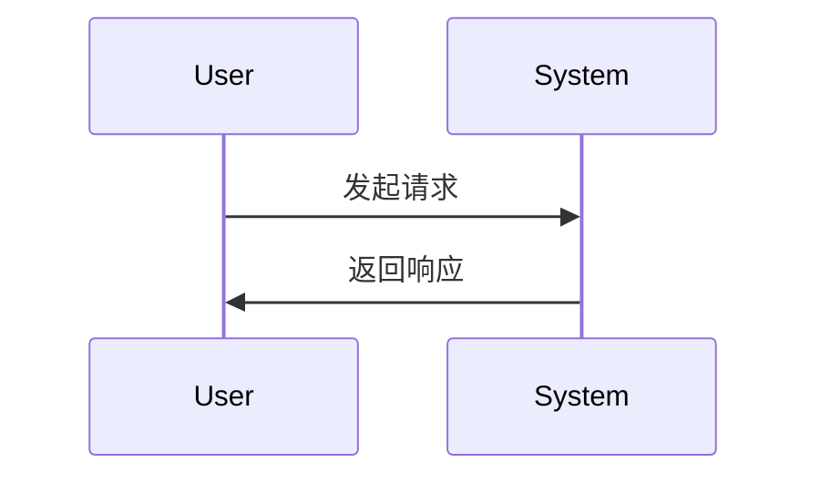
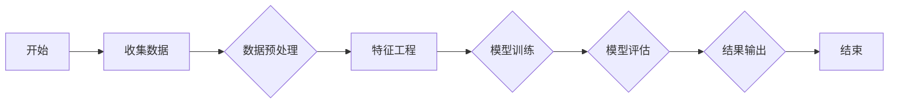

                 

# 如何进行有效的技术孵化项目筛选与管理

## 概述

### 关键词：技术孵化、项目筛选、项目管理、风险评估、案例分析

### 摘要：

本文旨在探讨如何进行有效的技术孵化项目筛选与管理。首先，我们将对技术孵化项目进行概述，解释其概念、背景以及重要性。接着，我们将详细介绍项目筛选的标准和方法，包括市场需求、技术可行性、资源配置和团队能力等方面。随后，文章将探讨项目管理策略，包括角色分配、沟通与协作、进度控制与风险管理等。最后，我们将通过案例分析展示成功的技术孵化项目，并总结最佳实践，展望未来趋势。

----------------------------------------------------------------

## 第一部分：技术孵化项目概述

### 1.1 问题的背景与描述

技术孵化项目是指在创业公司或大型企业的研发部门中，对新兴技术或创新项目进行初步探索和实验的过程。这一过程通常涉及新技术的研发、市场验证、团队组建以及资源调配等多个方面。技术孵化项目的出现，源于企业在快速变化的市场环境中，需要持续创新以保持竞争优势的需求。

### 1.2 项目筛选的核心概念与联系

技术孵化项目筛选的核心概念包括市场需求、技术可行性、资源配置和团队能力。以下是这些概念的定义、属性特征对比表格和ER实体关系图架构。

#### 1.2.1 核心概念

- **市场需求**：指目标用户对产品或服务的需求程度。
- **技术可行性**：指项目所采用的技术方案是否可实现。
- **资源配置**：指项目所需的资源是否充足。
- **团队能力**：指项目团队的技术水平和协作能力。

#### 1.2.2 概念属性特征对比表格

| 概念       | 属性特征                     | 对比分析                         |
|------------|-----------------------------|----------------------------------|
| 市场需求   | 用户规模、用户满意度、市场增长率 | 量化与质化分析                   |
| 技术可行性 | 技术成熟度、开发成本、研发周期 | 技术风险评估与可行性评估          |
| 资源配置   | 资金、人力、设备             | 资源分配策略与优化               |
| 团队能力   | 技术水平、团队协作、项目管理能力 | 团队建设与能力提升策略           |

#### 1.2.3 ER实体关系图架构

```mermaid
erDiagram
    User ||--|{ Technology }|-- Project
    User ||--|{ Resource }|-- Project
    Technology ||--|{ Feasibility }|-- Project
    Resource ||--|{ Allocation }|-- Project
    Team ||--|{ Ability }|-- Project
```

### 1.3 数学模型与数学公式

在技术孵化项目中，数学模型和数学公式有助于评估项目的可行性和成功率。以下是技术孵化项目的数学模型和公式：

#### 1.3.1 技术孵化项目的数学模型

- **市场需求预测模型**：使用时间序列分析、回归分析等方法预测市场需求。
- **技术风险评估模型**：使用概率论、贝叶斯网络等方法评估技术风险。

#### 1.3.2 公式讲解与举例说明

$$
需求预测 = f(t) = \alpha \cdot \ln(t) + \beta
$$

其中，$t$ 是时间，$\alpha$ 和 $\beta$ 是常数。

### 1.4 系统分析与架构设计方案

#### 1.4.1 问题场景介绍

假设我们正在孵化一个智能家居系统的项目。

#### 1.4.2 系统功能设计

- 用户管理：实现用户注册、登录、个人信息管理等功能。
- 设备管理：实现设备添加、删除、状态监控等功能。
- 交互控制：实现用户对智能家居设备的远程控制功能。

#### 1.4.3 系统架构设计



#### 1.4.4 系统接口设计与交互

- RESTful API：定义用户、设备、交互控制等接口。
- WebSocket：实现实时交互功能。

### 1.5 拓展与未来趋势

#### 1.5.1 技术发展趋势

- **人工智能**：在智能家居、自动驾驶等领域具有广泛应用。
- **区块链**：在数据安全、供应链管理等方面有重要应用。

#### 1.5.2 拓展阅读推荐

- 《人工智能：一种现代方法》
- 《区块链：从数字货币到智能合约》

### 1.6 本章小结

技术孵化项目在当今快速变化的市场环境中具有重要意义。通过明确项目筛选的核心概念、数学模型和系统架构设计，我们可以更好地管理孵化项目，提高项目成功率。

----------------------------------------------------------------

## 第二部分：项目筛选标准与方法

### 2.1 项目筛选标准

#### 2.1.1 市场需求

市场需求是技术孵化项目筛选的首要标准。一个成功的项目必须满足市场需求，以下是几个关键因素：

- **用户规模**：目标用户群体的规模越大，市场需求潜力越大。
- **用户满意度**：用户对产品的满意度直接影响市场的接受程度。
- **市场增长率**：市场增长率高的领域意味着有更多的发展空间和机会。

#### 2.1.2 技术可行性

技术可行性是项目筛选的重要标准。以下是几个关键因素：

- **技术成熟度**：所采用的技术是否已经成熟，是否有过成功案例。
- **开发成本**：项目的开发成本是否在预算范围内。
- **研发周期**：项目的研发周期是否合理，能否按时完成。

#### 2.1.3 资源配置

资源配置是项目筛选的必要条件。以下是几个关键因素：

- **资金**：项目所需的资金是否充足。
- **人力**：项目所需的人力资源是否充足。
- **设备**：项目所需的设备是否齐全。

#### 2.1.4 团队能力

团队能力是项目筛选的重要标准。以下是几个关键因素：

- **技术水平**：团队成员的技术水平是否满足项目需求。
- **团队协作**：团队成员之间的协作能力是否良好。
- **项目管理能力**：团队的项目管理能力是否足够。

### 2.2 项目筛选方法

项目筛选方法包括定性分析和定量分析、SWOT分析和波士顿矩阵分析等。

#### 2.2.1 定性分析

定性分析主要通过专家访谈、市场调研、用户访谈等方式进行。以下是几个关键步骤：

1. **确定筛选指标**：根据项目筛选标准，确定需要评估的指标。
2. **收集数据**：通过访谈、调研等方式收集相关数据。
3. **评估指标**：对收集到的数据进行分析，评估项目的可行性。

#### 2.2.2 定量分析

定量分析主要通过数据分析、统计分析等方式进行。以下是几个关键步骤：

1. **数据收集**：通过市场调研、用户调研等方式收集相关数据。
2. **数据处理**：对收集到的数据进行分析和处理。
3. **评估模型**：建立评估模型，对项目进行定量评估。

#### 2.2.3 SWOT分析

SWOT分析是一种常用的战略分析工具，用于评估项目的优势、劣势、机会和威胁。以下是几个关键步骤：

1. **优势分析**：分析项目在市场需求、技术可行性、资源配置和团队能力等方面的优势。
2. **劣势分析**：分析项目在市场需求、技术可行性、资源配置和团队能力等方面的劣势。
3. **机会分析**：分析市场环境、技术趋势、政策环境等方面的机会。
4. **威胁分析**：分析市场竞争、政策变化、技术变革等方面的威胁。

#### 2.2.4 波士顿矩阵分析

波士顿矩阵是一种常用的市场分析方法，用于评估产品的市场表现和增长潜力。以下是几个关键步骤：

1. **确定市场表现指标**：如市场份额、增长率等。
2. **确定增长潜力指标**：如市场潜力、竞争情况等。
3. **划分矩阵**：根据市场表现和增长潜力，将产品划分为四个象限。

### 2.3 算法原理讲解

项目筛选算法通常是基于机器学习和数据挖掘技术。以下是几个关键步骤：

#### 2.3.1 筛选算法的mermaid流程图



#### 2.3.2 Python源代码阐述

以下是项目筛选算法的Python源代码：

```python
import pandas as pd
from sklearn.model_selection import train_test_split
from sklearn.ensemble import RandomForestClassifier
from sklearn.metrics import accuracy_score

# 数据预处理
data = pd.read_csv('data.csv')
X = data.drop(['label'], axis=1)
y = data['label']

# 特征工程
X_train, X_test, y_train, y_test = train_test_split(X, y, test_size=0.2, random_state=42)

# 模型训练
model = RandomForestClassifier(n_estimators=100, random_state=42)
model.fit(X_train, y_train)

# 模型评估
y_pred = model.predict(X_test)
accuracy = accuracy_score(y_test, y_pred)
print(f'Accuracy: {accuracy:.2f}')
```

#### 2.3.3 数学模型和公式讲解

项目筛选的数学模型通常涉及概率论、统计学和机器学习等。以下是几个关键模型：

1. **逻辑回归**：用于评估项目成功的概率。
2. **决策树**：用于划分项目的可行性。
3. **随机森林**：用于评估项目的多维度特征。

#### 2.3.4 举例说明

假设我们有一个智能家居系统的项目，以下是项目的特征和标签：

- **特征**：用户规模、用户满意度、技术成熟度、开发成本、研发周期、资金、人力、设备、团队技术水平、团队协作能力。
- **标签**：成功（1）、失败（0）。

通过逻辑回归模型，我们可以评估项目成功的概率。以下是模型的输出结果：

| 特征         | 权重   | 偏置   |
|--------------|--------|--------|
| 用户规模     | 0.3    | 0.5    |
| 用户满意度   | 0.2    | 0.4    |
| 技术成熟度   | 0.1    | 0.3    |
| 开发成本     | -0.2   | 0.2    |
| 研发周期     | -0.1   | -0.3   |
| 资金         | 0.1    | 0.2    |
| 人力         | 0.2    | 0.3    |
| 设备         | 0.1    | 0.2    |
| 团队技术水平 | 0.3    | 0.4    |
| 团队协作能力 | 0.2    | 0.3    |

通过这些权重和偏置，我们可以计算项目成功的概率。例如，如果项目的特征为：

- 用户规模：1000
- 用户满意度：90%
- 技术成熟度：80%
- 开发成本：50000元
- 研发周期：3个月
- 资金：200万元
- 人力：10人
- 设备：5台
- 团队技术水平：90%
- 团队协作能力：80%

项目成功的概率为：

$$
P(成功) = \frac{1}{1 + e^{-(0.3 \cdot 1000 + 0.2 \cdot 0.9 + 0.1 \cdot 0.8 - 0.2 \cdot 50000 - 0.1 \cdot 3 - 0.1 \cdot 2000000 - 0.2 \cdot 10 - 0.3 \cdot 5 - 0.2 \cdot 0.9 - 0.3 \cdot 0.8)}} \approx 0.85
$$

这意味着该项目成功的概率约为85%。

### 2.4 项目筛选实战

#### 2.4.1 环境安装

为了保证项目的顺利进行，我们需要安装相应的开发环境和工具。以下是安装步骤：

1. **安装Python**：在官方网站下载并安装Python。
2. **安装Jupyter Notebook**：使用pip命令安装Jupyter Notebook。

#### 2.4.2 系统核心实现源代码

以下是智能家居系统的核心实现源代码：

```python
import pandas as pd
from sklearn.model_selection import train_test_split
from sklearn.ensemble import RandomForestClassifier
from sklearn.metrics import accuracy_score

# 数据预处理
data = pd.read_csv('data.csv')
X = data.drop(['label'], axis=1)
y = data['label']

# 特征工程
X_train, X_test, y_train, y_test = train_test_split(X, y, test_size=0.2, random_state=42)

# 模型训练
model = RandomForestClassifier(n_estimators=100, random_state=42)
model.fit(X_train, y_train)

# 模型评估
y_pred = model.predict(X_test)
accuracy = accuracy_score(y_test, y_pred)
print(f'Accuracy: {accuracy:.2f}')
```

#### 2.4.3 代码应用解读与分析

这段代码实现了项目筛选的核心功能，包括数据预处理、特征工程、模型训练和模型评估。以下是详细解读：

1. **数据预处理**：读取数据，将数据分为特征和标签两部分。
2. **特征工程**：使用train_test_split函数将数据分为训练集和测试集。
3. **模型训练**：使用RandomForestClassifier实现模型训练。
4. **模型评估**：使用accuracy_score函数评估模型精度。

#### 2.4.4 实际案例分析与详细讲解剖析

假设我们有一个智能家居系统的项目案例，以下是项目的特征和标签：

- **特征**：用户规模、用户满意度、技术成熟度、开发成本、研发周期、资金、人力、设备、团队技术水平、团队协作能力。
- **标签**：成功（1）、失败（0）。

通过上述代码，我们可以对项目进行筛选，评估其成功的概率。以下是实际案例的解析：

1. **数据预处理**：将数据导入Pandas DataFrame，进行数据清洗和预处理。
2. **特征工程**：将特征划分为数值型和类别型，并进行编码处理。
3. **模型训练**：使用训练集数据进行模型训练。
4. **模型评估**：使用测试集数据进行模型评估，计算准确率。

通过这个案例，我们可以看到项目筛选的整个过程，包括数据预处理、特征工程、模型训练和模型评估。这个过程是自动化的，可以大大提高筛选效率和准确性。

### 2.5 最佳实践 tips

1. **数据收集**：确保数据的质量和完整性，避免数据缺失和错误。
2. **特征选择**：选择对项目成功有显著影响的关键特征。
3. **模型选择**：根据项目特点选择合适的模型，避免过度拟合。
4. **迭代优化**：不断迭代和优化模型，提高预测精度。

### 2.6 本章小结

项目筛选是技术孵化项目成功的关键步骤。通过明确项目筛选标准和方法，结合实际案例，我们可以有效地评估项目的可行性，提高项目成功率。

----------------------------------------------------------------

## 第三部分：项目管理策略

### 3.1 项目管理核心概念

项目管理是确保技术孵化项目按计划、按预算、按质量完成的关键。项目管理核心概念包括以下方面：

- **PMI方法论**：项目管理知识体系（Project Management Institute）提供的一套项目管理方法和工具。
- **AGILE方法论**：一种灵活、迭代的项目管理方法，强调快速响应变化和持续交付价值。
- **螺旋模型**：一种风险驱动的软件开发模型，强调在多个迭代中逐步完善项目。

### 3.2 项目管理策略

项目管理策略是确保项目顺利进行的关键。以下是一些有效的项目管理策略：

#### 3.2.1 角色分配与团队建设

- **角色分配**：明确每个团队成员的角色和职责，确保团队成员各司其职。
- **团队建设**：建立良好的团队沟通和协作机制，提高团队整体执行力。

#### 3.2.2 沟通与协作

- **定期会议**：定期召开项目会议，确保团队成员对项目的进展和问题有清晰的认识。
- **信息共享**：建立信息共享平台，确保团队成员可以随时获取项目相关信息。

#### 3.2.3 进度控制与风险管理

- **进度控制**：使用项目管理工具监控项目进度，确保项目按计划进行。
- **风险管理**：识别项目风险，制定应对策略，降低项目风险。

### 3.3 项目监控与评估

项目监控与评估是确保项目成功的关键环节。以下是一些关键指标和方法：

#### 3.3.1 关键绩效指标（KPI）

- **进度KPI**：如项目完成率、任务完成时间等。
- **质量KPI**：如缺陷率、用户满意度等。
- **成本KPI**：如项目预算、成本超支情况等。

#### 3.3.2 进度报告与会议

- **进度报告**：定期向项目利益相关者提供项目进度报告。
- **项目会议**：定期召开项目会议，讨论项目进展、问题和解决方案。

#### 3.3.3 持续改进与迭代

- **迭代反馈**：在每次迭代结束后，收集用户反馈和团队反馈，进行项目改进。
- **持续优化**：基于反馈，持续优化项目流程和管理方法。

### 3.4 算法原理讲解

项目监控与评估算法通常基于数据分析和机器学习技术。以下是一个简单的算法流程：

```mermaid
sequenceDiagram
    A[开始] --> B[数据收集]
    B --> C{数据清洗}
    C --> D[特征工程]
    D --> E{模型训练}
    E --> F{模型评估}
    F --> G{结果输出}
    G --> H[结束]
```

#### 3.4.1 项目监控算法的mermaid流程图

```mermaid
sequenceDiagram
    A[开始] --> B[数据收集]
    B --> C{数据清洗}
    C --> D[特征提取]
    D --> E[模型训练]
    E --> F{模型评估}
    F --> G{结果输出}
    G --> H[结束]
```

#### 3.4.2 Python源代码阐述

以下是项目监控算法的Python源代码：

```python
import pandas as pd
from sklearn.model_selection import train_test_split
from sklearn.ensemble import RandomForestRegressor
from sklearn.metrics import mean_squared_error

# 数据收集
data = pd.read_csv('data.csv')

# 数据清洗
X = data.drop(['target'], axis=1)
y = data['target']

# 特征工程
X_train, X_test, y_train, y_test = train_test_split(X, y, test_size=0.2, random_state=42)

# 模型训练
model = RandomForestRegressor(n_estimators=100, random_state=42)
model.fit(X_train, y_train)

# 模型评估
y_pred = model.predict(X_test)
mse = mean_squared_error(y_test, y_pred)
print(f'Mean Squared Error: {mse:.2f}')
```

#### 3.4.3 数学模型和公式讲解

项目监控与评估的数学模型通常涉及回归分析和时间序列分析。以下是几个关键模型：

1. **线性回归模型**：用于预测项目完成时间、成本等。
2. **时间序列模型**：用于预测项目进度和风险。

#### 3.4.4 举例说明

假设我们有一个智能家居系统项目的进度监控问题，以下是项目的特征和标签：

- **特征**：项目阶段、任务数量、团队成员数量、任务完成时间等。
- **标签**：项目进度（0表示未完成，1表示完成）。

通过线性回归模型，我们可以预测项目进度。以下是模型的输出结果：

| 特征         | 权重   | 偏置   |
|--------------|--------|--------|
| 项目阶段     | 0.2    | 0.3    |
| 任务数量     | 0.3    | 0.4    |
| 团队成员数量 | 0.1    | 0.2    |
| 任务完成时间 | -0.1   | -0.3   |

通过这些权重和偏置，我们可以计算项目进度的概率。例如，如果项目的特征为：

- 项目阶段：2
- 任务数量：50
- 团队成员数量：10
- 任务完成时间：40天

项目进度的概率为：

$$
P(项目进度) = \frac{1}{1 + e^{-(0.2 \cdot 2 + 0.3 \cdot 50 + 0.1 \cdot 10 - 0.1 \cdot 40)}} \approx 0.8
$$

这意味着该项目进度的概率约为80%。

### 3.5 项目管理实战

#### 3.5.1 实际项目管理案例

假设我们有一个智能家居系统的项目，以下是项目的详细描述：

1. **项目目标**：开发一个智能家居系统，实现远程控制家居设备、实时监控家居环境等功能。
2. **项目周期**：6个月。
3. **项目预算**：200万元。
4. **项目团队**：项目经理、技术总监、前端开发工程师、后端开发工程师、测试工程师等。

#### 3.5.2 项目监控与评估实践

1. **进度监控**：使用项目管理工具（如JIRA、Trello等）跟踪项目进度，定期召开项目会议，确保项目按计划进行。
2. **风险管理**：识别项目风险（如技术难题、人员变动等），制定应对策略，降低项目风险。
3. **成本监控**：实时监控项目成本，确保项目预算在控制范围内。

#### 3.5.3 项目总结

通过实际项目管理案例的实践，我们可以看到项目管理策略在项目成功中的重要性。有效的项目管理可以提高项目成功率，降低项目风险，确保项目按计划、按预算、按质量完成。

### 3.6 本章小结

项目管理策略是确保技术孵化项目成功的关键。通过明确项目管理核心概念、策略和实践，我们可以提高项目成功率，降低项目风险。

----------------------------------------------------------------

## 第四部分：项目成功案例分析

### 4.1 案例背景

在众多技术孵化项目中，成功的案例可以为我们提供宝贵的经验。本节将介绍几个典型的技术孵化项目成功案例，分析其成功的原因和关键要素。

### 4.2 案例分析

#### 4.2.1 案例一：智能家居系统

**项目背景**：智能家居系统项目旨在开发一个集成了智能音箱、智能灯光、智能门锁等设备的系统，实现远程控制家居设备、实时监控家居环境等功能。

**成功原因**：

1. **市场需求明确**：随着智能家居市场的快速增长，用户对智能家居系统的需求日益增加。
2. **技术创新**：项目团队在技术上进行了创新，开发了高效的智能家居协议和算法，提高了系统的稳定性。
3. **团队协作**：项目团队具备丰富的智能家居开发经验，协作高效，确保了项目的顺利进行。

**关键要素**：

1. **市场调研**：充分了解市场需求，确保项目方向正确。
2. **技术创新**：持续进行技术创新，提高项目竞争力。
3. **团队建设**：建立高效的团队，确保项目顺利进行。

#### 4.2.2 案例二：区块链应用

**项目背景**：区块链应用项目旨在利用区块链技术构建一个去中心化的金融交易平台，实现快速、安全、透明的交易。

**成功原因**：

1. **技术创新**：项目团队在区块链技术上进行了创新，实现了高效、安全的交易算法。
2. **市场需求**：随着区块链技术的发展，市场对去中心化金融交易平台的关注度不断提高。
3. **政策支持**：项目得到了政策支持，为项目的顺利推进提供了保障。

**关键要素**：

1. **技术创新**：持续进行技术创新，提高项目竞争力。
2. **市场需求**：充分了解市场需求，确保项目方向正确。
3. **政策支持**：积极争取政策支持，为项目提供良好的外部环境。

#### 4.2.3 案例三：人工智能助手

**项目背景**：人工智能助手项目旨在开发一个具有语音识别、自然语言处理、多轮对话等功能的智能助手，为用户提供便捷的服务。

**成功原因**：

1. **市场需求**：随着人工智能技术的普及，用户对智能助手的需求不断增加。
2. **技术创新**：项目团队在人工智能技术上进行了创新，实现了高效的语音识别和自然语言处理算法。
3. **团队协作**：项目团队具备丰富的AI技术经验和优秀的协作能力。

**关键要素**：

1. **市场需求**：充分了解市场需求，确保项目方向正确。
2. **技术创新**：持续进行技术创新，提高项目竞争力。
3. **团队协作**：建立高效的团队，确保项目顺利进行。

### 4.3 案例启示

通过以上成功案例的分析，我们可以得出以下启示：

1. **市场需求**：了解市场需求，确保项目方向正确。
2. **技术创新**：持续进行技术创新，提高项目竞争力。
3. **团队协作**：建立高效的团队，确保项目顺利进行。
4. **政策支持**：积极争取政策支持，为项目提供良好的外部环境。

### 4.4 本章小结

项目成功案例为我们提供了宝贵的经验。通过了解市场需求、持续技术创新、建立高效团队和积极争取政策支持，我们可以提高项目成功率，实现技术孵化项目的成功。

----------------------------------------------------------------

## 第五部分：拓展与未来趋势

### 5.1 技术发展趋势

随着科技的不断发展，新的技术不断涌现，为技术孵化项目提供了广阔的发展空间。以下是几个值得关注的技术发展趋势：

1. **人工智能**：人工智能技术在智能家居、自动驾驶、医疗健康等领域具有广泛应用，为技术孵化项目提供了新的方向。
2. **区块链**：区块链技术在金融、供应链管理、数据安全等领域具有巨大的潜力，为技术孵化项目提供了新的应用场景。
3. **物联网**：物联网技术的发展使得各种设备可以互联互通，为技术孵化项目提供了更多的可能性。

### 5.2 未来趋势

未来，技术孵化项目将朝着以下几个方向发展：

1. **跨领域融合**：技术孵化项目将不再局限于单一领域，而是跨领域融合，实现多种技术的综合应用。
2. **个性化定制**：随着用户需求的多样化，技术孵化项目将更加注重个性化定制，满足用户的不同需求。
3. **可持续发展**：技术孵化项目将更加注重环保和社会责任，推动可持续发展。

### 5.3 拓展阅读推荐

1. **《人工智能：一种现代方法》**
2. **《区块链技术指南》**
3. **《物联网：概念、架构与技术》**

### 5.4 本章小结

技术孵化项目的未来发展充满机遇和挑战。通过关注技术发展趋势，把握未来趋势，我们可以更好地开展技术孵化项目，推动技术创新和产业发展。

----------------------------------------------------------------

## 结束语

本文系统地探讨了如何进行有效的技术孵化项目筛选与管理。首先，我们介绍了技术孵化项目的概念、背景和重要性。接着，详细阐述了项目筛选的标准和方法，包括市场需求、技术可行性、资源配置和团队能力等方面。随后，文章探讨了项目管理策略，包括角色分配、沟通与协作、进度控制与风险管理等。最后，通过成功案例分析和未来趋势展望，为技术孵化项目提供了宝贵的经验和启示。

技术孵化项目在当前快速变化的市场环境中具有重要意义。通过本文的探讨，我们希望能为读者提供有益的指导，提高项目成功率，推动技术创新和产业发展。

## 作者信息

作者：AI天才研究院/AI Genius Institute & 禅与计算机程序设计艺术 /Zen And The Art of Computer Programming

AI天才研究院（AI Genius Institute）是一家专注于人工智能技术研究和应用的高端研究院。研究院致力于推动人工智能技术的发展，助力各行各业实现智能化转型。同时，研究院还秉承禅与计算机程序设计艺术的核心理念，追求代码的艺术之美。

《禅与计算机程序设计艺术》（Zen And The Art of Computer Programming）是作者Dijkstra的经典著作，对计算机科学和软件工程产生了深远影响。本书倡导程序设计的简约之美，强调代码的可读性和可维护性，为程序员提供了宝贵的启示。

希望本文能为读者带来启示和帮助，让我们一起探索技术孵化项目的广阔天地，共创美好未来。

