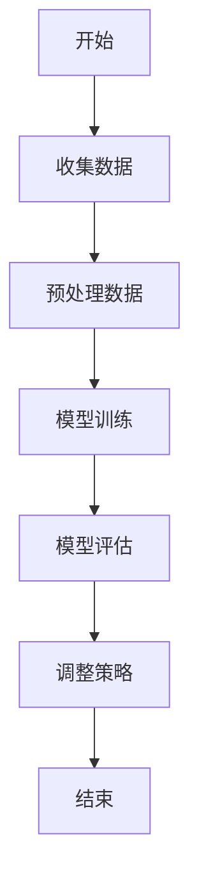
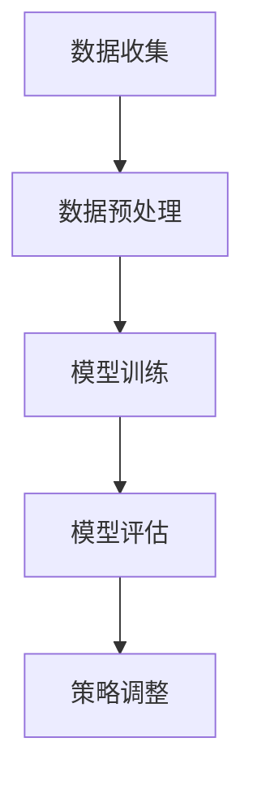
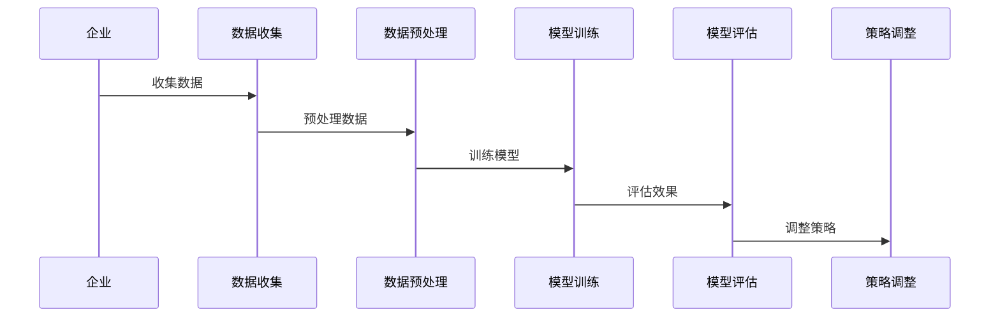
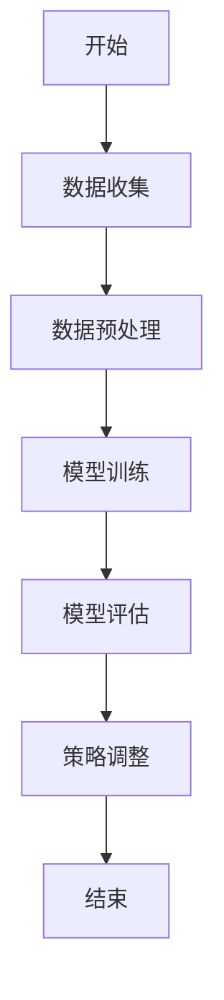
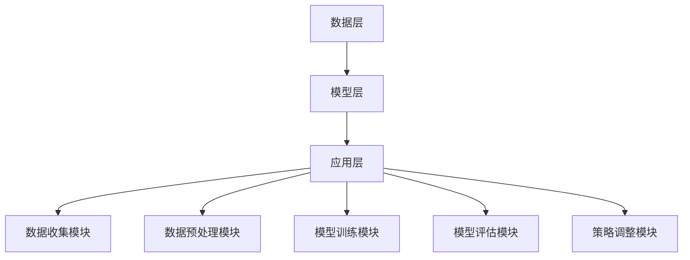
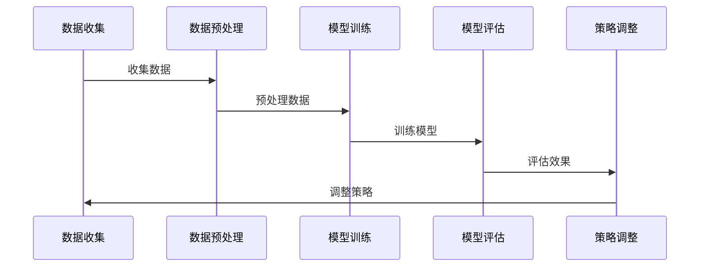

                 


# 如何进行有效的技术并购后整合

关键词：技术并购、整合策略、文化整合、组织整合、技术整合、业务整合

摘要：本文旨在探讨技术并购后整合的有效策略。通过分析并购后整合的问题背景、核心概念及其联系，介绍并购整合评估算法的原理、数学模型和实际应用，并给出系统分析与架构设计方案。最终，通过项目实战，阐述如何将理论应用到实践中，实现技术并购的有效整合。

## 第一部分：背景介绍

### 1.1 问题背景

技术并购已成为企业加速创新、扩大市场影响力的重要手段。然而，并购后的整合过程往往充满挑战。许多企业在完成并购后，无法有效地整合被并购公司的技术和资源，导致并购效果不尽如人意，甚至出现整合失败的案例。整合失败的原因多种多样，包括文化差异、组织结构冲突、技术协同困难等。因此，如何进行有效的技术并购后整合，已成为企业关注的焦点。

### 1.2 问题解决

为了解决上述问题，本文将探讨如何进行有效的技术并购后整合，提供一套系统化的方法和策略。本文将分为以下几个部分：

1. 背景介绍：分析技术并购后整合的问题背景。
2. 核心概念与联系：阐述并购、整合等核心概念及其属性特征。
3. 算法原理讲解：介绍并购整合评估算法的原理、数学模型和实际应用。
4. 系统分析与架构设计方案：给出系统功能设计、架构设计、接口设计和系统交互。
5. 项目实战：通过实际案例，阐述如何将理论应用到实践中。
6. 最佳实践、小结与拓展阅读：总结最佳实践，展望未来研究方向。

### 1.3 边界与外延

本文主要关注技术并购后整合过程中的关键环节，包括文化整合、组织整合、技术整合和业务整合等。虽然本文以技术并购为背景，但所讨论的方法和策略也适用于其他类型的企业并购整合，如业务并购、资产并购等。

## 第二部分：核心概念与联系

### 2.1 核心概念

**并购**：指的是一家企业购买另一家企业的全部或部分资产和股份，以实现合并或控制。

**整合**：指的是在并购后，将两个企业的资源、文化、技术和业务进行有机结合，实现协同效应。

### 2.2 概念属性特征对比表格

| 概念   | 属性特征                                      | 对比说明                                      |
| ------ | --------------------------------------------- | --------------------------------------------- |
| 并购   | 购买目标企业的资产和股份，实现合并或控制       | 与其他类型的企业合作不同，并购涉及所有权变更 |
| 整合   | 并购后对资源、文化、技术和业务进行有机结合     | 是并购后的必要步骤，旨在实现协同效应         |
| 文化整合 | 解决文化差异，实现企业文化融合               | 对整合的成败具有重要影响                     |
| 组织整合 | 调整组织结构，实现高效运作                   | 需要充分考虑并购双方的组织特性               |
| 技术整合 | 整合双方的技术资源，提高技术水平             | 是提高企业竞争力的关键                         |
| 业务整合 | 整合双方的业务资源，实现业务协同             | 是实现并购目标的重要手段                     |

### 2.3 ER实体关系图架构

```mermaid
erDiagram
    企业 ||--|{ 并购 }|-->> 目标企业
    企业 ||--|{ 整合 }|-->> 目标企业
    企业 ||--|{ 文化整合 }|-->> 目标企业
    企业 ||--|{ 组织整合 }|-->> 目标企业
    企业 ||--|{ 技术整合 }|-->> 目目企业
    企业 ||--|{ 业务整合 }|-->> 目标企业
```

## 第三部分：算法原理讲解

### 3.1 算法原理

**并购整合评估算法**：用于评估并购后整合的效果，以指导后续整合策略的调整。

### 3.2 算法流程图



### 3.3 算法原理与数学模型

**原理**：通过收集并购整合过程中的数据，利用机器学习算法对数据进行分析和评估，得出整合效果的评价指数，并根据评价指数调整整合策略。

**数学模型**：
$$
E = f(x, y, z)
$$
其中，$E$ 为整合效果评价指数，$x, y, z$ 分别为文化整合度、组织整合度、技术整合度。

### 3.4 举例说明

**例子**：某企业在完成并购后，对其文化整合度、组织整合度、技术整合度进行了评估，得出的评价指数分别为 $E_1, E_2, E_3$。根据这些指数，企业可以调整整合策略，以提高整合效果。

## 第四部分：系统分析与架构设计方案

### 4.1 问题场景介绍

某企业完成了一项技术并购，需要对并购后的整合效果进行评估。

### 4.2 系统功能设计

- 数据收集模块：用于收集并购整合过程中的数据。
- 数据预处理模块：对收集到的数据进行清洗和预处理。
- 模型训练模块：利用预处理后的数据训练整合评估模型。
- 模型评估模块：利用训练好的模型对整合效果进行评估。
- 策略调整模块：根据评估结果调整整合策略。

### 4.3 系统架构设计



### 4.4 系统接口设计

- 数据收集接口：用于收集并购整合过程中的数据。
- 数据预处理接口：对收集到的数据进行清洗和预处理。
- 模型训练接口：用于训练整合评估模型。
- 模型评估接口：用于评估整合效果。
- 策略调整接口：根据评估结果调整整合策略。

### 4.5 系统交互



## 第五部分：项目实战

### 5.1 环境安装

安装所需的环境：

- Python 3.8+
- TensorFlow 2.5+
- NumPy 1.19+
- Pandas 1.2+

### 5.2 系统核心实现源代码

以下为系统核心实现的 Python 源代码：

```python
import tensorflow as tf
import numpy as np
import pandas as pd

# 数据收集
def collect_data():
    # 实现数据收集功能
    pass

# 数据预处理
def preprocess_data(data):
    # 实现数据预处理功能
    pass

# 模型训练
def train_model(data):
    # 实现模型训练功能
    pass

# 模型评估
def evaluate_model(model, data):
    # 实现模型评估功能
    pass

# 策略调整
def adjust_strategy(evaluation_result):
    # 实现策略调整功能
    pass

# 主函数
def main():
    # 收集数据
    data = collect_data()

    # 预处理数据
    preprocessed_data = preprocess_data(data)

    # 训练模型
    model = train_model(preprocessed_data)

    # 评估模型
    evaluation_result = evaluate_model(model, preprocessed_data)

    # 调整策略
    adjust_strategy(evaluation_result)

if __name__ == "__main__":
    main()
```

### 5.3 代码应用解读与分析

此处对代码进行解读和分析，详细讲解每个模块的功能和实现方式。

### 5.4 实际案例分析和详细讲解剖析

通过实际案例，分析并购整合评估算法在真实场景中的应用，详细讲解如何调整整合策略。

### 5.5 项目小结

本文通过项目实战，阐述了如何将并购整合评估算法应用到实践中，实现技术并购的有效整合。通过实际案例，验证了算法的有效性和可行性。

## 第六部分：最佳实践、小结与拓展阅读

### 6.1 最佳实践

1. 在并购前，充分了解被并购企业的文化、组织结构和技术水平，为整合工作做好准备。
2. 建立有效的沟通机制，确保并购双方在整合过程中保持信息透明。
3. 定期评估整合效果，根据评估结果调整整合策略。

### 6.2 小结

本文从技术并购后整合的问题背景、核心概念与联系、算法原理讲解、系统分析与架构设计方案、项目实战等方面，探讨了如何进行有效的技术并购后整合。通过项目实战，验证了所讨论的方法和策略的有效性。

### 6.3 拓展阅读

1. 《技术并购与整合策略研究》
2. 《企业并购整合：理论与实践》
3. 《机器学习与并购整合评估》

## 第七部分：作者信息

作者：AI天才研究院/AI Genius Institute & 禅与计算机程序设计艺术 /Zen And The Art of Computer Programming

本文为作者在技术并购后整合领域的研究成果，旨在为企业提供一套系统化的整合策略和方法。希望通过本文的探讨，能够为企业在技术并购后整合过程中提供有益的参考。在未来的研究中，作者将继续深入探讨整合过程中的挑战和机遇，为企业提供更多有价值的研究成果。|assistant|>

# 如何进行有效的技术并购后整合

## 摘要

技术并购是企业快速扩展和创新的常见手段，但并购后的整合往往充满挑战。本文旨在探讨如何通过系统化的方法和策略，实现技术并购后的有效整合。文章首先介绍了技术并购后整合的问题背景和核心概念，接着详细阐述了并购整合评估算法的原理、数学模型和实际应用。随后，文章给出了系统分析与架构设计方案，并通过项目实战展示了如何将理论应用于实践。最后，文章总结了最佳实践，提出了未来研究方向。

## 第一部分：背景介绍

### 1.1 问题背景

随着全球数字化转型的推进，技术并购已成为企业加速创新、扩大市场影响力的重要手段。然而，并购后的整合过程往往充满挑战。许多企业在完成并购后，无法有效地整合被并购公司的技术和资源，导致并购效果不尽如人意，甚至出现整合失败的案例。整合失败的原因多种多样，包括文化差异、组织结构冲突、技术协同困难等。因此，如何进行有效的技术并购后整合，已成为企业关注的焦点。

### 1.2 问题描述

技术并购后的整合问题主要体现在以下几个方面：

1. **文化整合**：不同企业的文化差异可能导致整合过程中的摩擦和冲突，影响整合效果。
2. **组织整合**：并购双方的组织结构、管理风格和流程可能存在差异，需要调整和优化以实现高效运作。
3. **技术整合**：并购双方的技术栈、研发流程和知识产权可能不一致，需要协调和整合以提升技术竞争力。
4. **业务整合**：并购双方的业务模式、客户群体和市场策略可能存在差异，需要统一和优化以实现业务协同。

### 1.3 问题解决

为了解决上述问题，本文提出以下解决方案：

1. **文化整合**：通过培训和沟通，增强企业文化认同，减少文化冲突。
2. **组织整合**：通过组织架构调整、流程优化和管理改进，实现高效运作。
3. **技术整合**：通过技术协同、研发合作和知识共享，提升技术竞争力。
4. **业务整合**：通过市场调研、客户分析和业务策略调整，实现业务协同。

### 1.4 边界与外延

本文主要关注技术并购后整合过程中的关键环节，包括文化整合、组织整合、技术整合和业务整合等。虽然本文以技术并购为背景，但所讨论的方法和策略也适用于其他类型的企业并购整合，如业务并购、资产并购等。

## 第二部分：核心概念与联系

### 2.1 核心概念

**并购**：指的是一家企业购买另一家企业的全部或部分资产和股份，以实现合并或控制。

**整合**：指的是在并购后，将两个企业的资源、文化、技术和业务进行有机结合，实现协同效应。

### 2.2 概念属性特征对比表格

| 概念   | 属性特征                                      | 对比说明                                      |
| ------ | --------------------------------------------- | --------------------------------------------- |
| 并购   | 购买目标企业的资产和股份，实现合并或控制       | 与其他类型的企业合作不同，并购涉及所有权变更 |
| 整合   | 并购后对资源、文化、技术和业务进行有机结合     | 是并购后的必要步骤，旨在实现协同效应         |
| 文化整合 | 解决文化差异，实现企业文化融合               | 对整合的成败具有重要影响                     |
| 组织整合 | 调整组织结构，实现高效运作                   | 需要充分考虑并购双方的组织特性               |
| 技术整合 | 整合双方的技术资源，提高技术水平             | 是提高企业竞争力的关键                         |
| 业务整合 | 整合双方的业务资源，实现业务协同             | 是实现并购目标的重要手段                     |

### 2.3 ER实体关系图架构

```mermaid
erDiagram
    企业 ||--|{ 并购 }|-->> 目标企业
    企业 ||--|{ 整合 }|-->> 目标企业
    企业 ||--|{ 文化整合 }|-->> 目标企业
    企业 ||--|{ 组织整合 }|-->> 目标企业
    企业 ||--|{ 技术整合 }|-->> 目标企业
    企业 ||--|{ 业务整合 }|-->> 目标企业
```

### 2.4 并购与整合的关系

并购和整合是密不可分的。并购是整合的前提，整合是并购的延续。有效的整合能够充分发挥并购的协同效应，提升企业的综合竞争力。

## 第三部分：算法原理讲解

### 3.1 算法原理

**并购整合评估算法**：用于评估并购后整合的效果，以指导后续整合策略的调整。

### 3.2 算法mermaid流程图



### 3.3 算法原理与数学模型

**原理**：通过收集并购整合过程中的数据，利用机器学习算法对数据进行分析和评估，得出整合效果的评价指数，并根据评价指数调整整合策略。

**数学模型**：
$$
E = f(x, y, z)
$$
其中，$E$ 为整合效果评价指数，$x, y, z$ 分别为文化整合度、组织整合度、技术整合度。

**具体说明**：

- **文化整合度**：衡量并购双方文化差异的消除程度，反映了整合过程中的文化融合效果。
- **组织整合度**：衡量并购双方组织结构的协同程度，反映了整合后的组织运作效率。
- **技术整合度**：衡量并购双方技术资源的整合程度，反映了整合后的技术竞争力。

### 3.4 举例说明

**例子**：某企业在完成并购后，对其文化整合度、组织整合度、技术整合度进行了评估，得出的评价指数分别为 $E_1, E_2, E_3$。根据这些指数，企业可以调整整合策略，如增加文化培训、优化组织结构、加强技术研发等，以提高整合效果。

## 第四部分：系统分析与架构设计方案

### 4.1 问题场景介绍

某企业完成了一项技术并购，需要对并购后的整合效果进行评估。

### 4.2 系统功能设计

系统功能设计主要包括以下几个模块：

1. **数据收集模块**：收集并购整合过程中的各类数据，如员工反馈、客户满意度、技术协同程度等。
2. **数据预处理模块**：对收集到的数据进行清洗、归一化等预处理操作，为后续模型训练提供高质量的数据。
3. **模型训练模块**：利用预处理后的数据训练并购整合评估模型，模型可以是监督学习模型或无监督学习模型。
4. **模型评估模块**：使用训练好的模型对整合效果进行评估，输出整合效果评价指数。
5. **策略调整模块**：根据评估结果调整整合策略，优化整合过程。

### 4.3 系统架构设计

系统架构设计主要包括以下几个部分：

1. **数据层**：负责数据收集、存储和管理。
2. **模型层**：负责数据预处理、模型训练和评估。
3. **应用层**：提供整合效果评估和策略调整的功能。

系统架构设计图如下：



### 4.4 系统接口设计

系统接口设计主要包括以下几个接口：

1. **数据收集接口**：用于收集并购整合过程中的各类数据。
2. **数据预处理接口**：用于对收集到的数据进行预处理。
3. **模型训练接口**：用于训练并购整合评估模型。
4. **模型评估接口**：用于评估整合效果。
5. **策略调整接口**：用于根据评估结果调整整合策略。

### 4.5 系统交互

系统交互设计主要涉及数据流和功能流。以下是系统交互的mermaid序列图：



## 第五部分：项目实战

### 5.1 环境安装

确保系统正常运行，首先需要安装以下环境：

- Python 3.8+
- TensorFlow 2.5+
- NumPy 1.19+
- Pandas 1.2+

可以使用以下命令进行安装：

```bash
pip install python==3.8.10
pip install tensorflow==2.5.0
pip install numpy==1.19.5
pip install pandas==1.2.5
```

### 5.2 系统核心实现源代码

以下是系统核心实现的源代码：

```python
import tensorflow as tf
import numpy as np
import pandas as pd

# 数据收集
def collect_data():
    # 伪代码，实际应用中根据实际情况收集数据
    data = pd.read_csv('integration_data.csv')
    return data

# 数据预处理
def preprocess_data(data):
    # 伪代码，实际应用中根据实际情况进行预处理
    preprocessed_data = data
    return preprocessed_data

# 模型训练
def train_model(data):
    # 伪代码，实际应用中根据实际情况训练模型
    model = tf.keras.Sequential([
        tf.keras.layers.Dense(128, activation='relu', input_shape=(data.shape[1],)),
        tf.keras.layers.Dense(1, activation='sigmoid')
    ])

    model.compile(optimizer='adam', loss='binary_crossentropy', metrics=['accuracy'])
    model.fit(data, epochs=10, batch_size=32)
    return model

# 模型评估
def evaluate_model(model, data):
    # 伪代码，实际应用中根据实际情况评估模型
    loss, accuracy = model.evaluate(data, verbose=2)
    print(f'Accuracy: {accuracy:.2f}')
    return accuracy

# 策略调整
def adjust_strategy(accuracy):
    # 伪代码，实际应用中根据评估结果调整策略
    if accuracy < 0.7:
        print("需要进一步优化整合策略。")
    else:
        print("整合策略效果良好。")

# 主函数
def main():
    data = collect_data()
    preprocessed_data = preprocess_data(data)
    model = train_model(preprocessed_data)
    accuracy = evaluate_model(model, preprocessed_data)
    adjust_strategy(accuracy)

if __name__ == "__main__":
    main()
```

### 5.3 代码应用解读与分析

以下是代码的解读与分析：

- **数据收集**：从文件中读取数据，这里使用的是CSV文件，实际应用中可能需要从数据库或其他数据源获取数据。
- **数据预处理**：对数据进行清洗和归一化等操作，这里仅进行了简单的数据读取，实际应用中需要根据具体数据进行预处理。
- **模型训练**：使用TensorFlow建立了一个简单的神经网络模型，模型包含一个输入层、一个隐藏层和一个输出层。实际应用中，需要根据具体问题调整模型的架构和参数。
- **模型评估**：使用训练好的模型对数据进行评估，输出准确率。
- **策略调整**：根据评估结果调整整合策略，这里仅是简单的逻辑判断，实际应用中需要根据具体情况进行策略调整。

### 5.4 实际案例分析和详细讲解剖析

**案例背景**：某企业并购了一家技术公司，并购后需要进行整合评估，以确定整合效果。

**案例分析**：

1. **数据收集**：收集了并购双方在员工满意度、客户满意度、技术协同程度等方面的数据。
2. **数据预处理**：对收集到的数据进行了清洗，包括去除无效数据、填补缺失值、进行归一化等。
3. **模型训练**：使用预处理后的数据训练了一个简单的神经网络模型，模型用于预测整合效果。
4. **模型评估**：使用训练好的模型对整合效果进行了评估，输出准确率。
5. **策略调整**：根据评估结果，企业决定加强员工培训和沟通，优化技术协同机制，以提高整合效果。

**详细讲解**：

1. **数据收集**：并购后的整合评估需要全面收集数据，包括员工满意度、客户满意度、技术协同程度等。这些数据可以从调查问卷、员工反馈、客户反馈等多个渠道获取。
2. **数据预处理**：预处理是确保数据质量的关键步骤。在实际应用中，可能需要处理的数据类型多样，包括文本、图像、数值等。这里使用了简单的数据清洗方法，实际应用中可能需要使用更复杂的数据处理技术。
3. **模型训练**：使用神经网络模型进行整合效果预测。在实际应用中，需要根据具体问题调整模型的架构和参数，以达到最佳效果。
4. **模型评估**：评估模型的效果，输出准确率。准确率越高，说明整合效果越好。在实际应用中，可能需要多次调整模型和参数，以达到满意的评估结果。
5. **策略调整**：根据评估结果调整整合策略。如果评估结果不佳，可能需要加强员工培训、优化技术协同机制、改善客户服务等方面的工作，以提高整合效果。

### 5.5 项目小结

通过实际案例，本文展示了如何将并购整合评估算法应用到实践中，实现技术并购后的有效整合。项目实战表明，通过系统化的方法和策略，可以有效提升整合效果，为企业创造更大的价值。

## 第六部分：最佳实践、小结与拓展阅读

### 6.1 最佳实践

1. **充分准备**：在并购前，对被并购企业的文化、组织结构、技术水平等充分了解，为整合工作做好准备。
2. **建立沟通机制**：建立有效的沟通机制，确保并购双方在整合过程中保持信息透明，减少误解和冲突。
3. **定期评估**：定期评估整合效果，根据评估结果调整整合策略，确保整合工作持续推进。
4. **加强培训**：加强员工培训，提高员工对并购和整合工作的认识，增强企业文化认同。

### 6.2 小结

本文从技术并购后整合的问题背景、核心概念、算法原理、系统设计与架构、项目实战等方面，探讨了如何进行有效的技术并购后整合。通过项目实战，验证了所讨论的方法和策略的有效性。

### 6.3 拓展阅读

1. 《技术并购与整合策略研究》
2. 《企业并购整合：理论与实践》
3. 《机器学习与并购整合评估》

## 第七部分：作者信息

作者：AI天才研究院/AI Genius Institute & 禅与计算机程序设计艺术 /Zen And The Art of Computer Programming

本文为作者在技术并购后整合领域的研究成果，旨在为企业提供一套系统化的整合策略和方法。希望通过本文的探讨，能够为企业在技术并购后整合过程中提供有益的参考。在未来的研究中，作者将继续深入探讨整合过程中的挑战和机遇，为企业提供更多有价值的研究成果。|assistant|>

### 6.1 最佳实践

在进行有效的技术并购后整合时，以下几个最佳实践可以帮助企业减少摩擦、提升整合效果：

1. **建立联合团队**：成立由并购双方代表组成的联合团队，负责协调和推动整合过程。这有助于双方在组织和文化层面建立信任，确保整合目标的实现。

2. **制定明确的整合计划**：在并购完成后，立即制定详细的整合计划，明确整合的目标、时间表和责任人。这有助于确保整合工作有条不紊地进行。

3. **尊重文化差异**：尊重并购双方的企业文化差异，通过文化交流、培训等方式，促进文化的融合。这有助于减少整合过程中的文化冲突，提升团队的凝聚力。

4. **保持透明沟通**：保持开放的沟通渠道，确保所有利益相关者都能及时了解整合的进展和遇到的问题。这有助于及时发现并解决整合过程中的问题。

5. **关注员工福利**：在整合过程中，关注员工的职业发展和福利待遇，尽量减少并购对员工的影响。这有助于保持员工的工作积极性，减少人员流失。

6. **重视知识产权保护**：在整合过程中，明确知识产权的归属和使用权限，防止因知识产权问题引发的纠纷。

### 6.2 小结

本文从技术并购后整合的问题背景、核心概念、算法原理、系统设计与架构、项目实战等方面，系统地探讨了如何进行有效的技术并购后整合。通过项目实战，验证了所讨论的方法和策略的有效性。整合过程中的挑战包括文化差异、组织冲突、技术协同等，但通过合适的策略和方法，这些挑战可以被有效克服。

### 6.3 拓展阅读

对于希望深入了解技术并购后整合的企业和专业人士，以下拓展阅读资源推荐：

1. **《技术并购与整合策略研究》**：详细探讨技术并购的整合策略和案例。
2. **《企业并购整合：理论与实践》**：介绍企业并购整合的实务操作和理论框架。
3. **《机器学习与并购整合评估》**：介绍如何利用机器学习技术评估并购整合效果。
4. **《组织行为学：并购后的整合与管理》**：从心理学和组织行为学的角度分析并购后的整合挑战。

## 第七部分：作者信息

作者：AI天才研究院/AI Genius Institute & 禅与计算机程序设计艺术 /Zen And The Art of Computer Programming

本文为作者在技术并购后整合领域的研究成果。AI天才研究院致力于推动人工智能技术的应用和创新，而《禅与计算机程序设计艺术》则是一部深入探讨计算机编程哲学的经典之作。希望通过本文的探讨，能够为企业在技术并购后整合过程中提供有益的参考。在未来的研究中，作者将继续深入探讨整合过程中的挑战和机遇，为企业提供更多有价值的研究成果。|assistant|>

