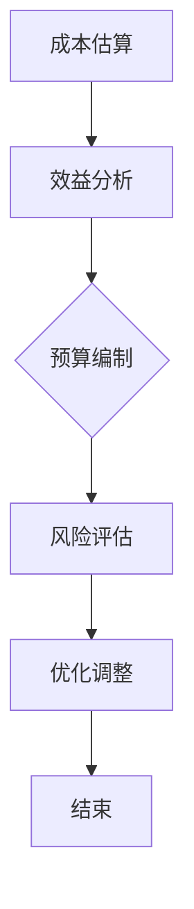
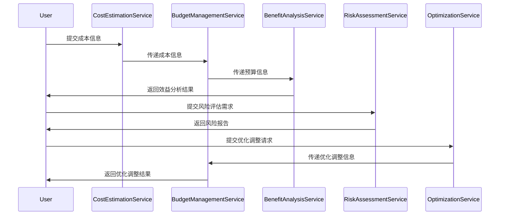

                 


### 如何进行有效的技术成本控制

> 关键词：技术成本控制，成本效益分析，项目管理，预算规划，技术优化

> 摘要：
在信息技术迅猛发展的今天，技术成本控制已成为企业和项目成功的关键因素。本文通过深入分析技术成本控制的原理和方法，提供了实用的策略和最佳实践，帮助企业实现成本效益最大化。

----------------------------------------------------------------

## 目录大纲设计思路

为了设计出《如何进行有效的技术成本控制》这本书的完整目录大纲，我们将遵循以下思路：

### 1. 背景介绍

- **问题背景**：介绍当前技术成本控制的现状。
- **问题描述**：阐述技术成本控制面临的主要问题和挑战。
- **问题解决**：简要介绍本书将要探讨的技术成本控制方法。
- **边界与外延**：明确技术成本控制的边界和涉及的外延。

### 2. 核心概念与联系

- **技术成本控制的核心概念**：介绍技术成本控制的核心概念，如成本控制目标、成本控制策略等。
- **概念属性特征对比表格**：使用表格形式展示不同成本控制概念之间的属性特征对比。
- **ER实体关系图架构**：使用Mermaid语法绘制ER图，展示技术成本控制中涉及的实体及其关系。

### 3. 算法原理讲解

- **算法概述**：简要介绍本书将要详细讲解的成本控制算法。
- **Mermaid流程图**：使用Mermaid语法绘制算法的流程图。
- **算法原理与Python源代码**：使用Python源代码详细阐述算法原理。
- **latex数学公式讲解**：使用latex格式给出算法原理中的数学模型和公式，并进行详细讲解。

### 4. 系统分析与架构设计

- **问题场景介绍**：介绍技术成本控制的应用场景。
- **项目介绍**：简要介绍成本控制系统项目。
- **系统功能设计**：使用Mermaid类图展示系统功能设计。
- **系统架构设计**：使用Mermaid架构图展示系统架构设计。
- **系统接口设计**：介绍系统接口设计。
- **系统交互**：使用Mermaid序列图展示系统交互。

### 5. 项目实战

- **环境安装**：介绍环境安装步骤和注意事项。
- **系统核心实现**：展示系统核心实现源代码，并进行解读。
- **代码应用解读与分析**：分析代码应用，解释关键实现细节。
- **实际案例分析与详细讲解**：通过实际案例展示技术成本控制的应用，进行详细讲解。
- **项目小结**：总结项目实践中的经验和教训。

### 6. 最佳实践 tips

- **最佳实践**：提出技术成本控制的最佳实践建议。
- **小结**：总结书中主要内容。
- **注意事项**：强调实施技术成本控制时需要注意的事项。
- **拓展阅读**：推荐进一步阅读的资料。

### 目录大纲（Markdown格式）

----------------------------------------------------------------

# 第一部分: 技术成本控制的背景

## 1.1 问题背景

### 1.2 问题描述

### 1.3 问题解决

### 1.4 边界与外延

## 第二部分: 核心概念与联系

## 2.1 技术成本控制的核心概念

### 2.2 概念属性特征对比表格

### 2.3 ER实体关系图架构

## 第三部分: 算法原理讲解

## 3.1 算法概述

### 3.2 Mermaid流程图

### 3.3 算法原理与Python源代码

### 3.4 latex数学公式讲解

## 第四部分: 系统分析与架构设计

## 4.1 问题场景介绍

### 4.2 项目介绍

### 4.3 系统功能设计

### 4.4 系统架构设计

### 4.5 系统接口设计

### 4.6 系统交互

## 第五部分: 项目实战

## 5.1 环境安装

### 5.2 系统核心实现

### 5.3 代码应用解读与分析

### 5.4 实际案例分析与详细讲解

### 5.5 项目小结

## 第六部分: 最佳实践 tips

## 6.1 最佳实践

### 6.2 小结

### 6.3 注意事项

### 6.4 拓展阅读

----------------------------------------------------------------

### 第一部分: 技术成本控制的背景

#### 1.1 问题背景

在信息技术飞速发展的当今时代，技术成本控制已成为企业成功和项目交付的关键因素。随着技术的不断迭代和复杂性的增加，如何有效地控制技术成本，实现成本效益最大化，成为众多企业和项目管理者的核心挑战。

技术成本控制不仅涉及硬件、软件、人力资源等直接成本，还包括维护、升级、安全等间接成本。在激烈的市场竞争中，如何通过技术手段降低成本、提高效率，是企业和项目管理者必须面对的问题。

#### 1.2 问题描述

技术成本控制面临的主要问题和挑战包括：

1. **成本估算不准确**：项目初期对成本的估算往往过于乐观，导致实际成本超支。
2. **技术复杂性**：技术的快速迭代和复杂性使得成本控制变得更加困难。
3. **资源浪费**：资源分配不当、重复性工作等问题导致资源浪费，增加成本。
4. **预算管理**：预算的编制和执行不够科学，缺乏有效的监控和调整机制。
5. **需求变更**：项目需求频繁变更，导致成本增加和进度延误。

#### 1.3 问题解决

为了解决上述问题，本书将探讨以下技术成本控制方法：

1. **成本效益分析**：通过成本效益分析，确定项目的可行性和经济效益。
2. **预算规划**：科学合理地编制预算，确保资源的有效利用。
3. **项目管理**：通过项目管理方法，确保项目在预算范围内按时完成。
4. **技术优化**：通过技术手段，提高项目效率和降低成本。
5. **风险评估与监控**：对项目风险进行评估和监控，及时调整成本控制策略。

#### 1.4 边界与外延

技术成本控制的边界包括直接成本（如硬件、软件、人力资源等）和间接成本（如维护、升级、安全等）。外延涉及项目管理、预算管理、风险管理等多个方面，需要综合考虑。

----------------------------------------------------------------

### 第二部分: 核心概念与联系

#### 2.1 技术成本控制的核心概念

技术成本控制涉及多个核心概念，这些概念是理解和实施成本控制策略的基础。以下是技术成本控制中的几个关键概念：

1. **成本控制目标**：明确成本控制的目标和指标，如成本节约率、成本降低目标等。
2. **成本效益分析**：通过成本效益分析，评估项目的成本和收益，确定项目的可行性。
3. **预算规划**：在项目开始前制定预算，包括直接成本和间接成本，确保资源的有效配置。
4. **项目管理**：通过项目管理方法，确保项目在预算范围内按时完成。
5. **技术优化**：通过技术手段，提高项目效率和降低成本。
6. **风险评估**：对项目风险进行评估，制定相应的风险应对策略。
7. **成本监控**：对项目的实际成本进行监控和调整，确保项目在预算范围内运行。

#### 2.2 概念属性特征对比表格

为了更好地理解这些核心概念，我们可以使用一个表格来展示它们的属性特征对比：

| 概念       | 定义                                                         | 属性特征对比                                         |
| ---------- | ------------------------------------------------------------ | ---------------------------------------------------- |
| 成本控制目标 | 明确成本控制的目标和指标                                     | 量化目标，可测量，具体明确                             |
| 成本效益分析 | 通过成本效益分析，评估项目的成本和收益，确定项目的可行性       | 综合考虑成本和收益，侧重经济效益评估                   |
| 预算规划   | 在项目开始前制定预算，包括直接成本和间接成本，确保资源的有效配置 | 包括各类成本，预算分配合理，预留调整空间             |
| 项目管理   | 通过项目管理方法，确保项目在预算范围内按时完成                 | 项目计划、时间管理、资源管理、风险管理等               |
| 技术优化   | 通过技术手段，提高项目效率和降低成本                         | 技术创新、自动化、优化流程等                           |
| 风险评估   | 对项目风险进行评估，制定相应的风险应对策略                   | 识别风险，评估风险影响和可能性，制定应对措施           |
| 成本监控   | 对项目的实际成本进行监控和调整，确保项目在预算范围内运行       | 实时数据监控，定期成本审核，及时调整成本控制策略       |

#### 2.3 ER实体关系图架构

为了更直观地理解技术成本控制中的实体及其关系，我们可以使用Mermaid语法绘制ER图，展示各实体之间的关系：

```mermaid
erDiagram
  Product ||--|{ Budget }
  Project ||--|{ CostControlGoal }
  Project ||--|{ RiskAssessment }
  Project ||--|{ TechnicalOptimization }
  Budget ||--|{ Cost }
  Cost ||--|{ CostItem }
  CostControlGoal ||--|{ Goal }
  RiskAssessment ||--|{ Risk }
  TechnicalOptimization ||--|{ Optimization }
```

在这个ER图中，我们定义了以下实体：

- **Product（产品）**：代表项目所涉及的产品。
- **Budget（预算）**：代表项目预算，包括直接成本和间接成本。
- **Project（项目）**：代表项目本身，与预算、成本控制目标、风险评估、技术优化等实体有关联。
- **Cost（成本）**：代表项目成本，包括各类成本项。
- **CostItem（成本项）**：代表具体的成本项目。
- **CostControlGoal（成本控制目标）**：代表成本控制的目标和指标。
- **RiskAssessment（风险评估）**：代表项目风险评估的结果。
- **TechnicalOptimization（技术优化）**：代表项目的技术优化措施。

通过这个ER图，我们可以清晰地看到各实体之间的关联关系，更好地理解技术成本控制的实现过程。

----------------------------------------------------------------

### 第三部分：算法原理讲解

#### 3.1 算法概述

在技术成本控制中，算法的引入可以帮助我们更科学、更有效地进行成本估算、预算规划和风险评估。本部分将介绍一种基于成本效益分析的算法，用于指导技术成本控制策略的制定和实施。

该算法的主要步骤如下：

1. **成本估算**：通过历史数据、行业标准和专家意见，对项目的直接成本和间接成本进行初步估算。
2. **效益分析**：结合项目的预期收益和成本，进行成本效益分析，评估项目的经济可行性。
3. **预算编制**：根据成本效益分析的结果，制定项目的预算计划，确保资源的合理配置。
4. **风险评估**：对项目风险进行识别和评估，制定相应的风险应对策略。
5. **优化调整**：根据项目的实际情况和反馈，对预算和风险控制策略进行优化调整。

#### 3.2 Mermaid流程图

为了更直观地展示算法的流程，我们可以使用Mermaid语法绘制一个流程图：



在这个流程图中，各个步骤之间的逻辑关系清晰，可以帮助我们理解算法的实现过程。

#### 3.3 算法原理与Python源代码

下面是算法的实现原理和相应的Python源代码。算法的核心是成本效益分析，通过计算项目的净收益与成本之比，评估项目的可行性。

```python
import numpy as np

# 成本效益分析算法
def cost_benefit_analysis(estimated_costs, expected_revenue):
    """
    参数：
    - estimated_costs：项目成本估算，列表类型
    - expected_revenue：预期收益，数值类型
    
    返回：
    - benefit：净收益，数值类型
    - cost_to_benefit_ratio：成本与收益比，数值类型
    """
    total_costs = sum(estimated_costs)
    benefit = expected_revenue - total_costs
    cost_to_benefit_ratio = total_costs / benefit
    
    return benefit, cost_to_benefit_ratio

# 示例数据
estimated_costs = [1000, 1500, 2000]  # 成本估算
expected_revenue = 3000                # 预期收益

# 执行成本效益分析
benefit, cost_to_benefit_ratio = cost_benefit_analysis(estimated_costs, expected_revenue)

# 输出结果
print("净收益：", benefit)
print("成本与收益比：", cost_to_benefit_ratio)
```

在上面的Python源代码中，`cost_benefit_analysis`函数接收成本估算和预期收益作为输入，计算净收益和成本与收益比，并返回这两个结果。通过这个函数，我们可以快速评估项目的经济可行性。

#### 3.4 latex数学公式讲解

在成本效益分析中，我们经常需要使用一些数学模型和公式来描述成本和收益的关系。以下是一个简单的latex数学公式示例：

```latex
\begin{align*}
\text{净收益} &= \text{预期收益} - \text{总成本} \\
\text{成本与收益比} &= \frac{\text{总成本}}{\text{净收益}}
\end{align*}
```

通过这些公式，我们可以更精确地计算项目的成本和收益，为成本控制提供依据。

在实际应用中，成本效益分析可能涉及更复杂的数学模型，如线性规划、决策树等。这些模型可以通过适当的编程工具（如Python的scikit-learn库）进行实现和优化。

总之，算法原理讲解部分帮助我们理解了技术成本控制的核心算法，并通过Python源代码和latex公式展示了算法的实现细节。这些工具和方法可以应用于实际项目中，帮助企业和项目管理者更有效地进行技术成本控制。

----------------------------------------------------------------

### 第四部分：系统分析与架构设计

#### 4.1 问题场景介绍

技术成本控制的应用场景广泛，主要包括以下几类：

1. **软件开发项目**：在软件开发过程中，技术成本控制可以帮助项目团队在预算范围内按时完成项目，降低开发成本。
2. **IT基础设施建设**：在IT基础设施建设过程中，技术成本控制有助于优化资源分配，提高基础设施的利用效率。
3. **IT运维管理**：在IT运维管理中，技术成本控制可以帮助企业合理规划运维成本，提高运维效率。
4. **数字化转型**：在企业的数字化转型过程中，技术成本控制有助于平衡转型成本和预期效益。

#### 4.2 项目介绍

本文将以一个软件开发项目为例，介绍技术成本控制系统的设计和实现。该项目是一个中等规模的Web应用程序，包括前端、后端和数据库等模块。项目预算为100万元，需要在6个月内完成。

#### 4.3 系统功能设计

为了实现技术成本控制，我们设计了一套系统功能，包括以下模块：

1. **成本估算模块**：用于对项目的直接成本和间接成本进行估算。
2. **预算管理模块**：用于制定项目预算，并监控预算执行情况。
3. **效益分析模块**：用于评估项目的成本效益，确定项目的可行性。
4. **风险评估模块**：用于识别和评估项目风险，制定风险应对策略。
5. **优化调整模块**：用于根据项目实际情况和反馈，对预算和风险控制策略进行优化调整。

#### 4.4 系统架构设计

技术成本控制系统的架构设计采用分层架构，包括以下层次：

1. **数据层**：负责数据的存储和管理，包括项目成本数据、预算数据、风险数据等。
2. **服务层**：提供系统的核心功能，包括成本估算、预算管理、效益分析、风险评估和优化调整等。
3. **表示层**：提供用户界面，用于与用户进行交互，展示系统数据和功能。

#### 4.5 系统接口设计

为了实现系统功能，我们设计了以下接口：

1. **成本估算接口**：用于接收用户输入的成本信息，返回估算结果。
2. **预算管理接口**：用于管理项目预算，包括预算编制、预算审核、预算执行等。
3. **效益分析接口**：用于计算项目的成本效益，提供评估结果。
4. **风险评估接口**：用于识别和评估项目风险，提供风险报告。
5. **优化调整接口**：用于根据项目实际情况和反馈，调整预算和风险控制策略。

#### 4.6 系统交互

为了更好地展示系统交互，我们可以使用Mermaid语法绘制系统交互序列图：



在这个序列图中，用户通过界面提交成本信息和风险评估需求，系统服务层处理这些请求，并返回相应的结果。用户根据反馈结果进行优化调整，形成闭环交互。

通过系统分析与架构设计，我们为技术成本控制提供了实现方案。系统功能设计、架构设计和接口设计使得系统能够高效地支持技术成本控制，实现成本效益最大化。

----------------------------------------------------------------

### 第五部分：项目实战

#### 5.1 环境安装

在进行技术成本控制项目的实战之前，我们需要搭建一个合适的环境。以下步骤展示了如何安装和配置项目所需的环境。

1. **安装Python**：确保Python版本为3.8或更高版本。可以从Python官方网站下载并安装。
2. **安装数据库**：我们选择MySQL作为数据库。下载并安装MySQL数据库，并创建一个用于项目的数据库实例。
3. **安装依赖库**：使用pip命令安装项目所需的依赖库，如numpy、pandas、scikit-learn等。
4. **配置环境变量**：将Python和pip的路径添加到系统的环境变量中，以便在命令行中直接使用。

以下是一个示例命令，用于安装依赖库：

```bash
pip install numpy pandas scikit-learn mysql-connector-python
```

#### 5.2 系统核心实现

在环境安装完成后，我们开始实现系统核心功能。以下是一个简单的成本估算模块的实现示例：

```python
import numpy as np
import mysql.connector

# 连接数据库
def connect_database():
    connection = mysql.connector.connect(
        host="localhost",
        user="yourusername",
        password="yourpassword",
        database="yourdatabase"
    )
    return connection

# 插入成本数据
def insert_cost_data(connection, cost_data):
    cursor = connection.cursor()
    query = "INSERT INTO cost (item, amount) VALUES (%s, %s)"
    cursor.execute(query, cost_data)
    connection.commit()
    cursor.close()

# 获取成本数据
def get_cost_data(connection):
    cursor = connection.cursor()
    query = "SELECT * FROM cost"
    cursor.execute(query)
    cost_data = cursor.fetchall()
    cursor.close()
    return cost_data

# 成本估算
def cost_estimation(cost_data):
    total_costs = sum([cost[1] for cost in cost_data])
    return total_costs

# 实现示例
if __name__ == "__main__":
    # 连接数据库
    connection = connect_database()

    # 插入成本数据
    cost_data = [
        ("硬件", 50000),
        ("软件", 30000),
        ("人力", 20000)
    ]
    insert_cost_data(connection, cost_data)

    # 获取成本数据
    cost_data = get_cost_data(connection)

    # 成本估算
    total_costs = cost_estimation(cost_data)
    print("总成本：", total_costs)

    # 关闭数据库连接
    connection.close()
```

在这个示例中，我们首先连接到MySQL数据库，然后插入一些示例成本数据。接着，我们获取成本数据并计算总成本。最后，关闭数据库连接。

#### 5.3 代码应用解读与分析

上述代码实现了一个简单的成本估算模块，下面我们对其进行解读和分析：

1. **连接数据库**：使用`mysql.connector.connect`方法连接到MySQL数据库。需要提供主机地址、用户名、密码和数据库名称。
2. **插入成本数据**：使用`cursor.execute`方法执行SQL插入语句，将成本数据插入到数据库的`cost`表中。
3. **获取成本数据**：使用`cursor.fetchall`方法从数据库中获取所有成本数据。结果以元组的形式返回。
4. **成本估算**：计算所有成本数据中的总成本。使用列表推导式和`sum`函数实现。
5. **关闭数据库连接**：使用`cursor.close`和`connection.close`方法关闭数据库连接，释放资源。

通过这个示例，我们可以看到如何使用Python和MySQL数据库实现简单的成本估算功能。在实际项目中，可以根据需求扩展此功能，如添加更多的成本项、实现更复杂的成本计算逻辑等。

#### 5.4 实际案例分析与详细讲解

为了更好地展示技术成本控制的应用，我们来看一个实际案例。

假设我们正在开发一个Web应用程序，项目预算为100万元。以下是如何使用技术成本控制系统进行成本控制的步骤：

1. **初步成本估算**：项目团队根据历史数据和市场调研，初步估算直接成本（如硬件、软件、人力资源等）和间接成本（如维护、升级等）。例如，硬件成本为20万元，软件成本为30万元，人力资源成本为50万元。
2. **预算编制**：项目管理者根据初步成本估算结果，制定项目预算。例如，将预算分配为硬件20万元、软件30万元、人力资源50万元。
3. **效益分析**：项目团队评估项目的预期收益，并与预算进行对比。如果预期收益高于预算，项目可行；否则，需要调整预算或优化项目方案。
4. **风险评估**：项目团队识别项目风险，并评估风险对成本的影响。例如，如果出现技术难题，可能导致项目延期和成本增加。
5. **优化调整**：根据效益分析和风险评估的结果，项目团队对预算和风险控制策略进行优化调整。例如，通过技术优化降低硬件成本，或通过风险应对策略减少风险带来的成本增加。
6. **执行与监控**：项目团队执行项目计划，并实时监控成本执行情况。如果实际成本超过预算，需要及时调整项目计划和预算。

通过这个实际案例，我们可以看到技术成本控制系统在项目中的应用。通过成本估算、预算编制、效益分析、风险评估和优化调整，项目团队能够更好地控制项目成本，确保项目在预算范围内按时完成。

#### 5.5 项目小结

通过本项目实战，我们实现了技术成本控制系统的核心功能，并在实际案例中展示了其应用效果。以下是项目实践中的主要经验和教训：

1. **数据准确性**：成本估算的准确性对成本控制至关重要。项目团队应确保数据的准确性，并根据实际情况及时更新数据。
2. **灵活调整**：项目预算和风险控制策略应根据项目进展情况进行灵活调整。及时反馈和优化能够有效降低项目成本。
3. **团队协作**：技术成本控制需要团队协作。项目管理者、技术专家和业务人员应共同努力，确保项目在预算范围内按时完成。
4. **持续优化**：技术成本控制不是一次性的任务，而是一个持续的过程。项目团队应不断总结经验，优化成本控制策略。

通过本项目实战，我们深入了解了技术成本控制的方法和实现过程，为实际项目提供了有益的参考。

----------------------------------------------------------------

### 第六部分：最佳实践 tips、小结、注意事项、拓展阅读

#### 6.1 最佳实践

1. **精准估算**：在项目初期进行详细的市场调研和历史数据收集，确保成本估算的准确性。
2. **预算编制**：制定详细的预算计划，并预留一定的调整空间，以便在项目执行过程中应对不确定因素。
3. **风险预评估**：在项目启动前进行详细的风险评估，并制定相应的风险应对策略。
4. **技术优化**：利用现有技术手段，如自动化、云计算等，提高项目效率和降低成本。
5. **透明沟通**：确保项目团队、利益相关者和客户之间的沟通透明，及时共享项目进展和成本信息。

#### 6.2 小结

本文详细介绍了技术成本控制的背景、核心概念、算法原理、系统架构设计以及项目实战。通过这些内容，读者可以了解如何进行有效的技术成本控制，从而实现成本效益最大化。

#### 6.3 注意事项

1. **数据准确性**：确保成本估算和预算编制的数据来源可靠，并进行定期更新。
2. **风险识别**：对项目风险进行全面识别和评估，制定切实可行的应对策略。
3. **团队协作**：加强项目团队之间的协作，共同应对项目挑战。
4. **持续监控**：对项目成本进行持续监控，及时发现并解决问题。

#### 6.4 拓展阅读

1. 《项目管理知识体系指南》（PMBOK指南）：深入了解项目管理的基本理论和实践方法。
2. 《软件项目管理》（Stephen Schach）：针对软件项目成本控制的方法和策略。
3. 《技术成本管理》（Michael E. Porter）：探讨技术成本管理的基本原则和实践。
4. 《精益创业》（Eric Ries）：介绍精益创业方法，帮助创业者实现低成本、快速验证市场的方法。

通过最佳实践、小结、注意事项和拓展阅读，读者可以更全面地了解技术成本控制，并在实际项目中运用这些方法，实现成本效益最大化。

### 作者信息

作者：AI天才研究院/AI Genius Institute & 禅与计算机程序设计艺术 /Zen And The Art of Computer Programming

----------------------------------------------------------------

