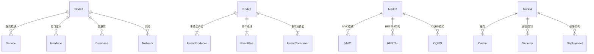

                 

### 第一部分：问题背景

#### 1.1 问题背景

技术架构评审是软件工程和系统开发中的一个关键环节。随着信息技术行业的快速发展，企业的技术架构变得越来越复杂，这给项目的成功实施带来了前所未有的挑战。首先，技术债务（Technical Debt）是一个广泛存在的问题，指的是在软件开发中为了短期利益而采取的低效或妥协的解决方案，这些解决方案可能会在长期导致更多的维护成本和开发难度。技术债务如果不及时处理，会逐渐积累，最终可能引发严重的系统故障、性能下降和安全漏洞。

其次，需求的频繁变更也是现代软件开发中的一个常见问题。客户需求和市场环境的变化导致项目需求不断演变，如果技术架构没有足够的灵活性和适应性，项目很可能会陷入需求变更带来的泥潭，从而导致项目延期、超预算和低质量交付。

此外，技术架构评审的缺乏或不完善也会带来诸多问题。缺乏有效的技术架构评审可能导致以下风险：

1. **系统性能瓶颈**：技术架构设计不合理可能导致系统性能瓶颈，影响用户体验和业务流程。
2. **维护成本增加**：不规范的架构可能导致代码复杂度增加，增加后续维护的难度和成本。
3. **安全漏洞**：不安全的架构设计可能导致系统面临各种安全威胁，如数据泄露、系统入侵等。
4. **项目风险**：技术架构评审不足可能导致项目风险增加，包括项目延期、超预算和质量问题。

综上所述，技术架构评审不仅是确保项目成功的关键环节，更是降低技术债务、适应需求变更、提升系统质量和安全性的有效手段。因此，深入了解和实施有效的技术架构评审至关重要。

#### 1.2 技术架构评审的定义与作用

技术架构评审（Technical Architecture Review，简称TAR）是软件工程和系统开发中的一个关键过程，旨在通过对系统架构的系统性分析和评估，确保架构设计符合业务需求、技术标准和最佳实践。技术架构评审通常包括以下几个方面：

1. **设计评审**：对架构设计文档进行审查，确保设计符合系统需求、技术规范和设计原则。
2. **代码评审**：审查关键代码模块，验证代码质量、可维护性和安全性。
3. **风险评估**：识别和评估架构中的潜在风险，如性能瓶颈、安全漏洞和兼容性问题。
4. **合规性检查**：确保架构设计符合公司政策、行业标准和法律法规要求。

技术架构评审的作用主要体现在以下几个方面：

1. **质量保障**：技术架构评审有助于确保系统架构的设计质量，降低系统故障率和维护成本。
2. **风险管理**：通过评审识别和评估潜在风险，提前制定应对措施，减少项目风险。
3. **知识传递**：评审过程中，架构师和团队成员可以分享经验和知识，提高团队的整体技术水平。
4. **决策支持**：评审结果为项目决策提供数据支持，帮助项目团队在关键环节做出明智的选择。

#### 1.3 技术架构评审的现状与挑战

目前，技术架构评审在各个企业中的应用现状并不尽相同。一些大型的企业，尤其是在金融、电信和互联网等行业，技术架构评审已经成为标准流程，并且有完善的评审机制和流程。然而，在许多中小企业，技术架构评审往往被忽视或执行不力，这主要受到以下几个挑战：

1. **资源不足**：技术架构评审需要专业的评审团队和充足的时间资源，而许多中小企业在这方面存在资源不足的问题。
2. **评审流程不完善**：一些企业的评审流程不规范，评审标准不明确，导致评审效果不佳。
3. **缺乏专业知识**：部分企业的技术人员缺乏架构评审的技能和经验，导致评审过程中无法深入分析问题。
4. **评审频率不足**：技术架构评审通常需要定期进行，但由于时间紧迫和项目压力，评审的频率往往不够，无法及时发现和解决问题。

此外，随着软件架构的复杂度增加，技术架构评审面临的挑战也日益加剧。例如，分布式架构、微服务架构等新兴技术的广泛应用，使得系统架构变得更加复杂，这要求评审人员具备更高的专业知识和更强的分析能力。

综上所述，尽管技术架构评审在保障项目成功和提升系统质量方面具有重要意义，但其现状和挑战也表明，企业需要不断优化评审流程、提升评审团队的专业能力，以应对日益复杂的软件架构挑战。

#### 1.4 问题描述

在技术架构评审的实施过程中，我们常常会遇到一系列问题，这些问题不仅影响了评审的效果，还对项目的顺利进行构成了威胁。以下是技术架构评审中常见的一些问题：

1. **评审频率不足**：由于项目进度紧张，技术架构评审往往被压缩在非常有限的时间内进行，导致评审效果大打折扣。评审频率不足意味着无法及时发现和解决潜在问题，从而增加了项目的风险。

2. **评审参与度低**：技术架构评审通常需要多个部门和角色的参与，但如果团队成员的参与度不高，可能会导致评审流于形式，无法真正达到预期的效果。参与度低可能源于对评审重要性的认识不足、时间安排冲突等原因。

3. **评审标准不明确**：一些企业在进行技术架构评审时，缺乏明确的评审标准和流程，导致评审过程缺乏方向性和一致性。评审标准不明确使得评审人员难以判断架构设计的优劣，从而影响评审的公正性和有效性。

4. **评审内容不全面**：技术架构评审应该覆盖系统设计、代码实现、性能优化、安全性和可维护性等多个方面。然而，在实际评审过程中，往往存在内容不全面的问题，例如忽视性能测试、安全审查等关键环节。

5. **反馈处理不及时**：评审结束后，评审人员的反馈和建议如果没有得到及时处理，可能会被忽视或遗忘。这会导致评审效果大打折扣，无法真正提升系统的质量和可靠性。

6. **技术债务积累**：在快速迭代的开发环境中，技术债务容易积累。如果评审过程中没有有效地识别和解决技术债务问题，技术债务可能会持续增加，影响系统的稳定性和可维护性。

7. **缺乏专业知识**：评审团队中可能缺乏具备足够专业知识和经验的人员，这会导致评审质量不高，无法深入分析和解决复杂的技术问题。

这些问题的存在，不仅影响了技术架构评审的效率和效果，还可能导致项目延期、超预算、质量低下等一系列问题。因此，必须对这些常见问题进行深入分析和有效解决。

#### 1.5 问题解决

为了解决技术架构评审过程中常见的问题，提升评审的效率和效果，我们需要从多个方面进行优化和改进：

1. **提高评审频率**：合理规划项目进度，确保技术架构评审能够定期进行。例如，在项目开发的关键阶段，如需求变更、关键功能实现、系统集成等环节，增加评审的频率。这有助于及时发现和解决问题，减少项目风险。

2. **增强参与度**：提升团队成员对技术架构评审的认识和重视程度，明确评审的重要性和必要性。可以通过培训、会议等形式，让团队成员了解评审的内容和流程，确保每个人都能够积极参与评审。

3. **明确评审标准**：制定明确的评审标准和流程，确保评审过程有据可依。评审标准应包括系统设计、代码质量、性能、安全性、可维护性等多个方面，确保评审内容的全面性和针对性。

4. **全面覆盖评审内容**：在技术架构评审中，应全面覆盖系统设计、代码实现、性能优化、安全性审查、可维护性等多个环节。例如，在性能测试方面，可以引入负载测试、压力测试等工具，确保系统能够稳定运行。

5. **及时处理反馈**：建立完善的反馈处理机制，确保评审结束后，评审人员的反馈和建议能够得到及时处理。可以设立专门的反馈跟踪机制，对反馈事项进行分类、优先级排序，确保高优先级问题得到优先解决。

6. **解决技术债务**：在评审过程中，应特别关注技术债务问题，及时识别和解决技术债务。例如，可以通过重构代码、优化设计等方式，减少技术债务的积累。

7. **提升专业能力**：加强评审团队成员的专业技能和经验积累，可以通过培训、交流、学习等方式，提升团队的整体技术水平。特别是对于新技术的应用和复杂问题的分析，团队成员应具备较强的专业能力和解决问题的能力。

通过这些优化和改进措施，可以有效提升技术架构评审的效率和质量，降低项目风险，确保项目的顺利进行和成功交付。

#### 1.6 技术架构评审的目的

技术架构评审的核心目的是确保系统架构的设计和实现符合业务需求、技术标准和最佳实践，从而提高系统的质量、可靠性和可维护性。具体来说，技术架构评审具有以下几个重要目的：

1. **确保设计符合需求**：通过技术架构评审，可以验证系统设计是否真正满足了业务需求。评审过程中，评审人员会仔细检查架构设计文档，确保设计合理、完整，并且能够有效支持业务功能。

2. **发现和解决潜在问题**：技术架构评审有助于提前发现和解决潜在的设计缺陷、性能瓶颈、安全漏洞等问题。通过系统性的分析和评估，评审团队能够识别出可能影响系统稳定性和可靠性的隐患，并在设计阶段进行修正。

3. **提升系统质量**：技术架构评审有助于提升系统的整体质量，包括代码质量、架构质量、性能质量等。通过评审，可以确保系统设计遵循最佳实践，采用有效的架构风格和模式，从而提高系统的可维护性和可扩展性。

4. **降低项目风险**：技术架构评审是项目管理的重要环节，通过评审可以降低项目风险。评审过程中，评审团队能够识别出项目中的潜在风险，并提出相应的解决方案，确保项目能够按照既定计划和预算顺利进行。

5. **保障项目成功**：技术架构评审是项目成功的关键保障。通过评审，项目团队能够确保系统设计合理、可靠，从而提高项目成功的可能性。同时，评审结果为项目决策提供数据支持，帮助项目团队在关键环节做出明智的选择。

6. **知识传递与团队建设**：技术架构评审不仅是技术和质量管理的过程，也是知识传递和团队建设的过程。在评审过程中，评审人员可以分享各自的经验和见解，提高团队整体的技术水平。同时，评审活动也有助于加强团队成员之间的沟通与合作，提升团队凝聚力。

综上所述，技术架构评审的核心目的是通过系统性的分析和评估，确保系统架构的设计和实现符合业务需求、技术标准和最佳实践，从而提高系统的质量、可靠性和可维护性，保障项目的成功实施。

#### 1.7 技术架构评审的优势

技术架构评审（Technical Architecture Review，简称TAR）在软件开发和系统设计中具有显著的优势，以下是其几个主要方面的具体阐述：

1. **早期发现问题**：技术架构评审通过系统性的分析和评估，可以在项目早期阶段发现潜在的问题，如设计缺陷、性能瓶颈、安全漏洞等。早期的发现问题可以大大降低修复成本，避免在后续开发阶段出现更严重的后果。

2. **提高设计质量**：技术架构评审有助于确保系统设计遵循最佳实践，采用合理的架构风格和模式。评审过程中，评审人员会根据业务需求和行业最佳实践，对架构设计进行审查，从而提升系统的整体质量。

3. **降低技术债务**：技术架构评审能够识别并解决技术债务问题，避免因短期利益而采用的低效或妥协的解决方案。通过评审，可以重构代码、优化设计，减少技术债务的积累，提高系统的可维护性和可扩展性。

4. **提升团队协作**：技术架构评审是一个知识传递和团队建设的过程。在评审过程中，评审人员可以分享经验和见解，促进团队成员之间的沟通和合作，提高团队的整体技术水平。同时，评审活动也有助于加强团队成员之间的信任和凝聚力。

5. **减少项目风险**：通过技术架构评审，项目团队能够识别和评估系统架构中的潜在风险，如性能瓶颈、兼容性问题、安全漏洞等。评审结果为项目决策提供数据支持，帮助项目团队在关键环节做出明智的选择，从而降低项目风险。

6. **确保设计符合需求**：技术架构评审可以确保系统设计真正满足了业务需求。评审人员会仔细检查架构设计文档，验证设计是否合理、完整，并且能够有效支持业务功能。这有助于避免在开发后期因设计问题导致的需求变更和项目延期。

7. **提升系统性能和可靠性**：通过技术架构评审，可以优化系统性能和可靠性。评审过程中，评审人员会关注系统架构的各个方面，如性能、安全性、可维护性等，提出改进建议，确保系统能够稳定、高效地运行。

8. **增强客户满意度**：技术架构评审有助于提高系统的质量和可靠性，从而提升客户满意度。通过确保系统设计符合业务需求、技术标准和最佳实践，技术架构评审有助于提供高质量的软件产品，增强客户对企业的信任和忠诚度。

综上所述，技术架构评审在早期发现问题、提高设计质量、降低技术债务、提升团队协作、减少项目风险、确保设计符合需求、提升系统性能和可靠性等方面具有显著的优势，是保障项目成功和系统稳定运行的关键环节。

#### 1.8 技术架构评审的适用范围

技术架构评审在软件开发和系统设计中具有广泛的适用范围，具体包括以下几个方面：

1. **新项目启动**：在新项目启动阶段，技术架构评审有助于确保项目的整体架构设计符合业务需求和技术标准。通过评审，可以识别出潜在的风险和问题，为项目的成功奠定基础。

2. **重大功能迭代**：在系统进行重大功能迭代或升级时，技术架构评审有助于评估现有架构的适应性，确保新功能能够顺利集成并稳定运行。评审过程中，可以优化设计、重构代码，提高系统的可维护性和扩展性。

3. **遗留系统改造**：对于遗留系统，技术架构评审有助于识别和解决系统中的各种问题，如性能瓶颈、安全漏洞、技术债务等。通过评审，可以制定改造方案，逐步提升系统的质量和可靠性。

4. **跨部门合作项目**：在涉及多个部门或团队的跨部门合作项目中，技术架构评审有助于统一架构设计和开发标准，确保不同模块之间的协调和兼容性。评审活动也可以促进团队成员之间的沟通和协作。

5. **技术调研与选型**：在新技术调研和选型过程中，技术架构评审可以帮助评估不同技术的适用性和优劣，为项目决策提供科学依据。通过评审，可以确定最适合项目需求的技术方案。

6. **项目验收与交付**：在项目验收和交付阶段，技术架构评审有助于确保系统设计符合合同要求和技术标准，避免因设计问题导致的项目验收不通过或后续维护困难。

7. **持续集成与部署**：在持续集成和部署过程中，技术架构评审可以评估系统架构的稳定性和兼容性，确保新版本能够顺利集成并部署到生产环境。

总之，技术架构评审适用于项目的各个阶段和多个场景，通过系统性的分析和评估，确保系统架构的设计和实现符合业务需求、技术标准和最佳实践，从而提高系统的质量、可靠性和可维护性。

#### 1.9 技术架构评审的限制条件

尽管技术架构评审在提升系统质量和可靠性方面具有重要意义，但其应用也受到一些限制条件的影响。以下是一些主要限制条件及其具体影响：

1. **时间资源有限**：技术架构评审需要消耗大量的时间和人力资源，尤其是在复杂的项目中，评审过程可能需要反复进行，这可能导致评审频率不足，从而影响评审的效果。

2. **专业能力要求高**：技术架构评审要求评审团队具备深厚的专业知识和丰富的实践经验，特别是对于新兴技术和复杂架构，评审人员的专业能力直接决定了评审的质量。如果评审团队缺乏足够的专业技能，评审结果可能不准确或无法深入分析问题。

3. **评审标准的灵活性**：尽管制定明确的评审标准有助于提高评审的一致性和公正性，但在实际项目中，需求和环境的变化可能导致评审标准需要灵活调整。如果评审标准过于僵化，可能无法适应项目的动态变化。

4. **评审参与度不足**：技术架构评审需要各个部门和角色的积极参与，但如果团队成员的参与度不高，可能影响评审的效果。参与度不足可能源于对评审的重要性认识不足、时间安排冲突等原因。

5. **技术债务的积累**：在快速迭代的开发环境中，技术债务容易积累。如果评审过程中无法有效识别和解决技术债务问题，技术债务可能会持续增加，影响系统的稳定性和可维护性。

6. **项目压力和优先级冲突**：在项目进度紧张或面临紧急任务时，技术架构评审可能会被压缩或取消，导致评审效果受到影响。此外，项目中的其他任务可能优先于评审，影响评审的时间和资源。

7. **评审流程的复杂性**：技术架构评审涉及多个环节和流程，包括设计评审、代码评审、风险评估等。如果评审流程设计复杂，可能导致评审过程繁琐、效率低下。

综上所述，技术架构评审在实际应用中受到多种限制条件的影响。为了克服这些限制，企业需要制定合理的评审策略，提升评审团队的专业能力，优化评审流程，确保评审能够有效进行，从而保障项目的成功实施。

#### 1.10 边界与外延

技术架构评审的边界与外延是理解其有效应用范围和条件的重要方面。首先，**技术架构评审的边界**在于其适用范围，即仅在涉及系统架构设计、实现和优化的项目中进行。这意味着，技术架构评审并不适用于所有软件开发活动，例如简单的脚本开发或小规模工具编写。此外，技术架构评审的边界还涉及评审的深度和广度，即评审主要集中在系统架构层面，而不涉及具体代码实现细节。

其次，**技术架构评审的外延**包括以下几个方面：

1. **技术债务管理**：技术架构评审应关注技术债务的识别和解决，确保系统设计和实现符合长期维护和扩展的要求。

2. **性能优化**：技术架构评审应评估系统性能，包括响应时间、并发处理能力等，提出性能优化建议。

3. **安全性审查**：技术架构评审应关注系统的安全设计，识别潜在的安全漏洞，并确保系统符合安全标准。

4. **可维护性和可扩展性**：技术架构评审应评估系统设计的可维护性和可扩展性，确保系统能够适应未来需求的变化。

5. **跨部门协作**：技术架构评审应促进不同部门和团队之间的协作，确保系统架构的一致性和协调性。

6. **项目风险管理**：技术架构评审应评估系统架构中的潜在风险，并提出风险管理策略。

总之，理解技术架构评审的边界与外延有助于明确其应用范围和目标，从而确保评审能够有效提升系统的质量和可靠性。

### 第二部分：技术架构评审的基础知识

#### 2.1 技术架构的概念

技术架构（Technical Architecture）是软件开发和系统设计中至关重要的一部分，它定义了系统的结构、组件、接口和交互方式，以确保系统能够高效、可靠地满足业务需求。技术架构不仅仅是一个设计文档，更是整个软件开发过程中的指南，它涵盖了系统设计的方方面面，包括功能、性能、安全性和可维护性。

技术架构的核心概念包括以下几个方面：

1. **系统组件**：系统组件是技术架构中的基本单元，如数据库、应用服务器、Web服务器等。每个组件都有其特定的功能和接口，通过标准化的接口进行通信和协作。

2. **层次结构**：技术架构通常采用层次结构，将系统分为多个层次，如表示层、业务逻辑层和数据层。层次结构有助于实现模块化和解耦，提高系统的可维护性和可扩展性。

3. **模块化**：模块化是技术架构设计的关键原则，通过将系统划分为多个模块，可以降低组件间的耦合度，提高系统的灵活性和可维护性。

4. **接口设计**：接口设计是技术架构中的关键部分，定义了组件之间的通信方式和数据交换格式。良好的接口设计可以确保系统组件之间的协同工作和数据一致性。

5. **标准化**：标准化是技术架构的重要特点，通过定义统一的规范和标准，可以确保系统组件和接口的一致性，提高系统的可维护性和互操作性。

6. **性能优化**：技术架构需要考虑系统的性能优化，包括响应时间、并发处理能力、系统负载等。性能优化可以通过合理的系统设计、优化算法和资源管理来实现。

7. **安全性**：技术架构必须确保系统的安全性，包括数据保护、访问控制和安全审计等。安全性设计应贯穿于整个系统架构中，确保系统在面对各种安全威胁时能够保持稳定和安全。

#### 2.2 技术架构的组成部分

技术架构由多个组成部分构成，每个部分都承担着特定的功能，共同确保系统的整体性能和可靠性。以下是技术架构的主要组成部分：

1. **基础架构**：基础架构包括硬件设备、网络设施、操作系统和中间件等。这些基础设施为系统的运行提供了必要的支持。

2. **软件架构**：软件架构包括应用层、业务逻辑层和数据层等，定义了系统的软件组件、接口和交互方式。软件架构设计直接影响系统的可维护性和可扩展性。

3. **数据架构**：数据架构定义了数据存储、处理和访问的方式，包括数据库设计、数据模型和数据流程。良好的数据架构可以提高系统的数据一致性和性能。

4. **安全架构**：安全架构包括安全策略、安全控制和安全审计等，确保系统的数据和安全不受威胁。安全架构设计应考虑到各种安全威胁和攻击方式，提供全面的安全防护。

5. **应用架构**：应用架构定义了应用组件、接口和交互方式，包括Web应用、移动应用和后台服务等。应用架构设计应满足业务需求，并具有高可扩展性和可维护性。

6. **服务架构**：服务架构包括微服务、SOA（服务导向架构）等，通过服务化组件实现系统的模块化和分布式。服务架构可以提高系统的灵活性和可扩展性。

7. **部署架构**：部署架构定义了系统的部署环境和部署流程，包括服务器配置、网络配置和部署工具等。良好的部署架构可以确保系统的高可用性和快速部署能力。

#### 2.3 架构风格与架构模式

架构风格（Architectural Style）是系统架构的基本设计理念，它为系统架构提供了一套通用的结构和交互模式。常见的架构风格包括：

1. **分层架构**：分层架构将系统划分为多个层次，如表示层、业务逻辑层和数据层。每个层次负责不同的功能，层次之间通过接口进行通信。分层架构提高了系统的可维护性和可扩展性。

2. **事件驱动架构**：事件驱动架构以事件为中心，系统中的组件通过监听和响应事件进行交互。事件驱动架构适用于需要高并发和异步处理的应用场景。

3. **微服务架构**：微服务架构将系统划分为多个独立的微服务，每个微服务负责特定的业务功能。微服务之间通过轻量级的通信协议进行交互，例如RESTful API。微服务架构提高了系统的灵活性和可扩展性。

4. **分布式架构**：分布式架构将系统部署在多个节点上，通过分布式计算和数据存储技术实现高可用性和可扩展性。分布式架构适用于需要处理海量数据和大规模并发场景。

架构模式（Architectural Pattern）是在特定场景下解决系统设计问题的一种通用解决方案。常见的架构模式包括：

1. **MVC（模型-视图-控制器）**：MVC模式将系统分为模型、视图和控制器三个部分，分别负责数据管理、界面展示和业务逻辑处理。MVC模式提高了系统的可维护性和可扩展性。

2. **RESTful架构**：RESTful架构基于HTTP协议，通过URI（统一资源标识符）和HTTP方法（GET、POST、PUT、DELETE等）实现资源的访问和操作。RESTful架构适用于Web应用开发。

3. **事件总线架构**：事件总线架构通过事件总线实现系统组件之间的通信，事件总线充当消息传递的中介。事件总线架构适用于需要高并发和异步处理的系统。

4. **CQRS（命令查询责任分离）**：CQRS模式将系统的命令处理和查询处理分离，命令处理负责修改数据，查询处理负责读取数据。CQRS模式适用于高并发查询和低并发写入的场景。

5. **缓存架构**：缓存架构通过缓存层降低系统对数据库的访问压力，提高系统的响应速度。缓存架构适用于需要频繁访问的热数据场景。

#### 2.4 技术架构要素对比表格

为了更清晰地理解不同技术架构要素之间的差异，我们提供了以下对比表格：

| 要素        | 分层架构         | 事件驱动架构       | 微服务架构       |
| ----------- | --------------- | ----------------- | --------------- |
| 系统层次   | 表示层、业务逻辑层、数据层   | 事件生产者、事件总线、事件消费者   | 独立服务模块       |
| 耦合程度   | 较低（层次间解耦）       | 较高（事件驱动）               | 较低（服务间解耦）   |
| 扩展性     | 高（层次可扩展）        | 高（事件可扩展）               | 高（服务可扩展）   |
| 可维护性   | 高（层次模块化）       | 中（事件复杂度）               | 中（服务模块化）   |
| 通信方式   | 层间通信（接口）       | 事件传递（事件总线）           | HTTP/消息队列（服务间）   |
| 适用于场景 | Web应用、企业应用     | 实时系统、高并发系统           | 分布式系统、复杂业务场景   |

#### 2.5 架构要素的Mermaid ER实体关系图

为了更直观地展示技术架构要素之间的关系，我们使用Mermaid绘制了ER（实体关系）图，如下所示：



在上面的ER图中，Node1代表了基础架构要素，如节点、服务、接口、数据库和网络；Node2代表了事件驱动架构的要素，如事件生产者、事件总线和事件消费者；Node3代表了不同的架构模式，如MVC、RESTful和CQRS；Node4则代表了与架构相关的重要组成部分，如缓存、安全控制和部署架构。通过ER图，我们可以更清晰地理解各个要素之间的关系和相互作用。

#### 2.6 技术架构的核心概念

技术架构的核心概念包括组件、层次、模块化、接口设计、性能优化和安全性。这些概念不仅定义了系统的结构，还确保了系统的可维护性、可扩展性和可靠性。

1. **组件**：组件是技术架构中的基本单元，如数据库、应用服务器和Web服务器。每个组件都有其特定的功能和接口，通过标准化的接口进行通信和协作。

2. **层次**：层次结构将系统划分为多个层次，如表示层、业务逻辑层和数据层。层次结构有助于实现模块化和解耦，提高系统的可维护性和可扩展性。

3. **模块化**：模块化通过将系统划分为多个模块，降低组件间的耦合度，提高系统的灵活性和可维护性。模块化设计使得系统的各个部分可以独立开发、测试和部署。

4. **接口设计**：接口设计定义了组件之间的通信方式和数据交换格式。良好的接口设计可以确保系统组件之间的协同工作和数据一致性，同时降低系统的复杂度。

5. **性能优化**：性能优化是技术架构设计的重要一环，通过优化算法、缓存策略和资源管理，确保系统在处理高并发和大量数据时仍能保持高效运行。

6. **安全性**：安全性设计确保系统的数据和安全不受威胁。这包括数据加密、访问控制和安全审计等，通过全面的安全措施，提高系统的可靠性和安全性。

这些核心概念共同作用，确保技术架构能够高效、可靠地支持业务需求，提高系统的整体质量和用户体验。

### 第三部分：技术架构评审的流程与方法

#### 3.1 技术架构评审的流程

技术架构评审是一个系统性的过程，包括预审阶段、审核阶段和反馈阶段，每个阶段都有其特定的任务和目标。

1. **预审阶段**：预审阶段是技术架构评审的初始阶段，主要任务是对待评审的架构文档进行初步检查，确保文档的完整性和一致性。预审阶段通常包括以下步骤：

   - **文档准备**：确保架构设计文档、需求文档和相关的技术规格书等资料齐全。
   - **初步审查**：对文档进行初步审查，检查文档的结构、格式和内容是否符合规范。
   - **识别问题**：识别文档中的潜在问题，如设计不合理、描述不清晰、逻辑错误等。

2. **审核阶段**：审核阶段是技术架构评审的核心环节，主要任务是对架构设计进行深入分析和评估。审核阶段通常包括以下步骤：

   - **制定评审计划**：根据项目需求和架构特点，制定详细的评审计划，包括评审时间、评审内容、评审人员和评审方法等。
   - **评审会议**：召开评审会议，评审人员对架构设计进行讨论和评估。评审会议可以采用面对面会议、视频会议或在线评审等多种形式。
   - **详细审查**：对架构设计文档进行详细审查，包括系统架构图、模块划分、接口定义、性能分析、安全设计等。
   - **评估结果**：根据评审发现的问题和意见，对架构设计进行评估，判断其是否符合业务需求、技术标准和最佳实践。

3. **反馈阶段**：反馈阶段的主要任务是处理评审过程中发现的问题，并给出改进建议。反馈阶段通常包括以下步骤：

   - **问题整理**：整理评审过程中发现的问题，并按照严重程度和优先级进行分类。
   - **制定改进计划**：根据问题清单，制定详细的改进计划，包括改进措施、责任人和时间表。
   - **实施改进**：根据改进计划，对架构设计进行修改和完善，确保问题得到有效解决。
   - **再次评审**：在改进完成后，进行再次评审，验证改进措施是否有效，确保架构设计达到预期目标。

通过以上三个阶段的流程，技术架构评审可以系统性地发现和解决架构设计中的问题，提高系统的质量和可靠性。

#### 3.2 审核小组会议

审核小组会议是技术架构评审过程中至关重要的一环，它提供了一个平台，让评审人员能够集中讨论和评估架构设计的各个方面。以下是审核小组会议的详细步骤和注意事项：

1. **会议准备**：

   - **确定评审目标**：明确评审的目标和范围，确保评审内容全面且聚焦关键问题。
   - **准备评审资料**：确保所有评审文档（如架构设计文档、需求文档、性能分析报告等）准备齐全，并在会议前分发给评审人员。
   - **安排会议议程**：制定详细的会议议程，包括每个议题的讨论时间、评审内容、主持人等。

2. **会议步骤**：

   - **开场致辞**：主持人简要介绍会议的目的、议程和评审流程，确保所有评审人员明确会议目标。
   - **文档审查**：评审人员逐一审查评审资料，记录发现的问题和意见。
   - **议题讨论**：针对每个议题，评审人员进行深入讨论，分析问题的根源和可能的解决方案。
   - **投票决策**：对于重要问题，可以采取投票方式进行决策，确保决策的公正性和一致性。
   - **总结反馈**：会议结束时，主持人对评审结果进行总结，并提出改进建议和后续行动项。

3. **注意事项**：

   - **确保评审人员具备专业知识**：评审人员应具备相关的技术背景和经验，能够深入理解架构设计和业务需求。
   - **注重沟通和协作**：评审过程中，应鼓励评审人员积极发言和交流，确保各方意见充分表达和讨论。
   - **避免个人偏见**：评审过程中，应避免个人偏见和主观判断，确保评审结果客观、公正。
   - **记录和跟踪问题**：会议结束后，应及时记录评审中发现的问题和改进建议，并跟踪问题的解决进度。
   - **定期回顾和总结**：定期回顾和总结评审过程和结果，不断完善评审流程和提升评审效果。

通过科学的审核小组会议，技术架构评审能够更加高效地发现和解决问题，确保系统架构的设计质量和可靠性。

#### 3.3 一对一评审

一对一评审是技术架构评审过程中的一种重要形式，它通过个别交流的方式，对架构设计进行深入分析和评估。以下是关于一对一评审的详细步骤和建议：

1. **评审前准备**：

   - **确定评审对象**：明确需要评审的架构设计内容，确保评审目标明确。
   - **准备评审材料**：准备相关的架构设计文档、需求文档、技术规格书等，并确保评审人员能够随时查阅。
   - **预约时间**：提前与评审人员预约时间，确保评审过程的连续性和专注度。

2. **评审步骤**：

   - **开场介绍**：简要介绍评审的目的、内容和期望的成果，确保评审人员对评审有清晰的认识。
   - **问题提出**：评审人员根据前期准备，逐条提出问题，如设计合理性、接口一致性、性能优化等。
   - **问题讨论**：针对提出的问题，评审人员和架构师进行深入讨论，分析问题的根源和可能的解决方案。
   - **方案建议**：根据讨论结果，评审人员提出具体的改进建议，如重构设计、优化代码、增加安全措施等。
   - **总结记录**：会议结束时，对评审结果进行总结，记录发现的问题和建议，确保后续能够跟踪和实施。

3. **评审建议**：

   - **确保评审人员具备专业知识和经验**：评审人员应具备深厚的专业背景和丰富的实践经验，能够准确识别和评估架构设计中的问题。
   - **鼓励架构师积极参与**：架构师应主动参与一对一评审，积极回答评审人员的问题，提供详细的解释和方案。
   - **注重沟通和交流**：评审过程中，应鼓励双方进行充分沟通和交流，确保意见的充分表达和讨论。
   - **记录和跟踪评审结果**：及时记录评审发现的问题和建议，并跟踪问题的解决进度，确保改进措施得到有效实施。
   - **定期回顾和总结**：定期回顾和总结一对一评审的过程和结果，不断完善评审流程和方法，提高评审质量。

通过有效的一对一评审，可以更加深入地发现和解决问题，提升架构设计质量和系统可靠性。

#### 3.4 自动化工具支持

在技术架构评审过程中，自动化工具的支持可以显著提高评审的效率和质量。以下是一些常见的自动化工具及其使用方法：

1. **静态代码分析工具**：

   - **SonarQube**：SonarQube是一种静态代码分析工具，它可以扫描代码，发现潜在的安全漏洞、代码质量问题和设计缺陷。使用方法包括：集成到持续集成（CI）流程中，定期运行代码扫描，并根据扫描结果进行改进。
   - **Checkstyle**：Checkstyle用于检查Java代码的编码规范，确保代码风格一致、易于维护。使用方法包括：配置Checkstyle规则，集成到开发环境中，实时检查代码，并根据规则进行格式化修正。

2. **动态代码分析工具**：

   - **JUnit**：JUnit是Java的单元测试框架，用于编写和执行单元测试，确保代码功能正确。使用方法包括：编写测试用例，集成到CI流程中，定期运行测试，并根据测试结果进行代码优化。
   - **Selenium**：Selenium是一种自动化测试工具，用于编写Web应用的自动化测试脚本。使用方法包括：编写测试脚本，集成到CI流程中，定期运行自动化测试，确保Web应用的稳定性和可靠性。

3. **性能测试工具**：

   - **JMeter**：JMeter用于模拟高并发用户访问，进行性能测试，评估系统的响应时间和负载能力。使用方法包括：设计测试场景，配置测试计划，运行测试，分析测试结果。
   - **LoadRunner**：LoadRunner是业界广泛使用的性能测试工具，用于模拟真实用户访问，进行系统性能测试。使用方法包括：设计测试脚本，配置测试计划，运行测试，生成性能报告。

4. **文档生成工具**：

   - **Doxygen**：Doxygen是一种文档生成工具，用于生成程序代码的文档，包括函数说明、类层次结构、模块依赖关系等。使用方法包括：配置Doxygen配置文件，运行Doxygen生成文档，更新和维护文档。
   - **Markdown**：Markdown是一种轻量级的文本标记语言，用于编写和格式化文档。使用方法包括：编写Markdown文档，使用Markdown编辑器（如Typora、VS Code等）进行编辑，生成HTML、PDF等格式的文档。

通过使用这些自动化工具，技术架构评审过程可以更加高效、自动化，减少人工错误，提高评审质量和效率。自动化工具的使用不仅减轻了评审人员的工作负担，也为持续改进和优化技术架构提供了有力支持。

#### 3.5 提高评审效率

在技术架构评审过程中，如何提高评审效率是一个关键问题。以下是一些具体的方法和策略：

1. **制定详细的评审计划**：在评审前，应制定详细的评审计划，明确评审的目标、内容、时间安排和责任分配。评审计划应包括评审的各个阶段，如预审、审核和反馈阶段，确保评审流程有序进行。

2. **使用自动化工具**：利用自动化工具可以显著提高评审效率。例如，使用静态代码分析工具（如SonarQube）可以自动检测代码中的问题，使用动态代码分析工具（如JUnit）可以自动执行单元测试。这些工具可以减少人工审查的工作量，提高评审的准确性和效率。

3. **提前准备评审材料**：在评审前，确保所有的评审材料（如架构设计文档、需求文档、性能分析报告等）准备齐全，并提前分发给评审人员。这样可以减少评审会议中的资料查找和讨论时间，提高会议的效率。

4. **合理安排评审时间**：合理安排评审时间，避免评审会议与其他重要任务的冲突。可以采用分阶段评审的方式，例如在项目初期、中期和末期分别进行评审，确保评审能够在关键阶段进行，及时发现和解决问题。

5. **明确评审重点**：在评审过程中，应明确评审的重点和关键问题。可以提前列出评审清单，确保评审内容全面且聚焦关键问题。例如，重点审查系统的性能、安全性和可维护性等方面。

6. **加强沟通与协作**：加强评审过程中的沟通与协作，确保评审人员能够充分表达意见和讨论问题。可以采用多种沟通方式，如面对面会议、视频会议和在线评审等，提高评审的互动性和效率。

7. **简化评审流程**：简化评审流程，避免冗余和重复的工作。例如，可以制定统一的评审标准和流程，确保评审的一致性和效率。此外，可以引入敏捷评审方法，如Scrum的Sprint评审，确保评审过程紧凑且有效。

8. **定期回顾和总结**：定期回顾和总结评审过程和结果，分析评审中的问题和改进点，不断完善评审流程和方法。这样可以提高评审的持续改进能力，确保评审效率的不断提升。

通过以上策略，可以有效提高技术架构评审的效率，确保评审工作有序、高效地进行，从而提升系统的质量和可靠性。

#### 3.6 降低评审成本

在技术架构评审过程中，如何降低评审成本是许多企业关注的问题。以下是一些具体的方法和策略：

1. **优化评审流程**：通过简化评审流程和减少冗余步骤，可以降低评审成本。例如，可以制定统一的评审标准和模板，避免重复性的工作。此外，可以引入敏捷评审方法，如Scrum的Sprint评审，确保评审过程紧凑且高效。

2. **自动化工具**：引入自动化工具可以显著降低评审成本。例如，使用静态代码分析工具（如SonarQube）可以自动检测代码中的问题，减少人工审查的工作量。动态代码分析工具（如JUnit）和性能测试工具（如JMeter）也可以提高评审效率。

3. **合理安排评审时间**：合理安排评审时间，避免评审会议与其他重要任务的冲突，可以减少因协调问题导致的额外成本。例如，可以采用分阶段评审的方式，确保评审在关键阶段进行，避免评审时间浪费。

4. **集中资源**：集中资源进行评审，避免资源分散导致成本增加。例如，可以组建专业的评审团队，统一管理和协调评审工作，提高评审效率。

5. **减少文档工作量**：通过减少文档工作量，可以降低评审成本。例如，可以采用简洁明了的文档格式，减少冗余的描述和说明，确保评审材料简洁、实用。

6. **明确评审重点**：在评审过程中，明确评审的重点和关键问题，避免无谓的广泛讨论，可以减少评审时间和成本。例如，可以提前列出评审清单，确保评审内容全面且聚焦关键问题。

7. **培训评审人员**：通过培训评审人员，提高他们的专业水平和评审能力，可以减少评审中的错误和重复工作，从而降低评审成本。

8. **定期回顾和总结**：定期回顾和总结评审过程和结果，分析评审中的问题和改进点，可以减少重复问题，提高评审质量和效率，从而降低长期评审成本。

通过以上策略，可以有效降低技术架构评审的成本，提高评审的性价比，为企业节省资源和资金。

#### 3.7 提高评审质量

提高技术架构评审的质量是确保系统设计和实现符合业务需求、技术标准和最佳实践的关键。以下是一些具体的方法和策略：

1. **明确评审目标**：在评审前，明确评审的具体目标和标准，确保评审内容聚焦关键问题。例如，可以制定详细的评审指标，包括性能、安全性、可维护性和可扩展性等。

2. **专业评审团队**：组建专业的评审团队，确保评审人员具备深厚的专业背景和丰富的实践经验。团队成员应包括架构师、开发人员、测试人员和业务分析师等，以确保评审的全面性和专业性。

3. **系统化评审流程**：建立系统化的评审流程，确保评审过程有序、规范。可以制定统一的评审标准和模板，避免评审过程中的主观性和随意性。

4. **深入分析和评估**：在评审过程中，评审人员应深入分析和评估系统设计，发现潜在的问题和风险。可以采用多种评审方法，如文档审查、代码审查、会议评审和自动化测试等，提高评审的深度和广度。

5. **加强沟通与协作**：评审过程中，加强评审人员之间的沟通与协作，确保各方意见充分表达和讨论。可以通过面对面会议、视频会议和在线评审等多种形式，提高评审的互动性和效率。

6. **定期回顾和总结**：定期回顾和总结评审过程和结果，分析评审中的问题和改进点，不断完善评审流程和方法。可以通过知识分享、经验交流等方式，提高评审团队的整体水平。

7. **使用辅助工具**：使用自动化工具和辅助工具可以提高评审质量。例如，使用静态代码分析工具可以自动检测代码中的问题，使用动态代码分析工具可以自动执行单元测试，提高评审的准确性和效率。

8. **持续改进**：通过持续改进评审流程和方法，提高评审质量。可以引入最佳实践和行业经验，不断优化评审过程，确保评审工作的高效性和准确性。

通过以上策略，可以有效提高技术架构评审的质量，确保系统架构的设计和实现达到预期目标，提升项目的整体成功率和系统质量。

### 第四部分：技术架构评审的最佳实践

#### 4.1 企业级技术架构评审实践

在企业级项目中，技术架构评审是一个复杂且系统性的工程，需要结合企业的实际情况和项目特点，制定合适的评审策略和流程。以下是几个企业级技术架构评审的最佳实践：

1. **建立统一的评审标准和流程**：企业应制定统一的评审标准和流程，明确评审的目标、内容、方法和责任分配。评审标准和流程应覆盖系统设计、代码实现、性能优化、安全性和可维护性等多个方面，确保评审内容全面且具有一致性。

2. **组建专业的评审团队**：企业应组建专业的评审团队，确保团队成员具备深厚的专业背景和丰富的实践经验。团队成员应包括架构师、开发人员、测试人员、业务分析师和安全专家等，以确保评审的全面性和专业性。

3. **定期进行技术架构评审**：企业应制定定期进行技术架构评审的计划，确保在项目的关键阶段和重要迭代中进行评审。例如，在项目启动、中期和末期，以及每个迭代结束时，都应进行技术架构评审，及时发现和解决问题。

4. **采用多层次的评审方法**：企业可以采用多层次的评审方法，包括文档审查、代码审查、会议评审和自动化测试等。文档审查可以确保设计文档的完整性和准确性，代码审查可以检测代码质量和安全性，会议评审可以集中讨论和解决关键问题，自动化测试可以验证系统的性能和稳定性。

5. **重视评审反馈和改进**：评审结束后，企业应重视评审反馈和改进措施的落实。可以建立反馈跟踪机制，确保评审人员的反馈和建议能够得到及时处理和落实。同时，应定期回顾和总结评审过程和结果，不断优化评审流程和方法，提高评审效果。

6. **结合敏捷开发进行评审**：在敏捷开发模式下，企业应结合Scrum、Kanban等敏捷方法论进行技术架构评审，确保评审过程灵活且高效。例如，可以采用Sprint评审，确保在每个Sprint周期结束时进行技术架构评审，及时调整和优化架构设计。

7. **利用自动化工具提升效率**：企业应充分利用自动化工具提升评审效率，例如，使用静态代码分析工具、动态代码分析工具、性能测试工具和文档生成工具等。这些工具可以减少人工工作，提高评审的准确性和效率。

8. **培养团队协作和知识共享**：企业应鼓励团队协作和知识共享，通过培训、研讨会和知识分享会等形式，提高评审团队的整体技术水平。团队间的协作和知识共享有助于提高评审质量，减少误解和重复工作。

通过以上实践，企业可以有效地提高技术架构评审的质量和效率，确保系统架构的设计和实现达到预期目标，从而提升项目的成功率和系统质量。

#### 4.2 企业级架构评审的关键因素

在企业级架构评审过程中，以下几个关键因素是确保评审成功和项目成功的关键：

1. **评审团队的组建**：企业级架构评审需要一支专业且多样化的评审团队。团队成员应包括架构师、开发人员、测试人员、业务分析师和安全专家等，以确保评审的全面性和专业性。团队的多样化有助于从不同角度审视和评估架构设计，提高评审质量。

2. **评审标准的制定**：制定明确的评审标准是确保架构评审有效性的基础。评审标准应涵盖系统设计、代码实现、性能、安全性、可维护性和可扩展性等多个方面，确保评审内容全面且具有一致性。标准应基于最佳实践和企业的具体需求制定，确保评审结果具有实际指导意义。

3. **评审流程的优化**：企业级架构评审流程应优化，确保评审高效且有序进行。可以采用分阶段评审的方法，如预审、审核和反馈阶段，每个阶段都有明确的任务和目标。此外，应引入敏捷评审方法，如Scrum的Sprint评审，确保评审与项目进度紧密衔接。

4. **评审方法的多样化**：企业级架构评审应采用多样化的评审方法，包括文档审查、代码审查、会议评审和自动化测试等。多样化的评审方法有助于发现不同类型的问题，提高评审的深度和广度。

5. **沟通和协作**：评审过程中，确保评审人员之间的沟通和协作是至关重要的。通过面对面会议、视频会议和在线评审等形式，加强评审人员之间的交流和讨论，确保意见的充分表达和讨论。

6. **反馈和改进**：评审结束后，及时处理评审反馈和改进建议，确保问题得到有效解决。可以建立反馈跟踪机制，确保评审人员的反馈和建议能够得到及时处理和落实。

7. **持续改进**：通过定期回顾和总结评审过程和结果，不断优化评审流程和方法，提高评审质量和效率。可以引入最佳实践和行业经验，不断改进评审过程。

通过关注以上关键因素，企业可以有效地提高企业级架构评审的质量和效率，确保系统架构的设计和实现达到预期目标，从而提升项目的成功率和系统质量。

#### 4.3 企业级架构评审的案例分析

以下是一个关于企业级架构评审的成功案例分析，展示了如何在复杂项目中通过有效的技术架构评审实现项目目标。

**案例背景**：

某大型互联网公司正在开发一款面向企业客户的数据分析平台。该平台需要处理海量数据，支持复杂的查询和分析，同时具备高可用性和高可靠性。项目团队由多个部门组成，包括数据工程师、后端开发人员、前端开发人员和测试人员。

**问题与挑战**：

1. **复杂的技术架构**：项目涉及多种技术栈，包括大数据处理、云计算、数据库、前端框架等，技术架构复杂，难以全面掌控。
2. **频繁的需求变更**：企业客户需求多变，项目需求频繁变更，需要灵活的架构设计以适应需求变化。
3. **性能和稳定性要求高**：数据分析平台需要处理海量数据，同时保证响应时间和系统稳定性，性能和稳定性是关键挑战。
4. **团队协作困难**：项目团队分布在不同的城市，团队间的沟通和协作面临挑战。

**解决方案**：

1. **建立专业的评审团队**：项目组成立了一个由资深架构师、数据工程师、开发人员和测试人员组成的评审团队。团队成员具备丰富的技术背景和项目经验，能够从不同角度审视和评估架构设计。

2. **制定详细的评审标准和流程**：根据项目的具体需求和挑战，评审团队制定了详细的评审标准和流程，包括系统设计、代码实现、性能优化、安全性和可维护性等方面的评审内容。评审标准基于最佳实践和公司的具体需求制定。

3. **多层次的评审方法**：项目采用了文档审查、代码审查、会议评审和自动化测试等多种评审方法。文档审查确保设计文档的完整性和准确性，代码审查检测代码质量和安全性，会议评审集中讨论和解决关键问题，自动化测试验证系统的性能和稳定性。

4. **定期进行技术架构评审**：项目在每个关键阶段（如项目启动、中期和末期）以及每个迭代结束时进行技术架构评审。评审过程注重沟通和协作，确保评审人员充分表达意见和讨论问题。

5. **优化评审流程**：评审团队不断优化评审流程，引入敏捷评审方法，如Scrum的Sprint评审，确保评审与项目进度紧密衔接。此外，评审团队利用自动化工具（如静态代码分析工具、性能测试工具等）提高评审效率。

6. **重视评审反馈和改进**：评审结束后，评审团队及时处理评审反馈和改进建议，确保问题得到有效解决。通过建立反馈跟踪机制，确保评审人员的反馈和建议能够得到及时处理和落实。

**结果与效果**：

1. **架构设计优化**：通过多次技术架构评审，项目团队发现并解决了多个设计缺陷和性能瓶颈，优化了系统的架构设计，提高了系统的可扩展性和可维护性。

2. **需求变更适应**：灵活的架构设计能够快速适应企业客户的需求变更，确保项目进度不受影响。

3. **性能和稳定性提升**：通过性能测试和优化，数据分析平台在处理海量数据时仍能保持高效运行，系统响应时间和稳定性显著提升。

4. **团队协作增强**：通过有效的评审流程和方法，团队间的沟通和协作得到加强，项目团队的整体技术水平得到提升。

5. **项目成功交付**：技术架构评审确保了项目能够按期交付，达到了客户的期望和满意度。

通过以上解决方案和措施，该企业级架构评审案例成功实现了项目目标，展示了技术架构评审在复杂项目中的重要作用。

#### 4.4 团队级技术架构评审实践

团队级技术架构评审是中小型团队在项目开发过程中经常采用的评审形式，它通过集中讨论和系统评估，确保架构设计符合业务需求、技术标准和最佳实践。以下是团队级技术架构评审的一些实践经验：

1. **明确评审目标和范围**：在开始团队级技术架构评审之前，首先需要明确评审的目标和范围。评审目标应包括验证系统设计是否符合业务需求、技术规范和最佳实践，识别潜在的问题和风险。评审范围应涵盖架构设计、代码实现、性能优化、安全性和可维护性等方面。

2. **组建多角色的评审团队**：团队级技术架构评审应组建由多角色成员组成的评审团队，包括架构师、开发人员、测试人员、产品经理和安全专家等。团队成员的多样化有助于从不同角度审视和评估架构设计，提高评审的全面性和准确性。

3. **制定详细的评审计划**：为了确保评审过程有序、高效，团队应制定详细的评审计划，包括评审的时间、地点、议程、参与人员和评审内容等。评审计划应考虑到项目的具体需求和进度安排，确保评审能够在关键阶段进行。

4. **使用多样化的评审方法**：团队级技术架构评审可以采用多种评审方法，如文档审查、代码审查、会议评审和自动化测试等。文档审查可以确保设计文档的完整性和准确性，代码审查可以检测代码质量和安全性，会议评审可以集中讨论和解决关键问题，自动化测试可以验证系统的性能和稳定性。

5. **确保充分的沟通和协作**：评审过程中，团队应确保充分的沟通和协作。可以通过面对面会议、视频会议或在线评审等多种形式，加强评审人员之间的交流和讨论，确保各方意见得到充分表达和讨论。

6. **及时记录和反馈**：评审过程中，团队应及时记录发现的问题和建议，并形成详细的评审报告。评审报告应包括问题列表、优先级、责任人和解决时间表，确保评审结果得到有效跟踪和落实。

7. **持续改进评审流程**：评审结束后，团队应总结评审过程中的经验和教训，持续改进评审流程和方法。可以引入最佳实践和行业经验，优化评审流程，提高评审效果。

通过以上实践经验，团队级技术架构评审可以确保架构设计的质量和可靠性，提高项目的成功率和系统质量。

#### 4.5 团队级架构评审的挑战

在团队级技术架构评审过程中，虽然可以通过一系列实践提高评审质量，但仍面临诸多挑战。以下是一些主要挑战及其解决策略：

1. **时间资源有限**：

   - **挑战**：团队级项目通常具有较短的时间周期，评审过程可能会受到时间限制，导致评审深度不足。
   - **解决策略**：优先安排评审时间，确保评审在项目的关键阶段进行。可以采用分阶段、分层次的评审方法，逐步深入，提高评审的效率和质量。

2. **团队成员专业水平参差不齐**：

   - **挑战**：团队成员可能缺乏架构评审的专业知识和经验，导致评审流于形式，无法发现深层次问题。
   - **解决策略**：加强团队成员的培训和经验分享，提高整体评审能力。可以邀请外部专家进行指导和培训，提升团队的评审水平。

3. **评审参与度不高**：

   - **挑战**：部分团队成员可能对评审缺乏重视，参与度不高，导致评审效果不佳。
   - **解决策略**：明确评审的重要性和必要性，通过激励机制提高团队成员的参与度。可以设立评审积分制度，对积极参与评审的成员给予奖励。

4. **评审标准不统一**：

   - **挑战**：不同团队成员可能对评审标准有不同的理解和执行方式，导致评审结果不一致。
   - **解决策略**：制定明确的评审标准和流程，确保评审过程有据可依。通过培训统一团队成员对评审标准的理解，提高评审的一致性。

5. **评审频率不足**：

   - **挑战**：由于项目进度紧张，评审频率可能不足，导致无法及时发现和解决问题。
   - **解决策略**：合理规划项目进度，确保评审能够定期进行。可以通过制定详细的评审计划，将评审嵌入到项目的每个迭代中，提高评审的频率。

6. **沟通和协作困难**：

   - **挑战**：团队分布在不同的地理位置，评审过程中的沟通和协作可能面临困难。
   - **解决策略**：采用多种沟通方式，如视频会议、即时通讯工具等，确保评审过程的顺畅。可以设置固定的评审时间和议程，提高团队协作效率。

通过上述策略，可以有效应对团队级架构评审过程中面临的挑战，提高评审的质量和效果。

#### 4.6 团队级架构评审的策略

为了确保团队级架构评审能够高效、有序地进行，并达到预期目标，以下是几个关键策略：

1. **明确评审目标**：在开始评审之前，首先要明确评审的具体目标和范围。这包括确定评审需要评估的关键领域（如性能、安全性、可维护性等），确保评审内容具有针对性和全面性。评审目标应与项目需求和业务目标紧密关联，确保评审结果能够实际指导项目实施。

2. **组建专业的评审团队**：评审团队的组建是确保评审质量的关键。团队成员应包括具备丰富经验和专业知识的架构师、开发人员、测试人员、产品经理等。此外，根据项目需求，可以邀请外部专家参与评审，提供独立的第三方视角。专业的评审团队能够从多个角度全面评估架构设计，提高评审的准确性和有效性。

3. **制定详细的评审计划**：评审计划是确保评审过程有序进行的基石。评审计划应包括评审的时间、地点、议程、参与人员和评审内容等。详细计划有助于明确评审的重点和任务，确保评审活动有组织、有目标地进行。此外，评审计划应考虑到项目的进度安排，避免评审与项目关键任务的冲突。

4. **采用多样化的评审方法**：评审过程中，可以采用多种方法，如文档审查、代码审查、会议评审和自动化测试等。多样化的评审方法有助于从不同层面和角度发现和解决问题，提高评审的全面性和深度。例如，文档审查可以确保设计文档的完整性和准确性，代码审查可以检测代码质量和安全性，会议评审可以集中讨论和解决关键问题。

5. **确保沟通和协作**：评审过程中，确保评审人员之间的沟通和协作至关重要。可以通过面对面会议、视频会议和在线评审等多种形式，加强评审人员之间的交流和讨论，确保各方意见得到充分表达和讨论。此外，可以建立反馈机制，确保评审人员的反馈和建议能够得到及时处理和落实。

6. **重视评审反馈和改进**：评审结束后，应重视评审反馈的总结和改进。评审团队应分析评审中发现的问题和改进点，制定详细的改进计划，确保问题得到有效解决。同时，应定期回顾评审过程和结果，不断优化评审流程和方法，提高评审效果。

通过以上策略，可以有效提高团队级架构评审的质量和效率，确保架构设计符合业务需求、技术标准和最佳实践，从而提升项目的成功率和系统质量。

#### 4.7 项目级技术架构评审实践

项目级技术架构评审在项目开发过程中起着至关重要的作用，它通过系统性的评估和优化，确保项目的技术架构设计符合业务需求、技术标准和最佳实践。以下是项目级技术架构评审的一些具体实践：

1. **项目启动时的评审**：在项目启动阶段，进行初步的技术架构评审，确保项目的基本架构设计符合业务需求和项目目标。评审内容应包括系统设计概要、技术选型、系统性能预估、安全性和可维护性评估等。通过初步评审，可以及早发现潜在的设计缺陷和风险，为项目顺利开展奠定基础。

2. **中期评审**：在中期阶段，进行技术架构的中期评审，重点评估项目的架构设计是否随着项目进展和需求变更进行调整和优化。中期评审应关注系统功能实现、模块划分、接口设计、性能优化、安全性审查等方面，确保架构设计能够适应项目的动态变化。

3. **迭代评审**：在项目的每个迭代结束时，进行技术架构的迭代评审，评估当前迭代中实现的架构模块是否达到预期目标，并讨论下一迭代的技术架构规划。迭代评审有助于确保项目按照既定计划进行，及时发现和解决问题，避免项目偏离轨道。

4. **项目验收评审**：在项目验收阶段，进行最终的技术架构评审，确保项目的最终架构设计符合合同要求和技术标准。验收评审应全面检查系统功能、性能、安全性、可维护性等，确保系统交付的质量和稳定性。通过验收评审，项目团队能够确保项目能够顺利通过客户验收。

5. **性能测试评审**：在关键功能实现和性能优化环节，进行性能测试评审，确保系统在高负载和并发场景下能够稳定运行。性能测试评审应包括负载测试、压力测试和稳定性测试等，通过评审可以发现性能瓶颈和优化点，提升系统的性能和可靠性。

6. **安全审查评审**：在进行系统开发的同时，进行安全审查评审，确保系统设计符合安全标准和要求。安全审查评审应涵盖数据加密、访问控制、安全审计等方面，通过评审可以识别潜在的安全漏洞，并提出改进措施，确保系统的安全性。

7. **文档和标准评审**：在整个项目周期中，定期评审项目文档和技术标准，确保文档的完整性和一致性。文档评审应包括设计文档、用户手册、测试文档等，通过评审可以确保文档的准确性和可用性，提高项目的可维护性和可扩展性。

通过以上实践，项目级技术架构评审能够系统性地评估和优化项目的技术架构，确保项目在各个阶段都能够达到预期的技术目标，从而提高项目的成功率和系统质量。

#### 4.8 项目级架构评审的重点

在项目级架构评审过程中，确保评审的质量和效果是项目成功的关键。以下是一些项目级架构评审的重点，这些重点能够帮助评审团队全面评估技术架构的各个方面：

1. **需求与架构的匹配度**：评审团队需要仔细核对系统架构设计是否完全满足业务需求，确保架构设计能够有效支持业务功能。重点关注功能完整性、业务流程处理、用户界面交互等方面。

2. **技术选型的合理性**：评审团队应对所选用的技术栈和技术方案进行深入评估，确保其适用于项目需求，具备良好的性能、可靠性和可维护性。需要特别关注技术选型是否符合公司的长期战略和技术路线。

3. **模块化与解耦**：评审团队应评估架构设计的模块化程度和组件间的耦合度，确保系统设计具有良好的模块化，降低组件间的依赖性。模块化和解耦可以提高系统的可维护性和可扩展性。

4. **性能和可扩展性**：评审团队应重点评估系统的性能和可扩展性，确保系统在高并发和大规模数据场景下能够稳定运行。需要关注系统的响应时间、负载能力、水平扩展策略等。

5. **安全性和合规性**：评审团队应检查系统设计是否符合安全标准和法律法规要求，包括数据保护、访问控制、安全审计等方面。确保系统在面对各种安全威胁时能够保持稳定和安全。

6. **可维护性和可测试性**：评审团队应评估系统的可维护性和可测试性，确保代码质量高、文档齐全、测试覆盖全面。这有助于降低后续维护成本，提高系统的稳定性和可靠性。

7. **团队协作和沟通**：评审团队应关注团队内部的协作和沟通情况，确保团队成员能够有效协作，共同推动项目进展。良好的团队协作和沟通可以提高项目的执行效率，减少误解和冲突。

通过关注以上重点，项目级架构评审能够全面评估系统的技术架构，确保架构设计符合业务需求、技术标准和最佳实践，从而提高项目的成功率和系统质量。

#### 4.9 项目级架构评审的流程优化

为了提高项目级架构评审的效率和质量，可以采取以下流程优化措施：

1. **提前规划**：在项目启动阶段，提前制定详细的评审计划，明确评审的时间节点、参与人员、评审内容和评审标准。提前规划有助于确保评审活动有序进行，减少因临时准备导致的延误。

2. **敏捷评审**：引入敏捷评审方法，如Scrum的Sprint评审，确保评审与项目迭代周期紧密衔接。敏捷评审可以减少评审时间的浪费，提高评审的灵活性，确保评审能够及时响应项目变化。

3. **自动化流程**：利用自动化工具和流程提高评审效率。例如，使用静态代码分析工具自动检测代码质量，使用自动化测试工具验证系统性能和稳定性。自动化流程可以减少人工工作，提高评审的准确性和效率。

4. **简化文档**：简化评审所需的文档，确保文档内容简洁明了、重点突出。避免冗长的描述和重复的信息，确保评审人员能够快速理解和评估架构设计。

5. **集中评审**：将多个评审环节集中进行，减少评审人员的分散和重复工作。可以采用多层次的集中评审，如文档审查、代码审查和会议评审，确保评审内容全面且高效。

6. **反馈闭环**：建立完善的反馈闭环机制，确保评审反馈能够及时传递和落实。通过建立问题跟踪系统，记录评审中发现的问题和建议，跟踪问题解决的进度和效果，确保评审结果能够真正落地。

7. **持续改进**：定期回顾评审过程和结果，分析存在的问题和改进点，不断完善评审流程和方法。可以引入最佳实践和行业经验，持续优化评审流程，提高评审质量和效率。

通过以上流程优化措施，项目级架构评审可以更加高效、有序地进行，确保架构设计质量和项目成功。

### 第五部分：案例分析与实战技巧

#### 5.1 案例分析

为了更好地理解技术架构评审在实践中的应用，以下将分析两个具体案例，一个是成功的案例，另一个是失败的案例，并从中总结出关键的经验教训。

**成功案例：某大型电商平台**

**背景**：

某大型电商平台在开发其新版本时，采用了微服务架构，涉及多个服务模块，如用户管理、商品管理、订单处理、支付等。由于项目复杂度高，涉及多个开发团队和多种技术栈，因此技术架构评审被看作是确保项目成功的关键环节。

**技术架构评审过程**：

1. **初步评审**：在项目启动阶段，评审团队对整体架构进行了初步评审，确保架构设计满足业务需求，技术选型合理。评审内容包括系统设计文档、模块划分、接口定义、数据存储方案等。

2. **详细评审**：在项目开发过程中，定期进行详细评审，重点关注每个服务模块的实现情况，包括代码质量、接口稳定性、性能优化等。评审团队通过代码审查、自动化测试和性能测试等多种方法，确保每个模块的架构设计符合预期。

3. **反馈与改进**：评审结束后，评审团队将发现的问题和建议反馈给相关团队，并跟踪改进措施的实施情况。通过多次迭代，系统架构得到了不断优化和改进。

**结果**：

通过系统性的技术架构评审，该电商平台成功实现了新版本的功能，系统性能和稳定性显著提升。同时，技术架构评审帮助团队及时发现和解决潜在问题，降低了项目风险。

**经验教训**：

1. **早期介入**：技术架构评审应尽早介入，确保架构设计在项目早期阶段就得到充分评估和优化。
2. **多层次的评审**：采用多层次、多方法的评审，确保从不同角度全面评估架构设计。
3. **反馈闭环**：建立完善的反馈闭环机制，确保评审发现的问题能够及时得到处理和落实。
4. **持续改进**：通过持续评审和改进，不断提高系统架构的质量和可靠性。

**失败案例：某初创公司项目**

**背景**：

某初创公司开发一款社交应用，由于时间紧迫和资源有限，技术架构评审被忽视，导致项目进展不顺利。

**技术架构评审过程**：

1. **缺乏评审**：项目启动时，由于缺乏技术架构评审，架构设计未经过充分讨论和评估，存在许多潜在问题。
2. **进度延误**：在项目开发过程中，由于架构设计不合理，导致多个模块之间存在严重的依赖问题，影响开发进度。
3. **问题爆发**：在项目后期，由于缺乏系统性的技术架构评审，问题集中爆发，如性能瓶颈、安全漏洞、代码质量低下等。

**结果**：

项目最终未能按时完成，质量低下，导致公司损失了大量时间和资金。同时，团队士气受到严重影响。

**经验教训**：

1. **忽视评审的严重性**：技术架构评审是确保项目成功的关键环节，忽视评审可能导致严重后果。
2. **缺乏专业知识**：评审团队缺乏专业知识，导致无法有效评估和优化架构设计。
3. **反馈不及时**：评审过程中发现的问题未能及时处理和反馈，导致问题积累，最终影响项目进度和质量。
4. **项目管理和沟通**：项目管理和团队沟通不足，导致团队在架构设计上缺乏共识，影响项目协调和推进。

通过这两个案例，我们可以看到技术架构评审在项目成功和失败中的关键作用。成功的经验教训为后续项目提供了宝贵的指导，而失败的经验教训则警示我们避免重蹈覆辙。

#### 5.2 实战技巧

在技术架构评审的实践中，以下是一些实用的技巧和工具，可以帮助团队更高效、准确地评估架构设计，确保项目成功。

1. **使用Mermaid绘制流程图**：

   - **Mermaid**是一个基于Markdown的图形绘制工具，可以方便地绘制系统架构图、类图、流程图等。使用**Mermaid**可以提高文档的可读性和一致性。

   ```mermaid
   graph TB
   A[Start] --> B{条件判断}
   B -->|是| C[执行操作]
   B -->|否| D[错误处理]
   C --> E[结束]
   ```

2. **利用静态代码分析工具**：

   - **SonarQube**、**Checkstyle**等静态代码分析工具可以帮助识别代码中的潜在问题和规范不符合之处。通过定期运行这些工具，可以提前发现代码质量隐患。

3. **自动化测试**：

   - **JUnit**、**Selenium**等自动化测试工具可以用于编写单元测试、集成测试和性能测试。通过自动化测试，可以确保代码的质量和系统的稳定性。

4. **性能测试工具**：

   - **JMeter**、**LoadRunner**等性能测试工具可以模拟高负载场景，评估系统的性能和稳定性。性能测试结果可以用于优化系统设计。

5. **文档生成工具**：

   - **Doxygen**、**Markdown**等文档生成工具可以帮助自动生成API文档、设计文档和用户手册。通过自动化文档生成，可以确保文档的准确性和一致性。

6. **代码审查**：

   - **GitLab**、**GitHub**等代码管理工具提供了代码审查功能，可以方便地组织代码审查过程，确保代码质量和一致性。

7. **会议和沟通工具**：

   - **Zoom**、**Microsoft Teams**等视频会议工具可以帮助团队进行远程会议和讨论，提高沟通效率。

8. **敏捷评审方法**：

   - **Scrum**、**Kanban**等敏捷方法可以用于组织评审活动，确保评审与项目进度紧密衔接，提高评审效率。

通过以上实战技巧，技术架构评审团队能够更高效地评估架构设计，确保项目质量，从而提高项目的成功率和团队士气。

### 第六部分：注意事项与拓展阅读

#### 6.1 注意事项

在技术架构评审的过程中，为了确保评审的效果和质量，需要特别注意以下几个方面：

1. **明确评审目标和标准**：在开始评审前，应明确评审的具体目标和标准，确保评审内容聚焦关键问题，避免偏离主题。

2. **组建专业的评审团队**：评审团队应包括多角色成员，如架构师、开发人员、测试人员、产品经理和安全专家等，确保评审的全面性和专业性。

3. **合理安排评审时间**：评审应在项目的关键阶段和重要迭代中进行，避免与项目进度和其他任务冲突，确保评审能够高效、有序地进行。

4. **使用多样化的评审方法**：结合文档审查、代码审查、会议评审和自动化测试等多种方法，提高评审的深度和广度。

5. **确保沟通和协作**：评审过程中，应加强评审人员之间的沟通与协作，确保各方意见得到充分表达和讨论。

6. **及时记录和反馈**：评审过程中，应及时记录发现的问题和建议，并形成详细的评审报告，确保问题得到有效跟踪和落实。

7. **重视反馈和改进**：评审结束后，应重视评审反馈的总结和改进，确保问题得到有效解决，持续优化评审流程和方法。

8. **持续改进和优化**：定期回顾评审过程和结果，分析改进点，引入最佳实践和行业经验，不断优化评审流程和方法，提高评审质量。

#### 6.2 拓展阅读

为了进一步深入了解技术架构评审的相关知识和最佳实践，以下推荐一些相关书籍、在线资源和论坛，供读者参考：

1. **书籍推荐**：

   - 《架构师指南：构建可靠和可扩展的系统》
   - 《敏捷架构：响应市场变化的设计和规划》
   - 《设计模式：可复用面向对象软件的基础》
   - 《软件架构：实践者的研究方法》

2. **在线资源和论坛**：

   - **GitHub**：GitHub上有很多优秀的开源项目和技术文档，可以学习技术架构评审的最佳实践。
   - **Stack Overflow**：Stack Overflow是程序员社区，可以在这里找到关于技术架构评审的各种问题和解决方案。
   - **InfoQ**：InfoQ提供大量的技术文章、访谈和研讨会视频，涵盖技术架构评审等多个领域。
   - **Reddit**：Reddit上的各种技术社区，如/r/sysadmin、/r/programming等，是讨论技术架构评审的好地方。

3. **深入学习路径**：

   - **技术博客**：阅读知名技术博客，如Martin Fowler的Bliki，可以了解最新的技术架构趋势和最佳实践。
   - **专业课程**：参加在线课程和专业培训，如Coursera、Udemy等平台上的软件架构课程，提升架构设计能力和评审技巧。
   - **社区活动**：参加技术会议、研讨会和讲座，与业内专家和同行交流，拓展视野，学习实践经验。

通过这些拓展阅读，读者可以更深入地了解技术架构评审的理论和实践，不断提升自己的架构设计和评审能力。

### 第七部分：总结与展望

#### 7.1 总结

本文围绕“如何进行有效的技术架构评审”这一主题，详细探讨了技术架构评审的背景、核心概念、流程与方法、最佳实践、案例分析以及注意事项等内容。通过系统性的分析和丰富的实例，我们得出了以下结论：

1. **技术架构评审的必要性**：技术架构评审是确保项目成功的关键环节，它能够帮助识别和解决潜在的问题，提高系统的质量、可靠性和可维护性。

2. **核心概念的理解**：技术架构评审涉及多个核心概念，如系统组件、层次结构、模块化、接口设计、性能优化和安全性等。这些概念是架构评审的基础，必须深入理解。

3. **评审流程的优化**：通过优化评审流程、使用自动化工具、加强沟通和协作，可以显著提高技术架构评审的效率和质量。

4. **最佳实践的应用**：企业级和团队级的最佳实践表明，明确的评审目标、专业的评审团队、多样化的评审方法和及时的反馈处理是确保评审成功的关键。

5. **案例分析与实战技巧**：成功和失败的案例分析为技术架构评审提供了宝贵的经验和教训，实战技巧则提供了具体的操作指南。

#### 7.2 技术架构评审的未来趋势

随着信息技术和软件架构的不断发展，技术架构评审也面临新的挑战和机遇。以下是未来技术架构评审的一些趋势：

1. **自动化和智能化**：未来，自动化工具和智能化技术将在技术架构评审中发挥更重要的作用。通过使用人工智能和机器学习，可以更精准地识别潜在问题，提高评审效率和准确性。

2. **DevOps和持续集成**：DevOps理念的普及和持续集成（CI）工具的广泛应用，将使技术架构评审更加集成和自动化。评审过程将更加紧密地结合开发、测试和部署环节，确保架构设计的持续优化和改进。

3. **云原生架构**：随着云计算的兴起，云原生架构（如容器化、微服务、Kubernetes等）将成为主流。技术架构评审将更加关注云原生架构的特点和挑战，确保系统能够在云环境中高效运行。

4. **安全性和合规性**：随着数据隐私和安全法规的日益严格，技术架构评审将更加注重安全性和合规性。评审过程中，将加强对数据保护、访问控制和安全审计等方面的关注。

5. **敏捷和迭代**：敏捷开发方法的普及将推动技术架构评审更加灵活和迭代。通过定期评审和持续改进，确保架构设计能够快速适应市场需求和技术变化。

#### 7.3 展望

展望未来，技术架构评审将继续在软件工程和系统开发中扮演重要角色。以下是几个值得关注的方面：

1. **跨领域合作**：随着技术的不断融合，技术架构评审将涉及更多的领域，如物联网（IoT）、人工智能（AI）和区块链等。跨领域的合作将推动技术架构评审的多样化和创新。

2. **持续学习和适应**：技术架构评审团队需要不断学习和适应新技术和新方法，保持专业能力的持续提升。

3. **社区和知识共享**：技术社区和知识共享平台的兴起，将为技术架构评审提供丰富的资源和交流机会。通过社区互动和知识共享，可以不断提升评审团队的整体水平。

4. **标准和规范的制定**：未来，将有望制定更多统一的技术架构评审标准和规范，提高评审的一致性和规范性。

通过不断探索和实践，技术架构评审将不断发展，为软件工程和系统开发带来更大的价值。让我们共同期待技术架构评审在未来能够更好地服务于项目成功和系统质量提升。

