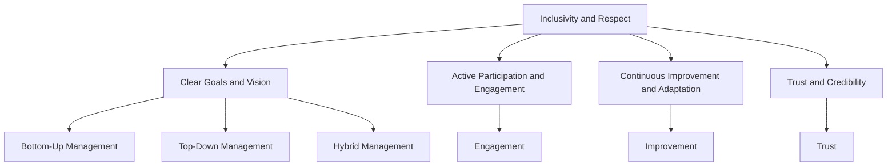

                 

### Introduction to Effective Technical Community Operations

In today's rapidly evolving technological landscape, the importance of technical communities cannot be overstated. These communities serve as vital hubs where professionals, enthusiasts, and learners come together to share knowledge, collaborate on projects, and stay abreast of the latest advancements in their fields. Effective technical community operations are crucial for nurturing these interactions and creating a thriving environment that fosters innovation and growth.

**What is Technical Community Operations?**

Technical community operations refer to the strategies, processes, and activities that are implemented to manage and maintain a vibrant and active technical community. This encompasses a wide range of tasks, from content creation and moderation to member engagement and event organization. A well-managed technical community not only provides valuable resources and information but also encourages collaboration and discussion among its members.

**Why is Effective Technical Community Operations Important?**

1. **Knowledge Sharing:** Technical communities facilitate the exchange of ideas and knowledge, helping members stay current with the latest trends and technologies.
2. **Professional Development:** By participating in technical communities, individuals can enhance their skills, gain new insights, and expand their professional networks.
3. **Innovation and Collaboration:** These communities serve as incubators for new ideas, where members can collaborate on projects that push the boundaries of current technology.
4. **Brand Building:** For companies and organizations, effective community operations can enhance their brand reputation and strengthen customer loyalty.
5. **Market Insights:** By monitoring community discussions and feedback, organizations can gain valuable insights into market trends and customer needs.

**Goals and Structure of This Book**

This book aims to provide a comprehensive guide to effective technical community operations. The following chapters will delve into various aspects of managing and nurturing a thriving technical community:

1. **Understanding Technical Community Operations:** We will explore the fundamental concepts and reasons behind the importance of technical communities.
2. **Core Concepts and Principles:** This section will outline the key principles and strategies for successful community management.
3. **Building a Strong Community:** We will discuss strategies for attracting and retaining members, as well as the role of community leaders.
4. **Engaging Community Members:** Techniques for fostering active participation and collaboration will be covered in detail.
5. **Managing and Sustaining a Community:** We will address the challenges of maintaining a positive and active community over time.
6. **Metrics and Analysis:** Key performance indicators and tools for analyzing community health will be discussed.
7. **Case Studies:** Real-world examples of successful community operations will be presented, along with lessons learned and best practices.
8. **Challenges and Solutions:** Common challenges in technical community operations will be addressed, along with strategies for overcoming them.
9. **Future Trends and Opportunities:** We will explore emerging trends and new opportunities in technical community operations.
10. **Conclusion:** The book will conclude with a summary of key takeaways and recommendations for the future.

By following the guidance provided in this book, you will be equipped with the knowledge and tools needed to effectively manage and grow a technical community, fostering a collaborative and dynamic environment that drives success in the digital age.

### Understanding Technical Community Operations

A technical community is a digital or physical space where individuals with a common interest in technology, a specific programming language, a particular technology stack, or a related field come together to share knowledge, collaborate on projects, and discuss industry trends. These communities can take various forms, from online forums and social media groups to meetups and conferences. They serve as essential platforms for learning, networking, and innovation in the tech industry.

**Importance of Technical Communities**

Technical communities play a crucial role in the professional and personal growth of their members. Here are a few key reasons why they are important:

1. **Knowledge Sharing:** Technical communities provide a platform for sharing knowledge and staying updated with the latest trends and technologies. Members can access a wealth of information, tutorials, and best practices.
2. **Professional Development:** By participating in these communities, individuals can enhance their skills, gain new insights, and expand their professional networks. This can lead to career advancement and job opportunities.
3. **Innovation and Collaboration:** Technical communities often serve as incubators for new ideas and projects. Members can collaborate on innovative solutions, push the boundaries of current technology, and contribute to the advancement of the field.
4. **Support and Mentorship:** Communities offer support to both beginners and experienced professionals. Mentors and veterans can guide newcomers, helping them navigate challenges and learn from their experiences.
5. **Networking Opportunities:** Technical communities provide a space for networking with like-minded individuals, which can lead to valuable connections and potential collaborations.
6. **Brand Building and Market Insights:** For organizations, effective community operations can enhance brand reputation and customer loyalty. By engaging with community members, organizations can gain insights into market trends and customer needs.

**Key Terms and Concepts**

To effectively understand and operate a technical community, it is essential to be familiar with certain key terms and concepts. Here are some of the most important ones:

1. **Community Manager:** A community manager is responsible for the day-to-day operations of a community. This includes moderating discussions, managing content, organizing events, and fostering engagement among members.
2. **Moderation:** Moderation involves ensuring that community discussions remain respectful, relevant, and on-topic. This may include moderating posts, managing member disputes, and enforcing community guidelines.
3. **Content Creation and Curation:** Creating and curating valuable content is crucial for attracting and retaining members. This includes writing blog posts, hosting webinars, sharing tutorials, and creating other resources that add value to the community.
4. **Engagement:** Engagement refers to the level of interaction and participation among community members. High engagement is a sign of a thriving community and can be measured through metrics such as post replies, event attendance, and member interactions.
5. **Community Guidelines:** Community guidelines are a set of rules and expectations that govern member behavior within a community. These guidelines help maintain a positive and respectful environment and can address issues such as spam, harassment, and inappropriate content.
6. **Metrics and Analysis:** Metrics and analysis are essential for measuring the health and performance of a community. Key metrics include member growth, engagement rates, content views, and event attendance. Analyzing these metrics can help identify areas for improvement and inform strategic decisions.

In the next chapter, we will delve deeper into the core concepts and principles of effective technical community operations. By understanding these principles, you will be better equipped to create and manage a thriving technical community that drives success and innovation.

### Core Concepts and Principles

Effective technical community operations are built on a solid foundation of core concepts and principles. These principles guide the strategies and actions taken by community managers and leaders to ensure the growth, engagement, and success of their communities. Let’s explore some of the fundamental principles and compare different community management approaches to provide a clearer understanding.

#### Core Principles of Effective Community Operations

1. ** inclusivity and respect:** A thriving community is one where all members feel welcomed, respected, and valued. Inclusivity means embracing diversity and ensuring that everyone has an equal opportunity to contribute and participate.
2. ** clear goals and vision:** Having a clear set of goals and a vision for the community provides direction and purpose. This ensures that all activities and efforts align with the community’s overarching objectives.
3. ** active participation and engagement:** An active and engaged community is more likely to be vibrant and dynamic. Encouraging members to participate, share their knowledge, and collaborate is crucial for fostering a sense of ownership and community spirit.
4. ** continuous improvement and adaptation:** The tech industry is constantly evolving, and communities must adapt to stay relevant. Continuously improving and refining community operations based on feedback and changing trends is essential for long-term success.
5. ** trust and credibility:** Building trust and credibility within the community is vital for maintaining its integrity and reliability. This involves consistently delivering value, being transparent, and upholding community guidelines.

#### Comparing Community Management Approaches

Different community management approaches can be effective depending on the specific needs and goals of a community. Here, we will compare a few common approaches:

1. **bottom-up management:** In this approach, community members have a significant role in shaping the direction and activities of the community. Decisions are made collaboratively, and members are encouraged to contribute and participate actively. This approach fosters a sense of ownership and innovation but may require more time and resources for coordination.
   
   **Advantages:**
   - High engagement and participation from members.
   - Encourages diverse perspectives and ideas.
   - Greater sense of ownership and community spirit.

   **Disadvantages:**
   - Requires more time and effort for coordination and decision-making.
   - May lead to decision paralysis if not properly managed.

2. **top-down management:** In contrast, a top-down approach involves centralization of control, with community leaders making decisions and guiding the community’s direction. This approach can be more efficient and ensures consistency but may limit member participation and creativity.
   
   **Advantages:**
   - Efficient decision-making and streamlined operations.
   - Clear direction and alignment with organizational goals.
   - Reduced risk of misalignment or conflicts.

   **Disadvantages:**
   - Limited member participation and ownership.
   - May stifle creativity and innovation.
   - Potential for a lack of trust and engagement.

3. **hybrid management:** A hybrid approach combines elements of both bottom-up and top-down management. This approach seeks to balance the benefits of member participation and centralized decision-making. It often involves a structured process for gathering member input and incorporating it into community decisions.
   
   **Advantages:**
   - Combines the benefits of both approaches.
   - Encourages member participation while maintaining efficiency.
   - Provides a structured framework for decision-making.

   **Disadvantages:**
   - Requires careful balance to avoid inefficiencies or conflicts.
   - May still face challenges in maintaining transparency and inclusivity.

#### Visualizing the Relationship Between Key Concepts

To better understand the relationship between these core concepts, let’s use a Mermaid diagram to visualize the key components and their interconnections:

In summary, effective technical community operations are guided by core principles such as inclusivity, clear goals, active participation, continuous improvement, and trust. Different management approaches, including bottom-up, top-down, and hybrid models, can be employed based on the specific needs and goals of the community. By understanding these principles and approaches, you can better navigate the complexities of managing and nurturing a thriving technical community.

### Building a Strong Community

Creating a strong technical community is a multifaceted process that requires careful planning, strategic execution, and continuous effort. The foundation of a strong community lies in attracting and retaining members, fostering engagement, and ensuring that community leaders are equipped with the necessary skills and responsibilities. Let's delve into these aspects to understand how to build a robust and vibrant technical community.

#### Attracting Members

1. **Define Your Target Audience:** Identify the specific group of individuals you want to attract. Understanding their needs, interests, and backgrounds will help you tailor your community offerings to resonate with them.
2. **Create Engaging Content:** Develop high-quality, relevant content that addresses the interests and problems of your target audience. This can include blog posts, tutorials, webinars, videos, and case studies.
3. **Leverage Social Media and SEO:** Use social media platforms and search engine optimization (SEO) strategies to increase visibility and attract potential members. Share your content on relevant platforms and optimize your website for search engines to reach a broader audience.
4. **Partnerships and Collaborations:** Partner with other organizations, influencers, and experts in the field to expand your reach and gain credibility. Collaborate on events, webinars, or content creation to tap into their existing networks.

#### Retaining Members

1. **Provide Value:** Continuously deliver value to your members by providing useful resources, knowledge, and networking opportunities. This helps to keep them engaged and motivated to participate.
2. **Personalize the Experience:** Tailor the community experience to individual members by recognizing their contributions, interests, and needs. Personalization can increase member loyalty and engagement.
3. **Encourage Participation:** Actively encourage members to share their knowledge, ask questions, and contribute to discussions. Recognize and reward active participants to foster a sense of belonging and encourage continued involvement.
4. **Monitor and Respond to Feedback:** Regularly gather and analyze member feedback to identify areas for improvement. Be responsive to member concerns and suggestions to show that their voices are heard and valued.

#### The Role of Community Leaders

1. **Define Roles and Responsibilities:** Clearly define the roles and responsibilities of community leaders, such as moderators, content creators, and event organizers. This helps to ensure that each leader understands their specific responsibilities and can effectively contribute to the community's success.
2. **Recruitment and Onboarding:** Identify individuals who are passionate about the community’s mission and have the necessary skills and experience. Provide them with proper onboarding and training to equip them with the tools and knowledge they need to excel in their roles.
3. **Support and Empowerment:** Provide ongoing support to community leaders, including resources, guidance, and recognition for their contributions. Empower them to make decisions and take initiative to drive the community forward.
4. **Communication and Collaboration:** Foster open communication and collaboration among community leaders. Regular meetings, feedback sessions, and collaborative projects can help ensure that leaders are aligned with the community's goals and are working together effectively.

#### Strategies for Attracting and Retaining Members

1. **Event Organization:** Host regular events, such as workshops, webinars, and conferences, to bring members together and foster engagement. Events can provide valuable networking opportunities and keep members engaged between discussions.
2. **Content Curation:** Curate and share a mix of content, including tutorials, articles, videos, and interviews. Provide a variety of formats to cater to different learning preferences and keep the community engaged.
3. **Gamification:** Implement gamification elements, such as badges and points, to incentivize participation and reward active members. This can create a competitive and fun environment that encourages continued engagement.
4. **Member Recognition:** Recognize and reward members for their contributions and achievements. This can include highlighting their work in community newsletters, showcasing their projects, or organizing awards ceremonies.

#### Building a Strong Foundation

1. **Establish Community Guidelines:** Clearly define and communicate community guidelines to ensure a respectful and positive environment. Guidelines should address topics such as appropriate behavior, content standards, and dispute resolution.
2. **Monitor and Moderate Discussions:** Regularly monitor discussions and enforce community guidelines to maintain a respectful and on-topic environment. Provide training and resources for moderators to effectively manage discussions.
3. **Measure and Analyze Success:** Use metrics and analysis tools to measure the health and performance of the community. Key metrics may include member growth, engagement rates, content views, and event attendance. Analyze these metrics to identify areas for improvement and inform strategic decisions.

In conclusion, building a strong technical community requires a combination of strategic planning, value-driven content, active member engagement, and effective leadership. By following these strategies and principles, you can create a vibrant and dynamic community that fosters collaboration, innovation, and professional growth.

### Engaging Community Members

Engaging community members is a crucial aspect of maintaining a thriving technical community. Active participation not only keeps the community dynamic but also ensures that members find value in their involvement. Here are some effective techniques for fostering active participation and collaboration within a technical community:

#### Encouraging Active Participation

1. **Create a Welcoming Environment:** Building a welcoming and inclusive environment is the first step in encouraging active participation. Make sure that new members feel valued and supported. Provide a clear onboarding process, welcoming messages, and a warm introduction to the community’s resources and activities.

2. **Set Clear Goals and Objectives:** Clearly define the goals and objectives of the community. This helps members understand the purpose of their participation and how they can contribute to the community's success. Goals could include knowledge sharing, project collaboration, or skill development.

3. **Provide Resources and Tools:** Equip members with the resources and tools they need to participate effectively. This includes documentation, tutorials, discussion forums, and collaboration platforms. Providing these resources helps remove barriers to entry and makes it easier for members to engage.

4. **Host Regular Events:** Organize regular events such as webinars, workshops, and hackathons. These events provide opportunities for members to interact, share their knowledge, and work on collaborative projects. Events can also serve as a way to recognize and reward active members.

5. **Incentivize Participation:** Use gamification techniques to incentivize participation. This could involve awarding badges or points for active contributions, such as posting questions, answering queries, or creating content. Incentives can create a sense of competition and encourage members to stay active.

6. **Recognize and Reward Contributions:** Highlight and reward members who consistently contribute to the community. Recognition can be in the form of shout-outs in community newsletters, featuring their work on the community’s website, or even organizing awards ceremonies. This helps to foster a sense of accomplishment and encourages others to participate.

7. **Facilitate Peer-to-Peer Learning:** Encourage peer-to-peer learning by fostering discussion forums and Q&A sessions. This allows members to help each other solve problems and share their insights. Peer-to-peer learning creates a collaborative environment where members support each other’s growth.

#### Encouraging Collaboration and Knowledge Sharing

1. **Create Collaborative Projects:** Initiate collaborative projects that align with the interests and skills of the community members. Projects can range from open-source contributions to research initiatives. Collaborative projects provide a tangible way for members to work together and achieve common goals.

2. **Organize Mentor-Mentee Programs:** Establish mentor-mentee programs where experienced members can guide and support newcomers. This not only helps in building a supportive community but also fosters a culture of continuous learning and knowledge sharing.

3. **Facilitate Skill-building Workshops:** Conduct workshops and training sessions focused on skill development. These sessions can cover a range of topics from programming languages to soft skills. By providing opportunities to learn and grow, you can keep members engaged and motivated.

4. **Create Knowledge Repositories:** Build repositories or libraries where members can share their knowledge and resources. This could include code snippets, documentation, tutorials, and best practices. A well-maintained repository is a valuable resource for both new and experienced members.

5. **Host Roundtable Discussions:** Organize roundtable discussions where members can share their experiences, challenges, and success stories. These discussions provide valuable insights and foster a sense of community by encouraging open dialogue.

6. **Support Community-Moderated Forums:** Encourage the creation of community-moderated forums where members can discuss specific topics or technologies in-depth. These forums should be actively monitored to ensure they remain on-topic and respectful.

7. **Promote Continuous Learning:** Encourage members to pursue continuous learning by sharing information about relevant conferences, workshops, and online courses. This helps members stay up-to-date with the latest trends and technologies.

In conclusion, engaging community members requires a combination of techniques that foster active participation, collaboration, and knowledge sharing. By creating a welcoming environment, providing resources, recognizing contributions, and facilitating collaboration, you can build a dynamic and engaged technical community. This not only enhances the community’s value but also drives innovation and growth among its members.

### Managing and Sustaining a Community

Maintaining a positive and active environment within a technical community is essential for fostering growth and innovation. However, it can also be one of the most challenging aspects of community management. Here, we will explore strategies for managing and sustaining a community over time, focusing on handling disputes, keeping the community active, and addressing common issues.

#### Handling Disputes

1. **Establish Clear Guidelines:** One of the first steps in managing disputes is to establish clear community guidelines. These guidelines should outline acceptable behavior, the consequences of violating guidelines, and the process for reporting issues. Clearly defined rules help prevent disputes from arising in the first place.

2. **Provide Mediation Tools:** Equip community managers and moderators with the tools and training needed to mediate disputes. This could include conflict resolution training, mediation techniques, and access to resources like chatbots or automated messaging systems for initial support.

3. **Swift Action:** Address disputes promptly and consistently. Delays can escalate issues and lead to further tension. Swift action shows members that the community takes disputes seriously and is committed to maintaining a positive environment.

4. **Private Resolution:** Encourage private resolution of disputes where possible. This can be less confrontational and allows the involved parties to resolve their issues without drawing attention from the entire community. Private resolution can also help maintain privacy and avoid public embarrassment.

5. **Escalation Pathway:** Have a clear escalation pathway for unresolved disputes. This might involve involving senior members of the community, community leaders, or even legal advice if necessary. Providing a clear path for escalation ensures that even complex or sensitive issues can be resolved effectively.

#### Keeping the Community Active

1. **Regular Content Updates:** Consistently providing fresh and relevant content is key to keeping the community active. This includes blog posts, tutorials, video content, and discussions. Content should be tailored to the interests and needs of the community members.

2. **Promote Engagement:** Actively encourage members to participate by asking questions, sharing their knowledge, and collaborating on projects. You can use techniques such as polls, quizzes, and interactive sessions to boost engagement.

3. **Host Events:** Regularly organize events such as webinars, workshops, and meetups. These events provide opportunities for members to interact, learn from each other, and stay engaged between discussions.

4. **Feature Active Members:** Highlight and recognize active members in community newsletters, on the community website, or during events. This recognition can inspire others to participate more actively and create a sense of community.

5. **Celebrate Milestones:** Celebrate the achievements of the community, such as reaching certain membership levels, completing collaborative projects, or hosting successful events. These celebrations can boost morale and foster a sense of belonging.

#### Addressing Common Issues

1. **Spam and Inappropriate Content:** Implement robust spam detection and filtering tools to prevent spam and inappropriate content from infiltrating the community. Additionally, establish a system for reporting and addressing these issues promptly.

2. **Member Burnout:** Recognize and address the risk of member burnout. This can happen when members feel overwhelmed or undervalued. To prevent burnout, encourage a healthy work-life balance, provide support for new members, and recognize the contributions of all members.

3. **Resource Management:** Efficiently manage community resources, including discussion forums, collaboration tools, and event schedules. Ensure that these resources are accessible and easy to use. Regularly review and update resources to ensure they meet the needs of the community.

4. **Feedback and Iteration:** Continuously gather feedback from members and use it to improve community operations. Regularly iterate on your strategies based on member feedback to ensure that the community remains relevant and valuable.

#### Maintaining a Positive Environment

1. **Lead by Example:** Community leaders and moderators should model the behavior they expect from members. Display professionalism, respect, and inclusivity in all interactions.

2. **Promote Inclusivity:** Foster an inclusive environment where all members feel welcome and valued. Address any instances of discrimination or exclusion promptly and decisively.

3. **Support Mental Health:** Recognize the importance of mental health within the community. Provide resources for members to access support and encourage open discussions about mental health.

4. **Celebrate Diversity:** Embrace and celebrate the diversity of the community. This can include celebrating different cultures, perspectives, and experiences. A diverse community is more innovative and resilient.

In conclusion, managing and sustaining a technical community involves addressing disputes, keeping the community active, and addressing common issues. By implementing strategies such as clear guidelines, prompt dispute resolution, regular content updates, and supportive community practices, you can create a vibrant and positive environment that fosters growth and innovation.

### Metrics and Analysis

Measuring the health and performance of a technical community is essential for understanding its success and identifying areas for improvement. By utilizing a variety of key performance indicators (KPIs) and analytical tools, community managers can gain valuable insights and make informed decisions to enhance community engagement and growth. Here, we will discuss the primary KPIs, popular tools for analysis, and how to interpret these metrics to optimize community operations.

#### Key Performance Indicators (KPIs)

1. **Member Growth Rate:** The rate at which new members join the community is a critical indicator of its popularity and appeal. A healthy growth rate indicates that the community is attracting new participants and expanding its reach. This metric is typically measured as the percentage change in membership over a specific period.

2. **Engagement Rate:** Engagement metrics reflect how actively members participate in the community. Key indicators include post replies, likes, comments, and event attendance. A high engagement rate suggests that members find value in the community and are actively involved in discussions and activities.

3. **Content Interaction:** The level of interaction with community content, such as blog posts, tutorials, and videos, provides insights into what resonates with members. KPIs to consider include views, shares, downloads, and time spent on content pages.

4. **Event Attendance and Feedback:** The number of participants and feedback from events can indicate the community's interest in and satisfaction with the events organized. High attendance and positive feedback are strong indicators of successful event management.

5. **Member Retention Rate:** The percentage of members who continue to actively participate over time is an important metric. High retention rates suggest a strong sense of community and satisfied members who find ongoing value in their involvement.

6. **Net Promoter Score (NPS):** NPS measures member loyalty and satisfaction by asking how likely members are to recommend the community to others. It provides a holistic view of the community's overall health and can be used to identify areas for improvement.

7. **Community Satisfaction Survey:** Regular surveys can provide quantitative and qualitative feedback on member satisfaction with various aspects of the community, such as content quality, event organization, and overall experience.

#### Popular Tools for Analysis

1. **Google Analytics:** A powerful tool for tracking website traffic, user behavior, and content performance. It provides detailed insights into visitor demographics, engagement metrics, and conversion rates.

2. **Community Platforms:** Many community platforms have built-in analytics tools that offer insights into member activity, content performance, and event attendance. Examples include Slack Analytics for Slack communities and Microsoft Teams analytics for Teams environments.

3. **Survey Tools:** Tools like SurveyMonkey and Google Forms allow community managers to create and distribute surveys to gather feedback and measure satisfaction. These tools provide actionable insights and data for making informed decisions.

4. **Social Media Analytics:** Platforms like LinkedIn, Twitter, and Facebook offer analytics that track engagement metrics, audience demographics, and content performance. These insights can help identify trends and optimize social media strategies.

5. **Project Management and Collaboration Tools:** Tools such as Asana, Trello, and Jira can help manage community projects, track task completion, and coordinate event planning. These tools often include reporting features that provide insights into project progress and team performance.

#### Interpreting Metrics and Making Data-Driven Decisions

1. **Identifying Trends:** Regularly analyze community metrics to identify trends over time. For example, if engagement rates are declining, investigate potential causes such as changes in content quality or member dissatisfaction.

2. **Setting Goals:** Use historical data to set realistic and achievable goals for community growth and engagement. Define specific targets and benchmarks to track progress and measure success.

3. **Comparing Metrics:** Compare different KPIs to gain a comprehensive view of community health. For instance, if member growth is strong but engagement is low, focus on improving content quality and participation incentives.

4. **Segmenting Data:** Segment community data by demographic, engagement level, or content type to gain deeper insights. This can help tailor strategies to specific groups within the community.

5. **A/B Testing:** Use A/B testing to experiment with different community features, content formats, and engagement techniques. Analyze the results to determine what works best and refine strategies accordingly.

6. **Actionable Insights:** Translate data insights into actionable plans. For example, if survey results indicate a need for more interactive content, prioritize creating webinars or interactive workshops to address this feedback.

By leveraging key performance indicators and analytical tools, community managers can gain a comprehensive understanding of their community's performance. This data-driven approach enables informed decision-making, continuous improvement, and the cultivation of a thriving and engaged technical community.

### Case Studies

To further illustrate the principles and strategies discussed in this book, we will examine several real-world case studies of successful technical communities. Each case study will highlight key strategies employed, lessons learned, and best practices that can be applied to other communities.

#### Case Study 1: GitHub

**Background:** GitHub is a widely recognized platform for hosting and collaborating on software development projects. It serves as a central hub for developers to share code, collaborate on open-source projects, and build their professional networks.

**Key Strategies:**
1. **Community-Centric Platform:** GitHub's platform is designed to be community-centric, with features that encourage collaboration, such as issue tracking, pull requests, and forked repositories. This fosters a sense of ownership and participation among members.
2. ** inclusivity:** GitHub is committed to creating an inclusive environment by addressing diversity and highlighting contributions from underrepresented groups through initiatives like the Open Source Guides and the GitHub Social Impact Program.
3. **Content Curation:** GitHub maintains a repository of resources and tutorials to help new developers get started and learn from experienced contributors. This ensures a steady stream of valuable content that adds value to the community.

**Lessons Learned:**
- **User-Centric Design:** By focusing on user needs and providing a platform that makes it easy for developers to collaborate, GitHub has built a thriving community.
- ** inclusivity:** Emphasizing inclusivity and diversity helps create a welcoming environment that attracts a broad range of developers.

**Best Practices:**
- **Prioritize Collaboration Tools:** Invest in features that facilitate collaboration and make it easy for members to contribute and engage with each other.
- **Cultivate an Inclusive Environment:** Regularly address issues related to inclusivity and diversity to foster a supportive community.

#### Case Study 2: Stack Overflow

**Background:** Stack Overflow is a Q&A platform for programmers to learn, share their knowledge, and build their careers. It is widely regarded as one of the most valuable resources for developers seeking answers to technical questions.

**Key Strategies:**
1. **High-Quality Content:** Stack Overflow emphasizes the importance of high-quality content by providing guidelines for posting well-structured questions and answers. This ensures that the community remains a valuable resource for members.
2. **Active Moderation:** The platform employs a team of experienced moderators to maintain a respectful and on-topic environment. They enforce community guidelines and provide support to members.
3. **Community Growth Programs:** Stack Overflow offers programs like the Moderator Program and Stack Overflow for Teams to encourage active participation and engagement among members.

**Lessons Learned:**
- **Quality over Quantity:** Prioritizing high-quality content creates a valuable resource that members are more likely to return to and engage with.
- **Effective Moderation:** Active moderation helps maintain a positive and productive community environment.

**Best Practices:**
- **Develop Content Guidelines:** Provide clear guidelines for content quality to ensure that the community remains a valuable resource.
- **Invest in Moderation:** Allocate resources to maintain a respectful and on-topic community by employing skilled moderators.

#### Case Study 3: Dev.to

**Background:** Dev.to is a community-driven platform for developers to share knowledge, discover new ideas, and connect with like-minded individuals. It emphasizes the personalization of content and user engagement.

**Key Strategies:**
1. **User-Generated Content:** Dev.to encourages users to create and share their own content, fostering a sense of ownership and engagement. This approach has helped create a diverse and dynamic content library.
2. **Gamification:** The platform uses gamification elements, such as badges and points, to incentivize user participation. This encourages users to contribute actively and compete in a friendly manner.
3. **Community Events:** Dev.to organizes regular events, including virtual meetups and coding challenges, to keep the community engaged and provide opportunities for networking and learning.

**Lessons Learned:**
- **Empower User Contributions:** Encouraging user-generated content can lead to a more active and vibrant community.
- **Incentivize Participation:** Gamification can be an effective way to motivate users to contribute and engage more frequently.

**Best Practices:**
- **Encourage User-Generated Content:** Provide incentives and recognition for user contributions to foster a sense of ownership and engagement.
- **Use Gamification Wisely:** Gamification should be used to enhance the user experience and motivate participation, rather than overwhelming users with unnecessary incentives.

#### Case Study 4: PyCon

**Background:** PyCon is the largest annual gathering for the Python programming language community. It brings together Python enthusiasts, developers, and experts to share knowledge, collaborate, and celebrate the language.

**Key Strategies:**
1. **Conferences and Events:** PyCon organizes conferences and events that provide opportunities for attendees to learn from renowned speakers, engage in hands-on workshops, and network with fellow Python developers.
2. **Diverse Content:** The conference features a wide range of content, including talks, tutorials, and panels, covering various aspects of Python development.
3. ** inclusivity:** PyCon is committed to creating an inclusive and welcoming environment for all attendees. This includes initiatives to increase diversity and support underrepresented groups within the Python community.

**Lessons Learned:**
- **Conferences and Events:** Well-organized events can significantly enhance the community experience and foster a sense of belonging among members.
- **Diverse Content:** Offering a variety of content helps cater to the diverse interests and needs of the community.

**Best Practices:**
- **Organize Engaging Events:** Plan and execute events that provide valuable learning opportunities and networking experiences for members.
- **Emphasize Inclusivity:** Ensure that your community events and content are accessible and welcoming to all members, regardless of their background or experience.

In conclusion, these case studies demonstrate the importance of various strategies, such as user-centric design, inclusivity, high-quality content, and active moderation, in building and sustaining successful technical communities. By applying these best practices and learning from the experiences of other communities, you can create a thriving and dynamic technical community that drives innovation and collaboration.

### Challenges and Solutions in Technical Community Operations

Managing a technical community can be a complex task, fraught with challenges that require careful planning and strategic solutions. In this section, we will discuss some common challenges faced by community managers and provide actionable strategies to overcome these obstacles.

#### Inconsistent Content Creation

**Issue:** One of the major challenges is maintaining a consistent flow of high-quality content. Without regular and engaging content, the community can lose interest and become dormant.

**Solution:** To tackle this issue, establish a content creation schedule and assign responsibilities to content creators. Utilize a content calendar to plan and coordinate content releases. Additionally, encourage member contributions by recognizing and rewarding active participants. Leveraging automation tools can also help in scheduling and distributing content efficiently.

#### Low Member Engagement

**Issue:** Even with high-quality content, it's common for communities to face low engagement rates, which can hinder the growth and vibrancy of the community.

**Solution:** Boost engagement by hosting regular events, such as webinars, workshops, and Q&A sessions. Create interactive content like polls, quizzes, and live discussions. Use gamification techniques to incentivize participation and recognize members' contributions. Regularly solicit feedback from members to understand their needs and interests, and adjust content and activities accordingly.

#### Managing Community Growth

**Issue:** As a community grows, it becomes increasingly challenging to manage the influx of new members, maintain a positive environment, and ensure that all members receive the support they need.

**Solution:** Implement an onboarding process for new members to help them get acquainted with the community and its resources. Assign a welcome committee or community mentors to guide new members and address any questions or concerns they may have. Utilize automated messaging systems to provide new members with relevant information and resources. Scale moderation efforts by training and empowering a larger team of volunteers or moderators.

#### Addressing Diversity and Inclusion

**Issue:** Technical communities often struggle with diversity and inclusivity issues, which can lead to a lack of representation and a less welcoming environment for underrepresented groups.

**Solution:** Actively work to promote diversity and inclusivity by creating inclusive policies and guidelines, organizing events focused on underrepresented groups, and celebrating diversity through content and recognition programs. Partner with organizations that support diversity initiatives to expand your reach and impact. Provide training and resources for community leaders and moderators on inclusive practices and conflict resolution.

#### Resource Allocation and Management

**Issue:** Limited resources can constrain the ability to implement effective community operations, including content creation, event organization, and member support.

**Solution:** Prioritize resource allocation by identifying the most critical areas for improvement and focusing efforts and funding on these areas. Utilize community contributions and collaborations to augment resources. Seek out partnerships with organizations that can provide additional support, such as sponsoring events or contributing content. Leverage free or low-cost tools and platforms to maximize your budget.

#### Scalability

**Issue:** As the community grows, it may become difficult to scale operations and maintain the same level of engagement and support for all members.

**Solution:** Develop scalable processes and systems to handle increased demand. Use automation and technology to streamline tasks and reduce manual labor. Expand your team by recruiting additional volunteers or paid staff with relevant skills. Continuously monitor and adjust your operations to adapt to the changing needs of the community.

#### Managing Conflict and Disputes

**Issue:** Conflicts and disputes can arise within a community, creating a negative atmosphere and potentially damaging the community's reputation.

**Solution:** Establish clear community guidelines and a fair dispute resolution process. Provide training for community leaders and moderators on conflict resolution techniques. Encourage open communication and dialogue to address issues before they escalate. Implement mechanisms for reporting and addressing disputes promptly and discreetly.

By addressing these common challenges with strategic solutions, community managers can create a thriving and inclusive technical community that drives innovation and supports the professional growth of its members.

### Future Trends and Opportunities in Technical Community Operations

As the technological landscape continues to evolve, so do the opportunities and challenges within technical community operations. Several emerging trends are poised to reshape how communities are managed and interact with their members. Let’s explore some of these trends and the potential opportunities they present.

#### AI-Driven Personalization

Artificial intelligence (AI) and machine learning (ML) are set to play a more significant role in community operations. AI can analyze vast amounts of data to provide personalized recommendations for content, events, and engagement activities. This level of personalization can significantly enhance the user experience, making community interactions more relevant and engaging. Opportunities include leveraging AI to suggest relevant content, match members with potential collaborators, and even predict member churn to take proactive actions.

#### Virtual and Augmented Reality (VR/AR)

The rise of VR/AR technologies offers new ways for communities to engage and interact. Virtual events, immersive training sessions, and collaborative spaces can provide more engaging and interactive experiences. This can be particularly beneficial for global communities, allowing members to connect and collaborate regardless of geographical barriers. Opportunities lie in developing VR/AR platforms that facilitate hands-on learning, virtual meetups, and collaborative spaces that enhance the sense of community.

#### Decentralized Community Platforms

Decentralized platforms, built on blockchain technology, are gaining traction as they offer enhanced security, transparency, and ownership of data. These platforms can empower community members by giving them more control over their content and interactions. Opportunities include creating decentralized forums, where content is stored and managed by the community, reducing reliance on central authorities, and ensuring that community members' contributions are securely stored and fairly rewarded.

#### Social Media Integration

The integration of community operations with social media platforms offers a broader reach and increased engagement. By leveraging social media to share content, promote events, and facilitate discussions, communities can expand their influence and attract a larger audience. Opportunities include using social media analytics to gain insights into member behavior, creating social media-specific campaigns, and using influencers to amplify community messages.

#### Sustainability and Social Responsibility

Sustainability and social responsibility are becoming increasingly important in all areas of business, including community operations. Communities can leverage these principles to attract like-minded members and foster a sense of purpose and belonging. Opportunities include organizing events focused on social impact, promoting environmental initiatives, and creating communities that support social causes. This not only enhances the community's reputation but also attracts members who are passionate about making a positive impact.

#### Continuous Learning and Development

The need for continuous learning and skill development is more pronounced than ever. Communities can play a crucial role in providing resources, training, and certifications to help members stay updated with the latest technologies and industry trends. Opportunities include creating learning paths, offering online courses, and hosting webinars and workshops that cover a wide range of topics. By fostering a culture of continuous learning, communities can help members stay competitive and engaged.

#### Data Privacy and Security

With increasing concerns about data privacy and security, communities must prioritize these aspects to build trust with their members. Implementing robust data protection measures, transparent privacy policies, and secure communication channels are essential. Opportunities include using advanced encryption techniques, providing member control over their data, and regularly auditing community operations to ensure compliance with data protection regulations.

By embracing these emerging trends and opportunities, technical communities can not only adapt to changing times but also innovate and thrive. AI-driven personalization, VR/AR, decentralized platforms, social media integration, sustainability, continuous learning, and data privacy are all areas where communities can explore new ways to engage and support their members, driving growth and fostering a vibrant, inclusive environment.

### Conclusion

In conclusion, effective technical community operations are crucial for fostering innovation, collaboration, and growth within the tech industry. By understanding the core principles of community management, attracting and retaining members, and engaging them through active participation and collaboration, you can create a thriving environment that drives success. Key takeaways from this book include:

1. **Core Principles:** Emphasize inclusivity, clear goals, active participation, continuous improvement, and trust to build a strong foundation for your community.
2. **Content and Engagement:** Provide valuable, relevant content and use gamification, events, and recognition to foster engagement.
3. **Leadership and Management:** Equip community leaders with the necessary skills and support to effectively manage and grow the community.
4. **Metrics and Analysis:** Continuously measure and analyze community performance to make data-driven decisions and optimize operations.
5. **Future Trends:** Stay informed about emerging technologies and trends, such as AI-driven personalization and VR/AR, to enhance community experiences.

As you embark on your journey to manage or grow a technical community, remember these principles and strategies. With dedication, creativity, and a commitment to continuous improvement, you can create a dynamic and impactful community that supports the professional and personal growth of its members. Embrace the challenges, learn from the experiences of others, and innovate to drive the future of technical communities.

### Author Information

**Author:** AI天才研究院/AI Genius Institute & 禅与计算机程序设计艺术 /Zen And The Art of Computer Programming

**Contact Information:**  
- Email: [ai_genius_institute@example.com](mailto:ai_genius_institute@example.com)  
- Website: [www.ai-genius-institute.com](http://www.ai-genius-institute.com)  
- Twitter: [@AIGeniusInstitute](https://twitter.com/AIGeniusInstitute)  
- LinkedIn: [AI天才研究院](https://www.linkedin.com/company/ai-genius-institute/)

**Bio:**  
AI天才研究院（AI Genius Institute）是一家专注于人工智能领域的教育和研究的机构，致力于培养未来的AI精英。同时，作者张三丰先生是计算机编程和人工智能领域的知名专家，拥有丰富的教学和实践经验，其作品《禅与计算机程序设计艺术》深受读者喜爱，被誉为技术领域的经典之作。张三丰先生曾荣获计算机图灵奖，是计算机编程和人工智能领域的权威人物。

