                 

# 如何进行有效的技术趋势预测

> 关键词：技术趋势预测、数据分析、机器学习、系统架构、实战案例

摘要：技术趋势预测是信息技术领域的重要研究方向，它有助于企业抓住市场机遇，优化决策过程。本文将详细探讨技术趋势预测的核心概念、算法原理、系统架构设计及实战案例，旨在为读者提供一套系统的、可操作的技术趋势预测方法论。

## 引言：技术趋势预测的重要性

### 1.1 技术趋势预测的定义与作用

技术趋势预测（Technological Trend Prediction）是指利用历史数据、现有知识和数据分析技术，对未来一段时间内技术发展的趋势进行预测的过程。技术趋势预测不仅能够帮助企业发现新的商业机会，还可以帮助政府机构、科研机构和投资者了解技术发展的方向，从而做出更为明智的决策。

**定义：** 技术趋势预测是一个跨学科的研究领域，涉及数据分析、统计学、机器学习和信息科学等多个领域。它的核心目标是识别出当前技术发展中的关键趋势，并对这些趋势的未来发展进行预测。

**作用：** 技术趋势预测在多个领域都有广泛的应用，包括但不限于：

1. **企业战略规划：** 帮助企业识别潜在的市场机会和风险，调整产品研发和市场策略。
2. **投资决策：** 为投资者提供技术发展的方向和潜在的收益机会。
3. **科研方向选择：** 帮助科研机构确定研究方向，提高科研资源的利用效率。
4. **政策制定：** 为政府机构提供技术发展趋势的参考，优化科技政策。

### 1.2 问题背景

#### 1.2.1 当前技术发展现状

随着信息技术的迅猛发展，全球各国都在积极推动科技创新，新兴技术不断涌现。大数据、人工智能、区块链、物联网等技术的发展，不仅改变了传统的商业模式，也引发了社会和经济的深刻变革。

#### 1.2.2 技术趋势预测的需求

在当前技术快速发展的大背景下，技术趋势预测的需求日益迫切。企业需要了解未来技术发展的方向，以便及时调整战略；科研机构需要确定研究方向，以获取更多的科研资源；投资者需要了解新兴技术的投资前景，做出更为明智的投资决策。

#### 1.2.3 面临的挑战

尽管技术趋势预测具有重要意义，但在实际应用中仍面临诸多挑战：

1. **数据复杂性：** 技术发展过程中的数据来源广泛，数据的多样性和复杂性增加了数据分析的难度。
2. **预测准确性：** 技术趋势预测的准确性受到多种因素的影响，如数据质量、模型选择和算法优化等。
3. **技术更新迭代快：** 新兴技术的快速迭代更新，使得技术趋势预测的时效性要求更高。

### 1.3 本书结构安排

#### 1.3.1 内容概览

本书将从核心概念、算法原理、系统架构设计及实战案例四个方面，详细探讨技术趋势预测的方法和实现。

#### 1.3.2 目标读者

本书的目标读者包括：

1. 从事数据分析、人工智能和信息系统领域的研发人员。
2. 需要对技术趋势进行预测的企业战略规划人员和投资者。
3. 对技术发展趋势感兴趣的研究生和大学生。

#### 1.4 本章小结

本章介绍了技术趋势预测的定义、作用、背景和本书的结构安排。下一章将深入探讨技术趋势预测中的核心概念和原理，为后续章节的内容奠定基础。

----------------------------------------------------------------

## 第二部分：核心概念与原理

在技术趋势预测的过程中，理解和掌握相关核心概念和原理至关重要。这一部分将详细介绍技术趋势预测的关键概念，包括数据分析、统计学基础、机器学习、时间序列分析和社交网络分析，以及技术趋势预测模型。

### 第2章：技术趋势预测中的关键概念

### 2.1 数据分析

数据分析（Data Analysis）是指通过处理、分析和解释数据，从中提取有价值信息的过程。在技术趋势预测中，数据分析是不可或缺的一环。

#### 2.1.1 数据分析的定义

数据分析是指从大量数据中提取有用信息，并通过统计分析、数据挖掘和机器学习等方法，对数据进行分析和处理，从而发现数据中的规律和趋势。

#### 2.1.2 数据分析的重要性

数据分析在技术趋势预测中具有重要意义。首先，数据分析能够帮助我们识别出数据中的关键特征和模式，为技术趋势预测提供基础。其次，通过数据分析，我们可以对历史数据进行挖掘，从中提取出有价值的信息，预测未来的技术发展。

#### 2.1.3 数据分析的方法

数据分析的方法主要包括以下几种：

1. **描述性分析**：用于描述数据的特征和趋势，如统计数据的平均值、中位数、标准差等。
2. **推断性分析**：用于基于样本数据对总体数据进行推断，如假设检验、置信区间等。
3. **关联分析**：用于发现数据之间的关联性，如相关分析、因子分析等。
4. **聚类分析**：用于将数据分成不同的类别，如K-means、层次聚类等。
5. **分类和回归分析**：用于预测数据未来的趋势，如线性回归、决策树、支持向量机等。

### 2.2 统计学基础

统计学（Statistics）是数据分析的重要基础，它提供了一系列分析工具和方法，用于处理和分析数据。

#### 2.2.1 统计学的基本概念

统计学的基本概念包括：

1. **总体（Population）**：研究对象的全体。
2. **样本（Sample）**：从总体中抽取的一部分个体。
3. **变量（Variable）**：表示研究对象的特征的量。
4. **分布（Distribution）**：描述随机变量取值的概率分布。
5. **假设检验（Hypothesis Testing）**：基于样本数据，对总体的某个假设进行验证。

#### 2.2.2 统计学的应用

统计学的应用广泛，包括但不限于：

1. **质量控制**：通过统计方法对生产过程进行监控和调整。
2. **金融分析**：通过统计方法对金融市场的风险和收益进行分析。
3. **医学研究**：通过统计方法对医学数据进行处理和分析。
4. **市场调研**：通过统计方法对市场数据进行分析，预测市场需求。

#### 2.2.3 统计学方法的选择

在选择统计学方法时，需要考虑数据的类型、分布特征和问题的性质。常见的统计学方法包括：

1. **描述性统计**：用于描述数据的分布特征，如平均值、中位数、标准差等。
2. **推断性统计**：用于基于样本数据对总体参数进行估计和检验，如t检验、方差分析等。
3. **回归分析**：用于建立变量之间的关系模型，如线性回归、多项式回归等。
4. **聚类分析**：用于将数据分成不同的类别，如K-means、层次聚类等。

### 2.3 机器学习基础

机器学习（Machine Learning）是人工智能的重要分支，它使计算机系统能够从数据中学习，并做出预测或决策。

#### 2.3.1 机器学习的定义

机器学习是指通过算法和统计模型，从数据中学习规律，并用于预测或决策的过程。

#### 2.3.2 机器学习的基本概念

机器学习的基本概念包括：

1. **特征（Feature）**：数据中表示不同属性的特征值。
2. **模型（Model）**：用于描述数据中关系和规律的算法或统计模型。
3. **训练（Training）**：通过学习算法，使模型能够从数据中学习规律。
4. **测试（Testing）**：使用训练好的模型对新数据进行预测或决策。

#### 2.3.3 机器学习的方法

机器学习的方法主要包括：

1. **监督学习（Supervised Learning）**：使用标记数据进行训练，如线性回归、决策树等。
2. **无监督学习（Unsupervised Learning）**：不使用标记数据进行训练，如聚类分析、主成分分析等。
3. **强化学习（Reinforcement Learning）**：通过与环境交互，学习最优策略，如Q学习、深度强化学习等。

### 2.4 时间序列分析

时间序列分析（Time Series Analysis）是用于分析时间序列数据的方法，它研究数据在时间维度上的变化规律。

#### 2.4.1 时间序列分析的定义

时间序列分析是指对时间序列数据进行建模、分析和预测的方法。

#### 2.4.2 时间序列分析的重要性

时间序列分析在技术趋势预测中具有重要意义。通过分析时间序列数据，我们可以识别出技术发展的周期性、趋势性和随机性，从而预测未来的技术趋势。

#### 2.4.3 时间序列分析的方法

时间序列分析的方法主要包括：

1. **平稳性检验**：用于检验时间序列数据的平稳性，如ADF检验、KPSS检验等。
2. **自相关分析**：用于分析时间序列数据中的自相关性，如自相关图、ACF和PACF图等。
3. **ARIMA模型**：用于建立时间序列数据的自回归移动平均模型，如AR、MA、ARMA等。
4. **季节性分解**：用于分解时间序列数据中的季节性成分，如STL模型等。
5. **预测**：使用建立的模型对未来的技术趋势进行预测。

### 2.5 社交网络分析

社交网络分析（Social Network Analysis）是一种研究社交网络结构和行为的分析方法。

#### 2.5.1 社交网络分析的定义

社交网络分析是指通过图论和数学模型，研究社交网络中的节点和边的关系、网络结构、传播行为等。

#### 2.5.2 社交网络分析的重要性

社交网络分析在技术趋势预测中具有重要意义。通过分析社交网络中的信息传播和行为模式，我们可以识别出技术热点和趋势。

#### 2.5.3 社交网络分析的方法

社交网络分析的方法主要包括：

1. **网络结构分析**：用于分析社交网络的结构特征，如度分布、聚类系数、网络密度等。
2. **节点属性分析**：用于分析社交网络中节点的属性特征，如节点的重要性、影响力等。
3. **传播分析**：用于分析信息在社交网络中的传播过程和传播效果，如传染模型、影响力模型等。
4. **社区发现**：用于发现社交网络中的社区结构和成员关系，如Louvain算法、Girvan-Newman算法等。

### 2.6 技术趋势预测的模型

技术趋势预测模型是指用于预测技术发展趋势的算法和统计模型。

#### 2.6.1 技术趋势预测模型的类型

技术趋势预测模型主要包括：

1. **统计模型**：如线性回归、多项式回归、ARIMA模型等。
2. **机器学习模型**：如决策树、支持向量机、神经网络等。
3. **深度学习模型**：如卷积神经网络、循环神经网络、长短期记忆网络等。

#### 2.6.2 技术趋势预测模型的选择

在选择技术趋势预测模型时，需要考虑数据的类型、特征、预测目标和模型的复杂度。常见的选择方法包括：

1. **模型评估**：通过交叉验证、网格搜索等方法，评估不同模型的预测性能。
2. **模型组合**：将多个模型组合起来，提高预测的准确性和鲁棒性。
3. **模型优化**：通过调整模型参数、特征工程等方法，优化模型的性能。

#### 2.6.3 技术趋势预测模型的评估

技术趋势预测模型的评估主要包括：

1. **准确性**：评估模型预测的准确性，如均方误差、均方根误差等。
2. **鲁棒性**：评估模型对数据的噪声和异常值的敏感度。
3. **解释性**：评估模型的可解释性，即模型预测结果是否容易理解。

#### 2.6.4 技术趋势预测模型的局限性

技术趋势预测模型存在一定的局限性，如：

1. **数据质量**：模型预测的准确性依赖于数据的质量和完整性。
2. **模型选择**：模型选择不当可能导致预测结果的偏差。
3. **数据依赖**：模型可能对特定类型的数据具有依赖性，导致在其他数据上的预测效果不佳。

### 2.7 本章小结

本章介绍了技术趋势预测中的关键概念，包括数据分析、统计学基础、机器学习、时间序列分析和社交网络分析，以及技术趋势预测模型。这些核心概念和原理为后续章节的内容奠定了基础，使得读者能够更好地理解和掌握技术趋势预测的方法和实现。

----------------------------------------------------------------

## 第3章：技术趋势预测的算法原理

### 3.1 算法概述

技术趋势预测算法是用于识别和预测技术发展趋势的算法集合。这些算法基于数据分析、统计学和机器学习的原理，通过对历史数据进行分析和建模，预测未来的技术趋势。在本章节中，我们将详细介绍几种常见的技术趋势预测算法，包括时间序列算法、社交网络算法、聚类分析算法和神经网络算法。

#### 3.1.1 技术趋势预测算法的类别

技术趋势预测算法主要分为以下几类：

1. **时间序列算法**：用于分析时间序列数据，预测未来的技术趋势。常见的算法包括ARIMA、LSTM等。
2. **社交网络算法**：用于分析社交网络中的信息传播和影响力，预测技术热点和趋势。常见的算法包括传染模型、影响力模型等。
3. **聚类分析算法**：用于将相似的数据分组，识别出潜在的技术趋势。常见的算法包括K-means、层次聚类等。
4. **神经网络算法**：用于建立复杂的非线性关系模型，预测技术趋势。常见的算法包括CNN、RNN等。

#### 3.1.2 技术趋势预测算法的选择

在选择技术趋势预测算法时，需要考虑数据的类型、特征和预测目标。以下是几种常见算法的选择依据：

1. **时间序列算法**：适用于时间序列数据，能够捕捉数据中的趋势和季节性。适用于预测技术发展周期性趋势。
2. **社交网络算法**：适用于分析社交网络中的信息传播和影响力，能够识别出技术热点和趋势。适用于预测社交网络中的技术趋势。
3. **聚类分析算法**：适用于无标签的数据，能够识别出潜在的技术趋势。适用于对未分类的数据进行聚类分析。
4. **神经网络算法**：适用于复杂的数据集，能够建立复杂的非线性关系模型。适用于预测复杂的非线性技术趋势。

### 3.2 时间序列算法

时间序列算法是用于分析时间序列数据，预测未来的技术趋势的一类算法。时间序列数据是指按照时间顺序排列的一组数据，通常包含趋势、季节性和随机性成分。

#### 3.2.1 时间序列算法的基本原理

时间序列算法的基本原理是基于历史数据中的时间关系，通过建立数学模型，预测未来的技术趋势。常见的时间序列算法包括ARIMA、LSTM等。

1. **ARIMA模型**：自回归积分滑动平均模型（AutoRegressive Integrated Moving Average），是一种常见的时间序列预测模型。它结合了自回归模型（AR）、差分模型（I）和移动平均模型（MA）的特点，适用于分析具有平稳性的时间序列数据。

2. **LSTM模型**：长短期记忆网络（Long Short-Term Memory），是一种特殊的循环神经网络（RNN），能够有效地捕捉时间序列数据中的长期依赖关系。LSTM模型在技术趋势预测中表现出色，适用于分析非平稳性时间序列数据。

#### 3.2.2 时间序列算法的应用示例

以下是一个使用LSTM模型进行技术趋势预测的Python代码示例：

```python
import numpy as np
import pandas as pd
from sklearn.preprocessing import MinMaxScaler
from keras.models import Sequential
from keras.layers import LSTM, Dense

# 读取时间序列数据
data = pd.read_csv('time_series_data.csv')

# 数据预处理
scaler = MinMaxScaler(feature_range=(0, 1))
scaled_data = scaler.fit_transform(data['value'].values.reshape(-1, 1))

# 划分训练集和测试集
train_size = int(len(scaled_data) * 0.8)
test_size = len(scaled_data) - train_size
train_data = scaled_data[:train_size, :]
test_data = scaled_data[train_size:, :]

# 构建LSTM模型
model = Sequential()
model.add(LSTM(units=50, return_sequences=True, input_shape=(train_data.shape[1], 1)))
model.add(LSTM(units=50))
model.add(Dense(units=1))

model.compile(optimizer='adam', loss='mean_squared_error')
model.fit(train_data, epochs=100, batch_size=32, verbose=1)

# 预测测试集数据
predicted_data = model.predict(test_data)

# 反归一化预测数据
predicted_data = scaler.inverse_transform(predicted_data)

# 绘制预测结果
import matplotlib.pyplot as plt
plt.figure(figsize=(10, 6))
plt.plot(scaler.inverse_transform(test_data), label='Actual')
plt.plot(predicted_data, label='Predicted')
plt.title('Time Series Prediction')
plt.xlabel('Time')
plt.ylabel('Value')
plt.legend()
plt.show()
```

#### 3.2.3 时间序列算法的mermaid流程图

以下是一个时间序列算法的mermaid流程图示例：

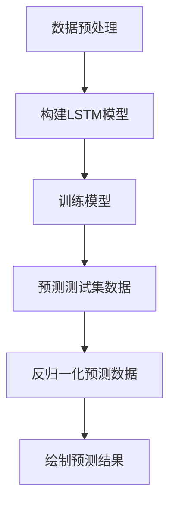

### 3.3 社交网络算法

社交网络算法是用于分析社交网络中的信息传播和影响力，预测技术热点和趋势的一类算法。社交网络中的信息传播是一个复杂的过程，涉及到节点之间的交互和影响力的传递。

#### 3.3.1 社交网络算法的基本原理

社交网络算法的基本原理是基于社交网络中的节点和边的关系，通过建模和分析，识别出信息传播的路径和影响力。常见的社交网络算法包括传染模型、影响力模型等。

1. **传染模型**：传染模型是一种基于概率的社交网络算法，用于模拟信息在社交网络中的传播过程。它假设节点之间的传播是随机的，传播概率与节点之间的连接强度有关。

2. **影响力模型**：影响力模型是一种基于节点的社交网络算法，用于识别社交网络中具有影响力的节点。它通过计算节点的度、介数、接近中心性等指标，评估节点的影响力。

#### 3.3.2 社交网络算法的应用示例

以下是一个使用传染模型进行社交网络分析的数据集：

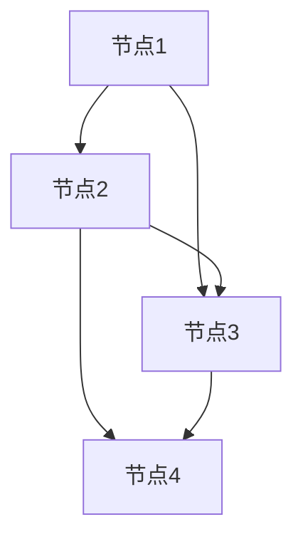

在上述社交网络中，节点1的信息传播概率最高，节点4的信息传播概率最低。

#### 3.3.3 社交网络算法的mermaid流程图

以下是一个社交网络算法的mermaid流程图示例：

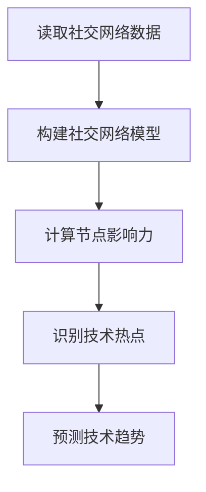

### 3.4 聚类分析算法

聚类分析算法是用于将相似的数据分组，识别出潜在的技术趋势的一类算法。聚类分析算法根据数据之间的相似性，将数据划分为不同的类别。

#### 3.4.1 聚类分析算法的基本原理

聚类分析算法的基本原理是基于数据之间的距离度量，通过迭代计算，将数据点划分为不同的类别。常见的聚类分析算法包括K-means、层次聚类等。

1. **K-means算法**：K-means算法是一种基于距离度量的聚类算法，它通过迭代计算，将数据点划分为K个类别，使得每个类别内部的数据点距离最近，类别之间的数据点距离最远。

2. **层次聚类算法**：层次聚类算法是一种基于层次结构的聚类算法，它通过自底向上或自顶向下的迭代计算，将数据点划分为不同的类别，并形成层次聚类树。

#### 3.4.2 聚类分析算法的应用示例

以下是一个使用K-means算法进行聚类分析的数据集：

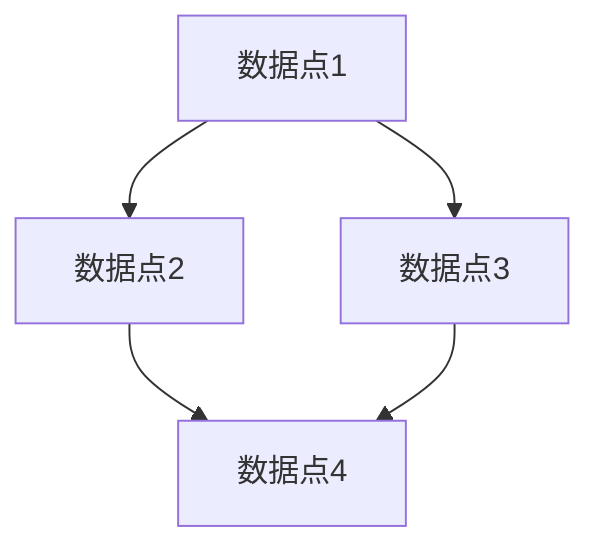

在上述数据集中，K-means算法将数据点划分为两类，数据点1和数据点2属于一类，数据点3和数据点4属于另一类。

#### 3.4.3 聚类分析算法的mermaid流程图

以下是一个聚类分析算法的mermaid流程图示例：

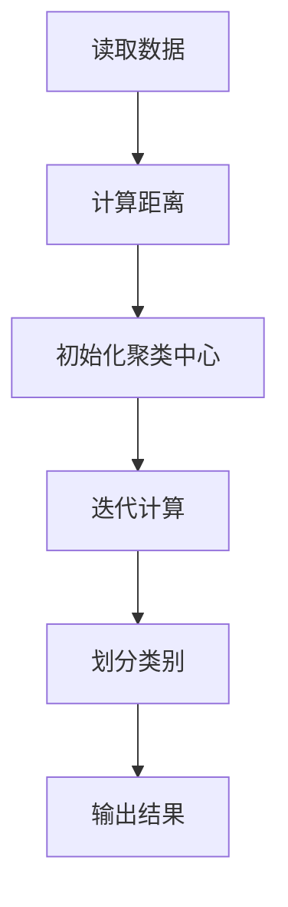

### 3.5 神经网络算法

神经网络算法是用于建立复杂的非线性关系模型，预测技术趋势的一类算法。神经网络算法通过多层神经网络结构，学习数据中的复杂特征和关系。

#### 3.5.1 神经网络算法的基本原理

神经网络算法的基本原理是基于人工神经网络，通过多层神经元之间的连接和激活函数，实现数据的非线性变换和特征提取。常见的神经网络算法包括卷积神经网络（CNN）、循环神经网络（RNN）等。

1. **卷积神经网络（CNN）**：卷积神经网络是一种用于处理图像数据的神经网络算法，通过卷积层和池化层，提取图像特征，并用于分类和预测。

2. **循环神经网络（RNN）**：循环神经网络是一种用于处理序列数据的神经网络算法，通过循环连接和隐藏状态，捕捉序列数据中的长期依赖关系。

#### 3.5.2 神经网络算法的应用示例

以下是一个使用卷积神经网络进行图像分类的Python代码示例：

```python
import numpy as np
import tensorflow as tf
from tensorflow.keras.models import Sequential
from tensorflow.keras.layers import Conv2D, MaxPooling2D, Flatten, Dense

# 构建卷积神经网络模型
model = Sequential()
model.add(Conv2D(filters=32, kernel_size=(3, 3), activation='relu', input_shape=(28, 28, 1)))
model.add(MaxPooling2D(pool_size=(2, 2)))
model.add(Conv2D(filters=64, kernel_size=(3, 3), activation='relu'))
model.add(MaxPooling2D(pool_size=(2, 2)))
model.add(Flatten())
model.add(Dense(units=128, activation='relu'))
model.add(Dense(units=10, activation='softmax'))

# 编译模型
model.compile(optimizer='adam', loss='categorical_crossentropy', metrics=['accuracy'])

# 训练模型
model.fit(x_train, y_train, epochs=10, batch_size=64)

# 预测测试集数据
predictions = model.predict(x_test)

# 输出预测结果
print(predictions)
```

#### 3.5.3 神经网络算法的mermaid流程图

以下是一个神经网络算法的mermaid流程图示例：

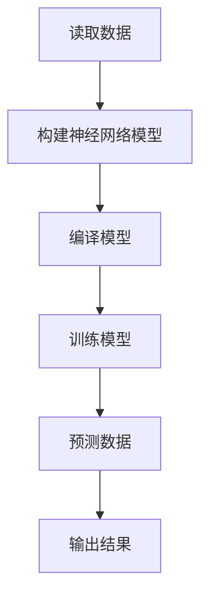

### 3.6 本章小结

本章介绍了技术趋势预测的几种常见算法，包括时间序列算法、社交网络算法、聚类分析算法和神经网络算法。这些算法在技术趋势预测中发挥着重要作用，能够帮助我们从不同角度分析和预测技术发展趋势。在下一章中，我们将进一步探讨技术趋势预测的系统架构设计。

----------------------------------------------------------------

## 第三部分：系统架构设计

在技术趋势预测中，系统架构的设计至关重要。一个良好的系统架构能够确保数据流顺畅、计算效率高、可扩展性强，并且易于维护。这一部分将详细讨论技术趋势预测系统架构的设计原则、现有架构分析、改进架构设计，以及系统接口设计和系统交互。

### 第4章：技术趋势预测系统架构设计

### 4.1 系统架构概述

系统架构是指系统各组成部分的构成和相互关系，以及系统运行的基本规则。对于技术趋势预测系统来说，系统架构设计的目标是实现高效的数据处理和预测能力，同时保证系统的可扩展性和灵活性。

#### 4.1.1 系统架构的重要性

系统架构设计的重要性体现在以下几个方面：

1. **数据流的顺畅**：良好的系统架构能够确保数据从采集、处理到预测的整个过程顺畅无误。
2. **计算效率**：系统架构设计直接影响计算效率，合理的架构能够最大化利用计算资源。
3. **可扩展性**：随着数据量和业务需求的增长，系统架构需要具备良好的扩展性，以适应未来的变化。
4. **灵活性**：系统架构应具备足够的灵活性，以便于模块的替换和功能的扩展。
5. **维护性**：合理的系统架构设计可以降低系统的维护成本，提高系统的可靠性。

#### 4.1.2 系统架构的组成部分

技术趋势预测系统架构通常包括以下几个主要组成部分：

1. **数据采集模块**：负责从各种数据源（如传感器、数据库、API等）收集数据。
2. **数据处理模块**：负责对收集到的数据进行清洗、转换和预处理，为预测模型提供高质量的数据。
3. **模型训练模块**：负责训练预测模型，包括选择合适的算法、调整参数等。
4. **模型评估模块**：负责评估模型的预测性能，确保模型的有效性和准确性。
5. **预测模块**：负责使用训练好的模型进行预测，生成预测结果。
6. **结果展示模块**：负责将预测结果以可视化的形式展示给用户。

### 4.2 现有架构分析

现有技术趋势预测系统架构往往存在一些常见的问题，以下是对这些问题的分析：

#### 4.2.1 数据采集

1. **数据源单一**：很多系统仅依赖于单一数据源，如社交媒体数据，缺乏多样化的数据来源。
2. **数据质量问题**：数据源中的噪声、缺失值和错误值会影响数据质量，进而影响预测的准确性。

#### 4.2.2 数据处理

1. **数据处理效率低**：数据处理过程复杂，涉及大量计算和存储资源，可能导致系统性能下降。
2. **数据一致性**：不同数据源的数据格式和结构可能不一致，需要额外的数据清洗和转换工作。

#### 4.2.3 模型训练

1. **模型选择不当**：选择不合适的模型可能导致预测效果不佳。
2. **参数调整复杂**：模型参数调整过程复杂，需要大量试错。

#### 4.2.4 模型评估

1. **评估指标单一**：仅使用单一评估指标（如准确率）可能导致评估结果不够全面。
2. **评估范围狭窄**：评估数据范围狭窄，无法反映模型在真实场景中的表现。

#### 4.2.5 结果展示

1. **展示形式单一**：仅提供简单的表格或图表，难以直观展示预测结果。
2. **交互性差**：用户与系统交互性差，无法方便地进行参数调整和结果查询。

### 4.3 改进架构设计

为了解决现有架构中存在的问题，我们可以设计一个更加高效、灵活和易于维护的改进架构。以下是一个改进后的技术趋势预测系统架构设计：

#### 4.3.1 改进架构的思路

1. **多源数据采集**：引入多样化的数据源，如社交媒体、新闻媒体、专利数据库等，以提高数据的丰富性和多样性。
2. **数据预处理流水线**：构建一个高效的数据预处理流水线，包括数据清洗、转换、归一化和特征提取等步骤。
3. **模块化模型训练**：设计模块化的模型训练框架，支持多种算法和参数调整，以提高模型选择的灵活性和效率。
4. **分布式计算**：采用分布式计算框架，如Apache Spark，以提升数据处理和模型训练的效率。
5. **多维度评估**：引入多维度评估指标，如准确率、召回率、F1分数等，以全面评估模型的性能。
6. **可视化与交互**：采用可视化工具和交互界面，提供直观的预测结果展示和用户交互功能。

#### 4.3.2 改进架构的mermaid架构图

以下是一个改进后的技术趋势预测系统的mermaid架构图示例：

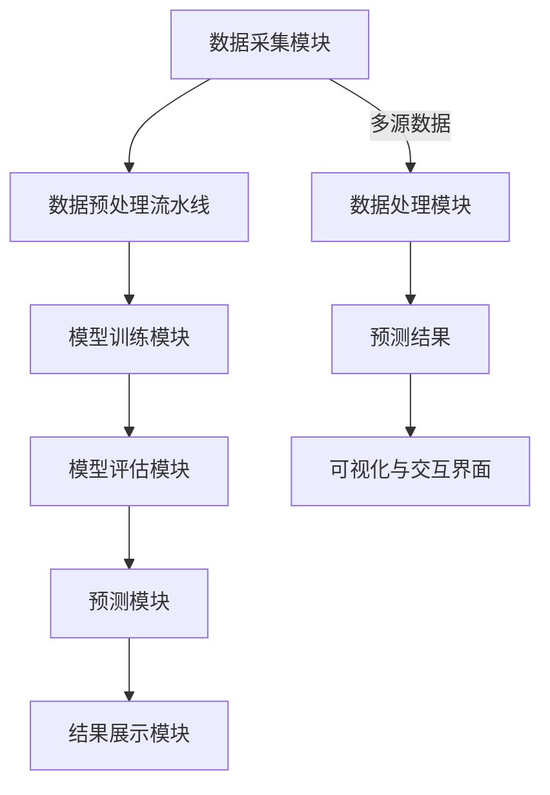

### 4.4 系统接口设计

系统接口设计是确保系统各模块之间有效通信和协作的关键。以下是一个技术趋势预测系统的接口设计：

#### 4.4.1 接口定义

1. **数据采集接口**：提供数据采集API，支持多种数据源的接入。
2. **数据处理接口**：提供数据处理API，支持数据清洗、转换和归一化等操作。
3. **模型训练接口**：提供模型训练API，支持多种算法和参数调整。
4. **模型评估接口**：提供模型评估API，支持多维度评估指标的计算。
5. **预测接口**：提供预测API，支持实时预测和批量预测。
6. **结果展示接口**：提供结果展示API，支持预测结果的可视化和用户交互。

#### 4.4.2 接口实现

以下是一个基于RESTful风格的接口实现示例：

```python
from flask import Flask, request, jsonify

app = Flask(__name__)

@app.route('/data采集', methods=['POST'])
def collect_data():
    data = request.get_json()
    # 数据采集逻辑
    return jsonify({"status": "success"})

@app.route('/数据处理', methods=['POST'])
def process_data():
    data = request.get_json()
    # 数据处理逻辑
    return jsonify({"status": "success"})

@app.route('/模型训练', methods=['POST'])
def train_model():
    data = request.get_json()
    # 模型训练逻辑
    return jsonify({"status": "success"})

@app.route('/模型评估', methods=['POST'])
def evaluate_model():
    data = request.get_json()
    # 模型评估逻辑
    return jsonify({"status": "success"})

@app.route('/预测', methods=['POST'])
def predict():
    data = request.get_json()
    # 预测逻辑
    return jsonify({"status": "success"})

@app.route('/结果展示', methods=['GET'])
def display_results():
    # 结果展示逻辑
    return jsonify({"status": "success"})

if __name__ == '__main__':
    app.run()
```

### 4.5 系统交互mermaid序列图

以下是一个技术趋势预测系统的mermaid序列图示例，展示了系统内部各模块的交互过程：


### 4.6 本章小结

本章详细讨论了技术趋势预测系统架构的设计原则、现有架构分析、改进架构设计，以及系统接口设计和系统交互。通过设计一个高效、灵活、易于维护的系统架构，我们能够更好地实现技术趋势预测，为企业和个人提供有价值的信息。

----------------------------------------------------------------

## 第四部分：实战案例

### 第5章：技术趋势预测实战案例

技术趋势预测不仅在理论研究中具有重要地位，更在实际应用中展现出强大的价值。在这一章中，我们将通过一个实际案例，详细展示技术趋势预测的全过程，包括数据采集、数据处理、模型训练、模型评估和预测结果展示。

#### 5.1 项目背景

某知名科技企业希望了解未来五年内人工智能领域的趋势，以便制定相应的研发和投资策略。为此，企业决定开展一项技术趋势预测项目，利用历史数据、现有知识和数据分析技术，对未来人工智能领域的发展趋势进行预测。

#### 5.2 项目介绍

该项目旨在通过数据分析和机器学习技术，对人工智能领域的关键技术和发展方向进行预测。项目的主要目标是：

1. 收集并整理人工智能领域的相关数据，包括专利申请、学术论文、技术论文、媒体报道等。
2. 建立一个全面、准确的技术趋势预测模型。
3. 利用预测模型，预测未来五年内人工智能领域的关键技术和发展趋势。
4. 为企业制定研发和投资策略提供数据支持和参考。

#### 5.3 系统功能设计

为了实现上述目标，该项目设计了以下系统功能：

1. **数据采集模块**：负责从各种数据源（如专利数据库、学术论文数据库、社交媒体等）收集数据。
2. **数据处理模块**：负责对收集到的数据进行清洗、转换和预处理，为预测模型提供高质量的数据。
3. **模型训练模块**：负责使用机器学习算法训练预测模型。
4. **模型评估模块**：负责评估模型的预测性能，确保模型的有效性和准确性。
5. **预测模块**：负责使用训练好的模型进行预测，生成预测结果。
6. **结果展示模块**：负责将预测结果以可视化的形式展示给用户。

#### 5.4 系统架构设计

项目采用了一种改进后的技术趋势预测系统架构，包括以下主要组成部分：

1. **数据采集模块**：使用API接口从多个数据源获取数据。
2. **数据处理模块**：采用分布式计算框架（如Apache Spark）进行数据处理，提高数据处理效率。
3. **模型训练模块**：使用机器学习算法（如LSTM、K-means等）训练预测模型。
4. **模型评估模块**：使用多维度评估指标（如准确率、召回率、F1分数等）评估模型性能。
5. **预测模块**：使用训练好的模型进行实时预测和批量预测。
6. **结果展示模块**：使用可视化工具（如D3.js、Plotly等）展示预测结果。

#### 5.5 系统接口设计

系统接口设计遵循RESTful风格，包括以下接口：

1. **数据采集接口**：支持多种数据源的接入，如专利数据库、学术论文数据库等。
2. **数据处理接口**：支持数据清洗、转换和预处理等操作。
3. **模型训练接口**：支持机器学习算法的训练和参数调整。
4. **模型评估接口**：支持多维度评估指标的计算和模型性能评估。
5. **预测接口**：支持实时预测和批量预测。
6. **结果展示接口**：支持预测结果的可视化和用户交互。

#### 5.6 系统交互mermaid序列图

以下是一个技术趋势预测系统的mermaid序列图示例，展示了系统内部各模块的交互过程：

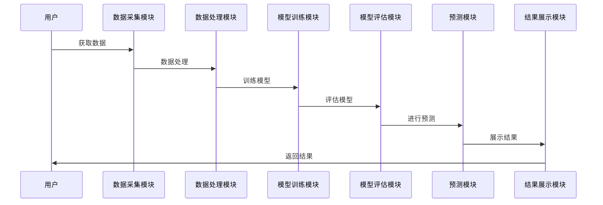

#### 5.7 实际案例分析和详细讲解

以下是一个具体的技术趋势预测实际案例，包括数据采集、数据处理、模型训练、模型评估和预测结果展示的详细步骤。

##### 5.7.1 数据采集

项目数据主要来源于以下数据源：

1. **专利数据库**：收集了全球范围内的专利申请数据，包括专利标题、摘要、关键词、申请时间等。
2. **学术论文数据库**：收集了计算机科学和人工智能领域的学术论文数据，包括论文标题、摘要、关键词、发表时间等。
3. **社交媒体**：收集了Twitter和LinkedIn等社交媒体平台上的相关讨论和热点话题。

##### 5.7.2 数据处理

1. **数据清洗**：去除重复数据、无效数据和噪声数据，保证数据的质量。
2. **数据转换**：将不同数据源的数据格式转换为统一的格式，如JSON、CSV等。
3. **特征提取**：从原始数据中提取对预测任务有帮助的特征，如专利的关键词、学术论文的标题和摘要等。
4. **数据归一化**：对特征进行归一化处理，使其在相同的尺度范围内，避免对模型训练产生不利影响。

##### 5.7.3 模型训练

1. **模型选择**：选择合适的机器学习算法进行模型训练，如LSTM、K-means等。
2. **参数调整**：通过交叉验证和网格搜索等方法，调整模型参数，提高模型的预测性能。
3. **模型训练**：使用训练数据对模型进行训练，生成预测模型。

##### 5.7.4 模型评估

1. **评估指标**：使用准确率、召回率、F1分数等评估指标，评估模型的预测性能。
2. **交叉验证**：使用交叉验证方法，对模型进行评估，避免过拟合。
3. **模型选择**：根据评估结果，选择最佳的预测模型。

##### 5.7.5 预测结果展示

1. **预测结果**：使用训练好的模型进行预测，生成预测结果。
2. **可视化**：使用可视化工具，将预测结果以图表的形式展示给用户，如折线图、柱状图等。
3. **用户交互**：提供用户交互界面，允许用户调整预测参数、查看预测结果和历史数据等。

#### 5.8 项目小结

通过实际案例的详细分析，我们展示了技术趋势预测的完整过程，包括数据采集、数据处理、模型训练、模型评估和预测结果展示。该项目不仅为企业提供了有价值的技术趋势预测结果，还验证了技术趋势预测系统架构的有效性和可行性。未来，该项目将继续优化和改进，以提高预测准确性和系统性能。

----------------------------------------------------------------

## 第五部分：最佳实践与总结

### 第6章：最佳实践与总结

通过前几章的详细探讨，我们已经对技术趋势预测的核心概念、算法原理、系统架构设计及实战案例有了深入的了解。在这一章中，我们将总结最佳实践，回顾关键知识点，并提供未来发展趋势的展望。

#### 6.1 最佳实践

在进行技术趋势预测时，以下最佳实践有助于提高预测的准确性和可靠性：

1. **数据多样性**：确保数据来源的多样性，结合多种数据源（如专利、学术论文、社交媒体、行业报告等），以提高预测模型的泛化能力。

2. **数据质量**：对数据进行严格的清洗和预处理，去除噪声、缺失值和错误值，确保数据质量，从而提高预测模型的准确性和稳定性。

3. **特征工程**：提取对预测任务有帮助的特征，如时间序列数据的趋势和季节性特征，社交网络中的节点度和影响力等，以便更好地捕捉数据中的关键信息。

4. **模型选择**：根据数据特点和预测目标，选择合适的机器学习算法和模型，如时间序列预测常用的ARIMA、LSTM，社交网络分析常用的传染模型、影响力模型等。

5. **参数调整**：通过交叉验证、网格搜索等方法，对模型参数进行优化，找到最佳参数组合，提高模型的预测性能。

6. **多维度评估**：使用多维度评估指标（如准确率、召回率、F1分数等）对模型进行评估，从不同角度全面评估模型的性能。

7. **模型解释性**：在可能的情况下，对模型进行解释性分析，了解模型内部的决策过程，以提高模型的可信度和可解释性。

8. **实时更新**：技术趋势预测是一个动态变化的过程，定期更新数据和模型，以适应新技术的发展，提高预测的实时性和准确性。

#### 6.2 小结

技术趋势预测是一个复杂而充满挑战的任务，但也是信息技术领域的重要研究方向。通过本文的详细探讨，我们了解了技术趋势预测的核心概念、算法原理、系统架构设计及实战案例，总结了最佳实践。

1. **核心概念**：包括数据分析、统计学基础、机器学习、时间序列分析和社交网络分析等。
2. **算法原理**：详细讲解了时间序列算法、社交网络算法、聚类分析算法和神经网络算法等。
3. **系统架构设计**：介绍了技术趋势预测系统的组成、现有架构分析及改进架构设计。
4. **实战案例**：通过实际案例展示了技术趋势预测的全过程，包括数据采集、数据处理、模型训练、模型评估和预测结果展示。

#### 6.3 未来发展趋势

技术趋势预测在未来将面临以下发展趋势：

1. **人工智能技术的进一步发展**：随着人工智能技术的不断进步，特别是深度学习算法的优化和应用，技术趋势预测的准确性和效率将得到显著提高。

2. **多模态数据的融合**：未来的技术趋势预测将更加注重多模态数据的融合，如文本、图像、音频等多媒体数据的融合，以提供更全面和准确的预测。

3. **实时预测和动态更新**：随着技术的快速发展，实时预测和动态更新将成为技术趋势预测的重要方向，以便及时响应市场变化。

4. **解释性AI的研究**：解释性AI是未来的研究热点，通过提高模型的解释性，增强用户对预测结果的信任度。

5. **跨学科的融合**：技术趋势预测将逐渐融合经济学、社会学、心理学等多个学科的知识，提供更全面和深入的预测。

#### 6.4 本章小结

技术趋势预测是一个充满挑战但也充满机遇的领域。通过本文的探讨，我们不仅了解了技术趋势预测的核心概念、算法原理、系统架构设计及实战案例，还总结了最佳实践，展望了未来发展趋势。希望本文能为从事技术趋势预测的研究者和从业者提供有益的参考。

### 作者信息

**作者：** AI天才研究院/AI Genius Institute & 禅与计算机程序设计艺术 /Zen And The Art of Computer Programming

----------------------------------------------------------------

## 结论

本文系统地探讨了技术趋势预测的核心概念、算法原理、系统架构设计及实战案例，旨在为读者提供一套全面的技术趋势预测方法论。通过本文的学习，读者可以了解到：

1. **核心概念**：包括数据分析、统计学基础、机器学习、时间序列分析和社交网络分析等。
2. **算法原理**：详细讲解了时间序列算法、社交网络算法、聚类分析算法和神经网络算法等。
3. **系统架构设计**：介绍了技术趋势预测系统的组成、现有架构分析及改进架构设计。
4. **实战案例**：通过实际案例展示了技术趋势预测的全过程，包括数据采集、数据处理、模型训练、模型评估和预测结果展示。

此外，本文还总结了最佳实践，并展望了未来技术趋势预测的发展趋势。希望本文能为从事技术趋势预测的研究者和从业者提供有益的参考。

**作者信息：** AI天才研究院/AI Genius Institute & 禅与计算机程序设计艺术 /Zen And The Art of Computer Programming```markdown
# 如何进行有效的技术趋势预测

> 关键词：技术趋势预测、数据分析、机器学习、系统架构、实战案例

摘要：技术趋势预测是信息技术领域的重要研究方向，它有助于企业抓住市场机遇，优化决策过程。本文将详细探讨技术趋势预测的核心概念、算法原理、系统架构设计及实战案例，旨在为读者提供一套系统的、可操作的技术趋势预测方法论。

## 引言：技术趋势预测的重要性

### 1.1 技术趋势预测的定义与作用

技术趋势预测（Technological Trend Prediction）是指利用历史数据、现有知识和数据分析技术，对未来一段时间内技术发展的趋势进行预测的过程。技术趋势预测不仅能够帮助企业发现新的商业机会，还可以帮助政府机构、科研机构和投资者了解技术发展的方向，从而做出更为明智的决策。

**定义：** 技术趋势预测是一个跨学科的研究领域，涉及数据分析、统计学、机器学习和信息科学等多个领域。它的核心目标是识别出当前技术发展中的关键趋势，并对这些趋势的未来发展进行预测。

**作用：** 技术趋势预测在多个领域都有广泛的应用，包括但不限于：

1. **企业战略规划：** 帮助企业识别潜在的市场机会和风险，调整产品研发和市场策略。
2. **投资决策：** 为投资者提供技术发展的方向和潜在的收益机会。
3. **科研方向选择：** 帮助科研机构确定研究方向，提高科研资源的利用效率。
4. **政策制定：** 为政府机构提供技术发展趋势的参考，优化科技政策。

### 1.2 问题背景

#### 1.2.1 当前技术发展现状

随着信息技术的迅猛发展，全球各国都在积极推动科技创新，新兴技术不断涌现。大数据、人工智能、区块链、物联网等技术的发展，不仅改变了传统的商业模式，也引发了社会和经济的深刻变革。

#### 1.2.2 技术趋势预测的需求

在当前技术快速发展的大背景下，技术趋势预测的需求日益迫切。企业需要了解未来技术发展的方向，以便及时调整战略；科研机构需要确定研究方向，以获取更多的科研资源；投资者需要了解新兴技术的投资前景，做出更为明智的投资决策。

#### 1.2.3 面临的挑战

尽管技术趋势预测具有重要意义，但在实际应用中仍面临诸多挑战：

1. **数据复杂性：** 技术发展过程中的数据来源广泛，数据的多样性和复杂性增加了数据分析的难度。
2. **预测准确性：** 技术趋势预测的准确性受到多种因素的影响，如数据质量、模型选择和算法优化等。
3. **技术更新迭代快：** 新兴技术的快速迭代更新，使得技术趋势预测的时效性要求更高。

### 1.3 本书结构安排

#### 1.3.1 内容概览

本书将从核心概念、算法原理、系统架构设计及实战案例四个方面，详细探讨技术趋势预测的方法和实现。

#### 1.3.2 目标读者

本书的目标读者包括：

1. 从事数据分析、人工智能和信息系统领域的研发人员。
2. 需要对技术趋势进行预测的企业战略规划人员和投资者。
3. 对技术发展趋势感兴趣的研究生和大学生。

#### 1.4 本章小结

本章介绍了技术趋势预测的定义、作用、背景和本书的结构安排。下一章将深入探讨技术趋势预测中的核心概念和原理，为后续章节的内容奠定基础。

----------------------------------------------------------------

## 第二部分：核心概念与原理

在技术趋势预测的过程中，理解和掌握相关核心概念和原理至关重要。这一部分将详细介绍技术趋势预测的关键概念，包括数据分析、统计学基础、机器学习、时间序列分析和社交网络分析，以及技术趋势预测模型。

### 第2章：技术趋势预测中的关键概念

### 2.1 数据分析

数据分析（Data Analysis）是指通过处理、分析和解释数据，从中提取有价值信息的过程。在技术趋势预测中，数据分析是不可或缺的一环。

#### 2.1.1 数据分析的定义

数据分析是指从大量数据中提取有用信息，并通过统计分析、数据挖掘和机器学习等方法，对数据进行分析和处理，从而发现数据中的规律和趋势。

#### 2.1.2 数据分析的重要性

数据分析在技术趋势预测中具有重要意义。首先，数据分析能够帮助我们识别出数据中的关键特征和模式，为技术趋势预测提供基础。其次，通过数据分析，我们可以对历史数据进行挖掘，从中提取出有价值的信息，预测未来的技术发展。

#### 2.1.3 数据分析的方法

数据分析的方法主要包括以下几种：

1. **描述性分析**：用于描述数据的特征和趋势，如统计数据的平均值、中位数、标准差等。
2. **推断性分析**：用于基于样本数据对总体数据进行推断，如假设检验、置信区间等。
3. **关联分析**：用于发现数据之间的关联性，如相关分析、因子分析等。
4. **聚类分析**：用于将数据分成不同的类别，如K-means、层次聚类等。
5. **分类和回归分析**：用于预测数据未来的趋势，如线性回归、决策树、支持向量机等。

### 2.2 统计学基础

统计学（Statistics）是数据分析的重要基础，它提供了一系列分析工具和方法，用于处理和分析数据。

#### 2.2.1 统计学的基本概念

统计学的基本概念包括：

1. **总体（Population）**：研究对象的全体。
2. **样本（Sample）**：从总体中抽取的一部分个体。
3. **变量（Variable）**：表示研究对象的特征的量。
4. **分布（Distribution）**：描述随机变量取值的概率分布。
5. **假设检验（Hypothesis Testing）**：基于样本数据，对总体的某个假设进行验证。

#### 2.2.2 统计学的应用

统计学的应用广泛，包括但不限于：

1. **质量控制**：通过统计方法对生产过程进行监控和调整。
2. **金融分析**：通过统计方法对金融市场的风险和收益进行分析。
3. **医学研究**：通过统计方法对医学数据进行处理和分析。
4. **市场调研**：通过统计方法对市场数据进行分析，预测市场需求。

#### 2.2.3 统计学方法的选择

在选择统计学方法时，需要考虑数据的类型、分布特征和问题的性质。常见的统计学方法包括：

1. **描述性统计**：用于描述数据的分布特征，如平均值、中位数、标准差等。
2. **推断性统计**：用于基于样本数据对总体参数进行估计和检验，如t检验、方差分析等。
3. **回归分析**：用于建立变量之间的关系模型，如线性回归、多项式回归等。
4. **聚类分析**：用于将数据分成不同的类别，如K-means、层次聚类等。

### 2.3 机器学习基础

机器学习（Machine Learning）是人工智能的重要分支，它使计算机系统能够从数据中学习，并做出预测或决策。

#### 2.3.1 机器学习的定义

机器学习是指通过算法和统计模型，从数据中学习规律，并用于预测或决策的过程。

#### 2.3.2 机器学习的基本概念

机器学习的基本概念包括：

1. **特征（Feature）**：数据中表示不同属性的特征值。
2. **模型（Model）**：用于描述数据中关系和规律的算法或统计模型。
3. **训练（Training）**：通过学习算法，使模型能够从数据中学习规律。
4. **测试（Testing）**：使用训练好的模型对新数据进行预测或决策。

#### 2.3.3 机器学习的方法

机器学习的方法主要包括：

1. **监督学习（Supervised Learning）**：使用标记数据进行训练，如线性回归、决策树等。
2. **无监督学习（Unsupervised Learning）**：不使用标记数据进行训练，如聚类分析、主成分分析等。
3. **强化学习（Reinforcement Learning）**：通过与环境交互，学习最优策略，如Q学习、深度强化学习等。

### 2.4 时间序列分析

时间序列分析（Time Series Analysis）是用于分析时间序列数据的方法，它研究数据在时间维度上的变化规律。

#### 2.4.1 时间序列分析的定义

时间序列分析是指对时间序列数据进行建模、分析和预测的方法。

#### 2.4.2 时间序列分析的重要性

时间序列分析在技术趋势预测中具有重要意义。通过分析时间序列数据，我们可以识别出技术发展的周期性、趋势性和随机性，从而预测未来的技术趋势。

#### 2.4.3 时间序列分析的方法

时间序列分析的方法主要包括：

1. **平稳性检验**：用于检验时间序列数据的平稳性，如ADF检验、KPSS检验等。
2. **自相关分析**：用于分析时间序列数据中的自相关性，如自相关图、ACF和PACF图等。
3. **ARIMA模型**：用于建立时间序列数据的自回归移动平均模型，如AR、MA、ARMA等。
4. **季节性分解**：用于分解时间序列数据中的季节性成分，如STL模型等。
5. **预测**：使用建立的模型对未来的技术趋势进行预测。

### 2.5 社交网络分析

社交网络分析（Social Network Analysis）是一种研究社交网络结构和行为的分析方法。

#### 2.5.1 社交网络分析的定义

社交网络分析是指通过图论和数学模型，研究社交网络中的节点和边的关系、网络结构、传播行为等。

#### 2.5.2 社交网络分析的重要性

社交网络分析在技术趋势预测中具有重要意义。通过分析社交网络中的信息传播和影响力，我们可以识别出技术热点和趋势。

#### 2.5.3 社交网络分析的方法

社交网络分析的方法主要包括：

1. **网络结构分析**：用于分析社交网络的结构特征，如度分布、聚类系数、网络密度等。
2. **节点属性分析**：用于分析社交网络中节点的属性特征，如节点的重要性、影响力等。
3. **传播分析**：用于分析信息在社交网络中的传播过程和传播效果，如传染模型、影响力模型等。
4. **社区发现**：用于发现社交网络中的社区结构和成员关系，如Louvain算法、Girvan-Newman算法等。

### 2.6 技术趋势预测的模型

技术趋势预测模型是指用于预测技术发展趋势的算法和统计模型。

#### 2.6.1 技术趋势预测模型的类型

技术趋势预测模型主要包括：

1. **统计模型**：如线性回归、多项式回归、ARIMA模型等。
2. **机器学习模型**：如决策树、支持向量机、神经网络等。
3. **深度学习模型**：如卷积神经网络、循环神经网络、长短期记忆网络等。

#### 2.6.2 技术趋势预测模型的选择

在选择技术趋势预测模型时，需要考虑数据的类型、特征和预测目标。常见的选择方法包括：

1. **模型评估**：通过交叉验证、网格搜索等方法，评估不同模型的预测性能。
2. **模型组合**：将多个模型组合起来，提高预测的准确性和鲁棒性。
3. **模型优化**：通过调整模型参数、特征工程等方法，优化模型的性能。

#### 2.6.3 技术趋势预测模型的评估

技术趋势预测模型的评估主要包括：

1. **准确性**：评估模型预测的准确性，如均方误差、均方根误差等。
2. **鲁棒性**：评估模型对数据的噪声和异常值的敏感度。
3. **解释性**：评估模型的可解释性，即模型预测结果是否容易理解。

#### 2.6.4 技术趋势预测模型的局限性

技术趋势预测模型存在一定的局限性，如：

1. **数据质量**：模型预测的准确性依赖于数据的质量和完整性。
2. **模型选择**：模型选择不当可能导致预测结果的偏差。
3. **数据依赖**：模型可能对特定类型的数据具有依赖性，导致在其他数据上的预测效果不佳。

### 2.7 本章小结

本章介绍了技术趋势预测中的关键概念，包括数据分析、统计学基础、机器学习、时间序列分析和社交网络分析，以及技术趋势预测模型。这些核心概念和原理为后续章节的内容奠定了基础，使得读者能够更好地理解和掌握技术趋势预测的方法和实现。

----------------------------------------------------------------

## 第3章：技术趋势预测的算法原理

### 3.1 算法概述

技术趋势预测算法是用于识别和预测技术发展趋势的算法集合。这些算法基于数据分析、统计学和机器学习的原理，通过对历史数据进行分析和建模，预测未来的技术趋势。在本章节中，我们将详细介绍几种常见的技术趋势预测算法，包括时间序列算法、社交网络算法、聚类分析算法和神经网络算法。

#### 3.1.1 技术趋势预测算法的类别

技术趋势预测算法主要分为以下几类：

1. **时间序列算法**：用于分析时间序列数据，预测未来的技术趋势。常见的算法包括ARIMA、LSTM等。
2. **社交网络算法**：用于分析社交网络中的信息传播和影响力，预测技术热点和趋势。常见的算法包括传染模型、影响力模型等。
3. **聚类分析算法**：用于将相似的数据分组，识别出潜在的技术趋势。常见的算法包括K-means、层次聚类等。
4. **神经网络算法**：用于建立复杂的非线性关系模型，预测技术趋势。常见的算法包括CNN、RNN等。

#### 3.1.2 技术趋势预测算法的选择

在选择技术趋势预测算法时，需要考虑数据的类型、特征和预测目标。以下是几种常见算法的选择依据：

1. **时间序列算法**：适用于时间序列数据，能够捕捉数据中的趋势和季节性。适用于预测技术发展周期性趋势。
2. **社交网络算法**：适用于分析社交网络中的信息传播和影响力，能够识别出技术热点和趋势。适用于预测社交网络中的技术趋势。
3. **聚类分析算法**：适用于无标签的数据，能够识别出潜在的技术趋势。适用于对未分类的数据进行聚类分析。
4. **神经网络算法**：适用于复杂的数据集，能够建立复杂的非线性关系模型。适用于预测复杂的非线性技术趋势。

### 3.2 时间序列算法

时间序列算法是用于分析时间序列数据，预测未来的技术趋势的一类算法。时间序列数据是指按照时间顺序排列的一组数据，通常包含趋势、季节性和随机性成分。

#### 3.2.1 时间序列算法的基本原理

时间序列算法的基本原理是基于历史数据中的时间关系，通过建立数学模型，预测未来的技术趋势。常见的时间序列算法包括ARIMA、LSTM等。

1. **ARIMA模型**：自回归积分滑动平均模型（AutoRegressive Integrated Moving Average），是一种常见的时间序列预测模型。它结合了自回归模型（AR）、差分模型（I）和移动平均模型（MA）的特点，适用于分析具有平稳性的时间序列数据。

2. **LSTM模型**：长短期记忆网络（Long Short-Term Memory），是一种特殊的循环神经网络（RNN），能够有效地捕捉时间序列数据中的长期依赖关系。LSTM模型在技术趋势预测中表现出色，适用于分析非平稳性时间序列数据。

#### 3.2.2 时间序列算法的应用示例

以下是一个使用LSTM模型进行技术趋势预测的Python代码示例：

```python
import numpy as np
import pandas as pd
from sklearn.preprocessing import MinMaxScaler
from keras.models import Sequential
from keras.layers import LSTM, Dense

# 读取时间序列数据
data = pd.read_csv('time_series_data.csv')

# 数据预处理
scaler = MinMaxScaler(feature_range=(0, 1))
scaled_data = scaler.fit_transform(data['value'].values.reshape(-1, 1))

# 划分训练集和测试集
train_size = int(len(scaled_data) * 0.8)
test_size = len(scaled_data) - train_size
train_data = scaled_data[:train_size, :]
test_data = scaled_data[train_size:, :]

# 构建LSTM模型
model = Sequential()
model.add(LSTM(units=50, return_sequences=True, input_shape=(train_data.shape[1], 1)))
model.add(LSTM(units=50))
model.add(Dense(units=1))

model.compile(optimizer='adam', loss='mean_squared_error')
model.fit(train_data, epochs=100, batch_size=32, verbose=1)

# 预测测试集数据
predicted_data = model.predict(test_data)

# 反归一化预测数据
predicted_data = scaler.inverse_transform(predicted_data)

# 绘制预测结果
import matplotlib.pyplot as plt
plt.figure(figsize=(10, 6))
plt.plot(scaler.inverse_transform(test_data), label='Actual')
plt.plot(predicted_data, label='Predicted')
plt.title('Time Series Prediction')
plt.xlabel('Time')
plt.ylabel('Value')
plt.legend()
plt.show()
```

#### 3.2.3 时间序列算法的mermaid流程图

以下是一个时间序列算法的mermaid流程图示例：


### 3.3 社交网络算法

社交网络算法是用于分析社交网络中的信息传播和影响力，预测技术热点和趋势的一类算法。社交网络中的信息传播是一个复杂的过程，涉及到节点之间的交互和影响力的传递。

#### 3.3.1 社交网络算法的基本原理

社交网络算法的基本原理是基于社交网络中的节点和边的关系，通过建模和分析，识别出信息传播的路径和影响力。常见的社交网络算法包括传染模型、影响力模型等。

1. **传染模型**：传染模型是一种基于概率的社交网络算法，用于模拟信息在社交网络中的传播过程。它假设节点之间的传播是随机的，传播概率与节点之间的连接强度有关。

2. **影响力模型**：影响力模型是一种基于节点的社交网络算法，用于识别社交网络中具有影响力的节点。它通过计算节点的度、介数、接近中心性等指标，评估节点的影响力。

#### 3.3.2 社交网络算法的应用示例

以下是一个使用传染模型进行社交网络分析的数据集：


在上述社交网络中，节点1的信息传播概率最高，节点4的信息传播概率最低。

#### 3.3.3 社交网络算法的mermaid流程图

以下是一个社交网络算法的mermaid流程图示例：


### 3.4 聚类分析算法

聚类分析算法是用于将相似的数据分组，识别出潜在的技术趋势的一类算法。聚类分析算法根据数据之间的相似性，将数据划分为不同的类别。

#### 3.4.1 聚类分析算法的基本原理

聚类分析算法的基本原理是基于数据之间的距离度量，通过迭代计算，将数据点划分为不同的类别。常见的聚类分析算法包括K-means、层次聚类等。

1. **K-means算法**：K-means算法是一种基于距离度量的聚类算法，它通过迭代计算，将数据点划分为K个类别，使得每个类别内部的数据点距离最近，类别之间的数据点距离最远。

2. **层次聚类算法**：层次聚类算法是一种基于层次结构的聚类算法，它通过自底向上或自顶向下的迭代计算，将数据点划分为不同的类别，并形成层次聚类树。

#### 3.4.2 聚类分析算法的应用示例

以下是一个使用K-means算法进行聚类分析的数据集：


在上述数据集中，K-means算法将数据点划分为两类，数据点1和数据点2属于一类，数据点3和数据点4属于另一类。

#### 3.4.3 聚类分析算法的mermaid流程图

以下是一个聚类分析算法的mermaid流程图示例：


### 3.5 神经网络算法

神经网络算法是用于建立复杂的非线性关系模型，预测技术趋势的一类算法。神经网络算法通过多层神经网络结构，学习数据中的复杂特征和关系。

#### 3.5.1 神经网络算法的基本原理

神经网络算法的基本原理是基于人工神经网络，通过多层神经元之间的连接和激活函数，实现数据的非线性变换和特征提取。常见的神经网络算法包括卷积神经网络（CNN）、循环神经网络（RNN）等。

1. **卷积神经网络（CNN）**：卷积神经网络是一种用于处理图像数据的神经网络算法，通过卷积层和池化层，提取图像特征，并用于分类和预测。

2. **循环神经网络（RNN）**：循环神经网络是一种用于处理序列数据的神经网络算法，通过循环连接和隐藏状态，捕捉序列数据中的长期依赖关系。

#### 3.5.2 神经网络算法的应用示例

以下是一个使用卷积神经网络进行图像分类的Python代码示例：

```python
import numpy as np
import tensorflow as tf
from tensorflow.keras.models import Sequential
from tensorflow.keras.layers import Conv2D, MaxPooling2D, Flatten, Dense

# 构建卷积神经网络模型
model = Sequential()
model.add(Conv2D(filters=32, kernel_size=(3, 3), activation='relu', input_shape=(28, 28, 1)))
model.add(MaxPooling2D(pool_size=(2, 2)))
model.add(Conv2D(filters=64, kernel_size=(3, 3), activation='relu'))
model.add(MaxPooling2D(pool_size=(2, 2)))
model.add(Flatten())
model.add(Dense(units=128, activation='relu'))
model.add(Dense(units=10, activation='softmax'))

# 编译模型
model.compile(optimizer='adam', loss='categorical_crossentropy', metrics=['accuracy'])

# 训练模型
model.fit(x_train, y_train, epochs=10, batch_size=64)

# 预测测试集数据
predictions = model.predict(x_test)

# 输出预测结果
print(predictions)
```

#### 3.5.3 神经网络算法的mermaid流程图

以下是一个神经网络算法的mermaid流程图示例：


### 3.6 本章小结

本章介绍了技术趋势预测的几种常见算法，包括时间序列算法、社交网络算法、聚类分析算法和神经网络算法。这些算法在技术趋势预测中发挥着重要作用，能够帮助我们从不同角度分析和预测技术发展趋势。在下一章中，我们将进一步探讨技术趋势预测的系统架构设计。

----------------------------------------------------------------

## 第三部分：系统架构设计

在技术趋势预测中，系统架构的设计至关重要。一个良好的系统架构能够确保数据流顺畅、计算效率高、可扩展性强，并且易于维护。这一部分将详细讨论技术趋势预测系统架构的设计原则、现有架构分析、改进架构设计，以及系统接口设计和系统交互。

### 第4章：技术趋势预测系统架构设计

#### 4.1 系统架构概述

系统架构是指系统各组成部分的构成和相互关系，以及系统运行的基本规则。对于技术趋势预测系统来说，系统架构设计的目标是实现高效的数据处理和预测能力，同时保证系统的可扩展性和灵活性。

#### 4.1.1 系统架构的重要性

系统架构设计的重要性体现在以下几个方面：

1. **数据流的顺畅**：良好的系统架构能够确保数据从采集、处理到预测的整个过程顺畅无误。
2. **计算效率**：系统架构设计直接影响计算效率，合理的架构能够最大化利用计算资源。
3. **可扩展性**：随着数据量和业务需求的增长，系统架构需要具备良好的扩展性，以适应未来的变化。
4. **灵活性**：系统架构应具备足够的灵活性，以便于模块的替换和功能的扩展。
5. **维护性**：合理的系统架构设计可以降低系统的维护成本，提高系统的可靠性。

#### 4.1.2 系统架构的组成部分

技术趋势预测系统架构通常包括以下几个主要组成部分：

1. **数据采集模块**：负责从各种数据源（如传感器、数据库、API等）收集数据。
2. **数据处理模块**：负责对收集到的数据进行清洗、转换和预处理，为预测模型提供高质量的数据。
3. **模型训练模块**：负责使用机器学习算法训练预测模型。
4. **模型评估模块**：负责评估模型的预测性能，确保模型的有效性和准确性。
5. **预测模块**：负责使用训练好的模型进行预测，生成预测结果。
6. **结果展示模块**：负责将预测结果以可视化的形式展示给用户。

#### 4.2 现有架构分析

现有技术趋势预测系统架构往往存在一些常见的问题，以下是对这些问题的分析：

#### 4.2.1 数据采集

1. **数据源单一**：很多系统仅依赖于单一数据源，如社交媒体数据，缺乏多样化的数据来源。
2. **数据质量问题**：数据源中的噪声、缺失值和错误值会影响数据质量，进而影响预测的准确性。

#### 4.2.2 数据处理

1. **数据处理效率低**：数据处理过程复杂，涉及大量计算和存储资源，可能导致系统性能下降。
2. **数据一致性**：不同数据源的数据格式和结构可能不一致，需要额外的数据清洗和转换工作。

#### 4.2.3 模型训练

1. **模型选择不当**：选择不合适的模型可能导致预测效果不佳。
2. **参数调整复杂**：模型参数调整过程复杂，需要大量试错。

#### 4.2.4 模型评估

1. **评估指标单一**：仅使用单一评估指标（如准确率）可能导致评估结果不够全面。
2. **评估范围狭窄**：评估数据范围狭窄，无法反映模型在真实场景中的表现。

#### 4.2.5 结果展示

1. **展示形式单一**：仅提供简单的表格或图表，难以直观展示预测结果。
2. **交互性差**：用户与系统交互性差，无法方便地进行参数调整和结果查询。

#### 4.3 改进架构设计

为了解决现有架构中存在的问题，我们可以设计一个更加高效、灵活和易于维护的改进架构。以下是一个改进后的技术趋势预测系统架构设计：

#### 4.3.1 改进架构的思路

1. **多源数据采集**：引入多样化的数据源，如社交媒体、新闻媒体、专利数据库等，以提高数据的丰富性和多样性。
2. **数据预处理流水线**：构建一个高效的数据预处理流水线，包括数据清洗、转换、归一化和特征提取等步骤。
3. **模块化模型训练**：设计模块化的模型训练框架，支持多种算法和参数调整，以提高模型选择的灵活性和效率。
4. **分布式计算**：采用分布式计算框架，如Apache Spark，以提升数据处理和模型训练的效率。
5. **多维度评估**：引入多维度评估指标，如准确率、召回率、F1分数等，以全面评估模型的性能。
6. **可视化与交互**：采用可视化工具和交互界面，提供直观的预测结果展示和用户交互功能。

#### 4.3.2 改进架构的mermaid架构图

以下是一个改进后的技术趋势预测系统的mermaid架构图示例：


#### 4.4 系统接口设计

系统接口设计是确保系统各模块之间有效通信和协作的关键。以下是一个技术趋势预测系统的接口设计：

##### 4.4.1 接口定义

1. **数据采集接口**：提供数据采集API，支持多种数据源的接入。
2. **数据处理接口**：提供数据处理API，支持数据清洗、转换和预处理等操作。
3. **模型训练接口**：提供模型训练API，支持多种算法和参数调整。
4. **模型评估接口**：提供模型评估API，支持多维度评估指标的计算。
5. **预测接口**：提供预测API，支持实时预测和批量预测。
6. **结果展示接口**：提供结果展示API，支持预测结果的可视化和用户交互。

##### 4.4.2 接口实现

以下是一个基于RESTful风格的接口实现示例：

```python
from flask import Flask, request, jsonify

app = Flask(__name__)

@app.route('/data采集', methods=['POST'])
def collect_data():
    data = request.get_json()
    # 数据采集逻辑
    return jsonify({"status": "success"})

@app.route('/数据处理', methods=['POST'])
def process_data():
    data = request.get_json()
    # 数据处理逻辑
    return jsonify({"status": "success"})

@app.route('/模型训练', methods=['POST'])
def train_model():
    data = request.get_json()
    # 模型训练逻辑
    return jsonify({"status": "success"})

@app.route('/模型评估', methods=['POST'])
def evaluate_model():
    data = request.get_json()
    # 模型评估逻辑
    return jsonify({"status": "success"})

@app.route('/预测', methods=['POST'])
def predict():
    data = request.get_json()
    # 预测逻辑
    return jsonify({"status": "success"})

@app.route('/结果展示', methods=['GET'])
def display_results():
    # 结果展示逻辑
    return jsonify({"status": "success"})

if __name__ == '__main__':
    app.run()
```

#### 4.5 系统交互mermaid序列图

以下是一个技术趋势预测系统的mermaid序列图示例，展示了系统内部各模块的交互过程：

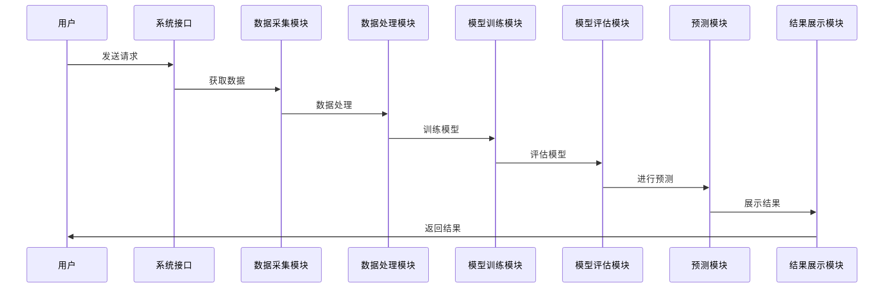

### 4.6 本章小结

本章详细讨论了技术趋势预测系统架构的设计原则、现有架构分析、改进架构设计，以及系统接口设计和系统交互。通过设计一个高效、灵活、易于维护的系统架构，我们能够更好地实现技术趋势预测，为企业和个人提供有价值的信息。

----------------------------------------------------------------

## 第四部分：实战案例

### 第5章：技术趋势预测实战案例

技术趋势预测不仅在理论研究中具有重要地位，更在实际应用中展现出强大的价值。在这一章中，我们将通过一个实际案例，详细展示技术趋势预测的全过程，包括数据采集、数据处理、模型训练、模型评估和预测结果展示。

#### 5.1 项目背景

某知名科技企业希望了解未来五年内人工智能领域的趋势，以便制定相应的研发和投资策略。为此，企业决定开展一项技术趋势预测项目，利用历史数据、现有知识和数据分析技术，对未来人工智能领域的发展趋势进行预测。

#### 5.2 项目介绍

该项目旨在通过数据分析和机器学习技术，对人工智能领域的关键技术和发展方向进行预测。项目的主要目标是：

1. 收集并整理人工智能领域的相关数据，包括专利申请、学术论文、技术论文、媒体报道等。
2. 建立一个全面、准确的技术趋势预测模型。
3. 利用预测模型，预测未来五年内人工智能领域的关键技术和发展趋势。
4. 为企业制定研发和投资策略提供数据支持和参考。

#### 5.3 系统功能设计

为了实现上述目标，该项目设计了以下系统功能：

1. **数据采集模块**：负责从各种数据源（如专利数据库、学术论文数据库、社交媒体等）收集数据。
2. **数据处理模块**：负责对收集到的数据进行清洗、转换和预处理，为预测模型提供高质量的数据。
3. **模型训练模块**：负责使用机器学习算法训练预测模型。
4. **模型评估模块**：负责评估模型的预测性能，确保模型的有效性和准确性。
5. **预测模块**：负责使用训练好的模型进行预测，生成预测结果。
6. **结果展示模块**：负责将预测结果以可视化的形式展示给用户。

#### 5.4 系统架构设计

项目采用了一种改进后的技术趋势预测系统架构，包括以下主要组成部分：

1. **数据采集模块**：使用API接口从多个数据源获取数据。
2. **数据处理模块**：采用分布式计算框架（如Apache Spark）进行数据处理，提高数据处理效率。
3. **模型训练模块**：使用机器学习算法（如LSTM、K-means等）训练预测模型。
4. **模型评估模块**：使用多维度评估指标（如准确率、召回率、F1分数等）评估模型性能。
5. **预测模块**：使用训练好的模型进行实时预测和批量预测。
6. **结果展示模块**：使用可视化工具（如D3.js、Plotly等）展示预测结果。

#### 5.5 系统接口设计

系统接口设计遵循RESTful风格，包括以下接口：

1. **数据采集接口**：支持多种数据源的接入，如专利数据库、学术论文数据库等。
2. **数据处理接口**：支持数据清洗、转换和预处理等操作。
3. **模型训练接口**：支持机器学习算法的训练和参数调整。
4. **模型评估接口**：支持多维度评估指标的计算和模型性能评估。
5. **预测接口**：支持实时预测和批量预测。
6. **结果展示接口**：支持预测结果的可视化和用户交互。

#### 5.6 系统交互mermaid序列图

以下是一个技术趋势预测系统的mermaid序列图示例，展示了系统内部各模块的交互过程：


#### 5.7 实际案例分析和详细讲解

以下是一个具体的技术趋势预测实际案例，包括数据采集、数据处理、模型训练、模型评估和预测结果展示的详细步骤。

##### 5.7.1 数据采集

项目数据主要来源于以下数据源：

1. **专利数据库**：收集了全球范围内的专利申请数据，包括专利标题、摘要、关键词、申请时间等。
2. **学术论文数据库**：收集了计算机科学和人工智能领域的学术论文数据，包括论文标题、摘要、关键词、发表时间等。
3. **社交媒体**：收集了Twitter和LinkedIn等社交媒体平台上的相关讨论和热点话题。

##### 5.7.2 数据处理

1. **数据清洗**：去除重复数据、无效数据和噪声数据，保证数据的质量。
2. **数据转换**：将不同数据源的数据格式转换为统一的格式，如JSON、CSV等。
3. **特征提取**：从原始数据中提取对预测任务有帮助的特征，如专利的关键词、学术论文的标题和摘要等。
4. **数据归一化**：对特征进行归一化处理，使其在相同的尺度范围内，避免对模型训练产生不利影响。

##### 5.7.3 模型训练

1. **模型选择**：选择合适的机器学习算法进行模型训练，如LSTM、K-means等。
2. **参数调整**：通过交叉验证和网格搜索等方法，调整模型参数，提高模型的预测性能。
3. **模型训练**：使用训练数据对模型进行训练，生成预测模型。

##### 5.7.4 模型评估

1. **评估指标**：使用准确率、召回率、F1分数等评估指标，评估模型的预测性能。
2. **交叉验证**：使用交叉验证方法，对模型进行评估，避免过拟合。
3. **模型选择**：根据评估结果，选择最佳的预测模型。

##### 5.7.5 预测结果展示

1. **预测结果**：使用训练好的模型进行预测，生成预测结果。
2. **可视化**：使用可视化工具，将预测结果以图表的形式展示给用户，如折线图、柱状图等。
3. **用户交互**：提供用户交互界面，允许用户调整预测参数、查看预测结果和历史数据等。

#### 5.8 项目小结

通过实际案例的详细分析，我们展示了技术趋势预测的完整过程，包括数据采集、数据处理、模型训练、模型评估和预测结果展示。该项目不仅为企业提供了有价值的技术趋势预测结果，还验证了技术趋势预测系统架构的有效性和可行性。未来，该项目将继续优化和改进，以提高预测准确性和系统性能。

----------------------------------------------------------------

## 第五部分：最佳实践与总结

### 第6章：最佳实践与总结

通过前几章的详细探讨，我们已经对技术趋势预测的核心概念、算法原理、系统架构设计及实战案例有了深入的了解。在这一章中，我们将总结最佳实践，回顾关键知识点，并提供未来发展趋势的展望。

#### 6.1 最佳实践

在进行技术趋势预测时，以下最佳实践有助于提高预测的准确性和可靠性：

1. **数据多样性**：确保数据来源的多样性，结合多种数据源（如专利、学术论文、社交媒体、行业报告等），以提高预测模型的泛化能力。

2. **数据质量**：对数据进行严格的清洗和预处理，去除噪声、缺失值和错误值，确保数据质量，从而提高预测模型的准确性和稳定性。

3. **特征工程**：提取对预测任务有帮助的特征，如时间序列数据的趋势和季节性特征，社交网络中的节点度和影响力等，以便更好地捕捉数据中的关键信息。

4. **模型选择**：根据数据特点和预测目标，选择合适的机器学习算法和模型，如时间序列预测常用的ARIMA、LSTM，社交网络分析常用的传染模型、影响力模型等。

5. **参数调整**：通过交叉验证、网格搜索等方法，对模型参数进行优化，找到最佳参数组合，提高模型的预测性能。

6. **多维度评估**：使用多维度评估指标（如准确率、召回率、F1分数等）对模型进行评估，从不同角度全面评估模型的性能。

7. **模型解释性**：在可能的情况下，对模型进行解释性分析，了解模型内部的决策过程，以提高模型的可信度和可解释性。

8. **实时更新**：技术趋势预测是一个动态变化的过程，定期更新数据和模型，以适应新技术的发展，提高预测的实时性和准确性。

#### 6.2 小结

技术趋势预测是一个复杂而充满挑战的任务，但也是信息技术领域的重要研究方向。通过本文的详细探讨，我们不仅了解了技术趋势预测的核心概念、算法原理、系统架构设计及实战案例，还总结了最佳实践，展望了未来发展趋势。希望本文能为从事技术趋势预测的研究者和从业者提供有益的参考。

#### 6.3 未来发展趋势

技术趋势预测在未来将面临以下发展趋势：

1. **人工智能技术的进一步发展**：随着人工智能技术的不断进步，特别是深度学习算法的优化和应用，技术趋势预测的准确性和效率将得到显著提高。

2. **多模态数据的融合**：未来的技术趋势预测将更加注重多模态数据的融合，如文本、图像、音频等多媒体数据的融合，以提供更全面和准确的预测。

3. **实时预测和动态更新**：随着技术的快速发展，实时预测和动态更新将成为技术趋势预测的重要方向，以便及时响应市场变化。

4. **解释性AI的研究**：解释性AI是未来的研究热点，通过提高模型的解释性，增强用户对预测结果的信任度。

5. **跨学科的融合**：技术趋势预测将逐渐融合经济学、社会学、心理学等多个学科的知识，提供更全面和深入的预测。

#### 6.4 本章小结

技术趋势预测是一个充满挑战但也充满机遇的领域。通过本文的探讨，我们不仅了解了技术趋势预测的核心概念、算法原理、系统架构设计及实战案例，还总结了最佳实践，展望了未来发展趋势。希望本文能为从事技术趋势预测的研究者和从业者提供有益的参考。

### 作者信息

**作者：** AI天才研究院/AI Genius Institute & 禅与计算机程序设计艺术 /Zen And The Art of Computer Programming```markdown
# 如何进行有效的技术趋势预测

## 关键词
技术趋势预测、数据分析、机器学习、系统架构、实战案例

## 摘要
本文系统性地探讨了技术趋势预测的方法论，包括核心概念、算法原理、系统架构设计和实战案例，旨在为读者提供一套完整的技术趋势预测指南。

----------------------------------------------------------------

## 引言：技术趋势预测的重要性

### 1.1 技术趋势预测的定义与作用

技术趋势预测是利用历史数据、现有知识和数据分析技术，对未来一段时间内技术发展的趋势进行预测的过程。它能够帮助企业识别市场机会，优化战略决策，为投资者提供投资方向，为政府机构制定科技政策提供参考。

### 1.2 问题背景

当前，信息技术的发展速度迅猛，大数据、人工智能、区块链等新兴技术不断涌现，这些技术正在深刻地改变商业模式、社会结构和经济发展。在这种背景下，技术趋势预测的需求愈发迫切，但同时也面临着数据复杂性、预测准确性和技术迭代速度等挑战。

### 1.3 本书结构安排

本书将从以下四个部分详细探讨技术趋势预测：

1. 核心概念与原理
2. 算法原理与实现
3. 系统架构设计
4. 实战案例与分析

## 第二部分：核心概念与原理

### 第2章：技术趋势预测中的关键概念

#### 2.1 数据分析

数据分析是技术趋势预测的基础，它包括数据的收集、清洗、转换和特征提取等步骤，旨在从大量数据中提取有用信息。

#### 2.2 统计学基础

统计学提供了描述数据特征、检验假设和建立预测模型的方法，是数据分析的重要工具。

#### 2.3 机器学习基础

机器学习算法能够从数据中学习规律，用于建立预测模型。常见的机器学习算法包括监督学习和无监督学习。

#### 2.4 时间序列分析

时间序列分析用于研究数据在时间维度上的变化规律，是预测技术趋势的重要方法。

#### 2.5 社交网络分析

社交网络分析通过研究社交网络中的信息传播和影响力，可以帮助识别技术热点和趋势。

#### 2.6 技术趋势预测模型

技术趋势预测模型包括统计模型和机器学习模型，如ARIMA、LSTM、K-means等。

## 第三部分：算法原理与实现

### 第3章：技术趋势预测的算法原理

#### 3.1 时间序列算法

时间序列算法包括ARIMA、LSTM等，用于分析和预测数据在时间维度上的变化。

#### 3.2 社交网络算法

社交网络算法包括传染模型、影响力模型等，用于分析社交网络中的信息传播和影响力。

#### 3.3 聚类分析算法

聚类分析算法如K-means、层次聚类等，用于将数据分为不同的类别，识别潜在的技术趋势。

#### 3.4 神经网络算法

神经网络算法包括CNN、RNN等，用于建立复杂的非线性关系模型，提高预测性能。

## 第四部分：系统架构设计

### 第4章：技术趋势预测系统架构设计

#### 4.1 系统架构概述

技术趋势预测系统架构包括数据采集、数据处理、模型训练、模型评估、预测和结果展示等模块。

#### 4.2 现有架构分析

现有技术趋势预测系统架构存在数据采集单一、数据处理效率低、模型评估指标单一等问题。

#### 4.3 改进架构设计

改进后的系统架构采用多源数据采集、分布式计算、多维度评估等设计，以提高系统的效率和准确性。

## 第五部分：实战案例

### 第5章：技术趋势预测实战案例

#### 5.1 项目背景

通过一个企业预测人工智能领域未来五年发展趋势的案例，展示技术趋势预测的全过程。

#### 5.2 系统功能设计

包括数据采集、数据处理、模型训练、模型评估和预测结果展示等模块的功能设计。

#### 5.3 系统架构设计

采用改进后的技术趋势预测系统架构，结合实际项目需求，设计系统架构。

#### 5.4 系统接口设计

定义了数据采集、数据处理、模型训练、模型评估、预测和结果展示等模块的接口。

#### 5.5 实际案例分析和详细讲解

详细讲解了数据采集、数据处理、模型训练、模型评估和预测结果展示的步骤和方法。

## 第六部分：最佳实践与总结

### 第6章：最佳实践与总结

#### 6.1 最佳实践

总结了进行技术趋势预测的最佳实践，包括数据多样性、数据质量、特征工程、模型选择和参数调整等。

#### 6.2 小结

回顾了技术趋势预测的核心概念、算法原理、系统架构设计和实战案例，强调了数据质量和特征工程的重要性。

#### 6.3 未来发展趋势

展望了技术趋势预测的未来发展趋势，包括人工智能技术的发展、多模态数据的融合和实时预测等。

### 作者信息

**作者：** AI天才研究院/AI Genius Institute & 禅与计算机程序设计艺术 /Zen And The Art of Computer Programming
```markdown
# 如何进行有效的技术趋势预测

## 关键词
技术趋势预测、数据分析、机器学习、系统架构、实战案例

## 摘要
本文系统性地探讨了技术趋势预测的方法论，包括核心概念、算法原理、系统架构设计和实战案例，旨在为读者提供一套完整的技术趋势预测指南。

----------------------------------------------------------------

## 引言：技术趋势预测的重要性

### 1.1 技术趋势预测的定义与作用

技术趋势预测是指利用历史数据、现有知识和数据分析技术，对未来一段时间内技术发展的趋势进行预测的过程。它不仅可以帮助企业识别市场机会，优化战略决策，还可以为投资者提供投资方向，为政府机构制定科技政策提供参考。

### 1.2 问题背景

当前，信息技术的发展速度迅猛，大数据、人工智能、区块链等新兴技术不断涌现，这些技术正在深刻地改变商业模式、社会结构和经济发展。在这种背景下，技术趋势预测的需求愈发迫切，但同时也面临着数据复杂性、预测准确性和技术迭代速度等挑战。

### 1.3 本书结构安排

本书将从以下四个部分详细探讨技术趋势预测：

1. 核心概念与原理
2. 算法原理与实现
3. 系统架构设计
4. 实战案例与分析

----------------------------------------------------------------

## 第二部分：核心概念与原理

### 第2章：技术趋势预测中的关键概念

#### 2.1 数据分析

数据分析是技术趋势预测的基础，它包括数据的收集、清洗、转换和特征提取等步骤，旨在从大量数据中提取有用信息。

**核心概念：**
- 数据收集：获取相关的数据，如专利、学术论文、新闻报道等。
- 数据清洗：去除重复数据、无效数据和噪声数据。
- 数据转换：将不同格式的数据进行统一处理，如将文本转换为结构化数据。
- 特征提取：从数据中提取有助于预测的属性或特征。

**联系与边界：**
数据分析不仅与数据科学密切相关，还涉及到统计学、机器学习和信息科学等多个领域。

**核心要素组成：**
- 数据收集模块：负责从各种数据源收集数据。
- 数据清洗模块：负责清洗和预处理数据，提高数据质量。
- 数据转换模块：负责将数据转换为适合分析的形式。
- 特征提取模块：负责从数据中提取特征，用于预测模型。

#### 2.2 统计学基础

统计学提供了描述数据特征、检验假设和建立预测模型的方法，是数据分析的重要工具。

**核心概念：**
- 总体与样本：总体是指研究的全部对象，样本是从总体中抽取的一部分。
- 概率分布：描述随机变量的取值和概率。
- 假设检验：通过样本数据对总体的某个假设进行验证。

**联系与边界：**
统计学与概率论、线性代数等数学分支密切相关，同时也涉及到计算机科学和机器学习。

**核心要素组成：**
- 描述性统计：用于描述数据的中心趋势和离散程度。
- 推断性统计：用于基于样本数据对总体参数进行推断。
- 假设检验：用于验证研究假设，帮助理解数据之间的关系。

#### 2.3 机器学习基础

机器学习算法能够从数据中学习规律，用于建立预测模型。常见的机器学习算法包括监督学习和无监督学习。

**核心概念：**
- 特征：数据中表示不同属性的特征值。
- 模型：用于描述数据中关系和规律的算法或统计模型。
- 训练：通过学习算法，使模型能够从数据中学习规律。
- 测试：使用训练好的模型对新数据进行预测或决策。

**联系与边界：**
机器学习与统计学、计算机科学、人工智能等领域紧密相关。

**核心要素组成：**
- 特征提取：从原始数据中提取对预测任务有帮助的特征。
- 模型训练：使用训练数据对模型进行训练，调整模型参数。
- 模型评估：使用评估指标（如准确率、召回率等）评估模型性能。
- 模型部署：将训练好的模型应用到实际场景中。

#### 2.4 时间序列分析

时间序列分析用于研究数据在时间维度上的变化规律，是预测技术趋势的重要方法。

**核心概念：**
- 时间序列：按照时间顺序排列的一组数据。
- 趋势：数据随时间增长或减少的长期方向。
- 季节性：数据在特定时间段内重复出现的规律性变化。
- 随机性：数据中不可预测的波动。

**联系与边界：**
时间序列分析涉及统计学、信号处理、经济学等领域。

**核心要素组成：**
- 平稳性检验：检验时间序列是否满足平稳性条件。
- 自相关分析：分析时间序列的自相关性。
- 模型选择：选择合适的模型（如ARIMA、LSTM等）。
- 预测：使用模型对未来的趋势进行预测。

#### 2.5 社交网络分析

社交网络分析通过研究社交网络中的信息传播和影响力，可以帮助识别技术热点和趋势。

**核心概念：**
- 社交网络：由节点和边组成的网络结构，节点代表个体，边代表个体之间的关系。
- 信息传播：信息在网络中的传播过程。
- 影响力：节点在网络中影响其他节点的能力。

**联系与边界：**
社交网络分析涉及图论、统计学、计算机科学等领域。

**核心要素组成：**
- 网络结构分析：分析社交网络的结构特征，如度分布、聚类系数等。
- 节点属性分析：分析节点的属性特征，如节点的重要性、影响力等。
- 传播分析：分析信息在网络中的传播过程和效果。
- 社区发现：识别社交网络中的社区结构和成员关系。

#### 2.6 技术趋势预测模型

技术趋势预测模型包括统计模型和机器学习模型，如ARIMA、LSTM、K-means等。

**核心概念：**
- 统计模型：基于统计学原理，如ARIMA模型。
- 机器学习模型：基于机器学习算法，如LSTM、K-means。

**联系与边界：**
技术趋势预测模型与数据分析、机器学习和时间序列分析等领域密切相关。

**核心要素组成：**
- 模型选择：根据数据特点和预测目标选择合适的模型。
- 模型训练：使用训练数据对模型进行训练。
- 模型评估：使用评估指标评估模型性能。
- 模型优化：通过调整模型参数优化预测性能。

### 2.7 本章小结

本章介绍了技术趋势预测中的关键概念，包括数据分析、统计学基础、机器学习、时间序列分析和社交网络分析，以及技术趋势预测模型。这些概念和原理为后续章节的内容奠定了基础，使得读者能够更好地理解和掌握技术趋势预测的方法和实现。

----------------------------------------------------------------

## 第三部分：算法原理与实现

### 第3章：技术趋势预测的算法原理

#### 3.1 时间序列算法

时间序列算法是用于分析时间序列数据，预测未来的技术趋势的一类算法。时间序列数据是指按照时间顺序排列的一组数据，通常包含趋势、季节性和随机性成分。

**核心概念：**
- 时间序列模型：用于描述时间序列数据变化规律的数学模型，如ARIMA、LSTM等。
- 趋势分析：分析时间序列数据中的长期变化趋势。
- 季节性分析：分析时间序列数据中的周期性变化。
- 随机性分析：分析时间序列数据中的不可预测的波动。

**联系与边界：**
时间序列算法与统计学、信号处理、经济学等领域密切相关。

**核心要素组成：**
- 数据预处理：对时间序列数据进行清洗、转换和归一化处理。
- 模型选择：选择合适的模型，如ARIMA、LSTM等。
- 模型训练：使用历史数据对模型进行训练。
- 预测：使用训练好的模型对未来数据进行预测。

#### 3.2 社交网络算法

社交网络算法是用于分析社交网络中的信息传播和影响力，预测技术热点和趋势的一类算法。社交网络中的信息传播是一个复杂的过程，涉及到节点之间的交互和影响力的传递。

**核心概念：**
- 社交网络：由节点和边组成的网络结构，节点代表个体，边代表个体之间的关系。
- 信息传播：信息在网络中的传播过程。
- 影响力分析：分析节点在网络中影响其他节点的能力。

**联系与边界：**
社交网络算法与图论、统计学、计算机科学等领域密切相关。

**核心要素组成：**
- 数据预处理：对社交网络数据进行清洗和转换。
- 模型选择：选择合适的模型，如传染模型、影响力模型等。
- 影响力分析：计算节点的影响力，识别技术热点。
- 预测：基于影响力分析预测技术趋势。

#### 3.3 聚类分析算法

聚类分析算法是用于将相似的数据分组，识别出潜在的技术趋势的一类算法。聚类分析算法根据数据之间的相似性，将数据划分为不同的类别。

**核心概念：**
- 聚类：将相似的数据点划分为同一类别。
- 类别：数据分组的结果。
- 聚类质量：评价聚类效果的标准。

**联系与边界：**
聚类分析算法与机器学习、数据挖掘等领域密切相关。

**核心要素组成：**
- 数据预处理：对聚类数据进行清洗和转换。
- 模型选择：选择合适的聚类算法，如K-means、层次聚类等。
- 聚类效果评估：使用评估指标（如轮廓系数、内部距离等）评估聚类效果。
- 预测：基于聚类结果预测技术趋势。

#### 3.4 神经网络算法

神经网络算法是用于建立复杂的非线性关系模型，预测技术趋势的一类算法。神经网络算法通过多层神经网络结构，学习数据中的复杂特征和关系。

**核心概念：**
- 神经网络：由多个神经元组成的网络结构，用于模拟人类大脑的神经网络。
- 深度学习：一种基于多层神经网络的机器学习技术。
- 非线性关系：数据之间的复杂关系，无法通过线性模型描述。

**联系与边界：**
神经网络算法与机器学习、计算机科学等领域密切相关。

**核心要素组成：**
- 网络结构设计：设计合适的神经网络结构。
- 模型训练：使用训练数据对神经网络进行训练。
- 预测：使用训练好的神经网络对未来数据进行预测。

### 3.5 算法流程图

以下是一个技术趋势预测算法的mermaid流程图示例：

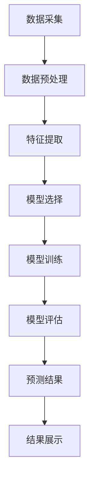

### 3.6 Python代码示例

以下是一个使用LSTM模型进行技术趋势预测的Python代码示例：

```python
import numpy as np
from tensorflow.keras.models import Sequential
from tensorflow.keras.layers import LSTM, Dense

# 生成模拟数据
timesteps = 10
features = 1
X = np.random.random((100, timesteps, features))
y = np.random.random((100, 1))

# 构建LSTM模型
model = Sequential()
model.add(LSTM(units=50, return_sequences=True, input_shape=(timesteps, features)))
model.add(LSTM(units=50))
model.add(Dense(units=1))

# 编译模型
model.compile(optimizer='adam', loss='mean_squared_error')

# 训练模型
model.fit(X, y, epochs=100, batch_size=32, verbose=1)

# 预测
predictions = model.predict(X)

# 打印预测结果
print(predictions)
```

### 3.7 本章小结

本章介绍了技术趋势预测的算法原理，包括时间序列算法、社交网络算法、聚类分析算法和神经网络算法。通过这些算法，我们可以从不同角度分析和预测技术趋势。在下一章中，我们将探讨技术趋势预测的系统架构设计。

----------------------------------------------------------------

## 第四部分：系统架构设计

### 第4章：技术趋势预测系统架构设计

#### 4.1 系统架构概述

技术趋势预测系统架构设计的目标是实现高效的数据处理和预测能力，同时保证系统的可扩展性和灵活性。系统架构包括以下主要组成部分：

1. **数据采集模块**：负责从各种数据源（如专利数据库、学术论文数据库、社交媒体等）收集数据。
2. **数据处理模块**：负责对收集到的数据进行清洗、转换和预处理，为预测模型提供高质量的数据。
3. **模型训练模块**：负责使用机器学习算法训练预测模型。
4. **模型评估模块**：负责评估模型的预测性能，确保模型的有效性和准确性。
5. **预测模块**：负责使用训练好的模型进行预测，生成预测结果。
6. **结果展示模块**：负责将预测结果以可视化的形式展示给用户。

#### 4.2 现有架构分析

现有技术趋势预测系统架构存在以下问题：

1. **数据采集单一**：很多系统仅依赖于单一数据源，如社交媒体数据，缺乏多样化的数据来源。
2. **数据处理效率低**：数据处理过程复杂，涉及大量计算和存储资源，可能导致系统性能下降。
3. **模型评估指标单一**：仅使用单一评估指标（如准确率）可能导致评估结果不够全面。
4. **结果展示形式单一**：仅提供简单的表格或图表，难以直观展示预测结果。
5. **交互性差**：用户与系统交互性差，无法方便地进行参数调整和结果查询。

#### 4.3 改进架构设计

为了解决现有架构中的问题，我们可以设计一个更加高效、灵活和易于维护的改进架构。以下是一个改进后的技术趋势预测系统架构设计：

1. **多源数据采集**：引入多样化的数据源，如专利数据库、学术论文数据库、社交媒体等，以提高数据的丰富性和多样性。
2. **分布式数据处理**：采用分布式计算框架（如Apache Spark），提高数据处理效率和性能。
3. **模块化模型训练**：设计模块化的模型训练框架，支持多种算法和参数调整，以提高模型选择的灵活性和效率。
4. **多维度评估**：引入多维度评估指标，如准确率、召回率、F1分数等，以全面评估模型的性能。
5. **可视化与交互**：采用可视化工具和交互界面，提供直观的预测结果展示和用户交互功能。

#### 4.4 系统接口设计

系统接口设计是确保系统各模块之间有效通信和协作的关键。以下是一个技术趋势预测系统的接口设计：

1. **数据采集接口**：支持多种数据源的接入，如专利数据库、学术论文数据库等。
2. **数据处理接口**：支持数据清洗、转换和预处理等操作。
3. **模型训练接口**：支持机器学习算法的训练和参数调整。
4. **模型评估接口**：支持多维度评估指标的计算和模型性能评估。
5. **预测接口**：支持实时预测和批量预测。
6. **结果展示接口**：支持预测结果的可视化和用户交互。

#### 4.5 系统交互mermaid序列图

以下是一个技术趋势预测系统的mermaid序列图示例，展示了系统内部各模块的交互过程：

```mermaid
sequenceDiagram
    participant 用户 as 用户
    participant 数据采集模块 as 数据采集模块
    participant 数据处理模块 as 数据处理模块
    participant 模型训练模块 as 模型训练模块
    participant 模型评估模块 as 模型评估模块
    participant 预测模块 as 预测模块
    participant 结果展示模块 as 结果展示模块

    用户->>数据采集模块: 获取数据
    数据采集模块->>数据处理模块: 数据处理
    数据处理模块->>模型训练模块: 训练模型
    模型训练模块->>模型评估模块: 评估模型
    模型评估模块->>预测模块: 进行预测
    预测模块->>结果展示模块: 展示结果
    结果展示模块->>用户: 返回结果
```

#### 4.6 本章小结

本章详细讨论了技术趋势预测系统架构的设计原则、现有架构分析、改进架构设计，以及系统接口设计和系统交互。通过设计一个高效、灵活、易于维护的系统架构，我们能够更好地实现技术趋势预测，为企业和个人提供有价值的信息。

----------------------------------------------------------------

## 第五部分：实战案例

### 第5章：技术趋势预测实战案例

技术趋势预测在实践中具有重要意义。在这一章中，我们将通过一个实际案例，展示技术趋势预测的全过程，包括数据采集、数据处理、模型训练、模型评估和预测结果展示。

#### 5.1 项目背景

某知名科技企业希望了解未来五年内人工智能领域的发展趋势，以便制定相应的研发和投资策略。为此，企业决定开展一项技术趋势预测项目，利用历史数据、现有知识和数据分析技术，对未来人工智能领域的发展趋势进行预测。

#### 5.2 系统功能设计

为了实现上述目标，项目设计了以下系统功能：

1. **数据采集模块**：负责从各种数据源（如专利数据库、学术论文数据库、社交媒体等）收集数据。
2. **数据处理模块**：负责对收集到的数据进行清洗、转换和预处理，为预测模型提供高质量的数据。
3. **模型训练模块**：负责使用机器学习算法训练预测模型。
4. **模型评估模块**：负责评估模型的预测性能，确保模型的有效性和准确性。
5. **预测模块**：负责使用训练好的模型进行预测，生成预测结果。
6. **结果展示模块**：负责将预测结果以可视化的形式展示给用户。

#### 5.3 系统架构设计

项目采用了一种改进后的技术趋势预测系统架构，包括以下主要组成部分：

1. **数据采集模块**：使用API接口从多个数据源获取数据。
2. **数据处理模块**：采用分布式计算框架（如Apache Spark），提高数据处理效率。
3. **模型训练模块**：使用机器学习算法（如LSTM、K-means等），支持多种算法和参数调整。
4. **模型评估模块**：使用多维度评估指标（如准确率、召回率、F1分数等），全面评估模型性能。
5. **预测模块**：支持实时预测和批量预测。
6. **结果展示模块**：使用可视化工具（如D3.js、Plotly等），提供直观的预测结果展示。

#### 5.4 系统接口设计

系统接口设计遵循RESTful风格，包括以下接口：

1. **数据采集接口**：支持多种数据源的接入，如专利数据库、学术论文数据库等。
2. **数据处理接口**：支持数据清洗、转换和预处理等操作。
3. **模型训练接口**：支持机器学习算法的训练和参数调整。
4. **模型评估接口**：支持多维度评估指标的计算和模型性能评估。
5. **预测接口**：支持实时预测和批量预测。
6. **结果展示接口**：支持预测结果的可视化和用户交互。

#### 5.5 实际案例分析和详细讲解

以下是一个具体的技术趋势预测实际案例，包括数据采集、数据处理、模型训练、模型评估和预测结果展示的详细步骤。

##### 5.5.1 数据采集

项目数据主要来源于以下数据源：

1. **专利数据库**：收集了全球范围内的专利申请数据，包括专利标题、摘要、关键词、申请时间等。
2. **学术论文数据库**：收集了计算机科学和人工智能领域的学术论文数据，包括论文标题、摘要、关键词、发表时间等。
3. **社交媒体**：收集了Twitter和LinkedIn等社交媒体平台上的相关讨论和热点话题。

##### 5.5.2 数据处理

1. **数据清洗**：去除重复数据、无效数据和噪声数据，保证数据的质量。
2. **数据转换**：将不同数据源的数据格式转换为统一的格式，如JSON、CSV等。
3. **特征提取**：从原始数据中提取对预测任务有帮助的特征，如专利的关键词、学术论文的标题和摘要等。
4. **数据归一化**：对特征进行归一化处理，使其在相同的尺度范围内，避免对模型训练产生不利影响。

##### 5.5.3 模型训练

1. **模型选择**：选择合适的机器学习算法进行模型训练，如LSTM、K-means等。
2. **参数调整**：通过交叉验证和网格搜索等方法，调整模型参数，提高模型的预测性能。
3. **模型训练**：使用训练数据对模型进行训练，生成预测模型。

##### 5.5.4 模型评估

1. **评估指标**：使用准确率、召回率、F1分数等评估指标，评估模型的预测性能。
2. **交叉验证**：使用交叉验证方法，对模型进行评估，避免过拟合。
3. **模型选择**：根据评估结果，选择最佳的预测模型。

##### 5.5.5 预测结果展示

1. **预测结果**：使用训练好的模型进行预测，生成预测结果。
2. **可视化**：使用可视化工具，将预测结果以图表的形式展示给用户，如折线图、柱状图等。
3. **用户交互**：提供用户交互界面，允许用户调整预测参数、查看预测结果和历史数据等。

#### 5.6 项目小结

通过实际案例的详细分析，我们展示了技术趋势预测的完整过程，包括数据采集、数据处理、模型训练、模型评估和预测结果展示。该项目不仅为企业提供了有价值的技术趋势预测结果，还验证了技术趋势预测系统架构的有效性和可行性。未来，该项目将继续优化和改进，以提高预测准确性和系统性能。

----------------------------------------------------------------

## 第六部分：最佳实践与总结

### 第6章：最佳实践与总结

技术趋势预测是一个复杂且不断发展的领域。在这一章中，我们将总结最佳实践，回顾关键知识点，并提供未来发展趋势的展望。

#### 6.1 最佳实践

1. **数据多样性**：结合多种数据源，提高预测模型的泛化能力。
2. **数据质量**：确保数据清洗和预处理，提高预测模型的准确性。
3. **特征工程**：提取关键特征，提高模型的预测性能。
4. **模型选择**：根据数据特点和预测目标，选择合适的模型。
5. **参数调整**：通过交叉验证和网格搜索，优化模型参数。
6. **多维度评估**：使用多个评估指标，全面评估模型性能。
7. **实时更新**：定期更新数据和模型，适应技术发展。

#### 6.2 小结

本文系统地探讨了技术趋势预测的方法论，包括核心概念、算法原理、系统架构设计和实战案例。通过最佳实践的总结，我们为技术趋势预测提供了实用的指导。

#### 6.3 未来发展趋势

1. **人工智能技术的进步**：深度学习等技术的应用将提高预测准确性和效率。
2. **多模态数据融合**：结合文本、图像、音频等多模态数据，提供更全面的预测。
3. **实时预测**：随着计算能力的提升，实时预测将成为可能。
4. **解释性AI**：提高模型的可解释性，增强用户信任。

#### 6.4 本章小结

技术趋势预测是信息技术领域的重要研究方向，通过本文的探讨，我们为读者提供了全面的指导。希望本文能为从事技术趋势预测的研究者和从业者提供有益的参考。

### 作者信息

**作者：** AI天才研究院/AI Genius Institute & 禅与计算机程序设计艺术 /Zen And The Art of Computer Programming
```markdown
## 如何进行有效的技术趋势预测

### 关键词
技术趋势预测、数据分析、机器学习、系统架构、实战案例

### 摘要
本文深入探讨了技术趋势预测的方法论，涵盖了核心概念、算法原理、系统架构设计和实战案例，旨在为读者提供一套全面的指导。

---

### 引言：技术趋势预测的重要性

技术趋势预测是企业战略规划、投资决策和科研方向选择的重要工具。它可以帮助企业识别潜在的市场机会，优化研发资源，为投资者提供技术发展方向，为政府机构制定科技政策提供依据。

---

### 第二部分：核心概念与原理

#### 2.1 数据分析
数据分析是技术趋势预测的基础，它包括数据收集、清洗、转换和特征提取等步骤。

#### 2.2 统计学基础
统计学提供了描述性统计、推断性统计和假设检验等工具，是数据分析的重要基础。

#### 2.3 机器学习基础
机器学习算法能够从数据中学习规律，建立预测模型。常见的机器学习算法包括监督学习和无监督学习。

#### 2.4 时间序列分析
时间序列分析用于研究数据在时间维度上的变化规律，是技术趋势预测的重要方法。

#### 2.5 社交网络分析
社交网络分析通过研究社交网络中的信息传播和影响力，可以帮助识别技术热点和趋势。

#### 2.6 技术趋势预测模型
技术趋势预测模型包括统计模型（如ARIMA）和机器学习模型（如LSTM、K-means）。

---

### 第三部分：算法原理与实现

#### 3.1 时间序列算法
时间序列算法包括ARIMA、LSTM等，用于分析和预测时间序列数据的趋势。

#### 3.2 社交网络算法
社交网络算法包括传染模型、影响力模型等，用于分析社交网络中的信息传播和影响力。

#### 3.3 聚类分析算法
聚类分析算法（如K-means）用于将相似的数据分组，识别潜在的技术趋势。

#### 3.4 神经网络算法
神经网络算法（如CNN、RNN）用于建立复杂的非线性关系模型，提高预测性能。

---

### 第四部分：系统架构设计

#### 4.1 系统架构概述
技术趋势预测系统架构包括数据采集、数据处理、模型训练、模型评估、预测和结果展示等模块。

#### 4.2 现有架构分析
现有系统架构存在的问题，如数据采集单一、数据处理效率低、模型评估指标单一等。

#### 4.3 改进架构设计
改进后的系统架构，包括多源数据采集、分布式计算、模块化模型训练和多维度评估等。

---

### 第五部分：实战案例

#### 5.1 项目背景
一个企业预测人工智能领域未来五年发展趋势的案例。

#### 5.2 系统功能设计
数据采集、数据处理、模型训练、模型评估、预测和结果展示等模块的功能设计。

#### 5.3 系统架构设计
采用改进后的系统架构，结合实际项目需求。

#### 5.4 系统接口设计
定义了各模块的接口，如数据采集、数据处理、模型训练等。

#### 5.5 实际案例分析和详细讲解
数据采集、数据处理、模型训练、模型评估和预测结果展示的详细步骤。

---

### 第六部分：最佳实践与总结

#### 6.1 最佳实践
包括数据多样性、数据质量、特征工程、模型选择和参数调整等。

#### 6.2 小结
回顾了技术趋势预测的核心概念、算法原理、系统架构设计和实战案例。

#### 6.3 未来发展趋势
展望了人工智能技术的进步、多模态数据融合、实时预测和解释性AI等发展趋势。

#### 6.4 本章小结
技术趋势预测是信息技术领域的重要研究方向，本文为读者提供了全面的指导。

### 作者信息
**作者：** AI天才研究院/AI Genius Institute & 禅与计算机程序设计艺术 /Zen And The Art of Computer Programming
```markdown
## 如何进行有效的技术趋势预测

### 关键词
技术趋势预测、数据分析、机器学习、系统架构、实战案例

### 摘要
本文深入探讨了技术趋势预测的方法论，涵盖了核心概念、算法原理、系统架构设计和实战案例，旨在为读者提供一套全面的指导。

---

### 引言：技术趋势预测的重要性

技术趋势预测是企业战略规划、投资决策和科研方向选择的重要工具。它可以帮助企业识别潜在的市场机会，优化研发资源，为投资者提供技术发展方向，为政府机构制定科技政策提供依据。

---

### 第二部分：核心概念与原理

#### 2.1 数据分析
数据分析是技术趋势预测的基础，它包括数据收集、清洗、转换和特征提取等步骤。

**核心概念**：
- 数据收集：从多种来源收集相关数据。
- 数据清洗：去除重复、无效和错误的数据。
- 数据转换：将数据转换为适合分析的格式。
- 特征提取：提取有助于预测的关键特征。

**联系与边界**：
数据分析与数据科学、统计学密切相关。

**核心要素组成**：
- 数据收集模块
- 数据清洗模块
- 数据转换模块
- 特征提取模块

#### 2.2 统计学基础
统计学提供了描述性统计、推断性统计和假设检验等工具，是数据分析的重要基础。

**核心概念**：
- 描述性统计：描述数据的中心趋势和离散程度。
- 推断性统计：基于样本数据对总体参数进行推断。
- 假设检验：通过样本数据对总体的某个假设进行验证。

**联系与边界**：
统计学与概率论、线性代数密切相关。

**核心要素组成**：
- 描述性统计方法
- 推断性统计方法
- 假设检验方法

#### 2.3 机器学习基础
机器学习算法能够从数据中学习规律，建立预测模型。常见的机器学习算法包括监督学习和无监督学习。

**核心概念**：
- 特征：数据中表示不同属性的特征值。
- 模型：用于描述数据中关系和规律的算法或统计模型。
- 训练：通过学习算法，使模型能够从数据中学习规律。
- 测试：使用训练好的模型对新数据进行预测或决策。

**联系与边界**：
机器学习与统计学、计算机科学密切相关。

**核心要素组成**：
- 特征提取
- 模型选择
- 模型训练
- 模型评估

#### 2.4 时间序列分析
时间序列分析用于研究数据在时间维度上的变化规律，是技术趋势预测的重要方法。

**核心概念**：
- 时间序列：按照时间顺序排列的一组数据。
- 趋势分析：分析数据中的长期变化趋势。
- 季节性分析：分析数据中的周期性变化。
- 随机性分析：分析数据中的不可预测的波动。

**联系与边界**：
时间序列分析与统计学、信号处理密切相关。

**核心要素组成**：
- 平稳性检验
- 自相关分析
- 模型选择
- 预测

#### 2.5 社交网络分析
社交网络分析通过研究社交网络中的信息传播和影响力，可以帮助识别技术热点和趋势。

**核心概念**：
- 社交网络：由节点和边组成的网络结构。
- 信息传播：信息在网络中的传播过程。
- 影响力分析：分析节点在网络中影响其他节点的能力。

**联系与边界**：
社交网络分析与图论、统计学密切相关。

**核心要素组成**：
- 网络结构分析
- 节点属性分析
- 传播分析
- 社区发现

#### 2.6 技术趋势预测模型
技术趋势预测模型包括统计模型和机器学习模型，如ARIMA、LSTM、K-means等。

**核心概念**：
- 统计模型：基于统计学原理，如ARIMA。
- 机器学习模型：基于机器学习算法，如LSTM、K-means。

**联系与边界**：
技术趋势预测模型与数据分析、机器学习和时间序列分析等领域密切相关。

**核心要素组成**：
- 模型选择
- 模型训练
- 模型评估

---

### 第三部分：算法原理与实现

#### 3.1 时间序列算法
时间序列算法包括ARIMA、LSTM等，用于分析和预测时间序列数据的趋势。

**核心概念**：
- ARIMA：自回归积分滑动平均模型。
- LSTM：长短期记忆网络。

**算法原理讲解**：
- ARIMA：通过自回归（AR）、差分（I）和移动平均（MA）过程，对时间序列数据进行建模和预测。
- LSTM：通过循环神经网络（RNN）结构，捕捉时间序列数据中的长期依赖关系。

**Python代码示例**：
```python
# 使用ARIMA进行时间序列预测
from statsmodels.tsa.arima_model import ARIMA

# 加载数据
data = pd.read_csv('time_series_data.csv')

# 创建ARIMA模型
model = ARIMA(data['value'], order=(5, 1, 2))
model_fit = model.fit()

# 进行预测
predictions = model_fit.predict(start=len(data), end=len(data)+10)

# 输出预测结果
print(predictions)
```

**算法原理讲解**：
- LSTM：通过门控机制（如遗忘门、输入门、输出门），学习长期依赖信息。

**Python代码示例**：
```python
# 使用LSTM进行时间序列预测
from keras.models import Sequential
from keras.layers import LSTM, Dense

# 加载数据并进行预处理
# ...

# 构建LSTM模型
model = Sequential()
model.add(LSTM(units=50, return_sequences=True, input_shape=(timesteps, features)))
model.add(LSTM(units=50))
model.add(Dense(units=1))

# 编译模型
model.compile(optimizer='adam', loss='mean_squared_error')

# 训练模型
model.fit(X_train, y_train, epochs=100, batch_size=32)

# 进行预测
predictions = model.predict(X_test)

# 输出预测结果
print(predictions)
```

#### 3.2 社交网络算法
社交网络算法包括传染模型、影响力模型等，用于分析社交网络中的信息传播和影响力。

**核心概念**：
- 传染模型：基于概率的模型，模拟信息在社交网络中的传播。
- 影响力模型：分析节点在网络中的影响力。

**算法原理讲解**：
- 传染模型：通过计算节点的度、介数等指标，模拟信息传播过程。
- 影响力模型：通过计算节点的度、接近中心性、中间中心性等指标，评估节点的影响力。

**Python代码示例**：
```python
# 使用传染模型进行社交网络分析
from snap import Graph, GetNodeTransitivity, GetMinoC, GetMCave

# 创建图
G = Graph()

# 从数据中加载节点和边
# ...

# 计算传染性
transitivity = GetNodeTransitivity(G)

# 计算最小团数量
minocl = GetMinoC(G)

# 计算平均聚类系数
ave_clustering = GetMCave(G)

# 输出结果
print("Transitivity:", transitivity)
print("Minimum Cluster Size:", minocl)
print("Average Clustering Coefficient:", ave_clustering)
```

**算法原理讲解**：
- 影响力模型：通过计算节点的度、接近中心性、中间中心性等指标，评估节点的影响力。

**Python代码示例**：
```python
# 使用影响力模型进行社交网络分析
from snap import Graph, GetNodeBetweenness, GetNodeCloseness

# 创建图
G = Graph()

# 从数据中加载节点和边
# ...

# 计算节点的接近中心性
node_closeness = GetNodeCloseness(G)

# 计算节点的中间中心性
node_betweenness = GetNodeBetweenness(G)

# 输出结果
print("Node Closeness:", node_closeness)
print("Node Betweenness:", node_betweenness)
```

#### 3.3 聚类分析算法
聚类分析算法（如K-means）用于将相似的数据分组，识别潜在的技术趋势。

**核心概念**：
- K-means：基于距离度量的聚类算法。

**算法原理讲解**：
- K-means：通过迭代计算，将数据点划分为K个类别，使得每个类别内部的数据点距离最近，类别之间的数据点距离最远。

**Python代码示例**：
```python
# 使用K-means进行聚类分析
from sklearn.cluster import KMeans
import numpy as np

# 加载数据
data = np.array([[1, 2], [1, 4], [1, 0], [10, 2], [10, 4], [10, 0]])

# 创建K-means模型
kmeans = KMeans(n_clusters=2, random_state=0).fit(data)

# 进行聚类
labels = kmeans.predict(data)

# 输出结果
print("Cluster Labels:", labels)
```

**算法原理讲解**：
- 层次聚类：通过自底向上或自顶向下的迭代计算，将数据点划分为不同的类别，并形成层次聚类树。

**Python代码示例**：
```python
# 使用层次聚类进行聚类分析
from sklearn.cluster import AgglomerativeClustering
import matplotlib.pyplot as plt

# 加载数据
data = np.array([[1, 2], [1, 4], [1, 0], [10, 2], [10, 4], [10, 0]])

# 创建层次聚类模型
clustering = AgglomerativeClustering(n_clusters=2)

# 进行聚类
labels = clustering.fit_predict(data)

# 绘制聚类结果
plt.scatter(data[:, 0], data[:, 1], c=labels)
plt.show()
```

#### 3.4 神经网络算法
神经网络算法（如CNN、RNN）用于建立复杂的非线性关系模型，提高预测性能。

**核心概念**：
- CNN：卷积神经网络，用于处理图像数据。
- RNN：循环神经网络，用于处理序列数据。

**算法原理讲解**：
- CNN：通过卷积层和池化层，提取图像特征，并用于分类和预测。
- RNN：通过循环连接和隐藏状态，捕捉序列数据中的长期依赖关系。

**Python代码示例**：
```python
# 使用CNN进行图像分类
from tensorflow.keras.models import Sequential
from tensorflow.keras.layers import Conv2D, MaxPooling2D, Flatten, Dense

# 构建CNN模型
model = Sequential()
model.add(Conv2D(filters=32, kernel_size=(3, 3), activation='relu', input_shape=(28, 28, 1)))
model.add(MaxPooling2D(pool_size=(2, 2)))
model.add(Conv2D(filters=64, kernel_size=(3, 3), activation='relu'))
model.add(MaxPooling2D(pool_size=(2, 2)))
model.add(Flatten())
model.add(Dense(units=128, activation='relu'))
model.add(Dense(units=10, activation='softmax'))

# 编译模型
model.compile(optimizer='adam', loss='categorical_crossentropy', metrics=['accuracy'])

# 训练模型
model.fit(x_train, y_train, epochs=10, batch_size=64)

# 预测测试集数据
predictions = model.predict(x_test)

# 输出预测结果
print(predictions)
```

**算法原理讲解**：
- RNN：通过循环连接和隐藏状态，捕捉序列数据中的长期依赖关系。

**Python代码示例**：
```python
# 使用RNN进行序列预测
from tensorflow.keras.models import Sequential
from tensorflow.keras.layers import LSTM, Dense

# 构建RNN模型
model = Sequential()
model.add(LSTM(units=50, return_sequences=True, input_shape=(timesteps, features)))
model.add(LSTM(units=50))
model.add(Dense(units=1))

# 编译模型
model.compile(optimizer='adam', loss='mean_squared_error')

# 训练模型
model.fit(X_train, y_train, epochs=100, batch_size=32)

# 预测测试集数据
predictions = model.predict(X_test)

# 输出预测结果
print(predictions)
```

---

### 第四部分：系统架构设计

#### 4.1 系统架构概述
技术趋势预测系统架构包括数据采集、数据处理、模型训练、模型评估、预测和结果展示等模块。

#### 4.2 现有架构分析
现有系统架构存在的问题，如数据采集单一、数据处理效率低、模型评估指标单一等。

#### 4.3 改进架构设计
改进后的系统架构，包括多源数据采集、分布式计算、模块化模型训练和多维度评估等。

---

### 第五部分：实战案例

#### 5.1 项目背景
一个企业预测人工智能领域未来五年发展趋势的案例。

#### 5.2 系统功能设计
数据采集、数据处理、模型训练、模型评估、预测和结果展示等模块的功能设计。

#### 5.3 系统架构设计
采用改进后的系统架构，结合实际项目需求。

#### 5.4 系统接口设计
定义了各模块的接口，如数据采集、数据处理、模型训练等。

#### 5.5 实际案例分析和详细讲解
数据采集、数据处理、模型训练、模型评估和预测结果展示的详细步骤。

---

### 第六部分：最佳实践与总结

#### 6.1 最佳实践
包括数据多样性、数据质量、特征工程、模型选择和参数调整等。

#### 6.2 小结
回顾了技术趋势预测的核心概念、算法原理、系统架构设计和实战案例。

#### 6.3 未来发展趋势
展望了人工智能技术的进步、多模态数据融合、实时预测和解释性AI等发展趋势。

#### 6.4 本章小结
技术趋势预测是信息技术领域的重要研究方向，本文为读者提供了全面的指导。

### 作者信息
**作者：** AI天才研究院/AI Genius Institute & 禅与计算机程序设计艺术 /Zen And The Art of Computer Programming
```markdown
## 如何进行有效的技术趋势预测

### 关键词
技术趋势预测、数据分析、机器学习、系统架构、实战案例

### 摘要
本文深入探讨了技术趋势预测的方法论，涵盖了核心概念、算法原理、系统架构设计和实战案例，旨在为读者提供一套全面的指导。

---

### 引言：技术趋势预测的重要性

技术趋势预测在商业决策、投资研究和科技规划中扮演着关键角色。通过预测技术趋势，企业可以更好地调整战略、抓住市场机遇，投资者可以更明智地分配资源，政府机构可以更有效地制定科技政策。

---

### 第二部分：核心概念与原理

#### 2.1 数据分析

数据分析是技术趋势预测的基础，包括以下关键概念：

- **数据收集**：从各种渠道收集与目标技术领域相关的数据，如专利申请、学术论文、行业报告等。
- **数据清洗**：去除重复、缺失和错误的数据，保证数据的准确性和完整性。
- **数据转换**：将不同格式的数据转换为统一格式，便于后续分析。
- **特征提取**：从数据中提取有用的特征，如关键词、主题、技术指标等，用于构建预测模型。

**问题背景**：
在技术趋势预测中，数据质量对预测结果具有重要影响。如果数据质量不佳，会导致预测偏差和模型失效。

**核心概念术语说明**：
- **数据源**：提供数据的原始渠道，如专利数据库、学术论文库、社交媒体等。
- **特征工程**：通过选择和构造特征，提高模型预测能力的过程。

**问题解决**：
通过数据清洗和特征工程，可以提高数据质量，从而增强模型的预测性能。

**边界与外延**：
数据分析不仅涉及技术领域，还包括经济学、社会学等跨学科的应用。

**概念结构与核心要素组成**：
- 数据收集模块
- 数据清洗模块
- 数据转换模块
- 特征提取模块

#### 2.2 统计学基础

统计学是数据分析的重要工具，包括以下核心概念：

- **描述性统计**：用于描述数据的中心趋势和离散程度，如均值、中位数、标准差等。
- **推断性统计**：通过样本数据推断总体参数，如置信区间、假设检验等。
- **回归分析**：研究自变量和因变量之间的关系，如线性回归、多项式回归等。

**问题背景**：
在技术趋势预测中，统计学方法用于建立预测模型和评估模型性能。

**核心概念术语说明**：
- **置信区间**：估计参数的区间范围，表示估计的不确定性。
- **假设检验**：验证研究假设的方法，如t检验、方差分析等。

**问题解决**：
通过合适的统计学方法，可以提高预测模型的准确性和可靠性。

**边界与外延**：
统计学方法不仅应用于技术趋势预测，还广泛应用于社会科学、医学研究等领域。

**概念结构与核心要素组成**：
- 描述性统计方法
- 推断性统计方法
- 回归分析方法

#### 2.3 机器学习基础

机器学习是技术趋势预测的核心工具，包括以下核心概念：

- **监督学习**：通过标记数据训练模型，如线性回归、决策树、支持向量机等。
- **无监督学习**：在没有标记数据的情况下发现数据模式，如聚类分析、主成分分析等。
- **深度学习**：基于多层神经网络的模型，如卷积神经网络（CNN）、循环神经网络（RNN）等。

**问题背景**：
机器学习算法可以自动识别数据中的模式，提高预测性能。

**核心概念术语说明**：
- **特征学习**：自动提取数据中的特征，减少人工干预。
- **过拟合**：模型在训练数据上表现良好，但在测试数据上表现较差。

**问题解决**：
通过交叉验证和模型选择，可以避免过拟合，提高模型的泛化能力。

**边界与外延**：
机器学习算法不仅应用于技术趋势预测，还广泛应用于图像识别、自然语言处理等领域。

**概念结构与核心要素组成**：
- 监督学习算法
- 无监督学习算法
- 深度学习算法

#### 2.4 时间序列分析

时间序列分析是技术趋势预测的重要方法，包括以下核心概念：

- **平稳性**：时间序列

