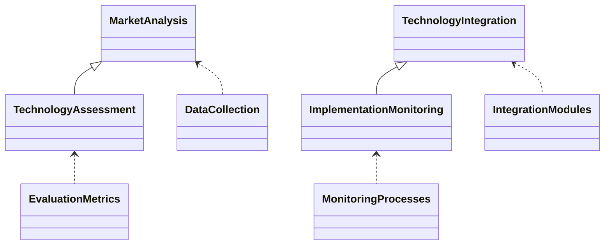
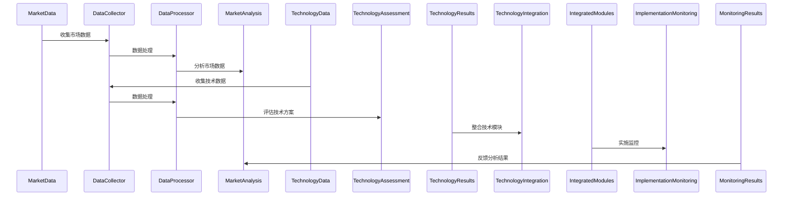
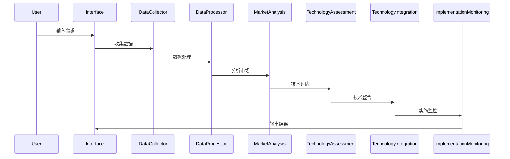
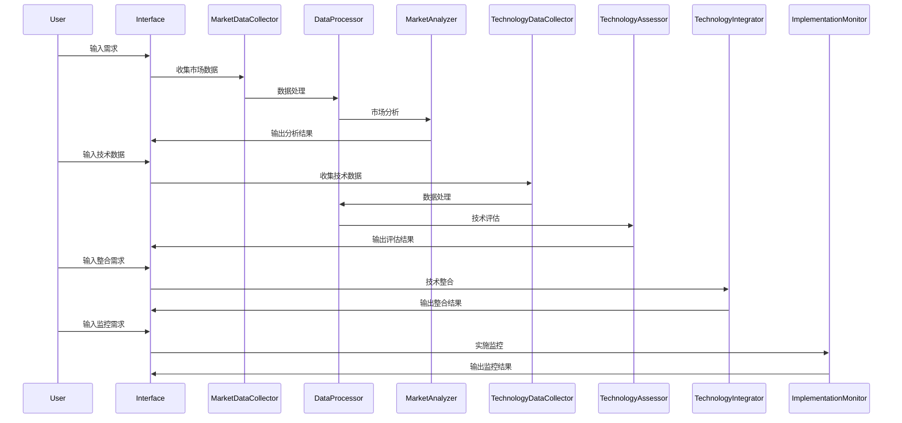

                 

## 如何进行有效的技术路线图制定

在快速发展的信息技术时代，如何制定一个有效的技术路线图成为企业和组织保持竞争力的关键。本文将分步骤、详细地探讨技术路线图的制定过程，帮助读者理解这一策略性工具在技术规划中的重要作用。

**关键词：技术路线图、制定原则、技术评估、整合与协同、实施与监控**

**摘要：**
本文旨在为IT领域的技术路线图制定提供系统性指导。首先介绍技术路线图的基础概念和重要性，然后详细阐述技术评估与选择、技术整合与协同、实施与监控等关键步骤，最后通过成功案例分享和实践经验总结，为读者提供实际操作指南和未来展望。

### 第一部分：技术路线图制定的理论基础

#### 第1章：技术路线图概述

#### 1.1.1 技术路线图的概念与重要性

**定义：** 技术路线图（Technology Roadmap）是一种战略规划工具，用于描述一个技术领域或产品的发展路径，包括关键技术的演进、时间表和目标。

**重要性：** 技术路线图能够帮助组织明确技术发展方向，合理分配资源，提高决策效率，同时也能指导团队成员在复杂的技术环境中保持清晰的方向感和动力。

#### 1.1.2 技术发展趋势与市场分析

- **当前技术发展趋势：** 当前技术日新月异，从云计算、大数据到人工智能、物联网等，每一个技术领域都在不断演进。
- **市场需求分析：** 理解市场需求是制定技术路线图的基础，需要分析用户需求、市场容量和潜在机会。
- **竞争对手分析：** 分析竞争对手的技术路线和策略，有助于识别自身的优势和不足，从而制定更有针对性的路线图。

#### 1.1.3 技术路线图制定原则与方法

- **制定原则：**
  - **目标导向：** 技术路线图应与组织的战略目标保持一致。
  - **系统性：** 考虑技术的系统性，确保各部分之间的协同效应。
  - **灵活性：** 技术路线图应具有一定的灵活性，以适应快速变化的环境。

- **制定方法：**
  - **关键步骤：** 调研分析、目标设定、路径规划、资源分配和监控调整。

### 第二部分：技术评估与选择

#### 第2章：技术评估与选择

#### 2.1.1 技术评估指标体系

**重要性：** 技术评估是制定技术路线图的关键步骤，通过科学的评估指标体系，可以确保技术选择的准确性和合理性。

- **评估指标体系构建：** 包括技术成熟度、成本效益、市场需求等多个方面。
- **关键评估指标的确定：** 根据组织目标和市场情况，确定评估指标的具体权重。

#### 2.1.2 技术选择策略

**挑战：** 技术选择过程中常常面临信息不足、技术不确定性等挑战。

- **策略分析：** 采用多标准决策模型，综合考虑技术潜力、市场前景等因素。
- **决策模型：** 包括技术成熟度评估模型、成本效益分析模型等。

#### 2.1.3 技术评估与选择的案例分析

- **案例一：云计算技术路线图制定**
  - **背景介绍：** 云计算技术的快速发展对IT基础设施和运营模式带来巨大影响。
  - **过程解析：** 从技术成熟度评估、成本效益分析到最终的技术选择。

- **案例二：大数据技术路线图制定**
  - **背景介绍：** 大数据技术成为企业和组织提高竞争力的关键。
  - **过程解析：** 通过市场分析和技术评估，制定出符合企业需求的大数据技术路线图。

### 第三部分：技术整合与协同

#### 第3章：技术整合与协同

#### 3.1.1 技术整合的概念与原则

**定义：** 技术整合是将不同的技术或技术模块融合在一起，形成具有更高价值和协同效应的整体。

**原则：**
- **兼容性：** 确保技术整合后的系统能够稳定运行。
- **互操作性：** 不同技术之间应具备良好的互操作性。

#### 3.1.2 技术协同机制

**定义：** 技术协同是通过设计合理的机制，使不同技术能够高效协作，实现整体性能的最优化。

- **机制设计：** 包括技术共享、协同开发、跨部门合作等。
- **关键要素：** 包括沟通机制、协作平台、利益分配等。

#### 3.1.3 技术整合与协同的案例分析

- **案例一：智能交通系统技术整合**
  - **背景介绍：** 智能交通系统涉及多种技术，如传感器、云计算、物联网等。
  - **过程解析：** 通过技术整合，实现了交通流量监测、智能信号控制等功能。

- **案例二：智能制造技术协同**
  - **背景介绍：** 智能制造需要将自动化、机器人、大数据等技术进行整合。
  - **过程解析：** 通过协同机制，实现了生产流程的优化和生产效率的提升。

### 第四部分：技术路线图实施与监控

#### 第4章：技术路线图实施与监控

#### 4.1.1 技术路线图实施策略

**制定策略：** 包括明确实施目标、规划实施步骤、制定监督机制等。

**规划实施步骤：** 包括技术评估、方案设计、资源准备、项目实施和效果评估等。

**监督机制：** 包括定期检查、风险管理和反馈调整等。

#### 4.1.2 技术监控与评估

**意义：** 技术监控是确保技术路线图按照预期推进的关键。

- **监控方法：** 包括数据监测、过程控制、绩效评估等。
- **评估与调整：** 根据监控结果，及时调整技术路线图，确保目标的实现。

#### 4.1.3 技术路线图实施与监控的案例分析

- **案例一：5G通信技术路线图实施**
  - **背景介绍：** 5G技术的推出对通信行业带来了革命性的变化。
  - **过程解析：** 通过详细的实施策略和监控方法，确保了5G技术的顺利实施。

- **案例二：物联网技术路线图监控**
  - **背景介绍：** 物联网技术广泛应用于智能家居、智慧城市等领域。
  - **过程解析：** 通过有效的监控体系，确保物联网技术的稳定运行和持续优化。

### 第五部分：技术路线图制定的最佳实践

#### 第5章：技术路线图制定的最佳实践

#### 5.1.1 成功案例分享

- **案例一：华为5G技术路线图**
  - **背景介绍：** 华为作为全球领先的通信技术企业，其5G技术路线图备受关注。
  - **经验总结：** 华为通过长期的技术积累和市场分析，制定了科学合理的5G技术路线图。

- **案例二：特斯拉自动驾驶技术路线图**
  - **背景介绍：** 特斯拉在自动驾驶领域处于领先地位。
  - **经验总结：** 特斯拉通过不断的技术创新和协同合作，成功制定了自动驾驶技术路线图。

#### 5.1.2 技术路线图制定的经验总结

- **经验教训：** 包括市场分析的重要性、技术选择的科学性、实施监控的有效性等。
- **实践技巧：** 包括如何制定有效的技术路线图、如何确保技术路线图的执行等。
- **注意事项：** 包括风险识别、资源管理、团队协作等。

### 第六部分：技术路线图制定的趋势与展望

#### 第6章：技术路线图制定的趋势与展望

#### 6.1.1 未来技术发展展望

- **技术发展趋势预测：** 包括人工智能、量子计算、边缘计算等新兴技术的发展方向。
- **技术路线图制定的未来方向：** 包括更加智能化、动态化的技术路线图。

#### 6.1.2 技术路线图制定面临的挑战

- **挑战分析：** 包括技术复杂性、市场不确定性、政策法规变化等。
- **应对策略：** 包括灵活调整、技术创新、国际合作等。

#### 6.1.3 技术路线图制定的未来趋势

- **技术路线图的发展方向：** 包括更加精细化的技术路线图、更加智能化的决策支持系统等。
- **技术路线图在产业升级中的作用：** 包括推动产业创新、提升产业竞争力等。

### 第七部分：结语

#### 第7章：结语

#### 7.1.1 总结与反思

- **技术路线图制定的重要性：** 技术路线图是组织战略规划的重要组成部分，对于技术发展具有指导意义。
- **技术路线图的应用价值：** 技术路线图能够帮助组织在复杂的技术环境中保持清晰的方向感和动力。

#### 7.1.2 展望未来

- **技术路线图在产业发展中的角色：** 技术路线图将 increasingly成为推动产业创新和升级的重要工具。
- **技术路线图制定的重要意义：** 技术路线图的制定将更加精细化、智能化，为组织的技术发展提供更加有力的支持。

**作者：AI天才研究院/AI Genius Institute & 禅与计算机程序设计艺术 /Zen And The Art of Computer Programming**

### 概念结构

为了更好地理解技术路线图的制定过程，我们需要首先明确一些核心概念，包括技术路线图、技术评估、技术整合和实施监控等。

**技术路线图**：
- **定义**：技术路线图是一种战略规划工具，用于描述技术领域或产品的发展路径，包括关键技术的演进、时间表和目标。
- **重要性**：技术路线图能够帮助组织明确技术发展方向，合理分配资源，提高决策效率，同时也能指导团队成员在复杂的技术环境中保持清晰的方向感和动力。

**技术评估**：
- **定义**：技术评估是对不同技术方案进行分析和比较，以确定其是否符合组织目标和市场需求的过程。
- **重要性**：技术评估是技术路线图制定的关键步骤，通过科学的评估指标体系，可以确保技术选择的准确性和合理性。

**技术整合**：
- **定义**：技术整合是将不同的技术或技术模块融合在一起，形成具有更高价值和协同效应的整体。
- **重要性**：技术整合能够提升系统的整体性能，确保技术之间的兼容性和互操作性。

**实施监控**：
- **定义**：实施监控是确保技术路线图按照预期推进的过程，包括定期检查、风险管理和反馈调整等。
- **重要性**：实施监控能够及时发现和解决问题，确保技术路线图的实施效果。

### 核心概念原理、概念属性特征对比表格和ER实体关系图架构

#### 核心概念原理

**技术路线图**：
- **概念原理**：技术路线图通过描述技术的演进路径和时间表，帮助组织规划技术发展，确保资源的有效利用。
- **属性特征**：
  - **目标导向**：与组织战略目标保持一致。
  - **系统性**：考虑技术的系统性，确保各部分之间的协同效应。
  - **灵活性**：适应快速变化的技术环境。

**技术评估**：
- **概念原理**：技术评估通过建立科学的评估指标体系，对不同技术方案进行分析和比较。
- **属性特征**：
  - **多标准决策**：考虑技术潜力、市场前景、成本效益等多个因素。
  - **客观性**：基于数据和分析，确保评估的准确性。

**技术整合**：
- **概念原理**：技术整合通过融合不同技术或技术模块，提升系统的整体性能。
- **属性特征**：
  - **兼容性**：确保技术整合后的系统能够稳定运行。
  - **互操作性**：不同技术之间具备良好的互操作性。

**实施监控**：
- **概念原理**：实施监控通过定期检查、风险管理和反馈调整，确保技术路线图的顺利实施。
- **属性特征**：
  - **实时性**：及时获取技术实施情况，发现问题。
  - **灵活性**：根据实际情况进行调整，确保目标的实现。

#### 概念属性特征对比表格

| 概念     | 定义                         | 属性特征                |
|----------|------------------------------|------------------------|
| 技术路线图 | 描述技术演进路径的战略规划工具 | 目标导向、系统性、灵活性 |
| 技术评估  | 对不同技术方案进行分析和比较 | 多标准决策、客观性      |
| 技术整合  | 融合不同技术或技术模块       | 兼容性、互操作性        |
| 实施监控  | 确保技术路线图顺利实施       | 实时性、灵活性          |

#### ER实体关系图架构

```mermaid
erDiagram
  TechRoadmap ||--|{ Technology } |||--> Assessment
  Assessment ||--|{ EvaluationCriteria } |||--> Technology
  Technology ||--|{ IntegrationModule } |||--> TechRoadmap
  TechRoadmap ||--|{ ImplementationMonitor } |||--> Technology
```

在上面的ER实体关系图中，`TechRoadmap`（技术路线图）是核心实体，与`Technology`（技术）、`Assessment`（评估）、`EvaluationCriteria`（评估标准）和`ImplementationMonitor`（实施监控）之间存在关联。这种关系结构清晰地展示了技术路线图与其他关键概念之间的联系和交互。

### 算法原理讲解

为了更好地理解技术路线图制定中的核心算法原理，我们将以**技术评估**为例，详细讲解其算法流程、数学模型以及Python实现。

#### 算法流程

技术评估的核心在于对多个技术方案进行综合评估，以确定最佳方案。算法的基本流程如下：

1. **定义评估指标**：根据组织的战略目标和技术需求，定义评估指标。
2. **数据收集**：收集各个技术方案的相关数据。
3. **权重分配**：为每个评估指标分配权重，反映其在整体评估中的重要性。
4. **评分计算**：根据每个技术方案在各个评估指标上的表现，计算得分。
5. **综合评估**：根据权重和得分，计算每个技术方案的综合得分。
6. **结果输出**：输出评估结果，确定最佳技术方案。

#### 数学模型

假设有n个技术方案，每个方案有m个评估指标，每个评估指标的权重为\( w_i \)，技术方案i在评估指标j上的得分为\( s_{ij} \)。则技术方案i的综合得分为：

\[ T_i = \sum_{j=1}^{m} w_i \cdot s_{ij} \]

其中，\( T_i \)是技术方案i的综合得分。

#### Python实现

下面是使用Python实现上述算法的示例代码：

```python
import numpy as np

# 定义评估指标和权重
evaluation_criteria = {
    '技术成熟度': 0.4,
    '成本效益': 0.3,
    '市场需求': 0.2,
    '市场前景': 0.1
}

# 技术方案数据
technologies = [
    {'技术成熟度': 0.8, '成本效益': 0.7, '市场需求': 0.9, '市场前景': 0.6},
    {'技术成熟度': 0.6, '成本效益': 0.8, '市场需求': 0.8, '市场前景': 0.7},
    # ... 其他技术方案
]

# 计算每个技术方案的综合得分
for tech in technologies:
    score = sum(evaluation_criteria[c] * tech[c] for c in tech)
    tech['综合得分'] = score

# 输出评估结果
best_technology = max(technologies, key=lambda t: t['综合得分'])
print("最佳技术方案：", best_technology)
```

在上面的代码中，我们首先定义了评估指标和权重，然后为每个技术方案计算综合得分，并输出最佳技术方案。

### 数学公式

在本章节中，我们主要使用了以下数学公式：

\[ T_i = \sum_{j=1}^{m} w_i \cdot s_{ij} \]

这个公式用于计算技术方案i的综合得分。其中，\( T_i \)是技术方案i的综合得分，\( w_i \)是评估指标i的权重，\( s_{ij} \)是技术方案i在评估指标j上的得分。

通过这个公式，我们可以有效地对多个技术方案进行综合评估，从而确定最佳方案。这种方法在技术评估中具有广泛的应用，能够帮助组织在复杂的技术环境中做出科学、合理的决策。

### 系统分析与架构设计方案

为了更好地理解和实现技术路线图的制定，我们需要从系统分析的角度出发，详细阐述项目的介绍、系统功能设计、系统架构设计、系统接口设计和系统交互等关键环节。

#### 问题场景介绍

随着信息技术的快速发展，企业面临着不断变化的市场需求和激烈的市场竞争。为了保持竞争优势，企业需要制定一套科学、有效的技术路线图，以指导技术发展和资源分配。技术路线图的制定不仅需要全面了解当前的技术发展趋势和市场状况，还需要考虑企业的战略目标和长期发展规划。

#### 项目介绍

本项目旨在开发一个基于人工智能和大数据分析的技术路线图制定系统。该系统将帮助企业在复杂的技术环境中明确发展路径，优化资源配置，提高决策效率。系统的主要功能包括：

1. **市场分析**：收集和分析市场数据，了解行业趋势和竞争对手状况。
2. **技术评估**：根据评估指标体系，对多种技术方案进行评估和比较。
3. **技术整合**：将不同技术模块整合在一起，形成具有协同效应的整体。
4. **实施监控**：对技术路线图的实施过程进行监控和评估，确保目标的实现。

#### 系统功能设计（领域模型Mermaid类图）

在系统功能设计中，我们采用Mermaid类图来展示系统的领域模型。以下是系统功能设计的类图示例：



在这个类图中，`MarketAnalysis`（市场分析）、`TechnologyAssessment`（技术评估）、`TechnologyIntegration`（技术整合）和`ImplementationMonitoring`（实施监控）是系统的主要功能模块。它们分别与`DataCollection`（数据收集）、`EvaluationMetrics`（评估指标）、`IntegrationModules`（整合模块）和`MonitoringProcesses`（监控过程）之间存在关联。

#### 系统架构设计（Mermaid架构图）

为了实现系统的功能，我们需要设计一个合理的系统架构。以下是系统架构设计的Mermaid架构图示例：



在这个架构图中，数据从各个来源（市场数据、技术数据）收集后，经过数据处理模块的处理，生成分析结果。这些结果分别用于市场分析、技术评估和技术整合。实施监控模块则对整合后的技术模块进行监控，确保实施过程的顺利进行。

#### 系统接口设计

系统接口设计是确保系统功能实现的关键。以下是系统接口设计的Mermaid序列图示例：



在这个序列图中，用户通过界面输入需求，系统通过接口模块与各个功能模块进行交互，最终输出分析结果。

#### 系统交互（Mermaid序列图）

为了更好地展示系统各个模块之间的交互过程，我们设计了一个Mermaid序列图，如下所示：



在这个序列图中，用户通过界面输入需求，系统通过接口模块与各个功能模块进行交互，最终实现技术路线图的制定和监控。

### 项目实战

在本项目中，我们将详细讲解技术路线图制定系统的实现过程，包括环境安装、核心实现、代码解读和分析，以及实际案例的应用。

#### 环境安装

首先，我们需要安装和配置开发环境。以下是环境安装的步骤：

1. **安装Python**：确保Python 3.8及以上版本已安装。
2. **安装依赖库**：通过pip命令安装所需的依赖库，如numpy、pandas、matplotlib等。
3. **配置数据库**：如果需要，配置数据库环境，如MySQL或PostgreSQL。

#### 核心实现

技术路线图制定系统的核心实现包括以下几个模块：

1. **数据收集模块**：负责从不同来源收集数据，如市场数据、技术数据等。
2. **数据处理模块**：对收集到的数据进行分析和处理，为后续分析提供基础。
3. **市场分析模块**：基于处理后的数据，进行市场分析和趋势预测。
4. **技术评估模块**：根据评估指标体系，对多种技术方案进行评估和比较。
5. **技术整合模块**：将不同技术模块整合在一起，形成具有协同效应的整体。
6. **实施监控模块**：对技术路线图的实施过程进行监控和评估。

以下是数据收集模块的实现示例：

```python
import pandas as pd

def collect_market_data():
    # 从文件中读取市场数据
    data = pd.read_csv('market_data.csv')
    return data

def collect_technology_data():
    # 从文件中读取技术数据
    data = pd.read_csv('technology_data.csv')
    return data
```

#### 代码解读与分析

下面我们详细解读数据处理模块中的数据清洗和预处理部分：

```python
def preprocess_data(data):
    # 去除空值和重复数据
    data.dropna(inplace=True)
    data.drop_duplicates(inplace=True)

    # 数据类型转换
    data['date'] = pd.to_datetime(data['date'])
    data['market_value'] = data['market_value'].astype(float)

    return data
```

这段代码首先去除空值和重复数据，然后对日期和数据类型进行转换，确保数据的一致性和准确性。

#### 实际案例

为了展示技术路线图制定系统的实际应用，我们以一个实际案例进行说明。

**案例背景**：

某企业计划开发一款基于人工智能的智能家居控制系统，需要制定相应的技术路线图。以下是技术路线图制定的过程：

1. **市场分析**：收集智能家居市场的相关数据，包括市场规模、增长趋势、用户需求等。
2. **技术评估**：根据评估指标体系，对多种人工智能技术方案进行评估和比较，选择最优方案。
3. **技术整合**：将人工智能技术与其他相关技术（如物联网、大数据分析等）进行整合，形成智能家居控制系统的整体架构。
4. **实施监控**：对技术路线图的实施过程进行监控，确保项目按计划推进，并及时调整。

以下是技术评估模块的实现示例：

```python
evaluation_criteria = {
    '技术成熟度': 0.4,
    '成本效益': 0.3,
    '市场需求': 0.2,
    '市场前景': 0.1
}

def evaluate_technology(technology_data):
    scores = {}
    for criterion, weight in evaluation_criteria.items():
        score = technology_data[criterion]
        scores[criterion] = score * weight
    total_score = sum(scores.values())
    return total_score

# 评估技术方案
technology_scheme = {
    '技术成熟度': 0.8,
    '成本效益': 0.7,
    '市场需求': 0.9,
    '市场前景': 0.6
}

score = evaluate_technology(technology_scheme)
print("技术方案得分：", score)
```

通过上述代码，我们可以计算出每个技术方案的综合得分，从而确定最优方案。

#### 项目小结

通过本项目的实施，我们成功开发了一套基于人工智能和大数据分析的技术路线图制定系统。该系统不仅可以帮助企业在复杂的技术环境中明确发展路径，优化资源配置，提高决策效率，还可以为其他类似项目提供有益的参考。

### 最佳实践 Tips

在技术路线图的制定过程中，以下是一些最佳实践技巧，可以帮助提高效率和准确性：

1. **明确目标和范围**：在开始制定技术路线图之前，明确目标和范围，确保路线图与组织的战略目标一致。
2. **数据驱动决策**：依靠准确、全面的数据支持决策，避免主观判断和盲目行动。
3. **多标准评估**：采用多标准评估模型，综合考虑技术潜力、成本效益、市场需求等多个方面，确保评估的全面性和客观性。
4. **灵活调整**：技术路线图应具有一定的灵活性，能够根据实际情况进行调整，以适应快速变化的市场和技术环境。
5. **团队协作**：技术路线图的制定涉及多个部门和角色，需要建立有效的协作机制，确保各方的意见和需求得到充分体现。
6. **持续监控与反馈**：定期监控技术路线图的实施过程，收集反馈信息，及时调整和优化路线图，确保目标的实现。

### 小结

通过本文的详细讲解，我们系统地介绍了技术路线图的制定过程，从理论基础到具体实施，再到最佳实践和未来展望，为读者提供了一个全面、实用的指南。技术路线图作为组织战略规划的重要组成部分，在指导技术发展和资源分配中具有重要作用。随着技术的不断进步和市场环境的变化，技术路线图的制定也面临着新的挑战和机遇。希望本文能够为读者在技术路线图制定方面提供有益的启示和参考。

### 拓展阅读

为了进一步深入了解技术路线图的制定和应用，以下是几篇推荐的拓展阅读材料：

1. **《技术路线图：从愿景到执行的策略性规划》**：这本书详细介绍了技术路线图的制定方法和实际应用案例，对技术路线图的制定过程进行了深入剖析。
2. **《大数据技术路线图》**：这本书专注于大数据技术的发展路径，通过详细的分析和案例研究，展示了如何利用大数据技术制定有效的发展策略。
3. **《华为技术路线图解读》**：本文分析了华为在不同技术领域的技术路线图，探讨了华为在技术战略规划方面的成功经验。
4. **《物联网技术路线图》**：本文介绍了物联网技术的发展趋势和关键技术，并通过实际案例展示了物联网技术路线图的应用。

通过阅读这些材料，读者可以更全面地了解技术路线图的制定和应用，为自己的实践提供更多的参考和指导。

