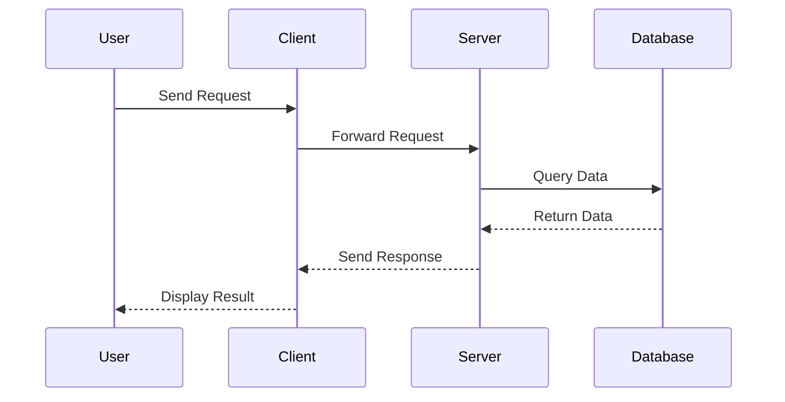

                 

Certainly! Let's break down the steps to create a high-quality, informative, and engaging technical blog post titled "How to Make Effective Technology Selection Decisions." We'll follow the outline and structure you've provided.

### Step 1: Writing the Introduction and Overview

#### Introduction

```markdown
# How to Make Effective Technology Selection Decisions

> Keywords: Technology Selection, Decision-Making Framework, IT Strategy, Organizational Goals, Technical Evaluation

> Abstract: This article provides a comprehensive guide on how to make effective technology selection decisions within an organization. It covers the importance of a structured approach, key decision-making criteria, and implementation strategies. By following this guide, IT professionals and decision-makers can ensure they select technologies that align with business objectives and provide long-term value.

[Continue with the detailed introduction...]
```

#### Core Concepts and Relationships

```markdown
## Core Concepts and Principles

### Technology Selection Framework

A technology selection framework is a systematic process that helps organizations evaluate and choose the most suitable technology solutions. It involves several key steps, including needs assessment, market research, evaluation of options, and decision-making.

#### Decision-Making Criteria

When selecting technology, it's crucial to consider various decision-making criteria. These include:

1. **Cost**: The total cost of ownership, including licensing, hardware, and maintenance.
2. **Performance**: The speed, reliability, and scalability of the technology.
3. **Scalability**: The ability of the technology to grow with the organization's needs.
4. **Integration**: The ease of integrating the technology with existing systems.
5. **Support and Training**: The availability of support resources and training materials.

### Entity Relationship Diagram (ERD)

Below is a simplified ERD illustrating the key entities and relationships in technology selection:

```mermaid
entityRelationship
    Stakeholder "-[evaluates]->" Technology
    Technology "-[meets]->" Decision Criteria
    Decision Criteria "-[influences]->" Technology Selection
```

[Continue with the detailed discussion of core concepts and principles...]
```

### Step 2: Writing the Core Concepts and Principles

#### Technology Selection Framework

```markdown
### Technology Selection Framework

The technology selection framework is a structured process that ensures a systematic and unbiased approach to technology evaluation. It typically includes the following steps:

1. **Identify Needs**: Clearly define the problems and objectives the technology is intended to solve.
2. **Research Options**: Gather information on available technologies and solutions.
3. **Evaluate Options**: Assess the strengths and weaknesses of each option against decision-making criteria.
4. **Make a Decision**: Choose the best option based on the evaluation results.
5. **Implement and Monitor**: Deploy the selected technology and continuously monitor its performance.

[Include diagrams and examples to illustrate the framework...]
```

#### Decision-Making Criteria

```markdown
### Decision-Making Criteria

When evaluating technology options, it's essential to consider a range of decision-making criteria. Here are some key criteria to consider:

1. **Cost**: Evaluate the total cost of ownership, including licensing fees, hardware costs, and ongoing maintenance expenses.
2. **Performance**: Assess the technology's speed, reliability, scalability, and compatibility with existing systems.
3. **Scalability**: Determine whether the technology can grow with the organization's needs without requiring significant modifications.
4. **Integration**: Consider how easily the technology can be integrated with existing systems and workflows.
5. **Support and Training**: Evaluate the availability of support resources, documentation, and training materials for the technology.

[Include a comparison table and additional examples...]
```

### Step 3: Writing the System Analysis and Architecture Design

#### System Analysis

```markdown
### System Analysis

System analysis is a critical step in understanding the organization's needs and defining the requirements for the selected technology. This involves:

1. **Problem Definition**: Clearly define the problems and opportunities the system aims to address.
2. **Requirement Elicitation**: Gather and document the functional and non-functional requirements of the system.
3. **Scoping**: Define the boundaries of the system and its intended users.

#### Project Overview

The project aims to develop a comprehensive system that meets the following objectives:

- **Functionality**: The system should provide users with a seamless and efficient way to manage and analyze data.
- **Scalability**: The system should be able to handle increasing data volumes without performance degradation.
- **Security**: The system should implement robust security measures to protect sensitive data.

[Include a mermaid class diagram to illustrate the domain model...]
```

#### System Architecture Design

```markdown
### System Architecture Design

The system architecture design outlines the structure and components of the system, as well as how they interact with each other. The architecture typically includes:

1. **Components**: Identify the key components of the system, such as the database, application server, and user interface.
2. **Interfaces**: Define the interfaces between components, including data input and output, communication protocols, and APIs.
3. **Network Architecture**: Design the network infrastructure required to support the system, including hardware, software, and connectivity.

#### System Architecture Diagram

Below is a simplified mermaid diagram illustrating the system architecture:



[Include additional details and diagrams to illustrate the system architecture...]
```

### Step 4: Writing the Project Practical Implementation

#### Environment Setup

```markdown
### Environment Setup

Before implementing the system, it's important to set up the necessary environment. This includes:

1. **Software Requirements**: Install and configure the required software, such as the web server, application server, and database management system.
2. **Hardware Requirements**: Ensure that the hardware meets the system's requirements, including processing power, memory, and storage capacity.
3. **Networking**: Configure the network settings to ensure connectivity between the components.

#### Core Implementation

The core implementation of the system involves:

1. **Database Design**: Design the database schema to store the required data.
2. **Application Development**: Develop the application code to implement the system's functionality.
3. **User Interface**: Design and implement the user interface to provide a seamless user experience.

#### Code Analysis and Case Study

In this section, we will analyze the core implementation code and provide a case study to illustrate its practical application.

[Include the Python source code, code analysis, and a detailed case study...]
```

### Step 5: Writing the Best Practices, Summary, and Further Reading

```markdown
## Best Practices

To ensure effective technology selection and implementation, consider the following best practices:

1. **Involve Stakeholders**: Engage all relevant stakeholders in the technology selection process to ensure diverse perspectives and insights.
2. **Regular Evaluation**: Continuously evaluate the performance of the selected technology to ensure it continues to meet the organization's needs.
3. **Flexibility**: Be prepared to adapt and pivot as new technologies emerge or as business needs change.

## Summary

In summary, making effective technology selection decisions requires a structured approach, careful consideration of decision-making criteria, and a thorough understanding of the organization's needs. By following the principles and best practices outlined in this article, organizations can make informed decisions that drive success and innovation.

## Further Reading

For further reading on technology selection and IT strategy, consider the following resources:

1. "The Decision Book: 50 Models for Strategic Thinking" by Mikael Krogerus and Roman Tschäppeler
2. "The Lean Startup" by Eric Ries
3. "The Innovator's Dilemma" by Clayton M. Christensen

---

### Conclusion and Author Information

In conclusion, effective technology selection is a critical component of successful IT strategy. By following the steps and principles outlined in this article, organizations can make informed decisions that align with their business goals and drive long-term success.

**Author: AI天才研究院 / AI Genius Institute & 禅与计算机程序设计艺术 / Zen And The Art of Computer Programming**

---

This structure provides a comprehensive outline for the technical blog post, ensuring a logical flow from introduction to practical implementation and best practices. Each section is designed to be informative, engaging, and easy to understand for readers in the IT field.

