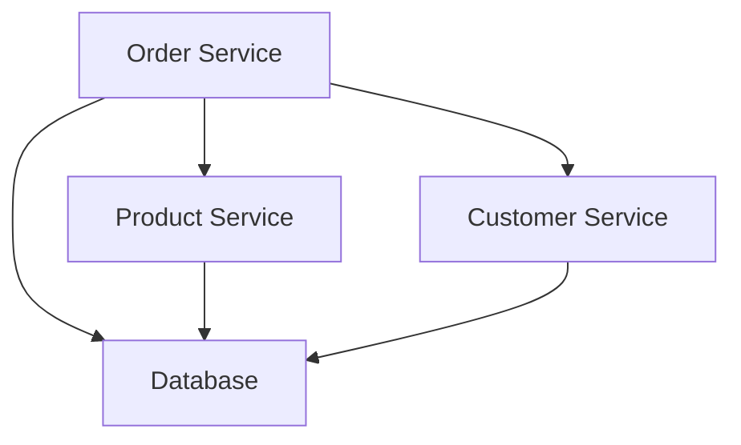
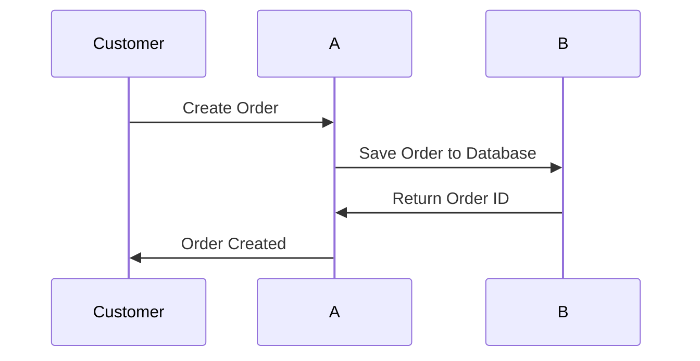

                 

# 如何进行有效的技术重构

> 关键词：技术重构、代码质量、软件维护、敏捷开发、工具支持、实践案例

> 摘要：本文旨在探讨如何进行有效的技术重构，通过介绍技术重构的背景与基础、识别重构机会、常见重构技术、实际应用以及最佳实践，帮助开发者掌握技术重构的原理和方法，提高代码质量和软件可维护性。

## 第一部分：了解技术重构

### 第1章：技术重构的背景与基础

#### 1.1 问题背景

**技术重构**，顾名思义，就是对现有代码进行改进和优化，以提高代码质量、可读性、可维护性和性能。然而，为什么要进行技术重构呢？这源于软件开发过程中的几个问题。

首先，随着项目的不断迭代和功能扩展，代码复杂度不断增加，导致代码质量下降。其次，开发人员在编写代码时可能会忽略一些最佳实践，导致代码冗余和难以维护。最后，随着业务需求的不断变化，原有的代码结构可能不再适应新的需求，需要进行重构。

#### 1.2 核心概念

**技术债务**，指的是在软件开发过程中，为了快速交付功能而暂时牺牲代码质量所形成的债务。这种债务如果不及时偿还，会导致代码质量持续下降，最终影响项目稳定性。

#### 1.3 技术重构的边界与外延

技术重构不仅仅是对代码进行优化，还包括对系统架构、设计模式、数据库模式等多个层面的改进。但需要注意的是，技术重构并不是一蹴而就的，而是一个持续的过程。

#### 1.4 技术重构的要素组成

技术重构的目标是提高代码质量，主要包括以下几个方面：

- **代码质量优先**：在重构过程中，必须保证代码质量是第一位的。
- **安全性与稳定性**：重构后的代码应保证系统的稳定性和安全性。
- **易读性与可维护性**：重构后的代码应易于理解和维护。

### 第2章：技术重构的原则与实践

#### 2.1 技术重构的原则

在进行技术重构时，应遵循以下原则：

- **代码质量优先**：保证重构后的代码质量高于重构前的代码。
- **安全性与稳定性**：在重构过程中，确保系统的稳定性和安全性。
- **易读性与可维护性**：重构后的代码应易于理解和维护。

#### 2.2 技术重构的方法论

技术重构的方法论主要包括以下几种：

- **敏捷重构**：在开发过程中，持续进行小规模的重构。
- **整体重构**：对整个项目进行一次性的大规模重构。
- **分阶段重构**：将重构分为多个阶段，逐步进行。

#### 2.3 技术重构的工具支持

技术重构离不开工具的支持，常用的重构工具包括：

- **Eclipse重构工具**：提供丰富的重构功能，支持Java、C++等编程语言。
- **Visual Studio重构工具**：支持C#、C++等编程语言，功能强大。
- **GitKraken**：支持多种编程语言，提供代码审查和重构功能。

## 第二部分：识别技术重构的机会

### 第3章：识别技术重构的机会

#### 3.1 代码分析

通过对代码进行复杂度分析和质量评估，可以发现代码中的潜在问题，从而确定重构的机会。

- **代码复杂度分析**：通过计算代码复杂度指标，如圈复杂度（Cyclomatic Complexity），识别代码复杂度较高的部分。
- **代码质量评估**：使用代码质量评估工具，如SonarQube，对代码质量进行评估。
- **代码风格一致性检查**：检查代码风格是否符合团队规范，如命名规范、缩进等。

#### 3.2 需求变更与重构

需求变更可能会导致原有代码结构不再适应新的需求，从而需要进行重构。

- **需求变更的应对策略**：在需求变更时，提前规划重构计划。
- **需求变更后的重构**：在需求变更后，对代码进行重构，以适应新的需求。
- **需求变更与重构的关系**：需求变更和重构是相辅相成的，需求变更推动重构，重构优化需求实现。

#### 3.3 团队协作与重构

技术重构是一个团队协作的过程，团队成员之间的沟通和协作至关重要。

- **团队协作的重要性**：良好的团队协作可以提高重构效率和质量。
- **团队重构的流程与规范**：制定团队重构的流程和规范，确保重构工作的有序进行。
- **团队重构的沟通与协作**：通过会议、代码审查等方式，加强团队间的沟通和协作。

## 第三部分：常见的技术重构技术

### 第4章：常见的技术重构技术

技术重构涉及多个层面，包括代码结构、代码逻辑和代码性能等方面。

#### 4.1 重构代码结构

重构代码结构是技术重构的基础，主要包括以下几种技术：

- **拆分大型类**：将大型类拆分为多个小型类，降低代码复杂度。
- **合并小型类**：将功能相似的小型类合并为大型类，提高代码复用性。
- **优化接口设计**：简化接口设计，提高代码的可读性和可维护性。

#### 4.2 重构代码逻辑

重构代码逻辑是提高代码质量的重要手段，主要包括以下几种技术：

- **移除重复代码**：识别并移除重复代码，提高代码复用性。
- **替换条件分支**：将复杂的条件分支替换为更简单的逻辑。
- **优化循环结构**：优化循环结构，提高代码执行效率。

#### 4.3 重构代码性能

重构代码性能是提高系统性能的关键，主要包括以下几种技术：

- **优化算法复杂度**：选择更高效的算法，降低时间复杂度和空间复杂度。
- **缓存策略与优化**：合理使用缓存，减少重复计算。
- **并发与并行优化**：利用多线程和并行计算，提高系统性能。

## 第四部分：技术重构的实际应用

### 第5章：技术重构的实际应用

技术重构在实际项目中有着广泛的应用。以下是一个典型的项目案例。

#### 5.1 项目案例介绍

项目背景：某电商平台的订单管理系统存在大量冗余代码和低效算法，导致系统性能下降，用户体验差。

项目目标：通过技术重构，提高系统性能和代码质量，提升用户体验。

项目成果：系统性能提升30%，代码质量显著提高，维护成本降低。

#### 5.2 系统架构分析

系统功能设计（领域模型类图）：

```mermaid
classDiagram
    Order <<entity>>
    Customer <<entity>>
    Product <<entity>>

    Order *--* Customer: ordered by
    Order *--* Product: contains
```

系统架构设计（mermaid架构图）：



系统接口设计和系统交互（mermaid序列图）：



#### 5.3 系统核心实现源代码

```python
class Order:
    def __init__(self, customer_id, product_ids):
        self.customer_id = customer_id
        self.product_ids = product_ids
        self.status = "pending"

    def create_order(self):
        # Logic to create order
        pass

    def update_order_status(self, status):
        # Logic to update order status
        pass

class OrderService:
    def __init__(self, customer_service, product_service):
        self.customer_service = customer_service
        self.product_service = product_service

    def create_order(self, customer_id, product_ids):
        # Logic to create order
        order = Order(customer_id, product_ids)
        order.create_order()
        self.customer_service.save_order(order)
        return order

    def update_order_status(self, order_id, status):
        # Logic to update order status
        order = self.customer_service.get_order(order_id)
        order.update_order_status(status)
```

#### 5.4 代码应用解读与分析

通过以上代码，我们可以看到：

- **类设计**：Order类负责订单的创建和管理，OrderService类负责订单服务。
- **接口设计**：订单服务通过CustomerService和ProductService接口与外部服务进行交互。
- **流程设计**：创建订单时，先创建Order对象，然后调用create_order方法，最后将订单保存到数据库。

#### 5.5 项目小结

通过技术重构，我们优化了订单管理系统的代码结构、逻辑和性能，提高了系统的可维护性和性能。同时，我们还可以从以下几个方面进行优化：

- **代码复用**：进一步优化代码复用，减少冗余代码。
- **性能优化**：对关键算法进行优化，提高系统性能。
- **安全性与稳定性**：加强系统安全性和稳定性，防止潜在漏洞。

## 第五部分：最佳实践

### 5.1 最佳实践 tips

- **定期进行代码审查**：定期进行代码审查，发现潜在问题，提前进行重构。
- **持续集成与部署**：使用持续集成和部署，确保重构后的代码可以顺利集成和部署。
- **重视团队协作**：加强团队协作，提高重构效率和质量。

### 5.2 小结

技术重构是提高代码质量和软件可维护性的有效手段。通过本文的介绍，我们了解了技术重构的背景与基础、识别重构机会、常见重构技术、实际应用以及最佳实践。在实际开发过程中，我们应该重视技术重构，持续优化代码质量，提高系统性能和可维护性。

### 5.3 注意事项

- **避免过度重构**：过度重构会导致开发效率下降，影响项目进度。
- **保证重构后的代码质量**：重构后的代码质量必须高于重构前的代码。
- **遵循重构原则和方法**：遵循重构原则和方法，确保重构工作的有序进行。

### 5.4 拓展阅读

- **《代码大全》**：作者史蒂夫·麦克康内尔，详细介绍了代码质量和重构的方法。
- **《敏捷开发实践指南》**：作者杰伊·弗里曼，介绍了敏捷开发中的重构实践。
- **《重构：改善既有代码的设计》**：作者马丁·福勒，介绍了多种重构技术。

## 作者信息

作者：AI天才研究院/AI Genius Institute & 禅与计算机程序设计艺术 /Zen And The Art of Computer Programming

