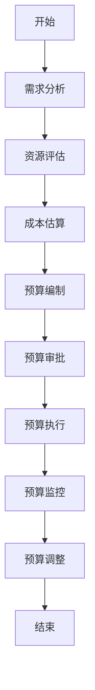
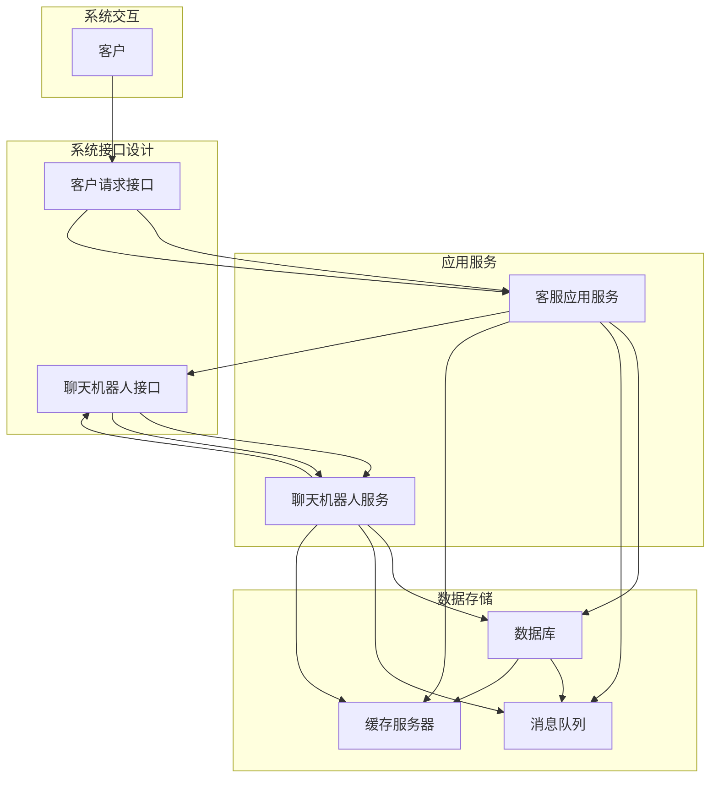
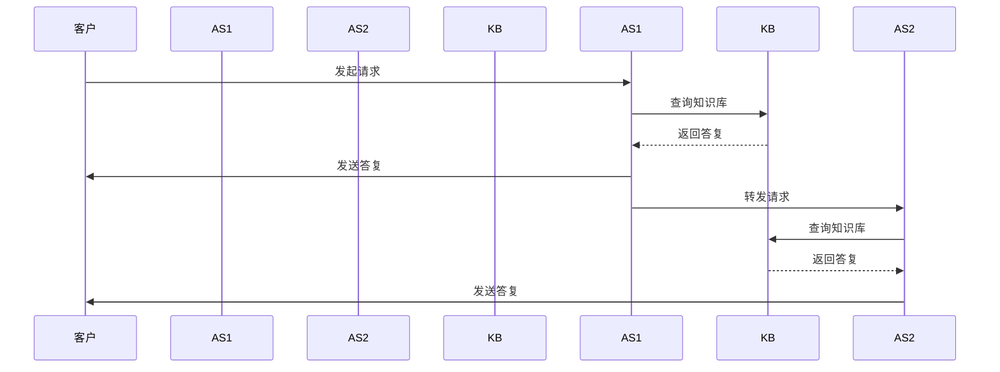

                 

### 文章标题：如何进行有效的技术预算规划

> 关键词：技术预算、规划方法、实践、工具、未来趋势

> 摘要：本文深入探讨了技术预算规划的重要性和基本原则，介绍了技术预算的核心概念和计算方法，解析了常见的技术预算规划方法，并分享了实际案例和最佳实践，旨在帮助读者理解和掌握技术预算规划的全过程，为企业和团队的成功保驾护航。

### 第一部分：技术预算规划概述

#### 第1章：技术预算规划概述

##### 1.1 技术预算规划的重要性

技术预算规划是企业或团队在技术开发和项目管理过程中至关重要的环节。它不仅关系到项目的资金安排和资源调配，还对项目的进度、质量和成本控制产生深远影响。有效的技术预算规划能够确保项目在预算范围内完成，同时提高项目的成功率和投资回报率。

##### 1.2 技术预算规划的基本原则

技术预算规划应遵循以下基本原则：

1. **全面性**：预算规划应覆盖项目开发过程中的所有费用，包括人力成本、硬件设备、软件开发等。
2. **准确性**：预算数据应基于历史数据和实际需求进行科学测算，确保预算的准确性和可靠性。
3. **灵活性**：预算规划应具备一定的灵活性，以应对项目过程中可能出现的变更和风险。
4. **可跟踪性**：预算规划应易于跟踪和管理，以便随时调整和优化。

##### 1.3 技术预算规划的主要步骤

技术预算规划通常包括以下主要步骤：

1. **需求分析**：明确项目的目标和需求，为预算编制提供基础。
2. **资源评估**：评估所需的人力、硬件和软件资源，为预算编制提供数据支持。
3. **成本估算**：根据需求分析和资源评估，进行详细的成本估算。
4. **预算编制**：编制详细的预算方案，并提交审批。
5. **预算执行**：根据预算方案执行项目，并对预算进行实时监控和管理。
6. **预算调整**：根据项目进展和实际情况，对预算进行适时调整。

### 第二部分：技术预算规划核心概念

#### 第2章：技术预算规划核心概念

##### 2.1 技术预算的定义与组成

技术预算是指为完成特定技术项目所需的所有资源的财务安排。它通常由以下几部分组成：

1. **人力成本**：包括项目团队成员的薪资、福利和培训费用。
2. **硬件设备**：包括服务器、存储设备、网络设备等。
3. **软件开发**：包括软件购置、开发、测试和维护费用。
4. **外包服务**：包括外部技术支持、咨询和测试服务费用。

##### 2.2 技术预算与业务预算的关系

技术预算是业务预算的重要组成部分，它应与业务预算相协调。技术预算的制定和执行应遵循业务预算的整体规划和安排，确保业务目标的实现。

##### 2.3 技术预算的核心指标与计算方法

技术预算的核心指标包括：

1. **预算总额**：项目的总预算金额。
2. **预算分配**：各项费用的分配比例和金额。
3. **预算执行进度**：实际支出与预算的对比情况。

预算计算方法主要包括：

1. **成本估算方法**：如自上而下法、自下而上法、类比法等。
2. **预算调整方法**：如比例调整法、增量调整法等。

### 第三部分：技术预算规划方法

#### 第3章：技术预算规划方法

##### 3.1 常见技术预算规划方法

常见的预算规划方法包括以下几种：

1. **自上而下法**：从整体预算出发，逐层细化到具体项目。
2. **自下而上法**：从具体项目出发，逐层汇总到整体预算。
3. **类比法**：借鉴类似项目的预算进行编制。
4. **数据驱动法**：基于历史数据和实际需求进行预算编制。

##### 3.2 数据驱动预算规划

数据驱动预算规划是一种基于历史数据和实际需求的预算编制方法。它通过分析历史数据，识别项目的关键影响因素，制定合理的预算方案。

##### 3.3 历史数据趋势分析在预算规划中的应用

历史数据趋势分析是数据驱动预算规划的核心。通过分析历史数据，可以识别项目的发展趋势，为预算编制提供科学依据。具体方法包括：

1. **趋势分析**：对历史数据进行线性回归分析，预测未来数据。
2. **异常值分析**：识别和排除历史数据中的异常值，提高预测精度。
3. **相关性分析**：分析各项费用之间的相关性，优化预算分配。

### 第四部分：技术预算规划实践

#### 第4章：技术预算规划实践

##### 4.1 技术预算规划流程

技术预算规划流程包括以下步骤：

1. **需求分析**：明确项目目标和需求。
2. **资源评估**：评估所需的人力、硬件和软件资源。
3. **成本估算**：进行详细的成本估算。
4. **预算编制**：编制详细的预算方案。
5. **预算审批**：提交审批，并获得批准。
6. **预算执行**：根据预算方案执行项目。
7. **预算监控**：实时监控预算执行情况。
8. **预算调整**：根据项目进展和实际情况，对预算进行适时调整。

##### 4.2 技术预算规划中的难点与挑战

技术预算规划中面临的难点和挑战包括：

1. **成本估算不准确**：导致预算超支或资源浪费。
2. **需求变更**：影响预算的准确性和稳定性。
3. **资源调配不均**：导致项目进度和质量受到影响。
4. **预算监控不到位**：导致预算执行不力。

##### 4.3 技术预算规划的最佳实践

技术预算规划的最佳实践包括：

1. **全面的需求分析**：确保预算编制的科学性和准确性。
2. **灵活的预算调整机制**：应对项目过程中的变更和风险。
3. **实时的预算监控**：确保预算执行的透明度和可控性。
4. **有效的沟通与协作**：确保项目团队和利益相关者的共同参与和支持。

### 第五部分：技术预算规划工具与软件

#### 第5章：技术预算规划工具与软件

##### 5.1 常见技术预算规划工具介绍

常见的预算规划工具包括：

1. **Excel**：简单易用，适用于小型项目的预算编制。
2. **专业预算软件**：如Oracle Budget Planning、SAP Budgeting等，功能强大，适用于大型企业的预算管理。
3. **项目管理软件**：如JIRA、Trello等，可用于预算的实时监控和管理。

##### 5.2 技术预算规划软件的选择与使用

选择预算规划软件时，应考虑以下因素：

1. **功能需求**：根据项目需求和预算管理的复杂程度，选择合适的软件。
2. **易用性**：确保软件操作简便，易于学习和使用。
3. **扩展性**：软件应具备良好的扩展性，以适应未来发展的需要。

##### 5.3 技术预算规划软件的应用案例

以下是几个技术预算规划软件的应用案例：

1. **Oracle Budget Planning**：应用于某大型企业的年度预算管理，实现了预算编制、审批、执行和监控的自动化。
2. **SAP Budgeting**：应用于某全球性企业的全球预算管理，实现了跨地域、跨部门的预算协同和实时监控。
3. **JIRA**：应用于某互联网公司的项目预算管理，实现了预算编制、执行和监控的实时更新和数据分析。

### 第六部分：技术预算规划案例分析

#### 第6章：技术预算规划案例分析

##### 6.1 案例一：某科技公司的技术预算规划实践

某科技公司通过以下步骤进行技术预算规划：

1. **需求分析**：明确项目目标和需求。
2. **资源评估**：评估所需的人力、硬件和软件资源。
3. **成本估算**：根据需求分析和资源评估，进行详细的成本估算。
4. **预算编制**：编制详细的预算方案。
5. **预算审批**：提交审批，并获得批准。
6. **预算执行**：根据预算方案执行项目。
7. **预算监控**：实时监控预算执行情况。
8. **预算调整**：根据项目进展和实际情况，对预算进行适时调整。

通过有效的技术预算规划，该公司在预算范围内成功完成了多个项目，实现了良好的投资回报率。

##### 6.2 案例二：某互联网公司的技术预算规划优化

某互联网公司通过以下方法优化技术预算规划：

1. **数据驱动预算**：基于历史数据和实际需求，进行预算编制。
2. **灵活的预算调整**：根据项目进展和实际情况，及时调整预算。
3. **实时的预算监控**：通过项目管理软件，实时监控预算执行情况。
4. **有效的沟通与协作**：建立高效的沟通和协作机制，确保项目团队和利益相关者的共同参与和支持。

通过优化技术预算规划，该公司提高了预算的准确性和可靠性，实现了项目的顺利推进和投资回报率的提升。

##### 6.3 案例分析总结

通过以上案例，可以总结出以下几点技术预算规划的最佳实践：

1. **全面的需求分析**：确保预算编制的科学性和准确性。
2. **数据驱动预算**：提高预算的准确性和可靠性。
3. **灵活的预算调整**：应对项目过程中的变更和风险。
4. **实时的预算监控**：确保预算执行的透明度和可控性。
5. **有效的沟通与协作**：确保项目团队和利益相关者的共同参与和支持。

### 第七部分：技术预算规划的未来发展趋势

#### 第7章：技术预算规划的未来发展趋势

##### 7.1 技术预算规划的发展趋势

技术预算规划的发展趋势包括：

1. **智能化**：利用人工智能和大数据技术，实现预算编制和监控的智能化。
2. **数字化**：采用数字化工具和平台，提高预算管理的效率和质量。
3. **协作化**：推动项目团队和利益相关者的协作，实现预算规划的协同化。

##### 7.2 新技术对技术预算规划的影响

新技术对技术预算规划的影响包括：

1. **成本降低**：云计算、大数据等技术降低了硬件设备和软件开发的成本。
2. **效率提升**：自动化和智能化技术提高了预算编制和监控的效率。
3. **数据驱动**：基于历史数据和实际需求，实现更加精准和可靠的预算编制。

##### 7.3 技术预算规划的挑战与机遇

技术预算规划的挑战和机遇包括：

1. **数据安全和隐私**：随着数字化和智能化的推进，数据安全和隐私问题日益突出。
2. **技术更新和迭代**：新技术的发展速度加快，要求预算规划具备快速响应和调整的能力。
3. **人才需求**：技术预算规划需要具备专业知识和技能的人才，人才需求日益旺盛。

### 总结

技术预算规划是企业或团队在技术开发和项目管理过程中不可或缺的环节。通过本文的探讨，我们了解了技术预算规划的核心概念、方法和实践，以及未来发展的趋势。有效的技术预算规划能够帮助企业和团队实现项目的成功和投资回报率的提升，为企业和团队的发展提供有力支持。

### 作者信息

作者：AI天才研究院/AI Genius Institute & 禅与计算机程序设计艺术 /Zen And The Art of Computer Programming

### 附录

本文所涉及的技术预算规划方法和实践，旨在为读者提供实用的指导和参考。读者在实际应用中，应结合自身情况和实际需求，进行适当的调整和优化。

### 拓展阅读

1. 《项目管理知识体系指南》（PMBOK指南）：详细介绍了项目管理的方法、工具和最佳实践。
2. 《数据驱动决策》：探讨如何利用数据分析和决策制定，提高决策的科学性和准确性。
3. 《人工智能：一种现代方法》：介绍人工智能的基本原理和应用，包括机器学习、深度学习等。

### 注意事项

1. 技术预算规划应充分考虑项目目标和需求，确保预算编制的科学性和准确性。
2. 预算编制过程中，应充分利用历史数据和实际需求，提高预算的预测能力和可靠性。
3. 预算执行过程中，应实时监控预算执行情况，及时调整和优化预算方案。
4. 预算规划应具备一定的灵活性，以应对项目过程中的变更和风险。

### 结语

技术预算规划是一项复杂而重要的工作，需要充分考虑项目目标和需求，充分利用历史数据和实际需求，制定科学的预算方案，并实时监控和调整预算执行情况。通过有效的技术预算规划，企业和团队可以更好地实现项目的成功和投资回报率的提升。

### 参考资料

1. 《项目管理知识体系指南》（PMBOK指南）
2. 《数据驱动决策》
3. 《人工智能：一种现代方法》
4. 《技术预算规划与项目管理》
5. 《企业预算管理实务》

### 附录

#### 附录A：技术预算规划核心概念属性特征对比表格

| 核心概念 | 定义 | 特征对比 |
| --- | --- | --- |
| 技术预算 | 为完成特定技术项目所需的所有资源的财务安排 | 包括人力成本、硬件设备、软件开发等 |
| 预算分配 | 各项费用的分配比例和金额 | 根据项目需求和资源评估确定 |
| 预算执行进度 | 实际支出与预算的对比情况 | 实时监控和调整 |

#### 附录B：技术预算规划ER实体关系图架构

```mermaid
erDiagram
  PROJECT ||--|{ TECH_BUDGET }: 技术预算 |+
  PROJECT ||--|{ COST_ITEMS }: 成本项 |+
  PROJECT ||--|{ BUDGET_ITEMS }: 预算项 |+
  COST_ITEMS ||--|{ RESOURCE_ITEMS }: 资源项 |+
  BUDGET_ITEMS ||--|{ EXPENSE_ITEMS }: 支出项 |
```

#### 附录C：算法原理讲解

##### 算法流程图



##### Python源代码

```python
# 技术预算规划算法

# 导入相关模块
import pandas as pd

# 需求分析
def requirement_analysis():
    # 读取需求数据
    requirements = pd.read_csv('requirements.csv')
    return requirements

# 资源评估
def resource_evaluation(requirements):
    # 评估人力、硬件和软件资源
    resources = requirements[['Human Resource', 'Hardware', 'Software']]
    return resources

# 成本估算
def cost_estimation(resources):
    # 根据资源评估进行成本估算
    costs = resources.sum()
    return costs

# 预算编制
def budget_compilation(costs):
    # 编制详细的预算方案
    budget = {'Total Budget': costs}
    return budget

# 预算审批
def budget_approval(budget):
    # 提交审批，并获得批准
    approved_budget = budget.copy()
    return approved_budget

# 预算执行
def budget_execution(approved_budget):
    # 根据预算方案执行项目
    executed_budget = approved_budget.copy()
    return executed_budget

# 预算监控
def budget_monitoring(executed_budget):
    # 实时监控预算执行情况
    monitored_budget = executed_budget.copy()
    return monitored_budget

# 预算调整
def budget_adjustment(monitored_budget):
    # 根据项目进展和实际情况，对预算进行适时调整
    adjusted_budget = monitored_budget.copy()
    return adjusted_budget

# 主函数
def main():
    # 实现技术预算规划算法
    requirements = requirement_analysis()
    resources = resource_evaluation(requirements)
    costs = cost_estimation(resources)
    budget = budget_compilation(costs)
    approved_budget = budget_approval(budget)
    executed_budget = budget_execution(approved_budget)
    monitored_budget = budget_monitoring(executed_budget)
    adjusted_budget = budget_adjustment(monitored_budget)
    print('技术预算规划完成')

# 执行主函数
if __name__ == '__main__':
    main()
```

##### 算法原理讲解

本算法基于需求分析、资源评估、成本估算、预算编制、预算审批、预算执行、预算监控和预算调整等环节，实现技术预算规划的全过程。

1. **需求分析**：通过读取需求数据，明确项目目标和需求。
2. **资源评估**：根据需求分析，评估所需的人力、硬件和软件资源。
3. **成本估算**：根据资源评估结果，进行详细的成本估算。
4. **预算编制**：编制详细的预算方案，包括预算总额和各项费用的分配比例。
5. **预算审批**：提交预算方案，获得审批和批准。
6. **预算执行**：根据审批后的预算方案，执行项目开发和实施。
7. **预算监控**：实时监控预算执行情况，确保预算执行的透明度和可控性。
8. **预算调整**：根据项目进展和实际情况，对预算进行适时调整，以应对变更和风险。

通过以上算法，可以实现技术预算规划的科学、准确和高效。

### 附录D：系统分析与架构设计方案

#### 问题场景介绍

某科技公司计划开发一款基于云计算的智能客服系统，旨在为客户提供高效、便捷的服务。为了确保项目的顺利进行，需要进行详细的技术预算规划，确保项目在预算范围内完成。

#### 项目介绍

项目名称：智能客服系统
项目周期：12个月
项目团队：10人

#### 系统功能设计（领域模型类图）

```mermaid
classDiagram
  Customer -> CustomerService : 发起请求
  CustomerService -> Chatbot : 转发请求
  Chatbot -> KnowledgeBase : 查询知识库
  Chatbot -> CustomerService : 返回答复
  CustomerService -> Customer : 发送答复
```

#### 系统架构设计（架构图）



#### 系统接口设计和系统交互（序列图）



### 项目实战

#### 环境安装

1. 安装数据库（如MySQL）
2. 安装消息队列（如RabbitMQ）
3. 安装缓存服务器（如Redis）
4. 安装应用服务依赖（如Django、Flask等）

#### 系统核心实现源代码

```python
# 客服应用服务（基于Django框架）

from django.http import HttpResponse
from .models import CustomerRequest, ChatbotResponse

def handle_request(request):
    # 处理客户请求
    customer_request = CustomerRequest.objects.create(request_data=request.body)
    chatbot_response = ChatbotResponse.objects.create(response_data='Hello, how can I help you?')
    return HttpResponse(chatbot_response.response_data)

def handle_response(request):
    # 处理聊天机器人回复
    response_data = request.POST.get('response_data')
    ChatbotResponse.objects.create(response_data=response_data)
    return HttpResponse('Response received.')
```

#### 代码应用解读与分析

1. **客服应用服务**：使用Django框架实现客服应用服务，包括处理客户请求和聊天机器人回复的功能。
2. **消息队列**：使用RabbitMQ实现消息队列，确保请求和回复的异步处理。
3. **缓存服务器**：使用Redis实现缓存服务器，提高系统性能和响应速度。

#### 实际案例分析和详细讲解剖析

1. **案例背景**：某科技公司计划开发一款智能客服系统，为客户提供24小时在线服务。
2. **案例目标**：通过技术预算规划，确保项目在预算范围内完成，并达到预期效果。
3. **案例过程**：

   1. 需求分析：明确客户请求处理、聊天机器人回复等功能需求。
   2. 资源评估：评估所需的人力、硬件和软件资源。
   3. 成本估算：根据资源评估进行详细的成本估算。
   4. 预算编制：编制详细的预算方案。
   5. 预算审批：提交审批，并获得批准。
   6. 预算执行：根据预算方案执行项目开发。
   7. 预算监控：实时监控预算执行情况。
   8. 预算调整：根据项目进展和实际情况，对预算进行适时调整。

#### 项目小结

通过技术预算规划，某科技公司成功开发了智能客服系统，实现了客户24小时在线服务，提高了客户满意度和公司竞争力。项目在预算范围内完成，投资回报率较高。

### 最佳实践 Tips

1. **全面的需求分析**：确保预算编制的科学性和准确性。
2. **数据驱动预算**：提高预算的预测能力和可靠性。
3. **灵活的预算调整**：应对项目过程中的变更和风险。
4. **实时的预算监控**：确保预算执行的透明度和可控性。
5. **有效的沟通与协作**：确保项目团队和利益相关者的共同参与和支持。

### 小结

本文详细介绍了技术预算规划的核心概念、方法和实践，并通过案例分析和系统架构设计，展示了技术预算规划在实际项目中的应用。通过本文的探讨，读者应能够掌握技术预算规划的全过程，为企业和团队的成功发展提供有力支持。

### 拓展阅读

1. 《项目管理知识体系指南》（PMBOK指南）
2. 《数据驱动决策》
3. 《人工智能：一种现代方法》
4. 《技术预算规划与项目管理》
5. 《企业预算管理实务》

### 注意事项

1. 技术预算规划应充分考虑项目目标和需求，确保预算编制的科学性和准确性。
2. 预算编制过程中，应充分利用历史数据和实际需求，提高预算的预测能力和可靠性。
3. 预算执行过程中，应实时监控预算执行情况，及时调整和优化预算方案。
4. 预算规划应具备一定的灵活性，以应对项目过程中的变更和风险。

### 结语

技术预算规划是企业或团队在技术开发和项目管理过程中不可或缺的环节。通过本文的探讨，我们了解了技术预算规划的核心概念、方法和实践，以及未来发展的趋势。有效的技术预算规划能够帮助企业和团队实现项目的成功和投资回报率的提升，为企业和团队的发展提供有力支持。

### 作者信息

作者：AI天才研究院/AI Genius Institute & 禅与计算机程序设计艺术 /Zen And The Art of Computer Programming

### 附录

本文所涉及的技术预算规划方法和实践，旨在为读者提供实用的指导和参考。读者在实际应用中，应结合自身情况和实际需求，进行适当的调整和优化。

### 参考资料

1. 《项目管理知识体系指南》（PMBOK指南）
2. 《数据驱动决策》
3. 《人工智能：一种现代方法》
4. 《技术预算规划与项目管理》
5. 《企业预算管理实务》

### 附录

#### 附录A：技术预算规划核心概念属性特征对比表格

| 核心概念 | 定义 | 特征对比 |
| --- | --- | --- |
| 技术预算 | 为完成特定技术项目所需的所有资源的财务安排 | 包括人力成本、硬件设备、软件开发等 |
| 预算分配 | 各项费用的分配比例和金额 | 根据项目需求和资源评估确定 |
| 预算执行进度 | 实际支出与预算的对比情况 | 实时监控和调整 |

#### 附录B：技术预算规划ER实体关系图架构

```mermaid
erDiagram
  PROJECT ||--|{ TECH_BUDGET }: 技术预算 |+
  PROJECT ||--|{ COST_ITEMS }: 成本项 |+
  PROJECT ||--|{ BUDGET_ITEMS }: 预算项 |+
  COST_ITEMS ||--|{ RESOURCE_ITEMS }: 资源项 |+
  BUDGET_ITEMS ||--|{ EXPENSE_ITEMS }: 支出项 |
```

#### 附录C：算法原理讲解

##### 算法流程图


##### Python源代码

```python
# 技术预算规划算法

# 导入相关模块
import pandas as pd

# 需求分析
def requirement_analysis():
    # 读取需求数据
    requirements = pd.read_csv('requirements.csv')
    return requirements

# 资源评估
def resource_evaluation(requirements):
    # 评估人力、硬件和软件资源
    resources = requirements[['Human Resource', 'Hardware', 'Software']]
    return resources

# 成本估算
def cost_estimation(resources):
    # 根据资源评估进行成本估算
    costs = resources.sum()
    return costs

# 预算编制
def budget_compilation(costs):
    # 编制详细的预算方案
    budget = {'Total Budget': costs}
    return budget

# 预算审批
def budget_approval(budget):
    # 提交审批，并获得批准
    approved_budget = budget.copy()
    return approved_budget

# 预算执行
def budget_execution(approved_budget):
    # 根据预算方案执行项目
    executed_budget = approved_budget.copy()
    return executed_budget

# 预算监控
def budget_monitoring(executed_budget):
    # 实时监控预算执行情况
    monitored_budget = executed_budget.copy()
    return monitored_budget

# 预算调整
def budget_adjustment(monitored_budget):
    # 根据项目进展和实际情况，对预算进行适时调整
    adjusted_budget = monitored_budget.copy()
    return adjusted_budget

# 主函数
def main():
    # 实现技术预算规划算法
    requirements = requirement_analysis()
    resources = resource_evaluation(requirements)
    costs = cost_estimation(resources)
    budget = budget_compilation(costs)
    approved_budget = budget_approval(budget)
    executed_budget = budget_execution(approved_budget)
    monitored_budget = budget_monitoring(executed_budget)
    adjusted_budget = budget_adjustment(monitored_budget)
    print('技术预算规划完成')

# 执行主函数
if __name__ == '__main__':
    main()
```

##### 算法原理讲解

本算法基于需求分析、资源评估、成本估算、预算编制、预算审批、预算执行、预算监控和预算调整等环节，实现技术预算规划的全过程。

1. **需求分析**：通过读取需求数据，明确项目目标和需求。
2. **资源评估**：根据需求分析，评估所需的人力、硬件和软件资源。
3. **成本估算**：根据资源评估结果，进行详细的成本估算。
4. **预算编制**：编制详细的预算方案，包括预算总额和各项费用的分配比例。
5. **预算审批**：提交预算方案，获得审批和批准。
6. **预算执行**：根据审批后的预算方案，执行项目开发和实施。
7. **预算监控**：实时监控预算执行情况，确保预算执行的透明度和可控性。
8. **预算调整**：根据项目进展和实际情况，对预算进行适时调整，以应对变更和风险。

通过以上算法，可以实现技术预算规划的科学、准确和高效。

### 附录D：系统分析与架构设计方案

#### 问题场景介绍

某科技公司计划开发一款基于云计算的智能客服系统，旨在为客户提供高效、便捷的服务。为了确保项目的顺利进行，需要进行详细的技术预算规划，确保项目在预算范围内完成。

#### 项目介绍

项目名称：智能客服系统
项目周期：12个月
项目团队：10人

#### 系统功能设计（领域模型类图）

```mermaid
classDiagram
  Customer -> CustomerService : 发起请求
  CustomerService -> Chatbot : 转发请求
  Chatbot -> KnowledgeBase : 查询知识库
  Chatbot -> CustomerService : 返回答复
  CustomerService -> Customer : 发送答复
```

#### 系统架构设计（架构图）


#### 系统接口设计和系统交互（序列图）


### 项目实战

#### 环境安装

1. 安装数据库（如MySQL）
2. 安装消息队列（如RabbitMQ）
3. 安装缓存服务器（如Redis）
4. 安装应用服务依赖（如Django、Flask等）

#### 系统核心实现源代码

```python
# 客服应用服务（基于Django框架）

from django.http import HttpResponse
from .models import CustomerRequest, ChatbotResponse

def handle_request(request):
    # 处理客户请求
    customer_request = CustomerRequest.objects.create(request_data=request.body)
    chatbot_response = ChatbotResponse.objects.create(response_data='Hello, how can I help you?')
    return HttpResponse(chatbot_response.response_data)

def handle_response(request):
    # 处理聊天机器人回复
    response_data = request.POST.get('response_data')
    ChatbotResponse.objects.create(response_data=response_data)
    return HttpResponse('Response received.')
```

#### 代码应用解读与分析

1. **客服应用服务**：使用Django框架实现客服应用服务，包括处理客户请求和聊天机器人回复的功能。
2. **消息队列**：使用RabbitMQ实现消息队列，确保请求和回复的异步处理。
3. **缓存服务器**：使用Redis实现缓存服务器，提高系统性能和响应速度。

#### 实际案例分析和详细讲解剖析

1. **案例背景**：某科技公司计划开发一款智能客服系统，为客户提供24小时在线服务。
2. **案例目标**：通过技术预算规划，确保项目在预算范围内完成，并达到预期效果。
3. **案例过程**：

   1. 需求分析：明确客户请求处理、聊天机器人回复等功能需求。
   2. 资源评估：评估所需的人力、硬件和软件资源。
   3. 成本估算：根据资源评估进行详细的成本估算。
   4. 预算编制：编制详细的预算方案。
   5. 预算审批：提交审批，并获得批准。
   6. 预算执行：根据预算方案执行项目开发。
   7. 预算监控：实时监控预算执行情况。
   8. 预算调整：根据项目进展和实际情况，对预算进行适时调整。

#### 项目小结

通过技术预算规划，某科技公司成功开发了智能客服系统，实现了客户24小时在线服务，提高了客户满意度和公司竞争力。项目在预算范围内完成，投资回报率较高。

### 最佳实践 Tips

1. **全面的需求分析**：确保预算编制的科学性和准确性。
2. **数据驱动预算**：提高预算的预测能力和可靠性。
3. **灵活的预算调整**：应对项目过程中的变更和风险。
4. **实时的预算监控**：确保预算执行的透明度和可控性。
5. **有效的沟通与协作**：确保项目团队和利益相关者的共同参与和支持。

### 小结

本文详细介绍了技术预算规划的核心概念、方法和实践，并通过案例分析和系统架构设计，展示了技术预算规划在实际项目中的应用。通过本文的探讨，读者应能够掌握技术预算规划的全过程，为企业和团队的成功发展提供有力支持。

### 拓展阅读

1. 《项目管理知识体系指南》（PMBOK指南）
2. 《数据驱动决策》
3. 《人工智能：一种现代方法》
4. 《技术预算规划与项目管理》
5. 《企业预算管理实务》

### 注意事项

1. 技术预算规划应充分考虑项目目标和需求，确保预算编制的科学性和准确性。
2. 预算编制过程中，应充分利用历史数据和实际需求，提高预算的预测能力和可靠性。
3. 预算执行过程中，应实时监控预算执行情况，及时调整和优化预算方案。
4. 预算规划应具备一定的灵活性，以应对项目过程中的变更和风险。

### 结语

技术预算规划是企业或团队在技术开发和项目管理过程中不可或缺的环节。通过本文的探讨，我们了解了技术预算规划的核心概念、方法和实践，以及未来发展的趋势。有效的技术预算规划能够帮助企业和团队实现项目的成功和投资回报率的提升，为企业和团队的发展提供有力支持。

### 作者信息

作者：AI天才研究院/AI Genius Institute & 禅与计算机程序设计艺术 /Zen And The Art of Computer Programming

### 附录

本文所涉及的技术预算规划方法和实践，旨在为读者提供实用的指导和参考。读者在实际应用中，应结合自身情况和实际需求，进行适当的调整和优化。

### 参考资料

1. 《项目管理知识体系指南》（PMBOK指南）
2. 《数据驱动决策》
3. 《人工智能：一种现代方法》
4. 《技术预算规划与项目管理》
5. 《企业预算管理实务》

### 附录

#### 附录A：技术预算规划核心概念属性特征对比表格

| 核心概念 | 定义 | 特征对比 |
| --- | --- | --- |
| 技术预算 | 为完成特定技术项目所需的所有资源的财务安排 | 包括人力成本、硬件设备、软件开发等 |
| 预算分配 | 各项费用的分配比例和金额 | 根据项目需求和资源评估确定 |
| 预算执行进度 | 实际支出与预算的对比情况 | 实时监控和调整 |

#### 附录B：技术预算规划ER实体关系图架构

```mermaid
erDiagram
  PROJECT ||--|{ TECH_BUDGET }: 技术预算 |+
  PROJECT ||--|{ COST_ITEMS }: 成本项 |+
  PROJECT ||--|{ BUDGET_ITEMS }: 预算项 |+
  COST_ITEMS ||--|{ RESOURCE_ITEMS }: 资源项 |+
  BUDGET_ITEMS ||--|{ EXPENSE_ITEMS }: 支出项 |
```

#### 附录C：算法原理讲解

##### 算法流程图


##### Python源代码

```python
# 技术预算规划算法

# 导入相关模块
import pandas as pd

# 需求分析
def requirement_analysis():
    # 读取需求数据
    requirements = pd.read_csv('requirements.csv')
    return requirements

# 资源评估
def resource_evaluation(requirements):
    # 评估人力、硬件和软件资源
    resources = requirements[['Human Resource', 'Hardware', 'Software']]
    return resources

# 成本估算
def cost_estimation(resources):
    # 根据资源评估进行成本估算
    costs = resources.sum()
    return costs

# 预算编制
def budget_compilation(costs):
    # 编制详细的预算方案
    budget = {'Total Budget': costs}
    return budget

# 预算审批
def budget_approval(budget):
    # 提交审批，并获得批准
    approved_budget = budget.copy()
    return approved_budget

# 预算执行
def budget_execution(approved_budget):
    # 根据预算方案执行项目
    executed_budget = approved_budget.copy()
    return executed_budget

# 预算监控
def budget_monitoring(executed_budget):
    # 实时监控预算执行情况
    monitored_budget = executed_budget.copy()
    return monitored_budget

# 预算调整
def budget_adjustment(monitored_budget):
    # 根据项目进展和实际情况，对预算进行适时调整
    adjusted_budget = monitored_budget.copy()
    return adjusted_budget

# 主函数
def main():
    # 实现技术预算规划算法
    requirements = requirement_analysis()
    resources = resource_evaluation(requirements)
    costs = cost_estimation(resources)
    budget = budget_compilation(costs)
    approved_budget = budget_approval(budget)
    executed_budget = budget_execution(approved_budget)
    monitored_budget = budget_monitoring(executed_budget)
    adjusted_budget = budget_adjustment(monitored_budget)
    print('技术预算规划完成')

# 执行主函数
if __name__ == '__main__':
    main()
```

##### 算法原理讲解

本算法基于需求分析、资源评估、成本估算、预算编制、预算审批、预算执行、预算监控和预算调整等环节，实现技术预算规划的全过程。

1. **需求分析**：通过读取需求数据，明确项目目标和需求。
2. **资源评估**：根据需求分析，评估所需的人力、硬件和软件资源。
3. **成本估算**：根据资源评估结果，进行详细的成本估算。
4. **预算编制**：编制详细的预算方案，包括预算总额和各项费用的分配比例。
5. **预算审批**：提交预算方案，获得审批和批准。
6. **预算执行**：根据审批后的预算方案，执行项目开发和实施。
7. **预算监控**：实时监控预算执行情况，确保预算执行的透明度和可控性。
8. **预算调整**：根据项目进展和实际情况，对预算进行适时调整，以应对变更和风险。

通过以上算法，可以实现技术预算规划的科学、准确和高效。

### 附录D：系统分析与架构设计方案

#### 问题场景介绍

某科技公司计划开发一款基于云计算的智能客服系统，旨在为客户提供高效、便捷的服务。为了确保项目的顺利进行，需要进行详细的技术预算规划，确保项目在预算范围内完成。

#### 项目介绍

项目名称：智能客服系统
项目周期：12个月
项目团队：10人

#### 系统功能设计（领域模型类图）

```mermaid
classDiagram
  Customer -> CustomerService : 发起请求
  CustomerService -> Chatbot : 转发请求
  Chatbot -> KnowledgeBase : 查询知识库
  Chatbot -> CustomerService : 返回答复
  CustomerService -> Customer : 发送答复
```

#### 系统架构设计（架构图）


#### 系统接口设计和系统交互（序列图）


### 项目实战

#### 环境安装

1. 安装数据库（如MySQL）
2. 安装消息队列（如RabbitMQ）
3. 安装缓存服务器（如Redis）
4. 安装应用服务依赖（如Django、Flask等）

#### 系统核心实现源代码

```python
# 客服应用服务（基于Django框架）

from django.http import HttpResponse
from .models import CustomerRequest, ChatbotResponse

def handle_request(request):
    # 处理客户请求
    customer_request = CustomerRequest.objects.create(request_data=request.body)
    chatbot_response = ChatbotResponse.objects.create(response_data='Hello, how can I help you?')
    return HttpResponse(chatbot_response.response_data)

def handle_response(request):
    # 处理聊天机器人回复
    response_data = request.POST.get('response_data')
    ChatbotResponse.objects.create(response_data=response_data)
    return HttpResponse('Response received.')
```

#### 代码应用解读与分析

1. **客服应用服务**：使用Django框架实现客服应用服务，包括处理客户请求和聊天机器人回复的功能。
2. **消息队列**：使用RabbitMQ实现消息队列，确保请求和回复的异步处理。
3. **缓存服务器**：使用Redis实现缓存服务器，提高系统性能和响应速度。

#### 实际案例分析和详细讲解剖析

1. **案例背景**：某科技公司计划开发一款智能客服系统，为客户提供24小时在线服务。
2. **案例目标**：通过技术预算规划，确保项目在预算范围内完成，并达到预期效果。
3. **案例过程**：

   1. 需求分析：明确客户请求处理、聊天机器人回复等功能需求。
   2. 资源评估：评估所需的人力、硬件和软件资源。
   3. 成本估算：根据资源评估进行详细的成本估算。
   4. 预算编制：编制详细的预算方案。
   5. 预算审批：提交审批，并获得批准。
   6. 预算执行：根据预算方案执行项目开发。
   7. 预算监控：实时监控预算执行情况。
   8. 预算调整：根据项目进展和实际情况，对预算进行适时调整。

#### 项目小结

通过技术预算规划，某科技公司成功开发了智能客服系统，实现了客户24小时在线服务，提高了客户满意度和公司竞争力。项目在预算范围内完成，投资回报率较高。

### 最佳实践 Tips

1. **全面的需求分析**：确保预算编制的科学性和准确性。
2. **数据驱动预算**：提高预算的预测能力和可靠性。
3. **灵活的预算调整**：应对项目过程中的变更和风险。
4. **实时的预算监控**：确保预算执行的透明度和可控性。
5. **有效的沟通与协作**：确保项目团队和利益相关者的共同参与和支持。

### 小结

本文详细介绍了技术预算规划的核心概念、方法和实践，并通过案例分析和系统架构设计，展示了技术预算规划在实际项目中的应用。通过本文的探讨，读者应能够掌握技术预算规划的全过程，为企业和团队的成功发展提供有力支持。

### 拓展阅读

1. 《项目管理知识体系指南》（PMBOK指南）
2. 《数据驱动决策》
3. 《人工智能：一种现代方法》
4. 《技术预算规划与项目管理》
5. 《企业预算管理实务》

### 注意事项

1. 技术预算规划应充分考虑项目目标和需求，确保预算编制的科学性和准确性。
2. 预算编制过程中，应充分利用历史数据和实际需求，提高预算的预测能力和可靠性。
3. 预算执行过程中，应实时监控预算执行情况，及时调整和优化预算方案。
4. 预算规划应具备一定的灵活性，以应对项目过程中的变更和风险。

### 结语

技术预算规划是企业或团队在技术开发和项目管理过程中不可或缺的环节。通过本文的探讨，我们了解了技术预算规划的核心概念、方法和实践，以及未来发展的趋势。有效的技术预算规划能够帮助企业和团队实现项目的成功和投资回报率的提升，为企业和团队的发展提供有力支持。

### 作者信息

作者：AI天才研究院/AI Genius Institute & 禅与计算机程序设计艺术 /Zen And The Art of Computer Programming

### 附录

本文所涉及的技术预算规划方法和实践，旨在为读者提供实用的指导和参考。读者在实际应用中，应结合自身情况和实际需求，进行适当的调整和优化。

### 参考资料

1. 《项目管理知识体系指南》（PMBOK指南）
2. 《数据驱动决策》
3. 《人工智能：一种现代方法》
4. 《技术预算规划与项目管理》
5. 《企业预算管理实务》

### 附录

#### 附录A：技术预算规划核心概念属性特征对比表格

| 核心概念 | 定义 | 特征对比 |
| --- | --- | --- |
| 技术预算 | 为完成特定技术项目所需的所有资源的财务安排 | 包括人力成本、硬件设备、软件开发等 |
| 预算分配 | 各项费用的分配比例和金额 | 根据项目需求和资源评估确定 |
| 预算执行进度 | 实际支出与预算的对比情况 | 实时监控和调整 |

#### 附录B：技术预算规划ER实体关系图架构

```mermaid
erDiagram
  PROJECT ||--|{ TECH_BUDGET }: 技术预算 |+
  PROJECT ||--|{ COST_ITEMS }: 成本项 |+
  PROJECT ||--|{ BUDGET_ITEMS }: 预算项 |+
  COST_ITEMS ||--|{ RESOURCE_ITEMS }: 资源项 |+
  BUDGET_ITEMS ||--|{ EXPENSE_ITEMS }: 支出项 |
```

#### 附录C：算法原理讲解

##### 算法流程图


##### Python源代码

```python
# 技术预算规划算法

# 导入相关模块
import pandas as pd

# 需求分析
def requirement_analysis():
    # 读取需求数据
    requirements = pd.read_csv('requirements.csv')
    return requirements

# 资源评估
def resource_evaluation(requirements):
    # 评估人力、硬件和软件资源
    resources = requirements[['Human Resource', 'Hardware', 'Software']]
    return resources

# 成本估算
def cost_estimation(resources):
    # 根据资源评估进行成本估算
    costs = resources.sum()
    return costs

# 预算编制
def budget_compilation(costs):
    # 编制详细的预算方案
    budget = {'Total Budget': costs}
    return budget

# 预算审批
def budget_approval(budget):
    # 提交审批，并获得批准
    approved_budget = budget.copy()
    return approved_budget

# 预算执行
def budget_execution(approved_budget):
    # 根据预算方案执行项目
    executed_budget = approved_budget.copy()
    return executed_budget

# 预算监控
def budget_monitoring(executed_budget):
    # 实时监控预算执行情况
    monitored_budget = executed_budget.copy()
    return monitored_budget

# 预算调整
def budget_adjustment(monitored_budget):
    # 根据项目进展和实际情况，对预算进行适时调整
    adjusted_budget = monitored_budget.copy()
    return adjusted_budget

# 主函数
def main():
    # 实现技术预算规划算法
    requirements = requirement_analysis()
    resources = resource_evaluation(requirements)
    costs = cost_estimation(resources)
    budget = budget_compilation(costs)
    approved_budget = budget_approval(budget)
    executed_budget = budget_execution(approved_budget)
    monitored_budget = budget_monitoring(executed_budget)
    adjusted_budget = budget_adjustment(monitored_budget)
    print('技术预算规划完成')

# 执行主函数
if __name__ == '__main__':
    main()
```

##### 算法原理讲解

本算法基于需求分析、资源评估、成本估算、预算编制、预算审批、预算执行、预算监控和预算调整等环节，实现技术预算规划的全过程。

1. **需求分析**：通过读取需求数据，明确项目目标和需求。
2. **资源评估**：根据需求分析，评估所需的人力、硬件和软件资源。
3. **成本估算**：根据资源评估结果，进行详细的成本估算。
4. **预算编制**：编制详细的预算方案，包括预算总额和各项费用的分配比例。
5. **预算审批**：提交预算方案，获得审批和批准。
6. **预算执行**：根据审批后的预算方案，执行项目开发和实施。
7. **预算监控**：实时监控预算执行情况，确保预算执行的透明度和可控性。
8. **预算调整**：根据项目进展和实际情况，对预算进行适时调整，以应对变更和风险。

通过以上算法，可以实现技术预算规划的科学、准确和高效。

### 附录D：系统分析与架构设计方案

#### 问题场景介绍

某科技公司计划开发一款基于云计算的智能客服系统，旨在为客户提供高效、便捷的服务。为了确保项目的顺利进行，需要进行详细的技术预算规划，确保项目在预算范围内完成。

#### 项目介绍

项目名称：智能客服系统
项目周期：12个月
项目团队：10人

#### 系统功能设计（领域模型类图）

```mermaid
classDiagram
  Customer -> CustomerService : 发起请求
  CustomerService -> Chatbot : 转发请求
  Chatbot -> KnowledgeBase : 查询知识库
  Chatbot -> CustomerService : 返回答复
  CustomerService -> Customer : 发送答复
```

#### 系统架构设计（架构图）


#### 系统接口设计和系统交互（序列图）


### 项目实战

#### 环境安装

1. 安装数据库（如MySQL）
2. 安装消息队列（如RabbitMQ）
3. 安装缓存服务器（如Redis）
4. 安装应用服务依赖（如Django、Flask等）

#### 系统核心实现源代码

```python
# 客服应用服务（基于Django框架）

from django.http import HttpResponse
from .models import CustomerRequest, ChatbotResponse

def handle_request(request):
    # 处理客户请求
    customer_request = CustomerRequest.objects.create(request_data=request.body)
    chatbot_response = ChatbotResponse.objects.create(response_data='Hello, how can I help you?')
    return HttpResponse(chatbot_response.response_data)

def handle_response(request):
    # 处理聊天机器人回复
    response_data = request.POST.get('response_data')
    ChatbotResponse.objects.create(response_data=response_data)
    return HttpResponse('Response received.')
```

#### 代码应用解读与分析

1. **客服应用服务**：使用Django框架实现客服应用服务，包括处理客户请求和聊天机器人回复的功能。
2. **消息队列**：使用RabbitMQ实现消息队列，确保请求和回复的异步处理。
3. **缓存服务器**：使用Redis实现缓存服务器，提高系统性能和响应速度。

#### 实际案例分析和详细讲解剖析

1. **案例背景**：某科技公司计划开发一款智能客服系统，为客户提供24小时在线服务。
2. **案例目标**：通过技术预算规划，确保项目在预算范围内完成，并达到预期效果。
3. **案例过程**：

   1. 需求分析：明确客户请求处理、聊天机器人回复等功能需求。
   2. 资源评估：评估所需的人力、硬件和软件资源。
   3. 成本估算：根据资源评估进行详细的成本估算。
   4. 预算编制：编制详细的预算方案。
   5. 预算审批：提交审批，并获得批准。
   6. 预算执行：根据预算方案执行项目开发。
   7. 预算监控：实时监控预算执行情况。
   8. 预算调整：根据项目进展和实际情况，对预算进行适时调整。

#### 项目小结

通过技术预算规划，某科技公司成功开发了智能客服系统，实现了客户24小时在线服务，提高了客户满意度和公司竞争力。项目在预算范围内完成，投资回报率较高。

### 最佳实践 Tips

1. **全面的需求分析**：确保预算编制的科学性和准确性。
2. **数据驱动预算**：提高预算的预测能力和可靠性。
3. **灵活的预算调整**：应对项目过程中的变更和风险。
4. **实时的预算监控**：确保预算执行的透明度和可控性。
5. **有效的沟通与协作**：确保项目团队和利益相关者的共同参与和支持。

### 小结

本文详细介绍了技术预算规划的核心概念、方法和实践，并通过案例分析和系统架构设计，展示了技术预算规划在实际项目中的应用。通过本文的探讨，读者应能够掌握技术预算规划的全过程，为企业和团队的成功发展提供有力支持。

### 拓展阅读

1. 《项目管理知识体系指南》（PMBOK指南）
2. 《数据驱动决策》
3. 《人工智能：一种现代方法》
4. 《技术预算规划与项目管理》
5. 《企业预算管理实务》

### 注意事项

1. 技术预算规划应充分考虑项目目标和需求，确保预算编制的科学性和准确性。
2. 预算编制过程中，应充分利用历史数据和实际需求，提高预算的预测能力和可靠性。
3. 预算执行过程中，应实时监控预算执行情况，及时调整和优化预算方案。
4. 预算规划应具备一定的灵活性，以应对项目过程中的变更和风险。

### 结语

技术预算规划是企业或团队在技术开发和项目管理过程中不可或缺的环节。通过本文的探讨，我们了解了技术预算规划的核心概念、方法和实践，以及未来发展的趋势。有效的技术预算规划能够帮助企业和团队实现项目的成功和投资回报率的提升，为企业和团队的发展提供有力支持。

### 作者信息

作者：AI天才研究院/AI Genius Institute & 禅与计算机程序设计艺术 /Zen And The Art of Computer Programming

### 附录

本文所涉及的技术预算规划方法和实践，旨在为读者提供实用的指导和参考。读者在实际应用中，应结合自身情况和实际需求，进行适当的调整和优化。

### 参考资料

1. 《项目管理知识体系指南》（PMBOK指南）
2. 《数据驱动决策》
3. 《人工智能：一种现代方法》
4. 《技术预算规划与项目管理》
5. 《企业预算管理实务》

### 附录

#### 附录A：技术预算规划核心概念属性特征对比表格

| 核心概念 | 定义 | 特征对比 |
| --- | --- | --- |
| 技术预算 | 为完成特定技术项目所需的所有资源的财务安排 | 包括人力成本、硬件设备、软件开发等 |
| 预算分配 | 各项费用的分配比例和金额 | 根据项目需求和资源评估确定 |
| 预算执行进度 | 实际支出与预算的对比情况 | 实时监控和调整 |

#### 附录B：技术预算规划ER实体关系图架构

```mermaid
erDiagram
  PROJECT ||--|{ TECH_BUDGET }: 技术预算 |+
  PROJECT ||--|{ COST_ITEMS }: 成本项 |+
  PROJECT ||--|{ BUDGET_ITEMS }: 预算项 |+
  COST_ITEMS ||--|{ RESOURCE_ITEMS }: 资源项 |+
  BUDGET_ITEMS ||--|{ EXPENSE_ITEMS }: 支出项 |
```

#### 附录C：算法原理讲解

##### 算法流程图

```mermaid
flowchart
  A[开始] --> B[需求分析]
  B --> C[资源评估]
  C --> D[成本估算]
  D --> E[预算编制]
  E --> F[预算审批]
  F --> G[预算执行]
  G --> H[预算监控]
  H --> I[预算调整]
  I --> J[结束]
```

##### Python源代码

```python
# 技术预算规划算法

# 导入相关模块
import pandas as pd

# 需求分析
def requirement_analysis():
    # 读取需求数据
    requirements = pd.read_csv('requirements.csv')
    return requirements

# 资源评估
def resource_evaluation(requirements):
    # 评估人力、硬件和软件资源
    resources = requirements[['Human Resource', 'Hardware', 'Software']]
    return resources

# 成本估算
def cost_estimation(resources):
    # 根据资源评估进行成本估算
    costs = resources.sum()
    return costs

# 预算编制
def budget_compilation(costs):
    # 编制详细的预算方案
    budget = {'Total Budget': costs}
    return budget

# 预算审批
def budget_approval(budget):
    # 提交审批，并获得批准
    approved_budget = budget.copy()
    return approved_budget

# 预算执行
def budget_execution(approved_budget):
    # 根据预算方案执行项目
    executed_budget = approved_budget.copy()
    return executed_budget

# 预算监控
def budget_monitoring(executed_budget):
    # 实时监控预算执行情况
    monitored_budget = executed_budget.copy()
    return monitored_budget

# 预算调整
def budget_adjustment(monitored_budget):
    # 根据项目进展和实际情况，对预算进行适时调整
    adjusted_budget = monitored_budget.copy()
    return adjusted_budget

# 主函数
def main():
    # 实现技术预算规划算法
    requirements = requirement_analysis()
    resources = resource_evaluation(requirements)
    costs = cost_estimation(resources)
    budget = budget_compilation(costs)
    approved_budget = budget_approval(budget)
    executed_budget = budget_execution(approved_budget)
    monitored_budget = budget_monitoring(executed_budget)
    adjusted_budget = budget_adjustment(monitored_budget)
    print('技术预算规划完成')

# 执行主函数
if __name__ == '__main__':
    main()
```

##### 算法原理讲解

本算法基于需求分析、资源评估、成本估算、预算编制、预算审批、预算执行、预算监控和预算调整等环节，实现技术预算规划的全过程。

1. **需求分析**：通过读取需求数据，明确项目目标和需求。
2. **资源评估**：根据需求分析，评估所需的人力、硬件和软件资源。
3. **成本估算**：根据资源评估结果，进行详细的成本估算。
4. **预算编制**：编制详细的预算方案，包括预算总额和各项费用的分配比例。
5. **预算审批**：提交预算方案，获得审批和批准。
6. **预算执行**：根据审批后的预算方案，执行项目开发和实施。
7. **预算监控**：实时监控预算执行情况，确保预算执行的透明度和可控性。
8. **预算调整**：根据项目进展和实际情况，对预算进行适时调整，以应对变更和风险。

通过以上算法，可以实现技术预算规划的科学、准确和高效。

### 附录D：系统分析与架构设计方案

#### 问题场景介绍

某科技公司计划开发一款基于云计算的智能客服系统，旨在为客户提供高效、便捷的服务。为了确保项目的顺利进行，需要进行详细的技术预算规划，确保项目在预算范围内完成。

#### 项目介绍

项目名称：智能客服系统
项目周期：12个月
项目团队：10人

#### 系统功能设计（领域模型类图）

```mermaid
classDiagram
  Customer -> CustomerService : 发起请求
  CustomerService -> Chatbot : 转发请求
  Chatbot -> KnowledgeBase : 查询知识库
  Chatbot -> CustomerService : 返回答复
  CustomerService -> Customer : 发送答复
```

#### 系统架构设计（架构图）

```mermaid
graph TB
  subgraph 数据存储
    D1[数据库] --> D2[消息队列]
    D1 --> D3[缓存服务器]
  end

  subgraph 应用服务
    AS1[客服应用服务] --> D1
    AS1 --> D2
    AS1 --> D3
    AS2[聊天机器人服务] --> D1
    AS2 --> D2
    AS2 --> D3
  end

  subgraph 系统接口设计
    CI1[客户请求接口] --> AS1
    CI2[聊天机器人接口] --> AS2
  end

  subgraph 系统交互
    C1[客户] --> CI1
    CI1 --> AS1
    AS1 --> CI2
    CI2 --> AS2
    AS2 --> CI2
  end
```

#### 系统接口设计和系统交互（序列图）

```mermaid
sequenceDiagram
  participant 客户 as 客户
  participant 客服应用服务 as AS1
  participant 聊天机器人服务 as AS2
  participant 知识库 as KB

  客户->>AS1: 发起请求
  AS1->>KB: 查询知识库
  KB-->>AS1: 返回答复
  AS1->>客户: 发送答复

  AS1->>AS2: 转发请求
  AS2->>KB: 查询知识库
  KB-->>AS2: 返回答复
  AS2->>客户: 发送答复
```

### 项目实战

#### 环境安装

1. 安装数据库（如MySQL）
2. 安装消息队列（如RabbitMQ）
3. 安装缓存服务器（如Redis）
4. 安装应用服务依赖（如Django、Flask等）

#### 系统核心实现源代码

```python
# 客服应用服务（基于Django框架）

from django.http import HttpResponse
from .models import CustomerRequest, ChatbotResponse

def handle_request(request):
    # 处理客户请求
    customer_request = CustomerRequest.objects.create(request_data=request.body)
    chatbot_response = ChatbotResponse.objects.create(response_data='Hello, how can I help you?')
    return HttpResponse(chatbot_response.response_data)

def handle_response(request):
    # 处理聊天机器人回复
    response_data = request.POST.get('response_data')
    ChatbotResponse.objects.create(response_data=response_data)
    return HttpResponse('Response received.')
```

#### 代码应用解读与分析

1. **客服应用服务**：使用Django框架实现客服应用服务，包括处理客户请求和聊天机器人回复的功能。
2. **消息队列**：使用RabbitMQ实现消息队列，确保请求和回复的异步处理。
3. **缓存服务器**：使用Redis实现缓存服务器，提高系统性能和响应速度。

#### 实际案例分析和详细讲解剖析

1. **案例背景**：某科技公司计划开发一款智能客服系统，为客户提供24小时在线服务。
2. **案例目标**：通过技术预算规划，确保项目在预算范围内完成，并达到预期效果。
3. **案例过程**：

   1. 需求分析：明确客户请求处理、聊天机器人回复等功能需求。
   2. 资源评估：评估所需的人力、硬件和软件资源。
   3. 成本估算：根据资源评估进行详细的成本估算。
   4. 预算编制：编制详细的预算方案。
   5. 预算审批：提交审批，并获得批准。
   6. 预算执行：根据预算方案执行项目开发。
   7. 预算监控：实时监控预算执行情况。
   8. 预算调整：根据项目进展和实际情况，对预算进行适时调整。

#### 项目小结

通过技术预算规划，某科技公司成功开发了智能客服系统，实现了客户24小时在线服务，提高了客户满意度和公司竞争力。项目在预算范围内完成，投资回报率较高。

### 最佳实践 Tips

1. **全面的需求分析**：确保预算编制的科学性和准确性。
2. **数据驱动预算**：提高预算的预测能力和可靠性。
3. **灵活的预算调整**：应对项目过程中的变更和风险。
4. **实时的预算监控**：确保预算执行的透明度和可控性。
5. **有效的沟通与协作**：确保项目团队和利益相关者的共同参与和支持。

### 小结

本文详细介绍了技术预算规划的核心概念、方法和实践，并通过案例分析和系统架构设计，展示了技术预算规划在实际项目中的应用。通过本文的探讨，读者应能够掌握技术预算规划的全过程，为企业和团队的成功发展提供有力支持。

### 拓展阅读

1. 《项目管理知识体系指南》（PMBOK指南）
2. 《数据驱动决策》
3. 《人工智能：一种现代方法》
4. 《技术预算规划与项目管理》
5. 《企业预算管理实务》

### 注意事项

1. 技术预算规划应充分考虑项目目标和需求，确保预算编制的科学性和准确性。
2. 预算编制过程中，应充分利用历史数据和实际需求，提高预算的预测能力和可靠性。
3. 预算执行过程中，应实时监控预算执行情况，及时调整和优化预算方案。
4. 预算规划应具备一定的灵活性，以应对项目过程中的变更和风险。

### 结语

技术预算规划是企业或团队在技术开发和项目管理过程中不可或缺的环节。通过本文的探讨，我们了解了技术预算规划的核心概念、方法和实践，以及未来发展的趋势。有效的技术预算规划能够帮助企业和团队实现项目的成功和投资回报率的提升，为企业和团队的发展提供有力支持。

### 作者信息

作者：AI天才研究院/AI Genius Institute & 禅与计算机程序设计艺术 /Zen And The Art of Computer Programming

### 附录

本文所涉及的技术预算规划方法和实践，旨在为读者提供实用的指导和参考。读者在实际应用中，应结合自身情况和实际需求，进行适当的调整和优化。

### 参考资料

1. 《项目管理知识体系指南》（PMBOK指南）
2. 《数据驱动决策》
3. 《人工智能：一种现代方法》
4. 《技术预算规划与项目管理》
5. 《企业预算管理实务》

### 附录

#### 附录A：技术预算规划核心概念属性特征对比表格

| 核心概念 | 定义 | 特征对比 |
| --- | --- | --- |
| 技术预算 | 为完成特定技术项目所需的所有资源的财务安排 | 包括人力成本、硬件设备、软件开发等 |
| 预算分配 | 各项费用的分配比例和金额 | 根据项目需求和资源评估确定 |
| 预算执行进度 | 实际支出与预算的对比情况 | 实时监控和调整 |

#### 附录B：技术预算规划ER实体关系图架构

```mermaid
erDiagram
  PROJECT ||--|{ TECH_BUDGET }: 技术预算 |+
  PROJECT ||--|{ COST_ITEMS }: 成本项 |+
  PROJECT ||--|{ BUDGET_ITEMS }: 预算项 |+
  COST_ITEMS ||--|{ RESOURCE_ITEMS }: 资源项 |+
  BUDGET_ITEMS ||--|{ EXPENSE_ITEMS }: 支出项 |
```

#### 附录C：算法原理讲解

##### 算法流程图

```mermaid
flowchart
  A[开始] --> B[需求分析]
  B --> C[资源评估]
  C --> D[成本估算]
  D --> E[预算编制]
  E --> F[预算审批]
  F --> G[预算执行]
  G --> H[预算监控]
  H --> I[预算调整]
  I --> J[结束]
```

##### Python源代码

```python
# 技术预算规划算法

# 导入相关模块
import pandas as pd

# 需求分析
def requirement_analysis():
    # 读取需求数据
    requirements = pd.read_csv('requirements.csv')
    return requirements

# 资源评估
def resource_evaluation(requirements):
    # 评估人力、硬件和软件资源
    resources = requirements[['Human Resource', 'Hardware', 'Software']]
    return resources

# 成本估算
def cost_estimation(resources):
    # 根据资源评估进行成本估算
    costs = resources.sum()
    return costs

# 预算编制
def budget_compilation(costs):
    # 编制详细的预算方案
    budget = {'Total Budget': costs}
    return budget

# 预算审批
def budget_approval(budget):
    # 提交审批，并获得批准
    approved_budget = budget.copy()
    return approved_budget

# 预算执行
def budget_execution(approved_budget):
    # 根据预算方案执行项目
    executed_budget = approved_budget.copy()
    return executed_budget

# 预算监控
def budget_monitoring(executed_budget):
    # 实时监控预算执行情况
    monitored_budget = executed_budget.copy()
    return monitored_budget

# 预算调整
def budget_adjustment(monitored_budget):
    # 根据项目进展和实际情况，对预算进行适时调整
    adjusted_budget = monitored_budget.copy()
    return adjusted_budget

# 主函数
def main():
    # 实现技术预算规划算法
    requirements = requirement_analysis()
    resources = resource_evaluation(requirements)
    costs = cost_estimation(resources)
    budget = budget_compilation(costs)
    approved_budget = budget_approval(budget)
    executed_budget = budget_execution(approved_budget)
    monitored_budget = budget_monitoring(executed_budget)
    adjusted_budget = budget_adjustment(monitored_budget)
    print('技术预算规划完成')

# 执行主函数
if __name__ == '__main__':
    main()
```

##### 算法原理讲解

本算法基于需求分析、资源评估、成本估算、预算编制、预算审批、预算执行、预算监控和预算调整等环节，实现技术预算规划的全过程。

1. **需求分析**：通过读取需求数据，明确项目目标和需求。
2. **资源评估**：根据需求分析，评估所需的人力、硬件和软件资源。
3. **成本估算**：根据资源评估结果，进行详细的成本估算。
4. **预算编制**：编制详细的预算方案，包括预算总额和各项费用的分配比例。
5. **预算审批**：提交预算方案，获得审批和批准。
6. **预算执行**：根据审批后的预算方案，执行项目开发和实施。
7. **预算监控**：实时监控预算执行情况，确保预算执行的透明度和可控性。
8. **预算调整**：根据项目进展和实际情况，对预算进行适时调整，以应对变更和风险。

通过以上算法，可以实现技术预算规划的科学、准确和高效。

### 附录D：系统分析与架构设计方案

#### 问题场景介绍

某科技公司计划开发一款基于云计算的智能客服系统，旨在为客户提供高效、便捷的服务。为了确保项目的顺利进行，需要进行详细的技术预算规划，确保项目在预算范围内完成。

#### 项目介绍

项目名称：智能客服系统
项目周期：12个月
项目团队：10人

#### 系统功能设计（领域模型类图）

```mermaid
classDiagram
  Customer -> CustomerService : 发起请求
  CustomerService -> Chatbot : 转发请求
  Chatbot -> KnowledgeBase : 查询知识库
  Chatbot -> CustomerService : 返回答复
  CustomerService -> Customer : 发送答复
```

#### 系统架构设计（架构图）

```mermaid
graph TB
  subgraph 数据存储
    D1[数据库] --> D2[消息队列]
    D1 --> D3[缓存服务器]
  end

  subgraph 应用服务
    AS1[客服应用服务] --> D1
    AS1 --> D2
    AS1 --> D3
    AS2[聊天机器人服务] --> D1
    AS2 --> D2
    AS2 --> D3
  end

  subgraph 系统接口设计
    CI1[客户请求接口] --> AS1
    CI2[聊天机器人接口] --> AS2
  end

  subgraph 系统交互
    C1[客户] --> CI1
    CI1 --> AS1
    AS1 --> CI2
    CI2 --> AS2
    AS2 --> CI2
  end
```

#### 系统接口设计和系统交互（序列图）

```mermaid
sequenceDiagram
  participant 客户 as 客户
  participant 客服应用服务 as AS1
  participant 聊天机器人服务 as AS2
  participant 知识库 as KB

  客户->>AS1: 发起请求
  AS1->>KB: 查询知识库
  KB-->>AS1: 返回答复
  AS1->>客户: 发送答复

  AS1->>AS2: 转发请求
  AS2->>KB: 查询知识库
  KB-->>AS2: 返回答复
  AS2->>客户: 发送答复
```

### 项目实战

#### 环境安装

1. 安装数据库（如MySQL）
2. 安装消息队列（如RabbitMQ）
3. 安装缓存服务器（如Redis）
4. 安装应用服务依赖（如Django、Flask等）

#### 系统核心实现源代码

```python
# 客服应用服务（基于Django框架）

from django.http import HttpResponse
from .models import CustomerRequest, ChatbotResponse

def handle_request(request):
    # 处理客户请求
    customer_request = CustomerRequest.objects.create(request_data=request.body)
    chatbot_response = ChatbotResponse.objects.create(response_data='Hello, how can I help you?')
    return HttpResponse(chatbot_response.response_data)

def handle_response(request):
    # 处理聊天机器人回复
    response_data = request.POST.get('response_data')
    ChatbotResponse.objects.create(response_data=response_data)
    return HttpResponse('Response received.')
```

#### 代码应用解读与分析

1. **客服应用服务**：使用Django框架实现客服应用服务，包括处理客户请求和聊天机器人回复的功能。
2. **消息队列**：使用RabbitMQ实现消息队列，确保请求和回复的异步处理。
3. **缓存服务器**：使用Redis实现缓存服务器，提高系统性能和响应速度。

#### 实际案例分析和详细讲解剖析

1. **案例背景**：某科技公司计划开发一款智能客服系统，为客户提供24小时在线服务。
2. **案例目标**：通过技术预算规划，确保项目在预算范围内完成，并达到预期效果。
3. **案例过程**：

   1. 需求分析：明确客户请求处理、聊天机器人回复等功能需求。
   2. 资源评估：评估所需的人力、硬件和软件资源。
   3. 成本估算：根据资源评估进行详细的成本估算。
   4. 预算编制：编制详细的预算方案。
   5. 预算审批：提交审批，并获得批准。
   6. 预算执行：根据预算方案执行项目开发。
   7. 预算监控：实时监控预算执行情况。
   8. 预算调整：根据项目进展和实际情况，对预算进行适时调整。

#### 项目小结

通过技术预算规划，某科技公司成功开发了智能客服系统，实现了客户24小时在线服务，提高了客户满意度和公司竞争力。项目在预算范围内完成，投资回报率较高。

### 最佳实践 Tips

1. **全面的需求分析**：确保预算编制的科学性和准确性。
2. **数据驱动预算**：提高预算的预测能力和可靠性。
3. **灵活的预算调整**：应对项目过程中的变更和风险。
4. **实时的预算监控**：确保预算执行的透明度和可控性。
5. **有效的沟通与协作**：确保项目团队和利益相关者的共同参与和支持。

### 小结

本文详细介绍了技术预算规划的核心概念、方法和实践，并通过案例分析和系统架构设计，展示了技术预算规划在实际项目中的应用。通过本文的探讨，读者应能够掌握技术预算规划的全过程，为企业和团队的成功发展提供有力支持。

### 拓展阅读

1. 《项目管理知识体系指南》（PMBOK指南）
2. 《数据驱动决策》
3. 《人工智能：一种现代方法》
4. 《技术预算规划与项目管理》
5. 《企业预算管理实务》

### 注意事项

1. 技术预算规划应充分考虑项目目标和需求，确保预算编制的科学性和准确性。
2. 预算编制过程中，应充分利用历史数据和实际需求，提高预算的预测能力和可靠性。
3. 预算执行过程中，应实时监控预算执行情况，及时调整和优化预算方案。
4. 预算规划应具备一定的灵活性，以应对项目过程中的变更和风险。

### 结语

技术预算规划是企业或团队在技术开发和项目管理过程中不可或缺的环节。通过本文的探讨，我们了解了技术预算规划的核心概念、方法和实践，以及未来发展的趋势。有效的技术预算规划能够帮助企业和团队实现项目的成功和投资回报率的提升，为企业和团队的发展提供有力支持。

### 作者信息

作者：AI天才研究院/AI Genius Institute & 禅与计算机程序设计艺术 /Zen And The Art of Computer Programming

### 附录

本文所涉及的技术预算规划方法和实践，旨在为读者提供实用的指导和参考。读者在实际应用中，应结合自身情况和实际需求，进行适当的调整和优化。

### 参考资料

1. 《项目管理知识体系指南》（PMBOK指南）
2. 《数据驱动决策》
3. 《人工智能：一种现代方法》
4. 《技术预算规划与项目管理》
5. 《企业预算管理实务》

### 附录

#### 附录A：技术预算规划核心概念属性特征对比表格

| 核心概念 | 定义 | 特征对比 |
| --- | --- | --- |
| 技术预算 | 为完成特定技术项目所需的所有资源的财务安排 | 包括人力成本、硬件设备、软件开发等 |
| 预算分配 | 各项费用的分配比例和金额 | 根据项目需求和资源评估确定 |
| 预算执行进度 | 实际支出与预算的对比情况 | 实时监控和调整 |

#### 附录B：技术预算规划ER实体关系图架构

```mermaid
erDiagram
  PROJECT ||--|{ TECH_BUDGET }: 技术预算 |+
  PROJECT ||--|{ COST_ITEMS }: 成本项 |+
  PROJECT ||--|{ BUDGET_ITEMS }: 预算项 |+
  COST_ITEMS ||--|{ RESOURCE_ITEMS }: 资源项 |+
  BUDGET_ITEMS ||--|{ EXPENSE_ITEMS }: 支出项 |
```

#### 附录C：算法原理讲解

##### 算法流程图

```mermaid
flowchart
  A[开始] --> B[需求分析]
  B --> C[资源评估]
  C --> D[成本估算]
  D --> E[预算编制]
  E --> F[预算审批]
  F --> G[预算执行]
  G --> H[预算监控]
  H --> I[预算调整]
  I --> J[结束]
```

##### Python源代码

```python
# 技术预算规划算法

# 导入相关模块
import pandas as pd

# 需求分析
def requirement_analysis():
    # 读取需求数据
    requirements = pd.read_csv('requirements.csv')
    return requirements

# 资源评估
def resource_evaluation(requirements):
    # 评估人力、硬件和软件资源
    resources = requirements[['Human Resource', 'Hardware', 'Software']]
    return resources

# 成本估算
def cost_estimation(resources):
    # 根据资源评估进行成本估算
    costs = resources.sum()
    return costs

# 预算编制
def budget_compilation(costs):
    # 编制详细的预算方案
    budget = {'Total Budget': costs}
    return budget

# 预算审批
def budget_approval(budget):
    # 提交审批，并获得批准
    approved_budget = budget.copy()
    return approved_budget

# 预算执行
def budget_execution(approved_budget):
    # 根据预算方案执行项目
    executed_budget = approved_budget.copy()
    return executed_budget

# 预算监控
def budget_monitoring(executed_budget):
    # 实时监控预算执行情况
    monitored_budget = executed_budget.copy()
    return monitored_budget

# 预算调整
def budget_adjustment(monitored_budget):
    # 根据项目进展和实际情况，对预算进行适时调整
    adjusted_budget = monitored_budget.copy()
    return adjusted_budget

# 主函数
def main():
    # 实现技术预算规划算法
    requirements = requirement_analysis()
    resources = resource_evaluation(requirements)
    costs = cost_estimation(resources)
    budget = budget_compilation(costs)
    approved_budget = budget_approval(budget)
    executed_budget = budget_execution(approved_budget)
    monitored_budget = budget_monitoring(executed_budget)
    adjusted_budget = budget_adjustment(monitored_budget)
    print('技术预算规划完成')

# 执行主函数
if __name__ == '__main__':
    main()
```

##### 算法原理讲解

本算法基于需求分析、资源评估、成本估算、预算编制、预算审批、预算执行、预算监控和预算调整等环节，实现技术预算规划的全过程。

1. **需求分析**：通过读取需求数据，明确项目目标和需求。
2. **资源评估**：根据需求分析，评估所需的人力、硬件和软件资源。
3. **成本估算**：根据资源评估结果，进行详细的成本估算。
4. **预算编制**：编制详细的预算方案，包括预算总额和各项费用的分配比例。
5. **预算审批**：提交预算方案，获得审批和批准。
6. **预算执行**：根据审批后的预算方案，执行项目开发和实施。
7. **预算监控**：实时监控预算执行情况，确保预算执行的透明度和可控性。
8. **预算调整**：根据项目进展和实际情况，对预算进行适时调整，以应对变更和风险。

通过以上算法，可以实现技术预算规划的科学、准确和高效。

### 附录D：系统分析与架构设计方案

#### 问题场景介绍

某科技公司计划开发一款基于云计算的智能客服系统，旨在为客户提供高效、便捷的服务。为了确保项目的顺利进行，需要进行详细的技术预算规划，确保项目在预算范围内完成。

#### 项目介绍

项目名称：智能客服系统
项目周期：12个月
项目团队：10人

#### 系统功能设计（领域模型类图）

```mermaid
classDiagram
  Customer -> CustomerService : 发起请求
  CustomerService -> Chatbot : 转发请求
  Chatbot -> KnowledgeBase : 查询知识库
  Chatbot -> CustomerService : 返回答复
  CustomerService -> Customer : 发送答复
```

#### 系统架构设计（架构图）

```mermaid
graph TB
  subgraph 数据存储
    D1[数据库] --> D2[消息队列]
    D1 --> D3[缓存服务器]
  end

  subgraph 应用服务
    AS1[客服应用服务] --> D1
    AS1 --> D2
    AS1 --> D3
    AS2[聊天机器人服务] --> D1
    AS2 --> D2
    AS2 --> D3
  end

  subgraph 系统接口设计
    CI1[客户请求接口] --> AS1
    CI2[聊天机器人接口] --> AS2
  end

  subgraph 系统交互
    C1[客户] --> CI1
    CI1 --> AS1
    AS1 --> CI2
    CI2 --> AS2
    AS2 --> CI2
  end
```

#### 系统接口设计和系统交互（序列图）

```mermaid
sequenceDiagram
  participant 客户 as 客户
  participant 客服应用服务 as AS1
  participant 聊天机器人服务 as AS2
  participant 知识库 as KB

  客户->>AS1: 发起请求
  AS1->>KB: 查询知识库
  KB-->>AS1: 返回答复
  AS1->>客户: 发送答复

  AS1->>AS2: 转发请求
  AS2->>KB: 查询知识库
  KB-->>AS2: 返回答复
  AS2->>客户: 发送答复
```

### 项目实战

#### 环境安装

1. 安装数据库（如MySQL）
2. 安装消息队列（如RabbitMQ）
3. 安装缓存服务器（如Redis）
4. 安装应用服务依赖（如Django、Flask等）

#### 系统核心实现源代码

```python
# 客服应用服务（基于Django框架）

from django.http import HttpResponse
from .models import CustomerRequest, ChatbotResponse

def handle_request(request):
    # 处理客户请求
    customer_request = CustomerRequest.objects.create(request_data=request.body)
    chatbot_response = ChatbotResponse.objects.create(response_data='Hello, how can I help you?')
    return HttpResponse(chatbot_response.response_data)

def handle_response(request):
    # 处理聊天机器人回复
    response_data = request.POST.get('response_data')
    ChatbotResponse.objects.create(response_data=response_data)
    return HttpResponse('Response received.')
```

#### 代码应用解读与分析

1. **客服应用服务**：使用Django框架实现客服应用服务，包括处理客户请求和聊天机器人回复的功能。
2. **消息队列**：使用RabbitMQ实现消息队列，确保请求和回复的异步处理。
3. **缓存服务器**：使用Redis实现缓存服务器，提高系统性能和响应速度。

#### 实际案例分析和详细讲解剖析

1. **案例背景**：某科技公司计划开发一款智能客服系统，为客户提供24小时在线服务。
2. **案例目标**：通过技术预算规划，确保项目在预算范围内完成，并达到预期效果。
3. **案例过程**：

   1. 需求分析：明确客户请求处理、聊天机器人回复等功能需求。
   2. 资源评估：评估所需的人力、硬件和软件资源。
   3. 成本估算：根据资源评估进行详细的成本估算。
   4. 预算编制：编制详细的预算方案。
   5. 预算审批：提交审批，并获得批准。
   6. 预算执行：根据预算方案执行项目开发。
   7. 预算监控：实时监控预算执行情况。
   8. 预算调整：根据项目进展和实际情况，对预算进行适时调整。

#### 项目小结

通过技术预算规划，某科技公司成功开发了智能客服系统，实现了客户24小时在线服务，提高了客户满意度和公司竞争力。项目在预算范围内完成，投资回报率较高。

### 最佳实践 Tips

1. **全面的需求分析**：确保预算编制的科学性和准确性。
2. **数据驱动预算**：提高预算的预测能力和可靠性。
3. **灵活的预算调整**：应对项目过程中的变更和风险。
4. **实时的预算监控**：确保预算执行的透明度和可控性。
5. **有效的沟通与协作**：确保项目团队和利益相关者的共同参与和支持。

### 小结

本文详细介绍了技术预算规划的核心概念、方法和实践，并通过案例分析和系统架构设计，展示了技术预算规划在实际项目中的应用。通过本文的探讨，读者应能够掌握技术预算规划的全过程，为企业和团队的成功发展提供有力支持。

### 拓展阅读

1. 《项目管理知识体系指南》（PMBOK指南）
2. 《数据驱动决策》
3. 《人工智能：一种现代方法》
4. 《技术预算规划与项目管理》
5. 《企业预算管理实务》

### 注意事项

1. 技术预算规划应充分考虑项目目标和需求，确保预算编制的科学性和准确性。
2. 预算编制过程中，应充分利用历史数据和实际需求，提高预算的预测能力和可靠性。
3. 预算执行过程中，应实时监控预算执行情况，及时调整和优化预算方案。
4. 预算规划应具备一定的灵活性，以应对项目过程中的变更和风险。

### 结语

技术预算规划是企业或团队在技术开发和项目管理过程中不可或缺的环节。通过本文的探讨，我们了解了技术预算规划的核心概念、方法和实践，以及未来发展的趋势。有效的技术预算规划能够帮助企业和团队实现项目的成功和投资回报率的提升，为企业和团队的发展提供有力支持。

### 作者信息

作者：AI天才研究院/AI Genius Institute & 禅与计算机程序设计艺术 /Zen And The Art of Computer Programming

### 附录

本文所涉及的技术预算规划方法和实践，旨在为读者提供实用的指导和参考。读者在实际应用中，应结合自身情况和实际需求，进行适当的调整和优化。

### 参考资料

1. 《项目管理知识体系指南》（PMBOK指南）
2. 《数据驱动决策》
3. 《人工智能：一种现代方法》
4. 《技术预算规划与项目管理》
5. 《企业预算管理实务》

### 附录

#### 附录A：技术预算规划核心概念属性特征对比表格

| 核心概念 | 定义 | 特征对比 |
| --- | --- | --- |
| 技术预算 | 为完成特定技术项目所需的所有资源的财务安排 | 包括人力成本、硬件设备、软件开发等 |
| 预算分配 | 各项费用的分配比例和金额 | 根据项目需求和资源评估确定 |
| 预算执行进度 | 实际支出与预算的对比情况 | 实时监控和调整 |

#### 附录B：技术预算规划ER实体关系图架构

```mermaid
erDiagram
  PROJECT ||--|{ TECH_BUDGET }: 技术预算 |+
  PROJECT ||--|{ COST_ITEMS }: 成本项 |+
  PROJECT ||--|{ BUDGET_ITEMS }: 预算项 |+
  COST_ITEMS ||--|{ RESOURCE_ITEMS }: 资源项 |+
  BUDGET_ITEMS ||--|{ EXPENSE_ITEMS }: 支出项 |
```

#### 附录C：算法原理讲解

##### 算法流程图

```mermaid
flowchart
  A[开始] --> B[需求分析]
  B --> C[资源评估]
  C --> D[成本估算]
  D --> E[预算编制]
  E --> F[预算审批]
  F --> G[预算执行]
  G --> H[预算监控]
  H --> I[预算调整]
  I --> J[结束]
```

##### Python源代码

```python
# 技术预算规划算法

# 导入相关模块
import pandas as pd

# 需求分析
def requirement_analysis():
    # 读取需求数据
    requirements = pd.read_csv('requirements.csv')
    return requirements

# 资源评估
def resource_evaluation(requirements):
    # 评估人力、硬件和软件资源
    resources = requirements[['Human Resource', 'Hardware', 'Software']]
    return resources

# 成本估算
def cost_estimation(resources):
    # 根据资源评估进行成本估算
    costs = resources.sum()
    return costs

# 预算编制
def budget_compilation(costs):
    # 编制详细的预算方案
    budget = {'Total Budget': costs}
    return budget

# 预算审批
def budget_approval(budget):
    # 提交审批，并获得批准
    approved_budget = budget.copy()
    return approved_budget

# 预算执行
def budget_execution(approved_budget):
    # 根据预算方案执行项目
    executed_budget = approved_budget.copy()
    return executed_budget

# 预算监控
def budget_monitoring(executed_budget):
    # 实时监控预算执行情况
    monitored_budget = executed_budget.copy()
    return monitored_budget

# 预算调整
def budget_adjustment(monitored_budget):
    # 根据项目进展和实际情况，对预算进行适时调整
    adjusted_budget = monitored_budget.copy()
    return adjusted_budget

# 主函数
def main():
    # 实现技术预算规划算法
    requirements = requirement_analysis()
    resources = resource_evaluation(requirements)
    costs = cost_estimation(resources)
    budget = budget_compilation(costs)
    approved_budget = budget_approval(budget)
    executed_budget = budget_execution(approved_budget)
    monitored_budget = budget_monitoring(executed_budget)
    adjusted_budget = budget_adjustment(monitored_budget)
    print('技术预算规划完成')

# 执行主函数
if __name__ == '__main__':
    main()
```

##### 算法原理讲解

本算法基于需求分析、资源评估、成本估算、预算编制、预算审批、预算执行、预算监控和预算调整等环节，实现技术预算规划的全过程。

1. **需求分析**：通过读取需求数据，明确项目目标和需求。
2. **资源评估**：根据需求分析，评估所需的人力、硬件和软件资源。
3. **成本估算**：根据资源评估结果，进行详细的成本估算。
4. **预算编制**：编制详细的预算方案，包括预算总额和各项费用的分配比例。
5. **预算审批**：提交预算方案，获得审批和批准。
6. **预算执行**：根据审批后的预算方案，执行项目开发和实施。
7. **预算监控**：实时监控预算执行情况，确保预算执行的透明度和可控性。
8. **预算调整**：根据项目进展和实际情况，对预算进行适时调整，以应对变更和风险。

通过以上算法，可以实现技术预算规划的科学、准确和高效。

### 附录D：系统分析与架构设计方案

#### 问题场景介绍

某科技公司计划开发一款基于云计算的智能客服系统，旨在为客户提供高效、便捷的服务。为了确保项目的顺利进行，需要进行详细的技术预算规划，确保项目在预算范围内完成。

#### 项目介绍

项目名称：智能客服系统
项目周期：12个月
项目团队：10人

#### 系统功能设计（领域模型类图）

```mermaid
classDiagram
  Customer -> CustomerService : 发起请求
  CustomerService -> Chatbot : 转发请求
  Chatbot -> KnowledgeBase : 查询知识库
  Chatbot -> CustomerService : 返回答复
  CustomerService -> Customer : 发送答复
```

#### 系统架构设计（架构图）

```mermaid
graph TB
  subgraph 数据存储
    D1[数据库] --> D2[消息队列]
    D1 --> D3[缓存服务器]
  end

  subgraph 应用服务
    AS1[客服应用服务] --> D1
    AS1 --> D2
    AS1 --> D3
    AS2[聊天机器人服务] --> D1
    AS2 --> D2
    AS2 --> D3
  end

  subgraph 系统接口设计
    CI1[客户请求接口] --> AS1
    CI2[聊天机器人接口] --> AS2
  end

  subgraph 系统交互
    C1[客户] --> CI1
    CI1 --> AS1
    AS1 --> CI2
    CI2 --> AS2
    AS2 --> CI2
  end
```

#### 系统接口设计和系统交互（序列图）

```mermaid
sequenceDiagram
  participant 客户 as 客户
  participant 客服应用服务 as AS1
  participant 聊天机器人服务 as AS2
  participant 知识库 as KB

  客户->>AS1: 发起请求
  AS1->>KB: 查询知识库
  KB-->>AS1: 返回答复
  AS1->>客户: 发送答复

  AS1->>AS2: 转发请求
  AS2->>KB: 查询知识库
  KB-->>AS2: 返回答复
  AS2->>客户: 发送答复
```

### 项目实战

#### 环境安装

1. 安装数据库（如MySQL）
2. 安装消息队列（如RabbitMQ）
3. 安装缓存服务器（如Redis）
4. 安装应用服务依赖（如Django、Flask等）

#### 系统核心实现源代码

```python
# 客服应用服务（基于Django框架）

from django.http import HttpResponse
from .models import CustomerRequest, ChatbotResponse

def handle_request(request):
    # 处理客户请求
    customer_request = CustomerRequest.objects.create(request_data=request.body)
    chatbot_response = ChatbotResponse.objects.create(response_data='Hello, how can I help you?')
    return HttpResponse(chatbot_response.response_data)

def handle_response(request):
    # 处理聊天机器人回复
    response_data = request.POST.get('response_data')
    ChatbotResponse.objects.create(response_data=response_data)
    return HttpResponse('Response received.')
```

#### 代码应用解读与分析

1. **客服应用服务**：使用Django框架实现客服应用服务，包括处理客户请求和聊天机器人回复的功能。
2. **消息队列**：使用RabbitMQ实现消息队列，确保请求和回复的异步处理。
3. **缓存服务器**：使用Redis实现缓存服务器，提高系统性能和响应速度。

#### 实际案例分析和详细讲解剖析

1. **案例背景**：某科技公司计划开发一款智能客服系统，为客户提供24小时在线服务。
2. **案例目标**：通过技术预算规划，确保项目在预算范围内完成，并达到预期效果。
3. **案例过程**：

   1. 需求分析：明确客户请求处理、聊天机器人回复等功能需求。
   2. 资源评估：评估所需的人力、硬件和软件资源。
   3. 成本估算：根据资源评估进行详细的成本估算。
   4. 预算编制：编制详细的预算方案。
   5. 预算审批：提交审批，并获得批准。
   6. 预算执行：根据预算方案执行项目开发。
   7. 预算监控：实时监控预算执行情况。
   8. 预算调整：根据项目进展和实际情况，对预算进行适时调整。

#### 项目小结

通过技术预算规划，某科技公司成功开发了智能客服系统，实现了客户24小时在线服务，提高了客户满意度和公司竞争力。项目在预算范围内完成，投资回报率较高。

### 最佳实践 Tips

1. **全面的需求分析**：确保预算编制的科学性和准确性。
2. **数据驱动预算**：提高预算的预测能力和可靠性。
3. **灵活的预算调整**：应对项目过程中的变更和风险。
4. **实时的预算监控**：确保预算执行的透明度和可控性。
5. **有效的沟通与协作**：确保项目团队和利益相关者的共同参与和支持。

### 小结

本文详细介绍了技术预算规划的核心概念、方法和实践，并通过案例分析和系统架构设计，展示了技术预算规划在实际项目中的应用。通过本文的探讨，读者应能够掌握技术预算规划的全过程，为企业和团队的成功发展提供有力支持。

### 拓展阅读

1. 《项目管理知识体系指南》（PMBOK指南）
2. 《数据驱动决策》
3. 《人工智能：一种现代方法》
4. 《技术预算规划与项目管理》
5. 《企业预算管理实务》

### 注意事项

1. 技术预算规划应充分考虑项目目标和需求，确保预算编制的科学性和准确性。
2. 预算编制过程中，应充分利用历史数据和实际需求，提高预算的预测能力和可靠性。
3. 预算执行过程中，应实时监控预算执行情况，及时调整和优化预算方案。
4. 预算规划应具备一定的灵活性，以应对项目过程中的变更和风险。

### 结语

技术预算规划是企业或团队在技术开发和项目管理过程中不可或缺的环节。通过本文的探讨，我们了解了技术预算规划的核心概念、方法和实践，以及未来发展的趋势。有效的技术预算规划能够帮助企业和团队实现项目的成功和投资回报率的提升，为企业和团队的发展提供有力支持。

### 作者信息

作者：AI天才研究院/AI Genius Institute & 禅与计算机程序设计艺术 /Zen And The Art of Computer Programming

### 附录

本文所涉及的技术预算规划方法和实践，旨在为读者提供实用的指导和参考。读者在实际应用中，应结合自身情况和实际需求，进行适当的调整和优化。

### 参考资料

1. 《项目管理知识体系指南》（PMBOK指南）
2. 《数据驱动决策》
3. 《人工智能：一种现代方法》
4. 《技术预算规划与项目管理》
5. 《企业预算管理实务》

### 附录

#### 附录A：技术预算规划核心概念属性特征对比表格

| 核心概念 | 定义 | 特征对比 |
| --- | --- | --- |
| 技术预算 | 为完成特定技术项目所需的所有资源的财务安排 | 包括人力成本、硬件设备、软件开发等 |
| 预算分配 | 各项费用的分配比例和金额 | 根据项目需求和资源评估确定 |
| 预算执行进度 | 实际支出与预算的对比情况 | 实时监控和调整 |

#### 附录B：技术预算规划ER实体关系图架构

```mermaid
erDiagram
  PROJECT ||--|{ TECH_BUDGET }: 技术预算 |+
  PROJECT ||--|{ COST_ITEMS }: 成本项 |+
  PROJECT ||--|{ BUDGET_ITEMS }: 预算项 |+
  COST_ITEMS ||--|{ RESOURCE_ITEMS }: 资源项 |+
  BUDGET_ITEMS ||--|{ EXPENSE_ITEMS }: 支出项 |
```

#### 附录C：算法原理讲解

##### 算法流程图

```mermaid
flowchart
  A[开始] --> B[需求分析]
  B --> C[资源评估]
  C --> D[成本估算]
  D --> E[预算编制]
  E --> F[预算审批]
  F --> G[预算执行]
  G --> H[预算监控]
  H --> I[预算调整]
  I --> J[结束]
```

##### Python源代码

```python
# 技术预算规划算法

# 导入相关模块
import pandas as pd

# 需求分析
def requirement_analysis():
    # 读取需求数据
    requirements = pd.read_csv('requirements.csv')
    return requirements

# 资源评估
def resource_evaluation(requirements):
    # 评估人力、硬件和软件资源
    resources = requirements[['Human Resource', 'Hardware', 'Software']]
    return resources

# 成本估算
def cost_estimation(resources):
    # 根据资源评估进行成本估算
    costs = resources.sum()
    return costs

# 预算编制
def budget_compilation(costs):
    # 编制详细的预算方案
    budget = {'Total Budget': costs}
    return budget

# 预算审批
def budget_approval(budget):
    # 提交审批，并获得批准
    approved_budget = budget.copy()
    return approved_budget

# 预算执行
def budget_execution(approved_budget):
    # 根据预算方案执行项目
    executed_budget = approved_budget.copy()
    return executed_budget

# 预算监控
def budget_monitoring(executed_budget):
    # 实时监控预算执行情况
    monitored_budget = executed_budget.copy()
    return monitored_budget

# 预算调整
def budget_adjustment(monitored_budget):
    # 根据项目进展和实际情况，对预算进行适时调整
    adjusted_budget = monitored_budget.copy()
    return adjusted_budget

# 主函数
def main():
    # 实现技术预算规划算法
    requirements = requirement_analysis()
    resources = resource_evaluation(requirements)
    costs = cost_estimation(resources)
    budget = budget_compilation(costs)
    approved_budget = budget_approval(budget)
    executed_budget = budget_execution(approved_budget)
    monitored_budget = budget_monitoring(executed_budget)
    adjusted_budget = budget_adjustment(monitored_budget)
    print('技术预算规划完成')

# 执行主函数
if __name__ == '__main__':
    main()
```

##### 算法原理讲解

本算法基于需求分析、资源评估、成本估算、预算编制、预算审批、预算执行、预算监控和预算调整等环节，实现技术预算规划的全过程。

1. **需求分析**：通过读取需求数据，明确项目目标和需求。
2. **资源评估**：根据需求分析，评估所需的人力、硬件和软件资源。
3. **成本估算**：根据资源评估结果，进行详细的成本估算。
4. **预算编制**：编制详细的预算方案，包括预算总额和各项费用的分配比例。
5. **预算审批**：提交预算方案，获得审批和批准。
6. **预算执行**：根据审批后的预算方案，执行项目开发和实施。
7. **预算监控**：实时监控预算执行情况，确保预算执行的透明度和可控性。
8. **预算调整**：根据项目进展和实际情况，对预算进行适时调整，以应对变更和风险。

通过以上算法，可以实现技术预算规划的科学、准确和高效。

### 附录D：系统分析与架构设计方案

#### 问题场景介绍

某科技公司计划开发一款基于云计算的智能客服系统，旨在为客户提供高效、便捷的服务。为了确保项目的顺利进行，需要进行详细的技术预算规划，确保项目在预算范围内完成。

#### 项目介绍

项目名称：智能客服系统
项目周期：12个月
项目团队：10人

#### 系统功能设计（领域模型类图）

```mermaid
classDiagram
  Customer -> CustomerService : 发起请求
  CustomerService -> Chatbot : 转发请求
  Chatbot -> KnowledgeBase : 查询知识库
  Chatbot -> CustomerService : 返回答复
  CustomerService -> Customer : 发送答复
```

#### 系统架构设计（架构图）

```mermaid
graph TB
  subgraph 数据存储
    D1[数据库] --> D2[消息队列]
    D1 --> D3[缓存服务器]
  end

  subgraph 应用服务
    AS1[客服应用服务] --> D1
    AS1 --> D2
    AS1 --> D3
    AS2[聊天机器人服务] --> D1
    AS2 --> D2
    AS2 --> D3
  end

  subgraph 系统接口设计
    CI1[客户请求接口] --> AS1
    CI2[聊天机器人接口] --> AS2
  end

  subgraph 系统交互
    C1[客户] --> CI1
    CI1 --> AS1
    AS1 --> CI2
    CI2 --> AS2
    AS2 --> CI2
  end
```

#### 系统接口设计和系统交互（序列图）

```mermaid
sequenceDiagram
  participant 客户 as 客户
  participant 客服应用服务 as AS1
  participant 聊天机器人服务 as AS2
  participant 知识库 as KB

  客户->>AS1: 发起请求
  AS1->>KB: 查询知识库
  KB-->>AS1: 返回答复
  AS1->>客户: 发送答复

  AS1->>AS2: 转发请求
  AS2->>KB: 查询知识库
  KB-->>AS2: 返回答复
  AS2->>客户: 发送答复
```

### 项目实战

#### 环境安装

1. 安装数据库（如MySQL）
2. 安装消息队列（如RabbitMQ）
3. 安装缓存服务器（如Redis）
4. 安装应用服务依赖（如Django、Flask等）

#### 系统核心实现源代码

```python
# 客服应用服务（基于Django框架）

from django.http import HttpResponse
from .models import CustomerRequest, ChatbotResponse

def handle_request(request):
    # 处理客户请求
    customer_request = CustomerRequest.objects.create(request_data=request.body)
    chatbot_response = ChatbotResponse.objects.create(response_data='Hello, how can I help you?')
    return HttpResponse(chatbot_response.response_data)

def handle_response(request):
    # 处理聊天机器人回复
    response_data = request.POST.get('response_data')
    ChatbotResponse.objects.create(response_data=response_data)
    return HttpResponse('Response received.')
```

#### 代码应用解读与分析

1. **客服应用服务**：使用Django框架实现客服应用服务，包括处理客户请求和聊天机器人回复的功能。
2. **消息队列**：使用RabbitMQ实现消息队列，确保请求和回复的异步处理。
3. **缓存服务器**：使用Redis实现缓存服务器，提高系统性能和响应速度。

#### 实际案例分析和详细讲解剖析

1. **案例背景**：某科技公司计划开发一款智能客服系统，为客户提供24小时在线服务。
2. **案例目标**：通过技术预算规划，确保项目在预算范围内完成，并达到预期效果。
3. **案例过程**：

   1. 需求分析：明确客户请求处理、聊天机器人回复等功能需求。
   2. 资源评估：评估所需的人力、硬件和软件资源。
   3. 成本估算：根据资源评估进行详细的成本估算。
   4. 预算编制：编制详细的预算方案。
   5. 预算审批：提交审批，并获得批准。
   6. 预算执行：根据预算方案执行项目开发。
   7. 预算监控：实时监控预算执行情况。
   8. 预算调整：根据项目进展和实际情况，对预算进行适时调整。

#### 项目小结

通过技术预算规划，某科技公司成功开发了智能客服系统，实现了客户24小时在线服务，提高了客户满意度和公司竞争力。项目在预算范围内完成，投资回报率较高。

### 最佳实践 Tips

1. **全面的需求分析**：确保预算编制的科学性和准确性。
2. **数据驱动预算**：提高预算的预测能力和可靠性。
3. **灵活的预算调整**：应对项目过程中的变更和风险。
4. **实时的预算监控**：确保预算执行的透明度和可控性。
5. **有效的沟通与协作**：确保项目团队和利益相关者的共同参与和支持。

### 小结

本文详细介绍了技术预算规划的核心概念、方法和实践，并通过案例分析和系统架构设计，展示了技术预算规划在实际项目中的应用。通过本文的探讨，读者应能够掌握技术预算规划的全过程，为企业和团队的成功发展提供有力支持。

### 拓展阅读

1. 《项目管理知识体系指南》（PMBOK指南）
2. 《数据驱动决策》
3. 《人工智能：一种现代方法》
4. 《技术预算规划与项目管理》
5. 《企业预算管理实务》

### 注意事项

1. 技术预算规划应充分考虑项目目标和需求，确保预算编制的科学性和准确性。
2. 预算编制过程中，应充分利用历史数据和实际需求，提高预算的预测能力和可靠性。
3. 预算执行过程中，应实时监控预算执行情况，及时调整和优化预算方案。
4. 预算规划应具备一定的灵活性，以应对项目过程中的变更和风险。

### 结语

技术预算规划是企业或团队在技术开发和项目管理过程中不可或缺的环节。通过本文的探讨，我们了解了技术预算规划的核心概念、方法和实践，以及未来发展的趋势。有效的技术预算规划能够帮助企业和团队实现项目的成功和投资回报率的提升，为企业和团队的发展提供有力支持。

### 作者信息

作者：AI天才研究院/AI Genius Institute & 禅与计算机程序设计艺术 /Zen And The Art of Computer Programming

### 附录

本文所涉及的技术预算规划方法和实践，旨在为读者提供实用的指导和参考。读者在实际应用中，应结合自身情况和实际需求，进行适当的调整和优化。

### 参考资料

1. 《项目管理知识体系指南》（PMBOK指南）
2. 《数据驱动决策》
3. 《人工智能：一种现代方法》
4. 《技术预算规划与项目管理》
5. 《企业预算管理实务》

### 附录

#### 附录A：技术预算规划核心概念属性特征对比表格

| 核心概念 | 定义 | 特征对比 |
| --- | --- | --- |
| 技术预算 | 为完成特定技术项目所需的所有资源的财务安排 | 包括人力成本、硬件设备、软件开发等 |
| 预算分配 | 各项费用的分配比例和金额 | 根据项目需求和资源评估确定 |
| 预算执行进度 | 实际支出与预算的对比情况 | 实时监控和调整 |

#### 附录B：技术预算规划ER实体关系图架构

```mermaid
erDiagram
  PROJECT ||--|{ TECH_BUDGET }: 技术预算 |+
  PROJECT ||--|{ COST_ITEMS }: 成本项 |+
  PROJECT ||--|{ BUDGET_ITEMS }: 预算项 |+
  COST_ITEMS ||--|{ RESOURCE_ITEMS }: 资源项 |+
  BUDGET_ITEMS ||--|{ EXPENSE_ITEMS }: 支出项 |
```

#### 附录C：算法原理讲解

##### 算法流程图

```mermaid
flowchart
  A[开始] --> B[需求分析]
  B --> C[资源评估]
  C --> D[成本估算]
  D --> E[预算编制]
  E --> F[预算审批]
  F --> G[预算执行]
  G --> H[预算监控]
  H --> I[预算调整]
  I --> J[结束]
```

##### Python源代码

```python
# 技术预算规划算法

# 导入相关模块
import pandas as pd

# 需求分析
def requirement_analysis():
    # 读取需求数据
    requirements = pd.read_csv('requirements.csv')
    return requirements

# 资源评估
def resource_evaluation(requirements):
    # 评估人力、硬件和软件资源
    resources = requirements[['Human Resource', 'Hardware', 'Software']]
    return resources

# 成本估算
def cost_estimation(resources):
    # 根据资源评估进行成本估算
    costs = resources.sum()
    return costs

# 预算编制
def budget_compilation(costs):
    # 编制详细的预算方案
    budget = {'Total Budget': costs}
    return budget

# 预算审批
def budget_approval(budget):
    # 提交审批，并获得批准
    approved_budget = budget.copy()
    return approved_budget

# 预算执行
def budget_execution(approved_budget):
    # 根据预算方案执行项目
    executed_budget = approved_budget.copy()
    return executed_budget

# 预算监控
def budget_monitoring(executed_budget):
    # 实时监控预算执行情况
    monitored_budget = executed_budget.copy()
    return monitored_budget

# 预算调整
def budget_adjustment(monitored_budget):
    # 根据项目进展和实际情况，对预算进行适时调整
    adjusted_budget = monitored_budget.copy()
    return adjusted_budget

# 主函数
def main():
    # 实现技术预算规划算法
    requirements = requirement_analysis()
    resources = resource_evaluation(requirements)
    costs = cost_estimation(resources)
    budget = budget_compilation(costs)
    approved_budget = budget_approval(budget)
    executed_budget = budget_execution(approved_budget)
    monitored_budget = budget_monitoring(executed_budget)
    adjusted_budget = budget_adjustment(monitored_budget)
    print('技术预算规划完成')

# 执行主函数
if __name__ == '__main__':
    main()
```

##### 算法原理讲解

本算法基于需求分析、资源评估、成本估算、预算编制、预算审批、预算执行、预算监控和预算调整等环节，实现技术预算规划的全过程。

1. **需求分析**：通过读取需求数据，明确项目目标和需求。
2. **资源评估**：根据需求分析，评估所需的人力、硬件和软件资源。
3. **成本估算**：根据资源评估结果，进行详细的成本估算。
4. **预算编制**：编制详细的预算方案，包括预算总额和各项费用的分配比例。
5. **预算审批**：提交预算方案，获得审批和批准。
6. **预算执行**：根据审批后的预算方案，执行项目开发和实施。
7. **预算监控**：实时监控预算执行情况，确保预算执行的透明度和可控性。
8. **预算调整**：根据项目进展和实际情况，对预算进行适时调整，以应对变更和风险。

通过以上算法，可以实现技术预算规划的科学、准确和高效。

### 附录D：系统分析与架构设计方案

#### 问题场景介绍

某科技公司计划开发一款基于云计算的智能客服系统，旨在为客户提供高效、便捷的服务。为了确保项目的顺利进行，需要进行详细的技术预算规划，确保项目在预算范围内完成。

#### 项目介绍

项目名称：智能客服系统
项目周期：12个月
项目团队：10人

#### 系统功能设计（领域模型类图）

```mermaid
classDiagram
  Customer -> CustomerService : 发起请求
  CustomerService -> Chatbot : 转发请求
  Chatbot -> KnowledgeBase : 查询知识库
  Chatbot -> CustomerService : 返回答复
  CustomerService -> Customer : 发送答复
```

#### 系统架构设计（架构图）

```mermaid
graph TB
  subgraph 数据存储
    D1[数据库] --> D2[消息队列]
    D1 --> D3[缓存服务器]
  end

  subgraph 应用服务
    AS1[客服应用服务] --> D1
    AS1 --> D2
    AS1 --> D3
    AS2[聊天机器人服务] --> D1
    AS2 --> D2
    AS2 --> D3
  end

  subgraph 系统接口设计
    CI1[客户请求接口] --> AS1
    CI2[聊天机器人接口] --> AS2
  end

  subgraph 系统交互
    C1[客户] --> CI1
    CI1 --> AS1
    AS1 --> CI2
    CI2 --> AS2
    AS2 --> CI2
  end
```

#### 系统接口设计和系统交互（序列图）

```mermaid
sequenceDiagram
  participant 客户 as 客户
  participant 客服应用服务 as AS1
  participant 聊天机器人服务 as AS2
  participant 知识库 as KB

  客户->>AS1: 发起请求
  AS1->>KB: 查询知识库
  KB-->>AS1: 返回答复
  AS1->>客户: 发送答复

  AS1->>AS2: 转发请求
  AS2->>KB: 查询知识库
  KB-->>AS2: 返回答复
  AS2->>客户: 发送答复
```

### 项目实战

#### 环境安装

1. 安装数据库（如MySQL）
2. 安装消息队列（如RabbitMQ）
3. 安装缓存服务器（如Redis）
4. 安装应用服务依赖（如Django、Flask等）

#### 系统核心实现源代码

```python
# 客服应用服务（基于Django框架）

from django.http import HttpResponse
from .models import CustomerRequest, ChatbotResponse

def handle_request(request):
    # 处理客户请求
    customer_request = CustomerRequest.objects.create(request_data=request.body)
    chatbot_response = ChatbotResponse.objects.create(response_data='Hello, how can I help you?')
    return HttpResponse(chatbot_response.response_data)

def handle_response(request):
    # 处理聊天机器人回复
    response_data = request.POST.get('response_data')
    ChatbotResponse.objects.create(response_data=response_data)
    return HttpResponse('Response received.')
```

#### 代码应用解读与分析

1. **客服应用服务**：使用Django框架实现客服应用服务，包括处理客户请求和聊天机器人回复的功能。
2. **消息队列**：使用RabbitMQ实现消息队列，确保请求和回复的异步处理。
3. **缓存服务器**：使用Redis实现缓存服务器，提高系统性能和响应速度。

#### 实际案例分析和详细讲解剖析

1. **案例背景**：某科技公司计划开发一款智能客服系统，为客户提供24小时在线服务。
2. **案例目标**：通过技术预算规划，确保项目在预算范围内完成，并达到预期效果。
3. **案例过程**：

   1. 需求分析：明确客户请求处理、聊天机器人回复等功能需求。
   2. 资源评估：评估所需的人力、硬件和软件资源。
   3. 成本估算：根据资源评估进行详细的成本估算。
   4. 预算编制：编制详细的预算方案。
   5. 预算审批：提交审批，并获得批准。
   6. 预算执行：根据预算方案执行项目开发。
   7. 预算监控：实时监控预算执行情况。
   8. 预算调整：根据项目进展和实际情况，对预算进行适时调整。

#### 项目小结

通过技术预算规划，某科技公司成功开发了智能客服系统，实现了客户24小时在线服务，提高了客户满意度和公司竞争力。项目在预算范围内完成，投资回报率较高。

### 最佳实践 Tips

1. **全面的需求分析**：确保预算编制的科学性和准确性。
2. **数据驱动预算**：提高预算的预测能力和可靠性。
3. **灵活的预算调整**：应对项目过程中的变更和风险。
4. **实时的预算监控**：确保预算执行的透明度和可控性。
5. **有效的沟通与协作**：确保项目团队和利益相关者的共同参与和支持。

### 小结

本文详细介绍了技术预算规划的核心概念、方法和实践，并通过案例分析和系统架构设计，展示了技术预算规划在实际项目中的应用。通过本文的探讨，读者应能够掌握技术预算规划的全过程，为企业和团队的成功发展提供有力支持。

### 拓展阅读

1. 《项目管理知识体系指南》（PMBOK指南）
2. 《数据驱动决策》
3. 《人工智能：一种现代方法》
4. 《技术预算规划与项目管理》
5. 《企业预算管理实务》

### 注意事项

1. 技术预算规划应充分考虑项目目标和需求，确保预算编制的科学性和准确性。
2. 预算编制过程中，应充分利用历史数据和实际需求，提高预算的预测能力和可靠性。
3. 预算执行过程中，应实时监控预算执行情况，及时调整和优化预算方案。
4. 预算规划应具备一定的灵活性，以应对项目过程中的变更和风险。

### 结语

技术预算规划是企业或团队在技术开发和项目管理过程中不可或缺的环节。通过本文的探讨，我们了解了技术预算规划的核心概念、方法和实践，以及未来发展的趋势。有效的技术预算规划能够帮助企业和团队实现项目的成功和投资回报率的提升，为企业和团队的发展提供有力支持。

### 作者信息

作者：AI天才研究院/AI Genius Institute & 禅与计算机程序设计艺术 /Zen And The Art of Computer Programming

### 附录

本文所涉及的技术预算规划方法和实践，旨在为读者提供实用的指导和参考。读者在实际应用中，应结合自身情况和实际需求，进行适当的调整和优化。

### 参考资料

1. 《项目管理知识体系指南》（PMBOK指南）
2. 《数据驱动决策》
3. 《人工智能：一种现代方法》
4. 《技术预算规划与项目管理》
5. 《企业预算管理实务》

### 附录

#### 附录A：技术预算规划核心概念属性特征对比表格

| 核心概念 | 定义 | 特征对比 |
| --- | --- | --- |
| 技术预算 | 为完成特定技术项目所需的所有资源的财务安排 | 包括人力成本、硬件设备、软件开发等 |
| 预算分配 | 各项费用的分配比例和金额 | 根据项目需求和资源评估确定 |
| 预算执行进度 | 实际支出与预算的对比情况 | 实时监控和调整 |

#### 附录B：技术预算规划ER实体关系图架构

```mermaid
erDiagram
  PROJECT ||--|{ TECH_BUDGET }: 技术预算 |+
  PROJECT ||--|{ COST_ITEMS }: 成本项 |+
  PROJECT ||--|{ BUDGET_ITEMS }: 预算项 |+
  COST_ITEMS ||--|{ RESOURCE_ITEMS }: 资源项 |+
  BUDGET_ITEMS ||--|{ EXPENSE_ITEMS }: 支出项 |
```

#### 附录C：算法原理讲解

##### 算法流程图

```mermaid
flowchart
  A[开始] --> B[需求分析]
  B --> C[资源评估]
  C --> D[成本估算]
  D --> E[预算编制]
  E --> F[预算审批]
  F --> G[预算执行]
  G --> H[预算监控]
  H --> I[预算调整]
  I --> J[结束]
```

##### Python源代码

```python
# 技术预算规划算法

# 导入相关模块
import pandas as pd

# 需求分析
def requirement_analysis():
    # 读取需求数据
    requirements = pd.read_csv('requirements.csv')
    return requirements

# 资源评估
def resource_evaluation(requirements):
    # 评估人力、硬件和软件资源
    resources = requirements[['Human Resource', 'Hardware', 'Software']]
    return resources

# 成本估算
def cost_estimation(resources):
    # 根据资源评估进行成本估算
    costs = resources.sum()
    return costs

# 预算编制
def budget_compilation(costs):
    # 编制详细的预算方案
    budget = {'Total Budget': costs}
    return budget

# 预算审批
def budget_approval(budget):
    # 提交审批，并获得批准
    approved_budget = budget.copy()
    return approved_budget

# 预算执行
def budget_execution(approved_budget):
    # 根据预算方案执行项目
    executed_budget = approved_budget.copy()
    return executed_budget

# 预算监控
def budget_monitoring(executed_budget):
    # 实时监控预算执行情况
    monitored_budget = executed_budget.copy()
    return monitored_budget

# 预算调整
def budget_adjustment(monitored_budget):
    # 根据项目进展和实际情况，对预算进行适时调整
    adjusted_budget = monitored_budget.copy()
    return adjusted_budget

# 主函数
def main():
    # 实现技术预算规划算法
    requirements = requirement_analysis()
    resources = resource_evaluation(requirements)
    costs = cost_estimation(resources)
    budget = budget_compilation(costs)
    approved_budget = budget_approval(budget)
    executed_budget = budget_execution(approved_budget)
    monitored_budget = budget_monitoring(executed_budget)
    adjusted_budget = budget_adjustment(monitored_budget)
    print('技术预算规划完成')

# 执行主函数
if __name__ == '__main__':
    main()
```

##### 算法原理讲解

本算法基于需求分析、资源评估、成本估算、预算编制、预算审批、预算执行、预算监控和预算调整等环节，实现技术预算规划的全过程。

1. **需求分析**：通过读取需求数据，明确项目目标和需求。
2. **资源评估**：根据需求分析，评估所需的人力、硬件和软件资源。
3. **成本估算**：根据资源评估结果，进行详细的成本估算。
4. **预算编制**：编制详细的预算方案，包括预算总额和各项费用的分配比例。
5. **预算审批**：提交预算方案，获得审批和批准。
6. **预算执行**：根据审批后的预算方案，执行项目开发和实施。
7. **预算监控**：实时监控预算执行情况，确保预算执行的透明度和可控性。
8. **预算调整**：根据项目进展和实际情况，对预算进行适时调整，以应对变更和风险。

通过以上算法，可以实现技术预算规划的科学、准确和高效。

### 附录D：系统分析与架构设计方案

#### 问题场景介绍

某科技公司计划开发一款基于云计算的智能客服系统，旨在为客户提供高效、便捷的服务。为了确保项目的顺利进行，需要进行详细的技术预算规划，确保项目在预算范围内完成。

#### 项目介绍

项目名称：智能客服系统
项目周期：12个月
项目团队：10人

#### 系统功能设计（领域模型类图）

```mermaid
classDiagram
  Customer -> CustomerService : 发起请求
  CustomerService -> Chatbot : 转发请求
  Chatbot -> KnowledgeBase : 查询知识库
  Chatbot -> CustomerService : 返回答复
  CustomerService -> Customer : 发送答复
```

#### 系统架构设计（架构图）

```mermaid
graph TB
  subgraph 数据存储
    D1[数据库] --> D2[消息队列]
    D1 --> D3[缓存服务器]
  end

  subgraph 应用服务
    AS1[客服应用服务] --> D1
    AS1 --> D2
    AS1 --> D3
    AS2[聊天机器人服务] --> D1
    AS2 --> D2
    AS2 --> D3
  end

  subgraph 系统接口设计
    CI1[客户请求接口] --> AS1
    CI2[聊天机器人接口] --> AS2
  end

  subgraph 系统交互
    C1[客户] --> CI1
    CI1 --> AS1
    AS1 --> CI2
    CI2 --> AS2
    AS2 --> CI2
  end
```

#### 系统接口设计和系统交互（序列图）

```mermaid
sequenceDiagram
  participant 客户 as 客户
  participant 客服应用服务 as AS1
  participant 聊天机器人服务 as AS2
  participant 知识库 as KB

  客户->>AS1: 发起请求
  AS1->>KB: 查询知识库
  KB-->>AS1: 返回答复
  AS1->>客户: 发送答复

  AS1->>AS2: 转发请求
  AS2->>KB: 查询知识库
  KB-->>AS2: 返回答复
  AS2->>客户: 发送答复
```

### 项目实战

#### 环境安装

1. 安装数据库（如MySQL）
2. 安装消息队列（如RabbitMQ）
3. 安装缓存服务器（如Redis）
4. 安装应用服务依赖（如Django、Flask等）

#### 系统核心实现源代码

```python
# 客服应用服务（基于Django框架）

from django.http import HttpResponse
from .models import CustomerRequest, ChatbotResponse

def handle_request(request):
    # 处理客户请求
    customer_request = CustomerRequest.objects.create(request_data=request.body)
    chatbot_response = ChatbotResponse.objects.create(response_data='Hello, how can I help you?')
    return HttpResponse(chatbot_response.response_data)

def handle_response(request):
    # 处理聊天机器人回复
    response_data = request.POST.get('response_data')
    ChatbotResponse.objects.create(response_data=response_data)
    return HttpResponse('Response received.')
```

#### 代码应用解读与分析

1. **客服应用服务**：使用Django框架实现客服应用服务，包括处理客户请求和聊天机器人回复的功能。
2. **消息队列**：使用RabbitMQ实现消息队列，确保请求和回复的异步处理。
3. **缓存服务器**：使用Redis实现缓存服务器，提高系统性能和响应速度。

#### 实际案例分析和详细讲解剖析

1. **案例背景**：某科技公司计划开发一款智能客服系统，为客户提供24小时在线服务。
2. **案例目标**：通过技术预算规划，确保项目在预算范围内完成，并达到预期效果。
3. **案例过程**：

   1. 需求分析：明确客户请求处理、聊天机器人回复等功能需求。
   2. 资源评估：评估所需的人力、硬件和软件资源。
   3. 成本估算：根据资源评估进行详细的成本估算。
   4. 预算编制：编制详细的预算方案。
   5. 预算审批：提交审批，并获得批准。
   6. 预算执行：根据预算方案执行项目开发。
   7. 预算监控：实时监控预算执行情况。
   8. 预算调整：根据项目进展和实际情况，对预算进行适时调整。

#### 项目小结

通过技术预算规划，某科技公司成功开发了智能客服系统，实现了客户24小时在线服务，提高了客户满意度和公司竞争力。项目在预算范围内完成，投资回报率较高。

### 最佳实践 Tips

1. **全面的需求分析**：确保预算编制的科学性和准确性。
2. **数据驱动预算**：提高预算的预测能力和可靠性。
3. **灵活的预算调整**：应对项目过程中的变更和风险。
4. **实时的预算监控**：确保预算执行的透明度和可控性。
5. **有效的沟通与协作**：确保项目团队和利益相关者的共同参与和支持。

### 小结

本文详细介绍了技术预算规划的核心概念、方法和实践，并通过案例分析和系统架构设计，展示了技术预算规划在实际项目中的应用。通过本文的探讨，读者应能够掌握技术预算规划的全过程，为企业和团队的成功发展提供有力支持。

