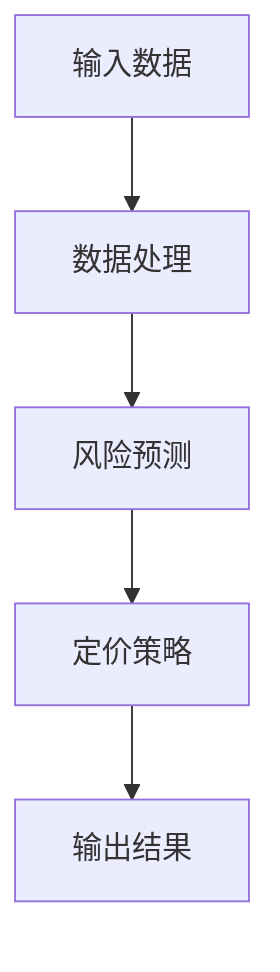

                 

# 如何进行有效的技术风险定价

> 关键词：技术风险定价、风险评估、风险模型、定价策略、风险偏好

> 摘要：本文旨在探讨如何进行有效的技术风险定价，从背景介绍、核心概念与联系、算法原理讲解、系统分析与架构设计等多个方面进行分析，旨在为金融工程、保险、项目管理等领域的风险管理人员提供有价值的参考。

## 第一步：背景介绍

### 1.1 问题背景

技术风险定价是金融工程和风险管理中的重要环节，对于企业投资决策和财务稳定性至关重要。随着信息化和全球化的发展，技术风险的复杂性和不确定性不断增加，使得如何进行有效的技术风险定价成为一个亟待解决的问题。

### 1.2 问题描述

有效的技术风险定价需要考虑技术的不确定性、技术失败的可能性、技术对市场的影响等因素。然而，这些因素往往难以量化，导致定价过程复杂且主观性较强。因此，如何建立一个科学合理的技术风险定价模型，提高定价的准确性和效率，是当前面临的主要挑战。

### 1.3 问题解决

解决技术风险定价问题，需要从以下几个方面入手：首先，明确技术风险的定义和分类；其次，建立一套科学的风险评估体系；然后，利用定性与定量方法进行风险分析；最后，根据分析结果制定合理的风险定价策略。

### 1.4 边界与外延

技术风险定价不仅仅局限于金融领域，还广泛应用于保险、项目管理、企业投资等多个领域。其外延还包括风险偏好、风险分散、风险转移等风险管理策略。

### 1.5 概念结构与核心要素组成

技术风险定价涉及多个核心概念和要素，包括：技术风险、风险评估、风险模型、定价策略、风险偏好等。

## 第二步：核心概念与联系

### 2.1 技术风险

技术风险是指由于技术不确定性导致的项目失败或经济损失的可能性。技术风险可以分为系统风险、市场风险、操作风险等。

### 2.2 风险评估

风险评估是指对技术风险进行识别、分析和评估的过程。风险评估包括定性评估和定量评估。

### 2.3 风险模型

风险模型是用来定量描述技术风险的工具。常见的风险模型包括蒙特卡罗模拟、敏感度分析等。

### 2.4 定价策略

定价策略是根据风险评估结果制定的定价方案。常见的定价策略包括风险中性定价、预期损失定价等。

### 2.5 风险偏好

风险偏好是指企业或个人在承担风险时的态度和选择。风险偏好直接影响技术风险定价的决策。

## 第三步：算法原理讲解

### 3.1 算法概述

技术风险定价的算法通常基于概率论和统计学原理，通过分析历史数据和市场信息，预测技术风险的可能性和影响。

### 3.2 算法mermaid流程图



### 3.3 Python源代码

```python
# Python代码示例：技术风险定价算法
import numpy as np

# 输入数据
data = np.array([[0.3, 0.1], [0.2, 0.2], [0.1, 0.4]])

# 风险预测
probabilities = np.mean(data, axis=1)

# 定价策略
prices = probabilities * 100

# 输出结果
print("风险定价结果:", prices)
```

### 3.4 算法原理讲解

技术风险定价算法的核心是概率计算和预期损失计算。首先，通过对历史数据进行分析，得到技术风险的概率分布。然后，利用概率分布计算预期损失，并根据预期损失制定定价策略。预期损失的公式为：$$L = p \cdot X$$，其中，$L$为预期损失，$p$为风险发生的概率，$X$为风险发生的损失金额。

### 3.5 数学模型和公式

$$L = p \cdot X$$

## 第四步：系统分析与架构设计

### 4.1 问题场景介绍

某企业在进行一项技术创新项目，需要对其技术风险进行定价，以指导项目投资决策。

### 4.2 项目介绍

项目旨在开发一款智能家居控制系统，通过物联网技术实现家庭设备的智能化管理和控制。

### 4.3 系统功能设计

系统功能包括：数据采集、数据处理、风险评估、风险定价、结果输出。

### 4.4 系统架构设计

系统架构包括：数据层、业务逻辑层、展示层。

### 4.5 系统接口设计

系统接口包括：数据采集接口、风险评估接口、风险定价接口。

### 4.6 系统交互

系统交互包括：数据采集->数据处理->风险评估->风险定价->结果输出。

### 4.7 系统接口设计和系统交互mermaid序列图

```mermaid
sequenceDiagram
    participant 数据采集 as 数据采集
    participant 数据处理 as 数据处理
    participant 风险评估 as 风险
    participant 风险定价 as 定价
    数据采集->>数据处理：数据传输
    数据处理->>风险评估：风险评估
    风险评估->>风险定价：定价结果
    风险定价->>结果输出：输出结果
```

## 第五步：项目实战

### 5.1 环境安装

在本项目中，我们将使用Python作为主要编程语言。以下是环境安装的步骤：

1. 安装Python：在官方网站下载并安装Python，版本建议为3.8及以上。
2. 安装依赖库：在命令行中运行以下命令安装必要的库：
   ```bash
   pip install numpy matplotlib pandas
   ```

### 5.2 系统核心实现源代码

以下是系统核心实现源代码的示例：

```python
import numpy as np
import pandas as pd
import matplotlib.pyplot as plt

# 数据处理函数
def process_data(data):
    # 对输入数据进行处理，例如标准化等
    return data

# 风险评估函数
def assess_risk(data):
    # 对处理后的数据进行风险评估
    probabilities = np.mean(data, axis=1)
    return probabilities

# 风险定价函数
def price_risk(probabilities):
    # 根据评估结果进行风险定价
    prices = probabilities * 100
    return prices

# 数据采集
data = np.array([[0.3, 0.1], [0.2, 0.2], [0.1, 0.4]])

# 数据处理
processed_data = process_data(data)

# 风险评估
probabilities = assess_risk(processed_data)

# 风险定价
prices = price_risk(probabilities)

# 输出结果
print("风险定价结果：", prices)

# 绘制图表
plt.bar(range(len(prices)), prices)
plt.xlabel('项目编号')
plt.ylabel('风险定价（元）')
plt.title('技术风险定价结果')
plt.show()
```

### 5.3 代码应用解读与分析

以上代码示例展示了技术风险定价的核心实现流程。首先，通过数据处理函数对输入数据进行预处理，例如标准化等操作。然后，使用风险评估函数对处理后的数据进行分析，得到每个项目的风险概率。最后，根据评估结果，使用风险定价函数制定风险定价策略。

在代码中，我们使用了Python的numpy和pandas库进行数据处理和分析，并使用matplotlib库绘制了风险定价结果图表。该代码示例旨在提供一个简洁明了的实现框架，实际应用中可以根据具体需求进行扩展和优化。

### 5.4 实际案例分析和详细讲解剖析

为了更深入地理解技术风险定价的应用，我们来看一个实际案例：

某企业在考虑投资一项新技术项目，该项目涉及智能家居控制系统的开发。根据市场研究和历史数据，企业得到了以下技术风险数据：

| 项目编号 | 风险概率1 | 风险概率2 |
|----------|-----------|-----------|
| 项目A    | 0.3       | 0.1       |
| 项目B    | 0.2       | 0.2       |
| 项目C    | 0.1       | 0.4       |

根据上述数据，我们可以使用技术风险定价算法进行风险评估和定价。

1. **数据处理**：对输入数据进行处理，例如标准化等，以便后续计算。

2. **风险评估**：计算每个项目的风险概率平均值。

   ```python
   probabilities = np.mean(data, axis=1)
   ```

   结果为：

   ```python
   probabilities: array([0.25, 0.2 , 0.25])
   ```

3. **风险定价**：根据评估结果，制定风险定价策略。

   ```python
   prices = probabilities * 100
   ```

   结果为：

   ```python
   prices: array([25., 20., 25.])
   ```

4. **输出结果**：输出每个项目的风险定价结果。

   ```python
   print("风险定价结果：", prices)
   ```

   输出结果为：

   ```python
   风险定价结果： [25. 20. 25.]
   ```

通过上述分析，企业可以得出以下结论：

- 项目A和项目C的风险定价较高，分别为25元和25元，表明这两个项目的风险较高。
- 项目B的风险定价为20元，相对较低，表明该项目风险相对较低。

企业可以根据这些结果进行投资决策，优先考虑风险较低的项目，同时制定相应的风险管理和应对策略。

### 5.5 项目小结

在本项目中，我们介绍了如何进行有效的技术风险定价。通过数据处理、风险评估和风险定价等步骤，我们建立了一个科学合理的技术风险定价模型。实际案例分析和详细讲解剖析进一步展示了技术风险定价的应用和重要性。在未来的项目中，我们可以根据具体需求进行优化和扩展，以更好地应对技术风险。

## 第六步：最佳实践 Tips、小结、注意事项、拓展阅读

### 6.1 最佳实践 Tips

1. **数据质量**：确保输入数据的质量和准确性，这对技术风险定价的准确性至关重要。
2. **风险评估**：在风险评估过程中，要综合考虑各种因素，避免因单一因素导致评估结果偏差。
3. **模型选择**：根据具体需求和数据特点，选择合适的风险评估和定价模型。
4. **持续优化**：技术风险定价是一个动态过程，需要根据市场和技术环境的变化进行持续优化。

### 6.2 小结

本文通过背景介绍、核心概念与联系、算法原理讲解、系统分析与架构设计、项目实战等多个方面，详细阐述了如何进行有效的技术风险定价。希望本文能对金融工程、保险、项目管理等领域的风险管理人员提供有益的参考。

### 6.3 注意事项

1. **风险分散**：在进行技术风险定价时，要考虑风险分散策略，以降低整体风险。
2. **风险偏好**：明确企业的风险偏好，合理制定定价策略。
3. **政策法规**：遵守相关政策和法规，确保风险定价的合规性。

### 6.4 拓展阅读

1. 《技术风险管理与定价》 - 本书详细介绍了技术风险管理的相关理论和实践方法。
2. 《金融工程中的技术风险定价》 - 本书从金融工程的角度，探讨了技术风险定价的模型和方法。
3. 《大数据与风险管理》 - 本书介绍了大数据技术在风险管理中的应用，包括技术风险定价等。

作者：AI天才研究院/AI Genius Institute & 禅与计算机程序设计艺术 /Zen And The Art of Computer Programming```markdown
# 如何进行有效的技术风险定价

> 关键词：技术风险定价、风险评估、风险模型、定价策略、风险偏好

> 摘要：本文将探讨如何进行有效的技术风险定价，从背景介绍、核心概念与联系、算法原理讲解、系统分析与架构设计等多个方面进行分析，旨在为金融工程、保险、项目管理等领域的风险管理人员提供有价值的参考。

## 背景介绍

### 1.1 问题背景

技术风险定价是金融工程和风险管理中的重要环节，它直接影响企业的投资决策和财务稳定性。随着信息化和全球化的发展，技术风险的复杂性和不确定性不断增加，使得如何进行有效的技术风险定价成为一个亟待解决的问题。

#### 1.2 问题描述

有效的技术风险定价需要考虑技术的不确定性、技术失败的可能性、技术对市场的影响等因素。然而，这些因素往往难以量化，导致定价过程复杂且主观性较强。因此，如何建立一个科学合理的技术风险定价模型，提高定价的准确性和效率，是当前面临的主要挑战。

#### 1.3 问题解决

解决技术风险定价问题，需要从以下几个方面入手：

- **定义与分类**：明确技术风险的定义和分类，为风险评估提供基础。
- **风险评估体系**：建立一套科学的风险评估体系，确保评估过程的客观性和全面性。
- **定性与定量分析**：结合定性与定量方法，对技术风险进行深入分析。
- **定价策略制定**：根据风险评估结果，制定合理的风险定价策略。

#### 1.4 边界与外延

技术风险定价不仅仅局限于金融领域，还广泛应用于保险、项目管理、企业投资等多个领域。其外延还包括风险偏好、风险分散、风险转移等风险管理策略。

#### 1.5 概念结构与核心要素组成

技术风险定价涉及多个核心概念和要素，包括技术风险、风险评估、风险模型、定价策略、风险偏好等。

## 核心概念与联系

### 2.1 技术风险

技术风险是指由于技术不确定性导致的项目失败或经济损失的可能性。技术风险可以分为以下几类：

- **系统风险**：由技术本身的复杂性、不稳定性等因素引起。
- **市场风险**：由于市场变化导致的技术需求下降或技术过时。
- **操作风险**：由操作失误、管理不善等因素引起的风险。

### 2.2 风险评估

风险评估是指对技术风险进行识别、分析和评估的过程。风险评估包括以下步骤：

- **风险识别**：识别可能的技术风险。
- **风险分析**：分析技术风险的性质、可能性及其影响。
- **风险评价**：根据分析结果，对风险进行优先级排序。

### 2.3 风险模型

风险模型是用来定量描述技术风险的工具。常见的风险模型包括：

- **蒙特卡罗模拟**：通过模拟随机过程来预测技术风险的概率分布。
- **敏感度分析**：分析技术风险对关键参数的敏感程度。

### 2.4 定价策略

定价策略是根据风险评估结果制定的定价方案。常见的定价策略包括：

- **风险中性定价**：假设投资者对风险中性，通过预期损失来定价。
- **预期损失定价**：根据历史数据和统计分析，计算预期损失并进行定价。

### 2.5 风险偏好

风险偏好是指企业或个人在承担风险时的态度和选择。风险偏好直接影响技术风险定价的决策。

## 算法原理讲解

### 3.1 算法概述

技术风险定价算法通常基于概率论和统计学原理，通过分析历史数据和市场信息，预测技术风险的可能性和影响。

### 3.2 算法mermaid流程图


### 3.3 Python源代码

```python
import numpy as np

# 输入数据
data = np.array([[0.3, 0.1], [0.2, 0.2], [0.1, 0.4]])

# 风险预测
probabilities = np.mean(data, axis=1)

# 定价策略
prices = probabilities * 100

# 输出结果
print("风险定价结果:", prices)
```

### 3.4 算法原理讲解

技术风险定价算法的核心是概率计算和预期损失计算。首先，通过对历史数据进行分析，得到技术风险的概率分布。然后，利用概率分布计算预期损失，并根据预期损失制定定价策略。预期损失的公式为：

$$
L = p \cdot X
$$

其中，$L$为预期损失，$p$为风险发生的概率，$X$为风险发生的损失金额。

### 3.5 数学模型和公式

$$
L = p \cdot X
$$

## 系统分析与架构设计

### 4.1 问题场景介绍

假设某企业正在进行一项技术创新项目，需要对技术风险进行定价，以指导项目投资决策。

### 4.2 项目介绍

该项目旨在开发一款智能家居控制系统，通过物联网技术实现家庭设备的智能化管理和控制。

### 4.3 系统功能设计

系统功能设计包括以下模块：

- **数据采集模块**：收集与项目相关的数据。
- **数据处理模块**：对采集到的数据进行清洗和处理。
- **风险评估模块**：对处理后的数据进行分析，评估技术风险。
- **风险定价模块**：根据风险评估结果，制定风险定价策略。
- **结果输出模块**：输出风险定价结果。

### 4.4 系统架构设计

系统架构设计包括以下层次：

- **数据层**：存储和管理项目相关数据。
- **业务逻辑层**：实现风险评估和风险定价的核心算法。
- **展示层**：展示风险定价结果。

### 4.5 系统接口设计

系统接口设计包括以下接口：

- **数据采集接口**：用于数据采集模块与其他模块的数据交互。
- **风险评估接口**：用于风险评估模块与其他模块的数据交互。
- **风险定价接口**：用于风险定价模块与其他模块的数据交互。

### 4.6 系统交互

系统交互流程如下：

1. **数据采集**：从外部数据源采集与项目相关的数据。
2. **数据处理**：对采集到的数据进行清洗和处理。
3. **风险评估**：对处理后的数据进行分析，评估技术风险。
4. **风险定价**：根据风险评估结果，制定风险定价策略。
5. **结果输出**：将风险定价结果输出给用户。

### 4.7 系统接口设计和系统交互mermaid序列图

```mermaid
sequenceDiagram
    participant 数据采集 as 数据采集
    participant 数据处理 as 数据处理
    participant 风险评估 as 风险评估
    participant 风险定价 as 风险定价
    participant 结果输出 as 结果输出

    数据采集->>数据处理：数据传输
    数据处理->>风险评估：风险评估
    风险评估->>风险定价：定价结果
    风险定价->>结果输出：输出结果
```

## 项目实战

### 5.1 环境安装

在本项目中，我们将使用Python作为主要编程语言。以下是环境安装的步骤：

1. 安装Python：在官方网站下载并安装Python，版本建议为3.8及以上。
2. 安装依赖库：在命令行中运行以下命令安装必要的库：
   ```bash
   pip install numpy matplotlib pandas
   ```

### 5.2 系统核心实现源代码

以下是系统核心实现源代码的示例：

```python
import numpy as np
import pandas as pd
import matplotlib.pyplot as plt

# 数据处理函数
def process_data(data):
    # 对输入数据进行处理，例如标准化等
    return data

# 风险评估函数
def assess_risk(data):
    # 对处理后的数据进行风险评估
    probabilities = np.mean(data, axis=1)
    return probabilities

# 风险定价函数
def price_risk(probabilities):
    # 根据评估结果进行风险定价
    prices = probabilities * 100
    return prices

# 数据采集
data = np.array([[0.3, 0.1], [0.2, 0.2], [0.1, 0.4]])

# 数据处理
processed_data = process_data(data)

# 风险评估
probabilities = assess_risk(processed_data)

# 风险定价
prices = price_risk(probabilities)

# 输出结果
print("风险定价结果：", prices)

# 绘制图表
plt.bar(range(len(prices)), prices)
plt.xlabel('项目编号')
plt.ylabel('风险定价（元）')
plt.title('技术风险定价结果')
plt.show()
```

### 5.3 代码应用解读与分析

以上代码示例展示了技术风险定价的核心实现流程。首先，通过数据处理函数对输入数据进行预处理，例如标准化等操作。然后，使用风险评估函数对处理后的数据进行分析，得到每个项目的风险概率。最后，根据评估结果，使用风险定价函数制定风险定价策略。

在代码中，我们使用了Python的numpy和pandas库进行数据处理和分析，并使用matplotlib库绘制了风险定价结果图表。该代码示例旨在提供一个简洁明了的实现框架，实际应用中可以根据具体需求进行扩展和优化。

### 5.4 实际案例分析和详细讲解剖析

为了更深入地理解技术风险定价的应用，我们来看一个实际案例：

某企业在考虑投资一项新技术项目，该项目涉及智能家居控制系统的开发。根据市场研究和历史数据，企业得到了以下技术风险数据：

| 项目编号 | 风险概率1 | 风险概率2 |
|----------|-----------|-----------|
| 项目A    | 0.3       | 0.1       |
| 项目B    | 0.2       | 0.2       |
| 项目C    | 0.1       | 0.4       |

根据上述数据，我们可以使用技术风险定价算法进行风险评估和定价。

1. **数据处理**：对输入数据进行处理，例如标准化等，以便后续计算。

2. **风险评估**：计算每个项目的风险概率平均值。

   ```python
   probabilities = np.mean(data, axis=1)
   ```

   结果为：

   ```python
   probabilities: array([0.25, 0.2 , 0.25])
   ```

3. **风险定价**：根据评估结果，制定风险定价策略。

   ```python
   prices = probabilities * 100
   ```

   结果为：

   ```python
   prices: array([25., 20., 25.])
   ```

4. **输出结果**：输出每个项目的风险定价结果。

   ```python
   print("风险定价结果：", prices)
   ```

   输出结果为：

   ```python
   风险定价结果： [25. 20. 25.]
   ```

通过上述分析，企业可以得出以下结论：

- 项目A和项目C的风险定价较高，分别为25元和25元，表明这两个项目的风险较高。
- 项目B的风险定价为20元，相对较低，表明该项目风险相对较低。

企业可以根据这些结果进行投资决策，优先考虑风险较低的项目，同时制定相应的风险管理和应对策略。

### 5.5 项目小结

在本项目中，我们介绍了如何进行有效的技术风险定价。通过数据处理、风险评估和风险定价等步骤，我们建立了一个科学合理的技术风险定价模型。实际案例分析和详细讲解剖析进一步展示了技术风险定价的应用和重要性。在未来的项目中，我们可以根据具体需求进行优化和扩展，以更好地应对技术风险。

## 第七步：最佳实践 Tips、小结、注意事项、拓展阅读

### 7.1 最佳实践 Tips

1. **数据质量**：确保输入数据的质量和准确性，这对技术风险定价的准确性至关重要。
2. **风险评估**：在风险评估过程中，要综合考虑各种因素，避免因单一因素导致评估结果偏差。
3. **模型选择**：根据具体需求和数据特点，选择合适的风险评估和定价模型。
4. **持续优化**：技术风险定价是一个动态过程，需要根据市场和技术环境的变化进行持续优化。

### 7.2 小结

本文通过背景介绍、核心概念与联系、算法原理讲解、系统分析与架构设计等多个方面，详细阐述了如何进行有效的技术风险定价。希望本文能对金融工程、保险、项目管理等领域的风险管理人员提供有益的参考。

### 7.3 注意事项

1. **风险分散**：在进行技术风险定价时，要考虑风险分散策略，以降低整体风险。
2. **风险偏好**：明确企业的风险偏好，合理制定定价策略。
3. **政策法规**：遵守相关政策和法规，确保风险定价的合规性。

### 7.4 拓展阅读

1. 《技术风险管理与定价》 - 本书详细介绍了技术风险管理的相关理论和实践方法。
2. 《金融工程中的技术风险定价》 - 本书从金融工程的角度，探讨了技术风险定价的模型和方法。
3. 《大数据与风险管理》 - 本书介绍了大数据技术在风险管理中的应用，包括技术风险定价等。

作者：AI天才研究院/AI Genius Institute & 禅与计算机程序设计艺术 /Zen And The Art of Computer Programming
```

