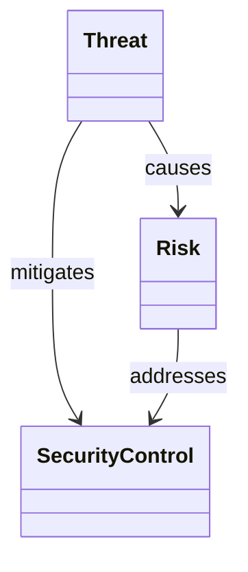
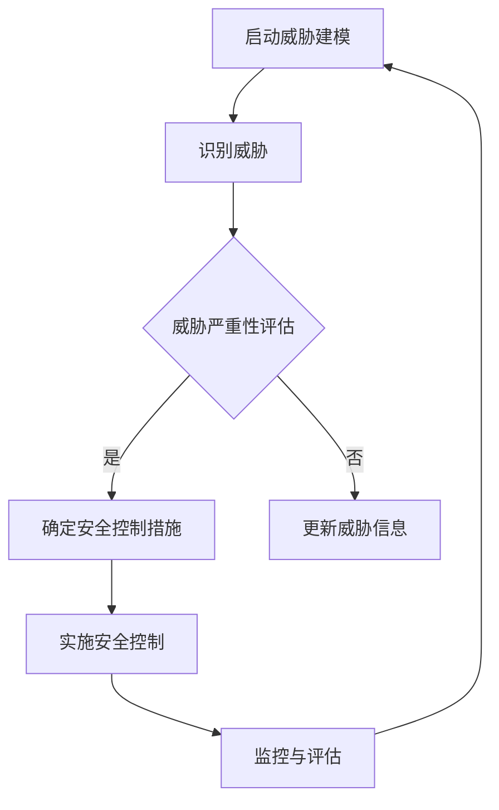
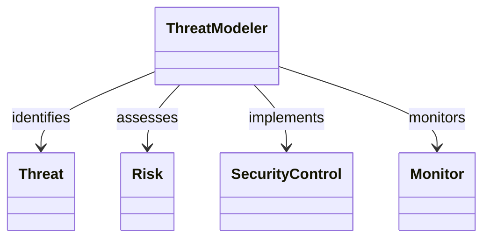
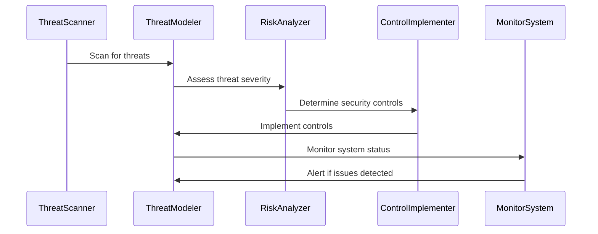

                 

# 威胁建模：系统性识别安全威胁的方法

## 关键词
威胁建模、安全威胁、风险评估、安全控制、系统架构设计

## 摘要
本文旨在深入探讨威胁建模的方法和重要性，通过系统性分析威胁建模的核心概念、基本原理和实际应用，帮助读者理解和掌握构建安全防御体系的科学方法。我们将分步骤讲解威胁建模的流程，详细剖析每个环节的算法原理，并通过具体的系统架构设计和实战案例，展示威胁建模在信息安全领域的关键作用。

## 背景介绍

### 1.1 威胁建模的重要性
在现代信息社会中，网络安全威胁日益严峻，数据泄露、恶意攻击、系统崩溃等问题层出不穷。威胁建模作为安全防护的重要手段，能够帮助企业或个人提前识别潜在威胁，评估风险，制定有效的安全策略。通过威胁建模，可以系统地分析威胁源、威胁类型、威胁传播途径和潜在影响，从而有针对性地部署安全措施，降低安全事件的发生概率和影响范围。

### 1.2 威胁建模在当今社会中的应用
随着互联网的普及和云计算、物联网等新技术的广泛应用，威胁建模的应用场景越来越广泛。无论是在金融、医疗、交通等关键行业，还是在企业内部的信息系统管理中，威胁建模都扮演着至关重要的角色。例如，金融行业通过威胁建模可以预防金融欺诈和非法交易；医疗行业可以通过威胁建模保障患者信息的安全；企业可以通过威胁建模保护其商业机密和关键基础设施。

### 1.3 问题描述
尽管威胁建模的重要性不言而喻，但在实际应用中仍然面临诸多挑战。首先，威胁种类繁多，如何全面、准确地识别和评估威胁成为一个难题。其次，不同行业和领域的威胁特点各异，如何制定通用的威胁建模方法也是一个亟待解决的问题。此外，威胁建模工具和技术的不断更新，如何保持模型的时效性和有效性也是一个重要的课题。

### 1.4 本书解决的问题
本书旨在解决上述问题，通过系统性的分析和讲解，帮助读者：

1. 理解威胁建模的基本概念和流程。
2. 掌握威胁识别、风险评估和安全控制的方法。
3. 掌握威胁建模在系统架构设计中的应用。
4. 通过实战案例，提升实际操作能力。
5. 提供实用的最佳实践和拓展阅读资源。

### 1.5 边界与外延
本文主要讨论计算机和网络环境下的威胁建模，不涉及物理安全和其他非技术领域的威胁建模。此外，本文主要关注安全威胁的识别和评估，对于安全控制和响应策略的详细讨论将保持一定的概括性。

## 核心概念与联系

### 2.1 威胁建模的核心概念
威胁建模涉及多个核心概念，这些概念相互作用，构成了威胁建模的基础。以下是几个关键概念的定义：

#### 2.1.1 威胁
威胁是指可能对系统、网络或数据造成损害的事件或行为。威胁可以来自内部或外部，包括但不限于恶意攻击、系统漏洞、自然灾害等。

#### 2.1.2 风险
风险是指威胁发生的可能性（概率）与其潜在影响程度的组合。简单来说，风险是威胁可能造成的损害量。风险评估是威胁建模的重要环节。

#### 2.1.3 安全控制
安全控制是指为防止或减轻威胁而采取的措施或策略。安全控制可以包括技术手段（如防火墙、加密技术）和管理手段（如安全政策、访问控制）。

### 2.2 概念属性特征对比表格

| 概念   | 属性特征                      |  
|--------|-------------------------------|  
| 威胁   | 可能对系统造成损害的事件      |  
| 风险   | 威胁的发生概率与潜在影响程度的组合 |  
| 安全控制 | 防止威胁发生的措施或策略       |

### 2.3 ER实体关系图



在威胁建模中，威胁（Threat）是引起风险（Risk）的主要原因，而安全控制（SecurityControl）则是用来减轻或应对这些风险的措施。风险与安全控制之间则存在一种相互关联的关系，即安全控制措施旨在减轻或应对特定的风险。

## 算法原理讲解

### 3.1 威胁建模的基本原理

威胁建模是一种系统性的方法，用于识别、评估和减轻潜在的安全威胁。其基本原理可以概括为以下几个步骤：

1. **威胁识别**：收集和分析可能导致安全问题的威胁信息。
2. **风险评估**：评估威胁的可能性和影响，以确定风险级别。
3. **安全控制确定**：根据评估结果，制定和实施相应的安全控制措施。
4. **监控与更新**：持续监控威胁和风险，并根据新的威胁信息更新模型。

### 3.2 算法流程图



### 3.3 Python源代码示例

下面是一个简化的Python示例，用于说明威胁建模的基本算法流程：

```python  
def identify_threats():  
    # 威胁识别代码实现  
    pass

def assess_threat_severity(threats):  
    # 威胁严重性评估代码实现  
    pass

def determine_security_controls(threats):  
    # 确定安全控制措施代码实现  
    pass

def implement_security_controls(controls):  
    # 实施安全控制代码实现  
    pass

def monitor_and_evaluate():  
    # 监控与评估代码实现  
    pass

# 威胁建模流程  
if __name__ == "__main__":  
    threats = identify_threats()  
    severity = assess_threat_severity(threats)  
    if severity:  
        controls = determine_security_controls(threats)  
        implement_security_controls(controls)  
    monitor_and_evaluate()  
```

### 3.4 算法原理的数学模型和公式

在威胁建模中，常用的数学模型和公式包括：

- **威胁发生概率（P）**：威胁可能发生的概率。
- **威胁影响程度（I）**：威胁发生时可能造成的影响程度。
- **风险（R）**：威胁发生概率与影响程度的乘积，即 \( R = P \times I \)。

这些数学模型和公式可以帮助我们量化威胁和风险，从而更好地进行威胁建模和风险评估。

### 3.5 举例说明

假设我们有一个在线购物平台，我们需要识别和评估以下两种威胁：

1. **DDoS攻击**：这种攻击可能导致网站无法访问，影响用户体验和业务。
2. **SQL注入攻击**：这种攻击可能导致数据库泄露，造成严重的数据损失。

对于DDoS攻击，我们评估其发生概率为0.2，影响程度为3，则风险为 \( 0.2 \times 3 = 0.6 \)。对于SQL注入攻击，我们评估其发生概率为0.1，影响程度为5，则风险为 \( 0.1 \times 5 = 0.5 \)。

根据风险评估结果，我们可以采取相应的安全控制措施，例如增加DDoS防护设备和加强数据库输入验证，以降低风险。

## 系统分析与架构设计方案

### 4.1 问题场景介绍

在现代网络环境中，威胁建模已经成为信息系统安全架构设计的重要组成部分。本文将基于一个虚构的在线购物平台案例，介绍如何通过威胁建模来提高系统的安全性。

### 4.2 系统功能设计

为了实现威胁建模，我们需要设计一套完整的功能体系，包括威胁识别、风险评估、安全控制措施实施和监控。以下是该系统的主要功能类图：



### 4.3 系统架构设计

系统架构设计是实现威胁建模功能的关键。以下是该系统的架构图，展示了各个组件之间的关系：

```mermaid  
graph TB  
ThreatModeler --> Database : stores  
ThreatModeler --> ThreatScanner : scans  
ThreatModeler --> RiskAnalyzer : analyzes  
ThreatModeler --> ControlImplementer : implements  
ThreatModeler --> MonitorSystem : monitors

subgraph ThreatModelingComponents  
  ThreatModeler  
  ThreatScanner  
  RiskAnalyzer  
  ControlImplementer  
  MonitorSystem  
end

Database --> ThreatModeler : data  
ThreatScanner --> ThreatModeler : findings  
RiskAnalyzer --> ThreatModeler : results  
ControlImplementer --> ThreatModeler : actions  
MonitorSystem --> ThreatModeler : alerts  
```

### 4.4 系统接口设计

系统接口设计确保各个组件之间的有效通信。以下是主要接口的描述：

- **ThreatScanner接口**：用于从网络中收集威胁信息。
- **RiskAnalyzer接口**：用于评估威胁的严重性和影响。
- **ControlImplementer接口**：用于实施安全控制措施。
- **MonitorSystem接口**：用于监控系统状态并产生警报。

### 4.5 系统交互

系统交互是威胁建模得以实施的关键。以下是系统组件之间的交互序列图：



## 项目实战

### 5.1 环境安装

为了实际应用威胁建模，我们需要搭建一个合适的环境。以下是一个简化的环境搭建步骤：

1. **安装操作系统**：选择一个稳定的操作系统，如Ubuntu 20.04。
2. **安装数据库**：安装MySQL或PostgreSQL等关系型数据库。
3. **安装编程环境**：安装Python编程环境，包括Python解释器和相关库。
4. **安装工具**：安装威胁建模所需的工具，如Nmap、Wireshark等。

### 5.2 系统核心实现

基于上述环境，我们可以开始实现威胁建模系统。以下是核心代码的简要描述：

1. **ThreatScanner**：使用Nmap扫描网络设备，收集开放端口和可能的安全漏洞。
   ```python  
   import nmap

   def scan_network():  
       nm = nmap.PortScanner()  
       nm.scan('192.168.1.0/24', arguments='-p 1-1000')  
       return nm.all_hosts()  
   ```

2. **RiskAnalyzer**：分析扫描结果，评估威胁的严重性和影响。
   ```python  
   def analyze_risks(threats):  
       risks = []  
       for host in threats:  
           risk = calculate_risk(host)  
           risks.append(risk)  
       return risks

   def calculate_risk(host):  
       # 计算风险的代码实现  
       pass  
   ```

3. **ControlImplementer**：根据评估结果，实施相应的安全控制措施。
   ```python  
   def implement_controls(controls):  
       for control in controls:  
           apply_control(control)

   def apply_control(control):  
       # 实施控制的代码实现  
       pass  
   ```

4. **MonitorSystem**：监控系统状态，并在发现威胁时产生警报。
   ```python  
   def monitor_system():  
       while True:  
           check_system_status()  
           if is_威胁_detected():  
               send_alert()

   def check_system_status():  
       # 检查系统状态的代码实现  
       pass

   def is_威胁_detected():  
       # 检测威胁的代码实现  
       pass

   def send_alert():  
       # 发送警报的代码实现  
       pass  
   ```

### 5.3 代码应用解读与分析

在实现威胁建模系统时，我们需要对每个组件进行详细解读和分析：

1. **ThreatScanner**：负责扫描网络设备，发现潜在威胁。其主要功能是使用Nmap工具扫描目标网络，获取开放端口和运行的服务信息。这些信息将作为后续威胁分析和评估的依据。
2. **RiskAnalyzer**：分析扫描结果，评估威胁的严重性和影响。该组件需要根据预定义的规则和策略，对扫描结果进行风险评估。评估结果将用于指导安全控制措施的制定和实施。
3. **ControlImplementer**：根据风险评估结果，制定并实施安全控制措施。安全控制措施可以是更新系统补丁、配置防火墙规则、部署入侵检测系统等。实施控制措施的过程需要确保不会影响系统的正常运行。
4. **MonitorSystem**：监控系统状态，及时发现和处理威胁。该组件需要实现实时监控，并在发现威胁时及时发出警报。监控系统的设计需要考虑系统的可扩展性和可维护性。

### 5.4 实际案例剖析

为了更好地理解威胁建模的实际应用，我们来看一个具体的案例。假设我们在扫描一个企业内部网络时，发现以下两个威胁：

1. **SSH服务未加密**：在扫描过程中，我们发现在目标主机上运行了SSH服务，但服务未采用加密传输。这种情况下，攻击者可以通过截获SSH通信内容来获取敏感信息。
2. **Web服务器漏洞**：扫描结果还显示，Web服务器存在一个已知漏洞，攻击者可以利用此漏洞执行任意代码。

对于第一个威胁，我们可以采取以下安全控制措施：

1. **强制使用SSH加密**：通过修改SSH配置文件，强制使用加密传输，确保SSH通信的安全。
2. **更新SSH版本**：如果当前SSH版本存在安全漏洞，应立即更新到最新版本。

对于第二个威胁，我们可以采取以下安全控制措施：

1. **安装安全补丁**：立即安装Web服务器的安全补丁，修复已知漏洞。
2. **启用Web应用防火墙**：在Web服务器前部署Web应用防火墙，防止攻击者利用漏洞进行攻击。

通过上述措施，我们可以有效降低这两个威胁的风险，保障系统的安全性。

### 5.5 项目小结

在本项目中，我们通过实际应用威胁建模，成功识别和评估了企业内部网络中的潜在威胁，并制定了相应的安全控制措施。这一过程不仅提高了系统的安全性，也为企业提供了一个系统性的威胁建模方法，可以帮助企业在未来更好地应对网络安全威胁。

## 最佳实践 Tips、小结、注意事项、拓展阅读

### 6.1 最佳实践 Tips

1. **定期更新威胁信息**：威胁环境不断变化，定期更新威胁信息可以帮助我们更好地识别和应对新的威胁。
2. **全面评估安全控制措施**：在实施安全控制措施时，不仅要考虑其有效性，还要评估其对业务运营的影响。
3. **结合业务场景进行威胁建模**：不同业务场景下的威胁类型和风险程度各异，结合实际业务需求进行威胁建模可以更准确地识别和评估威胁。
4. **建立完善的监控机制**：监控是威胁建模的重要组成部分，建立完善的监控机制可以及时发现和处理威胁。

### 6.2 小结

本文通过系统性的分析和讲解，介绍了威胁建模的核心概念、基本原理和实际应用。我们通过一个在线购物平台的案例，详细展示了威胁建模在系统架构设计中的应用，并通过实际案例剖析了威胁建模的方法和效果。

### 6.3 注意事项

1. **威胁建模不是一次性工作**：威胁建模是一个持续的过程，需要定期更新和优化。
2. **安全控制措施的执行与监控**：安全控制措施的有效实施和监控是保障系统安全的关键。
3. **人员培训与意识提升**：提高员工的安全意识和技能，有助于降低人为因素导致的安全风险。

### 6.4 拓展阅读

1. **《网络安全评估与测试技术》**：了解网络安全评估的基本方法和工具。
2. **《信息安全风险评估与管理》**：深入探讨风险评估的理论和实践。
3. **《威胁建模：实用指南》**：详细介绍威胁建模的方法和应用案例。

## 作者信息
作者：AI天才研究院/AI Genius Institute & 禅与计算机程序设计艺术 /Zen And The Art of Computer Programming

通过以上内容，我们希望能够帮助读者深入理解威胁建模的重要性，掌握威胁建模的方法和技巧，从而为构建安全的系统提供有力支持。在未来的网络安全战中，威胁建模将成为我们不可或缺的利器。让我们携手并进，共同守护数字世界的安全。|>

