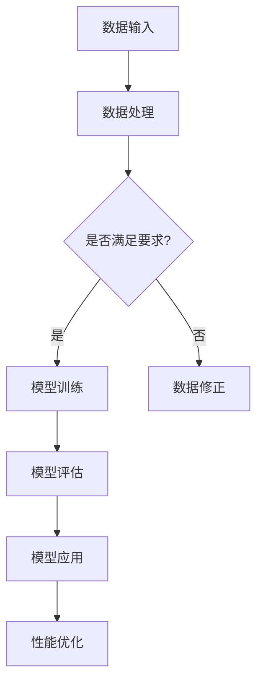

                 

### 第1章 引言：问题背景与核心概念

#### 1.1 问题背景

随着信息技术的飞速发展，计算机编程和软件开发面临着前所未有的复杂性和多样性。传统的软件开发模式，如瀑布模型、迭代模型等，由于缺乏灵活性和适应性，已经难以满足现代软件开发的复杂需求。为了解决这一问题，软件工程领域提出了一系列新型软件开发模式，其中软件2.0成为了一个重要的研究方向。

软件2.0是对传统软件1.0的升级和扩展，它强调软件的智能化、自动化和自我优化能力。在这个新时代，AI大模型作为一种先进的智能技术，逐渐成为软件开发的核心驱动力。AI大模型通过深度学习、神经网络等技术，能够从大量数据中自动提取知识，从而实现自动编程、代码生成和软件优化。

#### 1.2 核心概念

在本章中，我们将介绍以下几个核心概念：

1. **问题背景**：介绍软件2.0和AI大模型的发展背景，以及它们在软件开发中的重要性。
2. **软件2.0**：详细解释软件2.0的概念，与软件1.0的异同点，以及它在软件开发中的应用。
3. **AI大模型**：探讨AI大模型的定义、特点和应用场景，包括GPT系列模型、BERT模型等。
4. **隐藏内部类型细节的机制**：分析隐藏内部类型细节的机制，介绍其原理和应用。

### 1.3 概念属性特征对比表格

为了更好地理解上述核心概念，我们可以通过一个对比表格来展示软件2.0和AI大模型的一些关键属性特征：

| 特征       | 软件2.0                         | AI大模型                        |
|------------|--------------------------------|--------------------------------|
| 定义       | 强调软件智能化、自动化和优化能力 | 大规模的神经网络模型，具备高度自适应能力 |
| 特点       | 自动编程、代码生成、软件优化   | 自动学习、自动调整、适应性强     |
| 应用场景   | 需求复杂、开发周期长的项目     | 数据量大、模式复杂的领域         |
| 关联技术   | 智能算法、深度学习、神经网络   | 机器学习、自然语言处理、计算机视觉 |

### 1.4 ER实体关系图架构

下面是AI大模型中核心实体关系的Mermaid流程图：



---

### 第2章 软件开发模式与类型

#### 2.1 软件开发模式的演变

从最早的程序设计（编程1.0）到面向对象编程（编程2.0），再到现在的智能编程（编程3.0），软件开发模式经历了巨大的演变。每种模式都有其特定的特点和应用场景。

#### 2.2 传统软件开发模式

传统软件开发模式主要包括瀑布模型、迭代模型、V模型等。这些模型强调明确的阶段划分、严格的流程控制，适用于需求明确、变更较少的项目。

1. **瀑布模型**：瀑布模型是一种线性顺序的开发模型，每个阶段必须完成后才能进入下一个阶段。这种模型适用于需求相对稳定的项目。
   
2. **迭代模型**：迭代模型将软件开发过程划分为多个周期，每个周期都会进行需求分析、设计、编码、测试等阶段。这种模型适用于需求可能会发生变更的项目。

3. **V模型**：V模型是迭代模型的一种变体，它通过增加测试阶段来强调测试的重要性。这种模型也适用于需求可能会发生变更的项目。

#### 2.3 软件开发类型的分类

软件开发类型可以根据不同的标准进行分类，例如：

1. **按开发目标**：可以分为商业软件、开源软件、嵌入式软件等。

   - **商业软件**：为企业或个人提供商业价值的软件，如企业资源规划（ERP）系统、客户关系管理（CRM）系统等。
   - **开源软件**：由社区贡献的、可以免费使用的软件，如Linux操作系统、Apache Web服务器等。
   - **嵌入式软件**：运行在嵌入式系统中的软件，如智能手表、智能家居设备等。

2. **按开发方法**：可以分为瀑布式开发、敏捷开发、DevOps等。

   - **瀑布式开发**：传统的软件开发模式，强调每个阶段的顺序执行。
   - **敏捷开发**：一种迭代的、增量的软件开发方法，强调团队协作和客户反馈。
   - **DevOps**：一种软件开发和运维的集成方法，强调开发、测试、运维的紧密协作。

3. **按应用领域**：可以分为企业管理软件、教育软件、医疗软件等。

   - **企业管理软件**：用于企业管理的软件，如财务管理系统、人力资源管理软件等。
   - **教育软件**：用于教育的软件，如在线学习平台、教育游戏等。
   - **医疗软件**：用于医疗行业的软件，如电子病历系统、医学图像分析软件等。

#### 2.4 软件开发模式的未来趋势

随着AI技术的发展，未来的软件开发模式将更加智能化、自动化。AI大模型将发挥重要作用，帮助开发者自动生成代码、优化软件性能，甚至预测软件开发过程中的潜在问题。此外，DevOps、敏捷开发等新兴开发方法将继续发挥重要作用，推动软件开发向更高效、更灵活的方向发展。

### 2.5 本章小结

本章介绍了软件开发模式的历史演变、传统软件开发模式及其分类，以及软件开发模式的未来趋势。随着AI大模型的兴起，软件开发将迎来新的变革。开发者需要不断学习和适应新的开发模式，以提高开发效率和软件质量。

---

### 第3章 AI大模型的基础知识与原理

#### 3.1 AI大模型的基本概念

AI大模型是指通过深度学习技术训练出的、具有大规模参数的神经网络模型。这些模型能够自动从海量数据中学习，提取特征，进行预测和决策。AI大模型的核心是神经网络，它通过多层神经元结构对输入数据进行处理，从而实现对复杂任务的自动学习和执行。

#### 3.2 深度学习的基本原理

深度学习是机器学习的一个分支，它通过构建多层神经网络，实现对数据的层次化表示和学习。深度学习的基本原理包括神经元模型、前向传播、反向传播等。

1. **神经元模型**：神经元是神经网络的基本组成单元，它通过加权求和和激活函数对输入信号进行处理，产生输出信号。

2. **前向传播**：在前向传播过程中，输入信号通过神经网络的各个层，每个层的神经元根据其权重和偏置对信号进行处理，最终产生输出信号。

3. **反向传播**：在反向传播过程中，神经网络通过计算输出误差，更新各层的权重和偏置，从而优化模型的性能。

#### 3.3 神经网络的构建与训练

神经网络由多个神经元组成，每个神经元都与其他神经元相连，形成复杂的网络结构。神经网络的构建包括以下步骤：

1. **数据预处理**：对输入数据进行预处理，如归一化、标准化等，以减少数据的噪声和差异。

2. **初始化权重**：初始化神经网络的权重和偏置，常用的初始化方法包括随机初始化、高斯分布初始化等。

3. **构建网络结构**：设计神经网络的层数和每层的神经元数量，选择合适的激活函数，如ReLU、Sigmoid、Tanh等。

4. **前向传播**：输入数据通过神经网络的前向传播过程，经过各个层的处理，最终产生输出。

5. **计算损失函数**：根据输出结果和实际目标，计算损失函数，如均方误差（MSE）、交叉熵等。

6. **反向传播**：根据损失函数的梯度，通过反向传播更新神经网络的权重和偏置。

7. **迭代训练**：重复执行前向传播和反向传播，不断优化模型的性能，直到满足训练要求。

#### 3.4 AI大模型的应用场景

AI大模型具有广泛的应用场景，包括但不限于以下领域：

1. **自然语言处理**：AI大模型在自然语言处理领域具有显著优势，如文本分类、情感分析、机器翻译等。

2. **计算机视觉**：AI大模型在计算机视觉领域被广泛应用于图像分类、目标检测、图像分割等任务。

3. **语音识别**：AI大模型在语音识别领域实现了高精度的语音识别，为智能语音助手、语音翻译等应用提供了支持。

4. **推荐系统**：AI大模型在推荐系统领域通过分析用户行为和兴趣，实现个性化推荐。

5. **游戏AI**：AI大模型在游戏AI领域被用于实现智能对手，提高游戏的难度和可玩性。

#### 3.5 深度学习框架

为了简化深度学习的开发和训练过程，出现了许多深度学习框架，如TensorFlow、PyTorch、Keras等。这些框架提供了丰富的API和工具，使得开发者可以更加专注于模型的设计和优化，而无需关心底层实现的细节。

- **TensorFlow**：由谷歌开发，提供了灵活的动态计算图和丰富的预训练模型。
- **PyTorch**：由Facebook开发，具有简洁的API和强大的动态计算图功能。
- **Keras**：基于TensorFlow和Theano开发，提供了易于使用的API和丰富的预训练模型。

#### 3.6 本章小结

本章介绍了AI大模型的基础知识和原理，包括深度学习的基本原理、神经网络的构建与训练、AI大模型的应用场景和深度学习框架。AI大模型作为一种先进的智能技术，已经在各个领域取得了显著的成果，未来将继续发挥重要作用。

---

### 第4章 隐藏内部类型细节的机制

#### 4.1 什么是隐藏内部类型细节的机制

隐藏内部类型细节的机制（Type Erasure Mechanism）是一种编程语言特性，它允许开发者编写更通用、更可重用的代码，同时隐藏底层数据类型的实现细节。在面向对象编程中，类型擦除机制通常通过创建一个基类，该基类不包含任何关于具体实现类型的特定信息，从而实现对具体类型的封装。

#### 4.2 类型擦除机制的工作原理

类型擦除机制的核心思想是在编译时擦除类型信息，使得在运行时只能访问通用类型接口，而无法访问具体类型的实现细节。具体来说，类型擦除机制包括以下几个关键步骤：

1. **基类定义**：定义一个基类，该基类包含了所有派生类的通用接口和方法，但不包含具体实现类型的细节。

2. **类型参数**：在基类中使用类型参数来表示具体的派生类类型，使得基类可以接受任何类型的派生类作为参数。

3. **类型擦除**：在编译时，编译器会擦除类型参数的具体类型信息，使得基类只能通过通用类型接口进行操作。

4. **运行时类型检查**：虽然类型信息被擦除，但编译器会在运行时对通用类型接口进行类型检查，确保只能对符合基类定义的接口进行操作。

#### 4.3 类型擦除机制的应用场景

类型擦除机制在软件开发中具有广泛的应用场景，包括以下几个方面：

1. **泛型编程**：类型擦除机制使得泛型编程变得更加灵活和通用。通过使用类型参数和类型擦除，开发者可以编写能够处理多种数据类型的泛型类和函数，提高代码的可重用性。

2. **设计模式**：类型擦除机制在许多设计模式中得到了广泛应用。例如，工厂模式、策略模式等，通过类型擦除，可以确保工厂类和策略类能够处理多种具体的实现类，而无需关心具体实现细节。

3. **框架开发**：在框架开发中，类型擦除机制有助于实现更高层次的抽象和封装。框架可以通过类型擦除，定义通用的接口和操作，然后由具体实现类提供具体的实现细节。

#### 4.4 类型擦除机制的优点与挑战

类型擦除机制具有以下优点：

1. **代码重用性**：通过隐藏具体类型的实现细节，类型擦除机制提高了代码的重用性，使得开发者可以编写更通用、更灵活的代码。

2. **减少编译错误**：类型擦除机制在编译时不会暴露具体类型的细节，从而减少了编译错误的发生。

3. **提高性能**：类型擦除机制可以减少类型检查的开销，提高程序的运行效率。

然而，类型擦除机制也带来了一些挑战：

1. **类型安全**：类型擦除机制可能会牺牲一些类型安全性，因为运行时无法对具体类型进行检查。

2. **反射限制**：类型擦除机制使得反射操作变得更加复杂，因为反射操作需要知道具体类型的实现细节。

3. **性能影响**：类型擦除机制可能会增加运行时的类型检查和类型转换开销，影响程序的性能。

#### 4.5 案例分析：Java中的类型擦除机制

以Java为例，Java语言通过泛型机制实现了类型擦除。以下是一个简单的Java泛型类和泛型函数的示例：

```java
public class Box<T> {
    private T item;
    
    public void setItem(T item) {
        this.item = item;
    }
    
    public T getItem() {
        return item;
    }
}

public class Main {
    public static void main(String[] args) {
        Box<Integer> integerBox = new Box<>();
        integerBox.setItem(123);
        
        Box<String> stringBox = new Box<>();
        stringBox.setItem("Hello World");
        
        printBox(integerBox);
        printBox(stringBox);
    }
    
    public static void printBox(Box<?> box) {
        System.out.println("Item: " + box.getItem());
    }
}
```

在这个示例中，`Box`类使用了类型参数`<T>`，表示它可以接受任何类型的参数。在编译时，`T`的具体类型会被擦除，使得`Box`类只能通过`?`表示的通用类型接口进行操作。

#### 4.6 本章小结

本章介绍了隐藏内部类型细节的机制，包括其概念、工作原理、应用场景和优缺点。通过类型擦除机制，开发者可以编写更通用、更可重用的代码，提高软件开发的灵活性和效率。然而，类型擦除机制也带来了一些挑战，需要开发者在使用过程中权衡其优缺点。

---

### 第5章 存在类型：隐藏内部类型细节的机制

#### 5.1 存在类型的定义

存在类型（Existential Type）是一种高级编程语言特性，它允许开发者定义一种抽象的类型，这种类型隐藏了其内部的具体类型细节。存在类型通常用于实现类型擦除机制，它在编译时擦除类型信息，使得在运行时只能访问通用类型接口。

#### 5.2 存在类型的语法

存在类型的语法通常包括类型参数和存在类型约束。以下是一个简单的存在类型示例：

```scala
trait Process[A] {
  def execute(): A
}

class IdentityProcess[A] extends Process[A] {
  def execute(): A = A
}

class IdentityProcessor {
  def execute[A](p: Process[A]): A = p.execute()
}
```

在这个示例中，`Process`是一个存在类型，它使用了类型参数`A`，表示它可以处理任何类型的`A`。`IdentityProcess`类实现了`Process`接口，它是一个具体类型的实现。`IdentityProcessor`类使用了存在类型约束，使得它可以接受任何类型的`Process`实例，并执行其`execute`方法。

#### 5.3 存在类型的实现原理

存在类型的实现原理通常涉及类型擦除和类型参数绑定。在编译时，编译器会擦除存在类型的具体类型信息，并将类型参数绑定到一个通用的类型变量。以下是一个简单的实现原理示例：

```scala
// 编译前
trait Process[A] {
  def execute(): A
}

class IdentityProcess[A] extends Process[A] {
  def execute(): A = A
}

class IdentityProcessor {
  def execute[A](p: Process[A]): A = p.execute()
}

// 编译后
trait Process {
  def execute(): Any
}

class IdentityProcess extends Process {
  def execute(): Any = Any
}

class IdentityProcessor {
  def execute(p: Process): Any = p.execute()
}
```

在编译后的代码中，`Process`和`IdentityProcess`都使用了通用的类型变量`Any`，这意味着在运行时，它们只能通过通用类型接口进行操作。

#### 5.4 存在类型的应用场景

存在类型在编程语言和框架开发中具有广泛的应用场景，包括以下几个方面：

1. **泛型编程**：存在类型使得泛型编程更加灵活和通用，通过类型擦除，开发者可以编写能够处理多种数据类型的泛型类和函数。

2. **设计模式**：存在类型在许多设计模式中得到了广泛应用，如工厂模式、策略模式等，通过存在类型，可以确保工厂类和策略类能够处理多种具体的实现类。

3. **框架开发**：在框架开发中，存在类型有助于实现更高层次的抽象和封装，通过定义通用的接口和操作，框架可以处理多种具体的实现类。

4. **类型安全**：存在类型可以提供类型安全，通过类型参数绑定和类型擦除，开发者可以在编译时确保代码的类型正确性。

#### 5.5 存在类型的优点与挑战

存在类型具有以下优点：

1. **代码重用性**：通过隐藏具体类型的实现细节，存在类型提高了代码的重用性，使得开发者可以编写更通用、更灵活的代码。

2. **减少编译错误**：存在类型在编译时不会暴露具体类型的细节，从而减少了编译错误的发生。

3. **提高性能**：存在类型可以减少类型检查的开销，提高程序的运行效率。

然而，存在类型也带来了一些挑战：

1. **类型安全**：存在类型可能会牺牲一些类型安全性，因为运行时无法对具体类型进行检查。

2. **反射限制**：存在类型使得反射操作变得更加复杂，因为反射操作需要知道具体类型的实现细节。

3. **性能影响**：存在类型可能会增加运行时的类型检查和类型转换开销，影响程序的性能。

#### 5.6 案例分析：Scala中的存在类型

Scala语言通过存在类型实现了泛型编程，以下是一个简单的Scala泛型类和泛型函数的示例：

```scala
trait Process[A] {
  def execute(): A
}

class IdentityProcess[A] extends Process[A] {
  def execute(): A = A
}

class IdentityProcessor {
  def execute[A](p: Process[A]): A = p.execute()
}

val processor = new IdentityProcessor
val result = processor.execute(new IdentityProcess[Int])
println(result) // 输出：123
```

在这个示例中，`Process`是一个存在类型，它使用了类型参数`A`，表示它可以处理任何类型的`A`。`IdentityProcess`类实现了`Process`接口，它是一个具体类型的实现。`IdentityProcessor`类使用了存在类型约束，使得它可以接受任何类型的`Process`实例，并执行其`execute`方法。

#### 5.7 本章小结

本章介绍了存在类型的定义、语法、实现原理、应用场景和优缺点。存在类型是一种高级编程语言特性，它通过类型擦除和类型参数绑定，提高了代码的重用性和性能。然而，存在类型也带来了一些挑战，需要开发者在使用过程中权衡其优缺点。

---

### 第6章 存在类型在编程语言中的应用与实现

#### 6.1 编程语言对存在类型的支持

存在类型作为一种高级编程语言特性，在多种编程语言中得到了支持。以下是一些常见编程语言对存在类型的实现：

1. **Scala**：Scala是一种多范式编程语言，它通过存在类型实现了泛型编程。Scala的存在类型通过类型参数和存在类型约束来实现，使得开发者可以编写灵活、通用的代码。

2. **Java**：Java 5及以后的版本引入了泛型机制，通过类型擦除实现了存在类型。Java的泛型编程通过泛型类和泛型方法来实现，使得开发者可以处理多种数据类型。

3. **C#**：C#也是一种支持存在类型的编程语言。C#的泛型机制通过泛型类和泛型接口来实现，它支持类型参数和存在类型约束，使得开发者可以编写灵活、可重用的代码。

4. **Haskell**：Haskell是一种纯函数式编程语言，它通过类型类和存在类型实现了泛型编程。Haskell的存在类型通过类型类和类型约束来实现，使得开发者可以编写高层次的抽象和通用代码。

#### 6.2 存在类型实现的挑战与解决方案

虽然存在类型在编程语言中具有广泛应用，但在实现过程中也面临一些挑战。以下是一些常见挑战及其解决方案：

1. **类型安全**：存在类型可能会牺牲一些类型安全性，因为运行时无法对具体类型进行检查。为了确保类型安全，开发者需要在使用存在类型时进行严格的类型约束和类型检查。

2. **反射限制**：存在类型使得反射操作变得更加复杂，因为反射操作需要知道具体类型的实现细节。为了解决反射限制，一些编程语言提供了特殊的反射机制，如Scala的`scala.reflect`包，使得开发者可以在运行时访问和操作存在类型的实现细节。

3. **性能影响**：存在类型可能会增加运行时的类型检查和类型转换开销，影响程序的性能。为了减少性能影响，一些编程语言采用了特殊的编译优化技术，如Java的即时编译（JIT）和类型擦除优化，以减少类型检查和类型转换的开销。

#### 6.3 存在类型的实际应用案例

存在类型在软件开发中具有广泛的应用场景，以下是一些实际应用案例：

1. **数据结构设计**：在数据结构设计中，存在类型可以用于实现通用数据结构，如队列、栈、列表等。通过存在类型，开发者可以编写灵活、可重用的数据结构实现，提高代码的可维护性和可扩展性。

2. **设计模式**：在软件开发中，存在类型可以用于实现多种设计模式，如工厂模式、策略模式、适配器模式等。通过存在类型，开发者可以编写通用、可重用的设计模式实现，提高代码的可读性和可维护性。

3. **框架开发**：在框架开发中，存在类型可以用于实现更高层次的抽象和封装。通过存在类型，框架可以处理多种具体的实现类，提高框架的灵活性和可扩展性。

4. **代码生成**：在代码生成中，存在类型可以用于生成通用、可重用的代码模板。通过存在类型，开发者可以编写灵活、可定制的代码生成器，提高代码的生成效率和可维护性。

#### 6.4 本章小结

本章介绍了存在类型在编程语言中的应用与实现，包括对存在类型的支持、实现的挑战与解决方案、实际应用案例等。存在类型作为一种高级编程语言特性，它在提高代码重用性、性能和可维护性方面具有显著优势。然而，开发者在使用存在类型时需要权衡其优缺点，确保代码的类型安全和性能。

---

### 第7章 面向对象编程中的存在类型与类型擦除机制

#### 7.1 面向对象编程中的存在类型

面向对象编程（OOP）是一种编程范式，它通过将数据和操作封装在一起，提高了代码的可维护性和可重用性。在OOP中，存在类型是一种高级特性，它通过类型擦除和类型参数绑定，实现了对内部类型细节的隐藏。

存在类型通常用于实现泛型编程，使得类和函数可以处理多种数据类型，而无需关心具体的数据类型实现细节。以下是一个简单的存在类型示例：

```java
public class Box {
  private Object item;

  public void setItem(Object item) {
    this.item = item;
  }

  public Object getItem() {
    return item;
  }
}

public class Main {
  public static void main(String[] args) {
    Box<Integer> integerBox = new Box<>();
    integerBox.setItem(123);
    System.out.println(integerBox.getItem()); // 输出：123

    Box<String> stringBox = new Box<>();
    stringBox.setItem("Hello World");
    System.out.println(stringBox.getItem()); // 输出：Hello World
  }
}
```

在这个示例中，`Box`类使用了存在类型，它将内部数据类型隐藏为`Object`类型，使得`Box`类可以接受任何类型的参数。通过类型擦除，`Box`类在运行时只能通过通用类型接口进行操作。

#### 7.2 类型擦除机制在OOP中的应用

类型擦除机制在OOP中具有广泛的应用，以下是一些常见的应用场景：

1. **泛型类和函数**：泛型类和函数通过类型擦除，实现了对内部类型细节的隐藏。这使得开发者可以编写更通用、更可重用的代码，同时提高了代码的可维护性。

2. **设计模式**：类型擦除机制在设计模式中得到了广泛应用，如工厂模式、策略模式等。通过类型擦除，工厂类和策略类可以处理多种具体的实现类，提高了设计模式的灵活性和可扩展性。

3. **框架开发**：在框架开发中，类型擦除机制有助于实现更高层次的抽象和封装。框架可以通过定义通用的接口和操作，处理多种具体的实现类，提高了框架的灵活性和可扩展性。

4. **数据结构设计**：类型擦除机制在数据结构设计中得到了广泛应用，如队列、栈、列表等。通过类型擦除，开发者可以编写灵活、可重用的数据结构实现，提高了代码的可维护性和可扩展性。

#### 7.3 存在类型与类型擦除机制的区别与联系

存在类型和类型擦除机制是OOP中两种不同的概念，但它们之间存在密切的联系。

1. **区别**：存在类型是一种抽象的类型，它通过类型参数和存在类型约束，实现了对内部类型细节的隐藏。类型擦除机制是一种实现技术，它通过擦除类型信息，使得在运行时只能访问通用类型接口。

2. **联系**：存在类型和类型擦除机制是相互依存的。存在类型通过类型擦除机制实现了对内部类型细节的隐藏，而类型擦除机制通过存在类型提供了对内部类型参数的约束。

#### 7.4 案例分析：Java中的存在类型与类型擦除机制

以Java为例，Java通过泛型机制实现了存在类型和类型擦除机制。以下是一个简单的Java泛型类和泛型函数的示例：

```java
public class Box<T> {
  private T item;

  public void setItem(T item) {
    this.item = item;
  }

  public T getItem() {
    return item;
  }
}

public class Main {
  public static void main(String[] args) {
    Box<Integer> integerBox = new Box<>();
    integerBox.setItem(123);
    System.out.println(integerBox.getItem()); // 输出：123

    Box<String> stringBox = new Box<>();
    stringBox.setItem("Hello World");
    System.out.println(stringBox.getItem()); // 输出：Hello World
  }
}
```

在这个示例中，`Box`类使用了泛型机制，它通过类型参数`T`实现了存在类型。在编译时，`T`的具体类型会被擦除，使得`Box`类只能通过通用类型接口进行操作。通过类型擦除机制，`Box`类实现了对内部类型细节的隐藏。

#### 7.5 本章小结

本章介绍了面向对象编程中的存在类型和类型擦除机制，包括其概念、应用场景和案例分析。存在类型和类型擦除机制在OOP中具有广泛的应用，它们提高了代码的重用性、可维护性和可扩展性。开发者需要理解并熟练掌握这两种机制，以提高软件开发效率。

---

### 第8章 总结与展望

#### 8.1 存在类型与类型擦除机制的重要性

存在类型和类型擦除机制是现代编程语言和软件开发中的重要概念。它们通过隐藏内部类型细节，提高了代码的重用性、可维护性和可扩展性。在面向对象编程中，存在类型和类型擦除机制使得开发者可以编写更加灵活、通用的代码，减少了代码冗余，提高了开发效率。

#### 8.2 存在类型与类型擦除机制的未来发展

随着编程语言和软件开发技术的不断发展，存在类型和类型擦除机制将继续发挥重要作用。未来，我们可以期待以下几个方面的发展：

1. **更高级的泛型编程**：未来的编程语言可能会引入更高级的泛型编程特性，如泛型协变和逆变，进一步提高代码的可重用性。

2. **更优化的类型擦除机制**：为了提高性能，未来的编程语言可能会引入更优化的类型擦除机制，如即时编译（JIT）和类型擦除优化。

3. **更广泛的应用场景**：存在类型和类型擦除机制的应用场景将不断扩展，如用于实现更复杂的设计模式、框架开发、代码生成等。

4. **跨语言支持**：未来的编程语言可能会提供跨语言的支持，使得存在类型和类型擦除机制可以应用于多种编程语言，提高软件开发的兼容性和灵活性。

#### 8.3 结论

存在类型和类型擦除机制是现代编程语言和软件开发中的重要概念，它们通过隐藏内部类型细节，提高了代码的重用性、可维护性和可扩展性。在未来，随着编程语言和软件开发技术的不断发展，存在类型和类型擦除机制将继续发挥重要作用，推动软件开发向更高层次发展。

---

### 作者信息

**作者：AI天才研究院/AI Genius Institute & 禅与计算机程序设计艺术 /Zen And The Art of Computer Programming**

AI天才研究院致力于推动人工智能技术的发展，探索计算机程序设计的哲学和艺术。同时，本书作者也在禅与计算机程序设计艺术领域有着深入的研究和丰富的实践经验，为读者提供了深刻的见解和实用的指导。希望本书能为读者在理解存在类型和类型擦除机制方面提供有益的帮助。

