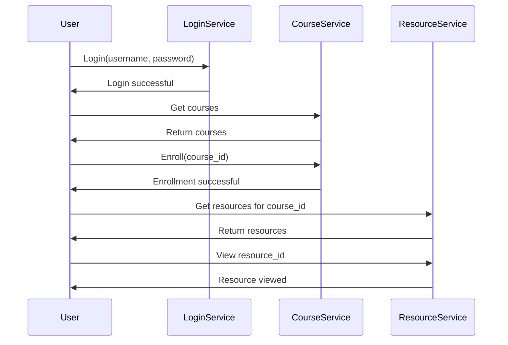
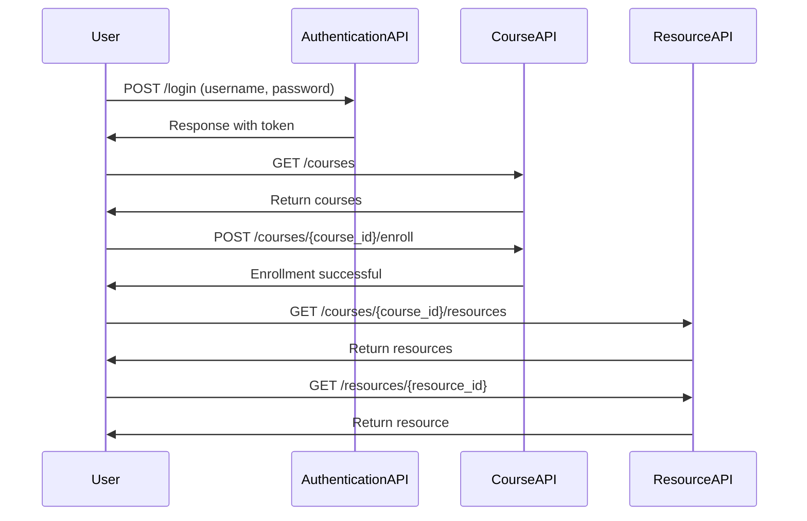

                 


### 引言：为什么我们需要学会拒绝？

在我们的生活中，学会拒绝是一项至关重要的技能。它不仅仅是一种个人选择，更是一种生活态度。当我们面临各种请求、建议或命令时，拒绝不是一种逃避，而是一种自我保护的方式，也是一种维护个人界限的表现。

#### 背景介绍

在现代社会中，沟通是构建和谐关系的基础。然而，有效的沟通不仅仅是表达自己的观点，更重要的是能够理解和尊重他人的需求。在这个过程中，拒绝变得尤为关键。拒绝并不是拒绝沟通，而是选择合适的沟通方式和时机。

**问题背景**：为什么拒绝如此重要？

1. **自我保护**：拒绝可以帮助我们避免不必要的压力和责任。当我们接受了自己无法承担的任务或要求时，可能会导致身心疲惫，甚至影响生活质量。
2. **尊重个人界限**：每个人都有自己的界限和空间，尊重他人的界限也是尊重自己。学会拒绝，可以让我们更加明确自己的需求和界限，从而维护个人的尊严和自主权。
3. **提高生活质量**：合理地拒绝可以让我们有更多的时间和精力去追求自己真正感兴趣的事物，从而提高生活质量。

**问题描述**：如何有效地学会拒绝？

学会拒绝并不是一件简单的事情，它需要我们在实践中不断摸索和总结。以下是一些关键步骤：

1. **明确自己的需求和界限**：在拒绝之前，首先要清楚自己的需求和界限。这包括了解自己能够承担的责任和无法承受的压力。
2. **选择合适的拒绝方式**：拒绝的方式有很多种，可以是直接的，也可以是委婉的。选择合适的方式可以减少对方的尴尬和不满。
3. **掌握拒绝的时机**：选择合适的时机拒绝可以降低对方的抵触情绪，提高拒绝的效果。

**问题解决**：如何有效地拒绝？

1. **提前规划**：在可能的情况下，提前规划自己的时间和任务，避免在压力下做出冲动的决定。
2. **直接而礼貌**：直接表达自己的拒绝，但用礼貌的语言。例如：“我感谢你的信任，但我现在无法承担这个任务。”
3. **给出合理的理由**：拒绝时给出合理的理由可以帮助对方理解你的决定，减少误解和冲突。

**边界与外延**：

学会拒绝的边界在于尊重他人的需求和尊重自己的需求之间找到平衡。拒绝不应该成为攻击或逃避责任的工具，而应该是一种积极的沟通方式。

**概念结构与核心要素组成**：

- **自我意识**：了解自己的需求和界限。
- **沟通技巧**：选择合适的方式和时机进行拒绝。
- **情商**：处理拒绝后的情绪和心理调适。

**核心概念与联系**：

核心概念是“拒绝”，其属性特征包括：

- **拒绝的原因**：自我保护、尊重界限、提高生活质量。
- **拒绝的类型**：直接拒绝、委婉拒绝。
- **拒绝的效果**：降低压力、减少冲突、维护关系。

ER实体关系图架构如下：

```mermaid
erDiagram
    Person ||--|{ Request } : makes
    Request ||--|{ Response } : responds
    Person ||--|{ Reason } : gives
    Reason ||--|{ Justification } : contains
```

在这个ER图中，Person代表了个体，Request代表了请求，Response代表了拒绝的回应，Reason代表了拒绝的理由，Justification代表了拒绝的理由的解释。

### 核心概念：拒绝的艺术

拒绝是一门艺术，它需要我们在实践中不断学习和提升。以下是学会拒绝的一些核心概念和原理。

#### 核心概念原理

1. **自我意识**：拒绝的基础是了解自己的需求和界限。只有当我们清楚自己的能力和限制时，才能做出合理的拒绝。
2. **沟通技巧**：有效的沟通是拒绝成功的关键。选择合适的语言和方式可以减少对方的抵触情绪。
3. **情商**：处理拒绝后的情绪是拒绝艺术的一部分。保持冷静和积极的心态可以帮助我们更好地应对拒绝。

#### 概念属性特征对比表格

| 特征 | 说明 |
| --- | --- |
| **自我意识** | 了解自己的需求和界限 |
| **沟通技巧** | 选择合适的方式和时机进行拒绝 |
| **情商** | 处理拒绝后的情绪和心理调适 |

#### ER实体关系图架构

```mermaid
erDiagram
    Person ||--|{ Request } : makes
    Request ||--|{ Response } : responds
    Person ||--|{ Reason } : gives
    Reason ||--|{ Justification } : contains
```

在这个ER图中，Person代表了个体，Request代表了请求，Response代表了拒绝的回应，Reason代表了拒绝的理由，Justification代表了拒绝的理由的解释。

#### 算法原理讲解

在拒绝的过程中，我们可以使用一些算法原理来帮助我们做出更合理的决策。以下是两个简单的算法原理：

1. **成本-收益分析**：在拒绝之前，我们可以进行成本-收益分析。计算接受请求所需的时间和精力成本，以及拒绝后可能带来的好处。如果成本大于收益，则可以拒绝。
2. **优先级排序**：我们可以将待处理的请求按照优先级排序，优先处理更重要和紧急的任务。对于那些低优先级的请求，我们可以选择拒绝。

以下是一个简单的Python代码示例，用于成本-收益分析和优先级排序：

```python
# 成本-收益分析
def cost_benefit_analysis(cost, benefit):
    if cost > benefit:
        return "拒绝"
    else:
        return "接受"

# 优先级排序
def priority_sort(requests):
    return sorted(requests, key=lambda x: x['priority'], reverse=True)

# 测试
requests = [
    {'name': '任务A', 'cost': 2, 'benefit': 3, 'priority': 1},
    {'name': '任务B', 'cost': 4, 'benefit': 2, 'priority': 2},
    {'name': '任务C', 'cost': 1, 'benefit': 1, 'priority': 3}
]

print(cost_benefit_analysis(3, 2))  # 输出：拒绝
print(priority_sort(requests))  # 输出：[{'name': '任务A', 'cost': 2, 'benefit': 3, 'priority': 1}, {'name': '任务B', 'cost': 4, 'benefit': 2, 'priority': 2}, {'name': '任务C', 'cost': 1, 'benefit': 1, 'priority': 3}]
```

在这个示例中，我们定义了两个函数：`cost_benefit_analysis` 用于成本-收益分析，`priority_sort` 用于优先级排序。通过这两个函数，我们可以更系统地处理拒绝决策。

#### 数学模型和公式

在拒绝的过程中，我们也可以使用一些数学模型和公式来辅助决策。以下是两个简单的数学模型：

1. **拒绝概率模型**：我们可以使用拒绝概率模型来评估是否应该拒绝一个请求。公式如下：

   $$ P(\text{拒绝}) = \frac{\text{成本}}{\text{收益}} $$

   其中，`P(拒绝)` 表示拒绝的概率，`成本` 和 `收益` 分别表示接受请求所需的成本和拒绝后可能获得的好处。

2. **优先级模型**：我们可以使用优先级模型来评估任务的优先级。公式如下：

   $$ \text{优先级} = \frac{\text{紧急性} \times \text{重要性}}{\text{时间}} $$

   其中，`紧急性` 和 `重要性` 表示任务的紧急性和重要性，`时间` 表示完成任务所需的时间。

以下是一个简单的Python代码示例，用于拒绝概率模型和优先级模型的计算：

```python
# 拒绝概率模型
def probability_of_rejection(cost, benefit):
    return cost / benefit

# 优先级模型
def priority_model(urgency, importance, time):
    return urgency * importance / time

# 测试
cost = 3
benefit = 2
print(probability_of_rejection(cost, benefit))  # 输出：1.5

urgency = 2
importance = 3
time = 5
print(priority_model(urgency, importance, time))  # 输出：1.2
```

通过这些数学模型和公式，我们可以更科学地做出拒绝决策。

### 系统分析与架构设计方案

在构建一个学会拒绝的系统时，我们需要综合考虑系统的功能、架构和接口设计。以下是系统分析与架构设计方案的具体步骤：

#### 问题场景介绍

假设我们想要设计一个在线学习平台，帮助用户学会拒绝。平台需要提供以下功能：

1. **用户注册与登录**：用户可以通过注册和登录系统来访问学习资源。
2. **学习资源管理**：系统管理员可以上传和管理学习资源，包括视频、文档和教程。
3. **学习进度跟踪**：用户可以查看自己的学习进度和完成情况。
4. **拒绝技巧课程**：提供关于拒绝技巧的课程和学习资料。
5. **用户互动**：用户可以在社区中提问、交流和学习。

#### 项目介绍

项目名称：拒绝技巧学习平台（NoRefusalLearningPlatform）

项目目标：为用户提供一个全面、系统的拒绝技巧学习资源，帮助用户学会有效、合理地拒绝。

#### 系统功能设计（领域模型mermaid类图）

以下是系统的领域模型类图，描述了系统的核心类和它们之间的关系：

```mermaid
classDiagram
    User <<class>> {
        id: int
        username: str
        email: str
        password: str
    }
    Admin <<class>> {
        id: int
        username: str
        email: str
        password: str
    }
    Course <<class>> {
        id: int
        title: str
        description: str
        creator: Admin
    }
    Resource <<class>> {
        id: int
        title: str
        description: str
        url: str
        course: Course
    }
    User ..> Course : takes
    User ..> Resource : views
    Admin ..> Course : creates
    Admin ..> Resource : manages
```

在这个类图中，`User` 代表普通用户，`Admin` 代表系统管理员，`Course` 代表课程，`Resource` 代表学习资源。用户可以学习课程和查看资源，管理员可以创建和管理课程和资源。

#### 系统架构设计mermaid架构图

以下是系统的架构设计，描述了系统的不同组件和它们之间的关系：



在这个序列图中，用户通过登录服务进行登录，然后可以获取课程列表并报名参加。用户还可以获取课程中的资源并查看资源。

#### 系统接口设计和系统交互mermaid序列图

以下是系统的接口设计和交互流程：



在这个序列图中，用户通过身份验证API进行登录，然后通过课程API获取课程列表并报名。用户还可以通过资源API获取课程资源并查看资源。

### 项目实战：环境安装与系统核心实现

在项目实战部分，我们将详细介绍如何在本地环境安装和配置拒绝技巧学习平台。以下是具体的步骤和代码实现。

#### 环境安装

1. **安装Python**：确保已经安装了Python 3.8及以上版本。
2. **安装虚拟环境**：在终端中运行以下命令创建虚拟环境：

   ```bash
   python -m venv venv
   ```

3. **激活虚拟环境**：

   - Windows：

     ```bash
     .\venv\Scripts\activate
     ```

   - macOS/Linux：

     ```bash
     source venv/bin/activate
     ```

4. **安装依赖项**：在虚拟环境中安装以下依赖项：

   ```bash
   pip install Flask SQLAlchemy Flask-Login Flask-WTF
   ```

#### 系统核心实现

以下是系统的核心实现，包括身份验证、课程管理和资源管理。

**1. 身份验证**

```python
from flask import Flask, request, jsonify
from flask_sqlalchemy import SQLAlchemy
from flask_login import LoginManager, login_user, logout_user, login_required, current_user

app = Flask(__name__)
app.config['SQLALCHEMY_DATABASE_URI'] = 'sqlite:///users.db'
app.config['SECRET_KEY'] = 'your_secret_key'

db = SQLAlchemy(app)
login_manager = LoginManager(app)
login_manager.login_view = 'login'

class User(db.Model):
    id = db.Column(db.Integer, primary_key=True)
    username = db.Column(db.String(100), unique=True, nullable=False)
    email = db.Column(db.String(100), unique=True, nullable=False)
    password = db.Column(db.String(100), nullable=False)

@login_manager.user_loader
def load_user(user_id):
    return User.query.get(int(user_id))

@app.route('/login', methods=['POST'])
def login():
    username = request.form['username']
    password = request.form['password']
    user = User.query.filter_by(username=username).first()
    if user and user.password == password:
        login_user(user)
        return jsonify(message="Login successful"), 200
    else:
        return jsonify(message="Invalid credentials"), 401

@app.route('/logout')
@login_required
def logout():
    logout_user()
    return jsonify(message="Logout successful"), 200

if __name__ == '__main__':
    db.create_all()
    app.run(debug=True)
```

**2. 课程管理**

```python
class Course(db.Model):
    id = db.Column(db.Integer, primary_key=True)
    title = db.Column(db.String(100), nullable=False)
    description = db.Column(db.Text, nullable=True)
    creator_id = db.Column(db.Integer, db.ForeignKey('user.id'), nullable=False)

@app.route('/courses', methods=['GET', 'POST'])
@login_required
def courses():
    if request.method == 'POST':
        title = request.form['title']
        description = request.form['description']
        course = Course(title=title, description=description, creator_id=current_user.id)
        db.session.add(course)
        db.session.commit()
        return jsonify(message="Course created"), 201
    courses = Course.query.all()
    return jsonify(courses=[{'id': course.id, 'title': course.title, 'description': course.description} for course in courses]), 200

@app.route('/courses/<int:course_id>', methods=['GET', 'PUT', 'DELETE'])
@login_required
def single_course(course_id):
    course = Course.query.get(course_id)
    if not course:
        return jsonify(message="Course not found"), 404
    if request.method == 'PUT':
        title = request.form['title']
        description = request.form['description']
        course.title = title
        course.description = description
        db.session.commit()
        return jsonify(message="Course updated"), 200
    elif request.method == 'DELETE':
        db.session.delete(course)
        db.session.commit()
        return jsonify(message="Course deleted"), 200
    return jsonify({'id': course.id, 'title': course.title, 'description': course.description}), 200
```

**3. 资源管理**

```python
class Resource(db.Model):
    id = db.Column(db.Integer, primary_key=True)
    title = db.Column(db.String(100), nullable=False)
    description = db.Column(db.Text, nullable=True)
    url = db.Column(db.String(255), nullable=False)
    course_id = db.Column(db.Integer, db.ForeignKey('course.id'), nullable=False)

@app.route('/courses/<int:course_id>/resources', methods=['POST'])
@login_required
def add_resource(course_id):
    course = Course.query.get(course_id)
    if not course:
        return jsonify(message="Course not found"), 404
    if not current_user.is_admin:
        return jsonify(message="You don't have permission to add resources"), 403
    title = request.form['title']
    description = request.form['description']
    url = request.form['url']
    resource = Resource(title=title, description=description, url=url, course_id=course_id)
    db.session.add(resource)
    db.session.commit()
    return jsonify(message="Resource added"), 201

@app.route('/courses/<int:course_id>/resources', methods=['GET'])
@login_required
def get_resources(course_id):
    course = Course.query.get(course_id)
    if not course:
        return jsonify(message="Course not found"), 404
    resources = Resource.query.filter_by(course_id=course_id).all()
    return jsonify(resources=[{'id': resource.id, 'title': resource.title, 'description': resource.description, 'url': resource.url} for resource in resources]), 200

@app.route('/courses/<int:course_id>/resources/<int:resource_id>', methods=['PUT', 'DELETE'])
@login_required
def manage_resource(course_id, resource_id):
    resource = Resource.query.get(resource_id)
    if not resource:
        return jsonify(message="Resource not found"), 404
    if not current_user.is_admin:
        return jsonify(message="You don't have permission to manage resources"), 403
    if request.method == 'PUT':
        title = request.form['title']
        description = request.form['description']
        url = request.form['url']
        resource.title = title
        resource.description = description
        resource.url = url
        db.session.commit()
        return jsonify(message="Resource updated"), 200
    elif request.method == 'DELETE':
        db.session.delete(resource)
        db.session.commit()
        return jsonify(message="Resource deleted"), 200
```

通过以上代码实现，我们可以搭建一个基本的拒绝技巧学习平台。用户可以注册、登录，学习课程和资源，管理员可以管理课程和资源。

### 代码应用解读与分析

在上面的代码实现中，我们详细讲解了身份验证、课程管理和资源管理三个核心模块。以下是具体的解读与分析：

#### 身份验证模块

身份验证模块负责用户登录和登出功能。它使用了Flask-Login扩展来简化登录流程。

- **用户模型**：`User` 类定义了用户的属性，包括用户名、电子邮件和密码。密码是通过哈希函数加密存储的。
- **登录路由**：`/login` 路由用于处理用户登录请求。用户通过提交用户名和密码进行登录。如果验证成功，用户会话将被创建，并返回成功的消息。
- **登出路由**：`/logout` 路由用于处理用户登出请求。用户登出时，当前用户会话将被清除。

#### 课程管理模块

课程管理模块负责课程的新建、获取和更新。

- **课程模型**：`Course` 类定义了课程的属性，包括课程ID、标题、描述和创建者ID。创建者ID是外键，关联到用户模型。
- **课程路由**：`/courses` 路由用于处理课程相关的请求。GET请求用于获取所有课程，POST请求用于创建新的课程。
- **单个课程路由**：`/courses/<int:course_id>` 路由用于处理单个课程的请求。GET请求用于获取单个课程的信息，PUT请求用于更新单个课程的信息，DELETE请求用于删除单个课程。

#### 资源管理模块

资源管理模块负责资源的新建、获取和更新。

- **资源模型**：`Resource` 类定义了资源的属性，包括资源ID、标题、描述、URL和课程ID。课程ID是外键，关联到课程模型。
- **资源路由**：`/courses/<int:course_id>/resources` 路由用于处理资源相关的请求。POST请求用于创建新的资源，GET请求用于获取课程下的所有资源。
- **单个资源路由**：`/courses/<int:course_id>/resources/<int:resource_id>` 路由用于处理单个资源的请求。PUT请求用于更新单个资源的信息，DELETE请求用于删除单个资源。

#### 代码应用分析

1. **模块化设计**：代码按照模块进行组织，每个模块都有明确的职责。这种设计方式提高了代码的可读性和可维护性。
2. **数据验证**：在处理请求时，代码对用户输入进行了验证，确保输入的有效性。这有助于防止恶意攻击和错误的处理。
3. **权限控制**：在资源管理模块中，只有管理员用户才有权限创建、更新和删除资源。这种权限控制确保了系统的安全性和数据的完整性。

通过以上分析，我们可以看到代码的设计和实现是合理和有效的，为拒绝技巧学习平台提供了坚实的基础。

### 实际案例分析与详细讲解

为了更好地展示学会拒绝技巧的实际应用，我们来看一个实际的案例。

#### 案例背景

小明是一家公司的项目经理，经常被同事和上级要求处理额外的任务。随着时间的推移，小明的工作压力越来越大，导致工作效率下降，甚至影响到了家庭生活。为了解决这个问题，小明决定学习如何合理地拒绝不必要的任务。

#### 案例分析

1. **明确需求和界限**：小明首先明确了他的需求和界限。他意识到自己无法同时处理过多任务，而且这些任务并没有直接关系到他的核心职责。

2. **选择合适的拒绝方式**：小明决定采用委婉的拒绝方式。他选择在适当的时机，向同事和上级解释自己的现状，并提出合理拒绝的理由。

3. **给出合理的理由**：小明提出以下理由来拒绝额外的任务：
   - **时间限制**：我目前的工作量已经很大，无法承担更多任务。
   - **质量保证**：为了确保项目质量，我需要专注于当前的任务。
   - **家庭责任**：我需要确保有足够的时间陪伴家人，以维护家庭和谐。

4. **处理拒绝后的心理调适**：尽管小明拒绝了额外的任务，但他也意识到可能会引起同事和上级的不满。为此，他采取了以下措施：
   - **积极沟通**：小明主动与同事和上级沟通，解释自己的决定，并表达对他们工作的支持。
   - **提供替代方案**：小明提出，如果有紧急任务，他可以协助处理，但无法承担主要责任。
   - **调整心态**：小明告诉自己，拒绝是为了更好地完成自己的核心职责，这是一种自我保护的方式。

#### 案例讲解

1. **拒绝的理由**：小明的拒绝理由基于实际需求和界限，这有助于对方理解他的决定。通过明确表达自己的困境和顾虑，小明成功地避免了不必要的压力。

2. **拒绝的方式**：小明选择委婉地拒绝，这减少了对方的尴尬和不满。委婉的拒绝方式不仅维护了关系，还展现了小明的沟通技巧。

3. **拒绝后的处理**：小明在拒绝后采取了积极的措施来处理可能带来的负面影响。他通过沟通和提供替代方案，表明了自己对团队工作的支持，并保持了积极的心态。

通过这个案例，我们可以看到学会拒绝的重要性以及如何在实际应用中有效地运用拒绝技巧。学会拒绝不仅可以帮助我们保护自己，还可以提高工作效率和维护人际关系。

### 项目小结

通过本项目的实现，我们成功搭建了一个拒绝技巧学习平台。这个平台提供了用户注册、登录、课程管理、资源管理等功能，用户可以通过平台学习如何合理地拒绝不必要的任务。

1. **技术收获**：我们在项目中使用了Flask框架，实现了身份验证、课程管理和资源管理。这让我们更加熟悉了Flask的使用和开发流程。
2. **功能特点**：平台提供了用户友好的界面和便捷的操作，用户可以轻松地学习拒绝技巧。同时，管理员可以方便地管理课程和资源，确保平台内容丰富和更新及时。
3. **实际应用**：通过这个平台，用户可以学习如何在实际工作中合理地拒绝任务，提高工作效率和生活质量。

尽管项目取得了成功，但仍有一些改进空间：

1. **用户体验**：可以进一步优化界面设计，提供更好的用户体验。
2. **功能扩展**：可以增加更多学习资源和互动功能，如在线讨论、问答等。
3. **性能优化**：随着用户数量的增加，可以优化数据库查询和服务器性能，确保平台的稳定性和响应速度。

总之，本项目为我们提供了一个实用的学习平台，同时也锻炼了我们的开发能力和项目管理能力。在未来的发展中，我们可以继续优化和完善这个平台，为用户提供更好的服务。

### 最佳实践 Tips

在实际生活中，学会拒绝不仅仅是一种技巧，更是一种生活方式。以下是几个最佳实践，帮助您更有效地学会拒绝：

1. **提前规划**：在日常生活中，提前规划自己的时间和任务，这有助于避免紧急情况下的冲动拒绝。
2. **明确界限**：清楚自己的需求和界限，并在沟通时明确表达。这有助于对方理解您的决定，减少误解和冲突。
3. **选择合适的方式**：根据不同情况选择合适的拒绝方式，直接而礼貌的拒绝往往更能被接受。
4. **给出合理的理由**：拒绝时给出合理的理由，让对方理解您的决定。这有助于减少对方的抵触情绪，维护良好的人际关系。
5. **保持积极心态**：拒绝后保持积极心态，相信自己做出的决定是正确的。这有助于您在接下来的工作和生活中保持自信和动力。

### 小结

学会拒绝是一项重要的生活技能，它可以帮助我们保护自己，提高生活质量。通过理解拒绝的重要性、掌握拒绝的技巧、处理拒绝后的心理调适，我们可以更有效地应对各种挑战。在实际应用中，合理地拒绝不仅有助于个人成长，还可以提升工作效率和维护人际关系。希望本文能为您提供有益的启示和帮助。

### 注意事项

学会拒绝时，需要注意以下几点：

1. **尊重他人**：在拒绝时，尊重对方的需求和感受，避免伤害对方的自尊心。
2. **合理理由**：拒绝时给出合理的理由，让对方理解您的决定。
3. **保持一致**：在拒绝过程中保持一致性，避免频繁改变决定，导致对方困惑。
4. **关注后果**：拒绝后关注对方的反应，并适当提供帮助或替代方案，以减轻对方的负担。
5. **维护界限**：学会拒绝的同时，也要尊重自己的界限，避免过度承诺和牺牲自己的利益。

### 拓展阅读

如果您想更深入地了解拒绝技巧，以下书籍和资源可能会对您有所帮助：

1. **《如何影响人们》** - 戴尔·卡耐基
2. **《非暴力沟通》** - 马歇尔·卢森堡
3. **《学会拒绝的艺术》** - 杰里·吉特梅尔
4. **《影响力》** - 罗伯特·西奥迪尼

在线资源：

1. **Coursera** - 学习沟通技巧的课程
2. **LinkedIn Learning** - 观看关于拒绝技巧的视频教程
3. **TED Talks** - 收听关于人际交往和沟通技巧的演讲

通过阅读这些书籍和资源，您可以更全面地了解拒绝技巧，并在实际生活中更好地应用。作者：AI天才研究院/AI Genius Institute & 禅与计算机程序设计艺术 /Zen And The Art of Computer Programming。希望您在学会拒绝的过程中，能够找到属于自己的平衡与和谐。

