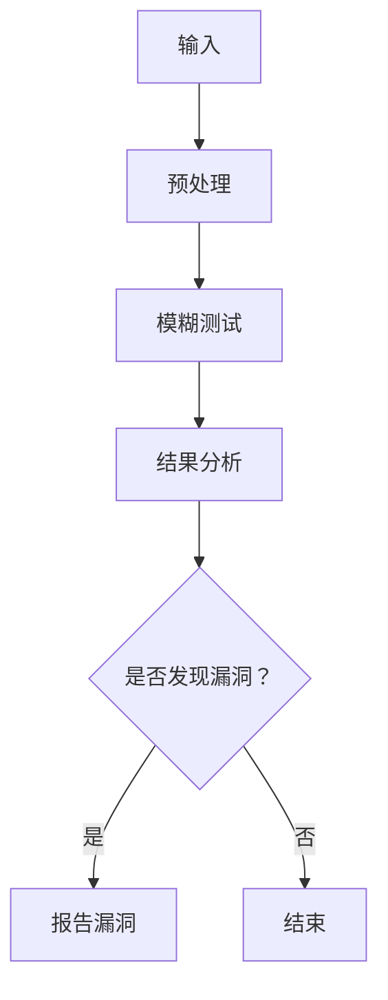

                 

# 安全测试：将安全测试集成到CI/CD流程

## 关键词：安全测试、CI/CD、持续集成、持续部署、自动化测试

> 摘要：本文旨在探讨如何在持续集成（CI）和持续部署（CD）流程中集成安全测试，以提高软件开发的效率和安全性。我们将从背景介绍、核心概念与联系、算法原理讲解、系统分析与架构设计以及项目实战等多个方面展开论述，为读者提供全面的安全测试实践指南。

## 第一部分：背景介绍

### 第1章 安全测试概述

#### 1.1 安全测试的背景与意义

随着互联网和信息技术的飞速发展，网络安全问题日益凸显。对于企业和组织来说，安全测试成为保障系统安全的关键环节。安全测试的主要目的是识别和修复潜在的安全漏洞，确保系统在设计和实现过程中遵循安全最佳实践，从而降低潜在的安全风险。

然而，传统的安全测试方法往往难以满足快速开发与持续集成/持续部署（CI/CD）的需求。在CI/CD流程中，开发周期缩短，迭代速度加快，传统的安全测试方法往往无法跟上这样的节奏。因此，如何将安全测试集成到CI/CD流程中，提高测试效率和代码质量，成为当前面临的重要问题。

#### 1.2 安全测试的核心概念与联系

安全测试是确保软件系统安全性的重要手段。它包括一系列的活动，如漏洞扫描、渗透测试、代码审计等。这些活动旨在识别和修复潜在的安全漏洞，确保系统在设计和实现过程中遵循安全最佳实践。

安全测试与质量保证密切相关。质量保证是一个广泛的概念，包括安全测试在内的各种活动，旨在确保软件产品满足既定的质量标准。安全测试是质量保证的重要组成部分，它帮助发现和修复安全漏洞，从而提高软件产品的整体安全性。

### 第2章 安全测试基础理论

#### 2.1 安全测试的基本原理

安全测试的基本原理是通过对软件系统进行各种测试，识别和修复潜在的安全漏洞。这些测试可以从多个角度进行，包括静态代码分析、动态代码分析、漏洞扫描和渗透测试等。

安全测试的目标是确保系统在设计和实现过程中遵循安全最佳实践，降低潜在的安全风险。安全测试的类型包括漏洞扫描、渗透测试、代码审计等。每种测试类型都有其特定的方法和目标。

#### 2.2 安全测试的技术和方法

安全测试的技术和方法多种多样。其中，静态代码分析是一种在代码编写阶段进行的测试方法，通过分析源代码来发现潜在的安全漏洞。动态代码分析是在程序运行时进行测试，检测运行时的安全漏洞。漏洞扫描是自动化的工具用于识别系统中的已知漏洞。渗透测试则模拟黑客攻击，验证系统的安全防护能力。

#### 2.3 安全测试与质量保证的关系

安全测试是质量保证的重要组成部分。质量保证是一个广泛的概念，包括安全测试在内的各种活动，旨在确保软件产品满足既定的质量标准。安全测试帮助发现和修复安全漏洞，从而提高软件产品的整体安全性。

安全测试与其他质量活动（如单元测试、集成测试、系统测试等）有着密切的联系。安全测试在软件生命周期中扮演着关键角色，它不仅有助于提高软件产品的质量，还能提高开发团队的效率和信心。

## 第二部分：核心概念与联系

### 第3章 安全测试算法原理

#### 3.1 常见安全测试算法介绍

安全测试算法是安全测试的重要组成部分。常见的安全测试算法包括模糊测试、模式识别算法和符号执行等。

- **模糊测试**：通过生成大量异常输入来检测系统中的潜在漏洞。它是一种自动化测试技术，旨在发现输入验证不足的问题。
- **模式识别算法**：利用机器学习技术，对网络流量进行分析，识别异常行为。这种算法可以帮助检测网络攻击和异常流量。
- **符号执行**：一种自动化测试技术，用于发现程序中的路径安全问题。它通过执行程序的所有可能路径，识别潜在的安全漏洞。

#### 3.2 安全测试算法的mermaid流程图



#### 3.3 安全测试算法的python源代码实现

```python
import random

def fuzz_test(input_data):
    # 对输入数据进行模糊处理
    # ...

def analyze_results(results):
    # 分析测试结果
    # ...

def main():
    input_data = "example_input"
    fuzz_test(input_data)
    analyze_results("results")

if __name__ == "__main__":
    main()
```

#### 3.4 安全测试算法的数学模型和公式

$$
\text{漏洞概率} = \frac{\text{发现漏洞的测试次数}}{\text{总测试次数}}
$$

## 第三部分：算法原理讲解

### 第4章 安全测试系统设计与架构

#### 4.1 安全测试问题场景介绍

- **场景描述**：假设我们正在开发一个在线购物系统，该系统需要处理大量用户数据，包括个人信息和支付信息。我们需要对系统进行安全测试，以确保用户数据的安全。

#### 4.2 安全测试系统的项目介绍

- **项目目标**：开发一个安全测试系统，能够自动化地对在线购物系统进行安全测试，识别潜在的安全漏洞。
- **项目范围**：包括安全测试工具的开发、测试流程的设计和安全测试报告的生成。

#### 4.3 安全测试系统的功能设计

- **领域模型**：使用mermaid绘制安全测试系统的领域模型类图。
- **功能模块**：包括测试计划管理、测试执行、测试报告生成等模块。

#### 4.4 安全测试系统的架构设计

- **架构设计**：使用mermaid绘制安全测试系统的架构图，包括各个模块之间的关系和交互方式。

## 第四部分：系统分析与架构设计

### 第5章 安全测试系统分析与架构设计

#### 5.1 安全测试系统问题场景介绍

- **场景描述**：我们以一个电商平台的CI/CD流程为例，分析如何将其与安全测试集成。

#### 5.2 安全测试系统项目介绍

- **项目目标**：实现一个能够自动执行安全测试的CI/CD流程，确保每个版本都能通过安全测试。

#### 5.3 安全测试系统功能设计

- **功能模块**：包括安全测试任务的调度、测试执行、结果收集和分析等。

#### 5.4 安全测试系统架构设计

- **架构设计**：使用mermaid绘制安全测试系统的架构图，展示各个模块的交互和依赖关系。

## 第五部分：项目实战

### 第6章 项目实战：安全测试集成到CI/CD流程

#### 6.1 环境安装

- **Jenkins**：安装Jenkins，作为CI/CD工具。
- **Docker**：安装Docker，用于容器化应用程序。
- **OWASP ZAP**：安装OWASP ZAP，作为安全测试工具。

#### 6.2 系统核心实现源代码

- **Jenkinsfile**：编写Jenkinsfile，定义CI/CD流程。
- **安全测试脚本**：编写Python脚本，用于执行安全测试。

#### 6.3 代码应用解读与分析

- **安全测试脚本解读**：详细解读安全测试脚本，分析其工作原理和实现方法。

#### 6.4 实际案例分析和详细讲解剖析

- **案例分析**：通过实际案例，展示安全测试集成到CI/CD流程的效果。

#### 6.5 项目小结

- **总结**：总结项目成果，分享最佳实践和注意事项。

## 第六部分：最佳实践与拓展阅读

### 第7章 最佳实践与拓展阅读

#### 7.1 最佳实践

- **定期更新测试工具**：确保使用的测试工具和插件是最新的，以覆盖最新的漏洞。
- **自动化测试脚本**：编写高效的自动化测试脚本，减少人工干预。
- **安全培训**：对开发人员和安全测试人员进行定期培训，提高安全意识和技能。

#### 7.2 拓展阅读

- **《CI/CD实践指南》**：了解CI/CD的基本原理和实践方法。
- **《安全测试实战》**：深入学习安全测试的技术和方法。
- **《漏洞扫描与渗透测试》**：了解漏洞扫描和渗透测试的详细过程。

## 第七部分：作者信息

作者：AI天才研究院/AI Genius Institute & 禅与计算机程序设计艺术 /Zen And The Art of Computer Programming

# 结束

