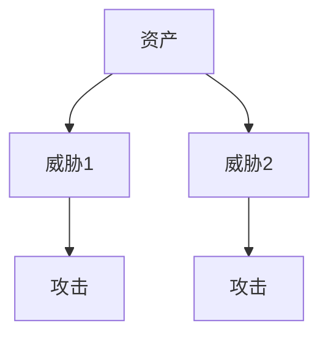

                 

# 安全漏洞管理与响应机制

## 关键词
- 安全漏洞
- 管理与响应机制
- 威胁建模
- 风险评估
- 事件响应

## 摘要
本文旨在深入探讨安全漏洞管理与响应机制，从核心概念、管理策略到具体实践，提供全方位的视角。文章将首先介绍安全漏洞的基本概念和背景，然后详细讨论威胁建模、风险评估和事件响应等关键环节。通过具体案例和实际操作，我们将展示如何有效地管理和响应安全漏洞，确保系统安全。

## 引言

随着数字化时代的到来，信息安全成为了企业和社会关注的焦点。网络攻击、数据泄露等安全事件频发，使得安全漏洞管理变得尤为重要。安全漏洞是网络安全中最薄弱的环节，往往被攻击者利用，从而导致严重后果。因此，建立有效的安全漏洞管理与响应机制，成为了企业保护自身信息和资产的关键。

本文将围绕以下主题展开讨论：
1. 安全漏洞的基本概念和背景。
2. 威胁建模与风险评估。
3. 事件响应流程与策略。
4. 安全漏洞管理的最佳实践。
5. 案例分析与实战经验。

通过本文的阅读，读者将能够全面了解安全漏洞管理的理论体系和实践方法，提升自身的安全防护能力。

## 安全漏洞的基本概念

### 定义

安全漏洞是指系统、应用程序或网络中存在的安全缺陷，这些缺陷可能被恶意攻击者利用，从而导致数据泄露、系统崩溃或其他安全风险。安全漏洞可以分为多种类型，包括但不限于以下几种：

- **漏洞（Vulnerabilities）**：系统或软件中固有的缺陷，可能导致未经授权的访问或操作。
- **威胁（Threats）**：潜在的恶意行为或攻击，可能利用安全漏洞来实施攻击。
- **攻击（Attacks）**：对系统或网络的实际攻击行为，利用安全漏洞实现特定的攻击目标。
- **漏洞利用（Exploits）**：利用安全漏洞执行恶意操作的程序或技术。

### 问题背景

随着互联网和软件系统的普及，安全漏洞的数量和复杂度也在不断增长。据统计，每年都会发现大量的新漏洞，这些漏洞可能存在于操作系统、数据库、网络设备、Web应用等各个方面。以下是一些常见的问题背景：

- **操作系统漏洞**：操作系统如Windows、Linux等，由于复杂的代码库和广泛的应用场景，常常成为攻击者的目标。
- **Web应用漏洞**：Web应用中常见的漏洞包括SQL注入、跨站脚本（XSS）和跨站请求伪造（CSRF）等。
- **网络设备漏洞**：网络设备如路由器、交换机等，由于固件漏洞或配置错误，可能被攻击者利用。
- **移动应用漏洞**：随着移动应用的普及，移动平台上的安全漏洞也日益受到关注。

### 问题描述

安全漏洞的存在会给企业和个人带来巨大的风险，具体包括：

- **数据泄露**：攻击者可能通过漏洞获取敏感数据，如用户密码、信用卡信息等。
- **系统崩溃**：安全漏洞可能导致系统崩溃或服务中断，影响业务连续性。
- **经济损失**：由于安全漏洞导致的攻击，企业可能会遭受经济损失，包括数据恢复费用、客户赔偿和法律诉讼费用等。
- **声誉损害**：安全事件可能导致企业声誉受损，影响客户信任和市场份额。

### 问题解决

解决安全漏洞问题需要综合性的策略，包括：

- **漏洞扫描与评估**：定期进行漏洞扫描，识别系统中存在的安全漏洞。
- **补丁管理**：及时应用系统补丁，修复已知漏洞。
- **安全培训**：提高员工的安全意识，减少人为错误。
- **安全架构设计**：从系统架构层面考虑安全性，设计安全的系统组件和接口。
- **安全响应计划**：制定并演练安全响应计划，确保在发生安全事件时能够迅速有效地应对。

### 边界与外延

安全漏洞不仅存在于技术层面，还涉及法律、道德和社会层面。例如：

- **法律边界**：不同国家和地区对数据保护和网络安全有不同的法律规定，企业需要遵守相应的法规。
- **道德边界**：安全漏洞的利用可能涉及道德问题，如未经授权访问他人数据。
- **社会影响**：安全漏洞的曝光和传播可能引起公众恐慌，影响社会稳定。

### 概念结构与核心要素组成

安全漏洞管理涉及多个核心要素，包括：

- **威胁情报**：收集和分析潜在威胁信息，预测可能的攻击。
- **漏洞数据库**：存储已知漏洞的信息，包括漏洞类型、影响范围、修复建议等。
- **漏洞扫描工具**：自动扫描系统中的漏洞，提供报告和建议。
- **漏洞响应团队**：负责处理安全漏洞事件，包括漏洞确认、风险评估和修复。
- **安全政策与流程**：定义安全漏洞管理的政策、流程和责任。

通过以上概念和要素的有机结合，企业可以建立起全面的安全漏洞管理框架，提升整体安全防护能力。

## 威胁建模与风险评估

### 威胁建模

威胁建模是一种系统化方法，用于识别和评估潜在的安全威胁。它有助于组织理解其资产面临的威胁，并制定相应的防护措施。以下是威胁建模的核心步骤：

1. **资产识别**：确定组织的关键资产，包括系统、应用程序、数据和物理设备。
2. **威胁识别**：通过历史攻击记录、公开威胁情报和专家经验，识别可能针对这些资产的威胁。
3. **威胁分析**：分析威胁的性质、可能性、影响和利用方式。
4. **威胁建模工具**：使用威胁建模工具，如威胁建模图、攻击树等，可视化威胁情景。

### 风险评估

风险评估是评估威胁对组织的潜在影响的过程。以下是风险评估的主要步骤：

1. **风险识别**：识别组织面临的所有潜在风险，包括内部和外部风险。
2. **风险分析**：评估每个风险的可能性和潜在影响。
3. **风险排序**：根据风险的可能性和影响，对风险进行排序。
4. **风险缓解**：制定和实施缓解措施，降低风险等级。

### 关系

威胁建模和风险评估是安全漏洞管理中不可或缺的环节。威胁建模提供了识别和理解威胁的方法，而风险评估则帮助组织确定哪些威胁最需要关注。两者相辅相成，共同构成了安全漏洞管理的核心。

### 威胁建模图与ER图

以下是一个简单的威胁建模图（使用Mermaid语法）和ER图（使用Markdown语法）：



```markdown
```mermaid
erDiagram
  ID [[A]] ||--|{ [[B]] : 威胁1} ||--|{ [[D]] : 攻击}
  ID [[A]] ||--|{ [[C]] : 威胁2} ||--|{ [[E]] : 攻击}
```
```

这个威胁建模图展示了资产（A）与威胁（B、C）和攻击（D、E）之间的关系。ER图则用实体关系图的形式展示了资产、威胁和攻击之间的关联。

### 威胁建模流程与算法讲解

以下是威胁建模的详细流程，并使用Python代码和Mermaid语法来阐述算法原理。

```python
# 威胁建模流程

# 1. 资产识别
assets = ["系统A", "系统B", "数据C"]

# 2. 威胁识别
threats = {
    "系统A": ["漏洞X", "恶意软件"],
    "系统B": ["未授权访问", "DDoS攻击"],
    "数据C": ["数据泄露", "数据篡改"]
}

# 3. 威胁分析
for asset in assets:
    for threat in threats[asset]:
        # 威胁分析逻辑
        print(f"{asset}面临威胁：{threat}")

# 4. 威胁建模
import mermaid

def generate_threat_modeling_diagram(threats):
    diagram = mermaid.MermaidDiagram()
    for asset, asset_threats in threats.items():
        for threat in asset_threats:
            diagram.add_edge(asset, threat, label="面临")
    return diagram

threat_modeling_diagram = generate_threat_modeling_diagram(threats)
print(threat_modeling_diagram.to_string())
```

以上代码首先识别资产和威胁，然后进行威胁分析。最后，使用Mermaid生成威胁建模图，便于理解和分析。

数学模型方面，可以使用概率论来评估威胁的可能性和影响。以下是简单示例：

$$
\text{风险} = \text{威胁可能性} \times \text{威胁影响}
$$

其中，威胁可能性表示特定威胁发生的概率，威胁影响表示该威胁对组织造成的潜在损失。

```python
# 风险评估示例

threats = {
    "系统A": {"漏洞X": 0.5, "恶意软件": 0.3},
    "系统B": {"未授权访问": 0.2, "DDoS攻击": 0.4},
    "数据C": {"数据泄露": 0.1, "数据篡改": 0.6}
}

impact_weights = {"漏洞X": 5, "恶意软件": 3, "未授权访问": 4, "DDoS攻击": 2, "数据泄露": 6, "数据篡改": 7}

def calculate_risk(threats, impact_weights):
    total_risk = 0
    for asset, asset_threats in threats.items():
        for threat, probability in asset_threats.items():
            impact = impact_weights[threat]
            risk = probability * impact
            print(f"{asset}的{threat}风险：{risk}")
            total_risk += risk
    return total_risk

total_risk = calculate_risk(threats, impact_weights)
print(f"总风险：{total_risk}")
```

这段代码根据威胁可能性和影响权重计算总风险，帮助组织确定哪些威胁需要重点关注。

### 算法原理讲解

威胁建模和风险评估的算法原理主要包括以下几个方面：

1. **威胁识别**：利用历史数据和威胁情报，通过模式识别和机器学习算法识别潜在威胁。
2. **威胁分析**：使用统计分析方法，评估威胁的可能性（概率）和影响（损失）。
3. **风险计算**：基于概率和影响，计算整体风险，并使用风险矩阵（如概率-影响矩阵）进行风险排序。
4. **威胁建模**：使用图形化工具（如Mermaid）将威胁和风险可视化，帮助理解和分析。

通过上述算法原理，组织可以构建全面的安全威胁模型，评估潜在风险，并采取相应的防护措施。

### 实际案例

以下是一个实际案例，展示如何利用威胁建模和风险评估方法来管理安全漏洞。

#### 案例背景

某公司开发了一个在线电商平台，面临以下安全威胁：

- **系统A**：电商平台应用程序
- **系统B**：数据库服务器
- **系统C**：网络设备

#### 威胁识别

- **系统A**：SQL注入、跨站脚本（XSS）
- **系统B**：数据泄露、未授权访问
- **系统C**：DDoS攻击、网络设备漏洞

#### 威胁分析

- **系统A**：SQL注入可能影响用户数据和交易数据，XSS可能导致恶意脚本执行。
- **系统B**：数据泄露可能导致用户隐私泄露，未授权访问可能导致敏感数据被篡改。
- **系统C**：DDoS攻击可能导致服务中断，网络设备漏洞可能导致设备被控制。

#### 风险评估

- **系统A**：SQL注入可能性为0.6，影响为5；XSS可能性为0.4，影响为4。总风险：4.2
- **系统B**：数据泄露可能性为0.7，影响为6；未授权访问可能性为0.5，影响为5。总风险：5.2
- **系统C**：DDoS攻击可能性为0.3，影响为2；网络设备漏洞可能性为0.2，影响为3。总风险：0.8

#### 风险缓解

- **系统A**：实施SQL注入防护措施，如参数化查询、输入验证等。
- **系统B**：加强数据库访问控制，定期备份数据，实施数据加密。
- **系统C**：配置防火墙和入侵检测系统，定期更新网络设备固件。

通过以上实际案例，我们可以看到威胁建模和风险评估如何帮助组织识别和管理安全漏洞，降低风险并采取相应的防护措施。

### 小结

威胁建模和风险评估是安全漏洞管理的重要环节。通过威胁建模，组织可以全面了解面临的潜在威胁，而通过风险评估，可以确定哪些威胁需要优先处理。实际案例展示了如何运用这些方法来管理安全漏洞，确保系统安全。通过不断迭代和完善威胁建模和风险评估流程，组织可以提升整体安全防护能力。

### 最佳实践

1. **定期进行威胁建模**：至少每季度进行一次威胁建模，以识别新的威胁和变化。
2. **风险评估与实际业务结合**：确保风险评估与业务目标和风险承受能力相匹配。
3. **安全培训与意识提升**：定期进行员工安全培训，提高整体安全意识。
4. **自动化与工具支持**：利用自动化工具进行漏洞扫描和风险评估，提高效率。
5. **及时响应与改进**：一旦发现安全漏洞，立即采取措施进行修复，并从事件中吸取经验教训，持续改进安全措施。

### 小结

威胁建模和风险评估是安全漏洞管理的重要环节。通过定期进行威胁建模、结合实际业务进行风险评估、提升员工安全意识、利用自动化工具和及时响应与改进，组织可以构建起有效的安全防护体系，确保系统的安全性。

### 注意事项

1. **数据保护**：确保在威胁建模和风险评估过程中，不泄露敏感数据。
2. **合规性**：确保威胁建模和风险评估符合相关法律法规要求。
3. **保密性**：威胁情报和安全信息需要严格保密，防止内部泄露。
4. **持续监控**：威胁环境和攻击手段不断变化，需要持续监控和更新威胁模型。

### 拓展阅读

- **《网络安全威胁建模：方法与实践》**：详细介绍了威胁建模的方法和实践。
- **《信息安全风险评估与管理》**：探讨了风险评估的理论和实践。
- **《OWASP Top 10》**：列出最常见的安全漏洞，有助于识别和防范常见威胁。

### 作者信息

作者：AI天才研究院/AI Genius Institute & 禅与计算机程序设计艺术 /Zen And The Art of Computer Programming

