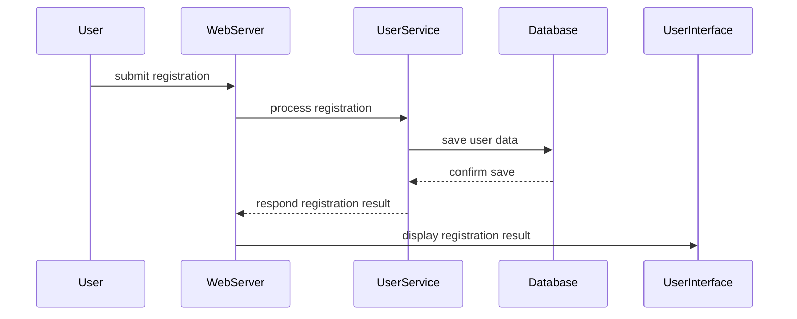
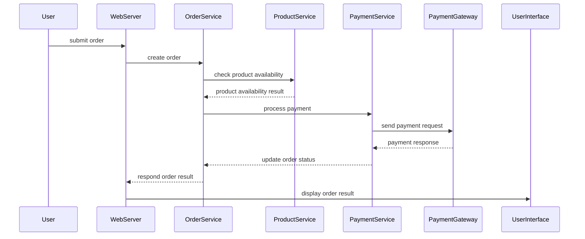

                 

### 安全编码的重要性与基础

#### 引言：安全编码的必要性和挑战

在当今数字化时代，软件系统已经成为社会运转的核心支柱。然而，随着软件应用范围的不断扩大和复杂程度的不断提高，安全问题愈发凸显。网络安全事件频发，如勒索软件、数据泄露、远程攻击等，不仅给企业和个人带来了巨大的经济损失，还严重威胁到了国家安全和社会稳定。因此，如何进行安全编码，构建安全可靠的应用系统，已经成为每个软件开发者都需要面对的重要课题。

##### **问题背景**

1. **软件安全事件频发**：近年来，全球范围内发生了多起严重的网络安全事件，如WannaCry勒索软件攻击、Equifax数据泄露事件等。这些事件不仅导致了巨额的经济损失，还暴露了众多软件系统在安全方面的薄弱环节。

2. **安全漏洞对企业和用户的影响**：安全漏洞的存在可能导致数据泄露、系统瘫痪、财务损失等严重后果。对于企业来说，安全漏洞可能导致客户信任度下降，甚至面临法律诉讼和罚款。对于个人用户来说，个人信息泄露可能引发一系列隐私问题，甚至遭受经济损失。

##### **问题描述**

1. **安全编码的定义**：安全编码是指在软件开发过程中，通过一系列的技术和策略，确保软件系统在设计和实现阶段就能够具备抵御外部威胁和内部攻击的能力。

2. **安全编码的目标**：安全编码的主要目标是预防安全漏洞的产生，提高软件系统的安全性、可靠性和稳定性。

##### **问题解决**

1. **安全编码的最佳实践**：为了实现安全编码的目标，需要遵循一系列最佳实践，如进行严格的输入验证、使用加密技术、定期进行安全测试等。

2. **安全编码工具和技术**：利用现有的安全编码工具和技术，如静态代码分析工具、动态测试工具和安全框架，可以提高安全编码的效率和效果。

##### **边界与外延**

1. **安全编码的适用范围**：安全编码不仅适用于企业级应用，也适用于个人项目和开源项目。

2. **安全编码与其他安全领域的交叉**：安全编码与其他安全领域如网络安全、数据安全、应用安全等密切相关，需要综合运用多种技术和方法。

通过以上对安全编码必要性和挑战的讨论，我们可以看到，安全编码是保障软件系统安全的关键环节。在接下来的章节中，我们将进一步探讨安全编码的核心概念和具体实践，帮助读者深入理解并掌握这一重要技能。

---

### 核心概念与联系

在构建安全可靠的应用系统时，理解并掌握一些核心概念是至关重要的。这些概念不仅构成了安全编码的理论基础，还为我们提供了分析和解决实际问题的工具。在本节中，我们将深入探讨安全漏洞的类型、产生原因以及如何通过ER实体关系图来构建安全编码的框架。

#### **核心概念原理**

1. **安全漏洞的类型**：

   - **输入验证漏洞**：由于没有对用户输入进行严格验证，可能导致恶意输入引发系统错误或执行恶意代码。

   - **SQL注入攻击**：攻击者通过在输入字段中注入恶意SQL代码，操纵数据库查询，窃取或篡改数据。

   - **跨站脚本攻击（XSS）**：攻击者通过在网页中注入恶意脚本，欺骗用户执行非预期的操作，从而窃取敏感信息或伪造用户交互。

   - **远程代码执行（RCE）**：攻击者通过利用系统漏洞，远程执行恶意代码，进而控制整个系统。

2. **安全漏洞的产生原因**：

   - **开发人员的疏忽**：未能遵循安全编码的最佳实践，如未进行严格的输入验证或使用过时的库。

   - **系统设计缺陷**：系统架构设计不合理，未能充分考虑安全性。

   - **缺乏安全测试**：在开发过程中未能进行充分的安全测试，导致安全漏洞未能及时发现。

   - **依赖组件安全漏洞**：使用存在安全漏洞的第三方库或组件，可能导致系统受到攻击。

#### **概念属性特征对比**

| 安全漏洞类型       | 特征描述                                                         | 示例                              |
|------------------|------------------------------------------------------------|---------------------------------|
| 输入验证漏洞       | 缺乏对输入数据的验证或验证不严格。                           | 恶意输入导致系统执行非法操作。          |
| SQL注入攻击       | 攻击者通过输入字段注入恶意SQL代码。                          | 窃取数据库中的敏感数据。                  |
| 跨站脚本攻击（XSS） | 攻击者通过注入恶意脚本，诱导用户执行非预期的操作。           | 盗取用户的登录凭证。                      |
| 远程代码执行（RCE） | 攻击者通过利用系统漏洞执行远程代码。                         | 控制服务器执行恶意操作。                   |

#### **ER实体关系图架构**

为了更好地理解安全编码的核心要素，我们可以通过ER实体关系图来构建安全编码的框架。ER图是数据库设计和系统架构设计中常用的工具，它能够清晰地展示实体之间的关系，帮助我们识别和解决潜在的安全问题。

```mermaid
erDiagram
    User ..|> Account
    Account ..|> Login
    Login ..|> Authentication
    Authentication ..|> AccessControl
    AccessControl ..|> Resource
    Resource ..|> Data
    Data ..|> Encryption
```

在上面的ER图中，我们定义了以下实体：

- **User**：表示系统的用户。
- **Account**：表示用户的账户信息。
- **Login**：表示用户的登录过程。
- **Authentication**：表示身份验证过程。
- **AccessControl**：表示访问控制机制。
- **Resource**：表示用户可以访问的资源。
- **Data**：表示用户操作的数据。
- **Encryption**：表示数据加密过程。

通过ER图，我们可以看到不同实体之间的关联，从而为系统的安全设计提供指导。例如：

- **输入验证**：需要对用户的输入进行验证，确保其符合预期格式，以防止输入验证漏洞。
- **SQL注入防护**：在数据库查询中，应该使用参数化查询或预处理语句，以防止SQL注入。
- **跨站脚本攻击（XSS）防护**：在输出用户数据时，应该对数据进行编码或转义，防止恶意脚本执行。
- **远程代码执行（RCE）防护**：应避免使用过时的库或组件，并定期更新系统，以防止利用已知的漏洞进行攻击。

通过核心概念原理的深入理解和ER实体关系图的直观展示，我们可以为构建安全可靠的应用系统奠定坚实的基础。在接下来的章节中，我们将进一步探讨如何具体实施安全编码的最佳实践，帮助读者在实际开发中应用这些理论，构建更为安全的软件系统。

---

### 常见安全漏洞与防范措施

在软件开发过程中，安全漏洞是不可避免的，但通过了解常见的安全漏洞类型及其防范措施，我们可以有效地减少安全风险。以下将详细讨论输入验证漏洞、SQL注入攻击和跨站脚本攻击（XSS），并提供具体的防范策略。

#### **3.1 输入验证漏洞**

**问题背景**：
输入验证漏洞是软件中最常见的漏洞之一，通常发生在应用程序未能对用户输入进行充分验证的情况下。这类漏洞允许攻击者提交恶意输入，从而引发系统错误或执行未经授权的操作。

**问题描述**：
输入验证漏洞可能表现为以下几种形式：

1. **无效输入**：用户输入非预期的格式或数据类型，导致系统无法正确处理。
2. **恶意输入**：攻击者提交包含恶意代码或命令的输入，例如SQL注入或脚本注入。

**防范措施**：
1. **输入过滤**：对用户输入进行格式和类型验证，确保其符合预期。
2. **输入编码**：对用户输入进行编码或转义，防止其被解释为代码或命令。
3. **最小权限原则**：确保应用程序在处理用户输入时，仅具有必要的权限，避免滥用权限。

#### **3.2 SQL注入攻击**

**问题背景**：
SQL注入攻击是利用应用程序未能正确处理用户输入，从而在数据库查询中注入恶意SQL代码的一种攻击方式。SQL注入攻击可能导致数据泄露、数据篡改或系统瘫痪。

**问题描述**：
SQL注入攻击通常表现为攻击者通过输入字段提交恶意SQL代码，这些代码在数据库查询中执行，从而导致以下后果：

1. **数据泄露**：攻击者获取数据库中的敏感信息。
2. **数据篡改**：攻击者修改数据库中的数据。
3. **系统瘫痪**：攻击者执行恶意操作，导致数据库服务崩溃。

**防范措施**：
1. **使用参数化查询**：采用参数化查询或预处理语句，确保SQL代码与用户输入分离。
2. **最小权限原则**：数据库用户应具有最小权限，仅能访问必要的数据和操作。
3. **输入编码**：对用户输入进行编码或转义，防止其被解释为SQL代码。
4. **安全库和框架**：使用安全库和框架，如ORM（对象关系映射）工具，以减少SQL注入的风险。

#### **3.3 跨站脚本攻击（XSS）**

**问题背景**：
跨站脚本攻击（XSS）是攻击者通过在网页中注入恶意脚本，欺骗用户执行非预期操作的一种攻击方式。XSS攻击可能导致以下后果：

1. **会话劫持**：攻击者窃取用户的登录凭证，冒充用户进行操作。
2. **数据窃取**：攻击者窃取用户的敏感信息，如信用卡号、密码等。
3. **系统篡改**：攻击者通过恶意脚本修改网页内容或执行非法操作。

**问题描述**：
XSS攻击通常通过以下方式实现：

1. **存储型XSS**：攻击者在服务器上存储恶意脚本，诱导用户访问，从而执行脚本。
2. **反射型XSS**：攻击者诱导用户点击链接或访问特定URL，恶意脚本在当前页面中执行。
3. **基于DOM的XSS**：攻击者通过修改网页的DOM结构，在客户端执行恶意脚本。

**防范措施**：
1. **输出编码**：对用户输出的数据进行编码或转义，防止其被解释为脚本。
2. **内容安全政策（CSP）**：实施内容安全策略，限制网页可以加载的外部脚本。
3. **输入验证**：对用户输入进行严格验证，确保其仅包含预期字符和格式。
4. **同源策略**：确保网页和脚本来自同一源，防止外部脚本访问内部数据。

通过了解这些常见安全漏洞及其防范措施，开发者可以在软件开发过程中采取相应的防护策略，构建更为安全的软件系统。在接下来的章节中，我们将进一步探讨安全编码框架与工具，帮助读者在实际开发中更好地应用这些策略。

---

### 安全编码框架与工具

在构建安全可靠的应用系统时，安全编码框架和工具是不可或缺的。安全编码框架提供了一个系统化的方法，帮助开发者识别和解决潜在的安全问题。而安全编码工具则提供了自动化检测和修复漏洞的能力，从而提高编码效率和安全性。以下将详细探讨安全编码框架的定义、组成部分，以及常用的安全编码工具。

#### **4.1 安全编码框架**

**定义**：
安全编码框架是一种系统化的方法，旨在帮助开发者在软件开发的各个阶段，识别、分析和解决安全问题。这种框架通常包含一系列最佳实践、策略和工具，以确保软件在设计和实现阶段就能够具备较高的安全性。

**组成部分**：
一个典型的安全编码框架通常包括以下组成部分：

1. **安全需求分析**：在项目开始时，对系统的安全需求进行详细分析，确定需要保护的数据和资源。

2. **安全设计**：在系统架构设计阶段，确保系统的架构设计能够满足安全需求，并采取相应的安全措施。

3. **安全编码**：在开发过程中，遵循安全编码的最佳实践，编写安全可靠的代码。

4. **安全测试**：通过安全测试，发现并修复潜在的安全漏洞。

5. **安全维护**：在软件的整个生命周期中，定期进行安全检查和更新，以应对新出现的安全威胁。

#### **4.2 安全编码工具**

**作用**：
安全编码工具在软件开发的各个阶段都发挥着重要作用，主要功能包括：

1. **漏洞扫描**：自动化检测代码中的安全漏洞。

2. **静态代码分析**：在代码编写阶段，分析代码的质量和安全性。

3. **动态测试**：在代码执行过程中，检测运行时的安全漏洞。

4. **代码审查**：通过人工审查，发现代码中的潜在安全问题。

**常用的安全编码工具**：

1. **SonarQube**：SonarQube是一个开源的静态代码分析平台，可以帮助开发者发现代码中的漏洞、编码标准和代码质量问题。

2. **OWASP ZAP**：OWASP ZAP是一个免费的动态应用程序安全测试工具，可以自动检测Web应用程序中的安全漏洞。

3. **Fortify**：Fortify是一个综合性的安全测试平台，提供了静态代码分析和动态测试功能，可以帮助开发者识别和修复代码中的安全问题。

4. **Checkmarx**：Checkmarx是一个强大的静态代码分析工具，能够快速扫描代码中的安全漏洞，并提供详细的修复建议。

通过使用安全编码框架和工具，开发者可以在软件开发的各个阶段，系统化地识别和解决安全问题，从而构建安全可靠的应用系统。在接下来的章节中，我们将通过具体案例，展示如何在实际开发中应用这些框架和工具，进一步提升软件的安全性。

---

### 案例分析一：Web应用的安全加固

为了更好地理解如何在实际项目中应用安全编码的原则和方法，我们通过一个Web应用的安全加固案例进行详细分析。本案例将从背景介绍、系统功能设计、系统架构设计、系统接口设计和系统交互五个方面进行讲解。

#### **5.1 案例背景**

某电子商务平台需要构建一个安全可靠的用户管理系统，以保护用户的个人信息和交易数据。该系统需要处理用户注册、登录、个人信息管理、订单处理等核心功能。由于涉及敏感数据，系统的安全性至关重要。

#### **5.2 系统功能设计**

系统功能设计是构建安全可靠应用系统的第一步，我们需要明确系统的功能需求和设计领域模型。以下是系统的核心功能：

1. **用户注册**：用户可以通过注册页面创建账户，填写用户名、密码、邮箱等信息。
2. **用户登录**：用户可以通过用户名和密码登录系统，系统应进行身份验证和权限检查。
3. **个人信息管理**：用户可以查看和编辑自己的个人信息。
4. **订单管理**：用户可以查看自己的订单历史和当前订单状态。
5. **支付**：用户可以进行在线支付，系统应确保支付过程的安全。

**领域模型类图**：

```mermaid
classDiagram
    User <<entity>>
    Order <<entity>>
    Payment <<entity>>
    User --> Order : creates
    User --> Payment : performs
    Order --> Payment : contains
```

在这个类图中，我们定义了三个实体：`User`（用户）、`Order`（订单）和`Payment`（支付）。用户可以创建订单和支付，订单包含支付信息。

#### **5.3 系统架构设计**

系统架构设计决定了系统的可扩展性和安全性。以下是系统的架构设计：

**系统架构图**：



在这个序列图中，用户通过Web服务器提交注册请求，由UserService处理注册逻辑，将用户数据保存到数据库。通过这样的设计，可以确保用户数据的安全性，同时实现模块化，便于后续扩展。

#### **5.4 系统接口设计**

系统接口设计是实现功能模块之间通信的关键。以下是系统的核心接口设计：

1. **用户注册接口**：`POST /register`，接收用户注册信息，验证输入并保存到数据库。
2. **用户登录接口**：`POST /login`，接收用户登录信息，验证用户身份并返回令牌。
3. **个人信息管理接口**：`GET /user/profile`（获取）和`PUT /user/profile`（更新）。
4. **订单管理接口**：`GET /orders`（获取订单列表）、`GET /orders/{orderId}`（获取订单详情）和`POST /orders`（创建订单）。
5. **支付接口**：`POST /payments`，接收支付请求，处理支付并更新订单状态。

#### **5.5 系统交互**

系统交互设计描述了不同模块之间的交互逻辑。以下是系统的核心交互设计：

**系统交互序列图**：



在这个序列图中，用户提交订单请求，OrderService处理订单创建，并与ProductService交互检查产品库存，然后与PaymentService交互处理支付，最后更新订单状态。通过这样的交互设计，可以确保订单流程的连续性和数据的一致性。

#### **5.6 案例总结**

通过本案例的分析，我们可以看到，构建一个安全可靠的应用系统需要从多个方面进行考虑：

1. **功能设计**：明确系统的功能需求，设计合理的领域模型。
2. **架构设计**：构建模块化、可扩展的系统架构，确保数据安全和模块间通信。
3. **接口设计**：设计清晰的接口，确保功能模块之间的交互顺畅。
4. **交互设计**：定义系统模块之间的交互逻辑，确保系统运行的连续性和一致性。

通过上述设计，电子商务平台用户管理系统不仅实现了预期的功能，还具备了较高的安全性，能够有效地保护用户的个人信息和交易数据。

---

### 案例分析二：移动应用的安全防护

为了进一步提升对移动应用安全防护的理解，我们将分析一个移动应用的安全防护案例。该案例将涵盖背景介绍、安全功能设计、安全实现细节和案例总结。

#### **6.1 案例背景**

某移动应用开发了一款社交媒体应用程序，用户可以在应用程序内发布内容、评论和交流。由于涉及用户的个人信息和隐私，应用程序的安全防护至关重要。为了确保用户数据和操作的安全，开发团队需要设计一系列安全功能，并确保其有效实施。

#### **6.2 安全功能设计**

在移动应用开发过程中，安全功能的设计是保障系统安全的基础。以下是该应用程序的主要安全功能设计：

1. **用户身份验证**：用户在登录时需要进行身份验证，确保只有授权用户可以访问系统。
2. **数据加密**：应用存储和传输的所有数据都需要进行加密，防止数据泄露。
3. **访问控制**：根据用户角色和权限，限制用户对特定功能的访问。
4. **安全审计**：记录用户操作日志，以便在发生安全事件时进行追踪和分析。
5. **异常检测**：实时监控应用程序的异常行为，如频繁的登录失败、数据访问异常等，及时采取措施。

#### **6.3 安全实现细节**

为了实现上述安全功能，开发团队采取了以下具体措施：

1. **用户身份验证**：

   - **多因素认证**：结合密码和短信验证码进行双重验证，提高登录安全性。
   - **令牌机制**：使用JWT（JSON Web Token）来管理用户的会话，确保用户身份的可靠性和完整性。

2. **数据加密**：

   - **数据存储**：在本地数据库中存储敏感数据时，使用AES（Advanced Encryption Standard）进行加密。
   - **数据传输**：应用与服务器之间的数据传输使用HTTPS协议，确保数据在传输过程中被加密。

3. **访问控制**：

   - **角色和权限管理**：为不同角色分配不同的权限，确保用户只能访问与其角色相关的功能。
   - **权限验证**：在每次用户请求访问特定资源时，进行权限验证，确保用户具备访问权限。

4. **安全审计**：

   - **日志记录**：记录用户的所有操作，包括登录、数据访问、更新和删除等。
   - **异常监测**：通过实时监控用户行为，检测异常行为，如多次尝试访问未授权资源等。

5. **异常检测**：

   - **行为分析**：利用机器学习算法，分析用户行为模式，识别异常行为。
   - **实时告警**：当检测到异常行为时，立即发出告警，并采取相应措施。

#### **6.4 案例总结**

通过本案例的安全防护设计，我们可以看到，移动应用的安全防护是一个系统工程，涉及多个方面的技术和策略。以下是案例总结的关键点：

1. **多因素认证**：提高了用户身份验证的安全性，防止未经授权的访问。
2. **数据加密**：确保了存储和传输的数据安全，防止数据泄露。
3. **访问控制**：通过角色和权限管理，有效防止了越权操作。
4. **安全审计**：为安全事件的追踪和分析提供了重要依据。
5. **异常检测**：实时监控和检测异常行为，确保系统的持续安全性。

总之，通过系统化的安全功能设计和有效实现，该移动应用能够提供可靠的安全保障，保护用户的个人信息和隐私，提升用户的信任度和满意度。

---

### 安全编码的最佳实践

在构建安全可靠的应用系统过程中，最佳实践是确保代码质量和安全性的关键。以下将详细介绍编码前的准备工作、编码过程中的注意事项以及编码后的安全检查。

#### **7.1 编码前的准备工作**

1. **需求分析**：在进行编码前，对系统的需求进行详细分析，明确系统的功能和安全要求。

2. **安全需求文档**：编写安全需求文档，明确需要保护的数据、系统和资源的保护级别，以及应对不同安全威胁的策略。

3. **设计评审**：在系统设计阶段，组织设计评审，确保安全设计符合安全需求，并符合最佳实践。

4. **安全培训**：对开发团队进行安全培训，确保团队成员了解安全编码的基本原则和最佳实践。

5. **工具和框架选择**：选择适合项目需求的安全编码工具和框架，如静态代码分析工具、安全库和安全框架。

#### **7.2 编码过程中的注意事项**

1. **最小权限原则**：确保应用程序的每个模块和组件都遵循最小权限原则，仅具有必要的权限。

2. **输入验证**：对用户输入进行严格的验证，防止恶意输入导致的安全漏洞。

3. **输出编码**：对用户输出的数据进行编码或转义，防止跨站脚本攻击（XSS）。

4. **使用安全的API**：避免使用过时的或不安全的API，确保使用经过验证的库和框架。

5. **异常处理**：合理处理异常情况，避免泄露敏感信息和系统内部逻辑。

6. **代码注释和文档**：编写清晰的代码注释和文档，帮助团队成员理解代码功能和设计意图。

#### **7.3 编码后的安全检查**

1. **静态代码分析**：使用静态代码分析工具（如SonarQube）扫描代码，识别潜在的漏洞和不符合编码标准的问题。

2. **动态测试**：通过动态测试工具（如OWASP ZAP）进行应用程序安全测试，检测运行时的漏洞。

3. **安全审计**：对系统进行安全审计，检查是否存在安全设计缺陷和实现错误。

4. **渗透测试**：邀请专业安全团队进行渗透测试，模拟真实攻击场景，识别系统的弱点。

5. **安全培训与回顾**：定期对开发团队进行安全培训，回顾最佳实践，提升团队的安全意识。

通过遵循这些最佳实践，开发团队能够有效提高代码的安全性和可靠性，减少安全漏洞的产生，确保软件系统能够抵御各种潜在的安全威胁。

---

### 注意事项与小结

在安全编码过程中，开发者常常会遇到一些常见的误区，了解并避免这些误区对于提高编码质量和系统安全性至关重要。以下将列举一些安全编码的常见误区，并提出相应的注意事项，以帮助开发者更好地理解和实施安全编码。

#### **8.1 安全编码的常见误区**

1. **过度依赖静态分析工具**：虽然静态分析工具能够发现一些潜在的安全问题，但它们并非万能。静态分析无法检测运行时的问题，因此不能完全依赖静态分析来确保系统的安全性。

2. **忽略动态测试**：许多开发者在完成代码编写后，往往忽略了动态测试，认为静态代码分析已经足够。然而，动态测试能够检测运行时的漏洞，是发现安全隐患的重要手段。

3. **未进行安全培训**：开发团队缺乏安全意识和知识，容易在编码过程中引入安全漏洞。因此，定期进行安全培训，提高团队的安全意识至关重要。

4. **错误地使用加密技术**：加密技术是保护数据安全的重要手段，但如果不正确使用，可能导致安全隐患。例如，使用弱加密算法、重复使用密钥等。

5. **缺乏安全审计**：在系统开发过程中，安全审计往往被忽视。安全审计能够帮助发现系统设计中的安全缺陷和实现错误，是提高系统安全性的重要环节。

#### **8.2 安全编码的持续改进**

1. **定期安全回顾**：开发团队应定期回顾和总结安全编码过程中的经验和教训，发现存在的问题并进行改进。

2. **借鉴开源社区**：积极借鉴开源社区的安全实践和最佳案例，吸收先进的经验和知识，提升团队的安全能力。

3. **持续学习和培训**：安全威胁和技术在不断变化，开发者需要持续学习和更新知识，掌握最新的安全技术和防范策略。

4. **自动化测试与检查**：引入自动化测试工具和静态代码分析工具，实现安全检查的自动化，提高编码效率和安全性。

5. **积极反馈与改进**：鼓励团队成员之间进行积极反馈，及时发现和纠正安全编码中的问题，不断提升编码质量。

通过了解并避免这些常见误区，并采取有效的持续改进措施，开发团队能够在安全编码过程中不断提高代码质量和系统安全性，确保软件系统能够抵御各种潜在的安全威胁。

---

### 拓展阅读

为了帮助读者进一步深入理解和掌握安全编码的相关知识和技能，以下推荐一些重要的书籍、课程和资源，供读者参考和阅读。

#### **9.1 相关书籍**

1. **《网络安全实践指南：系统与网络安全技术》** - [陈伟][陈伟]  
   该书详细介绍了网络安全的基础知识、系统安全技术和网络安全策略，适合对网络安全感兴趣的读者。

2. **《代码大全》** - [史蒂夫·迈克康奈尔][史蒂夫·迈克康奈尔]  
   本书是软件开发领域的经典之作，涵盖了代码编写、设计、测试等多个方面，对提高编码质量有很高的参考价值。

3. **《黑客攻防技术宝典：系统实战篇》** - [岳广顺][岳广顺]  
   该书深入剖析了操作系统和应用程序的安全漏洞，提供了丰富的实际攻击和防御技巧，适合对系统安全感兴趣的读者。

4. **《软件安全：实践与案例》** - [刘强][刘强]  
   本书从实战角度出发，讲解了软件安全的基本原理、常见漏洞和防御策略，适合希望提升安全编码能力的开发者。

#### **9.2 在线课程和资源**

1. **Coursera上的《网络安全与隐私》** - [斯坦福大学][斯坦福大学]  
   这门课程由斯坦福大学教授开设，涵盖了网络安全的基础知识、加密技术和网络安全协议，适合初学者入门。

2. **Udemy上的《Web安全测试与渗透测试》** - [Adeel Qayum][Adeel Qayum]  
   这门课程讲解了Web安全测试和渗透测试的基本技巧，适合对网络安全测试感兴趣的读者。

3. **OWASP网站** - [OWASP][OWASP]  
   OWASP是一个专注于网络安全的开源组织，其网站提供了丰富的安全资源，包括安全指南、工具和报告。

4. **GitHub上的安全项目** - [GitHub][GitHub]  
   GitHub上有许多开源的安全项目，如安全编码工具、安全指南和安全测试工具，开发者可以借鉴和学习。

通过阅读这些书籍和课程，结合实际项目中的实践，读者可以不断提高自己的安全编码能力，为构建安全可靠的应用系统打下坚实的基础。

---

### 结束语

本文以《安全编码指南：构建安全可靠的应用系统》为题，详细探讨了安全编码的重要性、核心概念、具体实践、安全框架与工具、实际案例以及最佳实践。通过逐步分析和讲解，我们深入了解了安全编码的理论基础和实际应用。

安全编码不仅仅是避免漏洞，更是构建信任和保障系统长期稳定运行的关键。本文从多个角度出发，为开发者提供了全面的指导，包括常见的安全漏洞、防护措施、安全编码框架和工具，以及实际案例分析和最佳实践。

我们鼓励读者在学习和实践过程中，不断探索和总结，提高自己的安全编码能力。通过遵循最佳实践和持续改进，开发者可以为构建安全可靠的应用系统做出重要贡献。

**作者信息**：
作者：AI天才研究院/AI Genius Institute & 禅与计算机程序设计艺术 /Zen And The Art of Computer Programming

