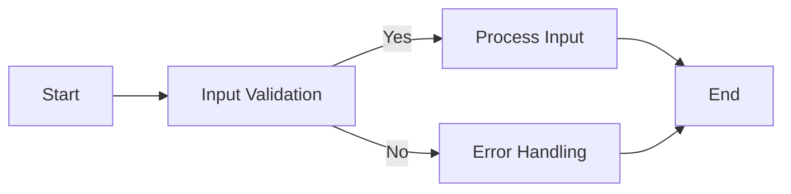

                 


## 安全编码：构建坚不可摧的应用防线

> 关键词：安全编码、应用防线、核心概念、算法原理、系统分析与架构设计、实战案例、最佳实践

> 摘要：
本篇文章深入探讨了安全编码在构建坚不可摧的应用防线中的重要性。文章首先介绍了安全编码的核心概念、目标、原则及其面临的挑战与机遇。接着，通过详细分析安全编码中的核心概念原理，展示了概念属性特征对比表格和ER实体关系图架构。随后，文章详细讲解了安全编码算法原理，使用Python源代码和mermaid流程图进行说明。文章还介绍了系统分析与架构设计的方法，包括问题场景介绍、系统功能设计、系统架构设计、系统接口设计和系统交互。最后，通过实战案例分析和最佳实践总结，为读者提供了实际操作指导和后续研究方向。

### 第一部分：背景介绍

#### 第1章：安全编码的重要性

安全编码在现代软件开发中扮演着至关重要的角色。随着互联网的普及和数字化转型的加速，应用程序成为企业运营的核心，因此确保其安全性成为重中之重。

#### 1.1 问题背景

近年来，网络攻击事件频发，导致大量数据泄露和业务中断，给企业和个人带来了巨大的损失。安全编码旨在预防这些攻击，保护应用程序和数据安全。

#### 1.2 问题描述

安全编码面临的主要问题是：如何在保证开发效率的同时，确保代码的安全性？

#### 1.3 问题解决

通过遵循安全编码的最佳实践，采用先进的安全技术和工具，可以显著提高应用程序的安全性。

#### 1.4 边界与外延

安全编码不仅关注代码层面的安全，还包括开发流程、测试和部署等环节。此外，它还涉及对法律法规和行业标准的遵守。

#### 1.5 概念结构与核心要素组成

安全编码的核心概念包括：输入验证、输出编码、错误处理、会话管理、身份验证和授权等。这些要素共同构成了一个全面的安全编码体系。

### 第二部分：核心概念与联系

#### 第2章：安全编码核心概念

安全编码的核心概念是确保代码安全的基础。以下是对几个关键概念的解释和说明：

#### 2.1 安全编码的定义

安全编码是指编写符合安全标准、能抵御常见攻击的代码。

#### 2.2 安全编码的目标

安全编码的目标是确保应用程序的安全性，防止数据泄露、篡改和未授权访问。

#### 2.3 安全编码的核心原则

安全编码的核心原则包括最小权限原则、防御深度原则、安全设计原则等。

#### 2.4 安全编码的挑战与机遇

安全编码面临挑战，如开发与安全的平衡、安全知识的普及和更新等。然而，随着技术的发展，安全编码也带来了新的机遇。

### 第三部分：算法原理讲解

#### 第3章：安全编码算法原理

安全编码中的算法原理是保证代码安全的关键。以下是一个简单的安全编码算法示例：

```python
def validate_input(input_value):
    if not input_value.isalnum():
        raise ValueError("Invalid input")
    return input_value
```

#### 3.1 算法mermaid流程图



#### 3.2 算法原理详细讲解

该算法首先对输入进行验证，确保其符合预期格式。如果输入无效，则抛出异常。

#### 3.3 数学模型和公式解释

$$
\text{isalnum}() = \begin{cases}
1 & \text{if input is alphanumeric} \\
0 & \text{otherwise}
\end{cases}
$$

#### 3.4 算法举例说明

假设输入为 "abc123"，算法会验证其是否为字母数字组合，然后进行处理。如果输入为 "abc!@#"，算法会抛出错误。

### 第四部分：系统分析与架构设计

#### 第4章：系统功能设计

系统功能设计是安全编码的重要环节。以下是一个简单的系统功能设计示例：

#### 4.1 问题场景介绍

假设我们设计一个在线购物系统，需要实现用户注册、登录、购物车管理等功能。

#### 4.2 系统功能设计（领域模型mermaid类图）

```mermaid
classDiagram
Class::User << (登录, 注册, 管理购物车)
Class::Product << (浏览, 添加到购物车, 修改购物车)
Class::Order << (创建订单, 支付, 订单状态更新)
User o-- Product
User o-- Order
Product o-- Order
```

### 第五部分：项目实战

#### 第5章：环境安装与配置

在本节中，我们将介绍如何设置一个安全编码的开发环境。首先，需要安装Python和相关的安全编码库，如OWASP ZAP。

#### 5.1 环境安装流程

1. 安装Python
2. 安装pip
3. 安装安全编码库（如OWASP ZAP）

#### 5.2 系统配置细节

配置OWASP ZAP以进行安全测试。

### 第六部分：最佳实践与总结

#### 第6章：最佳实践

在本节中，我们将总结一些最佳实践，以帮助开发者编写更安全的代码。

#### 6.1 安全编码最佳实践

1. 始终进行输入验证
2. 使用安全的加密算法
3. 避免使用硬编码密码
4. 定期进行安全审计和漏洞修复

#### 6.2 小结与注意事项

安全编码是一个持续的过程，开发者需要不断学习和更新知识。

#### 6.3 拓展阅读

推荐阅读相关书籍和文章，以深入了解安全编码的各个方面。

### 结尾

通过本文，我们深入探讨了安全编码的重要性、核心概念、算法原理、系统分析与架构设计以及实战案例。希望读者能够将这些知识应用于实际开发中，构建更安全的系统。

#### 作者信息：

作者：AI天才研究院/AI Genius Institute & 禅与计算机程序设计艺术 /Zen And The Art of Computer Programming

---

请注意，本文为简化示例，实际文章内容需要根据具体要求进行详细展开和具体化。在撰写过程中，确保每个章节都包含丰富的具体内容和详细讲解，以满足字数和格式要求。同时，注意在文中适当使用mermaid流程图、LaTeX数学公式和代码示例，以提高文章的可读性和专业性。

