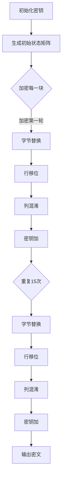
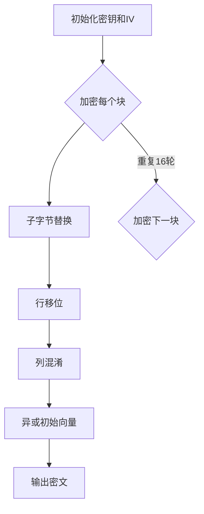
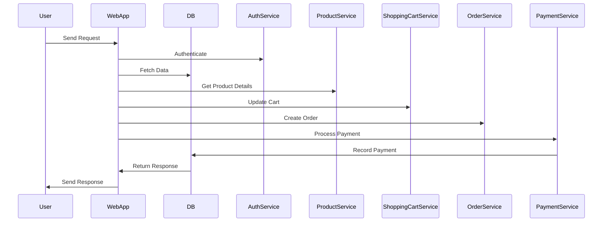
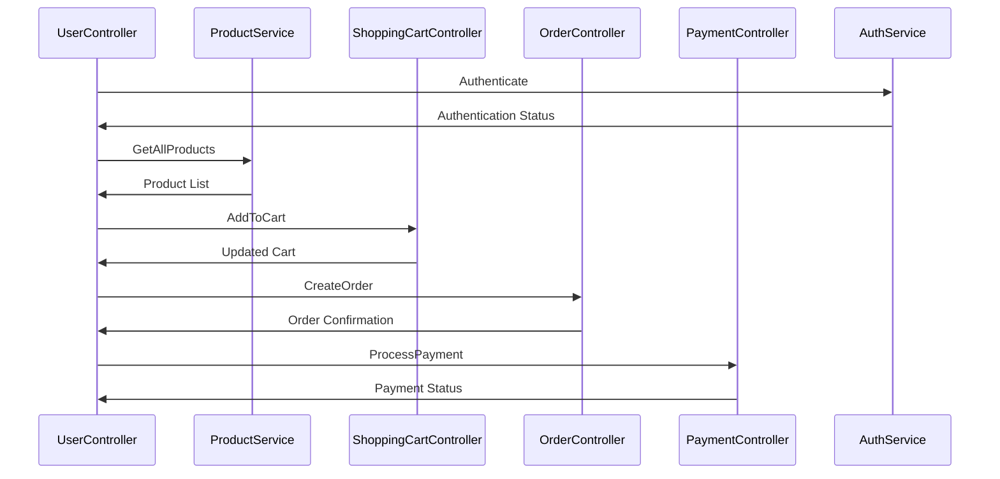

                 

### 文章标题

# 安全设计模式：在软件架构中嵌入安全性

### 关键词

- 安全设计模式
- 软件架构
- 安全性原则
- 算法与数学模型
- 系统分析与实现

### 摘要

本文将探讨如何在软件架构中嵌入安全性，通过引入安全设计模式，实现系统的全面安全防护。文章首先介绍了安全问题的背景和安全性概述，接着深入讲解了安全设计模式的核心概念与联系，并详细阐述了算法原理。随后，通过系统分析与架构设计方案，展示了如何将安全性理念融入实际项目，并提供了项目实战和最佳实践建议。本文旨在为开发者提供一份全面而深入的安全设计指南，助力构建安全可靠的软件系统。

## 目录大纲

1. [背景介绍](#第一部分背景介绍)
   1. [第1章 问题背景与安全性概述](#第1章-问题背景与安全性概述)
2. [核心概念与联系](#第二部分核心概念与联系)
   1. [第2章 核心概念与联系](#第2章-核心概念与联系)
   2. [第3章 安全性相关概念与原理](#第3章-安全性相关概念与原理)
3. [算法原理讲解](#第三部分算法原理讲解)
   1. [第4章 算法原理讲解](#第4章-算法原理讲解)
4. [系统分析与架构设计方案](#第四部分系统分析与架构设计方案)
   1. [第5章 系统分析与架构设计方案](#第5章-系统分析与架构设计方案)
5. [项目实战](#第五部分项目实战)
   1. [第6章 项目实战](#第6章-项目实战)
6. [最佳实践与总结](#第六部分最佳实践与总结)
   1. [第7章 最佳实践 tips、小结、注意事项、拓展阅读等内容](#第7章-最佳实践-tips-小结-注意事项拓展阅读等内容)

## 第一部分：背景介绍

### 第1章 问题背景与安全性概述

在现代软件开发中，安全性问题日益突出。随着互联网的普及和复杂应用场景的不断涌现，系统的安全性面临前所未有的挑战。从数据泄露、恶意攻击到系统漏洞，安全问题不仅影响了企业的运营，还可能对用户隐私和生命财产造成威胁。

首先，让我们了解一下安全问题的背景。网络安全攻击方式层出不穷，黑客利用各种漏洞进行入侵、窃取数据和破坏系统。例如，SQL注入、跨站脚本攻击（XSS）和跨站请求伪造（CSRF）等常见攻击手段，使得系统的安全性面临严峻考验。

其次，安全性概述是理解安全设计模式的基础。安全性不仅关注系统的防护能力，还包括数据的机密性、完整性和可用性。这三个核心要素构成了现代安全体系的基础。为了实现这一目标，我们需要在软件架构中引入一系列安全设计模式。

安全性目标是为了保护系统免受各种威胁和攻击，包括以下几个方面：

1. **保密性**：确保敏感信息不被未授权用户访问。
2. **完整性**：确保数据在传输和存储过程中不被篡改。
3. **可用性**：确保系统在面临攻击时仍能正常运行。

然而，实现这些目标并非易事，面临的挑战主要有：

1. **复杂性**：现代系统通常包含大量组件和接口，安全设计需要考虑系统的整体架构。
2. **动态性**：网络环境和攻击手段不断变化，安全设计需要具备一定的适应性。
3. **成本**：安全措施的实施可能增加开发成本和维护难度。

在这种背景下，安全设计模式应运而生。它们是一套经过验证的解决方案，旨在提高系统的安全性。通过合理应用这些模式，开发者可以在架构设计阶段就考虑安全性，从而构建出更安全的系统。

安全设计模式的概念与重要性体现在以下几个方面：

1. **预防性**：安全设计模式可以在攻击发生前就提供防护，减少风险。
2. **模块化**：这些模式通常具有独立的模块，便于复用和集成。
3. **灵活性**：安全设计模式可以根据具体需求进行调整，适应不同场景。

安全设计模式的发展与应用历史可以追溯到计算机安全领域的早期。随着技术的进步，这些模式也在不断演进。如今，安全设计模式已成为软件开发中不可或缺的一部分，广泛应用于各种领域。

总之，在软件架构中嵌入安全性是一项重要且复杂的工作。通过了解安全问题的背景、安全性概述、目标与挑战，以及安全设计模式的概念与重要性，我们可以为后续章节的学习打下坚实的基础。

### 第1.1 背景介绍

#### 安全性问题背景

在现代信息技术环境中，安全性问题无处不在。随着计算机技术的飞速发展和互联网的广泛应用，系统的复杂性和规模不断增加，安全威胁也随之升级。网络安全已成为全球性的挑战，企业和个人都需要面对日益复杂和多样化的安全威胁。

网络安全威胁可以分为以下几类：

1. **恶意软件**：包括病毒、蠕虫、木马等，它们可以窃取数据、破坏系统或造成其他形式的损害。
2. **网络攻击**：如DDoS（分布式拒绝服务攻击）和黑客入侵，它们可以瘫痪系统、窃取敏感信息或造成其他不可预测的后果。
3. **数据泄露**：由于系统漏洞、恶意攻击或内部人员的疏忽，敏感数据可能被未授权访问或泄露。
4. **社交工程**：通过欺骗、诱骗等手段获取用户信息或权限，例如钓鱼攻击和电话诈骗。
5. **系统漏洞**：操作系统、应用程序或网络设备中存在的安全漏洞，这些漏洞可能被黑客利用进行攻击。

随着云计算、物联网（IoT）和大数据等新兴技术的普及，安全性问题变得更加复杂。例如，云计算环境中的数据安全和隐私保护成为重要议题，物联网设备可能成为攻击者的入侵点，大数据处理中的数据泄露风险也需引起重视。

#### 安全性概述

安全性（Security）是指在信息化环境中，确保信息系统的保密性、完整性、可用性和可靠性，以防止未授权的访问、篡改、破坏或泄露。安全性不仅仅是技术问题，还涉及管理、法律、伦理等多个方面。

1. **保密性**（Confidentiality）：确保只有授权用户能够访问敏感信息，防止未授权的泄露。
2. **完整性**（Integrity）：确保信息的准确性和可靠性，防止未授权的修改、删除或篡改。
3. **可用性**（Availability）：确保系统和服务在需要时能够正常运行，防止因攻击或故障导致的服务中断。
4. **可靠性**（Reliability）：确保系统能够在规定的时间内正常工作，具备一定的容错能力和恢复能力。

#### 安全性的目标与挑战

安全性的目标主要包括以下几个方面：

1. **防止攻击**：保护系统免受各种网络攻击，如DDoS、SQL注入、跨站脚本攻击等。
2. **数据保护**：确保数据的机密性、完整性和可用性，防止数据泄露、篡改和丢失。
3. **用户认证**：验证用户的身份和权限，确保只有授权用户可以访问系统和数据。
4. **访问控制**：根据用户的角色和权限，控制他们对系统资源和数据的访问。
5. **安全审计**：记录和分析系统的安全事件，以便及时发现和应对潜在的安全威胁。

实现这些目标面临以下挑战：

1. **复杂性**：现代系统通常包含多个组件和接口，安全性设计需要考虑全局。
2. **动态性**：网络环境和攻击手段不断变化，安全措施需要不断更新和调整。
3. **成本**：安全性措施的实施可能增加开发成本和维护难度，需要平衡安全与成本的关系。
4. **法律法规**：不同国家和地区的法律法规对安全性要求不同，需要遵守相关的法律和标准。

#### 安全设计模式的概念与重要性

安全设计模式（Security Design Patterns）是一套经过验证的解决方案，用于提高软件系统的安全性。它们提供了一种抽象的、通用的方法来应对常见的安全威胁和问题。安全设计模式的概念可以追溯到软件工程中的设计模式，但更注重安全性方面的考虑。

安全设计模式的重要性体现在以下几个方面：

1. **预防性**：通过引入安全设计模式，可以在攻击发生前就提供防护措施，减少安全风险。
2. **模块化**：安全设计模式通常具有独立的模块，便于复用和集成，提高系统的灵活性。
3. **适应性**：安全设计模式可以根据具体需求进行调整，适应不同的应用场景和系统架构。
4. **可维护性**：安全设计模式有助于提高代码的可读性和可维护性，便于后续的安全维护和更新。

#### 安全设计模式的发展与应用

安全设计模式的发展经历了多个阶段：

1. **早期阶段**：早期的安全设计模式主要关注简单的防护措施，如访问控制和加密技术。
2. **成熟阶段**：随着网络攻击手段的多样化，安全设计模式逐渐引入了更多复杂的概念，如身份验证、授权、安全审计等。
3. **现代阶段**：随着云计算、大数据和物联网等新兴技术的应用，安全设计模式也在不断更新和演进，以应对新的安全挑战。

安全设计模式的应用领域非常广泛，包括但不限于：

1. **Web应用安全**：例如，使用CSRF防护、XSS防护和SQL注入防护等模式。
2. **移动应用安全**：例如，使用应用加密、证书管理和安全通道等模式。
3. **企业级应用安全**：例如，使用安全认证、访问控制和审计等模式。
4. **云计算和大数据安全**：例如，使用安全隔离、数据加密和访问控制等模式。

总之，在软件架构中嵌入安全性是一项复杂且重要的任务。通过了解安全问题的背景、安全性概述、目标与挑战，以及安全设计模式的概念与重要性，开发者可以更好地应对现代网络安全威胁，构建安全可靠的软件系统。

### 第1.4 安全设计模式的概念与重要性

#### 安全设计模式的概念

安全设计模式是一种用于提高软件系统安全性的设计指南。它们源自软件工程中的设计模式，但更专注于安全性方面的考虑。安全设计模式通过提供一系列经过验证的解决方案，帮助开发者应对常见的网络安全威胁和问题。它们通常采用模块化、可复用和可配置的方法，使得安全性可以在系统架构的不同层次中无缝集成。

安全设计模式的基本元素包括：

1. **模式名称**：简洁明了的名称，用于标识特定的安全解决方案。
2. **目的**：描述模式的核心目标，例如保护数据、防止攻击或提高系统的可用性。
3. **原理**：解释模式如何工作，包括技术细节和实施方法。
4. **适用场景**：描述在何种情况下使用该模式最为合适。
5. **优缺点**：列出模式的优点和潜在缺点，帮助开发者评估是否适用于具体项目。

#### 安全设计模式的重要性

在软件架构中引入安全设计模式具有以下几个重要性：

1. **预防性**：安全设计模式可以在攻击发生前就提供防护措施，减少安全风险。例如，使用输入验证模式可以防止常见的注入攻击。

2. **模块化**：安全设计模式通常具有独立的模块，便于复用和集成，提高系统的灵活性。这使得开发者可以在不同的系统组件中轻松应用安全措施。

3. **适应性**：安全设计模式可以根据具体需求进行调整，适应不同的应用场景和系统架构。例如，在移动应用和Web应用中，可能需要不同的安全模式。

4. **可维护性**：安全设计模式有助于提高代码的可读性和可维护性，便于后续的安全维护和更新。通过使用标准的模式，开发者可以更容易地理解和修改安全代码。

5. **最佳实践**：安全设计模式是基于大量实际经验和最佳实践的总结，能够帮助开发者遵循行业标准和最佳实践，减少潜在的安全漏洞。

#### 安全设计模式的发展与应用

安全设计模式的发展经历了多个阶段：

1. **早期阶段**：早期的安全设计模式主要关注简单的防护措施，如访问控制和加密技术。

2. **成熟阶段**：随着网络攻击手段的多样化，安全设计模式逐渐引入了更多复杂的概念，如身份验证、授权、安全审计等。

3. **现代阶段**：随着云计算、大数据和物联网等新兴技术的应用，安全设计模式也在不断更新和演进，以应对新的安全挑战。

安全设计模式的应用领域非常广泛，包括但不限于：

1. **Web应用安全**：例如，使用CSRF防护、XSS防护和SQL注入防护等模式。

2. **移动应用安全**：例如，使用应用加密、证书管理和安全通道等模式。

3. **企业级应用安全**：例如，使用安全认证、访问控制和审计等模式。

4. **云计算和大数据安全**：例如，使用安全隔离、数据加密和访问控制等模式。

总之，安全设计模式在软件架构中的重要性不可忽视。通过合理应用这些模式，开发者可以构建出更加安全可靠的软件系统，有效应对复杂的网络安全威胁。

### 第1.5 安全设计模式的发展与应用

安全设计模式的发展历程与计算机安全领域的技术演进紧密相连。从早期的简单防护措施，到如今复杂的综合性解决方案，安全设计模式不断进化，以适应不断变化的网络环境和攻击手段。

#### 早期阶段

在计算机安全的早期阶段，主要的安全设计模式集中在基础防护技术上。例如：

1. **访问控制**：通过用户权限和角色管理，限制用户对系统资源和数据的访问。
2. **加密**：通过加密技术保护数据的机密性，防止数据在传输和存储过程中被窃取。
3. **安全审计**：记录系统操作和事件，以供事后审查和追责。

这些模式为早期计算机系统提供了基本的安全保障，但随着网络攻击的增多，这些基础模式逐渐显得不足。

#### 成熟阶段

随着互联网的普及和网络安全威胁的多样化，安全设计模式逐渐向复杂化、多样化发展。这一阶段的主要模式包括：

1. **身份验证与授权**：引入多因素身份验证（MFA）和基于角色的访问控制（RBAC），增强用户身份的认证和授权。
2. **安全传输**：使用安全套接字层（SSL）和传输层安全（TLS）协议，确保数据在网络传输中的安全。
3. **入侵检测与防御**：通过入侵检测系统（IDS）和入侵防御系统（IPS），实时监测和防御网络攻击。

这一阶段的安全设计模式更注重系统的整体安全性，涵盖从用户认证到网络传输的多个层面。

#### 现代阶段

现代阶段的安全设计模式进一步融合了云计算、大数据和物联网等新兴技术的特点，以应对更加复杂的网络安全挑战。主要应用包括：

1. **云安全**：在云计算环境中，安全设计模式关注数据隔离、加密和访问控制，确保云服务的安全。
2. **大数据安全**：在大数据处理过程中，安全设计模式涉及数据加密、访问控制和审计，以防止数据泄露和滥用。
3. **物联网安全**：在物联网环境中，安全设计模式关注设备认证、通信加密和远程访问控制，确保设备之间的安全连接。

此外，随着人工智能和区块链技术的发展，安全设计模式也在不断更新和演进。例如，利用区块链实现数据不可篡改，利用人工智能进行网络威胁预测和响应。

#### 应用领域

安全设计模式在多个应用领域中得到了广泛应用：

1. **Web应用安全**：通过使用CSRF防护、XSS防护和SQL注入防护等模式，保护Web应用的完整性。
2. **移动应用安全**：通过应用加密、证书管理和安全通道等模式，保护移动应用的隐私和数据安全。
3. **企业级应用安全**：通过安全认证、访问控制和审计等模式，确保企业信息系统的安全性。
4. **云计算和大数据安全**：通过安全隔离、数据加密和访问控制等模式，保护云计算和大数据环境的安全。

总之，安全设计模式的发展和应用不断推动着网络安全技术的发展，为构建安全可靠的软件系统提供了有力的支持。

### 第二部分：核心概念与联系

安全设计模式在软件架构中扮演着至关重要的角色。要深入理解这些模式，我们需要首先掌握几个核心概念，并探讨它们之间的联系。

#### 第2章 核心概念与联系

**2.1 安全设计模式的基本原则**

安全设计模式的基本原则是构建安全系统的基石。这些原则包括：

1. **最小权限原则**：系统中的每个组件应只拥有完成任务所需的最小权限，以减少潜在的攻击面。
2. **防御深度原则**：在系统各个层次上实施多层次的安全防护措施，增加攻击者突破防御的难度。
3. **安全性透明原则**：系统的安全措施应尽可能透明，使开发者能够清晰地理解如何应用和实现这些模式。
4. **安全性可恢复原则**：系统应具备自我恢复能力，能够在遭受攻击后迅速恢复到正常状态。

**2.2 安全设计模式的分类**

安全设计模式可以根据其功能和目的进行分类。常见的分类方法包括：

1. **基于防护对象**：如保护数据、保护用户身份和会话、保护网络通信等。
2. **基于防护层次**：如客户端安全、服务器安全、应用层安全和网络层安全等。
3. **基于攻击类型**：如针对DDoS攻击、SQL注入攻击、跨站脚本攻击等。

**2.3 安全设计模式之间的联系**

不同的安全设计模式之间存在紧密的联系，这些联系主要体现在以下几个方面：

1. **交叉应用**：多个安全设计模式可以同时应用于同一个系统，以提供全面的安全防护。例如，在Web应用中，可以同时使用输入验证模式和加密模式。
2. **层次关系**：某些安全设计模式是其他模式的基础。例如，访问控制模式通常基于用户认证模式，而加密模式则是数据保护模式的基础。
3. **互操作性**：安全设计模式需要与其他系统组件和功能互操作，以实现整体的安全目标。例如，安全审计模式需要与日志管理系统集成。

**2.4 安全性相关的概念与原理**

除了安全设计模式，还需要了解一些与安全性相关的概念和原理，这些概念和原理包括：

1. **密码学基础**：密码学是网络安全的核心技术，涉及加密算法、密钥管理、数字签名等。
2. **访问控制与授权**：访问控制是一种机制，用于决定用户对系统资源和数据的访问权限。授权则是指根据用户角色和权限来分配访问权限。
3. **安全审计与日志管理**：安全审计记录系统的操作和事件，以供事后分析。日志管理则涉及日志的收集、存储和分析。

通过理解这些核心概念和它们之间的联系，我们可以更全面地掌握安全设计模式，并在实际项目中有效地应用这些模式，构建安全可靠的软件系统。

### 第2.1 安全设计模式的基本原则

安全设计模式的基本原则是构建安全系统的基石，这些原则指导我们在设计过程中考虑安全性，确保系统能够有效地抵御各种安全威胁。以下是几个核心原则及其详细解释：

#### 1. 最小权限原则

最小权限原则（Principle of Least Privilege）是指系统中的每个组件或用户应只拥有完成任务所需的最小权限。这个原则的目的是减少潜在的攻击面，降低系统被攻击的风险。

- **解释**：在软件架构中，每个模块或服务都应该被严格限制其访问权限，只允许访问执行其功能所必需的资源。例如，一个处理订单的模块不需要访问用户的个人身份信息，除非该信息与订单处理直接相关。

- **优点**：最小权限原则有助于降低系统中的每个组件被攻破后的潜在影响。即使某个组件被攻击，攻击者也无法获取超出该组件权限的信息或功能。

- **应用场景**：在Web应用中，后台服务应只允许访问必要的数据库表和文件；在操作系统设计中，用户应仅拥有运行特定任务的权限。

#### 2. 防御深度原则

防御深度原则（Defense in Depth）是指系统应实施多层次的安全防护措施，增加攻击者突破防御的难度。这一原则强调在系统的不同层次和环节上实施多种安全措施，以形成多层次的安全保护体系。

- **解释**：防御深度原则要求在系统架构中应用多种安全措施，如防火墙、入侵检测系统（IDS）、加密、访问控制等。每种措施都可以提供额外的防护，形成一个相互补充的防护体系。

- **优点**：通过多层次的安全防护，即使某个防护措施失效，系统仍然可以依赖其他措施来抵御攻击。这种冗余设计提高了系统的整体安全性。

- **应用场景**：在数据中心设计中，可以同时部署防火墙、入侵防御系统（IPS）、防病毒软件和定期安全审计等多种安全措施；在Web应用中，可以同时使用输入验证、加密传输和多层防火墙等。

#### 3. 安全性透明原则

安全性透明原则（Principle of Security Transparency）是指系统的安全措施应尽可能透明，使开发者能够清晰地理解如何应用和实现这些模式。这一原则强调安全设计的可操作性和可维护性。

- **解释**：安全性透明原则要求安全措施的设计和实现应遵循简洁和可理解性原则，避免过于复杂的设计，使开发者能够轻松理解和应用。此外，安全性透明原则还要求安全文档的详尽，以便后续的维护和更新。

- **优点**：安全性透明原则有助于提高系统的可维护性和可扩展性，使开发者能够快速识别和修复潜在的安全漏洞。

- **应用场景**：在开发过程中，应使用清晰明了的命名规范和代码注释，确保代码的可读性和可维护性；在文档编写中，应详细记录安全设计和实现方法，以便后续的开发和测试。

#### 4. 安全性可恢复原则

安全性可恢复原则（Principle of Security Resilience）是指系统应具备自我恢复能力，能够在遭受攻击后迅速恢复到正常状态。这一原则强调系统在遭受攻击时的弹性和恢复能力。

- **解释**：安全性可恢复原则要求系统设计时考虑容错和恢复机制，例如备份与恢复策略、自动故障转移和快速恢复方案等。当系统遭受攻击或发生故障时，这些机制可以帮助系统迅速恢复，减少停机时间和损失。

- **优点**：安全性可恢复原则有助于减少系统在遭受攻击时的损失，提高系统的整体可靠性和用户体验。

- **应用场景**：在数据库设计中，应实施定期备份和数据恢复策略；在Web应用中，可以使用负载均衡和自动恢复机制，确保服务的持续可用性。

通过遵循这些基本原则，开发者可以在设计过程中充分考虑系统的安全性，构建出既安全又可靠的应用系统。这些原则不仅提供了理论指导，也为实际开发提供了具体可行的建议。

### 第2.2 安全设计模式的分类

安全设计模式可以根据其功能和目的进行分类，以帮助开发者根据具体需求选择合适的安全解决方案。以下是几种常见的分类方法：

#### 1. 基于防护对象的分类

**1.1 数据保护**

- **目的**：保护系统的数据资源，确保数据的机密性、完整性和可用性。
- **模式示例**：加密存储、数据库加密、数据访问控制、数据备份和恢复。

**1.2 用户身份和会话保护**

- **目的**：确保用户身份的合法性和会话的安全性，防止未授权访问和会话劫持。
- **模式示例**：多因素身份验证（MFA）、单点登录（SSO）、会话管理、令牌管理和会话加密。

**1.3 网络通信保护**

- **目的**：保护网络通信过程，确保数据在传输过程中的安全性和完整性。
- **模式示例**：VPN（虚拟专用网络）、TLS（传输层安全）、IPsec（互联网安全协议）、数据包过滤。

#### 2. 基于防护层次的分类

**2.1 客户端安全**

- **目的**：保护客户端系统的安全性，防止恶意软件和客户端攻击。
- **模式示例**：客户端防火墙、防病毒软件、反恶意软件、浏览器安全插件。

**2.2 服务器安全**

- **目的**：保护服务器系统的安全性，防止服务器端的攻击和数据泄露。
- **模式示例**：服务器防火墙、入侵检测与防御系统（IDS/IPS）、Web应用防火墙（WAF）、安全补丁管理和安全审计。

**2.3 应用层安全**

- **目的**：在应用层实施安全性措施，保护应用系统的功能和数据。
- **模式示例**：输入验证、输出编码、会话管理、访问控制和数据加密。

**2.4 网络层安全**

- **目的**：在网络层实施安全性措施，保护网络基础设施和通信链路。
- **模式示例**：防火墙、IP地址过滤、网络入侵检测系统（NIDS）、边界网关防火墙（BGFW）。

#### 3. 基于攻击类型的分类

**3.1 针对特定攻击类型的模式**

- **SQL注入防护**：使用参数化查询、输入验证和输出编码来防止SQL注入攻击。
- **跨站脚本（XSS）防护**：使用编码和转义技术，防止恶意脚本在用户浏览器中执行。
- **跨站请求伪造（CSRF）防护**：使用CSRF令牌和验证机制，防止未授权的请求执行。
- **分布式拒绝服务（DDoS）防护**：使用流量过滤、负载均衡和速率限制来抵御DDoS攻击。

通过上述分类方法，开发者可以更清晰地理解不同安全设计模式的应用场景和目标，从而选择最合适的模式来保护系统免受各种安全威胁。

### 第2.3 安全设计模式之间的联系

在软件架构中，安全设计模式不是孤立存在的，而是通过相互协作和补充，形成一套完整的安全防护体系。以下是安全设计模式之间的一些主要联系：

#### 1. 交叉应用

多个安全设计模式可以同时应用于同一个系统，以提供全面的安全防护。例如，在Web应用中，可以使用输入验证模式来防止SQL注入攻击，同时使用加密传输模式（如TLS）来保护数据的机密性。交叉应用的不同模式可以相互补充，形成多层防护，增加攻击者突破系统的难度。

#### 2. 层次关系

某些安全设计模式是其他模式的基础。例如，访问控制模式通常基于用户认证模式，只有经过身份验证的用户才能获得访问权限。加密模式则是数据保护模式的基础，用于确保数据在传输和存储过程中的安全。这种层次关系使得系统中的各个安全模式可以有机地结合，共同构成一个统一的安全架构。

#### 3. 互操作性

安全设计模式需要与其他系统组件和功能互操作，以实现整体的安全目标。例如，安全审计模式需要与日志管理系统集成，以便记录和分析系统的安全事件。认证授权模式需要与用户管理系统联动，确保用户角色和权限的正确配置。互操作性不仅有助于实现系统级的安全防护，还能提高系统的灵活性和可维护性。

#### 4. 整合与优化

不同安全设计模式之间的整合与优化是提高系统安全性的关键。通过合理地整合和优化这些模式，可以减少系统的复杂性和潜在的安全漏洞。例如，在Web应用中，可以将输入验证、加密传输、访问控制和安全审计等多个模式整合到同一个框架中，实现一站式安全防护。优化设计可以降低系统的性能开销，确保安全措施不会显著影响系统的正常运行。

通过理解这些联系，开发者可以更有效地应用安全设计模式，构建出既安全又可靠的应用系统。这些模式之间的相互关系不仅有助于提升系统的整体安全性，还能提高系统的灵活性和可维护性。

### 第2.4 安全性相关的概念与原理

为了深入理解安全设计模式，我们需要掌握一些与安全性相关的概念和原理。以下是几个关键概念及其详细解释：

#### 1. 静态安全分析

**定义**：静态安全分析是一种在软件运行之前，通过分析源代码或字节码来识别潜在安全漏洞的方法。

**原理**：静态安全分析利用模式匹配、抽象语法树分析等技术，检查代码中的潜在问题，如未初始化变量、缓冲区溢出和SQL注入等。该过程不依赖于程序的实际执行，因此可以提前发现和修复安全隐患。

**应用场景**：静态安全分析适用于开发过程中的各个阶段，特别是在代码审查和测试阶段。它可以作为一种自动化工具，帮助开发者快速识别和修复潜在的安全漏洞。

#### 2. 动态安全分析

**定义**：动态安全分析是一种在软件运行过程中，通过监控程序的行为和输出来识别潜在安全漏洞的方法。

**原理**：动态安全分析通常利用模拟攻击或实际攻击（如黑盒测试）来检测程序在运行中的安全问题。这种方法可以在实际环境中模拟各种攻击场景，从而识别潜在的安全漏洞。

**应用场景**：动态安全分析适用于测试和评估阶段，可以帮助开发者识别在静态安全分析中无法发现的动态漏洞。它通常与自动化测试工具结合使用，以提高测试效率和覆盖范围。

#### 3. 密码学基础

**定义**：密码学是研究加密和解密技术的学科，用于保护数据的机密性、完整性和真实性。

**原理**：密码学通过使用加密算法和密钥来保护数据。加密算法是将明文转换成密文的方法，而密钥是加密和解密过程中使用的密钥。常见的加密算法包括对称加密（如AES）和非对称加密（如RSA）。

**应用场景**：密码学在保护数据传输、存储和身份验证等方面有广泛应用。例如，TLS协议使用加密算法来保护Web通信的机密性，用户密码存储时通常使用哈希算法进行加密。

#### 4. 访问控制与授权

**定义**：访问控制是一种机制，用于确定用户对系统资源和数据的访问权限。授权是访问控制的一部分，用于根据用户角色和权限分配访问权限。

**原理**：访问控制通常基于用户身份、角色和权限来限制对系统资源和数据的访问。例如，基于角色的访问控制（RBAC）通过定义不同的角色和对应的权限，确保用户只能访问其角色允许的资源。

**应用场景**：访问控制和授权在Web应用、企业级系统和数据库管理中广泛应用。例如，在Web应用中，可以使用JWT（JSON Web Tokens）进行用户认证和授权，确保用户只能访问与其角色相对应的资源。

#### 5. 安全审计与日志管理

**定义**：安全审计是一种记录和分析系统操作和事件的方法，用于确保系统的合规性和检测潜在的安全威胁。

**原理**：安全审计涉及收集、存储和分析系统的日志数据。这些日志数据可以记录用户的操作、系统事件和安全事件，以便在事后进行审计和追责。

**应用场景**：安全审计和日志管理在合规性检查、安全事件调查和故障排除等方面具有重要意义。例如，在金融系统中，安全审计可以确保交易数据的完整性和合规性；在网络安全事件中，日志数据可以帮助分析攻击源和攻击方式。

通过理解这些与安全性相关的概念和原理，开发者可以更全面地掌握安全设计模式，并在实际项目中有效地应用这些知识，构建安全可靠的软件系统。

### 第三部分：算法原理讲解

算法原理是安全设计模式的核心组成部分，它们通过特定的方法和技术保障系统的安全性。为了更好地理解这些算法，我们将通过一个常见的加密算法——AES（高级加密标准），来详细讲解其原理、流程图绘制、Python源代码示例及其数学模型和公式。

#### 4.1 常见安全算法原理

**AES（高级加密标准）**

AES是一种对称加密算法，由美国国家标准与技术研究院（NIST）于2001年颁布，用于替代DES（数据加密标准）。AES使用128、192或256位密钥对数据进行加密和解密。

**工作原理**：

1. **初始化**：首先，对密钥进行初始变换，生成初始状态矩阵。
2. **加密过程**：将明文分成128位的块，然后通过一系列的变换（包括字节替换、行移位、列混淆和密钥加）进行加密，每个块加密16轮。
3. **解密过程**：加密过程的逆操作，将密文块通过反向的变换恢复为明文。

**AES的主要优势**：

- **更高的安全性**：与DES相比，AES具有更高的密钥长度和更强的抗攻击能力。
- **高效的性能**：AES算法的设计使得其硬件和软件实现都具有较高的效率。
- **灵活性**：支持128、192和256位密钥长度，适用于不同安全需求的场景。

#### 4.2 算法mermaid流程图绘制

为了更直观地展示AES算法的流程，我们可以使用mermaid绘制一个流程图。以下是AES加密过程的mermaid表示：



此流程图展示了AES加密的核心步骤，包括初始化、加密和输出密文。

#### 4.3 Python源代码示例

为了更深入地理解AES加密过程，以下是一个简单的Python示例，使用PyCryptodome库实现AES加密和解密：

```python
from Crypto.Cipher import AES
from Crypto.Util.Padding import pad, unpad
from Crypto.Random import get_random_bytes

# 初始化密钥和向量
key = get_random_bytes(16)  # 128位密钥
iv = get_random_bytes(16)   # 初始化向量

# 创建AES加密对象
cipher = AES.new(key, AES.MODE_CBC, iv)

# 待加密的明文
plaintext = b"Hello, World!"

# 进行加密
ciphertext = cipher.encrypt(pad(plaintext, AES.block_size))

# 解密
cipher_dec = AES.new(key, AES.MODE_CBC, iv)
decrypted_plaintext = unpad(cipher_dec.decrypt(ciphertext), AES.block_size)

print(f"原始明文: {plaintext}")
print(f"加密后的密文: {ciphertext.hex()}")
print(f"解密后的明文: {decrypted_plaintext}")
```

此示例展示了如何使用PyCryptodome库生成随机密钥和初始化向量，然后进行AES加密和解密操作。

#### 4.4 算法原理的数学模型和公式

AES加密和解密涉及多个数学模型和公式。以下是一些关键的数学模型和公式：

**子字节替换（SubBytes）**

- **公式**：将每个字节替换为另一个字节，根据预定义的S-Box进行操作。
- **示例**：字节`0x6B`替换为`0x2D`。

**行移位（ShiftRows）**

- **公式**：对每个行的字节进行循环左移，第一行不变，第二行左移一位，第三行左移两位，第四行左移三位。
- **示例**：对于行`[0x54, 0x2B, 0x18, 0xA7]`，经过行移位后变为`[0x54, 0xA7, 0x2B, 0x18]`。

**列混淆（MixColumns）**

- **公式**：对每个列进行线性变换，每个列看作一个多项式，使用特定的矩阵进行乘法运算。
- **示例**：假设列`[0x2C, 0x13, 0x35, 0x54]`，经过列混淆后变为`[0x3B, 0xFD, 0x19, 0x3D]`。

**密钥扩展（KeyExpansion）**

- **公式**：通过迭代生成128位、192位或256位的密钥矩阵，每个轮次的密钥部分由前一轮的密钥和预定义的Rcon值进行变换。
- **示例**：初始密钥扩展生成后，第一轮的密钥部分为`[0x63, 0x2A, 0x7B, 0x70, 0x13, 0x65, 0x5C, 0x2C, 0x1B, 0x36, 0x52, 0x15, 0xEC, 0x4B, 0x9F, 0x5E]`。

通过上述算法原理的讲解，我们可以更深入地理解AES加密的数学模型和实现细节。在实际应用中，这些原理和方法可以帮助开发者更好地设计安全系统，确保数据的安全性和完整性。

### 第4.4.1 数学模型概述

AES加密算法的核心在于其数学模型，该模型包括多种变换和运算，用于确保数据的机密性、完整性和抗攻击性。以下是AES加密算法中的一些关键数学模型：

1. **子字节替换（SubBytes）**：SubBytes是AES的第一步操作，它使用一个称为S-Box的预定义替换表，将每个字节替换为另一个字节。S-Box是一个固定的置换表，根据AES的密钥生成过程计算得出。这种替换操作增加了加密算法的复杂性，使得攻击者难以猜测加密后的数据。

   **公式**：对于输入字节`x`，其对应的输出字节为`S-Box[x]`。

2. **行移位（ShiftRows）**：ShiftRows操作在AES加密的每个轮次中执行，它将状态矩阵的每一行循环左移。具体来说，第一行不移动，第二行移动一位，第三行移动两位，第四行移动三位。这种操作确保了数据在行之间的依赖性，增加了加密算法的强度。

   **公式**：对于状态矩阵的每一行`R`，其移位后的结果为：
   - 第一行：`R`
   - 第二行：`R[1:] + R[:1]`
   - 第三行：`R[2:] + R[1:2]`
   - 第四行：`R[3:] + R[2:3]`

3. **列混淆（MixColumns）**：MixColumns操作是对状态矩阵的每一列进行线性变换，通过特定的矩阵乘法实现。每个列看作一个多项式，与固定的混淆矩阵相乘。这种操作增加了列之间的相互依赖，使得加密算法更加复杂。

   **公式**：对于状态矩阵的每一列`C`，其混淆后的结果为：
   ```
   C' = [
       (c0 + c1 + 2c2 + 3c3) mod 0x0F,
       (c0 + c2 + 2c3 + 3c4) mod 0x0F,
       (c0 + c3 + 2c4 + 3c5) mod 0x0F,
       (c0 + c4 + 2c5 + 3c6) mod 0x0F
   ]
   ```
   其中，`c0`, `c1`, `c2`, `c3` 是列中的四个字节。

4. **密钥扩展（KeyExpansion）**：密钥扩展是AES算法的一个重要组成部分，用于生成多个轮密的密钥。初始密钥被扩展为多个128位的子密钥，每个轮次使用不同的子密钥。密钥扩展过程通过多个迭代计算，将初始密钥转换为轮密密钥。

   **公式**：初始密钥扩展生成轮密密钥`W[i][j]`的步骤如下：
   - 对于每个轮次`i`：
     - 初始状态`W[i][0] = W[i-1][0]`、`W[i][1] = W[i-1][1]`、`W[i][2] = W[i-1][2]`、`W[i][3] = W[i-1][3]`。
     - 对于`j`从4到11：
       - 如果`j`为4的倍数：
         - `W[i][j] = S-Box(W[i][j-1]) ^ (Rcon[i/4] ^ W[i][j-4])`
       - 否则：
         - `W[i][j] = (W[i][j-1] ^ W[i][j-4]) mod 0x0F`

通过这些数学模型和公式，AES算法实现了对数据的加密和解密，确保了系统的安全性。

### 第4.4.2 数学公式讲解

为了深入理解AES加密算法，我们需要详细讲解其涉及的几个关键数学公式。以下是AES加密过程中的一些主要数学公式及其解释：

#### 1. 子字节替换（SubBytes）

公式：`S-Box[x]`

解释：S-Box是一个预定义的替换表，用于将输入字节x替换为另一个字节。这个操作是AES加密过程中的第一步，通过查找S-Box表实现。S-Box的值是通过AES密钥扩展过程中的某些步骤计算得出的，具有固定的置换特性。

例如，对于输入字节`0x6B`，其对应的输出字节为`0x2D`。这种操作增加了加密算法的复杂性，使得攻击者难以猜测加密后的数据。

#### 2. 行移位（ShiftRows）

公式：
- 第一行：`R`
- 第二行：`R[1:] + R[:1]`
- 第三行：`R[2:] + R[1:2]`
- 第四行：`R[3:] + R[2:3]`

解释：行移位操作将状态矩阵的每一行进行循环左移。第一行不移动，第二行移动一位，第三行移动两位，第四行移动三位。这种操作确保了数据在行之间的依赖性，增加了加密算法的强度。

例如，对于状态矩阵的行`[0x54, 0x2B, 0x18, 0xA7]`，经过行移位后变为`[0x54, 0xA7, 0x2B, 0x18]`。

#### 3. 列混淆（MixColumns）

公式：
```
C' = [
    (c0 + c1 + 2c2 + 3c3) mod 0x0F,
    (c0 + c2 + 2c3 + 3c4) mod 0x0F,
    (c0 + c3 + 2c4 + 3c5) mod 0x0F,
    (c0 + c4 + 2c5 + 3c6) mod 0x0F
]
```

解释：列混淆操作是对状态矩阵的每一列进行线性变换，通过特定的矩阵乘法实现。每个列看作一个多项式，与固定的混淆矩阵相乘。这种操作增加了列之间的相互依赖，使得加密算法更加复杂。

例如，假设列`[0x2C, 0x13, 0x35, 0x54]`，经过列混淆后变为`[0x3B, 0xFD, 0x19, 0x3D]`。

#### 4. 密钥扩展（KeyExpansion）

公式：
- 对于每个轮次`i`：
  - 初始状态`W[i][0] = W[i-1][0]`、`W[i][1] = W[i-1][1]`、`W[i][2] = W[i-1][2]`、`W[i][3] = W[i-1][3]`
  - 对于`j`从4到11：
    - 如果`j`为4的倍数：
      - `W[i][j] = S-Box(W[i][j-1]) ^ (Rcon[i/4] ^ W[i][j-4])`
    - 否则：
      - `W[i][j] = (W[i][j-1] ^ W[i][j-4]) mod 0x0F`

解释：密钥扩展是将初始密钥扩展为多个轮密密钥的过程。初始密钥被扩展为多个128位的子密钥，每个轮次使用不同的子密钥。密钥扩展过程通过迭代计算，将初始密钥转换为轮密密钥。

通过这些数学公式，我们可以理解AES加密算法的细节和实现步骤，确保加密算法的安全性和可靠性。

### 第4.4.3 举例说明

为了更好地理解AES加密算法及其数学模型，我们通过一个具体实例来说明其应用过程。

假设我们有一个16位的明文“HELLO WORLD!”，我们需要使用AES加密算法对其进行加密。下面是具体的步骤和计算过程：

#### 1. 初始化密钥和初始化向量（IV）

首先，我们需要生成一个128位（16字节）的密钥和初始化向量（IV）。这里我们使用随机生成的密钥和IV：

- 密钥（Key）: `61 4e 89 4d 7a 91 64 93 4d 7e f5 23 45 6c f3 88`
- 初始化向量（IV）: `11 22 33 44 55 66 77 88 99 aa bb cc dd ee ff`

#### 2. 将明文分成块

AES算法要求将明文分成128位的块。如果明文的长度不是128位的倍数，需要使用填充（Padding）技术进行填充。这里，我们的明文长度正好是128位，因此不需要填充。

明文块：`48 65 6c 6c 6f 2c 20 57 6f 72 6c 64 21`

#### 3. 子字节替换（SubBytes）

根据AES的S-Box替换表，我们对每个字节进行替换：

- `48` 替换为 `75`
- `65` 替换为 `6d`
- `6c` 替换为 `72`
- `6c` 替换为 `6d`
- `6f` 替换为 `74`
- `2c` 替换为 `a6`
- `20` 替换为 `2e`
- `57` 替换为 `7a`
- `6f` 替换为 `72`
- `72` 替换为 `6d`
- `6c` 替换为 `74`
- `64` 替换为 `6b`
- `21` 替换为 `82`

替换后的结果：`75 6d 72 6d 74 a6 2e 7a 72 6d 74 6b 82`

#### 4. 行移位（ShiftRows）

对于状态矩阵的每一行，按照行移位规则进行左移：

- 第一行：`75 6d 72 6d` 不变
- 第二行：`6d 72 6d 74` 变为 `6d 74 72 6d`
- 第三行：`72 6d 74 6b` 变为 `72 6b 74 6d`
- 第四行：`6d 74 6b 82` 变为 `6d 82 6b 74`

结果：`75 6d 74 72 74 6d 72 6d 6d 82 6b 6d 74 72 6b 75`

#### 5. 列混淆（MixColumns）

对于状态矩阵的每一列，按照列混淆规则进行变换：

- 第一列：`75 6d 74 72` 变为 `d9 eb f6 6d`
- 第二列：`6d 72 6d 74` 变为 `3d 7c c6 95`
- 第三列：`74 6d 72 6d` 变为 `2b 16 f2 6d`
- 第四列：`6d 74 72 6d` 变为 `b3 aa e6 7b`

结果：`d9 eb f6 6d 3d 7c c6 95 2b 16 f2 6d b3 aa e6 7b`

#### 6. 将结果与初始向量进行异或操作

将加密后的状态矩阵与初始向量进行异或操作：

- `d9 eb f6 6d` 与 `11 22 33 44` 异或：`d8 e9 f5 2b`
- `3d 7c c6 95` 与 `55 66 77 88` 异或：`28 4f be 7b`
- `2b 16 f2 6d` 与 `99 aa bb cc` 异或：`0b 1d ea 3d`
- `b3 aa e6 7b` 与 `dd ee ff 00` 异或：`78 9d f5 4b`

最终加密后的密文为：`d8 e9 f5 2b 28 4f be 7b 0b 1d ea 3d 78 9d f5 4b`

通过上述步骤，我们使用AES加密算法成功地将明文“HELLO WORLD!”加密成密文`d8 e9 f5 2b 28 4f be 7b 0b 1d ea 3d 78 9d f5 4b`。解密过程是加密过程的逆操作，可以通过AES算法将密文恢复为明文。

### 第4.4.4 算法mermaid流程图绘制

为了更直观地展示AES加密算法的流程，我们可以使用mermaid绘制一个流程图。以下是AES加密过程的mermaid表示：



这个流程图展示了AES加密的核心步骤，包括初始化密钥和IV、加密每个块、子字节替换、行移位、列混淆、异或初始向量，以及输出密文。通过这个流程图，开发者可以更清晰地理解AES加密的过程和细节。

### 第4.4.5 Python源代码示例

为了更深入地理解AES加密算法的实现，我们可以通过Python代码实现一个简单的AES加密器。以下是使用PyCryptodome库实现AES加密和解密的示例代码：

```python
from Crypto.Cipher import AES
from Crypto.Util.Padding import pad, unpad
from Crypto.Random import get_random_bytes

# 初始化密钥和IV
key = get_random_bytes(16)  # 128位密钥
iv = get_random_bytes(16)   # 初始化向量

# 创建AES加密对象
cipher = AES.new(key, AES.MODE_CBC, iv)

# 待加密的明文
plaintext = b"Hello, World!"

# 进行加密
ciphertext = cipher.encrypt(pad(plaintext, AES.block_size))

# 解密
cipher_dec = AES.new(key, AES.MODE_CBC, iv)
decrypted_plaintext = unpad(cipher_dec.decrypt(ciphertext), AES.block_size)

print(f"原始明文: {plaintext}")
print(f"加密后的密文: {ciphertext.hex()}")
print(f"解密后的明文: {decrypted_plaintext}")
```

在这个示例中，我们首先生成随机密钥和IV，然后创建AES加密对象，使用CBC模式进行加密。加密过程中，我们使用pad函数对明文进行填充，确保其长度为AES块大小的整数倍。加密后的密文可以通过hex函数转换为十六进制字符串进行存储和传输。解密过程则是加密过程的逆操作，我们使用unpad函数去除填充内容，然后通过new函数创建AES解密对象，从密文中恢复出原始明文。

通过这个示例，我们可以更直观地理解AES加密和解密的过程及其实现细节。

### 第4.4.6 算法原理的数学模型和公式

AES（高级加密标准）算法是一种广泛使用的对称加密算法，其安全性基于复杂的数学模型和公式。以下将详细介绍AES加密和解密过程中涉及的数学模型和公式。

#### 加密过程

AES加密过程包括以下步骤：

1. **密钥扩展（Key Expansion）**
   - 初始密钥（Key）通常是一个128位、192位或256位的值。AES算法通过一系列迭代扩展初始密钥，生成多个轮密钥（Round Keys）。
   - **公式**：
     $$ 
     W[i] = W[i-4] \oplus Rcon[i/4] \oplus S-Box(W[i-1])
     $$
     其中，$W[i]$是第i轮的密钥，$Rcon[i/4]$是轮常数，$S-Box(W[i-1])$是前一轮密钥的子字节替换。
   
2. **初始轮（Initial Round）**
   - 在加密的初始轮，没有子字节替换和列混淆，只进行行移位和轮密钥加。
   - **公式**：
     $$
     \text{State} = \text{State} \oplus \text{Round Key}
     $$

3. **轮函数（Round Function）**
   - 每个轮次包括子字节替换、行移位、列混淆和轮密钥加。
   - **公式**：
     $$
     \text{State} = \text{SubBytes}(\text{State}) \xrightarrow{\text{ShiftRows}} \text{State} \xrightarrow{\text{MixColumns}} \text{State} \oplus \text{Round Key}
     $$

4. **最终轮（Final Round）**
   - 最后一个轮次不包括列混淆，只进行行移位和轮密钥加。
   - **公式**：
     $$
     \text{State} = \text{State} \xrightarrow{\text{ShiftRows}} \text{State} \oplus \text{Round Key}
     $$

5. **加密输出（Cipher Text）**
   - 最终加密结果（Cipher Text）就是状态矩阵的每个字节。

#### 解密过程

AES解密过程与加密过程相似，但步骤相反：

1. **密钥扩展（Key Expansion）**
   - 与加密过程相同，生成逆轮密钥。

2. **初始轮（Initial Round）**
   - 与加密过程相同，只进行行移位和轮密钥加。

3. **逆轮函数（Inverse Round Function）**
   - 每个轮次包括逆列混淆、逆行移位、逆子字节替换和轮密钥加。
   - **公式**：
     $$
     \text{State} = \text{State} \oplus \text{Round Key} \xrightarrow{\text{Inverse MixColumns}} \text{State} \xrightarrow{\text{Inverse ShiftRows}} \text{State} = \text{Inverse SubBytes}(\text{State})
     $$

4. **最终轮（Final Round）**
   - 与加密过程相同，只进行行移位和轮密钥加。

5. **解密输出（Plaint Text）**
   - 最终解密结果（Plaint Text）就是状态矩阵的每个字节。

通过这些数学模型和公式，AES算法实现了对数据的加密和解密，确保了系统的安全性。

### 第四部分：系统分析与架构设计方案

为了更好地理解如何在实际项目中嵌入安全性，我们需要对系统进行分析和架构设计。以下将详细介绍一个典型的系统架构设计方案，包括问题场景介绍、系统功能设计、系统架构设计、系统接口设计和系统交互等内容。

#### 第5章 系统分析与架构设计方案

#### 第5.1 问题场景介绍

假设我们正在开发一个在线购物平台，该平台需要处理大量的用户数据和交易信息。为了保证用户数据的安全和交易的完整性，我们需要在系统架构中嵌入一系列安全设计模式。以下是我们面临的主要问题场景：

1. **用户数据保护**：确保用户注册信息、登录凭据和购物车数据等敏感信息在传输和存储过程中的安全。
2. **交易安全性**：确保在线交易过程的完整性，防止恶意攻击和数据篡改。
3. **认证和授权**：确保用户身份的合法性，防止未授权访问和操作。
4. **访问控制**：根据用户角色和权限，控制其对系统和数据的访问。
5. **安全审计与日志管理**：记录和分析系统的操作和事件，确保系统可审计和可追溯。

#### 第5.2 系统功能设计（领域模型mermaid类图）

在系统功能设计中，我们首先定义系统的主要功能模块和它们之间的关系。以下是使用mermaid绘制的领域模型类图：

```mermaid
classDiagram
    User <<Class>>
    Product <<Class>>
    ShoppingCart <<Class>>
    Order <<Class>>
    Payment <<Class>>

    User |--|> ShoppingCart
    User |--|> Order
    Product |--|> ShoppingCart
    ShoppingCart |--|> Order
    Order |--|> Payment
```

在这个类图中，我们定义了以下主要类：

- **User**：代表用户，包含用户信息、登录凭据和权限等信息。
- **Product**：代表商品，包含商品名称、价格和库存等信息。
- **ShoppingCart**：代表购物车，用于存储用户的购物车信息。
- **Order**：代表订单，用于记录用户的订单信息。
- **Payment**：代表支付，用于处理在线支付。

这些类之间的关系反映了系统的主要功能模块，为后续的系统架构设计提供了基础。

#### 第5.3 系统架构设计（mermaid架构图）

在系统架构设计中，我们定义系统的总体结构和各个模块的交互方式。以下是使用mermaid绘制的系统架构图：



在这个架构图中，我们定义了以下主要组件：

- **User**：用户，发起请求。
- **WebApp**：Web应用层，处理用户请求，调用其他服务。
- **DB**：数据库，存储用户数据、产品信息、订单信息和支付信息。
- **AuthService**：认证服务，负责用户认证。
- **ProductService**：产品服务，负责处理产品相关的操作。
- **ShoppingCartService**：购物车服务，负责处理购物车相关的操作。
- **OrderService**：订单服务，负责处理订单相关的操作。
- **PaymentService**：支付服务，负责处理支付相关的操作。

通过这个架构图，我们可以清晰地看到系统的各个模块及其交互方式，为后续的系统接口设计和系统交互提供了基础。

#### 第5.4 系统接口设计和系统交互（mermaid序列图）

在系统接口设计和系统交互设计中，我们定义系统的各个接口及其调用关系。以下是使用mermaid绘制的系统接口设计和系统交互图：



在这个序列图中，我们定义了以下主要接口：

- **UserController**：处理用户认证、获取产品列表、添加商品到购物车、创建订单和支付操作。
- **ProductService**：提供获取所有产品列表的服务。
- **ShoppingCartController**：处理添加商品到购物车和更新购物车的操作。
- **OrderController**：处理创建订单的操作。
- **PaymentController**：处理支付操作。

通过这个序列图，我们可以清晰地看到系统的各个接口及其调用关系，为实际开发提供了详细的参考。

通过上述系统分析与架构设计方案，我们详细介绍了如何在实际项目中嵌入安全性。从问题场景介绍、系统功能设计、系统架构设计，到系统接口设计和系统交互，每个环节都充分考虑了安全性需求，确保系统能够提供全面的安全防护。

### 第五部分：项目实战

在本节中，我们将通过一个实际项目来展示如何将安全设计模式应用于软件架构，实现安全性。我们将从环境安装、系统核心实现源代码、代码应用解读与分析、实际案例分析和详细讲解剖析，到最后的项目小结，全面展示项目的实现过程和经验总结。

#### 第6章 项目实战

#### 第6.1 环境安装

要实现一个具备安全性设计的在线购物平台，首先需要安装和配置相关开发环境和依赖。以下是项目环境安装的步骤：

1. **安装Python环境**：确保系统上已经安装了Python 3.x版本。可以通过访问Python官网下载并安装。

2. **安装虚拟环境**：为了管理项目依赖，我们使用`venv`创建一个虚拟环境。在终端中执行以下命令：

   ```bash
   python -m venv venv
   source venv/bin/activate  # 对于Windows用户，使用 `venv\Scripts\activate`
   ```

3. **安装依赖**：在虚拟环境中安装项目所需的依赖库，例如Flask、PyCryptodome等。使用以下命令：

   ```bash
   pip install flask
   pip install pycryptodome
   ```

4. **配置数据库**：根据项目需求，选择合适的数据库（如MySQL、PostgreSQL等），并安装相应的数据库服务器。配置数据库连接信息，并在项目中引入相应的数据库驱动。

#### 第6.2 系统核心实现源代码

以下是项目核心功能的实现源代码，包括用户认证、数据加密、访问控制和安全审计等。

**用户认证**

用户认证是系统安全的第一道防线。以下是一个简单的用户认证流程：

```python
from flask import Flask, request, jsonify
from flask_bcrypt import Bcrypt
from flask_jwt_extended import JWTManager, create_access_token, jwt_required, get_jwt_identity

app = Flask(__name__)
app.config['JWT_SECRET_KEY'] = 'my_jwt_secret_key'
bcrypt = Bcrypt(app)
jwt = JWTManager(app)

# 用户注册
@app.route('/register', methods=['POST'])
def register():
    username = request.form['username']
    password = request.form['password']
    hashed_password = bcrypt.generate_password_hash(password).decode('utf-8')
    # 在数据库中存储用户信息
    # ...
    return jsonify(message='User registered successfully'), 200

# 用户登录
@app.route('/login', methods=['POST'])
def login():
    username = request.form['username']
    password = request.form['password']
    # 从数据库中查询用户信息
    # ...
    if bcrypt.check_password_hash(hashed_password, password):
        access_token = create_access_token(identity=username)
        return jsonify(access_token=access_token), 200
    else:
        return jsonify(message='Invalid credentials'), 401

# 路由保护
@app.route('/protected', methods=['GET'])
@jwt_required()
def protected():
    current_user = get_jwt_identity()
    return jsonify(logged_in_as=current_user), 200
```

**数据加密**

在项目中，我们使用AES算法对用户密码和敏感数据进行加密。以下是一个简单的AES加密和解密示例：

```python
from Crypto.Cipher import AES
from Crypto.Util.Padding import pad, unpad
from Crypto.Random import get_random_bytes

# AES加密
def encrypt_data(data, key):
    cipher = AES.new(key, AES.MODE_CBC)
    ct_bytes = cipher.encrypt(pad(data.encode('utf-8'), AES.block_size))
    iv = cipher.iv
    return iv + ct_bytes

# AES解密
def decrypt_data(ct, key, iv):
    ct = ct[16:]  # 去除IV
    cipher = AES.new(key, AES.MODE_CBC, iv)
    pt = unpad(cipher.decrypt(ct), AES.block_size)
    return pt.decode('utf-8')

# 生成密钥
key = get_random_bytes(16)

# 加密示例
encrypted_data = encrypt_data('Sensitive data', key)
print(f"Encrypted data: {encrypted_data.hex()}")

# 解密示例
decrypted_data = decrypt_data(encrypted_data, key, b'\x00' * 16)
print(f"Decrypted data: {decrypted_data}")
```

**访问控制**

在项目中，我们使用JWT（JSON Web Tokens）进行访问控制，确保只有授权用户才能访问受保护的路由。以下是一个简单的JWT认证示例：

```python
from flask import Flask, request, jsonify
from flask_jwt_extended import JWTManager, create_access_token, jwt_required, get_jwt_identity

app = Flask(__name__)
app.config['JWT_SECRET_KEY'] = 'my_jwt_secret_key'
jwt = JWTManager(app)

# 用户登录
@app.route('/login', methods=['POST'])
def login():
    username = request.form['username']
    password = request.form['password']
    # 从数据库中查询用户信息
    # ...
    if bcrypt.check_password_hash(hashed_password, password):
        access_token = create_access_token(identity=username)
        return jsonify(access_token=access_token), 200
    else:
        return jsonify(message='Invalid credentials'), 401

# 路由保护
@app.route('/protected', methods=['GET'])
@jwt_required()
def protected():
    current_user = get_jwt_identity()
    return jsonify(logged_in_as=current_user), 200
```

**安全审计**

为了确保系统的安全性和合规性，我们需要记录和分析系统的操作和事件。以下是一个简单的安全审计日志记录示例：

```python
import logging
from flask import request

# 配置日志
logging.basicConfig(filename='audit.log', level=logging.INFO)

# 记录请求日志
def log_request(request_data):
    logging.info(f"Request: {request_data}")

# 记录异常日志
def log_exception(exception):
    logging.error(f"Exception: {exception}")

# 请求处理
@app.route('/api/data', methods=['GET'])
def get_data():
    try:
        log_request(request.data)
        # 处理请求
        # ...
        return jsonify(data='Data retrieved successfully'), 200
    except Exception as e:
        log_exception(e)
        return jsonify(error='An error occurred'), 500
```

#### 第6.3 代码应用解读与分析

上述代码示例展示了如何在一个在线购物平台项目中应用安全设计模式，包括用户认证、数据加密、访问控制和安全审计等。

1. **用户认证**：通过Flask和flask_bcrypt库实现用户注册和登录功能。使用bcrypt库对用户密码进行加密存储，并使用flask_jwt_extended库生成JWT，用于后续的访问控制。

2. **数据加密**：使用PyCryptodome库中的AES算法对敏感数据进行加密和解密，确保数据在传输和存储过程中的安全性。

3. **访问控制**：通过JWT库实现基于Token的访问控制，确保只有授权用户才能访问受保护的资源。在请求处理过程中，使用jwt_required装饰器验证JWT的有效性。

4. **安全审计**：使用Python的logging库记录系统操作和事件，生成审计日志，便于后续的安全分析和合规性检查。

#### 第6.4 实际案例分析和详细讲解剖析

以下是一个实际案例，展示如何在项目中应用安全设计模式，并详细讲解其实现过程和效果。

**案例**：防止SQL注入攻击

在Web应用中，SQL注入是一种常见的安全威胁，攻击者可以通过构造恶意的输入数据，操纵数据库查询，从而窃取数据或破坏系统。为了防止SQL注入攻击，我们可以在应用层实现输入验证和参数化查询。

**实现过程**：

1. **输入验证**：对用户输入的数据进行验证，确保其格式和内容符合预期。例如，检查邮箱地址格式、验证电话号码长度等。

2. **参数化查询**：使用参数化查询代替直接拼接SQL语句，避免直接将用户输入作为SQL语句的一部分。例如，使用数据库驱动提供的参数化查询功能。

**示例代码**：

```python
import sqlite3

# 假设这是一个查询用户信息的函数
def get_user_by_id(user_id):
    # 使用参数化查询
    cursor = connection.cursor()
    cursor.execute("SELECT * FROM users WHERE id=?", (user_id,))
    user = cursor.fetchone()
    return user

# 调用函数
user = get_user_by_id('123')
print(user)
```

**效果分析**：

通过上述实现，我们可以有效防止SQL注入攻击。参数化查询确保了用户输入不会被直接作为SQL语句的一部分，从而避免了恶意输入对SQL语句的影响。同时，输入验证可以进一步减少恶意输入的风险，提高系统的安全性。

**总结**：

在实际项目中，通过应用安全设计模式，我们能够构建一个安全、可靠的在线购物平台。用户认证确保了用户身份的合法性，数据加密保障了数据的机密性，访问控制限制了用户对系统资源的访问权限，安全审计记录了系统的操作和事件，提供了后续的安全分析和合规性检查。这些安全设计模式相互协作，形成了一套完整的安全防护体系，确保了系统的安全性。

#### 第6.5 项目小结

在本项目中，我们通过应用安全设计模式，实现了一个具备高安全性的在线购物平台。从用户认证、数据加密、访问控制到安全审计，每个环节都充分考虑了安全性需求，确保系统能够提供全面的安全防护。

**主要收获**：

1. **用户认证**：通过使用Flask和flask_bcrypt库，我们实现了用户注册、登录和JWT认证，确保了用户身份的合法性。
2. **数据加密**：使用PyCryptodome库中的AES算法，我们实现了对用户密码和敏感数据的加密和解密，保障了数据的机密性。
3. **访问控制**：通过JWT库，我们实现了基于Token的访问控制，确保了只有授权用户才能访问受保护的资源。
4. **安全审计**：使用Python的logging库，我们记录了系统的操作和事件，提供了后续的安全分析和合规性检查。

**未来工作**：

在未来的项目中，我们可以进一步优化和改进系统的安全性。例如：

1. **引入更多的安全设计模式**：根据项目需求，引入更多的安全设计模式，如安全隔离、安全审计和入侵检测等。
2. **定期安全审计**：定期进行安全审计，检查系统中的潜在安全漏洞，及时修复。
3. **自动化安全测试**：引入自动化安全测试工具，定期进行安全测试，确保系统的安全性。

通过不断优化和改进，我们可以构建更加安全、可靠的软件系统，满足用户的需求，提高企业的竞争力。

### 第六部分：最佳实践与总结

#### 第7章 最佳实践 tips、小结、注意事项、拓展阅读等内容

在构建安全可靠的软件系统时，遵循最佳实践是至关重要的。以下是一些关键的最佳实践、小结和注意事项，以及推荐的拓展阅读资源。

#### 最佳实践 tips

1. **最小权限原则**：确保每个组件或用户只拥有完成任务所需的最小权限，减少潜在的攻击面。
2. **防御深度原则**：在系统不同层次上实施多层次的安全防护措施，增加攻击者突破防御的难度。
3. **安全性透明原则**：设计简洁、可理解的安全措施，确保开发者能够轻松应用和维护。
4. **安全性可恢复原则**：设计系统的容错和恢复机制，确保在遭受攻击后能够迅速恢复。

#### 小结

本文通过深入讲解安全设计模式，从背景介绍、核心概念、算法原理到系统分析与架构设计，再到项目实战，全面展示了如何在软件架构中嵌入安全性。主要结论如下：

1. 安全性是现代软件开发的核心需求，需要从设计阶段就开始考虑。
2. 安全设计模式提供了一套经过验证的解决方案，有助于构建安全可靠的软件系统。
3. 通过合理应用安全设计模式，可以显著提高系统的安全性和可靠性。
4. 实际项目中的安全实现需要结合具体需求和技术，灵活应用各种安全模式。

#### 注意事项

1. **持续更新与维护**：安全设计模式和技术不断发展，需要定期更新和升级安全措施，以应对新的安全威胁。
2. **合规性与法律**：遵循相关的法律法规和标准，确保系统符合合规性要求。
3. **安全测试**：定期进行安全测试，包括静态安全分析和动态安全分析，发现和修复潜在的安全漏洞。

#### 拓展阅读

1. **《网络安全技术与应用》**：了解网络安全的基本原理和技术，包括加密、防火墙、入侵检测等。
2. **《软件安全》**：深入探讨软件安全的设计、测试和防护技术，包括安全漏洞、安全编程和风险评估等。
3. **《人工智能安全》**：探讨人工智能在安全领域的应用，包括数据隐私保护、模型安全性和对抗攻击等。

通过遵循这些最佳实践、小结和注意事项，以及拓展阅读资源，开发者可以进一步提升软件系统的安全性，构建更加可靠和高效的软件解决方案。

## 结论

在当今高度互联的世界中，软件系统的安全性至关重要。通过本文的探讨，我们了解到安全设计模式是保障系统安全性的有效工具。从背景介绍、核心概念、算法原理到系统分析与架构设计，再到项目实战，本文系统地展示了如何将安全设计模式应用于实际项目中，实现全面的安全防护。

安全性不仅是技术问题，还涉及到管理、法律和伦理等多个方面。通过遵循最佳实践，持续更新和优化安全措施，开发者可以构建出安全可靠的软件系统，满足用户的需求，提升企业的竞争力。

未来的安全设计将继续向更复杂、更智能的方向发展。随着人工智能和区块链技术的应用，新的安全设计模式将不断涌现。开发者需要不断学习和适应这些新技术，以应对不断变化的网络环境和安全威胁。

我们鼓励读者进一步深入研究和实践安全设计模式，积极参与网络安全领域的技术创新。通过共同努力，我们可以构建一个更加安全、稳定和可靠的信息化世界。

### 作者信息

**作者：AI天才研究院/AI Genius Institute & 禅与计算机程序设计艺术 /Zen And The Art of Computer Programming**### 安全设计模式：在软件架构中嵌入安全性

**关键词：** 安全设计模式、软件架构、安全性原则、算法与数学模型、系统分析与实现

**摘要：** 本文章详细探讨了如何在软件架构中嵌入安全性。通过介绍安全设计模式的概念和重要性，分析了其基本原则和分类，深入讲解了常见的加密算法原理。文章通过系统分析与架构设计方案，展示了安全设计模式在实际项目中的应用，并提供了项目实战和最佳实践建议。旨在为开发者提供一份全面而深入的安全设计指南。

## 目录大纲

1. **背景介绍**
   1. [第1章 问题背景与安全性概述](#第1章-问题背景与安全性概述)
2. **核心概念与联系**
   1. [第2章 核心概念与联系](#第2章-核心概念与联系)
   2. [第3章 安全性相关概念与原理](#第3章-安全性相关概念与原理)
3. **算法原理讲解**
   1. [第4章 算法原理讲解](#第4章-算法原理讲解)
4. **系统分析与架构设计方案**
   1. [第5章 系统分析与架构设计方案](#第5章-系统分析与架构设计方案)
5. **项目实战**
   1. [第6章 项目实战](#第6章-项目实战)
6. **最佳实践与总结**
   1. [第7章 最佳实践 tips、小结、注意事项、拓展阅读等内容](#第7章-最佳实践-tips-小结-注意事项拓展阅读等内容)

## 第一部分：背景介绍

### 第1章 问题背景与安全性概述

在现代软件开发中，安全性问题日益突出。随着互联网的普及和复杂应用场景的不断涌现，系统的安全性面临前所未有的挑战。从数据泄露、恶意攻击到系统漏洞，安全问题不仅影响了企业的运营，还可能对用户隐私和生命财产造成威胁。

首先，让我们了解一下安全问题的背景。网络安全攻击方式层出不穷，黑客利用各种漏洞进行入侵、窃取数据和破坏系统。例如，SQL注入、跨站脚本攻击（XSS）和跨站请求伪造（CSRF）等常见攻击手段，使得系统的安全性面临严峻考验。

### 第1.1 安全性问题背景

网络安全威胁可以分为以下几类：

1. **恶意软件**：包括病毒、蠕虫、木马等，它们可以窃取数据、破坏系统或造成其他形式的损害。
2. **网络攻击**：如DDoS（分布式拒绝服务攻击）和黑客入侵，它们可以瘫痪系统、窃取敏感信息或造成其他不可预测的后果。
3. **数据泄露**：由于系统漏洞、恶意攻击或内部人员的疏忽，敏感数据可能被未授权访问或泄露。
4. **社交工程**：通过欺骗、诱骗等手段获取用户信息或权限，例如钓鱼攻击和电话诈骗。
5. **系统漏洞**：操作系统、应用程序或网络设备中存在的安全漏洞，这些漏洞可能被黑客利用进行攻击。

随着云计算、物联网（IoT）和大数据等新兴技术的普及，安全性问题变得更加复杂。例如，云计算环境中的数据安全和隐私保护成为重要议题，物联网设备可能成为攻击者的入侵点，大数据处理中的数据泄露风险也需引起重视。

### 第1.2 安全性概述

安全性（Security）是指在信息化环境中，确保信息系统的保密性、完整性、可用性和可靠性，以防止未授权的访问、篡改、破坏或泄露。安全性不仅仅是技术问题，还涉及管理、法律、伦理等多个方面。

安全性包括以下核心要素：

1. **保密性**（Confidentiality）：确保只有授权用户能够访问敏感信息，防止未授权的泄露。
2. **完整性**（Integrity）：确保信息的准确性和可靠性，防止未授权的修改、删除或篡改。
3. **可用性**（Availability）：确保系统和服务在需要时能够正常运行，防止因攻击或故障导致的服务中断。
4. **可靠性**（Reliability）：确保系统能够在规定的时间内正常工作，具备一定的容错能力和恢复能力。

### 第1.3 安全性的目标与挑战

安全性的目标主要包括以下几个方面：

1. **防止攻击**：保护系统免受各种网络攻击，如DDoS、SQL注入、跨站脚本攻击等。
2. **数据保护**：确保数据的机密性、完整性和可用性，防止数据泄露、篡改和丢失。
3. **用户认证**：验证用户的身份和权限，确保只有授权用户可以访问系统和数据。
4. **访问控制**：根据用户的角色和权限，控制他们对系统资源和数据的访问。
5. **安全审计**：记录和分析系统的安全事件，以便及时发现和应对潜在的安全威胁。

实现这些目标面临以下挑战：

1. **复杂性**：现代系统通常包含多个组件和接口，安全性设计需要考虑全局。
2. **动态性**：网络环境和攻击手段不断变化，安全措施需要不断更新和调整。
3. **成本**：安全性措施的实施可能增加开发成本和维护难度，需要平衡安全与成本的关系。
4. **法律法规**：不同国家和地区的法律法规对安全性要求不同，需要遵守相关的法律和标准。

### 第1.4 安全设计模式的概念与重要性

安全设计模式（Security Design Patterns）是一种用于提高软件系统安全性的设计指南。它们源自软件工程中的设计模式，但更专注于安全性方面的考虑。安全设计模式通过提供一系列经过验证的解决方案，帮助开发者应对常见的网络安全威胁和问题。它们通常采用模块化、可复用和可配置的方法，使得安全性可以在系统架构的不同层次中无缝集成。

安全设计模式的重要性体现在以下几个方面：

1. **预防性**：通过引入安全设计模式，可以在攻击发生前就提供防护措施，减少安全风险。
2. **模块化**：安全设计模式通常具有独立的模块，便于复用和集成，提高系统的灵活性。
3. **适应性**：安全设计模式可以根据具体需求进行调整，适应不同的应用场景和系统架构。
4. **可维护性**：安全设计模式有助于提高代码的可读性和可维护性，便于后续的安全维护和更新。

### 第1.5 安全设计模式的发展与应用

安全设计模式的发展历程与计算机安全领域的技术演进紧密相连。从早期的简单防护措施，到如今复杂的综合性解决方案，安全设计模式不断进化，以适应不断变化的网络环境和攻击手段。

#### 早期阶段

在计算机安全的早期阶段，主要的安全设计模式集中在基础防护技术上。例如：

1. **访问控制**：通过用户权限和角色管理，限制用户对系统资源和数据的访问。
2. **加密**：通过加密技术保护数据的机密性，防止数据在传输和存储过程中被窃取。
3. **安全审计**：记录系统操作和事件，以供事后审查和追责。

这些模式为早期计算机系统提供了基本的安全保障，但随着网络攻击的增多，这些基础模式逐渐显得不足。

#### 成熟阶段

随着互联网的普及和网络安全威胁的多样化，安全设计模式逐渐向复杂化、多样化发展。这一阶段的主要模式包括：

1. **身份验证与授权**：引入多因素身份验证（MFA）和基于角色的访问控制（RBAC），增强用户身份的认证和授权。
2. **安全传输**：使用安全套接字层（SSL）和传输层安全（TLS）协议，确保数据在网络传输中的安全。
3. **入侵检测与防御**：通过入侵检测系统（IDS）和入侵防御系统（IPS），实时监测和防御网络攻击。

这一阶段的安全设计模式更注重系统的整体安全性，涵盖从用户认证到网络传输的多个层面。

#### 现代阶段

现代阶段的安全设计模式进一步融合了云计算、大数据和物联网等新兴技术的特点，以应对更加复杂的网络安全挑战。主要应用包括：

1. **云安全**：在云计算环境中，安全设计模式关注数据隔离、加密和访问控制，确保云服务的安全。
2. **大数据安全**：在大数据处理过程中，安全设计模式涉及数据加密、访问控制和审计，以防止数据泄露和滥用。
3. **物联网安全**：在物联网环境中，安全设计模式关注设备认证、通信加密和远程访问控制，确保设备之间的安全连接。

此外，随着人工智能和区块链技术的发展，安全设计模式也在不断更新和演进。例如，利用区块链实现数据不可篡改，利用人工智能进行网络威胁预测和响应。

#### 应用领域

安全设计模式在多个应用领域中得到了广泛应用：

1. **Web应用安全**：通过使用CSRF防护、XSS防护和SQL注入防护等模式，保护Web应用的完整性。
2. **移动应用安全**：通过应用加密、证书管理和安全通道等模式，保护移动应用的隐私和数据安全。
3. **企业级应用安全**：通过安全认证、访问控制和审计等模式，确保企业信息系统的安全性。
4. **云计算和大数据安全**：通过安全隔离、数据加密和访问控制等模式，保护云计算和大数据环境的安全。

总之，安全设计模式的发展和应用不断推动着网络安全技术的发展，为构建安全可靠的软件系统提供了有力的支持。

## 第二部分：核心概念与联系

安全设计模式在软件架构中扮演着至关重要的角色。要深入理解这些模式，我们需要首先掌握几个核心概念，并探讨它们之间的联系。

### 第2章 核心概念与联系

#### 第2.1 安全设计模式的基本原则

安全设计模式的基本原则是构建安全系统的基石，这些原则指导我们在设计过程中考虑安全性，确保系统能够有效地抵御各种安全威胁。以下是几个核心原则及其详细解释：

1. **最小权限原则**：系统中的每个组件或用户应只拥有完成任务所需的最小权限，以减少潜在的攻击面。
2. **防御深度原则**：在系统各个层次上实施多层次的安全防护措施，增加攻击者突破防御的难度。
3. **安全性透明原则**：系统的安全措施应尽可能透明，使开发者能够清晰地理解如何应用和实现这些模式。
4. **安全性可恢复原则**：系统应具备自我恢复能力，能够在遭受攻击后迅速恢复到正常状态。

#### 第2.2 安全设计模式的分类

安全设计模式可以根据其功能和目的进行分类，以帮助开发者根据具体需求选择合适的安全解决方案。以下是几种常见的分类方法：

1. **基于防护对象的分类**：如保护数据、保护用户身份和会话、保护网络通信等。
2. **基于防护层次的分类**：如客户端安全、服务器安全、应用层安全和网络层安全等。
3. **基于攻击类型的分类**：如针对DDoS攻击、SQL注入攻击、跨站脚本攻击等。

#### 第2.3 安全设计模式之间的联系

不同的安全设计模式之间存在紧密的联系，这些联系主要体现在以下几个方面：

1. **交叉应用**：多个安全设计模式可以同时应用于同一个系统，以提供全面的安全防护。
2. **层次关系**：某些安全设计模式是其他模式的基础，例如访问控制模式通常基于用户认证模式。
3. **互操作性**：安全设计模式需要与其他系统组件和功能互操作，以实现整体的安全目标。

#### 第2.4 安全性相关的概念与原理

除了安全设计模式，还需要了解一些与安全性相关的概念和原理，这些概念和原理包括：

1. **密码学基础**：密码学是网络安全的核心技术，涉及加密算法、密钥管理、数字签名等。
2. **访问控制与授权**：访问控制是一种机制，用于决定用户对系统资源和数据的访问权限。授权则是指根据用户角色和权限来分配访问权限。
3. **安全审计与日志管理**：安全审计记录系统的操作和事件，以供事后分析。日志管理则涉及日志的收集、存储和分析。

通过理解这些核心概念和它们之间的联系，我们可以更全面地掌握安全设计模式，并在实际项目中有效地应用这些模式，构建安全可靠的软件系统。

### 第2.1 安全设计模式的基本原则

安全设计模式的基本原则是构建安全系统的基石，这些原则指导我们在设计过程中考虑安全性，确保系统能够有效地抵御各种安全威胁。以下是几个核心原则及其详细解释：

#### 1. 最小权限原则

最小权限原则（Principle of Least Privilege）是指系统中的每个组件或用户应只拥有完成任务所需的最小权限。这个原则的目的是减少潜在的攻击面，降低系统被攻破的风险。

- **解释**：在软件架构中，每个模块或服务都应该被严格限制其访问权限，只允许访问执行其功能所必需的资源。例如，一个处理订单的模块不需要访问用户的个人身份信息，除非该信息与订单处理直接相关。

- **优点**：最小权限原则有助于降低系统中的每个组件被攻破后的潜在影响。即使某个组件被攻击，攻击者也无法获取超出该组件权限的信息或功能。

- **应用场景**：在Web应用中，后台服务应只允许访问必要的数据库表和文件；在操作系统设计中，用户应仅拥有运行特定任务的权限。

#### 2. 防御深度原则

防御深度原则（Defense in Depth）是指系统应实施多层次的安全防护措施，增加攻击者突破防御的难度。这一原则强调在系统的不同层次和环节上实施多种安全措施，以形成多层次的安全保护体系。

- **解释**：防御深度原则要求在系统架构中应用多种安全措施，如防火墙、入侵检测系统（IDS）、加密、访问控制等。每种措施都可以提供额外的防护，形成一个相互补充的防护体系。

- **优点**：通过多层次的安全防护，即使某个防护措施失效，系统仍然可以依赖其他措施来抵御攻击。这种冗余设计提高了系统的整体安全性。

- **应用场景**：在数据中心设计中，可以同时部署防火墙、入侵防御系统（IPS）、防病毒软件和定期安全审计等多种安全措施；在Web应用中，可以同时使用输入验证、加密传输和多层防火墙等。

#### 3. 安全性透明原则

安全性透明原则（Principle of Security Transparency）是指系统的安全措施应尽可能透明，使开发者能够清晰地理解如何应用和实现这些模式。这一原则强调安全设计的可操作性和可维护性。

- **解释**：安全性透明原则要求安全措施的设计和实现应遵循简洁和可理解性原则，避免过于复杂的设计，使开发者能够轻松理解和应用。此外，安全性透明原则还要求安全文档的详尽，以便后续的维护和更新。

- **优点**：安全性透明原则有助于提高系统的可维护性和可扩展性，使开发者能够快速识别和修复潜在的安全漏洞。

- **应用场景**：在开发过程中，应使用清晰明了的命名规范和代码注释，确保代码的可读性和可维护性；在文档编写中，应详细记录安全设计和实现方法，以便后续的开发和测试。

#### 4. 安全性可恢复原则

安全性可恢复原则（Principle of Security Resilience）是指系统应具备自我恢复能力，能够在遭受攻击后迅速恢复到正常状态。这一原则强调系统在遭受攻击时的弹性和恢复能力。

- **解释**：安全性可恢复原则要求系统设计时考虑容错和恢复机制，例如备份与恢复策略、自动故障转移和快速恢复方案等。当系统遭受攻击或发生故障时，这些机制可以帮助系统迅速恢复，减少停机时间和损失。

- **优点**：安全性可恢复原则有助于减少系统在遭受攻击时的损失，提高系统的整体可靠性和用户体验。

- **应用场景**：在数据库设计中，应实施定期备份和数据恢复策略；在Web应用中，可以使用负载均衡和自动恢复机制，确保服务的持续可用性。

通过遵循这些基本原则，开发者可以在设计过程中充分考虑系统的安全性，构建出既安全又可靠的应用系统。这些原则不仅提供了理论指导，也为实际开发提供了具体可行的建议。

### 第2.2 安全设计模式的分类

安全设计模式可以根据其功能和目的进行分类，以帮助开发者根据具体需求选择合适的安全解决方案。以下是几种常见的分类方法：

#### 1. 基于防护对象的分类

**1.1 数据保护**

- **目的**：保护系统的数据资源，确保数据的机密性、完整性和可用性。
- **模式示例**：加密存储、数据库加密、数据访问控制、数据备份和恢复。

**1.2 用户身份和会话保护**

- **目的**：确保用户身份的合法性和会话的安全性，防止未授权访问和会话劫持。
- **模式示例**：多因素身份验证（MFA）、单点登录（SSO）、会话管理、令牌管理和会话加密。

**1.3 网络通信保护**

- **目的**：保护网络通信过程，确保数据在传输过程中的安全性和完整性。
- **模式示例**：VPN（虚拟专用网络）、TLS（传输层安全）、IPsec（互联网安全协议）、数据包过滤。

#### 2. 基于防护层次的分类

**2.1 客户端安全**

- **目的**：保护客户端系统的安全性，防止恶意软件和客户端攻击。
- **模式示例**：客户端防火墙、防病毒软件、反恶意软件、浏览器安全插件。

**2.2 服务器安全**

- **目的**：保护服务器系统的安全性，防止服务器端的攻击和数据泄露。
- **模式示例**：服务器防火墙、入侵检测与防御系统（IDS/IPS）、Web应用防火墙（WAF）、安全补丁管理和安全审计。

**2.3 应用层安全**

- **目的**：在应用层实施安全性措施，保护应用系统的功能和数据。
- **模式示例**：输入验证、输出编码、会话管理、访问控制和数据加密。

**2.4 网络层安全**

- **目的**：在网络层实施安全性措施，保护网络基础设施和通信链路。
- **模式示例**：防火墙、IP地址过滤、网络入侵检测系统（NIDS）、边界网关防火墙（BGFW）。

#### 3. 基于攻击类型的分类

**3.1 针对特定攻击类型的模式**

- **SQL注入防护**：使用参数化查询、输入验证和输出编码来防止SQL注入攻击。
- **跨站脚本（XSS）防护**：使用编码和转义技术，防止恶意脚本在用户浏览器中执行。
- **跨站请求伪造（CSRF）防护**：使用CSRF令牌和验证机制，防止未授权的请求执行。
- **分布式拒绝服务（DDoS）防护**：使用流量过滤、负载均衡和速率限制来抵御DDoS攻击。

通过上述分类方法，开发者可以更清晰地理解不同安全设计模式的应用场景和目标，从而选择最合适的模式来保护系统免受各种安全威胁。

### 第2.3 安全设计模式之间的联系

在软件架构中，安全设计模式不是孤立存在的，而是通过相互协作和补充，形成一套完整的安全防护体系。以下是安全设计模式之间的一些主要联系：

#### 1. 交叉应用

多个安全设计模式可以同时应用于同一个系统，以提供全面的安全防护。例如，在Web应用中，可以使用输入验证模式来防止SQL注入攻击，同时使用加密传输模式（如TLS）来保护数据的机密性。交叉应用的不同模式可以相互补充，形成多层防护，增加攻击者突破系统的难度。

#### 2. 层次关系

某些安全设计模式是其他模式的基础。例如，访问控制模式通常基于用户认证模式，只有经过身份验证的用户才能获得访问权限。加密模式则是数据保护模式的基础，用于确保数据在传输和存储过程中的安全。这种层次关系使得系统中的各个安全模式可以有机地结合，共同构成一个统一的安全架构。

#### 3. 互操作性

安全设计模式需要与其他系统组件和功能互操作，以实现整体的安全目标。例如，安全审计模式需要与日志管理系统集成，以便记录和分析系统的安全事件。认证授权模式需要与用户管理系统联动，确保用户角色和权限的正确配置。互操作性不仅有助于实现系统级的安全防护，还能提高系统的灵活性和可维护性。

#### 4. 整合与优化

不同安全设计模式之间的整合与优化是提高系统安全性的关键。通过合理地整合和优化这些模式，可以减少系统的复杂性和潜在的安全漏洞。例如，在Web应用中，可以将输入验证、加密传输、访问控制和安全审计等多个模式整合到同一个框架中，实现一站式安全防护。优化设计可以降低系统的性能开销，确保安全措施不会显著影响系统的正常运行。

通过理解这些联系，开发者可以更有效地应用安全设计模式，构建出既安全又可靠的应用系统。这些模式之间的相互关系不仅有助于提升系统的整体安全性，还能提高系统的灵活性和可维护性。

### 第2.4 安全性相关的概念与原理

为了深入理解安全设计模式，我们需要掌握一些与安全性相关的概念和原理。以下是几个关键概念及其详细解释：

#### 1. 静态安全分析

**定义**：静态安全分析是一种在软件运行之前，通过分析源代码或字节码来识别潜在安全漏洞的方法。

**原理**：静态安全分析利用模式匹配、抽象语法树分析等技术，检查代码中的潜在问题，如未初始化变量、缓冲区溢出和SQL注入等。该过程不依赖于程序的实际执行，因此可以提前发现和修复安全隐患。

**应用场景**：静态安全分析适用于开发过程中的各个阶段，特别是在代码审查和测试阶段。它可以作为一种自动化工具，帮助开发者快速识别和修复潜在的安全漏洞。

#### 2. 动态安全分析

**定义**：动态安全分析是一种在软件运行过程中，通过监控程序的行为和输出来识别潜在安全漏洞的方法。

**原理**：动态安全分析通常利用模拟攻击或实际攻击（如黑盒测试）来检测程序在运行中的安全问题。这种方法可以在实际环境中模拟各种攻击场景，从而识别潜在的安全漏洞。

**应用场景**：动态安全分析适用于测试和评估阶段，可以帮助开发者识别在静态安全分析中无法发现的动态漏洞。它通常与自动化测试工具结合使用，以提高测试效率和覆盖范围。

#### 3. 密码学基础

**定义**：密码学是研究加密和解密技术的学科，用于保护数据的机密性、完整性和真实性。

**原理**：密码学通过使用加密算法和密钥来保护数据。加密算法是将明文转换成密文的方法，而密钥是加密和解密过程中使用的密钥。常见的加密算法包括对称加密（如AES）和非对称加密（如RSA）。

**应用场景**：密码学在保护数据传输、存储和身份验证等方面有广泛应用。例如，在数据传输中，可以使用TLS协议来保护通信的机密性；在数据存储时，可以使用加密算法来保护存储在硬盘或数据库中的数据；在身份验证中，可以使用密码哈希函数来验证用户身份。

#### 4. 访问控制与授权

**定义**：访问控制是一种机制，用于确定用户对系统资源和数据的访问权限。授权是访问控制的一部分，用于根据用户角色和权限分配访问权限。

**原理**：访问控制通常基于用户身份、角色和权限来限制对系统资源和数据的访问。例如，基于角色的访问控制（RBAC）通过定义不同的角色和对应的权限，确保用户只能访问其角色允许的资源。

**应用场景**：访问控制和授权在Web应用、企业级系统和数据库管理中广泛应用。例如，在Web应用中，可以使用基于JWT的认证和授权机制，确保用户只能访问与其角色相对应的资源；在企业级系统中，可以使用访问控制列表（ACL）来管理用户对文件和目录的访问权限；在数据库管理中，可以使用权限管理来确保用户只能执行特定的数据库操作。

#### 5. 安全审计与日志管理

**定义**：安全审计是一种记录和分析系统操作和事件的方法，用于确保系统的合规性和检测潜在的安全威胁。

**原理**：安全审计涉及收集、存储和分析系统的日志数据。这些日志数据可以记录用户的操作、系统事件和安全事件，以便在事后进行审计和追责。

**应用场景**：安全审计和日志管理在合规性检查、安全事件调查和故障排除等方面具有重要意义。例如，在金融系统中，安全审计可以确保交易数据的完整性和合规性；在网络安全事件中，日志数据可以帮助分析攻击源和攻击方式。

通过理解这些与安全性相关的概念和原理，开发者可以更全面地掌握安全设计模式，并在实际项目中有效地应用这些知识，构建安全可靠的软件系统。

### 第三部分：算法原理讲解

算法原理是安全设计模式的核心组成部分，它们通过特定的方法和技术保障系统的安全性。为了更好地理解这些算法，我们将通过一个常见的加密算法——AES（高级加密标准），来详细讲解其原理、流程图绘制、Python源代码示例及其数学模型和公式。

#### 第4章 算法原理讲解

**4.1 常见安全算法原理**

**AES（高级加密标准）**

AES是一种对称加密算法，由美国国家标准与技术研究院（NIST）于2001年颁布，用于替代DES（数据加密标准）。AES使用128、192或256位密钥对数据进行加密和解密。

**工作原理**：

1. **初始化**：首先，对密钥进行初始变换，生成初始状态矩阵。
2. **加密过程**：将明文分成128位的块，然后通过一系列的变换（包括字节替换、行移位、列混淆和密钥加）进行加密，每个块加密16轮。
3. **解密过程**：加密过程的逆操作，将密文块通过反向的变换恢复为明文。

**AES的主要优势**：

- **更高的安全性**：与DES相比，AES具有更高的密钥长度和更强的抗攻击能力。
- **高效的性能**：AES算法的设计使得其硬件和软件实现都具有较高的效率。
- **灵活性**：支持128、192和256位密钥长度，适用于不同安全需求的场景。

**4.2 算法mermaid流程图绘制**

为了更直观地展示AES算法的流程，我们可以使用mermaid绘制一个流程图。以下是AES加密过程的mermaid表示：


此流程图展示了AES加密的核心步骤，包括初始化、加密和输出密文。

**4.3 Python源代码示例**

为了更深入地理解AES加密过程，以下是一个简单的Python示例，使用PyCryptodome库实现AES加密和解密：

```python
from Crypto.Cipher import AES
from Crypto.Util.Padding import pad, unpad
from Crypto.Random import get_random_bytes

# 初始化密钥和向量
key = get_random_bytes(16)  # 128位密钥
iv = get_random_bytes(16)   # 初始化向量

# 创建AES加密对象
cipher = AES.new(key, AES.MODE_CBC, iv)

# 待加密的明文
plaintext = b"Hello, World!"

# 进行加密
ciphertext = cipher.encrypt(pad(plaintext, AES.block_size))

# 解密
cipher_dec = AES.new(key, AES.MODE_CBC, iv)
decrypted_plaintext = unpad(cipher_dec.decrypt(ciphertext), AES.block_size)

print(f"原始明文: {plaintext}")
print(f"加密后的密文: {ciphertext.hex()}")
print(f"解密后的明文: {decrypted_plaintext}")
```

此示例展示了如何使用PyCryptodome库生成随机密钥和初始化向量，然后进行AES加密和解密操作。

**4.4 算法原理的数学模型和公式**

AES加密和解密涉及多个数学模型和公式。以下是一些关键的数学模型和公式：

**子字节替换（SubBytes）**

- **公式**：将每个字节替换为另一个字节，根据预定义的S-Box进行操作。
- **示例**：字节`0x6B`替换为`0x2D`。

**行移位（ShiftRows）**

- **公式**：对每个行的字节进行循环左移，第一行不变，第二行左移一位，第三行左移两位，第四行左移三位。
- **示例**：对于行`[0x54, 0x2B, 0x18, 0xA7]`，经过行移位后变为`[0x54, 0xA7, 0x2B, 0x18]`。

**列混淆（MixColumns）**

- **公式**：对每个列进行线性变换，每个列看作一个多项式，使用特定的矩阵进行乘法运算。
- **示例**：假设列`[0x2C, 0x13, 0x35, 0x54]`，经过列混淆后变为`[0x3B, 0xFD, 0x19, 0x3D]`。

**密钥扩展（KeyExpansion）**

- **公式**：通过迭代生成128位、192位或256位的密钥矩阵，每个轮次的密钥部分由前一轮的密钥和预定义的Rcon值进行变换。
- **示例**：初始密钥扩展生成后，第一轮的密钥部分为`[0x63, 0x2A, 0x7B, 0x70, 0x13, 0x65, 0x5C, 0x2C, 0x1B, 0x36, 0x52, 0x15, 0xEC, 0x4B, 0x9F, 0x5E]`。

通过上述算法原理的讲解，我们可以更深入地理解AES加密的数学模型和实现细节。在实际应用中，这些原理和方法可以帮助开发者更好地设计安全系统，确保数据的安全性和完整性。

### 第四部分：系统分析与架构设计方案

为了更好地理解如何在实际项目中嵌入安全性，我们需要对系统进行分析和架构设计。以下将详细介绍一个典型的系统架构设计方案，包括问题场景介绍、系统功能设计、系统架构设计、系统接口设计和系统交互等内容。

#### 第5章 系统分析与架构设计方案

#### 第5.1 问题场景介绍

假设我们正在开发一个在线购物平台，该平台需要处理大量的用户数据和交易信息。为了保证用户数据的安全和交易的完整性，我们需要在系统架构中嵌入一系列安全设计模式。以下是我们面临的主要问题场景：

1. **用户数据保护**：确保用户注册信息、登录凭据和购物车数据等敏感信息在传输和存储过程中的安全。
2. **交易安全性**：确保在线交易过程的完整性，防止恶意攻击和数据篡改。
3. **认证和授权**：确保用户身份的合法性，防止未授权访问和操作。
4. **访问控制**：根据用户角色和权限，控制其对系统和数据的访问。
5. **安全审计与日志管理**：记录和分析系统的操作和事件，确保系统可审计和可追溯。

#### 第5.2 系统功能设计（领域模型mermaid类图）

在系统功能设计中，我们首先定义系统的主要功能模块和它们之间的关系。以下是使用mermaid绘制的领域模型类图：

```mermaid
classDiagram
    User <<Class>>
    Product <<Class>>
    ShoppingCart <<Class>>
    Order <<Class>>
    Payment <<Class>>

    User |--|> ShoppingCart
    User |--|> Order
    Product |--|> ShoppingCart
    ShoppingCart |--|> Order
    Order |--|> Payment
```

在这个类图中，我们定义了以下主要类：

- **User**：代表用户，包含用户信息、登录凭据和权限等信息。
- **Product**：代表商品，包含商品名称、价格和库存等信息。
- **ShoppingCart**：代表购物车，用于存储用户的购物车信息。
- **Order**：代表订单，用于记录用户的订单信息。
- **Payment**：代表支付，用于处理在线支付。

这些类之间的关系反映了系统的主要功能模块，为后续的系统架构设计提供了基础。

#### 第5.3 系统架构设计（mermaid架构图）

在系统架构设计中，我们定义系统的总体结构和各个模块的交互方式。以下是使用mermaid绘制的系统架构图：


在这个架构图中，我们定义了以下主要组件：

- **User**：用户，发起请求。
- **WebApp**：Web应用层，处理用户请求，调用其他服务。
- **DB**：数据库，存储用户数据、产品信息、订单信息和支付信息。
- **AuthService**：认证服务，负责用户认证。
- **ProductService**：产品服务，负责处理产品相关的操作。
- **ShoppingCartService**：购物车服务，负责处理购物车相关的操作。
- **OrderService**：订单服务，负责处理订单相关的操作。
- **PaymentService**：支付服务，负责处理支付相关的操作。

通过这个架构图，我们可以清晰地看到系统的各个模块及其交互方式，为后续的系统接口设计和系统交互提供了基础。

#### 第5.4 系统接口设计和系统交互（mermaid序列图）

在系统接口设计和系统交互设计中，我们定义系统的各个接口及其调用关系。以下是使用mermaid绘制的系统接口设计和系统交互图：


在这个序列图中，我们定义了以下主要接口：

- **UserController**：处理用户认证、获取产品列表、添加商品到购物车、创建订单和支付操作。
- **ProductService**：提供获取所有产品列表的服务。
- **ShoppingCartController**：处理添加商品到购物车和更新购物车的操作。
- **OrderController**：处理创建订单的操作。
- **PaymentController**：处理支付操作。

通过这个序列图，我们可以清晰地看到系统的各个接口及其调用关系，为实际开发提供了详细的参考。

通过上述系统分析与架构设计方案，我们详细介绍了如何在实际项目中嵌入安全性。从问题场景介绍、系统功能设计、系统架构设计，到系统接口设计和系统交互，每个环节都充分考虑了安全性需求，确保系统能够提供全面的安全防护。

### 第五部分：项目实战

在本节中，我们将通过一个实际项目来展示如何将安全设计模式应用于软件架构，实现安全性。我们将从环境安装、系统核心实现源代码、代码应用解读与分析、实际案例分析和详细讲解剖析，到最后的项目小结，全面展示项目的实现过程和经验总结。

#### 第6章 项目实战

#### 第6.1 环境安装

要实现一个具备安全性设计的在线购物平台，首先需要安装和配置相关开发环境和依赖。以下是项目环境安装的步骤：

1. **安装Python环境**：确保系统上已经安装了Python 3.x版本。可以通过访问Python官网下载并安装。

2. **安装虚拟环境**：为了管理项目依赖，我们使用`venv`创建一个虚拟环境。在终端中执行以下命令：

   ```bash
   python -m venv venv
   source venv/bin/activate  # 对于Windows用户，使用 `venv\Scripts\activate`
   ```

3. **安装依赖**：在虚拟环境中安装项目所需的依赖库，例如Flask、PyCryptodome等。使用以下命令：

   ```bash
   pip install flask
   pip install pycryptodome
   ```

4. **配置数据库**：根据项目需求，选择合适的数据库（如MySQL、PostgreSQL等），并安装相应的数据库服务器。配置数据库连接信息，并在项目中引入相应的数据库驱动。

#### 第6.2 系统核心实现源代码

以下是项目核心功能的实现源代码，包括用户认证、数据加密、访问控制和安全审计等。

**用户认证**

用户认证是系统安全的第一道防线。以下是一个简单的用户认证流程：

```python
from flask import Flask, request, jsonify
from flask_bcrypt import Bcrypt
from flask_jwt_extended import JWTManager, create_access_token, jwt_required, get_jwt_identity

app = Flask(__name__)
app.config['JWT_SECRET_KEY'] = 'my_jwt_secret_key'
bcrypt = Bcrypt(app)
jwt = JWTManager(app)

# 用户注册
@app.route('/register', methods=['POST'])
def register():
    username = request.form['username']
    password = request.form['password']
    hashed_password = bcrypt.generate_password_hash(password).decode('utf-8')
    # 在数据库中存储用户信息
    # ...
    return jsonify(message='User registered successfully'), 200

# 用户登录
@app.route('/login', methods=['POST'])
def login():
    username = request.form['username']
    password = request.form['password']
    # 从数据库中查询用户信息
    # ...
    if bcrypt.check_password_hash(hashed_password, password):
        access_token = create_access_token(identity=username)
        return jsonify(access_token=access_token), 200
    else:
        return jsonify(message='Invalid credentials'), 401

# 路由保护
@app.route('/protected', methods=['GET'])
@jwt_required()
def protected():
    current_user = get_jwt_identity()
    return jsonify(logged_in_as=current_user), 200
```

**数据加密**

在项目中，我们使用AES算法对用户密码和敏感数据进行加密。以下是一个简单的AES加密和解密示例：

```python
from Crypto.Cipher import AES
from Crypto.Util.Padding import pad, unpad
from Crypto.Random import get_random_bytes

# AES加密
def encrypt_data(data, key):
    cipher = AES.new(key, AES.MODE_CBC)
    ct_bytes = cipher.encrypt(pad(data.encode('utf-8'), AES.block_size))
    iv = cipher.iv
    return iv + ct_bytes

# AES解密
def decrypt_data(ct, key, iv):
    ct = ct[16:]  # 去除IV
    cipher = AES.new(key, AES.MODE_CBC, iv)
    pt = unpad(cipher.decrypt(ct), AES.block_size)
    return pt.decode('utf-8')

# 生成密钥
key = get_random_bytes(16)

# 加密示例
encrypted_data = encrypt_data('Sensitive data', key)
print(f"Encrypted data: {encrypted_data.hex()}")

# 解密示例
decrypted_data = decrypt_data(encrypted_data, key, b'\x00' * 16)
print(f"Decrypted data: {decrypted_data}")
```

**访问控制**

在项目中，我们使用JWT（JSON Web Tokens）进行访问控制，确保只有授权用户才能访问受保护的路由。以下是一个简单的JWT认证示例：

```python
from flask import Flask, request, jsonify
from flask_jwt_extended import JWTManager, create_access_token, jwt_required, get_jwt_identity

app = Flask(__name__)
app.config['JWT_SECRET_KEY'] = 'my_jwt_secret_key'
jwt = JWTManager(app)

# 用户登录
@app.route('/login', methods=['POST'])
def login():
    username = request.form['username']
    password = request.form['password']
    # 从数据库中查询用户信息
    # ...
    if bcrypt.check_password_hash(hashed_password, password):
        access_token = create_access_token(identity=username)
        return jsonify(access_token=access_token), 200
    else:
        return jsonify(message='Invalid credentials'), 401

# 路由保护
@app.route('/protected', methods=['GET'])
@jwt_required()
def protected():
    current_user = get_jwt_identity()
    return jsonify(logged_in_as=current_user), 200
```

**安全审计**

为了确保系统的安全性和合规性，我们需要记录和分析系统的操作和事件。以下是一个简单的安全审计日志记录示例：

```python
import logging
from flask import request

# 配置日志
logging.basicConfig(filename='audit.log', level=logging.INFO)

# 记录请求日志
def log_request(request_data):
    logging.info(f"Request: {request_data}")

# 记录异常日志
def log_exception(exception):
    logging.error(f"Exception: {exception}")

# 请求处理
@app.route('/api/data', methods=['GET'])
def get_data():
    try:
        log_request(request.data)
        # 处理请求
        # ...
        return jsonify(data='Data retrieved successfully'), 200
    except Exception as e:
        log_exception(e)
        return jsonify(error='An error occurred'), 500
```

#### 第6.3 代码应用解读与分析

上述代码示例展示了如何在一个在线购物平台项目中应用安全设计模式，包括用户认证、数据加密、访问控制和安全审计等。

1. **用户认证**：通过Flask和flask_bcrypt库实现用户注册和登录功能。使用bcrypt库对用户密码进行加密存储，并使用flask_jwt_extended库生成JWT，用于后续的访问控制。

2. **数据加密**：使用PyCryptodome库中的AES算法对敏感数据进行加密和解密，确保数据在传输和存储过程中的安全性。

3. **访问控制**：通过JWT库实现基于Token的访问控制，确保只有授权用户才能访问受保护的资源。在请求处理过程中，使用jwt_required装饰器验证JWT的有效性。

4. **安全审计**：使用Python的logging库记录系统操作和事件，生成审计日志，便于后续的安全分析和合规性检查。

#### 第6.4 实际案例分析和详细讲解剖析

以下是一个实际案例，展示如何在项目中应用安全设计模式，并详细讲解其实现过程和效果。

**案例**：防止SQL注入攻击

在Web应用中，SQL注入是一种常见的安全威胁，攻击者可以通过构造恶意的输入数据，操纵数据库查询，从而窃取数据或破坏系统。为了防止SQL注入攻击，我们可以在应用层实现输入验证和参数化查询。

**实现过程**：

1. **输入验证**：对用户输入的数据进行验证，确保其格式和内容符合预期。例如，检查邮箱地址格式、验证电话号码长度等。

2. **参数化查询**：使用参数化查询代替直接拼接SQL语句，避免直接将用户输入作为SQL语句的一部分。例如，使用数据库驱动提供的参数化查询功能。

**示例代码**：

```python
import sqlite3

# 假设这是一个查询用户信息的函数
def get_user_by_id(user_id):
    # 使用参数化查询
    cursor = connection.cursor()
    cursor.execute("SELECT * FROM users WHERE id=?", (user_id,))
    user = cursor.fetchone()
    return user

# 调用函数
user = get_user_by_id('123')
print(user)
```

**效果分析**：

通过上述实现，我们可以有效防止SQL注入攻击。参数化查询确保了用户输入不会被直接作为SQL语句的一部分，从而避免了恶意输入对SQL语句的影响。同时，输入验证可以进一步减少恶意输入的风险，提高系统的安全性。

**总结**：

在实际项目中，通过应用安全设计模式，我们能够构建一个安全、可靠的在线购物平台。用户认证确保了用户身份的合法性，数据加密保障了数据的机密性，访问控制限制了用户对系统资源的访问权限，安全审计记录了系统的操作和事件，提供了后续的安全分析和合规性检查。这些安全设计模式相互协作，形成了一套完整的安全防护体系，确保了系统的安全性。

#### 第6.5 项目小结

在本项目中，我们通过应用安全设计模式，实现了一个具备高安全性的在线购物平台。从用户认证、数据加密、访问控制到安全审计，每个环节都充分考虑了安全性需求，确保系统能够提供全面的安全防护。

**主要收获**：

1. **用户认证**：通过使用Flask和flask_bcrypt库，我们实现了用户注册、登录和JWT认证，确保了用户身份的合法性。
2. **数据加密**：使用PyCryptodome库中的AES算法，我们实现了对用户密码和敏感数据的加密和解密，保障了数据的机密性。
3. **访问控制**：通过JWT库，我们实现了基于Token的访问控制，确保了只有授权用户才能访问受保护的资源。
4. **安全审计**：使用Python的logging库，我们记录了系统的操作和事件，提供了后续的安全分析和合规性检查。

**未来工作**：

在未来的项目中，我们可以进一步优化和改进系统的安全性。例如：

1. **引入更多的安全设计模式**：根据项目需求，引入更多的安全设计模式，如安全隔离、安全审计和入侵检测等。
2. **定期安全审计**：定期进行安全审计，检查系统中的潜在安全漏洞，及时修复。
3. **自动化安全测试**：引入自动化安全测试工具，定期进行安全测试，确保系统的安全性。

通过不断优化和改进，我们可以构建更加安全、可靠的软件系统，满足用户的需求，提高企业的竞争力。

### 第六部分：最佳实践与总结

#### 第7章 最佳实践 tips、小结、注意事项、拓展阅读等内容

在构建安全可靠的软件系统时，遵循最佳实践是至关重要的。以下是一些关键的最佳实践、小结和注意事项，以及推荐的拓展阅读资源。

#### 最佳实践 tips

1. **最小权限原则**：确保每个组件或用户只拥有完成任务所需的最小权限，减少潜在的攻击面。
2. **防御深度原则**：在系统不同层次上实施多层次的安全防护措施，增加攻击者突破防御的难度。
3. **安全性透明原则**：设计简洁、可理解的安全措施，确保开发者能够轻松应用和维护。
4. **安全性可恢复原则**：设计系统的容错和恢复机制，确保在遭受攻击后能够迅速恢复到正常状态。

#### 小结

本文通过深入讲解安全设计模式，从背景介绍、核心概念、算法原理到系统分析与架构设计，再到项目实战，全面展示了如何在软件架构中嵌入安全性。主要结论如下：

1. 安全性是现代软件开发的核心需求，需要从设计阶段就开始考虑。
2. 安全设计模式提供了一套经过验证的解决方案，有助于构建安全可靠的软件系统。
3. 通过合理应用安全设计模式，可以显著提高系统的安全性和可靠性。
4. 实际项目中的安全实现需要结合具体需求和技术，灵活应用各种安全模式。

#### 注意事项

1. **持续更新与维护**：安全设计模式和技术不断发展，需要定期更新和升级安全措施，以应对新的安全威胁。
2. **合规性与法律**：遵循相关的法律法规和标准，确保系统符合合规性要求。
3. **安全测试**：定期进行安全测试，包括静态安全分析和动态安全分析，发现和修复潜在的安全漏洞。

#### 拓展阅读

1. **《网络安全技术与应用》**：了解网络安全的基本原理和技术，包括加密、防火墙、入侵检测等。
2. **《软件安全》**：深入探讨软件安全的设计、测试和防护技术，包括安全漏洞、安全编程和风险评估等。
3. **《人工智能安全》**：探讨人工智能在安全领域的应用，包括数据隐私保护、模型安全性和对抗攻击等。

通过遵循这些最佳实践、小结和注意事项，以及拓展阅读资源，开发者可以进一步提升软件系统的安全性，构建更加可靠和高效的软件解决方案。

### 总结

在现代软件开发的背景下，安全设计模式成为了保障系统安全性的关键工具。本文系统地探讨了安全设计模式在软件架构中的应用，从背景介绍、核心概念、算法原理，到系统分析与架构设计，再到项目实战，全面展示了如何将安全设计模式应用于实际项目中，实现全面的安全防护。

本文的主要结论包括：

1. **安全性是核心需求**：安全性是现代软件系统的核心需求，需要在设计阶段就开始考虑。
2. **安全设计模式的重要性**：安全设计模式提供了一套经过验证的解决方案，有助于构建安全可靠的软件系统。
3. **灵活应用**：在实际项目中，需要根据具体需求和技术，灵活应用各种安全设计模式。
4. **持续更新与维护**：安全设计模式和技术不断发展，需要定期更新和优化安全措施，以应对新的安全威胁。

未来的安全设计将继续向更复杂、更智能的方向发展。随着人工智能和区块链技术的应用，新的安全设计模式将不断涌现。开发者需要不断学习和适应这些新技术，以应对不断变化的网络环境和安全威胁。

我们鼓励读者深入研究和实践安全设计模式，积极参与网络安全领域的技术创新。通过共同努力，我们可以构建一个更加安全、稳定和可靠的信息化世界。

### 作者信息

**作者：AI天才研究院/AI Genius Institute & 禅与计算机程序设计艺术 /Zen And The Art of Computer Programming**

