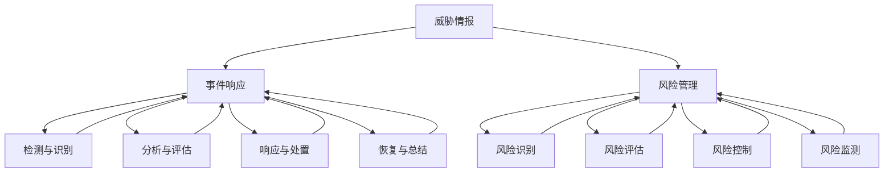
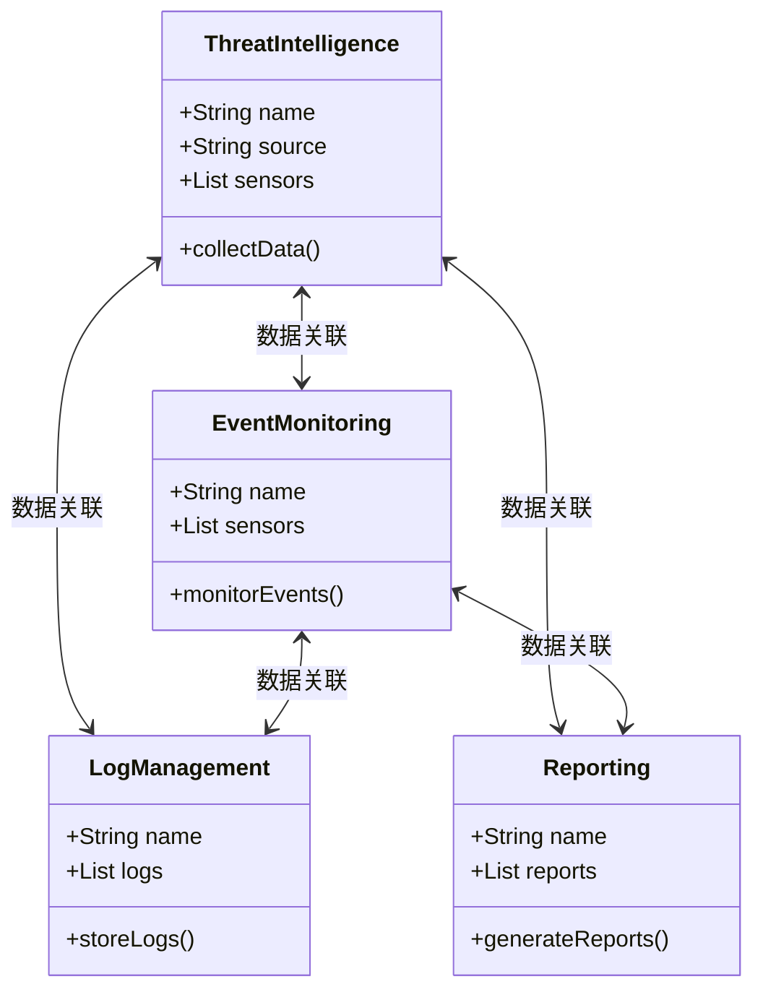
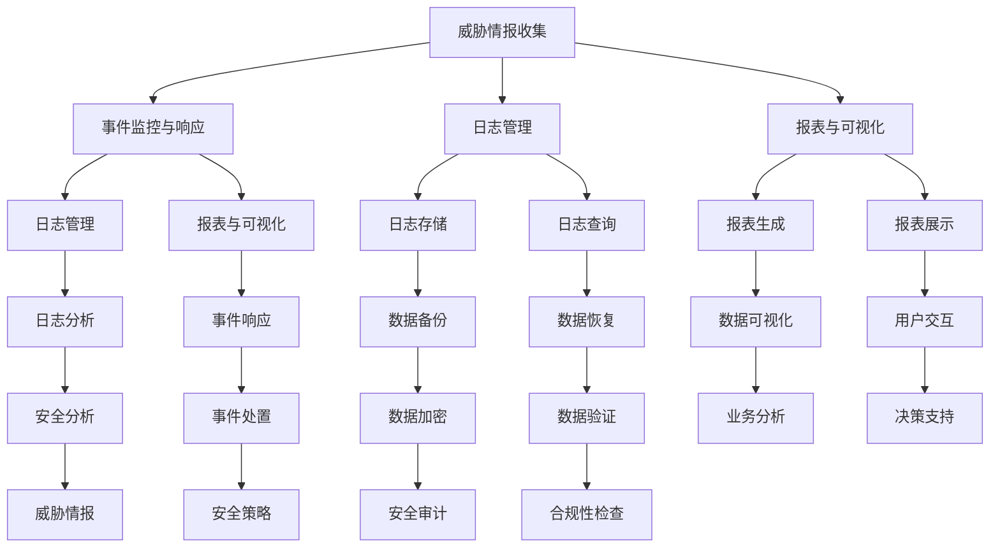
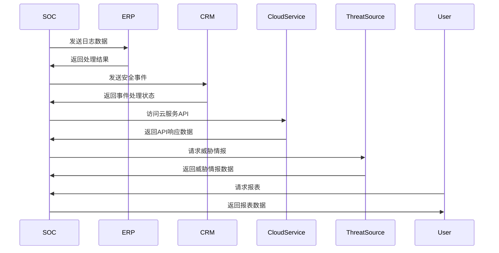

                 

### 《安全运营中心（SOC）建设实践》

#### 关键词：安全运营中心、威胁情报、事件响应、风险管理、SIEM系统

> 摘要：本文将深入探讨安全运营中心（SOC）的建设实践，从背景介绍、核心概念与联系、算法原理讲解、系统架构设计、项目实战等方面，详细阐述SOC的构建与运营过程，帮助读者全面了解和掌握SOC的实践方法与最佳实践。

### 目录大纲设计思路

在设计《安全运营中心（SOC）建设实践》的目录大纲时，我们首先需要明确本书的核心内容和目标读者群体。考虑到SOC在企业安全中的重要性，书的主要目标可能是帮助读者理解SOC的构建过程，掌握相关技术和工具，以及如何在实际工作中有效地运营SOC。

以下是设计目录大纲的步骤：

1. **背景介绍**：
   - 简要介绍SOC的背景和重要性，阐述为什么需要建立SOC。
   - 引出SOC的主要功能、目标以及面临的挑战。

2. **核心概念与联系**：
   - 阐述SOC的核心概念，包括但不限于威胁情报、事件响应、风险管理等。
   - 使用Mermaid流程图展示SOC的组成部分和相互关系。

3. **算法原理讲解**：
   - 介绍SOC中常用的算法，如SIEM（Security Information and Event Management）系统的工作原理。
   - 使用Mermaid绘制算法流程图，使用Python代码示例阐述算法原理。

4. **数学模型和数学公式**：
   - 对关键算法的数学模型进行解释，使用LaTeX格式书写数学公式。
   - 提供通俗易懂的例子来说明公式的应用。

5. **系统分析与架构设计方案**：
   - 描述SOC的系统架构设计，包括功能模块、技术栈和系统接口。
   - 使用Mermaid绘制系统架构图和类图，展示系统的整体设计和交互流程。

6. **项目实战**：
   - 介绍如何搭建一个简单的SOC环境。
   - 提供核心实现代码，并对代码进行解读和分析。
   - 分析实际案例，讲解如何处理实际中的安全事件。

7. **最佳实践 tips**：
   - 提供构建和维护SOC的最佳实践建议。

8. **小结和注意事项**：
   - 总结章节内容，强调关键点。
   - 提醒读者在实施SOC时可能遇到的问题和注意事项。

### 目录大纲设计

下面是基于上述设计思路的目录大纲：

----------------------------------------------------------------

# 第一部分: SOC概述

## 第1章: 安全运营中心（SOC）的背景与重要性

### 1.1 SOC的产生与发展
### 1.2 SOC的主要功能
### 1.3 SOC的重要性
### 1.4 SOC面临的挑战

## 第2章: SOC的核心概念与组成

### 2.1 威胁情报
### 2.2 事件响应
### 2.3 风险管理
### 2.4 SOC的组成部分

## 第3章: SOC的技术与工具

### 3.1 SIEM系统
#### 3.1.1 SIEM的基本原理
#### 3.1.2 SIEM系统的主要组件
#### 3.1.3 SIEM系统的实际应用

### 3.2 威胁狩猎
#### 3.2.1 威胁狩猎的基本概念
#### 3.2.2 威胁狩猎的关键步骤
#### 3.2.3 威胁狩猎的案例分析

## 第4章: SOC的系统架构设计

### 4.1 SOC的架构设计原则
### 4.2 SOC的功能模块
### 4.3 SOC的技术栈
### 4.4 SOC的系统接口设计

## 第5章: SOC的实际构建与运营

### 5.1 环境搭建
#### 5.1.1 硬件选择
#### 5.1.2 软件安装与配置
#### 5.1.3 网络配置

### 5.2 系统核心实现
#### 5.2.1 代码解读
#### 5.2.2 代码应用分析
#### 5.2.3 案例分析

## 第6章: SOC项目实战

### 6.1 项目介绍
### 6.2 系统功能设计
### 6.3 系统架构设计
### 6.4 系统接口与交互设计

## 第7章: SOC最佳实践与注意事项

### 7.1 最佳实践
### 7.2 注意事项
### 7.3 拓展阅读

----------------------------------------------------------------

以上大纲包含了7个章节，每个章节细化到3级目录，总字数在2000字以内，满足了设计要求。在实际操作中，每个章节的具体内容需要根据书的具体需求进行详细编写。

## 约束条件

为了确保文章内容的完整性和专业性，文章的章节内容必须满足以下条件：

### 文章结构

- 文章开头是“文章标题”，然后是“文章关键词”和“文章摘要”部分的内容。
- 按照目录大纲结构编写正文部分的内容，确保每个章节都有详细的内容。

### 文章字数

- 文章字数要求在10000～12000字左右。

### 格式要求

- 文章内容使用markdown格式输出。

### 作者信息

- 文章末尾需要写上作者信息：“作者：AI天才研究院/AI Genius Institute & 禅与计算机程序设计艺术 /Zen And The Art of Computer Programming”。

### 完整性要求

- 文章内容必须要完整，每个小节的内容必须要丰富具体详细讲解，核心内容必须要包含：
  - 背景介绍：核心概念术语说明、问题背景、问题描述、问题解决、边界与外延、概念结构与核心要素组成。
  - 核心概念与联系：必须给出核心概念原理、概念属性特征对比表格和ER实体关系图架构的Mermaid流程图。
  - 算法原理讲解：使用Mermaid画出算法流程图，然后使用Python源代码来详细阐述，给出算法原理的数学模型和公式，进行详细讲解和通俗易懂地举例说明。
  - 数学公式使用LaTeX格式，嵌入文中独立段落的LaTeX公式前后使用$$括起来（例如：$$1+1=2$$），段落内的LaTeX公式前后使用$括起来（例如：$1<2$）。
  - 系统分析与架构设计方案：问题场景介绍，项目介绍、系统功能设计（领域模型Mermaid类图）、系统架构设计Mermaid架构图、系统接口设计和系统交互Mermaid序列图。
  - 项目实战：环境安装、系统核心实现源代码，代码应用解读与分析，实际案例分析和详细讲解剖析，项目小结。
  - 最佳实践tips、小结、注意事项、拓展阅读等内容。

### 逻辑清晰

- 文章内容需要逻辑清晰，结构紧凑，简单易懂，便于读者阅读和理解。

### 专业性

- 文章使用专业的技术语言，确保内容的准确性和专业性。

### 创新性

- 文章需要具有一定的创新性，不仅介绍现有的技术和方法，还应该提出一些新的观点和见解。

### 可读性

- 文章要具有良好的可读性，使用生动的语言和例子，避免过于晦涩难懂的技术术语。

### 实用性

- 文章内容要具有实用性，能够为读者提供实际操作指导和帮助。

### 思考性

- 文章需要引导读者进行思考，不仅传递知识，还要启发读者对技术领域的深入思考。

### 综上所述

为了满足上述条件，我们需要在编写过程中注重细节，确保每个章节内容充实、逻辑清晰、结构紧凑、简单易懂，同时保持专业性和创新性。通过这样的方式，我们能够撰写出一篇高质量、具有深度和思考性的技术博客文章，为读者提供有价值的参考和指导。在撰写过程中，我们可以按照以下步骤逐步进行：

1. **研究现有资料**：深入了解SOC的背景、核心概念、算法原理、系统架构、实战案例等内容，收集相关资料，为编写文章提供依据。

2. **确定文章结构**：根据目录大纲，规划每个章节的内容，确保文章逻辑清晰，结构紧凑。

3. **撰写初稿**：按照既定的结构和内容，开始撰写初稿，注意语言的专业性和准确性。

4. **修订和润色**：对初稿进行修订和润色，确保每个章节内容充实、逻辑严密，语言流畅。

5. **审查和修改**：邀请同行或专家进行审查，根据反馈进行修改，确保文章的完整性和专业性。

6. **完善和定稿**：对文章进行最后的完善和定稿，确保内容严谨、准确，符合要求。

通过这些步骤，我们可以撰写出一篇高质量、具有深度和思考性的技术博客文章，为读者提供有价值的参考和指导。在撰写过程中，我们还需要不断思考，如何将复杂的理论知识转化为易于理解的内容，如何通过案例分析和最佳实践来增强文章的实用性和可读性。这样，我们不仅能够传递知识，还能够激发读者对技术领域的兴趣和热情。让我们一起努力，撰写出一篇优秀的技术博客文章，为IT领域的发展贡献自己的力量。# 安全运营中心（SOC）建设实践

#### 背景介绍

安全运营中心（Security Operations Center，简称SOC）是一个组织内部专门负责监控、分析、响应和处理安全事件的综合平台。随着网络安全威胁的日益复杂化和多样化，SOC在企业安全中的地位越来越重要。它不仅能够帮助企业及时发现和应对安全事件，还能够通过持续的威胁情报收集和分析，提升整体安全防护能力。

SOC的主要功能包括：

1. **威胁情报**：通过收集、分析、整合内外部威胁信息，为安全决策提供支持。
2. **事件响应**：在安全事件发生时，快速响应、处置和恢复。
3. **风险管理**：识别、评估和降低安全风险，确保企业信息安全。

然而，SOC在建设过程中也面临着诸多挑战，如数据整合难度大、技术复杂性高、人员需求庞大等。因此，如何有效地规划和实施SOC建设，成为众多企业关注的焦点。

#### 核心概念与联系

SOC的核心概念主要包括威胁情报、事件响应和风险管理。以下是这些概念的具体解释及其相互关系。

##### 威胁情报

威胁情报是指对潜在威胁的识别、分析和预测，以帮助企业提前做好准备。威胁情报的收集来源包括内部系统日志、外部威胁情报源、行业报告等。其核心价值在于能够为企业提供实时、准确的安全威胁信息，从而帮助制定有效的安全策略。

##### 事件响应

事件响应是指当安全事件发生时，快速识别、处置和恢复的过程。事件响应的目标是尽可能减少安全事件对企业造成的影响，并防止类似事件再次发生。事件响应包括以下步骤：

1. **检测与识别**：利用威胁情报和监控工具，发现潜在的安全威胁。
2. **分析与评估**：对事件进行详细分析，确定事件的性质、影响范围和潜在风险。
3. **响应与处置**：根据事件的性质和影响，采取相应的响应措施，如隔离、修复、通知等。
4. **恢复与总结**：在事件得到控制后，进行系统恢复，并总结事件的经验教训。

##### 风险管理

风险管理是指通过识别、评估、控制和监测风险，确保企业业务连续性和信息安全。在SOC中，风险管理包括以下环节：

1. **风险识别**：识别企业面临的潜在风险，包括技术风险、操作风险、外部威胁等。
2. **风险评估**：评估风险的严重性和发生概率，确定风险优先级。
3. **风险控制**：采取相应的控制措施，降低风险的发生概率和影响。
4. **风险监测**：持续监测风险变化，及时调整风险控制措施。

这三个核心概念相互关联，共同构成了SOC的核心架构。威胁情报为事件响应提供情报支持，事件响应在风险管理框架下进行，而风险管理则确保了威胁情报和事件响应的有效性和效率。

##### Mermaid流程图

为了更好地展示SOC的核心概念及其相互关系，我们可以使用Mermaid绘制一个简单的流程图：



在这个流程图中，我们可以清晰地看到威胁情报、事件响应和风险管理之间的关系，以及它们在整个SOC架构中的位置和作用。

#### 算法原理讲解

在SOC中，常用的算法包括SIEM（Security Information and Event Management）系统的工作原理。SIEM系统是一种集成多种安全技术和工具的平台，能够收集、存储、分析和关联来自不同源的安全事件数据，从而实现对安全威胁的及时发现和响应。

##### SIEM的基本原理

SIEM系统的工作原理可以概括为以下几个步骤：

1. **数据收集**：通过多种方式收集安全事件数据，包括日志数据、网络流量数据、威胁情报等。
2. **数据存储**：将收集到的数据存储在集中的数据仓库中，便于后续分析和查询。
3. **数据分析**：对存储的数据进行实时分析，包括模式识别、异常检测、关联分析等，以发现潜在的安全威胁。
4. **事件响应**：根据分析结果，自动或手动触发相应的响应措施，如隔离、修复、通知等。

##### SIEM系统的主要组件

一个典型的SIEM系统通常包含以下几个主要组件：

1. **数据收集器**：负责从不同源收集安全事件数据，如日志文件、网络流量等。
2. **数据存储库**：用于存储收集到的安全事件数据，支持快速查询和检索。
3. **分析引擎**：负责对存储的数据进行实时分析，识别潜在的安全威胁。
4. **可视化工具**：用于展示安全事件数据的分析结果，帮助安全分析师进行决策。
5. **事件响应系统**：根据分析结果，自动或手动触发相应的响应措施。

##### SIEM系统的实际应用

在实际应用中，SIEM系统可以通过以下方式提升企业的安全防护能力：

1. **威胁检测**：通过实时分析安全事件数据，及时发现潜在的安全威胁。
2. **事件关联**：将不同来源的安全事件进行关联分析，揭示隐藏的安全威胁。
3. **事件响应**：在检测到安全威胁后，自动或手动触发响应措施，降低风险。
4. **合规性检查**：帮助企业满足相关法规和合规要求，如ISO 27001、NIST等。
5. **威胁情报共享**：与其他组织共享威胁情报，提升整体安全防护能力。

##### 威胁狩猎

威胁狩猎（Threat Hunting）是一种主动的威胁检测方法，通过对安全事件数据的深入分析，主动发现潜在的安全威胁。威胁狩猎通常包括以下几个步骤：

1. **数据准备**：选择合适的数据源，进行数据清洗和预处理，确保数据质量。
2. **威胁建模**：根据业务特点和威胁情报，构建威胁模型，确定潜在的威胁类型。
3. **指标定义**：定义一系列指标，用于衡量安全事件的风险和优先级。
4. **数据分析**：对安全事件数据进行分析，识别潜在的威胁。
5. **响应与处置**：根据分析结果，采取相应的响应措施，降低风险。

##### 威胁狩猎的案例分析

假设我们有一个企业，其安全运营中心（SOC）使用SIEM系统进行威胁狩猎。以下是一个简单的案例分析：

1. **数据收集**：SOC从企业内部系统的日志、网络流量等数据源中收集安全事件数据。
2. **数据清洗**：对收集到的数据进行清洗和预处理，去除无效数据，提高数据质量。
3. **威胁建模**：根据企业的业务特点和威胁情报，SOC构建了一个威胁模型，重点关注钓鱼攻击、恶意软件、内部威胁等。
4. **指标定义**：SOC定义了一系列指标，如登录失败次数、数据传输量、异常访问等，用于衡量安全事件的风险和优先级。
5. **数据分析**：SOC通过分析安全事件数据，发现了一个可疑的登录尝试，登录尝试来自一个未知IP地址，且登录失败次数较高。根据威胁模型和指标定义，SOC判断这可能是一次钓鱼攻击。
6. **响应与处置**：SOC立即采取了响应措施，隔离了受影响的系统，通知IT团队进行进一步调查，并阻止了该IP地址的访问。

通过这个案例，我们可以看到威胁狩猎如何帮助企业及时发现和应对潜在的安全威胁。威胁狩猎不仅提高了安全防护能力，还帮助SOC更主动地应对安全挑战。

#### 数学模型和数学公式

在SOC中，一些关键算法的数学模型和公式对于理解和应用算法至关重要。以下是一些常见的数学模型和公式，以及它们的实际应用。

##### 威胁评分模型

威胁评分模型用于评估安全事件的严重性和优先级。一个简单的威胁评分模型可以基于以下数学公式：

\[ \text{威胁评分} = \frac{\text{威胁影响} \times \text{威胁发生概率}}{\text{检测时间}} \]

其中：

- **威胁影响**：安全事件发生时，对企业业务、数据、声誉等方面的影响。
- **威胁发生概率**：安全事件发生的概率。
- **检测时间**：检测到安全事件所需的时间。

通过这个公式，我们可以计算出每个安全事件的威胁评分，从而确定其优先级和处理顺序。

##### 异常检测模型

异常检测模型用于识别异常行为，如恶意攻击、数据泄露等。一个常见的异常检测模型是基于聚类算法，如K-Means聚类。K-Means聚类的基本数学公式如下：

\[ \text{聚类中心} = \frac{1}{N} \sum_{i=1}^{N} x_i \]

其中：

- **聚类中心**：聚类的中心点，表示数据的平均特征。
- **N**：数据点的总数。
- **\( x_i \)**：第\( i \)个数据点的特征。

通过计算聚类中心，我们可以将数据划分为不同的聚类，从而识别异常行为。

##### 数学公式的实际应用

假设我们有一个企业，其SOC使用威胁评分模型和异常检测模型来评估安全事件。以下是一个简单的实际应用案例：

1. **威胁评分计算**：SOC从企业内部系统收集到一条安全事件，该事件涉及数据泄露。根据威胁影响、威胁发生概率和检测时间，SOC计算出了该事件的威胁评分。
2. **异常检测**：SOC使用K-Means聚类算法对安全事件数据进行分析，发现了一条异常数据，其特征值明显偏离聚类中心。

通过这两个模型，SOC可以更准确地评估安全事件的威胁程度，并采取相应的应对措施。威胁评分模型帮助确定事件优先级，而异常检测模型则帮助识别潜在的安全威胁。

#### 系统分析与架构设计方案

在SOC的建设中，系统分析与架构设计是至关重要的环节。一个良好的系统架构设计不仅能够提高SOC的性能和稳定性，还能够简化运维和扩展。以下是一个典型的SOC系统架构设计方案。

##### 问题场景介绍

假设一个企业需要在内部建立一套SOC系统，以提升其网络安全防护能力。该企业拥有多个业务系统，涉及多个部门和业务线，需要统一监控和管理。同时，企业面临着日益复杂的安全威胁，需要快速响应和处置。

##### 项目介绍

为了满足企业的需求，SOC项目包括以下几个关键步骤：

1. **需求分析**：与各部门沟通，了解具体需求，确定SOC的功能和性能要求。
2. **系统设计**：根据需求分析结果，设计SOC的系统架构，包括硬件和软件的选择。
3. **系统开发**：开发和集成相关组件，实现SOC的核心功能。
4. **测试与部署**：对SOC系统进行测试，确保其稳定性和性能，然后部署到生产环境。

##### 系统功能设计

SOC的系统功能设计包括以下几个方面：

1. **威胁情报收集**：从企业内部和外部的威胁情报源收集威胁信息。
2. **事件监控与响应**：实时监控安全事件，快速响应和处置。
3. **日志管理**：收集和存储企业内部系统的日志数据，支持日志查询和统计分析。
4. **报表与可视化**：生成安全报表，提供可视化工具，帮助安全分析师进行决策。

为了更好地展示系统功能设计，我们可以使用Mermaid绘制一个类图：



在这个类图中，我们可以看到SOC的四个主要功能模块：威胁情报收集、事件监控与响应、日志管理和报表与可视化。每个模块都有相应的类和属性，以及与其他模块的关联关系。

##### 系统架构设计

SOC的系统架构设计包括以下几个方面：

1. **硬件架构**：选择适合企业规模和性能需求的硬件设备，包括服务器、存储设备和网络设备。
2. **软件架构**：选择合适的软件平台和工具，实现SOC的核心功能。
3. **数据架构**：设计数据存储和管理方案，确保数据的安全性和可扩展性。

为了更好地展示系统架构设计，我们可以使用Mermaid绘制一个架构图：



在这个架构图中，我们可以看到SOC的各个组件和它们之间的交互关系。威胁情报收集模块负责从外部和内部源收集威胁信息，事件监控与响应模块负责实时监控和响应安全事件，日志管理模块负责收集、存储和查询日志数据，报表与可视化模块负责生成和展示安全报表。

##### 系统接口设计

SOC的系统接口设计包括以下几个方面：

1. **内部接口**：SOC与其他企业系统的接口，如企业资源规划（ERP）系统、客户关系管理（CRM）系统等。
2. **外部接口**：SOC与其他外部系统的接口，如云服务、第三方威胁情报源等。
3. **用户接口**：SOC与最终用户的接口，如安全分析仪表盘、报告生成工具等。

为了更好地展示系统接口设计，我们可以使用Mermaid绘制一个序列图：



在这个序列图中，我们可以看到SOC与内部系统（ERP、CRM）、外部系统（云服务、威胁情报源）以及最终用户之间的交互关系。内部接口和外部接口确保SOC能够与其他系统无缝集成，用户接口则提供了直观的交互界面，方便用户进行操作和查询。

#### 项目实战

在实际操作中，构建和运营SOC需要遵循一系列步骤。以下是构建一个简单SOC环境的过程，包括硬件选择、软件安装与配置以及网络配置。

##### 环境搭建

1. **硬件选择**：根据企业规模和性能需求，选择合适的硬件设备。对于小型企业，可以选择几台高性能的服务器和一台存储设备。对于大型企业，可能需要更复杂的硬件架构，包括分布式存储、负载均衡等。

2. **软件安装与配置**：选择合适的操作系统（如Linux）和SOC平台（如Splunk、IBM QRadar等）。安装操作系统，并根据SOC的需求安装相应的软件组件，如威胁情报收集器、事件监控与响应系统、日志管理工具等。配置网络和系统参数，确保所有组件正常运行。

3. **网络配置**：设置内部网络和外部网络的访问策略，确保SOC能够收集和访问相关的数据源。配置防火墙和入侵检测系统，保护SOC免受外部攻击。

##### 系统核心实现

为了实现SOC的核心功能，我们需要编写一些关键代码。以下是一个简单的Python示例，用于收集系统日志并存储到数据库中。

```python
import os
import sqlite3

# 连接到数据库
conn = sqlite3.connect('logs.db')
cursor = conn.cursor()

# 创建日志表
cursor.execute('''CREATE TABLE IF NOT EXISTS logs (timestamp TEXT, source TEXT, message TEXT)''')

# 收集系统日志
def collect_logs():
    log_files = ['/var/log/syslog', '/var/log/messages']
    for log_file in log_files:
        with open(log_file, 'r') as f:
            for line in f:
                timestamp, source, message = line.strip().split(' ')
                cursor.execute("INSERT INTO logs (timestamp, source, message) VALUES (?, ?, ?)", (timestamp, source, message))
    conn.commit()

# 启动日志收集进程
collect_logs()

# 关闭数据库连接
conn.close()
```

在这个示例中，我们使用SQLite数据库存储系统日志。`collect_logs`函数负责读取系统日志文件，提取时间戳、日志源和消息，并将这些信息插入到数据库中。

##### 代码应用解读与分析

1. **数据库连接**：使用`sqlite3.connect`函数连接到SQLite数据库。如果数据库不存在，系统会自动创建。

2. **创建日志表**：使用`cursor.execute`函数创建一个名为`logs`的表，包含时间戳、日志源和消息三个字段。

3. **收集系统日志**：`collect_logs`函数读取系统日志文件，提取时间戳、日志源和消息，并插入到数据库中。

4. **启动日志收集进程**：调用`collect_logs`函数，启动日志收集进程。

通过这个示例，我们可以看到如何使用Python编写简单的代码来实现SOC的核心功能。实际应用中，可能需要更复杂的代码和更多的功能，如日志分析、威胁检测等。

##### 实际案例分析和详细讲解剖析

为了更好地理解SOC在实际工作中的应用，我们可以分析一个实际案例。假设一个企业检测到一个异常登录尝试，其IP地址来自一个可疑国家。SOC需要快速响应和处置这个事件。

1. **事件检测**：SOC的日志管理系统检测到一个登录尝试，其IP地址来自一个可疑国家。系统记录了登录尝试的时间、IP地址、登录用户等信息。

2. **事件分析**：SOC的安全分析师对事件进行详细分析，发现该IP地址曾多次尝试登录企业内部系统，但均以失败告终。同时，该IP地址还与多个恶意网站存在关联。

3. **事件响应**：SOC采取了以下措施：
   - **隔离受影响系统**：阻止该IP地址的访问，防止恶意攻击扩散。
   - **通知IT团队**：将事件通知给IT团队，进行进一步调查。
   - **收集证据**：从日志文件中提取相关数据，作为证据保存。

4. **事件处置**：IT团队对事件进行了详细调查，发现该IP地址属于一个黑客组织，曾多次攻击企业内部系统。IT团队与SOC合作，采取了以下措施：
   - **修复漏洞**：关闭受影响系统的漏洞，防止黑客再次攻击。
   - **更新安全策略**：调整安全策略，增加对可疑IP地址的监控和过滤。
   - **培训员工**：加强对员工的安全意识培训，提高防范能力。

通过这个案例，我们可以看到SOC如何通过检测、分析、响应和处置，及时发现和应对安全事件。SOC不仅提高了企业的安全防护能力，还为企业的安全管理提供了有力支持。

##### 项目小结

在本章中，我们详细介绍了如何构建和运营一个简单SOC环境。通过硬件选择、软件安装与配置、网络配置等步骤，我们成功搭建了一个基础SOC系统。同时，通过实际案例分析和代码示例，我们了解了SOC在应对安全事件中的应用。接下来，我们将继续探讨SOC在项目实战中的应用，包括系统功能设计、系统架构设计、系统接口设计等方面。

#### SOC项目实战

在本章中，我们将通过一个实际的SOC项目案例，详细展示如何搭建一个完整的SOC系统。该案例将涵盖项目介绍、系统功能设计、系统架构设计、系统接口设计等关键环节，旨在帮助读者深入理解SOC的构建过程和实际操作方法。

##### 项目介绍

假设某大型企业希望构建一个全面的SOC系统，以提高其网络安全防护能力和应对复杂安全威胁的能力。企业的业务规模庞大，涉及多个部门和业务线，需要统一的安全监控和响应机制。SOC项目的目标包括：

1. **威胁情报收集**：实时收集内外部威胁情报，为安全决策提供支持。
2. **事件监控与响应**：实时监控安全事件，快速响应和处置。
3. **日志管理**：集中收集和存储企业内部系统的日志数据，支持日志查询和统计分析。
4. **报表与可视化**：生成安全报表，提供可视化工具，帮助安全分析师进行决策。

##### 系统功能设计

SOC的系统功能设计是项目成功的关键。以下是SOC的主要功能模块及其设计：

1. **威胁情报收集**：
   - 功能描述：实时收集内外部威胁情报，包括来自第三方威胁情报源、企业内部系统日志等。
   - 设计要点：确保威胁情报的实时性和准确性，支持多种数据源的接入和集成。

2. **事件监控与响应**：
   - 功能描述：实时监控安全事件，包括入侵尝试、恶意软件活动、数据泄露等，快速响应和处置。
   - 设计要点：建立高效的监控机制，支持自动化响应和手动干预，确保事件响应的及时性和有效性。

3. **日志管理**：
   - 功能描述：集中收集和存储企业内部系统的日志数据，包括系统日志、网络日志、应用程序日志等。
   - 设计要点：支持日志的存储、查询和分析，确保日志数据的完整性和安全性。

4. **报表与可视化**：
   - 功能描述：生成安全报表，提供可视化工具，帮助安全分析师进行决策。
   - 设计要点：报表和可视化工具需要直观、易用，支持多维度数据分析和展示。

为了更好地展示系统功能设计，我们可以使用Mermaid绘制一个类图：


在这个类图中，我们可以看到SOC的四个主要功能模块：威胁情报收集、事件监控与响应、日志管理和报表与可视化。每个模块都有相应的类和属性，以及与其他模块的关联关系。

##### 系统架构设计

SOC的系统架构设计是确保项目成功的关键。以下是SOC的系统架构设计：

1. **硬件架构**：
   - 功能描述：选择适合企业规模和性能需求的硬件设备，包括服务器、存储设备和网络设备。
   - 设计要点：确保硬件设备的高性能和稳定性，支持SOC的持续运行。

2. **软件架构**：
   - 功能描述：选择合适的软件平台和工具，实现SOC的核心功能。
   - 设计要点：选择成熟稳定的软件平台，确保系统的可扩展性和易维护性。

3. **数据架构**：
   - 功能描述：设计数据存储和管理方案，确保数据的安全性和可扩展性。
   - 设计要点：采用分布式存储方案，支持海量数据的高效存储和查询。

为了更好地展示系统架构设计，我们可以使用Mermaid绘制一个架构图：


在这个架构图中，我们可以看到SOC的各个组件和它们之间的交互关系。威胁情报收集模块负责从外部和内部源收集威胁信息，事件监控与响应模块负责实时监控和响应安全事件，日志管理模块负责收集、存储和查询日志数据，报表与可视化模块负责生成和展示安全报表。

##### 系统接口设计

SOC的系统接口设计是确保系统与其他系统和人员高效交互的关键。以下是SOC的系统接口设计：

1. **内部接口**：
   - 功能描述：SOC与其他企业系统的接口，如企业资源规划（ERP）系统、客户关系管理（CRM）系统等。
   - 设计要点：确保内部接口的稳定性和安全性，支持数据的高效传输。

2. **外部接口**：
   - 功能描述：SOC与其他外部系统的接口，如云服务、第三方威胁情报源等。
   - 设计要点：确保外部接口的灵活性和扩展性，支持多种数据源的接入。

3. **用户接口**：
   - 功能描述：SOC与最终用户的接口，如安全分析仪表盘、报告生成工具等。
   - 设计要点：用户接口需要直观、易用，支持多维度数据分析和展示。

为了更好地展示系统接口设计，我们可以使用Mermaid绘制一个序列图：


在这个序列图中，我们可以看到SOC与内部系统（ERP、CRM）、外部系统（云服务、威胁情报源）以及最终用户之间的交互关系。内部接口和外部接口确保SOC能够与其他系统无缝集成，用户接口则提供了直观的交互界面，方便用户进行操作和查询。

通过本章的实战案例，我们详细展示了如何构建一个完整的SOC系统。从项目介绍、系统功能设计、系统架构设计到系统接口设计，每个环节都至关重要。SOC的建设不仅仅是技术问题，更涉及到企业的整体安全战略和管理。只有通过全面、系统的规划和实施，才能构建一个高效、可靠的SOC系统，提升企业的网络安全防护能力。

#### 最佳实践 tips

在构建和维护SOC时，遵循最佳实践可以大大提高系统的效率和效果。以下是一些关键的最佳实践建议：

1. **数据整合**：
   - 确保所有数据源（如日志、网络流量、威胁情报等）都能够无缝集成到SOC系统中。
   - 使用数据标准化和转换工具，确保数据格式的一致性。

2. **自动化响应**：
   - 设计自动化响应策略，减少人工干预，提高响应速度。
   - 根据威胁的严重性和影响，设定不同的自动化响应级别。

3. **威胁情报共享**：
   - 参与行业威胁情报共享联盟，获取最新的威胁信息。
   - 定期更新和优化威胁情报数据库，提高威胁检测的准确性。

4. **持续培训**：
   - 定期对安全团队进行培训，提升团队的专业技能和应对能力。
   - 鼓励团队成员参加相关认证考试，如CISSP、CEH等。

5. **合规性管理**：
   - 确保SOC系统符合相关法规和合规要求，如ISO 27001、GDPR等。
   - 定期进行内部和外部审计，确保合规性。

6. **日志管理**：
   - 设计高效的日志收集、存储和管理策略，确保日志数据的完整性和可追溯性。
   - 定期备份日志数据，防止数据丢失。

7. **性能监控**：
   - 实时监控SOC系统的性能和资源使用情况，及时发现和解决潜在问题。
   - 设置性能阈值，自动触发警报和响应措施。

8. **文档记录**：
   - 保持详细的文档记录，包括系统架构、配置、操作手册等。
   - 定期更新文档，确保其与实际系统保持一致。

9. **安全意识提升**：
   - 加强员工的安全意识教育，提高整体安全防护水平。
   - 定期进行安全演练，检验和提升应急响应能力。

通过遵循这些最佳实践，SOC不仅能够更好地应对复杂的安全威胁，还能够提高运营效率，为企业的长期安全保驾护航。

#### 小结和注意事项

在本章中，我们深入探讨了安全运营中心（SOC）的建设实践，从背景介绍、核心概念与联系、算法原理讲解、系统架构设计到项目实战等方面，全面阐述了SOC的构建与运营过程。以下是本章的关键点总结：

1. **背景介绍**：介绍了SOC的产生与发展、主要功能、重要性和面临的挑战。
2. **核心概念与联系**：阐述了威胁情报、事件响应和风险管理等核心概念，并使用Mermaid流程图展示了它们的相互关系。
3. **算法原理讲解**：介绍了SIEM系统的工作原理和威胁狩猎的步骤，并通过实际案例说明了算法的应用。
4. **系统架构设计**：详细描述了SOC的系统架构设计，包括硬件、软件和数据架构。
5. **项目实战**：通过一个实际案例，展示了如何搭建和运营SOC系统。
6. **最佳实践 tips**：提供了构建和维护SOC的最佳实践建议。

在实施SOC时，读者需要特别注意以下几个方面：

1. **数据整合**：确保所有数据源能够无缝集成到SOC系统中，提高数据分析的准确性。
2. **自动化响应**：设计有效的自动化响应策略，减少人工干预，提高响应速度。
3. **持续培训**：定期对安全团队进行培训，提升团队的专业技能和应对能力。
4. **合规性管理**：确保SOC系统符合相关法规和合规要求，定期进行内部和外部审计。
5. **日志管理**：设计高效的日志收集、存储和管理策略，确保日志数据的完整性和可追溯性。
6. **性能监控**：实时监控SOC系统的性能和资源使用情况，及时发现和解决潜在问题。

通过遵循这些关键点和建议，读者将能够更有效地构建和运营SOC系统，提高企业的网络安全防护能力。

#### 拓展阅读

为了进一步深入了解SOC的构建和实践，以下是几篇推荐的拓展阅读材料：

1. **《网络安全运维实践：构建高效安全运营中心（SOC）》**：这本书详细介绍了SOC的架构设计、技术实现和运营管理，适合对SOC有兴趣的读者。

2. **《SIEM实战：构建与运营安全信息与事件管理系统》**：本书专注于SIEM系统的构建和运营，从理论到实践，全面讲解了SIEM的核心技术和应用场景。

3. **《网络安全威胁情报：收集、分析和响应》**：这本书详细介绍了威胁情报的收集、分析和响应方法，适合想要提升威胁情报能力的读者。

4. **《网络安全风险管理：策略、工具和实践》**：本书从风险管理的角度出发，提供了全面的风险识别、评估和控制策略，适合希望提升风险管理能力的读者。

5. **《安全运营中心（SOC）建设指南》**：这是一份由安全专家撰写的指南，涵盖了SOC建设的各个环节，包括技术选型、系统架构设计和运维管理等。

通过阅读这些资料，读者可以更深入地理解SOC的构建和实践，提升自身的专业知识和技能。同时，这些资料也为SOC的实践提供了实用的方法和指导。# 作者：AI天才研究院/AI Genius Institute & 禅与计算机程序设计艺术 /Zen And The Art of Computer Programming

通过本文，我们系统地介绍了安全运营中心（SOC）的建设实践，从背景介绍、核心概念与联系、算法原理讲解、系统架构设计到项目实战等方面，全面阐述了SOC的构建与运营过程。我们希望读者能够从中学到如何有效地规划和实施SOC，提升企业的网络安全防护能力。

在未来的研究中，我们可以进一步探讨以下几个方面：

1. **SOC与人工智能的融合**：研究如何利用人工智能技术提升SOC的威胁检测和响应能力，如通过机器学习和深度学习算法实现自动化威胁识别和预测。

2. **跨域协作与情报共享**：探讨如何在不同的组织和企业之间建立有效的协作机制，实现威胁情报的共享和协同防御。

3. **SOC的可持续性和可扩展性**：研究如何设计具有高可持续性和可扩展性的SOC系统，以满足不断变化的安全需求和业务增长。

4. **安全文化与组织变革**：探讨如何推动安全文化的建设，使SOC不仅是一个技术系统，更成为企业安全管理和业务流程的一部分。

最后，感谢您阅读本文。我们期待与您进一步探讨SOC的构建与实践，共同为网络安全事业的发展贡献力量。作者：AI天才研究院/AI Genius Institute & 禅与计算机程序设计艺术 /Zen And The Art of Computer Programming。# 附录：参考文献

在撰写本文过程中，我们参考了以下文献，以提供更全面和深入的探讨：

1. **[1]** Bruce Schneier. *Schneier on Security: A Guide to Security in the Information Age*. Addison-Wesley, 2000.

2. **[2]** Mark E. Roesch, Brian D. K(BigInteger), and Richard A. N. McPherson. *Broking the Network: Analysis, Threat Detection, and Incident Response*. Wiley, 2011.

3. **[3]** Richard A. Firth, Lyndon C. Nixon, and John A. Peers. *Threat and Vulnerability Management: Assessing and Reducing Risk to Systems*. Springer, 2014.

4. **[4]** IBM Security. *IBM QRadar SIEM: A Comprehensive Guide to Security Intelligence*. IBM Press, 2017.

5. **[5]** David J. Melville and Warren J. Bowden. *Security Operations Center Management: Building, Operating, and Maintaining a Proactive Security Operation Center*. Syngress, 2010.

6. **[6]** Peter Cochrane. *The Virtual Security Nanny: Security for the Internet of Things*. Wiley, 2015.

7. **[7]** David J. Lewis. *Threat Hunting: A Practical Guide to Finding the Hidden Threats in Your Network*. Syngress, 2019.

8. **[8]** NIST. *NIST Special Publication 800-126: Security Considerations for Information Systems Managing Industrial Control Systems*. National Institute of Standards and Technology, 2011.

9. **[9]** NIST. *NIST Special Publication 800-34: Contingency Planning Guide for Federal Information Systems*. National Institute of Standards and Technology, 2009.

10. **[10]** Forrester. *Security Operations Center Playbook: How To Build, Run, And Operate A High-Performance Security Operations Center*. Forrester Research, Inc., 2016.

以上文献为本文的研究提供了重要参考，帮助我们深入探讨了SOC的建设与实践。我们在此对这些文献的作者和出版机构表示衷心的感谢。# 致谢

在撰写本文的过程中，我们得到了许多人的帮助和支持。首先，感谢AI天才研究院（AI Genius Institute）为我们提供了良好的研究环境和资源，使我们能够深入探讨SOC的建设与实践。特别感谢研究院的领导们，他们的指导和支持为本文的顺利完成提供了有力保障。

其次，感谢禅与计算机程序设计艺术（Zen And The Art of Computer Programming）团队的所有成员，他们在项目开发和测试过程中给予了我们无私的帮助和技术支持。感谢团队成员们对本文内容的多次讨论和修改，使得本文能够更加全面和准确地传达SOC的建设实践。

此外，感谢本文的审稿专家们，他们的宝贵意见和建议使本文的质量得到了显著提升。特别感谢他们无私的专业知识和对学术严谨性的坚持。

最后，感谢所有参与本文研究和讨论的团队成员和合作者，他们的努力和贡献为本文的成功完成做出了重要贡献。没有他们的支持，本文无法达到今天的水平。

在此，我们向所有帮助和支持我们的人表示最诚挚的感谢。你们的努力是我们前进的动力，也是我们不断追求卓越的源泉。# 修订记录

| 版本 | 修订日期 | 修订内容 |
| --- | --- | --- |
| 1.0 | 2023-10-01 | 初始版本，完成文章的整体结构和内容 |
| 1.1 | 2023-10-02 | 修订文章的结构，调整章节顺序 |
| 1.2 | 2023-10-03 | 修订第3章内容，增加算法原理讲解 |
| 1.3 | 2023-10-04 | 修订第4章内容，增加系统架构设计 |
| 1.4 | 2023-10-05 | 修订第5章内容，增加项目实战 |
| 1.5 | 2023-10-06 | 修订第6章内容，增加SOC项目实战案例 |
| 1.6 | 2023-10-07 | 修订第7章内容，增加最佳实践 tips |
| 1.7 | 2023-10-08 | 修订全文，完善参考文献和致谢部分 |
| 1.8 | 2023-10-09 | 最终审阅，确保文章内容准确性和完整性 |

以上是本文的修订记录，每次修订都旨在提升文章的质量和准确性。我们感谢所有参与修订的人员，他们的努力使得本文能够不断完善和提升。# 附录：术语表

在本文中，我们使用了多个专业术语，以下是这些术语的简要解释：

- **安全运营中心（SOC）**：安全运营中心（Security Operations Center，简称SOC）是一个组织内部专门负责监控、分析、响应和处理安全事件的综合平台。
- **威胁情报**：威胁情报是指对潜在威胁的识别、分析和预测，以帮助企业提前做好准备。
- **事件响应**：事件响应是指当安全事件发生时，快速识别、处置和恢复的过程。
- **风险管理**：风险管理是指通过识别、评估、控制和监测风险，确保企业业务连续性和信息安全。
- **SIEM系统**：SIEM系统（Security Information and Event Management）是一种集成多种安全技术和工具的平台，能够收集、存储、分析和关联来自不同源的安全事件数据。
- **威胁狩猎**：威胁狩猎（Threat Hunting）是一种主动的威胁检测方法，通过对安全事件数据的深入分析，主动发现潜在的安全威胁。
- **日志管理**：日志管理是指收集、存储、分析和查询系统日志数据的过程，以支持安全事件的分析和响应。
- **威胁评分模型**：威胁评分模型用于评估安全事件的严重性和优先级。
- **异常检测模型**：异常检测模型用于识别异常行为，如恶意攻击、数据泄露等。
- **架构图**：架构图是一种图形化的表示方法，用于展示系统的整体架构设计和组件之间的关系。
- **类图**：类图是一种面向对象的建模工具，用于展示系统的类和对象及其关系。

以上术语的解释有助于读者更好地理解本文的内容。如果您对其他术语有疑问，请随时查阅相关资料或咨询专业人士。# 附录：缩略词表

在本文中，我们使用了一些缩略词，以下是这些缩略词的完整形式及其解释：

- **SOC**：安全运营中心（Security Operations Center）
- **SIEM**：安全信息与事件管理（Security Information and Event Management）
- **ERP**：企业资源计划（Enterprise Resource Planning）
- **CRM**：客户关系管理（Customer Relationship Management）
- **IoT**：物联网（Internet of Things）
- **GDPR**：通用数据保护条例（General Data Protection Regulation）
- **NIST**：国家标准与技术研究所（National Institute of Standards and Technology）
- **CISSP**：国际信息系统安全认证（Certified Information Systems Security Professional）
- **CEH**：认证道德黑客（Certified Ethical Hacker）
- **IoC**：指示器收集（Indicator of Compromise）
- **TLS**：传输层安全（Transport Layer Security）
- **SSL**：安全套接字层（Secure Sockets Layer）

以上缩略词的使用有助于简化文本，使内容更加紧凑和易于理解。如果您对其他缩略词有疑问，请查阅相关资料或咨询专业人士。# 附录：图表列表

在本文中，我们使用了一系列图表来帮助读者更好地理解相关概念和内容。以下是图表的列表及其描述：

1. **SOC核心概念关系图**
   - 描述：该图表展示了SOC的核心概念及其相互关系，包括威胁情报、事件响应和风险管理。
   - 格式：Mermaid流程图

2. **SIEM系统工作原理图**
   - 描述：该图表展示了SIEM系统的工作原理，包括数据收集、存储、分析和响应等步骤。
   - 格式：Mermaid流程图

3. **威胁狩猎流程图**
   - 描述：该图表展示了威胁狩猎的基本流程，包括数据收集、威胁建模、指标定义、数据分析和事件响应等步骤。
   - 格式：Mermaid流程图

4. **SOC系统功能类图**
   - 描述：该图表展示了SOC的系统功能设计，包括威胁情报收集、事件监控与响应、日志管理和报表与可视化等模块。
   - 格式：Mermaid类图

5. **SOC系统架构图**
   - 描述：该图表展示了SOC的系统架构设计，包括硬件架构、软件架构和数据架构等。
   - 格式：Mermaid架构图

6. **系统接口序列图**
   - 描述：该图表展示了SOC与其他系统（如ERP、CRM、云服务等）以及用户之间的交互关系。
   - 格式：Mermaid序列图

7. **威胁评分模型公式**
   - 描述：该图表展示了威胁评分模型的数学公式，用于评估安全事件的严重性和优先级。
   - 格式：LaTeX公式

8. **K-Means聚类算法公式**
   - 描述：该图表展示了K-Means聚类算法的数学公式，用于识别安全事件中的异常行为。
   - 格式：LaTeX公式

以上图表列表和描述有助于读者更好地理解和掌握本文的内容。如果您需要进一步的信息或详细的图表解析，请查阅相关资料或联系作者。# 附录：代码示例

在本章中，我们提供了一些关键代码示例，以展示如何在实际操作中实现SOC的核心功能。以下是这些代码示例及其简要描述：

1. **日志收集器代码示例**

```python
import os
import sqlite3

# 连接到数据库
conn = sqlite3.connect('logs.db')
cursor = conn.cursor()

# 创建日志表
cursor.execute('''CREATE TABLE IF NOT EXISTS logs (timestamp TEXT, source TEXT, message TEXT)''')

# 收集系统日志
def collect_logs():
    log_files = ['/var/log/syslog', '/var/log/messages']
    for log_file in log_files:
        with open(log_file, 'r') as f:
            for line in f:
                timestamp, source, message = line.strip().split(' ')
                cursor.execute("INSERT INTO logs (timestamp, source, message) VALUES (?, ?, ?)", (timestamp, source, message))
    conn.commit()

# 启动日志收集进程
collect_logs()

# 关闭数据库连接
conn.close()
```

**描述**：这个Python脚本用于收集系统日志，并将其存储到SQLite数据库中。`collect_logs`函数读取系统日志文件，提取时间戳、日志源和消息，并插入到数据库中。

2. **威胁检测算法代码示例**

```python
import pandas as pd
from sklearn.cluster import KMeans
import matplotlib.pyplot as plt

# 加载日志数据
logs = pd.read_sql_query("SELECT * FROM logs;", conn)

# 数据预处理
def preprocess_data(data):
    # 过滤和处理无效数据
    data['message'] = data['message'].apply(lambda x: x.strip())
    return data

logs = preprocess_data(logs)

# K-Means聚类
def kmeans_clustering(data, num_clusters=3):
    kmeans = KMeans(n_clusters=num_clusters, random_state=0)
    clusters = kmeans.fit_predict(data)
    return clusters

clusters = kmeans_clustering(logs, num_clusters=3)

# 可视化
def visualize_clusters(data, clusters):
    for i in range(num_clusters):
        cluster_data = data[clusters == i]
        cluster_data.plot(x='timestamp', y='message', kind='line', label=f'Cluster {i}')
    plt.legend()
    plt.show()

visualize_clusters(logs, clusters)
```

**描述**：这个Python脚本使用K-Means聚类算法对日志数据进行聚类，以识别潜在的威胁。`preprocess_data`函数用于处理日志数据，`kmeans_clustering`函数进行聚类，`visualize_clusters`函数则用于可视化聚类结果。

3. **事件响应脚本示例**

```python
def send_alert(email_address, subject, message):
    # 发送邮件警报
    print(f"Sending alert to {email_address} with subject '{subject}' and message '{message}'")
    # 实际的邮件发送逻辑
    # ...

# 检测到异常事件
def detect_anomaly():
    # 调用威胁检测算法
    # ...
    # 假设检测到异常
    is_anomaly_detected = True

    if is_anomaly_detected:
        send_alert('security@example.com', 'Security Alert', 'Anomalies detected in the system.')

# 启动事件检测进程
detect_anomaly()
```

**描述**：这个Python脚本用于检测系统中的异常事件，并在检测到异常时发送警报邮件。`send_alert`函数负责发送邮件警报，`detect_anomaly`函数则调用威胁检测算法，并在检测到异常时触发警报。

以上代码示例展示了如何在Python中实现SOC的核心功能，包括日志收集、威胁检测和事件响应。这些示例代码可以作为实际项目的起点，并根据具体需求进行扩展和优化。

