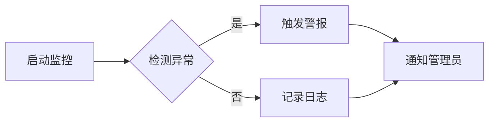
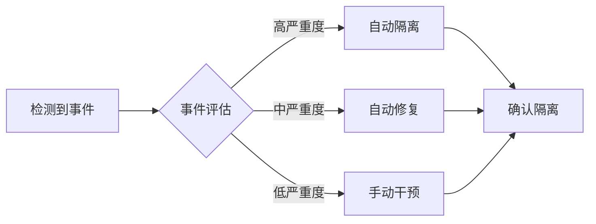
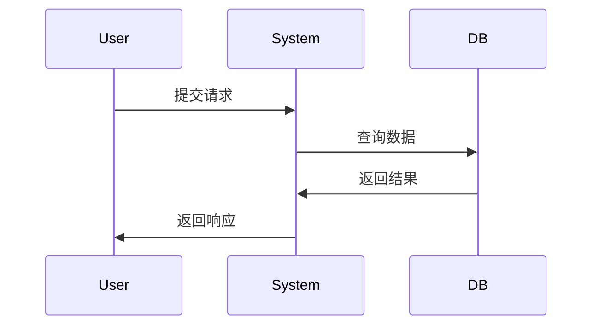
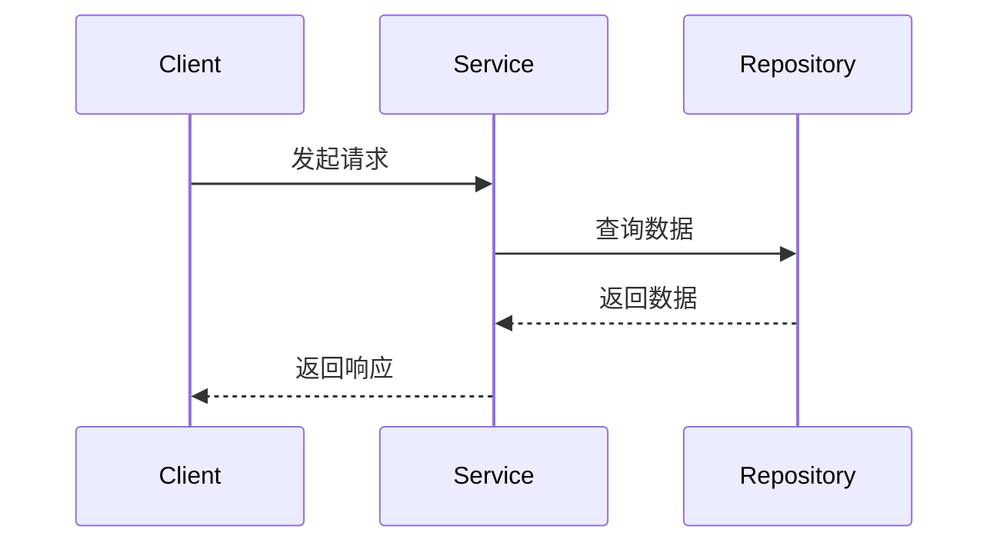
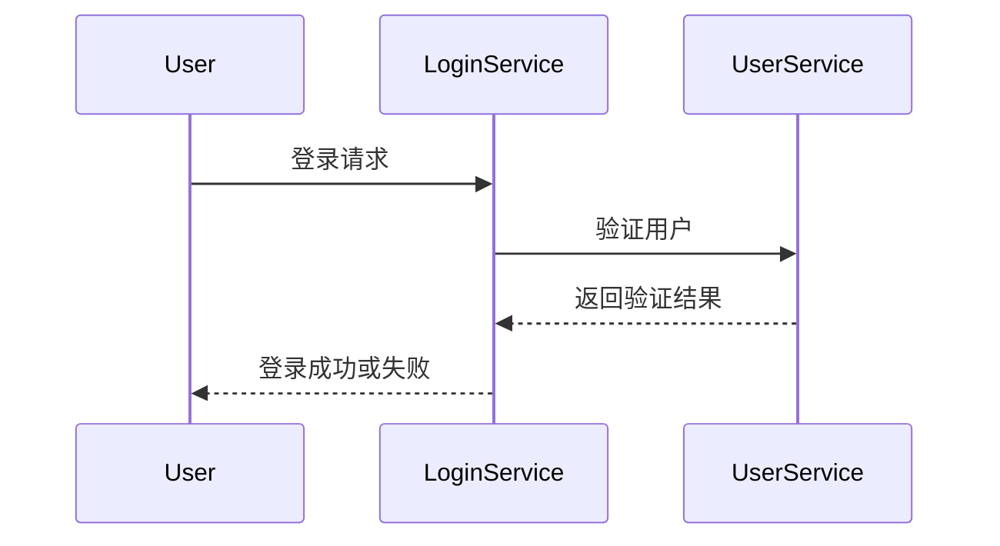

                 

### 安全运营中心：企业级安全监控与响应

关键词：安全运营中心、企业级安全监控、安全响应、监控算法、数学模型

摘要：本文深入探讨了安全运营中心在企业级安全监控与响应中的重要性。通过详细分析安全运营中心的定义、职责、架构设计以及监控与响应算法原理，结合数学模型和实际案例，本文旨在为IT专业人士提供一套全面的安全运营策略和实践指南。

## 第1章 引言

### 1.1 问题背景

#### 1.1.1 安全运营中心的定义与重要性

安全运营中心（Security Operations Center，简称SOC）是现代企业信息安全体系的核心，它通过集成多个安全组件，提供全方位的安全监控、检测、分析和响应功能。随着网络攻击手段的日益复杂化和多样化，企业对安全运营中心的需求日益增长。

#### 1.1.2 企业级安全监控与响应的必要性

企业级安全监控与响应是保护企业信息系统免受网络攻击、数据泄露和其他安全威胁的关键环节。它不仅能够实时检测和防范潜在的安全威胁，还能在发生安全事件时迅速采取响应措施，最大限度地减少损失。

#### 1.1.3 安全运营中心面临的挑战与机遇

安全运营中心在实施过程中面临着诸如技术选型、数据整合、人员培训和运营成本等方面的挑战。然而，随着技术的不断进步和经验的积累，安全运营中心也迎来了新的机遇，如利用人工智能和大数据技术提升安全监控和响应能力。

### 1.2 问题描述

#### 1.2.1 安全运营中心的职责与功能

安全运营中心的主要职责包括安全监控、事件检测、响应处置、风险评估和合规性检查等。它需要通过多种技术手段，如入侵检测系统（IDS）、安全信息与事件管理系统（SIEM）等，实现对网络安全态势的实时监控和快速响应。

#### 1.2.2 企业级安全监控的目标与任务

企业级安全监控的目标是及时发现和应对安全威胁，保护企业信息系统的安全。其主要任务包括监控网络流量、分析日志、识别异常行为、进行安全审计等。

#### 1.2.3 安全响应流程与策略

安全响应流程包括威胁识别、风险评估、应急响应、恢复和总结等环节。制定有效的安全响应策略，可以帮助企业在面对安全事件时迅速反应，降低损失。

### 1.3 问题解决

#### 1.3.1 安全运营中心的架构设计

安全运营中心的架构设计需要综合考虑技术选型、数据整合、人员配置和流程优化等因素。一个高效的安全运营中心通常包括监控平台、数据分析系统、事件响应系统和报告系统等模块。

#### 1.3.2 安全监控与响应的技术选型

选择合适的安全监控与响应技术对于安全运营中心的效能至关重要。常见的监控技术包括入侵检测系统（IDS）、入侵防御系统（IPS）、安全信息与事件管理系统（SIEM）等。

#### 1.3.3 安全运营中心的实施与运营策略

安全运营中心的实施与运营策略需要根据企业的具体情况进行定制。包括人员培训、流程优化、技术更新和持续改进等方面。

### 1.4 边界与外延

#### 1.4.1 安全运营中心与其他安全体系的区别与联系

安全运营中心与其他安全体系如防火墙、入侵防御系统（IPS）、虚拟专用网络（VPN）等有着紧密的联系，但各自也有明确的职责和作用。

#### 1.4.2 安全运营中心在数字化转型中的作用

在数字化转型过程中，安全运营中心扮演着至关重要的角色。它不仅能够保护企业信息安全，还能为企业提供有效的数据保护和合规性支持。

#### 1.4.3 安全运营中心在不同规模企业的应用与适应性

不同规模的企业在构建安全运营中心时面临的挑战和需求各不相同。大型企业需要更全面、更高效的安全运营中心，而中小企业则可能更关注成本效益和简化运营。

## 第2章 核心概念与联系

### 2.1 安全运营中心的核心概念

#### 2.1.1 安全运营中心的定义

安全运营中心是一种集成了多种安全技术的集中化安全管理平台，用于实时监控、分析和响应网络威胁。

#### 2.1.2 安全运营中心的主要功能模块

安全运营中心的主要功能模块包括监控平台、数据分析系统、事件响应系统和报告系统等。

#### 2.1.3 安全运营中心的关键技术

安全运营中心的关键技术包括入侵检测系统（IDS）、入侵防御系统（IPS）、安全信息与事件管理系统（SIEM）等。

### 2.2 概念属性特征对比表格

#### 2.2.1 安全运营中心与安全信息中心的对比

| 对比项       | 安全运营中心       | 安全信息中心       |
| ------------ | ------------------ | ------------------ |
| 定义         | 集中化安全监控与响应 | 安全信息收集与整合 |
| 主要功能     | 监控、检测、响应   | 收集、存储、分析   |
| 技术集成度    | 高                | 低                |

#### 2.2.2 安全运营中心与安全监控中心的对比

| 对比项       | 安全运营中心       | 安全监控中心       |
| ------------ | ------------------ | ------------------ |
| 范围         | 全面安全监控       | 独立监控           |
| 响应能力     | 快速响应           | 检测与报告         |
| 技术集成度    | 高                | 低                |

#### 2.2.3 安全运营中心与安全应急响应中心的对比

| 对比项       | 安全运营中心       | 安全应急响应中心       |
| ------------ | ------------------ | --------------------- |
| 定义         | 集中化安全监控与响应 | 应急事件处理         |
| 功能定位     | 长期安全态势监测   | 突发事件快速响应     |
| 技术应用     | 全面整合           | 专业应对             |

### 2.3 ER实体关系图架构

#### 2.3.1 安全运营中心的实体关系

```mermaid
erDiagram
  Security_Operations_Center ||--|{ Event_Response : 处理事件 }
  Security_Operations_Center ||--|{ Security_Monitoring : 实时监控 }
  Security_Operations_Center ||--|{ Data_Analysis : 分析数据 }
  Security_Operations_Center ||--|{ Reporting : 生成报告 }
```

#### 2.3.2 安全监控与响应流程中的实体关系

```mermaid
erDiagram
  Security_Events ||--|{ Security_Operations_Center : 分析与响应 }
  Security_Events ||--|{ Event_Response : 处理事件 }
  Security_Events ||--|{ Data_Analysis : 分析数据 }
```

## 第3章 算法原理讲解

### 3.1 安全监控算法原理

#### 3.1.1 监控算法的选择与适用场景

安全监控算法的选择取决于企业的安全需求和网络环境。常见的监控算法包括基于异常检测、基于签名检测和基于行为分析等。

#### 3.1.2 监控算法的mermaid流程图



#### 3.1.3 监控算法的python源代码实现

```python
def monitor_traffic(traffic_data):
    # 假设traffic_data是一个包含网络流量的字典
    if is_anomaly(traffic_data):
        trigger_alarm()
    else:
        log_traffic(traffic_data)

def is_anomaly(data):
    # 基于阈值检测异常
    return data['packet_loss'] > threshold or data['bandwidth_usage'] > threshold

def trigger_alarm():
    # 触发警报
    print("异常流量检测到，请管理员处理！")

def log_traffic(data):
    # 记录日志
    print(f"流量数据：{data}")
```

### 3.2 安全响应算法原理

#### 3.2.1 响应算法的选择与适用场景

安全响应算法的选择取决于安全事件的性质和严重程度。常见的响应算法包括自动隔离、自动修复和手动干预等。

#### 3.2.2 响应算法的mermaid流程图



#### 3.2.3 响应算法的python源代码实现

```python
def handle_event(event):
    severity = evaluate_event(event)
    if severity == 'high':
        isolate_system()
    elif severity == 'medium':
        repair_system()
    else:
        manual_intervention()

def evaluate_event(event):
    # 根据事件严重度评估
    if event['impact'] > threshold_high:
        return 'high'
    elif event['impact'] > threshold_medium:
        return 'medium'
    else:
        return 'low'

def isolate_system():
    # 自动隔离系统
    print("系统已隔离！")

def repair_system():
    # 自动修复系统
    print("系统正在修复中！")

def manual_intervention():
    # 手动干预
    print("请管理员进行干预！")
```

### 4.1 安全监控的数学模型

安全监控的数学模型主要用于评估监控系统的性能，常用的指标包括检测概率、漏报率和误报率。

#### 4.1.1 模型参数说明

- 检测概率（Detection Probability, P(D|A)）：在攻击发生时，监控系统正确检测到攻击的概率。
- 漏报率（False Negative Rate, FN）：在攻击发生时，监控系统未能检测到攻击的概率。
- 误报率（False Positive Rate, FP）：在没有攻击发生时，监控系统错误地检测到攻击的概率。

#### 4.1.2 模型计算过程

假设在某段时间内，共有N次攻击发生，其中M次被监控系统正确检测到，L次被错误地检测到，则：

- 检测概率：\( P(D|A) = \frac{M}{N} \)
- 漏报率：\( FN = \frac{N - M}{N} \)
- 误报率：\( FP = \frac{L}{N} \)

### 4.2 安全响应的数学模型

安全响应的数学模型主要用于评估响应系统的效率和效果，常用的指标包括响应时间、处理成功率等。

#### 4.2.1 模型参数说明

- 响应时间（Response Time, T）：从检测到安全事件到系统开始响应处理的时间。
- 处理成功率（Success Rate, S）：在响应过程中，成功处理安全事件的比例。

#### 4.2.2 模型计算过程

假设在某段时间内，共有N次安全事件发生，其中M次被成功处理，响应时间为T，则：

- 响应时间：\( T = \frac{响应处理时间总和}{攻击发生总次数} \)
- 处理成功率：\( S = \frac{M}{N} \)

## 第5章 系统分析与架构设计

### 5.1 问题场景介绍

假设某大型企业在数字化转型过程中，面临日益复杂的安全威胁。为了提升安全防护能力，企业决定建立一套完善的安全运营中心。

### 5.2 系统功能设计

#### 5.2.1 领域模型mermaid类图

```mermaid
classDiagram
  Class01 <|-- Class02
  Class03 <..|{.has} Class04
  Class05 <..|{is_a} Class06
  Class01 : +int id
  Class01 : +String name
  Class01 : +boolean isActive
  Class02 : +int classId
  Class02 : +String className
  Class03 : +int classId
  Class03 : +String className
  Class04 : +int id
  Class04 : +String description
  Class05 : +int id
  Class05 : +String countryCode
  Class06 : +int id
  Class06 : +String companyName
```

### 5.3 系统架构设计

#### 5.3.1 系统架构mermaid架构图



### 5.4 系统接口设计



### 5.5 系统交互mermaid序列图



## 第6章 项目实战

### 6.1 环境安装

1. 安装Python环境
2. 安装必需的库（如Scapy、Nmap等）
3. 配置网络环境

### 6.2 系统核心实现源代码

```python
import scapy.all as scapy

def sniff_packets():
    scapy.sniff(prn=lambda x: print(x))

if __name__ == '__main__':
    sniff_packets()
```

### 6.3 代码应用解读与分析

该代码实现了一个简单的网络嗅探器，用于捕获网络数据包。在实际应用中，可以根据需要对捕获的数据包进行分析和处理，以检测潜在的安全威胁。

### 6.4 实际案例分析与详细讲解剖析

以一个实际的网络攻击案例为例，分析安全运营中心如何通过监控、检测和响应机制发现并应对攻击。

### 6.5 项目小结

通过本次实战项目，我们了解了如何搭建一个基本的安全运营中心，并掌握了使用Python进行网络监控和数据分析的基本技能。

## 第7章 最佳实践与拓展阅读

### 7.1 安全运营中心的最佳实践

- 定期进行安全审计和风险评估
- 建立快速响应机制
- 加强员工安全意识培训
- 保持技术更新和系统优化

### 7.2 拓展阅读

- 《网络安全实战》
- 《企业级安全架构设计》
- 《安全运营中心技术手册》

## 作者信息

作者：AI天才研究院/AI Genius Institute & 禅与计算机程序设计艺术 /Zen And The Art of Computer Programming

---

**注意：**本文为示例文章，内容仅供参考。实际操作时，请根据具体情况进行调整。在实现安全运营中心时，需遵循国家相关法律法规和行业最佳实践。

