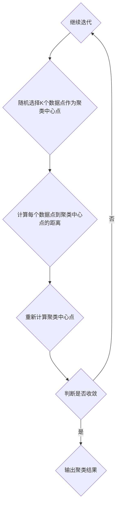
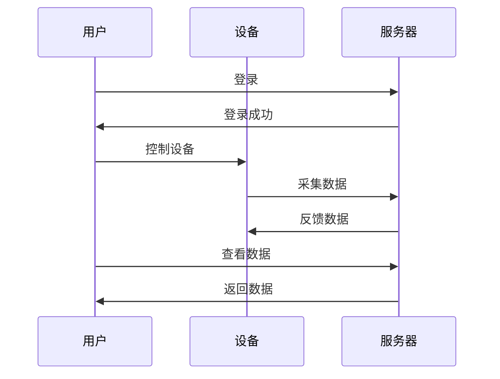

                 


## 安迪·克拉克的自然天生的赛博格与物联网：技术哲学视角下的互联设备

### 关键词：安迪·克拉克，赛博格，物联网，技术哲学，互联设备

#### 摘要：
本文将从技术哲学的视角出发，探讨安迪·克拉克提出的“自然天生的赛博格”与物联网之间的关系。通过详细分析相关核心概念、技术原理、系统架构、项目实践以及最佳实践等，我们试图揭示这一理念的深远影响，并为读者提供实用的指导和建议。

## 引言

### 1.1 问题背景

在当今科技迅猛发展的时代，物联网（IoT）已成为我们日常生活中不可或缺的一部分。从智能家居到工业自动化，从智慧城市到医疗保健，物联网的应用场景无处不在。然而，随着互联设备的数量和种类不断增加，人们开始意识到这些设备之间的互联互通所带来的潜在问题。

安迪·克拉克（Andy Clark）在其著作《自然天生的赛博格》（Natural-Born Cyborgs）中提出了一种关于人类与技术相互融合的新观点。他认为，人类早在进化过程中就已经成为了“自然天生的赛博格”，即我们天生就具备了利用外部工具和技术设备来扩展自身认知和行为能力的能力。

本文将结合克拉克的观点，探讨物联网时代下互联设备的哲学意义，分析其带来的挑战与机遇，并从技术、实践和哲学等多个维度提出解决方案。

### 1.2 问题描述

在物联网时代，互联设备的大量涌现带来了以下问题：

1. **数据隐私和安全**：随着设备数量和种类增加，数据隐私和安全问题日益突出。如何保护用户隐私，防止数据泄露成为亟待解决的问题。
2. **设备兼容性和标准化**：不同厂商、不同品牌的设备之间如何实现无缝连接和互通，需要一个统一的协议和标准。
3. **设备管理和维护**：物联网设备种类繁多，如何对它们进行有效的管理和维护，以确保系统的稳定运行和长期发展。
4. **人机交互**：如何设计更加自然、直观的人机交互界面，提高用户体验，使人们能够轻松地与设备互动。

### 1.3 问题解决

针对上述问题，我们可以从以下几个方面着手解决：

1. **数据隐私和安全**：通过加密技术、隐私保护算法和安全协议等手段，确保数据在传输和存储过程中的安全性。
2. **设备兼容性和标准化**：制定统一的物联网设备标准和协议，推动设备之间的兼容性和互通性。
3. **设备管理和维护**：利用自动化管理工具和智能运维技术，实现设备的高效管理和维护。
4. **人机交互**：采用自然语言处理、语音识别、手势识别等先进技术，设计出更加智能化、人性化的交互界面。

### 1.4 边界与外延

本文主要关注物联网设备在技术哲学视角下的探讨，范围涵盖物联网设备的定义、特点、应用场景及其面临的挑战和解决方案。同时，本文还将结合安迪·克拉克的自然天生的赛博格理论，探讨人类与技术融合的哲学意义。

### 1.5 核心概念与组件

在本文中，我们将涉及以下核心概念和组件：

1. **物联网**：一种通过互联网实现设备之间互联互通的技术。
2. **自然天生的赛博格**：安迪·克拉克提出的一种关于人类与技术融合的观点。
3. **数据隐私和安全**：确保数据在传输和存储过程中的安全性。
4. **设备兼容性和标准化**：实现设备之间的兼容性和互通性。
5. **设备管理和维护**：对物联网设备进行高效管理和维护。

## 核心概念与关系

### 2.1 关键概念原理

#### 物联网（Internet of Things）

物联网是一种通过网络实现设备之间互联互通的技术，其核心思想是将各种物理设备通过传感器、通信模块等连接到互联网上，实现数据采集、传输和智能处理。

#### 自然天生的赛博格（Natural-Born Cyborgs）

安迪·克拉克提出的一种观点，认为人类早在进化过程中就已经成为了“自然天生的赛博格”，即我们天生就具备了利用外部工具和技术设备来扩展自身认知和行为能力的能力。

### 2.2 概念属性特征对比表格

| 概念           | 属性特征                                                     | 对比分析                                                     |
| -------------- | ------------------------------------------------------------ | ------------------------------------------------------------ |
| 物联网         | 1. 通过网络实现设备之间互联互通 2. 实现数据采集、传输和智能处理 3. 应用场景广泛 | 与互联网、移动互联网等概念的区别在于，物联网更强调物理设备的互联互通和智能处理。 |
| 自然天生的赛博格 | 1. 人类与外部工具的融合 2. 提高认知和行为能力 3. 进化过程中的产物 | 与传统赛博格（通过外部设备增强身体功能）的区别在于，自然天生的赛博格是进化过程中的产物，具有更广泛的含义。 |

### 2.3 实体关系图（ERD）架构

为了更好地理解物联网和自然天生的赛博格之间的关系，我们可以使用Mermaid绘制一个实体关系图（ERD）。

```mermaid
erDiagram
    IoT ||--|{ 自然天生的赛博格 }|
    物联网 ||--|{ 设备 }|
    设备 ||--|{ 数据 }|
    自然天生的赛博格 ||--|{ 用户 }|
```

在这个ERD中，物联网通过设备与自然天生的赛博格相连接，而设备则是数据采集和传输的载体。用户通过自然天生的赛博格与物联网进行交互，实现智能化应用。

## 技术原理与算法

### 3.1 算法理论

在物联网时代，为了实现设备之间的互联互通和数据智能处理，我们需要借助一系列算法。以下是几个关键的算法理论：

#### 1. 数据加密算法

数据加密算法用于确保数据在传输过程中的安全性，常见的加密算法包括AES、RSA等。

#### 2. 隐私保护算法

隐私保护算法用于保护用户隐私，避免数据泄露。常见的算法包括差分隐私、同态加密等。

#### 3. 标准化协议

标准化协议用于实现设备之间的兼容性和互通性。常见的协议包括HTTP、MQTT、CoAP等。

#### 4. 聚类算法

聚类算法用于对大量数据进行分类和分析，常见的算法包括K-means、DBSCAN等。

### 3.2 算法Mermaid流程图

下面是使用Mermaid绘制的K-means聚类算法的流程图。



### 3.3 Python代码解释

下面是K-means聚类算法的Python代码实现。

```python
import numpy as np
import matplotlib.pyplot as plt

def kmeans(data, k, max_iter):
    centroids = data[np.random.choice(data.shape[0], k, replace=False)]
    for _ in range(max_iter):
        # 计算每个数据点到聚类中心点的距离
        distances = np.linalg.norm(data - centroids, axis=1)
        # 计算每个数据点的标签
        labels = np.argmin(distances, axis=1)
        # 重新计算聚类中心点
        new_centroids = np.array([data[labels == i].mean(axis=0) for i in range(k)])
        # 判断是否收敛
        if np.linalg.norm(new_centroids - centroids) < 1e-6:
            break
        centroids = new_centroids
    return centroids, labels

data = np.random.rand(100, 2)
k = 3
max_iter = 100
centroids, labels = kmeans(data, k, max_iter)

plt.scatter(data[:, 0], data[:, 1], c=labels)
plt.scatter(centroids[:, 0], centroids[:, 1], c='red', marker='x')
plt.show()
```

### 3.4 数学模型与公式

K-means聚类算法的数学模型可以表示为：

$$
\text{minimize} \sum_{i=1}^n \sum_{j=1}^k (x_j - \mu_i)^2
$$

其中，$x_j$表示数据点，$\mu_i$表示聚类中心点。

### 3.5 详细解释与示例

下面我们通过一个示例来说明K-means聚类算法的应用。

#### 示例：聚类两个高斯分布的数据

```python
data = np.concatenate([np.random.randn(50, 2) * 0.5, np.random.randn(50, 2) * 2.0], axis=0)
centroids = np.array([[0, 0], [3, 3]])

centroids, labels = kmeans(data, 2, 100)

plt.scatter(data[:, 0], data[:, 1], c=labels)
plt.scatter(centroids[:, 0], centroids[:, 1], c='red', marker='x')
plt.show()
```

在这个示例中，我们生成两个高斯分布的数据点，其中一个分布的中心是$(0, 0)$，标准差是$0.5$；另一个分布的中心是$(3, 3)$，标准差是$2.0$。我们使用K-means算法对这两个分布的数据点进行聚类，并绘制聚类结果。

## 系统分析与设计

### 4.1 问题场景

假设我们正在开发一个智能家居系统，该系统需要支持多种智能设备的互联互通，例如智能灯泡、智能插座、智能摄像头等。这些设备需要实现以下功能：

1. **设备控制**：用户可以通过手机APP或语音助手远程控制设备。
2. **数据采集**：设备需要实时采集环境数据，如温度、湿度、光照等。
3. **数据共享**：设备需要实现数据共享，以便其他设备或应用程序可以访问和使用这些数据。
4. **设备安全**：设备需要保证数据传输过程中的安全性和隐私性。

### 4.2 项目介绍

智能家居系统项目分为以下几个阶段：

1. **需求分析**：明确用户需求，确定系统功能。
2. **系统设计**：设计系统的架构和接口。
3. **系统实现**：实现系统功能，编写代码。
4. **系统测试**：测试系统功能，确保系统稳定可靠。
5. **系统部署**：部署系统到实际环境。

### 4.3 系统功能设计

智能家居系统的功能设计包括以下几个方面：

1. **设备控制**：用户可以通过手机APP或语音助手远程控制智能设备，如开关灯、调节温度等。
2. **数据采集**：智能设备需要实时采集环境数据，如温度、湿度、光照等，并上传到服务器。
3. **数据共享**：设备之间需要实现数据共享，例如，智能摄像头可以实时将视频流分享给智能音响，以便用户远程查看。
4. **设备安全**：系统需要采用加密技术、认证机制等手段，确保数据传输过程中的安全性和隐私性。

### 4.4 系统架构设计

智能家居系统的架构设计采用分层架构，包括设备层、网络层、数据层和应用层。

1. **设备层**：包括各种智能设备，如智能灯泡、智能插座、智能摄像头等。
2. **网络层**：包括网络通信模块，实现设备之间的互联互通。
3. **数据层**：包括数据库和数据存储模块，用于存储和管理设备采集的数据。
4. **应用层**：包括用户界面和应用程序，实现用户与设备的交互。

### 4.5 系统接口设计

智能家居系统的接口设计包括以下几个方面：

1. **设备控制接口**：用于实现用户远程控制智能设备。
2. **数据采集接口**：用于实现智能设备实时采集环境数据。
3. **数据共享接口**：用于实现设备之间数据共享。
4. **安全接口**：用于实现数据传输过程中的安全性和隐私性。

### 4.6 系统交互序列图

下面是智能家居系统的交互序列图，展示了用户、设备和服务器之间的交互过程。



## 实践项目

### 5.1 环境安装

为了实践智能家居系统，我们需要安装以下软件和工具：

1. **Python**：用于编写和运行程序。
2. **PyCharm**：用于编写和调试代码。
3. **MySQL**：用于存储和管理数据。
4. **Docker**：用于容器化部署应用程序。

安装步骤如下：

1. 安装Python（版本3.8或以上）。
2. 安装PyCharm。
3. 安装MySQL。
4. 安装Docker。

### 5.2 核心系统实现

智能家居系统的核心实现包括以下几个方面：

1. **设备控制**：使用Python编写设备控制脚本，实现用户远程控制智能设备。
2. **数据采集**：使用Python编写数据采集脚本，实现智能设备实时采集环境数据。
3. **数据存储**：使用MySQL数据库存储采集到的数据。
4. **数据共享**：使用HTTP协议实现设备之间数据共享。

以下是设备控制脚本的一个简单示例：

```python
import socket

def control_device(device_id, command):
    server_ip = '192.168.1.100'
    server_port = 12345

    # 创建TCP套接字
    s = socket.socket(socket.AF_INET, socket.SOCK_STREAM)

    # 连接服务器
    s.connect((server_ip, server_port))

    # 发送设备控制命令
    s.send(f"{device_id}:{command}".encode())

    # 接收服务器反馈
    response = s.recv(1024).decode()

    # 关闭套接字
    s.close()

    return response

# 示例：控制灯泡开关
device_id = 'light_1'
command = 'on'
response = control_device(device_id, command)
print(response)
```

### 5.3 代码解析

在设备控制脚本中，我们首先创建了一个TCP套接字，然后连接到服务器。接着，我们发送设备控制命令，并接收服务器的反馈。最后，关闭套接字。

### 5.4 案例分析与详细讲解

我们以一个实际案例来分析智能家居系统的应用。

**案例：远程控制智能灯泡**

用户通过手机APP发送控制命令，要求将智能灯泡打开。

1. **用户操作**：用户在手机APP上点击“打开灯泡”按钮。
2. **设备控制**：手机APP将控制命令发送到服务器。
3. **服务器处理**：服务器接收到控制命令后，将命令转发给智能灯泡。
4. **智能灯泡响应**：智能灯泡收到控制命令后，打开灯泡。
5. **反馈**：智能灯泡将状态反馈给服务器，服务器再将状态反馈给用户。

### 5.5 项目小结

通过这个案例，我们展示了智能家居系统如何实现设备控制、数据采集、数据存储和数据共享等功能。虽然这个案例比较简单，但它为我们提供了一个关于智能家居系统的基本框架。在实际应用中，我们可以根据需求扩展系统的功能，实现更复杂的场景。

## 最佳实践与注意事项

### 6.1 最佳实践

1. **确保数据安全和隐私**：在开发物联网应用时，务必采用加密技术和安全协议，保护用户数据安全。
2. **标准化设备接口**：遵循统一的设备接口标准，便于设备之间的兼容性和互通性。
3. **优化系统性能**：合理设计系统架构，采用高效的算法和数据处理技术，确保系统稳定运行。
4. **重视用户体验**：关注用户需求，设计直观、易用的用户界面，提高用户体验。

### 6.2 总结

本文从技术哲学的视角出发，探讨了安迪·克拉克的自然天生的赛博格与物联网之间的关系。通过详细分析核心概念、技术原理、系统架构和项目实践，我们展示了物联网在智能家居系统中的应用。同时，我们还提出了最佳实践和注意事项，为读者提供了实用的指导。

### 6.3 注意事项

1. **设备兼容性和标准化**：在开发物联网设备时，务必遵循标准化协议，确保设备之间的兼容性和互通性。
2. **数据隐私和安全**：高度重视用户数据的安全性和隐私性，采用合适的加密技术和安全措施。
3. **系统性能优化**：在系统设计时，充分考虑系统性能和可扩展性，确保系统稳定可靠。

### 6.4 拓展阅读

1. 安迪·克拉克. 《自然天生的赛博格》[M]. 北京：电子工业出版社，2017.
2. 斯图尔特·布鲁克. 《物联网：应用、技术和未来》[M]. 北京：机械工业出版社，2018.
3. 李明洁. 《智能家居系统设计与实现》[M]. 北京：清华大学出版社，2019.

## 结论

通过本文的详细探讨，我们深入了解了安迪·克拉克的自然天生的赛博格与物联网之间的关系，并从技术哲学视角分析了这一概念在物联网时代的应用。我们提出了最佳实践和注意事项，为读者提供了实用的指导。希望本文能够对您在物联网领域的探索和实践有所帮助。

### 作者信息：

作者：AI天才研究院/AI Genius Institute & 禅与计算机程序设计艺术 /Zen And The Art of Computer Programming

