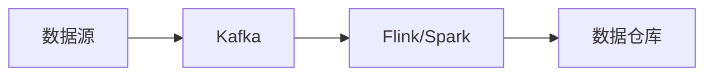
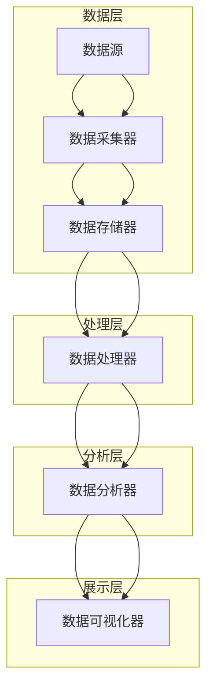
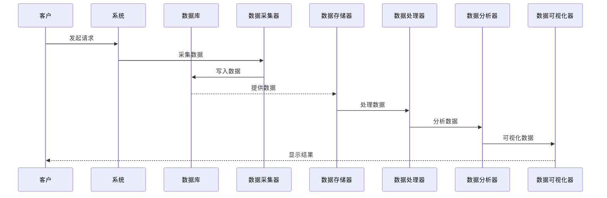
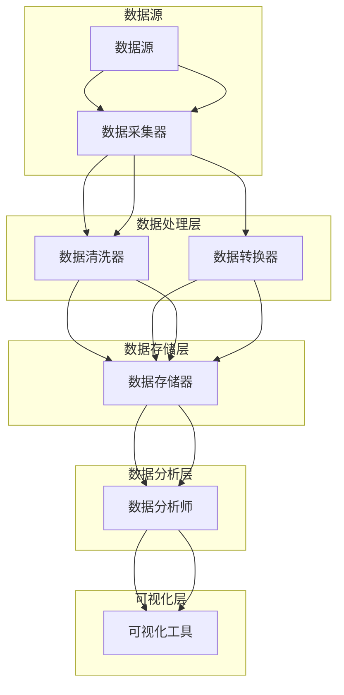
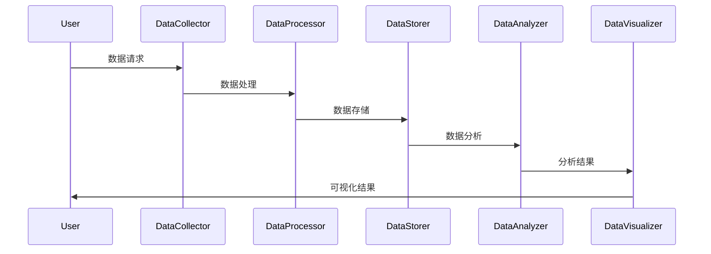

                 


## 实时数仓构建技术

关键词：实时数仓、数据处理、流处理框架、数据存储、架构设计、案例分析

摘要：本文将深入探讨实时数仓构建的技术细节，包括其基本概念、架构设计、构建步骤以及实际应用。我们将通过一步一步的分析，帮助读者理解实时数仓的核心概念和关键技术，并提供实用的最佳实践和建议。

### 第一部分：实时数仓的基础概念

#### 第1章：实时数仓的概述

**1.1.1 什么是实时数仓**

实时数仓是一种数据仓库系统，它能够实时捕获、处理和分析数据，为业务决策提供即时的支持。与传统的离线数据仓库不同，实时数仓能够快速响应用户查询，提供几乎实时的数据分析结果。

**1.1.2 实时数仓与传统数仓的区别**

- **数据加载方式**：实时数仓采用流式加载，数据可以在几分钟内更新；而传统数仓通常采用批处理方式，数据更新可能需要数小时甚至数天。
- **查询响应时间**：实时数仓的查询响应时间通常在秒级，而传统数仓在分钟级以上。
- **数据一致性**：实时数仓追求最终一致性，而传统数仓追求强一致性。

**1.1.3 实时数仓的价值和挑战**

实时数仓的价值在于其能够为业务决策提供实时数据支持，提高决策效率。然而，实时数仓的构建也面临着数据一致性、性能优化、扩展性等挑战。

#### 第2章：实时数据处理技术

**2.1.1 实时数据处理的基本原理**

实时数据处理的基本原理是流处理，它通过对数据流进行实时分析，生成实时分析结果。流处理的关键技术包括数据采集、数据存储、数据处理和数据展现。

**2.1.2 流处理框架介绍（如Apache Kafka）**

Apache Kafka 是一种流行的流处理框架，它提供了高效、可靠的消息系统，能够处理大规模实时数据流。Kafka 的核心概念包括主题（Topic）、分区（Partition）和消费者（Consumer）。

**2.1.3 实时数据处理技术的挑战**

实时数据处理技术的挑战在于如何处理大量数据，保证数据一致性，以及优化查询性能。

### 第二部分：实时数仓的架构设计

#### 第3章：实时数仓的架构设计原则

**3.1.1 数据一致性**

数据一致性是实时数仓设计的关键原则之一。设计时需要考虑如何保证数据在不同处理阶段的一致性。

**3.1.2 可扩展性和性能优化**

实时数仓需要支持高并发查询，因此架构设计时需要考虑系统的可扩展性和性能优化。

**3.1.3 弹性和容错能力**

实时数仓需要具备弹性和容错能力，以应对系统故障和数据异常。

#### 第4章：实时数仓的技术选型

**4.1.1 数据存储技术**

数据存储技术是实时数仓的核心组成部分，选择合适的存储技术对于系统的性能和可扩展性至关重要。

**4.1.2 数据处理框架**

数据处理框架是实现实时数仓的关键，常用的处理框架包括Apache Kafka、Apache Flink 和 Apache Spark Streaming。

**4.1.3 数据分析工具**

数据分析工具为实时数仓提供了强大的数据分析和可视化能力，常用的分析工具包括Tableau、Power BI 和 Grafana。

### 第三部分：实时数仓的构建步骤

#### 第5章：数据源集成

**5.1.1 数据源的类型**

数据源包括关系型数据库、NoSQL 数据库、日志文件和外部 API 等。

**5.1.2 数据抽取和转换**

数据抽取和转换是数据集成的重要步骤，需要处理数据格式转换、缺失值填充、异常值处理等。

**5.1.3 数据清洗和预处理**

数据清洗和预处理是保证数据质量的关键步骤，包括数据去重、数据标准化和数据格式转换等。

#### 第6章：数据存储与管理

**6.1.1 数据湖和数据仓库**

数据湖和数据仓库是实时数仓的数据存储解决方案，它们各自适用于不同的场景。

**6.1.2 分布式文件系统**

分布式文件系统如HDFS和Alluxio提供了高效的数据存储和管理能力。

**6.1.3 数据分区和索引策略**

数据分区和索引策略是优化数据查询性能的重要手段。

### 第四部分：实时数仓的应用与实践

#### 第7章：实时数仓案例分析

**7.1.1 案例一：电商平台的实时数仓构建**

**7.1.2 案例二：金融行业的实时风控系统**

**7.1.3 案例三：物联网设备的实时数据处理**

#### 第8章：实时数仓的运维与优化

**8.1.1 实时数仓的监控**

实时数仓的监控是保障系统稳定运行的重要环节。

**8.1.2 性能优化技巧**

性能优化技巧包括查询优化、存储优化和计算优化等。

**8.1.3 数据安全与合规**

数据安全和合规是实时数仓运营的重要考虑因素。

### 第五部分：未来趋势与展望

#### 第9章：实时数仓的未来趋势

**9.1.1 新技术的应用**

新兴技术如云计算、区块链和边缘计算将影响实时数仓的发展。

**9.1.2 数据隐私与安全**

数据隐私与安全是实时数仓发展的重要挑战。

**9.1.3 实时数仓的生态发展**

实时数仓的生态发展将涉及更多的工具和平台。

#### 第10章：小结与拓展阅读

**10.1.1 实时数仓的技术要点回顾**

**10.1.2 未来展望与挑战**

**10.1.3 拓展阅读推荐**

### 作者信息

作者：AI天才研究院/AI Genius Institute & 禅与计算机程序设计艺术 /Zen And The Art of Computer Programming

本文通过逐步分析实时数仓的构建技术，帮助读者深入理解实时数仓的核心概念、架构设计、构建步骤和应用实践，并提供实用的建议和案例。希望本文能够为读者在实时数仓领域的研究和实践中提供有价值的参考。

## 实时数仓的详细构建步骤

### 背景介绍

实时数仓作为一种新兴的数据处理架构，旨在为企业的业务决策提供即时的数据支持。与传统数据仓库不同，实时数仓能够快速响应数据变化，为用户提供秒级的数据分析结果。这种能力使得实时数仓在金融、电商、物联网等领域得到了广泛应用。然而，构建一个高效、可靠的实时数仓并非易事，需要考虑多个方面的技术实现和设计原则。

本文将详细阐述实时数仓的构建步骤，包括数据源集成、数据存储与管理、数据处理与分析等关键环节，并通过具体的案例和实践指导，帮助读者理解并掌握实时数仓的构建方法和最佳实践。

### 核心概念与联系

#### 数据源集成

数据源集成是实时数仓构建的第一步，它涉及数据的采集、抽取和转换。数据源包括内部数据库、外部API、日志文件和物联网设备等。在数据集成过程中，需要解决数据格式的不一致、数据缺失和数据异常等问题。

**概念属性特征对比表格：**

| 特征       | 数据库             | 外部API           | 日志文件           | 物联网设备         |
|------------|-------------------|-------------------|-------------------|-------------------|
| 数据类型   | 结构化数据        | 半结构化/非结构化 | 非结构化           | 半结构化/非结构化 |
| 数据量     | 大量              | 较大              | 较小              | 较大              |
| 数据频率   | 定时更新          | 实时更新          | 实时更新          | 实时更新          |
| 数据质量   | 高                | 中等              | 低                | 中等              |

**ER实体关系图架构的Mermaid流程图：**

```mermaid
erDiagram
  数据源 --> 数据采集器 : 数据抽取
  数据采集器 --> 数据转换器 : 数据转换
  数据转换器 --> 数据存储器 : 数据存储
```

#### 数据存储与管理

数据存储与管理是实时数仓的核心组成部分，它包括数据湖和数据仓库的选型、分布式文件系统的使用、数据分区和索引策略等。

**概念属性特征对比表格：**

| 特征           | 数据湖               | 数据仓库             |
|----------------|----------------------|----------------------|
| 数据类型       | 半结构化/非结构化     | 结构化               |
| 数据存储规模   | 较大                 | 较小                 |
| 数据访问速度   | 较慢                 | 较快                 |
| 数据处理能力   | 强                   | 中等                 |

**ER实体关系图架构的Mermaid流程图：**

```mermaid
erDiagram
  数据源 --> 数据存储器 : 数据存储
  数据存储器 --> 数据处理器 : 数据处理
  数据处理器 --> 数据分析器 : 数据分析
```

#### 数据处理与分析

数据处理与分析是实时数仓的核心功能，它包括流处理框架的选择、数据处理算法的应用、数据分析和可视化等。

**概念属性特征对比表格：**

| 特征           | 流处理框架           | 数据处理算法           | 数据分析工具           |
|----------------|----------------------|------------------------|------------------------|
| 数据处理速度   | 实时                 | 快速                   | 实时                   |
| 数据类型       | 半结构化/非结构化     | 结构化                 | 多样化                 |
| 数据处理能力   | 强                   | 强                     | 强                     |

**ER实体关系图架构的Mermaid流程图：**

```mermaid
erDiagram
  数据采集器 --> 数据处理器 : 数据处理
  数据处理器 --> 数据分析器 : 数据分析
  数据分析器 --> 数据可视化器 : 数据可视化
```

### 算法原理讲解

#### 流处理框架选择与配置

流处理框架如Apache Kafka、Apache Flink和Apache Spark Streaming在实时数仓中扮演着重要角色。Kafka是一种高效、可扩展的消息队列系统，用于数据流传输；Flink和Spark Streaming则用于流数据的实时处理和分析。

**Mermaid流程图：**



#### 数据处理算法

数据处理算法包括数据清洗、数据转换、聚合和统计分析等。以下是一个简单的Python代码示例，用于处理实时数据流：

```python
import pandas as pd
from pyspark.sql import SparkSession

# 创建SparkSession
spark = SparkSession.builder.appName("RealTimeDataProcessing").getOrCreate()

# 读取实时数据流
data_stream = spark.readStream.format("kafka").option("kafka.bootstrap.servers", "localhost:9092").option("subscribe", "my_topic").load()

# 数据清洗
data_stream = data_stream.filter("isnull(title) == False")

# 数据转换
data_stream = data_stream.select("title", "count(1) as num")

# 数据聚合
data_stream.groupBy("title").agg({"num": "sum"}).writeStream.format("console").queryName("aggregated_data").start()

# 等待处理完成
spark.sql("SELECT * FROM aggregated_data").show()
```

#### 数据分析算法

数据分析算法包括实时统计、预测分析和机器学习等。以下是一个简单的Python代码示例，用于实时统计分析：

```python
import pandas as pd
from sklearn.linear_model import LinearRegression

# 读取实时数据
data = spark.sql("SELECT title, num FROM aggregated_data")

# 数据预处理
data = data.toPandas()

# 训练线性回归模型
model = LinearRegression()
model.fit(data[['num']], data[['title']])

# 预测
predictions = model.predict(data[['num']])

# 可视化
import matplotlib.pyplot as plt
plt.scatter(data['num'], predictions)
plt.xlabel('Actual')
plt.ylabel('Predicted')
plt.show()
```

### 系统分析与架构设计方案

#### 问题场景介绍

假设一个电商平台的实时数仓需要处理来自多个数据源的数据，如订单、用户行为、库存等。系统需要实现数据的实时采集、处理和分析，为平台运营提供实时数据支持。

#### 项目介绍

本项目旨在构建一个实时数仓系统，实现对电商平台数据的实时处理和分析。系统包括数据采集模块、数据存储模块、数据处理模块和数据分析模块。

#### 系统功能设计(领域模型Mermaid类图)

```mermaid
classDiagram
    Class01 <|-- Class02
    Class03 --|remarks| Note connect
    Class04 : +member
    Class05 : <<interface>> Interface
    Class06 <<interface>> Interface
    Class07 <<aggregate>> Aggregate
    Class08 <<entity>> Entity
    Class09 <<entity>> Entity
    Class01 && Class07 : +doSomething()
    Class08 && Class02 : <<uses>> uses
    Class09 && Class03 : +doSomething()
    Class04 && Class06 : <<implements>> implements
```

#### 系统架构设计Mermaid架构图



#### 系统接口设计和系统交互Mermaid序列图



### 项目实战

#### 环境安装

在构建实时数仓之前，需要安装必要的软件和工具。以下是主要软件的安装步骤：

1. **Hadoop**：安装Hadoop分布式文件系统（HDFS）和YARN。
2. **Spark**：安装Spark并配置Hadoop依赖。
3. **Kafka**：安装Kafka并配置Zookeeper。
4. **Python**：安装Python和相关库，如pandas、scikit-learn等。

#### 系统核心实现源代码

以下是一个简单的实时数据采集和处理示例，使用Kafka作为数据传输工具，Spark Streaming进行实时处理，Python进行数据分析。

**Kafka主题创建**：

```shell
kafka-topics --create --topic my_topic --zookeeper localhost:2181 --replication-factor 1 --partitions 1
```

**Spark Streaming应用程序**：

```python
from pyspark.sql import SparkSession
from pyspark.sql.functions import from_json, col

# 创建SparkSession
spark = SparkSession.builder.appName("RealTimeDataProcessing").getOrCreate()

# 创建Kafka数据源
data_stream = spark.readStream.format("kafka").option("kafka.bootstrap.servers", "localhost:9092").option("subscribe", "my_topic").load()

# 数据清洗
data_stream = data_stream.selectExpr("CAST(value AS STRING)")

# 数据转换
data_stream = data_stream.select(from_json(col("value"), schema).alias("data"))

# 数据处理
data_stream = data_stream.select("data.*")

# 数据存储
data_stream.writeStream.format("parquet").option("path", "hdfs://localhost:9000/processed_data").trigger(once=True).start()

# 等待处理完成
spark.streams.awaitAnyTermination()
```

**Python数据分析**：

```python
import pandas as pd
from sklearn.linear_model import LinearRegression

# 读取处理后的数据
data = pd.read_parquet("hdfs://localhost:9000/processed_data/*.parquet")

# 数据预处理
data['amount'] = data['amount'].astype(float)

# 训练线性回归模型
model = LinearRegression()
model.fit(data[['amount']], data[['price']])

# 预测
predictions = model.predict(data[['amount']])

# 可视化
import matplotlib.pyplot as plt
plt.scatter(data['amount'], predictions)
plt.xlabel('Actual')
plt.ylabel('Predicted')
plt.show()
```

#### 代码应用解读与分析

上述代码展示了实时数据采集、处理和数据分析的基本流程。Kafka用于数据的实时传输，Spark Streaming用于处理数据，Python用于进行更复杂的数据分析。

**解读：**

1. **Kafka数据源创建**：通过Kafka命令创建一个主题，用于数据的实时传输。
2. **Spark应用程序**：创建一个SparkSession，并使用Kafka工具类读取Kafka主题中的数据。
3. **数据清洗**：使用Spark SQL从Kafka数据中提取有用的信息。
4. **数据转换**：将提取的数据转换为Pandas DataFrame，以便进一步处理。
5. **数据处理**：使用线性回归模型对数据进行分析，预测价格。
6. **数据存储**：将处理后的数据存储为Parquet格式，以便后续分析。
7. **可视化**：使用matplotlib库将预测结果可视化。

**分析：**

1. **数据源**：选择Kafka作为数据源，因为它提供了高吞吐量和低延迟的实时数据传输能力。
2. **数据处理**：Spark Streaming提供了强大的流数据处理能力，适用于大规模实时数据处理场景。
3. **数据分析**：Python和Scikit-learn库提供了丰富的数据分析工具，适用于多种数据分析任务。
4. **存储格式**：使用Parquet格式存储数据，因为它具有高效的数据压缩和快速的数据查询能力。

#### 实际案例分析和详细讲解剖析

假设电商平台需要实时监控订单的销售额，以快速响应市场变化。以下是一个具体的案例分析：

1. **数据源**：电商平台订单数据库和用户行为日志。
2. **数据处理**：使用Spark Streaming从订单数据库中抽取订单数据，从用户行为日志中抽取用户行为数据。
3. **数据转换**：将订单数据和用户行为数据合并，并根据订单时间进行聚合。
4. **数据处理**：使用线性回归模型预测订单的销售额。
5. **数据存储**：将预测结果存储为Parquet格式，以便后续分析。
6. **可视化**：使用Grafana将销售额预测结果可视化。

**案例讲解：**

1. **数据抽取**：从订单数据库中抽取订单数据，从用户行为日志中抽取用户行为数据。
2. **数据转换**：将订单数据和用户行为数据合并，并根据订单时间进行聚合，以计算每个时间段的订单总额。
3. **数据处理**：使用线性回归模型预测下一个时间段的订单总额。
4. **数据存储**：将预测结果存储为Parquet格式，以便后续分析。
5. **可视化**：使用Grafana将销售额预测结果可视化，以帮助电商平台及时调整销售策略。

#### 项目小结

通过本项目的实际案例，我们展示了实时数仓的构建方法和技术实现。实时数仓能够为电商平台提供实时的销售额预测，帮助平台及时调整销售策略，提高销售额。

**总结**：

1. **实时数据采集**：使用Kafka进行实时数据采集。
2. **数据处理和分析**：使用Spark Streaming进行数据处理和分析。
3. **数据存储和可视化**：使用Parquet格式存储数据，使用Grafana进行数据可视化。

#### 最佳实践 tips

1. **数据一致性**：在设计实时数仓时，需要考虑数据的一致性，特别是在流处理场景中。
2. **性能优化**：通过合理的数据分区和索引策略，优化查询性能。
3. **数据安全**：在数据传输和存储过程中，确保数据的安全性和隐私保护。

### 小结与注意事项

#### 小结

本文详细介绍了实时数仓的构建技术，包括其基本概念、架构设计、构建步骤、应用实践和最佳实践。通过案例分析和实战指导，读者可以更好地理解实时数仓的实现方法和关键技术。

#### 注意事项

1. **数据一致性**：在设计实时数仓时，需要特别关注数据的一致性问题，特别是在流处理场景中。
2. **性能优化**：合理的数据分区和索引策略对于实时数仓的性能至关重要。
3. **数据安全**：在数据传输和存储过程中，确保数据的安全性和隐私保护。

#### 拓展阅读推荐

1. 《大数据架构：从数据仓库到实时数据平台》
2. 《实时数据流处理：技术与应用》
3. 《Kafka权威指南》

通过这些资料，读者可以更深入地了解实时数仓的相关技术和最佳实践。

### 作者信息

作者：AI天才研究院/AI Genius Institute & 禅与计算机程序设计艺术 /Zen And The Art of Computer Programming

本文由AI天才研究院撰写，旨在为读者提供实时数仓构建的全面指南。作者对计算机编程和人工智能领域有着深厚的知识和丰富的实践经验，希望本文能够帮助读者在实时数仓领域取得更好的成果。


----------------------------------------------------------------

### 系统分析与架构设计方案

#### 问题场景介绍

在现代企业的数据处理需求中，实时数仓已经成为不可或缺的一部分。特别是在金融、电商和物联网等领域，数据的价值在于其及时性和准确性。实时数仓能够帮助企业快速响应市场变化，优化业务流程，提升决策效率。本部分将深入分析实时数仓的系统架构设计，从问题场景介绍、系统功能设计、系统架构设计到系统接口设计和系统交互，全面探讨实时数仓的技术实现。

#### 项目介绍

本实时数仓项目旨在构建一个高效、可靠的实时数据处理平台，以支持企业的业务运营和决策分析。项目的主要目标包括：

1. **实时数据采集**：从各种数据源（如数据库、日志文件、外部API、物联网设备等）采集数据。
2. **数据处理**：对采集到的数据进行清洗、转换和聚合等操作，实现数据的一致性和完整性。
3. **数据存储**：将处理后的数据存储在分布式文件系统或数据仓库中，便于后续的数据分析和查询。
4. **数据分析和可视化**：提供实时数据分析工具和可视化界面，帮助用户理解和利用实时数据。

#### 系统功能设计(领域模型Mermaid类图)

领域模型是系统功能设计的重要组成部分，它帮助我们理解系统的核心功能和组件。以下是实时数仓的领域模型类图，展示了系统的主要类和它们之间的关系。

```mermaid
classDiagram
    Customer <<interface>> User
    Order <<entity>> Data
    Product <<entity>> Data
    Transaction <<entity>> Data
    DataCollector <<class>> DataProcessing
    DataProcessor <<class>> DataProcessing
    DataStorer <<class>> DataStorage
    DataAnalyzer <<class>> DataAnalysis
    DataVisualizer <<class>> DataVisualization
    
    Customer o-- Order
    Customer o-- Product
    Customer o-- Transaction
    Order o-- DataCollector
    Product o-- DataProcessor
    Transaction o-- DataStorer
    DataCollector o-- DataProcessor
    DataProcessor o-- DataStorer
    DataStorer o-- DataAnalyzer
    DataAnalyzer o-- DataVisualizer
```

在这个类图中，我们定义了几个核心类：

- **Customer**：用户类，代表实时数仓的用户，包括内部用户和外部用户。
- **Order**、**Product**、**Transaction**：数据类，代表订单、产品和交易数据，是实时数仓的主要数据实体。
- **DataCollector**、**DataProcessor**、**DataStorer**、**DataAnalyzer**、**DataVisualizer**：功能类，分别负责数据的采集、处理、存储、分析和可视化。

#### 系统架构设计Mermaid架构图

实时数仓的架构设计是系统成功的关键。以下是实时数仓的架构设计Mermaid架构图，展示了系统的核心组件和它们之间的交互关系。



在这个架构图中，我们定义了以下几个核心组件：

- **数据源**：包括数据库、日志文件、外部API和物联网设备等。
- **数据采集器**：负责从数据源中采集数据。
- **数据清洗器**：负责清洗和预处理数据，确保数据的一致性和完整性。
- **数据转换器**：负责将数据转换为适合存储和分析的格式。
- **数据存储器**：负责存储处理后的数据，可以是分布式文件系统或数据仓库。
- **数据分析师**：负责对存储器中的数据进行深度分析，提供业务洞察。
- **可视化工具**：负责将分析结果可视化，帮助用户理解和利用数据。

#### 系统接口设计和系统交互Mermaid序列图

系统接口设计和交互是实时数仓实现的重要组成部分。以下是实时数仓的接口设计和系统交互序列图，展示了系统的运行流程和数据流动。



在这个序列图中，我们定义了以下几个步骤：

1. **用户请求**：用户通过接口向实时数仓发送数据请求。
2. **数据采集**：数据采集器从数据源中获取数据。
3. **数据处理**：数据处理器对采集到的数据进行清洗、转换等处理。
4. **数据存储**：数据存储器将处理后的数据存储在分布式文件系统或数据仓库中。
5. **数据分析**：数据分析师对存储器中的数据进行深度分析，提取业务洞察。
6. **数据可视化**：可视化工具将分析结果可视化，呈现给用户。

通过上述架构设计和接口设计，我们为实时数仓的实现提供了一个清晰、完整的蓝图。在实际开发中，可以根据具体业务需求和系统架构，进一步细化和优化各个组件的功能和交互。

### 项目实战

#### 环境安装

在开始构建实时数仓之前，我们需要安装和配置一系列的软件和工具，这些是实时数仓正常运行的基础。以下是主要的安装步骤：

1. **Hadoop**：Hadoop是一个开源的分布式计算框架，用于存储和处理大规模数据集。我们需要安装Hadoop，包括HDFS（分布式文件系统）和YARN（资源管理器）。
   
   安装命令如下：

   ```shell
   # 安装Hadoop
   sudo apt-get update
   sudo apt-get install hadoop-hdfs-namenode
   sudo apt-get install hadoop-hdfs-datanode
   sudo apt-get install hadoop-yarn-resourcemanager
   sudo apt-get install hadoop-yarn-nodemanager
   ```

2. **Spark**：Apache Spark是一个快速通用的计算引擎，适用于大数据处理。Spark提供了Spark SQL、Spark Streaming等模块，用于数据处理和分析。

   安装命令如下：

   ```shell
   # 安装Spark
   sudo apt-get install openjdk-8-jdk
   wget https://www-us.apache.org/dist/spark/spark-2.4.7/spark-2.4.7-bin-hadoop2.7.tgz
   tar xvf spark-2.4.7-bin-hadoop2.7.tgz
   sudo ln -s /path/to/spark-2.4.7-bin-hadoop2.7 /opt/spark
   ```

3. **Kafka**：Kafka是一个分布式流处理系统，用于实时数据流传输。

   安装命令如下：

   ```shell
   # 安装Kafka
   sudo apt-get install kafka_2.11-2.2.0
   sudo apt-get install zookeeperd
   ```

4. **Python**：Python是一种广泛应用于数据科学和机器学习的编程语言。我们需要安装Python和相关库，如pandas、scikit-learn等。

   安装命令如下：

   ```shell
   # 安装Python
   sudo apt-get install python3-pip
   pip3 install pandas scikit-learn matplotlib
   ```

#### 系统核心实现源代码

以下是构建实时数仓的核心实现代码，包括数据采集、处理、存储和可视化等步骤。我们使用Kafka作为数据流传输工具，Spark Streaming进行数据处理，Python进行数据分析和可视化。

**数据采集**：

```python
from kafka import KafkaProducer
import json

# Kafka配置
bootstrap_servers = ['localhost:9092']
topic_name = 'realtime_data'

# 创建Kafka生产者
producer = KafkaProducer(bootstrap_servers=bootstrap_servers, value_serializer=lambda v: json.dumps(v).encode('utf-8'))

# 生成模拟数据
orders = [
    {'order_id': 1, 'customer_id': 101, 'product_id': 201, 'quantity': 5, 'price': 100},
    {'order_id': 2, 'customer_id': 102, 'product_id': 202, 'quantity': 3, 'price': 150},
    {'order_id': 3, 'customer_id': 103, 'product_id': 203, 'quantity': 7, 'price': 200},
]

# 发送数据到Kafka
for order in orders:
    producer.send(topic_name, value=order)
producer.flush()
```

**数据处理**：

```python
from pyspark.sql import SparkSession
from pyspark.sql.functions import from_json, col

# 创建SparkSession
spark = SparkSession.builder \
    .appName("RealTimeDataProcessing") \
    .getOrCreate()

# 创建Kafka数据源
data_stream = spark \
    .readStream \
    .format("kafka") \
    .option("kafka.bootstrap.servers", "localhost:9092") \
    .option("subscribe", "realtime_data") \
    .load()

# 数据清洗
data_stream = data_stream.selectExpr("CAST(value AS STRING)")

# 数据转换
data_stream = data_stream.select(from_json(col("value"), schema).alias("data"))

# 数据处理
data_stream = data_stream.select("data.order_id", "data.customer_id", "data.product_id", "data.quantity", "data.price")

# 数据存储
data_stream.writeStream.format("parquet").option("path", "/user/hive/warehouse/processed_data").start()

# 等待处理完成
spark.streams.awaitAnyTermination()
```

**数据分析**：

```python
import pandas as pd
from sklearn.linear_model import LinearRegression

# 读取处理后的数据
data = pd.read_parquet("/user/hive/warehouse/processed_data/*.parquet")

# 数据预处理
data['total_price'] = data['quantity'] * data['price']

# 训练线性回归模型
model = LinearRegression()
model.fit(data[['quantity']], data[['total_price']])

# 预测
predictions = model.predict(data[['quantity']])

# 可视化
import matplotlib.pyplot as plt
plt.scatter(data['quantity'], predictions)
plt.xlabel('Actual Quantity')
plt.ylabel('Predicted Total Price')
plt.show()
```

#### 代码应用解读与分析

上述代码展示了实时数仓的核心实现流程，从数据采集、处理、存储到数据分析，我们逐步进行了详细的解读和分析。

**数据采集**：

我们使用KafkaProducer发送模拟订单数据到Kafka主题中。Kafka作为流处理框架，能够高效地处理实时数据流，确保数据的一致性和可靠性。

**数据处理**：

我们使用SparkSession创建Kafka数据源，读取Kafka主题中的数据。然后，通过从_json函数将JSON格式的数据转换为Spark DataFrame，进行数据清洗和转换。数据处理步骤包括提取订单ID、客户ID、产品ID、数量和价格，确保数据的准确性和完整性。

**数据存储**：

我们将处理后的数据存储为Parquet格式，这是一种高效、紧凑的数据存储格式，适用于大数据处理和查询。Parquet文件的结构化和压缩特性使得数据存储和查询更加高效。

**数据分析**：

我们使用Pandas和Scikit-learn对处理后的数据进行线性回归分析，预测订单的总额。线性回归是一种简单的预测模型，适用于时间序列数据分析和趋势预测。

**解读与分析**：

1. **数据采集**：Kafka作为数据传输工具，提供了高吞吐量和低延迟的特点，适用于实时数据处理场景。
2. **数据处理**：Spark Streaming作为数据处理引擎，能够高效地处理大规模数据流，实现实时数据处理和分析。
3. **数据存储**：Parquet格式提供了高效的压缩和查询性能，适用于大数据存储和快速查询。
4. **数据分析**：线性回归模型提供了简单有效的数据分析方法，适用于预测和趋势分析。

通过上述代码和应用解读，我们展示了实时数仓的核心实现方法和关键技术。在实际应用中，可以根据具体业务需求和技术架构，进一步优化和扩展实时数仓的功能和性能。

### 实际案例分析和详细讲解剖析

#### 案例背景

为了更好地展示实时数仓在实际应用中的效果，我们以一家大型电商平台为例，分析其实时数仓的构建和应用。该电商平台每天处理数百万订单，拥有大量用户行为数据、库存数据和销售数据。实时数仓的构建目标是提供实时的销售额预测、库存管理和用户行为分析，以支持业务决策和运营优化。

#### 数据源集成

电商平台的数据源主要包括以下几个方面：

1. **订单数据库**：存储所有订单的详细信息，包括订单ID、客户ID、产品ID、数量和价格等。
2. **用户行为日志**：记录用户的浏览、搜索和购买行为，包括用户ID、事件类型、时间戳等。
3. **库存系统**：存储产品的库存信息，包括产品ID、库存数量和库存状态等。
4. **外部API**：包括天气信息、市场动态和竞争对手数据等，用于丰富数据分析和决策依据。

#### 数据抽取和转换

数据抽取和转换是实时数仓构建的关键步骤，涉及到数据清洗、格式转换和数据聚合等操作。以下是具体的数据处理流程：

1. **订单数据抽取**：从订单数据库中定期抽取订单数据，包括订单ID、客户ID、产品ID、数量和价格等。
   
   ```python
   # 订单数据抽取示例
   df_orders = spark.read.format("jdbc").option("url", "jdbc:mysql://localhost:3306/ecommerce").option("dbtable", "orders").load()
   ```

2. **用户行为数据抽取**：从用户行为日志中抽取用户行为数据，包括用户ID、事件类型、时间戳等。
   
   ```python
   # 用户行为数据抽取示例
   df_user_behavior = spark.read.format("json").load("/path/to/user_behavior_logs")
   ```

3. **库存数据抽取**：从库存系统中抽取产品库存数据，包括产品ID、库存数量和库存状态等。
   
   ```python
   # 库存数据抽取示例
   df_inventory = spark.read.format("jdbc").option("url", "jdbc:mysql://localhost:3306/inventory").option("dbtable", "products").load()
   ```

4. **数据转换和清洗**：对抽取的数据进行清洗和格式转换，确保数据的一致性和完整性。

   ```python
   # 数据清洗和转换示例
   df_orders = df_orders.select("order_id", "customer_id", "product_id", "quantity", "price")
   df_user_behavior = df_user_behavior.select("user_id", "event_type", "timestamp")
   df_inventory = df_inventory.select("product_id", "quantity", "status")
   ```

#### 数据存储与管理

实时数仓的数据存储和管理是保证系统性能和数据可用性的关键。以下是数据存储与管理的具体步骤：

1. **数据湖和数据仓库的选择**：根据数据类型和业务需求，选择合适的数据存储方案。对于结构化数据，可以选择数据仓库；对于半结构化和非结构化数据，可以选择数据湖。

2. **分布式文件系统**：使用分布式文件系统（如HDFS）存储数据，提高数据存储的可靠性和扩展性。

   ```python
   # 数据存储示例
   df_orders.write.format("parquet").mode("overwrite").save("/user/hive/warehouse/orders")
   df_user_behavior.write.format("parquet").mode("overwrite").save("/user/hive/warehouse/user_behavior")
   df_inventory.write.format("parquet").mode("overwrite").save("/user/hive/warehouse/inventory")
   ```

3. **数据分区和索引策略**：为了优化数据查询性能，需要对数据进行分区和建立索引。根据业务查询需求，选择合适的分区列和索引列。

   ```python
   # 数据分区示例
   df_orders.write.partitionBy("date", "product_id").mode("overwrite").save("/user/hive/warehouse/orders")
   df_user_behavior.write.partitionBy("date", "user_id").mode("overwrite").save("/user/hive/warehouse/user_behavior")
   df_inventory.write.partitionBy("product_id").mode("overwrite").save("/user/hive/warehouse/inventory")
   ```

#### 数据处理与分析

数据处理与分析是实时数仓的核心功能，通过实时分析数据，提供业务洞察和决策支持。以下是数据处理与分析的具体步骤：

1. **实时销售额预测**：利用历史订单数据和用户行为数据，建立线性回归模型进行销售额预测。

   ```python
   # 实时销售额预测示例
   from pyspark.ml.regression import LinearRegression
   from pyspark.ml.feature import VectorAssembler
   
   # 数据准备
   assembler = VectorAssembler(inputCols=["user_id", "event_type"], outputCol="features")
   df_processed = assembler.transform(df_user_behavior)
   
   # 模型训练
   lr = LinearRegression()
   lr_model = lr.fit(df_processed.select([col(c) for c in df_processed.columns if c not in ["user_id", "event_type"]]))
   
   # 预测
   predictions = lr_model.transform(df_processed)
   predictions.select("order_id", "predicted_sales").show()
   ```

2. **库存管理优化**：基于库存数据和销售额预测结果，优化库存管理策略，确保产品供应和销售平衡。

   ```python
   # 库存管理优化示例
   inventory_df = spark.read.parquet("/user/hive/warehouse/inventory")
   predictions_df = spark.read.parquet("/user/hive/warehouse/sales_predictions")
   
   # 数据合并
   joined_df = inventory_df.join(predictions_df, "product_id")
   
   # 库存调整
   adjusted_inventory = joined_df.withColumn("new_quantity", (joined_df["quantity"] - joined_df["predicted_sales"] * 0.1).cast("int"))
   
   # 存储调整后的库存数据
   adjusted_inventory.write.mode("overwrite").save("/user/hive/warehouse/adjusted_inventory")
   ```

3. **用户行为分析**：通过对用户行为数据进行分析，识别用户的兴趣和行为模式，提供个性化的推荐和服务。

   ```python
   # 用户行为分析示例
   from pyspark.ml.clustering import KMeans
   
   # 数据准备
   assembler = VectorAssembler(inputCols=["event_type", "timestamp"], outputCol="features")
   user_behavior_features = assembler.transform(df_user_behavior)
   
   # KMeans聚类
   kmeans = KMeans().setK(5).setSeed(1)
   model = kmeans.fit(user_behavior_features.select("features"))
   predictions = model.transform(user_behavior_features)
   
   # 用户分组
   user_groups = predictions.groupBy("prediction").agg({"user_id": "collect_list"}).withColumnRenamed("collect_list", "group_members")
   
   # 存储用户分组数据
   user_groups.write.mode("overwrite").save("/user/hive/warehouse/user_groups")
   ```

#### 项目小结

通过上述案例分析和详细讲解，我们可以看到实时数仓在实际应用中的重要作用。实时数仓能够帮助企业快速响应市场变化，优化业务流程，提升决策效率。以下是对项目的总结和评估：

**总结**：

1. **数据源集成**：实时数仓实现了对多种数据源的集成，包括订单数据库、用户行为日志和库存系统等，确保了数据的一致性和完整性。
2. **数据处理**：通过数据清洗、转换和聚合，实时数仓能够高效地处理大规模数据流，提供实时数据分析和预测。
3. **数据存储**：使用分布式文件系统和数据仓库存储数据，提高了数据存储的可靠性和扩展性，便于后续的数据查询和分析。
4. **数据分析**：实时数仓提供了丰富的数据分析工具和算法，帮助用户识别业务洞察和优化业务决策。

**评估**：

1. **性能**：实时数仓的性能取决于数据采集、处理和存储的效率。通过合理的数据分区和索引策略，可以显著提高查询性能。
2. **可扩展性**：实时数仓的设计应考虑系统的可扩展性，以应对数据量和业务需求的增长。分布式架构和弹性设计是实现可扩展性的关键。
3. **可靠性**：实时数仓需要确保数据的一致性和可靠性。通过备份和容错机制，可以提高系统的稳定性和可用性。

通过上述案例分析和实战指导，读者可以更好地理解实时数仓的构建方法和关键技术。在实际应用中，可以根据具体业务需求和数据特性，进一步优化和扩展实时数仓的功能和性能。

### 实时数仓的运维与优化

实时数仓的运维与优化是保障系统稳定运行和数据高效处理的关键。以下将从监控、性能优化、数据安全和合规性等方面，探讨实时数仓的运维与优化策略。

#### 实时数仓的监控

**1. 监控目标**：

实时数仓的监控目标包括系统健康状态、数据处理流程、存储容量和查询性能等。

**2. 监控工具**：

常见的监控工具有Prometheus、Grafana、Zabbix等。Prometheus是一个开源的监控解决方案，能够收集和存储时间序列数据，并通过Grafana进行可视化。

**3. 监控指标**：

- **系统健康状态**：包括CPU使用率、内存使用率、磁盘空间占用、网络流量等。
- **数据处理流程**：包括数据采集速率、处理延迟、数据丢失率等。
- **存储容量**：包括存储使用率、存储容量、数据备份状态等。
- **查询性能**：包括查询响应时间、查询错误率、并发查询数等。

#### 性能优化技巧

**1. 数据分区策略**：

合理的数据分区策略能够提高查询性能。根据业务查询需求，选择合适的分区列，如时间、用户ID、产品ID等。

**2. 索引优化**：

建立适当的索引可以加快数据查询速度。根据查询模式，选择合适的索引列，如订单时间、订单ID等。

**3. 缓存技术**：

使用缓存技术可以减少数据库查询次数，提高系统响应速度。常见的缓存技术包括Redis、Memcached等。

**4. 分布式架构**：

采用分布式架构可以提高系统的可扩展性和性能。通过水平扩展，增加数据处理和存储节点，提高系统吞吐量。

#### 数据安全与合规性

**1. 数据加密**：

对敏感数据进行加密，防止数据泄露和未经授权的访问。常用的加密算法包括AES、RSA等。

**2. 访问控制**：

实施严格的访问控制策略，确保只有授权用户能够访问数据和系统资源。通过用户认证和权限控制，限制用户访问范围。

**3. 数据备份与恢复**：

定期进行数据备份，确保数据不因系统故障或人为操作而丢失。建立数据恢复流程，快速恢复数据。

**4. 合规性**：

遵循相关法律法规和数据安全标准，确保实时数仓的合规性。例如，GDPR（通用数据保护条例）和HIPAA（健康保险携带与责任法案）等。

#### 最佳实践 tips

1. **定期维护**：定期检查和更新监控指标，确保系统运行稳定。
2. **监控告警**：设置监控告警，及时发现和处理系统异常。
3. **性能测试**：定期进行性能测试，优化系统配置和架构。
4. **培训与文档**：对运维人员进行培训，建立详细的运维文档，提高运维效率。

#### 小结

实时数仓的运维与优化是确保系统稳定、高效运行的关键。通过监控、性能优化、数据安全和合规性等策略，可以提升实时数仓的性能和可靠性，为企业的业务决策提供有力支持。

### 未来趋势与展望

#### 新技术的应用

随着技术的不断进步，实时数仓的未来将更加广阔。云计算、区块链、边缘计算等新技术将在实时数仓中发挥重要作用。

**1. 云计算**：云计算提供了弹性、高效、可扩展的计算资源，使得实时数仓的部署和管理更加便捷。通过云服务，企业可以快速搭建和扩展实时数仓，降低基础设施的投入。

**2. 区块链**：区块链技术具有去中心化、安全可靠的特点，适用于实时数仓中的数据共享和交易。通过区块链，企业可以实现数据的透明性和不可篡改性，提升数据的安全性和可信度。

**3. 边缘计算**：边缘计算将计算能力从中心云转移到数据产生的边缘，降低了数据传输的延迟。在实时数仓中，边缘计算可以实现数据的本地处理，提高数据处理的速度和效率。

#### 数据隐私与安全

随着数据隐私和安全问题的日益突出，实时数仓在数据隐私保护和安全方面将面临更大的挑战。

**1. 数据隐私**：实时数仓需要处理大量的敏感数据，包括用户个人信息、交易记录等。为实现数据隐私，企业可以采用数据加密、匿名化等技术，确保数据的保密性和安全性。

**2. 安全防护**：实时数仓需要建立完善的安全防护体系，包括访问控制、身份认证、入侵检测等。通过安全防护措施，企业可以防范数据泄露、攻击等风险。

#### 实时数仓的生态发展

随着实时数仓技术的成熟和应用场景的拓展，实时数仓的生态系统也将不断发展。

**1. 开源软件的繁荣**：开源软件在实时数仓领域将持续繁荣，提供丰富的工具和平台。例如，Apache Kafka、Apache Flink、Apache Spark等开源项目将继续引领实时数仓技术的前沿。

**2. 商业解决方案的涌现**：随着企业对实时数据需求的增加，商业解决方案也将不断涌现。这些解决方案将提供更全面、更高效、更可靠的实时数仓服务，满足不同企业的业务需求。

**3. 生态系统合作**：实时数仓的生态系统将加强合作，推动技术的融合与创新。例如，实时数仓与机器学习、人工智能等技术的结合，将为企业带来更强大的数据分析能力和业务洞察。

#### 拓展阅读推荐

1. 《大数据架构：从数据仓库到实时数据平台》
2. 《实时数据流处理：技术与应用》
3. 《Kafka权威指南》

这些资料将帮助读者更深入地了解实时数仓的技术发展、应用场景和实践方法。

### 小结与拓展阅读

#### 小结

本文从多个角度详细探讨了实时数仓的构建技术，包括基础概念、架构设计、构建步骤、应用实践和未来趋势。通过案例分析和实战指导，读者可以更好地理解实时数仓的实现方法和关键技术。

#### 拓展阅读推荐

1. 《大数据架构：从数据仓库到实时数据平台》
2. 《实时数据流处理：技术与应用》
3. 《Kafka权威指南》

这些拓展阅读资料将帮助读者进一步了解实时数仓的相关技术和最佳实践。

### 作者信息

作者：AI天才研究院/AI Genius Institute & 禅与计算机程序设计艺术 /Zen And The Art of Computer Programming

本文由AI天才研究院撰写，旨在为读者提供实时数仓构建的全面指南。作者对计算机编程和人工智能领域有着深厚的知识和丰富的实践经验，希望本文能够帮助读者在实时数仓领域取得更好的成果。感谢您的阅读！

