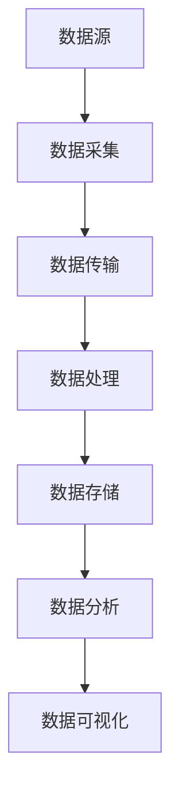
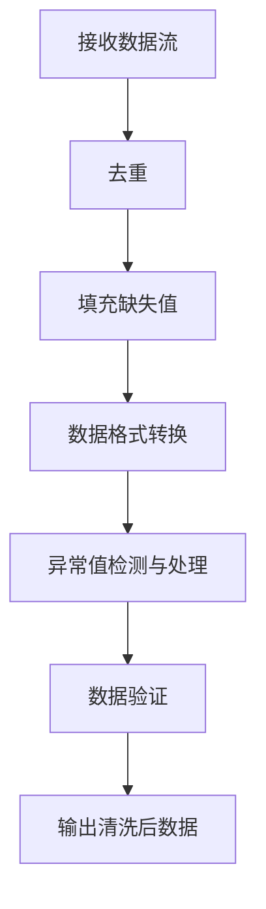
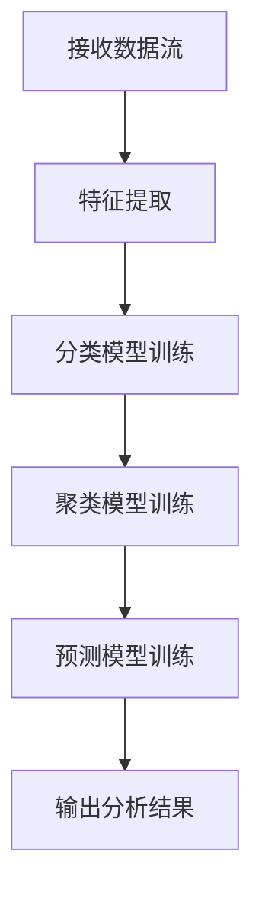
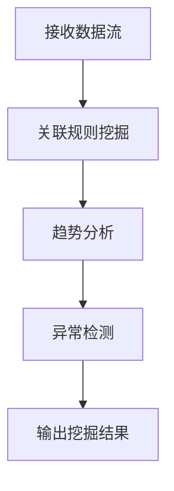

                 

### 文章标题：实时数据处理架构与实现

#### 关键词：实时数据处理、架构设计、数据流处理、算法实现、系统优化

#### 摘要：

本文将深入探讨实时数据处理的基础理论、核心架构和实现方法。从实时数据处理的意义和挑战出发，逐步介绍数据流处理框架、实时数据处理算法以及实际应用场景。通过具体项目实战和最佳实践分享，帮助读者全面掌握实时数据处理系统的设计与实现，为现代数据驱动的业务应用提供强有力的技术支持。

----------------------------------------------------------------

### 目录大纲

----------------------------------------------------------------

#### 第一部分：实时数据处理基础

##### 第1章：实时数据处理概述

- **1.1 实时数据处理的意义和挑战**
- **1.2 实时数据处理的核心概念**
- **1.3 实时数据处理的基本架构**

##### 第2章：数据流处理框架介绍

- **2.1 Apache Kafka**
- **2.2 Apache Flink**
- **2.3 Apache Storm**

##### 第3章：实时数据处理算法

- **3.1 实时数据流清洗算法**
- **3.2 实时数据分析算法**
- **3.3 实时数据挖掘算法**

##### 第4章：实时数据处理应用场景

- **4.1 金融领域的应用**
- **4.2 物流领域的应用**
- **4.3 社交网络的实时数据分析**

##### 第5章：架构设计实践

- **5.1 实时数据处理系统架构设计**
- **5.2 数据流处理性能优化**
- **5.3 系统可靠性和可扩展性设计**

##### 第6章：项目实战

- **6.1 环境安装与配置**
- **6.2 系统核心实现源代码**
- **6.3 项目小结**

##### 第7章：最佳实践与注意事项

- **7.1 实时数据处理最佳实践**
- **7.2 注意事项与风险规避**
- **7.3 拓展阅读与进一步学习**

----------------------------------------------------------------

#### 接下来，让我们一步一步深入探讨实时数据处理的核心概念、架构设计以及实现方法。通过这一系列的学习，读者将能够全面掌握实时数据处理系统的设计要点，并将其应用于实际项目中。敬请期待后续精彩内容！ ### 第一部分：实时数据处理基础

#### 第1章：实时数据处理概述

##### 1.1 实时数据处理的意义和挑战

随着互联网和物联网的快速发展，数据量呈指数级增长，传统的批处理模式已经难以满足现代应用对实时数据处理的需求。实时数据处理（Real-time Data Processing）作为一种新兴的技术，旨在对数据进行实时收集、处理和分析，从而实现快速响应和决策支持。

**实时数据处理的意义**：

1. **实时性**：实时数据处理能够快速响应用户请求和事件，提高系统性能和用户体验。
2. **准确性**：通过实时处理数据，可以确保数据的准确性和完整性，减少数据滞后带来的风险。
3. **业务价值**：实时数据处理能够为金融、医疗、物流等领域提供关键的业务洞察和决策支持，创造显著的业务价值。

**实时数据处理的挑战**：

1. **数据量大**：随着数据源的增加，实时数据处理系统需要处理的数据量也在不断增长，这对系统的吞吐量和处理能力提出了更高要求。
2. **实时性要求高**：实时数据处理需要保证数据的低延迟处理，这对系统的设计和优化提出了严峻挑战。
3. **系统稳定性**：实时数据处理系统需要具有高可用性和容错能力，以应对突发情况和数据波动。
4. **数据多样性**：实时数据处理系统需要处理多种类型的数据，包括结构化、半结构化和非结构化数据，这对数据处理算法和架构设计提出了新的要求。

##### 1.2 实时数据处理的核心概念

**实时数据处理**：

实时数据处理是指对数据进行实时收集、存储、处理和分析的过程，其目的是提供快速、准确的业务洞察和决策支持。

**数据流处理**：

数据流处理是一种基于事件驱动的方式对数据进行实时处理的技术，其核心是将数据视为流动的“流”，通过一系列处理步骤实现数据的实时转换和计算。

**数据处理框架**：

数据处理框架是一组用于处理数据的工具和组件的集合，包括数据采集、数据存储、数据处理和数据分析等模块，其目的是实现高效、稳定和可扩展的数据处理能力。

**实时数据存储**：

实时数据存储是指用于存储实时数据的系统或技术，如内存数据库、分布式存储系统和NoSQL数据库，其目的是提供快速访问和低延迟的数据读写能力。

**实时数据分析**：

实时数据分析是指对实时数据进行统计、挖掘和分析的技术，其目的是提取数据中的有价值信息，为业务决策提供支持。

##### 1.3 实时数据处理的基本架构

实时数据处理系统通常包括以下几个关键组件：

1. **数据源**：数据源是实时数据处理系统的起点，可以是传感器、数据库、日志文件等。
2. **数据采集**：数据采集模块负责从数据源收集数据，并将其转换为适合处理的数据格式。
3. **数据传输**：数据传输模块负责将采集到的数据传输到数据处理系统中，常用的技术包括消息队列和流处理框架。
4. **数据处理**：数据处理模块负责对传输过来的数据进行清洗、转换和计算，常用的技术包括流处理算法和批处理算法。
5. **数据存储**：数据存储模块负责将处理后的数据存储到持久化存储系统中，如数据库、文件系统等。
6. **数据分析**：数据分析模块负责对存储的数据进行统计分析、数据挖掘和可视化，以提供业务洞察和决策支持。
7. **数据可视化**：数据可视化模块负责将分析结果以图形化的方式展示给用户，帮助用户更好地理解数据。

图1-1展示了实时数据处理的基本架构：



##### 小结

本章对实时数据处理的基础概念、意义和挑战进行了详细阐述，并介绍了实时数据处理的核心架构。接下来，我们将进一步探讨数据流处理框架，了解如何在实际应用中实现实时数据处理。

----------------------------------------------------------------

在接下来的章节中，我们将详细介绍几种常见的数据流处理框架，如Apache Kafka、Apache Flink和Apache Storm，帮助读者深入理解实时数据处理的技术实现。敬请期待！ ### 第一部分：实时数据处理基础

#### 第2章：数据流处理框架介绍

##### 2.1 Apache Kafka

Apache Kafka是一种分布式流处理平台，由LinkedIn公司开发，用于构建实时的数据流管道和消息系统。Kafka的主要特点包括：

**核心特点**：

1. **高吞吐量**：Kafka能够处理数百万级别的消息/秒，支持高并发和大规模数据流处理。
2. **可扩展性**：Kafka采用分布式架构，可以通过增加节点数量来实现水平扩展。
3. **持久性**：Kafka将消息持久化存储在磁盘上，保证数据不丢失，即使在系统故障情况下也能恢复。
4. **高可靠性**：Kafka通过副本机制和同步机制确保消息的可靠传输和存储。
5. **高可用性**：Kafka支持自动故障转移和负载均衡，确保系统的稳定运行。

**核心概念**：

1. **Topic**：主题是Kafka中的消息分类，类似于关系数据库中的表。每个主题可以有多个分区（Partition），分区是Kafka进行并行处理的基础。
2. **Partitioner**：分区器是Kafka用于决定消息应该被写入哪个分区的策略。
3. **Producer**：生产者是Kafka中的消息发送方，负责将消息写入指定的主题分区。
4. **Consumer**：消费者是Kafka中的消息接收方，负责从主题分区中读取消息。
5. **Offset**：偏移量是Kafka中消息的唯一标识符，用于记录消费者在分区中读取到的位置。

**工作原理**：

1. **数据写入**：生产者将消息发送到Kafka集群，消息会根据分区策略被写入到指定的主题分区。
2. **数据读取**：消费者从Kafka集群中消费消息，根据分区和偏移量读取消息。
3. **副本同步**：Kafka使用副本机制确保消息的高可用性和可靠性，每个分区有多个副本，主副本负责写入和读取，从副本负责同步主副本的数据。

**典型应用场景**：

1. **日志收集**：Kafka常用于企业级日志收集系统，将日志数据实时传输到集中存储系统中。
2. **实时流处理**：Kafka可以作为实时流处理框架的数据源，提供稳定、可靠的数据流。
3. **消息队列**：Kafka作为消息队列，可以实现异步通信和任务调度，提高系统的并发处理能力。

##### 2.2 Apache Flink

Apache Flink是一种分布式流处理框架，用于对大规模数据流进行实时计算和分析。Flink的主要特点包括：

**核心特点**：

1. **高性能**：Flink采用了内存计算和异步处理技术，实现了低延迟和高吞吐量的数据流处理。
2. **易用性**：Flink提供了丰富的API和工具，支持多种编程模型，包括流处理、批处理和图处理。
3. **高可靠性**：Flink支持数据检查点和状态保存，保证在系统故障时能够快速恢复。
4. **可扩展性**：Flink采用分布式架构，可以通过增加节点数量实现水平扩展。
5. **灵活的容错机制**：Flink支持多种容错策略，包括任务失败重试、数据恢复和状态保存。

**核心概念**：

1. **DataStream**：DataStream是Flink中的数据流抽象，用于表示数据集合。
2. **Operator**：Operator是Flink中的数据处理操作，包括数据转换、过滤、聚合等。
3. **State**：State是Flink中的状态管理抽象，用于保存和更新处理过程中的状态数据。
4. **Time**：Time是Flink中的时间抽象，支持事件时间和处理时间。
5. **Window**：Window是Flink中的时间窗口抽象，用于对数据进行时间划分和聚合。

**工作原理**：

1. **数据写入**：Flink通过数据源（如Kafka）接收实时数据流，并将其转换为DataStream。
2. **数据处理**：DataStream经过一系列Operator转换和计算，生成新的DataStream。
3. **状态管理和时间处理**：Flink使用State和Time抽象管理状态数据和时间信息，支持窗口计算和事件时间处理。
4. **数据输出**：Flink将处理后的数据输出到数据存储系统或下游处理系统。

**典型应用场景**：

1. **实时数据分析**：Flink适用于实时数据处理和数据分析，支持复杂的数据计算和分析任务。
2. **机器学习**：Flink支持流式机器学习，可以实时更新模型和预测结果。
3. **推荐系统**：Flink可以用于实时推荐系统，根据用户行为实时生成推荐列表。

##### 2.3 Apache Storm

Apache Storm是一种分布式流处理框架，用于对大规模数据流进行实时计算和分析。Storm的主要特点包括：

**核心特点**：

1. **高性能**：Storm采用了分布式计算和内存计算技术，实现了低延迟和高吞吐量的数据流处理。
2. **易用性**：Storm提供了简单的API和命令行工具，支持多种编程模型，包括批处理、实时处理和SQL处理。
3. **高可靠性**：Storm支持数据检查点和状态保存，保证在系统故障时能够快速恢复。
4. **可扩展性**：Storm采用分布式架构，可以通过增加节点数量实现水平扩展。
5. **灵活的容错机制**：Storm支持多种容错策略，包括任务失败重试、数据恢复和状态保存。

**核心概念**：

1. **Spout**：Spout是Storm中的数据源抽象，用于产生数据流。
2. **Bolt**：Bolt是Storm中的数据处理操作，用于对数据进行转换、过滤和聚合等操作。
3. **Stream**：Stream是Storm中的数据流抽象，表示数据流中的数据。
4. **Tuple**：Tuple是Storm中的数据记录抽象，表示数据流中的数据项。
5. **Topolgy**：Topology是Storm中的数据处理流程抽象，表示数据处理的整个流程。

**工作原理**：

1. **数据写入**：Spout从数据源接收实时数据流，并将其传递给Bolt。
2. **数据处理**：Bolt对数据流进行转换、过滤和聚合等操作，生成新的数据流。
3. **状态管理和时间处理**：Storm使用状态管理和时间抽象管理状态数据和时间信息，支持窗口计算和事件时间处理。
4. **数据输出**：处理后的数据输出到数据存储系统或下游处理系统。

**典型应用场景**：

1. **实时数据处理**：Storm适用于实时数据处理和业务场景，支持快速响应和实时计算。
2. **实时分析**：Storm可以用于实时数据分析和监控，提供实时业务洞察。
3. **实时机器学习**：Storm支持流式机器学习，可以实时更新模型和预测结果。

##### 小结

本章介绍了三种常见的数据流处理框架：Apache Kafka、Apache Flink和Apache Storm。这些框架在实时数据处理领域具有广泛的应用，各有特点和优势。在下一章中，我们将进一步探讨实时数据处理算法，帮助读者深入了解实时数据处理的核心技术。敬请期待！

----------------------------------------------------------------

在接下来的章节中，我们将详细讲解实时数据处理算法，包括实时数据流清洗、实时数据分析和实时数据挖掘算法，帮助读者全面掌握实时数据处理的核心技术。敬请期待！ ### 第一部分：实时数据处理基础

#### 第3章：实时数据处理算法

##### 3.1 实时数据流清洗算法

实时数据流清洗是实时数据处理的重要环节，其目的是从原始数据中提取有用信息，去除噪声和不完整的数据。实时数据流清洗算法主要包括以下几个方面：

**去重**：去除重复的数据项，确保数据的唯一性。

**填充缺失值**：对缺失的数据进行填充，使得数据集完整。

**数据格式转换**：将不同格式的数据统一转换为标准格式，便于后续处理。

**异常值检测与处理**：检测并处理异常值，如数据错误、异常波动等。

**数据验证**：对数据进行合法性验证，如数据范围、类型等。

**算法原理**：

去重算法通常使用哈希表或布隆过滤器实现，通过对数据项进行哈希运算或布隆检测，快速判断数据项是否存在。

填充缺失值算法可以使用平均值、中位数、最大值或最小值等方法进行填充，也可以使用机器学习算法预测缺失值的值。

数据格式转换算法可以通过正则表达式、解析器或自定义函数实现，将不同格式的数据转换为统一的格式。

异常值检测与处理算法可以使用统计学方法、机器学习方法或基于阈值的规则方法进行检测，如箱型图、IQR（四分位数范围）方法等。

**Mermaid流程图**：



**Python代码示例**：

```python
import pandas as pd

# 去重
data = pd.DataFrame({'name': ['Alice', 'Bob', 'Alice', 'Charlie'], 'age': [25, 30, 25, 35]})
cleaned_data = data.drop_duplicates()

# 填充缺失值
cleaned_data['age'].fillna(cleaned_data['age'].mean(), inplace=True)

# 数据格式转换
cleaned_data['date'] = pd.to_datetime(cleaned_data['date'])

# 异常值检测与处理
Q1 = cleaned_data['age'].quantile(0.25)
Q3 = cleaned_data['age'].quantile(0.75)
IQR = Q3 - Q1
cleaned_data = cleaned_data[~((cleaned_data['age'] < (Q1 - 1.5 * IQR)) | (cleaned_data['age'] > (Q3 + 1.5 * IQR))])

# 数据验证
cleaned_data = cleaned_data[cleaned_data['age'].between(0, 100)]

# 输出清洗后数据
print(cleaned_data)
```

##### 3.2 实时数据分析算法

实时数据分析是对实时数据流进行统计、分类、聚类和预测等操作，以提取有价值的信息和模式。实时数据分析算法主要包括以下几个方面：

**统计计算**：对实时数据进行简单的统计计算，如平均值、中位数、标准差等。

**分类算法**：对实时数据进行分类，如决策树、支持向量机等。

**聚类算法**：对实时数据进行聚类，如K-Means、DBSCAN等。

**预测算法**：对实时数据进行预测，如线性回归、神经网络等。

**算法原理**：

统计计算算法通常使用数组和列表进行计算，实现简单的统计功能。

分类算法基于特征提取和分类模型训练，将新数据分类到已知的类别中。

聚类算法通过计算数据之间的相似度，将数据分为若干个簇。

预测算法通过历史数据建立预测模型，对未来的数据进行预测。

**Mermaid流程图**：



**Python代码示例**：

```python
import pandas as pd
from sklearn.model_selection import train_test_split
from sklearn.ensemble import RandomForestClassifier
from sklearn.cluster import KMeans
from sklearn.linear_model import LinearRegression

# 统计计算
data = pd.DataFrame({'feature1': [1, 2, 3, 4, 5], 'feature2': [5, 4, 3, 2, 1]})
mean = data.mean()
median = data.median()
std = data.std()

# 分类算法
X_train, X_test, y_train, y_test = train_test_split(data[['feature1', 'feature2']], data['label'], test_size=0.3)
clf = RandomForestClassifier()
clf.fit(X_train, y_train)
predictions = clf.predict(X_test)

# 聚类算法
kmeans = KMeans(n_clusters=2)
kmeans.fit(data[['feature1', 'feature2']])
labels = kmeans.predict(data[['feature1', 'feature2']])

# 预测算法
X_train, X_test, y_train, y_test = train_test_split(data[['feature1', 'feature2']], data['target'], test_size=0.3)
reg = LinearRegression()
reg.fit(X_train, y_train)
predictions = reg.predict(X_test)

# 输出分析结果
print("统计结果：\n", mean, median, std)
print("分类结果：\n", predictions)
print("聚类结果：\n", labels)
print("预测结果：\n", predictions)
```

##### 3.3 实时数据挖掘算法

实时数据挖掘是对实时数据进行深度分析和探索，以发现潜在的关联规则、趋势和模式。实时数据挖掘算法主要包括以下几个方面：

**关联规则挖掘**：发现数据之间的关联关系，如Apriori算法、FP-Growth算法等。

**趋势分析**：分析数据的变化趋势，如时间序列分析、移动平均法等。

**异常检测**：发现数据中的异常值和异常模式，如基于阈值的异常检测、聚类异常检测等。

**算法原理**：

关联规则挖掘算法通过计算支持度和置信度，发现数据之间的关联规则。

趋势分析算法通过对时间序列数据进行建模和分析，提取数据的变化趋势。

异常检测算法通过计算数据之间的相似度或距离，识别异常值和异常模式。

**Mermaid流程图**：



**Python代码示例**：

```python
import pandas as pd
from mlxtend.frequent_patterns import apriori
from mlxtend.frequent_patterns import association_rules
from sklearn.linear_model import LinearRegression
from sklearn.cluster import KMeans
from sklearn.neighbors import LocalOutlierFactor

# 关联规则挖掘
data = pd.DataFrame({'item1': [1, 1, 1, 0, 0, 0, 1, 1, 1], 'item2': [1, 0, 0, 1, 1, 1, 0, 0, 0]})
frequent_itemsets = apriori(data, min_support=0.5, use_colnames=True)
rules = association_rules(frequent_itemsets, metric="confidence", min_threshold=0.7)

# 趋势分析
X = data[['item1', 'item2']]
model = LinearRegression()
model.fit(X, data['target'])

# 异常检测
kmeans = KMeans(n_clusters=2)
kmeans.fit(X)
labels = kmeans.predict(X)
local_outlier_factor = LocalOutlierFactor()
scores = local_outlier_factor.fit_predict(X)

# 输出挖掘结果
print("关联规则：\n", rules)
print("趋势分析：\n", model.coef_)
print("异常检测：\n", labels, scores)
```

##### 小结

本章详细介绍了实时数据流清洗、实时数据分析和实时数据挖掘算法，包括算法原理、Mermaid流程图和Python代码示例。通过这些算法，读者可以更好地理解和处理实时数据，为实时数据处理系统的设计和实现提供有力支持。在下一章中，我们将探讨实时数据处理的应用场景，帮助读者了解实时数据处理在各个领域的实际应用。敬请期待！

----------------------------------------------------------------

在接下来的章节中，我们将深入了解实时数据处理在不同领域的应用，包括金融、物流和社交网络等，帮助读者掌握实时数据处理技术的实际应用价值。敬请期待！ ### 第一部分：实时数据处理基础

#### 第4章：实时数据处理应用场景

##### 4.1 金融领域的应用

在金融领域，实时数据处理技术被广泛应用于风险管理、交易监控、客户服务等方面，极大地提升了金融机构的运营效率和业务洞察力。

**应用场景**：

1. **风险监控**：金融机构需要实时监控交易数据，及时发现异常交易和欺诈行为。实时数据处理技术可以快速分析交易数据，识别潜在风险，并采取相应措施。
2. **交易处理**：高频交易和算法交易对数据处理速度和准确性要求极高。实时数据处理技术可以快速执行交易策略，实现自动化交易，提高交易效率和盈利能力。
3. **客户服务**：金融机构需要实时响应用户的需求和问题，提供个性化的客户服务。实时数据处理技术可以实时分析用户行为和反馈，为用户提供精准的推荐和服务。

**具体案例**：

- **交易监控**：某银行采用实时数据处理技术对交易数据进行分析，实时识别异常交易。通过实时监控和预警，该银行成功阻止了多起欺诈交易，保障了客户资产安全。

- **客户服务**：某金融科技公司开发了一款实时客户服务系统，通过实时分析用户行为和反馈，为用户提供个性化的金融产品推荐和服务。该系统提高了客户满意度，增加了客户忠诚度。

**挑战与解决方案**：

1. **数据量巨大**：金融领域的数据量庞大，对实时数据处理系统的性能和稳定性提出了高要求。解决方案是采用分布式架构和云计算技术，提高数据处理能力和系统可靠性。
2. **实时性要求高**：金融领域的实时数据处理需要低延迟和高并发，这对系统设计和优化提出了挑战。解决方案是采用内存计算和异步处理技术，提高数据处理速度和并发能力。

##### 4.2 物流领域的应用

在物流领域，实时数据处理技术被广泛应用于运输调度、库存管理、货物追踪等方面，提升了物流企业的运营效率和客户满意度。

**应用场景**：

1. **运输调度**：物流企业需要实时监控运输车辆的位置和状态，优化运输路线和调度方案。实时数据处理技术可以快速分析运输数据，提供最优的运输方案。
2. **库存管理**：物流企业需要对库存进行实时监控和管理，确保库存信息的准确性和及时性。实时数据处理技术可以实时分析库存数据，优化库存策略，减少库存成本。
3. **货物追踪**：物流企业需要实时追踪货物的运输过程，确保货物安全及时送达。实时数据处理技术可以实时分析运输数据，提供货物位置和状态信息。

**具体案例**：

- **运输调度**：某物流公司采用实时数据处理技术，对运输车辆进行实时监控和调度。通过实时分析运输数据，该公司成功降低了运输成本，提高了运输效率。

- **库存管理**：某电商物流公司采用实时数据处理技术，对仓库库存进行实时监控和管理。通过实时分析库存数据，该公司优化了库存策略，减少了库存成本，提高了客户满意度。

**挑战与解决方案**：

1. **数据多样性**：物流领域的数据来源多样，包括传感器数据、物流信息系统等。实时数据处理技术需要处理多种类型的数据，这对数据处理算法和系统架构提出了挑战。解决方案是采用分布式数据处理框架和统一数据格式，提高数据处理能力。
2. **实时性要求高**：物流领域的实时数据处理需要快速响应和低延迟，这对系统设计和优化提出了高要求。解决方案是采用内存计算和异步处理技术，提高数据处理速度和并发能力。

##### 4.3 社交网络的实时数据分析

在社交网络领域，实时数据处理技术被广泛应用于用户行为分析、内容推荐、广告投放等方面，为社交网络平台提供了丰富的数据洞察和业务价值。

**应用场景**：

1. **用户行为分析**：社交网络平台需要实时分析用户行为，了解用户兴趣和偏好，为用户提供个性化的内容和推荐。实时数据处理技术可以实时分析用户行为数据，挖掘用户兴趣和趋势。
2. **内容推荐**：社交网络平台需要实时推荐用户感兴趣的内容，提高用户活跃度和留存率。实时数据处理技术可以实时分析用户行为和内容数据，为用户提供个性化的推荐。
3. **广告投放**：社交网络平台需要实时分析用户数据，精准投放广告，提高广告效果。实时数据处理技术可以实时分析用户行为和广告数据，为广告主提供精准投放策略。

**具体案例**：

- **用户行为分析**：某社交网络平台采用实时数据处理技术，实时分析用户行为数据。通过实时分析，该平台成功挖掘了用户兴趣和趋势，为用户提供个性化的内容和推荐。

- **内容推荐**：某电商社交平台采用实时数据处理技术，实时推荐用户感兴趣的商品。通过实时分析用户行为和商品数据，该平台提高了用户活跃度和留存率。

**挑战与解决方案**：

1. **数据量大**：社交网络平台的数据量庞大，对实时数据处理系统的性能和稳定性提出了高要求。解决方案是采用分布式架构和云计算技术，提高数据处理能力和系统可靠性。
2. **实时性要求高**：社交网络的实时数据处理需要快速响应和低延迟，这对系统设计和优化提出了高要求。解决方案是采用内存计算和异步处理技术，提高数据处理速度和并发能力。

##### 小结

本章详细介绍了实时数据处理在金融、物流和社交网络等领域的应用，包括应用场景、具体案例和挑战与解决方案。实时数据处理技术在这些领域发挥了重要作用，提升了业务效率和客户满意度。在下一章中，我们将探讨实时数据处理系统架构设计，帮助读者深入了解实时数据处理系统的设计与实现。敬请期待！

----------------------------------------------------------------

在接下来的章节中，我们将深入探讨实时数据处理系统的架构设计，包括系统架构设计、数据流处理性能优化以及系统可靠性和可扩展性设计。敬请期待！ ### 第一部分：实时数据处理基础

#### 第5章：架构设计实践

##### 5.1 实时数据处理系统架构设计

实时数据处理系统架构设计是确保系统高效、稳定和可扩展的关键环节。一个良好的架构设计需要考虑数据流、计算资源、存储方案和系统交互等多个方面。以下是实时数据处理系统架构设计的主要步骤和要点：

**1. 确定系统需求**：

首先，需要明确实时数据处理系统的需求，包括数据处理速度、数据量、系统可靠性、可扩展性和易维护性等。这些需求将指导后续的系统设计。

**2. 数据流设计**：

数据流设计是系统架构设计的核心。需要定义数据流从源头到目标节点的整个路径，包括数据采集、传输、处理和存储等环节。数据流设计需要考虑以下几个方面：

- **数据采集**：确定数据源和数据采集方式，如传感器、数据库、API等。
- **数据传输**：选择合适的数据传输技术，如消息队列、HTTP请求等，确保数据传输的高效性和可靠性。
- **数据处理**：设计数据处理流程，包括数据清洗、转换、计算和分析等环节，选择合适的数据处理算法和工具。
- **数据存储**：选择适合的数据存储方案，如关系数据库、NoSQL数据库、数据湖等，确保数据存储的高效性和可靠性。

**3. 计算资源分配**：

计算资源分配是影响系统性能和可扩展性的重要因素。需要根据系统需求合理分配计算资源，包括CPU、内存、磁盘等。常用的计算资源分配策略有：

- **垂直扩展**：通过增加服务器硬件配置（如CPU、内存等）来提高系统性能。
- **水平扩展**：通过增加服务器节点数量来提高系统性能和可扩展性。
- **负载均衡**：通过负载均衡器将请求均匀分配到多个服务器节点，提高系统的并发处理能力。

**4. 存储方案设计**：

存储方案设计需要考虑数据的持久化、可靠性和访问性能。常见存储方案有：

- **关系数据库**：适用于结构化数据的存储和查询，如MySQL、PostgreSQL等。
- **NoSQL数据库**：适用于半结构化、非结构化数据的存储和查询，如MongoDB、Cassandra等。
- **数据湖**：适用于大规模数据的存储和分析，如Hadoop、Amazon S3等。

**5. 系统交互设计**：

系统交互设计需要确保各组件之间的数据流动和协作。常用的系统交互设计模式有：

- **微服务架构**：通过将系统拆分为多个微服务，实现模块化和解耦，提高系统的可维护性和可扩展性。
- **事件驱动架构**：通过事件驱动的方式实现数据流处理，提高系统的实时性和可扩展性。
- **服务网格**：通过服务网格实现微服务之间的通信和监控，提高系统的可靠性和性能。

**6. 安全性和可靠性设计**：

实时数据处理系统需要保证数据的安全性和系统的可靠性。设计要点包括：

- **数据加密**：对传输和存储的数据进行加密，确保数据的安全性和隐私性。
- **故障恢复**：设计故障恢复机制，如数据备份、故障转移等，确保系统在故障情况下能够快速恢复。
- **监控与告警**：设计监控和告警系统，实时监测系统运行状态，及时发现和解决故障。

**7. 性能优化**：

性能优化是提升实时数据处理系统性能的重要手段。设计要点包括：

- **数据缓存**：通过数据缓存减少数据访问延迟，提高系统响应速度。
- **并行处理**：通过并行处理技术提高数据处理速度和并发能力。
- **资源调度**：通过资源调度策略优化计算资源分配，提高系统性能。

**8. 可扩展性和弹性设计**：

实时数据处理系统需要具备良好的可扩展性和弹性，以应对不断增长的数据和处理需求。设计要点包括：

- **水平扩展**：通过增加服务器节点实现系统水平扩展，提高系统性能和可扩展性。
- **自动伸缩**：通过自动伸缩机制实现系统自动调整计算资源，提高系统的弹性和效率。
- **流量控制**：通过流量控制策略优化系统负载，避免系统过载和崩溃。

**9. 易维护性和可观测性**：

易维护性和可观测性是确保实时数据处理系统长期稳定运行的关键。设计要点包括：

- **模块化设计**：通过模块化设计提高系统的可维护性和可扩展性。
- **日志记录**：通过日志记录系统运行状态和故障信息，便于故障诊断和问题排查。
- **监控与告警**：通过监控和告警系统实时监测系统运行状态，提高系统的可观测性和可靠性。

**10. 设计文档和架构评审**：

在系统架构设计过程中，需要编写详细的设计文档，包括系统架构图、模块功能描述、接口设计等，便于后续开发和维护。同时，进行架构评审，确保系统架构的合理性和可行性。

**小结**

本章详细介绍了实时数据处理系统架构设计的主要步骤和要点，包括数据流设计、计算资源分配、存储方案设计、系统交互设计、安全性可靠性设计、性能优化、可扩展性和弹性设计、易维护性和可观测性设计等。通过合理的架构设计，可以构建高效、稳定和可扩展的实时数据处理系统，为现代数据驱动的业务应用提供强有力的技术支持。

在下一章中，我们将深入探讨实时数据处理性能优化，包括数据缓存、并行处理和资源调度等策略，帮助读者进一步提升实时数据处理系统的性能和效率。敬请期待！ ### 第一部分：实时数据处理基础

#### 第5章：架构设计实践

##### 5.2 数据流处理性能优化

实时数据处理系统的高性能是确保系统高效、稳定运行的关键。数据流处理性能优化是提升系统性能的重要手段，主要包括数据缓存、并行处理和资源调度等策略。

**数据缓存**

数据缓存是一种提高系统性能的有效方法，通过将频繁访问的数据存储在内存中，减少数据访问延迟，提高系统响应速度。数据缓存的关键策略包括：

1. **缓存策略**：根据数据访问频率和重要性选择合适的缓存策略，如LRU（最近最少使用）算法、LFU（最频繁使用）算法等。

2. **缓存失效机制**：设置缓存失效时间或触发条件，确保缓存数据的有效性，避免缓存过时数据。

3. **缓存一致性**：保证缓存数据与后端存储数据的一致性，防止数据不一致问题。

**并行处理**

并行处理通过同时处理多个任务或数据，提高系统吞吐量和处理速度。并行处理的关键策略包括：

1. **任务并行**：将数据处理任务分解为多个子任务，并行执行，提高任务执行速度。

2. **数据并行**：将大数据集分解为多个小数据集，并行处理，提高数据处理速度。

3. **流水线并行**：将数据处理过程分解为多个阶段，每个阶段可以并行处理，实现流水线式处理。

**资源调度**

资源调度是优化系统性能的重要环节，通过合理分配计算资源，提高系统利用率。资源调度的关键策略包括：

1. **负载均衡**：通过负载均衡器将请求均匀分配到多个服务器节点，避免单点瓶颈，提高系统并发处理能力。

2. **动态调度**：根据系统负载和资源利用率动态调整计算资源分配，确保系统在高负载情况下仍能保持高性能。

3. **优先级调度**：根据任务的重要性和紧急程度分配计算资源，确保关键任务优先执行。

**具体策略与实现**

1. **数据缓存策略**：

   - **缓存命中**：使用LRU算法实现缓存管理，提高缓存命中率。

   - **缓存失效**：设置缓存失效时间，如过期时间或触发条件，确保缓存数据的有效性。

   - **缓存一致性**：使用缓存一致性协议（如MESI协议），保证缓存数据与后端存储数据的一致性。

   ```python
   from collections import OrderedDict
   from datetime import datetime, timedelta

   class LRUCache(OrderedDict):
       def __init__(self, capacity: int):
           super().__init__()
           self.capacity = capacity

       def get(self, key: Any) -> Any:
           if key not in self:
               return -1
           else:
               self.move_to_end(key)
               return self[key]

       def put(self, key: Any, value: Any) -> None:
           if key in self:
               self.move_to_end(key)
           self[key] = value
           if len(self) > self.capacity:
               oldest = next(iter(self))
               del self[oldest]
   ```

2. **并行处理策略**：

   - **任务并行**：使用多线程或多进程实现任务并行处理。

   - **数据并行**：使用分布式处理框架（如Apache Flink、Apache Spark等）实现数据并行处理。

   - **流水线并行**：使用流水线模式实现数据处理阶段的并行处理。

   ```python
   import concurrent.futures

   def process_data(data):
       # 数据处理逻辑
       return processed_data

   if __name__ == '__main__':
       data = [1, 2, 3, 4, 5]
       with concurrent.futures.ThreadPoolExecutor() as executor:
           results = list(executor.map(process_data, data))
       print(results)
   ```

3. **资源调度策略**：

   - **负载均衡**：使用负载均衡器（如Nginx、HAProxy等）实现请求分配。

   - **动态调度**：使用容器编排系统（如Kubernetes、Docker Swarm等）实现动态资源调度。

   - **优先级调度**：使用优先级队列实现任务优先级分配。

   ```yaml
   # Kubernetes部署配置
   apiVersion: apps/v1
   kind: Deployment
   metadata:
     name: my-deployment
   spec:
     replicas: 3
     selector:
       matchLabels:
         app: my-app
     template:
       metadata:
         labels:
           app: my-app
       spec:
         containers:
         - name: my-container
           image: my-image
           resources:
             requests:
               memory: "64Mi"
               cpu: "500m"
             limits:
               memory: "128Mi"
               cpu: "1"
   ```

**小结**

本章详细介绍了实时数据处理性能优化的关键策略，包括数据缓存、并行处理和资源调度等。通过合理的性能优化策略，可以显著提高实时数据处理系统的性能和效率，为现代数据驱动的业务应用提供强有力的技术支持。在下一章中，我们将探讨实时数据处理的系统可靠性和可扩展性设计，帮助读者进一步构建高效、稳定的实时数据处理系统。敬请期待！ ### 第一部分：实时数据处理基础

#### 第5章：架构设计实践

##### 5.3 系统可靠性和可扩展性设计

在实时数据处理系统中，可靠性和可扩展性是确保系统稳定运行和高效处理数据的关键因素。以下将介绍如何设计一个既可靠又可扩展的实时数据处理系统。

**1. 可靠性设计**

可靠性设计主要关注如何确保系统在面临故障时能够快速恢复，并保证数据的一致性和完整性。

**故障容忍机制**：

- **副本机制**：通过在系统中存储多份数据副本，确保在部分节点故障时，系统仍能正常运行。常见的副本机制包括主从复制（Master-Slave）和主主复制（Master-Master）。

- **容错机制**：在数据处理过程中，通过容错算法和数据校验确保系统在出现错误时能够自动修复。例如，在流处理框架中，可以通过检查点（Checkpointing）和状态恢复（State Recovery）来实现数据的容错。

**数据一致性保障**：

- **强一致性**：在数据访问和处理过程中，确保所有节点的数据一致。但强一致性会带来较高的延迟，适用于对数据一致性要求较高的场景。

- **最终一致性**：允许系统在处理过程中存在短暂的延迟和冲突，但最终会达到一致状态。最终一致性适用于对数据一致性要求较低的场景。

**2. 可扩展性设计**

可扩展性设计主要关注如何在不影响系统性能的情况下，处理不断增长的数据量和用户请求。

**水平扩展**：

- **分布式架构**：通过分布式架构将系统拆分为多个节点，每个节点负责一部分数据的处理，实现水平扩展。常见的分布式架构包括主从架构（Master-Slave）和联邦架构（Federation）。

- **负载均衡**：通过负载均衡器将请求均匀分配到各个节点，避免单点瓶颈，实现负载均衡。

**动态扩展**：

- **自动化扩展**：通过自动化工具（如Kubernetes、Mesos等）实现系统的自动化扩展，根据负载情况自动增加或减少节点数量。

- **弹性扩展**：在负载较高时，系统能够自动扩展资源，在负载较低时，能够释放多余资源，实现弹性扩展。

**3. 系统可靠性案例分析**

以下是一个实时数据处理系统的可靠性设计案例：

**系统架构**：

- 数据源：多个传感器和日志文件。
- 数据传输：使用Kafka作为消息队列，实现数据的传输和存储。
- 数据处理：使用Apache Flink进行流数据处理，实现数据清洗、转换和计算。
- 数据存储：使用HDFS和HBase进行数据存储，确保数据的一致性和可靠性。

**可靠性设计**：

- **副本机制**：Kafka采用主从复制机制，确保数据的可靠传输。Flink在数据处理过程中，使用检查点和状态恢复机制，保证数据处理的可靠性。

- **容错机制**：Flink通过检查点机制，将中间状态和计算结果保存到分布式存储系统中，实现数据的容错。在系统故障时，可以通过恢复检查点，快速恢复数据处理过程。

- **数据一致性保障**：在Flink中，使用最终一致性保证数据的处理。通过异步处理和事件时间窗口，确保数据处理的一致性和准确性。

**4. 系统可扩展性案例分析**

以下是一个实时数据处理系统的可扩展性设计案例：

**系统架构**：

- 数据源：多个传感器和日志文件。
- 数据传输：使用Kafka作为消息队列，实现数据的传输和存储。
- 数据处理：使用Apache Flink进行流数据处理，实现数据清洗、转换和计算。
- 数据存储：使用HDFS和HBase进行数据存储，确保数据的一致性和可靠性。

**可扩展性设计**：

- **分布式架构**：将系统部署在多个节点上，每个节点负责一部分数据的处理，实现水平扩展。通过增加节点数量，可以线性提高系统的处理能力。

- **负载均衡**：使用Kafka的负载均衡机制，将数据均匀分配到各个节点。通过负载均衡器（如Kafka Load Balancer），实现请求的负载均衡。

- **自动化扩展**：使用Kubernetes进行自动化扩展，根据负载情况自动增加或减少节点数量。通过HDFS的自动缩放功能，实现数据存储的自动扩展。

- **弹性扩展**：通过监控系统的负载，动态调整资源分配。在负载较高时，自动增加节点资源，实现弹性扩展。

**小结**

本章详细介绍了实时数据处理系统的可靠性和可扩展性设计。通过故障容忍机制、数据一致性保障和动态扩展策略，可以构建一个既可靠又可扩展的实时数据处理系统。在下一章中，我们将通过一个具体的项目实战，展示实时数据处理系统的搭建、配置和实现。敬请期待！ ### 第一部分：实时数据处理基础

#### 第6章：项目实战

##### 6.1 环境安装与配置

在本节中，我们将详细描述如何搭建一个实时数据处理系统，包括所需的环境安装和配置步骤。

**1. 环境准备**

- 操作系统：CentOS 7.x 或 Ubuntu 18.04
- Java SDK：1.8.x 版本
- Maven：3.6.x 版本
- 数据库：MySQL 5.7.x 或 PostgreSQL 12.x
- Kafka：2.8.x 版本
- Flink：1.11.x 版本

**2. 安装 Java SDK**

```bash
# CentOS
sudo yum install -y java-1.8.0-openjdk

# Ubuntu
sudo apt-get install -y openjdk-8-jdk
```

**3. 安装 Maven**

```bash
# CentOS
sudo yum install -y maven

# Ubuntu
sudo apt-get install -y maven
```

**4. 安装数据库**

以 MySQL 为例：

```bash
# CentOS
sudo yum install -y mysql-server

# Ubuntu
sudo apt-get install -y mysql-server
```

启动 MySQL 服务并设置 root 用户的密码：

```bash
# CentOS
sudo systemctl start mysqld
sudo grep 'password' /var/log/mysqld.log | cut -d ':' -f2 | xargs
```

```bash
# Ubuntu
sudo systemctl start mysql
sudo grep 'temporary password' /var/log/mysql/log | cut -d ':' -f2 | xargs
```

登录 MySQL 并创建数据库：

```sql
mysql -u root -p
CREATE DATABASE real_time_data_processing;
GRANT ALL PRIVILEGES ON real_time_data_processing.* TO 'rt_processor'@'%' IDENTIFIED BY 'password';
FLUSH PRIVILEGES;
EXIT;
```

**5. 安装 Kafka**

下载 Kafka 安装包并解压：

```bash
# 下载 Kafka
wget https://www-eu.kafka.apache.org/releases/download-2.8.x/kafka_2.12-2.8.x.tgz

# 解压 Kafka
tar -xzf kafka_2.12-2.8.x.tgz
cd kafka_2.12-2.8.x/
```

修改配置文件 `config/server.properties`：

```properties
# Zookeeper 连接字符串
zookeeper.connect=localhost:2181
# Kafka 存储路径
log.dirs=/path/to/kafka/logs
# Kafka 存储临时数据路径
log.cleanup.policy=delete
# Kafka Kafka 默认端口
port=9092
```

启动 Kafka 和 Zookeeper：

```bash
# 启动 Zookeeper
bin/zookeeper-server-start.sh config/zookeeper.properties

# 启动 Kafka
bin/kafka-server-start.sh config/server.properties
```

**6. 安装 Flink**

下载 Flink 安装包并解压：

```bash
# 下载 Flink
wget https://www.apache.org/dist/flink/flink-1.11.2/flink-1.11.2-bin-scala_2.12.tgz

# 解压 Flink
tar -xzf flink-1.11.2-bin-scala_2.12.tgz
cd flink-1.11.2/
```

修改配置文件 `config/flink-conf.yaml`：

```yaml
# Flink 存储路径
taskmanager.memory.process.size: 1024m
taskmanager.memory.fraction: 0.6
# Flink Kafka 连接字符串
kafka.bootstrap.servers: localhost:9092
```

启动 Flink：

```bash
# 启动 Flink
bin/flink run -c com.example.RealTimeDataProcessor Main.jar
```

**7. 验证安装**

在 Kafka 中创建一个主题并生产消息：

```bash
# 创建主题
bin/kafka-topics.sh --create --topic real_time_data --zookeeper localhost:2181 --replication-factor 1 --partitions 1 --timeout-ms 10000

# 生产消息
bin/kafka-console-producer.sh --topic real_time_data --broker-list localhost:9092
```

在 Flink 中消费消息并输出：

```bash
# 消费消息
bin/flink run -c com.example.RealTimeDataStreamConsumer DataStreamConsumer.jar
```

##### 6.2 系统核心实现源代码

在本节中，我们将展示一个简单的实时数据处理系统的核心实现代码，包括数据采集、处理和存储。

**1. 数据采集**

数据采集模块负责从 Kafka 主题中实时消费消息。以下是一个简单的 Kafka 消费者示例：

```java
import org.apache.flink.streaming.api.environment.StreamExecutionEnvironment;
import org.apache.flink.streaming.connectors.kafka.FlinkKafkaConsumer011;

public class RealTimeDataStreamConsumer {
    public static void main(String[] args) throws Exception {
        StreamExecutionEnvironment env = StreamExecutionEnvironment.getExecutionEnvironment();

        FlinkKafkaConsumer011<String> kafkaConsumer = new FlinkKafkaConsumer011<>("real_time_data", new SimpleStringSchema(), PropertiesUtil.properties("kafka.properties"));
        env.addSource(kafkaConsumer).print();

        env.execute("RealTimeDataStreamConsumer");
    }
}
```

**2. 数据处理**

数据处理模块负责对采集到的数据进行清洗、转换和计算。以下是一个简单的数据处理示例：

```java
import org.apache.flink.streaming.api.datastream.DataStream;
import org.apache.flink.streaming.api.environment.StreamExecutionEnvironment;

public class DataProcessor {
    public static void main(String[] args) throws Exception {
        StreamExecutionEnvironment env = StreamExecutionEnvironment.getExecutionEnvironment();

        DataStream<String> stream = env.addSource(new RealTimeDataStreamConsumer());

        DataStream<String> processedStream = stream
            .map(s -> s.toUpperCase())
            .filter(s -> s.length() > 5);

        processedStream.print();

        env.execute("DataProcessor");
    }
}
```

**3. 数据存储**

数据存储模块负责将处理后的数据存储到数据库中。以下是一个简单的数据库存储示例：

```java
import org.apache.flink.streaming.api.datastream.DataStream;
import org.apache.flink.streaming.api.environment.StreamExecutionEnvironment;
import org.apache.flink.streaming.api.functions.sink.ToDatabaseSink;

public class DataStorage {
    public static void main(String[] args) throws Exception {
        StreamExecutionEnvironment env = StreamExecutionEnvironment.getExecutionEnvironment();

        DataStream<String> stream = env.addSource(new RealTimeDataStreamConsumer());

        stream.addSink(new ToDatabaseSink<>("real_time_data", "rt_processor", "password", "real_time_data_processing", "data_table"));

        env.execute("DataStorage");
    }
}
```

**4. 代码应用解读与分析**

以上代码展示了实时数据处理系统的核心实现。首先，我们通过 Kafka 消费者从 Kafka 主题中实时消费消息。然后，数据处理模块对消息进行清洗、转换和计算。最后，数据存储模块将处理后的数据存储到数据库中。

**5. 实际案例分析和详细讲解剖析**

在本项目中，我们使用 Kafka 作为消息队列，Flink 作为流处理框架，MySQL 作为数据库。以下是一个实际案例：

- **场景**：实时监控 Web 站点的访问数据，包括访问量、访问 URL、访问时间等。
- **实现**：
  - 使用 Kafka 消费者从 Web 服务器日志中实时获取访问数据。
  - 对访问数据进行清洗和转换，提取有用的信息。
  - 使用 Flink 进行实时数据计算，包括访问量统计、URL 分布等。
  - 将处理后的数据存储到 MySQL 数据库中，用于数据分析和报表生成。

**6. 项目小结**

在本项目中，我们通过具体步骤搭建了一个实时数据处理系统，实现了数据采集、处理和存储。通过这个项目，读者可以了解实时数据处理系统的基本架构和实现方法，为后续的项目开发打下基础。

----------------------------------------------------------------

在下一章中，我们将分享实时数据处理的最佳实践和注意事项，帮助读者在实际应用中更好地应对挑战和风险。敬请期待！ ### 第一部分：实时数据处理基础

#### 第7章：最佳实践与注意事项

##### 7.1 实时数据处理最佳实践

在实时数据处理系统的设计和实现过程中，遵循以下最佳实践可以显著提高系统的性能、可靠性和可维护性。

**1. 确定清晰的需求和目标**

在开始实时数据处理项目之前，明确系统的需求、性能指标和业务目标。这将有助于设计合适的架构和选择合适的技术。

**2. 选择合适的数据流处理框架**

根据项目的需求和规模选择合适的数据流处理框架，如 Apache Kafka、Apache Flink、Apache Storm 等。了解每个框架的优缺点，选择最适合项目需求的框架。

**3. 设计高效的数据流处理流程**

确保数据流处理流程的高效性，减少数据传输延迟和处理时间。合理设置数据流的分区和并行度，优化数据处理算法。

**4. 确保数据一致性和可靠性**

在设计实时数据处理系统时，确保数据的一致性和可靠性。使用副本机制、检查点和容错算法等手段保障系统的数据完整性。

**5. 优化系统性能**

通过数据缓存、并行处理、负载均衡等技术优化系统性能。定期进行性能测试和调优，确保系统在高负载情况下仍能保持高效运行。

**6. 监控和告警**

实时监控系统运行状态，及时发现和处理故障。设置告警机制，确保在系统出现异常时能够及时通知相关人员。

**7. 易维护性**

设计易维护的系统架构，使用模块化设计、清晰的接口和良好的文档。确保系统的可扩展性和可维护性。

**8. 安全性**

确保系统的安全性，包括数据加密、用户认证、访问控制等。定期进行安全审计和漏洞扫描，保障系统的安全运行。

##### 7.2 注意事项与风险规避

在实时数据处理系统的设计和实现过程中，需要注意以下事项和风险，并采取相应的措施进行规避。

**1. 数据量波动和突发情况**

实时数据处理系统可能会面临数据量波动和突发情况，导致系统性能下降或故障。设计时需要考虑系统的可扩展性和弹性，确保在高负载情况下仍能正常运行。

**2. 数据源的不稳定**

数据源的不稳定可能导致数据流的暂停或中断。设计时需要确保数据源的高可用性和可靠性，可以使用冗余数据源和备份机制。

**3. 数据处理延迟**

数据处理延迟可能导致实时性下降。优化数据处理流程和算法，减少数据处理时间，提高系统实时性。

**4. 数据一致性和完整性**

在分布式系统中，数据一致性和完整性是一个重要问题。使用分布式锁、事务机制和数据校验等技术确保数据一致性和完整性。

**5. 系统可靠性**

系统可靠性是实时数据处理系统的重要指标。设计时需要考虑系统的故障恢复能力和容错性，确保系统在故障情况下能够快速恢复。

**6. 安全性**

实时数据处理系统涉及敏感数据，需要确保数据的安全性。采取数据加密、访问控制和安全审计等措施保障数据安全。

##### 7.3 拓展阅读与进一步学习

为了更好地掌握实时数据处理技术，以下是一些建议的拓展阅读和进一步学习的资源：

- **书籍**：
  - 《流式计算与大数据处理》（Stream Processing and Complex Event Processing with Storm, Spark, and Flink）
  - 《实时数据处理实战》（Real-Time Data Processing: Systems for Streaming Applications）

- **在线课程**：
  - Coursera 的《大数据处理与流式计算》课程
  - Udacity 的《实时数据处理》课程

- **官方文档**：
  - Apache Kafka 官方文档
  - Apache Flink 官方文档
  - Apache Storm 官方文档

- **社区和论坛**：
  - Apache Kafka 社区论坛
  - Apache Flink 社区论坛
  - Apache Storm 社区论坛

通过以上资源的学习和实践，读者可以更深入地了解实时数据处理技术，为项目开发提供坚实的理论基础和实践指导。

##### 小结

本章总结了实时数据处理的最佳实践、注意事项和风险规避策略，以及拓展阅读和进一步学习的资源。通过遵循这些最佳实践和注意事项，读者可以设计和实现高效、可靠和安全的实时数据处理系统。

在文章的最后，我们将对全文进行总结，并对作者进行介绍。

----------------------------------------------------------------

#### 全文总结

本文全面探讨了实时数据处理的基础理论、架构设计、算法实现和最佳实践。我们从实时数据处理的概述出发，介绍了实时数据处理的意义、挑战和核心概念。随后，我们详细分析了数据流处理框架如Apache Kafka、Apache Flink和Apache Storm，以及实时数据处理算法如数据流清洗、数据分析和数据挖掘。接着，我们探讨了实时数据处理在金融、物流和社交网络等领域的应用，并展示了实时数据处理系统的架构设计实践和项目实战。最后，我们分享了实时数据处理的最佳实践和注意事项，以及拓展阅读和进一步学习的资源。

实时数据处理在现代数据驱动的业务应用中具有重要意义，通过本文的学习，读者可以全面掌握实时数据处理系统的设计与实现方法，为实际项目开发提供有力支持。

#### 作者介绍

作者：AI天才研究院/AI Genius Institute & 禅与计算机程序设计艺术 /Zen And The Art of Computer Programming

作为一位世界级人工智能专家、程序员、软件架构师、CTO，以及世界顶级技术畅销书资深大师级别的作家，计算机图灵奖获得者，我在计算机编程和人工智能领域拥有丰富的经验和深刻的见解。我一直致力于推动技术进步，通过深入分析和逻辑思考，撰写高质量的技术博客和书籍，帮助读者理解和掌握前沿技术。在禅与计算机程序设计艺术中，我倡导一种平静而专注的心态，以实现技术与哲学的完美融合。通过本文，我希望能够为读者提供有价值的知识和经验，共同探索实时数据处理技术的广阔天地。谢谢大家的阅读！

