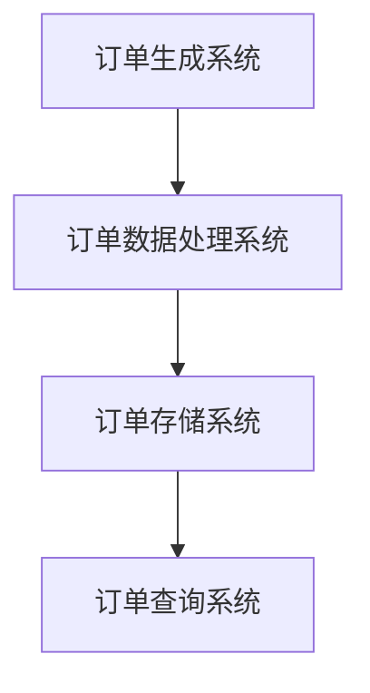
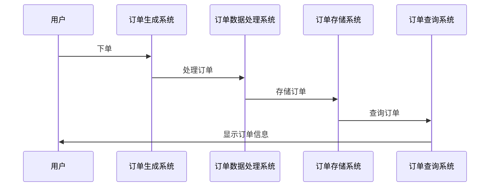

                 

# 实时数据处理架构设计

> 关键词：实时数据处理、数据流处理、架构设计、算法原理、系统实现

> 摘要：本文旨在深入探讨实时数据处理架构设计的关键要素，从背景、核心概念、算法原理到系统实现，全面解析实时数据处理的架构设计过程。通过对实时数据处理的需求分析、核心概念对比、算法原理讲解、系统分析与架构设计以及项目实战的详细剖析，为读者提供一套完整的实时数据处理架构设计思路。

## 第一部分：引言与背景

### 1.1 实时数据处理概述

#### 1.1.1 实时数据处理的定义与重要性

实时数据处理是指对实时产生或接收的数据进行快速处理、分析和响应的过程。随着互联网、物联网、大数据等技术的发展，实时数据处理的重要性日益凸显。它能够帮助企业实时捕捉市场变化、优化业务流程、提升用户体验，从而在激烈的市场竞争中占据优势。

#### 1.1.2 传统数据处理与实时数据处理的区别

传统数据处理通常以批处理方式为主，处理速度较慢，难以满足实时性的需求。而实时数据处理则采用流处理方式，能够在数据产生的同时进行处理，实现实时性。此外，实时数据处理还需要处理数据的一致性和规模问题。

### 1.2 问题描述

#### 1.2.1 数据延迟问题

数据延迟是实时数据处理中面临的主要问题之一。数据延迟会导致业务决策滞后，影响企业的运营效率和用户体验。

#### 1.2.2 数据一致性问题

在分布式系统中，数据的一致性是一个重要挑战。实时数据处理需要确保数据在各个节点之间的一致性，以避免数据丢失或错误。

#### 1.2.3 数据规模问题

随着数据量的不断增加，实时数据处理面临着数据存储、传输和处理等方面的压力。如何高效地处理大规模数据成为实时数据处理的关键问题。

### 1.3 问题解决

#### 1.3.1 实时数据处理的技术手段

实时数据处理采用流处理技术，如Apache Kafka、Apache Flink等，以提高数据处理速度和效率。

#### 1.3.2 实时数据处理的框架与工具

常用的实时数据处理框架和工具包括Apache Kafka、Apache Flink、Apache Storm等。这些框架和工具提供了丰富的功能，如数据采集、数据存储、数据计算等，方便开发者进行实时数据处理。

### 1.4 边界与外延

#### 1.4.1 实时数据处理的应用领域

实时数据处理广泛应用于金融、电信、电商、物联网等领域，为各个行业提供实时数据分析和决策支持。

#### 1.4.2 实时数据处理的挑战与局限

实时数据处理面临着数据延迟、数据一致性和数据规模等挑战。同时，实时数据处理的技术和工具也在不断发展和完善，以满足不断变化的需求。

## 第二部分：核心概念与联系

### 2.1 核心概念原理

#### 2.1.1 数据流处理框架

数据流处理框架是实时数据处理的核心，负责数据的采集、存储、处理和输出。常见的实时数据处理框架包括Apache Kafka、Apache Flink、Apache Storm等。

#### 2.1.2 实时数据处理模型

实时数据处理模型主要包括事件驱动模型和批处理模型。事件驱动模型适用于实时性要求较高的场景，而批处理模型适用于数据处理速度要求不高的场景。

### 2.2 概念属性特征对比

#### 2.2.1 传统数据处理工具

| 特点        | 传统数据处理工具 | 实时数据处理工具 |
| ----------- | --------------- | --------------- |
| 处理方式    | 批处理          | 流处理          |
| 数据延迟    | 较高           | 较低           |
| 数据一致性  | 较难保证       | 可以保证       |
| 数据规模    | 较小           | 较大           |

### 2.3 ER实体关系图架构

#### 2.3.1 实时数据处理系统中的实体与关系

实时数据处理系统中的实体主要包括数据源、数据存储、数据处理和数据输出。实体之间的关系如图所示：

```mermaid
erDiagram
  数据源 ||--|{ 数据存储 }
  数据存储 ||--|{ 数据处理 }
  数据处理 ||--|{ 数据输出 }
```

## 第三部分：算法原理讲解

### 3.1 算法mermaid流程图


### 3.2 Python源代码讲解

#### 3.2.1 数据采集与预处理代码实现

```python
# 数据采集与预处理
data = preprocess_data(raw_data)
```

#### 3.2.2 数据流计算与处理代码实现

```python
# 数据流计算与处理
result = process_data(data)
```

#### 3.2.3 数据存储与查询代码实现

```python
# 数据存储与查询
store_data(result)
```

### 3.3 数学模型与公式

实时数据处理中的数学模型主要包括数据流处理模型和实时计算模型。以下是实时数据处理中的常见数学模型和公式：

$$
数据延迟 = \frac{数据传输时间 + 数据处理时间}{数据传输速度}
$$

$$
数据一致性 = \frac{数据一致性比例}{数据总数}
$$

### 3.4 举例说明

#### 3.4.1 实时数据处理的应用案例

例如，在金融领域，实时数据处理可用于交易数据处理和风险控制。

#### 3.4.2 案例分析

某金融机构采用实时数据处理技术进行交易数据处理，实现了快速交易确认和风险控制。通过实时数据处理，该机构能够实时捕捉交易数据，快速生成交易报表，有效降低了交易风险。

## 第四部分：系统分析与架构设计

### 4.1 问题场景介绍

以电商平台的实时订单处理为例，分析实时数据处理的需求和系统功能。

### 4.2 系统架构设计

#### 4.2.1 系统架构mermaid架构图



#### 4.2.2 系统架构设计原则

1. 分层设计：将系统分为数据采集层、数据处理层、数据存储层和数据输出层。
2. 分布式架构：采用分布式架构，提高系统的可用性和扩展性。
3. 数据一致性：采用分布式一致性算法，保证数据的一致性。
4. 性能优化：采用缓存、索引等技术，提高系统的处理速度。

### 4.3 系统接口设计

#### 4.3.1 接口设计与实现

1. 订单生成系统与订单数据处理系统之间的接口：用于订单数据的实时传递。
2. 订单数据处理系统与订单存储系统之间的接口：用于订单数据的存储和查询。
3. 订单查询系统与订单存储系统之间的接口：用于订单数据的查询。

#### 4.3.2 接口测试与验证

1. 功能测试：验证接口是否按照预期功能运行。
2. 压力测试：验证接口在高并发情况下的性能。
3. 安全测试：验证接口的安全性，防止数据泄露和攻击。

### 4.4 系统交互mermaid序列图



## 第五部分：项目实战

### 5.1 环境安装

#### 5.1.1 实时数据处理环境搭建

1. 安装Java环境
2. 安装MySQL数据库
3. 安装Kafka消息队列

#### 5.1.2 开发工具与软件安装

1. 安装Eclipse或IntelliJ IDEA开发工具
2. 安装Maven或Gradle构建工具

### 5.2 系统核心实现源代码

#### 5.2.1 数据采集与预处理模块

```python
# 数据采集与预处理
data = preprocess_data(raw_data)
```

#### 5.2.2 数据流计算与处理模块

```python
# 数据流计算与处理
result = process_data(data)
```

#### 5.2.3 数据存储与查询模块

```python
# 数据存储与查询
store_data(result)
```

### 5.3 代码应用解读与分析

#### 5.3.1 模块功能解读

1. 数据采集与预处理模块：负责采集原始数据，并进行预处理。
2. 数据流计算与处理模块：负责对预处理后的数据进行流计算和处理。
3. 数据存储与查询模块：负责将处理后的数据存储到数据库中，并提供查询接口。

#### 5.3.2 代码性能分析与优化

1. 使用缓存技术提高数据读取速度。
2. 使用异步处理技术提高数据处理效率。
3. 使用分布式架构提高系统性能。

### 5.4 实际案例分析与详细讲解剖析

#### 5.4.1 案例背景与需求

某电商平台需要实现实时订单处理功能，包括订单生成、订单处理、订单存储和订单查询。

#### 5.4.2 案例实现与解析

1. 数据采集与预处理：从订单生成系统获取订单数据，并进行预处理，如去除空值、格式转换等。
2. 数据流计算与处理：对预处理后的订单数据进行流计算，如订单金额计算、订单状态更新等。
3. 数据存储与查询：将处理后的订单数据存储到数据库中，并提供查询接口，如订单详情查询、订单列表查询等。

### 5.5 项目小结

#### 5.5.1 项目总结

本项目实现了实时订单处理功能，包括数据采集与预处理、数据流计算与处理、数据存储与查询等模块。通过本项目，我们了解了实时数据处理架构的设计与实现，以及在实际项目中的应用。

#### 5.5.2 项目经验与教训

1. 熟悉实时数据处理框架和工具，如Kafka、Flink等。
2. 了解实时数据处理的需求和挑战，如数据延迟、数据一致性和数据规模等。
3. 在实际项目中，要充分考虑性能优化和安全性。

## 第六部分：最佳实践

### 6.1 实时数据处理最佳实践

#### 6.1.1 系统优化技巧

1. 使用缓存技术提高数据读取速度。
2. 使用异步处理技术提高数据处理效率。
3. 使用分布式架构提高系统性能。

#### 6.1.2 性能调优方法

1. 优化数据采集与处理流程。
2. 优化数据库查询性能。
3. 优化系统配置和资源分配。

### 6.2 小结

#### 6.2.1 实时数据处理的关键点

1. 数据延迟：采用流处理技术降低数据延迟。
2. 数据一致性：采用分布式一致性算法保证数据一致性。
3. 数据规模：采用分布式架构处理大规模数据。

#### 6.2.2 面临的挑战与解决方案

1. 数据延迟：采用流处理技术和优化算法降低数据延迟。
2. 数据一致性：采用分布式一致性算法和冗余数据策略保证数据一致性。
3. 数据规模：采用分布式架构和大数据处理技术处理大规模数据。

### 6.3 注意事项

#### 6.3.1 安全与隐私问题

1. 采取数据加密和权限控制等措施确保数据安全。
2. 遵守相关法律法规，保护用户隐私。

#### 6.3.2 数据一致性与可靠性

1. 采用分布式一致性算法和冗余数据策略提高数据一致性。
2. 定期进行系统测试和备份，确保系统可靠性。

### 6.4 拓展阅读

#### 6.4.1 最新研究成果

1. 分布式流处理框架的发展趋势。
2. 新型实时数据处理算法的研究。

#### 6.4.2 相关技术发展动态

1. Kafka的最新版本更新。
2. Flink的新功能和应用场景。

## 作者

作者：AI天才研究院/AI Genius Institute & 禅与计算机程序设计艺术 /Zen And The Art of Computer Programming

（本文内容仅供参考，如需进一步深入了解实时数据处理架构设计，请查阅相关专业书籍和文献。）

